# Part 003 — AMQP 0-9-1 Deep Model: Exchange, Queue, Binding, Routing Key

## 1. Tujuan Part Ini

Part ini membahas **model AMQP 0-9-1** sebagai fondasi RabbitMQ classic messaging. Fokusnya bukan API Java dulu, tetapi **cara broker berpikir saat menerima publish dan menentukan ke mana pesan harus pergi**.

Setelah part ini, kita harus bisa menjawab:

1. ketika producer publish ke exchange tertentu dengan routing key tertentu, **queue mana saja yang menerima pesan**;
2. apa bedanya exchange, queue, binding, routing key, dan binding key;
3. mengapa producer idealnya tidak publish langsung ke queue;
4. bagaimana mendesain routing key dan topology yang tahan evolusi;
5. kapan direct, topic, fanout, headers, default exchange, alternate exchange, dan dead-letter exchange masuk akal;
6. failure mode apa yang muncul saat topology salah.

Dalam kerangka Kaufman, part ini adalah tahap **learn enough to self-correct**. Banyak bug RabbitMQ di production bukan karena Java code salah, tetapi karena mental model routing salah: producer publish ke exchange yang benar tetapi routing key salah, queue belum bind, topology berubah tanpa kontrak, atau satu event dikirim ke terlalu banyak queue tanpa disadari.

---

## 2. AMQP Model dalam Satu Kalimat

AMQP 0-9-1 di RabbitMQ dapat dipahami seperti ini:

> Producer tidak mengirim pesan ke consumer. Producer publish pesan ke exchange. Exchange mengevaluasi binding. Binding menentukan queue mana yang menerima salinan pesan. Consumer mengambil delivery dari queue.

Model dasarnya:

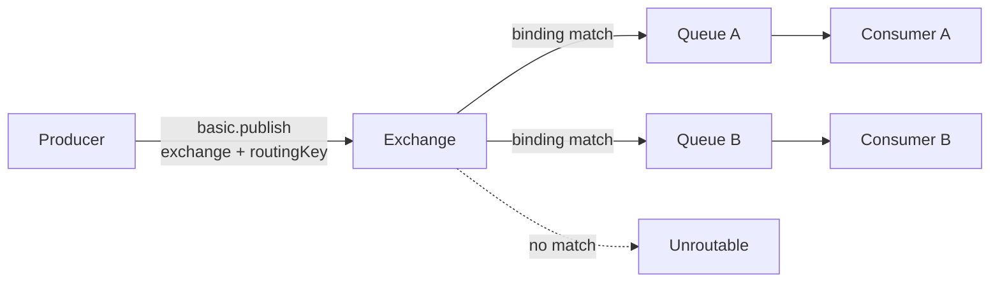

Implikasi penting:

- producer tidak perlu tahu berapa consumer yang ada;
- consumer tidak perlu tahu siapa producer-nya;
- exchange adalah **routing table aktif**;
- queue adalah **buffer + delivery state**;
- binding adalah **rule** yang menghubungkan exchange ke queue;
- routing key adalah **label pada publish** yang dipakai exchange untuk routing;
- satu message publish bisa masuk ke nol, satu, atau banyak queue tergantung exchange dan binding.

---

## 3. Deconstruction: Komponen AMQP yang Wajib Dikuasai

Kita pecah model ini menjadi elemen-elemen kecil.

| Elemen | Fungsi | Ownership ideal | Pertanyaan desain |
|---|---|---|---|
| Exchange | Menerima publish dan merutekan pesan | Platform/domain team | “Apa domain routing surface-nya?” |
| Queue | Menyimpan pesan sampai dikonsumsi | Consumer team | “Siapa pemilik backlog dan delivery semantics?” |
| Binding | Menghubungkan exchange ke queue | Biasanya consumer/topology owner | “Pesan mana yang ingin diterima queue ini?” |
| Routing key | Label publish untuk routing | Producer contract owner | “Apa dimensi routing yang stabil?” |
| Binding key/pattern | Pattern matching terhadap routing key | Consumer/topology owner | “Apa subset pesan yang dibutuhkan consumer?” |
| Message properties | Metadata protokol/per-message | Producer + platform standard | “Bagaimana traceability dan compatibility dijaga?” |
| Headers | Metadata tambahan dan headers-exchange selector | Producer + consumer contract | “Apakah ini metadata atau domain data?” |

Kunci top-tier: jangan menganggap elemen di atas sebagai konfigurasi teknis semata. Setiap elemen adalah **kontrak arsitektur**.

---

## 4. Exchange: Routing Table, Bukan Storage

Exchange adalah objek broker yang menerima publish. Exchange tidak menyimpan pesan seperti queue. Ia mengevaluasi routing rules dan mengirim salinan message ke queue yang cocok.

### 4.1 Exchange declaration properties

Beberapa properti umum:

| Properti | Makna | Catatan production |
|---|---|---|
| `name` | Nama exchange | Harus stabil dan governed |
| `type` | `direct`, `topic`, `fanout`, `headers`, plugin-defined | Menentukan algoritma routing |
| `durable` | Exchange survive broker restart | Hampir selalu `true` di production |
| `autoDelete` | Dihapus saat tidak digunakan lagi | Hindari untuk topology production stabil |
| `internal` | Tidak bisa dipublish langsung oleh client | Berguna untuk exchange-to-exchange atau routing internal |
| `arguments` | Optional extension args | Contoh: alternate exchange |

### 4.2 Exchange sebagai boundary ownership

Exchange sebaiknya dimiliki oleh konsep yang relatif stabil:

- domain event surface: `ex.domain.order.events`;
- command ingress: `ex.order.commands`;
- integration boundary: `ex.partner.billing.inbound`;
- notification fanout: `ex.notification.events`.

Hindari exchange yang terlalu implementation-specific:

- `ex.order-service-v2-worker-a`;
- `ex.temp-test`;
- `ex.created-by-team-x-for-feature-y`.

Nama seperti itu membuat topology ikut berubah setiap service refactor.

---

## 5. Queue: Storage, Backlog, dan Delivery State

Queue menyimpan pesan sampai broker mengirim delivery ke consumer dan pesan itu dianggap selesai berdasarkan acknowledgement mode.

### 5.1 Queue declaration properties

| Properti | Makna | Catatan production |
|---|---|---|
| `name` | Nama queue | Queue durable sebaiknya bernama eksplisit |
| `durable` | Queue survive broker restart | Wajib untuk queue business-critical |
| `exclusive` | Hanya connection saat ini yang bisa memakai queue | Cocok untuk reply queue ephemeral, bukan workload shared |
| `autoDelete` | Queue dihapus ketika consumer terakhir hilang | Cocok untuk temporary subscription, bukan backlog penting |
| `arguments` | Queue-specific behavior | DLX, TTL, quorum, max length, priority, etc. |

### 5.2 Queue bukan “consumer”

Satu queue bisa punya banyak consumer. Dalam pola competing consumers, tiap message biasanya dikirim ke salah satu consumer, bukan semua consumer.

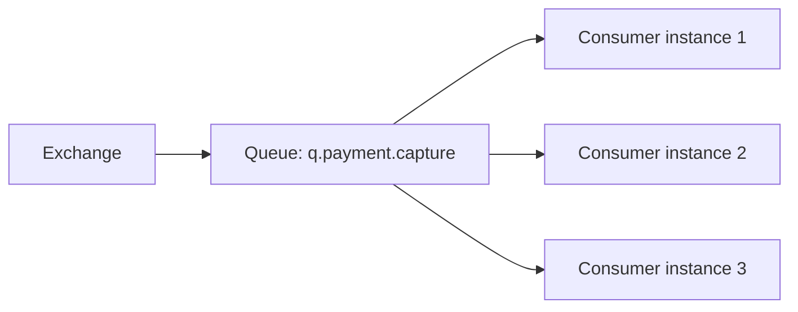

Artinya:

- queue adalah unit backlog;
- consumer instance adalah unit capacity;
- menambah consumer pada queue yang sama meningkatkan processing capacity, bukan membuat fanout;
- untuk fanout antar service, buat queue berbeda per subscriber.

### 5.3 Queue ownership rule

Rule praktis:

> Queue dimiliki oleh consumer, bukan producer.

Producer publish event/command ke exchange. Consumer/subscriber mendeklarasikan queue dan binding yang menyatakan minatnya.

Mengapa ini penting?

- producer tidak perlu berubah saat subscriber baru muncul;
- consumer bisa mengatur DLQ, TTL, prefetch, quorum/classic, dan retry sendiri;
- ownership backlog jelas saat queue menumpuk;
- deletion/migration queue tidak memutus producer contract.

---

## 6. Binding: Edge dalam Routing Graph

Binding adalah edge dari exchange ke queue atau dari exchange ke exchange.

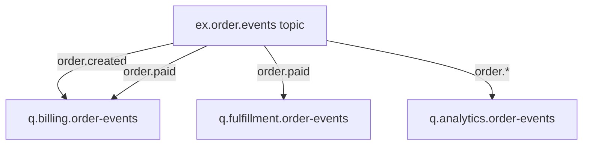

Di graph ini:

- `q.billing.order-events` menerima `order.created` dan `order.paid`;
- `q.fulfillment.order-events` hanya menerima `order.paid`;
- `q.analytics.order-events` menerima semua event dengan pattern `order.*`.

Binding adalah tempat consumer menyatakan:

> “Queue ini tertarik pada subset pesan ini.”

### 6.1 Binding key vs routing key

Sering rancu:

| Istilah | Dipakai oleh | Makna |
|---|---|---|
| Routing key | Producer saat publish | Label pesan |
| Binding key/pattern | Queue saat bind ke exchange | Selector/rule |

Pada direct exchange, binding key harus sama persis dengan routing key. Pada topic exchange, binding key adalah pattern.

---

## 7. Routing Key: Nama Teknis atau Bahasa Domain?

Routing key adalah salah satu kontrak paling penting. Ia bukan sekadar string.

Routing key yang baik:

- stabil terhadap refactor service;
- bisa dipahami lintas tim;
- cukup spesifik untuk routing;
- tidak terlalu banyak mengandung data volatile;
- tidak membocorkan detail internal;
- kompatibel dengan binding pattern.

### 7.1 Pola routing key yang baik

Untuk domain event:

```text
<domain>.<entity>.<event>
```

Contoh:

```text
commerce.order.created
commerce.order.paid
commerce.order.cancelled
commerce.quote.approved
```

Untuk command:

```text
<domain>.<capability>.<command>
```

Contoh:

```text
billing.invoice.issue
fulfillment.shipment.allocate
risk.case.escalate
```

Untuk integration boundary:

```text
<source>.<domain>.<signal>
```

Contoh:

```text
sap.customer.updated
partner-x.claim.submitted
payment-gateway.capture.succeeded
```

### 7.2 Routing key yang buruk

```text
service-a.event
new-data
payload-v2
order
important
high
user-123456
```

Masalahnya:

- terlalu umum;
- sulit dipakai binding pattern;
- mencampur priority dengan domain event;
- memakai entity id sebagai routing dimension tanpa alasan kuat;
- versioning di routing key sering membuat subscriber migrasi lebih sulit.

### 7.3 Apakah tenant masuk routing key?

Tergantung requirement.

Tenant dalam routing key berguna jika:

- tenant tertentu harus diisolasi backlog-nya;
- ada routing berbeda per tenant;
- ada compliance boundary;
- ada noisy-neighbor concern;
- ada dedicated consumer untuk tenant enterprise.

Contoh:

```text
tenant.acme.commerce.order.created
```

Tetapi ini bisa membuat binding explosion. Alternatifnya tenant ada di header/payload, lalu queue dipisah berdasarkan policy/consumer, bukan routing key.

Decision rule:

| Tenant requirement | Letak tenant |
|---|---|
| Hanya metadata bisnis | Payload/header |
| Per-tenant filtering ringan | Header atau topic key |
| Per-tenant isolation backlog | Queue per tenant atau shard group |
| Per-tenant compliance boundary | Vhost/exchange/queue isolation |

---

## 8. Exchange Types

RabbitMQ menyediakan beberapa exchange type utama. Yang paling sering dipakai: direct, topic, fanout, headers.

---

## 9. Direct Exchange

Direct exchange mencocokkan routing key dengan binding key secara exact match.

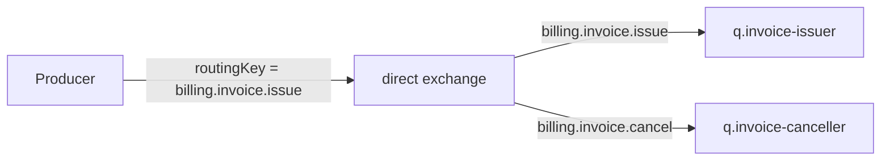

### 9.1 Cocok untuk

- command routing;
- task category yang jelas;
- exact event subscription;
- routing key finite dan governed;
- DLX target routing yang eksplisit.

### 9.2 Contoh Java topology declaration

```java
channel.exchangeDeclare("ex.billing.commands", BuiltinExchangeType.DIRECT, true);
channel.queueDeclare("q.billing.invoice-issue", true, false, false, Map.of(
    "x-dead-letter-exchange", "ex.billing.dlx",
    "x-dead-letter-routing-key", "billing.invoice.issue.failed"
));
channel.queueBind(
    "q.billing.invoice-issue",
    "ex.billing.commands",
    "billing.invoice.issue"
);
```

### 9.3 Invariant

> Direct exchange bagus ketika routing decision adalah equality, bukan taxonomy matching.

Jika butuh subscriber menerima banyak event dengan pattern seperti `order.*`, direct exchange akan memaksa banyak binding manual. Itu masih valid, tetapi topic exchange biasanya lebih natural.

---

## 10. Topic Exchange

Topic exchange mencocokkan routing key dengan pattern. Routing key biasanya terdiri dari word yang dipisahkan titik.

Wildcard umum:

| Wildcard | Makna |
|---|---|
| `*` | satu word |
| `#` | nol atau lebih word |

Contoh:

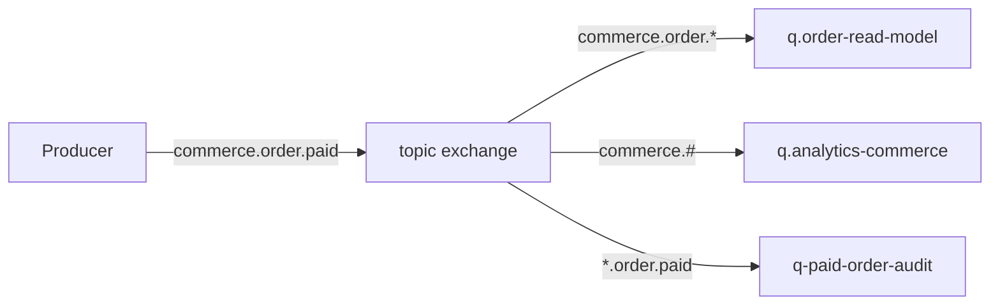

Jika producer publish `commerce.order.paid`:

- `commerce.order.*` match;
- `commerce.#` match;
- `*.order.paid` match.

### 10.1 Cocok untuk

- domain events;
- event notification;
- multi-subscriber systems;
- selective subscription;
- taxonomy yang stabil.

### 10.2 Topic taxonomy design

Routing key topic harus didesain seperti API. Contoh struktur:

```text
<bounded-context>.<aggregate>.<event>
```

Contoh:

```text
commerce.order.created
commerce.order.paid
commerce.quote.approved
risk.case.escalated
```

Subscriber bisa bind:

```text
commerce.order.*
commerce.#
*.case.escalated
```

### 10.3 Kesalahan umum topic exchange

#### Kesalahan 1: routing key terlalu detail

```text
commerce.order.created.us-east.enterprise.tenant-acme.priority-high.v2
```

Ini membuat taxonomy rapuh. Semakin banyak dimensi, semakin besar kemungkinan subscriber membuat binding yang salah.

#### Kesalahan 2: routing key berisi data payload

```text
commerce.order.created.customer-991828.status-paid.amount-1000
```

Routing key bukan query language. Jika consumer butuh filter kompleks, lakukan di application layer atau desain queue khusus.

#### Kesalahan 3: wildcard terlalu luas

```text
#
commerce.#
```

Binding `#` sangat mudah membuat queue menerima lebih banyak pesan dari kapasitasnya. Untuk analytics mungkin valid, tetapi harus eksplisit dan dimonitor.

---

## 11. Fanout Exchange

Fanout exchange mengirim pesan ke semua queue yang bind ke exchange, mengabaikan routing key.

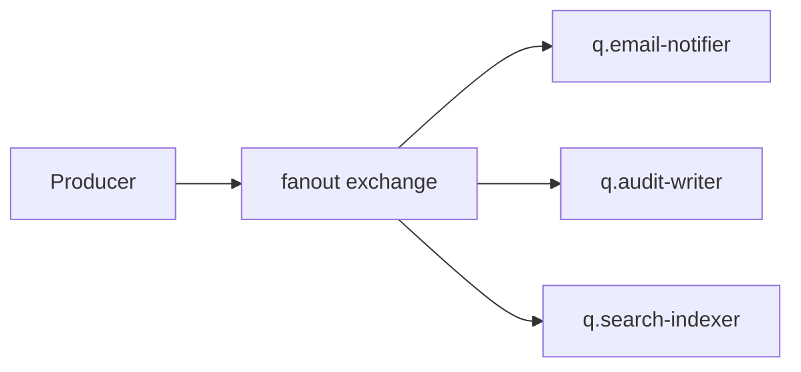

### 11.1 Cocok untuk

- broadcast notification;
- simple pub/sub;
- topology kecil;
- semua subscriber memang harus menerima semua pesan.

### 11.2 Risiko fanout

Fanout terlihat sederhana, tetapi bisa menjadi mahal:

- setiap queue menerima copy pesan;
- satu publish bisa menjadi banyak write;
- subscriber baru meningkatkan broker work;
- sulit melakukan selective subscription;
- producer tidak tahu blast radius.

Design rule:

> Gunakan fanout ketika “semua subscriber menerima semua message” adalah requirement eksplisit, bukan karena malas mendesain routing key.

---

## 12. Headers Exchange

Headers exchange merutekan berdasarkan headers message, bukan routing key. Binding memakai arguments seperti `x-match=all` atau `x-match=any`.

Contoh konseptual:

```java
Map<String, Object> args = new HashMap<>();
args.put("x-match", "all");
args.put("eventType", "OrderPaid");
args.put("region", "APAC");

channel.queueBind("q.apac-paid-orders", "ex.order.headers", "", args);
```

### 12.1 Cocok untuk

- selector multi-atribut yang tidak cocok dengan topic key;
- integrasi legacy;
- routing berdasarkan metadata orthogonal;
- routing sementara saat migrasi.

### 12.2 Trade-off

Headers exchange sering lebih sulit di-govern:

- headers tidak selalu terlihat sebagai topology taxonomy;
- producer bisa mengubah header tanpa menyadari efek routing;
- sulit membuat naming convention yang disiplin;
- observability routing lebih sulit daripada topic.

Rule praktis:

> Pakai topic exchange untuk taxonomy domain yang stabil. Pakai headers exchange hanya jika routing memang multi-dimensional dan tidak cocok direpresentasikan sebagai dot-separated key.

---

## 13. Default Exchange

Default exchange adalah direct exchange tanpa nama eksplisit. Queue yang dideklarasikan otomatis bind ke default exchange dengan queue name sebagai routing key.

Secara konseptual:

```text
exchange = ""
routingKey = queueName
```

### 13.1 Kapan berguna

- tutorial;
- simple internal tool;
- reply queue ephemeral;
- test harness.

### 13.2 Mengapa jarang ideal untuk production architecture

Publish langsung ke queue name membuat producer tahu nama queue consumer. Ini melanggar decoupling.

Buruk:

```java
channel.basicPublish("", "q.payment-capture-worker", props, body);
```

Lebih baik:

```java
channel.basicPublish("ex.payment.commands", "payment.capture.authorize", props, body);
```

Default exchange tidak salah secara teknis. Yang salah adalah memakainya untuk membuat producer tergantung pada queue implementation detail.

---

## 14. Alternate Exchange

Alternate exchange menerima pesan yang tidak bisa dirutekan dari exchange utama. Ini berbeda dengan dead-letter exchange.

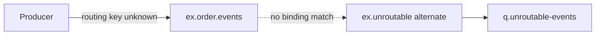

### 14.1 Kapan dipakai

- mendeteksi routing key typo;
- menangkap event versi baru yang belum punya subscriber;
- audit unroutable publish;
- safety net untuk mandatory publish strategy.

### 14.2 Alternate exchange vs mandatory flag

| Mechanism | Signal ke producer? | Message masuk queue? | Cocok untuk |
|---|---:|---:|---|
| `mandatory=true` + return listener | Ya | Tidak, kecuali ada route | Producer-side correctness |
| Alternate exchange | Tidak langsung | Ya, jika alternate punya binding | Broker-side capture |

Keduanya bisa dipakai bersama, tetapi harus jelas siapa yang bertanggung jawab menindaklanjuti unroutable message.

---

## 15. Dead-Letter Exchange Bukan Exchange Type Khusus

Dead-letter exchange adalah exchange biasa yang dipakai sebagai target ketika message dead-lettered dari queue.

Message bisa dead-lettered karena beberapa kondisi seperti reject/nack tanpa requeue, TTL expiry, queue length limit, atau alasan lain sesuai jenis queue dan konfigurasi.

Topology umum:

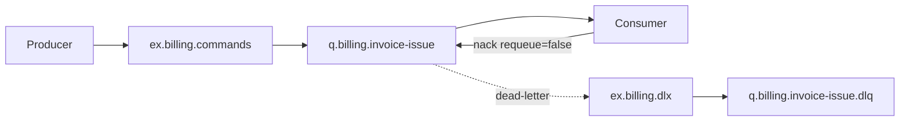

Catatan desain:

- DLX bukan tempat semua error dicampur tanpa metadata;
- DLQ harus punya ownership, retention, alert, dan replay policy;
- routing key DLX sebaiknya eksplisit;
- jangan membuat retry loop tanpa batas.

Retry/DLQ dibahas lebih dalam di Part 013.

---

## 16. Routing Decision Matrix

Gunakan matrix ini saat memilih exchange type.

| Requirement | Exchange type yang cocok | Alasan |
|---|---|---|
| Satu command ke satu kategori worker | Direct | Exact route |
| Domain events dengan selective subscriber | Topic | Pattern subscription |
| Broadcast semua pesan ke semua queue | Fanout | Routing key irrelevant |
| Routing berdasarkan kombinasi headers | Headers | Multi-attribute selector |
| Safety net unroutable messages | Alternate exchange | Capture no-route |
| Error sink/retry routing | DLX using direct/topic | Explicit failure routing |
| Temporary direct-to-reply queue | Default exchange | Queue-name routing is acceptable |

---

## 17. Topology as Graph

RabbitMQ topology sebaiknya digambar sebagai graph, bukan daftar konfigurasi.

Contoh topology order domain:

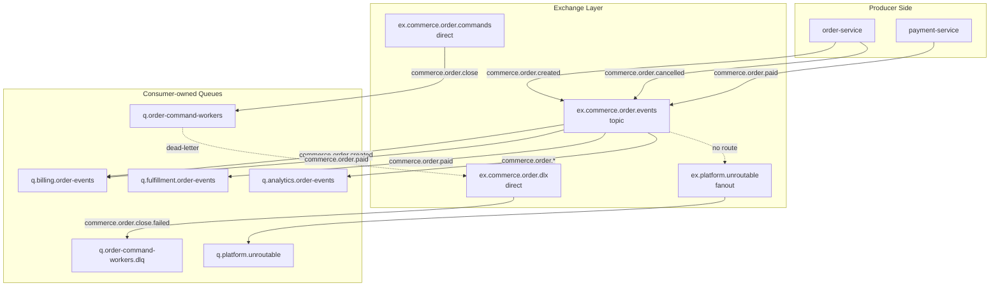

Pertanyaan review:

1. Queue mana yang punya backlog business-critical?
2. Queue mana yang consumer-owned?
3. Exchange mana yang public contract?
4. Binding mana yang terlalu luas?
5. Apa yang terjadi jika routing key baru muncul?
6. Apa yang terjadi jika consumer mati 2 jam?
7. Apakah DLQ punya owner?
8. Apakah producer akan tahu jika pesan unroutable?

---

## 18. Producer Should Not Depend on Consumer Implementation

Ini adalah invariant arsitektur paling penting di AMQP.

### 18.1 Coupled design

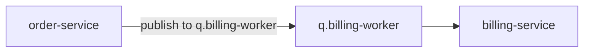

Masalah:

- producer tahu nama queue billing;
- billing tidak bisa rename queue tanpa koordinasi;
- subscriber baru butuh producer change;
- queue lifecycle menjadi shared ownership;
- topology terlihat simpel tetapi coupling tinggi.

### 18.2 Decoupled design

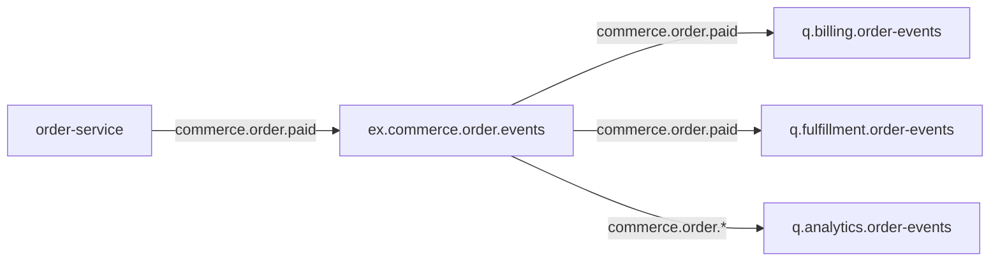

Keuntungan:

- producer hanya tahu event contract;
- consumer bisa menambah queue tanpa mengubah producer;
- backlog dimiliki per consumer;
- fanout natural;
- routing contract bisa di-govern.

---

## 19. Naming Convention

Naming bukan kosmetik. Naming menentukan kemampuan operasi saat incident.

### 19.1 Exchange naming

```text
ex.<bounded-context>.<purpose>
```

Contoh:

```text
ex.commerce.order.events
ex.commerce.order.commands
ex.commerce.order.dlx
ex.platform.unroutable
```

### 19.2 Queue naming

```text
q.<consumer-or-capability>.<source-or-purpose>
```

Contoh:

```text
q.billing.order-events
q.fulfillment.order-paid
q.analytics.commerce-events
q.billing.invoice-issue.dlq
```

### 19.3 Routing key naming

```text
<bounded-context>.<aggregate>.<event-or-command>
```

Contoh:

```text
commerce.order.created
commerce.order.paid
billing.invoice.issue
risk.case.escalate
```

### 19.4 Anti-pattern naming

```text
q.test
q.worker
q.v2
q.new
ex.main
ex.events
routing.key = data
```

Saat incident, nama seperti ini membuat pertanyaan sederhana menjadi sulit:

- pesan ini milik domain apa?
- consumer mana owner-nya?
- apakah queue ini aman dihapus?
- routing key ini event atau command?
- DLQ ini untuk workflow mana?

---

## 20. Durable Topology: Apa yang Survive Restart?

Ada tiga hal yang sering dicampur:

| Konsep | Objek | Makna |
|---|---|---|
| Durable exchange | Exchange | Exchange tetap ada setelah broker restart |
| Durable queue | Queue | Queue tetap ada setelah broker restart |
| Persistent message | Message | Message ditulis agar dapat survive restart sesuai durability semantics |

Untuk pesan business-critical, ketiganya biasanya harus selaras:

- exchange durable;
- queue durable;
- message persistent;
- publisher confirms aktif;
- queue type sesuai reliability requirement, misalnya quorum queue untuk data safety lebih kuat.

Kesalahan umum:

> “Queue saya durable, berarti message aman.”

Tidak cukup. Message juga harus dipublish sebagai persistent, dan producer perlu publisher confirm untuk tahu broker sudah menerima tanggung jawab.

Reliability detail akan dibahas di Part 012 dan Part 015.

---

## 21. Queue Arguments sebagai Contract

Queue arguments memengaruhi runtime behavior. Jangan treat sebagai detail infra yang bebas berubah tanpa review.

Contoh arguments penting:

| Argument | Fungsi | Risiko |
|---|---|---|
| `x-dead-letter-exchange` | Target DLX | Salah target membuat error hilang |
| `x-dead-letter-routing-key` | Routing key saat dead-letter | Salah key membuat DLQ kosong/unroutable |
| `x-message-ttl` | TTL pesan di queue | Pesan bisa expire sebelum diproses |
| `x-max-length` | Batas panjang queue | Pesan lama bisa drop/dead-letter |
| `x-queue-type` | classic/quorum/stream tergantung context | Mengubah semantics dan performance |
| `x-single-active-consumer` | Satu consumer aktif | Membatasi parallelism demi ordering |
| `x-max-priority` | Priority queue | Ada cost dan ordering trade-off |

Rule:

> Queue arguments adalah bagian dari runtime semantics. Dokumentasikan seperti API contract.

---

## 22. Topology Declaration Strategy

Ada beberapa pendekatan untuk mendeklarasikan topology.

### 22.1 Application declares topology on startup

Keuntungan:

- local dev mudah;
- service self-contained;
- deployment sederhana;
- cocok untuk consumer-owned queues.

Risiko:

- banyak service bisa race declare topology;
- argument mismatch menyebabkan error;
- sulit governance lintas tim;
- service punya permission terlalu luas.

### 22.2 Infrastructure/operator declares topology

Keuntungan:

- governance kuat;
- permission lebih ketat;
- cocok untuk shared exchange;
- bisa review via GitOps.

Risiko:

- feedback loop lebih lambat;
- local dev butuh bootstrap;
- consumer onboarding lebih berat.

### 22.3 Hybrid strategy

Praktis untuk banyak organisasi:

| Topology object | Owner/declaration |
|---|---|
| Shared domain exchange | Platform/domain infra |
| Consumer-owned queue | Consumer service atau topology repo |
| Binding | Consumer service/topology repo |
| DLX convention | Platform standard |
| Temporary reply queue | Application runtime |

---

## 23. Passive Declare dan Topology Validation

Dalam production service, kadang kita tidak ingin service membuat topology, tetapi ingin memvalidasi topology ada.

Pattern:

- startup check melakukan passive declare untuk exchange/queue penting;
- jika topology tidak sesuai, service fail fast;
- readiness probe tidak hijau jika topology dependency tidak valid;
- deployment pipeline menjalankan topology migration sebelum service rollout.

Pseudo-flow:

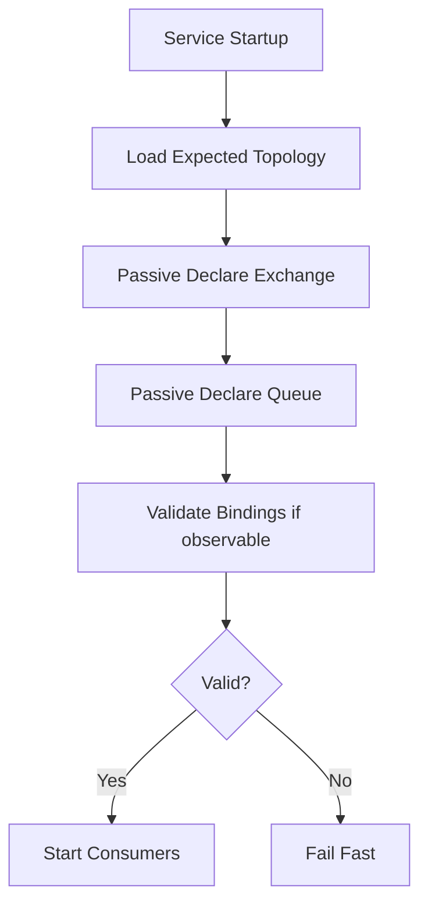

Fail fast lebih baik daripada service hidup tetapi semua publish unroutable atau semua consumer membaca queue yang salah.

---

## 24. Routing Test: Unit Test untuk Topology

Topology bisa dites sebagai data.

Contoh representasi:

```java
record BindingRule(
    String exchange,
    String exchangeType,
    String queue,
    String bindingKey
) {}

record PublishCase(
    String exchange,
    String routingKey,
    Set<String> expectedQueues
) {}
```

Test matrix:

```java
@Test
void orderPaidShouldReachBillingFulfillmentAndAnalytics() {
    var topology = Topology.topicExchange("ex.commerce.order.events")
        .bind("q.billing.order-events", "commerce.order.created")
        .bind("q.billing.order-events", "commerce.order.paid")
        .bind("q.fulfillment.order-events", "commerce.order.paid")
        .bind("q.analytics.order-events", "commerce.order.*");

    assertThat(topology.route("commerce.order.paid"))
        .containsExactlyInAnyOrder(
            "q.billing.order-events",
            "q.fulfillment.order-events",
            "q.analytics.order-events"
        );
}
```

Manfaat:

- menangkap routing key typo sebelum deploy;
- menjadikan binding sebagai reviewed contract;
- memaksa domain taxonomy jelas;
- bisa dipakai untuk generate diagram/dokumentasi.

---

## 25. Message Copy Semantics

Saat exchange merutekan message ke beberapa queue, masing-masing queue menerima logical copy.

Implikasi:

- ack di satu queue tidak menghapus message di queue lain;
- consumer lambat di satu subscriber tidak langsung memblok subscriber lain;
- backlog per subscriber independen;
- storage cost meningkat sesuai jumlah queue yang menerima message;
- event fanout harus memperhitungkan multiplicative write cost.

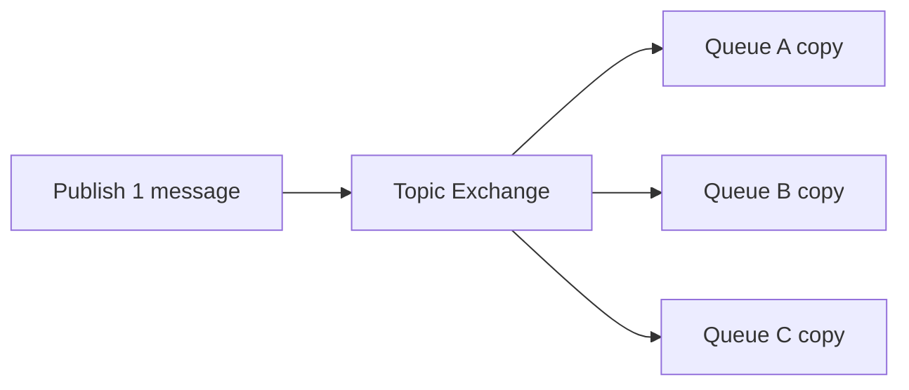

Rule:

> Fanout bukan gratis. Satu event populer dengan sepuluh subscriber berarti sepuluh queue backlog dan sepuluh delivery lifecycles.

---

## 26. Message Lifecycle dalam AMQP Routing

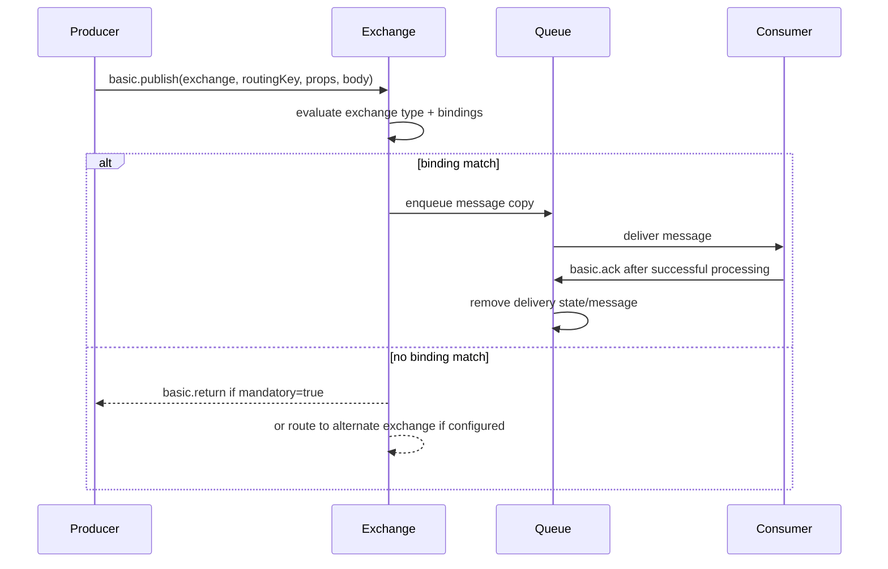

Hal yang perlu diperhatikan:

- routing terjadi sebelum consumer terlibat;
- consumer ack tidak membuktikan publish berhasil, hanya processing delivery tersebut selesai;
- publisher confirm tidak membuktikan business processing selesai, hanya broker menerima tanggung jawab;
- mandatory return tidak sama dengan publish failure; itu adalah routing failure.

---

## 27. Unroutable Message Semantics

Message bisa menjadi unroutable jika exchange ada, tetapi tidak ada binding yang cocok.

Tiga strategi umum:

### 27.1 Ignore unroutable

Producer publish tanpa `mandatory`, exchange tidak punya alternate exchange, dan tidak ada route.

Hasil: message drop oleh broker.

Ini hanya aman untuk telemetry atau best-effort notification yang memang boleh hilang.

### 27.2 Mandatory publish

Producer set `mandatory=true` dan register return listener.

Hasil: broker mengembalikan message ke producer jika tidak routable.

Cocok untuk command dan business event penting.

### 27.3 Alternate exchange

Exchange utama punya alternate exchange. Unroutable message diarahkan ke alternate exchange.

Cocok untuk audit dan operational capture.

Decision:

| Message type | Strategy |
|---|---|
| Critical command | mandatory + alert/fail publish flow |
| Critical domain event | mandatory atau alternate exchange + alert |
| Analytics event | alternate exchange atau drop dengan metric |
| Debug/telemetry | boleh best effort jika eksplisit |

---

## 28. Exchange-to-Exchange Binding

RabbitMQ mendukung exchange-to-exchange binding. Ini memungkinkan routing graph lebih modular.

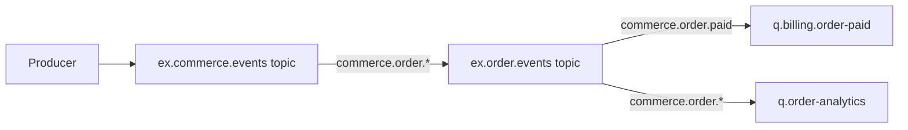

Kapan berguna:

- memisahkan public domain event surface dari internal routing;
- federated topology;
- migration dari exchange lama ke baru;
- central audit routing;
- tenant/region routing layer.

Risiko:

- graph sulit dipahami jika terlalu dalam;
- debugging route lebih sulit;
- loop harus dihindari;
- governance wajib lebih ketat.

Rule:

> Exchange-to-exchange binding adalah alat arsitektur, bukan default. Pakai saat ada boundary jelas.

---

## 29. Topology Evolution

RabbitMQ topology akan berubah. Desain yang baik memudahkan perubahan tanpa downtime.

### 29.1 Menambah subscriber baru

Aman jika:

- producer publish ke exchange domain;
- subscriber membuat queue baru;
- subscriber bind ke routing key/pattern yang sudah ada;
- tidak perlu producer deployment.

### 29.2 Menambah event baru

Aman jika:

- routing key taxonomy stabil;
- subscriber wildcard tidak terlalu luas tanpa kapasitas;
- schema versioning jelas;
- alternate exchange menangkap routing mistake.

### 29.3 Rename routing key

Ini breaking change. Lakukan sebagai migration:

1. publish old + new routing key sementara;
2. consumer bind ke old + new;
3. observe traffic;
4. remove old binding;
5. stop old publish.

### 29.4 Split queue

Misalnya `q.billing.order-events` terlalu besar dan perlu dipisah:

- buat queue baru `q.billing.order-paid`;
- bind ke `commerce.order.paid`;
- consumer baru mulai dari queue baru;
- drain queue lama;
- remove binding lama.

Queue split tidak mengubah producer jika producer tidak publish langsung ke queue.

---

## 30. Pattern: Command Topology

Command biasanya menggunakan direct exchange.

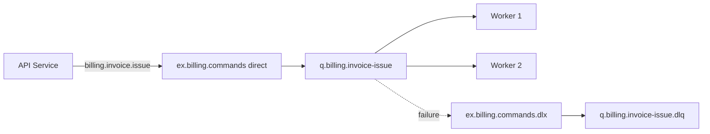

Design notes:

- one command routing key per command intent;
- one queue per command handler capability;
- multiple consumers for scaling;
- manual ack after transaction commit;
- DLQ per command class or per capability;
- mandatory publish enabled;
- idempotency required.

---

## 31. Pattern: Event Notification Topology

Event notification biasanya menggunakan topic exchange.

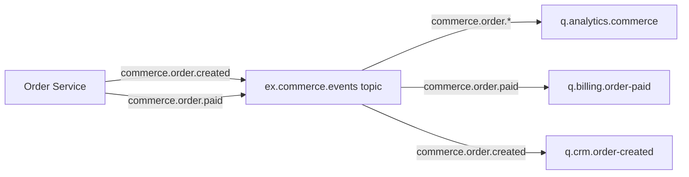

Design notes:

- event name should be past tense;
- subscriber queue per service/capability;
- wildcard reviewed carefully;
- no assumption that event processing is immediate;
- event payload should be schema-versioned;
- late subscriber cannot replay old classic queue events unless stream/event store exists.

---

## 32. Pattern: Audit/Compliance Routing

Untuk compliance, kita sering butuh copy semua business events ke audit sink.

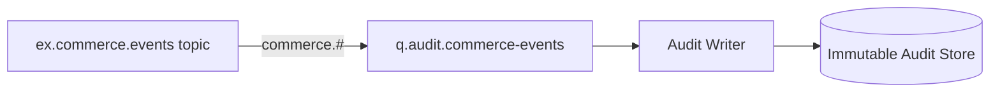

Pertanyaan penting:

- apakah audit queue memakai quorum queue?
- apakah audit consumer idempotent?
- apakah message body boleh berisi PII?
- apakah audit store punya retention legal?
- apakah audit queue backlog punya alert lebih ketat?
- apakah wildcard `commerce.#` akan overload saat domain tumbuh?

---

## 33. Pattern: Multi-Region Routing

Routing key bisa menyertakan region jika region adalah routing dimension.

```text
apac.commerce.order.created
emea.commerce.order.created
amer.commerce.order.created
```

Binding:

```text
apac.commerce.#
*.commerce.order.created
```

Namun region di routing key harus dipakai hati-hati. Jika region hanya deployment metadata, lebih baik gunakan exchange/vhost/cluster separation atau header.

Decision:

| Need | Better option |
|---|---|
| Region-specific consumers | Region in routing key or exchange per region |
| Data residency hard boundary | Separate vhost/cluster/region |
| Observability only | Header/trace attribute |
| Failover routing | Infrastructure-level routing, not ad-hoc key mutation |

---

## 34. Pattern: Priority Routing

Jangan langsung memakai priority queue untuk semua hal. Alternatif sering lebih jelas:

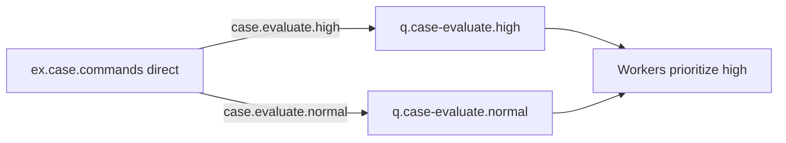

Pilihan:

| Strategy | Kapan cocok |
|---|---|
| Separate queues | Priority class sedikit dan jelas |
| Priority queue | Banyak priority level, consumer tunggal/terkontrol |
| Consumer priority | Prefer consumer tertentu saat aktif |
| Application scheduler | Priority logic kompleks |

Separate queue sering lebih operable daripada satu priority queue besar karena backlog, DLQ, dan alert lebih jelas.

---

## 35. Anti-Patterns yang Harus Dikenali

### 35.1 Exchange sebagai “folder pesan”

Exchange bukan folder. Exchange tidak menyimpan backlog. Jika tidak ada queue binding, tidak ada backlog.

### 35.2 Queue-per-message-type tanpa subscriber ownership

Membuat queue untuk setiap event type secara global sering membuat ownership kabur. Lebih baik queue per subscriber/capability dengan binding yang jelas.

### 35.3 Wildcard `#` sebagai default subscriber

`#` bisa valid untuk audit atau analytics, tetapi harus dianggap high-risk. Queue itu akan menerima semua event sekarang dan masa depan.

### 35.4 Producer declare semua queue consumer

Producer sebaiknya declare exchange yang ia publish, bukan semua queue subscriber. Queue consumer adalah ownership consumer.

### 35.5 Routing key sebagai payload query

Jika routing decision butuh banyak field dan operator kompleks, routing key bukan alat yang tepat. Pertimbangkan application-level filtering, stream processing, atau desain event terpisah.

### 35.6 Topology tanpa test

Routing graph yang tidak dites akan rusak oleh typo. Minimal punya topology smoke test dan integration test publish-consume.

---

## 36. Production Checklist

Sebelum topology masuk production, jawab ini:

### Exchange

- [ ] Apakah exchange name stabil dan domain-oriented?
- [ ] Apakah exchange durable?
- [ ] Apakah exchange type cocok dengan routing semantics?
- [ ] Apakah alternate exchange dibutuhkan?
- [ ] Apakah exchange ini public contract atau internal?

### Queue

- [ ] Siapa owner queue?
- [ ] Apakah queue durable?
- [ ] Apakah queue type sesuai reliability/performance requirement?
- [ ] Apakah DLX/DLQ dikonfigurasi?
- [ ] Apakah TTL/max length sengaja dipilih?
- [ ] Apakah queue punya alert backlog?

### Binding

- [ ] Apakah binding terlalu luas?
- [ ] Apakah binding pattern dites?
- [ ] Apakah subscriber sadar terhadap future events yang mungkin match?
- [ ] Apakah binding bisa dimigrasikan tanpa producer change?

### Routing Key

- [ ] Apakah routing key domain-oriented?
- [ ] Apakah taxonomy terdokumentasi?
- [ ] Apakah tidak mencampur volatile data?
- [ ] Apakah naming command dan event dibedakan?

### Operations

- [ ] Apakah unroutable messages terlihat?
- [ ] Apakah topology bisa direkonstruksi dari Git/config?
- [ ] Apakah dashboard menunjukkan queue depth, publish rate, deliver rate, ack rate, redelivery, DLQ?
- [ ] Apakah ada runbook routing failure?

---

## 37. Practice: Latihan 90 Menit

Latihan ini dirancang untuk membangun self-correction cepat.

### 37.1 Buat topology graph

Buat domain sederhana:

- order service publish:
  - `commerce.order.created`
  - `commerce.order.paid`
  - `commerce.order.cancelled`
- billing butuh created dan paid;
- fulfillment hanya butuh paid;
- analytics butuh semua order events;
- audit butuh semua commerce events;
- unknown/unroutable harus masuk capture queue.

Gambar dengan Mermaid.

### 37.2 Buat routing matrix

| Publish routing key | Billing | Fulfillment | Analytics | Audit | Unroutable |
|---|---:|---:|---:|---:|---:|
| `commerce.order.created` | ? | ? | ? | ? | ? |
| `commerce.order.paid` | ? | ? | ? | ? | ? |
| `commerce.order.cancelled` | ? | ? | ? | ? | ? |
| `commerce.quote.approved` | ? | ? | ? | ? | ? |

### 37.3 Implement topology declaration

Gunakan Java client:

- declare topic exchange;
- declare alternate exchange;
- declare queues;
- bind queues;
- publish test messages;
- verify received queue counts.

### 37.4 Break it intentionally

- publish routing key typo;
- remove one binding;
- bind analytics dengan `#`;
- make queue non-durable;
- restart broker;
- observe behavior.

Tulis hasilnya sebagai failure notes.

---

## 38. Mini ADR: Memilih Exchange Type

Gunakan template ini untuk decision record:

```md
# ADR: Exchange Topology for Commerce Order Events

## Context
Order service emits business events consumed by billing, fulfillment, analytics, and audit.

## Decision
Use topic exchange `ex.commerce.order.events` with routing key format `<context>.<aggregate>.<event>`.

## Consequences
- Subscribers can bind selectively.
- Wildcard bindings must be reviewed.
- Routing key taxonomy becomes public contract.
- Future event additions may match existing wildcard subscribers.

## Rejected Options
- Fanout exchange: too broad for selective subscribers.
- Direct exchange: too many explicit bindings as event count grows.
- Headers exchange: unnecessary multi-attribute complexity.
```

---

## 39. Self-Correction Questions

Jika belum bisa menjawab ini, ulang part ini sebelum lanjut:

1. Apa perbedaan routing key dan binding key?
2. Mengapa producer tidak ideal publish ke default exchange dengan queue name production?
3. Apa yang terjadi jika topic exchange menerima routing key yang tidak match binding apa pun?
4. Bagaimana alternate exchange berbeda dari DLX?
5. Apa yang terjadi jika satu exchange route satu message ke tiga queue?
6. Mengapa wildcard `#` berbahaya?
7. Siapa seharusnya owner queue subscriber?
8. Kapan direct exchange lebih baik daripada topic?
9. Apa efek queue durable tanpa persistent message?
10. Bagaimana memigrasikan routing key tanpa downtime?

---

## 40. Ringkasan

AMQP 0-9-1 bukan sekadar “producer kirim ke queue”. Model sebenarnya adalah **routing graph**:

- producer publish ke exchange;
- exchange menerapkan routing algorithm;
- binding menentukan queue mana yang menerima message;
- queue menyimpan backlog dan delivery state;
- consumer memproses delivery dari queue;
- ack, retry, DLQ, dan backpressure terjadi setelah routing.

Topologi RabbitMQ yang baik punya ciri:

1. exchange merepresentasikan domain/capability boundary;
2. queue dimiliki oleh consumer;
3. binding adalah subscription contract;
4. routing key stabil dan domain-oriented;
5. unroutable message tidak diam-diam hilang untuk workflow penting;
6. topology bisa diuji, digambar, dan dioperasikan saat incident.

Part berikutnya akan masuk ke **Java RabbitMQ Client Architecture**: connection, channel, threading, recovery, lifecycle, heartbeat, blocked connection, dan resource ownership.

---

## References

- RabbitMQ Documentation — AMQP 0-9-1 Model Explained: https://www.rabbitmq.com/tutorials/amqp-concepts
- RabbitMQ Documentation — Exchanges: https://www.rabbitmq.com/docs/exchanges
- RabbitMQ Documentation — Publishers: https://www.rabbitmq.com/docs/publishers
- RabbitMQ Documentation — Queues: https://www.rabbitmq.com/docs/queues
- RabbitMQ Documentation — Consumer Acknowledgements and Publisher Confirms: https://www.rabbitmq.com/docs/confirms
- RabbitMQ Documentation — Dead Letter Exchanges: https://www.rabbitmq.com/docs/dlx
- RabbitMQ Java Client API Guide: https://www.rabbitmq.com/client-libraries/java-api-guide
