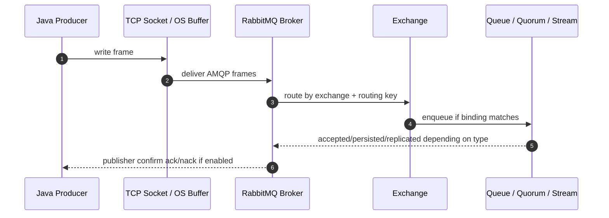
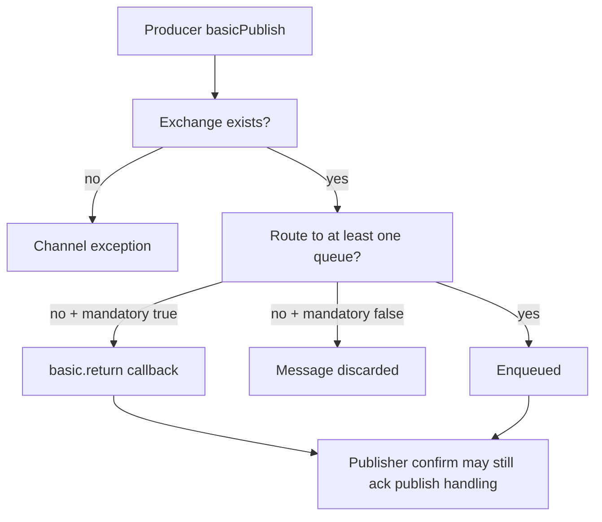
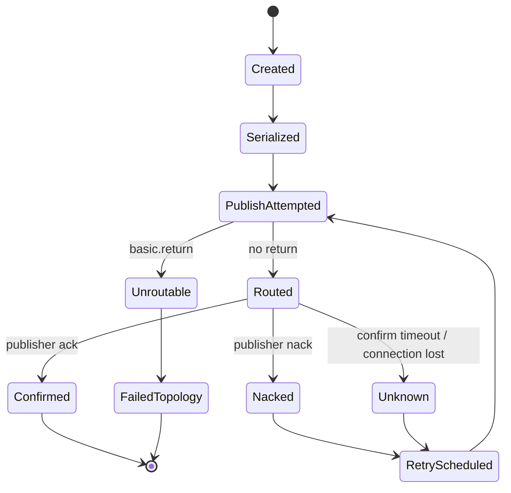
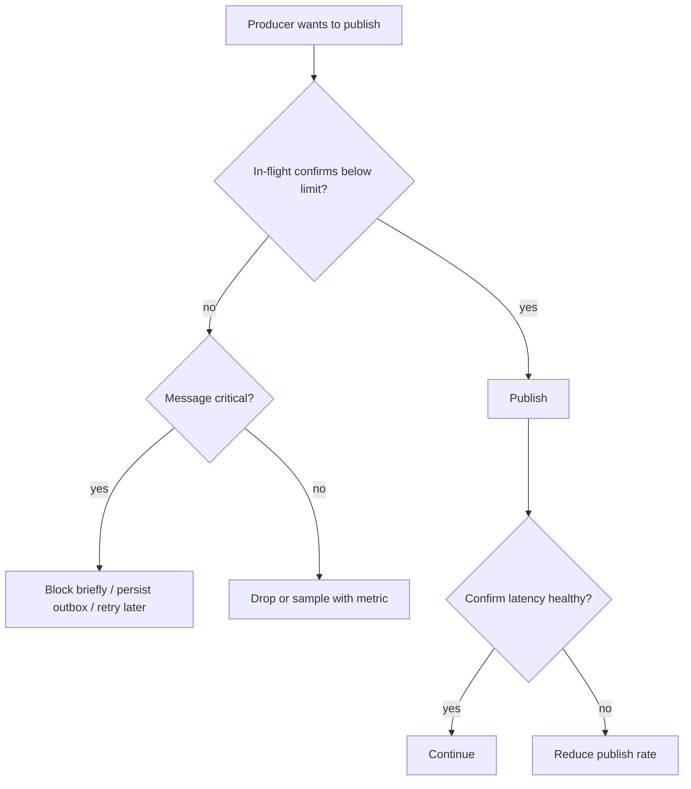
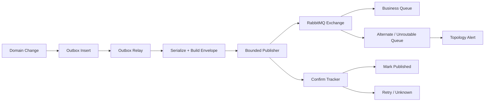

# Part 005 — Producer In Action: Publishing Semantics, Properties, Mandatory Flag, Confirms

## 1. Tujuan Part Ini

Part ini membahas sisi **producer** secara production-grade. Kita tidak akan berhenti pada contoh `basicPublish`. Targetnya adalah memahami:

1. apa yang benar-benar terjadi saat Java service mem-publish message;
2. kapan sebuah message boleh dianggap “diterima broker”;
3. apa bedanya durable queue, persistent message, quorum replication, dan publisher confirm;
4. bagaimana mencegah **silent message loss** ketika routing salah;
5. bagaimana membuat producer tahan terhadap broker restart, network issue, timeout, duplicate publish, dan overload;
6. bagaimana membangun wrapper publisher yang eksplisit, observable, bounded, dan mudah diuji.

Producer adalah tempat pertama pesan bisa hilang. Jika producer salah, consumer sehebat apa pun tidak akan pernah melihat message itu.

---

## 2. Mental Model: Publish Bukan “Send and Forget”

Secara konseptual, publish ke RabbitMQ melewati beberapa boundary:



Ada beberapa checkpoint yang sering disalahpahami:

| Checkpoint | Artinya | Belum Menjamin |
|---|---|---|
| Method `basicPublish` selesai | Client berhasil menulis frame ke channel API | Broker sudah menerima, route benar, atau data aman |
| TCP write berhasil | Data masuk ke socket/OS buffer | Broker sudah commit message |
| Exchange menerima message | Message sampai ke exchange | Ada queue yang match |
| Queue menerima message | Message masuk ke queue | Consumer sukses proses |
| Publisher confirm ack | Broker menerima tanggung jawab sesuai jenis queue/message | Downstream consumer sukses |
| Consumer ack | Consumer menyatakan processing selesai | Tidak otomatis menjamin side effect persisten jika ack terlalu awal |

Inti desainnya:

> Producer correctness berhenti di “message safely accepted by broker/topology”. Business correctness tetap membutuhkan consumer idempotency, persistence boundary, dan observability.

---

## 3. `basicPublish`: API Kecil, Kontrak Besar

Contoh dasar Java client:

```java
channel.basicPublish(
    "orders.exchange",       // exchange
    "order.created",         // routing key
    true,                    // mandatory
    properties,
    body
);
```

Parameter penting:

| Parameter | Fungsi | Production Concern |
|---|---|---|
| `exchange` | Exchange target | Salah exchange bisa menyebabkan unroutable atau publish gagal |
| `routingKey` | Routing selector | Harus stabil, versionable, dan tidak bocor detail consumer |
| `mandatory` | Minta broker mengembalikan message jika tidak routed | Penting untuk mendeteksi topology/routing bug |
| `properties` | Metadata AMQP | Dipakai untuk idempotency, correlation, content type, TTL, priority |
| `body` | Payload bytes | Harus punya schema/versioning dan size budget |

API terlihat sinkron, tetapi maknanya tidak otomatis sinkron. `basicPublish` tidak berarti message sudah aman kecuali kita mengaktifkan publisher confirms dan menangani hasilnya.

---

## 4. Producer Contract yang Benar

Producer production-grade minimal harus punya kontrak berikut:

```text
Given sebuah domain event/command siap dipublish,
When producer mempublish ke RabbitMQ,
Then producer harus:
  - memberi message id yang stabil,
  - memberi correlation/causation metadata,
  - menggunakan exchange dan routing key yang tervalidasi,
  - mendeteksi unroutable message,
  - menunggu publisher confirm sesuai policy,
  - membatasi jumlah in-flight message,
  - retry hanya saat outcome tidak pasti,
  - menghasilkan metric/log/trace yang cukup untuk debugging.
```

Kontrak ini jauh lebih penting daripada wrapper API yang “rapi”. Messaging system gagal bukan karena code kurang indah, tetapi karena outcome publish tidak dimodelkan.

---

## 5. Message Properties: Metadata adalah Control Plane

RabbitMQ message terdiri dari body dan properties. Body adalah data bisnis. Properties adalah control plane untuk routing, tracing, reliability, dan processing.

Contoh builder:

```java
AMQP.BasicProperties properties = new AMQP.BasicProperties.Builder()
    .messageId(messageId)
    .correlationId(correlationId)
    .contentType("application/json")
    .contentEncoding("utf-8")
    .type("order.created.v1")
    .timestamp(Date.from(Instant.now()))
    .deliveryMode(2) // persistent
    .headers(Map.of(
        "schema", "order-created",
        "schemaVersion", "1",
        "producer", "order-service",
        "tenantId", tenantId,
        "causationId", causationId
    ))
    .build();
```

### 5.1 Recommended Metadata

| Field | Recommendation | Why It Matters |
|---|---|---|
| `messageId` | Globally unique atau deterministic idempotency key | Deduplication dan forensic tracing |
| `correlationId` | Sama untuk satu user/business flow | Distributed tracing dan request journey |
| `causationId` | Message/command/event yang menyebabkan message ini | Causal chain |
| `type` | Semantic type, misalnya `order.created.v1` | Consumer dispatch dan observability |
| `contentType` | `application/json`, `application/protobuf`, dll. | Safe deserialization |
| `contentEncoding` | Biasanya `utf-8` | Encoding clarity |
| `timestamp` | Waktu producer membuat message | Latency calculation |
| `deliveryMode` | `2` untuk persistent message | Durability intent |
| headers `schemaVersion` | Explicit schema version | Contract evolution |
| headers `producer` | Service name | Incident debugging |
| headers `tenantId` | Bila multi-tenant | Isolation, audit, routing |

### 5.2 Header Anti-Pattern

Jangan jadikan header sebagai payload kedua.

Buruk:

```text
headers:
  orderId: ...
  amount: ...
  customerName: ...
  items: ...
  discount: ...
```

Lebih baik:

```text
headers:
  messageId
  correlationId
  schemaVersion
  producer

body:
  complete business payload
```

Header sebaiknya kecil, stabil, dan dipakai untuk control metadata. Payload bisnis tetap di body.

---

## 6. Persistent Message, Durable Queue, and Data Safety

Banyak engineer keliru berpikir bahwa `deliveryMode(2)` saja cukup. Tidak cukup.

| Setting | Tempat | Fungsi |
|---|---|---|
| Durable exchange | Exchange declaration | Exchange survive broker restart |
| Durable queue | Queue declaration | Queue definition survive broker restart |
| Persistent message | Message property | Message intended to survive restart jika disimpan pada durable queue |
| Publisher confirm | Producer protocol | Producer tahu broker menerima tanggung jawab |
| Quorum queue | Queue type | Replicated durable queue dengan leader/follower |

Contoh deklarasi durable queue:

```java
channel.exchangeDeclare("orders.exchange", BuiltinExchangeType.TOPIC, true);

channel.queueDeclare(
    "order-created.billing.queue",
    true,   // durable
    false,  // exclusive
    false,  // autoDelete
    Map.of("x-queue-type", "quorum")
);

channel.queueBind(
    "order-created.billing.queue",
    "orders.exchange",
    "order.created"
);
```

Persistent message ke non-durable queue adalah kontradiksi desain. Durable queue dengan transient message juga tidak memberi message durability. Publisher confirm tanpa persistent message hanya memberi sinyal broker menerima message, bukan bahwa message dirancang bertahan restart.

### 6.1 Practical Rule

Untuk business-critical command/event:

```text
exchange durable
+ queue durable
+ persistent message
+ publisher confirms
+ manual consumer ack
+ idempotent consumer
= baseline reliable messaging
```

Untuk data-safety tinggi, gunakan quorum queue atau stream sesuai kebutuhan, bukan classic transient queue.

---

## 7. Mandatory Flag and Returned Messages

`mandatory=true` berarti producer meminta broker mengembalikan message jika exchange tidak dapat meroute message ke queue mana pun.

```java
channel.addReturnListener(returnMessage -> {
    System.err.printf(
        "Returned: replyCode=%d replyText=%s exchange=%s routingKey=%s%n",
        returnMessage.getReplyCode(),
        returnMessage.getReplyText(),
        returnMessage.getExchange(),
        returnMessage.getRoutingKey()
    );
});

channel.basicPublish(
    "orders.exchange",
    "order.created",
    true, // mandatory
    properties,
    body
);
```

### 7.1 Why Mandatory Matters

Tanpa `mandatory=true`, message yang tidak punya route bisa hilang secara diam-diam.

Contoh penyebab unroutable:

1. routing key typo: `order.cretaed`;
2. binding belum dibuat saat deployment;
3. consumer service belum deploy topology;
4. exchange benar, tetapi queue belum bind;
5. tenant/region routing key tidak match;
6. topic pattern terlalu ketat;
7. topology migration belum sinkron.

### 7.2 Mandatory Is Not a Replacement for Confirms

`mandatory` menjawab:

```text
Apakah message bisa diroute ke minimal satu queue?
```

Publisher confirm menjawab:

```text
Apakah broker menerima tanggung jawab atas publish tersebut?
```

Keduanya perlu untuk producer reliability.

### 7.3 Interaction with Alternate Exchange

Jika exchange punya alternate exchange dan message berhasil diroute ke alternate exchange, message tidak dianggap unroutable dari sudut pandang `mandatory`.

Artinya:

```text
mandatory=true + alternate exchange
```

bisa menghasilkan outcome:

1. message tidak masuk target business queue;
2. message masuk alternate/unroutable queue;
3. producer menerima publisher confirm ack;
4. producer tidak menerima returned message.

Karena itu, unroutable queue dari alternate exchange harus dimonitor sebagai production signal.

---

## 8. Publisher Confirms

Publisher confirms adalah mekanisme agar broker memberi ack/nack kepada producer untuk message yang dipublish pada channel dengan confirm mode.

Aktifkan confirm mode:

```java
channel.confirmSelect();
```

Setelah confirm mode aktif, setiap publish mendapat sequence number di channel tersebut.

```java
long sequenceNumber = channel.getNextPublishSeqNo();
channel.basicPublish(exchange, routingKey, true, properties, body);
```

Broker akan mengirim confirm ack atau nack untuk sequence number tersebut.

---

## 9. Synchronous Confirms: Simple but Limited

Cara paling sederhana:

```java
channel.confirmSelect();

channel.basicPublish(exchange, routingKey, true, properties, body);
channel.waitForConfirmsOrDie(Duration.ofSeconds(5).toMillis());
```

Kelebihan:

- mudah dipahami;
- cocok untuk low-throughput admin/task workload;
- failure handling sederhana.

Kekurangan:

- throughput rendah;
- setiap message menunggu round trip;
- tidak cocok untuk high-throughput producer;
- bisa membuat thread producer terblokir lama.

Gunakan synchronous confirms hanya jika throughput kecil dan simplicity lebih penting daripada performa.

---

## 10. Batch Confirms: Throughput Better, Failure Semantics Harder

Batch confirm:

```java
channel.confirmSelect();

int batchSize = 100;
int outstanding = 0;

for (OutboundMessage message : messages) {
    channel.basicPublish(
        message.exchange(),
        message.routingKey(),
        true,
        message.properties(),
        message.body()
    );

    outstanding++;

    if (outstanding == batchSize) {
        channel.waitForConfirmsOrDie(5_000);
        outstanding = 0;
    }
}

if (outstanding > 0) {
    channel.waitForConfirmsOrDie(5_000);
}
```

Trade-off:

| Aspect | Effect |
|---|---|
| Throughput | Lebih tinggi daripada confirm per message |
| Latency | Bisa lebih tinggi karena batch wait |
| Failure handling | Jika batch gagal, harus tahu message mana yang perlu dipublish ulang |
| Duplicate risk | Retry batch bisa menyebabkan duplicate untuk message yang sebenarnya sudah diterima broker |

Batch confirms cocok bila consumer idempotent dan producer punya dedup/idempotency key.

---

## 11. Async Confirms: Production Default for High Throughput

Async confirms memisahkan publish path dari confirm callback.

```java
ConcurrentNavigableMap<Long, OutboundMessage> outstandingConfirms = new ConcurrentSkipListMap<>();

ConfirmCallback ackCallback = (sequenceNumber, multiple) -> {
    if (multiple) {
        outstandingConfirms.headMap(sequenceNumber, true).clear();
    } else {
        outstandingConfirms.remove(sequenceNumber);
    }
};

ConfirmCallback nackCallback = (sequenceNumber, multiple) -> {
    if (multiple) {
        ConcurrentNavigableMap<Long, OutboundMessage> failed =
            outstandingConfirms.headMap(sequenceNumber, true);

        failed.forEach((seq, message) -> message.markForRetry("publisher-nack"));
        failed.clear();
    } else {
        OutboundMessage failed = outstandingConfirms.remove(sequenceNumber);
        if (failed != null) {
            failed.markForRetry("publisher-nack");
        }
    }
};

channel.confirmSelect();
channel.addConfirmListener(ackCallback, nackCallback);

OutboundMessage message = buildMessage();
long seqNo = channel.getNextPublishSeqNo();
outstandingConfirms.put(seqNo, message);

try {
    channel.basicPublish(
        message.exchange(),
        message.routingKey(),
        true,
        message.properties(),
        message.body()
    );
} catch (IOException publishFailure) {
    outstandingConfirms.remove(seqNo);
    message.markForRetry("publish-io-exception");
}
```

### 11.1 Important Invariant

Sequence number harus direkam **sebelum** publish:

```java
long seqNo = channel.getNextPublishSeqNo();
outstandingConfirms.put(seqNo, message);
channel.basicPublish(...);
```

Jika direkam setelah publish, confirm callback bisa datang lebih cepat daripada pencatatan, khususnya pada broker lokal/high-speed path.

---

## 12. Confirm Callback `multiple=true`

RabbitMQ dapat mengonfirmasi banyak message sekaligus.

```text
ack(seq=105, multiple=true)
```

Artinya semua publish sampai sequence 105 pada channel tersebut sudah di-ack.

Producer harus menggunakan struktur data ordered seperti `ConcurrentSkipListMap`, bukan `HashMap`, agar bisa menghapus range.

```java
outstandingConfirms.headMap(sequenceNumber, true).clear();
```

Jika mengabaikan `multiple`, map akan bocor dan producer akan terlihat punya in-flight message yang sebenarnya sudah selesai.

---

## 13. Bounded In-Flight Confirms

Async confirms tanpa batas adalah bug. Saat broker lambat, producer bisa terus menumpuk outstanding publish di memory.

Gunakan semaphore:

```java
public final class BoundedPublisher {
    private final Channel channel;
    private final Semaphore inFlight;
    private final ConcurrentNavigableMap<Long, OutboundMessage> outstanding = new ConcurrentSkipListMap<>();

    public BoundedPublisher(Channel channel, int maxInFlight) throws IOException {
        this.channel = channel;
        this.inFlight = new Semaphore(maxInFlight);
        this.channel.confirmSelect();
        this.channel.addConfirmListener(this::onAck, this::onNack);
    }

    public void publish(OutboundMessage message) throws InterruptedException, IOException {
        boolean acquired = inFlight.tryAcquire(2, TimeUnit.SECONDS);
        if (!acquired) {
            throw new PublishBackpressureException("publisher confirm backlog is full");
        }

        long seqNo = channel.getNextPublishSeqNo();
        outstanding.put(seqNo, message);

        try {
            channel.basicPublish(
                message.exchange(),
                message.routingKey(),
                true,
                message.properties(),
                message.body()
            );
        } catch (IOException e) {
            outstanding.remove(seqNo);
            inFlight.release();
            throw e;
        }
    }

    private void onAck(long seqNo, boolean multiple) {
        int released = removeConfirmed(seqNo, multiple, false);
        inFlight.release(released);
    }

    private void onNack(long seqNo, boolean multiple) {
        int released = removeConfirmed(seqNo, multiple, true);
        inFlight.release(released);
    }

    private int removeConfirmed(long seqNo, boolean multiple, boolean nack) {
        if (multiple) {
            ConcurrentNavigableMap<Long, OutboundMessage> confirmed = outstanding.headMap(seqNo, true);
            int count = confirmed.size();
            if (nack) {
                confirmed.values().forEach(m -> m.markForRetry("publisher-nack"));
            }
            confirmed.clear();
            return count;
        }

        OutboundMessage message = outstanding.remove(seqNo);
        if (message != null && nack) {
            message.markForRetry("publisher-nack");
        }
        return message == null ? 0 : 1;
    }
}
```

### 13.1 Why This Matters

Bounded in-flight confirms memberi backpressure natural:

```text
broker slow -> confirm latency naik -> outstanding map penuh -> producer melambat -> memory stabil
```

Tanpa batas:

```text
broker slow -> confirm latency naik -> outstanding map tumbuh -> JVM memory naik -> GC pressure -> producer makin lambat -> incident
```

---

## 14. Handling Returned Messages

Publisher confirms dan returned messages adalah dua channel feedback yang berbeda:



Practical approach:

```java
channel.addReturnListener(returned -> {
    String messageId = returned.getProperties().getMessageId();
    String exchange = returned.getExchange();
    String routingKey = returned.getRoutingKey();

    log.error("rabbitmq.message.returned messageId={} exchange={} routingKey={} replyCode={} replyText={}",
        messageId,
        exchange,
        routingKey,
        returned.getReplyCode(),
        returned.getReplyText()
    );

    unroutableMessageCounter.increment();
    saveToUnroutableOutbox(messageId, exchange, routingKey, returned.getBody());
});
```

### 14.1 Returned Message Policy

Untuk critical publish, jangan hanya log. Pilih satu:

| Policy | Use Case |
|---|---|
| Fail request | Command harus langsung diketahui gagal |
| Store in outbox error state | Async publish dari outbox relay |
| Send to operator queue | Manual remediation |
| Trigger topology alert | Binding/topology regression |
| Drop with metric | Non-critical telemetry only |

Silent return handling adalah salah satu bug paling mahal dalam RabbitMQ system.

---

## 15. Producer Retry: Only Retry What You Understand

Producer retry harus membedakan failure outcome.

| Failure | Outcome Known? | Safe Action |
|---|---:|---|
| Exchange does not exist | Known failed | Fix topology, do not blind retry forever |
| `basic.return` unroutable | Known not routed | Alert/topology remediation |
| Publisher nack | Known broker did not accept responsibility | Retry with limit |
| IOException during publish | Unknown | Retry with idempotency key |
| Timeout waiting confirm | Unknown | Retry with idempotency key |
| Connection recovery in progress | Known not published by client | Buffer externally or retry after recovery |
| Broker blocked connection | Pressure signal | Slow down, shed, or queue locally with limit |

### 15.1 Unknown Outcome Creates Duplicate Risk

Jika producer mengirim message, lalu koneksi putus sebelum confirm diterima:

```text
Possibility A: broker never received message
Possibility B: broker received and enqueued message, but confirm lost
```

Retry diperlukan, tetapi bisa menciptakan duplicate.

Karena itu producer harus selalu mengirim `messageId` stabil, dan consumer harus idempotent.

---

## 16. Outbox Relay Producer Pattern

Untuk event yang berasal dari database transaction, jangan publish langsung dari business transaction tanpa outbox.

Buruk:

```java
@Transactional
public void placeOrder(PlaceOrderCommand command) {
    Order order = orderRepository.save(command.toOrder());
    rabbitPublisher.publish(orderCreated(order)); // failure ambiguity
}
```

Masalah:

1. database commit bisa sukses, publish gagal;
2. publish bisa sukses, database rollback;
3. service crash di antara keduanya;
4. retry HTTP request bisa menggandakan event;
5. tidak ada durable retry queue di sisi aplikasi.

Lebih baik:

```java
@Transactional
public void placeOrder(PlaceOrderCommand command) {
    Order order = orderRepository.save(command.toOrder());
    outboxRepository.insert(OutboxMessage.from(orderCreated(order)));
}
```

Lalu relay:

```java
public void relayPendingOutboxMessages() {
    List<OutboxMessage> batch = outboxRepository.lockNextBatch(100);

    for (OutboxMessage message : batch) {
        try {
            rabbitPublisher.publish(message.toOutboundMessage());
            outboxRepository.markPublished(message.id());
        } catch (UnroutableMessageException e) {
            outboxRepository.markFailed(message.id(), "UNROUTABLE", e.getMessage());
        } catch (Exception e) {
            outboxRepository.releaseForRetry(message.id(), e.getMessage());
        }
    }
}
```

Outbox tidak menghilangkan duplicate. Outbox mengubah message loss menjadi retryable state machine.

---

## 17. Producer State Machine

Production producer sebaiknya dimodelkan sebagai state machine, bukan sekadar method call.



Key point:

- `Confirmed` bukan berarti business processed.
- `Unknown` harus diasumsikan bisa duplicate.
- `Unroutable` bukan transient infrastructure error; sering kali topology/design error.
- `Nacked` harus dimonitor sebagai broker-side failure signal.

---

## 18. Exchange Declaration: Producer-Owned or Platform-Owned?

Ada dua pendekatan.

### 18.1 Producer Declares Topology

Producer saat startup melakukan:

```java
channel.exchangeDeclare("orders.exchange", BuiltinExchangeType.TOPIC, true);
```

Kelebihan:

- local dev mudah;
- service self-contained;
- deployment lebih sederhana.

Kekurangan:

- topology governance tersebar;
- perubahan exchange/queue bisa konflik;
- permission producer harus lebih luas;
- multi-team environment rawan drift.

### 18.2 Platform/Operator Declares Topology

Topology dideklarasikan via Terraform, Kubernetes operator, definitions file, atau platform automation.

Kelebihan:

- governance jelas;
- least privilege lebih mudah;
- reviewable;
- konsisten antar environment.

Kekurangan:

- butuh pipeline lebih matang;
- local dev perlu bootstrap;
- perubahan topology tidak secepat code change.

### 18.3 Recommended Rule

| Environment | Recommendation |
|---|---|
| Local learning | App may declare topology |
| Integration test | Test harness declares topology |
| Shared dev/staging | IaC/platform declares topology |
| Production | Platform-owned topology, app validates assumptions |

---

## 19. Producer Backpressure

Producer backpressure harus terjadi sebelum JVM rusak.

Signals:

1. publisher confirm latency naik;
2. outstanding confirm count naik;
3. `connection.blocked` event dari broker;
4. publish exception karena connection recovery;
5. socket write melambat;
6. local bounded queue penuh;
7. broker memory/disk alarm.

### 19.1 Backpressure Decision Tree



### 19.2 Local Buffer Warning

Local in-memory buffer is not a reliability mechanism.

```text
In-memory queue + process crash = message loss
```

Jika message critical, persist it first: outbox, durable file queue, or upstream retryable state.

---

## 20. Timeout Policy

Producer harus punya timeout untuk confirm wait dan bounded publish.

Bad:

```java
channel.waitForConfirmsOrDie(); // can block without clear service-level policy
```

Better:

```java
boolean confirmed = channel.waitForConfirms(5_000);
if (!confirmed) {
    throw new PublishConfirmTimeoutException("publisher confirm timed out after 5s");
}
```

Timeout tidak berarti broker gagal menerima message. Timeout berarti producer tidak tahu outcome.

Policy:

| Message Type | Timeout Handling |
|---|---|
| Critical command | Persist retry state; idempotent message id |
| Domain event from DB | Keep outbox row unpublished |
| Non-critical analytics | Retry with bounded budget or drop |
| Audit event | Persist before publish or use stream/outbox |

---

## 21. Observability for Producer

Minimal metrics:

| Metric | Type | Meaning |
|---|---|---|
| `rabbitmq_publish_attempt_total` | counter | Total publish attempts |
| `rabbitmq_publish_confirm_ack_total` | counter | Confirm ack count |
| `rabbitmq_publish_confirm_nack_total` | counter | Confirm nack count |
| `rabbitmq_publish_return_total` | counter | Unroutable returned messages |
| `rabbitmq_publish_confirm_latency_seconds` | histogram | Time from publish to confirm |
| `rabbitmq_publish_in_flight` | gauge | Outstanding confirms |
| `rabbitmq_publish_backpressure_total` | counter | Publish rejected/delayed due to local limit |
| `rabbitmq_publish_payload_bytes` | histogram | Message size distribution |
| `rabbitmq_connection_blocked` | gauge/counter | Broker flow-control event |

Structured log fields:

```json
{
  "event": "rabbitmq.publish.confirmed",
  "messageId": "01J...",
  "correlationId": "checkout-...",
  "exchange": "orders.exchange",
  "routingKey": "order.created",
  "messageType": "order.created.v1",
  "confirmLatencyMs": 12,
  "payloadBytes": 1542
}
```

Tracing:

- propagate trace id in headers;
- create span for publish attempt;
- add exchange/routing key/message type attributes;
- never put sensitive payload into traces.

---

## 22. Health Check Design

Producer health should not simply mean “connection exists”.

Recommended readiness signals:

1. connection open;
2. channel open;
3. confirm mode enabled;
4. topology assumptions validated or platform-ready;
5. outstanding confirms below danger threshold;
6. recent confirm latency under threshold;
7. connection not blocked;
8. outbox backlog not above critical threshold.

Bad readiness:

```text
RabbitMQ TCP port reachable => ready
```

Better readiness:

```text
Producer can publish responsibly without unbounded backlog or known topology failure.
```

---

## 23. Testing Producer Semantics

### 23.1 Unit Tests

Test wrapper state transition:

- publish success -> outstanding registered -> ack removes outstanding;
- nack -> retry scheduled;
- return -> unroutable handler called;
- confirm timeout -> unknown outcome;
- in-flight full -> backpressure exception.

### 23.2 Integration Tests

Use real RabbitMQ container/lab.

Cases:

1. publish to valid route;
2. publish with wrong routing key and `mandatory=true`;
3. publish with missing exchange;
4. publish persistent message to durable queue;
5. confirm ack observed;
6. force channel close;
7. broker restart during publish;
8. blocked connection scenario where possible;
9. high throughput confirms with bounded in-flight;
10. multiple ack range handling.

### 23.3 Chaos Tests

During publish load:

- restart broker node;
- close connection from management API;
- delete binding intentionally in test environment;
- slow disk / disk alarm simulation;
- network latency injection;
- consumer stopped causing queue growth.

Expected result is not “zero failures”. Expected result is:

```text
No silent loss. Unknown outcomes become retryable. Duplicates are acceptable and bounded by idempotency design.
```

---

## 24. Common Producer Anti-Patterns

| Anti-Pattern | Why It Fails |
|---|---|
| Fire-and-forget for critical message | No proof broker accepted message |
| `mandatory=false` everywhere | Unroutable messages can disappear silently |
| No `messageId` | Duplicates become untraceable |
| Unbounded async confirms | Memory blow-up under broker slowness |
| Retry without idempotency | Duplicate side effects downstream |
| Publishing inside DB transaction without outbox | Transaction/publish atomicity gap |
| One channel shared by many threads | Race and protocol misuse risk |
| Treating confirm timeout as failure-only | Outcome is unknown, not definitely failed |
| Logging only message body | Security and observability mistake |
| Producer declares queues owned by consumers | Tight coupling and topology ownership confusion |

---

## 25. Production Publisher Blueprint



A strong producer implementation has these modules:

1. `MessageEnvelopeFactory`
2. `MessageSerializer`
3. `RoutingKeyResolver`
4. `RabbitPublisher`
5. `ConfirmTracker`
6. `ReturnedMessageHandler`
7. `OutboxRelay`
8. `PublishMetrics`
9. `PublishHealthIndicator`
10. `RetryPolicy`

---

## 26. Minimal Production-Grade Publisher Interface

```java
public interface ReliablePublisher {
    PublishReceipt publish(OutboundMessage message) throws PublishException;
}

public record OutboundMessage(
    String exchange,
    String routingKey,
    AMQP.BasicProperties properties,
    byte[] body,
    boolean mandatory
) {}

public sealed interface PublishReceipt permits PublishReceipt.Confirmed, PublishReceipt.Unknown {
    record Confirmed(String messageId, Duration confirmLatency) implements PublishReceipt {}
    record Unknown(String messageId, String reason) implements PublishReceipt {}
}
```

Untuk async high-throughput, method bisa mengembalikan `CompletionStage<PublishReceipt>`:

```java
public interface AsyncReliablePublisher {
    CompletionStage<PublishReceipt> publish(OutboundMessage message);
}
```

Tetapi jangan sembunyikan `Unknown` sebagai generic exception. Unknown outcome adalah state bisnis penting.

---

## 27. Practice Lab

### Lab 1 — Mandatory Routing Failure

1. Buat exchange `orders.exchange`.
2. Jangan buat binding untuk `order.created`.
3. Publish dengan `mandatory=false`.
4. Amati bahwa producer tidak tahu message hilang.
5. Publish ulang dengan `mandatory=true`.
6. Tangani returned message.

Expected learning:

```text
Routing correctness harus diverifikasi, bukan diasumsikan.
```

### Lab 2 — Publisher Confirm Timeout

1. Aktifkan confirm mode.
2. Publish batch besar.
3. Tambahkan artificial broker/network delay.
4. Set confirm timeout rendah.
5. Implementasikan unknown outcome handling.

Expected learning:

```text
Timeout bukan bukti message gagal. Timeout adalah bukti producer kehilangan kepastian.
```

### Lab 3 — Bounded In-Flight

1. Set `maxInFlight=100`.
2. Publish 1 juta message kecil.
3. Hentikan disk/consumer atau buat broker lambat.
4. Pastikan memory producer tidak tumbuh tanpa batas.

Expected learning:

```text
Reliability tanpa backpressure akan berubah menjadi outage.
```

### Lab 4 — Duplicate After Retry

1. Publish dengan confirm mode.
2. Putus koneksi setelah broker menerima publish tetapi sebelum producer menerima confirm.
3. Retry message dengan `messageId` yang sama.
4. Consumer harus mendeteksi duplicate.

Expected learning:

```text
Producer reliability dan consumer idempotency adalah satu desain, bukan dua fitur terpisah.
```

---

## 28. Self-Correction Checklist

Sebelum lanjut ke consumer, jawab ini:

1. Apakah `basicPublish` return berarti broker sudah menyimpan message?
2. Apa perbedaan `mandatory` dan publisher confirm?
3. Jika confirm timeout, apakah aman menganggap publish gagal?
4. Mengapa persistent message tanpa durable queue tidak cukup?
5. Mengapa durable queue tanpa publisher confirm belum cukup?
6. Bagaimana menangani `multiple=true` pada confirm callback?
7. Mengapa async confirm harus bounded?
8. Kapan returned message bisa tidak muncul walau target business queue tidak menerima message?
9. Mengapa producer retry butuh idempotent consumer?
10. Apa metric utama untuk mendeteksi producer mulai overload?

Jika belum bisa menjawab dengan jelas, ulangi bagian 7–15.

---

## 29. Ringkasan

Producer RabbitMQ yang production-grade tidak cukup dengan `basicPublish`. Ia harus memodelkan outcome publish secara eksplisit:

1. **published attempt** — producer mencoba mengirim;
2. **routed or returned** — message punya route atau unroutable;
3. **confirmed, nacked, or unknown** — broker menerima tanggung jawab, menolak, atau producer kehilangan kepastian;
4. **retryable or terminal** — system tahu apakah harus retry, alert, atau park;
5. **observable** — setiap outcome terlihat dalam metric, log, trace, dan state.

Golden rule:

> Critical producer harus menggunakan persistent message, durable topology, publisher confirms, mandatory routing feedback, bounded in-flight publish, idempotency key, dan retry state yang eksplisit.

Di part berikutnya kita masuk ke sisi consumer: delivery, manual ack, nack, reject, prefetch, redelivery, dan poison message handling.

---

## 30. Referensi Resmi

- RabbitMQ Java Client API Guide: https://www.rabbitmq.com/client-libraries/java-api-guide
- RabbitMQ Publisher Confirms Tutorial for Java: https://www.rabbitmq.com/tutorials/tutorial-seven-java
- RabbitMQ Consumer Acknowledgements and Publisher Confirms: https://www.rabbitmq.com/docs/confirms
- RabbitMQ AMQP 0-9-1 Concepts: https://www.rabbitmq.com/tutorials/amqp-concepts
- RabbitMQ Reliability Guide: https://www.rabbitmq.com/docs/reliability
