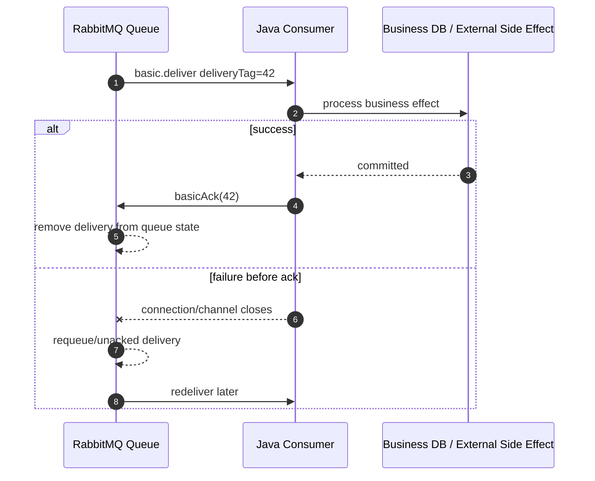
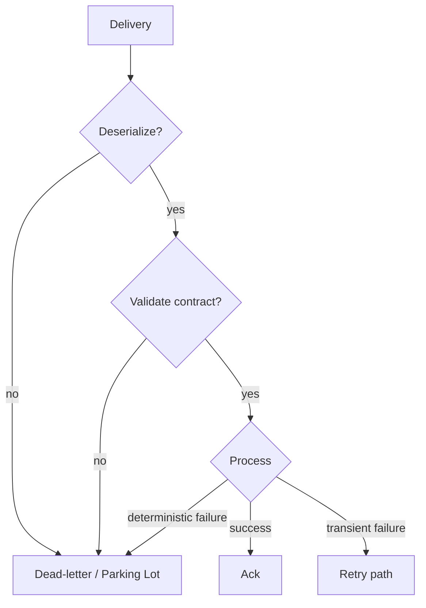
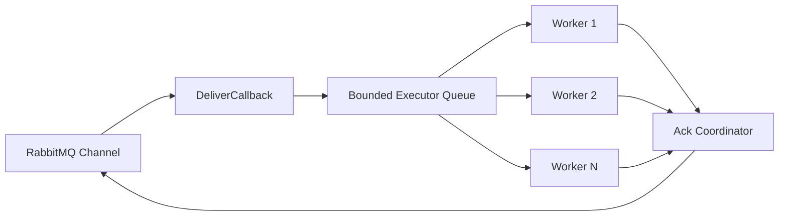
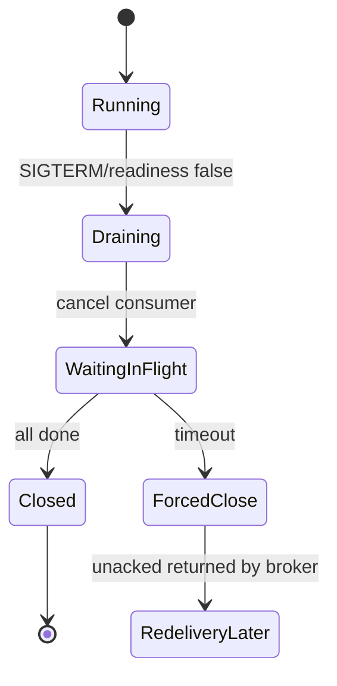
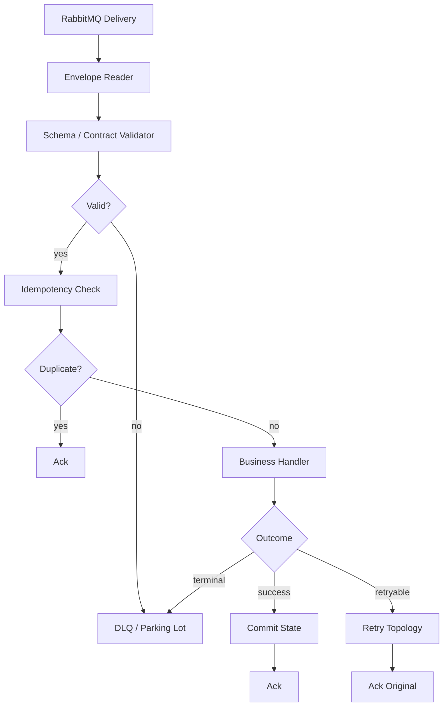

# Part 006 — Consumer In Action: Delivery, Ack, Nack, Reject, Prefetch, Redelivery

## 1. Tujuan Part Ini

Part ini membahas sisi **consumer** secara production-grade. Fokusnya bukan sekadar “menerima message”, tetapi memastikan consumer:

1. tidak ack terlalu awal;
2. tidak menciptakan duplicate side effect;
3. tidak membuat redelivery storm;
4. tidak mengambil message lebih banyak daripada kapasitasnya;
5. bisa membedakan transient failure dan poison message;
6. punya concurrency model yang aman;
7. dapat diamati saat lambat, stuck, gagal, atau overload.

Consumer adalah tempat reliability berubah menjadi business correctness. Producer hanya bisa memastikan message sampai ke broker. Consumer yang menentukan apakah message diproses dengan benar.

---

## 2. Mental Model: Delivery is a Lease, Not Ownership

Saat RabbitMQ mengirim message ke consumer dengan manual acknowledgement, message belum selesai. Message sedang “dipinjamkan” kepada consumer.



Key invariant:

> Ack hanya boleh dikirim setelah side effect yang ingin dianggap final sudah aman.

Jika ack dikirim sebelum DB commit, message bisa hilang secara bisnis.

---

## 3. Consumer API Basics

Contoh raw Java client:

```java
boolean autoAck = false;

DeliverCallback deliverCallback = (consumerTag, delivery) -> {
    long deliveryTag = delivery.getEnvelope().getDeliveryTag();

    try {
        process(delivery);
        channel.basicAck(deliveryTag, false);
    } catch (RetryableException e) {
        channel.basicNack(deliveryTag, false, true);
    } catch (PoisonMessageException e) {
        channel.basicNack(deliveryTag, false, false);
    }
};

CancelCallback cancelCallback = consumerTag -> {
    log.warn("consumer cancelled consumerTag={}", consumerTag);
};

channel.basicConsume("order-created.billing.queue", autoAck, deliverCallback, cancelCallback);
```

Parameter utama:

| Concept | Meaning |
|---|---|
| `autoAck=false` | Consumer wajib ack/nack/reject manual |
| `deliveryTag` | Identifier delivery pada channel tersebut |
| `basicAck` | Processing sukses; broker boleh menghapus delivery |
| `basicNack` | Processing gagal; bisa requeue atau dead-letter/discard |
| `basicReject` | Reject satu message; lebih terbatas daripada nack |
| `CancelCallback` | Broker membatalkan consumer, misalnya queue deleted |

---

## 4. Delivery Tag Scope

`deliveryTag` scoped ke channel, bukan global.

Artinya:

```text
Channel A deliveryTag=42 != Channel B deliveryTag=42
```

Jangan ack delivery dari channel lain.

Buruk:

```java
// delivery diterima di channelA, tapi ack memakai channelB
channelB.basicAck(deliveryTag, false);
```

Hasilnya bisa channel exception karena delivery tag tidak dikenal pada channel tersebut.

Rule:

> Satu consumer execution path harus tahu channel owner-nya. Jangan lempar deliveryTag ke thread lain tanpa mekanisme ack yang aman pada channel yang sama.

---

## 5. Auto Ack vs Manual Ack

### 5.1 Auto Ack

```java
channel.basicConsume(queueName, true, deliverCallback, cancelCallback);
```

Dengan auto ack, RabbitMQ menganggap message selesai begitu dikirim ke consumer.

Risiko:

1. consumer crash setelah menerima tetapi sebelum proses;
2. exception saat deserialize;
3. DB failure;
4. process killed;
5. executor queue penuh;
6. external API timeout.

Message sudah dianggap selesai, sehingga tidak redeliver.

Auto ack cocok untuk:

- non-critical telemetry;
- best-effort metrics;
- local demo;
- workload yang memang boleh hilang.

### 5.2 Manual Ack

```java
channel.basicConsume(queueName, false, deliverCallback, cancelCallback);
```

Manual ack cocok untuk business-critical processing.

```text
Receive -> Validate -> Process -> Commit -> Ack
```

Bukan:

```text
Receive -> Ack -> Process -> Hope
```

---

## 6. Ack Timing and Transaction Boundary

Consumer harus menempatkan ack setelah durable side effect.

### 6.1 Correct Pattern

```java
try {
    BusinessMessage message = deserialize(delivery.getBody());

    transactionTemplate.executeWithoutResult(tx -> {
        dedupRepository.insertIfAbsent(message.messageId());
        businessHandler.handle(message);
    });

    channel.basicAck(deliveryTag, false);
} catch (DuplicateMessageException duplicate) {
    channel.basicAck(deliveryTag, false);
} catch (RetryableException retryable) {
    channel.basicNack(deliveryTag, false, true);
} catch (Exception fatal) {
    channel.basicNack(deliveryTag, false, false);
}
```

### 6.2 Dangerous Pattern

```java
channel.basicAck(deliveryTag, false);
businessHandler.handle(message);
```

Jika process crash setelah ack, message hilang secara permanen dari queue, tetapi business side effect belum terjadi.

---

## 7. `basicAck`

```java
channel.basicAck(deliveryTag, false);
```

Parameter kedua `multiple` menentukan apakah ack berlaku untuk satu delivery atau semua delivery sampai tag tersebut pada channel yang sama.

| Call | Meaning |
|---|---|
| `basicAck(tag, false)` | Ack satu delivery |
| `basicAck(tag, true)` | Ack semua unacked delivery sampai tag tersebut |

`multiple=true` bisa efisien untuk batch sequential processing, tetapi berbahaya jika message diproses paralel.

### 7.1 Safe Single Ack

Gunakan ini untuk kebanyakan consumer:

```java
channel.basicAck(deliveryTag, false);
```

### 7.2 Batch Ack

Batch ack aman jika:

1. processing sequential;
2. semua message sebelum tag tersebut sukses;
3. tidak ada parallel out-of-order completion;
4. channel hanya dipakai oleh flow tersebut.

```java
long lastDeliveryTag = 0;
int processed = 0;

for (Delivery delivery : batch) {
    process(delivery);
    lastDeliveryTag = delivery.getEnvelope().getDeliveryTag();
    processed++;

    if (processed % 100 == 0) {
        channel.basicAck(lastDeliveryTag, true);
    }
}
```

Jika parallel, jangan gunakan `multiple=true` kecuali punya ack coordinator yang memahami gap.

---

## 8. `basicNack` and `basicReject`

### 8.1 `basicNack`

```java
channel.basicNack(deliveryTag, false, true);  // requeue
channel.basicNack(deliveryTag, false, false); // dead-letter or discard
```

`basicNack` mendukung `multiple`, sehingga bisa menolak banyak delivery sekaligus.

### 8.2 `basicReject`

```java
channel.basicReject(deliveryTag, false);
```

`basicReject` menolak satu delivery. Tidak ada `multiple`.

### 8.3 Requeue Flag

| Call | Result |
|---|---|
| `basicNack(tag, false, true)` | Message dikembalikan ke queue untuk redelivery |
| `basicNack(tag, false, false)` | Message dead-letter jika DLX configured, atau discard |
| `basicReject(tag, false)` | Sama secara practical untuk satu message: dead-letter/discard |
| `basicReject(tag, true)` | Requeue satu message |

Rule:

> Jangan requeue message yang sudah diketahui poison. Requeue poison message akan menciptakan loop.

---

## 9. Redelivery Semantics

RabbitMQ bisa mengirim ulang message jika:

1. consumer connection/channel close sebelum ack;
2. consumer mengirim nack/reject dengan requeue true;
3. broker recovery/failover membuat unacked delivery dikembalikan;
4. consumer timeout/policy tertentu membuat delivery dianggap tidak selesai.

Delivery memiliki flag:

```java
boolean redelivered = delivery.getEnvelope().isRedeliver();
```

Flag ini berarti message pernah dikirim sebelumnya, tetapi bukan bukti jumlah retry akurat.

### 9.1 Redelivered Is a Weak Signal

`redelivered=true` tidak menjawab:

- sudah berapa kali dicoba;
- consumer mana yang gagal;
- apakah side effect sebelumnya terjadi;
- apakah message poison;
- apakah retry masih layak.

Untuk retry count, gunakan header atau DLQ topology, bukan hanya redelivery flag.

---

## 10. Poison Message

Poison message adalah message yang tidak akan sukses walau dicoba ulang dalam kondisi saat ini.

Contoh:

1. schema tidak kompatibel;
2. required field hilang;
3. business invariant invalid;
4. tenant tidak dikenal;
5. entity referentially impossible;
6. payload corrupt;
7. message version unsupported;
8. command sudah kadaluarsa;
9. bug deterministic pada handler.

Poison message harus keluar dari hot path.



---

## 11. Retry Decision in Consumer

Consumer failure harus diklasifikasikan.

| Failure Type | Example | Action |
|---|---|---|
| Transient infrastructure | DB timeout, HTTP 503, temporary network issue | Retry with backoff |
| Resource pressure | Thread pool full, downstream slow | Stop consuming / nack with delay strategy |
| Data contract error | Invalid JSON, unknown schema version | DLQ/parking lot |
| Business terminal | Order already cancelled, impossible transition | Ack with business no-op or DLQ depending audit need |
| Duplicate | Message id already processed | Ack |
| Unknown bug | Null pointer, unexpected exception | Limited retry, then DLQ |

Do not treat all exceptions equally.

Bad:

```java
catch (Exception e) {
    channel.basicNack(deliveryTag, false, true);
}
```

Ini bisa menyebabkan infinite immediate retry.

Better:

```java
catch (InvalidMessageException e) {
    channel.basicNack(deliveryTag, false, false);
} catch (DuplicateMessageException e) {
    channel.basicAck(deliveryTag, false);
} catch (RetryableInfrastructureException e) {
    retryPublisher.schedule(delivery, e);
    channel.basicAck(deliveryTag, false);
} catch (Exception e) {
    failureClassifier.handleUnknown(delivery, e);
}
```

Catatan: retry delayed biasanya lebih baik dilakukan lewat retry topology, bukan immediate `requeue=true`.

---

## 12. Prefetch: Consumer Credit and Backpressure

Prefetch membatasi jumlah unacked delivery yang boleh dikirim broker ke consumer.

```java
int prefetchCount = 50;
channel.basicQos(prefetchCount);
```

Mental model:

```text
prefetch = max unacked messages allowed on this consumer/channel scope
```

Jika prefetch terlalu tinggi:

- consumer memory naik;
- message terdistribusi terlalu jauh;
- slow consumer memegang banyak message;
- redelivery burst besar saat consumer crash;
- latency tail memburuk;
- fairness antar consumer menurun.

Jika terlalu rendah:

- throughput bisa kurang;
- network round trip lebih dominan;
- worker idle jika processing cepat.

---

## 13. Prefetch Sizing

Baseline:

```text
prefetch ~= concurrency * small multiplier
```

Contoh:

| Consumer Model | Suggested Starting Prefetch |
|---|---:|
| Single-thread sequential | 1–10 |
| 8 worker threads, CPU-bound | 8–16 |
| 16 worker threads, IO-bound | 32–128 |
| Batch DB writer | batch size × 1–2 |
| Strict ordering per queue | 1 |
| Expensive large payload | low, maybe 1–5 |

Formula praktis:

```text
prefetch = workerConcurrency + bufferAllowance
```

Jangan mulai dari 1000. Mulai konservatif, ukur throughput dan latency, lalu naikkan.

### 13.1 Prefetch and Crash Blast Radius

Jika prefetch 1000 dan consumer crash, sampai 1000 unacked message bisa redeliver. Ini bisa membuat duplicate storm.

```text
blast radius = prefetch × number of crashed consumers
```

Jika ada 20 consumer dengan prefetch 500:

```text
potential redelivery burst = 10,000 messages
```

---

## 14. Consumer Concurrency Model

Ada beberapa model.

### 14.1 One Channel Per Consumer Thread

Paling sederhana dan aman.

```text
thread-1 -> channel-1 -> consumer-1
thread-2 -> channel-2 -> consumer-2
thread-3 -> channel-3 -> consumer-3
```

Kelebihan:

- deliveryTag scope jelas;
- ack dilakukan pada channel yang sama;
- failure isolation lebih baik;
- reasoning lebih mudah.

Kekurangan:

- lebih banyak channel;
- perlu lifecycle management.

### 14.2 One Consumer Dispatches to Worker Pool



Perlu hati-hati:

1. executor queue harus bounded;
2. jangan ack dengan `multiple=true` jika completion out-of-order;
3. channel access harus thread-safe secara desain aplikasi;
4. backpressure harus terjadi jika executor penuh;
5. shutdown harus menunggu worker selesai atau nack ulang.

### 14.3 Recommended Starting Point

Untuk service bisnis biasa:

```text
N consumer instances × M channels/consumers × prefetch K
```

Misal:

```text
4 pods × 4 consumers each × prefetch 20 = max 320 unacked messages
```

Ini lebih mudah dikontrol daripada satu consumer dengan executor queue besar dan prefetch 5000.

---

## 15. Bounded Executor Pattern

Jika perlu worker pool, jangan gunakan unbounded queue.

```java
ThreadPoolExecutor executor = new ThreadPoolExecutor(
    8,
    8,
    0L,
    TimeUnit.MILLISECONDS,
    new ArrayBlockingQueue<>(100),
    new ThreadPoolExecutor.AbortPolicy()
);
```

Deliver callback:

```java
DeliverCallback callback = (consumerTag, delivery) -> {
    try {
        executor.execute(() -> handleDelivery(channel, delivery));
    } catch (RejectedExecutionException full) {
        channel.basicNack(delivery.getEnvelope().getDeliveryTag(), false, true);
    }
};
```

Tetapi requeue langsung saat executor penuh bisa menciptakan tight loop. Lebih baik:

1. set prefetch sesuai kapasitas executor;
2. pause/cancel consumer saat overload;
3. gunakan delayed retry path;
4. scale consumer jika bottleneck memang consumer capacity;
5. jangan menerima delivery lebih banyak daripada worker capacity.

---

## 16. Ack Coordinator for Parallel Processing

Jika parallel processing tetap ingin batch ack dengan `multiple=true`, butuh gap tracking.

Contoh delivery tags selesai:

```text
1 success
2 success
3 still running
4 success
5 success
```

Tidak boleh `basicAck(5, true)` karena tag 3 belum selesai.

Ack coordinator hanya boleh ack contiguous success range:

```text
ack up to 2
wait for 3
then ack up to 5
```

Simpler production rule:

> Untuk parallel consumer, gunakan `basicAck(tag, false)` per delivery kecuali benar-benar butuh optimization dan punya coordinator yang benar.

---

## 17. Consumer Cancellation

Consumer bisa dibatalkan broker, misalnya:

1. queue dihapus;
2. permission berubah;
3. exclusive consumer conflict;
4. node failover/rebalance;
5. admin action.

Tangani `CancelCallback`:

```java
CancelCallback cancelCallback = consumerTag -> {
    log.warn("rabbitmq.consumer.cancelled queue={} consumerTag={}", queueName, consumerTag);
    consumerCancelledCounter.increment();
    readiness.markNotReady("consumer cancelled: " + consumerTag);
};
```

Jangan diam-diam mengabaikan cancellation. Service bisa terlihat hidup tetapi tidak memproses apa pun.

---

## 18. Shutdown Semantics

Shutdown consumer harus graceful.

Urutan recommended:

1. mark readiness false;
2. stop accepting new deliveries atau cancel consumer;
3. wait in-flight processing selesai sampai timeout;
4. ack yang sudah sukses;
5. nack/requeue yang belum diproses jika perlu;
6. close channel;
7. close connection.



Dalam Kubernetes, pastikan `terminationGracePeriodSeconds` cukup untuk processing max time atau consumer punya checkpoint/idempotency.

---

## 19. Deserialization Boundary

Deserialize adalah bagian dari processing, bukan preprocessing yang boleh gagal tanpa ack policy.

```java
try {
    BusinessMessage message = serializer.deserialize(delivery.getBody());
    handler.handle(message);
    channel.basicAck(deliveryTag, false);
} catch (JsonProcessingException invalidPayload) {
    channel.basicNack(deliveryTag, false, false);
}
```

Jika payload invalid dan kita `requeue=true`, consumer akan membaca message yang sama terus-menerus.

Tambahkan metadata ke DLQ:

- original exchange;
- original routing key;
- exception class;
- exception message sanitized;
- consumer service;
- failure timestamp;
- schema version;
- message id.

---

## 20. Idempotent Consumer Baseline

Karena RabbitMQ memberi at-least-once semantics jika kita memakai manual ack dan retry, consumer harus idempotent.

Minimal pattern:

```java
@Transactional
public void handle(BusinessMessage message) {
    boolean firstTime = processedMessageRepository.insertIfAbsent(
        message.messageId(),
        message.consumerName()
    );

    if (!firstTime) {
        return;
    }

    businessOperation.apply(message);
}
```

Jika duplicate datang:

```java
try {
    handler.handle(message);
    channel.basicAck(deliveryTag, false);
} catch (DuplicateMessageException duplicate) {
    channel.basicAck(deliveryTag, false);
}
```

Duplicate adalah sukses dari sudut pandang queue. Jangan nack duplicate.

---

## 21. Ordering and Ack Interaction

Jika queue punya multiple consumers, global order tidak bisa diasumsikan.

Bahkan satu consumer bisa mengubah order bila:

1. prefetch > 1;
2. processing parallel;
3. nack/requeue;
4. retry delayed;
5. consumer crash;
6. multiple queues/partitions.

Jika ordering penting:

| Requirement | Design |
|---|---|
| Per-entity order | Partition by entity key ke queue/stream partition |
| Strict queue order | Single consumer, prefetch 1, no parallel processing |
| Replayable order | RabbitMQ Stream/Super Stream |
| Causal consistency | Causation id + version check + idempotent state transition |

Jangan mengandalkan default queue behavior untuk workflow yang butuh ordering kuat tanpa mengontrol prefetch dan concurrency.

---

## 22. Metrics for Consumer

Minimal metrics:

| Metric | Type | Meaning |
|---|---|---|
| `rabbitmq_consumer_delivery_total` | counter | Messages delivered to consumer |
| `rabbitmq_consumer_ack_total` | counter | Successful ack count |
| `rabbitmq_consumer_nack_total` | counter | Nack count |
| `rabbitmq_consumer_reject_total` | counter | Reject count |
| `rabbitmq_consumer_redelivery_total` | counter | Redelivered messages observed |
| `rabbitmq_consumer_processing_seconds` | histogram | Handler latency |
| `rabbitmq_consumer_deserialization_failure_total` | counter | Invalid payload/schema |
| `rabbitmq_consumer_in_flight` | gauge | Current unacked/in-process count |
| `rabbitmq_consumer_executor_queue_depth` | gauge | Local worker backlog |
| `rabbitmq_consumer_duplicate_total` | counter | Idempotency duplicate hit |
| `rabbitmq_consumer_poison_total` | counter | Terminal failures |

Queue-side metrics:

- ready messages;
- unacked messages;
- publish rate;
- deliver/get rate;
- ack rate;
- redeliver rate;
- consumer count;
- consumer utilisation;
- memory/disk state;
- quorum/leader health where applicable.

---

## 23. Structured Logging

Log processing outcome, not every payload.

```json
{
  "event": "rabbitmq.consumer.processed",
  "queue": "order-created.billing.queue",
  "messageId": "01J...",
  "correlationId": "checkout-...",
  "consumer": "billing-service",
  "messageType": "order.created.v1",
  "redelivered": false,
  "processingMs": 37,
  "outcome": "ack"
}
```

For failure:

```json
{
  "event": "rabbitmq.consumer.failed",
  "queue": "order-created.billing.queue",
  "messageId": "01J...",
  "correlationId": "checkout-...",
  "outcome": "nack_no_requeue",
  "failureClass": "InvalidSchemaVersionException",
  "retryable": false
}
```

Never log sensitive message body by default.

---

## 24. Consumer Health and Readiness

Consumer readiness should answer:

```text
Can this service safely accept more deliveries right now?
```

Signals:

1. connection open;
2. channel open;
3. consumer registered;
4. not cancelled;
5. executor not saturated;
6. downstream dependencies healthy enough;
7. processing latency under threshold;
8. local in-flight below threshold;
9. DLQ/poison rate not exploding;
10. schema version supported.

Bad readiness:

```text
JVM process alive => ready
```

Better readiness:

```text
Consumer can accept, process, and ack within configured safety limits.
```

---

## 25. Testing Consumer Semantics

### 25.1 Ack After Commit Test

Scenario:

1. deliver message;
2. handler writes DB;
3. crash before ack;
4. message redelivers;
5. idempotency prevents duplicate side effect;
6. second attempt acks.

Expected:

```text
business effect once, message ack eventually
```

### 25.2 Ack Before Commit Failure Test

Intentionally write bad implementation:

```java
ack();
crash();
commit never happens;
```

Expected:

```text
message loss visible in test
```

This test teaches why ack timing matters.

### 25.3 Poison Message Test

1. publish invalid schema;
2. consumer receives;
3. deserialization fails;
4. message dead-lettered/parked;
5. no infinite redelivery.

Expected:

```text
poison message leaves hot path quickly
```

### 25.4 Prefetch Blast Radius Test

1. set prefetch 1000;
2. consume slow;
3. kill consumer;
4. observe redelivery burst;
5. repeat with prefetch 20.

Expected:

```text
prefetch controls crash blast radius
```

---

## 26. Consumer Failure Matrix

| Step | Failure | Message State | Correct Design |
|---|---|---|---|
| Before delivery | Broker unavailable | Still in queue | Consumer reconnects |
| After delivery before processing | Consumer crash | Unacked redelivered | Idempotent handler |
| During deserialize | Invalid payload | Unacked | Nack no requeue/DLQ |
| After DB commit before ack | Consumer crash | Redelivered | Dedup then ack |
| After ack before DB commit | Consumer crash | Lost business effect | Avoid this design |
| During external API call | Timeout | Unclear external effect | Idempotent external call / retry policy |
| Executor full | Cannot process | Delivery should not accumulate | Prefetch + bounded executor + pause |
| Poison message requeued | Immediate redelivery loop | Hot path blocked | DLQ/parking lot |

---

## 27. Common Consumer Anti-Patterns

| Anti-Pattern | Why It Fails |
|---|---|
| `autoAck=true` for business message | Message loss on crash/error |
| Ack before DB commit | Business side effect can disappear |
| Catch all exception then requeue | Infinite redelivery loop |
| No idempotency table/key | Duplicate creates duplicate side effect |
| Prefetch too high | Memory pressure and redelivery burst |
| Unbounded worker queue | Local backlog invisible to broker |
| Parallel processing with `basicAck(tag, true)` | Can ack unfinished messages |
| Ignoring `CancelCallback` | Service appears alive but stopped consuming |
| Logging full payload | Security and compliance risk |
| Treating redelivered flag as retry count | Misclassification of failures |

---

## 28. Production Consumer Blueprint



Modules:

1. `DeliveryEnvelopeReader`
2. `MessageDeserializer`
3. `MessageContractValidator`
4. `IdempotencyService`
5. `BusinessMessageHandler`
6. `FailureClassifier`
7. `AckStrategy`
8. `RetryPublisher`
9. `ConsumerMetrics`
10. `ConsumerReadiness`

---

## 29. Minimal Consumer Wrapper

```java
public final class ReliableConsumer {
    private final Channel channel;
    private final MessageDeserializer deserializer;
    private final BusinessHandler handler;
    private final FailureClassifier failureClassifier;

    public void start(String queue) throws IOException {
        channel.basicQos(50);
        channel.basicConsume(queue, false, this::onDelivery, this::onCancel);
    }

    private void onDelivery(String consumerTag, Delivery delivery) throws IOException {
        long tag = delivery.getEnvelope().getDeliveryTag();

        try {
            BusinessMessage message = deserializer.deserialize(delivery);
            handler.handle(message);
            channel.basicAck(tag, false);
        } catch (DuplicateMessageException duplicate) {
            channel.basicAck(tag, false);
        } catch (Exception e) {
            FailureDecision decision = failureClassifier.classify(e, delivery);
            switch (decision.action()) {
                case ACK_AS_NOOP -> channel.basicAck(tag, false);
                case REQUEUE -> channel.basicNack(tag, false, true);
                case DEAD_LETTER -> channel.basicNack(tag, false, false);
                case RETRY_VIA_DELAY_QUEUE -> {
                    decision.retryPublisher().publishRetry(delivery);
                    channel.basicAck(tag, false);
                }
            }
        }
    }

    private void onCancel(String consumerTag) {
        log.warn("consumer cancelled: {}", consumerTag);
    }
}
```

Dalam sistem besar, `REQUEUE` langsung sebaiknya jarang dipakai. Delayed retry topology lebih aman untuk menghindari hot loop.

---

## 30. Practice Lab

### Lab 1 — Ack Timing

1. Consumer menerima message.
2. Simulasikan DB commit sukses, lalu crash sebelum ack.
3. Restart consumer.
4. Pastikan message redeliver.
5. Dedup harus mencegah double insert.

### Lab 2 — Poison Handling

1. Publish message dengan schema invalid.
2. Consumer harus nack no requeue.
3. Message masuk DLQ.
4. Redelivery rate tidak naik terus.

### Lab 3 — Prefetch Tuning

1. Jalankan 1 consumer dengan prefetch 1, 10, 100, 1000.
2. Ukur throughput, p95 latency, memory, unacked count.
3. Kill consumer saat load.
4. Catat redelivery burst.

### Lab 4 — Parallel Ack Bug

1. Prefetch 10.
2. Process message paralel.
3. Buat tag 3 lambat, tag 4–10 sukses.
4. Coba `basicAck(10, true)`.
5. Buktikan tag 3 bisa ter-ack sebelum selesai.

Expected learning:

```text
Ack batching tanpa ordering control adalah correctness bug.
```

---

## 31. Self-Correction Checklist

Sebelum lanjut ke Spring AMQP, jawab ini:

1. Mengapa delivery dengan manual ack lebih mirip lease daripada ownership?
2. Apa risiko `autoAck=true`?
3. Kapan ack boleh dikirim?
4. Apa yang terjadi jika consumer crash setelah DB commit tetapi sebelum ack?
5. Mengapa duplicate harus di-ack, bukan di-nack?
6. Apa beda `basicNack` dan `basicReject`?
7. Kapan `requeue=true` berbahaya?
8. Mengapa redelivered flag bukan retry count?
9. Bagaimana prefetch memengaruhi throughput dan blast radius?
10. Mengapa `basicAck(tag, true)` berbahaya pada parallel processing?

Jika belum bisa menjawab, ulangi bagian 5–16.

---

## 32. Ringkasan

Consumer RabbitMQ yang benar bukan hanya menerima message. Ia mengelola contract:

1. **delivery diterima** tetapi belum selesai;
2. **processing dilakukan** dengan validation dan idempotency;
3. **side effect dibuat aman** sebelum ack;
4. **duplicate diperlakukan sebagai sukses/no-op**;
5. **transient failure diarahkan ke retry dengan backoff**;
6. **poison message keluar dari hot path**;
7. **prefetch dan concurrency dibatasi** agar consumer tidak menjadi sumber overload;
8. **semua outcome terukur** lewat metrics, logs, traces, dan DLQ visibility.

Golden rule:

> Ack adalah komitmen. Jangan ack sebelum sistem benar-benar siap kehilangan kesempatan memproses message itu lagi.

Part berikutnya akan masuk ke Spring AMQP: bagaimana memakai `RabbitTemplate`, listener container, converter, retry, concurrency, dan publisher confirms tanpa kehilangan pemahaman low-level yang sudah dibangun.

---

## 33. Referensi Resmi

- RabbitMQ Consumer Acknowledgements and Publisher Confirms: https://www.rabbitmq.com/docs/confirms
- RabbitMQ Negative Acknowledgements: https://www.rabbitmq.com/docs/nack
- RabbitMQ Consumer Prefetch: https://www.rabbitmq.com/docs/consumer-prefetch
- RabbitMQ Java Client API Guide: https://www.rabbitmq.com/client-libraries/java-api-guide
- RabbitMQ Work Queues Java Tutorial: https://www.rabbitmq.com/tutorials/tutorial-two-java
- RabbitMQ Reliability Guide: https://www.rabbitmq.com/docs/reliability
