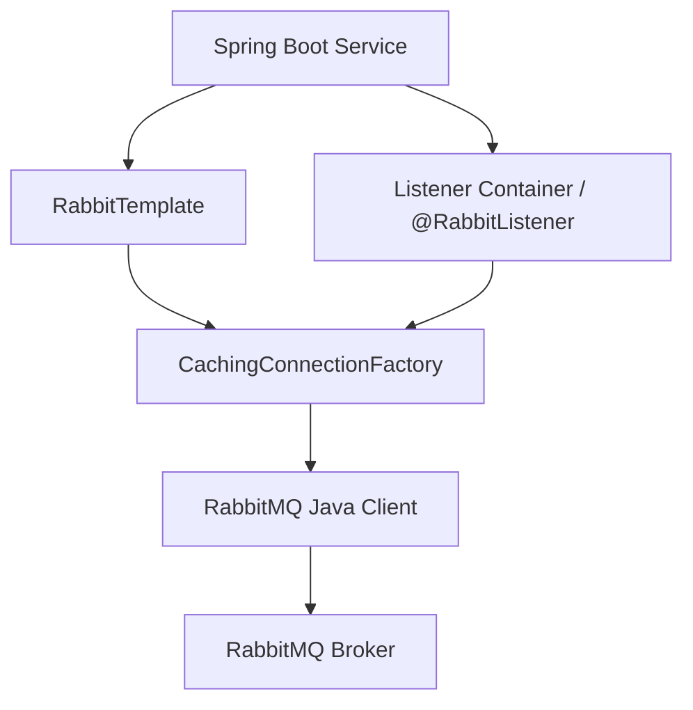
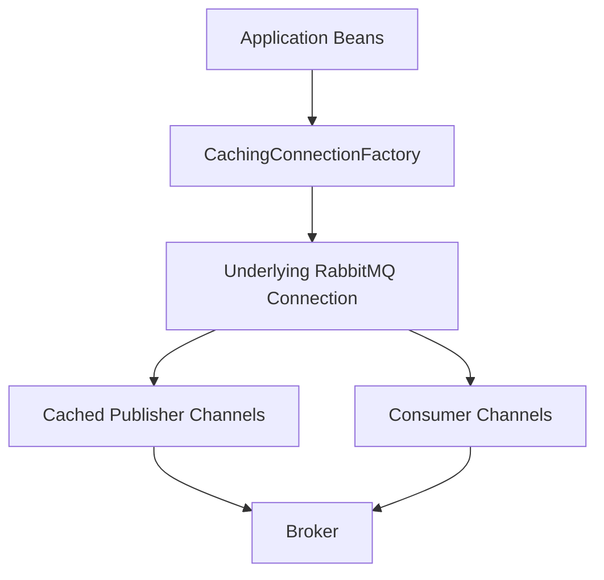
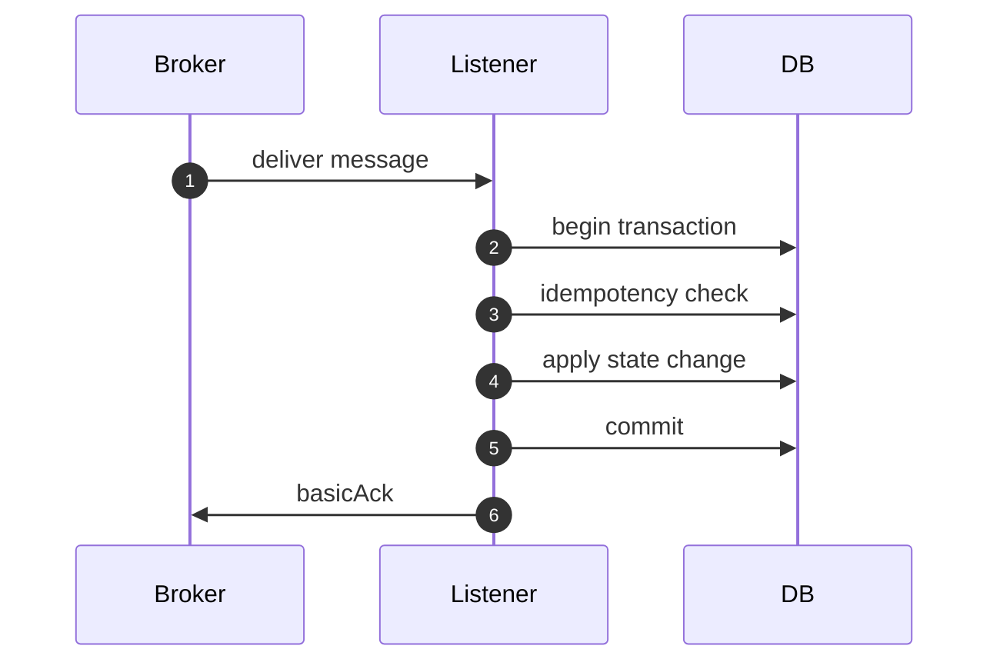
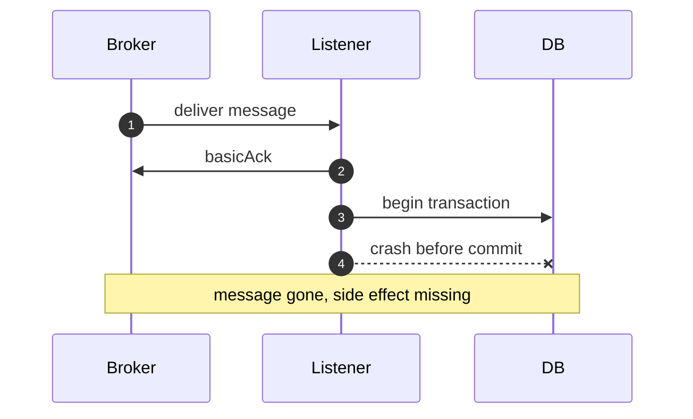

# Part 007 — Spring AMQP Without Magic: RabbitTemplate, Listener Containers, Boot Autoconfig

## 1. Tujuan Part Ini

Part ini membahas Spring AMQP bukan sebagai “cara mudah pakai RabbitMQ”, tetapi sebagai **abstraction layer** di atas RabbitMQ Java Client yang harus tetap kita pahami batasnya.

Targetnya:

1. memahami apa yang disembunyikan Spring AMQP dan apa yang tetap menjadi tanggung jawab engineer;
2. memakai `RabbitTemplate` tanpa kehilangan semantic publisher confirms, returns, correlation, dan timeout;
3. memakai `@RabbitListener` tanpa terjebak auto-retry, auto-ack, infinite redelivery, dan silent poison loop;
4. memahami listener container, concurrency, prefetch, channel lifecycle, dan error handling;
5. menyusun konfigurasi Spring Boot yang eksplisit, observable, dan production-safe;
6. tahu kapan harus turun ke raw Java client atau RabbitMQ Stream Java Client.

Spring AMQP membuat integrasi lebih cepat, tetapi tidak menghapus hukum dasar messaging:

> Broker tetap asynchronous, acknowledgement tetap semantic boundary, duplicate tetap mungkin, ordering tetap terbatas, dan idempotency tetap wajib.

---

## 2. Posisi Spring AMQP dalam Stack

Spring AMQP berada di antara aplikasi dan RabbitMQ Java Client.



Secara kasar:

| Layer | Tanggung Jawab |
|---|---|
| Application | business command/event handling, idempotency, transaction boundary |
| Spring AMQP | template API, listener container, conversion, retry integration, declarables |
| RabbitMQ Java Client | AMQP connection/channel, publish/consume, confirms, recovery |
| RabbitMQ Broker | routing, queueing, persistence, replication, flow control |

Spring AMQP membantu pada hal-hal mekanis:

- mengelola connection/channel caching;
- menyediakan `RabbitTemplate` untuk publish;
- menyediakan listener container untuk consumer;
- menyediakan declarable topology bean;
- menyediakan message converter;
- menyediakan error handler dan retry advice;
- menyediakan integration point dengan Micrometer/Observation.

Namun Spring AMQP tidak otomatis menyelesaikan:

- idempotency;
- deduplication;
- exactly-once side effect;
- schema governance;
- poison message classification;
- capacity planning;
- topology ownership;
- broker overload;
- consumer lag;
- race condition antara DB commit dan ack.

---

## 3. Raw Java Client vs Spring AMQP

Gunakan Spring AMQP ketika:

1. aplikasi sudah Spring Boot;
2. workload AMQP 0-9-1 umum: command, event notification, task queue, retry/DLQ;
3. kita butuh listener lifecycle yang mudah diintegrasikan dengan bean/service;
4. observability memakai ekosistem Spring/Micrometer;
5. throughput masih cocok dengan abstraction cost Spring.

Gunakan raw Java Client ketika:

1. butuh kontrol rendah atas channel, confirms, dan callback;
2. butuh custom connection/channel lifecycle;
3. workload ultra-high-throughput dan ingin mengurangi abstraction overhead;
4. ingin membangun framework internal yang tidak tergantung Spring;
5. consumer membutuhkan desain concurrency yang sangat khusus.

Gunakan RabbitMQ Stream Java Client ketika:

1. workload berbasis log/replay;
2. butuh offset-based consumption;
3. butuh super stream partitioning;
4. butuh throughput tinggi dengan stream protocol;
5. data tidak boleh hilang dari queue setelah consumer ack karena butuh replay/audit.

Decision rule:

> Spring AMQP bagus untuk **message-driven service** berbasis AMQP. Jangan memakainya untuk memaksa RabbitMQ menjadi Kafka-like stream processor.

---

## 4. Dependency Baseline

Contoh dependency Spring Boot umum:

```xml
<dependency>
    <groupId>org.springframework.boot</groupId>
    <artifactId>spring-boot-starter-amqp</artifactId>
</dependency>
```

Untuk testing:

```xml
<dependency>
    <groupId>org.springframework.amqp</groupId>
    <artifactId>spring-rabbit-test</artifactId>
    <scope>test</scope>
</dependency>
```

Untuk production, dependency saja tidak cukup. Minimal kita butuh konfigurasi eksplisit untuk:

- host/port/vhost/user/password;
- publisher confirms;
- publisher returns;
- listener acknowledgement mode;
- prefetch;
- concurrency;
- retry/DLQ behavior;
- message converter;
- observation/metrics;
- topology declaration policy.

---

## 5. Konfigurasi Spring Boot yang Tidak Implisit

Contoh `application.yml` baseline:

```yaml
spring:
  rabbitmq:
    host: localhost
    port: 5672
    username: app_user
    password: app_password
    virtual-host: app_vhost
    requested-heartbeat: 30s
    connection-timeout: 5s

    publisher-confirm-type: correlated
    publisher-returns: true
    template:
      mandatory: true
      receive-timeout: 2s
      reply-timeout: 5s

    listener:
      simple:
        acknowledge-mode: manual
        prefetch: 20
        concurrency: 2
        max-concurrency: 8
        default-requeue-rejected: false
        retry:
          enabled: false
      direct:
        acknowledge-mode: manual
        prefetch: 20
```

Catatan penting:

| Property | Makna |
|---|---|
| `publisher-confirm-type: correlated` | enable confirms dengan correlation data |
| `publisher-returns: true` | enable returned messages untuk unroutable publish |
| `template.mandatory: true` | broker mengembalikan message jika tidak ada route |
| `acknowledge-mode: manual` | listener harus ack/nack eksplisit |
| `default-requeue-rejected: false` | exception tidak otomatis requeue tanpa batas |
| `prefetch` | jumlah delivery in-flight per consumer/channel |
| `concurrency` | jumlah consumer thread awal |
| `max-concurrency` | batas scaling listener container |

Konfigurasi ini bukan “selalu benar”, tetapi production default yang aman untuk belajar:

- publisher harus tahu publish berhasil/gagal;
- unroutable message tidak boleh diam-diam hilang;
- consumer ack harus dikontrol dekat business transaction;
- error tidak boleh menjadi infinite redelivery loop.

---

## 6. `CachingConnectionFactory`: Channel Cache, Confirm, Return

Spring AMQP lazim memakai `CachingConnectionFactory`.

Mental model:



Contoh Java config eksplisit:

```java
@Configuration
public class RabbitConnectionConfig {

    @Bean
    public CachingConnectionFactory rabbitConnectionFactory(
            RabbitProperties properties
    ) {
        com.rabbitmq.client.ConnectionFactory raw = new com.rabbitmq.client.ConnectionFactory();
        raw.setHost(properties.getHost());
        raw.setPort(properties.getPort());
        raw.setUsername(properties.getUsername());
        raw.setPassword(properties.getPassword());
        raw.setVirtualHost(properties.getVirtualHost());
        raw.setRequestedHeartbeat(30);
        raw.setConnectionTimeout(5_000);

        CachingConnectionFactory factory = new CachingConnectionFactory(raw);
        factory.setPublisherConfirmType(CachingConnectionFactory.ConfirmType.CORRELATED);
        factory.setPublisherReturns(true);
        factory.setConnectionNameStrategy(connectionFactory -> "order-service-amqp");
        factory.setChannelCheckoutTimeout(2_000);
        factory.setChannelCacheSize(25);
        return factory;
    }
}
```

Prinsip:

1. jangan membuat connection factory tersembunyi di banyak tempat;
2. beri nama connection agar mudah dilacak di RabbitMQ Management UI;
3. pastikan channel cache tidak unlimited;
4. bedakan pressure karena broker lambat, network lambat, dan channel pool habis;
5. monitor runtime cache properties.

---

## 7. Topology Declaration dengan Bean Declarables

Spring AMQP bisa mendeklarasikan exchange, queue, dan binding sebagai bean.

Contoh:

```java
@Configuration
public class OrderRabbitTopology {

    public static final String EXCHANGE = "order.command.x";
    public static final String QUEUE = "order.reserve-inventory.q";
    public static final String DLX = "order.dlx";
    public static final String DLQ = "order.reserve-inventory.dlq";

    @Bean
    public DirectExchange orderCommandExchange() {
        return ExchangeBuilder.directExchange(EXCHANGE)
                .durable(true)
                .build();
    }

    @Bean
    public DirectExchange orderDeadLetterExchange() {
        return ExchangeBuilder.directExchange(DLX)
                .durable(true)
                .build();
    }

    @Bean
    public Queue reserveInventoryQueue() {
        return QueueBuilder.durable(QUEUE)
                .deadLetterExchange(DLX)
                .deadLetterRoutingKey("reserve-inventory.failed")
                .quorum()
                .build();
    }

    @Bean
    public Queue reserveInventoryDlq() {
        return QueueBuilder.durable(DLQ)
                .quorum()
                .build();
    }

    @Bean
    public Binding reserveInventoryBinding() {
        return BindingBuilder.bind(reserveInventoryQueue())
                .to(orderCommandExchange())
                .with("reserve-inventory");
    }

    @Bean
    public Binding reserveInventoryDlqBinding() {
        return BindingBuilder.bind(reserveInventoryDlq())
                .to(orderDeadLetterExchange())
                .with("reserve-inventory.failed");
    }
}
```

Topology-as-code bagus, tetapi ada governance rule:

| Rule | Alasan |
|---|---|
| Satu owner untuk setiap topology | menghindari service saling overwrite argumen queue |
| Declaration harus idempotent | service restart tidak boleh merusak topology |
| Queue argument immutable harus diperlakukan seperti migration | beberapa argumen tidak bisa diubah tanpa delete/recreate |
| DLX wajib eksplisit | failure route harus intentional |
| Naming convention wajib stabil | observability dan runbook bergantung pada nama |

Anti-pattern:

```java
@Bean
Queue randomQueue() {
    return new Queue("queue", true);
}
```

Masalahnya:

- nama terlalu generik;
- tidak jelas domain/service owner;
- tidak ada DLX;
- tidak ada queue type decision;
- tidak ada metadata operasional.

---

## 8. `RabbitTemplate`: Publish dengan Confirm dan Return

`RabbitTemplate` adalah abstraction utama untuk publishing.

Minimal publish:

```java
rabbitTemplate.convertAndSend(
        "order.command.x",
        "reserve-inventory",
        command
);
```

Untuk production, jangan berhenti di situ. Kita perlu correlation, confirm, return callback, dan timeout policy.

Contoh config:

```java
@Configuration
public class RabbitTemplateConfig {

    @Bean
    public RabbitTemplate rabbitTemplate(
            CachingConnectionFactory connectionFactory,
            MessageConverter messageConverter
    ) {
        RabbitTemplate template = new RabbitTemplate(connectionFactory);
        template.setMessageConverter(messageConverter);
        template.setMandatory(true);

        template.setConfirmCallback((correlationData, ack, cause) -> {
            String id = correlationData != null ? correlationData.getId() : "unknown";
            if (ack) {
                // record publish.confirm.ack
                return;
            }
            // record publish.confirm.nack with cause
            // trigger retry/reconciliation if needed
        });

        template.setReturnsCallback(returned -> {
            // returned means unroutable when mandatory=true
            // log as topology/configuration defect unless expected
            throw new UnroutableRabbitMessageException(
                    returned.getExchange(),
                    returned.getRoutingKey(),
                    returned.getReplyCode(),
                    returned.getReplyText()
            );
        });

        return template;
    }
}
```

A common mistake: menganggap exception dari `convertAndSend` berarti broker menolak publish.

Padahal ada beberapa hasil:

| Skenario | `convertAndSend` | Confirm callback | Return callback |
|---|---|---|---|
| Network/channel error sebelum write | bisa exception | tidak selalu | tidak |
| Broker accept publish | return normal | ack | tidak |
| Broker cannot route, `mandatory=false` | return normal | ack bisa terjadi | tidak |
| Broker cannot route, `mandatory=true` | return normal | ack bisa terjadi | ya |
| Broker nack publish | return normal | nack | mungkin tidak |

Maka publish API internal sebaiknya tidak hanya `void send(...)`.

Lebih baik:

```java
public interface ReliableRabbitPublisher {
    PublishResult publish(PublishCommand command);
}

public record PublishCommand(
        String exchange,
        String routingKey,
        String messageId,
        Object payload,
        Map<String, Object> headers
) {}

public sealed interface PublishResult {
    record Accepted(String messageId) implements PublishResult {}
    record Unroutable(String messageId, String exchange, String routingKey, String reason) implements PublishResult {}
    record Rejected(String messageId, String cause) implements PublishResult {}
    record Unknown(String messageId, String cause) implements PublishResult {}
}
```

---

## 9. Synchronous Publish dengan Correlated Confirm

Untuk business-critical publish, kita bisa menunggu confirm dengan bounded timeout.

```java
@Service
public class ConfirmingRabbitPublisher implements ReliableRabbitPublisher {

    private final RabbitTemplate rabbitTemplate;

    public ConfirmingRabbitPublisher(RabbitTemplate rabbitTemplate) {
        this.rabbitTemplate = rabbitTemplate;
    }

    @Override
    public PublishResult publish(PublishCommand command) {
        CorrelationData correlation = new CorrelationData(command.messageId());

        MessagePostProcessor postProcessor = message -> {
            MessageProperties p = message.getMessageProperties();
            p.setMessageId(command.messageId());
            p.setContentType(MessageProperties.CONTENT_TYPE_JSON);
            p.setDeliveryMode(MessageDeliveryMode.PERSISTENT);
            p.setHeader("producer", "order-service");
            p.setHeader("schema", command.payload().getClass().getSimpleName());
            command.headers().forEach(p::setHeader);
            return message;
        };

        try {
            rabbitTemplate.convertAndSend(
                    command.exchange(),
                    command.routingKey(),
                    command.payload(),
                    postProcessor,
                    correlation
            );

            CorrelationData.Confirm confirm = correlation.getFuture()
                    .get(5, TimeUnit.SECONDS);

            if (confirm.isAck()) {
                return new PublishResult.Accepted(command.messageId());
            }
            return new PublishResult.Rejected(
                    command.messageId(),
                    confirm.getReason()
            );
        } catch (TimeoutException e) {
            return new PublishResult.Unknown(command.messageId(), "confirm timeout");
        } catch (Exception e) {
            return new PublishResult.Unknown(command.messageId(), e.getMessage());
        }
    }
}
```

Interpretasi penting:

- `Accepted` berarti broker menerima tanggung jawab sesuai mekanisme queue;
- `Rejected` berarti broker secara eksplisit nack;
- `Unknown` berarti tidak boleh langsung dianggap gagal total;
- jika `Unknown`, producer harus aman untuk retry dan consumer harus idempotent.

---

## 10. Message Converter: Jangan Biarkan Format Menjadi Kebetulan

Default converter bisa bekerja untuk demo, tetapi production membutuhkan format eksplisit.

Contoh JSON converter:

```java
@Configuration
public class RabbitMessageConversionConfig {

    @Bean
    public Jackson2JsonMessageConverter jackson2JsonMessageConverter(ObjectMapper objectMapper) {
        Jackson2JsonMessageConverter converter = new Jackson2JsonMessageConverter(objectMapper);
        converter.setCreateMessageIds(false);
        return converter;
    }
}
```

Masalah converter yang sering muncul:

| Masalah | Dampak |
|---|---|
| Mengirim Java serialized object | coupling kuat ke class Java, risk security, sulit cross-language |
| Tidak menetapkan content type | consumer tidak tahu format payload |
| Type header bocor class internal | refactor package memecahkan consumer |
| Polymorphic JSON sembarangan | security dan compatibility risk |
| Tidak ada schema version | deploy rolling sulit |

Contract yang lebih sehat:

```json
{
  "eventId": "evt_01H...",
  "occurredAt": "2026-07-01T10:15:30Z",
  "schemaVersion": "order.reservation-requested.v1",
  "data": {
    "orderId": "ORD-1001",
    "sku": "SKU-9",
    "quantity": 2
  }
}
```

Header tetap berguna untuk routing/trace metadata, tetapi payload harus cukup self-describing untuk audit dan replay.

---

## 11. `@RabbitListener`: Convenience, Bukan Free Correctness

Contoh listener sederhana:

```java
@RabbitListener(queues = "order.reserve-inventory.q")
public void handle(ReserveInventoryCommand command) {
    inventoryApplicationService.reserve(command);
}
```

Untuk production, listener perlu akses delivery metadata dan channel untuk manual ack.

```java
@RabbitListener(
        queues = "order.reserve-inventory.q",
        containerFactory = "manualAckListenerContainerFactory"
)
public void handle(
        ReserveInventoryCommand command,
        Message message,
        Channel channel
) throws IOException {
    long tag = message.getMessageProperties().getDeliveryTag();

    try {
        inventoryApplicationService.reserve(command);
        channel.basicAck(tag, false);
    } catch (NonRetryableBusinessException e) {
        channel.basicReject(tag, false); // dead-letter or discard depending topology
    } catch (Exception e) {
        channel.basicNack(tag, false, true); // only if bounded/retry-safe
    }
}
```

Namun contoh ini masih terlalu sederhana. Production handler harus memperhatikan:

- idempotency sebelum side effect;
- transaction boundary;
- retry classification;
- redelivery count;
- DLQ route;
- observability;
- graceful shutdown;
- poison protection.

---

## 12. Listener Container Factory

Spring AMQP menyediakan beberapa container model. Yang paling umum:

| Container | Karakter |
|---|---|
| `SimpleMessageListenerContainer` | fleksibel, mendukung concurrency scaling, umum dipakai |
| `DirectMessageListenerContainer` | consumer lebih langsung per queue, latency lebih rendah untuk beberapa skenario |
| Stream listener container | untuk RabbitMQ Stream plugin/Spring integration, bukan AMQP queue biasa |

Contoh `SimpleRabbitListenerContainerFactory`:

```java
@Configuration
@EnableRabbit
public class RabbitListenerConfig {

    @Bean
    public SimpleRabbitListenerContainerFactory manualAckListenerContainerFactory(
            CachingConnectionFactory connectionFactory,
            MessageConverter messageConverter
    ) {
        SimpleRabbitListenerContainerFactory factory = new SimpleRabbitListenerContainerFactory();
        factory.setConnectionFactory(connectionFactory);
        factory.setMessageConverter(messageConverter);
        factory.setAcknowledgeMode(AcknowledgeMode.MANUAL);
        factory.setPrefetchCount(20);
        factory.setConcurrentConsumers(2);
        factory.setMaxConcurrentConsumers(8);
        factory.setDefaultRequeueRejected(false);
        factory.setMissingQueuesFatal(true);
        factory.setConsumerTagStrategy(queue -> "inventory-service:" + queue);
        factory.setAfterReceivePostProcessors(new TraceHeaderValidator());
        factory.setAdviceChain(); // intentionally empty; retry configured explicitly elsewhere
        return factory;
    }
}
```

Important defaults to choose deliberately:

| Setting | Production Question |
|---|---|
| `AcknowledgeMode` | siapa yang memutuskan message selesai? |
| `prefetchCount` | berapa banyak pekerjaan boleh in-flight per consumer? |
| `concurrentConsumers` | berapa paralelisme awal yang aman? |
| `maxConcurrentConsumers` | apakah autoscale consumer akan memperparah DB overload? |
| `defaultRequeueRejected` | apakah exception akan requeue tanpa batas? |
| `missingQueuesFatal` | apakah service boleh start jika topology hilang? |
| `consumerTagStrategy` | apakah consumer bisa ditelusuri di broker UI? |

---

## 13. Acknowledge Mode di Spring AMQP

Spring AMQP punya istilah acknowledgement yang perlu dibaca hati-hati.

| Spring `AcknowledgeMode` | Makna Praktis |
|---|---|
| `NONE` | RabbitMQ auto-ack; message dianggap selesai saat dikirim ke consumer |
| `AUTO` | container ack/nack berdasarkan listener return/exception |
| `MANUAL` | application code memanggil ack/nack sendiri |

Untuk service critical, default rekomendasi di seri ini:

> gunakan `MANUAL` sampai ada alasan kuat untuk `AUTO`.

Kenapa?

1. ack harus sedekat mungkin dengan business commit;
2. exception classification sering domain-specific;
3. retry/DLQ tidak boleh hanya berdasarkan “method throws exception”;
4. logging dan metrics butuh reason yang eksplisit;
5. poison message handling butuh redelivery count dan header inspection.

Contoh safe manual ack pattern:

```java
public void handleMessage(Message message, Channel channel) throws IOException {
    long tag = message.getMessageProperties().getDeliveryTag();
    String messageId = message.getMessageProperties().getMessageId();

    ProcessingDecision decision = processor.process(message);

    switch (decision.kind()) {
        case SUCCESS -> channel.basicAck(tag, false);
        case RETRY_LATER -> channel.basicNack(tag, false, false); // route to DLX retry queue
        case NON_RETRYABLE -> channel.basicReject(tag, false);
        case TRANSIENT_REQUEUE -> channel.basicNack(tag, false, true);
    }
}
```

Catatan:

- `requeue=true` harus sangat dibatasi;
- retry delayed biasanya lebih aman lewat DLX/TTL/delayed exchange;
- `basicNack(..., true)` bisa membuat hot loop jika consumer selalu gagal.

---

## 14. Error Handling: Jangan Campur Exception dengan Retry Policy

Exception adalah sinyal teknis. Retry policy adalah keputusan operasional.

Buruk:

```java
@RabbitListener(queues = "payment.capture.q")
public void handle(CapturePaymentCommand command) {
    paymentService.capture(command); // any exception becomes container policy
}
```

Lebih baik:

```java
@RabbitListener(
        queues = "payment.capture.q",
        containerFactory = "manualAckListenerContainerFactory"
)
public void handle(Message message, Channel channel) throws IOException {
    long tag = message.getMessageProperties().getDeliveryTag();

    try {
        CapturePaymentCommand command = decode(message);
        paymentHandler.handle(command);
        channel.basicAck(tag, false);
    } catch (InvalidCommandException e) {
        metrics.counter("rabbit.consumer.non_retryable").increment();
        channel.basicReject(tag, false);
    } catch (ExternalServiceUnavailableException e) {
        metrics.counter("rabbit.consumer.retry_later").increment();
        channel.basicNack(tag, false, false);
    } catch (Exception e) {
        metrics.counter("rabbit.consumer.unknown_failure").increment();
        channel.basicNack(tag, false, false);
    }
}
```

Klasifikasi minimum:

| Failure | Action |
|---|---|
| malformed JSON | reject, DLQ |
| schema unsupported | reject, DLQ |
| missing required domain entity | maybe reject atau retry tergantung consistency model |
| DB deadlock | retry later |
| downstream timeout | retry later dengan backoff |
| validation business final | reject/ack with audit event |
| duplicate command | ack sebagai success idempotent |

---

## 15. Spring Retry: Berguna tapi Berbahaya Jika Salah Tempat

Spring AMQP bisa memakai advice chain untuk retry.

Contoh stateless retry:

```java
@Bean
public RetryOperationsInterceptor retryInterceptor() {
    return RetryInterceptorBuilder.stateless()
            .maxAttempts(3)
            .backOffOptions(1_000, 2.0, 10_000)
            .recoverer(new RejectAndDontRequeueRecoverer())
            .build();
}
```

Lalu pasang:

```java
factory.setAdviceChain(retryInterceptor());
```

Namun perhatikan trade-off:

| Retry Type | Kelebihan | Risiko |
|---|---|---|
| in-memory immediate retry | cepat untuk glitch singkat | menahan consumer thread, bisa memperparah overload |
| broker delayed retry | memberi waktu downstream pulih | topology lebih kompleks |
| manual domain retry | paling eksplisit | code lebih banyak |
| infinite requeue | mudah | hampir selalu buruk |

Rule praktis:

1. gunakan immediate retry kecil untuk error mikro seperti optimistic lock/deadlock ringan;
2. gunakan delayed retry untuk downstream outage, rate limit, atau dependency recovery;
3. gunakan DLQ untuk malformed/non-retryable;
4. gunakan parking lot untuk pesan yang sudah melewati retry budget.

---

## 16. Consumer Concurrency dan Prefetch

Spring listener concurrency bukan sekadar “naikkan angka agar cepat”.

Effective in-flight:

```text
max_in_flight ≈ active_consumers × prefetch_count
```

Jika:

```yaml
concurrency: 8
prefetch: 100
```

Maka satu service instance bisa menahan sampai sekitar 800 delivery in-flight. Jika ada 10 pod, total bisa 8.000 delivery belum di-ack.

Dampaknya:

- redelivery setelah crash bisa besar;
- ordering makin sulit;
- memory pressure naik;
- DB/downstream bisa overload;
- shutdown graceful lebih lama;
- pesan “terkunci” di consumer lambat.

Tuning awal:

| Workload | Prefetch Awal | Concurrency Awal |
|---|---:|---:|
| CPU-heavy | 1–4 | jumlah core terbatas |
| IO-heavy bounded | 10–50 | sesuai connection pool/downstream budget |
| strict ordering | 1 | 1 per partition/entity queue |
| batch consumer | batch size × small multiplier | hati-hati dengan memory |
| high latency downstream | kecil dulu | scale berdasarkan saturation |

Decision formula:

```text
consumer_count <= min(
  cpu_budget,
  db_connection_budget,
  downstream_rate_limit,
  broker_channel_budget,
  acceptable_redelivery_burst / prefetch
)
```

---

## 17. Transaction Boundary: Ack Setelah Commit

Listener sering melakukan side effect ke database.

Timeline yang aman:



Jangan ack sebelum commit:



Pattern handler:

```java
@Transactional
public ProcessingOutcome process(ReserveInventoryCommand command) {
    if (processedMessageRepository.existsById(command.messageId())) {
        return ProcessingOutcome.duplicateAlreadyProcessed();
    }

    inventory.reserve(command.orderId(), command.sku(), command.quantity());
    processedMessageRepository.save(new ProcessedMessage(command.messageId()));

    return ProcessingOutcome.success();
}
```

Listener:

```java
try {
    ProcessingOutcome outcome = service.process(command);
    channel.basicAck(tag, false);
} catch (TransientDataAccessException e) {
    channel.basicNack(tag, false, false);
}
```

Important: Spring `@Transactional` pada listener method dan manual ack harus dipahami hati-hati. Jika ack dilakukan di dalam method sebelum transaction benar-benar commit, kita masih punya risiko. Lebih aman memisahkan business service transaction dan ack setelah service return sukses.

---

## 18. Message Post Processor untuk Header Governance

Producer harus menstandarkan metadata.

```java
public class StandardRabbitHeaders implements MessagePostProcessor {

    private final String messageId;
    private final String correlationId;
    private final String causationId;
    private final String schemaVersion;

    public StandardRabbitHeaders(
            String messageId,
            String correlationId,
            String causationId,
            String schemaVersion
    ) {
        this.messageId = messageId;
        this.correlationId = correlationId;
        this.causationId = causationId;
        this.schemaVersion = schemaVersion;
    }

    @Override
    public Message postProcessMessage(Message message) {
        MessageProperties p = message.getMessageProperties();
        p.setMessageId(messageId);
        p.setCorrelationId(correlationId);
        p.setDeliveryMode(MessageDeliveryMode.PERSISTENT);
        p.setContentType(MessageProperties.CONTENT_TYPE_JSON);
        p.setHeader("causationId", causationId);
        p.setHeader("schemaVersion", schemaVersion);
        p.setHeader("producer", "order-service");
        p.setHeader("producedAt", Instant.now().toString());
        return message;
    }
}
```

Metadata minimum:

| Field | Lokasi | Tujuan |
|---|---|---|
| `messageId` | property | deduplication |
| `correlationId` | property/header | trace request/workflow |
| `causationId` | header | event chain causality |
| `schemaVersion` | header/payload | compatibility |
| `producer` | header | ownership |
| `producedAt` | header/payload | latency/audit |
| `tenantId` | header/payload | multi-tenancy |

---

## 19. Consumer Header Validation

Jangan memproses message yang tidak memenuhi contract dasar.

```java
public final class RabbitMessageContractValidator {

    public void validate(Message message) {
        MessageProperties p = message.getMessageProperties();

        require(p.getMessageId(), "messageId");
        require(p.getCorrelationId(), "correlationId");
        requireHeader(p, "schemaVersion");
        requireHeader(p, "producer");
    }

    private void require(String value, String field) {
        if (value == null || value.isBlank()) {
            throw new InvalidMessageContractException("Missing " + field);
        }
    }

    private void requireHeader(MessageProperties p, String key) {
        Object value = p.getHeaders().get(key);
        if (value == null || value.toString().isBlank()) {
            throw new InvalidMessageContractException("Missing header " + key);
        }
    }
}
```

Listener:

```java
try {
    validator.validate(message);
    handler.handle(decode(message));
    channel.basicAck(tag, false);
} catch (InvalidMessageContractException e) {
    channel.basicReject(tag, false);
}
```

Prinsip:

> Contract violation bukan transient error. Jangan retry selamanya.

---

## 20. Request-Reply dengan `RabbitTemplate`: Gunakan Secara Terbatas

Spring AMQP mendukung request-reply:

```java
InventoryAvailabilityResponse response =
        (InventoryAvailabilityResponse) rabbitTemplate.convertSendAndReceive(
                "inventory.query.x",
                "availability",
                request
        );
```

Risiko:

- coupling temporal kembali muncul;
- caller menunggu response;
- timeout harus jelas;
- duplicate request/reply tetap mungkin;
- scaling dan backpressure lebih rumit;
- observability harus melacak outstanding requests.

Jika tetap dipakai:

```yaml
spring:
  rabbitmq:
    template:
      reply-timeout: 3s
```

Dan selalu desain:

- bounded timeout;
- idempotent request handler;
- correlation id;
- error response contract;
- circuit breaker di caller;
- fallback behavior.

Gunakan request-reply untuk query cepat atau integration seam yang memang membutuhkan response. Jangan memakainya sebagai default antar microservice.

---

## 21. Testing dengan Spring AMQP

Testing perlu beberapa level.

### 21.1 Unit Test Handler Tanpa Broker

Business handler harus bisa dites tanpa RabbitMQ.

```java
@Test
void shouldReserveInventoryIdempotently() {
    ReserveInventoryCommand command = new ReserveInventoryCommand("msg-1", "ORD-1", "SKU-1", 2);

    handler.handle(command);
    handler.handle(command);

    assertThat(inventory.available("SKU-1")).isEqualTo(8);
    assertThat(processedMessages.count()).isEqualTo(1);
}
```

### 21.2 Contract Test Serialization

```java
@Test
void shouldSerializeMessageWithStableContract() {
    Message message = converter.toMessage(command, new MessageProperties());

    assertThat(message.getMessageProperties().getContentType())
            .isEqualTo(MessageProperties.CONTENT_TYPE_JSON);
    assertThat(new String(message.getBody(), StandardCharsets.UTF_8))
            .contains("orderId");
}
```

### 21.3 Integration Test dengan Real Broker

Gunakan Testcontainers untuk RabbitMQ.

```java
@Testcontainers
@SpringBootTest
class RabbitIntegrationTest {

    @Container
    static RabbitMQContainer rabbit = new RabbitMQContainer("rabbitmq:4-management");

    @DynamicPropertySource
    static void rabbitProperties(DynamicPropertyRegistry registry) {
        registry.add("spring.rabbitmq.host", rabbit::getHost);
        registry.add("spring.rabbitmq.port", rabbit::getAmqpPort);
    }

    @Test
    void shouldPublishAndConsumeCommand() {
        publisher.publish(command);
        await().atMost(Duration.ofSeconds(5))
                .untilAsserted(() -> assertThat(repository.exists(...)).isTrue());
    }
}
```

Test yang wajib:

| Test | Tujuan |
|---|---|
| unroutable publish with mandatory | memastikan return callback aktif |
| broker restart during publish | verify unknown/confirm behavior |
| consumer exception retryable | message masuk retry/DLQ sesuai policy |
| malformed payload | reject ke DLQ |
| duplicate message | idempotent ack |
| slow consumer | prefetch/concurrency tidak runaway |
| shutdown while processing | no premature ack |

---

## 22. Observability Spring AMQP

Minimal metrics producer:

- publish attempt count;
- publish confirm ack count;
- publish confirm nack count;
- confirm latency;
- returned message count;
- publish unknown count;
- in-flight publish count;
- channel checkout latency.

Minimal metrics consumer:

- delivery count;
- ack count;
- nack count;
- reject count;
- processing latency;
- retry count;
- redelivery count;
- DLQ count;
- handler exception by class;
- idempotent duplicate count.

Logging producer:

```json
{
  "event": "rabbit_publish_confirmed",
  "messageId": "msg-123",
  "exchange": "order.command.x",
  "routingKey": "reserve-inventory",
  "confirmLatencyMs": 18,
  "correlationId": "corr-9"
}
```

Logging consumer:

```json
{
  "event": "rabbit_message_processed",
  "messageId": "msg-123",
  "queue": "order.reserve-inventory.q",
  "deliveryTag": 42,
  "redelivered": false,
  "latencyMs": 74,
  "decision": "ACK"
}
```

Trace propagation:

- propagate W3C `traceparent` if platform uses OpenTelemetry;
- keep `correlationId` for business workflow;
- do not confuse distributed trace id with business correlation id;
- include message id and queue/exchange attributes in spans.

---

## 23. Health Checks: Jangan Hanya “Can Connect”

Rabbit health check berlapis.

| Check | Pertanyaan |
|---|---|
| TCP connect | apakah broker reachable? |
| AMQP connection | apakah credentials/vhost benar? |
| channel open | apakah channel bisa dibuat? |
| topology exists | apakah exchange/queue/binding ada? |
| publish test | apakah route critical berfungsi? |
| confirm latency | apakah broker menerima publish tepat waktu? |
| consumer lag/depth | apakah service benar-benar memproses? |

Readiness untuk consumer sebaiknya false jika:

- queue critical hilang;
- connection belum recover;
- dependency DB/downstream tidak siap;
- redelivery storm sedang terjadi dan service perlu dished;
- channel acquisition gagal terus.

Liveness jangan terlalu agresif. Membunuh pod saat broker overload bisa memperparah redelivery storm.

---

## 24. Spring Boot Autoconfig: Apa yang Perlu Diwaspadai

Autoconfig bagus untuk baseline, tetapi production harus eksplisit pada hal-hal berikut:

| Area | Risk Jika Implisit |
|---|---|
| message converter | format berubah tanpa disadari |
| ack mode | ack timing tidak sesuai transaksi |
| retry | infinite atau hidden retry |
| publisher confirms | publish dianggap sukses padahal belum pasti |
| mandatory flag | unroutable message hilang diam-diam |
| listener concurrency | overload DB/downstream |
| topology declaration | service start mengubah broker tanpa governance |
| connection naming | sulit debugging di broker UI |

Audit konfigurasi:

```text
[ ] publisher-confirm-type is not none
[ ] publisher-returns enabled for critical producers
[ ] mandatory true for critical routes
[ ] acknowledge-mode explicit
[ ] default-requeue-rejected explicit
[ ] prefetch explicit
[ ] concurrency bounded
[ ] DLX configured for critical queues
[ ] message converter explicit
[ ] connection name strategy configured
[ ] metrics and observation enabled
```

---

## 25. Production-Ready Spring AMQP Blueprint

```mermaid
flowchart TD
    API[REST/gRPC API]
    Outbox[(Outbox Table)]
    Relay[Outbox Relay]
    Template[RabbitTemplate + Confirms]
    EX[order.command.x]
    Q[order.reserve-inventory.q]
    DLX[order.dlx]
    DLQ[order.reserve-inventory.dlq]
    Listener[@RabbitListener Manual Ack]
    Handler[Transactional Handler]
    DB[(Service DB)]
    Metrics[Metrics/Tracing/Logs]

    API --> DB
    DB --> Outbox
    Relay --> Template
    Template --> EX
    EX --> Q
    Q --> Listener
    Listener --> Handler
    Handler --> DB
    Q --> DLX
    DLX --> DLQ
    Template --> Metrics
    Listener --> Metrics
```

Key properties:

1. API transaction writes business state and outbox atomically;
2. relay publishes with confirms and marks outbox sent only after accepted/known policy;
3. queue has DLX;
4. listener uses manual ack;
5. handler is idempotent;
6. ack happens after successful processing;
7. retry/DLQ decision is explicit;
8. metrics cover both broker and app perspective.

---

## 26. Common Anti-Patterns

### 26.1 `convertAndSend` Without Confirms

```java
rabbitTemplate.convertAndSend(exchange, routingKey, payload);
```

Problem:

- application does not know if broker accepted responsibility;
- unroutable message can be invisible without mandatory/returns;
- failure classification impossible.

### 26.2 `@RabbitListener` With Hidden Auto Retry

Problem:

- poison message can burn CPU;
- downstream outage can become retry storm;
- DLQ might never receive message;
- processing latency metrics become misleading.

### 26.3 Large Prefetch with Slow Handler

Problem:

- messages pile up in app memory;
- queue depth appears lower than actual unprocessed work;
- crash causes large redelivery burst.

### 26.4 Business Logic Inside Listener Method

Problem:

- hard to unit test;
- transaction boundary unclear;
- ack mixed with domain logic;
- no reusable handler.

Better:

```text
@RabbitListener thin adapter
  -> decode/validate
  -> call application service
  -> decide ack/nack/reject
```

### 26.5 Queue Declaration by Every Consumer Without Ownership

Problem:

- mismatched queue args;
- startup failures;
- accidental destructive topology change;
- unclear operational owner.

---

## 27. Mini Lab: Build a Production-Safe Command Consumer

Goal:

- publish `ReserveInventoryCommand`;
- consume with manual ack;
- store processed message id;
- route invalid message to DLQ;
- retry transient DB failure through DLX path;
- expose metrics.

Acceptance criteria:

```text
[ ] valid command is processed once
[ ] duplicate message is acked without duplicate side effect
[ ] malformed payload is rejected to DLQ
[ ] missing route triggers return callback
[ ] publisher waits for confirm
[ ] consumer does not ack before commit
[ ] prefetch × concurrency is documented
[ ] logs contain messageId and correlationId
```

Failure injection:

1. stop broker during publish;
2. publish to wrong routing key;
3. throw exception before DB commit;
4. throw exception after DB commit but before ack;
5. kill consumer pod during processing;
6. publish duplicate command 100 times;
7. slow DB for 30 seconds.

Expected behavior:

- no silent publish loss;
- duplicate side effect prevented;
- unknown publish outcome reconciled;
- poison messages do not hot-loop;
- consumer lag visible.

---

## 28. Self-Correction Rubric

Kamu dianggap memahami Spring AMQP production-grade jika bisa menjawab tanpa menebak:

1. Apa bedanya `AcknowledgeMode.AUTO`, `MANUAL`, dan `NONE`?
2. Kapan `convertAndSend` bisa return normal tetapi message tetap tidak sampai ke queue target?
3. Apa syarat agar return callback dipanggil?
4. Apa risiko prefetch 100 dengan concurrency 20?
5. Mengapa `defaultRequeueRejected=true` berbahaya?
6. Bagaimana memastikan ack terjadi setelah DB commit?
7. Mengapa listener method sebaiknya thin adapter?
8. Apa bedanya transient failure dan non-retryable failure?
9. Bagaimana menguji unroutable publish?
10. Kapan Spring AMQP tidak cocok dan harus memakai Stream Java Client?

---

## 29. Referensi Resmi

- Spring AMQP Reference Documentation: `https://docs.spring.io/spring-amqp/reference/amqp.html`
- Spring AMQP `RabbitTemplate` / `AmqpTemplate`: `https://docs.spring.io/spring-amqp/reference/amqp/template.html`
- Spring AMQP Listener Concurrency: `https://docs.spring.io/spring-amqp/reference/amqp/listener-concurrency.html`
- RabbitMQ Consumer Acknowledgements and Publisher Confirms: `https://www.rabbitmq.com/docs/confirms`
- RabbitMQ Consumer Prefetch: `https://www.rabbitmq.com/docs/consumer-prefetch`
- RabbitMQ Queues: `https://www.rabbitmq.com/docs/queues`

---

## 30. Ringkasan

Spring AMQP mempercepat integrasi RabbitMQ di aplikasi Spring, tetapi abstraction ini harus dipakai dengan disiplin.

Mental model yang harus dibawa:

1. `RabbitTemplate` bukan jaminan publish berhasil kecuali confirms/returns dikonfigurasi dan diinterpretasikan;
2. `@RabbitListener` bukan jaminan processing benar kecuali ack, retry, idempotency, dan transaction boundary benar;
3. listener container concurrency harus dihitung sebagai budget, bukan angka tuning asal;
4. message converter dan header contract harus eksplisit;
5. error handling harus berdasarkan klasifikasi domain dan operasional, bukan sekadar exception;
6. production readiness terlihat dari metrics, logs, DLQ, failure tests, dan runbook.

Spring AMQP yang baik adalah Spring AMQP yang membuat hal umum mudah, tetapi tetap membuat semantic penting terlihat.
