# Part 008 — Command Messaging Pattern: Work Queues, Task Distribution, and Worker Pools

## 1. Tujuan Part Ini

Part ini membahas **command messaging** dan **work queue** sebagai pattern produksi, bukan sekadar tutorial “send task, receive task”.

Targetnya:

1. membedakan command, task, event, job, dan notification;
2. memahami competing consumers sebagai mekanisme distribusi kerja;
3. mendesain queue, routing key, worker pool, prefetch, dan concurrency sebagai satu sistem;
4. membangun worker yang idempotent dan tahan duplicate;
5. menghindari poison message loop, retry storm, dan starvation;
6. menyusun SLA-aware work queue architecture;
7. membuat decision framework kapan command queue cocok dan kapan tidak.

Command messaging adalah pattern yang sering terlihat sederhana, tetapi menjadi sumber banyak incident production karena engineer salah memahami satu hal:

> RabbitMQ mendistribusikan delivery. RabbitMQ tidak tahu apakah command secara bisnis aman, murah, idempotent, atau boleh diulang.

---

## 2. Definisi: Command vs Event vs Task

Sebelum mendesain queue, kita harus jelas jenis message.

| Jenis | Makna | Contoh | Ownership |
|---|---|---|---|
| Command | instruksi untuk melakukan sesuatu | `ReserveInventory`, `CapturePayment` | satu logical handler/owner |
| Task/Job | unit kerja teknis | `GenerateInvoicePdf`, `ResizeImage` | worker pool |
| Event | fakta bahwa sesuatu sudah terjadi | `OrderPlaced`, `PaymentCaptured` | publisher owns fact, subscribers independent |
| Notification | sinyal ringan agar pihak lain cek sesuatu | `OrderChanged` | publisher memberi tahu, detail bisa diambil terpisah |
| Query/RPC | permintaan jawaban | `CheckAvailability` | responder harus memberi response |

Command bersifat imperative:

```text
Do X for aggregate/entity Y.
```

Event bersifat factual:

```text
X happened to aggregate/entity Y.
```

Perbedaan ini menentukan topology.

Command queue biasanya:

- punya satu semantic owner;
- menggunakan direct/topic exchange;
- diproses oleh competing consumers dari service yang sama;
- membutuhkan idempotency;
- memiliki retry dan DLQ khusus;
- tidak dimaksudkan untuk banyak subscriber independen.

Event notification biasanya:

- dipublish ke exchange domain;
- setiap consumer group punya queue sendiri;
- tidak ada satu consumer yang “mengambil” event untuk semua orang;
- subscriber boleh bertambah tanpa mengubah publisher.

---

## 3. Basic Work Queue Mental Model

Work queue mendistribusikan message ke banyak worker yang bersaing.

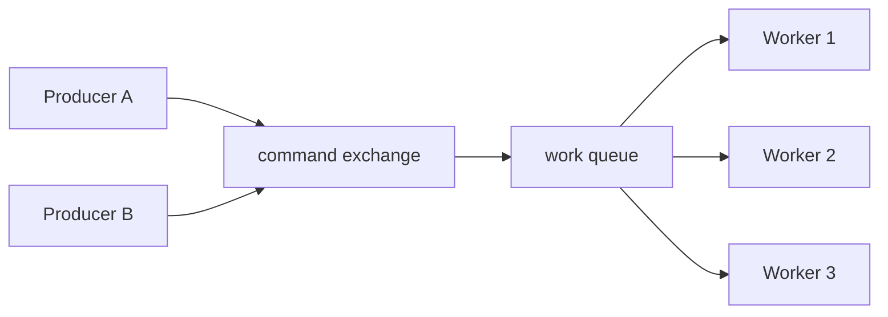

Karakteristik:

1. setiap message diproses oleh satu consumer instance;
2. jika worker belum ack lalu mati, message dapat redelivered;
3. prefetch membatasi berapa banyak message bisa in-flight per consumer;
4. concurrency menaikkan throughput sampai bottleneck lain tercapai;
5. ordering global tidak dijamin dengan banyak consumer;
6. duplicate harus diasumsikan mungkin.

Work queue cocok untuk:

- task asynchronous;
- load leveling;
- isolasi pekerjaan lambat dari request path;
- retryable side effects;
- background processing;
- command ke bounded context tertentu.

Work queue kurang cocok untuk:

- strict global ordering;
- event replay historis;
- fanout ke banyak subscriber;
- long-term audit log;
- real-time stream analytics;
- exactly-once distributed transaction.

---

## 4. Anatomy of a Command Message

Command message harus membawa cukup informasi agar worker bisa memproses secara deterministik.

Contoh envelope:

```json
{
  "messageId": "msg_01J1COMMAND0001",
  "commandId": "cmd_01J1RESERVE0001",
  "commandType": "inventory.reserve.v1",
  "correlationId": "corr_checkout_8899",
  "causationId": "http_request_123",
  "requestedAt": "2026-07-01T10:15:30Z",
  "requestedBy": "checkout-service",
  "tenantId": "tenant-a",
  "data": {
    "orderId": "ORD-1001",
    "sku": "SKU-RED-9",
    "quantity": 2
  }
}
```

Minimal field:

| Field | Fungsi |
|---|---|
| `messageId` | delivery/message deduplication |
| `commandId` | business command idempotency |
| `commandType` | routing/handler/schema compatibility |
| `correlationId` | trace workflow end-to-end |
| `causationId` | causal chain |
| `requestedAt` | latency and expiry decision |
| `requestedBy` | ownership and audit |
| `tenantId` | multi-tenancy and isolation |
| `data` | command-specific payload |

`messageId` dan `commandId` bisa sama untuk sistem sederhana. Namun pada sistem besar, bedakan:

- `messageId`: identity dari message envelope/delivery attempt;
- `commandId`: identity dari business intent.

Jika producer retry publish dengan envelope baru tetapi business intent sama, `commandId` harus tetap sama.

---

## 5. Topology Dasar Command Queue

Untuk command sederhana:

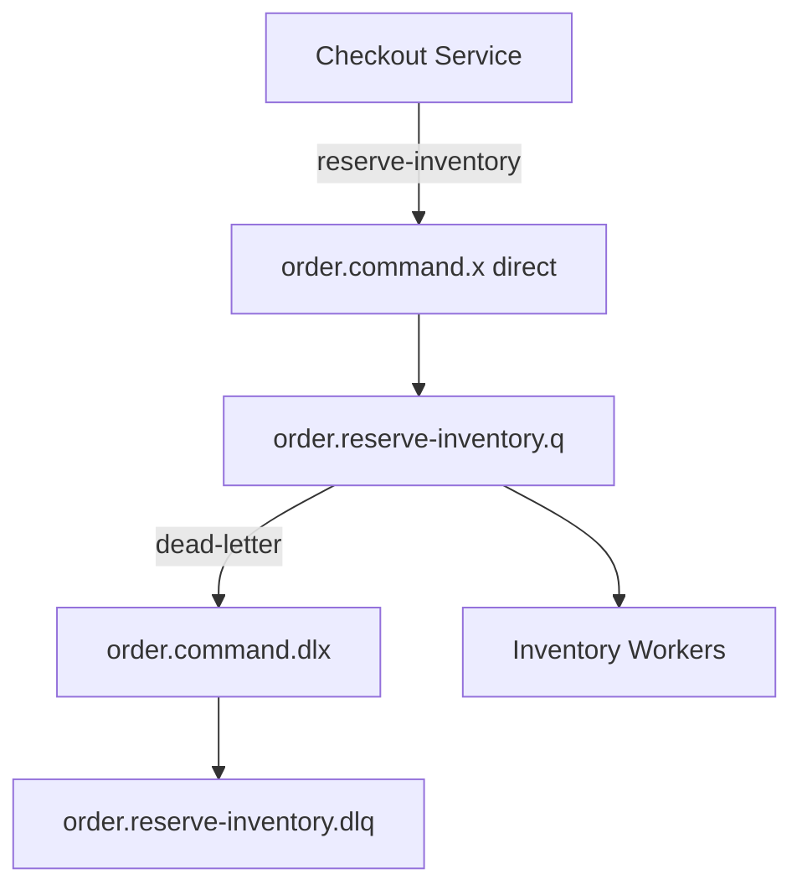

Naming convention:

| Component | Name | Reason |
|---|---|---|
| exchange | `order.command.x` | domain + intent type |
| queue | `order.reserve-inventory.q` | command-specific worker queue |
| routing key | `reserve-inventory` | stable command route |
| DLX | `order.command.dlx` | failure path for domain command |
| DLQ | `order.reserve-inventory.dlq` | command-specific dead letters |

Direct exchange cocok ketika routing key adalah command name.

Topic exchange cocok ketika ada dimensi tambahan:

```text
inventory.reserve.standard
inventory.reserve.priority
inventory.release.standard
payment.capture.high-value
```

Namun jangan membuat routing taxonomy terlalu pintar. Routing key bukan tempat business rule kompleks.

---

## 6. Competing Consumers

Competing consumers berarti banyak consumer membaca dari queue yang sama.

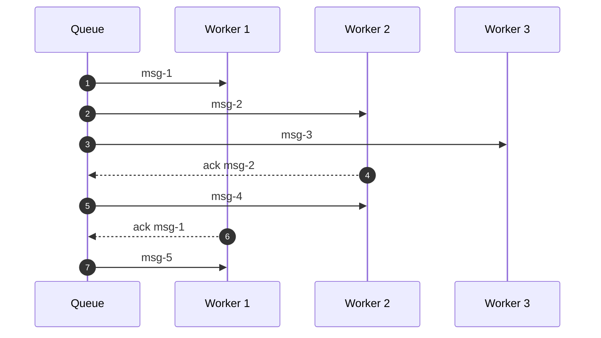

RabbitMQ akan mengirim delivery kepada consumer berdasarkan availability, prefetch, dan scheduling. Namun “fairness” tidak sama dengan business fairness.

Risiko:

| Risiko | Penyebab |
|---|---|
| worker lambat menahan banyak message | prefetch terlalu besar |
| ordering hilang | banyak consumer paralel |
| redelivery burst | crash saat banyak in-flight |
| hot entity race | command untuk entity sama diproses paralel |
| starvation | priority/tenant tidak dipisah |

Rule:

> Competing consumers bagus untuk throughput, tetapi mengurangi ordering dan meningkatkan kebutuhan idempotency/concurrency control.

---

## 7. Prefetch sebagai Work Budget

Prefetch bukan tuning kosmetik. Prefetch adalah budget delivery belum di-ack.

```text
in_flight_per_instance = consumer_threads × prefetch
in_flight_cluster = instance_count × consumer_threads × prefetch
```

Contoh:

```text
10 pods × 8 consumers × prefetch 50 = 4.000 in-flight commands
```

Jika setiap command melakukan DB update dan downstream call, 4.000 in-flight bisa menghancurkan dependency.

Starting point:

| Workload | Prefetch | Reason |
|---|---:|---|
| strict ordering per queue | 1 | satu message aktif |
| CPU-heavy | 1–4 | hindari queueing di app |
| DB write moderate | 5–20 | sesuai pool dan lock contention |
| IO-heavy with high latency | 10–50 | manfaatkan wait time |
| batch worker | batch size atau sedikit di atasnya | efisiensi batch |

Prefetch tuning harus berdasarkan measurement:

- processing latency;
- ack rate;
- queue depth;
- consumer utilization;
- DB pool saturation;
- downstream error rate;
- redelivery count;
- memory usage.

---

## 8. Worker Pool Sizing

Jangan sizing worker hanya dari jumlah CPU.

Untuk command worker, bottleneck bisa:

- CPU;
- DB connection pool;
- row/table lock;
- external API rate limit;
- broker connection/channel;
- JVM heap;
- network;
- tenant-specific quota.

Sizing model sederhana:

```text
safe_concurrency = min(
  cpu_parallelism,
  db_pool_available_for_worker,
  downstream_max_concurrent_calls,
  broker_channel_budget,
  domain_lock_contention_limit,
  operational_redelivery_limit / prefetch
)
```

Contoh:

```text
DB pool total: 40
reserved for HTTP/API: 20
reserved for scheduled jobs: 5
available for Rabbit workers: 15

If each message uses 1 DB connection:
max worker concurrency <= 15
```

Jika 3 pods:

```text
worker concurrency per pod <= floor(15 / 3) = 5
```

Jadi konfigurasi:

```yaml
spring:
  rabbitmq:
    listener:
      simple:
        concurrency: 3
        max-concurrency: 5
        prefetch: 10
```

Total in-flight:

```text
3 pods × 5 consumers × 10 prefetch = 150 messages
```

Apakah 150 aman? Tergantung processing time, retry behavior, dan crash recovery. Jangan berhenti di formula.

---

## 9. Command Handler Architecture

Pisahkan adapter RabbitMQ dari application service.

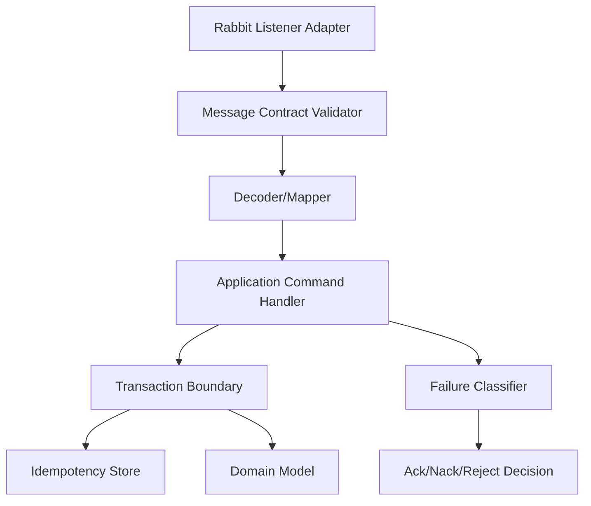

Adapter responsibilities:

- read message properties;
- validate envelope;
- decode payload;
- call handler;
- decide ack/nack/reject;
- log metrics.

Application handler responsibilities:

- enforce idempotency;
- execute domain logic;
- persist state;
- emit follow-up outbox event/command if needed;
- return processing outcome.

Do not put domain rules inside `@RabbitListener`.

---

## 10. Idempotent Command Handler

At-least-once delivery berarti duplicate command bisa terjadi.

Idempotent command handler pattern:

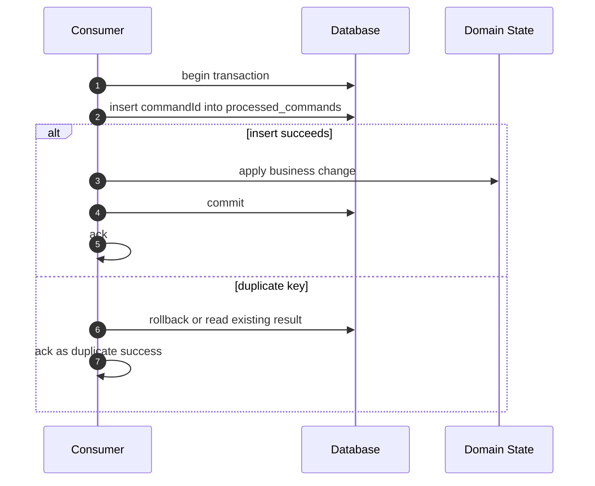

Pseudo schema:

```sql
CREATE TABLE processed_command (
    command_id      VARCHAR(128) PRIMARY KEY,
    command_type    VARCHAR(128) NOT NULL,
    processed_at    TIMESTAMP NOT NULL,
    result_code     VARCHAR(64) NOT NULL
);
```

Java handler:

```java
@Service
public class ReserveInventoryCommandHandler {

    private final ProcessedCommandRepository processedCommands;
    private final InventoryRepository inventory;

    @Transactional
    public CommandProcessingResult handle(ReserveInventoryCommand command) {
        boolean firstTime = processedCommands.tryInsert(
                command.commandId(),
                command.commandType()
        );

        if (!firstTime) {
            return CommandProcessingResult.duplicateAck();
        }

        inventory.reserve(
                command.orderId(),
                command.sku(),
                command.quantity()
        );

        processedCommands.markSucceeded(command.commandId());
        return CommandProcessingResult.success();
    }
}
```

Subtle issue:

- insert idempotency record before side effect;
- if transaction rolls back, insert also rolls back;
- if side effect external, local transaction tidak cukup;
- for external side effect, use provider idempotency key jika tersedia.

---

## 11. External Side Effects

Command sering memanggil external system: payment gateway, shipping provider, email provider.

Idempotency harus melewati boundary.

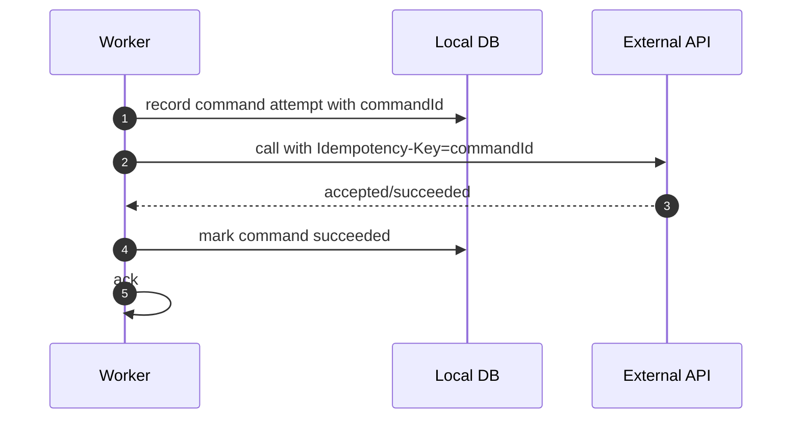

Jika external provider tidak mendukung idempotency key:

1. kurangi retry otomatis;
2. gunakan reconciliation job;
3. simpan request/response audit;
4. gunakan compensating action jika aman;
5. jangan menjanjikan exactly-once.

Failure matrix:

| Failure Point | Risiko | Mitigasi |
|---|---|---|
| before external call | command redelivered, safe | local idempotency |
| timeout after external success | duplicate external effect on retry | provider idempotency key/reconciliation |
| local DB commit fails after external success | local state inconsistent | reconciliation/audit |
| ack fails after success | message redelivered | idempotent handler |

---

## 12. Retry Classification for Commands

Tidak semua failure boleh retry.

| Failure | Retry? | Reason |
|---|---|---|
| malformed payload | no | producer bug or incompatible schema |
| unsupported command version | no or park | deploy/contract issue |
| entity not found | depends | maybe eventual consistency |
| validation final | no | business rule final |
| DB deadlock | yes | transient |
| DB connection unavailable | yes | transient infrastructure |
| downstream timeout | yes with backoff | transient dependency |
| downstream 4xx business error | no | request invalid/final |
| downstream 429 | yes with delay | rate limit |
| unknown exception | limited retry then park | avoid infinite loop |

Command retry pipeline:

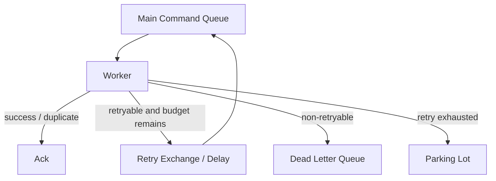

Important:

- retry must have budget;
- delayed retry prevents hot loop;
- DLQ is not garbage bin; it is operational evidence;
- parking lot is for human/reconciliation workflow.

---

## 13. TTL + DLX Retry Ring

A common broker-side delayed retry pattern:

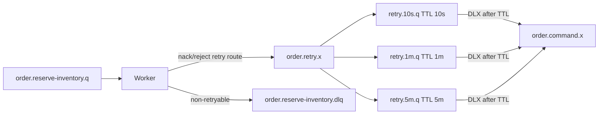

Pros:

- no consumer thread sleeping;
- retry delay handled by broker;
- pressure returns to queue after time;
- simple operational model.

Cons:

- more topology;
- headers such as `x-death` must be interpreted carefully;
- per-message dynamic delay with TTL queues has limitations;
- ordering can be affected.

---

## 14. Redelivery Count and Retry Budget

RabbitMQ can provide dead-letter headers like `x-death` when messages pass through DLX. Application can use this to estimate retry count.

Pseudo function:

```java
public int retryCount(Message message, String queueName) {
    Object deaths = message.getMessageProperties().getHeaders().get("x-death");
    if (!(deaths instanceof List<?> list)) {
        return 0;
    }

    return list.stream()
            .filter(Map.class::isInstance)
            .map(Map.class::cast)
            .filter(m -> queueName.equals(String.valueOf(m.get("queue"))))
            .map(m -> ((Number) m.getOrDefault("count", 0L)).intValue())
            .findFirst()
            .orElse(0);
}
```

Decision:

```java
if (failure.isNonRetryable()) {
    rejectToDlq();
} else if (retryCount < 3) {
    routeToRetry("10s");
} else if (retryCount < 6) {
    routeToRetry("1m");
} else {
    routeToParkingLot();
}
```

Do not rely on redelivery flag alone. `redelivered=true` means the broker believes this delivery has been delivered before; it is not a complete retry history.

---

## 15. SLA-Aware Queue Partitioning

Satu queue besar untuk semua command terlihat sederhana, tetapi bisa membuat incident.

Bad design:

```text
order.commands.q
  - reserve inventory
  - capture payment
  - send email
  - generate invoice
  - recalculate loyalty
```

Masalah:

- command lambat memblokir command cepat;
- SLA tidak bisa dibedakan;
- retry poison satu jenis command mengganggu semua;
- scaling per workload tidak bisa presisi;
- DLQ tidak jelas.

Better:

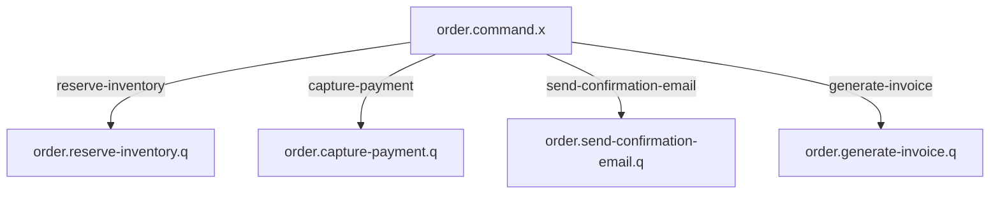

Partition by:

| Dimension | Kapan Dipakai |
|---|---|
| command type | default untuk workload berbeda |
| priority/SLA | high-priority command tidak boleh tertahan |
| tenant | tenant besar tidak boleh mengganggu tenant kecil |
| region | data locality dan failover |
| entity shard | ordering/concurrency per aggregate |
| dependency | command yang memanggil API lambat dipisah |

Namun jangan over-partition. Terlalu banyak queue meningkatkan operational overhead.

---

## 16. Priority Command: Pisahkan atau Queue Priority?

RabbitMQ mendukung priority queue, tetapi priority bukan solusi universal.

Pilihan:

### Option A — Separate Queues

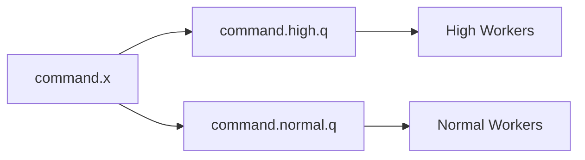

Kelebihan:

- capacity bisa dialokasikan eksplisit;
- monitoring jelas;
- failure isolation lebih baik;
- runbook sederhana.

Kekurangan:

- topology lebih banyak;
- routing lebih eksplisit;
- balancing capacity perlu dikelola.

### Option B — Priority Queue

Kelebihan:

- satu queue;
- broker mengurutkan berdasarkan priority.

Kekurangan:

- overhead;
- bisa menyebabkan starvation;
- lebih sulit reasoning dengan retry/redelivery;
- priority semantics terbatas jika banyak message sudah in-flight di consumers.

Rule:

> Untuk SLA kritis, lebih sering lebih aman memakai queue terpisah daripada mengandalkan priority queue.

---

## 17. Ordering dalam Command Queue

Command untuk entity yang sama kadang harus berurutan.

Contoh:

```text
ReserveInventory(order-1)
ReleaseInventory(order-1)
```

Jika diproses paralel, release bisa terjadi sebelum reserve.

Strategi:

| Strategi | Cocok Untuk | Trade-off |
|---|---|---|
| single queue, single consumer | ordering kuat | throughput rendah |
| shard queue by entity hash | ordering per shard | operational complexity |
| DB optimistic locking | concurrency safe | retry conflict |
| command sequence number | detect out-of-order | buffering/retry logic |
| stream/super stream by key | partitioned ordering | beda API/protocol |

Shard queue example:

```text
inventory.reserve.q.00
inventory.reserve.q.01
inventory.reserve.q.02
inventory.reserve.q.03
```

Routing:

```java
int shard = Math.floorMod(orderId.hashCode(), 4);
String routingKey = "reserve-inventory." + shard;
```

Caveat:

- shard count sulit diubah;
- hot key tetap bisa bottleneck;
- worker crash bisa redeliver banyak message;
- ordering tetap bisa rusak jika retry delayed melewati command berikutnya.

Jika ordering benar-benar core invariant, desain harus dimulai dari ordering, bukan ditambal di akhir.

---

## 18. Expiry and Stale Commands

Command bisa basi.

Contoh:

- reserve inventory setelah checkout expired;
- send OTP setelah session invalid;
- recalculate quote setelah quote superseded;
- dispatch enforcement notice setelah case status berubah.

Jangan selalu memproses command lama hanya karena masih ada di queue.

Pattern:

```java
public ProcessingDecision evaluateFreshness(CommandEnvelope<?> envelope) {
    Instant requestedAt = envelope.requestedAt();
    Duration age = Duration.between(requestedAt, Instant.now());

    if (age.compareTo(Duration.ofMinutes(15)) > 0) {
        return ProcessingDecision.reject("command expired");
    }
    return ProcessingDecision.continueProcessing();
}
```

Alternatif:

- message TTL;
- queue TTL;
- domain-level freshness check;
- supersession check by version;
- command cancellation message.

Do not rely only on RabbitMQ TTL for business correctness. TTL handles broker retention, not domain validity.

---

## 19. Backpressure in Command Systems

Backpressure harus terlihat di semua layer.

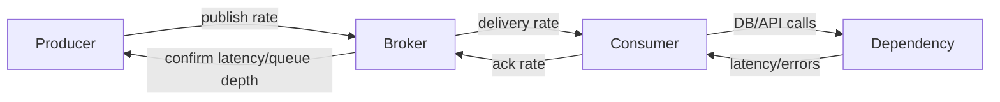

Signals:

| Layer | Signal |
|---|---|
| producer | confirm latency, returned count, publish timeout |
| broker | queue depth, memory alarm, disk alarm, publish rate, deliver rate |
| consumer | processing latency, active workers, nack/reject rate |
| dependency | DB pool usage, API 429/5xx, p95/p99 latency |
| business | SLA missed, command expired, retry exhausted |

Backpressure actions:

1. slow producer;
2. shed low-priority command;
3. split queue by SLA;
4. reduce consumer concurrency to protect dependency;
5. increase consumers only if dependency has capacity;
6. park poison messages;
7. apply rate limit per tenant.

Bad response:

```text
Queue depth high -> always add consumers
```

Better response:

```text
Queue depth high -> identify bottleneck -> add capacity only if downstream can absorb -> otherwise throttle producers or isolate workload
```

---

## 20. Command Queue Metrics

Broker metrics:

- ready messages;
- unacknowledged messages;
- publish rate;
- deliver/get rate;
- ack rate;
- redeliver rate;
- consumer count;
- memory/disk alarms.

Application metrics:

- command received count;
- command success count;
- duplicate count;
- retryable failure count;
- non-retryable failure count;
- retry exhausted count;
- processing latency by command type;
- time-in-queue latency;
- DB transaction latency;
- downstream call latency;
- ack/nack/reject count.

Derived metrics:

```text
consumer_lag_time ≈ queue_depth / ack_rate
```

```text
time_in_queue = consumer_received_at - message_requested_at
```

SLO example:

```text
99% ReserveInventory commands processed within 3 seconds of publish.
No more than 0.1% commands reach DLQ per hour.
No command older than 15 minutes is processed without freshness validation.
```

---

## 21. Logs and Trace for Command Handling

Use structured logs.

On receive:

```json
{
  "event": "command_received",
  "queue": "order.reserve-inventory.q",
  "commandId": "cmd-123",
  "messageId": "msg-123",
  "commandType": "inventory.reserve.v1",
  "correlationId": "corr-1",
  "redelivered": false,
  "retryCount": 0
}
```

On ack:

```json
{
  "event": "command_acked",
  "commandId": "cmd-123",
  "decision": "SUCCESS",
  "processingLatencyMs": 84,
  "timeInQueueMs": 320
}
```

On reject:

```json
{
  "event": "command_rejected",
  "commandId": "cmd-123",
  "reason": "INVALID_SCHEMA",
  "target": "DLQ"
}
```

Trace model:

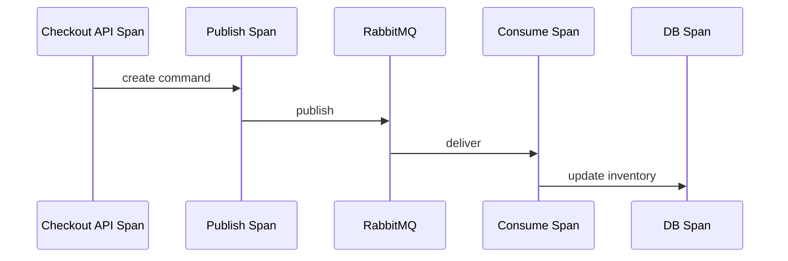

Use trace for causal timing, use business correlation id for workflow understanding. They are related but not identical.

---

## 22. Graceful Shutdown of Workers

A worker should not be killed while holding unacked messages unless the system accepts redelivery.

Shutdown sequence:

1. stop accepting new HTTP traffic if applicable;
2. stop listener container from receiving new deliveries;
3. wait for in-flight handlers to complete up to timeout;
4. ack completed messages;
5. nack/requeue or let connection close redeliver unfinished messages;
6. close channels/connections;
7. expose shutdown metrics.

Spring container lifecycle helps, but you must ensure:

- handler timeout is bounded;
- DB transaction timeout is bounded;
- downstream call timeout is bounded;
- Kubernetes termination grace period is sufficient;
- prefetch is not so high that drain takes too long.

Example budget:

```text
max handler p99: 2 seconds
prefetch: 20
consumer threads: 5
worst drain if fully busy: roughly handler timeout, not prefetch × timeout, if actual processing threads are bounded
terminationGracePeriodSeconds: 30
```

If handlers can hang for minutes, graceful shutdown will fail.

---

## 23. Security and Command Queues

Command queue security is not just credentials.

Checklist:

```text
[ ] producer can publish only to allowed command exchange
[ ] consumer can consume only its queues
[ ] DLQ access limited to operators/tools
[ ] vhost separates environment/tenant where needed
[ ] TLS enabled for cross-network traffic
[ ] payload does not expose unnecessary PII
[ ] audit fields present: requestedBy, tenantId, correlationId
[ ] command authorization happened before publish or inside handler
[ ] replay/retry tools require authorization
```

Important distinction:

- authentication: who connects to broker;
- authorization: what exchange/queue can be accessed;
- business authorization: is this command allowed for this user/tenant/entity?

Do not rely on broker permission to replace domain authorization.

---

## 24. Command Queue Testing Matrix

Unit tests:

| Test | Expected |
|---|---|
| valid command | state changes once |
| duplicate command | ack duplicate, no duplicate side effect |
| invalid payload | classified non-retryable |
| stale command | rejected/ignored per policy |
| transient failure | retry decision |
| final business failure | no retry |

Integration tests:

| Test | Expected |
|---|---|
| publish to route | message consumed |
| wrong route | return callback/DLQ depending design |
| consumer crash before ack | message redelivered |
| DB failure | retry path |
| DLQ path | message visible with reason |
| high concurrency | no lock/dependency meltdown |

Chaos tests:

1. kill broker node;
2. restart consumer while processing;
3. inject DB latency;
4. make downstream return 429;
5. publish duplicate burst;
6. publish poison message at high rate;
7. fill DLQ and verify alerting.

---

## 25. Java/Spring Implementation Blueprint

Command model:

```java
public record CommandEnvelope<T>(
        String messageId,
        String commandId,
        String commandType,
        String correlationId,
        String causationId,
        Instant requestedAt,
        String requestedBy,
        String tenantId,
        T data
) {}
```

Processing result:

```java
public sealed interface CommandResult {
    record Success() implements CommandResult {}
    record Duplicate() implements CommandResult {}
    record RetryableFailure(String reason) implements CommandResult {}
    record NonRetryableFailure(String reason) implements CommandResult {}
    record Expired(String reason) implements CommandResult {}
}
```

Listener adapter:

```java
@Component
public class ReserveInventoryRabbitListener {

    private final CommandMessageReader reader;
    private final ReserveInventoryCommandHandler handler;
    private final FailureClassifier failureClassifier;

    public ReserveInventoryRabbitListener(
            CommandMessageReader reader,
            ReserveInventoryCommandHandler handler,
            FailureClassifier failureClassifier
    ) {
        this.reader = reader;
        this.handler = handler;
        this.failureClassifier = failureClassifier;
    }

    @RabbitListener(
            queues = "order.reserve-inventory.q",
            containerFactory = "manualAckListenerContainerFactory"
    )
    public void onMessage(Message message, Channel channel) throws IOException {
        long tag = message.getMessageProperties().getDeliveryTag();

        try {
            CommandEnvelope<ReserveInventoryData> envelope =
                    reader.read(message, ReserveInventoryData.class);

            CommandResult result = handler.handle(envelope);
            acknowledge(result, tag, channel);
        } catch (Exception e) {
            FailureDecision decision = failureClassifier.classify(e, message);
            acknowledge(decision, tag, channel);
        }
    }

    private void acknowledge(CommandResult result, long tag, Channel channel) throws IOException {
        switch (result) {
            case CommandResult.Success ignored -> channel.basicAck(tag, false);
            case CommandResult.Duplicate ignored -> channel.basicAck(tag, false);
            case CommandResult.Expired ignored -> channel.basicReject(tag, false);
            case CommandResult.NonRetryableFailure ignored -> channel.basicReject(tag, false);
            case CommandResult.RetryableFailure ignored -> channel.basicNack(tag, false, false);
        }
    }

    private void acknowledge(FailureDecision decision, long tag, Channel channel) throws IOException {
        switch (decision.action()) {
            case ACK -> channel.basicAck(tag, false);
            case REJECT -> channel.basicReject(tag, false);
            case DEAD_LETTER -> channel.basicNack(tag, false, false);
            case REQUEUE -> channel.basicNack(tag, false, true);
        }
    }
}
```

This blueprint makes ack decision explicit.

---

## 26. When Not to Use a Command Queue

Do not use command queue when:

1. caller needs immediate deterministic response and cannot tolerate async workflow;
2. command must be globally ordered across many entities;
3. result must be strongly consistent inside same transaction as caller;
4. message history must be replayed many times by many consumers;
5. workload is analytical stream processing with windowing/watermark requirements;
6. human approval/state machine is the real abstraction;
7. command side effect is not idempotent and cannot be made safe.

Alternative:

| Need | Better Option |
|---|---|
| immediate response | synchronous API with timeout/circuit breaker |
| replayable event history | RabbitMQ Streams or Kafka-like log |
| orchestration | workflow engine/state machine |
| scheduled future execution | scheduler/delay queue with explicit constraints |
| high-volume analytics | stream processing platform |
| strict per-entity ordering | partitioned stream or entity actor model |

---

## 27. Real-World Design Example: Checkout Command Flow

Scenario:

1. checkout service receives order request;
2. it writes order state and outbox command;
3. outbox relay publishes `ReserveInventory` command;
4. inventory service consumes command;
5. inventory service reserves stock idempotently;
6. inventory service emits `InventoryReserved` event;
7. payment service later captures payment.

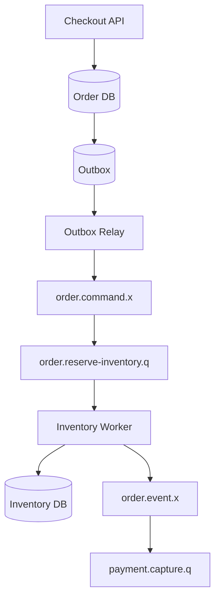

Critical invariants:

- order creation and outbox write are atomic;
- command publish is confirmed;
- reserve inventory is idempotent by `commandId`;
- command ack after DB commit;
- reservation event emitted through outbox;
- retry does not double-reserve;
- stale command rejected if order no longer active;
- DLQ alerts are tied to checkout SLA.

---

## 28. Operational Runbooks

### 28.1 Queue Depth Rising

Questions:

1. Is publish rate higher than normal?
2. Is ack rate lower than normal?
3. Are consumers connected?
4. Are messages unacked high?
5. Is DB/downstream slow?
6. Are retries increasing?
7. Is one tenant producing most messages?

Actions:

- if consumers down: restore consumers;
- if downstream slow: reduce concurrency/throttle producers;
- if poison message: isolate/DLQ/park;
- if legitimate load: scale consumers only after dependency capacity check;
- if tenant hotspot: apply tenant throttling or isolate queue.

### 28.2 Unacked Messages High

Possible causes:

- consumer hung;
- prefetch too high;
- handler slow;
- DB transaction stuck;
- downstream timeout too long;
- thread pool exhausted.

Actions:

- inspect consumer instances;
- check thread dump;
- check DB connection pool;
- reduce prefetch;
- restart carefully if handlers stuck;
- prepare for redelivery burst.

### 28.3 DLQ Spike

Questions:

1. Same exception or many?
2. Same producer version?
3. Same schema version?
4. Same tenant?
5. Same command type?
6. Recently deployed?

Actions:

- stop bad producer if contract broken;
- pause/reduce affected consumer;
- replay only after fix;
- do not blindly shovel DLQ to main queue.

---

## 29. Anti-Patterns

### 29.1 One Giant Command Queue

Looks simple, fails under mixed workload.

### 29.2 Requeue on Every Exception

Creates hot loop and hides poison.

### 29.3 No Command ID

Makes duplicate impossible to handle correctly.

### 29.4 Ack Before Side Effect Commit

Causes message loss relative to business state.

### 29.5 Scaling Consumers Without Dependency Budget

Moves bottleneck from queue to database/API.

### 29.6 Treating DLQ as Archive

DLQ is failure workflow, not storage strategy.

### 29.7 Ignoring Stale Commands

Async processing means business time matters.

---

## 30. Practice Drill

Build a command queue system with these requirements:

```text
Command: ReserveInventory
Producer: Checkout Service
Consumer: Inventory Service
Queue: order.reserve-inventory.q
DLQ: order.reserve-inventory.dlq
Retry: 10s, 1m, 5m, then parking lot
Idempotency: commandId
Freshness: reject if older than 15 minutes
SLO: p99 processed within 3 seconds under normal load
```

Implementation tasks:

1. define command envelope;
2. define exchange, queue, DLX, DLQ;
3. implement publisher with confirms and mandatory routing;
4. implement listener with manual ack;
5. implement idempotency table;
6. implement retry classifier;
7. implement stale command rejection;
8. add metrics;
9. add integration tests;
10. run failure injection.

Success criteria:

```text
[ ] duplicate command does not duplicate reserve
[ ] invalid payload goes to DLQ
[ ] transient DB failure retries with delay
[ ] stale command is rejected with audit log
[ ] wrong routing key triggers returned message
[ ] killing worker before ack causes safe redelivery
[ ] killing worker after DB commit before ack produces duplicate ack path
[ ] p99 latency is measured, not guessed
```

---

## 31. Self-Correction Rubric

Kamu memahami command messaging jika bisa menjawab:

1. Apa beda command dan event dalam topology RabbitMQ?
2. Mengapa command queue biasanya queue-per-command atau queue-per-workload?
3. Bagaimana menghitung total in-flight messages?
4. Kapan prefetch 1 adalah pilihan benar?
5. Mengapa retry dengan `requeue=true` bisa berbahaya?
6. Bagaimana desain idempotency untuk command yang memanggil external API?
7. Apa yang terjadi jika worker crash setelah DB commit tetapi sebelum ack?
8. Bagaimana mencegah tenant besar membuat tenant kecil starvation?
9. Kapan perlu shard queue by entity key?
10. Mengapa DLQ tidak boleh langsung di-replay tanpa analisis?

---

## 32. Referensi Resmi

- RabbitMQ Work Queues Tutorial Java: `https://www.rabbitmq.com/tutorials/tutorial-two-java`
- RabbitMQ Consumer Acknowledgements and Publisher Confirms: `https://www.rabbitmq.com/docs/confirms`
- RabbitMQ Consumer Prefetch: `https://www.rabbitmq.com/docs/consumer-prefetch`
- RabbitMQ Dead Letter Exchanges: `https://www.rabbitmq.com/docs/dlx`
- RabbitMQ Queues: `https://www.rabbitmq.com/docs/queues`
- Spring AMQP Reference Documentation: `https://docs.spring.io/spring-amqp/reference/amqp.html`

---

## 33. Ringkasan

Command messaging dengan RabbitMQ adalah pattern kuat untuk asynchronous work distribution, tetapi correctness tidak otomatis datang dari broker.

Mental model utama:

1. command adalah intent, bukan fact;
2. work queue mendistribusikan satu message ke satu worker;
3. competing consumers menaikkan throughput tetapi mengurangi ordering;
4. prefetch adalah budget in-flight, bukan angka random;
5. idempotency wajib karena duplicate dan redelivery adalah kondisi normal;
6. retry harus diklasifikasikan dan dibatasi;
7. DLQ adalah workflow operasional;
8. SLA sering membutuhkan queue partitioning;
9. ack harus mengikuti business commit;
10. scaling worker harus mengikuti bottleneck sistem, bukan hanya queue depth.

Jika Part 007 membangun Spring AMQP abstraction layer, Part 008 membangun pattern pertama di atasnya: command/work queue yang aman, scalable, dan bisa dioperasikan.
