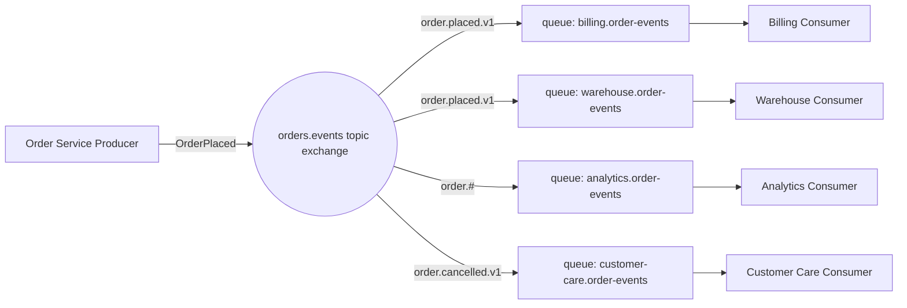
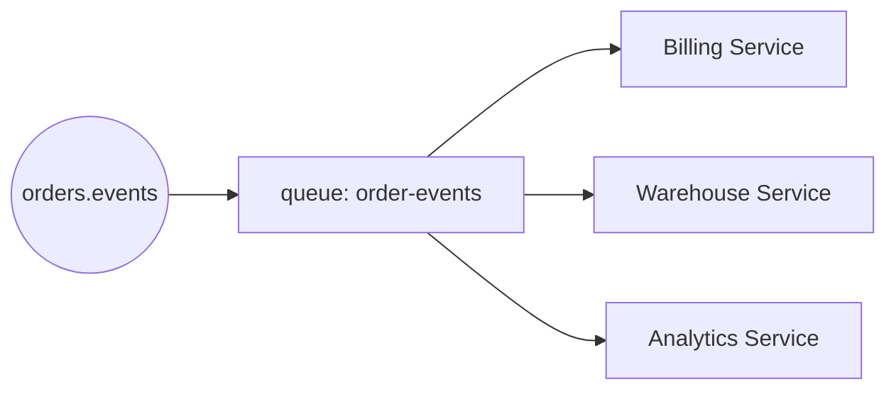
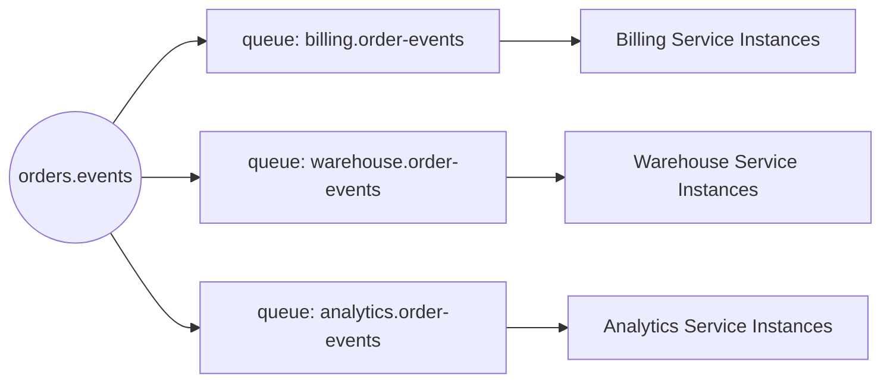
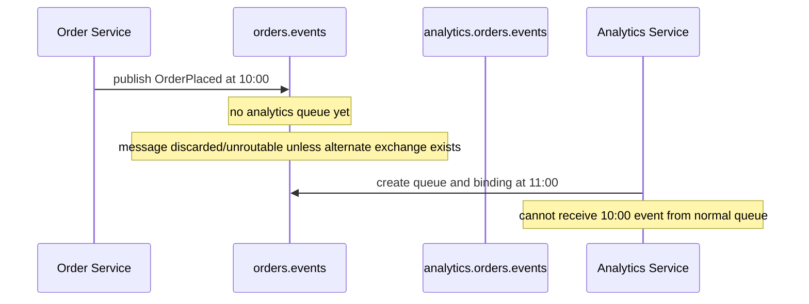
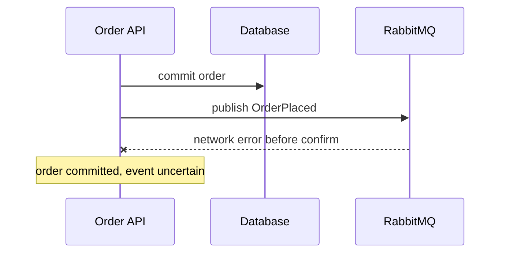
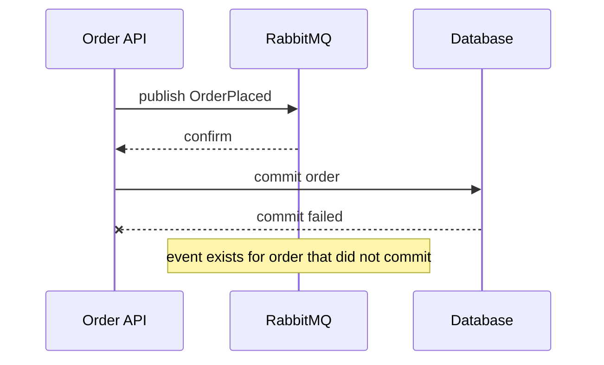
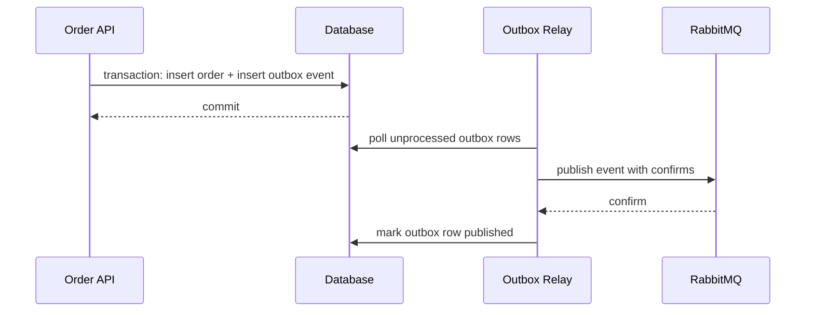

# Part 009 — Event Notification Pattern: Pub/Sub, Topic Routing, and Domain Events

## 1. Tujuan Part Ini

Part ini membahas **event notification pattern** dengan RabbitMQ untuk sistem produksi.

Targetnya bukan hanya bisa membuat `fanout exchange` atau `topic exchange`, tetapi bisa menjawab pertanyaan desain berikut:

1. kapan message harus disebut **event**, bukan command;
2. bagaimana mendesain topology pub/sub yang tidak mengikat producer ke consumer;
3. bagaimana memakai `fanout`, `topic`, dan queue-per-subscriber dengan benar;
4. bagaimana event schema, routing key, metadata, dan versioning dikelola;
5. bagaimana menghindari late-subscriber loss, hidden coupling, duplicate side effect, dan event storm;
6. kapan RabbitMQ queue cukup, dan kapan harus pindah ke RabbitMQ Stream;
7. bagaimana membuat event-driven architecture yang bisa dioperasikan, diaudit, dan dievolusi.

Event-driven architecture sering gagal bukan karena RabbitMQ lemah, tetapi karena event diperlakukan seperti function call jarak jauh.

> Event adalah fakta yang sudah terjadi. Consumer boleh bereaksi. Producer tidak boleh bergantung pada siapa yang bereaksi.

Itu invariant utama part ini.

---

## 2. Mental Model: Event Sebagai Fakta, Bukan Instruksi

Event menyatakan perubahan yang **sudah terjadi**.

Contoh event:

```text
OrderPlaced
PaymentAuthorized
QuoteApproved
InventoryReserved
CaseEscalated
CustomerRiskScoreChanged
```

Event tidak berkata:

```text
Please send email
Please update CRM
Please create invoice
Please call fraud service
```

Itu command.

Perbedaan ini penting karena RabbitMQ topology berbeda.

| Aspek | Command | Event |
|---|---|---|
| Makna | instruksi melakukan aksi | fakta yang sudah terjadi |
| Ownership | satu logical handler | banyak subscriber independen |
| Routing | ke queue owner | ke exchange domain |
| Failure | command bisa retry sampai berhasil/park | setiap subscriber punya failure policy sendiri |
| Coupling | caller tahu tujuan logis | publisher tidak tahu subscriber |
| Naming | imperative | past tense |
| Contoh | `ReserveInventory` | `InventoryReserved` |

Jika sebuah message bernama event tetapi consumer wajib melakukan aksi tertentu agar workflow benar, berarti itu kemungkinan bukan event murni. Itu bisa jadi:

- command yang disamarkan sebagai event;
- choreography saga yang butuh kompensasi jelas;
- workflow orchestration yang sebaiknya eksplisit;
- hidden temporal coupling.

Rule praktis:

> Jika producer menganggap sistem gagal ketika consumer tertentu tidak memproses message, itu bukan pub/sub event biasa.

---

## 3. Event Notification vs Event-Carried State Transfer

Dalam desain sistem, event tidak selalu membawa payload yang sama.

Ada beberapa tipe.

### 3.1 Event Notification

Event hanya memberi sinyal bahwa sesuatu berubah.

```json
{
  "eventId": "evt-20260701-001",
  "eventType": "OrderPlaced",
  "orderId": "ord-12345",
  "occurredAt": "2026-07-01T10:15:30Z"
}
```

Consumer yang butuh detail akan query service owner.

Kelebihan:

- payload kecil;
- schema lebih stabil;
- data sensitif tidak tersebar;
- publisher tidak harus tahu kebutuhan semua consumer.

Kekurangan:

- consumer melakukan extra query;
- owner service bisa terkena read amplification;
- race condition jika state berubah lagi sebelum consumer query;
- consumer tidak bisa replay event secara mandiri untuk rebuild state.

Cocok untuk:

- notifikasi ringan;
- cache invalidation;
- trigger asynchronous follow-up;
- domain dengan data sensitif.

### 3.2 Event-Carried State Transfer

Event membawa state yang cukup agar consumer bisa bekerja tanpa query balik.

```json
{
  "eventId": "evt-20260701-002",
  "eventType": "OrderPlaced",
  "orderId": "ord-12345",
  "customerId": "cust-891",
  "channel": "web",
  "currency": "IDR",
  "totalAmount": 1750000,
  "lines": [
    { "sku": "SKU-001", "quantity": 2, "unitPrice": 500000 },
    { "sku": "SKU-002", "quantity": 1, "unitPrice": 750000 }
  ],
  "occurredAt": "2026-07-01T10:15:30Z"
}
```

Kelebihan:

- consumer lebih mandiri;
- lebih cocok untuk projection, indexing, analytics, audit;
- bisa mengurangi query balik;
- bisa menjadi basis replay jika disimpan di stream/log.

Kekurangan:

- schema lebih berat;
- data duplication;
- privacy/compliance risk;
- event versioning menjadi lebih penting;
- producer bisa tergoda memasukkan semua kebutuhan consumer.

Cocok untuk:

- read model projection;
- downstream search index;
- compliance audit feed;
- analytics pipeline;
- integration feed antar bounded context.

### 3.3 State-Change Event

Event menyatakan perubahan status eksplisit.

```json
{
  "eventType": "OrderStatusChanged",
  "orderId": "ord-12345",
  "fromStatus": "PAYMENT_PENDING",
  "toStatus": "PAYMENT_AUTHORIZED",
  "reason": "payment-provider-approved"
}
```

Kelebihan:

- baik untuk state machine;
- mudah diaudit;
- bisa dipakai untuk compliance trace;
- consumer dapat mengecek transition validity.

Kekurangan:

- bisa terlalu generic jika semua hal disebut `StatusChanged`;
- domain meaning bisa hilang;
- consumer perlu tahu status semantics.

Untuk sistem regulatori, state-change event sering penting karena enforcement lifecycle, escalation, hold, release, appeal, closure, dan re-open harus bisa direkonstruksi.

---

## 4. RabbitMQ Pub/Sub Topology

RabbitMQ tidak memiliki “topic” seperti Kafka topic. Dalam AMQP 0-9-1, routing dilakukan oleh **exchange**.

Producer publish ke exchange.

Exchange mencocokkan message dengan binding.

Queue menyimpan message untuk subscriber.

Consumer consume dari queue.



Design invariant:

> Untuk pub/sub, independent subscriber harus punya queue sendiri.

Jangan membuat banyak service independen consume dari satu queue yang sama jika semuanya harus menerima event yang sama.

Satu queue dengan banyak consumer berarti **competing consumers**, bukan broadcast.

Salah:



Efeknya:

- hanya salah satu consumer menerima delivery tertentu;
- event tidak broadcast ke semua subscriber;
- consumer saling “mencuri” message;
- bug terlihat intermittent.

Benar:



Di dalam satu service, boleh ada banyak instance consumer pada queue yang sama untuk scale-out.

---

## 5. Fanout Exchange vs Topic Exchange

### 5.1 Fanout Exchange

Fanout exchange mengirim copy message ke semua destination yang bound ke exchange, routing key diabaikan.

Cocok untuk:

- broadcast sederhana;
- event category tunggal;
- testing topology;
- low governance integration;
- notification yang semua subscriber memang menerima semua event.

Contoh:

```text
exchange: audit.broadcast
queue: compliance.audit-events
queue: security.audit-events
queue: analytics.audit-events
```

Kelemahan:

- tidak ada selective routing;
- subscriber bisa menerima terlalu banyak noise;
- ketika domain event makin banyak, fanout menjadi kasar;
- filtering pindah ke consumer, bukan broker.

### 5.2 Topic Exchange

Topic exchange menggunakan pattern matching terhadap routing key.

Contoh routing key:

```text
order.placed.v1
order.cancelled.v1
payment.authorized.v1
payment.failed.v1
case.escalated.v1
case.closed.v1
```

Contoh binding:

```text
order.#
order.placed.*
payment.*.v1
case.escalated.v1
#.failed.*
```

Cocok untuk:

- event domain dengan banyak tipe;
- subscriber yang hanya butuh subset;
- event governance;
- tenant/region/type-aware routing;
- gradual schema evolution.

### 5.3 Direct Exchange untuk Event?

Direct exchange bisa dipakai untuk event jika routing key exact match cukup.

```text
exchange: orders.events.direct
routing key: OrderPlaced
binding key: OrderPlaced
```

Namun untuk domain yang tumbuh, topic exchange lebih fleksibel.

### 5.4 Headers Exchange

Headers exchange mencocokkan message berdasarkan headers, bukan routing key.

Gunakan hanya jika:

- routing butuh banyak dimensi opsional;
- routing key akan menjadi terlalu kompleks;
- binding dikelola oleh platform/governance;
- throughput dan operability tetap bisa diterima.

Untuk kebanyakan event domain, topic exchange lebih mudah di-debug.

---

## 6. Routing Key Taxonomy

Routing key adalah public API kecil.

Jangan desain asal.

Format yang buruk:

```text
placed
orderPlaced
foo.bar
service1.order.placed
web.id.customer.urgent.v2.payment.approved
```

Masalahnya:

- tidak konsisten;
- sulit wildcard;
- mencampur domain, service, channel, priority, tenant;
- routing key menjadi dumping ground.

Format yang lebih baik:

```text
<domain>.<event-family>.<event-name>.<version>
```

Contoh:

```text
order.lifecycle.placed.v1
order.lifecycle.cancelled.v1
payment.lifecycle.authorized.v1
payment.lifecycle.failed.v1
case.lifecycle.escalated.v1
case.assignment.reassigned.v1
```

Atau lebih ringkas:

```text
order.placed.v1
order.cancelled.v1
payment.authorized.v1
case.escalated.v1
```

Pilih format berdasarkan kompleksitas domain.

### 6.1 Apa yang Boleh Masuk Routing Key?

Boleh:

- domain atau bounded context;
- event family;
- event name;
- major version;
- region jika memang routing infrastruktur;
- tenant tier jika benar-benar butuh isolation topology.

Hindari:

- data sensitif;
- customer id;
- order id;
- nilai amount;
- free-form status;
- field yang sering berubah;
- informasi yang seharusnya ada di payload/header.

### 6.2 Version di Routing Key atau Payload?

Ada dua pendekatan.

Routing key version:

```text
order.placed.v1
order.placed.v2
```

Kelebihan:

- subscriber bisa bind versi tertentu;
- v1 dan v2 bisa hidup berdampingan;
- breaking change lebih eksplisit.

Kekurangan:

- binding bertambah;
- producer bisa publish banyak versi;
- event catalog harus rapi.

Payload/header version:

```text
routing key: order.placed
header: schemaVersion=v2
```

Kelebihan:

- routing lebih stabil;
- consumer bisa inspect metadata;
- cocok untuk compatible evolution.

Kekurangan:

- broker tidak bisa selective route berdasarkan schema kecuali pakai headers exchange;
- consumer harus handle version di aplikasi.

Praktik yang sering efektif:

- minor compatible change: versi di envelope/header;
- major breaking change: routing key baru.

---

## 7. Event Envelope Standard

Jangan publish payload domain mentah tanpa envelope.

Envelope memberi metadata untuk observability, deduplication, tracing, audit, dan compatibility.

Contoh envelope:

```json
{
  "eventId": "018ff1af-31a0-7c32-8b4b-5b95f3cc1e22",
  "eventType": "OrderPlaced",
  "eventVersion": 1,
  "occurredAt": "2026-07-01T10:15:30.123Z",
  "publishedAt": "2026-07-01T10:15:31.041Z",
  "producer": "order-service",
  "aggregateType": "Order",
  "aggregateId": "ord-12345",
  "correlationId": "corr-8a71",
  "causationId": "cmd-991",
  "traceId": "4bf92f3577b34da6a3ce929d0e0e4736",
  "tenantId": "tenant-a",
  "dataClassification": "internal",
  "payload": {
    "orderId": "ord-12345",
    "customerId": "cust-891",
    "currency": "IDR",
    "totalAmount": 1750000
  }
}
```

Minimal metadata untuk production:

| Field | Fungsi |
|---|---|
| `eventId` | idempotency/deduplication |
| `eventType` | semantic type |
| `eventVersion` | schema compatibility |
| `occurredAt` | business time |
| `publishedAt` | publish time |
| `producer` | ownership/debugging |
| `aggregateId` | ordering/dedup scope |
| `correlationId` | trace lintas request/workflow |
| `causationId` | event causality |
| `traceId` | distributed tracing |
| `tenantId` | tenant isolation/audit |

AMQP properties juga harus dipakai.

```java
AMQP.BasicProperties properties = new AMQP.BasicProperties.Builder()
    .contentType("application/json")
    .contentEncoding("UTF-8")
    .deliveryMode(2)
    .messageId(event.eventId())
    .type(event.eventType())
    .correlationId(event.correlationId())
    .timestamp(Date.from(event.publishedAt()))
    .headers(Map.of(
        "eventVersion", event.version(),
        "producer", "order-service",
        "schema", "order.placed.v1"
    ))
    .build();
```

Envelope di body dan metadata AMQP harus konsisten.

Jika `messageId` berbeda dari `eventId`, debugging dan deduplication akan kacau.

---

## 8. Publishing Domain Events in Java

Contoh publisher event tanpa framework tambahan.

```java
import com.rabbitmq.client.AMQP;
import com.rabbitmq.client.Channel;

import java.nio.charset.StandardCharsets;
import java.time.Instant;
import java.util.Date;
import java.util.Map;
import java.util.UUID;

public final class DomainEventPublisher {
    private final Channel channel;
    private final String exchangeName;
    private final JsonCodec jsonCodec;

    public DomainEventPublisher(Channel channel, String exchangeName, JsonCodec jsonCodec) {
        this.channel = channel;
        this.exchangeName = exchangeName;
        this.jsonCodec = jsonCodec;
    }

    public void publishOrderPlaced(OrderPlacedPayload payload, String correlationId, String causationId) throws Exception {
        String eventId = UUID.randomUUID().toString();
        Instant now = Instant.now();

        EventEnvelope<OrderPlacedPayload> event = new EventEnvelope<>(
            eventId,
            "OrderPlaced",
            1,
            now,
            now,
            "order-service",
            "Order",
            payload.orderId(),
            correlationId,
            causationId,
            payload.tenantId(),
            payload
        );

        byte[] body = jsonCodec.toJsonBytes(event);

        AMQP.BasicProperties properties = new AMQP.BasicProperties.Builder()
            .contentType("application/json")
            .contentEncoding(StandardCharsets.UTF_8.name())
            .deliveryMode(2)
            .messageId(eventId)
            .type("OrderPlaced")
            .correlationId(correlationId)
            .timestamp(Date.from(now))
            .headers(Map.of(
                "eventVersion", 1,
                "producer", "order-service",
                "aggregateType", "Order",
                "aggregateId", payload.orderId(),
                "causationId", causationId
            ))
            .build();

        channel.basicPublish(
            exchangeName,
            "order.lifecycle.placed.v1",
            true,
            properties,
            body
        );
    }
}
```

Catatan penting:

- `mandatory=true` membuat unroutable message dikembalikan melalui return listener;
- publisher confirms tetap perlu untuk memastikan broker menerima publish;
- durable exchange/queue tidak cukup jika message tidak persistent;
- event publisher sebaiknya memakai outbox jika event berasal dari database transaction.

Untuk production, publisher di atas belum cukup sampai ada:

- confirm handling;
- returned-message handling;
- retry bounded;
- outbox relay;
- metrics;
- structured log;
- integration test dengan broker asli.

---

## 9. Topology Declaration untuk Event Domain

Topology bisa dideklarasikan oleh aplikasi atau platform tool.

Contoh deklarasi Java:

```java
public final class OrderEventTopology {
    public static final String EXCHANGE = "orders.events";

    public static void declare(Channel channel) throws Exception {
        channel.exchangeDeclare(EXCHANGE, "topic", true, false, Map.of(
            "alternate-exchange", "orders.events.unroutable"
        ));

        channel.exchangeDeclare("orders.events.unroutable", "fanout", true);

        declareSubscriberQueue(channel,
            "billing.orders.events",
            "order.lifecycle.placed.v1",
            "order.lifecycle.cancelled.v1"
        );

        declareSubscriberQueue(channel,
            "warehouse.orders.events",
            "order.lifecycle.placed.v1",
            "order.lifecycle.cancelled.v1"
        );

        declareSubscriberQueue(channel,
            "analytics.orders.events",
            "order.#"
        );

        channel.queueDeclare("orders.events.unroutable.parking", true, false, false, Map.of());
        channel.queueBind("orders.events.unroutable.parking", "orders.events.unroutable", "");
    }

    private static void declareSubscriberQueue(Channel channel, String queue, String... bindings) throws Exception {
        channel.queueDeclare(queue, true, false, false, Map.of(
            "x-dead-letter-exchange", queue + ".dlx"
        ));
        channel.exchangeDeclare(queue + ".dlx", "fanout", true);
        channel.queueDeclare(queue + ".dlq", true, false, false, Map.of());
        channel.queueBind(queue + ".dlq", queue + ".dlx", "");

        for (String binding : bindings) {
            channel.queueBind(queue, EXCHANGE, binding);
        }
    }
}
```

Topology principles:

1. exchange dimiliki domain publisher;
2. queue dimiliki subscriber;
3. binding adalah subscription contract;
4. DLQ dimiliki subscriber, bukan global;
5. unroutable event harus terlihat;
6. topology declaration harus idempotent;
7. perubahan topology harus bisa di-review seperti API change.

---

## 10. Subscriber Isolation

Setiap subscriber independen harus punya queue sendiri.

Kenapa?

Karena failure policy tiap subscriber berbeda.

Contoh:

| Subscriber | SLA | Failure Policy | Queue |
|---|---:|---|---|
| Billing | tinggi | retry cepat + DLQ alert | `billing.orders.events` |
| Warehouse | tinggi | retry + manual intervention | `warehouse.orders.events` |
| Analytics | rendah | buffer besar + batch consume | `analytics.orders.events` |
| Email | sedang | delayed retry + drop stale | `notification.orders.events` |
| Audit | sangat tinggi | durable/replayed stream preferred | `audit.orders.events` |

Jika semua subscriber berbagi queue, maka:

- failure satu subscriber mempengaruhi subscriber lain;
- consumer lambat menahan message untuk semua;
- retry policy tidak bisa berbeda;
- DLQ menjadi campur aduk;
- ownership kabur.

Queue-per-subscriber bukan pemborosan. Itu boundary ownership.

---

## 11. Consumer Design for Events

Event consumer harus menganggap delivery bisa:

- duplicate;
- out of order;
- delayed;
- redelivered setelah crash;
- berasal dari schema versi lama;
- tidak relevan lagi karena state sudah berubah.

Contoh consumer skeleton:

```java
public final class OrderPlacedEventConsumer implements DeliverCallback {
    private final Channel channel;
    private final EventCodec codec;
    private final ProcessedEventRepository processedEvents;
    private final BillingProjection projection;

    public OrderPlacedEventConsumer(
        Channel channel,
        EventCodec codec,
        ProcessedEventRepository processedEvents,
        BillingProjection projection
    ) {
        this.channel = channel;
        this.codec = codec;
        this.processedEvents = processedEvents;
        this.projection = projection;
    }

    @Override
    public void handle(String consumerTag, Delivery delivery) throws IOException {
        long tag = delivery.getEnvelope().getDeliveryTag();

        try {
            EventEnvelope<OrderPlacedPayload> event = codec.decodeOrderPlaced(delivery.getBody());

            if (processedEvents.exists(event.eventId(), "billing-service")) {
                channel.basicAck(tag, false);
                return;
            }

            projection.applyOrderPlaced(event);
            processedEvents.markProcessed(event.eventId(), "billing-service");

            channel.basicAck(tag, false);
        } catch (NonRetryableEventException e) {
            channel.basicReject(tag, false);
        } catch (RetryableEventException e) {
            channel.basicNack(tag, false, true);
        } catch (Exception e) {
            channel.basicNack(tag, false, false);
        }
    }
}
```

Masalah yang harus diperbaiki untuk production:

- `projection.applyOrderPlaced` dan `processedEvents.markProcessed` harus atomic;
- retry tidak boleh infinite requeue loop;
- non-retryable event harus masuk DLQ/parking lot;
- schema decode error harus terlihat;
- consumer harus punya bounded concurrency;
- ack hanya setelah side effect aman.

---

## 12. Idempotency untuk Event Subscriber

Event subscriber yang aman memiliki invariant:

> Menerima event yang sama dua kali tidak boleh menghasilkan side effect bisnis ganda.

Contoh salah:

```java
public void onPaymentCaptured(PaymentCaptured event) {
    invoiceRepository.createInvoice(event.orderId());
    emailSender.sendReceipt(event.customerEmail());
}
```

Jika event redelivered, invoice dan email bisa double.

Lebih baik:

```java
public void onPaymentCaptured(PaymentCaptured event) {
    if (processedEventRepository.exists(event.eventId(), "invoice-service")) {
        return;
    }

    invoiceRepository.createInvoiceIfAbsent(event.orderId(), event.paymentId());
    outbox.addEmailReceiptCommandIfAbsent(event.eventId(), event.customerId(), event.orderId());
    processedEventRepository.markProcessed(event.eventId(), "invoice-service");
}
```

Deduplication key bisa berupa:

- `eventId + subscriberName`;
- `aggregateId + eventVersion + subscriberName`;
- domain-specific unique key, misalnya `paymentId`;
- idempotency key yang berasal dari causation id.

Jangan hanya mengandalkan RabbitMQ untuk mencegah duplicate. At-least-once delivery berarti duplicate adalah bagian dari model.

---

## 13. Late Subscriber Problem

Queue RabbitMQ hanya menerima message yang dirutekan ke queue tersebut.

Jika subscriber belum punya queue/binding saat event dipublish, subscriber tidak akan menerima event historis itu.

Contoh:



Solusi bergantung kebutuhan.

### 13.1 Tidak Butuh History

Jika subscriber hanya butuh event mulai saat onboarding:

- buat queue dan binding sebelum deploy consumer;
- document cutover time;
- terima bahwa event lama tidak diproses.

### 13.2 Butuh Backfill dari Database

Jika service owner punya source of truth:

- subscriber meminta snapshot/backfill;
- setelah snapshot, mulai consume event baru;
- perlu cutover marker agar tidak double/missing.

### 13.3 Butuh Replay Native

Jika replay adalah requirement utama:

- gunakan RabbitMQ Streams;
- simpan event sebagai log append-only;
- consumer punya offset;
- consumer bisa replay dari offset/timestamp.

Rule:

> Jika subscriber baru harus bisa memproses event historis secara mandiri, normal queue pub/sub bukan primitive yang tepat.

---

## 14. Event Ordering

RabbitMQ queue memberi ordering dalam batas tertentu, tetapi pub/sub multi-queue tidak memberi global ordering lintas subscriber.

Perhatikan:

- satu queue bisa FIFO secara umum;
- multiple consumers bisa mengubah completion order;
- prefetch besar bisa membuat processing order berbeda dari delivery order;
- redelivery bisa muncul setelah message yang lebih baru;
- queue berbeda tidak punya ordering bersama;
- event dari publisher berbeda bisa interleave.

Untuk event-driven architecture, jangan bergantung pada total order global.

Gunakan desain berikut:

1. event membawa `aggregateId`;
2. event membawa `sequence` atau `version` per aggregate jika ordering penting;
3. consumer menolak atau menunda event jika versi lompat;
4. stream/super stream digunakan jika partitioned ordering dibutuhkan;
5. side effect dibuat idempotent dan monotonic.

Contoh envelope dengan sequence:

```json
{
  "eventType": "CaseEscalated",
  "aggregateType": "EnforcementCase",
  "aggregateId": "case-991",
  "aggregateVersion": 42,
  "occurredAt": "2026-07-01T12:00:00Z"
}
```

Consumer bisa menjaga invariant:

```text
only apply event if aggregateVersion == currentProjectionVersion + 1
```

Namun ini menambah kompleksitas:

- perlu pending buffer;
- perlu timeout untuk missing version;
- perlu replay/backfill mechanism;
- perlu operational runbook.

---

## 15. Schema Evolution

Event adalah kontrak jangka panjang.

Consumer bisa tertinggal versi.

Publisher tidak boleh sembarangan mengubah payload.

### 15.1 Compatible Change

Biasanya aman:

- menambah optional field;
- menambah enum value jika consumer toleran;
- menambah metadata;
- memperluas payload tanpa mengubah makna field lama.

### 15.2 Breaking Change

Berbahaya:

- menghapus field;
- rename field;
- mengubah tipe field;
- mengubah makna field;
- mengubah requiredness;
- mengubah unit/currency/timezone;
- mengganti event meaning tetapi nama sama.

### 15.3 Rule Evolusi

Gunakan prinsip:

```text
old consumers must survive new events
new consumers must survive old events when replay/backfill exists
```

Untuk JSON:

- consumer ignore unknown fields;
- gunakan default untuk missing optional fields;
- hindari primitive ambiguous seperti `status=1`;
- timestamp gunakan ISO-8601 UTC;
- amount gunakan minor unit atau decimal string yang jelas;
- enum evolution harus didesain.

Contoh defensive DTO:

```java
public record OrderPlacedV1(
    String orderId,
    String customerId,
    String currency,
    long totalAmountMinor,
    Optional<String> salesChannel
) {}
```

Jika perubahan breaking:

- publish `order.placed.v2`;
- biarkan v1 dan v2 coexist;
- migration plan subscriber;
- deprecation window;
- event catalog update.

---

## 16. Event Catalog

Platform produksi membutuhkan event catalog.

Minimal catalog entry:

```yaml
name: OrderPlaced
routingKey: order.lifecycle.placed.v1
exchange: orders.events
owner: order-platform
producerService: order-service
schema: schemas/order/OrderPlaced.v1.json
compatibility: backward
containsPii: false
retentionRequirement: 7y-for-audit-copy
subscribers:
  - billing-service
  - warehouse-service
  - analytics-service
semantics:
  description: Published after an order is durably created and committed.
  occurrenceGuarantee: at-least-once
  orderingScope: per orderId when emitted through outbox relay
  idempotencyKey: eventId
failurePolicy:
  unroutable: alternate-exchange orders.events.unroutable
  duplicate: subscribers must deduplicate by eventId
```

Tanpa catalog:

- orang tidak tahu event mana yang boleh dikonsumsi;
- event berubah tanpa review;
- duplicate event dengan nama beda muncul;
- routing key liar;
- subscriber menjadi hidden dependency;
- compliance sulit.

---

## 17. Transactional Outbox for Event Publishing

Jika event berasal dari perubahan database, publish langsung dari transaction code berbahaya.

Skenario gagal:



Atau:



Outbox pattern memisahkan business transaction dari publish relay.



Invariant:

> Jika state commit, event record commit bersama state. Publish bisa diulang sampai confirm.

Outbox relay harus:

- publish idempotently;
- menggunakan publisher confirms;
- handle returned messages;
- mark published hanya setelah confirm;
- punya retry/backoff;
- punya lag metric;
- punya dead-letter untuk outbox poison row;
- preserve event ordering jika dibutuhkan per aggregate.

---

## 18. Event Consumer Failure Policy

Event subscriber tidak semua sama.

Contoh policy:

| Error | Contoh | Retry? | Action |
|---|---|---:|---|
| transient dependency | DB timeout | ya | delayed retry |
| rate limit | downstream 429 | ya | backoff |
| schema incompatible | missing required field | tidak | DLQ + alert |
| business invalid | unknown status transition | tidak langsung | park + investigate |
| stale event | event terlalu lama untuk email | tidak | ack + metric/drop |
| duplicate | same eventId | tidak | ack |

Consumer harus menghindari immediate infinite requeue.

Salah:

```java
channel.basicNack(tag, false, true);
```

untuk semua exception.

Efeknya:

- hot loop;
- CPU broker naik;
- queue tidak maju;
- message lain tertahan;
- log storm;
- dependency yang sedang down makin dihajar.

Lebih baik:

- classify exception;
- retry dengan delayed topology;
- batasi retry count;
- kirim ke DLQ/parking lot;
- alert berdasarkan rate dan age.

---

## 19. Event Notification Anti-Patterns

### 19.1 Event sebagai Command Tersembunyi

```text
UserRegistered event wajib dikonsumsi EmailService agar registration dianggap selesai.
```

Jika email wajib, jadikan workflow eksplisit:

- command `SendVerificationEmail`;
- saga/orchestrator;
- state `WAITING_EMAIL_SENT`;
- retry policy jelas.

### 19.2 Shared Queue untuk Banyak Subscriber

Sudah dibahas: itu competing consumers, bukan pub/sub.

### 19.3 Fat Event untuk Semua Kebutuhan

Event membawa 120 field karena setiap consumer meminta tambahan.

Risiko:

- schema tidak stabil;
- PII menyebar;
- payload besar;
- producer menjadi servant semua consumer;
- event sulit dipahami.

Solusi:

- pisahkan event notification dan event-carried state;
- buat event khusus untuk integration feed;
- gunakan schema governance.

### 19.4 Generic Event Name

```text
EntityChanged
StatusUpdated
DataModified
SyncTriggered
```

Masalah:

- consumer harus inspect payload;
- routing sulit;
- audit tidak jelas;
- semantics tidak eksplisit.

Lebih baik:

```text
OrderPlaced
PaymentAuthorized
CaseEscalated
QuoteApproved
```

### 19.5 Event Tanpa Owner

Jika tidak ada owner, event menjadi legacy artifact.

Setiap event harus punya:

- owning team;
- schema location;
- compatibility rule;
- deprecation rule;
- subscriber list;
- incident contact.

### 19.6 Synchronous Dependency di Event Consumer

Consumer event memanggil lima service synchronous untuk setiap event.

Risiko:

- event pipeline lambat;
- retry storm;
- cascading failure;
- broker backlog.

Solusi:

- cache/read model;
- event-carried state;
- async command follow-up;
- local projection;
- bounded concurrency dan circuit breaker.

---

## 20. Observability for Pub/Sub

Event-driven system butuh observability dari producer sampai subscriber.

### 20.1 Producer Metrics

- event published total by type;
- publish confirm latency;
- returned message count;
- outbox lag;
- outbox retry count;
- publish failure count;
- payload size distribution.

### 20.2 Broker Metrics

- queue depth per subscriber;
- message age per queue;
- ready vs unacked;
- consumer count;
- redelivery rate;
- DLQ rate;
- unroutable messages;
- disk/memory alarm.

### 20.3 Consumer Metrics

- consumed count by event type;
- processing latency;
- end-to-end lag: `now - occurredAt`;
- publish-to-consume lag: `consumeStartedAt - publishedAt`;
- success/failure by classification;
- idempotent duplicate count;
- schema decode failure count;
- DLQ count;
- parking lot count.

### 20.4 Logs

Setiap log penting harus punya:

```text
eventId
correlationId
causationId
routingKey
exchange
queue
consumerTag
aggregateId
eventType
eventVersion
attempt
```

### 20.5 Trace

Trace harus memperlihatkan:

```text
HTTP request / command
  -> DB transaction
  -> outbox row
  -> RabbitMQ publish
  -> subscriber consume
  -> downstream side effect
```

Tanpa correlation/causation, event-driven debugging menjadi archaeology.

---

## 21. Security and Compliance Notes

Event menyebarkan data.

Pertanyaan sebelum publish:

1. Apakah payload mengandung PII?
2. Apakah semua subscriber berhak membaca field itu?
3. Apakah message akan masuk DLQ yang bisa dibaca operator lain?
4. Apakah retention queue/stream sesuai regulasi?
5. Apakah event harus dienkripsi field-level?
6. Apakah event catalog mencatat data classification?
7. Apakah audit trail bisa menunjukkan siapa publish dan siapa consume?

Untuk domain sensitif, gunakan:

- event notification ringan;
- reference id bukan data lengkap;
- field minimization;
- tenant-aware vhost/permission;
- per-subscriber queues dengan permission khusus;
- encryption untuk field tertentu;
- retention policy eksplisit;
- DLQ access control.

---

## 22. Testing Event Topology

Testing tidak cukup dengan unit test publisher.

### 22.1 Topology Test

Validasi:

- exchange exists;
- exchange type benar;
- queue durable;
- bindings benar;
- DLQ configured;
- alternate exchange configured;
- permission sesuai.

### 22.2 Routing Test

Publish synthetic event ke exchange dan pastikan hanya queue yang tepat menerima.

Test matrix:

| Routing Key | Billing | Warehouse | Analytics | Customer Care |
|---|---:|---:|---:|---:|
| `order.lifecycle.placed.v1` | yes | yes | yes | no |
| `order.lifecycle.cancelled.v1` | yes | yes | yes | yes |
| `payment.lifecycle.authorized.v1` | no | no | no | no |
| `order.unknown.v1` | no/maybe | no/maybe | yes if `order.#` | no |

### 22.3 Contract Test

Consumer harus diuji terhadap:

- current schema;
- previous compatible schema;
- unknown fields;
- missing optional fields;
- invalid enum;
- malformed JSON;
- duplicate event.

### 22.4 Failure Test

Simulasikan:

- consumer crash before ack;
- DB timeout;
- schema error;
- duplicate delivery;
- DLQ path;
- outbox relay restart;
- unroutable publish;
- broker restart.

---

## 23. Practice Drill

Bangun mini topology:

```text
orders.events topic exchange
billing.orders.events queue
warehouse.orders.events queue
analytics.orders.events queue
orders.events.unroutable alternate exchange
```

Routing:

```text
billing.orders.events -> order.lifecycle.placed.v1, order.lifecycle.cancelled.v1
warehouse.orders.events -> order.lifecycle.placed.v1
analytics.orders.events -> order.#
```

Implementasi:

1. publish `OrderPlaced` event dengan envelope lengkap;
2. publish dengan publisher confirm;
3. aktifkan `mandatory=true`;
4. implement return listener;
5. buat tiga consumer;
6. billing consumer idempotent;
7. warehouse consumer sengaja gagal untuk melihat DLQ;
8. analytics consumer batch processing;
9. ukur queue depth dan processing lag;
10. tulis runbook untuk schema error dan subscriber down.

Acceptance criteria:

- setiap subscriber menerima event sesuai binding;
- duplicate event tidak membuat side effect ganda;
- unroutable message tidak silent loss;
- failure consumer tidak mempengaruhi queue subscriber lain;
- event bisa ditelusuri dengan `eventId` dan `correlationId`.

---

## 24. Decision Framework

Gunakan event notification RabbitMQ queue jika:

- subscriber hanya butuh event setelah subscription aktif;
- replay historis bukan requirement utama;
- throughput moderat;
- event fanout butuh queue isolation;
- delayed/retry/DLQ per subscriber penting;
- operational model sudah siap.

Gunakan RabbitMQ Streams jika:

- replay adalah requirement utama;
- banyak consumer independent butuh historical read;
- event menjadi append-only audit/integration log;
- throughput tinggi;
- offset-based consumption diperlukan;
- retention by time/size cocok.

Gunakan command queue jika:

- message adalah instruksi untuk satu owner;
- producer peduli aksi selesai;
- ada workflow state yang harus bergerak;
- failure handling harus terpusat.

Gunakan orchestrator/workflow engine jika:

- banyak step wajib;
- kompensasi kompleks;
- state machine eksplisit;
- human approval/escalation;
- SLA dan timeout per step.

---

## 25. Production Checklist

Sebelum event masuk production:

- [ ] event name past tense dan domain-specific;
- [ ] exchange owner jelas;
- [ ] subscriber queue owner jelas;
- [ ] queue-per-independent-subscriber;
- [ ] routing key taxonomy disetujui;
- [ ] event envelope lengkap;
- [ ] `eventId` dipakai sebagai `messageId`;
- [ ] schema version jelas;
- [ ] PII/data classification jelas;
- [ ] publisher confirms aktif;
- [ ] unroutable handling aktif;
- [ ] outbox digunakan jika event berasal dari DB commit;
- [ ] consumer idempotent;
- [ ] retry/DLQ per subscriber;
- [ ] metrics/logs/traces tersedia;
- [ ] event catalog diperbarui;
- [ ] late subscriber strategy jelas;
- [ ] replay requirement dievaluasi;
- [ ] failure drill pernah dijalankan.

---

## 26. Ringkasan

Event notification dengan RabbitMQ adalah pattern kuat untuk decoupling antar service, tetapi hanya aman jika kita menjaga boundary:

- event adalah fakta, bukan instruksi;
- producer publish ke exchange, bukan ke queue consumer;
- subscriber independen punya queue sendiri;
- routing key adalah public contract;
- event envelope wajib untuk traceability;
- consumer harus idempotent;
- retry dan DLQ adalah milik subscriber;
- normal queue pub/sub tidak menyelesaikan replay historis;
- schema governance adalah bagian dari desain, bukan dokumentasi tambahan.

Part berikutnya membahas request-reply/RPC. Pattern itu tampak praktis, tetapi membawa coupling dan failure semantics yang jauh lebih tajam daripada event notification.

---

## Referensi

- RabbitMQ Documentation — Exchanges: https://www.rabbitmq.com/docs/exchanges
- RabbitMQ Tutorial — Publish/Subscribe: https://www.rabbitmq.com/tutorials/tutorial-three-java
- RabbitMQ Tutorial — Routing: https://www.rabbitmq.com/tutorials/tutorial-four-java
- RabbitMQ Tutorial — Topics: https://www.rabbitmq.com/tutorials/tutorial-five-java
- RabbitMQ Documentation — Reliability and Data Safety: https://www.rabbitmq.com/docs/reliability
- RabbitMQ Documentation — Consumer Acknowledgements and Publisher Confirms: https://www.rabbitmq.com/docs/confirms
