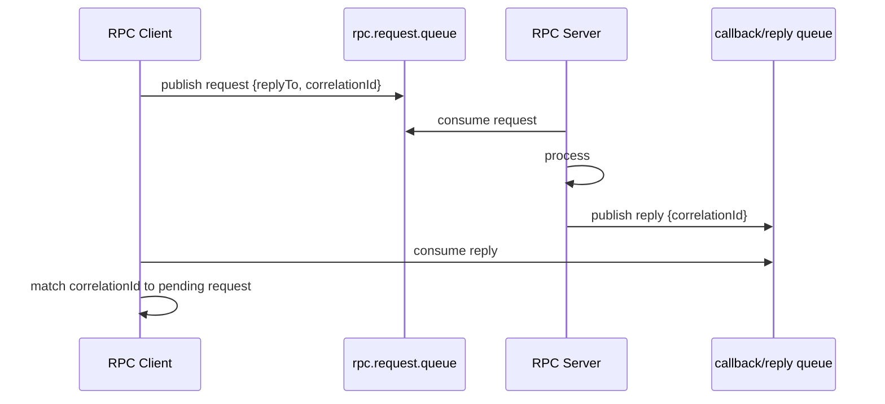
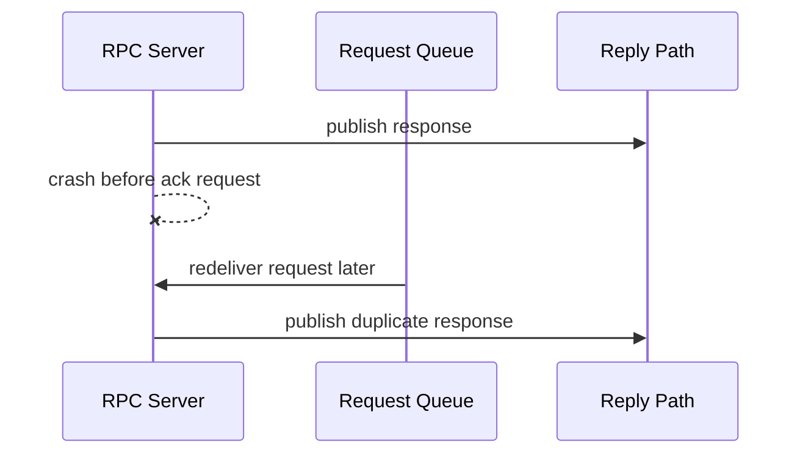
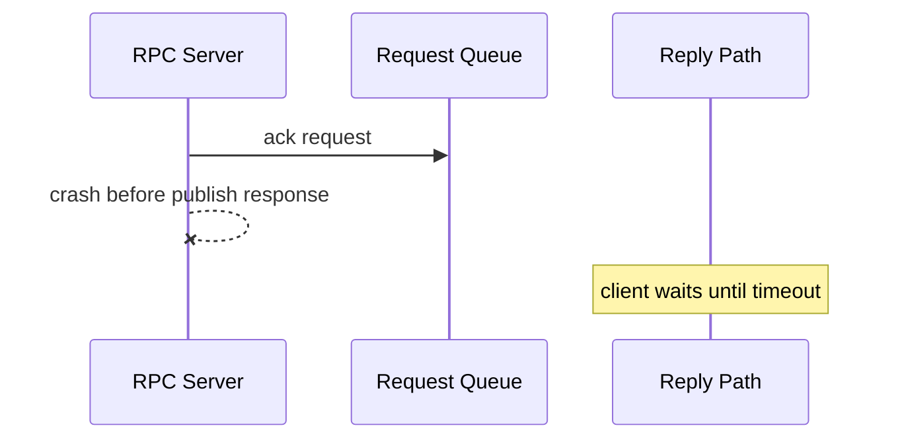
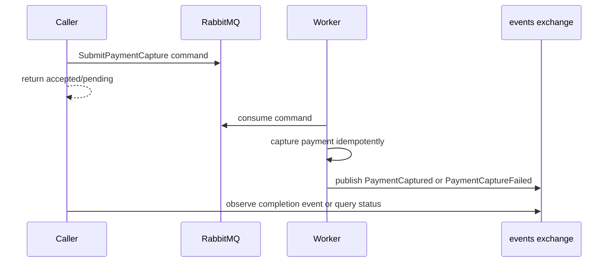
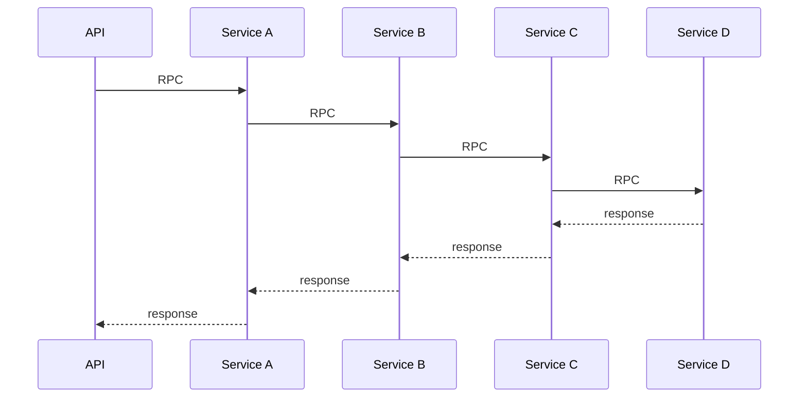

# Part 010 — Request Reply and RPC Pattern: Correlation, Timeout, and Failure Semantics

## 1. Tujuan Part Ini

Part ini membahas **request-reply** dan **RPC over RabbitMQ** secara production-grade.

Targetnya:

1. memahami kapan RPC lewat broker masuk akal dan kapan berbahaya;
2. memahami `replyTo`, `correlationId`, callback queue, dan Direct Reply-To;
3. mendesain timeout, retry, duplicate response handling, dan bounded outstanding request;
4. membedakan request-reply dari command/event asynchronous;
5. membuat Java implementation yang tidak leak memory, tidak deadlock, dan tidak overload broker;
6. memodelkan failure: requester crash, responder crash, lost reply, duplicate processing, timeout race;
7. membuat decision framework sebelum memakai RPC dalam distributed system.

RPC terlihat seperti function call:

```java
PriceQuote quote = pricingClient.calculateQuote(request);
```

Tetapi secara distributed systems, itu bukan function call. Itu rangkaian message yang bisa hilang, terlambat, duplicate, timeout, dan diproses ulang.

> RPC over broker menyembunyikan asynchronous messaging di balik API synchronous. Jangan biarkan API yang nyaman menghapus failure model dari desain.

---

## 2. Kapan Request-Reply Valid?

RPC lewat RabbitMQ bisa valid untuk kasus tertentu.

Contoh valid:

- service internal butuh query cepat ke worker pool;
- banyak client ephemeral melakukan request kecil;
- caller butuh response sebelum melanjutkan;
- broker sudah menjadi connectivity layer utama;
- responder bisa di-scale sebagai competing consumers;
- timeout pendek dan fallback jelas;
- request idempotent atau safely retryable.

Contoh berbahaya:

- long-running workflow;
- payment capture yang tidak idempotent;
- distributed transaction terselubung;
- chain RPC beberapa service;
- user request menunggu banyak backend via broker;
- tidak ada timeout/fallback;
- caller menganggap response pasti datang;
- reply harus durably guaranteed tetapi memakai Direct Reply-To.

Rule awal:

> Jika operasi bisnis bisa diselesaikan secara asynchronous dengan command + event, jangan otomatis memilih RPC hanya karena terasa mudah.

---

## 3. Mental Model Request-Reply

Request-reply memiliki empat komponen:

1. requester/client;
2. request queue;
3. responder/server/worker;
4. reply path.



AMQP properties penting:

| Property | Fungsi |
|---|---|
| `replyTo` | alamat callback queue atau pseudo-queue Direct Reply-To |
| `correlationId` | menghubungkan reply dengan request |
| `messageId` | identity request |
| `expiration` | TTL request jika stale |
| `contentType` | format body |
| `type` | request type |

Requester harus mengelola map:

```text
correlationId -> pending promise/future/deadline/context
```

Responder harus mengembalikan reply dengan `correlationId` yang sama.

---

## 4. Request-Reply Bukan Distributed Function Call

Local function call punya asumsi:

- caller dan callee berbagi process memory;
- exception langsung diketahui;
- timeout biasanya bukan bagian dari language semantic;
- tidak ada duplicate execution karena network retry;
- stack trace berurutan.

RPC over RabbitMQ punya realitas:

- request bisa sampai, reply hilang;
- request bisa diproses dua kali;
- response bisa datang setelah caller timeout;
- caller bisa crash setelah mengirim request;
- responder bisa crash setelah publish reply tetapi sebelum ack request;
- queue backlog bisa membuat request stale;
- broker flow control bisa menahan publish;
- correlation map bisa leak.

Maka API synchronous harus dibangun di atas model asynchronous yang eksplisit.

```text
send request
register pending response
wait bounded time
handle timeout
handle duplicate/late response
cleanup pending state
observe metrics
```

---

## 5. Callback Queue Strategy

Ada beberapa strategi reply path.

### 5.1 Queue per Request

Setiap request membuat queue reply sendiri.

```text
request-1 -> callback.queue.1
request-2 -> callback.queue.2
```

Kelebihan:

- korelasi sederhana;
- queue hanya untuk satu response.

Kekurangan:

- queue create/delete mahal;
- metadata churn tinggi;
- buruk untuk throughput;
- buruk untuk cluster;
- management UI penuh queue sementara.

Hindari untuk production high-volume.

### 5.2 Queue per Client Instance

Satu client instance punya satu exclusive callback queue.

```text
client-a.reply.queue
  correlationId-1 -> future-1
  correlationId-2 -> future-2
  correlationId-3 -> future-3
```

Kelebihan:

- lebih efisien;
- correlation map menyelesaikan multiplexing;
- reply bisa dibuffer saat client masih hidup;
- cocok untuk long-lived app instance.

Kekurangan:

- harus handle unknown/late correlation id;
- callback queue lifecycle harus rapi;
- jika non-durable exclusive queue hilang saat reconnect, reply lama hilang;
- jika durable reply queue, cleanup dan ownership lebih kompleks.

### 5.3 Direct Reply-To

RabbitMQ Direct Reply-To menghilangkan queue reply eksplisit.

Client consume dari pseudo-queue khusus dan responder publish reply ke alamat itu.

Kelebihan:

- tidak ada queue metadata untuk reply;
- cocok untuk banyak client;
- mengurangi queue create/delete overhead;
- simple untuk request pendek.

Kekurangan:

- reply bersifat at-most-once;
- tidak ada durable buffering reply;
- jika requester tidak siap/terputus, reply bisa hilang;
- tidak cocok jika reply tidak boleh hilang;
- tidak cocok untuk high throughput ke requester yang sama yang butuh buffering.

Decision:

| Requirement | Strategy |
|---|---|
| reply boleh hilang dan caller bisa retry | Direct Reply-To |
| long-lived service client | queue per client instance |
| reply harus tahan disconnect pendek | durable/non-exclusive reply queue, desain hati-hati |
| high request volume | queue per client atau Direct Reply-To, benchmark |
| long-running job | command + event/result queue, bukan synchronous RPC |

---

## 6. Java RPC Client Design

Client harus menjaga:

- satu connection long-lived;
- channel publishing terpisah dari channel consuming jika perlu;
- callback consumer aktif sebelum request dikirim;
- pending map bounded;
- timeout scheduler;
- cleanup on timeout;
- late response discarded safely;
- publisher confirms untuk request penting;
- backpressure ketika outstanding terlalu banyak.

Contoh client dengan callback queue per instance.

```java
import com.rabbitmq.client.*;

import java.io.Closeable;
import java.nio.charset.StandardCharsets;
import java.time.Duration;
import java.util.Map;
import java.util.UUID;
import java.util.concurrent.*;

public final class RpcClient implements Closeable {
    private final Connection connection;
    private final Channel channel;
    private final String requestQueue;
    private final String replyQueue;
    private final ConcurrentHashMap<String, PendingCall> pending = new ConcurrentHashMap<>();
    private final ScheduledExecutorService scheduler = Executors.newSingleThreadScheduledExecutor();
    private final Semaphore inFlightLimit;

    public RpcClient(Connection connection, String requestQueue, int maxInFlight) throws Exception {
        this.connection = connection;
        this.channel = connection.createChannel();
        this.requestQueue = requestQueue;
        this.inFlightLimit = new Semaphore(maxInFlight);

        this.replyQueue = channel.queueDeclare(
            "",
            false,
            true,
            true,
            Map.of()
        ).getQueue();

        channel.basicConsume(replyQueue, true, this::handleReply, consumerTag -> {});
    }

    public CompletableFuture<byte[]> call(byte[] requestBody, Duration timeout) {
        if (!inFlightLimit.tryAcquire()) {
            CompletableFuture<byte[]> rejected = new CompletableFuture<>();
            rejected.completeExceptionally(new RejectedExecutionException("Too many outstanding RPC calls"));
            return rejected;
        }

        String correlationId = UUID.randomUUID().toString();
        CompletableFuture<byte[]> future = new CompletableFuture<>();

        ScheduledFuture<?> timeoutTask = scheduler.schedule(() -> {
            PendingCall removed = pending.remove(correlationId);
            if (removed != null) {
                removed.future().completeExceptionally(new TimeoutException("RPC timeout: " + correlationId));
                inFlightLimit.release();
            }
        }, timeout.toMillis(), TimeUnit.MILLISECONDS);

        pending.put(correlationId, new PendingCall(future, timeoutTask));

        try {
            AMQP.BasicProperties props = new AMQP.BasicProperties.Builder()
                .contentType("application/json")
                .contentEncoding(StandardCharsets.UTF_8.name())
                .messageId(correlationId)
                .correlationId(correlationId)
                .replyTo(replyQueue)
                .expiration(Long.toString(timeout.toMillis()))
                .build();

            channel.basicPublish("", requestQueue, true, props, requestBody);
        } catch (Exception e) {
            PendingCall removed = pending.remove(correlationId);
            if (removed != null) {
                removed.timeoutTask().cancel(false);
                removed.future().completeExceptionally(e);
                inFlightLimit.release();
            }
        }

        return future;
    }

    private void handleReply(String consumerTag, Delivery delivery) {
        String correlationId = delivery.getProperties().getCorrelationId();
        if (correlationId == null) {
            return;
        }

        PendingCall call = pending.remove(correlationId);
        if (call == null) {
            // Late, duplicate, or unknown reply. Discard safely and count metric.
            return;
        }

        call.timeoutTask().cancel(false);
        call.future().complete(delivery.getBody());
        inFlightLimit.release();
    }

    @Override
    public void close() throws IOException {
        for (Map.Entry<String, PendingCall> entry : pending.entrySet()) {
            entry.getValue().future().completeExceptionally(new CancellationException("RPC client closed"));
            entry.getValue().timeoutTask().cancel(false);
        }
        pending.clear();
        scheduler.shutdownNow();
        try {
            channel.close();
        } catch (Exception ignored) {
        }
    }

    private record PendingCall(
        CompletableFuture<byte[]> future,
        ScheduledFuture<?> timeoutTask
    ) {}
}
```

Kode ini mengajarkan struktur, tetapi production wrapper perlu tambahan:

- channel thread-safety guard;
- returned message listener;
- publisher confirms;
- metrics;
- tracing;
- reconnect recovery;
- pending map cleanup saat channel close;
- separate executor untuk callback;
- structured error response;
- serialization abstraction.

---

## 7. Channel Threading Caveat

RabbitMQ Java `Channel` bukan boundary yang boleh dipakai sembarangan oleh banyak thread tanpa disiplin.

RPC client sering dipanggil oleh banyak request thread.

Jika semua thread memanggil `basicPublish` pada channel yang sama secara concurrent, desain bisa bermasalah.

Pilihan desain:

### 7.1 Synchronized Publish

```java
synchronized (channel) {
    channel.basicPublish("", requestQueue, true, props, body);
}
```

Sederhana, tetapi bisa bottleneck.

### 7.2 Dedicated Publisher Thread

Application thread memasukkan request ke bounded queue internal, publisher thread melakukan publish ke channel.

Kelebihan:

- channel ownership jelas;
- backpressure eksplisit;
- mudah batch/confirm.

Kekurangan:

- implementasi lebih kompleks;
- perlu shutdown handling.

### 7.3 Channel Pool

Beberapa channel untuk publish, dibatasi dan dipakai bergantian.

Kelebihan:

- parallelism lebih baik.

Kekurangan:

- confirm correlation lebih rumit;
- pool lifecycle harus benar;
- bukan solusi jika bottleneck sebenarnya responder.

Untuk RPC, bottleneck utama sering bukan publish, tetapi outstanding request, responder throughput, dan timeout policy.

---

## 8. RPC Server/Responder Design

Responder adalah consumer dari request queue.

Ia harus:

- manual ack request;
- set prefetch;
- process bounded concurrency;
- publish response ke `replyTo`;
- preserve `correlationId`;
- handle missing/invalid `replyTo`;
- decide ack timing;
- make operation idempotent jika request bisa redelivered.

Contoh responder:

```java
public final class RpcServer {
    private final Channel channel;
    private final String requestQueue;
    private final PricingService pricingService;
    private final JsonCodec jsonCodec;

    public RpcServer(Channel channel, String requestQueue, PricingService pricingService, JsonCodec jsonCodec) {
        this.channel = channel;
        this.requestQueue = requestQueue;
        this.pricingService = pricingService;
        this.jsonCodec = jsonCodec;
    }

    public void start() throws Exception {
        channel.queueDeclare(requestQueue, true, false, false, Map.of(
            "x-dead-letter-exchange", requestQueue + ".dlx"
        ));
        channel.basicQos(20);

        channel.basicConsume(requestQueue, false, this::handleRequest, consumerTag -> {});
    }

    private void handleRequest(String consumerTag, Delivery delivery) throws IOException {
        long tag = delivery.getEnvelope().getDeliveryTag();
        AMQP.BasicProperties requestProps = delivery.getProperties();
        String correlationId = requestProps.getCorrelationId();
        String replyTo = requestProps.getReplyTo();

        if (correlationId == null || replyTo == null || replyTo.isBlank()) {
            channel.basicReject(tag, false);
            return;
        }

        try {
            PriceRequest request = jsonCodec.fromJson(delivery.getBody(), PriceRequest.class);
            PriceResponse response = pricingService.calculate(request);
            byte[] responseBody = jsonCodec.toJsonBytes(response);

            AMQP.BasicProperties responseProps = new AMQP.BasicProperties.Builder()
                .contentType("application/json")
                .contentEncoding("UTF-8")
                .correlationId(correlationId)
                .messageId(UUID.randomUUID().toString())
                .type("PriceResponse")
                .build();

            channel.basicPublish("", replyTo, responseProps, responseBody);
            channel.basicAck(tag, false);
        } catch (InvalidRequestException e) {
            publishErrorReply(replyTo, correlationId, "INVALID_REQUEST", e.getMessage());
            channel.basicAck(tag, false);
        } catch (TransientDependencyException e) {
            channel.basicNack(tag, false, true);
        } catch (Exception e) {
            channel.basicNack(tag, false, false);
        }
    }

    private void publishErrorReply(String replyTo, String correlationId, String code, String message) throws IOException {
        ErrorResponse error = new ErrorResponse(code, message);
        AMQP.BasicProperties props = new AMQP.BasicProperties.Builder()
            .contentType("application/json")
            .correlationId(correlationId)
            .type("ErrorResponse")
            .headers(Map.of("errorCode", code))
            .build();

        channel.basicPublish("", replyTo, props, jsonCodec.toJsonBytes(error));
    }
}
```

Critical detail:

```text
publish reply then ack request
```

Jika server crash setelah publish reply tetapi sebelum ack request, request bisa redelivered dan diproses ulang. Client harus handle duplicate replies. Server operation idealnya idempotent.

Jika server ack request sebelum publish reply, request bisa hilang tanpa response jika server crash di antara dua langkah.

Tidak ada urutan sempurna tanpa transactional boundary. Pilih failure mode dan desain idempotency.

---

## 9. Ack Timing Failure Matrix

### 9.1 Publish Reply Before Ack



Efek:

- client bisa menerima duplicate response;
- server bisa melakukan side effect ganda jika handler tidak idempotent;
- request tidak hilang.

Cocok jika:

- duplicate bisa ditangani;
- request processing idempotent;
- response loss lebih buruk daripada duplicate.

### 9.2 Ack Before Publish Reply



Efek:

- request hilang dari queue;
- client timeout;
- retry dari client bisa mengirim request baru;
- jika operation sudah dilakukan sebelum ack, retry bisa duplicate.

Cocok jika:

- request is cheap/idempotent;
- timeout retry acceptable;
- duplicate submit punya key.

### 9.3 Ack Only After Confirmed Reply?

Untuk reply ke normal queue, server bisa memakai publisher confirms untuk response publish.

Tetapi:

- Direct Reply-To reply bersifat volatile/at-most-once;
- confirm tidak otomatis berarti client application sudah menerima response;
- reply queue durability bergantung strategi;
- client tetap bisa timeout.

Jangan menjanjikan exactly-once RPC.

---

## 10. Timeout Semantics

Timeout bukan sekadar angka konfigurasi. Timeout adalah business contract.

Pertanyaan:

1. Setelah timeout, apakah caller boleh retry?
2. Apakah responder mungkin masih memproses request lama?
3. Apakah request membawa idempotency key?
4. Jika response lama datang setelah timeout, apa yang dilakukan?
5. Apakah user mendapat status final atau pending?
6. Apakah downstream side effect bisa terjadi setelah caller menyerah?

### 10.1 Request Expiration

Set `expiration` pada message untuk menghindari request stale.

```java
AMQP.BasicProperties props = new AMQP.BasicProperties.Builder()
    .correlationId(correlationId)
    .replyTo(replyQueue)
    .expiration("5000")
    .build();
```

Namun expiration bukan pengganti timeout client.

Client tetap harus punya deadline sendiri.

### 10.2 Deadline Propagation

Lebih baik kirim deadline eksplisit.

```json
{
  "requestId": "req-123",
  "deadlineAt": "2026-07-01T10:15:35.000Z",
  "payload": { }
}
```

Responder cek:

```java
if (Instant.now().isAfter(request.deadlineAt())) {
    publishErrorReply(replyTo, correlationId, "REQUEST_EXPIRED", "Deadline exceeded");
    channel.basicAck(tag, false);
    return;
}
```

Ini mencegah worker menghabiskan resource untuk request yang sudah tidak berguna.

### 10.3 Late Response

Late response harus discarded safely.

```java
PendingCall call = pending.remove(correlationId);
if (call == null) {
    metrics.lateOrUnknownReply.increment();
    return;
}
```

Jangan throw exception di consumer callback untuk late response.

---

## 11. Retry Semantics

Client retry pada timeout terlihat mudah:

```text
send request
wait 2 seconds
timeout
send same request again
```

Tapi responder mungkin masih memproses request pertama.

Maka setiap retry harus punya idempotency model.

### 11.1 Same Request ID Retry

Client retry dengan `requestId` yang sama.

```json
{
  "requestId": "req-abc",
  "idempotencyKey": "quote-calc:cart-123:v7"
}
```

Responder deduplicate berdasarkan `idempotencyKey`.

Cocok untuk:

- operation yang harus dilakukan sekali;
- response bisa di-cache per key;
- duplicate submit berbahaya.

### 11.2 New Request ID Retry, Same Business Key

Client retry dengan `correlationId` baru tetapi business idempotency key sama.

```text
correlationId: corr-2
idempotencyKey: payment-auth:order-123:attempt-1
```

Cocok jika correlation id hanya transport-level.

### 11.3 Retry Budget

Jangan retry tanpa batas.

```text
max attempts: 2 or 3
jittered backoff: 100ms, 300ms, 900ms
overall deadline: 2s or 5s
```

Jika operasi lama, ubah pattern:

```text
submit command -> return accepted -> emit completion event
```

---

## 12. Bounded Outstanding Requests

RPC client harus punya limit outstanding request.

Tanpa limit:

- pending map membesar;
- memory leak saat responder lambat;
- timeout storm;
- broker backlog;
- downstream overload;
- caller thread pool habis.

Gunakan:

- semaphore;
- bounded queue;
- circuit breaker;
- adaptive concurrency;
- timeout budget;
- rejection metric.

Formula sederhana:

```text
max_in_flight ≈ target_rps × timeout_seconds
```

Jika target 200 RPS dan timeout 2 detik:

```text
max_in_flight ≈ 400
```

Lalu kurangi berdasarkan memory, responder capacity, dan latency tail.

Jangan set 50.000 hanya karena map bisa menampung.

---

## 13. Prefetch and Responder Throughput

Responder memakai competing consumers pada request queue.

```java
channel.basicQos(20);
```

Prefetch menentukan berapa request unacked yang boleh ada pada consumer.

Jika request processing cepat:

- prefetch bisa lebih besar;
- throughput naik;
- latency stabil jika worker cukup.

Jika request processing lambat atau berat:

- prefetch terlalu besar membuat request menunggu di memory consumer;
- request bisa stale;
- load distribution kurang fair;
- timeout meningkat.

Rule awal:

```text
prefetch = concurrency_per_instance × small_multiplier
```

Misal instance punya 8 worker thread:

```text
prefetch 8 sampai 16
```

Ukur dengan:

- request queue depth;
- unacked count;
- response latency histogram;
- timeout rate;
- responder CPU;
- downstream latency.

---

## 14. Direct Reply-To Implementation Notes

Direct Reply-To memakai pseudo-queue `amq.rabbitmq.reply-to` pada AMQP 0-9-1.

Requester consume dari pseudo-queue, lalu set `replyTo` ke pseudo-queue tersebut.

Simplified client idea:

```java
String directReplyTo = "amq.rabbitmq.reply-to";
channel.basicConsume(directReplyTo, true, this::handleReply, consumerTag -> {});

AMQP.BasicProperties props = new AMQP.BasicProperties.Builder()
    .replyTo(directReplyTo)
    .correlationId(correlationId)
    .build();

channel.basicPublish("", requestQueue, props, body);
```

Direct Reply-To cocok jika:

- client bisa retry ketika reply hilang;
- reply tidak perlu durable;
- banyak client melakukan request pendek;
- response kecil;
- timeout/fallback jelas.

Direct Reply-To tidak cocok jika:

- reply harus at-least-once;
- reply harus buffer saat client disconnected;
- requester menerima ratusan+ reply per second dan butuh queue buffering;
- operation tidak idempotent;
- business tidak boleh kehilangan final result.

Direct Reply-To harus dipandang sebagai optimization, bukan default untuk semua RPC.

---

## 15. Error Response Contract

RPC tidak boleh hanya timeout atau throw generic exception.

Buat response contract:

```json
{
  "requestId": "req-123",
  "status": "ERROR",
  "error": {
    "code": "INVALID_QUOTE_INPUT",
    "message": "Quantity must be greater than zero",
    "retryable": false
  }
}
```

Atau success:

```json
{
  "requestId": "req-123",
  "status": "OK",
  "payload": {
    "quoteId": "quote-891",
    "amount": 1750000,
    "currency": "IDR"
  }
}
```

Error classification:

| Error | Retryable? | Client Action |
|---|---:|---|
| validation error | no | fail fast |
| unauthorized | no | fail/security flow |
| not found | usually no | domain decision |
| dependency timeout | yes | retry if budget remains |
| responder overloaded | yes with backoff | retry/fallback |
| request expired | maybe no | recalculate or async |
| unknown server error | maybe | retry bounded |

Do not encode all failures as timeout.

Timeout means “no usable response arrived before deadline”, not necessarily “server failed”.

---

## 16. RPC and Business Side Effects

RPC for pure query is safer.

Example safer:

```text
CalculateQuotePreview
ValidateAddress
CheckEligibility
EstimateDeliveryWindow
```

RPC for side effects is risky.

Example risky:

```text
CapturePayment
CreateOrder
SubmitRegulatoryCase
ReserveInventory
IssueRefund
```

If side effect operation must use request-reply, require:

- idempotency key;
- operation status query;
- durable command record;
- response can be reconstructed;
- timeout does not imply rollback;
- caller state model includes `PENDING/UNKNOWN`.

Better pattern for side effect:



This exposes reality: the result is asynchronous.

---

## 17. Chained RPC Anti-Pattern

Salah satu anti-pattern paling mahal:



Masalah:

- latency menjumlah;
- availability mengalikan kegagalan;
- timeout cascade;
- debugging sulit;
- each service holds resources while waiting;
- broker menjadi transport untuk distributed monolith.

Jika harus aggregate data:

- pertimbangkan API composition eksplisit;
- materialized view;
- cache/read model;
- parallel request dengan timeout budget;
- async workflow.

Rule:

> Broker RPC tidak menghapus coupling. Ia hanya memindahkan coupling dari HTTP socket ke message queue.

---

## 18. Observability for RPC

Metrics requester:

- requests sent total;
- replies received total;
- timeout count;
- late reply count;
- unknown correlation id count;
- in-flight gauge;
- rejected due to in-flight limit;
- publish failure;
- returned request count;
- latency histogram end-to-end;
- retry attempts.

Metrics responder:

- requests consumed total;
- processing latency;
- reply publish failure;
- validation error count;
- transient error count;
- redelivery count;
- request expired count;
- queue depth;
- unacked count;
- consumer utilization.

Logs harus membawa:

```text
requestId
correlationId
replyTo
requestQueue
responderInstance
attempt
deadlineAt
elapsedMs
status
errorCode
```

Trace:

```text
caller span
  publish request span
  broker queue delay
  responder consume span
  processing span
  publish reply span
  caller receive span
```

Jika trace tidak bisa menunjukkan queue delay, engineer akan salah menyalahkan responder padahal bottleneck ada di backlog.

---

## 19. Security Notes

Request-reply memperbesar attack surface.

Pertanyaan:

1. Siapa boleh publish ke request queue?
2. Siapa boleh consume request queue?
3. Siapa boleh publish ke reply queue?
4. Apakah reply queue exclusive/private?
5. Apakah payload mengandung PII?
6. Apakah error response membocorkan detail internal?
7. Apakah correlation id bisa ditebak?
8. Apakah request bisa menjadi amplification vector?

Guardrails:

- vhost per environment/tenant boundary;
- least privilege permission;
- exclusive reply queue untuk client instance;
- TLS;
- input validation;
- max payload size;
- rate limiting;
- deadline enforcement;
- sanitize error response;
- audit request type dan caller identity.

---

## 20. Testing RPC Correctness

### 20.1 Basic Contract Test

- send valid request;
- response has same correlation id;
- response schema valid;
- invalid request returns structured error;
- unknown request type rejected.

### 20.2 Timeout Test

- responder sleeps longer than timeout;
- client future completes with timeout;
- late response discarded;
- pending map cleaned;
- in-flight permit released.

### 20.3 Duplicate Response Test

- publish two replies with same correlation id;
- first completes future;
- second increments duplicate/late metric;
- no exception thrown.

### 20.4 Responder Crash Test

- responder processes request;
- publish reply;
- crash before ack;
- request redelivered;
- client handles duplicate;
- side effect idempotent.

### 20.5 Reply Path Loss Test

With Direct Reply-To:

- requester disconnects before reply;
- responder publishes reply;
- reply lost;
- client retry/fallback works.

### 20.6 Backpressure Test

- set max in-flight low;
- generate higher concurrency;
- verify calls are rejected or queued boundedly;
- no memory growth;
- timeout rate not exploding.

---

## 21. Practice Drill

Build an RPC service:

```text
pricing.rpc.request queue
pricing.rpc.request.dlx exchange
pricing.rpc.request.dlq queue
```

Implement:

1. RPC client with callback queue per instance;
2. `correlationId` map with timeout cleanup;
3. max in-flight using semaphore;
4. request `expiration` and body `deadlineAt`;
5. responder with `basicQos`;
6. structured success/error response;
7. duplicate response handling;
8. returned message handling;
9. publisher confirms for request publish;
10. metrics for timeout, latency, in-flight, late response.

Failure drills:

- responder down;
- responder slow;
- reply queue deleted;
- client timeout then response arrives;
- duplicate response;
- broker restart;
- invalid request;
- request expired before processing.

Acceptance criteria:

- no pending map leak;
- no unbounded outstanding calls;
- timeout semantics deterministic;
- late reply does not crash client;
- duplicate processing does not create duplicate side effect;
- responder does not process expired request;
- metrics make root cause visible.

---

## 22. Decision Framework

Use RabbitMQ RPC if:

- request is short-lived;
- caller genuinely needs response now;
- timeout is small and explicit;
- request is idempotent or safe to retry;
- max in-flight is bounded;
- responder can scale as worker pool;
- reply loss/duplicate handling is designed;
- observability is strong.

Avoid RabbitMQ RPC if:

- operation is long-running;
- operation has irreversible side effects;
- caller actually needs workflow state;
- reply must be durably guaranteed but design uses Direct Reply-To;
- chain spans multiple services;
- timeout/retry semantics are not defined;
- user-facing request waits on multiple broker RPC calls;
- failure should be visible as business state.

Prefer command + event if:

- operation can complete later;
- result can be observed asynchronously;
- workflow needs retry/compensation;
- human/manual intervention possible;
- state machine matters.

Prefer query/read model if:

- caller only needs data;
- data can be precomputed;
- response latency matters;
- source system should not be synchronously hit every time.

---

## 23. Production Checklist

Before using RabbitMQ RPC in production:

- [ ] request type and response type documented;
- [ ] `correlationId` mandatory;
- [ ] `replyTo` validated;
- [ ] timeout mandatory;
- [ ] request expiration set;
- [ ] deadline propagated in body/header;
- [ ] pending map bounded;
- [ ] in-flight limit enforced;
- [ ] late response discarded safely;
- [ ] duplicate response handled;
- [ ] retry budget defined;
- [ ] idempotency key defined for retryable operations;
- [ ] responder prefetch tuned;
- [ ] manual ack used;
- [ ] ack timing failure mode documented;
- [ ] error response contract defined;
- [ ] Direct Reply-To used only when at-most-once reply is acceptable;
- [ ] callback queue lifecycle tested;
- [ ] metrics and traces available;
- [ ] security permissions reviewed;
- [ ] load test includes timeout and responder slowdown;
- [ ] runbook exists for timeout spike and queue backlog.

---

## 24. Ringkasan

Request-reply/RPC di RabbitMQ berguna, tetapi harus diperlakukan sebagai distributed protocol, bukan method call biasa.

Core mental model:

- request dikirim ke queue;
- reply dikirim ke `replyTo`;
- `correlationId` menghubungkan response ke pending call;
- timeout bukan rollback;
- duplicate response mungkin terjadi;
- request bisa diproses ulang;
- Direct Reply-To mengurangi overhead tetapi reply bersifat at-most-once;
- max in-flight wajib dibatasi;
- side effect harus idempotent jika retry mungkin.

Part berikutnya masuk ke **routing architecture pattern**: bagaimana menyusun exchange topology, naming, binding, alternate exchange, tenant/region routing, dan governance agar sistem RabbitMQ tidak berubah menjadi routing spaghetti.

---

## Referensi

- RabbitMQ Tutorial — Remote Procedure Call / RPC Java: https://www.rabbitmq.com/tutorials/tutorial-six-java
- RabbitMQ Documentation — Direct Reply-To: https://www.rabbitmq.com/docs/direct-reply-to
- RabbitMQ Documentation — Queues: https://www.rabbitmq.com/docs/queues
- RabbitMQ Documentation — Consumer Acknowledgements and Publisher Confirms: https://www.rabbitmq.com/docs/confirms
- RabbitMQ Documentation — Reliability and Data Safety: https://www.rabbitmq.com/docs/reliability
