# Part 011 — Routing Architecture Pattern: Exchange Topologies for Real Systems

## 1. Tujuan Part Ini

Part ini membahas **routing architecture** di RabbitMQ untuk sistem nyata.

Fokusnya bukan lagi “apa itu direct exchange” atau “apa itu topic exchange”. Itu sudah dibahas sebelumnya. Fokus part ini adalah bagaimana membuat **topology routing** yang:

1. stabil sebagai kontrak antar-service;
2. bisa berevolusi tanpa mematikan producer/consumer;
3. mudah diobservasi dan didebug;
4. mendukung command, event, notification, retry, dan dead-letter secara konsisten;
5. tidak berubah menjadi spaghetti exchange/binding;
6. aman untuk multi-team dan multi-tenant environment;
7. punya invariant yang bisa diuji dan diaudit.

RabbitMQ routing bukan sekadar konfigurasi broker. Ia adalah **arsitektur komunikasi**.

> Di production, exchange topology adalah bagian dari public contract. Kalau topology berubah sembarangan, failure-nya tidak selalu berupa error eksplisit. Sering kali failure-nya berupa message silently unrouted, queue tumbuh, duplicate fanout, atau subscriber tidak pernah menerima event yang dibutuhkan.

---

## 2. Mental Model: Routing Topology sebagai Contract Graph

AMQP 0-9-1 routing bisa dipahami sebagai graph:

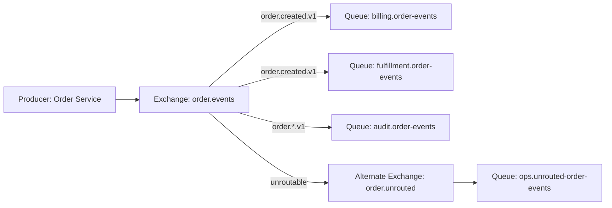

Elemen graph:

| Elemen | Makna Arsitektural | Pemilik Ideal |
|---|---|---|
| Exchange | Intent/public routing surface | Domain/platform team |
| Queue | Subscriber/worker ownership boundary | Consumer/service owner |
| Binding | Subscription/routing policy | Consumer with governance |
| Routing key | Semantic address | Producer contract + governance |
| Alternate exchange | Safety net untuk unroutable messages | Platform/ops |
| Dead-letter exchange | Failure routing surface | Platform + consumer owner |

Rule paling penting:

> Producer publish ke exchange yang stabil, bukan ke queue milik consumer.

Queue adalah detail implementasi consumer. Exchange adalah contract surface yang boleh diketahui producer.

---

## 3. Exchange, Queue, Binding: Pisahkan Makna dan Ownership

### 3.1 Exchange = Public Intent Boundary

Exchange menjawab pertanyaan:

> “Jenis komunikasi apa yang sedang terjadi?”

Contoh:

```text
order.commands
order.events
payment.events
inventory.commands
notification.events
risk.signals
```

Exchange yang baik biasanya punya nama domain/capability, bukan nama teknologi atau nama service internal.

Kurang baik:

```text
java-service-a-exchange
rabbit.exchange1
topic.exchange
message-router
```

Lebih baik:

```text
order.events
quote.commands
settlement.events
case-escalation.commands
regulatory-enforcement.events
```

Kenapa?

Karena exchange seharusnya bertahan lebih lama daripada service implementation. Service bisa diganti, split, merge, atau rewrite. Contract komunikasi harus lebih stabil.

---

### 3.2 Queue = Consumer Ownership Boundary

Queue menjawab:

> “Siapa yang bertanggung jawab memproses copy pesan ini?”

Contoh:

```text
billing.order-events.q
fulfillment.order-events.q
audit.order-events.q
search-index.order-events.q
```

Dalam pub/sub, setiap subscriber yang membutuhkan delivery independent sebaiknya punya queue sendiri.

Jangan membuat beberapa logical consumer berbagi satu queue jika mereka tidak identik secara semantics.

Buruk:

```text
order-events-shared.q
```

Lalu billing, fulfillment, audit, dan notification sama-sama consume queue itu. Akibatnya mereka menjadi competing consumers, bukan subscribers. Hanya satu consumer yang menerima tiap message.

Benar:

```text
billing.order-events.q
fulfillment.order-events.q
audit.order-events.q
notification.order-events.q
```

> Queue-per-subscriber adalah invariant utama untuk pub/sub RabbitMQ.

---

### 3.3 Binding = Subscription Policy

Binding menjawab:

> “Message dengan karakteristik apa yang ingin diterima queue ini?”

Contoh topic binding:

```text
order.created.v1
order.cancelled.v1
order.*.v1
#.failed.v1
```

Binding yang terlalu lebar membuat coupling tersembunyi.

Contoh berbahaya:

```text
#
*.created.*
order.#
```

Binding seperti ini valid secara teknis, tetapi perlu governance. Kalau tidak, subscriber bisa menerima event yang tidak pernah didesain untuk diproses, lalu error saat schema berubah.

Binding yang baik adalah subscription eksplisit terhadap kebutuhan bisnis.

---

## 4. Exchange Type Decision Framework

| Kebutuhan | Exchange Type | Alasan |
|---|---|---|
| Command ke handler tertentu berdasarkan command type | Direct | Exact routing, sederhana, mudah diaudit |
| Event dikirim ke semua subscriber | Fanout atau Topic | Fanout untuk broadcast penuh, topic untuk selective subscription |
| Domain events dengan filtering berdasarkan aggregate/action/version | Topic | Pattern matching routing key |
| Routing berdasarkan banyak atribut optional | Headers | Fleksibel, tetapi lebih mahal/kurang terlihat |
| Publish langsung ke queue | Default exchange | Cocok untuk internal/simple cases, bukan contract architecture |
| Safety net unroutable | Alternate exchange | Menangkap publish yang tidak punya route |
| Failure rerouting | Dead-letter exchange | Memisahkan processing failure dari normal route |

Practical rule:

1. gunakan **direct exchange** untuk command;
2. gunakan **topic exchange** untuk domain event;
3. gunakan **fanout exchange** untuk broadcast teknis yang benar-benar global;
4. gunakan **headers exchange** hanya jika routing key menjadi terlalu artificial;
5. gunakan **alternate exchange** untuk exchange publik;
6. gunakan **DLX** untuk failure path, bukan normal routing.

---

## 5. Pattern 1 — Command Exchange per Capability

Command biasanya punya satu intended handler atau satu handler group.

Topology:

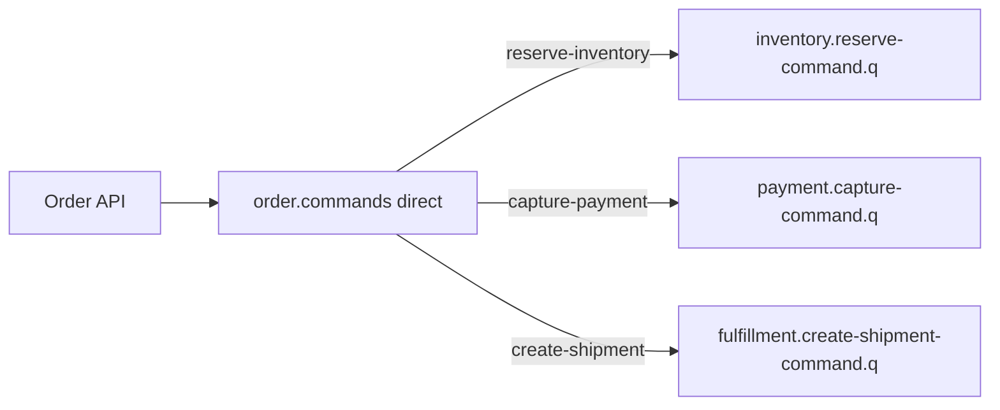

Example routing keys:

```text
reserve-inventory.v1
capture-payment.v1
create-shipment.v1
cancel-order.v1
```

Atau dengan namespace:

```text
inventory.reserve.v1
payment.capture.v1
shipment.create.v1
order.cancel.v1
```

### 5.1 Command Design Invariants

Command routing harus mempertahankan invariant berikut:

1. command memiliki satu business responsibility;
2. command handler boleh punya banyak instance sebagai competing consumers;
3. command message harus idempotent;
4. command producer tidak tahu jumlah worker;
5. command producer tidak publish ke queue worker langsung;
6. command punya timeout/staleness policy;
7. command failure punya retry/DLQ/parking lot path.

### 5.2 Java Declaration Example

```java
public final class OrderCommandTopology {
    public static final String EXCHANGE = "order.commands";
    public static final String QUEUE_PAYMENT_CAPTURE = "payment.capture-command.q";
    public static final String RK_PAYMENT_CAPTURE_V1 = "payment.capture.v1";

    public static void declare(Channel channel) throws IOException {
        channel.exchangeDeclare(EXCHANGE, BuiltinExchangeType.DIRECT, true);
        channel.queueDeclare(QUEUE_PAYMENT_CAPTURE, true, false, false, Map.of(
            "x-dead-letter-exchange", "payment.commands.dlx",
            "x-dead-letter-routing-key", "payment.capture.failed.v1"
        ));
        channel.queueBind(QUEUE_PAYMENT_CAPTURE, EXCHANGE, RK_PAYMENT_CAPTURE_V1);
    }
}
```

Poin penting:

- exchange durable;
- queue durable;
- DLX eksplisit;
- routing key versioned;
- nama queue menunjukkan owner dan intent.

---

## 6. Pattern 2 — Domain Event Topic Exchange

Domain event biasanya punya banyak subscriber.

Topology:

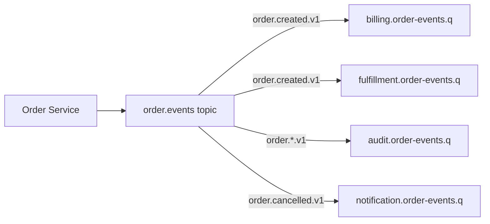

Routing key bisa berupa:

```text
<domain>.<event-name>.<version>
```

Contoh:

```text
order.created.v1
order.cancelled.v1
order.fulfilled.v1
payment.authorized.v1
payment.failed.v1
quote.approved.v2
```

### 6.1 Jangan Terlalu Banyak Dimensi di Routing Key

Routing key bukan database index.

Berbahaya:

```text
tenant-123.ap-southeast-1.retail.high-priority.order.created.v1.customer-gold.mobile
```

Masalah:

- binding menjadi brittle;
- governance sulit;
- perubahan dimensi memecah compatibility;
- producer harus tahu terlalu banyak policy;
- routing key berubah menjadi data payload.

Lebih baik:

```text
order.created.v1
```

Lalu metadata lain di header/envelope:

```json
{
  "tenantId": "tenant-123",
  "region": "ap-southeast-1",
  "priority": "high",
  "channel": "mobile"
}
```

Routing key sebaiknya menyimpan dimensi yang memang dipakai untuk routing broker-level. Metadata lain tetap di envelope.

---

## 7. Pattern 3 — Subscriber-Owned Queue

Dalam event architecture, subscriber harus punya queue sendiri.

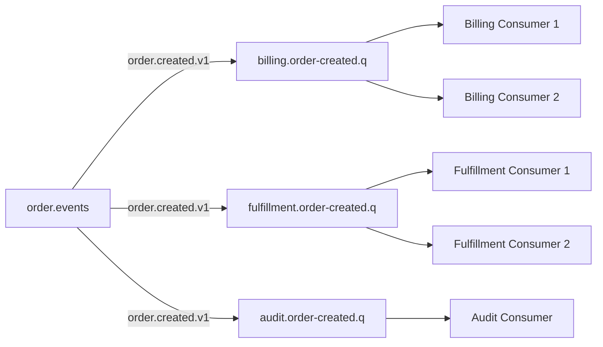

Interpretasi:

- billing consumer instances bersaing di queue billing;
- fulfillment consumer instances bersaing di queue fulfillment;
- audit consumer punya copy sendiri;
- setiap subscriber punya retry/DLQ policy sendiri.

Ini memisahkan blast radius.

Jika billing down, fulfillment tetap jalan. Jika audit lambat, queue audit yang tumbuh, bukan semua subscriber.

---

## 8. Pattern 4 — Alternate Exchange untuk Unroutable Message

Unroutable message adalah message yang berhasil dipublish ke exchange, tetapi tidak cocok dengan binding mana pun.

Tanpa mekanisme safety:

- producer bisa tidak sadar message tidak diterima consumer;
- message bisa hilang dari perspektif aplikasi;
- masalah muncul sebagai data gap beberapa jam/hari kemudian.

Ada dua mekanisme penting:

1. `mandatory` flag + return listener di producer;
2. alternate exchange di broker topology.

Topology:

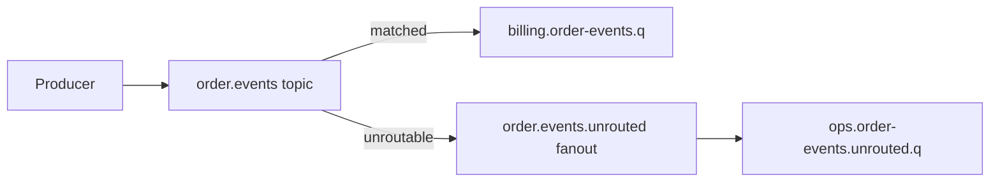

Example declaration:

```java
Map<String, Object> args = Map.of("alternate-exchange", "order.events.unrouted");
channel.exchangeDeclare("order.events.unrouted", BuiltinExchangeType.FANOUT, true);
channel.exchangeDeclare("order.events", BuiltinExchangeType.TOPIC, true, false, args);
channel.queueDeclare("ops.order-events.unrouted.q", true, false, false, null);
channel.queueBind("ops.order-events.unrouted.q", "order.events.unrouted", "");
```

### 8.1 AE vs Mandatory Flag

| Mechanism | Lokasi feedback | Cocok untuk |
|---|---|---|
| `mandatory` + returned message | Producer | Immediate feedback publish-time |
| Alternate exchange | Broker topology | Central catch-all, observability, audit |

Untuk exchange publik yang penting, gunakan keduanya jika failure cost tinggi.

---

## 9. Pattern 5 — Exchange-to-Exchange Binding

Exchange-to-exchange binding memungkinkan satu exchange menjadi downstream dari exchange lain.

Use case:

- domain event global exchange ke service-specific exchange;
- routing layer multi-tenant;
- migration topology;
- separating public event surface from internal subscriber routing;
- building routing fanout hierarchy.

Topology:

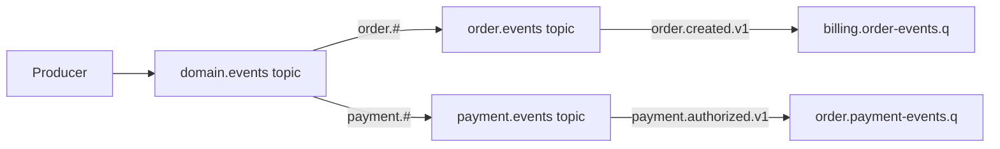

Manfaat:

- producer publish ke satu global surface;
- domain/team bisa mengelola exchange downstream;
- migrasi routing bisa dilakukan bertahap;
- subscriber tetap tidak perlu tahu producer.

Risiko:

- topology graph menjadi lebih sulit dibaca;
- routing loop harus dihindari;
- debug unroutable lebih kompleks;
- governance wajib lebih ketat.

Practical rule:

> Gunakan exchange-to-exchange binding untuk architecture-level routing, bukan untuk menyelesaikan naming yang buruk.

---

## 10. Pattern 6 — Tenant-Aware Routing

Multi-tenancy bisa dimodelkan di beberapa level:

1. vhost per tenant;
2. exchange per tenant;
3. routing key berisi tenant segment;
4. header tenant id;
5. payload tenant id dengan authorization di consumer.

### 10.1 Decision Matrix

| Model | Isolasi | Operasional | Cocok untuk |
|---|---:|---:|---|
| Vhost per tenant | Sangat tinggi | Mahal | Regulated/high isolation tenant |
| Exchange per tenant | Tinggi | Sedang | Tenant besar/enterprise |
| Routing key tenant segment | Sedang | Sedang | Routing broker-level per tenant |
| Header tenant id | Sedang | Mudah | Consumer-level filtering/auth |
| Payload tenant id | Rendah jika tidak divalidasi | Mudah | Internal simple workload |

Tenant-aware routing key contoh:

```text
tenant-123.order.created.v1
```

Tapi hati-hati: jumlah tenant besar bisa membuat binding explosion jika setiap tenant butuh binding sendiri.

Untuk banyak tenant kecil, sering lebih baik:

```text
order.created.v1
```

dan `tenantId` di envelope, lalu queue/subscriber melakukan authorization dan filtering.

---

## 11. Pattern 7 — Region-Aware Routing

Region-aware routing muncul untuk:

- data residency;
- latency;
- active-active topology;
- DR/failover;
- regulatory partitioning;
- regional workload ownership.

Pilihan topology:

```text
apac.order.events
eu.order.events
us.order.events
```

atau:

```text
order.events + header region=apac
```

atau:

```text
order.apac.created.v1
order.eu.created.v1
```

Decision:

- gunakan exchange per region jika broker topology memang dipisah per region;
- gunakan routing key region jika binding broker-level benar-benar butuh region;
- gunakan header jika region hanya metadata processing;
- jangan melakukan cross-region fanout tanpa memahami data residency dan replay semantics.

---

## 12. Pattern 8 — Priority and SLA Routing

RabbitMQ mendukung priority queues, tetapi priority sering lebih mudah dikendalikan dengan queue/exchange terpisah.

Model 1: priority queue.

```text
case.commands.priority.q
```

Model 2: separate queues.

```text
case.commands.high.q
case.commands.normal.q
case.commands.low.q
```

Separate queues sering lebih eksplisit:

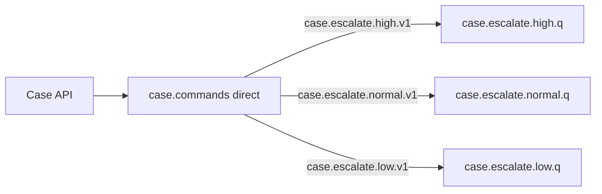

Keuntungan:

- concurrency bisa berbeda;
- alert bisa berbeda;
- retry budget bisa berbeda;
- DLQ bisa berbeda;
- backpressure high-priority tidak tercampur low-priority.

Kerugian:

- topology lebih banyak;
- routing policy perlu governance;
- worker scheduling lebih kompleks.

Rule:

> Jika SLA berbeda secara operasional, queue berbeda sering lebih jujur daripada priority flag di satu queue.

---

## 13. Pattern 9 — DLX as Failure Routing Surface

Dead-letter exchange bukan tempat membuang sampah tanpa desain. DLX adalah failure routing surface.

Topology:

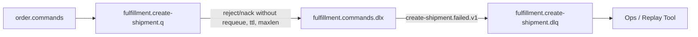

DLQ naming:

```text
<owner>.<source>.dlq
```

Example:

```text
fulfillment.create-shipment.dlq
billing.order-created.dlq
risk.case-escalated.dlq
```

DLX routing key harus informatif:

```text
create-shipment.failed.v1
order-created.failed.v1
```

Agar DLQ berguna, message harus punya metadata:

- `messageId`;
- `correlationId`;
- `causationId`;
- original exchange;
- original routing key;
- failure reason;
- consumer name;
- retry count;
- first failure time;
- last failure time.

RabbitMQ menambahkan header dead-letter tertentu, tetapi aplikasi tetap perlu structured error metadata untuk operasi yang manusiawi.

---

## 14. Pattern 10 — Parking Lot Routing

DLQ adalah failure sink. Parking lot adalah queue untuk pesan yang butuh keputusan manusia atau proses remediation.

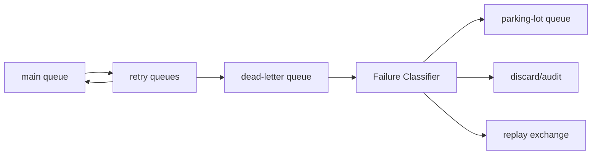

Gunakan parking lot untuk:

- invalid reference data;
- regulatory manual review;
- external dependency data mismatch;
- schema migration incident;
- fraud/risk review;
- command yang tidak boleh otomatis diulang lagi.

Jangan gunakan parking lot untuk:

- bug yang harus diperbaiki di consumer;
- message yang bisa langsung diproses ulang;
- message dengan payload sensitif tanpa access control;
- menggantikan observability.

---

## 15. Routing Key Taxonomy

Routing key harus cukup ekspresif untuk routing, tapi tidak terlalu kaya sampai menjadi payload.

### 15.1 Event Routing Key

Recommended format:

```text
<aggregate-or-domain>.<event-name>.v<major>
```

Examples:

```text
order.created.v1
order.cancelled.v1
payment.authorized.v1
payment.failed.v1
quote.approved.v2
case.escalated.v1
```

Kenapa major version di routing key?

Karena major version bisa mengubah schema secara breaking sehingga subscriber perlu memilih versi.

Minor-compatible change tidak perlu routing key baru jika schema compatibility dijaga.

---

### 15.2 Command Routing Key

Recommended format:

```text
<capability>.<action>.v<major>
```

Examples:

```text
payment.capture.v1
inventory.reserve.v1
shipment.create.v1
case.escalation-open.v1
```

Command biasanya imperative. Event biasanya past tense.

| Type | Naming Style | Example |
|---|---|---|
| Command | imperative | `payment.capture.v1` |
| Event | past tense | `payment.captured.v1` |
| Notification | past tense / signal | `email.requested.v1` |
| Signal | condition/state | `risk.high-score-detected.v1` |

Jangan mencampur:

```text
payment.captured.command.v1
capture-payment-event.v1
order.do.created.v1
```

---

### 15.3 Technical Routing Key

Untuk internal ops/failure:

```text
order.unrouted.v1
payment.capture.failed.v1
billing.retry.5m.v1
consumer.poison.v1
```

Technical routing key boleh lebih operational, tapi tetap harus dikelola.

---

## 16. Topology Versioning and Evolution

Topology pasti berubah. Pertanyaannya bukan “apakah berubah?”, tetapi “apakah berubah tanpa downtime dan tanpa data loss?”

### 16.1 Backward Compatible Changes

Umumnya aman:

- menambah queue subscriber baru;
- menambah binding baru;
- menambah exchange downstream;
- menambah optional header;
- menambah event baru;
- menambah alternate exchange sebelum producer aktif.

### 16.2 Potentially Breaking Changes

Butuh migration plan:

- menghapus binding;
- mengganti routing key;
- mengganti exchange type;
- mengubah durable/exclusive/auto-delete queue declaration;
- mengubah DLX behavior;
- mengganti queue type;
- menghapus exchange publik;
- mengubah event schema major tanpa routing/version plan.

### 16.3 Safe Routing Key Migration

Misalnya dari:

```text
order.created
```

ke:

```text
order.created.v1
```

Safe path:

1. declare binding baru untuk `order.created.v1`;
2. update consumers agar bisa menerima kedua routing key;
3. dual-publish sementara atau route old key via exchange-to-exchange bridge;
4. monitor old routing key usage;
5. remove old binding setelah window aman;
6. archive migration decision.

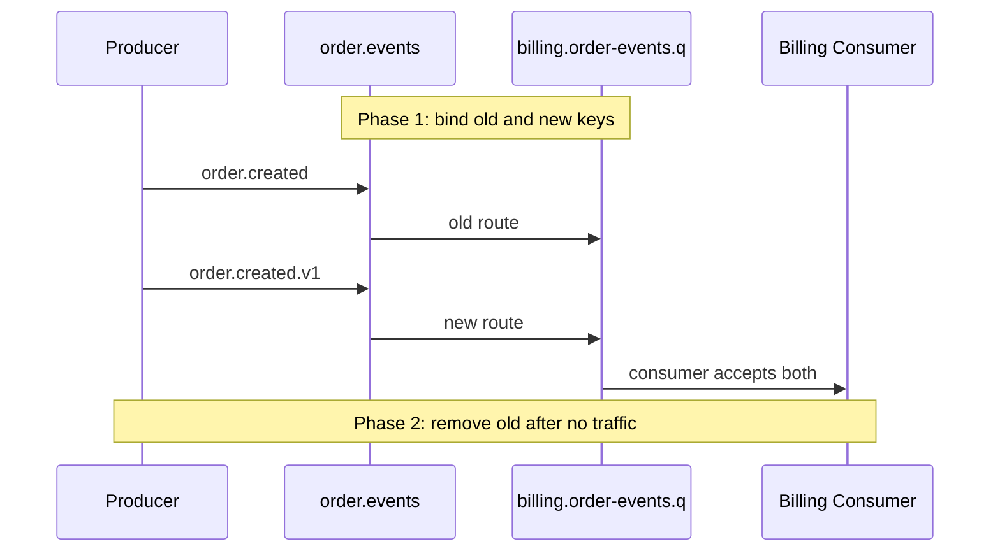

---

## 17. Queue Naming Convention

Queue name harus membantu operasi.

Recommended:

```text
<owner>.<source-or-intent>.<type>.q
```

Examples:

```text
billing.order-events.q
fulfillment.order-events.q
risk.case-events.q
payment.capture-command.q
search.order-indexer.q
ops.order-events.unrouted.q
```

DLQ:

```text
billing.order-events.dlq
payment.capture-command.dlq
```

Retry queue:

```text
payment.capture-command.retry.30s.q
payment.capture-command.retry.5m.q
payment.capture-command.retry.1h.q
```

Parking lot:

```text
payment.capture-command.parking-lot.q
```

Jangan gunakan:

```text
queue1
orders
rabbit-q
consumer-q
all-events
```

Nama queue harus langsung menjawab:

- siapa owner-nya;
- sumber/intention-nya;
- apakah normal/retry/dlq/parking;
- apakah itu command/event/internal.

---

## 18. Exchange Naming Convention

Recommended:

```text
<domain>.<message-kind>
```

Examples:

```text
order.events
order.commands
payment.events
payment.commands
case.events
case.commands
risk.signals
notification.commands
```

Failure exchange:

```text
order.events.dlx
payment.commands.dlx
```

Alternate exchange:

```text
order.events.unrouted
payment.commands.unrouted
```

Internal bridge exchange:

```text
platform.domain-events
order.events.bridge
```

Avoid:

```text
amq.topic.custom
main-exchange
rabbitmq-events
service-a-x
```

---

## 19. Topology Declaration Ownership

Ada tiga pendekatan umum.

### 19.1 App Declares Its Own Topology

Service startup declare exchange/queue/binding.

Keuntungan:

- self-contained;
- mudah local/dev;
- deployment sederhana.

Risiko:

- banyak service bisa declare resource sama dengan argumen berbeda;
- topology drift;
- production governance lemah;
- startup failure jika precondition failed.

Cocok untuk:

- small teams;
- internal workloads;
- early-stage systems;
- topology yang owned oleh satu service.

---

### 19.2 Platform/IaC Declares Topology

Topology dibuat oleh Terraform/Helm/Operator/definitions file.

Keuntungan:

- reviewable;
- audit-friendly;
- environment consistency;
- least privilege lebih mudah;
- tidak tergantung startup aplikasi.

Risiko:

- feedback loop dev lebih lambat;
- koordinasi perubahan lebih mahal;
- butuh pipeline topology.

Cocok untuk:

- regulated environment;
- multi-team platform;
- high reliability workloads;
- shared exchanges.

---

### 19.3 Hybrid

Platform declares public shared exchanges, DLX, policies, permissions.

Service declares private queues/bindings yang dimiliki sendiri.

Ini sering paling praktis.

Recommended split:

| Resource | Owner |
|---|---|
| Public domain exchange | Platform/domain architecture |
| Shared DLX/AE | Platform |
| Consumer queue | Consumer service |
| Consumer binding | Consumer service with governance |
| Retry queues | Consumer service/platform template |
| Policies | Platform |
| Permissions | Platform/security |

---

## 20. Topology Drift Detection

Topology drift terjadi saat actual broker state berbeda dari intended design.

Contoh:

- queue ada di prod tapi tidak ada di repo;
- binding lama masih aktif;
- DLX argumen beda antar-environment;
- exchange type berbeda;
- queue policy berubah manual;
- queue tidak punya owner;
- unrouted queue tumbuh tapi tidak ada alert.

Mitigasi:

1. export definitions secara berkala;
2. compare dengan intended definitions;
3. enforce naming convention;
4. audit bindings wildcard;
5. alert orphan queues;
6. block manual changes di prod kecuali emergency;
7. record topology ADR.

Topology review checklist:

```text
[ ] Semua exchange publik punya owner.
[ ] Semua queue punya owner service/team.
[ ] Semua queue production punya DLX policy atau alasan eksplisit.
[ ] Semua topic wildcard binding disetujui.
[ ] Semua exchange penting punya AE atau mandatory-return strategy.
[ ] Tidak ada producer publish langsung ke queue consumer kecuali exception.
[ ] Tidak ada queue tanpa consumer lebih dari threshold.
[ ] Tidak ada DLQ tanpa runbook.
```

---

## 21. Observability for Routing

Routing architecture tanpa observability akan gagal saat incident.

Metrics penting:

| Metric | Pertanyaan |
|---|---|
| publish count per exchange/routing key | Apakah traffic sesuai expectation? |
| unroutable/returned messages | Apakah binding hilang/salah? |
| queue depth per subscriber | Subscriber mana yang tertinggal? |
| publish confirm latency | Broker menerima publish dengan sehat? |
| consumer ack latency | Processing sehat? |
| DLQ rate | Ada failure processing? |
| redelivery count | Retry storm? |
| binding count | Topology explosion? |
| queue without consumer | Orphan atau outage? |

Structured log publish:

```json
{
  "event": "rabbitmq.publish",
  "exchange": "order.events",
  "routingKey": "order.created.v1",
  "messageId": "01J...",
  "correlationId": "corr-123",
  "tenantId": "tenant-456",
  "confirmLatencyMs": 12,
  "mandatory": true
}
```

Structured log consume:

```json
{
  "event": "rabbitmq.consume",
  "queue": "billing.order-events.q",
  "exchange": "order.events",
  "routingKey": "order.created.v1",
  "messageId": "01J...",
  "redelivered": false,
  "processingLatencyMs": 84,
  "ack": true
}
```

---

## 22. Security and Permissions Impact on Routing

RabbitMQ permissions biasanya dipisah menjadi configure, write, read.

Prinsip:

- producer boleh write ke exchange yang dibutuhkan;
- producer tidak perlu read queue;
- consumer boleh read queue miliknya;
- consumer tidak otomatis boleh configure public exchange;
- topology management user berbeda dari runtime app user;
- vhost dipakai sebagai boundary jika security domain berbeda.

Contoh policy konseptual:

| Principal | Configure | Write | Read |
|---|---|---|---|
| order-service | own queues/bindings | order.events, order.commands | order reply/internal queues |
| billing-service | billing queues | billing.commands/events | billing queues |
| topology-deployer | shared resources | shared resources | optional |
| ops-observer | none | none | management/metrics only |

Jangan memberi wildcard permission luas ke semua service hanya agar deployment mudah.

---

## 23. Routing Architecture Anti-Patterns

### 23.1 Producer Publishes Directly to Consumer Queue

```java
channel.basicPublish("", "billing.order-events.q", props, body);
```

Masalah:

- producer tahu detail consumer;
- subscriber baru sulit ditambahkan;
- event fanout tidak natural;
- ownership kabur;
- migration mahal.

Exception:

- internal private queue;
- reply queue;
- simple worker queue yang memang contract-nya queue;
- test/local tools.

---

### 23.2 One Exchange for Everything

```text
app.exchange
```

Semua command, event, retry, DLQ, internal message lewat satu exchange.

Masalah:

- binding kacau;
- governance tidak mungkin;
- permissions terlalu luas;
- observability lemah;
- event taxonomy rusak.

---

### 23.3 One Queue for Many Semantic Consumers

Satu queue dipakai billing, fulfillment, audit.

Akibat:

- bukan pub/sub;
- message hilang untuk sebagian subscriber;
- scaling satu consumer memengaruhi subscriber lain;
- ack semantics salah.

---

### 23.4 Wildcard Binding Tanpa Governance

```text
#
order.#
*.created.*
```

Boleh untuk audit/ops, tapi harus sadar konsekuensi:

- menerima banyak schema;
- load tidak stabil;
- bisa menjadi hidden dependency;
- breaking change domain bisa menjatuhkan subscriber.

---

### 23.5 Routing Key Contains Business Payload

```text
tenant.customer.region.product.segment.channel.order.created.v1
```

Routing key bukan payload. Semakin banyak data di routing key, semakin susah evolution.

---

### 23.6 DLQ Without Owner

DLQ tanpa owner dan runbook adalah kuburan pesan.

Setiap DLQ harus punya:

- owner;
- alert threshold;
- triage process;
- replay policy;
- retention policy;
- PII/security policy.

---

## 24. Java Topology Module Pattern

Untuk aplikasi Java besar, topology sebaiknya tidak tercecer di banyak class listener.

Struktur:

```text
messaging/
  topology/
    OrderEventTopology.java
    PaymentCommandTopology.java
    RetryTopology.java
  contract/
    RoutingKeys.java
    Exchanges.java
    Queues.java
  publisher/
    RabbitPublisher.java
  consumer/
    OrderCreatedConsumer.java
```

Contoh constants:

```java
public final class MessagingNames {
    private MessagingNames() {}

    public static final class Exchanges {
        public static final String ORDER_EVENTS = "order.events";
        public static final String ORDER_EVENTS_UNROUTED = "order.events.unrouted";
        public static final String ORDER_EVENTS_DLX = "order.events.dlx";
    }

    public static final class RoutingKeys {
        public static final String ORDER_CREATED_V1 = "order.created.v1";
        public static final String ORDER_CANCELLED_V1 = "order.cancelled.v1";
    }

    public static final class Queues {
        public static final String BILLING_ORDER_EVENTS = "billing.order-events.q";
        public static final String BILLING_ORDER_EVENTS_DLQ = "billing.order-events.dlq";
    }
}
```

Deklarasi topology:

```java
public final class BillingOrderEventTopology {

    public void declare(Channel channel) throws IOException {
        channel.exchangeDeclare(Exchanges.ORDER_EVENTS, BuiltinExchangeType.TOPIC, true);
        channel.exchangeDeclare(Exchanges.ORDER_EVENTS_DLX, BuiltinExchangeType.TOPIC, true);

        Map<String, Object> args = Map.of(
            "x-dead-letter-exchange", Exchanges.ORDER_EVENTS_DLX,
            "x-dead-letter-routing-key", "billing.order-events.failed.v1"
        );

        channel.queueDeclare(Queues.BILLING_ORDER_EVENTS, true, false, false, args);
        channel.queueBind(
            Queues.BILLING_ORDER_EVENTS,
            Exchanges.ORDER_EVENTS,
            RoutingKeys.ORDER_CREATED_V1
        );
    }
}
```

Rule:

> Nama exchange/routing/queue harus menjadi code-level constants yang direview, bukan string literal yang tersebar.

---

## 25. Spring AMQP Topology Declaration Pattern

Contoh dengan Spring AMQP:

```java
@Configuration
class BillingRabbitTopology {

    @Bean
    TopicExchange orderEventsExchange() {
        return ExchangeBuilder.topicExchange("order.events")
            .durable(true)
            .withArgument("alternate-exchange", "order.events.unrouted")
            .build();
    }

    @Bean
    FanoutExchange orderEventsUnroutedExchange() {
        return ExchangeBuilder.fanoutExchange("order.events.unrouted")
            .durable(true)
            .build();
    }

    @Bean
    Queue billingOrderEventsQueue() {
        return QueueBuilder.durable("billing.order-events.q")
            .deadLetterExchange("billing.order-events.dlx")
            .deadLetterRoutingKey("billing.order-events.failed.v1")
            .build();
    }

    @Bean
    Binding billingOrderCreatedBinding(
        Queue billingOrderEventsQueue,
        TopicExchange orderEventsExchange
    ) {
        return BindingBuilder
            .bind(billingOrderEventsQueue)
            .to(orderEventsExchange)
            .with("order.created.v1");
    }
}
```

Kelebihan:

- dekat dengan aplikasi;
- mudah dites;
- readable;
- cocok untuk service-owned queues.

Tetapi untuk shared/public exchange, banyak organisasi memilih declare via IaC/platform agar governance lebih kuat.

---

## 26. Routing Test Strategy

Routing bug sering tidak tertangkap unit test biasa.

### 26.1 Contract Test for Routing Names

Test constants:

```java
@Test
void routingKeysShouldFollowVersionedConvention() {
    assertThat(RoutingKeys.ORDER_CREATED_V1)
        .matches("[a-z0-9-]+\\.[a-z0-9-]+\\.v[0-9]+");
}
```

### 26.2 Integration Test for Route Exists

Dengan Testcontainers RabbitMQ:

```java
@Test
void orderCreatedShouldReachBillingQueue() throws Exception {
    publish("order.events", "order.created.v1", orderCreatedPayload());

    GetResponse response = channel.basicGet("billing.order-events.q", false);

    assertThat(response).isNotNull();
    assertThat(response.getEnvelope().getRoutingKey()).isEqualTo("order.created.v1");

    channel.basicAck(response.getEnvelope().getDeliveryTag(), false);
}
```

### 26.3 Unroutable Test

```java
@Test
void unknownRoutingKeyShouldGoToUnroutedQueue() throws Exception {
    publish("order.events", "order.unknown.v1", payload());

    GetResponse response = channel.basicGet("ops.order-events.unrouted.q", true);

    assertThat(response).isNotNull();
}
```

### 26.4 DLQ Test

```java
@Test
void rejectedMessageShouldGoToDlq() throws Exception {
    publish("order.events", "order.created.v1", poisonPayload());

    GetResponse delivery = channel.basicGet("billing.order-events.q", false);
    channel.basicReject(delivery.getEnvelope().getDeliveryTag(), false);

    GetResponse dlq = eventuallyGet("billing.order-events.dlq");
    assertThat(dlq).isNotNull();
}
```

---

## 27. Failure Modes and Diagnosis

| Symptom | Likely Cause | First Check |
|---|---|---|
| Producer reports success but consumer never sees message | No binding / wrong routing key / no mandatory/AE | Exchange bindings, returned messages, unrouted queue |
| One subscriber gets messages, another does not | Missing queue/binding | Binding graph |
| Only one of several services receives event | Services share one queue by mistake | Queue ownership |
| DLQ growing | Consumer failure or non-retryable payload | DLQ headers/logs |
| Unrouted queue growing | New routing key without binding | Producer deployment diff |
| Queue depth grows for one subscriber only | Subscriber down/slow | Consumer count, ack latency |
| Duplicate event processing | Redelivery/retry/replay | messageId/idempotency logs |
| High confirm latency | Broker/disk/quorum/network pressure | broker metrics |
| Permission error on publish | write permission missing | vhost permissions |
| PRECONDITION_FAILED on startup | app declares existing resource with different args | topology drift |

---

## 28. Design Review Template

Gunakan template ini saat mereview topology baru.

```md
# RabbitMQ Routing Design Review

## Purpose
- Message kind: command/event/notification/signal
- Producer(s):
- Consumer(s):
- Business criticality:

## Exchange
- Name:
- Type:
- Durable:
- Owner:
- Alternate exchange:

## Routing Key
- Format:
- Example keys:
- Versioning policy:
- Compatibility policy:

## Queue(s)
- Queue name:
- Owner:
- Durable:
- Queue type:
- Consumer concurrency:
- Prefetch:

## Failure Routing
- Retry strategy:
- DLX:
- DLQ:
- Parking lot:
- Replay policy:

## Security
- Vhost:
- Producer write permission:
- Consumer read permission:
- Configure permission:

## Observability
- Metrics:
- Logs:
- Alerts:
- Dashboard:
- Runbook:

## Migration
- Backward compatibility:
- Rollout order:
- Rollback:
```

---

## 29. Practice Drill

Bangun topology untuk kasus berikut:

> CPQ platform menghasilkan `quote.approved.v1`. Billing, order management, audit, dan notification harus menerima event. Billing butuh retry dan DLQ sendiri. Audit harus menerima semua `quote.*.v1`. Notification hanya butuh `quote.approved.v1` dan `quote.rejected.v1`. Unknown quote event harus masuk unrouted queue.

Topology expected:

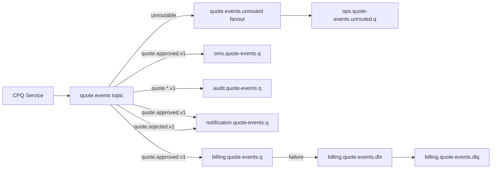

Self-check:

- apakah setiap subscriber punya queue sendiri?
- apakah audit wildcard memang disetujui?
- apakah unroutable ditangkap?
- apakah billing DLQ punya owner?
- apakah producer tahu queue billing? Seharusnya tidak.

---

## 30. Production Invariants

Gunakan invariant ini sebagai checklist akhir.

1. Producer publish ke exchange, bukan queue consumer.
2. Queue dimiliki consumer/subscriber.
3. Pub/sub memakai queue-per-subscriber.
4. Command memakai direct routing atau equivalent exact route.
5. Event memakai topic routing dengan taxonomy stabil.
6. Routing key tidak menjadi payload.
7. Semua exchange publik punya owner dan versioning policy.
8. Semua queue production punya owner, DLQ policy, dan runbook.
9. Unroutable messages tidak silent.
10. Wildcard binding direview dan dimonitor.
11. Topology changes punya migration plan.
12. Topology actual bisa dibandingkan dengan intended state.
13. Permissions mengikuti least privilege.
14. Metrics bisa menjawab: publish ke mana, route ke mana, queue mana tertinggal.
15. DLQ/parking lot bukan kuburan tanpa proses.

---

## 31. Kaufman Reflection: Learn Enough to Self-Correct

Setelah part ini, kamu belum perlu menghafal semua variasi topology. Yang penting adalah bisa **mendeteksi desain topology yang lemah**.

Pertanyaan self-correction:

1. Apakah producer mengetahui terlalu banyak tentang consumer?
2. Apakah queue ini mewakili ownership yang jelas?
3. Apakah binding terlalu luas?
4. Apakah routing key stabil sebagai contract?
5. Apakah topology bisa dievolusi tanpa downtime?
6. Apakah unroutable message terlihat?
7. Apakah failure path punya owner?
8. Apakah topology bisa diaudit dari nama resource saja?
9. Apakah security permission terlalu luas?
10. Apakah observability bisa membuktikan route bekerja?

Jika bisa menjawab ini, kamu sudah berpindah dari “bisa pakai RabbitMQ” ke “bisa mendesain messaging topology”.

---

## 32. Referensi

- RabbitMQ Documentation — Exchanges: https://www.rabbitmq.com/docs/exchanges
- RabbitMQ Documentation — AMQP 0-9-1 Model Explained: https://www.rabbitmq.com/tutorials/amqp-concepts
- RabbitMQ Documentation — Alternate Exchanges: https://www.rabbitmq.com/docs/ae
- RabbitMQ Documentation — Exchange to Exchange Bindings: https://www.rabbitmq.com/docs/e2e
- RabbitMQ Documentation — Publishers: https://www.rabbitmq.com/docs/publishers
- RabbitMQ Documentation — Dead Letter Exchanges: https://www.rabbitmq.com/docs/dlx
