# Part 012 — Delivery Guarantees: At-Most-Once, At-Least-Once, Effectively-Once

## 1. Tujuan Part Ini

Part ini membahas **delivery guarantees** RabbitMQ secara jujur dan production-grade.

Targetnya:

1. memahami perbedaan at-most-once, at-least-once, dan effectively-once;
2. memahami mengapa exactly-once end-to-end bukan guarantee realistis hanya dari broker;
3. menggabungkan publisher confirms, durable topology, persistent messages, manual consumer acknowledgements, dan idempotency;
4. membuat failure matrix dari producer sampai side effect di database/external system;
5. mendesain Java consumer yang benar saat message duplicate/redelivered;
6. memakai outbox/inbox pattern untuk atomicity aplikasi;
7. membuat decision framework untuk guarantee sesuai business criticality.

Inti part ini:

> RabbitMQ bisa membantu data safety, tetapi correctness end-to-end adalah tanggung jawab gabungan producer, broker, queue type, consumer, database, dan business idempotency.

---

## 2. Delivery Guarantee Bukan Satu Tombol

Kesalahan umum:

```text
Kami pakai durable queue, berarti message aman.
```

Tidak cukup.

Atau:

```text
Kami pakai publisher confirm, berarti exactly once.
```

Tidak benar.

Atau:

```text
Consumer ack setelah proses, berarti tidak duplicate.
```

Juga tidak benar.

Delivery guarantee adalah hasil komposisi banyak keputusan:

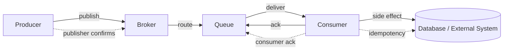

Setiap edge punya failure mode:

- publish bisa gagal atau ambiguous;
- broker bisa crash;
- route bisa tidak ada;
- queue bisa tidak durable;
- message bisa transient;
- consumer bisa crash;
- DB commit bisa berhasil tetapi ack gagal;
- ack bisa dikirim tetapi connection putus;
- retry bisa membuat duplicate;
- replay bisa memproses event lama lagi.

---

## 3. Vocabulary yang Harus Presisi

### 3.1 At-Most-Once

Message diproses **nol atau satu kali**.

Karakteristik:

- duplicate minimal;
- message loss mungkin terjadi;
- cocok untuk telemetry rendah risiko, metrics sampling, non-critical notifications;
- biasanya menggunakan auto-ack atau ack terlalu awal.

Contoh:

```text
Consumer menerima message -> ack otomatis -> crash sebelum proses -> message hilang.
```

At-most-once sering acceptable untuk:

- UI presence update;
- non-critical analytics sample;
- best-effort notification;
- cache invalidation yang sering dikirim ulang.

Tidak acceptable untuk:

- payment;
- order state transition;
- regulatory audit;
- stock reservation;
- enforcement case escalation.

---

### 3.2 At-Least-Once

Message diproses **satu kali atau lebih**.

Karakteristik:

- message loss diminimalkan;
- duplicate mungkin terjadi;
- consumer harus idempotent;
- retry/redelivery adalah bagian normal sistem.

Contoh:

```text
Consumer commit DB -> crash sebelum ack -> broker redeliver -> consumer proses lagi.
```

At-least-once adalah default target untuk banyak workflow bisnis kritis.

---

### 3.3 Exactly-Once

Exactly-once end-to-end berarti:

```text
Setiap business effect terjadi tepat satu kali, meskipun ada crash, retry, timeout, network failure, broker restart, dan duplicate delivery.
```

Dalam distributed system umum, ini tidak bisa dicapai hanya dengan “broker setting”.

Yang bisa dicapai secara praktis adalah:

> Effectively-once: delivery boleh duplicate, tetapi side effect bisnis dibuat idempotent sehingga hasil akhirnya sama seperti diproses satu kali.

---

### 3.4 Effectively-Once

Effectively-once bukan guarantee broker. Ini adalah desain aplikasi.

Komponennya:

1. stable message identity;
2. idempotent handler;
3. transactional dedup/inbox;
4. ack setelah side effect durable;
5. retry policy yang bounded;
6. observability untuk duplicate dan redelivery.

Effectively-once tidak berarti duplicate tidak pernah datang. Artinya duplicate tidak mengubah hasil bisnis.

---

## 4. RabbitMQ Reliability Building Blocks

### 4.1 Durable Exchange

Exchange durable bertahan setelah broker restart.

```java
channel.exchangeDeclare("order.events", BuiltinExchangeType.TOPIC, true);
```

Tetapi durable exchange saja tidak menyimpan message.

---

### 4.2 Durable Queue

Queue durable bertahan setelah broker restart.

```java
channel.queueDeclare("billing.order-events.q", true, false, false, null);
```

Tetapi durable queue saja tidak cukup jika message transient.

---

### 4.3 Persistent Message

Message persistent meminta broker menyimpan message secara durable.

```java
AMQP.BasicProperties props = new AMQP.BasicProperties.Builder()
    .deliveryMode(2)
    .messageId(messageId)
    .contentType("application/json")
    .build();
```

Durable queue + persistent message adalah baseline untuk data safety, tetapi producer masih perlu tahu apakah publish sudah diterima broker.

---

### 4.4 Publisher Confirms

Publisher confirms memberi feedback ke producer bahwa broker sudah menangani publish.

```java
channel.confirmSelect();
channel.basicPublish(exchange, routingKey, true, props, body);
boolean confirmed = channel.waitForConfirms(5_000);
```

Tanpa confirm, producer tidak punya bukti kuat bahwa broker menerima message, terutama saat connection failure.

---

### 4.5 Mandatory Flag / Return Listener

Publisher confirm menjawab “broker menerima publish”, bukan “ada queue yang menerima route” untuk semua kasus topology.

Untuk unroutable message, gunakan `mandatory=true` dan return listener, atau alternate exchange.

```java
channel.addReturnListener(returned -> {
    log.error("Unroutable message exchange={} routingKey={}",
        returned.getExchange(),
        returned.getRoutingKey());
});

channel.basicPublish(exchange, routingKey, true, props, body);
```

---

### 4.6 Manual Consumer Acknowledgement

Consumer ack memberi tahu broker bahwa message boleh dianggap selesai.

```java
DeliverCallback callback = (consumerTag, delivery) -> {
    long tag = delivery.getEnvelope().getDeliveryTag();
    try {
        handle(delivery);
        channel.basicAck(tag, false);
    } catch (RetryableException e) {
        channel.basicNack(tag, false, true);
    } catch (NonRetryableException e) {
        channel.basicReject(tag, false);
    }
};

channel.basicConsume(queue, false, callback, consumerTag -> {});
```

Rule:

> Ack hanya setelah side effect yang diperlukan sudah durable atau aman diabaikan.

---

### 4.7 Queue Type and Replication

Untuk workload data-safety tinggi, queue type matters.

Classic queue, quorum queue, dan stream punya trade-off berbeda. Untuk command/task critical, quorum queue sering menjadi pilihan data-safety oriented karena replicated dan consensus-based. Untuk replay/log, streams lebih cocok.

Namun queue type tidak menghapus kebutuhan publisher confirms, manual acknowledgements, dan idempotent consumer.

---

## 5. Safety Equation

Untuk at-least-once RabbitMQ workload, equation minimal:

```text
At-least-once-ish delivery =
  durable exchange
+ durable queue / replicated queue where appropriate
+ persistent message
+ publisher confirm
+ routability check
+ manual consumer ack
+ ack after durable side effect
+ idempotent consumer
+ bounded retry/DLQ
```

Jika salah satu hilang, guarantee melemah.

Contoh:

| Hilang | Dampak |
|---|---|
| Durable queue | queue bisa hilang setelah restart |
| Persistent message | message bisa hilang saat broker restart |
| Publisher confirm | producer tidak tahu publish aman |
| Mandatory/AE | unroutable bisa tidak terlihat |
| Manual ack | crash consumer bisa menyebabkan loss |
| Idempotency | redelivery bisa double side effect |
| DLQ | poison message bisa loop/menahan queue |

---

## 6. At-Most-Once Design

At-most-once sengaja memilih kemungkinan loss untuk mengurangi duplicate dan latency.

Pattern:

```java
channel.basicConsume(queue, true, callback, consumerTag -> {});
```

`autoAck=true` berarti broker menganggap message selesai saat delivery dikirim ke consumer, bukan setelah processing selesai.

Failure:

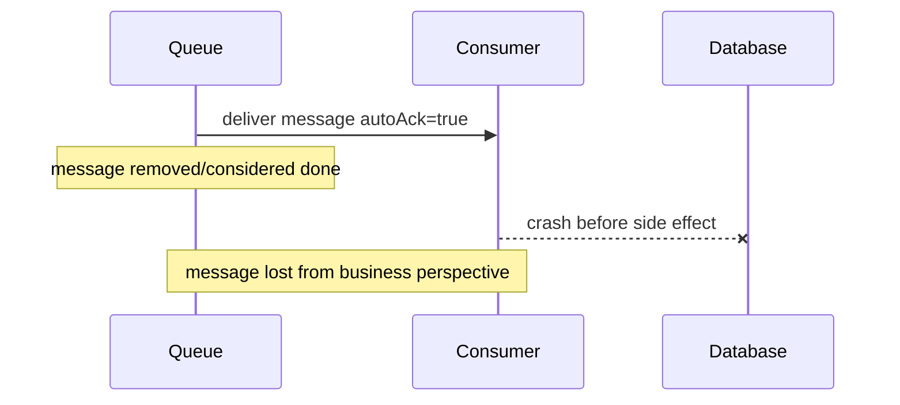

At-most-once bisa dipilih jika:

- data bisa dikirim ulang dari sumber lain;
- loss acceptable;
- duplicate lebih buruk daripada loss;
- latency lebih penting daripada completeness;
- event bukan source of truth.

Contoh:

- metrics sample;
- non-critical activity pulse;
- temporary UI signal;
- cache hint.

---

## 7. At-Least-Once Design

At-least-once berusaha memastikan message tidak hilang, dengan konsekuensi duplicate.

Pattern:

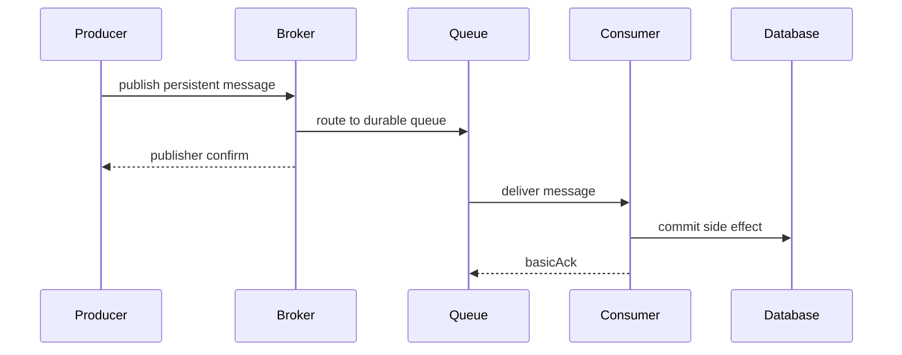

Failure duplicate example:

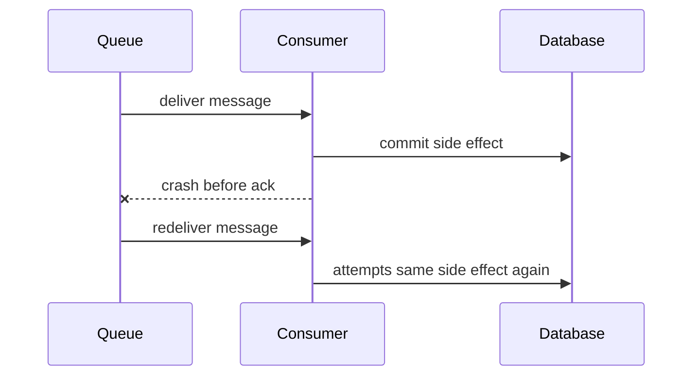

At-least-once requires:

- idempotent side effect;
- deduplication store;
- message id uniqueness;
- retry classification;
- DLQ for non-retryable messages.

---

## 8. Effectively-Once Design

Effectively-once means duplicate delivery is allowed, duplicate business effect is not.

Core idea:

```text
Before applying side effect, atomically check whether messageId was already applied.
```

### 8.1 Inbox Table Pattern

Schema concept:

```sql
CREATE TABLE message_inbox (
    consumer_name     VARCHAR(100) NOT NULL,
    message_id        VARCHAR(100) NOT NULL,
    received_at       TIMESTAMP NOT NULL,
    processed_at      TIMESTAMP NULL,
    status            VARCHAR(30) NOT NULL,
    error_code        VARCHAR(100) NULL,
    PRIMARY KEY (consumer_name, message_id)
);
```

Processing flow:

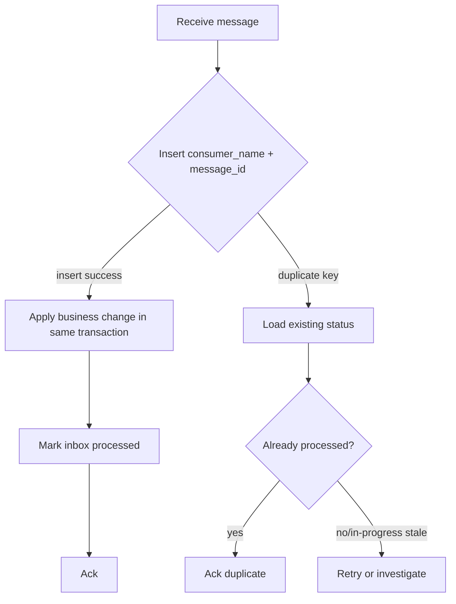

Java sketch:

```java
@Transactional
public void handle(OrderCreated event, MessageMetadata meta) {
    boolean firstSeen = inboxRepository.tryInsert(
        "billing-order-created-consumer",
        meta.messageId()
    );

    if (!firstSeen) {
        InboxStatus status = inboxRepository.status(
            "billing-order-created-consumer",
            meta.messageId()
        );

        if (status == InboxStatus.PROCESSED) {
            return; // safe duplicate
        }

        throw new RetryableDuplicateInProgressException(meta.messageId());
    }

    billingService.createInvoiceIfAbsent(event.orderId(), event.customerId());
    inboxRepository.markProcessed("billing-order-created-consumer", meta.messageId());
}
```

Ack happens outside transaction after method returns successfully.

---

### 8.2 Idempotent Business Key Pattern

Kadang message id dedup tidak cukup. Gunakan business key.

Example:

```text
Capture payment for paymentIntentId=pi_123 amount=100000 IDR
```

Idempotency key:

```text
payment-capture:pi_123
```

Database constraint:

```sql
CREATE UNIQUE INDEX ux_payment_capture_intent
ON payment_capture(payment_intent_id);
```

Handler:

```java
public void capturePayment(CapturePaymentCommand command) {
    if (paymentCaptureRepository.existsByIntentId(command.paymentIntentId())) {
        return;
    }

    paymentGateway.capture(
        command.paymentIntentId(),
        command.amount(),
        command.idempotencyKey()
    );

    paymentCaptureRepository.insert(command.paymentIntentId(), command.amount());
}
```

Jika external system mendukung idempotency key, selalu teruskan key yang stabil.

---

## 9. Producer Atomicity Problem

Problem klasik:

```text
Service commit DB, lalu publish event.
```

Failure:

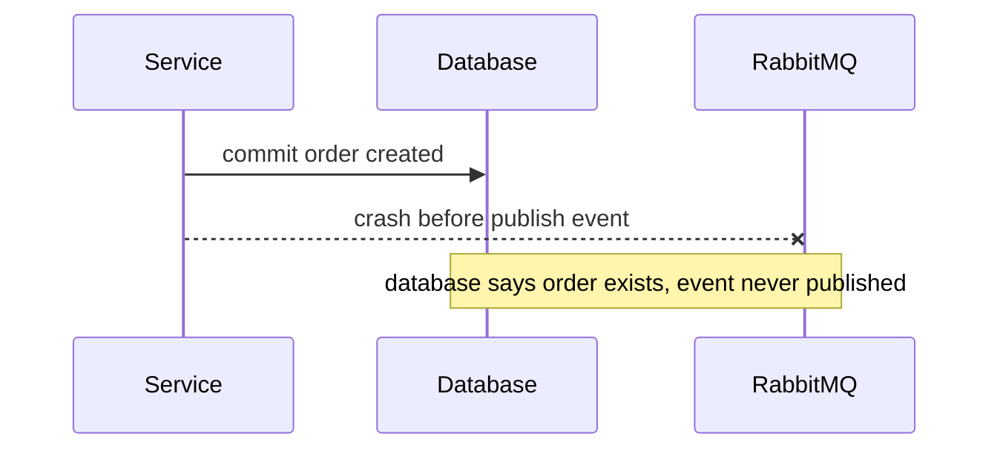

Atau sebaliknya:

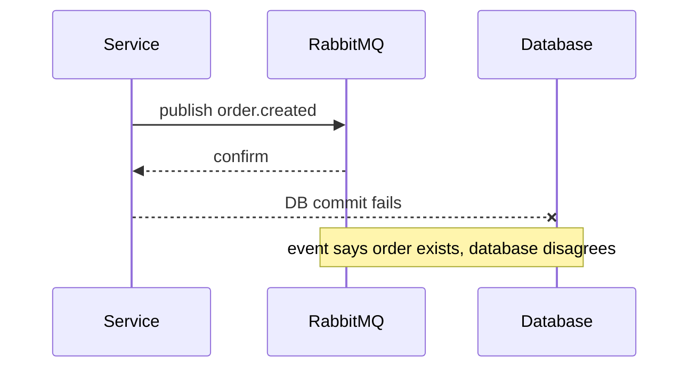

Solusi umum: **transactional outbox**.

---

## 10. Transactional Outbox Pattern

Service menulis business data dan outbox event dalam satu database transaction.

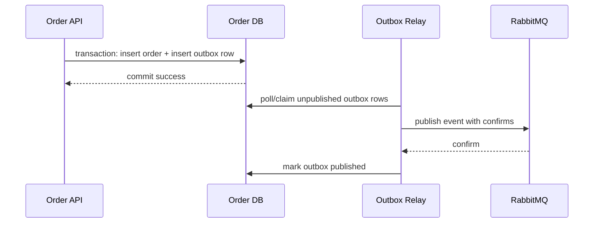

Outbox schema concept:

```sql
CREATE TABLE outbox_message (
    id              VARCHAR(100) PRIMARY KEY,
    aggregate_type  VARCHAR(100) NOT NULL,
    aggregate_id    VARCHAR(100) NOT NULL,
    event_type      VARCHAR(100) NOT NULL,
    routing_key     VARCHAR(200) NOT NULL,
    payload         JSONB NOT NULL,
    headers         JSONB NOT NULL,
    created_at      TIMESTAMP NOT NULL,
    published_at    TIMESTAMP NULL,
    publish_attempt INT NOT NULL DEFAULT 0
);
```

Relay rules:

1. publish with persistent message;
2. use publisher confirms;
3. use `mandatory=true` or AE;
4. mark published only after confirm;
5. retry publish if not confirmed;
6. do not mutate payload after commit;
7. preserve message id as outbox id.

Potential duplicate:

```text
Relay publishes -> broker confirms -> relay crashes before mark published -> relay publishes again.
```

Therefore consumers must still be idempotent.

Outbox reduces loss; it does not eliminate duplicates.

---

## 11. Consumer Atomicity Problem

Consumer problem:

```text
Consume message -> update DB -> ack message
```

Failure windows:

| Window | Failure | Result |
|---|---|---|
| Before DB commit | crash | message redelivered, no side effect |
| After DB commit before ack | crash | message redelivered, duplicate risk |
| After ack before DB commit | crash | message lost from business perspective |
| During ack network failure | ambiguous | broker may redeliver |

Correct order for business-critical processing:

```text
receive -> validate -> begin transaction -> dedup/inbox -> business change -> commit -> ack
```

Never ack before durable side effect unless at-most-once is intended.

---

## 12. Full Effectively-Once Flow

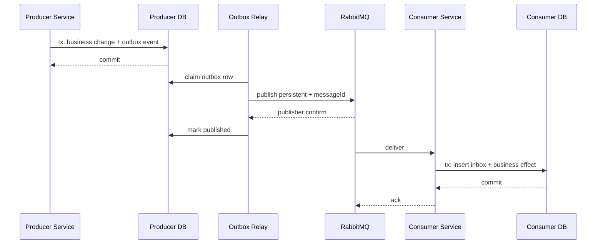

Guarantee:

- event is not lost between DB commit and publish under normal recovery;
- publish ambiguity handled by relay retry;
- duplicate publish handled by consumer idempotency;
- duplicate delivery handled by inbox;
- side effect occurs effectively once if business operation is idempotent and transaction boundaries are correct.

---

## 13. Failure Matrix

### 13.1 Producer Side

| Step | Failure | Without Protection | With Protection |
|---|---|---|---|
| Before DB commit | process crash | no DB/no message | no effect |
| After DB commit before publish | process crash | event lost | outbox relay publishes later |
| During publish | network loss | ambiguous | publisher confirm retry |
| Publish unroutable | wrong routing key | silent loss if no mandatory/AE | returned/unrouted queue |
| After confirm before mark published | relay crash | possible duplicate later | consumer idempotency |
| Broker restart | volatile topology/message | loss | durable + persistent/quorum as needed |

### 13.2 Broker Side

| Failure | Risk | Mitigation |
|---|---|---|
| Node crash | queue/message loss depending queue type/durability | durable queue, persistent message, quorum where needed |
| Route missing | message not delivered to intended queue | mandatory/AE/topology tests |
| Disk alarm | publish blocked/slow | flow control handling, alerting |
| Queue max length | drop/dead-letter/reject depending policy | capacity planning, confirm nack handling |
| Network partition | availability/consistency trade-off | cluster design, quorum queues, client retry discipline |

### 13.3 Consumer Side

| Step | Failure | Result | Mitigation |
|---|---|---|---|
| Before processing | crash | redelivery | safe |
| After partial external call | crash | ambiguous external state | external idempotency key/reconciliation |
| After DB commit before ack | crash | duplicate delivery | inbox/idempotent handler |
| After ack before commit | crash | message loss | never ack early |
| Poison message | repeated failure | retry storm | classification + DLQ |
| Slow processing | queue growth | latency/backpressure | prefetch/concurrency/capacity |

---

## 14. Ack Timing Decision

| Scenario | Ack Timing | Reason |
|---|---|---|
| Critical DB update | after DB commit | avoid loss |
| Idempotent external API with key | after successful API response + durable record | avoid duplicate side effect |
| Non-critical metrics | auto-ack or early ack | loss acceptable |
| Batch DB write | after batch commit | avoid partial loss |
| Long task | after durable task completion marker | avoid invisible failure |
| Poison message | reject/nack without requeue | avoid retry loop |
| Retryable transient error | nack/retry path | allow reprocessing |

Rule:

> Ack is not “I received it”. Ack is “the system no longer needs RabbitMQ to retain this delivery.”

---

## 15. Publisher Confirm Patterns Revisited

### 15.1 Sync Confirm Per Message

```java
channel.confirmSelect();

channel.basicPublish(exchange, routingKey, true, props, body);
channel.waitForConfirmsOrDie(5_000);
```

Pros:

- simple;
- clear failure point.

Cons:

- low throughput;
- high latency.

Use for:

- admin tools;
- low volume critical commands;
- simple relay implementation before optimizing.

---

### 15.2 Batch Confirm

```java
channel.confirmSelect();

int batchSize = 100;
for (int i = 0; i < messages.size(); i++) {
    publish(messages.get(i));
    if ((i + 1) % batchSize == 0) {
        channel.waitForConfirmsOrDie(5_000);
    }
}
channel.waitForConfirmsOrDie(5_000);
```

Pros:

- better throughput;
- simple enough.

Cons:

- if batch fails, identifying exact message may require republish whole batch;
- duplicate risk increases.

Use with idempotent consumers.

---

### 15.3 Async Confirm with In-Flight Map

```java
ConcurrentNavigableMap<Long, OutboundMessage> outstanding = new ConcurrentSkipListMap<>();

channel.confirmSelect();

channel.addConfirmListener((sequenceNumber, multiple) -> {
    if (multiple) {
        outstanding.headMap(sequenceNumber, true).clear();
    } else {
        outstanding.remove(sequenceNumber);
    }
}, (sequenceNumber, multiple) -> {
    Collection<OutboundMessage> failed = multiple
        ? new ArrayList<>(outstanding.headMap(sequenceNumber, true).values())
        : List.of(outstanding.get(sequenceNumber));

    scheduleRetry(failed);
});

long seqNo = channel.getNextPublishSeqNo();
outstanding.put(seqNo, outboundMessage);
channel.basicPublish(exchange, routingKey, true, props, body);
```

Pros:

- high throughput;
- good for outbox relay.

Cons:

- harder lifecycle;
- memory bound needed;
- retry semantics must handle duplicate.

Invariant:

```text
outstanding confirms must be bounded by memory and business timeout.
```

---

## 16. Redelivery and Duplicate Handling

RabbitMQ delivery has `redelivered` flag, but do not rely on it as your only duplicate detector.

Why?

- duplicate publish from producer may arrive as fresh delivery;
- replay from DLQ may not look like original redelivery;
- outbox relay duplicate publish may have same message id but new broker delivery;
- stream replay intentionally reprocesses old messages.

Use `messageId` and business idempotency key.

```java
String messageId = delivery.getProperties().getMessageId();
boolean redelivered = delivery.getEnvelope().isRedeliver();

if (messageId == null || messageId.isBlank()) {
    rejectAsInvalidContract(delivery);
    return;
}
```

Contract invariant:

> Business-critical message must have a stable producer-generated messageId.

---

## 17. Retry and Delivery Guarantees

Retry strengthens availability but increases duplicate and disorder.

Retry types:

1. immediate retry in same consumer;
2. broker redelivery via requeue;
3. delayed retry queue;
4. scheduled retry;
5. manual replay from DLQ.

Immediate retry example:

```java
for (int attempt = 1; attempt <= 3; attempt++) {
    try {
        handler.handle(message);
        ack();
        return;
    } catch (TransientDependencyException e) {
        sleep(backoff(attempt));
    }
}

nackToRetryOrDlq();
```

Risks:

- holds consumer thread;
- blocks prefetch slot;
- can amplify dependency outage.

Broker requeue risk:

```java
channel.basicNack(tag, false, true);
```

If many consumers requeue immediately, you can create redelivery storm.

For production, prefer explicit retry topology with TTL/delay and retry count, then DLQ/parking lot after budget exhausted.

---

## 18. External Side Effects

Database side effects can usually be made transactional. External calls are harder.

Examples:

- payment gateway;
- email provider;
- shipping provider;
- SMS provider;
- regulator API;
- third-party scoring engine.

Problem:

```text
Call external API succeeds -> consumer crashes before recording success -> message redelivered -> API called again.
```

Mitigation hierarchy:

1. external API idempotency key;
2. local operation table before call;
3. reconciliation job;
4. compensating action;
5. manual review for high-risk ambiguity.

Pattern:

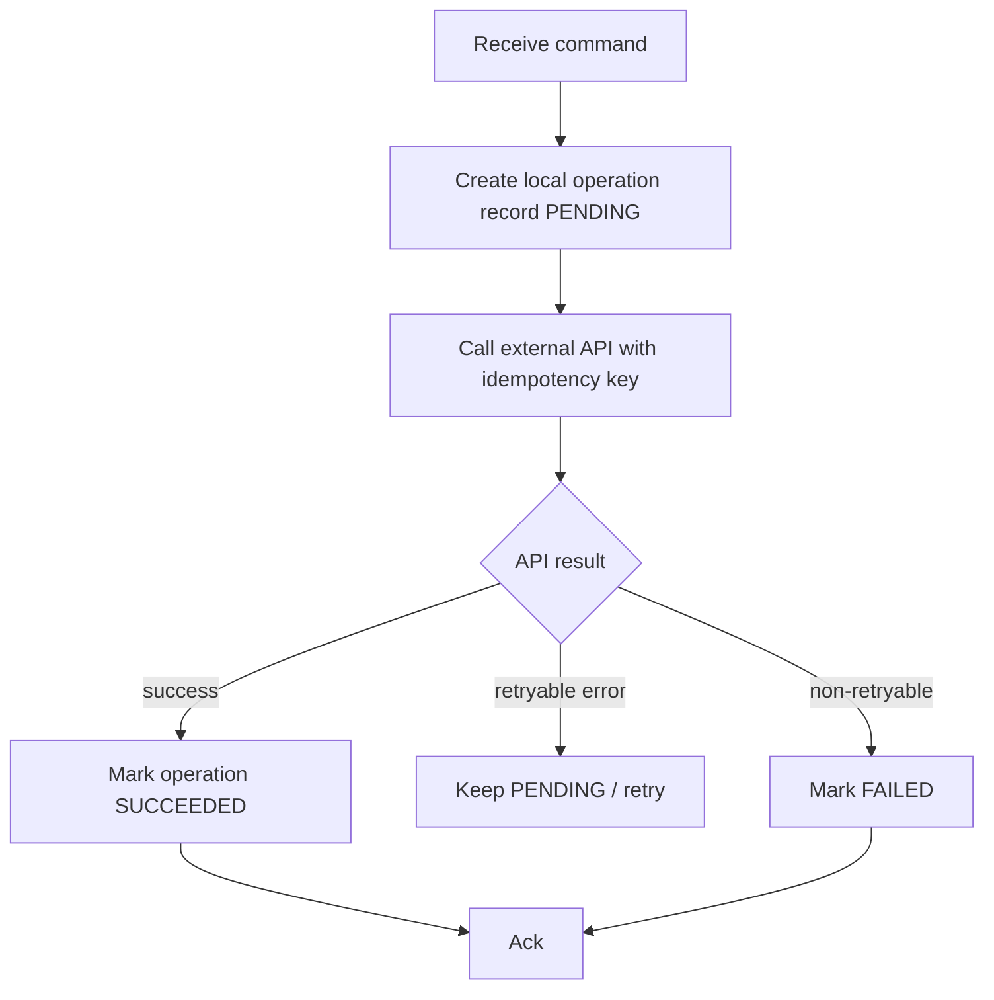

Important:

> Ack only after local system has durable knowledge of the external outcome or a durable plan to reconcile ambiguity.

---

## 19. Ordering vs Delivery Guarantees

At-least-once and retry can break perceived ordering.

Example:

```text
Message A delivered -> fails -> requeued
Message B delivered -> succeeds
Message A redelivered -> succeeds
```

Result:

```text
B processed before A
```

If ordering matters:

- use one queue per ordering key or partition strategy;
- avoid multiple consumers for strict total order;
- use prefetch 1 for strict per-consumer processing;
- make handlers tolerant of out-of-order events;
- use version/sequence in payload;
- park future event until prior version exists.

Do not assume at-least-once preserves business order under failure.

---

## 20. Exactly-Once Myth Checklist

Jika seseorang bilang “RabbitMQ exactly-once”, tanyakan:

1. exactly once delivery ke consumer, atau exactly once side effect?
2. apa yang terjadi jika DB commit sukses tapi ack gagal?
3. apa yang terjadi jika publish confirm sukses tapi relay crash sebelum mark published?
4. apa yang terjadi jika external API sukses tapi response timeout?
5. apa idempotency key-nya?
6. bagaimana duplicate dideteksi?
7. apakah retry dari DLQ aman?
8. apakah replay stream aman?
9. apakah message id stable across retries?
10. apakah side effect punya unique constraint?

Jika pertanyaan ini tidak bisa dijawab, guarantee-nya belum matang.

---

## 21. Java Consumer Blueprint for At-Least/Effectively-Once

```java
public final class SafeRabbitConsumer {
    private final Channel channel;
    private final String queue;
    private final MessageHandler handler;
    private final ErrorClassifier errorClassifier;

    public void start() throws IOException {
        channel.basicQos(50);
        channel.basicConsume(queue, false, this::onDelivery, this::onCancel);
    }

    private void onDelivery(String consumerTag, Delivery delivery) throws IOException {
        long tag = delivery.getEnvelope().getDeliveryTag();
        MessageMetadata metadata = MessageMetadata.from(delivery);

        try {
            validate(metadata, delivery);
            handler.handle(delivery.getBody(), metadata);
            channel.basicAck(tag, false);
        } catch (Exception e) {
            FailureDecision decision = errorClassifier.classify(e, metadata);
            applyFailureDecision(tag, decision, e, metadata);
        }
    }

    private void applyFailureDecision(
        long tag,
        FailureDecision decision,
        Exception error,
        MessageMetadata metadata
    ) throws IOException {
        switch (decision.action()) {
            case RETRY_REQUEUE -> channel.basicNack(tag, false, true);
            case DLQ -> channel.basicReject(tag, false);
            case ACK_DUPLICATE -> channel.basicAck(tag, false);
            case PARK -> {
                publishToParkingLot(metadata, error);
                channel.basicAck(tag, false);
            }
        }
    }

    private void onCancel(String consumerTag) {
        // log and trigger lifecycle handling
    }
}
```

Butuh perhatian:

- `handler.handle` harus transactional/idempotent;
- `ACK_DUPLICATE` hanya aman jika duplicate sudah terbukti processed;
- `PARK` harus publish ke parking lot dengan confirm sebelum ack;
- jangan swallow exception lalu ack tanpa classification.

---

## 22. Message Metadata Contract

Business-critical message harus punya metadata minimal:

```json
{
  "messageId": "01JABC...",
  "correlationId": "corr-123",
  "causationId": "cmd-456",
  "producer": "order-service",
  "schema": "order.created.v1",
  "occurredAt": "2026-07-01T10:15:30Z",
  "tenantId": "tenant-123",
  "idempotencyKey": "order-created:ord-789:v1"
}
```

Mapping ke AMQP:

| Metadata | AMQP Property/Header |
|---|---|
| messageId | `messageId` |
| correlationId | `correlationId` |
| causationId | header |
| producer | `appId` or header |
| schema/type | `type` or header |
| occurredAt | `timestamp` or payload field |
| tenantId | header/payload |
| idempotencyKey | header |

Rules:

1. `messageId` generated by producer, not consumer;
2. retry keeps same logical message id unless intentionally creating new message;
3. dedup uses consumer name + message id;
4. business idempotency uses stable domain key;
5. correlation id must flow across publish chains.

---

## 23. Delivery Guarantee by Workload Type

| Workload | Recommended Guarantee | Pattern |
|---|---|---|
| Metrics sample | At-most-once | auto/early ack acceptable |
| Email notification | At-least-once with provider idempotency if possible | manual ack + retry/DLQ |
| Payment capture | Effectively-once | command idempotency + operation table + external idempotency key |
| Order created event | At-least-once/effectively-once consumer | outbox + idempotent subscribers |
| Audit event | At-least-once with durable log/stream consideration | outbox + durable queue/stream |
| Cache invalidation | At-most or at-least depending tolerance | retry optional |
| Regulatory case escalation | Effectively-once | inbox + state transition guard + audit |
| Search indexing | At-least-once, replayable | idempotent projection |

---

## 24. Observability for Guarantees

You cannot claim reliability you cannot observe.

Metrics:

| Metric | Why |
|---|---|
| publish confirm latency | broker acceptance health |
| publish confirm nack count | broker rejection/safety issue |
| returned/unroutable count | route correctness |
| outstanding confirms | producer backpressure |
| consumer ack latency | processing health |
| redelivery count | retry/failure signal |
| duplicate detected count | idempotency working |
| inbox insert conflict count | duplicate pressure |
| DLQ rate | non-retryable/poison signal |
| retry count by reason | dependency health |
| ack-after-commit failures | ambiguous consumer window |
| outbox unpublished age | relay lag |
| outbox publish attempts | broker or route problem |

Log fields:

```json
{
  "messageId": "01J...",
  "correlationId": "corr-123",
  "exchange": "order.events",
  "routingKey": "order.created.v1",
  "queue": "billing.order-events.q",
  "deliveryTag": 42,
  "redelivered": true,
  "consumer": "billing-order-created-consumer",
  "dedupStatus": "duplicate_processed",
  "ackDecision": "ack_duplicate"
}
```

---

## 25. Runbook: Duplicate Spike

Symptom:

```text
duplicate_detected_count meningkat tajam
```

Check:

1. apakah broker/consumer restart?
2. apakah ack latency naik?
3. apakah DB commit lambat menyebabkan crash/timeout?
4. apakah publisher relay mengirim ulang batch?
5. apakah confirm timeout terlalu pendek?
6. apakah DLQ replay sedang berjalan?
7. apakah retry topology menyebabkan loop?
8. apakah consumer deployment baru gagal setelah commit sebelum ack?

Action:

- jangan disable idempotency;
- cek message id stability;
- throttle replay/retry;
- periksa consumer exception after commit;
- korelasikan dengan broker connection drops;
- lakukan reconciliation untuk external side effects.

---

## 26. Runbook: Message Loss Suspicion

Symptom:

```text
DB source has record, downstream never received event
```

Check producer side:

1. apakah source memakai outbox?
2. apakah outbox row ada?
3. apakah outbox marked published?
4. apakah publisher confirm diterima?
5. apakah returned/unroutable terjadi?
6. apakah routing key benar?
7. apakah exchange/binding ada saat publish?

Check broker side:

1. apakah queue durable?
2. apakah message persistent?
3. apakah queue existed saat publish?
4. apakah broker restart/disk alarm/queue limit?
5. apakah alternate exchange menangkap message?

Check consumer side:

1. apakah consumer ack sebelum commit?
2. apakah DLQ berisi message?
3. apakah consumer error logs ada?
4. apakah message diproses tapi side effect gagal?
5. apakah dedup salah menganggap duplicate?

---

## 27. Testing Delivery Guarantees

### 27.1 Producer Confirm Test

```java
@Test
void publisherShouldNotMarkOutboxPublishedWithoutConfirm() {
    broker.pauseNetwork();

    relay.publishOne(outboxMessage);

    assertThat(outboxRepository.find(outboxMessage.id()).publishedAt()).isNull();
}
```

### 27.2 Consumer Crash After Commit Test

```java
@Test
void duplicateDeliveryAfterCommitShouldNotDuplicateBusinessEffect() {
    Delivery delivery = deliveryWithMessageId("msg-123");

    consumer.handleAndCommitButCrashBeforeAck(delivery);
    consumer.handle(delivery); // redelivery simulation

    assertThat(invoiceRepository.countByOrderId("ord-1")).isEqualTo(1);
    assertThat(inboxRepository.status("billing", "msg-123")).isEqualTo(PROCESSED);
}
```

### 27.3 Unroutable Test

```java
@Test
void unroutableCriticalPublishShouldFailFast() {
    assertThatThrownBy(() -> publisher.publishCritical(
        "order.events",
        "order.unknown.v1",
        payload
    )).isInstanceOf(UnroutableMessageException.class);
}
```

### 27.4 DLQ Test

```java
@Test
void nonRetryableMessageShouldGoToDlqAndNotLoop() {
    publishInvalidPayload();

    eventually(() -> assertThat(dlqCount()).isEqualTo(1));
    assertThat(mainQueueRedeliveryRate()).isLessThan(threshold);
}
```

---

## 28. Decision Framework

Pilih guarantee berdasarkan cost of loss vs cost of duplicate.

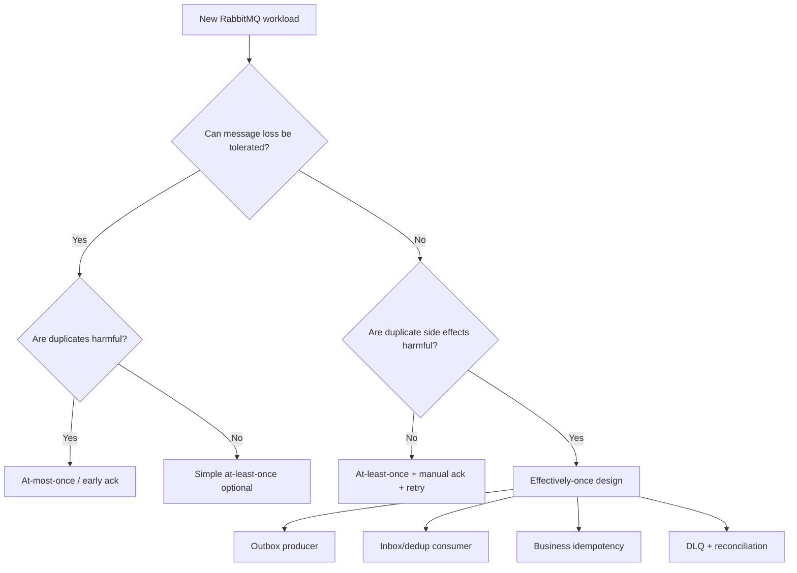

Questions:

1. Is message loss acceptable?
2. Is duplicate delivery acceptable?
3. Is duplicate side effect acceptable?
4. Can side effect be made idempotent?
5. Can producer state and publish be atomically linked?
6. Can consumer side effect and dedup be in one transaction?
7. Is external system idempotent?
8. Is manual replay required?
9. Is ordering required?
10. What is the runbook for ambiguity?

---

## 29. Common Mistakes

### 29.1 Ack Before Commit

```java
channel.basicAck(tag, false);
repository.save(entity);
```

If process crashes after ack, message is lost from business perspective.

---

### 29.2 No Message ID

Without message id, dedup becomes guesswork.

---

### 29.3 Dedup Outside Transaction

```text
check dedup -> commit business -> insert dedup
```

Race-prone.

Better:

```text
insert dedup/inbox -> business change -> mark processed, same transaction
```

---

### 29.4 Treating Redelivered Flag as Dedup

`redelivered=false` does not mean “never processed before”.

---

### 29.5 Retrying Non-Idempotent External Calls

Payment/email/shipment calls need idempotency key or reconciliation.

---

### 29.6 Marking Outbox Published Before Confirm

If relay marks published before broker confirm, event can be lost.

---

### 29.7 Infinite Requeue

```java
channel.basicNack(tag, false, true);
```

without retry budget can create hot loop.

---

## 30. Production Invariants

1. Business-critical producers use publisher confirms.
2. Critical messages are persistent and routed to durable/appropriate replicated queues.
3. Critical publish checks routability via mandatory return or alternate exchange.
4. Consumers use manual acknowledgement.
5. Consumers ack after durable side effect, not before.
6. Message has stable `messageId`.
7. Consumer is idempotent by message id and/or business key.
8. Outbox is used when DB state change must emit event reliably.
9. Inbox/dedup is used when duplicate side effect is harmful.
10. External calls use idempotency key or durable reconciliation state.
11. Retry is bounded and classified.
12. DLQ has owner, alert, and replay process.
13. Duplicate count is measured.
14. Unroutable count is measured.
15. “Exactly-once” claims are translated into concrete failure windows and invariants.

---

## 31. Kaufman Reflection: Feedback Loop for Reliability

Kaufman-style learning means you need fast feedback to self-correct.

For delivery guarantees, feedback bukan hanya “test green”. Feedback harus membuktikan desain tetap benar saat failure.

Practice loop:

1. publish message;
2. kill producer before/after confirm;
3. kill consumer before/after DB commit;
4. restart broker;
5. inject duplicate publish;
6. replay DLQ;
7. verify final business state;
8. inspect metrics/logs.

Target bukan tidak ada duplicate. Targetnya:

> Setelah semua failure injection, business state tetap benar dan operator bisa menjelaskan apa yang terjadi dari logs/metrics.

---

## 32. Practice Drill

Design workload:

> `OrderService` creates order and must notify Billing, Fulfillment, Audit. Billing creates invoice. Fulfillment reserves stock. Audit must never miss order-created event. Duplicate invoice/stock reservation is not allowed.

Expected design:

- producer uses transactional outbox;
- event `order.created.v1` has stable message id;
- outbox relay publishes persistent message to `order.events` with publisher confirms;
- `mandatory=true` or alternate exchange enabled;
- billing has `billing.order-events.q` with manual ack;
- fulfillment has `fulfillment.order-events.q` with manual ack;
- audit has `audit.order-events.q` or stream depending replay/audit requirement;
- billing uses inbox + unique invoice per order;
- fulfillment uses reservation idempotency key;
- all consumers ack after commit;
- retry is bounded;
- DLQ and parking lot exist;
- duplicate and redelivery metrics are monitored.

Self-check:

1. What if order DB commit succeeds but publish fails?
2. What if relay publishes twice?
3. What if billing commits invoice but crashes before ack?
4. What if fulfillment external inventory API times out after success?
5. What if audit consumer is down for 3 hours?
6. What if routing key is wrong?
7. What if DLQ replay sends old messages?

If the design answers all seven, it is production-grade.

---

## 33. Referensi

- RabbitMQ Documentation — Consumer Acknowledgements and Publisher Confirms: https://www.rabbitmq.com/docs/confirms
- RabbitMQ Documentation — Reliability Guide: https://www.rabbitmq.com/docs/reliability
- RabbitMQ Tutorial — Publisher Confirms Java: https://www.rabbitmq.com/tutorials/tutorial-seven-java
- RabbitMQ Documentation — Quorum Queues: https://www.rabbitmq.com/docs/quorum-queues
- RabbitMQ Documentation — Streams and Super Streams: https://www.rabbitmq.com/docs/streams
- RabbitMQ Documentation — Publishers: https://www.rabbitmq.com/docs/publishers
- RabbitMQ Documentation — Dead Letter Exchanges: https://www.rabbitmq.com/docs/dlx
