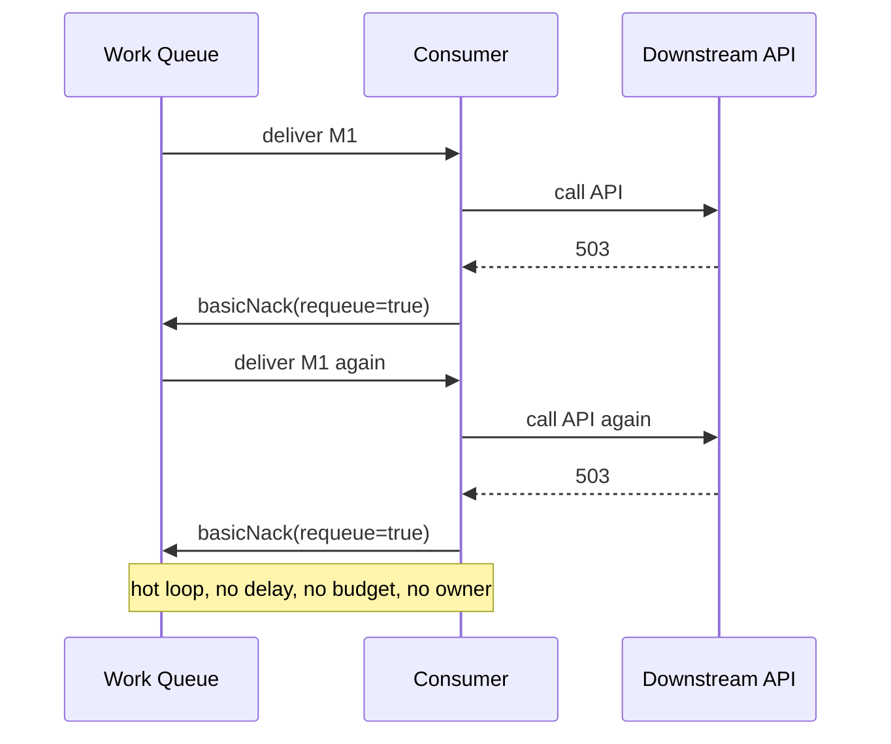
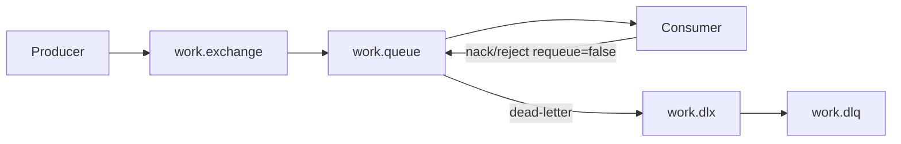
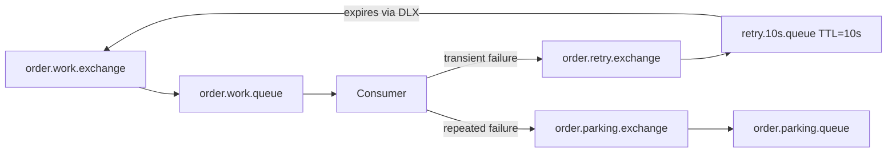
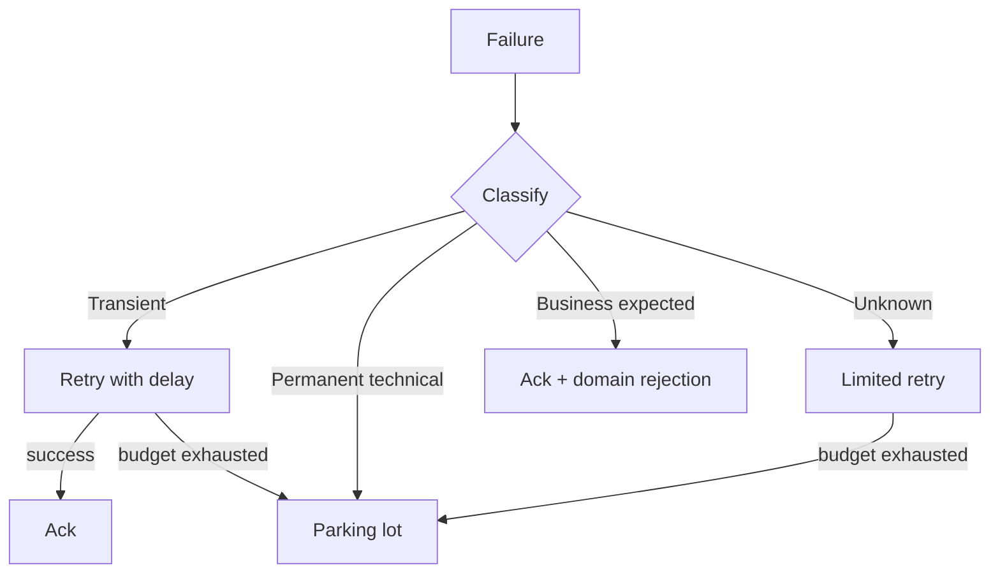
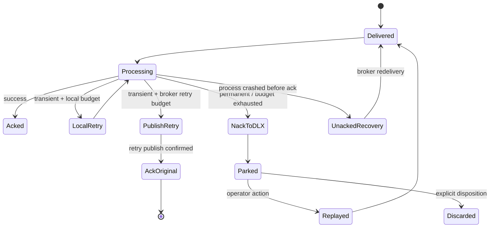
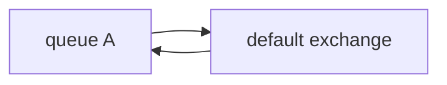
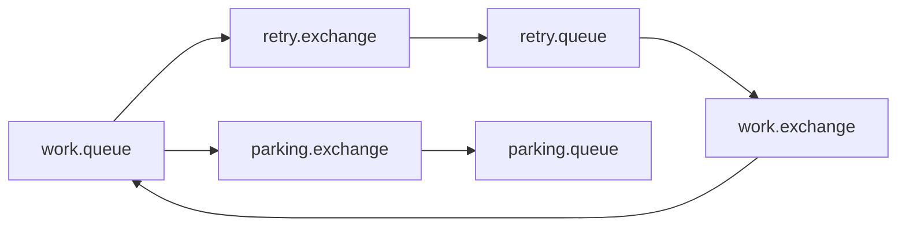

# Part 013 — Retry Architecture: Immediate Retry, Delayed Retry, DLQ, Parking Lot

Retry is not a line of code. Retry is a **distributed failure policy**.

A weak RabbitMQ design treats retry as: catch exception, requeue message, hope. A production-grade design treats retry as a controlled state transition with bounded attempts, observable reasons, delayed re-entry, poison-message isolation, and a human-operable recovery path.

In this part we build the retry architecture that should sit behind every serious Java RabbitMQ workload.

We will focus on AMQP 0-9-1 queues first. Streams have a different recovery model because messages are not removed by consumption; we will cover stream-specific replay in later parts.

---

## 1. Kaufman Deconstruction

To learn retry architecture fast, decompose it into five subskills:

1. **Classify failures** correctly.
2. **Choose the retry location**: inside consumer, broker topology, scheduler, or operator workflow.
3. **Preserve delivery safety**: no silent loss, no infinite loops, no duplicate amplification.
4. **Expose observability**: retry count, reason, latency, dead-letter path, and owner.
5. **Design exit states**: success, retry later, park, discard, or escalate.

The practical goal is not “retry failed messages”. The goal is:

> Every failed message must move through an explicit, bounded, inspectable lifecycle.

---

## 2. Retry Mental Model

A message processing attempt has only a few possible outcomes:

| Outcome | Meaning | Broker action | Application action |
|---|---|---|---|
| Success | Business side effect completed safely | `basicAck` | record metrics |
| Transient failure | Same input may succeed later | retry with delay | preserve original intent |
| Contention failure | Resource conflict, lock, rate limit | retry with backoff | reduce pressure |
| Permanent business rejection | Input is invalid for current domain rule | park or reject | create remediation record |
| Poison message | Message repeatedly fails due to data/code incompatibility | DLQ/parking lot | alert owner |
| Infrastructure uncertainty | Consumer crashed or channel failed mid-processing | redelivery | idempotent handler absorbs duplicate |

The dangerous state is **ambiguous retry**:

```java
try {
    handler.process(delivery);
    channel.basicAck(tag, false);
} catch (Exception e) {
    channel.basicNack(tag, false, true); // dangerous default
}
```

That looks reasonable. It is not. `requeue=true` can create a hot loop: the same message is immediately made available again, possibly to the same consumer, with no delay, no attempt cap, and no useful failure metadata.

---

## 3. Failure Classification

Retry policy starts with classification.

### 3.1 Transient technical failures

Examples:

- downstream HTTP timeout
- database connection reset
- temporary Redis unavailability
- leader election during broker failover
- external API 503
- optimistic lock conflict

Policy:

- retry with bounded attempts
- use delay/backoff
- preserve idempotency key
- alert only after retry budget is exhausted or rate spikes

### 3.2 Permanent technical failures

Examples:

- payload cannot be deserialized
- schema version unsupported
- required field missing
- invalid enum value
- message exceeds handler capability

Policy:

- do not retry immediately
- dead-letter or park
- attach parse/validation reason
- require producer/contract remediation

### 3.3 Permanent business failures

Examples:

- customer account closed
- order is already cancelled
- quote is expired
- regulatory case is in terminal state
- illegal state transition

Policy depends on semantics:

- if expected: ack and publish business rejection event
- if unexpected: park for operator review
- if caused by stale command: ack as stale with audit record

### 3.4 Poison messages

A poison message is not simply “a message that failed once”. It is a message that is likely to fail every time under the current code, data, or environment.

Common causes:

- incompatible schema
- bad producer version
- null field not tolerated
- unhandled business state
- handler bug
- irreversible external side effect performed before failure

Poison messages must not block healthy messages behind them.

---

## 4. Retry Location Decision

There are four common retry locations.

| Location | Best for | Risk |
|---|---|---|
| In-memory consumer retry | very short transient failures | blocks consumer slot |
| Broker delayed retry | controlled re-entry after delay | topology complexity |
| External scheduler | long delays, business workflows | additional system |
| Manual/operator replay | poison/business remediation | operational burden |

### Rule of thumb

Use **in-memory retry** only for sub-second or very short failures where keeping the delivery unacked is acceptable.

Use **broker delayed retry** for minutes-scale technical backoff.

Use **workflow/scheduler retry** for business processes measured in hours/days.

Use **parking lot** for messages that require human or producer remediation.

---

## 5. Immediate Retry Inside Consumer

Immediate retry is useful when the failure is likely to disappear almost instantly.

Example cases:

- database deadlock
- optimistic lock conflict
- short network blip
- local thread interruption during brief resource contention

Example implementation:

```java
public final class RetryingConsumerHandler {
    private final int maxLocalAttempts = 3;
    private final Duration localDelay = Duration.ofMillis(100);

    public void handle(Delivery delivery, Channel channel) throws IOException {
        long tag = delivery.getEnvelope().getDeliveryTag();

        for (int attempt = 1; attempt <= maxLocalAttempts; attempt++) {
            try {
                process(delivery);
                channel.basicAck(tag, false);
                return;
            } catch (TransientProcessingException e) {
                if (attempt == maxLocalAttempts) {
                    channel.basicNack(tag, false, false); // let DLX/backoff topology handle it
                    return;
                }
                sleep(localDelay.multipliedBy(attempt));
            } catch (PermanentProcessingException e) {
                channel.basicReject(tag, false); // no requeue
                return;
            }
        }
    }
}
```

This pattern keeps the message invisible while it is being retried locally. That is useful for tiny retry windows but harmful for long delays because the consumer slot is occupied and prefetch capacity is consumed.

### Local retry invariant

> Local retry must be shorter than the time you are willing to hold one consumer slot hostage.

---

## 6. Why `requeue=true` Is Usually Wrong

`basicNack(tag, false, true)` means “put this delivery back on the queue”. It does not mean:

- delay this message
- increment an application retry count
- apply exponential backoff
- guarantee another consumer will pick it up
- classify the failure
- alert anyone

A hot requeue loop can saturate broker, network, consumer CPU, logs, and downstream dependencies.



`requeue=true` is acceptable only when:

- consumer is shutting down and has not processed the message
- channel is closing before work started
- you intentionally want immediate redistribution to another consumer
- the handler can prove no side effect happened

For actual retry, prefer delayed retry topology or explicit rescheduling.

---

## 7. Dead Letter Exchange Mental Model

A dead-letter exchange is not a special storage area. It is a normal exchange used as a routing target when messages leave a queue through certain failure paths.

Messages can be dead-lettered when:

- a consumer rejects/nacks with `requeue=false`
- a message expires due to TTL
- the queue exceeds a length limit
- a quorum queue exceeds its delivery limit

The DLX then routes the message like any normal exchange.



A DLQ is simply a queue bound to a DLX.

### Important design point

The DLX is a routing boundary. The DLQ is an inspection/recovery boundary.

Do not treat every DLQ as a retry queue. Some DLQs are terminal. Some are delay queues. Some are parking lots.

---

## 8. Configure DLX With Policies When Possible

RabbitMQ supports configuring DLX by queue arguments or policies. Prefer policies when operations teams need to change behavior without redeploying applications.

Example policy:

```bash
rabbitmqctl set_policy order-dlx '^order\.' \
  '{"dead-letter-exchange":"order.dlx","dead-letter-routing-key":"order.failed"}' \
  --apply-to queues \
  --priority 10
```

Application-level declaration is still common in smaller systems or tests:

```java
Map<String, Object> args = new HashMap<>();
args.put("x-dead-letter-exchange", "order.dlx");
args.put("x-dead-letter-routing-key", "order.failed");

channel.queueDeclare(
    "order.command.create.queue",
    true,   // durable
    false,  // exclusive
    false,  // autoDelete
    args
);
```

However, hardcoding topology arguments creates redeployment coupling. In mature environments, the application should declare stable topology only when it is the owner, while policies manage operational behavior.

---

## 9. Retry With TTL + DLX Ring

A classic RabbitMQ delayed retry pattern uses TTL queues and dead-letter exchange routing.

The flow:

1. Consumer fails message.
2. Consumer republishes or nacks to a retry exchange/queue.
3. Message waits in retry queue due to TTL.
4. After TTL expiration, it dead-letters back to the work exchange.
5. Consumer receives it again.
6. After attempt budget is exhausted, message goes to parking lot.



Example queue declaration:

```java
Map<String, Object> retryArgs = new HashMap<>();
retryArgs.put("x-message-ttl", 10_000);
retryArgs.put("x-dead-letter-exchange", "order.work.exchange");
retryArgs.put("x-dead-letter-routing-key", "order.command.create");

channel.queueDeclare("order.retry.10s.queue", true, false, false, retryArgs);
channel.queueBind("order.retry.10s.queue", "order.retry.exchange", "order.command.create.retry.10s");
```

### TTL queue caveat

Message TTL expiration is queue-based. A message behind older messages may not be released exactly at its TTL boundary if the queue ordering prevents it from reaching the head. For strict scheduling, use a real scheduler or delayed exchange plugin rather than assuming millisecond-accurate timing.

---

## 10. Retry With Delayed Message Exchange

RabbitMQ has a delayed-message exchange plugin commonly used for delayed retry. It lets the producer publish with an `x-delay` header.

Example:

```java
AMQP.BasicProperties props = new AMQP.BasicProperties.Builder()
    .contentType("application/json")
    .deliveryMode(2)
    .headers(Map.of(
        "x-delay", 30_000,
        "x-retry-attempt", 2,
        "x-retry-reason", "DOWNSTREAM_TIMEOUT"
    ))
    .messageId(messageId)
    .correlationId(correlationId)
    .build();

channel.basicPublish(
    "order.retry.delayed.exchange",
    "order.command.create",
    true,
    props,
    body
);
```

This pattern is simpler than TTL ring topology, but it introduces a plugin dependency. Treat that dependency as part of your platform contract.

Use delayed exchange when:

- delays vary per message
- topology explosion from many TTL queues is undesirable
- operational team supports the plugin

Use TTL ring when:

- delays are fixed buckets
- you want plugin-free topology
- retry policy is owned mostly by platform operations

---

## 11. Republish vs Nack-to-DLX

There are two broad approaches to delayed retry.

### Option A — Nack/reject to DLX

Consumer rejects the original delivery with `requeue=false`. RabbitMQ dead-letters it.

Advantages:

- preserves broker-managed failure path
- simple consumer code
- `x-death` headers track dead-letter history

Risks:

- default DLX transfer has safety caveats in clustered environments
- less control over enriched metadata
- topology must be correct or messages can be dropped

### Option B — Republish to retry exchange, then ack original

Consumer publishes a new retry message and only acks original after the publish is confirmed.

Advantages:

- explicit publisher confirms for retry publish
- can enrich retry metadata
- can choose retry target dynamically

Risks:

- if implemented incorrectly, can duplicate or lose messages
- requires careful confirm/ack ordering
- code complexity increases

Safe republish ordering:

```java
try {
    channel.confirmSelect();

    channel.basicPublish(
        retryExchange,
        retryRoutingKey,
        true,
        retryProperties,
        originalBody
    );

    channel.waitForConfirmsOrDie(Duration.ofSeconds(5).toMillis());
    channel.basicAck(originalTag, false);
} catch (Exception publishFailed) {
    // Do not ack original. Let it redeliver or be recovered.
    throw publishFailed;
}
```

The invariant:

> Never ack the original message before the retry copy is durably accepted.

---

## 12. Retry Attempt Tracking

There are three common attempt counters.

### 12.1 Application header

```text
x-app-retry-attempt: 3
x-app-retry-max: 8
x-app-retry-reason: DOWNSTREAM_TIMEOUT
x-app-first-failure-at: 2026-07-01T09:00:00Z
```

Good for explicit application policy.

### 12.2 RabbitMQ `x-death` header

RabbitMQ adds `x-death` metadata when dead-lettering occurs. This records death reason, queue, exchange, and count-like history compressed by queue/reason.

Good for broker-mediated DLX topology.

### 12.3 External retry ledger

A database table or state store tracks retry state.

Good for:

- compliance-sensitive workflows
- long-running business retries
- cross-message correlation
- operator remediation UI

Example table:

```sql
create table message_retry_ledger (
    message_id varchar(128) primary key,
    aggregate_id varchar(128) not null,
    message_type varchar(128) not null,
    first_seen_at timestamptz not null,
    last_failed_at timestamptz,
    attempt_count int not null,
    last_reason varchar(128),
    state varchar(32) not null,
    owner_team varchar(128),
    payload_hash varchar(128) not null
);
```

Do not rely blindly on a single counter unless you understand which path updates it.

---

## 13. Backoff Strategy

Retry without backoff is usually attack traffic against your own dependency.

Common backoff choices:

| Strategy | Example | Best for |
|---|---|---|
| fixed delay | 30s, 30s, 30s | simple temporary errors |
| linear | 10s, 20s, 30s | predictable recovery |
| exponential | 5s, 30s, 2m, 10m | overloaded dependencies |
| exponential + jitter | random around exponential | many concurrent consumers |
| calendar/business delay | next business hour | human/business workflows |

Example retry schedule:

| Attempt | Delay | Meaning |
|---:|---:|---|
| 1 | immediate local retry | absorb micro failure |
| 2 | 10 seconds | short blip |
| 3 | 1 minute | dependency restart |
| 4 | 5 minutes | transient outage |
| 5 | 30 minutes | operator-visible |
| 6 | parking lot | stop machine retry |

Jitter prevents a thundering herd when many messages fail for the same reason.

```java
static Duration computeBackoff(int attempt) {
    long baseMillis = 1_000L * (1L << Math.min(attempt, 6));
    long capped = Math.min(baseMillis, Duration.ofMinutes(30).toMillis());
    long jitter = ThreadLocalRandom.current().nextLong(0, capped / 3 + 1);
    return Duration.ofMillis(capped + jitter);
}
```

---

## 14. Poison Message Handling

A poison message must be isolated quickly.

Detection signals:

- same message id fails repeatedly
- same schema version fails in many messages
- same exception class dominates DLQ
- same producer service/version appears in failures
- `x-death.count` exceeds threshold
- business validation failure is deterministic

Policy:



Parking lot queue requirements:

- durable queue
- no automatic retry consumer
- strict permissions
- searchable metadata
- retention policy
- owner/team label
- replay tool with safeguards
- reason and stack summary
- payload hash
- correlation/causation id

---

## 15. Parking Lot Queue Design

A DLQ is a technical failure destination. A parking lot is an operational remediation destination.

A good parking lot message has enough context to answer:

- what failed?
- when did it first fail?
- how many attempts?
- who owns the producer?
- who owns the consumer?
- what business entity is affected?
- is it safe to replay?
- what code version processed it?
- what exception happened?

Example parking-lot envelope:

```json
{
  "messageId": "msg-9e117",
  "correlationId": "corr-214",
  "causationId": "cmd-883",
  "messageType": "CreateOrderCommand",
  "schemaVersion": "2026-07-01",
  "producer": "checkout-api",
  "consumer": "order-command-worker",
  "aggregateId": "order-771",
  "firstFailureAt": "2026-07-01T09:10:00Z",
  "lastFailureAt": "2026-07-01T09:43:00Z",
  "attemptCount": 6,
  "failureClass": "PERMANENT_TECHNICAL",
  "failureReason": "UNSUPPORTED_SCHEMA_VERSION",
  "handlerVersion": "order-worker:2.17.4",
  "replayPolicy": "AFTER_SCHEMA_FIX_ONLY"
}
```

### Parking lot invariant

> A parked message should be safe to inspect, classify, replay, or discard without reverse-engineering application logs.

---

## 16. Java Failure Classifier

A classifier keeps retry logic out of business handlers.

```java
public enum FailureClass {
    TRANSIENT,
    CONTENTION,
    PERMANENT_TECHNICAL,
    PERMANENT_BUSINESS,
    UNKNOWN
}

public record FailureDecision(
    FailureClass failureClass,
    boolean retryable,
    boolean park,
    String reason,
    Duration delay
) {}

public final class FailureClassifier {

    public FailureDecision classify(Throwable t, MessageContext ctx) {
        if (t instanceof JsonProcessingException) {
            return new FailureDecision(
                FailureClass.PERMANENT_TECHNICAL,
                false,
                true,
                "DESERIALIZATION_FAILED",
                Duration.ZERO
            );
        }

        if (t instanceof SocketTimeoutException) {
            return new FailureDecision(
                FailureClass.TRANSIENT,
                true,
                false,
                "DOWNSTREAM_TIMEOUT",
                computeBackoff(ctx.attempt() + 1)
            );
        }

        if (t instanceof OptimisticLockException) {
            return new FailureDecision(
                FailureClass.CONTENTION,
                true,
                false,
                "OPTIMISTIC_LOCK_CONFLICT",
                Duration.ofSeconds(3)
            );
        }

        if (t instanceof IllegalBusinessTransitionException) {
            return new FailureDecision(
                FailureClass.PERMANENT_BUSINESS,
                false,
                true,
                "ILLEGAL_BUSINESS_TRANSITION",
                Duration.ZERO
            );
        }

        return new FailureDecision(
            FailureClass.UNKNOWN,
            true,
            false,
            "UNKNOWN_FAILURE",
            computeBackoff(ctx.attempt() + 1)
        );
    }
}
```

This gives your retry architecture a testable decision point.

---

## 17. Consumer Retry State Machine



Notice the important distinction: retry publishing and acking the original are separate state transitions.

---

## 18. Retry Budget

A retry budget limits harm.

Define budgets per message type:

```yaml
messagePolicies:
  CreateOrderCommand:
    localAttempts: 2
    brokerAttempts: 5
    maxRetryAge: PT2H
    retryBackoff: exponential-jitter
    parkOn:
      - DESERIALIZATION_FAILED
      - UNSUPPORTED_SCHEMA_VERSION
      - ILLEGAL_BUSINESS_TRANSITION
  SyncCustomerToCrmCommand:
    localAttempts: 1
    brokerAttempts: 12
    maxRetryAge: P1D
    retryBackoff: exponential-jitter
```

Budget dimensions:

- max attempts
- max age since first failure
- max cumulative delay
- max downstream call count
- max cost per business entity

For external APIs, budget is not only technical. It is also commercial and contractual.

---

## 19. DLQ Is Not Monitoring

A DLQ without alerting is a silent failure queue.

Minimum metrics:

| Metric | Meaning |
|---|---|
| `rabbitmq_queue_messages_ready{queue="*.dlq"}` | DLQ accumulation |
| `messages_dead_lettered_total` | failure flow rate |
| `parking_lot_messages_total` | terminal failures |
| `retry_attempts_total{reason}` | retry profile |
| `retry_age_seconds` | how long messages are stuck |
| `replay_total` | operator replay count |
| `replay_failure_total` | replay did not solve issue |

Minimum alerts:

- DLQ count > 0 for critical command queues
- DLQ growth rate above threshold
- parking lot has unowned messages
- retry age exceeds SLA
- same reason dominates failures
- replay failure rate > threshold

---

## 20. Replay Safety

Replay is not “move all DLQ messages back”. Replay is a controlled operation.

Replay checklist:

1. Was root cause fixed?
2. Is handler idempotent?
3. Are downstream side effects safe to repeat?
4. Is message schema still supported?
5. Is the business entity still in a valid state?
6. Should replay preserve original timestamp or create a new command?
7. Should replay be throttled?
8. Who approved replay?

A replay tool should support:

- filter by queue, reason, message type, date, correlation id
- dry run
- max replay count
- rate limit
- preserve original body
- add replay metadata headers
- publish with confirms
- audit every replay

Example replay headers:

```text
x-replayed: true
x-replay-id: replay-20260701-001
x-replayed-by: ops-user-123
x-replay-reason: SCHEMA_HANDLER_FIXED
x-original-death-count: 6
```

---

## 21. Quorum Queues and Dead Lettering Safety

For highly critical workloads, prefer quorum queues for replicated durability. But understand DLX safety.

Traditional dead-lettering can lose messages if the target is unavailable during internal republish. Quorum queues support a safer at-least-once dead-lettering strategy when configured with the required policy. This matters when DLQ/parking-lot messages are not merely diagnostic but part of the system of record.

Operational implication:

- if DLQ loss is unacceptable, do not rely on default DLX behavior blindly
- use quorum queues and at-least-once dead-lettering where appropriate
- monitor dead-letter transfer failures
- define retention and overflow behavior explicitly

---

## 22. Avoid Infinite Dead-Letter Cycles

A cycle can happen when a message is dead-lettered back to the same queue through the default exchange or careless routing.

Bad pattern:



Good pattern:



Make cycles intentional, bounded, and visible. The retry attempt counter must decide when to exit.

---

## 23. Spring AMQP Retry Notes

Spring AMQP gives useful retry abstractions, but the correctness rules are the same.

Typical options:

- listener container retry advice
- `RepublishMessageRecoverer`
- `DeadLetterPublishingRecoverer`
- manual ack mode
- fatal exception strategy

Be careful with nested retries:

```text
HTTP client retry x Spring listener retry x broker retry x operator replay
```

This can multiply one failed message into dozens of downstream calls.

A mature service has one visible retry budget across all layers.

---

## 24. Testing Retry Architecture

Test retry as a state machine, not as happy-path exception handling.

### Unit tests

- classifier maps exception to decision
- attempt count increments correctly
- max attempts parks message
- permanent exception does not retry
- retry delay follows policy

### Integration tests

- message is dead-lettered on `basicReject(requeue=false)`
- TTL retry queue routes back to work queue
- parking lot receives exhausted message
- publisher confirm failure prevents ack of original
- replay preserves metadata

### Chaos tests

- kill consumer after retry publish before ack
- kill broker during retry publish
- remove DLX binding and verify mandatory/return handling
- simulate downstream outage for 15 minutes
- flood poison messages and verify healthy messages continue

---

## 25. Runbook: DLQ Spike

When DLQ spikes:

1. Identify queue, message type, producer, consumer, and failure reason.
2. Check whether failures are transient or deterministic.
3. Compare deploy timeline with first failure timestamp.
4. Check schema version and producer version.
5. Check downstream dependency health.
6. Stop automatic replay if poison is suspected.
7. Patch handler or producer.
8. Replay small sample with rate limit.
9. Monitor repeated failure.
10. Replay remainder or permanently dispose with audit.

Do not drain DLQ blindly. DLQ is evidence.

---

## 26. Practice Drill

Build a Java service with:

- `payment.command.capture.queue`
- local retry for optimistic lock conflict
- delayed retry for downstream timeout
- parking lot for validation/deserialization failures
- `x-app-retry-attempt` header
- replay CLI
- metrics by failure reason

Then run these experiments:

1. Throw timeout exception for first three attempts; verify delayed retry.
2. Throw JSON mapping exception; verify immediate parking.
3. Kill consumer after retry publish before ack; verify no loss.
4. Replay parked message after changing handler; verify idempotency.
5. Flood 1,000 poison messages; verify healthy messages do not starve.

---

## 27. Self-Correction Checklist

You understand retry architecture when you can answer these without guessing:

- What exact exceptions are retryable?
- Where is retry count stored?
- What prevents infinite retry?
- What happens if retry publish succeeds but original ack fails?
- What happens if original ack succeeds but retry publish fails?
- Which queue owns poison messages?
- Who gets alerted when DLQ grows?
- How do operators replay safely?
- Which messages are safe to discard?
- Which failures should become business rejection events instead of technical retries?

---

## 28. Key Takeaways

- Retry is a bounded lifecycle, not a catch block.
- `requeue=true` is dangerous for real retry because it creates hot loops.
- DLX is routing; DLQ is storage; parking lot is operational remediation.
- Republish-and-ack requires publisher confirms before acking the original delivery.
- Poison messages must be isolated quickly.
- Replay must be audited, filtered, rate-limited, and idempotent.
- Retry budgets protect your broker, downstream dependencies, and operators.

---

## References

- RabbitMQ Documentation — Dead Letter Exchanges: https://www.rabbitmq.com/docs/dlx
- RabbitMQ Documentation — Consumer Acknowledgements and Publisher Confirms: https://www.rabbitmq.com/docs/confirms
- RabbitMQ Documentation — Quorum Queues: https://www.rabbitmq.com/docs/quorum-queues
- RabbitMQ Documentation — Configurable Limits: https://www.rabbitmq.com/docs/limits
- RabbitMQ Java Client API Guide: https://www.rabbitmq.com/client-libraries/java-api-guide
