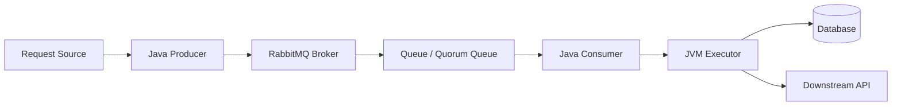
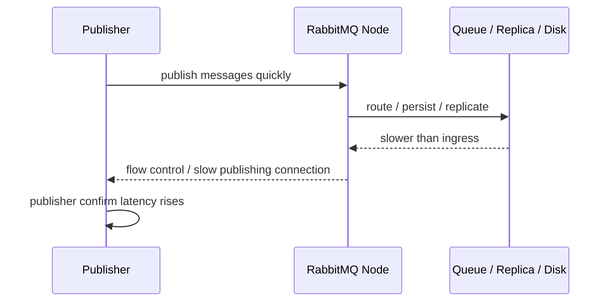
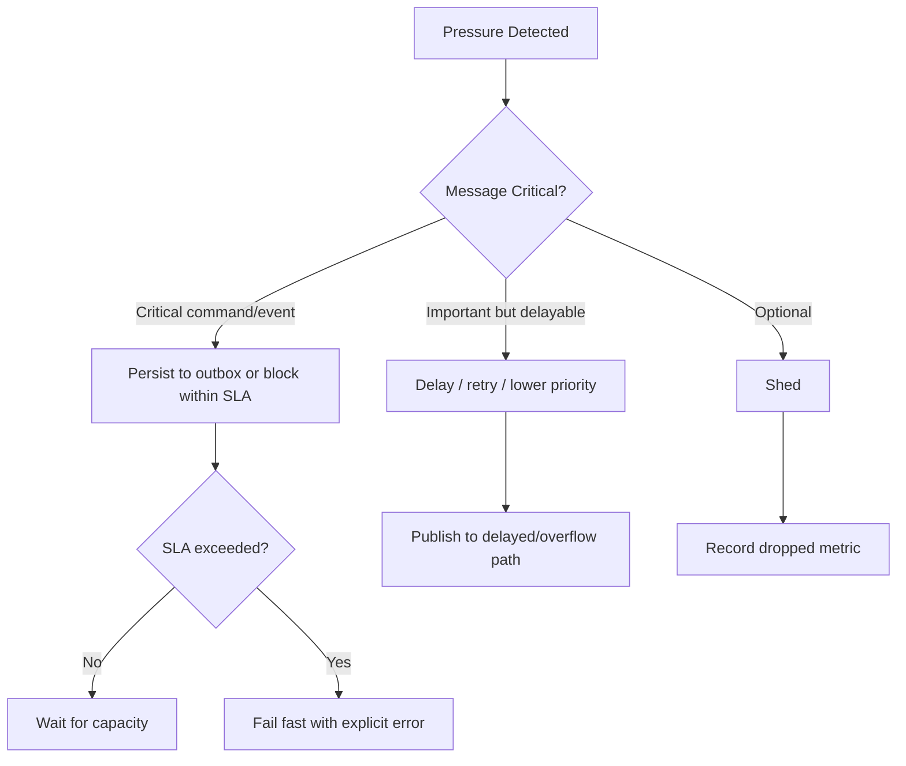
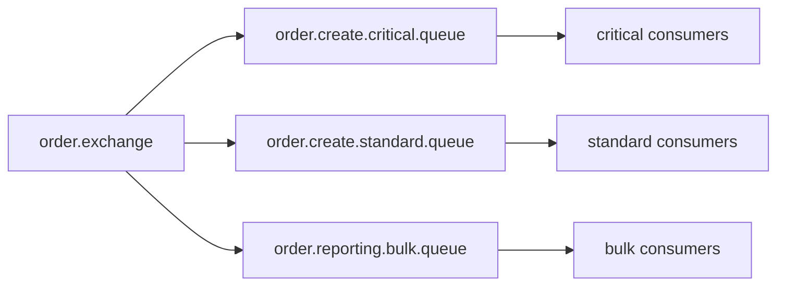
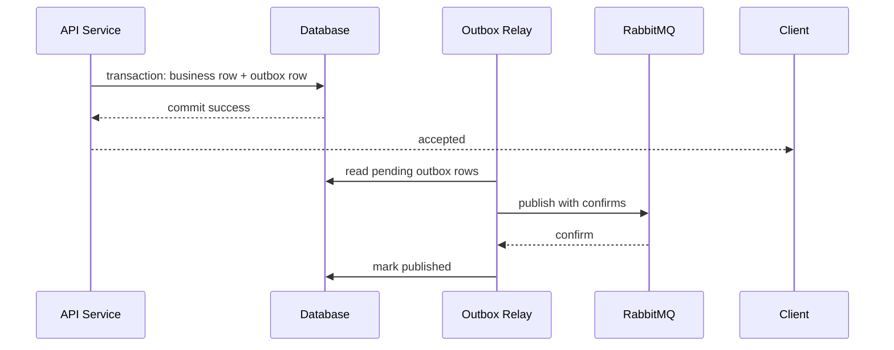

# Part 014 — Backpressure and Flow Control: Producer, Broker, Consumer, JVM

Backpressure is how a distributed system says: **slow down before we turn latency into loss**.

RabbitMQ applications often fail not because RabbitMQ is weak, but because producers are allowed to publish faster than consumers, disks, replicas, downstream services, or JVM workers can absorb. Without backpressure, queue depth becomes an accidental buffer for bad capacity planning.

This part builds a complete pressure model from Java producer to RabbitMQ broker to Java consumer to downstream dependency.

---

## 1. Kaufman Deconstruction

To master backpressure, decompose the skill into six control points:

1. **Producer admission control** — how many messages are allowed to enter the system.
2. **Publisher confirm pressure** — how broker acceptance latency affects producer speed.
3. **Broker resource pressure** — memory, disk, replication, queue depth, and flow control.
4. **Consumer delivery pressure** — prefetch, concurrency, unacked messages, and ack speed.
5. **JVM pressure** — threads, executors, heap, GC, serialization, and local buffers.
6. **Downstream pressure** — database, HTTP APIs, rate limits, locks, and transaction latency.

The goal is to build a closed-loop system:

> Every producer must have a bounded way to slow down, shed, delay, or reject work when downstream capacity is exhausted.

---

## 2. Backpressure Mental Model

A RabbitMQ workload is a pipeline:



Every edge has a rate.

- producer publish rate
- broker route/replicate/persist rate
- queue delivery rate
- consumer processing rate
- downstream commit rate
- acknowledgement rate

A queue grows when ingress rate exceeds effective egress rate.

```text
growth_rate = publish_rate - ack_rate
```

Queue depth is not the root problem. Queue depth is the visible inventory created by a rate mismatch.

---

## 3. Little's Law for Messaging

A useful approximation:

```text
L = λ × W
```

Where:

- `L` = average number of messages in the system
- `λ` = throughput rate
- `W` = average time spent in the system

If you process 1,000 messages/second and each message spends 10 seconds in queue + processing, expect around 10,000 messages in the system.

This gives you a sanity check:

- If queue depth is 1,000,000 and throughput is 1,000/sec, drain time is roughly 1,000 seconds before considering new ingress.
- If processing latency doubles and ingress stays constant, queue depth tends to grow.
- If downstream DB slows from 20 ms to 500 ms, consumer capacity collapses even though RabbitMQ may look healthy initially.

---

## 4. Pressure Signals

Do not wait for incidents. Use early signals.

| Layer | Signal | Meaning |
|---|---|---|
| Producer | confirm latency rising | broker is slower to accept responsibility |
| Producer | in-flight confirm count high | producer is outrunning broker |
| Broker | connection state `flow` | broker is applying flow control |
| Broker | memory alarm | publishing connections can be blocked |
| Broker | disk alarm | publishing connections can be blocked |
| Queue | ready messages rising | ingress exceeds delivery/ack |
| Queue | unacked messages rising | consumers received but did not finish |
| Consumer | executor queue full | JVM cannot process deliveries fast enough |
| Consumer | ack latency rising | handler/downstream is slow |
| Downstream | DB pool exhausted | consumer concurrency too high |
| Downstream | 429/503 spike | external dependency is saturated |

A senior engineer reads these as one control loop, not separate dashboards.

---

## 5. Broker Flow Control

RabbitMQ can apply flow control to publishing connections when internal components cannot keep up. This is a broker-level safety mechanism, not an application-level capacity plan.

Flow-controlled connections can show state `flow`. This means RabbitMQ is repeatedly blocking and unblocking a publishing connection so message ingress does not exceed what queues, disks, replicas, or other broker internals can handle.



Application implication:

- publisher confirm latency is a pressure signal
- blocked connection notifications should be logged/metricized
- producer must not create infinite local buffers while broker slows it down

---

## 6. Memory and Disk Alarms

RabbitMQ has memory and disk watermarks. When they are crossed, RabbitMQ blocks publishing connections to avoid OS-level OOM or disk exhaustion. Consumer-only connections continue so queues can drain.

This behavior is good. It protects the broker. But if your Java producers do not handle blocked publishing safely, pressure moves from RabbitMQ into your application heap, thread pool, or upstream clients.

Bad behavior:

```text
broker blocks publishing -> producer keeps accepting requests -> local queue grows -> JVM OOM
```

Good behavior:

```text
broker blocks publishing -> producer admission control triggers -> upstream receives 429/503 or work is shed/deferred
```

---

## 7. Producer-Side Backpressure

Producer backpressure starts before RabbitMQ.

A producer must answer:

- how many messages can be in-flight waiting for confirms?
- how much local buffering is allowed?
- what happens when local buffer is full?
- should caller block, fail fast, shed, or persist to outbox?
- what is the maximum acceptable publish latency?

### 7.1 Bounded in-flight publisher confirms

```java
public final class ConfirmWindow {
    private final Semaphore permits;

    public ConfirmWindow(int maxInFlight) {
        this.permits = new Semaphore(maxInFlight);
    }

    public void acquire(Duration timeout) throws InterruptedException, TimeoutException {
        boolean ok = permits.tryAcquire(timeout.toMillis(), TimeUnit.MILLISECONDS);
        if (!ok) {
            throw new TimeoutException("publisher confirm window full");
        }
    }

    public void release() {
        permits.release();
    }
}
```

Usage:

```java
confirmWindow.acquire(Duration.ofMillis(200));
long seqNo = channel.getNextPublishSeqNo();
outstanding.put(seqNo, new PendingPublish(messageId, Instant.now()));

try {
    channel.basicPublish(exchange, routingKey, true, properties, body);
} catch (IOException e) {
    outstanding.remove(seqNo);
    confirmWindow.release();
    throw e;
}
```

Confirm callback releases permits:

```java
channel.addConfirmListener(
    (sequenceNumber, multiple) -> confirmAck(sequenceNumber, multiple),
    (sequenceNumber, multiple) -> confirmNack(sequenceNumber, multiple)
);
```

The bound prevents the producer from treating RabbitMQ as infinite capacity.

---

## 8. Producer Admission Policies

When pressure is high, the producer has several choices.

| Policy | Behavior | Best for |
|---|---|---|
| block caller | wait for capacity | internal batch jobs |
| fail fast | return error | synchronous APIs |
| shed optional work | drop non-critical messages | analytics, notifications |
| degrade | publish smaller/lower-priority work | optional enrichment |
| persist outbox | store locally and relay later | critical commands/events |
| route to overflow | send to lower-SLA queue | non-critical workloads |

Do not pick one global policy. Choose by message criticality.

Example:

```yaml
publishPolicies:
  PaymentCapturedEvent:
    criticality: high
    pressurePolicy: transactional-outbox
    maxConfirmLatency: PT2S
  SearchIndexRequestedEvent:
    criticality: medium
    pressurePolicy: delay-or-shed
    maxConfirmLatency: PT500MS
  PageViewedEvent:
    criticality: low
    pressurePolicy: shed
    maxConfirmLatency: PT100MS
```

---

## 9. Publisher Confirms as Feedback

Publisher confirms are not only reliability tools. They are feedback.

If confirm latency rises, something after the producer is slowing down:

- broker persistence
- quorum replication
- disk I/O
- queue leader pressure
- routing topology pressure
- flow control
- network

Metrics:

```text
publisher_confirm_latency_seconds
publisher_confirms_in_flight
publisher_nacks_total
publisher_returns_total
publisher_blocked_total
publish_admission_rejected_total
```

A high-throughput producer should not wait synchronously after every message. It should batch or use async confirms with bounded in-flight windows.

---

## 10. Consumer Prefetch as Work Budget

Prefetch controls how many unacknowledged deliveries RabbitMQ can send to a consumer/channel before receiving acknowledgements.

Prefetch is not “performance tuning only”. It is your **consumer work-in-progress limit**.

```java
int prefetch = 50;
channel.basicQos(prefetch);
```

If processing is slow and prefetch is high, many messages sit unacked in consumer memory. They are not available to other consumers, and they will all redeliver if the connection dies.

### Prefetch sizing model

A simple first estimate:

```text
prefetch ≈ concurrency × small_multiplier
```

For example:

- 8 worker threads
- each message does DB write + API call
- choose prefetch 8 to 32, not 10,000

If handler latency is very variable, a slightly higher prefetch can keep workers busy. But high prefetch hides pressure and increases redelivery blast radius.

---

## 11. Consumer Executor Saturation

A common anti-pattern:

```java
DeliverCallback callback = (tag, delivery) -> {
    executor.submit(() -> process(delivery));
};
```

If `executor` has an unbounded queue, RabbitMQ delivers up to prefetch, then your application queues more work internally. You lose visibility and pressure control.

Use bounded executors.

```java
ThreadPoolExecutor executor = new ThreadPoolExecutor(
    16,
    16,
    0L,
    TimeUnit.MILLISECONDS,
    new ArrayBlockingQueue<>(256),
    new ThreadPoolExecutor.CallerRunsPolicy()
);
```

But be careful: with RabbitMQ client callbacks, `CallerRunsPolicy` may block the consumer dispatch thread. That may be acceptable as backpressure, but it must be intentional. Another option is to stop consuming temporarily or use smaller prefetch.

The invariant:

> Never allow unbounded buffering between broker delivery and actual processing capacity.

---

## 12. Ack Latency and Unacked Messages

Unacked messages represent work RabbitMQ believes is in progress.

A growing unacked count means:

- consumers are receiving messages
- handlers are slow, stuck, or blocked
- acknowledgements are not returning fast enough

Common causes:

- DB pool exhausted
- downstream API timeout
- deadlock
- executor saturated
- high GC pause
- consumer doing local retry with long sleeps
- manual ack forgotten on error branch

Alerting only on ready queue depth misses this. You need both ready and unacked metrics.

```text
queue_depth = messages_ready + messages_unacknowledged
```

---

## 13. Downstream Backpressure

Consumers often overload dependencies.

Example: 100 RabbitMQ consumer threads each call a database pool with 20 connections. The database pool becomes the bottleneck. Messages are delivered and held unacked while threads block waiting for DB connections.

Control the narrowest dependency:

```java
Semaphore dbPermits = new Semaphore(20);

void process(Delivery delivery) throws Exception {
    if (!dbPermits.tryAcquire(500, TimeUnit.MILLISECONDS)) {
        throw new TransientProcessingException("DB_POOL_PRESSURE");
    }
    try {
        writeToDatabase(delivery);
    } finally {
        dbPermits.release();
    }
}
```

Better: size consumer concurrency so it cannot exceed downstream capacity in the first place.

---

## 14. Load Shedding Decision Tree

When pressure appears, choose deliberately.



Do not shed silently. Dropped optional work still needs metrics.

---

## 15. Queue Length Limits

Queue length limits are not a primary backpressure design, but they are useful guardrails.

If a queue grows without limit, it can consume disk, memory metadata, and operational attention. Limit queues by message count or bytes depending on workload.

Policies:

```bash
rabbitmqctl set_policy order-queue-limits '^order\.' \
  '{"max-length":100000,"overflow":"reject-publish"}' \
  --apply-to queues \
  --priority 20
```

Overflow choices matter:

- `drop-head`: oldest messages are dropped, dangerous for commands
- `reject-publish`: producer receives rejection signal, better for critical command queues
- dead-letter overflow behavior depends on queue type and configuration

For commands, prefer rejecting ingress over silently discarding old work.

---

## 16. Memory Footprint of Messages

Large messages amplify pressure.

Costs include:

- producer serialization memory
- network transfer
- broker memory metadata
- disk persistence
- replication
- consumer deserialization
- GC pressure

Guideline:

- send references for large blobs
- store documents in object storage/database
- put stable identifiers in messages
- keep message payload sufficient for processing, not for every possible future query

Bad:

```json
{
  "documentPdfBase64": "... huge ...",
  "allCustomerHistory": [ ... ],
  "fullCaseFile": { ... }
}
```

Better:

```json
{
  "caseId": "case-123",
  "documentId": "doc-987",
  "documentVersion": 4,
  "requestedAction": "RUN_COMPLIANCE_CHECK"
}
```

---

## 17. Priority Is Not Backpressure

RabbitMQ priority queues can help urgent messages move ahead, but they do not create capacity. They add overhead and complexity.

Use priorities sparingly:

- few levels
- bounded queues
- clear business semantics
- not as a replacement for separate queues/SLA lanes

Often better:

```text
payment.critical.queue
payment.normal.queue
payment.bulk.queue
```

Separate queues allow separate prefetch, consumers, scaling, alerts, and ownership.

---

## 18. Bulkheads: Isolate Pressure Domains

A single queue for all work means one slow path can hurt everything.

Separate by:

- criticality
- tenant tier
- downstream dependency
- message type
- processing cost
- ordering requirement
- region

Example:



Bulkheads prevent bulk/reporting workloads from starving command processing.

---

## 19. Circuit Breaker Integration

If a downstream dependency is failing, consumers should stop turning queue messages into failing calls.

Options:

1. Open circuit and fail messages to delayed retry.
2. Pause consumer container temporarily.
3. Reduce concurrency dynamically.
4. Route affected message type to deferred queue.

Avoid hot retry while circuit is open.

```java
if (paymentGatewayCircuitBreaker.isOpen()) {
    throw new TransientProcessingException("PAYMENT_GATEWAY_CIRCUIT_OPEN");
}
```

But do not let every consumer independently hammer the dependency to discover the circuit state. Share circuit state or use a dependency-aware limiter.

---

## 20. Consumer Pause and Resume

Sometimes the correct action is to stop consuming temporarily.

Use when:

- downstream is fully unavailable
- all messages of a type would fail
- maintenance window is active
- schema migration is incomplete
- operator wants to freeze processing

In Spring AMQP, listener containers can be stopped/started. In raw Java client, cancel consumer or close channel intentionally.

Important:

- pausing consumption increases queue depth
- queue depth growth must be acceptable
- producers may still need admission control
- alerting must understand intentional pause vs incident

---

## 21. JVM-Level Pressure

RabbitMQ is not the only buffer. Java adds pressure points:

- heap
- direct buffers
- executor queues
- object allocation from deserialization
- JSON parsing
- logging
- metrics cardinality
- thread count
- connection/channel count

Symptoms:

- GC pause spikes
- ack latency spikes
- consumer heartbeat issues
- executor queue growth
- high allocation rate
- CPU saturation

Controls:

- bounded executor queues
- limited prefetch
- streaming parsers for large payloads
- avoid excessive per-message logging
- cap metrics labels
- use one connection with managed channels where appropriate
- tune heap based on measured allocation, not guesswork

---

## 22. Backpressure With Transactional Outbox

For critical messages, producer-side fail-fast may not be acceptable. The transactional outbox decouples business commit from broker availability.

Flow:



This handles broker slowness by moving pressure into a database table with explicit relay rate. But it does not eliminate capacity planning. Outbox backlog must be monitored like queue depth.

---

## 23. Backpressure Policy Matrix

| Workload | Producer pressure policy | Queue policy | Consumer policy |
|---|---|---|---|
| payment command | outbox + bounded relay | quorum + reject publish | low prefetch, strict idempotency |
| email notification | bounded buffer + delay | quorum/classic based on SLA | medium prefetch |
| search indexing | shed/delay | bounded queue | bulk batch writes |
| analytics event | sample/shed | stream preferred | high throughput batch |
| regulatory case transition | outbox only | quorum queue | low concurrency, audit-heavy |

The policy follows business criticality, not technical preference.

---

## 24. Observability Dashboard

A useful dashboard has one row per pressure domain.

### Producer panel

- publish rate
- confirm latency p50/p95/p99
- confirms in-flight
- returned messages
- nacked publishes
- blocked connection count
- admission rejected count
- outbox backlog

### Broker panel

- node memory used vs watermark
- disk free vs limit
- connection states: running/flow/blocked
- queue ready/unacked
- queue ingress/egress
- quorum queue leader distribution
- disk write latency

### Consumer panel

- delivery rate
- ack rate
- processing latency
- handler error rate
- executor active threads
- executor queue size
- retry count
- DLQ/parking lot count

### Downstream panel

- DB pool usage
- API latency
- API error rate
- circuit breaker state
- rate-limit responses

---

## 25. Alert Design

Bad alert:

```text
queue depth > 1000
```

Good alert:

```text
queue drain time > 10 minutes AND ingress_rate > ack_rate for 5 minutes
```

Better alert:

```text
critical command queue drain time > SLA
AND consumer error rate > 5%
AND downstream DB pool usage > 90%
```

Alert on symptoms with context.

Useful derived metrics:

```text
drain_time_seconds = messages_ready / max(ack_rate - publish_rate, small_value)
consumer_efficiency = ack_rate / delivery_rate
pressure_ratio = publish_rate / max(ack_rate, small_value)
```

---

## 26. Runbook: Queue Growth

When a queue grows:

1. Check publish rate vs ack rate.
2. Check ready vs unacked.
3. If ready grows and unacked low: not enough consumers or delivery blocked.
4. If unacked grows: consumers are slow/stuck.
5. Check consumer logs and error rate.
6. Check downstream DB/API latency.
7. Check broker memory/disk/flow state.
8. Check recent deployments.
9. Decide: scale consumers, pause producers, shed optional load, or park poison messages.
10. Estimate drain time before declaring recovery.

Do not blindly add consumers. More consumers can make downstream pressure worse.

---

## 27. Runbook: Broker Alarm

When RabbitMQ raises memory or disk alarm:

1. Identify affected node and alarm type.
2. Confirm publishing connections are blocked.
3. Check largest queues and message rates.
4. Stop or throttle non-critical producers.
5. Let consumers drain if safe.
6. Add disk/memory only if resource shortage is structural.
7. Check quorum queue segment/disk usage.
8. Avoid deleting evidence queues without approval.
9. After alarm clears, verify producer confirm latency returns to normal.
10. Write post-incident capacity action.

Broker alarms are usually system design feedback, not random broker behavior.

---

## 28. Testing Backpressure

### Local tests

- bounded confirm window rejects when full
- producer returns 429/503 when publish budget exhausted
- consumer executor rejects or pauses safely
- prefetch prevents unbounded unacked growth

### Integration tests

- slow consumer causes queue depth growth
- downstream timeout triggers delayed retry, not hot loop
- blocked connection listener fires under simulated pressure
- outbox relay slows without API failure

### Load tests

- publish rate 2x consumer capacity
- message size matrix: 1 KB, 10 KB, 100 KB, 1 MB
- confirm latency under quorum replication
- consumer crash with high prefetch
- downstream DB pool saturation

### Chaos tests

- fill disk in staging
- pause downstream API
- kill consumer during high unacked load
- restart broker leader node
- inject 10% slow messages into mixed workload

---

## 29. Java Blocked Connection Listener

RabbitMQ Java client supports blocked connection notifications for compatible broker behavior.

Example:

```java
Connection connection = factory.newConnection("order-publisher");

connection.addBlockedListener(new BlockedListener() {
    @Override
    public void handleBlocked(String reason) {
        metrics.counter("rabbitmq.connection.blocked", "reason", reason).increment();
        publishGate.close(reason);
    }

    @Override
    public void handleUnblocked() {
        metrics.counter("rabbitmq.connection.unblocked").increment();
        publishGate.open();
    }
});
```

Your `publishGate` might:

- reject new publishes
- switch to outbox-only mode
- shed optional events
- reduce batch size
- notify health endpoint

Do not only log this event. Treat it as a control signal.

---

## 30. Health Checks Under Pressure

A producer health check should distinguish:

- app is alive
- RabbitMQ connection is open
- channel can publish
- confirms are received within SLA
- connection is not blocked
- local admission queue has capacity

A consumer health check should distinguish:

- app is alive
- connection/channel open
- consuming is active
- executor has capacity
- ack latency within SLA
- downstream dependencies available

Never use only “TCP connection open” as production readiness.

---

## 31. Anti-Patterns

Avoid these:

1. Unbounded producer local queue.
2. High prefetch with slow handlers.
3. Auto-ack for critical workloads.
4. Blindly increasing consumers during downstream saturation.
5. Queue depth alerts without rate/drain context.
6. Treating DLQ as backpressure.
7. Ignoring publisher confirm latency.
8. Sending huge payloads through RabbitMQ.
9. One queue for all criticality levels.
10. Using priority queues as a substitute for capacity.
11. Letting retry storms overload dependencies.
12. Relying on broker alarms as normal throttling.

---

## 32. Practice Drill

Build a Java publisher and consumer with:

- async publisher confirms
- max 10,000 in-flight messages
- blocked connection listener
- bounded executor
- manual ack
- prefetch equal to worker concurrency × 2
- downstream simulator with variable latency
- metrics for confirm latency, queue depth, unacked, executor queue size, and ack latency

Run:

1. downstream latency 10 ms
2. downstream latency 500 ms
3. downstream outage
4. publish rate 5x consumer capacity
5. message size increase from 1 KB to 1 MB
6. broker disk pressure simulation in staging

Expected learning:

- confirm latency rises before total failure
- unacked messages expose consumer pressure
- bounded executor prevents heap blow-up
- queue growth must be interpreted with rates
- adding consumers can hurt if downstream is bottleneck

---

## 33. Self-Correction Checklist

You understand RabbitMQ backpressure when you can answer:

- What is the maximum in-flight publish count per producer?
- What happens when publisher confirms slow down?
- What happens when RabbitMQ blocks a publishing connection?
- Can the producer keep accepting work while RabbitMQ is blocked?
- Is local buffering bounded?
- What is the prefetch per consumer?
- What is the maximum unacked blast radius during consumer crash?
- What is the narrowest downstream dependency?
- What is the drain time for each critical queue?
- Which workloads are allowed to shed messages?
- Which workloads must use outbox?
- What alerts prove pressure before outage?

---

## 34. Key Takeaways

- Queue depth is inventory caused by a rate mismatch.
- Backpressure must exist at producer, broker, consumer, JVM, and downstream layers.
- RabbitMQ flow control and alarms protect the broker, not your whole application.
- Publisher confirm latency is both a reliability and pressure signal.
- Prefetch is consumer work-in-progress control.
- Unbounded buffers move failure from RabbitMQ into the JVM.
- Do not add consumers blindly when downstream is the bottleneck.
- Use business criticality to choose block, fail fast, shed, delay, or outbox.

---

## References

- RabbitMQ Documentation — Flow Control: https://www.rabbitmq.com/docs/flow-control
- RabbitMQ Documentation — Memory and Disk Alarms: https://www.rabbitmq.com/docs/alarms
- RabbitMQ Documentation — Memory Threshold and Limit: https://www.rabbitmq.com/docs/memory
- RabbitMQ Documentation — Consumer Acknowledgements and Publisher Confirms: https://www.rabbitmq.com/docs/confirms
- RabbitMQ Java Client API Guide: https://www.rabbitmq.com/client-libraries/java-api-guide
- RabbitMQ Documentation — Configurable Limits: https://www.rabbitmq.com/docs/limits
