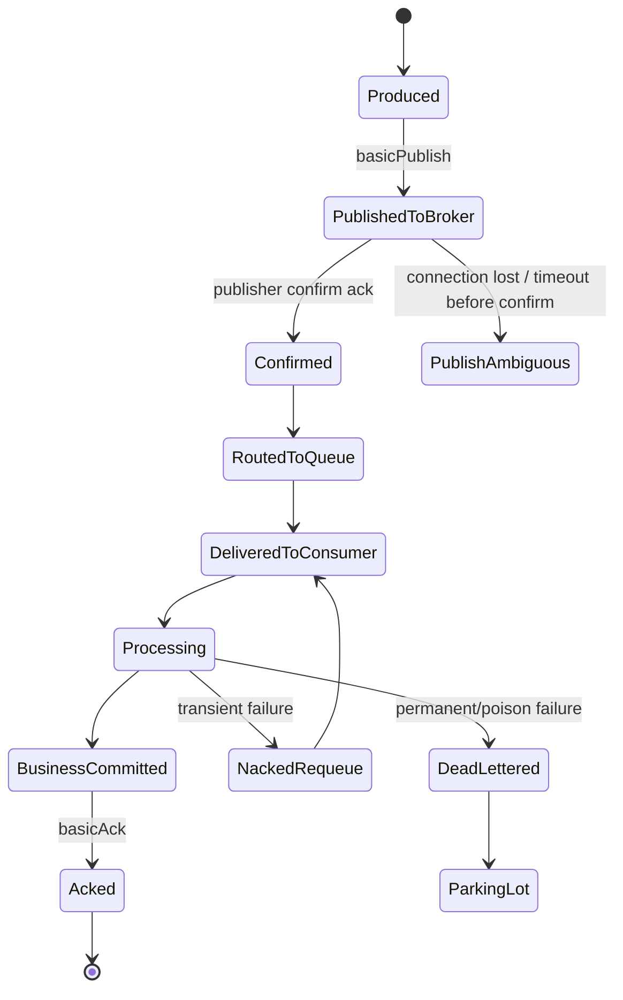
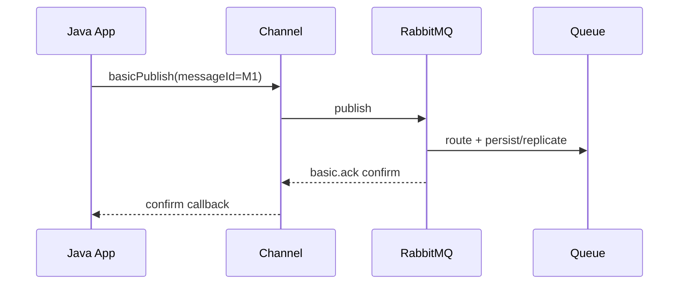
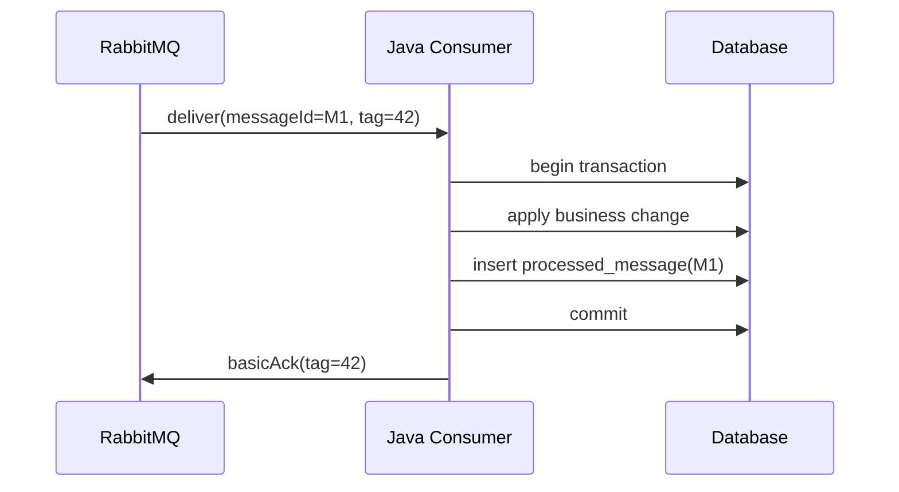
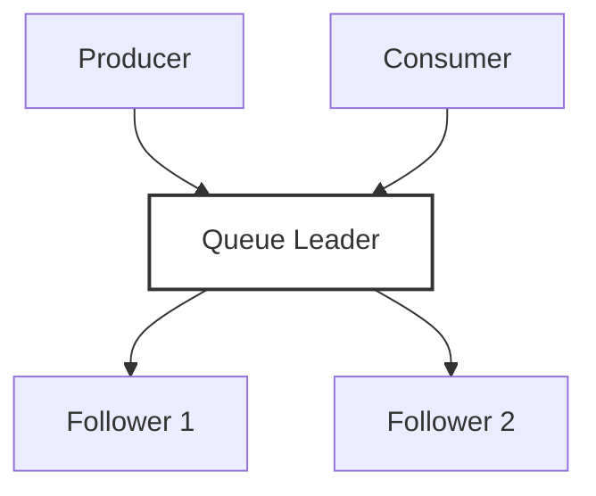
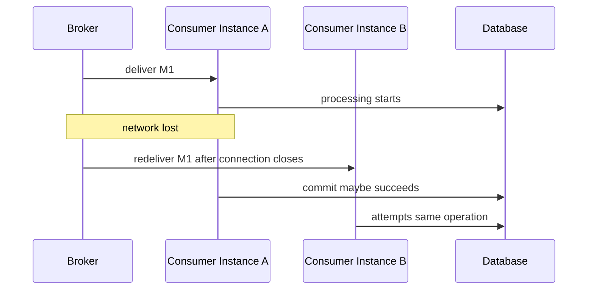
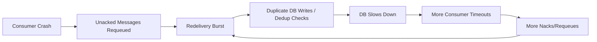
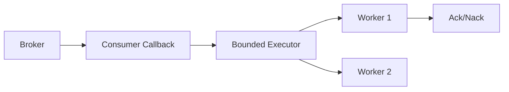

# Part 015 — Failure Modelling: Network Split, Broker Restart, Consumer Crash, Duplicate Storm

A RabbitMQ design is not production-grade until it has been reasoned through under failure.

The beginner question is:

> How do I publish and consume a message?

The senior question is:

> What exactly happens if the producer times out after publishing, the broker restarts before confirm arrives, the consumer commits to the database but crashes before ack, and the message is redelivered to another instance?

This part builds a failure-first model for Java RabbitMQ systems. We will not treat failure as an afterthought. We will treat it as the primary design surface.

---

## 1. Kaufman Deconstruction

Following Kaufman's skill acquisition model, we deconstruct failure modelling into small sub-skills:

1. **Lifecycle state modelling** — represent message progress explicitly.
2. **Ambiguity detection** — identify states where the client cannot know what happened.
3. **Failure classification** — separate transient, permanent, poison, overload, and operator-induced failures.
4. **Recovery mechanism mapping** — know which failures are handled by client recovery, confirms, redelivery, DLX, idempotency, or manual intervention.
5. **Duplicate containment** — assume duplicate delivery and prevent duplicate effects.
6. **Chaos verification** — prove the model by killing processes, blocking networks, restarting brokers, and delaying dependencies.

The goal is not to predict every possible failure. The goal is to design so the system remains correct under the failures that matter.

---

## 2. Core Reliability Invariant

For RabbitMQ-backed systems, the core invariant is:

> A message may be delayed, redelivered, reordered, or duplicated, but it must not silently disappear and it must not produce an invalid business state.

This has two parts:

| Concern | Engineering Response |
|---|---|
| Do not silently lose messages | durable topology, persistent messages, publisher confirms, quorum queues where appropriate |
| Do not corrupt business state under duplicate/retry | idempotent consumer, dedup store, business invariant checks, transactional boundaries |

RabbitMQ can help with durability and delivery. It cannot make your business operation idempotent for you.

---

## 3. Message Lifecycle State Machine

Before modelling failure, define normal flow.



The most dangerous states are not the obvious failures. They are the ambiguous states:

- producer does not know whether broker accepted the message
- consumer does not know whether downstream operation committed
- broker redelivers after connection loss even though consumer may have finished local work
- retry logic cannot distinguish transient dependency failure from poison payload

Production reliability is mostly the art of making ambiguity safe.

---

## 4. Failure Taxonomy

A failure taxonomy prevents the team from using one retry strategy for everything.

| Failure Type | Example | Retry? | Preferred Handling |
|---|---|---:|---|
| Transient dependency | HTTP 503, database connection timeout | yes | delayed retry with bounded attempts |
| Overload | DB pool exhausted, executor saturated | maybe | backpressure, pause, requeue carefully, circuit breaker |
| Permanent validation | unknown enum, missing required field | no | reject/dead-letter/parking lot |
| Poison message | payload always crashes handler | no automatic infinite retry | DLQ + investigation |
| Ambiguous publish | publish timeout before confirm | maybe | retry with idempotency key/outbox |
| Ambiguous consume | DB commit succeeded but ack failed | no blind side effect | idempotent consumer then ack on redelivery |
| Operator-induced | queue deleted, permission changed | no | fail fast, alert, restore topology |
| Infrastructure | broker restart, leader election, network partition | automatic + bounded | recovery + monitoring + chaos drill |

Rule:

> Retry is a correctness mechanism only when the operation is idempotent or duplicate-safe.

---

## 5. Producer Failure Model

### 5.1 Producer Normal Flow



The producer should only mark a publish as broker-accepted after confirm.

### 5.2 Producer Failure Matrix

| Failure Point | What Producer Knows | What May Have Happened | Required Design |
|---|---|---|---|
| Before `basicPublish` leaves process | not sent | no broker effect | retry safely |
| After network write, before broker receives | ambiguous | broker may not have seen it | retry with idempotency |
| Broker receives, persists, but confirm lost | ambiguous | message is in queue, producer thinks failed | retry may duplicate |
| Broker rejects unroutable mandatory publish | knows returned | not routed | handle return as publish failure |
| Broker unavailable before publish | knows unavailable | no message accepted | retry/backoff/outbox |
| Confirm timeout | ambiguous | accepted or not accepted | do not assume failure means no effect |

The critical lesson:

> A publish timeout is not proof that the message was not published.

Therefore, a correct producer uses one of these patterns:

1. **Transactional outbox** — database transaction writes business state and outbox row; relay publishes with confirms; duplicate publish is handled by message id/idempotent consumer.
2. **Producer-side idempotency key** — every message has stable `messageId` derived from business operation id.
3. **Broker-side stream deduplication** — for RabbitMQ Streams use producer name + publishing id where applicable.
4. **Business-level duplicate acceptance** — the operation itself is safe if repeated.

---

## 6. Consumer Failure Model

### 6.1 Consumer Normal Flow



The ack happens after the business transaction commits.

### 6.2 Consumer Failure Matrix

| Failure Point | Broker State | Business State | Consequence | Correct Handling |
|---|---|---|---|---|
| Crash before processing | unacked delivery lost with connection | not changed | redelivery | process normally |
| Crash during processing before commit | unacked | rolled back/partial external effect possible | redelivery | transaction + idempotency |
| Crash after DB commit before ack | unacked | committed | redelivery duplicate | dedup detects already processed then ack |
| Handler throws transient error | unacked | not committed | retry | nack/retry topology |
| Handler throws permanent error | unacked | not committed | poison | reject/dead-letter |
| Ack fails due to lost connection | broker may redeliver | maybe committed | duplicate | idempotent consumer |

The most important row is this:

> Crash after commit before ack causes redelivery of an already-processed message.

If your consumer cannot survive that, it is not production-safe.

---

## 7. Idempotent Consumer as Failure Absorber

A RabbitMQ consumer should treat duplicate delivery as normal.

A common implementation is a processed-message table:

```sql
CREATE TABLE processed_message (
    consumer_name      VARCHAR(128) NOT NULL,
    message_id         VARCHAR(128) NOT NULL,
    processed_at       TIMESTAMP NOT NULL DEFAULT CURRENT_TIMESTAMP,
    business_key       VARCHAR(128),
    PRIMARY KEY (consumer_name, message_id)
);
```

Pseudo-flow:

```java
void handle(Delivery delivery) {
    String messageId = delivery.properties().getMessageId();

    transactionTemplate.executeWithoutResult(tx -> {
        boolean firstTime = processedMessageRepository.tryInsert("billing-worker", messageId);

        if (!firstTime) {
            return; // already applied previously
        }

        BillingCommand command = decode(delivery.body());
        billingService.apply(command);
    });

    channel.basicAck(delivery.envelope().getDeliveryTag(), false);
}
```

Important implementation note:

- The dedup insert and business mutation must be in the same transaction when possible.
- If the business effect is external and non-transactional, use provider idempotency keys.
- Do not ack before the idempotency record and business effect are safe.

---

## 8. Broker Restart Model

A broker restart affects different message classes differently.

| Topology/Message | Survives Restart? | Notes |
|---|---:|---|
| transient queue | no | deleted when broker stops or connection ends depending on declaration |
| durable queue | yes | queue metadata survives |
| non-persistent message in durable queue | not guaranteed | message can be lost on restart |
| persistent message in durable queue | intended to survive | use publisher confirms for accepted responsibility |
| quorum queue message | replicated/durable | confirm after quorum conditions |
| unacked delivery | returns to queue after connection/channel loss | may be redelivered |

The beginner mistake is assuming that `deliveryMode=2` alone is enough.

The durable path requires:

1. durable exchange/queue as needed
2. persistent message
3. publisher confirms
4. no unsafe auto-ack consumer
5. idempotent consumer
6. appropriate queue type for safety requirements

---

## 9. Quorum Queue Leader Failure

Quorum queues are replicated queues. They are useful when message safety matters more than minimum latency.

Mental model:



If the leader fails, another replica can be elected. The client may see interruption, timeout, connection close, or confirm delay.

Producer implication:

- confirms may be delayed
- publish timeout can be ambiguous
- retry can duplicate
- bounded in-flight confirms are essential

Consumer implication:

- delivery can pause during failover
- unacked deliveries can be redelivered
- processing must be idempotent
- monitoring must distinguish temporary failover from sustained outage

Design rule:

> Quorum queues improve broker-side safety; they do not remove the need for producer confirms or idempotent consumers.

---

## 10. Network Interruption and Automatic Recovery

RabbitMQ Java client supports automatic connection recovery when enabled. Recovery is helpful, but it is not a correctness proof.

Recovery may restore:

- connection
- channels
- exchanges
- queues
- bindings
- consumers

But the application must still handle:

- messages published during connection outage
- confirms that were in-flight when the connection failed
- consumer deliveries that were unacked when channel closed
- topology declaration drift
- duplicated delivery after recovery
- executor tasks still running while broker has already requeued unacked messages

### 10.1 Recovery Race



This is why deduplication belongs at the business boundary, not merely inside the RabbitMQ client callback.

---

## 11. Network Split and Cluster Partition Thinking

In distributed systems, network partition means nodes can disagree about reachability. The client-side symptom may be:

- connection timeout
- blocked publish
- confirm delay
- consumer cancellation
- leader unavailability
- temporary throughput collapse

Do not model network split as a clean binary failure. Model it as partial progress with ambiguous visibility.

| Component | Bad Assumption | Safer Assumption |
|---|---|---|
| Producer | timeout means message failed | timeout means outcome unknown |
| Consumer | lost connection means local work stopped | local work may continue while broker redelivers |
| Broker | cluster failover is invisible | clients may see delay, close, cancellation, redelivery |
| Operator | restart is harmless | restart can amplify duplicates and lag |

---

## 12. Duplicate Storm Model

A duplicate storm happens when many messages are redelivered and retried faster than the system can absorb.

Common causes:

1. Consumer crashes after committing but before acking many messages.
2. Prefetch is too high, so one failing consumer owns too many unacked deliveries.
3. Retry requeues immediately into the same hot queue.
4. Poison message repeatedly crashes consumers.
5. Publisher retries ambiguous publishes without stable idempotency keys.
6. Broker restart causes many unacked messages to return at once.

### 12.1 Duplicate Storm Dynamics



### 12.2 Containment Strategy

| Layer | Control |
|---|---|
| Producer | stable message id, bounded retry, outbox relay |
| Queue | retry delay, delivery limit, DLX, queue length policy |
| Consumer | low enough prefetch, idempotency, bounded executor |
| Database | unique constraints, transaction isolation, indexed dedup table |
| Operations | alert on redelivery rate, DLQ growth, consumer exception rate |

A duplicate storm is not solved by one setting. It is solved by layered containment.

---

## 13. Redelivery Loop Model

A redelivery loop is a special failure where the same message cycles endlessly.

Bad implementation:

```java
try {
    process(delivery);
    channel.basicAck(tag, false);
} catch (Exception e) {
    channel.basicNack(tag, false, true); // immediate requeue forever
}
```

This can create hot loops.

Better approach:

```java
try {
    process(delivery);
    channel.basicAck(tag, false);
} catch (PermanentMessageException e) {
    channel.basicReject(tag, false); // dead-letter if DLX configured
} catch (TransientDependencyException e) {
    republishToDelayedRetry(delivery, nextAttempt(delivery));
    channel.basicAck(tag, false); // ack original after retry copy is safe
} catch (Throwable t) {
    channel.basicReject(tag, false); // fail closed, investigate
}
```

The exact implementation depends on your retry topology, but the invariant is stable:

> Never let an unclassified error create infinite immediate requeue.

---

## 14. Consumer Crash During Parallel Processing

A common architecture uses the RabbitMQ consumer callback to submit work to an executor.



The risks:

- callback returns before processing is complete
- channel is shared unsafely across worker threads
- application shuts down while tasks are still running
- unacked delivery is redelivered while old task still commits
- ack is attempted on closed channel

Production rules:

1. Use manual ack.
2. Bound prefetch to match executor capacity.
3. Avoid unsafe shared channel usage across arbitrary worker threads.
4. Track in-flight tasks.
5. On shutdown, stop consuming first, drain tasks, then close connection.
6. Treat ack failure after commit as duplicate risk, not data loss.

---

## 15. Failure-Tolerant Java Consumer Skeleton

```java
public final class SafeRabbitConsumer {
    private final Channel channel;
    private final ExecutorService workers;
    private final AtomicBoolean stopping = new AtomicBoolean(false);

    public void start(String queue) throws IOException {
        channel.basicQos(50);
        channel.basicConsume(queue, false, (consumerTag, delivery) -> {
            if (stopping.get()) {
                channel.basicNack(delivery.getEnvelope().getDeliveryTag(), false, true);
                return;
            }

            workers.submit(() -> processSafely(delivery));
        }, consumerTag -> {
            // consumer cancellation handler
        });
    }

    private void processSafely(Delivery delivery) {
        long tag = delivery.getEnvelope().getDeliveryTag();
        try {
            handleIdempotently(delivery);
            synchronized (channel) {
                channel.basicAck(tag, false);
            }
        } catch (PermanentMessageException e) {
            safeReject(tag);
        } catch (TransientDependencyException e) {
            safeRetry(delivery, tag);
        } catch (Throwable t) {
            safeReject(tag);
        }
    }

    private void safeReject(long tag) {
        try {
            synchronized (channel) {
                channel.basicReject(tag, false);
            }
        } catch (IOException ignored) {
            // Connection loss means broker may redeliver. Idempotency must absorb it.
        }
    }

    private void safeRetry(Delivery delivery, long tag) {
        // Implementation-specific: publish to delayed retry exchange with confirm,
        // then ack original only after retry copy is confirmed.
    }
}
```

This skeleton is intentionally incomplete. The real lesson is the sequencing:

1. process idempotently
2. commit business state
3. ack after commit
4. when ack fails, rely on idempotency
5. when retrying by republish, confirm retry copy before acking original

---

## 16. Failure-Tolerant Producer Skeleton

```java
public final class ConfirmingPublisher {
    private final Channel channel;
    private final Semaphore inFlight = new Semaphore(10_000);
    private final ConcurrentNavigableMap<Long, PendingMessage> pending = new ConcurrentSkipListMap<>();

    public void start() throws IOException {
        channel.confirmSelect();
        channel.addConfirmListener(this::handleAck, this::handleNack);
        channel.addReturnListener(returned -> {
            // mandatory publish could not be routed
            markReturned(returned.getProperties().getMessageId(), returned.getReplyText());
        });
    }

    public void publish(OutboundMessage message) throws Exception {
        inFlight.acquire();
        long seqNo = channel.getNextPublishSeqNo();
        pending.put(seqNo, new PendingMessage(message, System.nanoTime()));

        try {
            channel.basicPublish(
                message.exchange(),
                message.routingKey(),
                true, // mandatory
                message.properties(),
                message.body()
            );
        } catch (IOException e) {
            pending.remove(seqNo);
            inFlight.release();
            throw e;
        }
    }

    private void handleAck(long seqNo, boolean multiple) {
        complete(seqNo, multiple, true);
    }

    private void handleNack(long seqNo, boolean multiple) {
        complete(seqNo, multiple, false);
    }

    private void complete(long seqNo, boolean multiple, boolean ack) {
        var confirmed = multiple
            ? pending.headMap(seqNo, true)
            : pending.subMap(seqNo, true, seqNo, true);

        int count = confirmed.size();
        confirmed.clear();
        inFlight.release(count);

        if (!ack) {
            // Retry through outbox or duplicate-safe producer strategy.
        }
    }
}
```

The key controls are:

- stable message identity
- bounded in-flight confirms
- mandatory return handling
- timeout handling for pending confirms
- outbox or retry storage

---

## 17. Failure Injection Practice

Kaufman's model emphasizes practice that produces rapid feedback. For RabbitMQ, that means failure drills.

### Drill 1 — Producer Timeout Ambiguity

Setup:

1. publish with confirms
2. block network after publish but before confirm callback
3. retry publish
4. verify duplicate-safe consumer behavior

Expected result:

- no lost message
- duplicate is possible
- business state remains valid

### Drill 2 — Consumer Crash After Commit Before Ack

Setup:

1. consumer writes DB transaction
2. deliberately crash process before `basicAck`
3. restart consumer
4. verify redelivery is deduplicated

Expected result:

- message is redelivered
- handler detects already processed
- ack succeeds
- no duplicate business effect

### Drill 3 — Broker Restart With Unacked Messages

Setup:

1. set prefetch to 100
2. start processing messages slowly
3. restart broker or kill connection
4. observe unacked redelivery

Expected result:

- temporary interruption
- redelivery occurs
- duplicate-safe processing
- no unbounded retry storm

### Drill 4 — Poison Message

Setup:

1. send invalid payload
2. consumer classifies validation failure
3. verify message goes to DLQ/parking lot

Expected result:

- no immediate infinite requeue
- DLQ metadata includes reason and attempt count
- alert fires if poison rate exceeds threshold

### Drill 5 — Downstream Slowdown

Setup:

1. delay DB/API by 5 seconds
2. keep producer load constant
3. observe queue depth, unacked count, confirm latency, executor saturation

Expected result:

- producer backpressure or admission control activates
- consumer does not pull unbounded work
- system degrades predictably

---

## 18. Failure Observability

A failure model is useless if production telemetry cannot validate it.

### 18.1 Producer Metrics

| Metric | Meaning |
|---|---|
| publish rate | ingress load |
| confirm latency | broker acceptance pressure |
| in-flight confirms | producer risk window |
| returned messages | routing failures |
| nack count | broker negative confirm |
| publish timeout count | ambiguous publish rate |
| outbox relay lag | producer recovery backlog |

### 18.2 Consumer Metrics

| Metric | Meaning |
|---|---|
| delivery rate | broker-to-consumer throughput |
| ack rate | completed processing throughput |
| nack/reject rate | failure classification volume |
| redelivery rate | duplicate/retry pressure |
| processing latency | handler cost |
| dedup hit rate | duplicate absorption rate |
| unacked count | in-flight risk |
| DLQ depth | poison/permanent failure accumulation |

### 18.3 Broker Metrics

| Metric | Meaning |
|---|---|
| queue depth | backlog |
| memory alarm | broker pressure |
| disk alarm | persistence pressure |
| connection churn | instability |
| channel count | resource usage |
| quorum leader changes | failover/maintenance impact |
| consumer utilization | ability to deliver to consumers |

---

## 19. Operational Runbooks

### 19.1 Queue Depth Growing

Diagnose:

1. Is publish rate higher than ack rate?
2. Are consumers alive?
3. Is prefetch too low or too high?
4. Is DB/API latency increasing?
5. Are messages stuck due to poison payload?
6. Are publisher confirms slowing down?

Respond:

- scale consumers only if downstream capacity exists
- pause or throttle producers if downstream is saturated
- inspect DLQ and redelivery rate
- do not purge unless business owner approves data loss

### 19.2 Redelivery Rate Spike

Diagnose:

1. Did consumers restart?
2. Did broker restart/fail over?
3. Are consumers crashing after commit?
4. Is retry topology immediately requeueing?
5. Is there a poison message?

Respond:

- reduce consumer concurrency if downstream is overloaded
- move poison messages to parking lot
- verify dedup table performance
- inspect recent deployments

### 19.3 Confirm Latency Spike

Diagnose:

1. Is disk slow?
2. Are quorum queues waiting for replication?
3. Is broker under memory/disk alarm?
4. Is network between nodes degraded?
5. Did message size increase?

Respond:

- throttle producers
- check broker disk and inter-node network
- inspect queue type and replication state
- avoid disabling confirms as a quick fix

### 19.4 DLQ Spike

Diagnose:

1. Is error permanent or transient?
2. Is schema compatibility broken?
3. Did a producer deploy new payload shape?
4. Is downstream returning new error codes?
5. Are retries exhausted too quickly?

Respond:

- stop offending producer if needed
- sample DLQ messages safely
- classify failure reason
- replay only after fixing consumer or data

---

## 20. Failure Design Review Checklist

Before approving a RabbitMQ architecture, answer these questions:

### Producer

- Are messages assigned stable IDs?
- Are publisher confirms enabled for important messages?
- Is in-flight publish count bounded?
- Are returned mandatory messages handled?
- Is publish timeout treated as ambiguous?
- Is there an outbox or durable retry mechanism?

### Broker

- Are exchanges/queues declared durably where required?
- Are messages persistent where required?
- Is the queue type appropriate: classic, quorum, stream?
- Is DLX configured through policy where possible?
- Is queue growth bounded or operationally monitored?

### Consumer

- Is manual ack used?
- Does ack happen only after business commit?
- Is the handler idempotent?
- Is dedup storage transactional with business mutation?
- Is prefetch aligned with processing capacity?
- Are permanent and transient failures separated?
- Can shutdown drain in-flight tasks?

### Operations

- Are redelivery, DLQ, confirm latency, queue depth, and consumer lag monitored?
- Are there runbooks for duplicate storm and poison messages?
- Are chaos drills automated?
- Can parking lot messages be replayed safely?

---

## 21. Mental Model Summary

RabbitMQ failure modelling is built on five truths:

1. **Timeout means unknown**, not failure.
2. **Redelivery is normal**, not exceptional.
3. **Duplicate processing must be harmless**.
4. **Ack after commit**, never before.
5. **Retry only when duplicate-safe and classified**.

A top-tier engineer does not merely configure RabbitMQ. They define and test the invariants that keep the business correct when RabbitMQ, the network, the JVM, and downstream systems behave imperfectly.

---

## 22. Practice Assignment

Build a Java worker that processes `InvoiceIssued` commands from a quorum queue.

Required behavior:

1. Producer uses publisher confirms and stable message IDs.
2. Consumer uses manual ack.
3. Consumer writes to `processed_message` and `invoice_projection` in one transaction.
4. Crash the consumer after DB commit but before ack.
5. Verify duplicate redelivery causes no duplicate invoice projection.
6. Add a poison message and verify it goes to DLQ.
7. Add a transient DB failure and verify delayed retry.
8. Add metrics for redelivery rate, dedup hit rate, DLQ count, and processing latency.

Completion criteria:

- no message loss under broker restart
- no duplicate business effect under consumer crash
- no infinite immediate retry loop
- operator can see what happened through metrics/logs

---

## References

- RabbitMQ Reliability Guide: https://www.rabbitmq.com/docs/reliability
- RabbitMQ Java Client API Guide: https://www.rabbitmq.com/client-libraries/java-api-guide
- RabbitMQ Publisher Confirms and Consumer Acknowledgements: https://www.rabbitmq.com/docs/confirms
- RabbitMQ Quorum Queues: https://www.rabbitmq.com/docs/quorum-queues
- RabbitMQ Dead Letter Exchanges: https://www.rabbitmq.com/docs/dlx
- RabbitMQ Flow Control: https://www.rabbitmq.com/docs/flow-control
