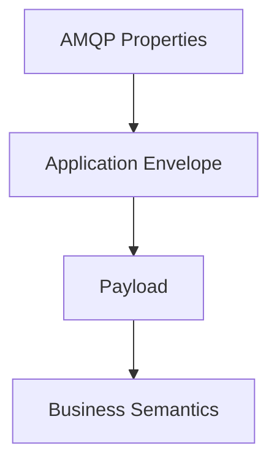
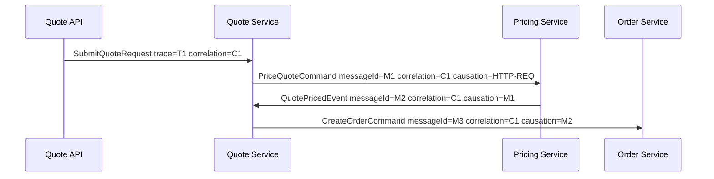
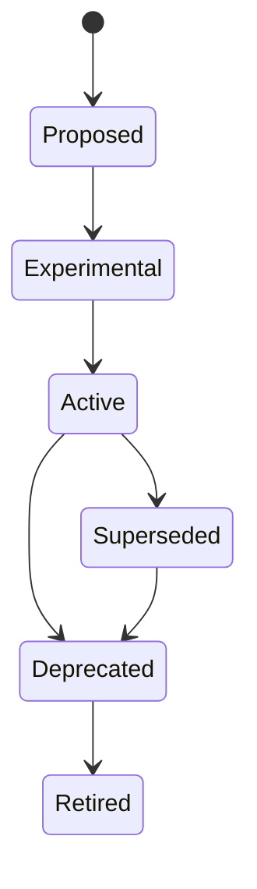
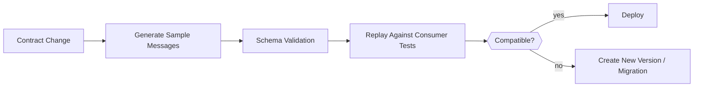

# Part 016 — Message Contract Design: Envelope, Payload, Metadata, Versioning

A message is not just bytes in a queue.

A production message is a contract between independently deployed systems. If the contract is weak, every consumer becomes fragile. If the contract is over-engineered, every producer becomes slow to evolve.

This part builds a message contract model for Java RabbitMQ systems: envelope, payload, AMQP properties, headers, schema evolution, idempotency, correlation, causation, validation, compatibility testing, and governance.

---

## 1. Kaufman Deconstruction

To master message contract design, decompose the skill into eight smaller skills:

1. **Contract boundary thinking** — decide what is public, private, stable, and internal.
2. **Envelope design** — standardize metadata required for routing, tracing, auditing, and idempotency.
3. **Payload design** — model domain facts and commands without leaking internal objects.
4. **Versioning discipline** — evolve contracts without breaking deployed consumers.
5. **Serialization choice** — select JSON, Avro, Protobuf, or custom encoding based on system needs.
6. **Compatibility testing** — catch breaking changes before deployment.
7. **Governance** — control naming, ownership, lifecycle, and deprecation.
8. **Operational defensibility** — make messages diagnosable during incidents and audits.

The goal is not to create a perfect universal message format. The goal is to create contracts that survive independent deployment, replay, retry, schema evolution, and incident investigation.

---

## 2. Message Contract Mental Model

A production message has four layers:



| Layer | Purpose | Example |
|---|---|---|
| AMQP properties | broker/client metadata | contentType, deliveryMode, messageId, correlationId, type |
| Application envelope | cross-service metadata | eventId, schemaVersion, producer, causationId, tenantId |
| Payload | domain-specific data | orderId, amount, customerId, status |
| Business semantics | meaning and invariants | "order was accepted", "payment capture requested" |

The payload should not carry all operational metadata. The envelope should not carry business facts that consumers must reason about.

---

## 3. Minimal Production Envelope

A good envelope answers:

- What is this message?
- Who produced it?
- When was it produced?
- Which operation caused it?
- Which workflow/request does it belong to?
- Is this message duplicate-safe?
- What schema should the consumer use?
- Which tenant/domain/security boundary does it belong to?

Example JSON envelope:

```json
{
  "metadata": {
    "messageId": "01J9Z7WMG9Y7K8NNN8S3CPDE7M",
    "messageType": "billing.invoice-issued.v1",
    "schemaVersion": 1,
    "producer": "billing-service",
    "producerVersion": "2026.07.01-17",
    "occurredAt": "2026-07-01T10:15:30Z",
    "publishedAt": "2026-07-01T10:15:31Z",
    "correlationId": "req-9a7f13",
    "causationId": "cmd-8842",
    "traceId": "4bf92f3577b34da6a3ce929d0e0e4736",
    "tenantId": "tenant-a",
    "partitionKey": "invoice-10001"
  },
  "payload": {
    "invoiceId": "inv-10001",
    "orderId": "ord-70001",
    "currency": "USD",
    "amount": "129.95",
    "status": "ISSUED"
  }
}
```

This is intentionally explicit. During incidents, ambiguity is expensive.

---

## 4. AMQP Properties vs Headers vs Body

RabbitMQ AMQP 0-9-1 provides standard message properties through `BasicProperties`, plus arbitrary headers.

Use them intentionally.

| Field Location | Good For | Avoid |
|---|---|---|
| `messageId` property | stable unique message identity | random ID that changes on retry |
| `correlationId` property | request/workflow correlation | overloading as business ID |
| `type` property | high-level message type | hiding version only in body |
| `contentType` property | `application/json`, protobuf media type | leaving unknown |
| `contentEncoding` property | compression/charset marker | mixing with schema version |
| `deliveryMode` property | persistent vs transient message | assuming it alone guarantees safety |
| headers | routing hints, tenant, schema reference, tracing baggage | large payload fragments |
| body | actual contract envelope/payload | transport-only metadata |

### 4.1 Recommended AMQP Mapping

```java
AMQP.BasicProperties props = new AMQP.BasicProperties.Builder()
    .contentType("application/json")
    .contentEncoding("utf-8")
    .deliveryMode(2)
    .messageId(envelope.metadata().messageId())
    .correlationId(envelope.metadata().correlationId())
    .type(envelope.metadata().messageType())
    .timestamp(Date.from(envelope.metadata().publishedAt()))
    .headers(Map.of(
        "schema-version", envelope.metadata().schemaVersion(),
        "producer", envelope.metadata().producer(),
        "tenant-id", envelope.metadata().tenantId(),
        "trace-id", envelope.metadata().traceId()
    ))
    .build();
```

Guidelines:

- Put routing-critical metadata in properties/headers only if infrastructure needs it.
- Put consumer-critical contract metadata in the body envelope as well.
- Do not rely on headers only for long-term replay/audit because some pipelines may transform or drop headers.
- Keep headers small and stable.

---

## 5. Java Records for Envelope and Payload

Java records are useful for immutable message DTOs.

```java
public record MessageEnvelope<T>(
    MessageMetadata metadata,
    T payload
) {}

public record MessageMetadata(
    String messageId,
    String messageType,
    int schemaVersion,
    String producer,
    String producerVersion,
    Instant occurredAt,
    Instant publishedAt,
    String correlationId,
    String causationId,
    String traceId,
    String tenantId,
    String partitionKey
) {}

public record InvoiceIssuedPayload(
    String invoiceId,
    String orderId,
    String currency,
    BigDecimal amount,
    String status
) {}
```

But records alone are not enough.

You still need:

- validation
- compatibility rules
- serialization tests
- semantic documentation
- ownership metadata
- deprecation policy

A Java record is an implementation. The contract is the externally published meaning.

---

## 6. Message Identity

Every production message needs a stable identity.

Bad:

```java
metadata.messageId = UUID.randomUUID().toString(); // generated every retry
```

Better:

```java
metadata.messageId = "invoice-issued:" + invoiceId + ":v1";
```

Or:

```java
metadata.messageId = outboxRow.id().toString();
```

Identity rules:

1. A retry of the same logical message must preserve the same `messageId`.
2. A new business fact must get a new `messageId`.
3. The consumer's dedup key should include `consumerName + messageId`.
4. Do not use delivery tag as business identity. Delivery tag is channel-scoped transport state.
5. Do not use RabbitMQ queue position as identity.

---

## 7. Correlation, Causation, and Trace

These fields are often confused.

| Field | Meaning | Example |
|---|---|---|
| `messageId` | identity of this message | `evt-123` |
| `correlationId` | groups messages in one business/request flow | `quote-flow-9001` |
| `causationId` | immediate message/command that caused this one | `cmd-7788` |
| `traceId` | distributed tracing identifier | W3C trace id |
| `businessKey` | domain aggregate or workflow identifier | `order-5001` |

Example flow:



Correlation answers "same flow?". Causation answers "why did this exist?".

---

## 8. Command vs Event Contract Shape

Commands and events should not look identical semantically.

### 8.1 Command

A command asks a service to do something.

```json
{
  "metadata": {
    "messageId": "cmd-capture-payment-9001",
    "messageType": "payment.capture-payment.v1",
    "schemaVersion": 1,
    "correlationId": "checkout-7001",
    "causationId": "order-accepted-5001"
  },
  "payload": {
    "paymentId": "pay-9001",
    "orderId": "ord-5001",
    "amount": "129.95",
    "currency": "USD",
    "idempotencyKey": "capture:pay-9001:129.95"
  }
}
```

Command contract rules:

- imperative name: `capture-payment`, `generate-invoice`
- one logical owner/handler
- response may be event or reply
- must include idempotency key for side effects
- caller should define timeout/retry behavior

### 8.2 Event

An event states that something happened.

```json
{
  "metadata": {
    "messageId": "evt-payment-captured-9001",
    "messageType": "payment.payment-captured.v1",
    "schemaVersion": 1,
    "correlationId": "checkout-7001",
    "causationId": "cmd-capture-payment-9001"
  },
  "payload": {
    "paymentId": "pay-9001",
    "orderId": "ord-5001",
    "capturedAmount": "129.95",
    "currency": "USD",
    "capturedAt": "2026-07-01T10:18:45Z"
  }
}
```

Event contract rules:

- past-tense name: `payment-captured`, `invoice-issued`
- may have many subscribers
- producer should not know all consumers
- event should be immutable
- consumers own their projections

---

## 9. Event Notification vs Event-Carried State Transfer

Two valid event styles exist.

### 9.1 Event Notification

Small event that says something changed.

```json
{
  "payload": {
    "orderId": "ord-5001"
  }
}
```

Consumers call the source service to fetch details.

Advantages:

- small message
- less duplication
- source remains authority

Disadvantages:

- consumers become coupled to source API availability
- replay is weaker
- thundering herd risk

### 9.2 Event-Carried State Transfer

Event carries enough data for consumers to update local state.

```json
{
  "payload": {
    "orderId": "ord-5001",
    "customerId": "cus-3001",
    "status": "ACCEPTED",
    "totalAmount": "129.95",
    "currency": "USD"
  }
}
```

Advantages:

- consumers can process independently
- better for replay/projection
- source API less coupled

Disadvantages:

- larger messages
- schema governance becomes more important
- risk of leaking fields unintentionally

Decision rule:

> Use event-carried state when consumers need durable, replayable projections. Use notification when the source must remain the only authority and consumers can tolerate API lookup coupling.

---

## 10. Versioning Strategy

Versioning is not a number. It is a compatibility discipline.

### 10.1 Compatible Changes

Usually safe:

- add optional field
- add enum value only if consumers are designed for unknown values
- add metadata field
- widen string length if consumers do not enforce smaller size
- add new event type

### 10.2 Breaking Changes

Usually unsafe:

- remove required field
- rename field
- change field type
- change units without new field
- change semantic meaning
- make optional field required
- narrow value domain
- change event meaning while keeping same name/version

### 10.3 Compatibility Table

| Change | Compatible? | Better Approach |
|---|---:|---|
| Add `customerSegment` optional | yes | document default behavior |
| Rename `amount` to `totalAmount` | no | add `totalAmount`, deprecate `amount` later |
| Change amount from decimal string to integer cents | no | add `amountMinorUnits` and `currencyExponent` |
| Remove `orderId` | no | create new message type/version |
| Add enum `SUSPENDED` | risky | require unknown enum handling |
| Change meaning of `occurredAt` | no | add new field with clear meaning |

---

## 11. Schema Version vs Message Type Version

There are two common approaches.

### 11.1 Version in Message Type

```text
billing.invoice-issued.v1
billing.invoice-issued.v2
```

Good for:

- major breaking changes
- explicit routing by version
- parallel consumers

Risk:

- too many bindings if overused
- version proliferation

### 11.2 Version Field in Envelope

```json
{
  "metadata": {
    "messageType": "billing.invoice-issued",
    "schemaVersion": 2
  }
}
```

Good for:

- parser-level compatibility
- internal schema registry lookup

Risk:

- routing may not see version unless duplicated in headers
- consumers must implement version dispatch

Recommended rule:

- Use additive changes without changing type.
- Use `v2` message type for breaking semantic changes.
- Keep `schemaVersion` for deserialization and audit.
- Do not silently change meaning under the same type/version.

---

## 12. Serialization Choices

### 12.1 JSON

Good for:

- human debugging
- broad language support
- low governance overhead
- moderate throughput

Risks:

- weak schema unless validated
- number precision problems
- larger payloads
- slower than binary encoding

### 12.2 Avro

Good for:

- schema evolution
- data pipelines
- compact binary payloads
- schema registry workflows

Risks:

- operational registry dependency
- less human-readable payload
- requires stronger tooling discipline

### 12.3 Protobuf

Good for:

- strongly typed contracts
- compact binary payloads
- backward/forward compatibility when field numbers are managed well
- polyglot services

Risks:

- field number governance
- semantic changes still break even if binary compatibility passes
- unknown field behavior must be understood

### 12.4 Decision Matrix

| Requirement | JSON | Avro | Protobuf |
|---|---:|---:|---:|
| human inspection | high | low | low |
| schema evolution | medium | high | high |
| compact payload | low | high | high |
| tooling simplicity | high | medium | medium |
| analytics pipeline fit | medium | high | medium |
| strict generated APIs | medium | medium | high |

For many Java service-to-service RabbitMQ systems, JSON with strict JSON Schema validation is a pragmatic starting point. For high-throughput stream pipelines or long-lived replayable contracts, Avro or Protobuf may be worth the extra governance.

---

## 13. JSON Contract Example With Validation

Example JSON Schema fragment:

```json
{
  "$id": "https://contracts.example.com/billing/invoice-issued.v1.schema.json",
  "type": "object",
  "required": ["metadata", "payload"],
  "properties": {
    "metadata": {
      "type": "object",
      "required": ["messageId", "messageType", "schemaVersion", "producer", "occurredAt"],
      "properties": {
        "messageId": { "type": "string", "minLength": 1 },
        "messageType": { "const": "billing.invoice-issued.v1" },
        "schemaVersion": { "const": 1 },
        "producer": { "type": "string" },
        "occurredAt": { "type": "string", "format": "date-time" }
      }
    },
    "payload": {
      "type": "object",
      "required": ["invoiceId", "orderId", "currency", "amount", "status"],
      "properties": {
        "invoiceId": { "type": "string" },
        "orderId": { "type": "string" },
        "currency": { "type": "string", "pattern": "^[A-Z]{{3}}$" },
        "amount": { "type": "string", "pattern": "^-?[0-9]+(\.[0-9]+)?$" },
        "status": { "enum": ["ISSUED", "VOIDED"] }
      }
    }
  }
}
```

Validation rules:

- Validate at producer boundary before publish.
- Validate at consumer boundary before business handling.
- Separate schema validation failure from business rejection.
- Treat unknown message type as permanent failure unless explicitly supported.

---

## 14. Money, Time, and Identity Fields

These fields cause many production bugs.

### 14.1 Money

Avoid floating point.

Good options:

```json
{
  "amount": "129.95",
  "currency": "USD"
}
```

or:

```json
{
  "amountMinorUnits": 12995,
  "currency": "USD",
  "currencyExponent": 2
}
```

Do not use:

```json
{
  "amount": 129.95
}
```

### 14.2 Time

Use explicit UTC timestamps for event times.

```json
{
  "occurredAt": "2026-07-01T10:15:30Z"
}
```

Separate:

| Field | Meaning |
|---|---|
| `occurredAt` | business event time |
| `publishedAt` | producer publish time |
| `receivedAt` | consumer receive time |
| `processedAt` | consumer processing completion time |

Do not use one timestamp for all meanings.

### 14.3 Identity

Use stable domain identifiers.

```json
{
  "orderId": "ord-5001",
  "invoiceId": "inv-10001"
}
```

Avoid leaking database implementation details unless those IDs are intentionally public.

---

## 15. Header Design

Headers are useful but dangerous if they become an ungoverned second payload.

Recommended headers:

| Header | Purpose |
|---|---|
| `schema-version` | quick routing/inspection |
| `schema-id` | registry lookup |
| `producer` | producer identity |
| `tenant-id` | authorization/routing boundary |
| `trace-id` | observability |
| `attempt` | retry count |
| `original-exchange` | retry/DLQ diagnostics |
| `original-routing-key` | retry/DLQ diagnostics |

Avoid:

- large JSON blobs in headers
- sensitive PII in headers
- business fields that consumers require but body lacks
- mutable flags whose semantics are not documented

---

## 16. Contract Ownership

Every message type needs an owner.

Ownership record:

```yaml
messageType: billing.invoice-issued.v1
ownerTeam: billing-platform
ownerService: billing-service
contact: billing-platform@example.com
status: active
createdAt: 2026-07-01
compatibility: backward-compatible-additive
retention: 90d
containsPii: false
allowedConsumers:
  - accounting-service
  - notification-service
```

Without ownership, contracts become archaeological artifacts.

---

## 17. Contract Lifecycle



| State | Meaning |
|---|---|
| Proposed | design reviewed, not yet emitted |
| Experimental | used in non-critical or limited scope |
| Active | production contract |
| Superseded | replacement exists but old consumers remain |
| Deprecated | no new consumers allowed |
| Retired | producer no longer emits |

Retirement requires evidence:

- no active consumers
- no replay requirement
- no audit requirement
- no delayed messages still present
- no parking lot/DLQ messages needing old schema

---

## 18. Compatibility Testing

Contract testing should run in CI before deployment.

### 18.1 Producer Tests

- generated message validates against schema
- required metadata present
- message ID stable under retry
- command/event naming follows convention
- no forbidden fields or PII leakage
- sample messages stored as fixtures

### 18.2 Consumer Tests

- consumer can parse current schema
- consumer tolerates optional new fields
- consumer handles unknown enum safely
- consumer rejects invalid payloads deterministically
- duplicate message is idempotent
- old fixture messages still process after consumer change

### 18.3 Compatibility Gate



---

## 19. Consumer Deserialization Strategy

Bad consumer:

```java
InvoiceIssuedPayload payload = objectMapper.readValue(body, InvoiceIssuedPayload.class);
invoiceService.apply(payload);
```

Better consumer:

```java
MessageEnvelope<JsonNode> envelope = objectMapper.readValue(body, ENVELOPE_TYPE);

ContractValidator.validateEnvelope(envelope);

switch (envelope.metadata().messageType()) {
    case "billing.invoice-issued.v1" -> {
        InvoiceIssuedV1 payload = objectMapper.treeToValue(envelope.payload(), InvoiceIssuedV1.class);
        ContractValidator.validatePayload(payload);
        invoiceProjectionHandler.handle(envelope.metadata(), payload);
    }
    default -> throw new UnsupportedMessageTypeException(envelope.metadata().messageType());
}
```

Why this is better:

- metadata is validated first
- message type dispatch is explicit
- unsupported type fails deterministically
- payload validation is separate
- handler receives metadata for idempotency/correlation

---

## 20. Producer Contract Guard

```java
public final class ContractAwarePublisher {
    private final ObjectMapper objectMapper;
    private final ContractRegistry contractRegistry;
    private final RabbitPublisher publisher;

    public void publishInvoiceIssued(InvoiceIssuedPayload payload, MessageContext ctx) {
        MessageEnvelope<InvoiceIssuedPayload> envelope = new MessageEnvelope<>(
            MessageMetadata.newEvent(
                stableMessageId("billing.invoice-issued.v1", payload.invoiceId()),
                "billing.invoice-issued.v1",
                1,
                "billing-service",
                ctx
            ),
            payload
        );

        contractRegistry.validate(envelope);

        byte[] body = objectMapper.writeValueAsBytes(envelope);

        publisher.publish(
            "billing.events",
            "billing.invoice.issued.v1",
            amqpProperties(envelope),
            body
        );
    }
}
```

Producer-side validation prevents bad messages from becoming distributed incidents.

---

## 21. Schema Evolution Example

Initial contract:

```json
{
  "payload": {
    "invoiceId": "inv-10001",
    "amount": "129.95",
    "currency": "USD"
  }
}
```

New requirement: include tax amount.

Compatible change:

```json
{
  "payload": {
    "invoiceId": "inv-10001",
    "amount": "129.95",
    "currency": "USD",
    "taxAmount": "11.81"
  }
}
```

Consumer rule:

- old consumers ignore `taxAmount`
- new consumers default missing `taxAmount` to unknown, not zero unless business-approved

Breaking alternative:

```json
{
  "payload": {
    "invoiceId": "inv-10001",
    "amountExcludingTax": "118.14",
    "taxAmount": "11.81",
    "currency": "USD"
  }
}
```

This changes semantics. It should become a new version or new message type.

---

## 22. Unknown Enum Handling

Bad:

```java
switch (status) {
    case ISSUED -> issue();
    case VOIDED -> voidInvoice();
}
```

If a new status arrives, behavior may fail unpredictably.

Better:

```java
switch (status) {
    case ISSUED -> issue();
    case VOIDED -> voidInvoice();
    case UNKNOWN -> parkForReview("Unsupported invoice status");
}
```

For Java enum deserialization, consider mapping unknown values to `UNKNOWN` or deserializing as string and validating explicitly.

Rule:

> Adding enum values is only compatible if consumers are designed to tolerate unknown values.

---

## 23. PII and Security Contract

Messages often outlive the request that produced them. They may be retained in queues, streams, DLQs, logs, traces, backups, and parking lots.

For every contract, classify:

| Question | Reason |
|---|---|
| Does it contain PII? | retention and access control |
| Does it contain secrets? | should almost always be forbidden |
| Can it be logged safely? | incident diagnostics |
| Can it be replayed safely? | side-effect and compliance risk |
| What is the retention period? | streams/DLQ/backup policy |
| Who may consume it? | permission and governance |

Rules:

- Never put credentials, tokens, or raw secrets in messages.
- Avoid PII in routing keys and headers.
- Encrypt sensitive payload fields if required by threat model.
- Make DLQ access more restricted than normal queue access.
- Document retention and deletion requirements.

---

## 24. Routing Key and Contract Alignment

Routing keys are not just strings. They are part of the public messaging contract.

Example convention:

```text
<domain>.<entity>.<event>.<version>
```

Examples:

```text
billing.invoice.issued.v1
billing.invoice.voided.v1
payment.payment.captured.v1
order.order.accepted.v1
```

Rules:

1. Routing key should not expose volatile implementation details.
2. Routing key should align with message type.
3. Version in routing key is useful when routing by version.
4. Tenant ID in routing key is useful only when broker-level routing isolation is needed.
5. Do not create high-cardinality routing keys accidentally.

Bad:

```text
billing.invoice.inv-10001.issued
```

This creates routing key cardinality by entity ID and is usually wrong.

---

## 25. Contract Documentation Template

Each message type should have a contract page.

```mdx
# billing.invoice-issued.v1

## Meaning
An invoice has been issued and is now visible to downstream systems.

## Owner
Billing Platform Team

## Exchange
billing.events

## Routing Key
billing.invoice.issued.v1

## Delivery Semantics
At-least-once. Consumers must be idempotent using metadata.messageId.

## Payload
| Field | Type | Required | Meaning |
|---|---|---:|---|
| invoiceId | string | yes | public invoice identifier |
| orderId | string | yes | source order identifier |
| amount | decimal string | yes | total invoice amount |
| currency | ISO-4217 string | yes | invoice currency |
| status | string enum | yes | invoice status |

## Compatibility
Additive optional fields only. Breaking semantic changes require v2.

## PII
No PII.

## Retention
90 days in stream, 14 days in DLQ.
```

---

## 26. Contract Anti-Patterns

| Anti-Pattern | Why It Fails | Better Approach |
|---|---|---|
| Serialize internal entity directly | leaks database/model changes | explicit message DTO |
| Random message ID per retry | dedup impossible | stable logical ID |
| Header-only schema | replay/transform fragile | body envelope + header shortcut |
| No owner | nobody can evolve safely | contract ownership registry |
| Breaking change under same version | consumers fail silently | new version/type |
| Large unbounded payload | memory/latency risk | payload size budget, external reference if appropriate |
| PII in routing key | leaks through logs/metrics | opaque tenant/domain metadata |
| Infinite enum assumption | new values crash consumers | unknown-safe handling |
| No sample fixtures | CI cannot prove compatibility | contract fixture repository |

---

## 27. Contract Review Checklist

Before approving a new RabbitMQ message contract:

### Identity

- Does it have a stable `messageId`?
- Is retry identity preserved?
- Is idempotency key present for commands with side effects?

### Semantics

- Is it clearly command or event?
- Is event name past tense?
- Is command name imperative?
- Is the business meaning documented?

### Schema

- Are required fields justified?
- Are optional fields truly optional?
- Are money/time fields explicit?
- Are enum compatibility rules defined?
- Is versioning strategy clear?

### Operations

- Is `contentType` set?
- Are correlation/causation/trace fields included?
- Is the message safe to log/sample?
- Is retention defined?
- Is DLQ/parking lot handling documented?

### Governance

- Is owner team defined?
- Are allowed consumers known where required?
- Are contract fixtures committed?
- Are compatibility tests in CI?
- Is deprecation policy defined?

---

## 28. Mental Model Summary

A strong RabbitMQ message contract has these properties:

1. **Stable identity** for idempotency and debugging.
2. **Explicit type and version** for evolution.
3. **Clear envelope/payload separation** for operational clarity.
4. **Correlation and causation** for distributed reasoning.
5. **Backward-compatible evolution** by default.
6. **Validation at producer and consumer boundaries**.
7. **Documented ownership and lifecycle**.
8. **Security and retention classification**.

A weak contract turns asynchronous messaging into distributed guessing.

A strong contract turns RabbitMQ into an evolvable integration fabric.

---

## 29. Practice Assignment

Design contracts for a mini CPQ/order/billing workflow.

Required messages:

1. `quote.quote-approved.v1`
2. `order.create-order.v1`
3. `order.order-created.v1`
4. `billing.generate-invoice.v1`
5. `billing.invoice-issued.v1`

For each message:

- define exchange
- define routing key
- define owner service
- define envelope
- define payload schema
- define idempotency rule
- define correlation/causation behavior
- define PII classification
- define retention
- define compatibility rules
- create at least two valid sample fixtures
- create one invalid sample fixture

Completion criteria:

- consumers can validate and reject invalid payloads deterministically
- old consumers tolerate additive optional fields
- duplicate messages are safe
- routing key and message type are aligned
- contract documentation is sufficient for a new team to consume safely

---

## References

- AMQP 0-9-1 Model Explained: https://www.rabbitmq.com/tutorials/amqp-concepts
- RabbitMQ Java Client API Guide: https://www.rabbitmq.com/client-libraries/java-api-guide
- RabbitMQ Publisher Confirms and Consumer Acknowledgements: https://www.rabbitmq.com/docs/confirms
- RabbitMQ Streams and Super Streams: https://www.rabbitmq.com/docs/streams
- RabbitMQ Stream Java Client: https://rabbitmq.github.io/rabbitmq-stream-java-client/stable/htmlsingle/
