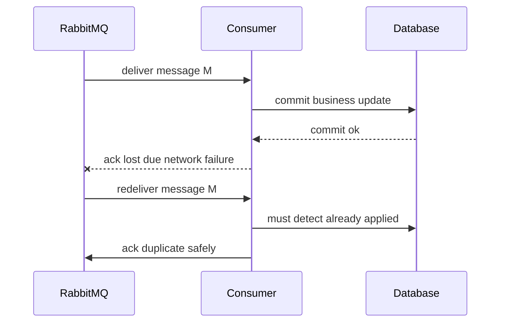
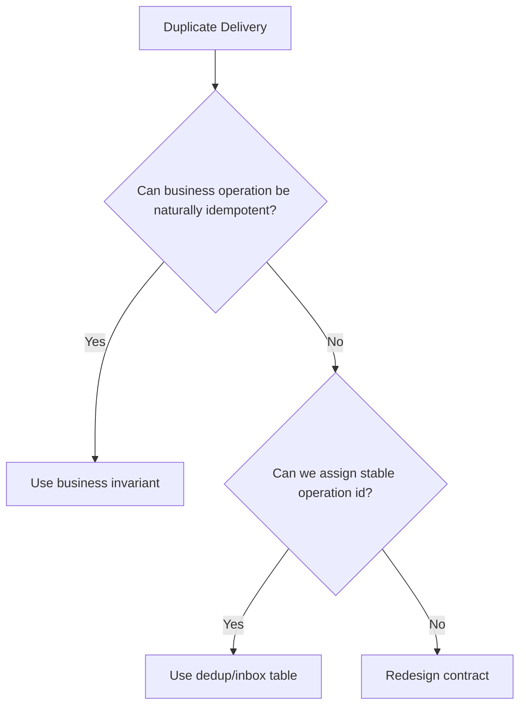
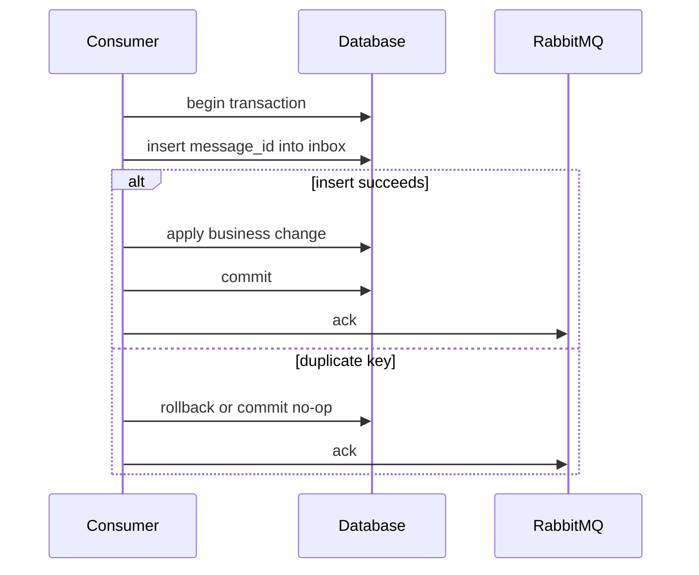
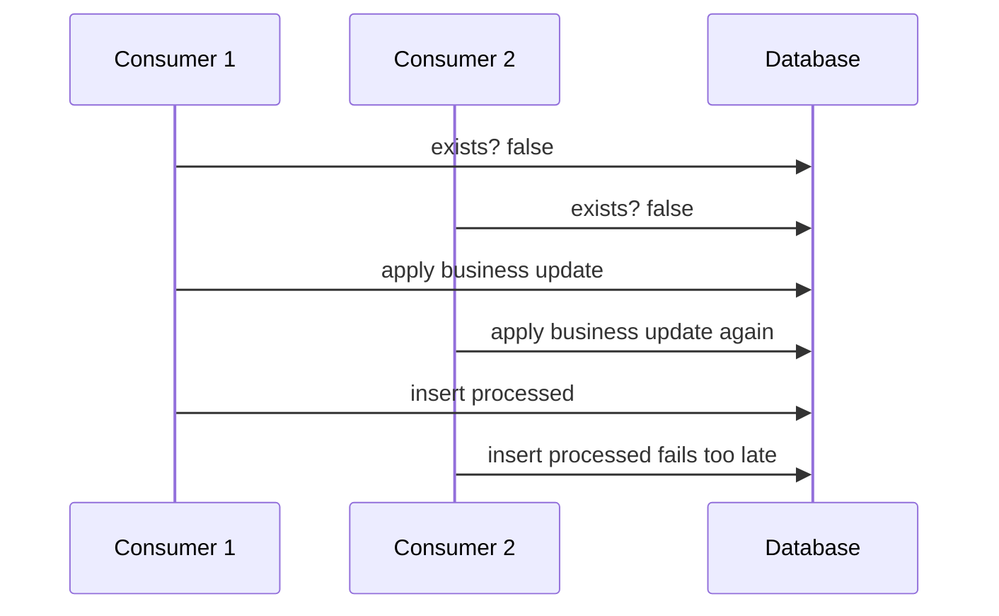
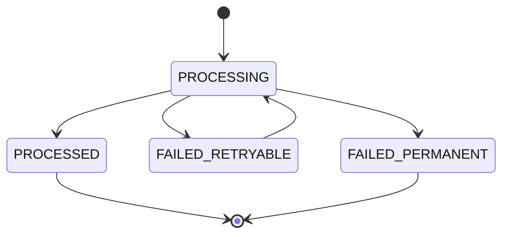
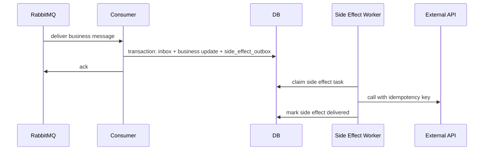
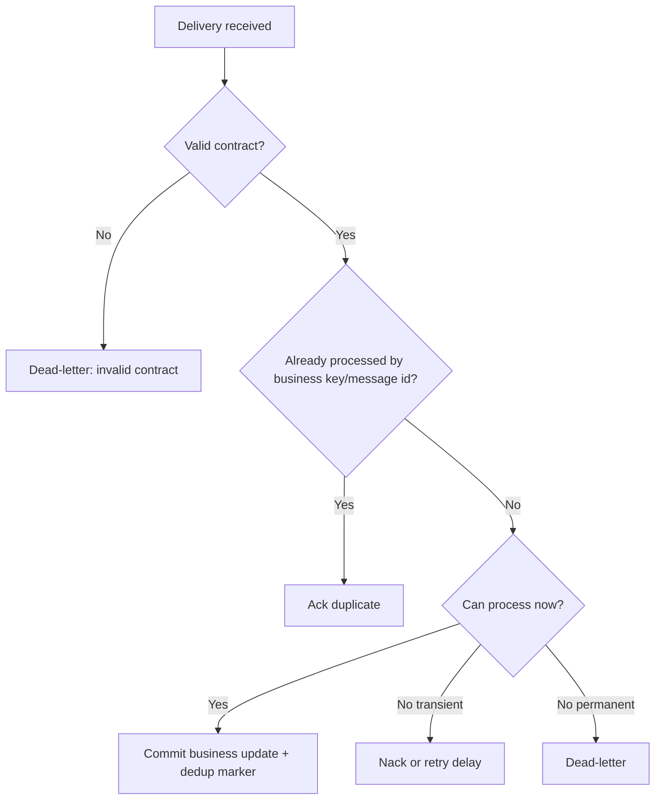
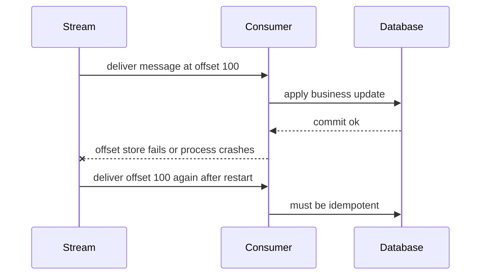

# Part 017 — Idempotency and Deduplication: Consumer Correctness Under Redelivery

RabbitMQ can redeliver a message.

That sentence is enough to invalidate many naive consumer implementations.

A consumer that assumes "one delivery = one business execution" is not production-grade. Network failures, broker restarts, consumer crashes, acknowledgement timeouts, manual `nack`, quorum queue failover, and ambiguous publish/consume states can all produce duplicates. The correct mindset is not "how do I prevent all duplicates?" The correct mindset is "how do I make duplicate delivery harmless?"

This part builds that skill: idempotency, deduplication, inbox tables, business invariants, race conditions, external side effects, and test design.

---

## 1. Kaufman Deconstruction

To master idempotency and deduplication in Java RabbitMQ systems, break the skill into nine smaller capabilities:

1. **Redelivery literacy** — understand why RabbitMQ may deliver the same logical message more than once.
2. **Business idempotency** — make the business operation itself safe to repeat.
3. **Technical deduplication** — detect previously processed message identities.
4. **Transactional boundary design** — couple dedup marker and business state update correctly.
5. **Concurrency race handling** — avoid double processing when duplicate deliveries race.
6. **Side-effect containment** — prevent duplicate emails, payments, webhooks, and external API calls.
7. **Replay compatibility** — distinguish retry, replay, repair, and forensic reprocessing.
8. **Observability** — prove duplicates are happening and prove they are harmless.
9. **Operational recovery** — repair dedup stores, poison messages, and bad replay campaigns safely.

The goal is not to remove duplicate delivery. The goal is to make duplicate delivery a normal, measurable, bounded, non-catastrophic event.

---

## 2. The Core Invariant

The most important invariant:

> A message may be delivered more than once, but the business transition it represents must be applied at most once per business identity.

This means we care about **business effect**, not delivery count.

| Level | Question | Example |
|---|---|---|
| Delivery | Did RabbitMQ send this message to a consumer? | `deliveryTag=4812` |
| Message identity | Is this the same logical message? | `messageId=evt-20260701-0001` |
| Business identity | Is this the same business operation? | `paymentCaptureId=cap_123` |
| Business effect | Did the operation change state? | `invoice.status = PAID` |

A top-tier engineer does not stop at message id. They ask: **what is the domain-level idempotency key?**

For example:

- `OrderAccepted` event id prevents duplicate event handling.
- `paymentCaptureRequestId` prevents duplicate payment capture.
- `customerId + addressVersion` prevents duplicate address projection updates.
- `caseId + transitionId` prevents duplicate enforcement lifecycle transition.

---

## 3. Why Redelivery Happens

A duplicate can happen even when every component behaves correctly.



The dangerous point is after the business commit and before the broker receives the acknowledgement. From the consumer's perspective, processing succeeded. From the broker's perspective, the delivery is still unacknowledged. Redelivery is the correct broker behavior.

Common duplicate causes:

| Cause | Broker behavior | Consumer requirement |
|---|---|---|
| Consumer crashes before ack | Message becomes eligible for redelivery | idempotent processing |
| Network drops after DB commit | Ack may not reach broker | dedup by message/business key |
| Manual `nack` with requeue | Message returns to queue | retry guard |
| Acknowledgement timeout | Broker closes channel, redelivers | bounded processing time |
| Queue leader failover | Unacked messages may be redelivered | duplicate-safe handler |
| Consumer deployment restart | In-flight deliveries are requeued | graceful shutdown + idempotency |
| Replay campaign | Historical messages are consumed again | replay-aware side effects |

Do not treat duplicate delivery as an exceptional edge case. Treat it as a normal input category.

---

## 4. Idempotency vs Deduplication

These terms are related but not identical.

| Concept | Meaning | Preferred? | Example |
|---|---|---:|---|
| Idempotency | Repeating the operation yields the same final effect | Yes | `setStatus(PAID)` when already paid does nothing |
| Deduplication | Detect and skip already seen message/operation | Sometimes | `processed_message(message_id)` unique key |
| Ordering guard | Ignore stale state transition | Often | reject event with version lower than current aggregate version |
| Commutativity | Operation order does not matter | Rare but powerful | increment CRDT-like counter with operation id |

Idempotency is stronger than deduplication because it belongs to business semantics. Deduplication is a technical mechanism that can expire, be corrupted, or choose the wrong identity.

A simple hierarchy:



If an operation has no stable identity, the system is not ready for reliable asynchronous processing.

---

## 5. Natural Idempotency

Natural idempotency means the domain update is safe to repeat because it sets a state rather than performing an unbounded action.

Good examples:

```java
void markInvoicePaid(String invoiceId, Instant paidAt) {
    Invoice invoice = repository.find(invoiceId);

    if (invoice.status() == InvoiceStatus.PAID) {
        return;
    }

    invoice.markPaid(paidAt);
    repository.save(invoice);
}
```

This is much safer than:

```java
void applyPayment(String invoiceId, BigDecimal amount) {
    Invoice invoice = repository.find(invoiceId);
    invoice.addPaidAmount(amount);
    repository.save(invoice);
}
```

The first operation converges to a stable state. The second operation accumulates side effects.

### Prefer State Transitions Over Blind Mutation

Bad:

```java
balance = balance + paymentAmount;
```

Better:

```java
paymentCapture[operationId] = CAPTURED;
invoice.status = PAID if all required captures exist;
```

The first design is vulnerable to duplicate delivery. The second design records a unique fact and derives state from known facts.

---

## 6. Technical Deduplication With Inbox Table

The standard technical pattern is an **inbox table** or **processed message table**.



The key point: **dedup marker and business update must be in the same transaction when possible.**

Example schema:

```sql
CREATE TABLE consumer_inbox (
    consumer_name       VARCHAR(120) NOT NULL,
    message_id          VARCHAR(160) NOT NULL,
    business_key        VARCHAR(200) NOT NULL,
    message_type        VARCHAR(160) NOT NULL,
    producer            VARCHAR(160) NOT NULL,
    received_at         TIMESTAMP NOT NULL,
    processed_at        TIMESTAMP NULL,
    status              VARCHAR(32) NOT NULL,
    error_code          VARCHAR(120) NULL,
    payload_hash        VARCHAR(128) NULL,
    PRIMARY KEY (consumer_name, message_id)
);

CREATE INDEX idx_consumer_inbox_business_key
    ON consumer_inbox (consumer_name, business_key);
```

Why include `consumer_name`?

Because message processing is consumer-specific. Two consumers may legitimately process the same message id for different projections or workflows.

---

## 7. Dedup Key Selection

The dedup key must match the operation semantics.

| Message type | Weak dedup key | Stronger dedup key |
|---|---|---|
| Domain event | delivery tag | event id |
| Command | random message id generated by relay | command id supplied by caller |
| Payment capture | order id | payment capture request id |
| Email notification | message id | notification id + recipient + template version |
| Projection update | event id | aggregate id + aggregate version |
| Case transition | case id | case id + transition id |

Never use RabbitMQ `deliveryTag` as a dedup key. It is scoped to a channel delivery, not to the logical message.

Prefer this hierarchy:

1. Stable business operation id.
2. Stable event id created at source transaction.
3. Aggregate id + aggregate version.
4. Payload hash only as last-resort diagnostic aid, not as primary correctness key.

---

## 8. Java Consumer Skeleton With Inbox Dedup

This example uses JDBC-style boundaries to show the invariant clearly. Adapt it to your actual persistence stack.

```java
public final class IdempotentMessageConsumer {

    private final InboxRepository inboxRepository;
    private final OrderProjectionService projectionService;
    private final ObjectMapper objectMapper;

    public ConsumeResult handle(Delivery delivery) {
        MessageEnvelope<OrderAcceptedPayload> envelope = decode(delivery);

        String consumerName = "order-read-model-projector";
        String messageId = envelope.messageId();
        String businessKey = envelope.payload().orderId();

        try {
            return inboxRepository.inTransaction(tx -> {
                boolean firstTime = inboxRepository.tryInsertProcessing(
                    consumerName,
                    messageId,
                    businessKey,
                    envelope.type(),
                    envelope.producer(),
                    envelope.payloadHash()
                );

                if (!firstTime) {
                    return ConsumeResult.duplicateAck();
                }

                projectionService.projectOrderAccepted(envelope.payload());
                inboxRepository.markProcessed(consumerName, messageId);

                return ConsumeResult.processedAck();
            });
        } catch (TransientDatabaseException e) {
            return ConsumeResult.retry("database_transient", e);
        } catch (InvalidMessageException e) {
            return ConsumeResult.deadLetter("invalid_message", e);
        } catch (Exception e) {
            return ConsumeResult.retry("unknown_processing_error", e);
        }
    }

    private MessageEnvelope<OrderAcceptedPayload> decode(Delivery delivery) {
        // Decode AMQP properties + application envelope + payload.
        // Validate schema version and required identifiers before processing.
        throw new UnsupportedOperationException("example");
    }
}
```

Repository method:

```java
public boolean tryInsertProcessing(
    String consumerName,
    String messageId,
    String businessKey,
    String messageType,
    String producer,
    String payloadHash
) {
    try {
        jdbc.update("""
            INSERT INTO consumer_inbox
                (consumer_name, message_id, business_key, message_type, producer,
                 received_at, status, payload_hash)
            VALUES (?, ?, ?, ?, ?, CURRENT_TIMESTAMP, 'PROCESSING', ?)
            """,
            consumerName,
            messageId,
            businessKey,
            messageType,
            producer,
            payloadHash
        );
        return true;
    } catch (DuplicateKeyException duplicate) {
        return false;
    }
}
```

The duplicate key exception is not an error. It is a valid control path.

---

## 9. The Most Common Dedup Bug

The most common bug is checking first, then inserting later.

Bad:

```java
if (!inboxRepository.exists(consumerName, messageId)) {
    businessService.apply(payload);
    inboxRepository.insertProcessed(consumerName, messageId);
}
```

This is race-prone:



Correct:

1. Insert unique dedup marker first inside transaction.
2. If insert fails due duplicate, skip and ack.
3. If insert succeeds, apply business update in the same transaction.
4. Commit.
5. Ack after commit.

---

## 10. `PROCESSING` State and Stuck Messages

A robust inbox often needs state, not only a set of processed ids.



But be careful: inserting `PROCESSING` and then crashing can create a stuck row.

Options:

| Strategy | Description | Risk |
|---|---|---|
| Insert and update in one DB transaction | Crash rolls back both marker and update | best for local DB work |
| `PROCESSING` with lease | row includes `locked_until` | more complex |
| Insert `PROCESSED` only after business update | race-prone unless business update has own unique key |
| Business table uniqueness only | no generic inbox | simple but less observable |

For most service-local handlers, prefer a single transaction:

```text
BEGIN
  INSERT inbox marker
  APPLY business update
  UPDATE inbox status = PROCESSED
COMMIT
ACK
```

If the business operation spans an external service, use a dedicated side-effect pattern.

---

## 11. External Side Effects

External side effects are where idempotency usually fails.

Examples:

- charging a card
- sending an email
- submitting an SMS
- creating a ticket in an external system
- calling a regulator or government integration endpoint
- firing a webhook to a third party

A database transaction cannot rollback an external email or payment after it is sent.

Use one of these patterns:

### 11.1 External Idempotency Key

Send a stable idempotency key to the external provider.

```java
PaymentCaptureRequest request = new PaymentCaptureRequest(
    captureRequestId,
    orderId,
    amount,
    currency
);

paymentGateway.capture(request, IdempotencyKey.of(captureRequestId));
```

The external provider must guarantee that repeated requests with the same key produce the same effect or same result.

### 11.2 Local Side-Effect Outbox

Split message consumption and external side effect dispatch.



This avoids holding a broker delivery open while waiting for a slow external system.

### 11.3 Side-Effect Ledger

For high-risk actions, model side effects as a ledger.

```sql
CREATE TABLE side_effect_ledger (
    effect_id           VARCHAR(160) PRIMARY KEY,
    effect_type         VARCHAR(120) NOT NULL,
    business_key        VARCHAR(200) NOT NULL,
    target              VARCHAR(240) NOT NULL,
    idempotency_key     VARCHAR(200) NOT NULL,
    status              VARCHAR(32) NOT NULL,
    attempt_count       INT NOT NULL DEFAULT 0,
    last_attempt_at     TIMESTAMP NULL,
    completed_at        TIMESTAMP NULL,
    response_hash       VARCHAR(128) NULL
);
```

This gives you auditability, replay safety, and recovery control.

---

## 12. Idempotent Projection Pattern

Projection consumers often process domain events to build read models.

A good projection handler tracks aggregate version.

```java
public void apply(OrderAccepted event) {
    OrderProjection existing = repository.find(event.orderId());

    if (existing != null && existing.version() >= event.aggregateVersion()) {
        return;
    }

    repository.upsert(new OrderProjection(
        event.orderId(),
        event.customerId(),
        "ACCEPTED",
        event.aggregateVersion(),
        event.occurredAt()
    ));
}
```

This handles:

- duplicate event with same version
- stale event with lower version
- replay after projection rebuild

It does not automatically handle gaps. If version jumps from 7 to 9, you need a policy:

| Gap policy | When useful |
|---|---|
| Accept latest | eventually consistent read model where intermediate states do not matter |
| Park and wait | state machine projections requiring every transition |
| Trigger repair | event replay/read from source of truth |
| Fail fast | regulated workflows where missing transition is unacceptable |

---

## 13. Idempotent State Machine Transition

For case management, enforcement lifecycle, order management, or workflow systems, idempotency is often a transition problem.

Example transition command:

```json
{
  "commandId": "cmd-8b563",
  "caseId": "case-88421",
  "transitionId": "transition-20260701-001",
  "fromState": "UNDER_REVIEW",
  "toState": "ESCALATED",
  "reasonCode": "RISK_THRESHOLD_EXCEEDED"
}
```

Correct handler invariant:

```java
public void applyTransition(EscalateCaseCommand command) {
    CaseRecord record = caseRepository.lockById(command.caseId());

    if (transitionRepository.exists(command.transitionId())) {
        return;
    }

    if (!record.state().equals(command.fromState())) {
        throw new PermanentBusinessException("unexpected_source_state");
    }

    record.transitionTo(command.toState(), command.reasonCode());
    transitionRepository.insert(command.transitionId(), command.caseId(), command.fromState(), command.toState());
    caseRepository.save(record);
}
```

Key points:

- Use a unique transition id.
- Lock the aggregate or rely on optimistic versioning.
- Reject impossible transitions as permanent failures.
- Record the transition as an audit fact.

---

## 14. Dedup Window and Retention

A dedup store cannot grow forever without a retention strategy.

But retention is not just storage optimization; it is a correctness decision.

| Message category | Dedup retention recommendation |
|---|---|
| Payment / money movement | long retention, often years |
| Regulatory case transition | long retention aligned to audit policy |
| Email notification | medium retention, based on retry/replay window |
| Read model projection | can be rebuilt; keep event version in projection |
| Telemetry aggregation | retention based on window + late arrival tolerance |
| Low-value task | short retention may be acceptable |

Retention must exceed the maximum period in which duplicates can reappear.

Duplicates can reappear because of:

- retry queues
- parking lot replay
- manual requeue
- disaster recovery restore
- stream replay
- outbox relay bug
- producer retry after ambiguous confirm

If you keep dedup rows for 24 hours but replay seven days of messages, you have explicitly allowed duplicate side effects.

---

## 15. Payload Hash and Duplicate Conflict Detection

A duplicate message id with a different payload is dangerous.

Store `payload_hash` to detect contract corruption.

```java
public DedupDecision register(String consumer, String messageId, String payloadHash) {
    Optional<InboxRecord> existing = inboxRepository.find(consumer, messageId);

    if (existing.isEmpty()) {
        inboxRepository.insert(consumer, messageId, payloadHash);
        return DedupDecision.firstTime();
    }

    if (!existing.get().payloadHash().equals(payloadHash)) {
        return DedupDecision.conflictingDuplicate();
    }

    return DedupDecision.duplicateSamePayload();
}
```

Policy:

| Case | Action |
|---|---|
| same id, same hash | ack duplicate |
| same id, different hash | dead-letter and alert |
| missing message id | reject/dead-letter unless explicitly allowed |
| malformed id | dead-letter and alert contract owner |

A repeated message id with different payload usually indicates a producer bug, contract violation, or replay tooling error.

---

## 16. Retry Interaction

Idempotency must distinguish these cases:

| Case | Should process? | Reason |
|---|---:|---|
| same message redelivered after consumer crash before commit | yes | previous transaction rolled back |
| same message redelivered after commit before ack | no | business effect already applied |
| same message retried after transient DB error before commit | yes | no committed effect |
| same message retried after external call ambiguous | maybe | depends on external idempotency key |
| same event replayed for projection rebuild | yes/no | depends on target rebuild mode |

This is why a simple `processed_message` table is not always enough. You must know the outcome of the previous attempt.

---

## 17. Redelivery Count Is Not Deduplication

RabbitMQ may expose redelivery metadata or delivery count in some queue types/features, but delivery count is not an idempotency key.

Use redelivery count for operational policy:

- when to stop retrying
- when to dead-letter
- when to alert
- when to slow down retry

Do not use it to decide whether business effect was already applied.

Correct decision model:



---

## 18. `ack` Timing

The safe baseline:

> Ack after durable business effect is committed.

```java
try {
    ConsumeResult result = handler.handle(delivery);

    switch (result.action()) {
        case ACK -> channel.basicAck(deliveryTag, false);
        case RETRY_REQUEUE -> channel.basicNack(deliveryTag, false, true);
        case DEAD_LETTER -> channel.basicReject(deliveryTag, false);
    }
} catch (Throwable unknown) {
    channel.basicNack(deliveryTag, false, true);
}
```

Avoid:

```java
channel.basicAck(deliveryTag, false);
businessService.process(payload); // unsafe: message lost if this fails
```

Early ack is acceptable only when losing that unit of work is acceptable or when the message has already been durably transferred to another reliable local mechanism.

---

## 19. Database Isolation and Locking

Dedup correctness depends on database constraints, not just Java code.

Use one of these approaches:

### 19.1 Unique Constraint First

```sql
ALTER TABLE consumer_inbox
ADD CONSTRAINT uk_consumer_message UNIQUE (consumer_name, message_id);
```

The unique constraint is the concurrency control.

### 19.2 Optimistic Aggregate Versioning

```sql
UPDATE cases
SET state = ?, version = version + 1
WHERE case_id = ?
  AND version = ?;
```

If affected rows = 0, another process already changed the aggregate.

### 19.3 Pessimistic Lock

```sql
SELECT * FROM cases WHERE case_id = ? FOR UPDATE;
```

Use when transition correctness requires serialized access to one aggregate.

### 19.4 Idempotent Upsert

```sql
INSERT INTO order_projection(order_id, status, version)
VALUES (?, ?, ?)
ON CONFLICT (order_id)
DO UPDATE SET
    status = EXCLUDED.status,
    version = EXCLUDED.version
WHERE order_projection.version < EXCLUDED.version;
```

This is excellent for projection consumers.

---

## 20. Dedup and RabbitMQ Streams

With RabbitMQ Streams, duplicate handling remains necessary.

Stream consumers track offsets, but offset progress and business side effects still need coordination.



Offset tracking does not replace idempotency. It only records consumer progress.

For stream replay, handlers need a replay mode:

| Mode | Behavior |
|---|---|
| normal | emit side effects if not already done |
| projection rebuild | update read model, suppress external side effects |
| forensic replay | read/validate only, no mutation |
| repair replay | mutate only selected targets, audited carefully |

---

## 21. Idempotency for Windowing and Aggregation

Aggregation is tricky because duplicates can inflate counts.

Bad:

```java
metrics.increment("orders.accepted");
```

Better:

```java
aggregationRepository.insertContribution(
    windowId,
    eventId,
    contributionValue
);
aggregationRepository.recalculateWindow(windowId);
```

Schema:

```sql
CREATE TABLE window_contribution (
    window_id       VARCHAR(120) NOT NULL,
    event_id        VARCHAR(160) NOT NULL,
    contribution    NUMERIC NOT NULL,
    occurred_at     TIMESTAMP NOT NULL,
    PRIMARY KEY (window_id, event_id)
);
```

The unique `(window_id, event_id)` protects against duplicate contribution.

For high-volume aggregation, you may need approximate structures or compaction, but the correctness model remains: count facts, not deliveries.

---

## 22. Observability

Idempotency must be visible.

Metrics:

| Metric | Meaning |
|---|---|
| `consumer.deliveries.total` | all deliveries received |
| `consumer.processed.total` | first-time successful processing |
| `consumer.duplicates.total` | duplicate messages safely skipped |
| `consumer.duplicate_conflicts.total` | same id, different payload hash |
| `consumer.inbox.insert.latency` | dedup store performance |
| `consumer.business.apply.latency` | business processing duration |
| `consumer.redelivered.total` | broker-marked redeliveries |
| `consumer.ack.after.commit.failures` | ack failure after durable effect |

Log fields:

```json
{
  "messageId": "evt-20260701-0001",
  "businessKey": "order-88421",
  "consumer": "order-read-model-projector",
  "dedupDecision": "DUPLICATE_SAME_PAYLOAD",
  "redelivered": true,
  "correlationId": "corr-72b1",
  "causationId": "cmd-61f2"
}
```

Dashboards should show duplicate rate as a normal reliability signal, not only as an error.

---

## 23. Runbook: Duplicate Spike

When duplicate count spikes:

1. Check deployment/restart activity.
2. Check consumer crash loops.
3. Check broker connection churn.
4. Check ack latency and acknowledgement timeout.
5. Check DB latency causing slow handler completion.
6. Check retry queues and parking lot replay jobs.
7. Check producer confirm timeout and republish behavior.
8. Check queue leader failovers.
9. Verify duplicate conflict count is zero.
10. Verify business side-effect ledger shows no duplicate side effects.

A duplicate spike is not always an incident. A duplicate side-effect spike is.

---

## 24. Testing Strategy

### 24.1 Duplicate Delivery Test

```java
@Test
void duplicateMessageShouldApplyBusinessEffectOnce() {
    MessageEnvelope<OrderAcceptedPayload> message = fixture.orderAccepted("evt-1", "order-1");

    consumer.handle(deliveryOf(message));
    consumer.handle(deliveryOf(message));

    OrderProjection projection = projectionRepository.find("order-1");
    assertThat(projection.status()).isEqualTo("ACCEPTED");
    assertThat(inboxRepository.countProcessed("order-projector", "evt-1")).isEqualTo(1);
}
```

### 24.2 Crash After Commit Before Ack

Test by injecting an exception after DB commit but before ack. Then redeliver the same message.

Expected result:

- first attempt commits business effect
- ack fails
- second attempt detects duplicate
- second attempt acks
- business effect count remains one

### 24.3 Concurrent Duplicate Race

```java
@Test
void concurrentDuplicateShouldOnlyProcessOnce() throws Exception {
    MessageEnvelope<OrderAcceptedPayload> message = fixture.orderAccepted("evt-1", "order-1");

    runConcurrently(20, () -> consumer.handle(deliveryOf(message)));

    assertThat(inboxRepository.countProcessed("order-projector", "evt-1")).isEqualTo(1);
    assertThat(projectionRepository.countByOrderId("order-1")).isEqualTo(1);
}
```

This test is more important than a happy-path integration test.

---

## 25. Anti-Patterns

| Anti-pattern | Why it fails |
|---|---|
| Auto-ack consumer for important work | message can be lost before processing |
| Ack before DB commit | message loss on processing failure |
| Check-then-insert dedup | race condition |
| Dedup by delivery tag | delivery tag is not logical identity |
| Dedup store with too-short retention | replay creates duplicate effects |
| Dedup only in memory | restart forgets processed messages |
| External side effect inside long broker delivery | slow external dependency blocks consumption |
| Retrying permanent validation failures | poison loops |
| Ignoring same-id different-payload conflict | hides producer corruption |
| Assuming stream offset means side effect committed | offset and business state are separate |

---

## 26. Design Review Checklist

Before approving a RabbitMQ consumer, ask:

- What is the stable message id?
- What is the stable business operation id?
- Is the operation naturally idempotent?
- Is dedup marker committed with business state?
- What happens if the consumer crashes after DB commit before ack?
- What happens if duplicate deliveries arrive concurrently?
- What happens if same message id has different payload?
- How long are dedup markers retained?
- Are external side effects protected by idempotency keys or side-effect outbox?
- Can replay be run without duplicate side effects?
- Are duplicate metrics visible?
- Is the duplicate path tested?

If the design cannot answer these, it is not production-ready.

---

## 27. Practice Drill

Build a consumer for `PaymentCaptureRequested`.

Requirements:

1. Consume from `payment.capture.requested.q` with manual ack.
2. Validate envelope: `messageId`, `correlationId`, `schemaVersion`, `captureRequestId`.
3. Insert into `consumer_inbox` with unique `(consumer_name, message_id)`.
4. Insert into `side_effect_ledger` with unique `captureRequestId`.
5. Commit inbox + ledger before ack.
6. A separate worker calls a fake payment gateway using `captureRequestId` as idempotency key.
7. Duplicate RabbitMQ delivery must not call gateway twice.
8. Same message id with different payload hash must be dead-lettered.
9. Provide metrics for processed, duplicate, side-effect duplicate, and conflict.
10. Write tests for crash-after-commit-before-ack and concurrent duplicate delivery.

Success criteria:

- duplicate deliveries are acknowledged safely
- payment capture side effect happens at most once per `captureRequestId`
- failures are classified as retryable/permanent
- replay mode can rebuild internal state without external capture

---

## 28. Summary

Idempotency is not a utility function. It is a correctness property of the whole consumer boundary.

The production-grade model:

```text
RabbitMQ may redeliver.
Consumer must be idempotent.
Dedup key must match business semantics.
Dedup marker and business update must be atomic when possible.
External side effects need their own idempotency boundary.
Replay must be explicit.
Duplicates must be observable.
```

A senior RabbitMQ engineer does not promise "no duplicates". They design so duplicates cannot corrupt business state.

---

## References

- RabbitMQ Reliability Guide: https://www.rabbitmq.com/docs/reliability
- RabbitMQ Consumers Guide: https://www.rabbitmq.com/docs/consumers
- RabbitMQ Consumer Acknowledgements and Publisher Confirms: https://www.rabbitmq.com/docs/confirms
- RabbitMQ Dead Letter Exchanges: https://www.rabbitmq.com/docs/dlx
- RabbitMQ Stream Java Client Documentation: https://rabbitmq.github.io/rabbitmq-stream-java-client/stable/htmlsingle/
