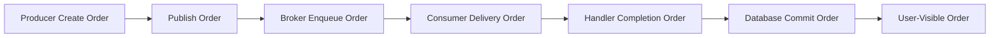
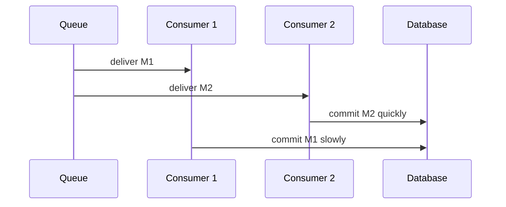
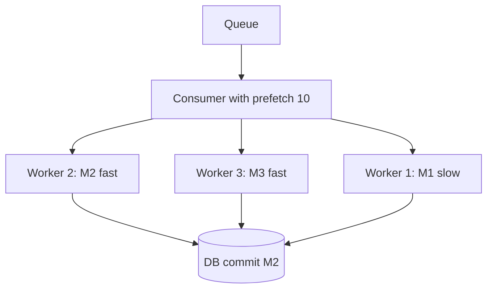
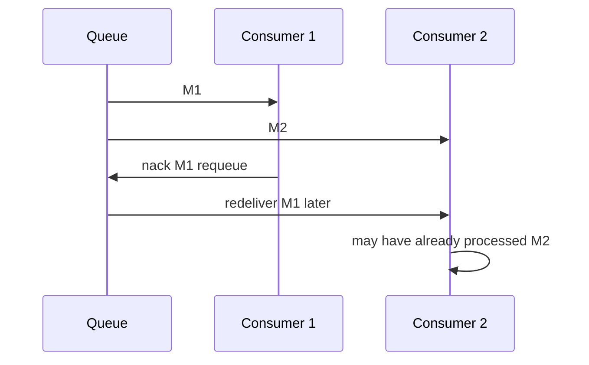
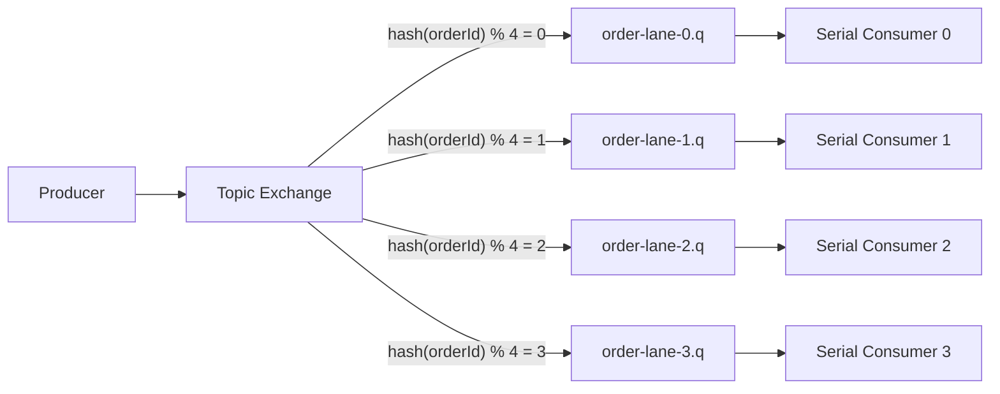
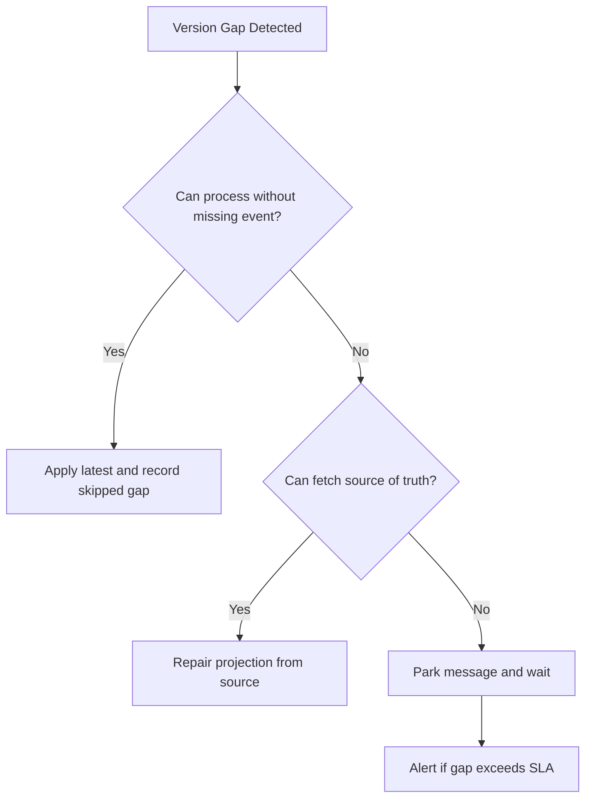
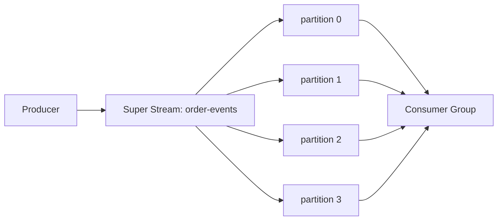
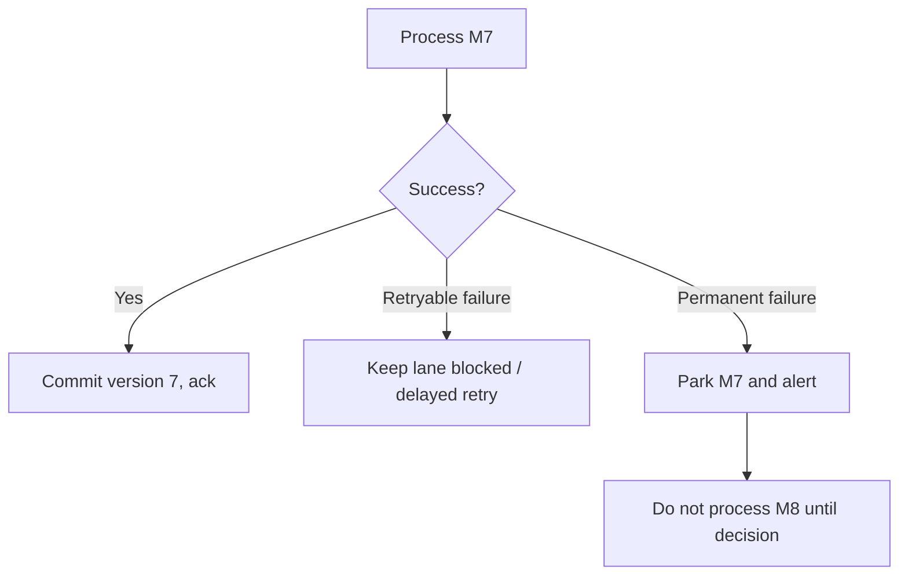
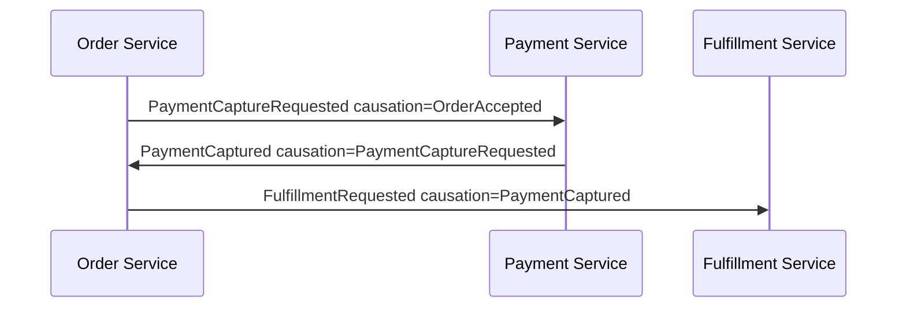
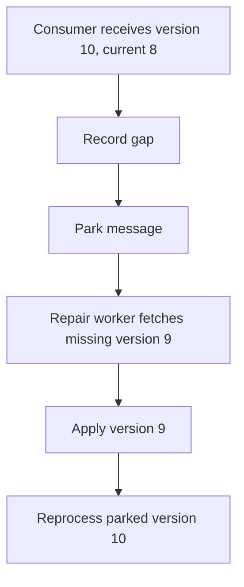

# Part 018 — Ordering, Partitioning, and Causality: What RabbitMQ Can and Cannot Promise

Ordering is one of the most misunderstood parts of messaging.

Many teams say "RabbitMQ is FIFO" and then build systems that break under multiple consumers, retry, redelivery, prefetch, priority queues, dead-letter replay, or cross-entity workflows.

RabbitMQ queues are ordered collections, but production ordering is not a single property. It is a relationship between **producer order**, **enqueue order**, **delivery order**, **processing order**, **commit order**, and **business causality**.

This part builds a precise model for ordering, partitioning, and causality in Java RabbitMQ systems.

---

## 1. Kaufman Deconstruction

To master ordering and partitioning, decompose the skill into nine capabilities:

1. **Ordering vocabulary** — separate enqueue, delivery, processing, commit, and observable order.
2. **Queue ordering limits** — understand when FIFO is preserved and when it is weakened.
3. **Consumer concurrency reasoning** — understand how competing consumers and prefetch affect processing order.
4. **Redelivery reasoning** — understand how `nack`, requeue, crash, and retry alter observed order.
5. **Entity-key partitioning** — route related messages to the same serial lane.
6. **Causal ordering** — model happens-before relationships with explicit metadata.
7. **Stale message handling** — safely ignore or park old messages.
8. **Stream/super stream design** — use append-only logs and partitions when replay/order matter.
9. **Verification** — test ordering under concurrency, failover, retry, and replay.

The goal is not to force global order. The goal is to preserve the smallest order that the business actually needs.

---

## 2. Ordering Is Not One Thing

There are at least six different orders.



| Order type | Meaning | Controlled by |
|---|---|---|
| Producer create order | order in which app creates messages | producer application |
| Publish order | order in which messages are sent to broker | producer channel/threading |
| Enqueue order | order in which queue stores messages | broker routing/queue |
| Delivery order | order in which broker delivers to consumer | queue + consumer config |
| Processing order | order in which handlers execute | consumer concurrency |
| Commit order | order in which state changes persist | DB transactions/locks |
| Observed order | order users or downstream systems see | projections, caches, APIs |

A design that needs "ordering" must say **which order** and **within what scope**.

Bad requirement:

> Messages must be ordered.

Good requirement:

> For a given `caseId`, state transition events must be applied by the case projection in increasing `caseVersion`. Events for different cases may be processed concurrently.

---

## 3. RabbitMQ Queue FIFO: The Narrow Truth

A RabbitMQ queue is ordered. But that does not mean every distributed workflow using a queue preserves business order.

A simplified safe case:

```text
single producer channel
single queue
single consumer
manual ack
prefetch = 1
no requeue
no priority
no dead-letter replay
handler commits serially
```

This can approximate per-queue FIFO processing.

But real systems often use:

- multiple producer instances
- multiple consumers
- prefetch greater than 1
- asynchronous handlers
- retries
- dead-lettering
- priority queues
- quorum leader failover
- stream replay
- parallel DB transactions

Each feature can alter processing or observable order.

---

## 4. Competing Consumers Break Processing Order

With competing consumers, RabbitMQ can deliver messages in queue order, but processing completion order can differ.



Observed result: `M2` may be visible before `M1`.

If `M1` and `M2` are unrelated, this is fine. If they are transitions for the same entity, this can corrupt state.

Design rule:

> Use competing consumers only when messages are independent or when handlers enforce per-entity ordering.

---

## 5. Prefetch Changes the Shape of Ordering

Prefetch controls how many unacknowledged deliveries a consumer can hold.

With `prefetch=10`, one consumer can receive ten messages before acking any of them. If the consumer processes those messages concurrently, processing order is now controlled by its internal executor.



If order matters:

| Need | Baseline setting |
|---|---|
| strict per-queue serial processing | one consumer, prefetch 1, serial handler |
| per-entity order with concurrency | partition by entity key, serial per partition |
| high throughput with no ordering need | multiple consumers, higher prefetch |
| replayable ordered log | RabbitMQ Stream / Super Stream |

Do not increase prefetch blindly when order matters.

---

## 6. Requeue and Redelivery Can Disturb Order

A failed message can be requeued. Depending on timing, position, delivery state, and queue type behavior, it may not be observed exactly where a naive FIFO model expects.

Example:



If `M1` must happen before `M2`, requeue-based retry can violate business order.

Options:

| Strategy | Use when |
|---|---|
| stop lane on failure | strict ordered state machine |
| park failed message and block later versions | regulated workflow/case lifecycle |
| allow out-of-order but guard with version | projection can ignore or wait |
| route retries to delayed queue | order is not strict |
| use stream replay with offset control | ordered log processing is central |

---

## 7. Priority Queues Are Intentionally Non-FIFO

Priority queues are useful, but they weaken FIFO expectations.

If high-priority messages can jump ahead of low-priority messages, do not use the same queue for workflows requiring strict sequence.

Bad:

```text
case.transition.q with priorities
```

Better:

```text
case.transition.high.q
case.transition.normal.q
```

or separate priority by workload class, not by ordered entity timeline.

Priority is a scheduling policy. It is not compatible with naive total FIFO.

---

## 8. Ordering Scope

Most systems do not need global order. They need scoped order.

| Business problem | Required ordering scope |
|---|---|
| order lifecycle | per `orderId` |
| regulatory case lifecycle | per `caseId` |
| account balance ledger | per `accountId` |
| customer profile projection | per `customerId` |
| shipment tracking | per `shipmentId` |
| fleet telemetry aggregation | per `deviceId` or time window |
| notification delivery | usually no strict order, maybe per recipient |

Global order is expensive and often unnecessary.

A top-tier design asks:

1. What entity defines causality?
2. Can entities be processed independently?
3. What happens if one entity is blocked?
4. What order must external observers see?
5. Can stale messages be ignored?

---

## 9. Entity-Key Partitioning

Entity-key partitioning routes messages for the same entity to the same serial processing lane.



Key invariant:

> All messages for the same entity key must go to the same lane, and each lane must process serially if strict order is required.

RabbitMQ AMQP topic routing does not hash by key automatically. You need to implement partition routing in the producer/router or use a plugin/architecture that provides consistent routing behavior.

Example application-level partition key:

```java
public final class PartitionRouter {
    private final int partitions;

    public PartitionRouter(int partitions) {
        this.partitions = partitions;
    }

    public int partition(String entityId) {
        return Math.floorMod(entityId.hashCode(), partitions);
    }

    public String routingKey(String eventType, String entityId) {
        int partition = partition(entityId);
        return "order." + partition + "." + eventType;
    }
}
```

Producer:

```java
String routingKey = partitionRouter.routingKey("accepted", event.orderId());
channel.basicPublish(
    "order.events.partitioned.x",
    routingKey,
    properties,
    body
);
```

Bindings:

```text
order.0.* -> order-events-0.q
order.1.* -> order-events-1.q
order.2.* -> order-events-2.q
order.3.* -> order-events-3.q
```

---

## 10. Partition Count Trade-Off

Partition count is a long-term decision.

| Low partition count | High partition count |
|---|---|
| simpler operations | better parallelism |
| fewer queues/consumers | more topology objects |
| easier ordering reasoning | harder rebalancing |
| higher hot-key risk | more management overhead |

Choose partition count based on:

- expected throughput
- per-entity processing cost
- hot key distribution
- operational overhead
- consumer deployment model
- future growth

Do not create one queue per entity unless the number of entities is small and bounded.

---

## 11. Hot Partitions and Hot Entities

Partitioning by entity key can create hot partitions.

Example: one enterprise customer generates 40% of all messages.

Mitigation options:

| Mitigation | Trade-off |
|---|---|
| split by sub-entity | may weaken parent-level ordering |
| isolate hot entity to dedicated lane | more topology complexity |
| reduce work per message | requires handler optimization |
| aggregate upstream | changes latency/freshness |
| use stream/super stream | better throughput, still key-bound |
| accept backlog with SLA exception | operationally honest |

Never fix hot partition by randomly distributing messages for the same ordered entity. That removes the property you created partitioning for.

---

## 12. Causality Metadata

Ordering should be supported by metadata, not inferred from broker behavior alone.

Recommended envelope fields:

```json
{
  "messageId": "evt-20260701-0007",
  "type": "OrderPaid",
  "aggregateType": "Order",
  "aggregateId": "order-88421",
  "aggregateVersion": 7,
  "correlationId": "corr-9f13",
  "causationId": "cmd-72c8",
  "occurredAt": "2026-07-01T15:21:10Z",
  "producer": "order-service"
}
```

Important fields:

| Field | Purpose |
|---|---|
| `aggregateId` | ordering scope |
| `aggregateVersion` | state transition sequence |
| `messageId` | deduplication |
| `correlationId` | business transaction trace |
| `causationId` | immediate cause |
| `occurredAt` | domain time, not broker order |
| `producer` | ownership and debugging |

`aggregateVersion` is often the most important field for correctness.

---

## 13. Stale Message Handling

A stale message is older than the state already applied.

Example:

```text
current projection version = 8
received event aggregateVersion = 7
```

Correct behavior is usually to ignore and ack.

```java
public ProjectionDecision apply(OrderEvent event) {
    OrderProjection current = repository.find(event.aggregateId());

    if (current != null && event.aggregateVersion() <= current.version()) {
        return ProjectionDecision.staleAck();
    }

    if (current != null && event.aggregateVersion() > current.version() + 1) {
        return ProjectionDecision.gapDetected(event.aggregateVersion(), current.version());
    }

    repository.apply(event);
    return ProjectionDecision.applied();
}
```

Policy table:

| Event version vs current | Meaning | Action |
|---|---|---|
| lower | stale/duplicate | ack and record stale metric |
| equal | duplicate | ack |
| current + 1 | expected next | apply |
| greater than current + 1 | gap | park, repair, or fetch missing state |

---

## 14. Gap Handling

A gap means the consumer observes version 10 while current state is version 8. Version 9 is missing or delayed.

Gap handling options:



Use cases:

| Domain | Recommended gap behavior |
|---|---|
| financial ledger | park and repair, never skip silently |
| regulatory state machine | park and alert |
| simple read model | fetch source-of-truth snapshot |
| analytics counter | may accept eventually with window repair |
| notification | often no strict gap handling needed |

---

## 15. Per-Entity Serial Executor

If all messages arrive at one consumer process and you need per-key ordering but global concurrency, use a serial executor per key or per partition.

```java
public final class PartitionedDispatcher {
    private final List<ExecutorService> lanes;

    public PartitionedDispatcher(int laneCount) {
        this.lanes = IntStream.range(0, laneCount)
            .mapToObj(i -> Executors.newSingleThreadExecutor())
            .toList();
    }

    public void dispatch(String entityId, Runnable task) {
        int lane = Math.floorMod(entityId.hashCode(), lanes.size());
        lanes.get(lane).submit(task);
    }
}
```

This preserves order per lane only if:

- the consumer receives messages in relevant order
- tasks for the same entity always go to same lane
- each lane is single-threaded
- ack timing is tied to task completion
- shutdown drains or requeues in-flight tasks safely

Beware: once messages are handed to an internal executor, RabbitMQ no longer controls processing order.

---

## 16. Ack Strategy With Internal Lanes

Do not ack when dispatching to an executor. Ack after the lane task commits.

Bad:

```java
partitionedDispatcher.dispatch(entityId, () -> process(delivery));
channel.basicAck(deliveryTag, false); // unsafe
```

Better:

```java
partitionedDispatcher.dispatch(entityId, () -> {
    try {
        process(delivery);
        channel.basicAck(deliveryTag, false);
    } catch (RetryableException e) {
        channel.basicNack(deliveryTag, false, true);
    } catch (PermanentException e) {
        channel.basicReject(deliveryTag, false);
    }
});
```

But this introduces channel-threading concerns. In the RabbitMQ Java client, channel sharing across threads must be handled carefully. A safer production wrapper serializes ack operations or assigns channels per consuming thread according to the client ownership model.

---

## 17. Queue Per Partition vs Consumer Per Partition

Two common designs:

### 17.1 Queue Per Partition

```text
order-events-0.q -> consumer instance/lane 0
order-events-1.q -> consumer instance/lane 1
order-events-2.q -> consumer instance/lane 2
order-events-3.q -> consumer instance/lane 3
```

Pros:

- simple isolation
- visible backlog per partition
- easier hot-partition diagnosis
- strong lane ownership

Cons:

- more queues
- partition count change is painful
- topology management overhead

### 17.2 Single Queue, Internal Partitioned Executor

```text
order-events.q -> consumer process -> internal keyed lanes
```

Pros:

- fewer RabbitMQ objects
- simpler producer routing
- easier topology

Cons:

- RabbitMQ delivery order and internal processing order can diverge
- one process can become bottleneck
- harder horizontal scaling without losing per-key seriality

For strict per-entity workflow, queue-per-partition is often more operationally explicit.

---

## 18. Quorum Queues and Ordering

Quorum queues provide replicated durable queues. They are excellent for data safety, but replication does not magically solve application-level ordering.

Still apply the same rules:

- one ordered lane per entity when strict order is required
- prefetch 1 for strict serial lane processing
- no priority for strict FIFO workflows
- redelivery-aware idempotency
- stale/gap handling with aggregate version

For failover, be prepared for redelivery of unacknowledged messages. Redelivery can affect observed processing order unless the consumer enforces version rules.

---

## 19. RabbitMQ Streams and Ordering

Streams are append-only logs. They are a better fit when you need:

- replay
- long retention
- multiple independent consumers
- offset-based progress
- high-throughput log ingestion
- analytics pipelines
- historical reconstruction

A stream preserves order within the stream. But the same distributed realities still apply:

- multiple consumers can process at different speeds
- side effects can commit out of order
- replay can duplicate effects
- partitioned streams preserve order within partition, not globally

Stream processing still needs idempotency, version checks, and explicit ordering scope.

---

## 20. Super Streams and Partitioned Ordering

A Super Stream partitions a logical stream into multiple streams. This is the stream-native answer to scaling ordered logs.



The design invariant is the same:

> Messages that need relative order must route to the same partition.

Super Streams help with scale, but they do not eliminate the need to choose the correct partition key.

Good partition keys:

- `orderId` for order lifecycle
- `caseId` for case lifecycle
- `accountId` for ledger events
- `customerId` for profile changes
- `deviceId` for telemetry stream

Bad partition keys:

- random UUID when order matters
- event type when entity ordering matters
- tenant id only when one tenant can dominate traffic
- timestamp when entity order matters

---

## 21. Routing Key Design for Ordered Domains

A routing key should encode enough for routing but not become the full business contract.

Example for partitioned AMQP queues:

```text
order.p03.lifecycle.accepted.v1
order.p03.lifecycle.paid.v1
order.p03.lifecycle.shipped.v1
```

Where:

- `order` = domain
- `p03` = partition lane
- `lifecycle` = event family
- `accepted` = event name
- `v1` = routing contract version

Do not put high-cardinality entity ids directly into binding patterns if it creates unbounded topology.

Bad:

```text
order.order-88421.accepted
```

This tempts queue-per-entity design and unmanageable bindings.

---

## 22. Ordered Retry Strategies

Retry strategy must match ordering requirement.

| Ordering need | Retry strategy |
|---|---|
| strict per-entity order | block lane, retry same message, do not process later versions |
| ordered projection with version guard | park gap/stale events, repair from source |
| independent tasks | delayed retry queue is fine |
| analytics pipeline | late event handling/window repair |
| stream replay | stop or skip with checkpoint policy |

### Strict Lane Retry



This is necessary for workflows where later messages depend on earlier messages.

### Non-Strict Retry

For independent tasks:

```text
nack/reject -> DLX -> delay queue -> original queue
```

This is fine when each message is independent. It is dangerous when messages represent ordered transitions for the same entity.

---

## 23. Causal Chains Across Services

Distributed workflows often need causality, not total order.

Example:



Each message should carry:

- `correlationId`: entire business flow
- `causationId`: immediate predecessor message/command
- `aggregateId`: ordering scope for that aggregate
- `aggregateVersion`: version within that aggregate

This allows debugging:

```text
OrderAccepted -> PaymentCaptureRequested -> PaymentCaptured -> FulfillmentRequested
```

Do not infer causality from timestamps alone. Clocks skew. Queues delay. Retries reorder observations.

---

## 24. Cross-Aggregate Ordering Is a Smell

If a workflow requires strict ordering across many aggregates, question the model.

Example weak requirement:

> Customer update must be processed before all future order events across the platform.

This creates broad coupling.

Better options:

- include needed customer snapshot in order event
- version customer data and let consumers check freshness
- use source-of-truth lookup at processing time
- model customer update and order lifecycle independently
- use saga orchestration for explicitly dependent steps

Cross-aggregate total ordering is usually a sign that the system lacks clear ownership boundaries.

---

## 25. Time Ordering vs Version Ordering

`occurredAt` is not enough to order state transitions.

Problems:

- producer clocks can differ
- retries can delay old messages
- imports can create historical events
- time precision can collide
- clock correction can go backward

Use monotonic version where correctness matters.

| Field | Use |
|---|---|
| `occurredAt` | audit/domain timestamp |
| `publishedAt` | producer/broker publication timeline |
| `receivedAt` | consumer observability |
| `aggregateVersion` | state transition ordering |
| `sequenceNumber` | stream/partition order |

For state machines, version beats timestamp.

---

## 26. Consumer Implementation Pattern: Version Guard

```java
public final class OrderedProjectionHandler {

    private final ProjectionRepository repository;
    private final GapRepository gapRepository;

    public ProcessingDecision handle(OrderLifecycleEvent event) {
        return repository.inTransaction(tx -> {
            OrderProjection current = repository.lockByOrderId(event.orderId());

            if (current == null) {
                if (event.aggregateVersion() != 1) {
                    gapRepository.recordGap(event.orderId(), 0, event.aggregateVersion(), event.messageId());
                    return ProcessingDecision.park("missing_initial_version");
                }
                repository.insert(event.toProjection());
                return ProcessingDecision.ackApplied();
            }

            long expected = current.version() + 1;

            if (event.aggregateVersion() < expected) {
                return ProcessingDecision.ackStale();
            }

            if (event.aggregateVersion() > expected) {
                gapRepository.recordGap(event.orderId(), current.version(), event.aggregateVersion(), event.messageId());
                return ProcessingDecision.park("version_gap");
            }

            current.apply(event);
            repository.save(current);
            return ProcessingDecision.ackApplied();
        });
    }
}
```

The important part is not the Java syntax. The important part is that ordering correctness is enforced by persisted state, not by hope.

---

## 27. Parked Gap Queue Pattern

When a version gap is detected, do not blindly requeue the message forever.

Better:

1. Store gap record in DB.
2. Reject/dead-letter the message to a gap queue or park it with metadata.
3. Trigger repair process.
4. Replay missing event or fetch source-of-truth state.
5. Reprocess parked message when safe.



Avoid infinite immediate requeue. It creates hot loops and blocks useful work.

---

## 28. Testing Ordering

### 28.1 Competing Consumer Test

Send `M1` and `M2` for same entity. Make `M1` slow and `M2` fast. Verify version guard prevents `M2` from committing first.

```java
@Test
void outOfOrderCompletionShouldNotCorruptProjection() {
    OrderLifecycleEvent v1 = fixture.orderAccepted("order-1", 1);
    OrderLifecycleEvent v2 = fixture.orderPaid("order-1", 2);

    testHarness.processConcurrently(
        slow(v1, Duration.ofMillis(300)),
        fast(v2)
    );

    OrderProjection projection = repository.find("order-1");
    assertThat(projection.version()).isEqualTo(1);
    assertThat(gapRepository.exists("order-1", 1, 2)).isTrue();
}
```

### 28.2 Stale Duplicate Test

```java
@Test
void duplicateOlderVersionShouldBeAckedAsStale() {
    handler.handle(fixture.orderAccepted("order-1", 1));
    handler.handle(fixture.orderPaid("order-1", 2));

    ProcessingDecision decision = handler.handle(fixture.orderAccepted("order-1", 1));

    assertThat(decision).isEqualTo(ProcessingDecision.ackStale());
    assertThat(repository.find("order-1").version()).isEqualTo(2);
}
```

### 28.3 Requeue Disorder Test

1. Deliver version 1 and make it fail transiently.
2. Deliver version 2.
3. Verify version 2 is parked or rejected by gap guard.
4. Retry version 1.
5. Verify version 2 can later apply.

This is the test most teams forget.

---

## 29. Observability

Ordering has its own signals.

| Metric | Meaning |
|---|---|
| `consumer.stale_messages.total` | duplicates/old versions safely ignored |
| `consumer.version_gaps.total` | missing prior versions detected |
| `consumer.parked_for_order.total` | messages parked due ordering requirement |
| `partition.lag` | backlog per lane/partition |
| `partition.hot_key.count` | dominant entity keys |
| `handler.commit_out_of_order.prevented.total` | version guard prevented corruption |
| `stream.consumer.offset_lag` | stream lag per consumer/group |
| `lane.blocked.duration` | strict lane blocked by failed message |

Logs should include:

```json
{
  "aggregateId": "order-88421",
  "aggregateVersion": 10,
  "currentVersion": 8,
  "decision": "PARK_VERSION_GAP",
  "messageId": "evt-10",
  "correlationId": "corr-1",
  "partition": 3
}
```

If you cannot see gaps and stale events, you cannot operate ordered systems.

---

## 30. Runbook: Version Gap Spike

When version gaps spike:

1. Check producer ordering and outbox relay order.
2. Check whether multiple producers publish same aggregate concurrently.
3. Check retry/DLQ replay activity.
4. Check queue partition routing consistency.
5. Check consumer deployments and redelivery events.
6. Check source service aggregate version generation.
7. Check whether old messages were replayed after dedup retention expired.
8. Check clock/timestamp assumptions if timestamp ordering is used.
9. Verify parked messages are not looping.
10. Trigger controlled repair from source of truth or stream replay.

Never solve a version gap spike by disabling version checks. That hides corruption.

---

## 31. Decision Framework

Use this decision table:

| Requirement | Recommended design |
|---|---|
| independent background tasks | classic/quorum queue, competing consumers, prefetch tuned |
| per-entity lifecycle order | partition by entity key, serial lane, version guard |
| replayable ordered event history | stream or super stream |
| many consumers need same history | stream with independent offsets |
| strict financial ledger | append-only source ledger + idempotent projection, no blind requeue |
| high throughput analytics | super stream partitioned by entity/time key, late event strategy |
| notification dispatch | no strict order unless per recipient required |
| saga workflow | causation/correlation ids + orchestrated state machine |

The key rule:

> If order matters, encode the order in the data model and enforce it in the consumer.

---

## 32. Anti-Patterns

| Anti-pattern | Failure mode |
|---|---|
| "RabbitMQ is FIFO, so we are safe" | ignores consumers, prefetch, retry, redelivery |
| multiple consumers for one ordered entity stream | commits out of order |
| high prefetch on strict ordered queue | consumer buffers future messages |
| priority queue for state transitions | newer/high-priority message jumps ahead |
| timestamp-based state ordering | clock skew and retry reorder state |
| random partition key | breaks entity order |
| one queue per unbounded entity | topology explosion |
| infinite requeue on version gap | hot loop and backlog growth |
| stream offset as business version | offset is transport progress, not domain version |
| cross-aggregate total order requirement | coupling and scalability failure |

---

## 33. Practice Drill

Build an ordered order lifecycle projection.

Requirements:

1. Events: `OrderAccepted`, `OrderPaid`, `OrderShipped`, `OrderCancelled`.
2. Each event has `orderId`, `messageId`, `aggregateVersion`, `correlationId`, `causationId`.
3. Producer routes by `hash(orderId) % 8` to eight queues.
4. Each queue has one serial consumer lane.
5. Consumer enforces version guard.
6. Duplicate/stale messages are acked.
7. Future-version messages are parked and gap is recorded.
8. Retry does not allow version 3 to apply before version 2.
9. Metrics expose stale count, gap count, partition backlog, and blocked lane duration.
10. Add a repair job that replays parked messages after missing version arrives.

Success criteria:

- per-order order is preserved
- cross-order concurrency remains high
- duplicate events do not corrupt state
- version gaps are visible and repairable
- topology is bounded and operationally inspectable

---

## 34. Summary

RabbitMQ can preserve queue order under certain conditions, but production correctness requires a more precise model.

The production-grade ordering model:

```text
Do not ask for global FIFO unless the business truly needs it.
Find the smallest ordering scope.
Partition by that scope.
Process each ordered lane serially.
Use version metadata to enforce causality.
Treat redelivery, retry, and replay as normal.
Make stale/gap handling explicit.
Use streams/super streams when replayable logs and partitioned consumption are the right model.
```

The broker can help deliver messages. It cannot infer your domain causality. That must be designed into the message contract and enforced by the consumer.

---

## References

- RabbitMQ Queues Guide: https://www.rabbitmq.com/docs/queues
- RabbitMQ Priority Queues: https://www.rabbitmq.com/docs/priority
- RabbitMQ Consumers Guide: https://www.rabbitmq.com/docs/consumers
- RabbitMQ Consumer Prefetch: https://www.rabbitmq.com/docs/consumer-prefetch
- RabbitMQ Reliability Guide: https://www.rabbitmq.com/docs/reliability
- RabbitMQ Streams and Super Streams: https://www.rabbitmq.com/docs/streams
