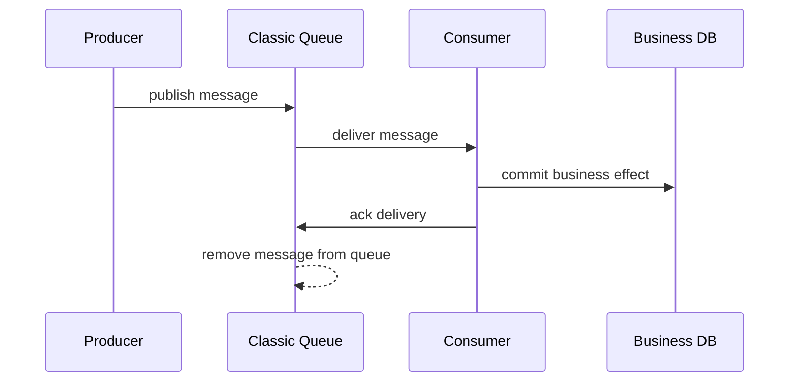
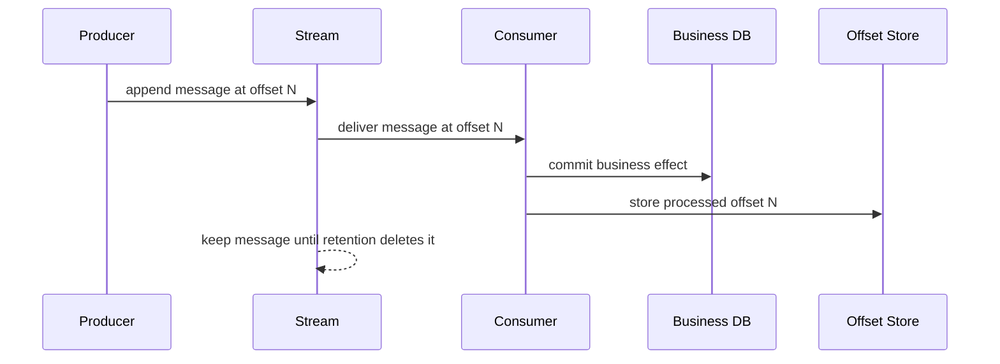
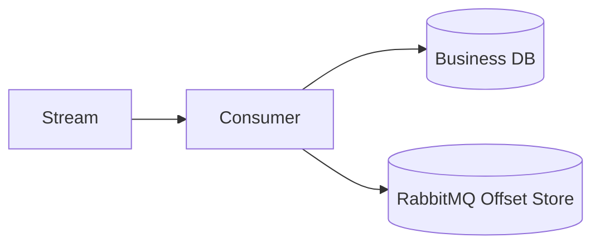
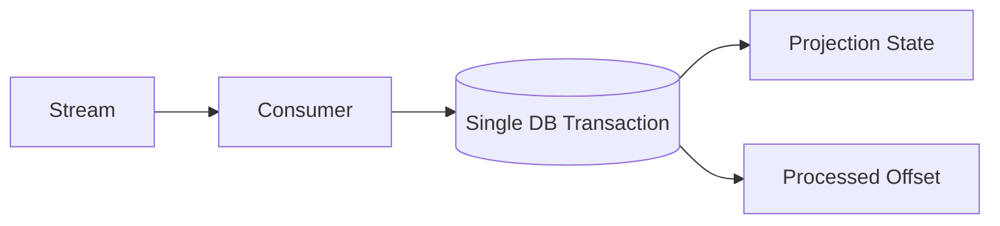
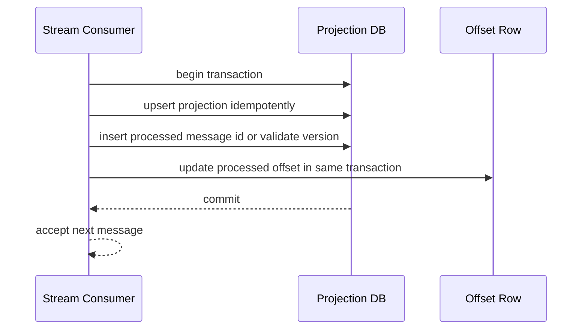
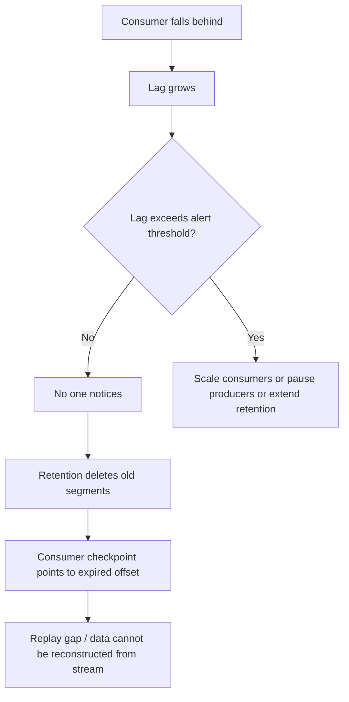
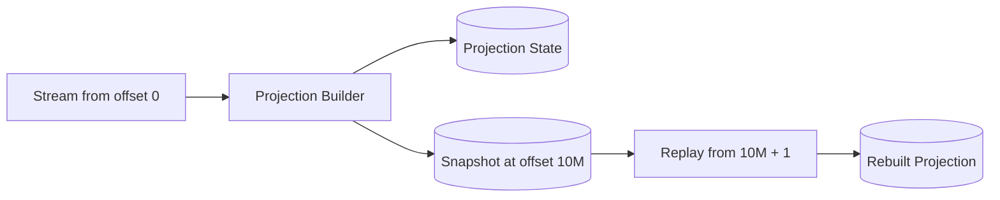
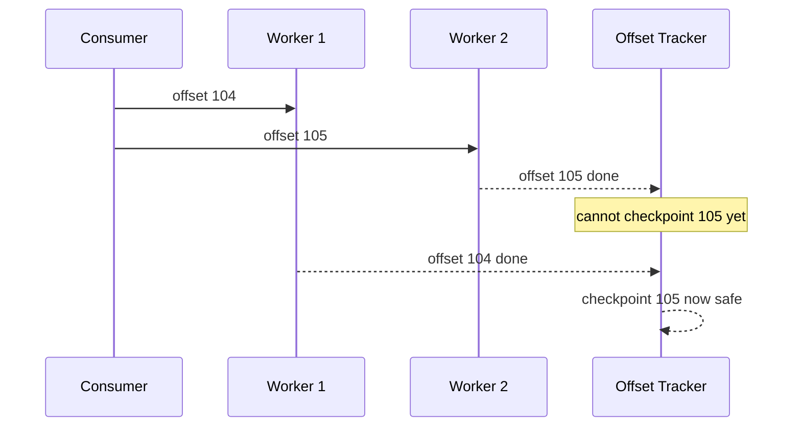
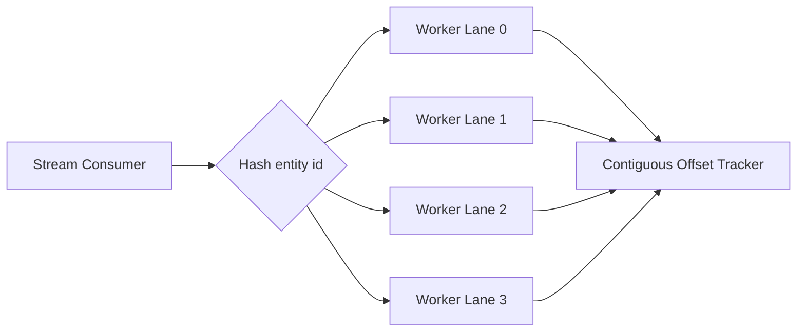

# Part 021 — Stream Offsets, Replay, Retention, and Consumer Progress

RabbitMQ Streams change the correctness model from **acknowledge-and-remove** to **append-and-track-progress**.

A classic queue asks:

> Has this delivery been acknowledged so the broker can remove it from the queue?

A stream asks:

> Which offset has this consumer safely processed, and can it resume from the next offset after restart?

That difference is small in syntax and large in architecture. With streams, messages are not consumed destructively. They remain available until retention removes them. The consumer owns its position. That position can be stored by RabbitMQ, by the application, or by both under a deliberate contract.

This part focuses on how to reason about offsets like a production engineer: not as an API detail, but as the durable boundary between replay, recovery, duplicate processing, and rebuildable state.

---

## 1. Kaufman Deconstruction

To master offsets and replay, decompose the skill into nine capabilities:

1. **Offset mental model** — an offset is a position in an append-only stream, not a delivery tag.
2. **Start-position selection** — choose `first`, `last`, `next`, `offset`, or timestamp-based start deliberately.
3. **Consumer identity** — understand why a named consumer can resume and an anonymous one usually cannot.
4. **Tracking strategy** — choose automatic server-side, manual server-side, or external checkpointing.
5. **Business commit coupling** — store progress only after the business effect is safe.
6. **Replay discipline** — replay without corrupting derived state or double-applying side effects.
7. **Retention reasoning** — ensure the stream keeps data long enough for recovery and backfill.
8. **Lag interpretation** — distinguish healthy lag, stale consumers, blocked consumers, and retention risk.
9. **Failure modelling** — reason through crash windows around processing, database commit, and offset store.

The standard for this part:

> A stream consumer is production-ready only when a restart, replay, or retention event cannot silently corrupt business state.

---

## 2. Queue Ack vs Stream Offset

The easiest way to avoid wrong assumptions is to compare the two lifecycles.



Classic queue consumption is destructive after ack. The queue is a work distribution structure.



Stream consumption is non-destructive. The stream is a durable log. Consumer progress is separate from message existence.

This separation is powerful because it enables replay. It is dangerous because replay makes duplicate processing normal.

---

## 3. Offset Is Not Ack

An AMQP consumer acknowledgement answers:

> Can the broker remove this delivery from the queue?

A stream offset answers:

> From which position should this consumer continue next time?

These are different invariants.

| Concept | Classic Queue | RabbitMQ Stream |
|---|---:|---:|
| Message removed after processing | Yes, after ack | No, retained by policy |
| Consumer progress | Broker queue state | Offset per consumer/application |
| Replay old messages | Not naturally | Native behavior |
| Multiple independent readers | Requires separate queues | Natural |
| Duplicate processing | Possible after redelivery | Expected under replay/restart |
| Main correctness risk | Ack before commit | Store offset before commit |

The dangerous stream bug is storing an offset too early.

Bad sequence:

```mermaid
sequenceDiagram
    participant C as Consumer
    participant O as Offset Store
    participant DB as Business DB

    C->>O: store offset 500
    C->>DB: write business effect
    DB--xC: commit fails
    Note over C,O: restart resumes from 501; offset 500 is skipped
```

Correct sequence:

```mermaid
sequenceDiagram
    participant C as Consumer
    participant DB as Business DB
    participant O as Offset Store

    C->>DB: write business effect idempotently
    DB-->>C: commit success
    C->>O: store offset 500
    Note over C,O: restart resumes from 501; duplicate is possible, loss is avoided
```

The invariant is simple:

> Business effect first. Offset progress second.

This creates possible duplicates, but avoids silent loss.

---

## 4. Offset Specification as a Product Decision

When a consumer starts, it needs a start position. This is not just a technical parameter. It determines product behavior.

Typical start positions:

| Start mode | Meaning | Common use |
|---|---|---|
| First | Start from earliest retained message | full rebuild, audit replay, new projection |
| Last | Start near end of stream | tail-only monitoring |
| Next | Start from new messages after subscription | real-time-only services |
| Offset N | Start from specific known offset | recovery, reprocessing, test reproduction |
| Timestamp | Start near messages from a point in time | incident replay, forensic reconstruction |

Do not choose start mode casually.

A new projection service should usually start from the earliest retained data or a known snapshot offset. A notification-only service can start from `next` if missing old notifications is acceptable. A fraud model retraining pipeline may start from a timestamp. A compliance replay may need an exact offset range.

The design question is:

> If the service starts today for the first time, what historical truth should it see?

Answer that before writing the consumer builder.

---

## 5. Consumer Identity and Offset Ownership

A stream offset belongs to a logical consumer, not merely a JVM process.

A logical consumer is usually defined by:

- application name;
- projection name;
- processing version;
- environment;
- tenant or region if isolated;
- stream or super stream name.

Examples:

```text
order-risk-projection.v1.prod
invoice-audit-writer.v3.prod.apac
customer-search-indexer.v2.staging
```

A stable consumer name lets the application resume progress after restart. A different name is a different reader and may start from another position.

Avoid names that include pod id, hostname, deployment timestamp, or random suffix unless the consumer is intentionally ephemeral.

Bad:

```text
risk-consumer-pod-7f8c9f6c8b-2krmg
```

Good:

```text
risk-projection.v2.prod
```

If the processing code changes in a non-compatible way, use a new logical consumer name or explicitly reset offset. Do not silently reuse the old offset for a different projection semantic.

---

## 6. Offset Tracking Strategies

There are three useful strategies.

### 6.1 Automatic Server-Side Tracking

The client stores offsets automatically based on its tracking settings.

Use when:

- processing is simple;
- duplicate processing is acceptable;
- the handler does not update critical business state;
- the offset does not need to be committed atomically with external state;
- losing a small amount of progress and replaying is acceptable.

Risk:

- automatic tracking can store progress without understanding your database transaction;
- if your handler has multi-step external side effects, automatic tracking may not match business correctness.

Automatic tracking is convenient, not magical.

### 6.2 Manual Server-Side Tracking

The application calls offset-store behavior explicitly after safe processing.

Use when:

- business effect must complete first;
- you want RabbitMQ to store progress;
- you can tolerate the offset store being separate from your database commit;
- duplicate processing is handled by idempotency.

Manual tracking gives better control than automatic tracking.

### 6.3 External Offset Tracking

The application stores offset in its own database, often with the projection state.

Use when:

- offset and business state must be updated atomically;
- you are building projections/materialized views;
- replay correctness is critical;
- you need forensic metadata around processing;
- you want explicit offset migration/versioning.

External offset tracking is usually the most defensible approach for business-critical derived state.

---

## 7. The Offset-State Coupling Problem

The key design choice is where offset progress lives relative to business state.

### Option A — RabbitMQ Stores Offset, DB Stores Business State



Pros:

- simpler application schema;
- broker-native resume;
- good for many real-time processors.

Cons:

- DB commit and offset store are not atomic;
- crash between DB commit and offset store causes duplicate processing;
- crash after offset store but before full external effect can cause logical skip.

This requires idempotent handlers.

### Option B — DB Stores Business State and Offset Together



Pros:

- projection and offset have one atomic boundary;
- easy to prove rebuild correctness;
- offset can be audited with schema version and processor version.

Cons:

- more application responsibility;
- restart position must be computed from DB;
- super stream offsets require per-partition storage.

For critical projections, Option B is usually safer.

---

## 8. External Offset Table Design

For a single stream:

```sql
create table stream_consumer_checkpoint (
    consumer_name varchar(200) primary key,
    stream_name varchar(200) not null,
    processed_offset bigint not null,
    processor_version varchar(50) not null,
    updated_at timestamp not null,
    last_message_id varchar(200),
    last_correlation_id varchar(200)
);
```

For a super stream or partitioned stream, store per partition:

```sql
create table stream_partition_checkpoint (
    consumer_name varchar(200) not null,
    super_stream_name varchar(200),
    stream_name varchar(200) not null,
    partition_key varchar(200),
    processed_offset bigint not null,
    processor_version varchar(50) not null,
    updated_at timestamp not null,
    primary key (consumer_name, stream_name)
);
```

For idempotency and audit:

```sql
create table stream_processed_message (
    consumer_name varchar(200) not null,
    stream_name varchar(200) not null,
    message_id varchar(200) not null,
    offset_value bigint not null,
    processed_at timestamp not null,
    effect_hash varchar(128),
    primary key (consumer_name, message_id)
);
```

Do not rely only on offsets when producers can emit duplicate logical events. Offset tells you where a message lived in the stream. It does not prove the logical event was unique.

---

## 9. Transaction Boundary for Projection Consumers

A projection consumer should usually do this:



The checkpoint update belongs inside the same transaction as the projection update.

Java sketch:

```java
public final class ProjectionHandler {

    private final ProjectionRepository projectionRepository;
    private final CheckpointRepository checkpointRepository;
    private final TransactionTemplate tx;

    public void handle(StreamMessageEnvelope envelope) {
        tx.executeWithoutResult(status -> {
            Checkpoint checkpoint = checkpointRepository
                    .findForUpdate(envelope.consumerName(), envelope.streamName())
                    .orElseGet(() -> Checkpoint.initial(
                            envelope.consumerName(),
                            envelope.streamName()
                    ));

            if (envelope.offset() <= checkpoint.processedOffset()) {
                return; // replayed or duplicated offset already covered
            }

            projectionRepository.applyEventIdempotently(envelope);

            checkpointRepository.update(
                    envelope.consumerName(),
                    envelope.streamName(),
                    envelope.offset(),
                    envelope.messageId(),
                    envelope.correlationId()
            );
        });
    }
}
```

This example assumes one stream. For super streams, checkpoint by physical stream/partition.

The key point is not the exact framework. The key point is the invariant:

> The projection and its consumed offset advance together.

---

## 10. Replay Modes

Replay is not one thing. It has several modes.

### 10.1 Recovery Replay

A consumer crashed and resumes from the last safe checkpoint.

Goal:

- continue processing;
- maybe reprocess a small number of messages;
- avoid skipping committed effects.

Design:

- read checkpoint;
- start from checkpoint + 1;
- handler idempotent;
- monitor duplicate count.

### 10.2 Rebuild Replay

A projection is rebuilt from scratch.

Goal:

- reconstruct state from retained events;
- validate deterministic projection logic;
- produce a clean materialized view.

Design:

- create new consumer name or isolated job id;
- start from first retained offset or snapshot offset;
- write to shadow table/index;
- compare with current state;
- swap after validation.

### 10.3 Incident Replay

A production bug affected a time window or offset range.

Goal:

- repair affected state;
- limit blast radius;
- preserve audit trail.

Design:

- identify offset/time range;
- run repair consumer with bounded replay;
- use idempotent correction operations;
- record replay job metadata.

### 10.4 Analytics Replay

A downstream analytics model wants historical data.

Goal:

- scan retained stream data;
- load warehouse/lake/index;
- tolerate eventual consistency.

Design:

- separate consumer name;
- batch processing;
- checkpoint frequently enough;
- isolate from real-time consumers.

---

## 11. Replay-Safe Handler Design

A replay-safe handler must treat old messages as valid input.

Bad handler:

```java
public void handle(OrderPaid event) {
    paymentGateway.capture(event.paymentIntentId()); // external irreversible side effect
    emailClient.sendReceipt(event.customerEmail());  // duplicate external side effect
    orderRepository.markPaid(event.orderId());
}
```

This handler is not replay-safe because external effects are triggered directly.

Better pattern:

```java
public void handle(OrderPaid event) {
    tx.executeWithoutResult(status -> {
        Order order = orderRepository.findForUpdate(event.orderId());

        if (order.hasProcessedEvent(event.eventId())) {
            return;
        }

        order.markPaid(event.paidAt());
        order.recordProcessedEvent(event.eventId());

        outboxRepository.enqueueOnce(
                "receipt-email",
                event.eventId(),
                new ReceiptEmailCommand(event.orderId(), event.customerEmail())
        );
    });
}
```

Then another outbox relay sends the email with its own idempotency key.

Replay-safe does not mean side-effect-free. It means side effects are guarded by durable idempotency.

---

## 12. Retention as a Recovery Contract

Retention decides how long messages remain available.

A stream with replay expectations must keep data long enough for:

- longest expected consumer outage;
- longest expected deployment rollback;
- maximum incident detection time;
- maximum replay job duration;
- audit/compliance requirement;
- downstream onboarding/backfill;
- disaster recovery procedure.

A weak retention contract looks like this:

```text
retention = 24 hours
incident detection = 3 days
expected repair replay = impossible
```

A defensible contract looks like this:

```text
retention = 30 days
SLO: consumer lag alert at 2 hours
retention-risk alert at 25 days behind
replay jobs can rebuild 7-day windows
monthly archive exports for compliance
```

The practical rule:

> Retention must be longer than the time it takes you to notice, decide, fix, and replay.

---

## 13. Retention and Data Loss Risk

With queues, data loss is often about acking too early or losing broker data. With streams, a common loss mode is **retention expiry before a consumer catches up**.



This means stream operations need a new alert:

> Time until oldest required message expires.

Do not alert only on consumer down. Alert on retention danger.

---

## 14. Consumer Progress and Lag

For streams, lag is not just queue depth.

Useful lag dimensions:

| Metric | Meaning | Why it matters |
|---|---|---|
| offset lag | tail offset - consumer offset | how far behind the consumer is |
| time lag | now - timestamp of last processed message | user/business delay |
| processing latency | handler completion time | downstream bottleneck |
| checkpoint age | now - last checkpoint update | stuck checkpoint detection |
| retention margin | oldest required offset vs retention boundary | data loss risk |
| replay rate | messages/sec during replay | recovery capacity |

A consumer can be receiving messages but not checkpointing. A consumer can checkpoint but fail to update business state if the ordering is wrong. A consumer can process quickly but be far behind after a long outage.

Lag must be interpreted with topology and business SLA.

---

## 15. Offset Lag Calculation Model

A simple mental model:

```text
lag_messages = stream_tail_offset - consumer_processed_offset
catchup_seconds = lag_messages / sustainable_processing_rate_per_second
retention_margin_seconds = retention_remaining_for_consumer_offset
```

A consumer is healthy when:

```text
catchup_seconds < retention_margin_seconds
and time_lag < business_slo
and checkpoint_age < stuck_threshold
```

A consumer is in retention danger when:

```text
catchup_seconds >= retention_margin_seconds
```

At that point, adding consumers may help only if the stream/partition model supports parallelism. For a single ordered stream, one consumer may be the limit unless processing can be internally parallelized safely.

---

## 16. Poison Messages in Stream World

In classic queues, a poison message can be nacked, dead-lettered, or parked.

In streams, the message remains in the log. You cannot remove it for everyone without retention/deletion. A poison message is handled by consumer policy.

Options:

1. **Skip with audit** — record that offset/message id was skipped and why.
2. **Park side record** — copy the failed message metadata to a parking table/queue.
3. **Block projection** — stop the consumer until fixed if correctness requires strict ordering.
4. **Patch and replay** — deploy fix and reprocess from the failed offset.
5. **Transform-on-read** — compatibility adapter handles old/bad shape.

Decision matrix:

| Case | Recommended behavior |
|---|---|
| Bad event but non-critical projection | skip with audit and alert |
| Bad event in financial ledger | stop and require manual repair |
| Schema evolution issue | deploy adapter and replay |
| Transient downstream failure | retry/backoff without advancing offset |
| Permanent malformed payload | park metadata and advance only under approved policy |

Never silently advance past poison data in a regulated/business-critical stream.

---

## 17. Offset Skip Ledger

If you skip, make it explicit.

```sql
create table stream_skipped_message (
    id bigserial primary key,
    consumer_name varchar(200) not null,
    stream_name varchar(200) not null,
    offset_value bigint not null,
    message_id varchar(200),
    reason_code varchar(100) not null,
    reason_detail text,
    approved_by varchar(200),
    skipped_at timestamp not null,
    unique (consumer_name, stream_name, offset_value)
);
```

A skip should be a governance event, not a log line.

For regulated systems, include:

- original message id;
- offset;
- schema version;
- handler version;
- exception fingerprint;
- approval reference;
- compensating action id if any.

---

## 18. Timestamp Replay Caveats

Timestamp-based replay is useful but should not be treated as a perfect business-time query.

Potential caveats:

- broker append time may differ from event occurrence time;
- producer clocks may drift;
- late events may be appended after their business timestamp;
- timestamp lookup may start near, not exactly at, the desired business event;
- retention can remove older segments.

For forensic replay, prefer recording both:

- stream offset;
- business event time;
- broker/producer timestamp;
- correlation id.

When investigating incidents, exact offset ranges are usually more reliable than pure business timestamps.

---

## 19. Snapshot + Replay Pattern

Long streams can make full rebuilds expensive. Use snapshots.



Snapshot record:

```sql
create table projection_snapshot (
    projection_name varchar(200) primary key,
    stream_name varchar(200) not null,
    snapshot_offset bigint not null,
    snapshot_version varchar(50) not null,
    created_at timestamp not null,
    payload_location text not null,
    payload_hash varchar(128) not null
);
```

Snapshot rules:

- snapshot must declare the exact offset it covers;
- replay must start from `snapshot_offset + 1`;
- snapshot format must be versioned;
- snapshot restore must be testable;
- projection logic changes may invalidate old snapshots.

---

## 20. Java External Checkpoint Adapter

A clean application boundary:

```java
public interface StreamCheckpointStore {

    Optional<StreamCheckpoint> find(String consumerName, String streamName);

    void advanceInTransaction(
            String consumerName,
            String streamName,
            long processedOffset,
            String messageId,
            String correlationId
    );
}

public record StreamCheckpoint(
        String consumerName,
        String streamName,
        long processedOffset,
        String processorVersion
) {}
```

Consumer start logic:

```java
public OffsetSpecification startOffset(
        String consumerName,
        String streamName,
        StreamCheckpointStore checkpoints
) {
    return checkpoints.find(consumerName, streamName)
            .map(cp -> OffsetSpecification.offset(cp.processedOffset() + 1))
            .orElseGet(OffsetSpecification::first);
}
```

This makes restart semantics obvious:

- checkpoint exists → resume after last safe offset;
- no checkpoint → start from first retained message;
- projection version changed → use a new consumer name or reset intentionally.

---

## 21. Manual Server-Side Offset Store Pattern

When using RabbitMQ's server-side store manually, keep the same ordering discipline.

Conceptual flow:

```java
Consumer consumer = environment.consumerBuilder()
        .stream("order-events")
        .name("order-search-projection.v1.prod")
        .manualTrackingStrategy()
        .builder()
        .messageHandler((context, message) -> {
            StreamMessageEnvelope envelope = decode(context, message);

            projectionService.applyIdempotently(envelope);

            // Store only after successful business processing.
            context.storeOffset();
        })
        .build();
```

The exact builder shape may vary by client version, but the invariant should not vary:

> Call offset storage only after safe processing.

If processing spans multiple systems, store offset after the durable idempotency marker, not after an in-memory success flag.

---

## 22. Batch Checkpointing

Storing offset after every message is simple but can be expensive. Batch checkpointing reduces overhead.

Batching checkpoint by count:

```java
public final class BatchCheckpointPolicy {
    private final int batchSize;
    private long lastStoredOffset = -1;
    private int processedSinceStore = 0;

    public boolean shouldStore(long processedOffset) {
        processedSinceStore++;
        return processedSinceStore >= batchSize && processedOffset > lastStoredOffset;
    }

    public void markStored(long offset) {
        this.lastStoredOffset = offset;
        this.processedSinceStore = 0;
    }
}
```

Batching checkpoint by time:

```java
public final class TimeCheckpointPolicy {
    private final Duration interval;
    private Instant lastStore = Instant.EPOCH;

    public boolean shouldStore(Instant now) {
        return Duration.between(lastStore, now).compareTo(interval) >= 0;
    }

    public void markStored(Instant now) {
        this.lastStore = now;
    }
}
```

Trade-off:

| Batch checkpoint size | Pros | Cons |
|---:|---|---|
| 1 | minimal duplicate replay | high checkpoint overhead |
| 100 | balanced | up to 100 messages replayed after crash |
| 10,000 | low overhead | large duplicate replay window |

Choose based on replay tolerance and processing cost.

---

## 23. Bounded Replay Window

A checkpoint batch creates a duplicate replay window.

Example:

```text
checkpoint stored at offset 10,000
consumer processes offsets 10,001..10,500
process crashes before next checkpoint
restart resumes at 10,001
500 messages may be reprocessed
```

That is acceptable only if the handler is idempotent and the duplicate replay cost is acceptable.

A top-tier design makes this explicit:

```text
max_checkpoint_batch = 500
max_duplicate_replay_time = 500 / handler_rate
idempotency_window >= max_duplicate_replay_time + safety margin
```

Do not tune checkpoint intervals only for throughput. Tune them for correctness and recovery cost.

---

## 24. Multi-Threaded Processing and Offset Gaps

Offsets are ordered. Multi-threaded processing is not necessarily ordered.

If messages are processed concurrently, offset 105 may finish before 104. You cannot safely checkpoint 105 until all previous offsets up to 105 are also complete.



Use a contiguous offset tracker.

```java
public final class ContiguousOffsetTracker {
    private long highestCommittedContiguous;
    private final NavigableSet<Long> completedOutOfOrder = new TreeSet<>();

    public ContiguousOffsetTracker(long initialOffset) {
        this.highestCommittedContiguous = initialOffset;
    }

    public synchronized long markCompleted(long offset) {
        if (offset == highestCommittedContiguous + 1) {
            highestCommittedContiguous = offset;
            while (completedOutOfOrder.remove(highestCommittedContiguous + 1)) {
                highestCommittedContiguous++;
            }
        } else if (offset > highestCommittedContiguous + 1) {
            completedOutOfOrder.add(offset);
        }
        return highestCommittedContiguous;
    }
}
```

This is essential when internal parallelism is used on a single stream.

---

## 25. Per-Entity Parallelism

If events for the same entity must be processed in order, parallelize by entity key, not randomly.



Caveat: even if per-entity order is preserved inside lanes, global offset checkpoint still needs contiguous completion. One slow entity can block checkpoint advancement.

This is why partitioned streams or super streams often become necessary: they move the ordered unit from one global stream to several independently checkpointable partitions.

---

## 26. Replay Isolation

Never run an unbounded replay job against the same mutable target as real-time processing unless you understand the interleaving.

Safer approaches:

1. **Shadow projection** — replay into new table/index, compare, then swap.
2. **Paused real-time consumer** — stop live consumer, replay repair, restart.
3. **Versioned projection** — write v2 state alongside v1.
4. **Correction commands** — replay produces correction messages rather than direct mutations.

Dangerous approach:

```text
real-time consumer and replay consumer both update same rows without idempotency/version checks
```

This causes lost updates, stale overwrites, and irreproducible bugs.

---

## 27. Replay Job Metadata

Every replay job should be auditable.

```sql
create table stream_replay_job (
    job_id uuid primary key,
    stream_name varchar(200) not null,
    consumer_name varchar(200) not null,
    from_offset bigint,
    to_offset bigint,
    from_timestamp timestamp,
    to_timestamp timestamp,
    reason text not null,
    requested_by varchar(200) not null,
    started_at timestamp not null,
    completed_at timestamp,
    status varchar(50) not null,
    processed_count bigint default 0,
    failed_count bigint default 0
);
```

This turns replay from an ad-hoc script into an operationally safe workflow.

---

## 28. Failure Matrix

| Failure point | What happened | Safe outcome | Required design |
|---|---|---|---|
| Crash before processing | offset not stored | message replayed | start from last checkpoint + 1 |
| Crash after DB commit before offset store | business effect committed, offset old | duplicate replay | idempotent handler |
| Crash after offset store before DB commit | offset advanced, business effect missing | data loss | never store offset before commit |
| Handler throws transient error | no offset advance | retry/replay | backoff and no checkpoint |
| Handler sees poison message | cannot process | stop/skip/park | poison policy |
| Consumer lag exceeds retention | old messages expire | unrecoverable gap | retention margin alerts |
| Replay job races live consumer | duplicate/conflicting writes | state corruption | replay isolation |
| Schema adapter missing | old payload fails | blocked projection | compatibility layer |

The most important row is the third one. Offset before commit is the stream equivalent of ack-before-commit.

---

## 29. Monitoring Dashboard

A production dashboard should include:

- stream tail offset;
- consumer processed offset;
- offset lag by consumer;
- time lag by consumer;
- checkpoint age;
- handler success/failure rate;
- duplicate/replay count;
- skipped message count;
- poison message count;
- retention margin;
- replay job status;
- processing throughput;
- p95/p99 handler latency;
- external dependency latency;
- consumer restart count.

Alert examples:

```text
consumer_time_lag > 5 minutes for 10 minutes
checkpoint_age > 2x expected checkpoint interval
retention_margin < 72 hours
skipped_message_count > 0
poison_message_count > 0
replay_job_failed_count > 0
```

Use alerts to catch risk before data expires.

---

## 30. Runbook: Consumer Cannot Resume

Symptoms:

- consumer starts and fails immediately;
- stored offset is missing;
- stored offset points to expired data;
- projection state and checkpoint disagree.

Checklist:

1. Identify consumer name and stream name.
2. Check latest checkpoint.
3. Check whether checkpoint offset is retained.
4. Check projection version and deployment version.
5. Check whether consumer name changed accidentally.
6. Check retention configuration.
7. Decide recovery path:
   - resume from available offset;
   - rebuild from snapshot;
   - rebuild from archive;
   - manual correction;
   - declare unrecoverable gap.

Never reset offset forward merely to make the service green. That can hide data loss.

---

## 31. Runbook: Replay Corrupts State

Symptoms:

- counters too high;
- duplicate emails/side effects;
- projection rows oscillate;
- old events overwrite new state.

Checklist:

1. Stop replay job.
2. Identify replay range.
3. Identify target table/index.
4. Check idempotency key logic.
5. Check event version ordering.
6. Check external side effects.
7. Restore from snapshot if needed.
8. Patch handler.
9. Replay into shadow state first.
10. Compare before swap.

The most common root cause is assuming event handlers are naturally replay-safe.

---

## 32. Design Review Questions

Ask these before approving a stream consumer:

1. What is the logical consumer name?
2. Where is offset stored?
3. What is the start position when no offset exists?
4. Is business state committed before offset progress?
5. What duplicate window exists after crash?
6. Is the handler idempotent?
7. Are external side effects guarded?
8. Can the projection be rebuilt?
9. What retention margin is required?
10. What happens if the consumer is down for 7 days?
11. How are poison messages handled?
12. How is replay audited?
13. How do we detect offset retention danger?
14. How do we test restart from checkpoint?
15. How do we intentionally reset/reprocess?

If these questions cannot be answered, the consumer is not production-ready.

---

## 33. Practice Drill

Build a small stream projection:

- stream: `order-events`;
- events: `OrderCreated`, `OrderPaid`, `OrderCancelled`;
- projection: `order_summary` table;
- checkpoint table: `stream_partition_checkpoint`;
- idempotency table: `stream_processed_message`.

Test cases:

1. Start from first offset and build projection.
2. Stop after 100 messages and restart.
3. Crash after DB commit before offset update.
4. Replay same 1,000 messages twice.
5. Inject malformed payload at offset N.
6. Skip malformed payload with audit record.
7. Rebuild into shadow table.
8. Compare shadow projection with live projection.
9. Reduce retention in test and verify retention-risk alert logic.
10. Measure catch-up rate after 100k-message backlog.

The goal is not to memorize API methods. The goal is to prove recovery behavior.

---

## 34. Summary

RabbitMQ Streams make replay and independent consumption natural, but they shift correctness responsibility to offset management.

The core invariants:

- offset is progress, not acknowledgement;
- business effect must be safe before offset advances;
- replay means duplicates are normal;
- retention is part of the recovery contract;
- poison messages require explicit policy;
- checkpoints must match projection semantics;
- consumer names are durable identities;
- multi-threading requires contiguous offset tracking;
- critical projections should store state and checkpoint together when possible.

A strong stream consumer is not one that reads fast. It is one that can restart, replay, rebuild, and explain its progress without corrupting state.

---

## 35. References

- RabbitMQ Stream Java tutorial — offset tracking: `https://www.rabbitmq.com/tutorials/tutorial-two-java-stream`
- RabbitMQ Streams and Super Streams documentation: `https://www.rabbitmq.com/docs/streams`
- RabbitMQ Stream Java Client documentation: `https://rabbitmq.github.io/rabbitmq-stream-java-client/stable/htmlsingle/`
- RabbitMQ Streams offset tracking blog: `https://www.rabbitmq.com/blog/2021/09/13/rabbitmq-streams-offset-tracking`
