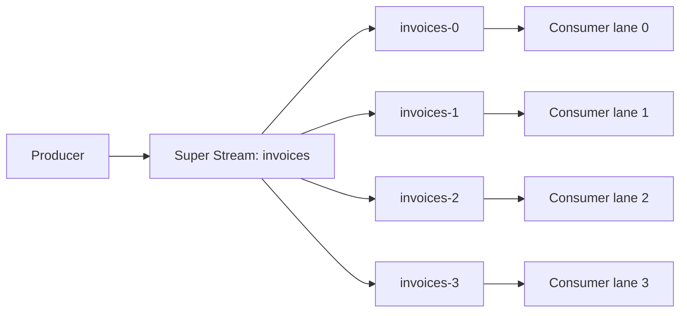
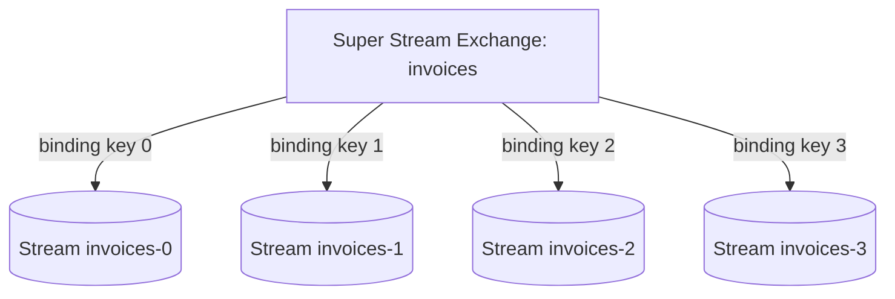
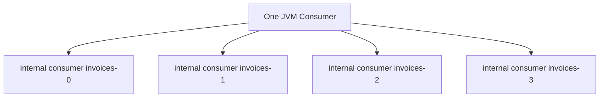
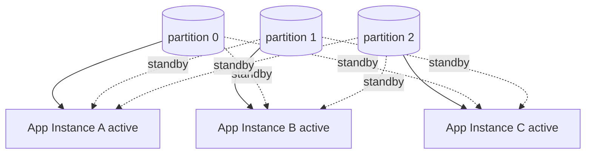
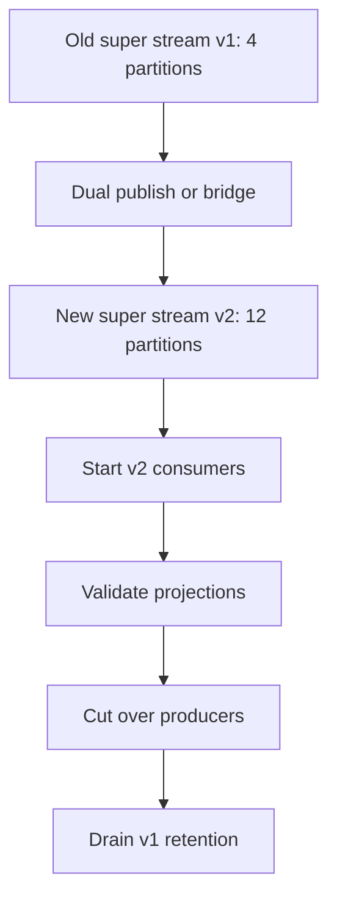
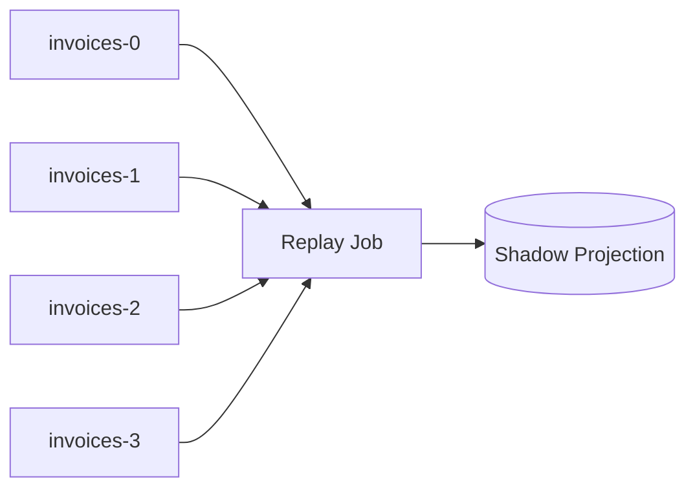
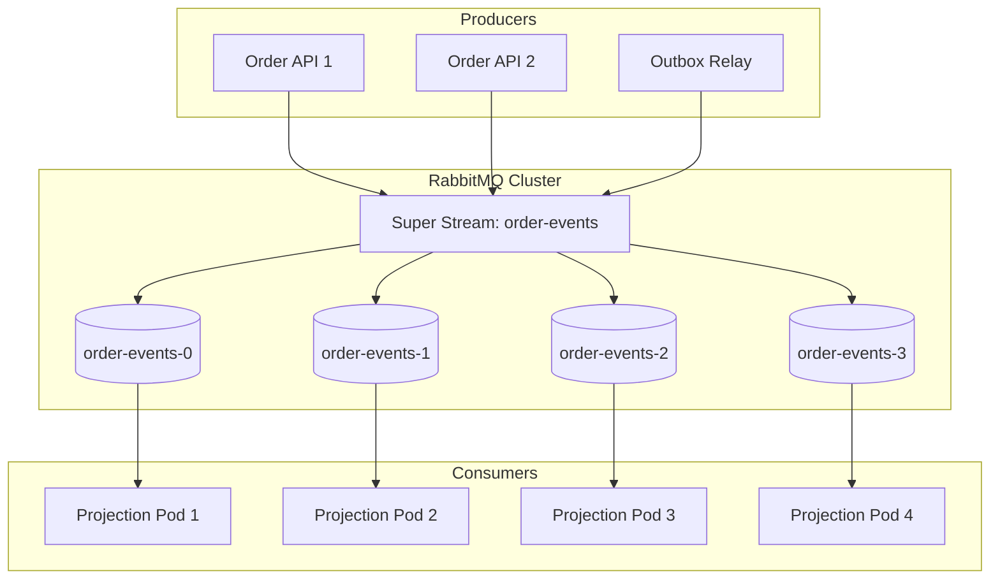

# Part 022 — Super Streams: Partitioned Streams, Scaling, and Key-Based Routing

A single stream is an ordered append-only log. That ordering is useful, but it also creates a scaling boundary.

If one stream has one effective ordered lane, then high throughput, high fan-out, or high replay demand may eventually require partitioning. RabbitMQ Super Streams provide that partitioned-stream model inside RabbitMQ.

A super stream is a logical stream made of multiple physical streams. Producers publish to the logical name. The client routes each message to one or more physical partitions. Consumers consume from the logical name, while the client handles partition lookup and composite consumption.

This part explains how to design super streams deliberately: partition key, routing strategy, ordering scope, consumer scaling, offset tracking, hot partitions, and failure behavior.

---

## 1. Kaufman Deconstruction

To master super streams, decompose the skill into ten capabilities:

1. **Logical vs physical stream model** — know what the super stream hides and what it does not.
2. **Partitioning reason** — scale throughput, isolate ordering domains, or align business shards.
3. **Routing key design** — choose stable keys that preserve required ordering and distribute load.
4. **Producer routing strategy** — hash, binding-key, or custom routing.
5. **Consumer model** — understand composite consumers and per-partition consumption.
6. **Single active consumer** — scale processing across instances while preserving per-partition ordering.
7. **Offset tracking** — reason per physical stream/partition, not just logical stream.
8. **Hot partition handling** — detect and mitigate skew.
9. **Partition count lifecycle** — choose, evolve, and migrate partition counts safely.
10. **Operational proof** — benchmark, monitor lag per partition, and test failover/rebalance.

The standard:

> A super stream design is correct only if the partition key matches the ordering requirement and the operational model can handle skew.

---

## 2. Why Super Streams Exist

A single stream can be too narrow when:

- write throughput exceeds what one stream can comfortably absorb;
- read throughput needs to be distributed across multiple service instances;
- one logical event feed has many independent ordering domains;
- replay jobs need parallel scan capacity;
- consumer lag is dominated by one ordered lane;
- you need a Kafka-like partitioning mental model without leaving RabbitMQ.

But partitioning is not free. It changes the ordering contract.

Single stream:

```text
one stream = one ordered log
```

Super stream:

```text
one logical stream = many ordered partition logs
```

Ordering is preserved within a partition, not globally across all partitions.

---

## 3. Mental Model



The application thinks in terms of logical stream `invoices`. Operationally, the work happens across physical streams such as `invoices-0`, `invoices-1`, `invoices-2`, and `invoices-3`.

The partitioning invariant:

> All messages that must be processed in order must route to the same partition.

If two events can be processed independently, they may route to different partitions.

---

## 4. Super Stream Topology

RabbitMQ represents a super stream topology through a logical exchange and stream-backed queues/partitions connected by bindings. The Stream Java Client can discover the partitions and routing metadata.

Conceptual topology:



Two common creation models:

1. **Numeric partitions** — `invoices-0`, `invoices-1`, ...; routing usually uses hash/modulo.
2. **Named binding keys** — `invoices-amer`, `invoices-emea`, `invoices-apac`; routing has business meaning.

Numeric partitions are good for uniform scale. Named partitions are good for business isolation.

---

## 5. Creating a Super Stream

Client-library style:

```java
environment.streamCreator()
        .name("invoices")
        .superStream()
        .partitions(5)
        .creator()
        .create();
```

Binding-key style:

```java
environment.streamCreator()
        .name("invoices")
        .superStream()
        .bindingKeys("amer", "emea", "apac")
        .creator()
        .create();
```

CLI style:

```bash
rabbitmq-streams add_super_stream invoices --partitions 5
```

Production guidance:

- avoid creating topology from every app instance at startup;
- manage topology as infrastructure or deployment-owned configuration;
- version super stream topology decisions through architecture records;
- protect production topology with permissions;
- avoid accidental partition-count drift between environments.

---

## 6. Partition Key Design

Partition key is the most important design decision.

Good keys:

- `customerId` for customer-ordered processing;
- `accountId` for ledger/account event ordering;
- `orderId` for order lifecycle;
- `tenantId + entityId` when tenant isolation matters;
- `caseId` for enforcement/case workflow progression.

Weak keys:

- random UUID when ordering by entity matters;
- timestamp when load is time-skewed;
- region when one region dominates traffic;
- status when one status is extremely common;
- user-provided string without normalization.

Decision table:

| Requirement | Candidate key |
|---|---|
| Preserve all events for one order | `orderId` |
| Preserve account ledger sequence | `accountId` |
| Scale analytics with no entity order | stable hash of event id |
| Isolate regional operations | `region` or `region + entityId` |
| Preserve case workflow order | `caseId` |
| Avoid tenant noisy-neighbor | `tenantId + hash(entityId)` |

The partition key is a correctness contract, not a performance knob only.

---

## 7. Ordering Scope

Super streams do not provide global ordering across all partitions.

Example:

```text
Partition 0: A1, A2, A3
Partition 1: B1, B2, B3
```

A consumer may observe:

```text
A1, B1, B2, A2, A3, B3
```

This is valid. What matters is whether `A1 -> A2 -> A3` order is preserved for the entity that requires it.

If your business requires total global order, a super stream is the wrong model unless you add a separate sequencing layer.

Most real systems do not require total order. They require scoped order:

- per account;
- per order;
- per customer;
- per workflow instance;
- per case;
- per aggregate root.

Design for scoped order.

---

## 8. Producer Routing Strategies

### 8.1 Hash Routing

Hash routing maps a routing key to exactly one partition.

```java
Producer producer = environment.producerBuilder()
        .superStream("invoices")
        .routing(message -> message.getProperties().getMessageIdAsString())
        .producerBuilder()
        .build();
```

Better domain routing:

```java
Producer producer = environment.producerBuilder()
        .superStream("order-events")
        .routing(message -> message.getApplicationProperties()
                .get("orderId")
                .toString())
        .producerBuilder()
        .build();
```

Guidance:

- use a stable domain key;
- keep routing deterministic across producer versions;
- avoid language-specific hashes if multiple languages produce to the same super stream;
- include routing key in message metadata for audit/debugging.

### 8.2 Binding-Key Routing

Binding-key routing resolves destinations through topology bindings.

```java
Producer producer = environment.producerBuilder()
        .superStream("invoices")
        .routing(message -> message.getApplicationProperties()
                .get("region")
                .toString())
        .key()
        .producerBuilder()
        .build();
```

Use this when partitions have business meaning:

- `amer`;
- `emea`;
- `apac`;
- `retail`;
- `enterprise`;
- `tier1`;
- `tier2`.

Risk: business-key partitions can become skewed.

### 8.3 Custom Routing Strategy

Custom routing should be rare and justified.

Possible use cases:

- dual-write to two partitions for transition;
- route based on external metadata;
- canary partition;
- manual hot-key mitigation;
- filtering to no partition under strict policy.

Custom routing increases cognitive load. Document it heavily.

---

## 9. Routing Key Governance

Define routing keys as public contract fields.

Message envelope example:

```json
{
  "messageId": "evt-01J...",
  "eventType": "OrderPaid",
  "eventVersion": 3,
  "aggregateType": "Order",
  "aggregateId": "ord-123",
  "partitionKey": "ord-123",
  "correlationId": "corr-456",
  "occurredAt": "2026-07-01T10:15:30Z"
}
```

Governance rules:

- `partitionKey` is required for partitioned streams;
- key derivation must be deterministic;
- key meaning must not change without migration;
- producers must not choose random keys for ordered event types;
- routing key must be observable in logs/metrics;
- key cardinality distribution must be monitored.

Changing the partition key can reorder future events relative to past events. Treat it as a breaking change.

---

## 10. Consumer Model

A super stream consumer is a composite consumer. The client discovers physical partitions and consumes from them.

Basic style:

```java
Consumer consumer = environment.consumerBuilder()
        .superStream("invoices")
        .messageHandler((context, message) -> {
            process(message);
        })
        .build();
```

With one service instance and four partitions, the process may consume from all four partitions.



If multiple service instances use a plain super stream consumer without coordination, each may receive the same data. For scaled processing where each partition should have one active processing owner, use single active consumer support.

---

## 11. Single Active Consumer with Super Streams

Single active consumer lets multiple application instances coordinate so that only one consumer instance is active for a given partition at a time.

```java
Consumer consumer = environment.consumerBuilder()
        .superStream("invoices")
        .name("invoice-projection.v1.prod")
        .singleActiveConsumer()
        .messageHandler((context, message) -> {
            process(message);
        })
        .build();
```

Mental model with three app instances and three partitions:



The important contract:

> Single active consumer helps preserve per-partition order while allowing processing to scale across instances.

It does not create global ordering across partitions.

---

## 12. Offset Tracking with Super Streams

A super stream is logical. Offsets are physical.

Each partition stream has its own offset sequence. Therefore, a correct checkpoint model is per physical stream.

Bad checkpoint:

```text
consumer_name = invoice-projection.v1
super_stream = invoices
processed_offset = 100000
```

This is ambiguous because offset `100000` in `invoices-0` is not the same as offset `100000` in `invoices-1`.

Good checkpoint:

```text
consumer_name = invoice-projection.v1
stream_name = invoices-0
processed_offset = 100000

consumer_name = invoice-projection.v1
stream_name = invoices-1
processed_offset = 83721

consumer_name = invoice-projection.v1
stream_name = invoices-2
processed_offset = 145902
```

External checkpoint table:

```sql
create table super_stream_checkpoint (
    consumer_name varchar(200) not null,
    super_stream_name varchar(200) not null,
    stream_name varchar(200) not null,
    processed_offset bigint not null,
    updated_at timestamp not null,
    primary key (consumer_name, stream_name)
);
```

For manual tracking, store the offset from the context/message for the physical stream being processed.

---

## 13. Super Stream Processing Architecture

A robust Java processing boundary:

```java
public final class SuperStreamEventHandler {

    private final PartitionCheckpointStore checkpoints;
    private final TransactionTemplate tx;
    private final ProjectionRepository projections;

    public void handle(StreamPartitionEnvelope envelope) {
        tx.executeWithoutResult(status -> {
            PartitionCheckpoint checkpoint = checkpoints
                    .findForUpdate(envelope.consumerName(), envelope.streamName())
                    .orElseGet(() -> PartitionCheckpoint.initial(
                            envelope.consumerName(),
                            envelope.superStreamName(),
                            envelope.streamName()
                    ));

            if (envelope.offset() <= checkpoint.processedOffset()) {
                return;
            }

            projections.applyIdempotently(envelope);

            checkpoints.advance(
                    envelope.consumerName(),
                    envelope.superStreamName(),
                    envelope.streamName(),
                    envelope.offset()
            );
        });
    }
}
```

Keep partition checkpoint inside the same transaction as the projection effect if correctness matters.

---

## 14. Scaling Model

The maximum useful consumer parallelism is bounded by partition count.

```text
useful_consumer_instances <= partition_count
```

More instances can provide standby capacity, but they cannot increase active partition processing beyond the number of partitions.

Example:

| Partitions | App instances | Active partition owners | Notes |
|---:|---:|---:|---|
| 3 | 1 | 3 inside one JVM | low HA, no process-level spread |
| 3 | 3 | 3 | balanced ideal case |
| 3 | 6 | 3 | three active, three standby/idle |
| 12 | 4 | 12 distributed across 4 apps | each app may own multiple partitions |
| 12 | 12 | 12 | one active owner per partition |

Adding app instances without enough partitions does not increase throughput.

---

## 15. Partition Count Sizing

Partition count is a long-lived decision. Too few partitions limits scale. Too many partitions increases overhead.

Consider:

- expected peak publish throughput;
- expected peak consume throughput;
- replay throughput target;
- number of consumer instances;
- ordering key cardinality;
- hot-key probability;
- broker node count;
- operational overhead;
- retention/storage footprint;
- future growth.

Starting heuristic:

```text
partitions = max(
  expected_consumer_parallelism,
  expected_replay_parallelism,
  broker_node_count * 2
)
```

Then benchmark. Do not cargo-cult partition counts from Kafka or another company.

---

## 16. Hot Partition Problem

A hot partition happens when routing keys are not evenly distributed.

Example:

```text
partition 0: 10,000 msg/s
partition 1: 500 msg/s
partition 2: 450 msg/s
partition 3: 520 msg/s
```

Symptoms:

- one partition has much higher lag;
- one consumer instance is saturated;
- global throughput appears capped by one partition;
- p99 processing latency dominated by hot key;
- retention risk only on one partition.

Detection metrics:

- publish rate per partition;
- consume rate per partition;
- offset lag per partition;
- processing latency per partition;
- top routing keys by volume;
- consumer CPU per partition owner.

Hot partitions are usually a data-model issue, not a broker issue.

---

## 17. Hot Key Mitigation

Mitigation options:

### 17.1 Choose a Better Key

If `tenantId` is too coarse, use:

```text
tenantId + ':' + entityId
```

This spreads a large tenant across many entity-level ordered lanes.

### 17.2 Split High-Volume Domains

Instead of one stream:

```text
all-events
```

Use separate super streams:

```text
order-events
payment-events
inventory-events
```

This improves isolation and reduces cross-domain skew.

### 17.3 Add Sub-Key Buckets

If strict per-tenant order is not required:

```text
tenantId + ':' + hash(entityId) % 16
```

But this weakens tenant-level ordering. Only do this if business ordering allows it.

### 17.4 Special-Case Heavy Keys

Route extremely heavy keys to dedicated partitions or dedicated super streams.

Risk: special routing logic becomes governance debt.

### 17.5 Increase Partition Count

Increasing partition count may help future keys, but it may not split an existing single hot key if the key still maps to one partition.

Partition count does not solve low-cardinality keys.

---

## 18. Partition Count Evolution

Changing partition count is not a trivial runtime setting. Hash routing can remap keys to different partitions when partition count changes.

If `hash(key) % 4` becomes `hash(key) % 8`, many keys move.

Consequences:

- ordering for a key may be split across old and new partitions;
- consumers may need dual-read logic;
- replay and checkpoint semantics become more complex;
- old partition data remains relevant until retention expires or migration completes.

Safer migration pattern:



Use versioned names:

```text
order-events-v1
order-events-v2
```

Avoid silently changing topology under the same logical name without a migration plan.

---

## 19. Producer Deduplication with Super Streams

A named super stream producer can use publishing ids for deduplication. The subtle point: publishing ids are interpreted across the logical producer sequence even though messages are routed to different partitions.

Design guidance:

- use stable producer names;
- persist publishing id if exactly-once-like producer recovery is required;
- keep routing deterministic after restart;
- do not change routing strategy while replaying unsent messages;
- include message id and partition key in the payload/envelope.

If a producer restart replays messages with the same publishing ids and same routing strategy, broker/client deduplication can filter already accepted messages. If routing changes, reasoning becomes much harder.

---

## 20. Producer Design Skeleton

```java
public final class SuperStreamPublisher implements AutoCloseable {

    private final Producer producer;
    private final Semaphore inFlight;

    public SuperStreamPublisher(Environment environment, int maxInFlight) {
        this.inFlight = new Semaphore(maxInFlight);
        this.producer = environment.producerBuilder()
                .superStream("order-events")
                .routing(this::partitionKey)
                .producerBuilder()
                .build();
    }

    public void publish(OrderEvent event) throws InterruptedException {
        inFlight.acquire();

        Message message = toMessage(event);

        producer.send(message, confirmationStatus -> {
            try {
                if (!confirmationStatus.isConfirmed()) {
                    // Record failure, retry via outbox relay, or mark publish attempt failed.
                    onPublishRejected(event, confirmationStatus);
                }
            } finally {
                inFlight.release();
            }
        });
    }

    private String partitionKey(Message message) {
        Object key = message.getApplicationProperties().get("partitionKey");
        if (key == null) {
            throw new IllegalArgumentException("partitionKey is required");
        }
        return key.toString();
    }

    private Message toMessage(OrderEvent event) {
        return producer.messageBuilder()
                .properties()
                    .messageId(event.messageId())
                    .correlationId(event.correlationId())
                .messageBuilder()
                .applicationProperties()
                    .entry("eventType", event.eventType())
                    .entry("eventVersion", event.eventVersion())
                    .entry("partitionKey", event.orderId())
                .messageBuilder()
                .addData(event.payloadBytes())
                .build();
    }

    @Override
    public void close() {
        producer.close();
    }
}
```

This skeleton enforces a required partition key and bounded in-flight publishes.

---

## 21. Consumer Rebalance and Inactive Partitions

With single active consumer, partition ownership can move when instances join, leave, or fail.

Rebalance implications:

- one instance may become inactive for a partition;
- another instance may become active;
- active instance must resume from the correct partition offset;
- manual offset tracking requires careful handling of active/inactive transitions;
- in-flight processing during ownership loss must not advance stale state incorrectly.

Design rule:

> A consumer should process and checkpoint only while it is the active owner of the partition.

If using external checkpointing, use a lease/fencing model when needed.

---

## 22. Fencing for External Checkpoints

In high-stakes projections, protect against split-brain or stale workers.

Checkpoint lease table:

```sql
create table partition_consumer_lease (
    consumer_name varchar(200) not null,
    stream_name varchar(200) not null,
    owner_id varchar(200) not null,
    lease_version bigint not null,
    expires_at timestamp not null,
    primary key (consumer_name, stream_name)
);
```

Processing flow:

1. active consumer obtains/renews lease;
2. handler reads current lease version;
3. projection update includes lease version check;
4. checkpoint update includes lease version check;
5. inactive/stale owner cannot commit after losing lease.

This is more complex than most systems need, but it is useful when partition ownership errors are expensive.

---

## 23. Super Stream Consumer Skeleton

Conceptual Java pattern:

```java
public final class InvoiceProjectionConsumer implements AutoCloseable {

    private final Consumer consumer;
    private final InvoiceProjectionHandler handler;

    public InvoiceProjectionConsumer(Environment environment,
                                     InvoiceProjectionHandler handler) {
        this.handler = handler;
        this.consumer = environment.consumerBuilder()
                .superStream("invoices")
                .name("invoice-projection.v1.prod")
                .singleActiveConsumer()
                .messageHandler((context, message) -> {
                    StreamPartitionEnvelope envelope = decode(context, message);
                    handler.handle(envelope);
                    context.storeOffset(); // only if using manual server-side tracking
                })
                .build();
    }

    @Override
    public void close() {
        consumer.close();
    }
}
```

If using external offset storage, do not blindly call server-side offset storage as the source of truth. Keep one primary checkpointing model.

---

## 24. Replay with Super Streams

Replay must operate per partition.

Options:

### 24.1 Replay All Partitions

Use when rebuilding a full projection.



### 24.2 Replay One Partition

Use when only one partition was affected.

```text
replay stream = invoices-2
from offset = 900000
to offset = 950000
```

### 24.3 Replay One Key

Harder because a partition contains many keys. The replay job scans the partition and filters by key.

```java
if (!targetOrderId.equals(envelope.partitionKey())) {
    return;
}
```

This can be expensive but is operationally useful.

---

## 25. Backpressure Per Partition

Backpressure should be measured and applied per partition.

A global consumer metric can hide one overloaded lane.

Bad dashboard:

```text
super_stream_lag = 100,000
```

Better dashboard:

```text
invoices-0 lag = 2,000
invoices-1 lag = 3,100
invoices-2 lag = 94,000
invoices-3 lag = 900
```

Partition `invoices-2` is the real problem.

Mitigation may be:

- inspect top keys in partition 2;
- scale downstream resources for that owner;
- split hot domain;
- pause or throttle producer for hot key;
- run repair/replay job only for that partition;
- adjust partition strategy in next version.

---

## 26. Capacity Planning Formula

For each partition:

```text
required_consume_rate_per_partition = publish_rate_per_partition * safety_factor
```

For the whole super stream:

```text
total_capacity = sum(sustainable_consume_rate(partition_i))
```

Catch-up:

```text
catchup_time_partition_i = lag_i / (consume_rate_i - publish_rate_i)
```

If `consume_rate_i <= publish_rate_i`, that partition will never catch up.

This is why average throughput is misleading. You need per-partition math.

---

## 27. Partition Assignment Target

For `P` partitions and `N` active service instances:

```text
average_partitions_per_instance = P / N
```

Healthy distribution is not necessarily exact, but it should be reasonably balanced.

Example:

```text
P = 12
N = 4
expected ≈ 3 partitions per instance
```

If one instance owns 8 active partitions and others own 1-2, investigate:

- consumer names;
- single active consumer configuration;
- instance health;
- network partitions;
- client version;
- broker logs;
- rebalance behavior.

---

## 28. Deployment Pattern

For a production deployment:



Production requirements:

- stable consumer name;
- stable partition key;
- per-partition checkpoint;
- bounded producer in-flight;
- publisher confirms;
- idempotent consumer;
- lag and retention-margin alerts;
- replay procedure;
- topology ownership.

---

## 29. Anti-Patterns

### Anti-Pattern 1 — Partition by Random Message ID

Random key gives good distribution but destroys entity ordering.

Use only when ordering is irrelevant.

### Anti-Pattern 2 — Partition by Tenant Only

If one tenant dominates traffic, one partition dominates lag.

Use `tenantId + entityId` if per-entity order is enough.

### Anti-Pattern 3 — Change Partition Key Without Migration

Changing key derivation can split ordering history.

Treat it as a breaking event-stream contract change.

### Anti-Pattern 4 — Read Logical Offset

There is no single meaningful logical offset across all partitions for business checkpointing.

Store per physical stream.

### Anti-Pattern 5 — Scale Pods Without More Partitions

Ten pods on three partitions still means three active partition owners.

### Anti-Pattern 6 — Ignore Per-Partition Lag

Average lag hides hot partitions.

### Anti-Pattern 7 — Use Super Stream for Tiny Workload Prematurely

Partitioning adds complexity. A single stream is simpler when scale and parallel replay do not require partitioning.

---

## 30. Decision Framework: Single Stream vs Super Stream

| Question | Single Stream | Super Stream |
|---|---|---|
| Need global ordering? | Better fit | Not natural |
| Need high parallel consumption? | Limited | Better fit |
| Need per-entity ordering? | Works but may bottleneck | Good if key = entity |
| Need many independent readers? | Works | Works at higher scale |
| Need parallel replay? | Limited | Better |
| Low volume? | Simpler | Possibly overkill |
| Hot key risk? | Same stream bottleneck | Partition-specific bottleneck |
| Operational complexity tolerance? | Lower | Higher |

Rule of thumb:

> Use a single stream until the scaling or replay requirement justifies partitioned complexity.

---

## 31. Design Review Questions

Before approving a super stream:

1. What problem requires partitioning?
2. What is the partition key?
3. What ordering guarantee is required?
4. Does the key preserve that ordering?
5. What is the expected key cardinality?
6. What are the top 10 expected hot keys?
7. How many partitions are needed now?
8. How many partitions are needed in 12 months?
9. What is the migration plan if partition count changes?
10. How are offsets stored per partition?
11. How is lag measured per partition?
12. How is retention risk measured per partition?
13. Are producers using the same routing algorithm?
14. How do consumers coordinate ownership?
15. What happens when one consumer instance dies?
16. What happens when one partition is poisoned?
17. Can we replay one partition safely?
18. Can we rebuild projection from all partitions?
19. What is the topology owner?
20. What alert tells us the partitioning strategy is failing?

If the answer to partition key or ordering scope is vague, do not approve the design.

---

## 32. Practice Drill

Build a super stream for `case-events`.

Requirements:

- all events for the same case must be processed in order;
- different cases can process in parallel;
- consumer should scale to four service instances;
- projection must be rebuildable;
- checkpoint per physical stream;
- hot case should be detectable.

Implementation tasks:

1. Create `case-events` super stream with four partitions.
2. Publish events using `caseId` as partition key.
3. Start one consumer instance and observe all partitions active in one process.
4. Start four consumer instances with single active consumer.
5. Verify only one active owner per partition.
6. Store checkpoint per partition.
7. Crash one instance during processing.
8. Verify another instance resumes from safe offset.
9. Inject a hot `caseId` and measure skew.
10. Replay one physical partition into a shadow projection.

Success condition:

> You can explain every duplicate, every lag spike, every ownership transition, and every checkpoint row.

---

## 33. Summary

Super Streams give RabbitMQ a partitioned stream model suitable for higher throughput, parallel consumption, and scalable replay. But partitioning moves complexity into routing keys, per-partition ordering, per-partition checkpointing, and hot-key management.

Core invariants:

- a super stream is logical; partitions are physical;
- ordering is per partition, not global;
- partition key is a correctness contract;
- consumer scaling is bounded by partition count;
- single active consumer coordinates one active owner per partition;
- offsets must be tracked per physical stream;
- per-partition lag matters more than average lag;
- hot partitions are usually data-model/routing problems;
- partition-count changes require migration planning.

A strong super stream design is not the one with the most partitions. It is the one whose partitioning model matches the domain's ordering and scaling boundaries.

---

## 34. References

- RabbitMQ Streams and Super Streams documentation: `https://www.rabbitmq.com/docs/streams`
- RabbitMQ Stream Java Client documentation, Super Streams section: `https://rabbitmq.github.io/rabbitmq-stream-java-client/stable/htmlsingle/`
- RabbitMQ 3.11 feature preview: Super Streams: `https://www.rabbitmq.com/blog/2022/07/13/rabbitmq-3-11-feature-preview-super-streams`
- RabbitMQ Stream Java tutorial: `https://www.rabbitmq.com/tutorials/tutorial-one-java-stream`
