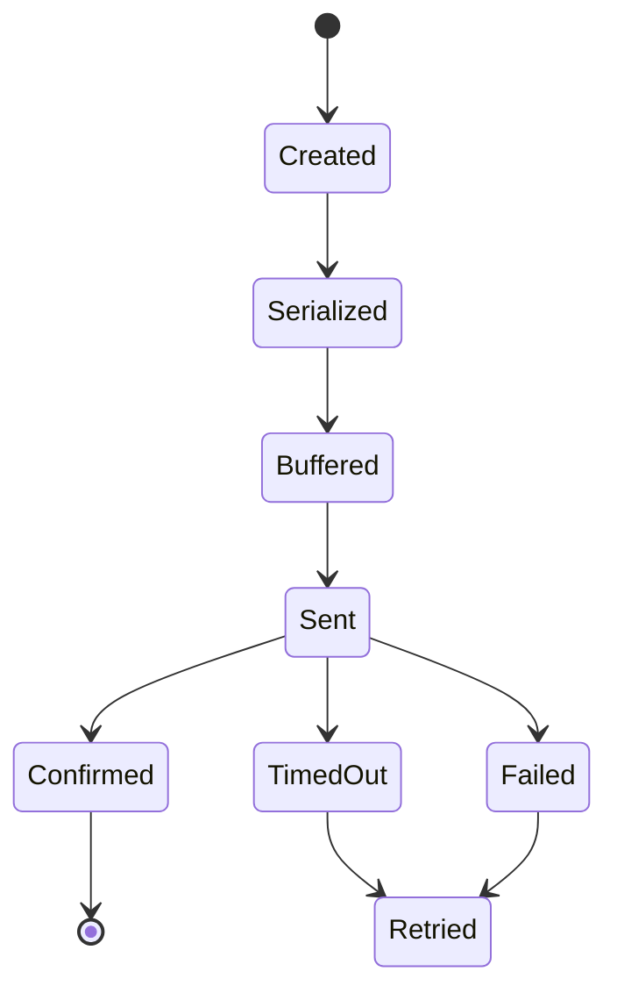
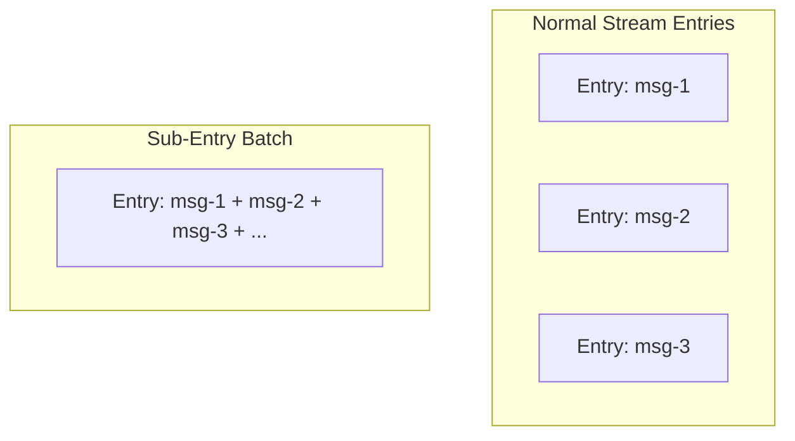
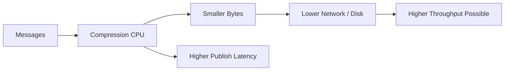
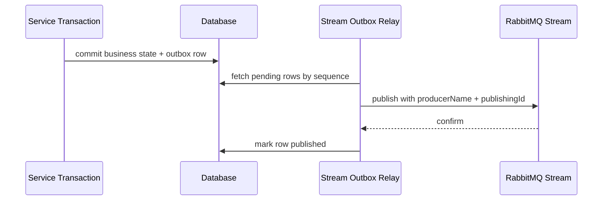
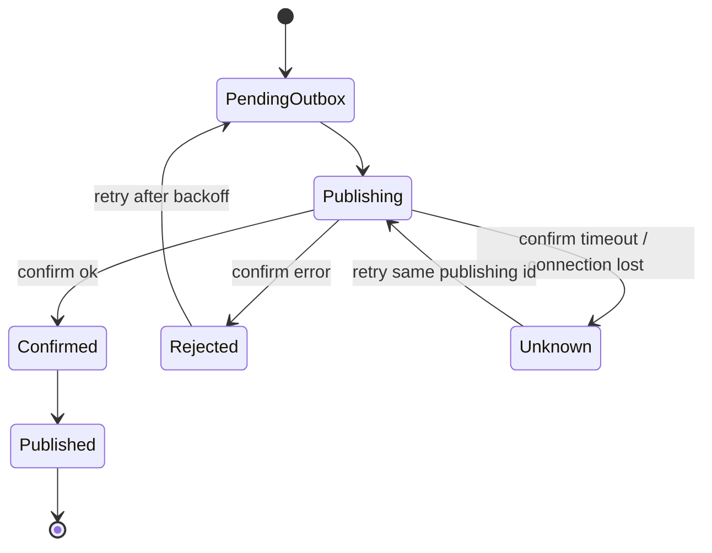
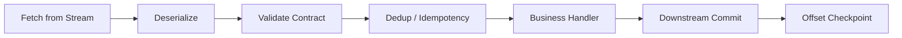
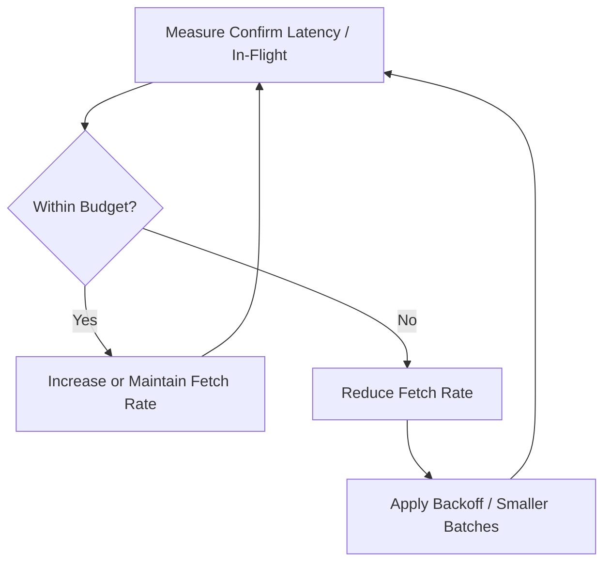

# Part 023 — Stream Batching, Compression, Deduplication, and Throughput Engineering

RabbitMQ Streams are built for high-throughput append-only workloads, but high throughput does not come from one magic setting. It comes from aligning producer batching, broker replication, client confirms, message shape, compression, consumer flow, offset tracking, and downstream persistence.

This part focuses on one practical question:

> How do we push RabbitMQ Streams hard without losing correctness, observability, or operational control?

The answer is not simply “increase batch size”. Larger batches improve throughput only until they collide with latency objectives, memory pressure, compression CPU, broker disk saturation, or duplicate handling complexity.

RabbitMQ Stream Java Client supports producer confirms, deduplication through producer name and publishing id, batching, sub-entry batching, and compression. These are powerful tools, but each one changes the operational semantics of the application.

---

## 1. Kaufman Deconstruction

To master Stream throughput engineering, decompose the skill into ten capabilities:

1. **Throughput model** — understand the pipeline from Java object to broker segment.
2. **Producer confirm model** — know when a message is broker-accepted and how many can be in flight.
3. **Batching model** — distinguish API calls, frame batching, sub-entry batching, and DB batching.
4. **Compression model** — reason about bandwidth, disk, CPU, and latency trade-offs.
5. **Deduplication model** — understand producer name, publishing id, and duplicate boundaries.
6. **Consumer flow model** — keep consumers fast enough without hiding downstream saturation.
7. **Offset model** — checkpoint only what is actually processed.
8. **Benchmark model** — measure the workload shape you will actually run.
9. **Failure model** — know what happens during retry, confirm timeout, reconnect, and partial batch failure.
10. **Operational model** — expose metrics and runbooks that make performance tunable in production.

The standard:

> A high-throughput stream design is only good if it remains correct under retry, restart, replay, and downstream slowdown.

---

## 2. The Throughput Pipeline

A stream publish path has several stages:


Each stage can become the bottleneck:

| Stage | Common bottleneck | Symptom |
|---|---|---|
| Domain event creation | excessive object allocation | high GC, low publish rate |
| Serialization | slow JSON/object mapper | CPU saturation before broker saturation |
| Message build | large headers/payload | high allocation, network cost |
| Client buffer | unbounded in-flight messages | heap growth, OOM risk |
| Batching | wrong flush policy | high tail latency or low throughput |
| Compression | CPU-heavy algorithm | CPU saturation, delayed confirms |
| Network | bandwidth/packet overhead | throughput plateau |
| Broker persistence | disk I/O and replication | confirm latency rises |
| Confirm handling | slow callback path | in-flight backlog grows |

A strong engineer does not tune blind. They identify which stage is saturated.

---

## 3. Queue Throughput vs Stream Throughput

Traditional AMQP queues and streams have different performance shapes.

A queue is optimized for work dispatch:

```text
publish -> queue -> consumer -> ack -> remove/settle
```

A stream is optimized for append and replay:

```text
publish -> append -> retain -> many consumers read by offset
```

That difference matters:

| Dimension | Queue | Stream |
|---|---|---|
| Consumption | destructive settlement | non-destructive read |
| Progress | ack delivery | offset tracking |
| Replay | not natural | natural while retained |
| Fan-out | queue per subscriber | many consumers can read same log |
| Throughput tuning | prefetch, ack batching, consumer concurrency | batching, compression, offset, partitioning |
| Retention | queue depth until consumed/expired | size/time retention independent of consumption |

Do not tune streams using only queue intuition. Prefetch and ack thinking is not enough. You need offset, retention, partition, and batch thinking.

---

## 4. The Core Trade-Off: Throughput vs Latency

Batching improves throughput by amortizing fixed costs:

- fewer network round trips;
- fewer protocol frames per message;
- better disk append efficiency;
- better compression ratio;
- fewer confirm callback transitions;
- lower per-message metadata overhead.

But batching increases waiting time:

```text
latency = queueing wait inside batch + network + broker append + replication + confirm callback
```

A batch flush policy usually has three triggers:

```text
flush when count >= N
flush when bytes >= B
flush when age >= T milliseconds
```

The danger is optimizing one dimension while violating another.

Example:

```text
batch size = 10_000 messages
average publish rate = 1_000 messages/second
```

A count-only flush means the first message can wait around 10 seconds before the batch is full. That may be excellent for throughput and terrible for user-facing latency.

The production pattern is:

```text
count limit + byte limit + max age limit + in-flight limit
```

---

## 5. Producer Confirms as the Safety Boundary

For Stream publishers, confirms are the boundary between “sent by application” and “accepted by broker”.

A publish without confirm discipline has ambiguity:

```text
Application sent message.
Connection failed.
Did the broker append it?
Unknown.
```

A high-throughput producer must therefore maintain an in-flight confirm ledger:



The ledger must answer:

- which publishing id is in flight;
- when it was sent;
- what payload/outbox row it corresponds to;
- whether it was confirmed;
- whether it timed out;
- whether retry is safe;
- how many publishes are currently unconfirmed.

### Bounded In-Flight Rule

Never allow infinite unconfirmed messages.

Bad:

```java
for (DomainEvent event : events) {
    producer.send(toStreamMessage(event), confirmationHandler);
}
```

Better mental model:

```java
Semaphore inFlight = new Semaphore(50_000);

void publish(EventRecord record) throws InterruptedException {
    inFlight.acquire();
    long startedAtNanos = System.nanoTime();

    producer.send(record.message(), confirmationStatus -> {
        try {
            if (confirmationStatus.isConfirmed()) {
                markOutboxSent(record.id(), startedAtNanos);
            } else {
                markOutboxRetryable(record.id(), confirmationStatus.getCode());
            }
        } finally {
            inFlight.release();
        }
    });
}
```

This is not a full production implementation, but it shows the invariant:

> The publisher controls the maximum amount of unresolved risk.

---

## 6. Batching Types You Must Not Confuse

“Batching” means several different things.

| Type | Where it happens | Goal | Correctness risk |
|---|---|---|---|
| Application batch | your code groups records | reduce DB/API overhead | partial failure, timeout |
| Producer buffer | client accumulates outbound messages | throughput | memory growth |
| Protocol/frame batch | client sends multiple messages efficiently | network efficiency | hidden latency |
| Sub-entry batch | stream stores multiple messages in one entry | high throughput/compression | duplicate/latency semantics |
| Confirm batch | application handles confirms in groups | callback overhead reduction | ambiguous retries if ledger weak |
| Consumer batch | consumer processes multiple messages | DB throughput | checkpoint gaps |
| DB batch | downstream writes grouped | I/O efficiency | partial commit complexity |

The most common production mistake is applying a large batch at every layer and then discovering that tail latency, memory, and failure recovery are uncontrollable.

---

## 7. Stream Sub-Entry Batching

RabbitMQ Stream Java Client supports sub-entry batching. Conceptually, instead of each logical message being stored as its own individual stream entry, multiple logical messages can be packed into one sub-entry batch.

Mental model:



Why use it:

- increase throughput;
- reduce per-message overhead;
- improve compression ratio;
- reduce network bandwidth;
- reduce storage footprint for similar messages.

Why be careful:

- increases latency because messages wait to form a sub-batch;
- increases client CPU if compression is enabled;
- changes duplicate behavior under retry;
- can increase memory pressure;
- makes partial failure reasoning more complex.

### When Sub-Entry Batching Fits

Good candidates:

- telemetry events;
- clickstream-like events;
- append-only audit events;
- log/event ingestion;
- high-volume integration events;
- near-real-time analytics feed;
- non-user-blocking pipelines.

Poor candidates:

- low-latency user command response;
- command messages requiring immediate processing;
- strict per-message confirm-to-user interaction;
- workflows with expensive compensation per duplicate;
- small workloads where batching adds complexity without benefit.

---

## 8. Compression Trade-Offs

Compression is a throughput tool only when the bottleneck is network or disk and the payloads compress well.

It is not free.



Use compression when:

- payloads are text-heavy or structurally similar;
- average message size is meaningful enough to compress;
- broker/network/disk is bottlenecking before CPU;
- additional latency is acceptable;
- consumer CPU budget includes decompression.

Avoid compression when:

- payloads are already compressed;
- messages are tiny;
- producer or consumer CPU is already saturated;
- p99 latency budget is tight;
- debugging and operational simplicity matter more than byte reduction.

### Compression Evaluation Matrix

| Observation | Interpretation | Action |
|---|---|---|
| network high, CPU low | compression may help | test compression |
| disk throughput high, CPU low | compression may help | test compression |
| CPU high, network low | compression hurts | disable or reduce compression |
| p99 latency high after compression | batch/compression too aggressive | lower batch size or disable |
| payload already compressed | compression waste | disable |
| compression ratio < 1.2x | weak benefit | disable unless storage cost dominates |

---

## 9. Deduplication Model

RabbitMQ Streams support publisher-side deduplication using:

1. **producer name**;
2. **monotonically increasing publishing id**.

The broker can detect duplicate publishes from the same named producer when publishing ids repeat or go backwards relative to the recorded sequence.

Mental model:

```text
producerName = billing-outbox-relay-0
publishingId = 1001, 1002, 1003, ...
```

If the producer loses connection after sending publishing id `1002` but before receiving confirm, it may retry `1002`. The broker can recognize the duplicate if dedup state is available and the same producer name is used correctly.

### Deduplication Invariants

| Invariant | Reason |
|---|---|
| producer name must be stable | broker tracks sequence by producer identity |
| publishing id must be strictly increasing | dedup uses sequence semantics |
| only one active producer instance should use a producer name | concurrent reuse can corrupt sequence assumptions |
| publishing id must survive restart | restart must not reset sequence to zero |
| application still needs consumer idempotency | broker dedup does not protect all external side effects |

### Bad Publishing ID Strategy

```java
long publishingId = System.currentTimeMillis();
```

Problems:

- not strictly increasing under clock issues;
- collisions possible across instances;
- restart behavior not tied to outbox order;
- hard to reason about gaps.

Better:

```text
publishingId = monotonically increasing outbox sequence per producer shard
```

Example mapping:

| Producer shard | Producer name | Publishing id source |
|---|---|---|
| shard 0 | order-outbox-relay-0 | outbox_sequence in shard 0 |
| shard 1 | order-outbox-relay-1 | outbox_sequence in shard 1 |
| shard 2 | order-outbox-relay-2 | outbox_sequence in shard 2 |

---

## 10. Deduplication Is Not Exactly-Once

Deduplication reduces duplicate appends caused by publisher retry. It does not remove the need for:

- idempotent consumers;
- transactional outbox;
- external side-effect protection;
- replay-safe handlers;
- offset/commit discipline;
- schema-compatible replay.

Why?

Because duplicates can still appear from other paths:

- consumer reprocesses after crash;
- downstream write succeeds but offset checkpoint fails;
- replay job deliberately rereads old offsets;
- two logical producer names publish same business event;
- application emits duplicate domain events before broker publish;
- sub-entry batching and retry semantics produce duplicate exposure that the consumer must tolerate.

The safe rule:

> Broker deduplication is a producer-side optimization, not a system-wide correctness guarantee.

---

## 11. Outbox Relay for Stream Publisher

A production Stream publisher often reads from an outbox table.



### Outbox Row Shape

```sql
CREATE TABLE stream_outbox (
  shard_id          INT NOT NULL,
  sequence_no       BIGINT NOT NULL,
  event_id          UUID NOT NULL,
  aggregate_type    TEXT NOT NULL,
  aggregate_id      TEXT NOT NULL,
  event_type        TEXT NOT NULL,
  schema_version    INT NOT NULL,
  payload_json      JSONB NOT NULL,
  headers_json      JSONB NOT NULL,
  status            TEXT NOT NULL,
  created_at        TIMESTAMPTZ NOT NULL,
  published_at      TIMESTAMPTZ,
  last_error        TEXT,
  PRIMARY KEY (shard_id, sequence_no),
  UNIQUE (event_id)
);
```

Publishing id:

```text
publishingId = sequence_no
producerName = service + stream + shard_id
```

This gives deterministic retry.

---

## 12. Producer Sharding

One named producer should not be concurrently active from many nodes. For throughput and HA, shard producers explicitly.

```text
producer shard 0 -> producerName inventory-events-p0 -> publishing id from shard 0 sequence
producer shard 1 -> producerName inventory-events-p1 -> publishing id from shard 1 sequence
producer shard 2 -> producerName inventory-events-p2 -> publishing id from shard 2 sequence
```

The assignment can be static or leader-elected.

### Static Shard Ownership

Useful for simple deployments:

```text
instance ordinal 0 owns shards 0,3,6
instance ordinal 1 owns shards 1,4,7
instance ordinal 2 owns shards 2,5,8
```

### Lease-Based Ownership

Useful for dynamic scaling:

```sql
CREATE TABLE publisher_shard_lease (
  shard_id INT PRIMARY KEY,
  owner_instance TEXT NOT NULL,
  lease_until TIMESTAMPTZ NOT NULL,
  fencing_token BIGINT NOT NULL
);
```

The relay must stop publishing if it cannot renew its lease.

---

## 13. Confirm Timeout Strategy

Confirm timeout is not the same as publish failure.

```text
confirm not received before deadline = state unknown
```

The broker may have appended the message and the confirm may have been lost. Retrying can be correct only if publishing id/dedup or consumer idempotency handles duplicates.

State machine:



Guidelines:

- use same publishing id when retrying same outbox row;
- do not generate a new business event id for retry;
- do not mark published without confirm unless you accept loss;
- do not retry endlessly without backoff and alerting;
- record unknown states for operational inspection.

---

## 14. Consumer Throughput Model

A fast producer is useless if consumers cannot keep up.

Stream consumers must balance:

- read rate;
- handler concurrency;
- ordering requirements;
- downstream DB/API capacity;
- checkpoint frequency;
- memory for in-flight messages;
- replay speed;
- lag recovery objective.

### Consumer Pipeline



Every stage needs a bounded queue.

Bad:

```text
stream consumer -> unbounded executor queue -> database meltdown
```

Better:

```text
stream consumer -> bounded handoff -> worker pool -> bounded DB pool -> checkpoint only completed offsets
```

---

## 15. Offset Checkpointing Under Batch Processing

Consumer batching introduces checkpoint gaps.

Example:

```text
offsets fetched: 100, 101, 102, 103, 104
completed:       100, 101,      103, 104
failed:                    102
```

You cannot safely checkpoint `104` if `102` is required to be processed exactly once before later offsets for that consumer identity.

Safe checkpoint rule:

```text
checkpoint = highest contiguous completed offset
```

For unordered/stateless processing, you may choose a different model, but it must be explicit.

### Contiguous Offset Tracker

```java
final class ContiguousOffsetTracker {
    private long nextExpected;
    private final NavigableSet<Long> completedOutOfOrder = new TreeSet<>();

    ContiguousOffsetTracker(long firstOffset) {
        this.nextExpected = firstOffset;
    }

    synchronized long markCompleted(long offset) {
        if (offset == nextExpected) {
            nextExpected++;
            while (completedOutOfOrder.remove(nextExpected)) {
                nextExpected++;
            }
        } else if (offset > nextExpected) {
            completedOutOfOrder.add(offset);
        }
        return nextExpected - 1;
    }
}
```

This pattern is essential when using worker pools with stream consumers.

---

## 16. Consumer Batch Failure Semantics

When processing a batch of messages, possible outcomes include:

| Case | Example | Correct response |
|---|---|---|
| full success | all messages committed | checkpoint batch end |
| one retryable failure | DB timeout on one record | retry failed record or stop checkpoint before gap |
| one poison message | invalid schema | park poison, then checkpoint if policy allows |
| partial DB commit | first 50 committed, next 50 failed | checkpoint committed contiguous range only |
| process crash | unknown subset committed | rely on idempotency and replay from last checkpoint |

A batch system without idempotency is fragile. A stream replay will expose every ambiguous boundary.

---

## 17. Sizing Batch Parameters

Start with SLOs, not guesses.

Inputs:

```text
max acceptable p99 publish latency = L
average message size = S
producer rate target = R messages/sec
network budget = N bytes/sec
CPU budget = C cores
retention budget = storage bytes/day
```

Initial batch age:

```text
maxBatchAge <= latency budget fraction
```

Initial batch count:

```text
batchCount ~= min(R * maxBatchAgeSeconds, memoryBound, confirmBound)
```

Example:

```text
R = 50_000 msg/sec
maxBatchAge = 20 ms
R * maxBatchAge = 1_000 messages
```

Start smaller than theoretical max:

```text
batchCount = 250 or 500
maxBatchAge = 10-20 ms
maxBatchBytes = 256 KB - 1 MB depending on payload
```

Then benchmark.

Do not copy these as universal constants. They are starting points, not truths.

---

## 18. Benchmarking Methodology

A serious throughput benchmark varies one dimension at a time.

### Variables

| Variable | Values to test |
|---|---|
| message size | 100 B, 1 KB, 10 KB, 100 KB |
| payload type | JSON, binary, similar text, random bytes |
| batch count | 1, 10, 100, 500, 1_000 |
| batch age | 1 ms, 5 ms, 20 ms, 100 ms |
| compression | none, low, high depending client options |
| partitions | 1, 3, 6, 12 |
| producer instances | 1, 2, 4, 8 |
| consumer instances | 1, 2, 4, 8 |
| downstream | no-op, local DB, real DB |

### Metrics

Record:

- publish throughput;
- confirm latency p50/p95/p99;
- end-to-end latency;
- producer CPU;
- consumer CPU;
- broker CPU;
- broker disk write rate;
- network bandwidth;
- compression ratio;
- JVM heap and GC;
- stream lag per consumer;
- duplicate count;
- error/retry count.

### Anti-Patterns

Avoid benchmarks that:

- use no-op payloads but production uses large JSON;
- benchmark producer only while consumer is absent;
- ignore confirm latency;
- ignore p99;
- run for only 30 seconds;
- omit broker restart/reconnect test;
- benchmark on laptop and extrapolate to production;
- use random payloads while expecting compression benefits.

---

## 19. Performance Experiment Template

Use a repeatable experiment record:

```mdx
## Experiment: Stream Producer Batching Matrix

### Goal
Find maximum stable publish throughput under p99 confirm latency <= 100 ms.

### Workload
- payload: order event JSON
- average size: 1.2 KB
- producers: 4
- stream partitions: 6
- consumers: 4
- downstream: PostgreSQL idempotent upsert

### Variables
- batch size: 1, 50, 200, 500
- max batch age: 5 ms, 20 ms, 50 ms
- compression: off/on

### Success Criteria
- zero message loss
- duplicate rate tolerated and measured
- p99 confirm latency <= 100 ms
- consumer lag stable over 30 minutes
- broker disk free stable
- no JVM OOM or full GC storm

### Results
| batch | age | compression | throughput | p99 confirm | p99 end-to-end | CPU | notes |
|---|---:|---|---:|---:|---:|---:|---|
```

This is how tuning becomes engineering rather than folklore.

---

## 20. Message Shape Optimization

Payload design has direct performance impact.

### Avoid Header Bloat

Headers are useful for routing and metadata, but they are not free.

Bad:

```text
headers:
  fullUserProfile: {...large object...}
  fullOrder: {...large object...}
  debugContext: {...large object...}
```

Better:

```text
headers:
  eventId
  correlationId
  causationId
  schemaVersion
  tenantId
  producer
payload:
  actual event data
```

### Avoid Overly Generic Payloads

Bad:

```json
{
  "eventType": "SomethingHappened",
  "data": {
    "dynamic": "anything"
  }
}
```

Better:

```json
{
  "eventId": "...",
  "eventType": "OrderConfirmed",
  "schemaVersion": 3,
  "occurredAt": "2026-07-01T10:20:30Z",
  "orderId": "ORD-123",
  "customerId": "C-88",
  "confirmedTotal": {
    "currency": "IDR",
    "amountMinor": 12500000
  }
}
```

Performance and evolvability are connected. Typed, predictable payloads serialize faster, compress better, and fail earlier.

---

## 21. Serialization Choices

| Format | Strength | Weakness | Fit |
|---|---|---|---|
| JSON | debuggable, ubiquitous | larger, slower | integration/events, audit |
| Avro | compact, schema evolution | schema registry complexity | high-volume data events |
| Protobuf | compact, typed, fast | compatibility discipline required | internal high-throughput events |
| Plain text | simple logs | weak schema | log-like ingestion |

Rule:

> Do not switch serialization format only because of benchmark envy. Switch when payload size or CPU is proven bottleneck and operational complexity is justified.

---

## 22. Backpressure in Stream Producers

A producer must slow down when confirms slow down.

Signals:

- in-flight confirm count rising;
- confirm latency rising;
- send callback errors rising;
- connection recovery events;
- broker disk/memory pressure;
- outbox pending rows growing;
- relay fetch loop unable to mark published fast enough.

Producer control loop:



A robust outbox relay can adapt:

```text
if confirm_p99 > target:
  reduce max_in_flight
  reduce outbox fetch size
  increase poll delay
else if lag high and confirm healthy:
  increase fetch size gradually
```

Do not let an outbox relay DDoS its own broker.

---

## 23. Consumer Lag and Replay Throughput

For streams, backlog is often represented as lag:

```text
lag = last stream offset - consumer checkpoint offset
```

But lag alone is incomplete. You need:

```text
recovery time = lag / effective processing rate
```

Example:

```text
lag = 10,000,000 messages
effective processing rate = 50,000 messages/sec
recovery time = 200 seconds
```

If effective rate drops to 2,000/sec because downstream DB is slow:

```text
recovery time = 5,000 seconds = 83 minutes
```

Lag is only scary relative to processing capacity and retention window.

### Retention Safety

A consumer is unsafe when:

```text
lag recovery time > time until retained data expires
```

Alert on retention risk, not just lag.

---

## 24. Throughput Capacity Formula

A simple capacity formula:

```text
required producer throughput = peak events/sec * safety factor
required consumer throughput = peak events/sec + replay catch-up/sec
```

For stream partitions:

```text
required partitions >= required throughput / safe throughput per partition
```

But safe throughput per partition must be measured, not guessed.

Include:

- average payload size;
- p99 payload size;
- replication factor;
- compression ratio;
- disk write capacity;
- consumer replay demand;
- fan-out count;
- downstream processing cost.

---

## 25. Hot Partition and Batch Amplification

With Super Streams, batching can hide skew until it becomes severe.

Example:

```text
partition 0 receives 70% of traffic
partitions 1-5 share 30%
```

Producer total throughput may look fine, but one partition’s lag grows.

Metrics must be per partition:

- publish rate per partition;
- confirm latency per partition;
- consumer lag per partition;
- consumer processing rate per partition;
- storage growth per partition;
- error rate per partition.

Mitigation:

- choose better partition key;
- split hot tenant/entity;
- increase partition count with migration plan;
- route hot category to separate super stream;
- apply admission control to noisy tenant.

---

## 26. Duplicate Handling Under Batching

Batching makes duplicate handling more important, not less.

Duplicate scenarios:

1. producer sends batch;
2. broker appends batch;
3. connection breaks before confirm;
4. producer retries;
5. some or all logical messages can be observed again depending on dedup/sub-entry behavior and application flow;
6. consumer replay can expose duplicates again.

Consumer idempotency must use business/event identity, not offset alone.

```sql
CREATE TABLE processed_event (
  consumer_name TEXT NOT NULL,
  event_id UUID NOT NULL,
  processed_at TIMESTAMPTZ NOT NULL,
  PRIMARY KEY (consumer_name, event_id)
);
```

Offset prevents repeated scanning from the same point. Event id prevents repeated effect.

---

## 27. End-to-End Latency Budget

For user-visible workflows, define latency budget explicitly.

Example target:

```text
p99 end-to-end event propagation <= 2 seconds
```

Budget:

| Segment | Budget |
|---|---:|
| business transaction + outbox insert | 150 ms |
| outbox polling delay | 100 ms |
| serialization + batch wait | 100 ms |
| stream append + confirm | 150 ms |
| consumer fetch delay | 100 ms |
| processing + DB write | 1,000 ms |
| offset checkpoint | 50 ms |
| buffer | 350 ms |

This immediately constrains batching. A 5-second batch age violates the SLO before the message leaves the producer.

---

## 28. Java Producer Skeleton

The following is a simplified skeleton showing the architecture, not a drop-in library.

```java
public final class StreamOutboxRelay implements AutoCloseable {
    private final OutboxRepository outbox;
    private final Producer producer;
    private final Semaphore inFlight;
    private final ScheduledExecutorService scheduler;
    private final AtomicBoolean running = new AtomicBoolean(true);

    public StreamOutboxRelay(
            OutboxRepository outbox,
            Producer producer,
            int maxInFlight,
            ScheduledExecutorService scheduler
    ) {
        this.outbox = outbox;
        this.producer = producer;
        this.inFlight = new Semaphore(maxInFlight);
        this.scheduler = scheduler;
    }

    public void start() {
        scheduler.execute(this::loop);
    }

    private void loop() {
        while (running.get()) {
            try {
                int permits = Math.max(1, inFlight.availablePermits());
                List<OutboxRecord> records = outbox.fetchPending(Math.min(permits, 500));

                if (records.isEmpty()) {
                    sleepQuietly(50);
                    continue;
                }

                for (OutboxRecord record : records) {
                    publish(record);
                }
            } catch (Exception e) {
                // log and backoff; never spin on broker/database failure
                sleepQuietly(500);
            }
        }
    }

    private void publish(OutboxRecord record) throws InterruptedException {
        inFlight.acquire();
        Message message = record.toStreamMessage();
        long started = System.nanoTime();

        producer.send(message, confirmation -> {
            try {
                if (confirmation.isConfirmed()) {
                    outbox.markPublished(record.id(), started);
                } else {
                    outbox.markRetryable(record.id(), confirmation.getCode());
                }
            } catch (Exception callbackFailure) {
                // callback failure means outbox state may be stale;
                // retry should use same publishing id.
            } finally {
                inFlight.release();
            }
        });
    }

    @Override
    public void close() {
        running.set(false);
        scheduler.shutdown();
    }
}
```

Production additions:

- lease/fencing for shard ownership;
- adaptive backpressure;
- structured metrics;
- confirm timeout scanner;
- graceful drain;
- poison outbox row handling;
- retry budget;
- trace propagation.

---

## 29. Java Consumer Skeleton

```java
public final class StreamBatchConsumer {
    private final ExecutorService workers;
    private final ProcessedEventRepository processedEvents;
    private final OffsetCheckpointStore checkpointStore;
    private final ContiguousOffsetTracker tracker;

    public void handle(Context context, Message message) {
        long offset = context.offset();
        workers.submit(() -> processOne(context, message, offset));
    }

    private void processOne(Context context, Message message, long offset) {
        EventEnvelope envelope = deserialize(message);

        try {
            boolean firstTime = processedEvents.tryStart(envelope.consumerName(), envelope.eventId());
            if (firstTime) {
                applyBusinessEffect(envelope);
                processedEvents.markCompleted(envelope.consumerName(), envelope.eventId());
            }

            long checkpoint = tracker.markCompleted(offset);
            checkpointStore.store(context.stream(), context.consumerName(), checkpoint);
        } catch (PoisonMessageException poison) {
            park(envelope, poison);
            long checkpoint = tracker.markCompleted(offset);
            checkpointStore.store(context.stream(), context.consumerName(), checkpoint);
        } catch (Exception retryable) {
            // Do not checkpoint this offset. Let replay retry.
            recordFailure(envelope, retryable);
        }
    }
}
```

Key invariant:

> Offset checkpoint must trail durable business effect, never lead it.

---

## 30. Metrics for Stream Throughput Engineering

### Producer Metrics

| Metric | Why it matters |
|---|---|
| publish rate | workload volume |
| confirm rate | broker acceptance rate |
| confirm latency p50/p95/p99 | broker pressure and durability cost |
| in-flight count | unresolved risk |
| send failures | network/client/broker failure |
| retry count | instability indicator |
| outbox pending rows | producer lag |
| batch size actual | whether batching behaves as expected |
| compression ratio | compression benefit |
| producer CPU/heap/GC | client bottleneck |

### Consumer Metrics

| Metric | Why it matters |
|---|---|
| read rate | stream scan speed |
| process rate | business throughput |
| checkpoint offset | durable progress |
| lag | backlog |
| lag recovery time | retention risk |
| duplicate count | idempotency pressure |
| poison count | contract/data quality |
| handler latency | downstream pressure |
| worker queue depth | local overload |

### Broker Metrics

| Metric | Why it matters |
|---|---|
| stream publish rate | broker write load |
| stream storage growth | retention/storage planning |
| disk I/O | persistence bottleneck |
| network I/O | bandwidth bottleneck |
| leader distribution | partition balance |
| replica health | durability |
| connection recovery events | instability |

---

## 31. Alerts

Good alerts are tied to action.

| Alert | Trigger | Action |
|---|---|---|
| confirm latency high | p99 above SLO for 5-10 min | inspect broker disk, leader, network, producer in-flight |
| in-flight near limit | > 90% limit sustained | reduce publish rate or inspect confirms |
| outbox lag growing | pending rows age > SLO | scale producer or fix broker/downstream |
| consumer lag retention risk | estimated catch-up exceeds retention safety | scale consumers, pause producers, increase retention |
| duplicate spike | duplicate count above baseline | inspect producer retry/reconnect/outbox behavior |
| compression CPU saturation | CPU high after compression enablement | disable/tune compression |
| hot partition | one partition lag/rate dominates | inspect partition key and noisy tenant |

---

## 32. Runbook: Confirm Latency Spike

Symptoms:

- producer in-flight grows;
- confirm p99 rises;
- outbox pending grows;
- application logs show confirm timeout/retry.

Steps:

1. Check whether all streams or only one stream are affected.
2. Check whether one partition/leader is hot.
3. Check broker disk I/O and free disk.
4. Check replica health and leader placement.
5. Check network throughput and packet drops.
6. Check producer CPU and GC.
7. Temporarily reduce producer fetch/batch size if broker is saturated.
8. If one tenant is noisy, apply tenant-level rate limit.
9. Validate no outbox rows are marked published without confirm.
10. After recovery, compare duplicate count against baseline.

---

## 33. Runbook: Consumer Lag Grows

Symptoms:

- lag increases;
- checkpoint offset stalls;
- stream publish rate exceeds processing rate.

Steps:

1. Determine if lag is global or partition-specific.
2. Check handler latency.
3. Check downstream DB/API health.
4. Check worker pool saturation.
5. Check poison/retry loops.
6. Estimate recovery time.
7. Compare recovery time to retention window.
8. Scale consumers only if downstream can absorb more load.
9. For hot partition, consider key redesign or split strategy.
10. Do not blindly increase concurrency if ordering is required.

---

## 34. Decision Framework

### Use Batching When

- throughput is constrained by per-message overhead;
- latency budget allows small waiting time;
- consumer/downstream can handle grouped processing;
- idempotency is implemented;
- metrics can show actual batch behavior.

### Use Compression When

- payloads compress well;
- network/disk is bottleneck;
- CPU headroom exists;
- p99 latency remains acceptable.

### Use Deduplication When

- producer retry can resend same message;
- producer identity and publishing id can be stable;
- only one active producer uses a name;
- outbox sequence can map to publishing id.

### Use Super Streams When

- one stream cannot meet throughput;
- ordering is only required per key;
- partition skew can be managed;
- consumer scaling requires partition parallelism.

---

## 35. Common Anti-Patterns

### Anti-Pattern 1 — Batch Everything Everywhere

Large producer batch + large sub-entry batch + large consumer batch + large DB batch often creates unmanageable p99 latency and partial failure ambiguity.

Fix:

- define latency budget;
- choose one or two batching layers deliberately;
- keep checkpoint semantics explicit.

### Anti-Pattern 2 — Dedup Without Stable Publishing ID

Using random ids, timestamps, or per-process counters breaks dedup after restart.

Fix:

- use durable outbox sequence;
- shard producer identity;
- persist progress.

### Anti-Pattern 3 — Compression as Default

Compression can reduce bytes while increasing CPU and latency.

Fix:

- measure compression ratio;
- compare p99 latency and CPU;
- enable only for suitable payloads.

### Anti-Pattern 4 — Producer Faster Than Consumer Forever

A stream can retain data, but retention is finite.

Fix:

- alert on recovery time vs retention;
- scale consumers/downstream;
- shape producer rate.

### Anti-Pattern 5 — Offset as Idempotency

Offset only identifies position in a stream. It does not prove a business event has not been applied before.

Fix:

- use business event id dedup;
- checkpoint after durable effect;
- make replay safe.

---

## 36. Practice Drill

Build a stream ingestion benchmark with these modes:

1. no batching, no compression;
2. producer batching only;
3. sub-entry batching only;
4. sub-entry batching + compression;
5. producer dedup with simulated confirm loss;
6. consumer batch with checkpoint gaps;
7. replay from old offset;
8. hot partition simulation.

For each mode, record:

- throughput;
- p99 confirm latency;
- p99 end-to-end latency;
- CPU;
- heap/GC;
- duplicate count;
- lag recovery time;
- retention risk.

Completion standard:

> You can explain why the fastest configuration is not necessarily the best production configuration.

---

## 37. Engineering Checklist

Before approving a high-throughput Stream design:

- [ ] Producer has bounded in-flight confirms.
- [ ] Publisher retry uses stable publishing id.
- [ ] Producer name ownership is single-active or fenced.
- [ ] Outbox relay does not mark sent before confirm.
- [ ] Batch count/bytes/age are explicitly configured.
- [ ] p99 latency budget constrains batching.
- [ ] Compression is justified by measurement.
- [ ] Consumer checkpoint trails durable effect.
- [ ] Consumer idempotency uses business/event id.
- [ ] Lag alert considers retention risk.
- [ ] Metrics exist per stream and partition.
- [ ] Hot partition strategy exists.
- [ ] Benchmark includes real payload shape.
- [ ] Restart/reconnect test is automated.
- [ ] Duplicate behavior is documented.

---

## 38. Summary

RabbitMQ Streams can handle high-throughput log-style workloads, but throughput engineering is a correctness problem as much as a performance problem.

The production-grade mental model:

```text
throughput = batching + append efficiency + partitioning + consumer capacity
safety = confirms + dedup + idempotency + checkpoint discipline
operability = metrics + alerts + runbooks + benchmark evidence
```

Sub-entry batching and compression can dramatically improve throughput, but they increase latency and duplicate-handling complexity. Deduplication reduces producer retry duplicates, but it does not eliminate the need for consumer idempotency. Offsets track read progress, but they do not prove business effects.

The top-tier engineer does not ask, “What batch size is fastest?”

They ask:

> What batch, compression, dedup, partitioning, and checkpoint strategy satisfies our throughput target while preserving correctness under failure and replay?

---

## References

- RabbitMQ Stream Java Client documentation — sub-entry batching, compression, producer, consumer, deduplication, offset tracking.
- RabbitMQ Streams documentation — streams, retention, super streams, stream semantics.
- RabbitMQ Stream deduplication article — producer name and publishing id model.
- RabbitMQ consumer acknowledgements and publisher confirms documentation — confirm and acknowledgement concepts.
