# Part 024 — Pipeline Pattern: Stage Queues, Stream Pipelines, and Work Isolation

A pipeline is a sequence of processing stages connected by explicit boundaries.

In RabbitMQ systems, those boundaries can be AMQP queues, exchanges, dead-letter exchanges, retry queues, streams, super streams, or a hybrid of all of them. The hard part is not drawing boxes. The hard part is making sure each boundary has the right semantics: dispatch, replay, isolation, ordering, idempotency, retention, backpressure, and ownership.

This part explains how to design production-grade pipelines with Java and RabbitMQ without turning the broker into a hidden distributed monolith.

---

## 1. Kaufman Deconstruction

To master pipeline design, decompose the skill into ten capabilities:

1. **Stage definition** — know where one responsibility ends and another begins.
2. **Boundary selection** — choose queue, stream, direct call, or database boundary deliberately.
3. **Contract design** — define input/output message shape per stage.
4. **Failure isolation** — prevent one broken stage from collapsing the whole pipeline.
5. **Backpressure propagation** — make overload visible and bounded.
6. **Retry and poison handling** — classify failures per stage.
7. **Idempotency** — make each stage replay/redelivery safe.
8. **Ordering and partitioning** — preserve only the ordering that matters.
9. **Observability** — measure per-stage rate, latency, lag, and error budget.
10. **Evolution** — add/remove stages without breaking producers and consumers.

The standard:

> A pipeline is production-ready only when each stage can fail, restart, replay, and scale independently without corrupting the business process.

---

## 2. What a Pipeline Is

A pipeline transforms or routes data through a sequence of stages.

Example:

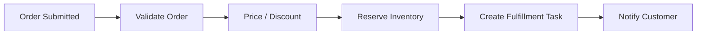

Each arrow hides a design choice:

- synchronous call;
- RabbitMQ command queue;
- RabbitMQ event exchange;
- RabbitMQ stream;
- database table/outbox;
- direct library call.

The pipeline is not automatically better because it has more asynchronous stages.

A pipeline is useful when it provides one or more of these benefits:

- isolates slow work;
- isolates unreliable dependencies;
- enables independent scaling;
- enables replay/reprocessing;
- improves auditability;
- decouples teams/services;
- reduces user-facing latency;
- protects core transaction boundary.

A pipeline is harmful when it adds:

- hidden distributed transaction complexity;
- unclear ownership;
- unbounded lag;
- duplicate side effects;
- hard-to-debug ordering bugs;
- accidental eventual consistency.

---

## 3. Pipeline Boundary Types

### 3.1 Synchronous Boundary

```text
Service A -> HTTP/gRPC -> Service B
```

Use when:

- caller needs immediate answer;
- operation is fast and reliable;
- failure should be visible immediately;
- latency budget can absorb dependency call.

Avoid when:

- downstream is slow/fragile;
- caller can proceed asynchronously;
- fan-out is large;
- retries may create duplicate side effects.

### 3.2 Queue Boundary

```text
producer -> exchange -> queue -> competing consumers
```

Use when:

- work must be performed once by one worker;
- consumers compete for tasks;
- backlog should be drained;
- replay is not a primary requirement;
- task state is finite.

### 3.3 Event Exchange Boundary

```text
producer -> topic/fanout exchange -> subscriber queues
```

Use when:

- multiple subscribers react independently;
- producer should not know subscribers;
- event is a fact, not a request;
- each subscriber owns its queue and retry policy.

### 3.4 Stream Boundary

```text
producer -> stream -> consumers read by offset
```

Use when:

- replay is required;
- many consumers need same data;
- audit/history matters;
- consumers need independent offsets;
- high-throughput append is central.

### 3.5 Hybrid Boundary

```text
service transaction -> outbox -> stream -> projector -> command queue
```

Use when:

- system needs both durable event history and work dispatch;
- one stage is replayable, another stage is task-oriented;
- analytics/audit and operational commands must coexist.

---

## 4. Queue Pipeline vs Stream Pipeline

| Dimension | Queue Pipeline | Stream Pipeline |
|---|---|---|
| Stage input | task queue | append-only log |
| Consumption | destructive / ack-based | non-destructive / offset-based |
| Replay | manual or DLQ replay | natural while retained |
| Work distribution | competing consumers | partition/consumer group style |
| Failure handling | nack/retry/DLQ | no checkpoint/replay/park |
| Output | usually another queue/exchange | another stream or queue |
| Best fit | task execution | event/data processing |

### Queue Pipeline

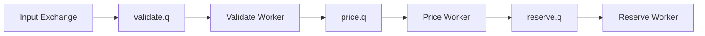

### Stream Pipeline

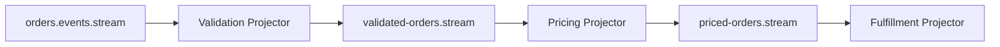

### Hybrid Pipeline

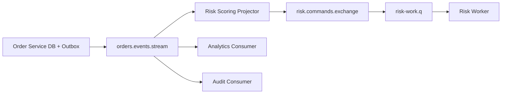

Hybrid is often the most realistic production pattern.

---

## 5. Stage Design

A stage has five contracts:

```text
input contract
processing contract
output contract
failure contract
observability contract
```

### Stage Template

```mdx
## Stage: Validate Order

### Responsibility
Validate structural and business rules for submitted orders.

### Input
- source: orders.submitted stream
- schema: OrderSubmitted.v3
- ordering key: orderId

### Output
- success: OrderValidated.v2 to orders.validated stream
- business rejection: OrderRejected.v1 to orders.rejected exchange
- technical failure: retry/no checkpoint

### Idempotency
- key: eventId + stageName
- output dedup: validatedEventId unique

### Failure Policy
- schema error: park
- missing reference data: retry with backoff
- invalid business rule: emit rejection event

### SLO
- p99 stage latency <= 500 ms
- lag recovery time <= 10 minutes
```

This template prevents ambiguous stage ownership.

---

## 6. Stage Granularity

A pipeline can be too coarse or too fine.

### Too Coarse

```text
one consumer does validate + price + reserve + notify
```

Problems:

- hard to scale one part;
- hard to isolate failures;
- retry repeats too much work;
- observability is poor;
- downstream dependency failures block unrelated work.

### Too Fine

```text
field normalization q -> address trim q -> zipcode q -> tax q -> ...
```

Problems:

- too many queues/stages;
- excessive latency;
- many partial failure states;
- operational overhead;
- topology becomes the application.

### Good Granularity

A stage should usually represent:

- a meaningful business transition;
- a different scaling profile;
- a different failure domain;
- a different owner/team;
- a different durability/replay need;
- a different latency class.

Rule:

> Split a stage when the split creates operational independence. Do not split merely because a function has multiple lines of code.

---

## 7. Pipeline Topology Patterns

### 7.1 Linear Pipeline

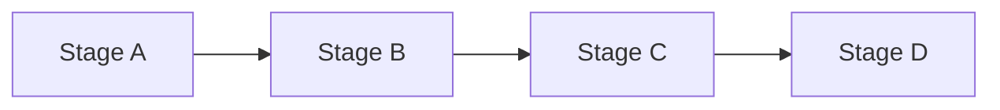

Use for ordered transformations where each stage depends on the previous output.

Risks:

- one slow stage backs up downstream;
- error handling can become complex;
- total latency is sum of stage latencies.

### 7.2 Fan-Out Pipeline

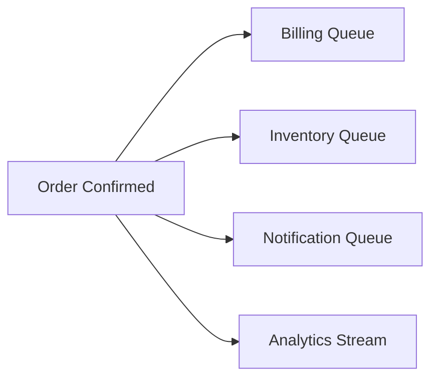

Use when independent consumers react to a fact.

Risks:

- no global transaction across subscribers;
- subscribers can observe different times;
- event contract governance is critical.

### 7.3 Fan-In Pipeline

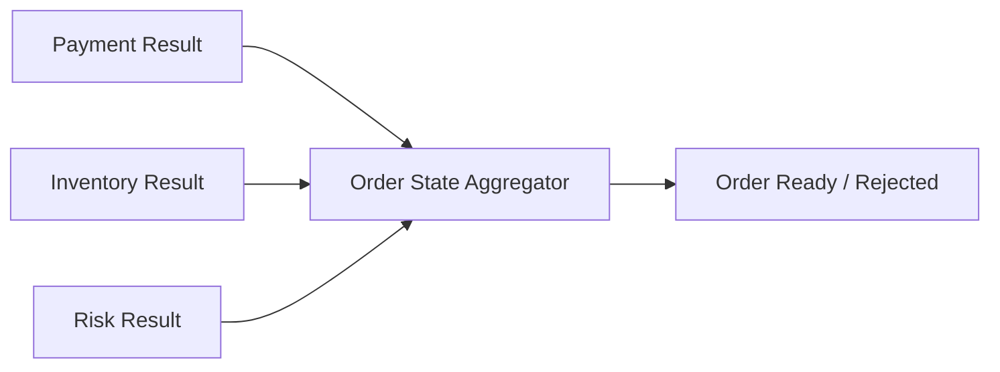

Use when multiple async results determine next state.

Risks:

- correlation state;
- timeout handling;
- partial result policy;
- duplicate result handling.

### 7.4 Branching Pipeline

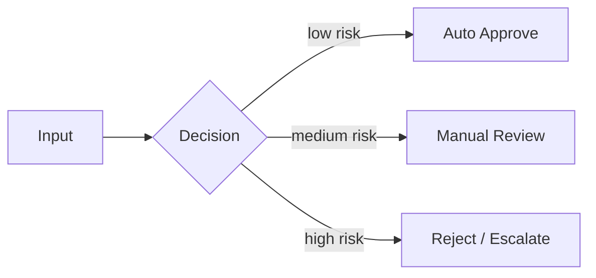

Use when business state determines path.

Risks:

- path-specific schemas;
- path-specific retry and DLQ;
- auditability of decision.

### 7.5 Enrichment Pipeline

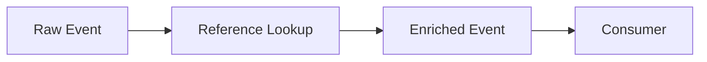

Use when raw events need lookup/join before downstream use.

Risks:

- reference data staleness;
- lookup dependency latency;
- retry storms when reference system is down;
- accidental snapshot inconsistency.

---

## 8. Pipeline as State Machine

For regulated or high-value workflows, treat the pipeline as a state transition system.

Example order lifecycle:

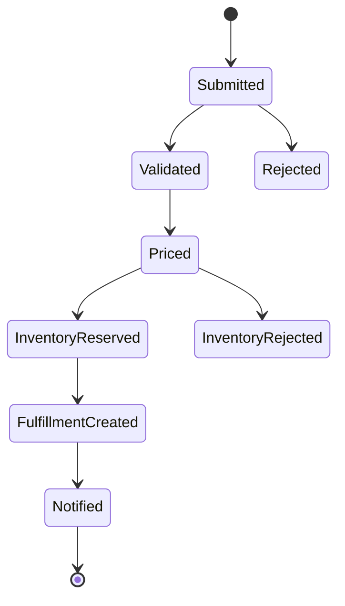

Each message should represent a state transition or command attempting a transition.

Bad event:

```text
OrderProcessed
```

Better events:

```text
OrderSubmitted
OrderValidated
OrderRejected
OrderPriced
InventoryReserved
InventoryReservationFailed
FulfillmentTaskCreated
CustomerNotificationSent
```

A pipeline without explicit state names is hard to debug, audit, and replay.

---

## 9. Pipeline Contract Shape

Every stage message should carry enough context to debug and correlate without carrying entire world state.

```json
{
  "messageId": "evt-01J...",
  "correlationId": "corr-01J...",
  "causationId": "evt-previous",
  "pipelineId": "order-fulfillment-v4",
  "stage": "pricing",
  "stageAttempt": 1,
  "schemaVersion": 2,
  "occurredAt": "2026-07-01T10:20:30Z",
  "tenantId": "tenant-a",
  "entityType": "Order",
  "entityId": "ORD-123",
  "payload": {
    "orderId": "ORD-123",
    "pricedTotal": {
      "currency": "IDR",
      "amountMinor": 12500000
    }
  }
}
```

Important fields:

| Field | Purpose |
|---|---|
| messageId | idempotency/dedup |
| correlationId | trace whole workflow |
| causationId | trace why this message exists |
| pipelineId | identify pipeline version |
| stage | identify current stage |
| stageAttempt | retry/diagnostic |
| tenantId | routing/security/quota |
| entityId | partitioning/ordering |
| schemaVersion | compatibility |

---

## 10. Stage Output Rule

A stage should emit output only after its durable effect is complete.

For a database-backed stage:

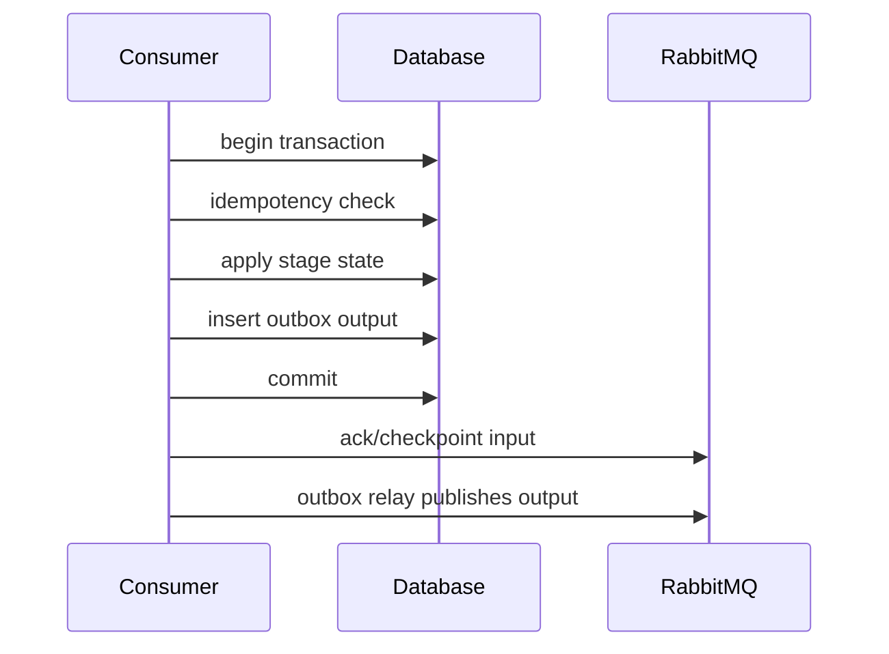

This avoids the classic bug:

```text
publish output -> DB commit fails -> downstream observes state that does not exist
```

Use transactional outbox at stage boundaries when output must reflect committed state.

---

## 11. Queue-Based Stage Implementation

A queue-based stage processes tasks.

```java
public final class QueueStageConsumer {
    private final StageHandler handler;
    private final Channel channel;

    public void onDelivery(String consumerTag, Delivery delivery) throws IOException {
        long tag = delivery.getEnvelope().getDeliveryTag();
        StageMessage message = decode(delivery.getBody(), delivery.getProperties());

        try {
            StageResult result = handler.handle(message);

            switch (result.type()) {
                case SUCCESS -> channel.basicAck(tag, false);
                case BUSINESS_REJECTED -> channel.basicAck(tag, false);
                case RETRYABLE_FAILURE -> channel.basicNack(tag, false, false); // route to DLX/retry topology
                case POISON -> channel.basicReject(tag, false);
            }
        } catch (Exception unexpected) {
            channel.basicNack(tag, false, false);
        }
    }
}
```

This skeleton assumes DLX/retry topology is configured. Do not use `requeue=true` for uncontrolled retry loops.

---

## 12. Stream-Based Stage Implementation

A stream-based stage processes events and tracks offsets.

```java
public final class StreamStageConsumer {
    private final StageHandler handler;
    private final StageDedupRepository dedup;
    private final OffsetCheckpointStore offsets;

    public void onMessage(Context context, Message raw) {
        long offset = context.offset();
        StageMessage message = decode(raw);

        try {
            if (dedup.tryStart(message.stageName(), message.messageId())) {
                handler.handle(message);
                dedup.markComplete(message.stageName(), message.messageId());
            }

            offsets.store(context.stream(), context.consumerName(), offset);
        } catch (PoisonMessageException poison) {
            park(message, poison);
            offsets.store(context.stream(), context.consumerName(), offset);
        } catch (Exception retryable) {
            // no checkpoint, replay later
            recordRetryableFailure(message, retryable);
        }
    }
}
```

Key distinction:

- queue stage failure uses nack/retry/DLQ;
- stream stage failure often means do not checkpoint, or park and checkpoint depending on policy.

---

## 13. Failure Isolation

A pipeline must prevent failures from spreading.

### Isolation Dimensions

| Dimension | Isolation mechanism |
|---|---|
| stage failure | queue/stream boundary |
| poison message | parking lot |
| dependency outage | retry with backoff, circuit breaker |
| slow consumer | per-stage backlog/lag |
| tenant overload | tenant routing/rate limit |
| schema bug | schema validation + park |
| downstream DB overload | bounded workers + backpressure |
| replay job overload | separate consumer identity / throttling |

### Bad Pipeline

```text
one shared queue for all stages and tenants
```

Problems:

- one poison message can affect everything;
- one tenant can dominate backlog;
- one stage cannot be scaled independently;
- DLQ contains mixed failure domains.

### Better Pipeline

```text
stage-specific queues/streams + tenant-aware routing where needed + stage-specific DLQ
```

---

## 14. Retry Policy Per Stage

Do not use one retry policy for the whole pipeline.

| Stage | Typical failure | Retry policy |
|---|---|---|
| validation | schema/business invalid | no retry, reject/park |
| pricing | reference data unavailable | delayed retry |
| payment | external gateway timeout | retry with strict budget |
| inventory | lock/conflict | short retry then compensate/escalate |
| notification | SMTP/API failure | long retry, low priority |
| analytics | downstream warehouse unavailable | replay from stream later |

A good stage defines:

```text
retryable failure
non-retryable technical failure
business rejection
poison message
timeout
max attempts
parking lot policy
alert threshold
```

---

## 15. DLQ Topology Per Stage

For queue stages:

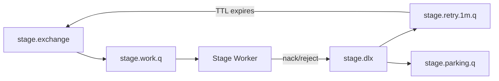

Guidelines:

- DLQ per stage, not one global dumping ground;
- include reason, attempt count, and original routing metadata;
- do not silently drop after max attempts;
- parking lot replay must be deliberate and audited;
- stage owner must own its DLQ.

---

## 16. Stream Stage Failure Policy

For stream stages, there is no destructive ack. You choose whether to checkpoint.

| Failure | Checkpoint? | Why |
|---|---|---|
| transient DB timeout | no | replay later |
| poison schema error | yes after parking | prevent infinite block |
| business rejection | yes after emitting rejection | valid terminal state |
| duplicate event | yes | already processed |
| downstream unavailable for hours | maybe stop consumer | avoid hot retry loop |

The policy must be explicit because stream replay can either heal the system or lock it into a retry storm.

---

## 17. Backpressure Between Stages

A pipeline is a chain of queues. If one stage slows, upstream must not keep producing unlimited work forever.

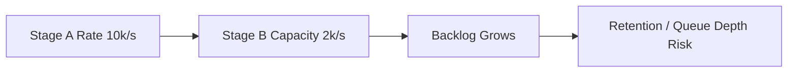

Backpressure strategies:

| Strategy | When to use |
|---|---|
| bounded producer in-flight | always |
| queue length limit | protect broker memory/storage |
| stream retention alert | prevent replay data loss |
| tenant rate limiting | noisy tenant isolation |
| circuit breaker | downstream dependency outage |
| load shedding | low-value events/tasks |
| priority separation | urgent vs batch work |
| separate pipelines | isolate latency classes |

Do not hide backpressure by creating infinite queues. Infinite backlog is delayed outage.

---

## 18. Pipeline Latency Model

Total latency:

```text
pipeline latency = sum(stage queue wait + stage processing + stage output publish + downstream wait)
```

For a 5-stage pipeline:

| Stage | Queue/lag wait | Processing | Output | Total |
|---|---:|---:|---:|---:|
| validate | 50 ms | 40 ms | 20 ms | 110 ms |
| price | 100 ms | 200 ms | 20 ms | 320 ms |
| reserve | 500 ms | 300 ms | 20 ms | 820 ms |
| fulfill | 200 ms | 100 ms | 20 ms | 320 ms |
| notify | 1,000 ms | 80 ms | 0 ms | 1,080 ms |

End-to-end p99 may be dominated by one stage.

Rule:

> Optimize the stage that dominates the end-to-end SLO, not the stage that is easiest to tune.

---

## 19. Ordering in Pipelines

Ordering must be defined per entity or per business invariant.

Examples:

| Requirement | Pipeline design |
|---|---|
| all events for an order in order | partition by `orderId` |
| payments before fulfillment | state machine enforces prerequisite |
| notifications can be out of order | no strict ordering, use latest state |
| tenant audit must be chronological | stream partition by tenant or audit sequence |
| inventory reservations per SKU ordered | partition by SKU |

Do not claim global ordering unless you can afford global serialization.

### Stage Reordering Risk

```text
OrderUpdated v2 processed before OrderCreated v1
```

Mitigations:

- sequence number per aggregate;
- state machine guards;
- gap detection;
- stale event discard;
- replay from stream;
- partition key aligned with aggregate.

---

## 20. Idempotency Per Stage

Each stage should have its own idempotency record.

```sql
CREATE TABLE pipeline_stage_execution (
  pipeline_id TEXT NOT NULL,
  stage_name TEXT NOT NULL,
  message_id UUID NOT NULL,
  entity_id TEXT NOT NULL,
  status TEXT NOT NULL,
  started_at TIMESTAMPTZ NOT NULL,
  completed_at TIMESTAMPTZ,
  output_message_id UUID,
  error_code TEXT,
  PRIMARY KEY (pipeline_id, stage_name, message_id)
);
```

Why per stage?

Because the same original event may pass through multiple stages, and each stage has its own side effect.

Idempotency must cover:

- input duplicate;
- output duplicate;
- retry after crash;
- replay after deployment;
- manual DLQ replay;
- compensating action replay.

---

## 21. Pipeline Output Deduplication

A stage should avoid emitting duplicate output for the same completed input.

Pattern:

```text
input message id + stage name -> deterministic output message id
```

Example:

```java
UUID outputMessageId = UUID.nameUUIDFromBytes(
    (stageName + ":" + inputMessageId + ":" + outputType).getBytes(StandardCharsets.UTF_8)
);
```

Or persist output id in the stage execution table.

This helps downstream consumers dedup even if the output publish is retried.

---

## 22. Pipeline Versioning

Pipelines evolve. Stages are added, removed, split, merged, or rewritten.

Version explicitly:

```text
pipelineId = order-fulfillment-v4
stage = inventory-reservation
schemaVersion = 3
```

Evolution patterns:

### Additive Stage

Add new optional subscriber to existing event stream.

Good when:

- old pipeline remains valid;
- new stage is side-effect independent.

### Branch Migration

Route subset of traffic to new stage.

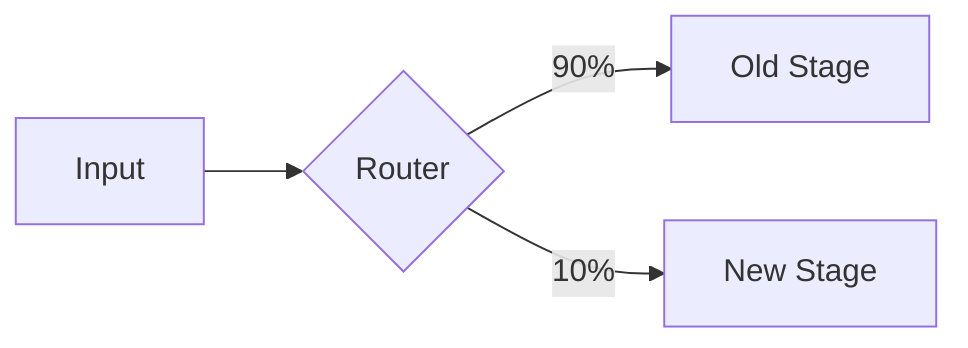

### Dual Publish

Produce old and new event versions during migration.

Risk:

- duplicate business meaning;
- consumers confused by two sources of truth.

### Replay Migration

Build new projection/stage output by replaying stream from historical offset.

Good when:

- source stream has sufficient retention;
- handler is deterministic and idempotent.

---

## 23. Observability Model

A pipeline must be observable per stage and end-to-end.

### Per-Stage Metrics

| Metric | Meaning |
|---|---|
| input rate | incoming workload |
| output rate | successful stage throughput |
| queue depth / stream lag | backlog |
| processing latency | handler cost |
| wait latency | broker backlog cost |
| retry count | transient instability |
| poison count | data/schema quality |
| duplicate count | redelivery/replay pressure |
| parking lot age | unresolved operational debt |
| downstream latency | dependency health |

### End-to-End Metrics

| Metric | Meaning |
|---|---|
| pipeline duration | total business time |
| stage contribution | bottleneck detection |
| state transition count | progress |
| stuck entity count | workflow health |
| compensation count | failure cost |
| SLA violation count | user/business impact |

### Trace Context

Every message should preserve:

```text
traceId
spanId / parentSpanId
correlationId
causationId
pipelineId
stage
entityId
```

Do not rely on logs alone. Use message metadata to connect distributed state.

---

## 24. Pipeline Dashboard

A useful dashboard has one row per stage:

| Stage | Input/s | Output/s | Lag/depth | p95 wait | p95 process | Retry/s | Poison/s | Oldest age |
|---|---:|---:|---:|---:|---:|---:|---:|---:|
| validate | 900 | 900 | 120 | 50 ms | 30 ms | 0 | 0 | 10s |
| price | 900 | 850 | 8,000 | 4s | 300 ms | 12 | 0 | 4m |
| reserve | 850 | 850 | 100 | 80 ms | 500 ms | 3 | 1 | 20s |
| notify | 850 | 300 | 90,000 | 9m | 100 ms | 40 | 0 | 35m |

This immediately shows bottlenecks:

- pricing is falling behind;
- notification is severely lagging;
- reserve has poison messages.

---

## 25. Pipeline Runbook: One Stage Falling Behind

Symptoms:

- queue depth or stream lag grows for one stage;
- upstream stages are healthy;
- downstream outputs delayed.

Steps:

1. Check stage processing latency.
2. Check downstream dependency latency/errors.
3. Check worker pool saturation.
4. Check retry loops and poison messages.
5. Check whether one tenant/entity dominates backlog.
6. Estimate catch-up time.
7. Scale consumers only if downstream has capacity.
8. If dependency outage exists, reduce retry intensity.
9. If poison messages block stream checkpoint, park according to policy.
10. After recovery, verify output rate exceeds input rate until backlog clears.

---

## 26. Pipeline Runbook: DLQ Spike

Symptoms:

- DLQ rate increases;
- stage output rate drops;
- business process stuck or compensation rises.

Steps:

1. Group DLQ by error code and schema version.
2. Identify first occurrence timestamp.
3. Check recent deployment/config/schema changes.
4. Sample messages; do not replay blindly.
5. Classify retryable vs poison vs business rejection.
6. Fix handler/schema/config if systemic.
7. Replay small controlled batch.
8. Monitor duplicate and downstream side effects.
9. Document replay decision.
10. Add contract test if missing.

---

## 27. Pipeline Runbook: End-to-End SLA Breach

Symptoms:

- users/business observe delayed completion;
- individual stages may look only slightly slow;
- total latency exceeds SLO.

Steps:

1. Break down latency by stage.
2. Find dominant wait time vs processing time.
3. Check whether latency is uniform or tenant/entity-specific.
4. Inspect retry/backoff contribution.
5. Inspect downstream dependency calls.
6. Determine if pipeline has unnecessary asynchronous hops.
7. Temporarily prioritize affected workload if valid.
8. Adjust capacity/backpressure.
9. Consider merging/splitting stages only after measurement.
10. Update SLO budget per stage.

---

## 28. Queue Pipeline Example: Document Processing

Use case:

```text
upload -> virus scan -> OCR -> classify -> index -> notify
```

Design:

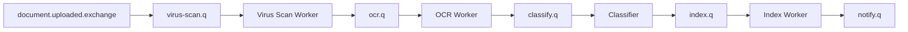

Why queue-based:

- each document stage is a task;
- workers compete;
- replay of full history is not primary;
- DLQ per stage is natural;
- stage-specific CPU/GPU scaling matters.

Key design points:

- document id as idempotency key;
- output state persisted in DB;
- large binary files stored externally, not in message body;
- message carries pointer and checksum;
- stage output generated through outbox.

---

## 29. Stream Pipeline Example: Audit/Event Processing

Use case:

```text
business events -> normalization -> enrichment -> risk signal -> analytics/audit
```

Design:

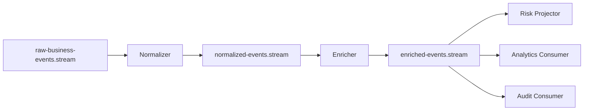

Why stream-based:

- replay is valuable;
- many consumers read same data;
- audit retention matters;
- transformations can be rebuilt;
- consumer offsets isolate progress.

Key design points:

- deterministic transformation;
- schema compatibility;
- output stream retention planned;
- poison messages parked with source offset;
- replay jobs use separate consumer identity.

---

## 30. Hybrid Pipeline Example: Order Fulfillment

Use case:

```text
order submitted -> durable event history -> task dispatch -> stage-specific work queues
```

Design:

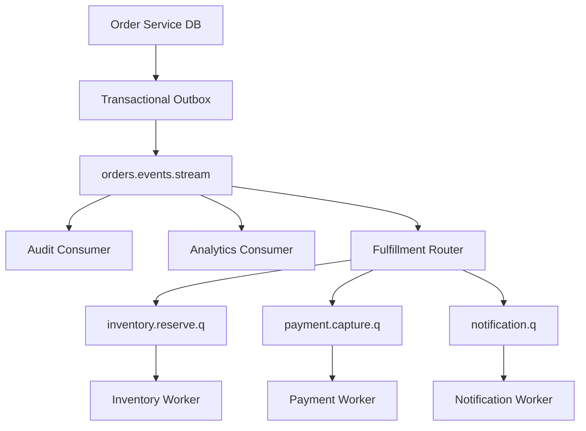

Why hybrid:

- stream keeps durable event history;
- queues dispatch operational tasks;
- subscribers are isolated;
- replay can rebuild projections;
- task queues can have specific retry/DLQ policies.

This is often more robust than forcing everything into queues or everything into streams.

---

## 31. Pipeline Testing Strategy

### Unit Tests

- handler logic;
- schema validation;
- idempotency behavior;
- routing key generation;
- failure classification.

### Contract Tests

- input schema compatibility;
- output schema compatibility;
- required metadata;
- routing key taxonomy;
- error output format.

### Integration Tests

- real RabbitMQ topology;
- manual ack/nack behavior;
- DLQ routing;
- stream offset checkpoint;
- replay behavior;
- outbox relay publish.

### Failure Tests

- consumer crash after DB commit before ack/checkpoint;
- broker restart during publish;
- downstream DB outage;
- poison message;
- duplicate delivery;
- hot tenant;
- slow consumer;
- DLQ replay.

### Load Tests

- stage throughput;
- end-to-end latency;
- backlog recovery;
- retry storm;
- replay catch-up;
- noisy tenant isolation.

---

## 32. Local Practice Lab

Build a three-stage pipeline:

```text
OrderSubmitted -> ValidateOrder -> PriceOrder -> ReserveInventory
```

Requirements:

1. `OrderSubmitted` is published through an outbox relay.
2. Validation consumes from a stream and emits `OrderValidated` or `OrderRejected`.
3. Pricing consumes `OrderValidated` and emits `OrderPriced`.
4. Inventory reservation is a command queue.
5. Every stage has idempotency table.
6. Every stage has separate DLQ or parking lot.
7. Failure injection can simulate DB timeout, poison message, duplicate, and broker restart.
8. Dashboard shows per-stage lag/depth and latency.
9. Replay from `OrderSubmitted` can rebuild validation/pricing outputs safely.

Completion standard:

> You can kill any process at any point and explain exactly which messages may be replayed, duplicated, parked, or completed.

---

## 33. Design Review Questions

Ask these before approving a RabbitMQ pipeline:

1. What is the responsibility of each stage?
2. Why is this stage asynchronous?
3. Why is this boundary a queue, stream, or exchange?
4. What is the input contract?
5. What is the output contract?
6. What is the idempotency key?
7. What happens if the stage crashes after committing state but before ack/checkpoint?
8. What happens if the output publish succeeds but the process crashes before marking output sent?
9. How are poison messages identified and parked?
10. How is retry bounded?
11. How is ordering preserved where required?
12. What metrics prove the stage is healthy?
13. What alert tells us the stage is silently falling behind?
14. How do we replay safely?
15. Who owns this stage’s DLQ/runbook?
16. How does this pipeline evolve without breaking consumers?

---

## 34. Architecture Decision Record Template

```mdx
# ADR: Use RabbitMQ Hybrid Stream/Queue Pipeline for Order Fulfillment

## Context
Order fulfillment requires durable event history, replayable projections, and task dispatch to independent workers.

## Decision
Use `orders.events.stream` for canonical event history and stage-specific AMQP queues for operational tasks such as inventory reservation and notification.

## Consequences
Positive:
- audit/replay supported;
- operational task stages can scale independently;
- subscriber queues are isolated;
- per-stage retry/DLQ policy is possible.

Negative:
- more topology to operate;
- stream offsets and queue acks require different mental models;
- stage idempotency is mandatory.

## Invariants
- stage output is emitted via transactional outbox;
- checkpoint/ack occurs only after durable effect;
- all handlers are idempotent;
- DLQ replay is controlled and audited.
```

---

## 35. Common Anti-Patterns

### Anti-Pattern 1 — Broker as Hidden Workflow Engine

Symptoms:

- dozens of queues encode business process implicitly;
- no explicit state machine;
- no owner knows full lifecycle.

Fix:

- document workflow state machine;
- make messages represent explicit transitions;
- consider workflow engine if orchestration complexity dominates.

### Anti-Pattern 2 — One Global DLQ

Symptoms:

- all failures go to one queue;
- no stage owner;
- replay is dangerous.

Fix:

- DLQ/parking lot per stage;
- include failure metadata;
- require replay runbook.

### Anti-Pattern 3 — No Idempotency Because “RabbitMQ Will Retry”

Retry creates duplicates. It does not remove them.

Fix:

- idempotency per stage;
- deterministic output ids;
- dedup tables or natural business constraints.

### Anti-Pattern 4 — Asynchronous Hop for Every Method

Symptoms:

- pipeline latency explodes;
- topology replaces code structure;
- debugging requires tracing many queues.

Fix:

- make stages meaningful operational boundaries;
- keep internal transformations in-process when they share failure/scaling profile.

### Anti-Pattern 5 — Streams for Task Dispatch

Streams can dispatch work, but queues are often better when each task should be consumed by one worker and removed from active backlog.

Fix:

- use streams for history/replay/fan-out;
- use queues for task execution.

---

## 36. Production Checklist

Before shipping a pipeline:

- [ ] Each stage has clear responsibility.
- [ ] Each boundary type is justified.
- [ ] Input/output schemas are versioned.
- [ ] Routing keys are documented.
- [ ] Ack/checkpoint happens after durable effect.
- [ ] Output publish is protected by outbox where needed.
- [ ] Idempotency exists per stage.
- [ ] Retry policy is per stage.
- [ ] DLQ/parking lot is per stage.
- [ ] Poison message handling is explicit.
- [ ] Backpressure is bounded.
- [ ] Lag/depth alerts exist per stage.
- [ ] End-to-end correlation exists.
- [ ] Replay process is documented.
- [ ] Failure injection tests pass.
- [ ] Ownership/runbook is assigned.

---

## 37. Summary

RabbitMQ pipelines are powerful because they separate work into explicit boundaries. But every boundary creates a distributed systems problem: failure, retry, duplicate, lag, ordering, observability, ownership, and evolution.

The production mental model:

```text
pipeline = state transitions + stage contracts + durable boundaries + failure policies
```

Queues are excellent for task dispatch and competing workers. Streams are excellent for replayable event/data pipelines. Exchanges are excellent for routing and fan-out. Real systems often combine them.

The top-tier engineer does not ask, “How many queues should we create?”

They ask:

> Which boundaries create real operational independence, and what correctness contract protects each boundary under crash, retry, replay, and overload?

---

## References

- RabbitMQ AMQP concepts documentation — exchanges, queues, bindings, routing keys, and queue semantics.
- RabbitMQ consumer acknowledgement and publisher confirms documentation — ack/confirm safety boundaries.
- RabbitMQ dead-letter exchange documentation — DLX, dead-letter routing, and dead-lettering reasons.
- RabbitMQ Streams documentation — stream semantics, offset-based consumption, retention, and super streams.
- RabbitMQ Stream Java Client documentation — stream producers, consumers, offset tracking, and client-side stream patterns.
