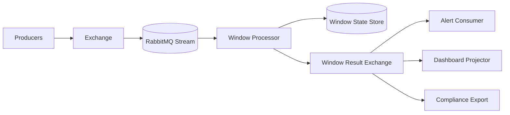
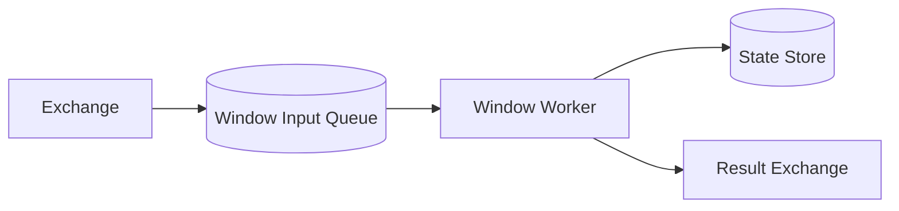
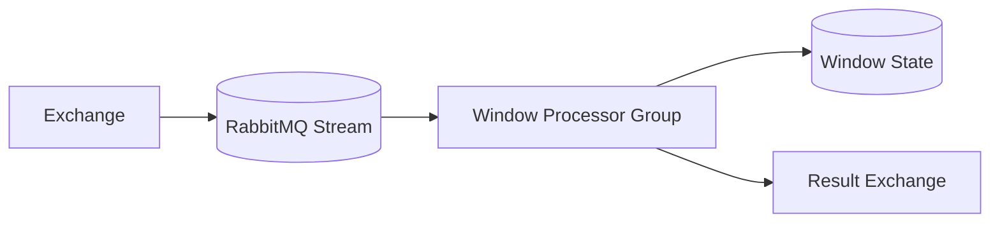
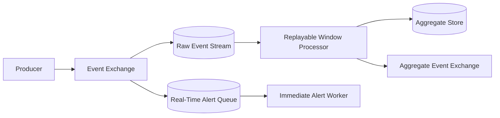
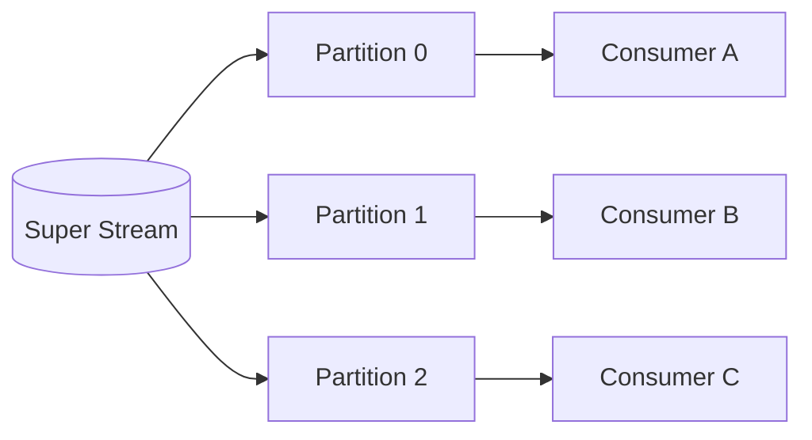
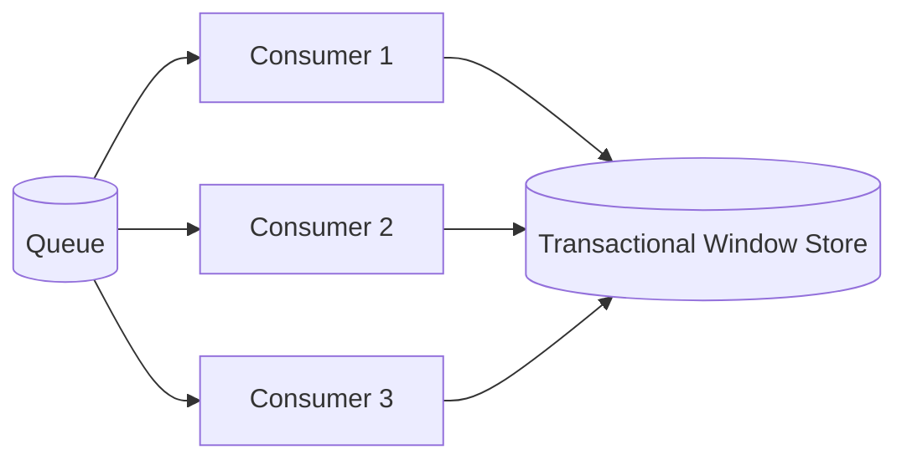
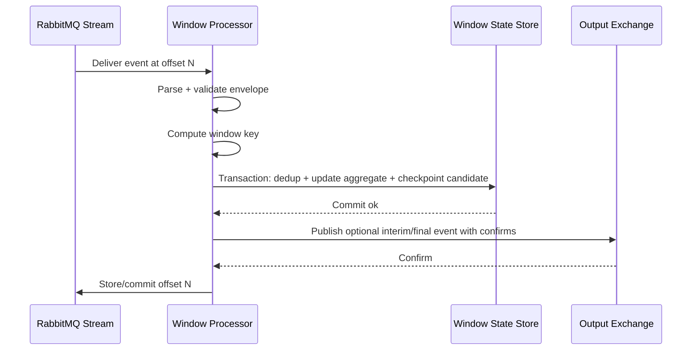
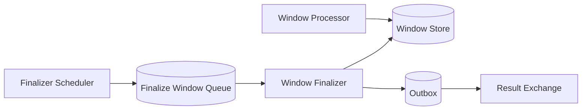
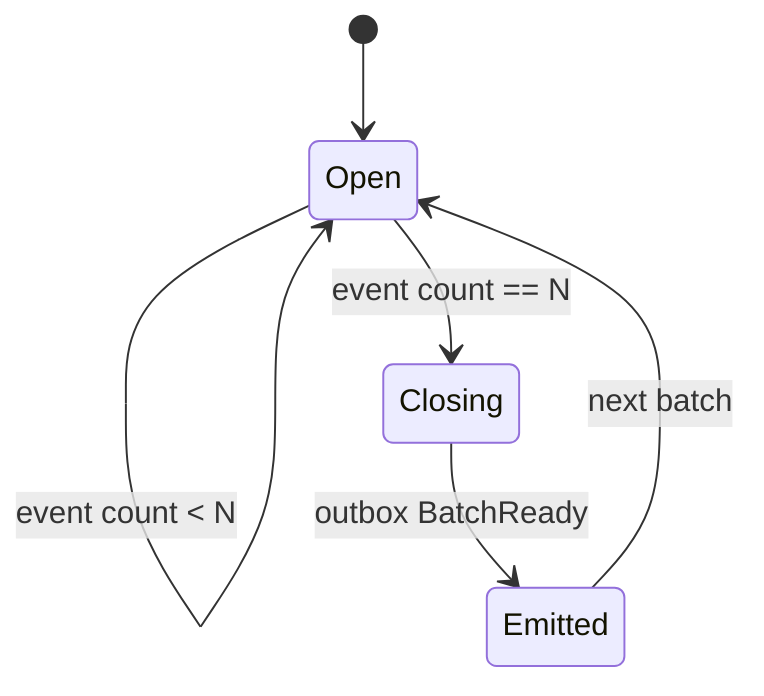

# Part 025 — Windowing Pattern: Time Windows, Count Windows, Session Windows

Windowing is the practice of grouping messages into bounded sets before computing a result.

It is common in fraud detection, rate limiting, SLA monitoring, billing aggregation, reconciliation, anomaly detection, telemetry processing, and compliance reporting.

RabbitMQ is not a full stream-processing engine like Kafka Streams, Flink, Spark Structured Streaming, or Beam. RabbitMQ will not automatically give you watermarks, event-time joins, state stores, changelog topics, exactly-once processing, window lifecycle management, or automatic state repartitioning.

That does not make windowing impossible. It means the windowing responsibility belongs to the application and must be designed explicitly.

This part explains how to implement windowing with Java and RabbitMQ safely, especially when using RabbitMQ Streams for replayable input and queues for command-oriented dispatch.

---

## 1. Kaufman Deconstruction

To master windowing in RabbitMQ systems, decompose the skill into twelve capabilities:

1. **Window definition** — know exactly what belongs inside a window.
2. **Time semantics** — distinguish event time, broker arrival time, processing time, and commit time.
3. **Trigger policy** — decide when a window emits a result.
4. **State model** — decide where partial aggregates live.
5. **Replay model** — make rebuild possible from retained streams.
6. **Late-message policy** — define what happens when data arrives after a window closed.
7. **Idempotency model** — prevent duplicate messages from corrupting aggregates.
8. **Partitioning model** — route related messages to the same window owner.
9. **Checkpointing model** — commit progress only after state is safe.
10. **Backpressure model** — keep window state bounded under overload.
11. **Correction model** — emit adjustment events when old windows change.
12. **Operational model** — measure lag, skew, window cardinality, and stuck windows.

The standard:

> A windowing implementation is production-ready only when it can be replayed, corrected, bounded, and audited.

---

## 2. What a Window Is

A window is a rule that turns an unbounded message sequence into bounded groups.

Example message stream:

```text
payment-1 at 10:00:01
payment-2 at 10:00:03
payment-3 at 10:00:14
payment-4 at 10:01:02
payment-5 at 10:01:20
```

A one-minute tumbling window groups it into:

```text
[10:00:00, 10:01:00) -> payment-1, payment-2, payment-3
[10:01:00, 10:02:00) -> payment-4, payment-5
```

The important property is not the grouping itself. The important property is the invariant behind the grouping:

> For a given key and window definition, every eligible input message must contribute to the aggregate exactly according to the business rule, even if delivery is duplicated, delayed, retried, replayed, or partially failed.

---

## 3. RabbitMQ Windowing Boundary

RabbitMQ gives you message transport, durability, routing, replay via streams, acknowledgements, publisher confirms, and backpressure mechanisms.

RabbitMQ does not give you application-level window semantics.

That means the application must own:

- window key;
- window start/end calculation;
- state storage;
- duplicate detection;
- late-message handling;
- finalization;
- correction events;
- replay checkpoint;
- operational lifecycle.

A clean architecture looks like this:



The stream is the durable input log. The state store is the authoritative window state. The output exchange publishes derived facts.

---

## 4. Queue-Based vs Stream-Based Windowing

RabbitMQ supports both queue-style and stream-style consumption. Windowing usually benefits from stream-style input, but not always.

### 4.1 Queue-Based Windowing

Queue-based windowing uses an AMQP queue as the input boundary.



Use it when:

- each message represents work that should be consumed once;
- replay is not a primary requirement;
- the window is short-lived;
- loss of historical reconstruction is acceptable because the state store is authoritative;
- retry/DLQ behavior is more important than replay.

Trade-offs:

| Property | Queue-Based Windowing |
|---|---|
| Replay | Difficult after ack unless copied elsewhere |
| Fan-out | Requires queue per independent processor |
| Retry | Natural with nack/DLX/retry queues |
| Window correctness | Application-owned |
| Backlog handling | Queues prefer converging toward empty |
| Audit reconstruction | Requires external store |

### 4.2 Stream-Based Windowing

Stream-based windowing reads from RabbitMQ Streams or Super Streams.



Use it when:

- replay matters;
- multiple processors need the same data;
- historical rebuild is required;
- large backlogs are expected;
- auditability matters;
- analytics-like processing is needed;
- state can be rebuilt from retained input.

Trade-offs:

| Property | Stream-Based Windowing |
|---|---|
| Replay | Strong, until retention removes data |
| Fan-out | Efficient, non-destructive consumption |
| Retry | Application-owned, not queue DLX-style |
| Offset | Progress pointer, not business commit by itself |
| State | Must be externally managed |
| Window rebuild | Natural if retention is sufficient |

### 4.3 Hybrid Windowing

The most practical architecture is often hybrid.



The queue handles immediate operational work. The stream preserves replayable facts.

This avoids a bad false choice: either low-latency dispatch or replayable analytics. In RabbitMQ you can design both when the topology is explicit.

---

## 5. The Four Time Concepts

Windowing bugs often come from confusing time concepts.

### 5.1 Event Time

Event time is when the business event happened.

Example:

```json
{
  "eventType": "PaymentAuthorized",
  "paymentId": "pay-942",
  "occurredAt": "2026-07-01T10:04:31.128Z"
}
```

Use event time when the result must reflect the real-world sequence.

Examples:

- daily revenue;
- per-hour fraud count;
- SLA breach windows;
- regulatory reporting;
- billing periods.

### 5.2 Broker Arrival Time

Broker arrival time is when RabbitMQ accepted the message.

This is useful for operational analysis but usually wrong for business windows.

A payment authorized at 10:04 but published at 10:09 still belongs to the 10:04 business window if the business rule is event-time based.

### 5.3 Processing Time

Processing time is when the consumer processed the message.

Use it for operational windows:

- messages processed per minute;
- handler latency;
- JVM throughput;
- consumer lag snapshots;
- DLQ rate.

Do not use processing time for business aggregates unless the business rule explicitly says so.

### 5.4 Commit Time

Commit time is when the window state became durable.

This matters for correctness:

```text
read message -> update aggregate -> commit DB -> checkpoint offset / ack
```

The system is only safe after the aggregate update and dedup record commit.

---

## 6. Window Types

### 6.1 Tumbling Time Window

A tumbling window is fixed-size and non-overlapping.

Example:

```text
[10:00, 10:05)
[10:05, 10:10)
[10:10, 10:15)
```

Use it for:

- per-minute payment volume;
- hourly SLA breach count;
- daily tenant usage;
- five-minute error rate snapshots.

Window key:

```text
tenantId + metricName + windowStart + windowEnd
```

Diagram:

```mermaid
timeline
  title Tumbling Window
  10:00 : Window A
  10:05 : Window B
  10:10 : Window C
  10:15 : Window D
```

Java calculation:

```java
import java.time.Duration;
import java.time.Instant;

public final class Windowing {
    public static Instant tumblingStart(Instant eventTime, Duration size) {
        long epochMillis = eventTime.toEpochMilli();
        long sizeMillis = size.toMillis();
        long startMillis = Math.floorDiv(epochMillis, sizeMillis) * sizeMillis;
        return Instant.ofEpochMilli(startMillis);
    }

    public static Instant tumblingEnd(Instant start, Duration size) {
        return start.plus(size);
    }
}
```

Invariant:

> A message belongs to exactly one tumbling window for a given key and size.

### 6.2 Hopping Window

A hopping window is fixed-size and starts at regular intervals. Windows can overlap.

Example:

```text
size = 10 minutes
hop  = 5 minutes

[10:00, 10:10)
[10:05, 10:15)
[10:10, 10:20)
```

A message can belong to multiple windows.

Use it for:

- rolling error rate;
- rolling transaction velocity;
- rolling abuse detection;
- near-real-time dashboards.

Invariant:

> A message can update N windows, where N is approximately window size divided by hop size.

Implementation caution:

```java
public static List<Instant> hoppingStarts(Instant eventTime, Duration size, Duration hop) {
    long t = eventTime.toEpochMilli();
    long hopMillis = hop.toMillis();
    long sizeMillis = size.toMillis();

    long latestStart = Math.floorDiv(t, hopMillis) * hopMillis;
    List<Instant> starts = new ArrayList<>();

    for (long start = latestStart; start > t - sizeMillis; start -= hopMillis) {
        long end = start + sizeMillis;
        if (start <= t && t < end) {
            starts.add(Instant.ofEpochMilli(start));
        }
    }

    return starts;
}
```

This creates write amplification. One input message can update many window rows.

### 6.3 Sliding Window

A sliding window is often described as a window that moves continuously.

Example:

```text
last 5 minutes from now
```

In distributed systems, a true continuously sliding window can be expensive. You usually approximate it with either:

- hopping windows;
- event buckets;
- sorted event store per key;
- in-memory ring buffer with external snapshot;
- Redis sorted sets;
- database time-bucket table.

Use it for:

- rate limiting;
- “last N minutes” alerts;
- fraud velocity checks;
- API abuse detection.

Caution:

> Sliding windows are operationally dangerous when key cardinality is high and cleanup is not explicit.

### 6.4 Count Window

A count window closes after N messages.

Example:

```text
Every 100 events for account A
```

Use it for:

- batch scoring;
- bulk validation;
- chunked export;
- periodic partial aggregation;
- reducing downstream writes.

Count windows are sensitive to duplicates. A duplicate message can close the window early unless deduplication happens before the count increment.

Correct order:

```text
receive -> dedup -> increment count -> maybe close window -> commit -> ack/checkpoint
```

### 6.5 Session Window

A session window groups events separated by inactivity gaps.

Example:

```text
user activity session ends after 30 minutes of inactivity
```

Use it for:

- user activity sessions;
- device telemetry sessions;
- marketplace browsing sessions;
- case-handling bursts;
- regulatory workflow episodes.

Session windows are harder than tumbling windows because a late event can merge sessions.

Example:

```text
Window A: [10:00, 10:20]
Window B: [10:55, 11:10]
Late event at 10:35 with 30-minute inactivity gap
```

The late event can bridge two sessions:

```text
Merged Window: [10:00, 11:10]
```

This requires a correction model.

---

## 7. Windowing by Business Intent

Do not choose a window type from technology preference. Choose it from the business invariant.

| Intent | Window Type | Time Basis | Common Output |
|---|---|---|---|
| “Revenue per day” | Tumbling | Event time | Daily aggregate |
| “Errors in last 5 minutes” | Sliding or hopping | Processing or event time | Alert |
| “100 messages per batch” | Count | Processing order | Batch result |
| “User session” | Session | Event time | Session summary |
| “Rolling 1h risk score every 5m” | Hopping | Event time | Risk aggregate |
| “Tenant throughput per minute” | Tumbling | Broker/processing time | Operational metric |
| “SLA breach after deadline” | Tumbling + timer | Event/commit time | Breach event |

The strongest design starts with this sentence:

> For key K, compute aggregate A over messages M whose business time T falls inside window W, emit result R when trigger condition C is satisfied, and apply correction policy P for late data.

---

## 8. Window Key Design

Window keys determine state cardinality, partitioning, ordering, and replay cost.

A window key is usually:

```text
businessKey + aggregateName + windowStart + windowEnd
```

Examples:

```text
tenant-42:payment-volume:2026-07-01T10:00:00Z:2026-07-01T10:05:00Z
account-99:fraud-velocity:2026-07-01T10:00:00Z:2026-07-01T10:10:00Z
region-apac:error-count:2026-07-01T10:00:00Z:2026-07-01T10:01:00Z
```

Good key properties:

- deterministic;
- compact;
- stable across deployments;
- includes aggregate type;
- includes version when semantics change;
- partitionable;
- queryable;
- audit-friendly.

Bad key examples:

```text
current-minute
latest
user-window
aggregate
window-1
```

These keys are ambiguous and cannot survive replay.

---

## 9. Partitioning Requirement

Windowing has a strong partitioning requirement:

> All messages that can update the same window should be processed by the same logical owner or coordinated through a transactional state store.

There are two broad models.

### 9.1 Single Owner per Key

Partition by business key.



Messages for the same account/tenant/entity are routed to the same partition.

Pros:

- simpler window state;
- easier ordering reasoning;
- fewer concurrent update conflicts;
- natural checkpointing per partition.

Cons:

- hot key risk;
- repartitioning is hard;
- per-partition lag can diverge;
- one slow key can affect neighbors in same partition.

### 9.2 Shared State Store Coordination

Multiple workers can update the same window, but the state store enforces correctness.



Pros:

- easier horizontal scale for unordered workloads;
- can work with classic queues;
- no strict partitioning dependency.

Cons:

- database contention;
- dedup race conditions;
- more complex transaction design;
- possible aggregate write hotspots.

Rule of thumb:

> If the window computation is stateful and order-sensitive, prefer partition ownership. If it is commutative and associative, coordinated shared state can work.

---

## 10. Aggregation Algebra

Windowing becomes easier when the aggregation is mathematically safe.

### 10.1 Commutative Aggregates

Order does not matter.

Examples:

- count;
- sum;
- min;
- max;
- set union;
- approximate distinct count.

For these, duplicate handling is still required, but ordering is less important.

### 10.2 Associative Aggregates

Partial results can be combined.

Example:

```text
sum(sum(partitionA), sum(partitionB))
```

This enables scalable aggregation.

### 10.3 Non-Commutative Aggregates

Order matters.

Examples:

- first event;
- last valid state transition;
- sequence validation;
- session merge;
- event-sourced state reconstruction.

These require stronger partitioning and ordering controls.

### 10.4 Correction-Friendly Aggregates

Some aggregates can be corrected by emitting deltas.

Example:

```text
WindowPaymentTotalCorrected {
  windowId: W,
  previousTotal: 1000,
  correctedTotal: 1250,
  delta: +250,
  reason: "late payment event"
}
```

For regulated systems, correction events are usually better than mutating history silently.

---

## 11. State Store Model

RabbitMQ carries messages. It should not be the authoritative state store for windows.

The state store can be:

- PostgreSQL;
- Redis;
- Cassandra;
- RocksDB embedded with snapshotting;
- object storage snapshots;
- any durable store with the required consistency properties.

For most Java business systems, a relational table is the easiest to reason about.

Conceptual tables:

```text
window_aggregate
- aggregate_key
- window_start
- window_end
- aggregate_type
- version
- status
- count
- sum
- min
- max
- updated_at
- closed_at

window_message_dedup
- aggregate_key
- window_start
- message_id
- contribution_hash
- processed_at

window_checkpoint
- consumer_name
- stream_name
- partition
- offset
- committed_at
```

Do not make this a database tutorial. The design principle matters more than the specific DDL:

> Window state, dedup state, and progress state must move forward atomically enough that replay cannot corrupt the aggregate.

---

## 12. Minimal Window Event Envelope

A windowing system needs richer metadata than a basic message handler.

```json
{
  "messageId": "evt-20260701-000942",
  "eventType": "PaymentAuthorized",
  "schemaVersion": 3,
  "occurredAt": "2026-07-01T10:04:31.128Z",
  "publishedAt": "2026-07-01T10:04:31.730Z",
  "producer": "payment-service",
  "tenantId": "tenant-42",
  "partitionKey": "account-778",
  "correlationId": "case-9021",
  "causationId": "cmd-881",
  "payload": {
    "paymentId": "pay-942",
    "accountId": "account-778",
    "amount": 125000,
    "currency": "IDR"
  }
}
```

Required for serious windowing:

- stable `messageId`;
- event-time field such as `occurredAt`;
- key used for partitioning;
- schema version;
- correlation/causation for audit;
- payload fields needed for aggregation.

---

## 13. Tumbling Window Processor Blueprint

This blueprint assumes RabbitMQ Streams input and a durable state store.



Important ordering:

1. Process input.
2. Commit aggregate and dedup.
3. Publish result if needed.
4. Commit/checkpoint offset.

For result publishing, there are two safe patterns.

### 13.1 Publish Result Inside Outbox

Inside the state transaction:

```text
upsert window aggregate
insert dedup row
insert output event into outbox
commit
```

Then a separate outbox publisher sends the result to RabbitMQ with publisher confirms.

This is the safest for business events.

### 13.2 Publish After State Commit

Process message, commit state, then publish result.

This can duplicate output if the app crashes after publish but before checkpoint. Downstream consumers must be idempotent.

Use it when the result is operational or duplicate-safe.

---

## 14. Java Domain Model

Keep the window model explicit.

```java
import java.time.Instant;
import java.util.Objects;

public record WindowId(
        String aggregateType,
        String businessKey,
        Instant startInclusive,
        Instant endExclusive,
        int version
) {
    public WindowId {
        Objects.requireNonNull(aggregateType);
        Objects.requireNonNull(businessKey);
        Objects.requireNonNull(startInclusive);
        Objects.requireNonNull(endExclusive);
        if (!startInclusive.isBefore(endExclusive)) {
            throw new IllegalArgumentException("window start must be before end");
        }
    }

    public String stableKey() {
        return aggregateType + ":" + businessKey + ":" + version + ":" + startInclusive + ":" + endExclusive;
    }
}
```

Window contribution:

```java
import java.math.BigDecimal;

public record PaymentContribution(
        String messageId,
        String paymentId,
        String accountId,
        BigDecimal amount,
        String currency
) {}
```

Window aggregate:

```java
import java.math.BigDecimal;
import java.time.Instant;

public final class PaymentWindowAggregate {
    private final WindowId id;
    private long count;
    private BigDecimal total;
    private Instant maxEventTime;
    private boolean closed;

    public PaymentWindowAggregate(WindowId id) {
        this.id = id;
        this.total = BigDecimal.ZERO;
    }

    public void apply(PaymentContribution contribution, Instant eventTime) {
        if (closed) {
            throw new IllegalStateException("cannot update closed window without correction policy");
        }
        this.count++;
        this.total = this.total.add(contribution.amount());
        if (maxEventTime == null || eventTime.isAfter(maxEventTime)) {
            this.maxEventTime = eventTime;
        }
    }

    public WindowId id() {
        return id;
    }

    public long count() {
        return count;
    }

    public BigDecimal total() {
        return total;
    }
}
```

Do not hide window semantics inside generic maps. Window code should be boring, explicit, and testable.

---

## 15. Dedup Before Aggregate Update

Duplicates are normal in RabbitMQ systems designed for at-least-once delivery.

The window update must be idempotent.

Wrong:

```text
increment aggregate
insert dedup record
```

If the process crashes between the two, replay increments again.

Correct:

```text
begin transaction
insert dedup record with unique key
if inserted:
    update aggregate
else:
    skip aggregate
commit
```

Conceptual Java:

```java
public final class WindowUpdater {
    private final WindowRepository repository;

    public ApplyResult apply(WindowId windowId, PaymentContribution contribution) {
        return repository.inTransaction(tx -> {
            boolean firstTime = tx.tryInsertDedup(
                    windowId.stableKey(),
                    contribution.messageId(),
                    contribution.paymentId()
            );

            if (!firstTime) {
                return ApplyResult.duplicate();
            }

            tx.upsertPaymentAggregate(windowId, contribution);
            return ApplyResult.applied();
        });
    }
}
```

This pattern is more important than any library choice.

---

## 16. Trigger Policy

A window must decide when to emit.

Common trigger types:

1. **End-of-window trigger** — emit when time passes window end plus allowed lateness.
2. **Count trigger** — emit every N messages.
3. **Periodic trigger** — emit intermediate results every interval.
4. **Threshold trigger** — emit when aggregate crosses a threshold.
5. **Manual trigger** — emit during reconciliation/backfill.

### 16.1 End-of-Window Trigger

For a 5-minute window with 2-minute allowed lateness:

```text
window end:       10:05
allowed lateness: 2 minutes
finalize after:   10:07
```

This requires a scheduler/timer.

Options:

- application scheduler scanning open windows;
- delayed message to a finalize queue;
- database job;
- workflow engine;
- external scheduler.

RabbitMQ can help route finalization commands, but it should not be treated as a complete timer/state engine for large-scale window lifecycle management.

### 16.2 Threshold Trigger

Example:

```text
If account has more than 5 failed payments in 10 minutes, emit FraudVelocityExceeded.
```

The trigger is evaluated after each aggregate update.

```java
if (aggregate.failedCount() > 5 && !aggregate.thresholdAlreadyEmitted("FAILED_PAYMENT_5")) {
    outbox.add(new FraudVelocityExceeded(...));
    aggregate.markThresholdEmitted("FAILED_PAYMENT_5");
}
```

The `thresholdAlreadyEmitted` guard is necessary because duplicate/replay can otherwise send repeated alerts.

### 16.3 Periodic Trigger

Periodic triggers are useful for dashboards.

```text
Emit partial aggregate every 30 seconds while window is open.
```

Partial results must be marked as partial:

```json
{
  "eventType": "PaymentWindowPartialUpdated",
  "windowStatus": "OPEN",
  "isFinal": false
}
```

Final results must be distinguishable:

```json
{
  "eventType": "PaymentWindowFinalized",
  "windowStatus": "FINAL",
  "isFinal": true
}
```

---

## 17. Late Messages

A late message is a message whose event time belongs to a window that has already emitted or closed.

Late messages are not rare:

- producer retries;
- mobile/offline clients;
- outbox relay lag;
- upstream outage;
- network partition;
- clock skew;
- replay/backfill;
- manual repair.

Late-message policies:

| Policy | Behavior | Use Case |
|---|---|---|
| Reject | Send to late-message DLQ | Strict operational windows |
| Accept until allowed lateness | Update open/closing window | Common analytics/business windows |
| Correct closed result | Emit correction event | Finance/compliance/reporting |
| Rebuild | Recompute window from source stream | High-assurance aggregate |
| Ignore | Drop after audit log | Non-critical dashboard metric |

For business systems, silent ignore is rarely acceptable.

### 17.1 Allowed Lateness

Allowed lateness is a grace period after the window end.

```text
window:           [10:00, 10:05)
allowed lateness: 2 minutes
accept until:     10:07
```

It is not a performance tuning parameter. It is a business correctness decision.

### 17.2 Correction Event

When a late message changes a finalized window, emit a correction event.

```json
{
  "eventType": "PaymentWindowCorrected",
  "windowId": "payment-volume:account-778:2026-07-01T10:00:00Z:2026-07-01T10:05:00Z",
  "previousCount": 17,
  "correctedCount": 18,
  "previousTotal": "1200000.00",
  "correctedTotal": "1325000.00",
  "reason": "LATE_EVENT_ACCEPTED",
  "correctedByMessageId": "evt-20260701-000999"
}
```

Correction events are better than pretending the original result never existed.

---

## 18. Watermarks: What You Can and Cannot Approximate

A watermark is a system’s estimate that no more events earlier than time T are expected.

RabbitMQ does not provide native event-time watermarks.

You can approximate watermarks through:

- producer heartbeats per partition;
- source system checkpoints;
- max observed event time minus safety delay;
- upstream batch completeness notifications;
- explicit end-of-period events;
- schedule-based closure.

Example approximation:

```text
watermark = maxObservedEventTime - allowedSkew
```

This is useful but dangerous. If a producer sends very old messages later, the approximation is wrong.

For regulated or financial windows, prefer explicit completeness signals or correction events over trusting inferred watermarks blindly.

---

## 19. Finalization Architecture

Window finalization should be explicit.



Why separate finalization from ingestion?

- ingestion rate can be high;
- finalization is time-driven;
- finalization may require scanning windows;
- finalization can be retried independently;
- finalization can be audited;
- finalization can emit one final result per window.

Conceptual finalizer:

```java
public final class WindowFinalizer {
    private final WindowRepository repository;
    private final Clock clock;

    public void finalizeDueWindows() {
        Instant now = clock.instant();
        List<WindowId> due = repository.findDueOpenWindows(now, 500);

        for (WindowId id : due) {
            repository.inTransaction(tx -> {
                WindowAggregate aggregate = tx.lockWindow(id);
                if (!aggregate.isDueForFinalization(now)) {
                    return null;
                }
                if (!aggregate.isFinalized()) {
                    aggregate.finalizeAt(now);
                    tx.save(aggregate);
                    tx.insertOutbox(WindowEvents.finalized(aggregate));
                }
                return null;
            });
        }
    }
}
```

The finalizer must be idempotent because jobs can be retried.

---

## 20. Count Window Blueprint

Count windows are useful when output size or downstream cost matters.

Example:

```text
Send risk scoring request every 100 account events.
```

State:

```text
current_count
current_batch_number
open_batch_id
message_ids_seen
```

Processing:

```text
receive event
insert dedup
append contribution to current batch
if count == threshold:
    close batch
    emit BatchReady
    open next batch
commit
ack/checkpoint
```

Mermaid:



Count windows must define whether late/replayed messages can affect a closed batch. In most cases, the answer should be no; duplicates are ignored and missed messages are handled by reconciliation.

---

## 21. Session Window Blueprint

Session windows require inactivity detection.

Example rule:

```text
A session starts with the first user activity and ends after 30 minutes without activity.
```

State:

```text
session_id
business_key
start_time
last_event_time
status
summary fields
```

Processing algorithm:

```text
find active session for key
if none:
    create session
else if event_time <= last_event_time + inactivity_gap:
    update session
else:
    close old session
    create new session
```

Late event complication:

```text
old session: [10:00, 10:20]
new session: [10:55, 11:10]
late event: 10:35
gap: 30 minutes
```

The late event can merge sessions.

Production policy options:

1. **No merge after finalization** — late event creates correction/manual review.
2. **Merge and correct** — merge sessions and emit correction events.
3. **Bounded merge window** — merge only within allowed lateness.
4. **Rebuild sessions from stream** — strongest but more expensive.

For high-assurance systems, prefer rebuildable session logic from the retained stream.

---

## 22. Window Output Contracts

Window output should be an event, not an internal database leak.

Partial update:

```json
{
  "eventType": "PaymentWindowPartialUpdated",
  "schemaVersion": 1,
  "windowId": "payment-volume:account-778:2026-07-01T10:00:00Z:2026-07-01T10:05:00Z",
  "aggregateType": "payment-volume",
  "businessKey": "account-778",
  "windowStart": "2026-07-01T10:00:00Z",
  "windowEnd": "2026-07-01T10:05:00Z",
  "isFinal": false,
  "count": 17,
  "total": "1200000.00"
}
```

Final result:

```json
{
  "eventType": "PaymentWindowFinalized",
  "schemaVersion": 1,
  "windowId": "payment-volume:account-778:2026-07-01T10:00:00Z:2026-07-01T10:05:00Z",
  "isFinal": true,
  "count": 18,
  "total": "1325000.00",
  "finalizedAt": "2026-07-01T10:07:00Z",
  "allowedLatenessSeconds": 120
}
```

Correction:

```json
{
  "eventType": "PaymentWindowCorrected",
  "schemaVersion": 1,
  "windowId": "payment-volume:account-778:2026-07-01T10:00:00Z:2026-07-01T10:05:00Z",
  "previousRevision": 1,
  "newRevision": 2,
  "reason": "LATE_EVENT_ACCEPTED",
  "deltaCount": 1,
  "deltaTotal": "125000.00"
}
```

Downstream systems must know whether a result is partial, final, or corrected.

---

## 23. Replay Strategy

A replayable windowing system requires a deterministic rebuild path.

Replay steps:

1. Stop current processor or switch to isolated rebuild group.
2. Select stream, partitions, and offset range.
3. Clear or version target window state.
4. Reprocess input deterministically.
5. Compare rebuilt aggregate with production aggregate.
6. Emit correction events if needed.
7. Move checkpoint only after validation.

Replay should not blindly publish duplicate final events.

Use a replay mode:

```java
public enum ProcessingMode {
    LIVE,
    REPLAY_VALIDATE_ONLY,
    REPLAY_REBUILD_STATE,
    REPLAY_EMIT_CORRECTIONS
}
```

The handler behavior changes by mode:

| Mode | State Update | Output Event |
|---|---:|---:|
| LIVE | Yes | Yes |
| REPLAY_VALIDATE_ONLY | No or shadow | No |
| REPLAY_REBUILD_STATE | Shadow or replacement | No |
| REPLAY_EMIT_CORRECTIONS | Yes | Correction only |

---

## 24. Checkpointing with Window State

For streams, offset checkpointing must follow state commit.

Unsafe:

```text
commit offset
update window state
```

If the process crashes after offset commit but before state update, the event may be skipped.

Safe:

```text
begin transaction
insert dedup
update window aggregate
save external checkpoint candidate
commit
store stream offset / update checkpoint
```

For highest safety, keep external checkpoint and aggregate in the same store.

Then on restart:

```text
read checkpoint from DB
start stream consumer from next offset
```

This makes RabbitMQ stream offset tracking an optimization, not the only source of truth.

---

## 25. Window State Cardinality

Windowing can explode state.

Cardinality estimate:

```text
state rows = activeKeys * activeWindowsPerKey * aggregateTypes * revisions
```

Example:

```text
500,000 accounts
12 active hopping windows per account
3 aggregate types
= 18,000,000 active aggregate rows
```

This is not a small detail. It determines whether the design survives production.

Controls:

- reduce key cardinality;
- use coarser windows;
- limit active hopping windows;
- expire old partial windows;
- shard state store;
- use approximate algorithms;
- emit fewer partial results;
- separate hot tenants;
- add window lifecycle cleanup.

Operational metric:

```text
active_window_count{aggregateType, tenant}
```

Alert when it grows unexpectedly.

---

## 26. Window Cleanup and Retention

There are two retention policies:

1. **Input retention** — RabbitMQ Stream retention.
2. **State retention** — aggregate/dedup/checkpoint retention.

They must be aligned.

Example:

```text
stream retention: 14 days
window aggregate retention: 90 days
dedup retention: 21 days
checkpoint retention: current + audit history
```

If dedup retention is shorter than the replay window, replay can double-count old messages.

If stream retention is shorter than correction requirements, you cannot rebuild from source.

Design rule:

> Replay guarantee is bounded by the shortest retention among input stream, dedup state, schema registry, and business reference data.

---

## 27. Backpressure in Windowing

Window processors can overload because of:

- hot keys;
- too many active windows;
- slow state store;
- excessive partial outputs;
- late-message correction storms;
- replay job competing with live processing;
- downstream confirm latency.

Backpressure controls:

- bounded consumer credit/prefetch;
- bounded Stream Java Client in-flight work;
- bounded DB connection pool;
- per-key rate limit;
- hot-key isolation;
- partial-result throttling;
- separate live and replay workloads;
- fail-fast on non-critical outputs;
- circuit breaker around external enrichment.

A window processor should not read unlimited messages into memory while the state store is slow.

---

## 28. Failure Matrix

| Failure | Risk | Safe Design |
|---|---|---|
| Crash before state commit | Message redelivered/replayed | Dedup + no checkpoint before commit |
| Crash after state commit before checkpoint | Duplicate processing | Dedup prevents double count |
| Crash after output publish before checkpoint | Duplicate output | Outbox or idempotent downstream |
| Late message after finalization | Incorrect final result | Correction event or rebuild |
| Hot key overload | Partition lag | Hot-key isolation or key split |
| Dedup table cleanup too early | Double count on replay | Retention alignment |
| Stream retention expires | Cannot rebuild | Increase retention or snapshot state |
| Clock skew | Wrong window assignment | Use source event time and skew policy |
| Schema change | Replay incompatible | Versioned payload and upcasters |
| Finalizer runs twice | Duplicate final result | Idempotent finalization guard |

---

## 29. Observability

Windowing requires domain metrics, not only broker metrics.

### 29.1 Input Metrics

```text
window_input_messages_total{type, tenant}
window_input_lag_seconds{stream, partition, consumer}
window_input_event_time_skew_seconds{producer, tenant}
window_duplicate_messages_total{aggregateType}
window_invalid_messages_total{reason}
```

### 29.2 State Metrics

```text
window_active_count{aggregateType, tenant}
window_state_update_latency_ms{aggregateType}
window_dedup_insert_conflict_total{aggregateType}
window_store_conflict_total{aggregateType}
window_checkpoint_offset{stream, partition, consumer}
```

### 29.3 Output Metrics

```text
window_partial_emitted_total{aggregateType}
window_final_emitted_total{aggregateType}
window_correction_emitted_total{aggregateType, reason}
window_publish_confirm_latency_ms{exchange}
```

### 29.4 Health Signals

Bad signs:

- input lag increasing while broker looks healthy;
- active window count never decreasing;
- finalizer queue growing;
- correction rate spikes;
- event-time skew widening;
- dedup conflicts unexpectedly dropping to zero during replay;
- hot partition dominates throughput.

---

## 30. Runbook: Window Processor Lag Rising

Symptoms:

- stream consumer lag rising;
- output aggregates delayed;
- state update latency high;
- finalization delayed.

First questions:

1. Is lag isolated to one partition or all partitions?
2. Is state store latency elevated?
3. Is a replay job running?
4. Did a hot tenant/key spike?
5. Did partial output volume increase?
6. Are publisher confirms to output exchange slow?
7. Did schema validation failure increase?

Actions:

- inspect per-partition lag;
- identify hot keys;
- reduce partial emit frequency;
- scale consumers if partition count allows;
- isolate replay workload;
- temporarily increase allowed lateness only if business permits;
- throttle low-priority producers;
- add capacity to state store if it is the bottleneck.

Do not blindly add consumers if one hot partition is the bottleneck. More consumers do not help if work is pinned to one partition.

---

## 31. Runbook: Correction Storm

Symptoms:

- many closed windows corrected;
- downstream dashboards flapping;
- compliance exports inconsistent;
- late-message count spike.

Likely causes:

- upstream outage released delayed events;
- producer clock changed;
- outbox relay backlog drained;
- replay accidentally emitted live corrections;
- allowed lateness too short;
- schema parser misread event time.

Actions:

1. Stop non-essential correction publishing if downstream cannot handle it.
2. Identify source producer and event-time distribution.
3. Separate legitimate late data from replay/reprocessing duplicates.
4. Validate dedup behavior.
5. Decide whether to emit corrections incrementally or rebuild affected windows.
6. Communicate affected time range and aggregate types.

Correction storm handling must be designed before the first incident.

---

## 32. Testing Strategy

### 32.1 Unit Tests

Test pure functions:

- tumbling start/end calculation;
- hopping membership;
- session merge logic;
- late-message classification;
- window key generation;
- aggregate application;
- threshold trigger guard.

### 32.2 Property Tests

Useful properties:

- duplicate event does not change aggregate twice;
- input order does not affect commutative aggregate;
- replay from beginning produces same final aggregate;
- finalizer is idempotent;
- correction delta equals corrected minus previous;
- hopping windows include correct number of windows.

### 32.3 Integration Tests

Test with RabbitMQ:

- crash after DB commit before stream offset checkpoint;
- crash after output publish before checkpoint;
- stream replay from old offset;
- late message after finalization;
- hot partition load;
- malformed message routing;
- output exchange confirm timeout;
- dedup retention/replay boundary.

### 32.4 Replay Tests

Keep a small retained stream fixture:

```text
known input messages -> expected aggregate rows -> expected output events
```

Replay it after every code change that touches window logic.

---

## 33. Design Review Checklist

Before approving a RabbitMQ windowing design, answer these:

1. What is the window type?
2. Is it event-time, broker-time, or processing-time based?
3. What is the window key?
4. What is the partition key?
5. Can one message update multiple windows?
6. Where is window state stored?
7. How is deduplication enforced?
8. When is offset/checkpoint committed?
9. What is the allowed lateness?
10. What happens to late data after finalization?
11. Can windows be rebuilt from retained input?
12. How long is stream retention?
13. How long is dedup retention?
14. How are final results emitted?
15. Can finalization run twice safely?
16. What happens during replay?
17. How are corrections represented?
18. What metrics prove correctness?
19. What is the hot-key strategy?
20. What is the operational runbook?

A design that cannot answer these is not production-ready.

---

## 34. Common Anti-Patterns

### 34.1 Using Queue Depth as Window State

Do not infer business aggregates from queue depth.

Queue depth is an operational signal, not a business state model.

### 34.2 Ack Before State Commit

This creates silent data loss when the process crashes after ack.

### 34.3 Final Result Without Revision

If corrections can happen, final results need revision/version semantics.

### 34.4 No Event Time

Without event time, you cannot correctly compute business windows.

### 34.5 Unbounded In-Memory Windows

This works in demos and fails in production.

### 34.6 One Queue per Window

Creating a queue per window usually creates operational explosion.

### 34.7 Treating RabbitMQ Stream as Flink

Streams give replayable transport, not a full stateful stream-processing runtime.

### 34.8 Ignoring Retention Alignment

Replay is only possible if all required historical inputs and schemas still exist.

---

## 35. Effective Practice Drill

Build a window processor with these constraints:

- input: RabbitMQ Stream `payments.events`;
- event type: `PaymentAuthorized`;
- key: `accountId`;
- window: 5-minute tumbling event-time window;
- allowed lateness: 2 minutes;
- aggregate: count and total amount;
- dedup: by `messageId`;
- state: durable repository;
- output: partial every 30 seconds and final after allowed lateness;
- correction: emit correction for late accepted after finalization;
- crash safety: no double count after replay;
- observability: lag, skew, duplicates, active windows, corrections.

Failure drills:

1. Duplicate every message twice.
2. Delay 10% of messages by 5 minutes.
3. Crash after state commit but before checkpoint.
4. Crash after output publish but before checkpoint.
5. Replay from the beginning.
6. Send one hot account with 10x traffic.
7. Expire stream retention before replay and observe what guarantee is lost.

Success criteria:

- final aggregates are deterministic;
- duplicates do not change totals;
- late messages produce expected correction behavior;
- replay does not emit uncontrolled duplicate outputs;
- checkpoint never advances before state safety;
- hot key is visible in metrics;
- operational runbook can explain every alert.

---

## 36. Summary

Windowing with RabbitMQ is an application-level design problem.

RabbitMQ Streams are excellent for replayable input logs, fan-out, large backlogs, and historical reconstruction. Queues are excellent for dispatch, retry, DLQ, and task-oriented work. Windowing systems often use both.

The core production invariants are:

1. Event time must be explicit.
2. Window keys must be deterministic.
3. Deduplication must happen before aggregate mutation.
4. Offset/checkpoint must not advance before state is safe.
5. Late-message policy must be defined.
6. Finalization must be idempotent.
7. Corrections must be explicit.
8. Retention must match replay requirements.
9. Window cardinality must be bounded.
10. Replay must be tested, not assumed.

If those invariants hold, RabbitMQ can support serious windowed processing even though it is not a complete stream-processing engine.

---

## References

- RabbitMQ Documentation — Streams and Super Streams: https://www.rabbitmq.com/docs/streams
- RabbitMQ Stream Java Client Reference: https://rabbitmq.github.io/rabbitmq-stream-java-client/stable/htmlsingle/
- RabbitMQ Documentation — Consumer Acknowledgements and Publisher Confirms: https://www.rabbitmq.com/docs/confirms
- Spring AMQP Reference — Listener Containers and Batching: https://docs.spring.io/spring-amqp/reference/
