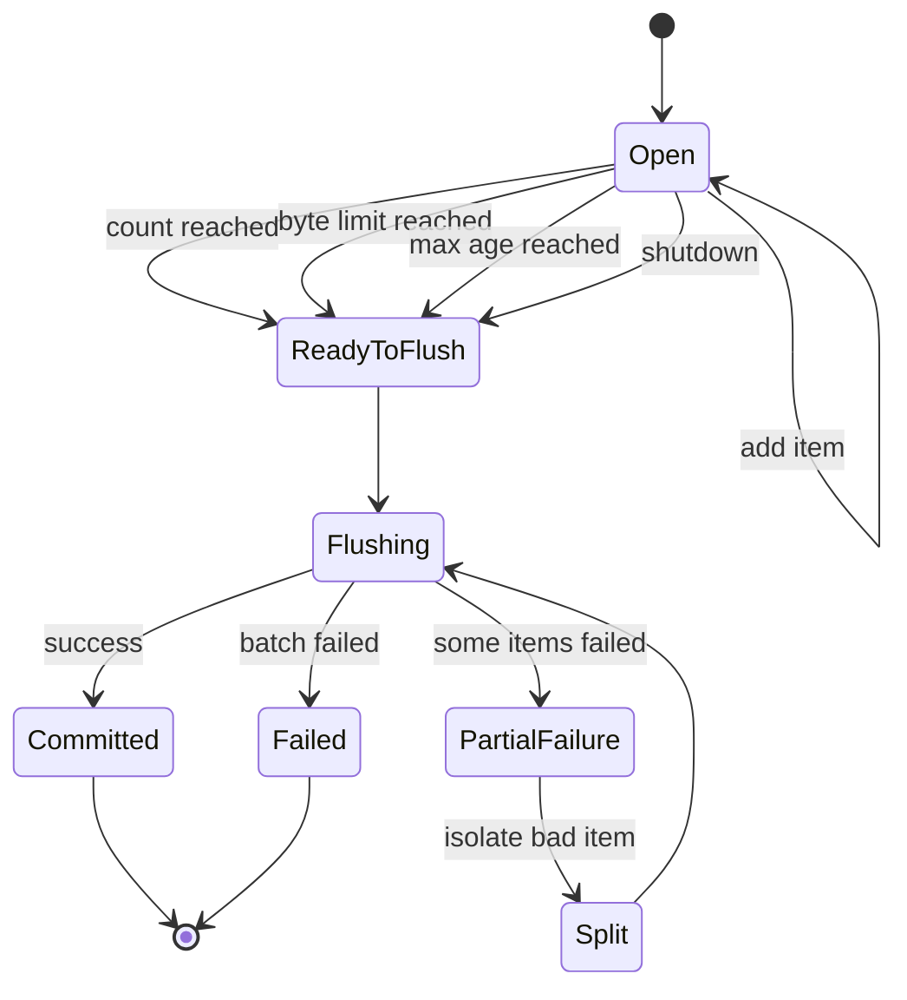
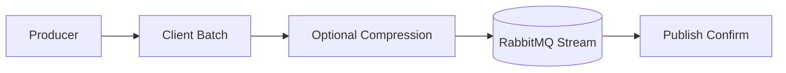
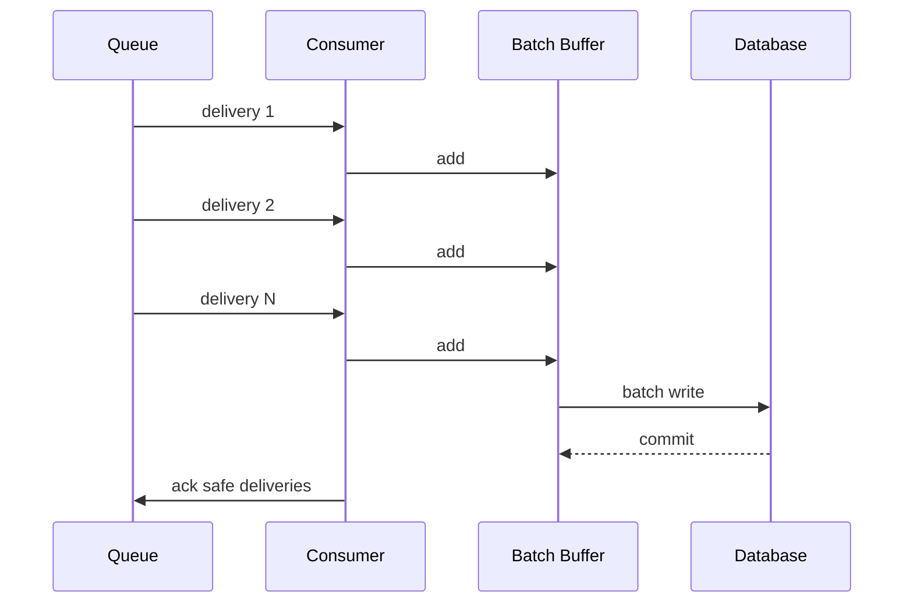
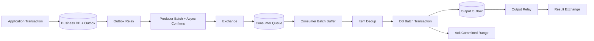

# Part 026 — Batching Pattern: Producer Batch, Consumer Batch, Ack Batch, DB Batch

Batching is one of the highest-leverage performance techniques in messaging systems.

It reduces per-message overhead by grouping multiple units of work into a single operation: one network flush, one publish confirm wait, one acknowledgement, one database transaction, one compression frame, one HTTP call, or one output event.

But batching is also one of the easiest ways to corrupt correctness. A batch can partially fail. A message inside a batch can be poisonous. A large batch can increase latency. A batch retry can duplicate 999 successful messages to fix one bad message. An ack batch can accidentally acknowledge work that was not committed.

This part explains batching patterns in Java RabbitMQ systems across AMQP queues, RabbitMQ Streams, Spring AMQP, and database/outbox integration.

---

## 1. Kaufman Deconstruction

To master batching, decompose the skill into twelve capabilities:

1. **Batch boundary** — know what is being grouped: publish, consume, ack, DB write, output, compression, or API call.
2. **Flush policy** — know when a batch closes: count, bytes, time, pressure, transaction boundary, or shutdown.
3. **Failure semantics** — define what happens when one item fails.
4. **Idempotency model** — make batch retry safe.
5. **Ordering model** — understand what batching does to ordering.
6. **Memory model** — bound batch size and in-flight batch count.
7. **Latency budget** — know how long an item can wait inside a batch.
8. **Backpressure model** — stop accepting work when batches cannot drain.
9. **Confirm/ack model** — only acknowledge what is safe.
10. **Observability model** — measure size, age, partial failures, and flush reason.
11. **Shutdown model** — flush or fail safely during service stop.
12. **Benchmark model** — prove the batch improves the bottleneck without hiding risk.

The standard:

> Batching is production-ready only when it improves throughput without making loss, duplicates, poison handling, or tail latency ambiguous.

---

## 2. The Batching Dimensions

There is no single “batching pattern”. There are several independent batching dimensions.

| Dimension | Example | Main Benefit | Main Risk |
|---|---|---|---|
| Producer batch | publish 500 messages before waiting for confirms | throughput | publish ambiguity, memory growth |
| Stream sub-entry batch | compress many messages into one stream entry/batch | throughput, compression | duplicate amplification, latency |
| Consumer batch | process 100 deliveries together | downstream efficiency | poison item blocks batch |
| Ack batch | `basicAck(tag, true)` after many messages | fewer protocol operations | acking unsafe work |
| DB batch | insert/update many rows in one transaction | database efficiency | partial failure and lock contention |
| Outbox batch | publish many outbox rows per transaction/loop | relay throughput | duplicate output on retry |
| API batch | send many items to downstream API | external efficiency | all-or-nothing failure ambiguity |
| Aggregation batch | combine many events into summary | lower output volume | delayed visibility |

A serious design names the exact batching dimension.

Bad statement:

```text
We should batch RabbitMQ messages.
```

Good statement:

```text
We will consume up to 200 payment events or 100 ms, whichever comes first, deduplicate each item, write aggregate updates in one DB transaction, and ack only the contiguous committed delivery range.
```

---

## 3. Batch State Machine

Every batch has a lifecycle.



The implementation must answer:

- Can items be added while flushing?
- Is batch mutation single-threaded?
- What happens on shutdown?
- What happens if flush succeeds but confirm/checkpoint fails?
- Can a batch be retried as a unit?
- Can a batch be split?
- Is item order preserved?

---

## 4. Flush Policy

A flush policy closes a batch.

Common triggers:

1. **Count** — flush after N messages.
2. **Bytes** — flush after N bytes.
3. **Time** — flush after N milliseconds.
4. **Pressure** — flush because queue/in-flight/memory is high.
5. **Transaction** — flush at business transaction boundary.
6. **Shutdown** — flush during graceful stop.
7. **Poison isolation** — split and flush smaller subsets.

A robust batcher usually combines count, bytes, and time.

```java
public record BatchPolicy(
        int maxCount,
        int maxBytes,
        Duration maxAge,
        int maxInFlightBatches
) {}
```

Flush reason should be recorded:

```java
public enum FlushReason {
    MAX_COUNT,
    MAX_BYTES,
    MAX_AGE,
    PRESSURE,
    SHUTDOWN,
    MANUAL,
    SPLIT_AFTER_FAILURE
}
```

Metrics by flush reason reveal whether the batch is working as intended.

---

## 5. Latency vs Throughput

Batching trades latency for throughput.

If max batch age is 100 ms, an item may wait up to 100 ms before processing even if the system is idle.

Simple model:

```text
item latency = wait_in_batch + flush_latency + downstream_latency + confirm_or_ack_latency
```

Increasing batch size often improves throughput until a bottleneck moves elsewhere. Past that point, it only increases latency and failure blast radius.

### 5.1 Batch Size Decision

Choose batch size from constraints:

- maximum acceptable item latency;
- average message size;
- memory budget;
- downstream transaction limit;
- poison isolation strategy;
- broker confirm latency;
- consumer prefetch;
- database lock duration;
- replay requirement;
- retry blast radius.

Rule of thumb:

> Batch to reduce dominant overhead, not because batching is fashionable.

---

## 6. Producer Batching with AMQP Queues

AMQP publishing is one message at a time at the API level, but producers can batch around publisher confirms.

### 6.1 Synchronous Confirm per Message

Simplest but slow:

```java
channel.confirmSelect();
channel.basicPublish(exchange, routingKey, props, body);
channel.waitForConfirmsOrDie(Duration.ofSeconds(5).toMillis());
```

This is safe but expensive because each message waits for a broker round trip.

### 6.2 Batch Publish Then Wait for Confirms

Better throughput:

```java
channel.confirmSelect();

int batchSize = 500;
int pending = 0;

for (OutboundMessage message : messages) {
    channel.basicPublish(
            message.exchange(),
            message.routingKey(),
            true,
            message.properties(),
            message.body()
    );
    pending++;

    if (pending >= batchSize) {
        channel.waitForConfirmsOrDie(5_000);
        pending = 0;
    }
}

if (pending > 0) {
    channel.waitForConfirmsOrDie(5_000);
}
```

Trade-off:

- higher throughput;
- larger ambiguity window if confirm wait fails;
- messages in the batch may need retry;
- retry can duplicate already-confirmed messages if the failure boundary is unclear.

### 6.3 Async Confirms with In-Flight Window

Better for high-throughput producers.

```java
import com.rabbitmq.client.Channel;
import com.rabbitmq.client.ConfirmCallback;

import java.util.NavigableMap;
import java.util.concurrent.ConcurrentSkipListMap;
import java.util.concurrent.Semaphore;

public final class ConfirmingBatchPublisher {
    private final Channel channel;
    private final Semaphore inFlight;
    private final NavigableMap<Long, OutboundMessage> pending = new ConcurrentSkipListMap<>();

    public ConfirmingBatchPublisher(Channel channel, int maxInFlight) throws Exception {
        this.channel = channel;
        this.inFlight = new Semaphore(maxInFlight);
        this.channel.confirmSelect();
        this.channel.addConfirmListener(ackCallback(), nackCallback());
    }

    public void publish(OutboundMessage message) throws Exception {
        inFlight.acquire();
        long sequence = channel.getNextPublishSeqNo();
        pending.put(sequence, message);
        try {
            channel.basicPublish(
                    message.exchange(),
                    message.routingKey(),
                    true,
                    message.properties(),
                    message.body()
            );
        } catch (Exception e) {
            pending.remove(sequence);
            inFlight.release();
            throw e;
        }
    }

    private ConfirmCallback ackCallback() {
        return (sequenceNumber, multiple) -> {
            if (multiple) {
                var confirmed = pending.headMap(sequenceNumber, true);
                int count = confirmed.size();
                confirmed.clear();
                inFlight.release(count);
            } else {
                if (pending.remove(sequenceNumber) != null) {
                    inFlight.release();
                }
            }
        };
    }

    private ConfirmCallback nackCallback() {
        return (sequenceNumber, multiple) -> {
            // Production code should mark these messages retryable via outbox status,
            // not blindly republish in the callback thread.
            if (multiple) {
                var failed = pending.headMap(sequenceNumber, true);
                int count = failed.size();
                failed.clear();
                inFlight.release(count);
            } else {
                if (pending.remove(sequenceNumber) != null) {
                    inFlight.release();
                }
            }
        };
    }
}
```

Important:

- keep in-flight messages bounded;
- do not block RabbitMQ callback thread with heavy work;
- use outbox status for retry decisions;
- treat nacks and connection failure as ambiguity, not proof that nothing was published.

---

## 7. Producer Batch + Outbox

For business-critical publishing, combine batching with transactional outbox.


Relay algorithm:

```text
select N unpublished outbox rows for update skip locked
publish rows with confirms
mark confirmed rows as published
retry ambiguous rows later
```

The batch is the relay unit, but the outbox row is the idempotency unit.

Do not mark the entire batch as published unless every row is confirmed.

---

## 8. Stream Producer Batching

RabbitMQ Stream Java Client is designed for high-throughput stream publishing. It supports batching behavior and, in particular, sub-entry batching/compression in the client.

Conceptually:



The application should still own:

- message id;
- producer name when using deduplication;
- publishing id strategy;
- in-flight limit;
- confirm timeout;
- retry policy;
- duplicate handling.

Stream batching is a throughput tool. It does not remove the need for idempotent consumers.

### 8.1 Sub-Entry Batching Risk

When multiple logical messages are packed together, failure/retry behavior can duplicate a group.

Design implication:

> Consumer deduplication must operate at logical message level, not only at batch/container level.

---

## 9. Consumer Batching with AMQP Queues

Consumer batching groups deliveries before processing.



The rule:

> Consumer ack must happen only after every acknowledged delivery is durably handled.

### 9.1 Prefetch and Batch Size

Set prefetch intentionally.

```text
prefetch >= batch_size * worker_concurrency
```

But do not set it arbitrarily high. High prefetch can pile up uncommitted work in the consumer process.

Example:

```java
channel.basicQos(200);
```

If one consumer processes batches of 100 and has one processing thread, a prefetch of 200 allows one active batch and one buffered batch.

### 9.2 Batch Buffer

```java
import com.rabbitmq.client.Delivery;
import java.time.Clock;
import java.time.Duration;
import java.time.Instant;
import java.util.ArrayList;
import java.util.List;

public final class DeliveryBatchBuffer {
    private final int maxCount;
    private final Duration maxAge;
    private final Clock clock;
    private final List<Delivery> items = new ArrayList<>();
    private Instant openedAt;

    public DeliveryBatchBuffer(int maxCount, Duration maxAge, Clock clock) {
        this.maxCount = maxCount;
        this.maxAge = maxAge;
        this.clock = clock;
    }

    public synchronized List<Delivery> add(Delivery delivery) {
        if (items.isEmpty()) {
            openedAt = clock.instant();
        }
        items.add(delivery);
        if (shouldFlush()) {
            return drain();
        }
        return List.of();
    }

    public synchronized List<Delivery> flushIfExpired() {
        if (!items.isEmpty() && openedAt.plus(maxAge).isBefore(clock.instant())) {
            return drain();
        }
        return List.of();
    }

    private boolean shouldFlush() {
        return items.size() >= maxCount || openedAt.plus(maxAge).isBefore(clock.instant());
    }

    private List<Delivery> drain() {
        List<Delivery> batch = List.copyOf(items);
        items.clear();
        openedAt = null;
        return batch;
    }
}
```

This class is intentionally simple. Production code also needs byte limit, shutdown hook, metrics, and backpressure.

---

## 10. Ack Batching

RabbitMQ delivery tags are scoped to a channel. `basicAck(deliveryTag, true)` acknowledges all unacknowledged deliveries on that channel up to the tag.

Ack batching reduces protocol overhead.

Safe only when all earlier deliveries on the same channel are safely processed.

```java
long lastDeliveryTag = batch.get(batch.size() - 1)
        .getEnvelope()
        .getDeliveryTag();

channel.basicAck(lastDeliveryTag, true);
```

### 10.1 Ack Batch Hazard

Suppose delivery tags 10, 11, 12 are in progress.

```text
10 committed
11 failed
12 committed
```

Calling:

```java
basicAck(12, true)
```

would also ack 11, even though it failed.

Safe approaches:

1. Process sequentially and stop on first failure.
2. Ack individually when parallel processing can complete out of order.
3. Track contiguous committed ranges.
4. Use separate channels per worker to reduce interleaving.

### 10.2 Contiguous Ack Tracker

```java
import java.util.TreeSet;

public final class AckTracker {
    private long nextExpected;
    private final TreeSet<Long> completed = new TreeSet<>();

    public AckTracker(long firstDeliveryTag) {
        this.nextExpected = firstDeliveryTag;
    }

    public synchronized Long markCompleted(long tag) {
        completed.add(tag);
        long highestContiguous = -1;
        while (completed.remove(nextExpected)) {
            highestContiguous = nextExpected;
            nextExpected++;
        }
        return highestContiguous == -1 ? null : highestContiguous;
    }
}
```

If `markCompleted` returns a tag, it is safe to ack multiple up to that tag.

---

## 11. Negative Ack and Batch Failure

If a batch fails, never reflexively requeue the entire batch forever.

Failure classification:

| Failure | Batch Action | Item Action |
|---|---|---|
| Transient DB timeout | retry batch with backoff | keep item |
| One malformed message | split batch | reject bad item to DLQ |
| External API 429 | retry batch later | preserve item |
| Duplicate item | skip item | ack after dedup decision |
| Serialization bug | stop consumer | route to parking lot/manual |
| Permanent business rejection | ack/reject according to policy | publish rejection event |

### 11.1 Split-on-Failure

When a batch fails because one item is bad, isolate it.

```text
process batch of 100
if fails:
    split into 50 + 50
    process each
    if half fails:
        split again
    eventually isolate one bad item
```

This binary split strategy is effective when failures are item-specific.

Do not use it when the whole downstream system is unavailable.

---

## 12. Database Batching

Database batching is often the real reason to batch RabbitMQ messages.

Instead of:

```text
for each message:
    insert row
    commit
    ack
```

Use:

```text
receive batch
validate each item
begin transaction
insert dedup rows
insert/update business rows
insert output outbox rows
commit
ack committed deliveries
```

### 12.1 Batch Dedup

Dedup must still be per message.

Conceptual repository:

```java
public interface BatchRepository {
    BatchCommitResult commitBatch(List<InboundMessage> messages);
}

public record BatchCommitResult(
        List<String> appliedMessageIds,
        List<String> duplicateMessageIds,
        List<ItemFailure> itemFailures
) {}
```

The batch transaction can insert many dedup rows and use unique constraints to identify duplicates.

### 12.2 Partial Failure

Database batch insert can fail because one row violates a constraint.

Options:

1. Validate before transaction.
2. Use per-item upsert/dedup semantics.
3. Split batch on failure.
4. Route invalid item to DLQ and commit valid items.
5. Reject whole batch if business requires all-or-nothing.

Do not pretend partial failure cannot happen.

---

## 13. Spring AMQP Batch Consumption

Spring AMQP supports batch listener patterns. But abstraction does not remove semantics.

A batch listener can receive multiple converted messages or raw messages depending on container and listener configuration.

Conceptual pattern:

```java
@RabbitListener(queues = "payment.window.input")
public void handleBatch(List<PaymentEvent> events) {
    // validate
    // deduplicate
    // batch commit
    // let container ack according to configured ack mode only after success
}
```

Production concerns:

- configure listener container concurrency deliberately;
- understand whether batching is producer-created or consumer-created;
- set batch size and receive timeout;
- do not hide item-level failures;
- use manual ack if container-level semantics are not precise enough;
- expose batch metrics.

Spring batch listeners are convenient. They are not a substitute for a failure model.

---

## 14. Producer-Created Batch Message

Sometimes the producer sends one RabbitMQ message containing many logical records.

Example payload:

```json
{
  "batchId": "batch-20260701-0001",
  "schemaVersion": 1,
  "records": [
    { "recordId": "r1", "amount": 100 },
    { "recordId": "r2", "amount": 200 }
  ]
}
```

Benefits:

- fewer broker messages;
- fewer routing operations;
- lower metadata overhead;
- natural fit for file/import jobs.

Risks:

- one bad record poisons the whole message;
- item-level DLQ is harder;
- retry duplicates the whole batch;
- max message size risk;
- consumer memory spike;
- latency for first item increases.

Use this only when the batch is the business unit or item-level failure handling is explicit.

---

## 15. Consumer-Created Batch

Consumer-created batching keeps each RabbitMQ message independent but groups processing internally.

Benefits:

- item-level routing and DLQ remain natural;
- producer remains simple;
- batch size can be tuned by consumer;
- easier to change without changing upstream contract.

Risks:

- consumer buffering complexity;
- ack batching hazards;
- shutdown flush complexity;
- more broker-level per-message overhead.

For most event/command systems, consumer-created batching is the safer default.

---

## 16. Batch Idempotency

Batch idempotency has two levels.

### 16.1 Batch-Level Idempotency

The entire batch has an id:

```text
batchId = export-20260701-001
```

Useful when the batch is a business object.

### 16.2 Item-Level Idempotency

Each item has an id:

```text
messageId = evt-942
recordId = payment-778
```

Required when retrying the batch can duplicate individual records.

Most systems need both.

```json
{
  "batchId": "batch-20260701-001",
  "records": [
    { "messageId": "evt-1", "businessId": "payment-1" },
    { "messageId": "evt-2", "businessId": "payment-2" }
  ]
}
```

Rule:

> If a batch can be retried, every item inside it needs a stable idempotency key.

---

## 17. Ordering in Batches

Batching can preserve order within a batch, but it can also obscure inter-batch order.

Example:

```text
Batch A: events 1,2,3
Batch B: events 4,5,6
```

If Batch B commits before Batch A, the external state may observe out-of-order results.

Ordering-safe options:

- process one partition sequentially;
- commit batches in input order;
- include sequence numbers;
- detect gaps;
- use per-key partitioning;
- avoid parallel batch commit for order-sensitive keys.

For commutative aggregates, this may not matter. For state transitions, it matters deeply.

---

## 18. Batching and Prefetch

Prefetch controls how many unacknowledged messages can be outstanding.

If batch size is 100 and concurrency is 4, a prefetch of 400 may be a starting point.

```text
prefetch = batch_size * concurrency * buffer_factor
```

Where `buffer_factor` might be 1 or 2.

Too low:

- batch never fills;
- throughput suffers;
- consumer waits for broker deliveries.

Too high:

- too much uncommitted work in memory;
- slow shutdown;
- larger redelivery burst after crash;
- unfair distribution among consumers.

Tune with metrics, not guesswork.

---

## 19. Batching and Retry Topology

Batching changes retry blast radius.

### 19.1 Whole-Batch Retry

Retry all items together.

Good for:

- downstream outage;
- transient infrastructure failure;
- batch is atomic business unit.

Bad for:

- one poison item;
- large batches;
- expensive downstream calls.

### 19.2 Item-Level Retry

Split failures into item-level retry/DLQ.

Good for:

- data quality issues;
- mixed valid/invalid batch;
- independent items.

Bad for:

- all-or-nothing business requirements;
- strict ordered batches;
- high split overhead.

### 19.3 Retry Metadata

Track retry at item level:

```json
{
  "messageId": "evt-942",
  "batchId": "batch-77",
  "attempt": 3,
  "firstFailureAt": "2026-07-01T10:00:00Z",
  "lastFailureReason": "DB_TIMEOUT"
}
```

Do not only track attempt count on the batch container if items can fail independently.

---

## 20. Batch Publisher Confirm Failure Matrix

| Point of Failure | What May Have Happened | Safe Response |
|---|---|---|
| Before publish call | Message not sent | retry from outbox |
| During publish call | Unknown | retry idempotently |
| After publish before confirm | Broker may have accepted | wait/recover/check outbox |
| Confirm ack received | Broker accepted responsibility | mark item published |
| Confirm nack received | Broker did not accept or could not process | retry item |
| Connection lost with pending confirms | Unknown subset accepted | retry idempotently |

The key is not to know with certainty. The key is to design retry so uncertainty is safe.

---

## 21. Batch Consumer Failure Matrix

| Point of Failure | Risk | Safe Response |
|---|---|---|
| Crash before DB commit | Messages redelivered | no ack yet |
| Crash after DB commit before ack | Duplicates on redelivery | item-level dedup |
| Crash after ack before DB commit | Data loss | never ack before commit |
| One item invalid | Batch blocked | split or item DLQ |
| DB timeout | Repeated retry | backoff, circuit breaker |
| Ack fails after commit | Redelivery | dedup handles duplicates |
| Shutdown with open batch | Lost buffered work | flush or nack/requeue before close |

---

## 22. Graceful Shutdown

Batching makes shutdown harder.

Shutdown sequence:

1. Stop accepting new deliveries.
2. Cancel consumer or pause intake.
3. Drain current batch.
4. Flush batch if safe.
5. Commit state/output.
6. Ack committed deliveries.
7. Nack/requeue uncommitted deliveries.
8. Close channel/connection.
9. Emit shutdown metrics.

Do not just kill the process with buffered messages in memory.

Conceptual shutdown:

```java
public void stop() {
    accepting.set(false);
    channel.basicCancel(consumerTag);

    List<Delivery> remaining = buffer.drainForShutdown();
    if (!remaining.isEmpty()) {
        try {
            processAndAck(remaining);
        } catch (Exception e) {
            nackUncommitted(remaining, true);
        }
    }

    closeQuietly(channel);
    closeQuietly(connection);
}
```

---

## 23. Memory and Byte Limits

Count is not enough. A batch of 1,000 tiny messages is different from 1,000 1MB messages.

Track bytes:

```java
public final class SizedBatch<T extends SizedItem> {
    private final int maxCount;
    private final int maxBytes;
    private final List<T> items = new ArrayList<>();
    private int bytes;

    public boolean canAdd(T item) {
        return items.size() + 1 <= maxCount && bytes + item.sizeBytes() <= maxBytes;
    }

    public void add(T item) {
        if (!canAdd(item)) {
            throw new IllegalStateException("batch limit exceeded");
        }
        items.add(item);
        bytes += item.sizeBytes();
    }
}
```

Metrics:

```text
batch_size_items
batch_size_bytes
batch_oldest_item_age_ms
batch_in_flight_count
batch_buffer_memory_bytes
```

---

## 24. Batch Compression

Compression can reduce network and disk usage, especially for repetitive JSON-like payloads.

But compression costs CPU and can increase latency.

Use compression when:

- payloads are large or repetitive;
- network/disk is bottleneck;
- CPU headroom exists;
- consumers can handle decompression latency;
- batch size is large enough to benefit.

Avoid compression when:

- messages are tiny;
- latency budget is very tight;
- CPU is already saturated;
- payload is already compressed/encrypted;
- debugging visibility matters more than throughput.

For RabbitMQ Streams, compression/sub-entry batching can be a strong throughput optimization, but it must be evaluated against duplicate amplification and latency.

---

## 25. Observability

Batching requires specific metrics.

### 25.1 Batch Shape

```text
batch_flush_total{component, reason}
batch_size_items{component}
batch_size_bytes{component}
batch_age_ms{component}
batch_fill_ratio{component}
```

### 25.2 Batch Performance

```text
batch_flush_latency_ms{component}
batch_commit_latency_ms{component}
batch_publish_confirm_latency_ms{component}
batch_db_transaction_latency_ms{component}
```

### 25.3 Batch Failure

```text
batch_failure_total{component, reason}
batch_partial_failure_total{component}
batch_split_total{component}
batch_item_failure_total{component, reason}
batch_retry_total{component}
```

### 25.4 Safety

```text
batch_ack_after_commit_total
batch_duplicate_item_total
batch_uncommitted_nack_total
batch_shutdown_flush_total
batch_oldest_unacked_age_ms
```

Dashboards should show both throughput and tail latency. A batcher that improves average throughput but destroys p99 latency may be a bad trade.

---

## 26. Alerting

Useful alerts:

- oldest batch age exceeds latency budget;
- batch buffer memory exceeds threshold;
- partial failure rate spikes;
- split-on-failure rate spikes;
- duplicate rate changes unexpectedly;
- confirm latency increases;
- DB batch commit latency increases;
- shutdown flush failures occur;
- batches always flush by max age and never by count;
- batches always flush by count but downstream latency is high.

Interpretation examples:

| Signal | Possible Meaning |
|---|---|
| Flush by max age dominates | traffic too low or batch size too high |
| Flush by max count dominates with high latency | batch too large or downstream slow |
| Partial failure spikes | data quality issue or schema change |
| Split rate spikes | poison item pattern |
| Oldest unacked age high | consumer stuck or unsafe prefetch |
| Confirm latency high | broker/disk/network pressure |

---

## 27. Benchmarking Batches

Benchmark with a matrix, not one happy-path number.

Variables:

- message size: 512B, 1KB, 10KB, 100KB;
- batch size: 1, 10, 100, 500, 1000;
- max age: 5ms, 25ms, 100ms, 500ms;
- confirm mode: sync, batch, async;
- persistence: transient vs persistent;
- consumer count;
- prefetch;
- DB transaction size;
- failure rate;
- duplicate rate.

Measure:

- throughput;
- p50/p95/p99 end-to-end latency;
- broker confirm latency;
- consumer processing latency;
- DB commit latency;
- memory usage;
- GC pressure;
- redelivery after crash;
- duplicate output rate.

Never benchmark only the producer. The system bottleneck may be the consumer or state store.

---

## 28. Choosing Batch Size

Start from a latency budget.

Example:

```text
End-to-end latency budget: 500 ms
Broker/input wait:         50 ms
Batch max age:            100 ms
DB batch commit:          150 ms
Output publish confirm:    50 ms
Consumer safety margin:   150 ms
```

Then choose batch count based on throughput and downstream efficiency.

Decision process:

1. Set maximum age from latency budget.
2. Set byte limit from memory budget.
3. Set count limit from downstream optimal transaction size.
4. Set prefetch from count * concurrency * buffer factor.
5. Set in-flight batch limit from memory and retry blast radius.
6. Run benchmark.
7. Tune one variable at a time.

---

## 29. Batch and SLA Classes

Do not batch all traffic equally.

Example classes:

| SLA Class | Batch Policy |
|---|---|
| Interactive command | small batch or no batch |
| Operational alert | low max age, moderate count |
| Analytics event | larger batch, compression |
| Audit export | large batch, strict durability |
| Backfill/replay | large batch, throttled |
| Dead-letter replay | small batch, cautious |

Use separate queues/streams or routing keys when SLA classes differ significantly.

---

## 30. Anti-Patterns

### 30.1 Acking the Batch Before Commit

This creates data loss.

### 30.2 Retrying a Large Batch Forever

One poison item can trap thousands of valid items.

### 30.3 Batch Without Item IDs

Retry becomes unsafe because duplicates cannot be detected.

### 30.4 Batch Size Based Only on Count

Large messages can explode memory.

### 30.5 Hiding Partial Failure

“Batch failed” is not enough when only one item failed.

### 30.6 Unbounded In-Flight Batches

Throughput spikes become memory incidents.

### 30.7 One Batch Policy for All Workloads

Interactive commands and analytics events should not share the same batching policy.

### 30.8 Compression Without CPU Budget

Compression can move the bottleneck from network to CPU.

### 30.9 Batching to Cover Bad Downstream Design

Batching can reduce overhead, but it cannot fix an unindexed query, slow API, or non-idempotent handler.

---

## 31. Production Reference Architecture



Safety properties:

- producer publish is recoverable through outbox;
- confirms are bounded;
- consumer batch has item-level dedup;
- DB batch commit happens before ack;
- output events use outbox;
- partial failures are classified;
- batch metrics expose behavior;
- shutdown drains or requeues safely.

---

## 32. Implementation Checklist

Before enabling batching in production, verify:

1. What is the batch unit?
2. What closes the batch?
3. What is max count?
4. What is max bytes?
5. What is max age?
6. What is max in-flight batch count?
7. What happens on one item failure?
8. What happens on whole-batch failure?
9. Is every item idempotent?
10. Is the batch itself idempotent if needed?
11. Is ack after commit?
12. Is publisher confirm handling bounded?
13. Does shutdown flush safely?
14. Are partial failures observable?
15. Is retry blast radius acceptable?
16. Is ordering requirement documented?
17. Is prefetch aligned to batch size?
18. Is memory bounded by bytes, not just count?
19. Does benchmark prove improvement?
20. Does p99 latency stay within SLA?

---

## 33. Effective Practice Drill

Build a batched consumer for `payment.events.window.input`.

Requirements:

- consume individual RabbitMQ messages;
- buffer up to 200 items or 100 ms;
- max batch bytes: 2 MB;
- deduplicate by `messageId`;
- write aggregate updates in one DB transaction;
- insert output events into outbox;
- ack only after commit;
- split batch on item validation failure;
- retry whole batch on transient DB failure;
- expose batch metrics;
- drain safely on shutdown.

Failure drills:

1. Send one malformed item in a batch of 200.
2. Crash after DB commit before ack.
3. Crash before DB commit.
4. Make DB unavailable for 30 seconds.
5. Send duplicate messages.
6. Send 100KB messages to test byte limit.
7. Stop service with half-full batch.
8. Increase traffic until batches flush by count.
9. Decrease traffic until batches flush by age.
10. Compare p99 latency before and after batching.

Success criteria:

- no committed item is lost;
- duplicate redelivery does not double-apply;
- malformed item does not block valid items forever;
- batch memory remains bounded;
- p99 latency is within budget;
- shutdown does not silently drop buffered deliveries;
- metrics explain every flush and failure.

---

## 34. Summary

Batching is a throughput optimization with correctness consequences.

Use batching deliberately:

1. Name the batch dimension.
2. Bound count, bytes, age, and in-flight batches.
3. Keep item-level idempotency.
4. Commit before ack.
5. Use publisher confirms for published batches.
6. Treat confirm failure as ambiguity.
7. Split poison batches when item-specific failure occurs.
8. Align prefetch with batch size and concurrency.
9. Record flush reason and batch metrics.
10. Benchmark throughput and tail latency together.

A mature RabbitMQ system usually uses multiple batching layers: outbox relay batching, publisher confirm batching, consumer processing batching, database batching, and stream client batching. The top-tier skill is knowing where each layer helps, where it increases risk, and how to prove the result under failure.

---

## References

- RabbitMQ Documentation — Consumer Acknowledgements and Publisher Confirms: https://www.rabbitmq.com/docs/confirms
- RabbitMQ Documentation — Streams and Super Streams: https://www.rabbitmq.com/docs/streams
- RabbitMQ Stream Java Client Reference: https://rabbitmq.github.io/rabbitmq-stream-java-client/stable/htmlsingle/
- Spring AMQP Reference — @RabbitListener with Batching: https://docs.spring.io/spring-amqp/reference/amqp/receiving-messages/batch.html
- Spring AMQP Reference — Message Listener Container Configuration: https://docs.spring.io/spring-amqp/reference/amqp/containerAttributes.html
