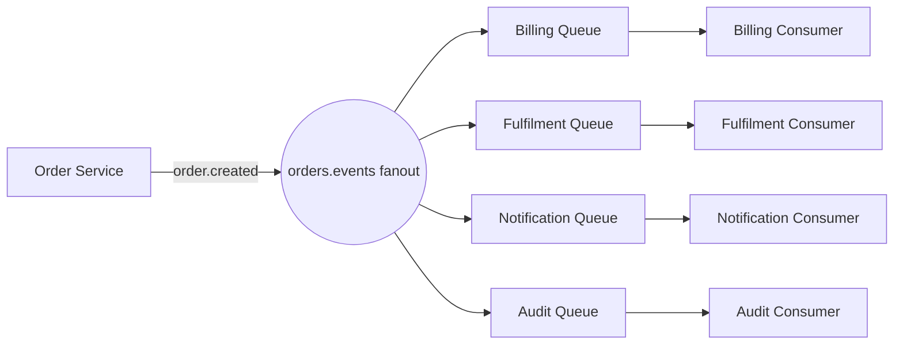
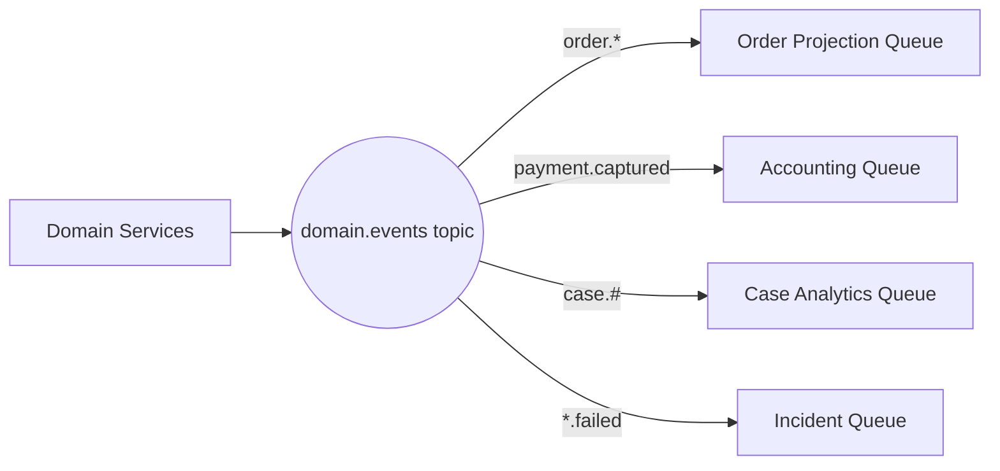
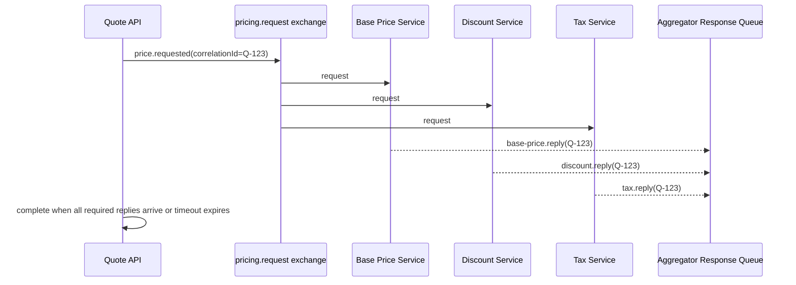
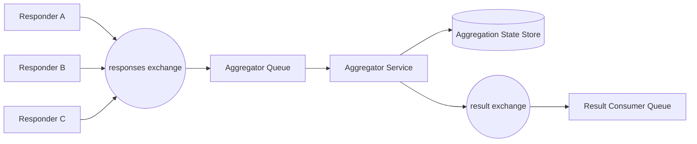
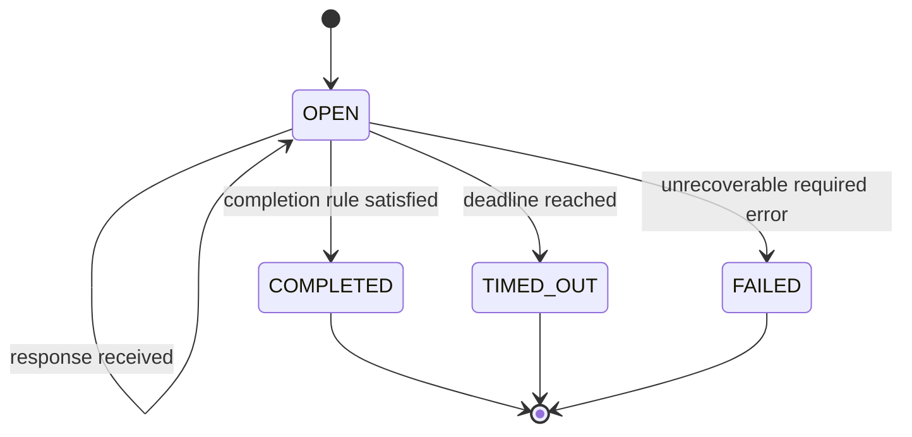
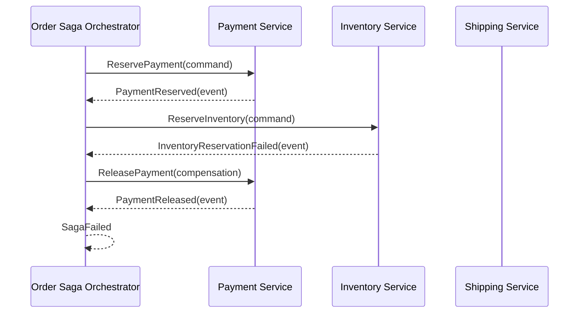
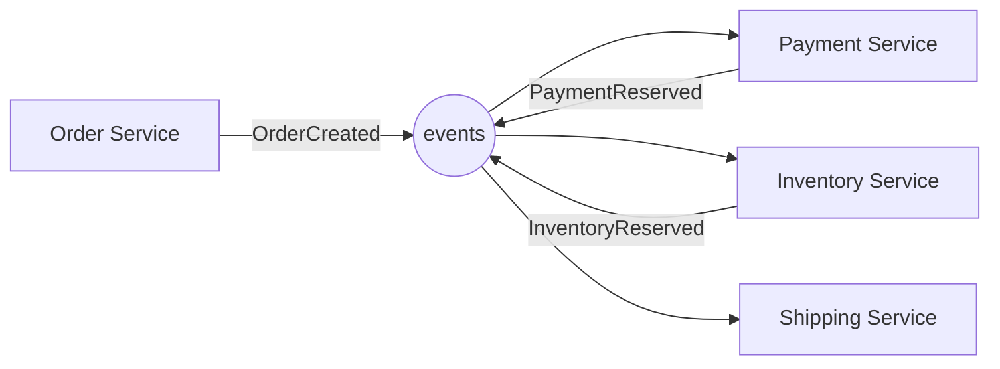
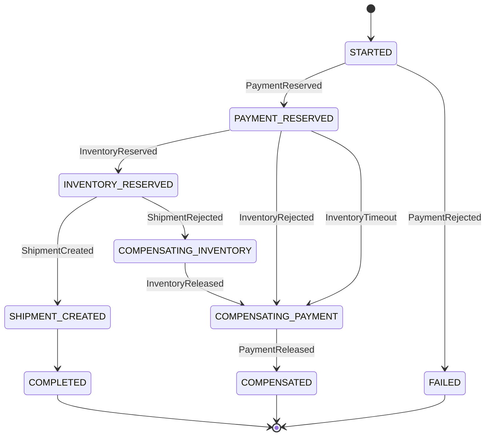
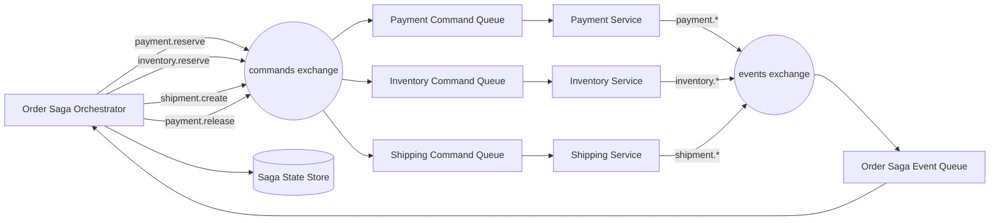

# Part 027 — Fanout, Scatter-Gather, Aggregator, and Saga Messaging Patterns

At this point in the series, we already have the core blocks: AMQP topology, producer confirms, consumer acknowledgements, idempotent consumers, retry/DLQ, Streams, batching, windowing, and pipeline design.

This part combines those blocks into higher-level coordination patterns.

These patterns are not just “RabbitMQ examples”. They are ways to structure distributed work when one service cannot, and should not, own the entire business process.

The important mental shift:

> RabbitMQ does not make distributed coordination simple. It makes coordination explicit.

That means we must model:

- who owns the decision,
- who owns the side effect,
- who owns timeout,
- who owns partial failure,
- who owns compensation,
- and who is allowed to retry.

A top-tier engineer does not merely wire messages together. They define the invariants that keep the workflow correct when messages are duplicated, delayed, reordered, replayed, rejected, or partially processed.

---

## 1. Kaufman Skill Slice

In Kaufman's terms, this part is a **subskill integration point**.

Earlier parts deconstructed RabbitMQ into smaller skills:

- publish safely,
- consume safely,
- route predictably,
- retry intentionally,
- deduplicate,
- preserve causality,
- replay from streams,
- batch and window safely.

Now we combine them into distributed workflow patterns.

The target skill is:

> Given a business process that spans multiple services, choose whether it should be fanout notification, scatter-gather, aggregator, orchestration saga, choreography saga, or a simpler command pipeline.

The practice goal is not to memorize pattern names. It is to identify the **coordination semantics**.

Ask these questions first:

1. Is the publisher asking for work, announcing a fact, or collecting answers?
2. Does the initiator need a final decision?
3. Is there a timeout budget?
4. Can the process complete with partial answers?
5. Are side effects reversible?
6. Is the process long-running?
7. Does one service own the process state?
8. What happens if a participant succeeds but its response is lost?

These questions determine the pattern more than the RabbitMQ API does.

---

## 2. Pattern Taxonomy

There are four patterns in this part.

| Pattern | Intent | Initiator waits? | State owner | Typical topology |
|---|---:|---:|---|---|
| Fanout | Notify many independent subscribers | No | Each subscriber | Fanout/topic exchange + queue per subscriber |
| Scatter-gather | Ask many responders, collect answers | Yes, bounded | Requester or aggregator | Request exchange + reply/response queue |
| Aggregator | Build one result from many messages | Usually yes | Aggregator service | Response/event queues + correlation state store |
| Saga | Coordinate long-running multi-step transaction | Eventually | Orchestrator or participants | Commands + events + state machine |

A common mistake is to implement all of them as “pub/sub”. That hides very different correctness requirements.

Fanout is notification. Scatter-gather is bounded query. Aggregator is stateful collection. Saga is long-running process control.

---

## 3. Fanout Pattern

### 3.1 Definition

Fanout publishes one message to many independent subscribers.

The publisher does not know who subscribes. The subscribers do not coordinate with each other. Each subscriber owns its own queue, retry policy, DLQ, and processing logic.

The core invariant:

> A fanout publisher announces a fact. It does not command all subscribers to succeed.

Example events:

- `order.created`
- `quote.approved`
- `case.escalated`
- `payment.captured`
- `document.indexed`
- `customer.profile.updated`

Each subscriber may react differently.

For example, `order.created` may be consumed by:

- billing,
- fulfilment,
- fraud screening,
- notification,
- search indexing,
- analytics,
- audit logging.

The order service should not know these subscribers exist.

---

### 3.2 Fanout Topology

There are two main variants.

#### Variant A — Fanout exchange

Use a fanout exchange when all subscribers receive all events from that exchange.



This is simple and explicit.

The drawback is that each subscriber receives everything, even events it does not need.

#### Variant B — Topic exchange

Use a topic exchange when subscribers want filtered categories.



Topic exchange scales better as event categories grow.

The trade-off is governance. Routing keys become a public API.

---

### 3.3 Fanout Design Rules

Use fanout when:

- publisher is announcing a fact,
- subscribers are independent,
- publisher does not need subscriber result,
- subscriber failure must not block publisher,
- each subscriber can handle duplicate events,
- late subscriber replay is not required, or replay is handled by RabbitMQ Streams/outbox.

Do not use fanout when:

- publisher needs a decision,
- subscribers must all succeed atomically,
- process requires a single final result,
- subscriber failure must roll back publisher state,
- event order across subscribers is a hard requirement.

The most important fanout rule:

> The event is not a remote procedure call disguised as a broadcast.

---

### 3.4 Fanout Publisher Example

A fanout publisher should have no subscriber knowledge.

```java
public final class DomainEventPublisher {
    private final Channel channel;
    private final String exchange;

    public DomainEventPublisher(Channel channel, String exchange) {
        this.channel = channel;
        this.exchange = exchange;
    }

    public void publish(DomainEvent event) throws IOException {
        AMQP.BasicProperties properties = new AMQP.BasicProperties.Builder()
            .messageId(event.eventId())
            .correlationId(event.correlationId())
            .type(event.eventType())
            .contentType("application/json")
            .deliveryMode(2)
            .timestamp(Date.from(event.occurredAt()))
            .headers(Map.of(
                "schema", event.schemaName(),
                "schemaVersion", event.schemaVersion(),
                "producer", event.producer(),
                "causationId", event.causationId()
            ))
            .build();

        channel.basicPublish(
            exchange,
            event.routingKey(),
            true,
            properties,
            event.payloadBytes()
        );
    }
}
```

Notice the `mandatory=true` flag. It protects against silent unroutable messages, but it does not guarantee all intended subscribers exist. Subscriber queue declarations must be governed separately.

---

### 3.5 Subscriber Queue Ownership

A subscriber owns:

- queue name,
- binding pattern,
- prefetch,
- consumer concurrency,
- retry policy,
- DLQ,
- deduplication,
- projection table,
- alert thresholds.

The publisher owns:

- event contract,
- exchange contract,
- routing key taxonomy,
- event versioning,
- outbox relay,
- publish observability.

This separation is not optional. Without it, fanout becomes a distributed monolith.

---

## 4. Scatter-Gather Pattern

### 4.1 Definition

Scatter-gather sends a request to multiple responders and collects their responses within a bounded time.

Examples:

- ask multiple pricing engines for a quote,
- ask multiple inventory regions for availability,
- ask several compliance services for risk signals,
- ask multiple recommendation models for candidates,
- ask several fulfilment providers for shipping options.

The initiator needs a result, but the result may be:

- all responses,
- first successful response,
- quorum result,
- best ranked response,
- partial result after timeout.

The core invariant:

> Scatter-gather must have a completion rule and a timeout rule before implementation starts.

Without that, the process leaks memory, blocks users, or waits forever.

---

### 4.2 Scatter-Gather Topology

One request is published to multiple responder queues. Each responder replies to a response queue or exchange with the same `correlationId`.



The requester can collect responses itself, but in production systems an aggregator service is usually cleaner.

---

### 4.3 Completion Rules

Scatter-gather is defined by its completion rule.

Common rules:

| Rule | Meaning | Example |
|---|---|---|
| All required | Complete when all required responders replied | Price = base + discount + tax |
| Quorum | Complete when N of M responders agree | Risk voting |
| First successful | Complete on first valid response | Provider lookup |
| Best before timeout | Collect until deadline, choose best | Shipping quote |
| Partial allowed | Return incomplete result with warnings | Analytics enrichment |
| Mandatory subset | Required responders must reply; optional responders may be missing | Regulatory decision + optional enrichments |

Every scatter-gather workflow needs:

- correlation id,
- expected responders,
- deadline,
- duplicate reply policy,
- late reply policy,
- partial result policy,
- failure classification.

---

### 4.4 Request Envelope

A request message should include a workflow deadline, not just a timeout hidden in the caller.

```json
{
  "messageId": "msg-8d2f",
  "correlationId": "quote-2026-000918",
  "causationId": "api-request-2931",
  "type": "quote.price.requested.v1",
  "deadlineAt": "2026-07-02T09:15:30Z",
  "expectedResponders": ["base-price", "discount", "tax"],
  "payload": {
    "quoteId": "Q-918",
    "customerId": "C-1001",
    "items": [
      { "sku": "SKU-1", "quantity": 4 }
    ]
  }
}
```

The deadline is part of the business contract. Responders can drop stale requests instead of wasting capacity.

---

### 4.5 Response Envelope

Each response must identify the responder and the original request.

```json
{
  "messageId": "msg-reply-991",
  "correlationId": "quote-2026-000918",
  "causationId": "msg-8d2f",
  "type": "quote.price.component.calculated.v1",
  "responder": "discount",
  "status": "SUCCESS",
  "completedAt": "2026-07-02T09:15:03Z",
  "payload": {
    "component": "discount",
    "amount": "120.00",
    "currency": "USD"
  }
}
```

Do not infer responder identity from queue name. Put it in the message.

---

### 4.6 Aggregator State Model

A scatter-gather initiator or aggregator must store state.

```java
public enum AggregateStatus {
    OPEN,
    COMPLETED,
    TIMED_OUT,
    FAILED,
    CANCELLED
}

public record AggregationState(
    String correlationId,
    Instant deadlineAt,
    Set<String> expectedResponders,
    Map<String, ResponseEnvelope> receivedResponses,
    AggregateStatus status,
    int version
) {
    public boolean hasRequiredResponses() {
        return receivedResponses.keySet().containsAll(expectedResponders);
    }

    public boolean isExpired(Instant now) {
        return !deadlineAt.isAfter(now);
    }
}
```

In production, this state should be in durable storage, not only in memory.

Why?

Because the aggregator can crash after receiving some replies and before completing the workflow.

---

### 4.7 Duplicate Response Handling

Duplicate responses are normal.

They can happen because:

- responder processed request but crashed before ack,
- reply was published but confirm was ambiguous,
- aggregator processed response but crashed before ack,
- network interruption caused redelivery,
- replay was triggered from stream or DLQ.

The aggregator must deduplicate by:

```text
(correlationId, responder, responseSemanticKey)
```

Usually `correlationId + responder` is enough if each responder sends one answer.

If responder can send multiple components, use a finer key:

```text
(correlationId, responder, componentType, componentId)
```

Never rely on RabbitMQ delivery tag for business deduplication. Delivery tag is channel-scoped transport metadata.

---

## 5. Aggregator Pattern

### 5.1 Definition

An aggregator consumes related messages and produces one consolidated output.

It can be used with scatter-gather, fan-in pipelines, event projections, and saga decisions.

The aggregator is stateful. That is the point.

The core invariant:

> Aggregator correctness is determined by its correlation key, completion rule, timeout rule, and idempotent state transition.

---

### 5.2 Aggregator Topology



The aggregator queue is usually a command-like queue: one message must be processed with deterministic state mutation.

Use manual ack.

Ack only after:

1. response is persisted or ignored as duplicate,
2. aggregate state transition is committed,
3. any completion event is safely published or recorded in an outbox.

---

### 5.3 Aggregator State Transition

Treat aggregation as a state machine.



The transition must be idempotent.

For a duplicate response:

```text
OPEN + duplicate response => OPEN, no semantic change
COMPLETED + late response => COMPLETED, ignore or emit late-response metric
TIMED_OUT + late response => TIMED_OUT, store audit marker if required
FAILED + response => FAILED, ignore unless manual repair is allowed
```

---

### 5.4 Java Aggregator Handler Skeleton

```java
public final class AggregatorConsumer implements DeliverCallback {
    private final AggregationRepository repository;
    private final OutboxRepository outbox;
    private final ObjectMapper objectMapper;

    @Override
    public void handle(String consumerTag, Delivery delivery) throws IOException {
        Channel channel = getChannel();
        long tag = delivery.getEnvelope().getDeliveryTag();

        ResponseEnvelope response = objectMapper.readValue(
            delivery.getBody(),
            ResponseEnvelope.class
        );

        try {
            repository.inTransaction(tx -> {
                AggregationState state = tx.lockByCorrelationId(response.correlationId());

                if (state == null) {
                    tx.recordOrphanResponse(response);
                    return;
                }

                AggregationState next = state.apply(response, Instant.now());
                tx.save(next);

                if (state.status() == AggregateStatus.OPEN
                    && next.status() == AggregateStatus.COMPLETED) {
                    tx.insertOutbox(AggregateCompletedEvent.from(next));
                }
            });

            channel.basicAck(tag, false);
        } catch (TransientDependencyException ex) {
            channel.basicNack(tag, false, true);
        } catch (InvalidResponseException ex) {
            repository.recordInvalidResponse(response, ex.getMessage());
            channel.basicAck(tag, false);
        } catch (Exception ex) {
            channel.basicNack(tag, false, false);
        }
    }
}
```

The important property is not the exact code. It is the ack boundary.

Acknowledge only after durable state mutation.

---

### 5.5 Timeout Handling

Timeouts should not depend on in-memory timers only.

A production aggregator should have one of these:

1. periodic sweeper job,
2. delayed timeout message,
3. database query on deadline,
4. stream-based timer workflow,
5. scheduler service.

The simplest reliable design is a sweeper:

```java
public final class AggregationTimeoutSweeper {
    private final AggregationRepository repository;
    private final Clock clock;

    public void runOnce() {
        Instant now = clock.instant();
        List<AggregationState> expired = repository.findOpenExpired(now, 500);

        for (AggregationState state : expired) {
            repository.inTransaction(tx -> {
                AggregationState locked = tx.lockByCorrelationId(state.correlationId());
                if (locked == null || locked.status() != AggregateStatus.OPEN) {
                    return;
                }

                AggregationState timedOut = locked.timeout(now);
                tx.save(timedOut);
                tx.insertOutbox(AggregateTimedOutEvent.from(timedOut));
            });
        }
    }
}
```

A delayed message can also work, but the database remains the source of truth.

---

## 6. Saga Pattern

### 6.1 Definition

A saga coordinates a long-running business transaction across multiple services using local transactions and compensating actions.

It is used when a single ACID transaction is impossible or undesirable.

Examples:

- order placement across payment, inventory, shipment,
- quote approval across discount, compliance, legal, customer acceptance,
- case enforcement workflow across evidence, review, sanction, notification,
- subscription activation across billing, identity, provisioning, entitlement.

The core invariant:

> A saga is not distributed rollback. It is explicit forward recovery and compensation.

---

### 6.2 Saga Variants

There are two common variants.

#### Orchestration Saga

One service owns the process state and sends commands to participants.



Use orchestration when:

- process is complex,
- central visibility is required,
- timeout logic is important,
- compensation logic must be explicit,
- workflow state must be auditable.

#### Choreography Saga

Participants react to events and publish next events.



Use choreography when:

- process is simple,
- participants are naturally decoupled,
- no central decision is needed,
- event contracts are stable,
- cyclic dependency risk is low.

Do not use choreography just because it looks more decoupled. Complex choreography often hides coupling in event chains.

---

### 6.3 Saga State Machine

For serious systems, model the saga explicitly.



Each transition must be:

- valid from current state,
- idempotent,
- persisted durably,
- correlated to saga id,
- traceable,
- recoverable after crash.

---

### 6.4 Saga Message Types

A saga uses commands and events differently.

Commands request action:

```text
payment.reserve.command.v1
inventory.reserve.command.v1
shipment.create.command.v1
payment.release.command.v1
```

Events report facts:

```text
payment.reserved.event.v1
payment.rejected.event.v1
inventory.reserved.event.v1
inventory.rejected.event.v1
shipment.created.event.v1
shipment.rejected.event.v1
```

The orchestrator sends commands. Participants publish events.

Do not publish `PaymentReserved` unless payment reservation actually happened.

---

### 6.5 Saga Topology



This topology separates command routing from event reporting.

That distinction is critical for security and governance:

- not every service should be allowed to send commands,
- many services may be allowed to subscribe to events,
- event producers should not command other services indirectly.

---

### 6.6 Saga Orchestrator Skeleton

```java
public final class OrderSagaOrchestrator {
    private final SagaRepository repository;
    private final OutboxRepository outbox;
    private final Clock clock;

    public void onEvent(SagaEvent event) {
        repository.inTransaction(tx -> {
            OrderSaga saga = tx.lockSaga(event.sagaId());

            if (saga == null) {
                tx.recordOrphanSagaEvent(event);
                return;
            }

            if (saga.hasProcessed(event.messageId())) {
                return;
            }

            SagaDecision decision = saga.apply(event, clock.instant());

            tx.save(decision.nextSaga());
            tx.markProcessed(event.messageId());

            for (SagaCommand command : decision.commandsToSend()) {
                tx.insertOutbox(command.toOutboxMessage());
            }
        });
    }
}
```

The orchestrator does not publish directly inside an unsafe transaction boundary. It writes commands to an outbox. A relay publishes them with confirms.

This prevents the classic bug:

```text
state updated, process crashes before command published
```

or:

```text
command published, process crashes before state updated
```

---

### 6.7 Participant Handler Skeleton

A participant handles one command as a local transaction.

```java
public final class PaymentReserveHandler {
    private final PaymentRepository payments;
    private final OutboxRepository outbox;

    public void handle(ReservePaymentCommand command) {
        payments.inTransaction(tx -> {
            if (tx.hasProcessed(command.messageId())) {
                return;
            }

            PaymentReservationResult result = tx.reserve(
                command.orderId(),
                command.amount(),
                command.currency(),
                command.idempotencyKey()
            );

            tx.markProcessed(command.messageId());

            if (result.accepted()) {
                tx.insertOutbox(PaymentReservedEvent.from(command, result));
            } else {
                tx.insertOutbox(PaymentRejectedEvent.from(command, result.reason()));
            }
        });
    }
}
```

The participant must not assume the command is delivered only once.

---

## 7. Fanout vs Scatter-Gather vs Saga

The patterns can look similar because they all use messages. The distinction is semantic.

| Question | Fanout | Scatter-gather | Aggregator | Saga |
|---|---|---|---|---|
| Is publisher waiting? | No | Yes | Often | Eventually |
| Is there a final result? | No | Yes | Yes | Yes |
| Is process long-running? | Usually no | Usually short | Short/medium | Yes |
| Is state required? | Subscriber-specific | Requester state | Aggregator state | Saga state |
| Are compensations needed? | No | Rare | Rare | Yes |
| Failure model | Subscriber isolation | Timeout/partial result | Missing/late/duplicate parts | Forward recovery/compensation |
| Typical RabbitMQ primitive | Exchange + queues | Request/reply + queues | Queue + DB state | Commands/events + DB state |

Use this as the first design review checkpoint.

---

## 8. Ack, Retry, and DLQ Policy per Pattern

### 8.1 Fanout Subscriber

Ack after local side effect is durable.

If subscriber updates a projection:

```text
consume event -> upsert projection -> mark event processed -> ack
```

Retry policy:

- transient dependency: retry with backoff,
- invalid event contract: DLQ,
- duplicate event: ack,
- stale event: ack with metric,
- unknown schema version: DLQ or compatibility fallback.

### 8.2 Scatter-Gather Responder

Ack request after response has been durably published or recorded in outbox.

```text
consume request -> local calculation -> insert response outbox -> ack request -> relay response
```

Avoid:

```text
consume request -> publish response without confirm -> ack request
```

That can lose the response.

### 8.3 Aggregator

Ack response after aggregator state mutation is committed.

Retry policy:

- database unavailable: requeue/retry,
- duplicate response: ack,
- unknown correlation: store orphan + ack,
- invalid responder: DLQ/security alert,
- late response: ack + metric.

### 8.4 Saga Orchestrator

Ack participant event after saga transition is committed.

Retry policy:

- invalid transition due duplicate: ack,
- invalid transition due out-of-order but possible: park/retry with delay,
- impossible transition: audit + ack or DLQ,
- state store unavailable: retry,
- outbox unavailable: retry.

---

## 9. Correlation and Causation

These patterns collapse without correlation discipline.

Recommended identifiers:

| Field | Purpose |
|---|---|
| `messageId` | Unique identity of this message |
| `correlationId` | End-to-end workflow/request identity |
| `causationId` | Message that caused this message |
| `sagaId` | Long-running saga instance |
| `aggregateId` | Business aggregate/entity identity |
| `idempotencyKey` | Business duplicate prevention |
| `traceId` | Observability trace |

Example chain:

```text
API request
  messageId = api-001
  correlationId = quote-123

price.requested
  messageId = msg-010
  correlationId = quote-123
  causationId = api-001

base-price.reply
  messageId = msg-011
  correlationId = quote-123
  causationId = msg-010

aggregate.completed
  messageId = msg-020
  correlationId = quote-123
  causationId = msg-011 or aggregate-state-transition-id
```

`correlationId` tells what workflow the message belongs to. `causationId` tells why it exists.

---

## 10. Handling Partial Failure

Partial failure is the normal case.

### 10.1 Fanout Partial Failure

One subscriber fails. Others continue.

Correct response:

- subscriber retries or parks its own message,
- publisher is not rolled back,
- audit/monitoring detects subscriber lag or DLQ growth.

### 10.2 Scatter-Gather Partial Failure

One responder fails or times out.

Possible policies:

- fail whole request,
- return partial result,
- use cached value,
- use fallback responder,
- extend deadline once,
- require manual review.

The policy must be explicit in the aggregate state.

### 10.3 Saga Partial Failure

One completed local transaction cannot be undone automatically.

Correct response:

- send compensating command,
- wait for compensation event,
- retry compensation safely,
- escalate if compensation fails,
- keep saga state auditable.

Compensation can fail too. A top-tier design has an answer for that.

---

## 11. Common Anti-Patterns

### 11.1 Fanout With Hidden Coupling

A publisher emits an event but assumes a specific subscriber will update something before the user refreshes the page.

That is not fanout. That is synchronous dependency hidden behind messaging.

Fix:

- use command/RPC if immediate answer is needed,
- or model eventual consistency explicitly.

### 11.2 Scatter-Gather Without Deadline

The initiator waits forever for all responders.

Fix:

- deadline in request envelope,
- durable aggregate state,
- sweeper or timeout message,
- partial-result policy.

### 11.3 Aggregator Without Deduplication

Duplicate replies inflate totals or complete aggregate incorrectly.

Fix:

- unique constraint on `(correlation_id, responder, component_key)`,
- idempotent transition,
- duplicate metric.

### 11.4 Saga Without State Machine

Services publish events and hope the workflow completes.

Fix:

- define states,
- define commands,
- define events,
- define compensation,
- define timeout transitions,
- define manual repair state.

### 11.5 Choreography With Cycles

Event A triggers B, B triggers C, C triggers A.

Fix:

- introduce orchestrator,
- or define causation guards,
- or split event types into user facts vs process facts.

---

## 12. Observability Model

Pattern observability must show workflow health, not only queue health.

### 12.1 Fanout Metrics

- publish rate per event type,
- unroutable messages,
- subscriber queue depth,
- subscriber lag,
- DLQ count per subscriber,
- duplicate rate,
- schema rejection rate,
- projection staleness.

### 12.2 Scatter-Gather Metrics

- requests opened,
- requests completed,
- requests timed out,
- partial completions,
- responder latency,
- missing responder count,
- late response count,
- duplicate response count,
- aggregate state age.

### 12.3 Saga Metrics

- saga started/completed/failed/compensated,
- time in state,
- transition failure count,
- compensation count,
- compensation failure count,
- stuck saga count,
- orphan events,
- invalid transition count,
- outbox relay lag.

### 12.4 Trace Requirements

Every message should include trace/correlation metadata.

Log at state transitions, not every low-level operation.

Good saga log:

```json
{
  "event": "saga.transitioned",
  "sagaId": "order-saga-991",
  "correlationId": "order-991",
  "fromState": "PAYMENT_RESERVED",
  "toState": "INVENTORY_RESERVED",
  "causationId": "inventory-reserved-msg-882",
  "durationMs": 1840
}
```

Poor saga log:

```text
received message
```

---

## 13. Security and Governance

These patterns create strong coupling through message contracts. Govern them deliberately.

### 13.1 Permissions

Suggested permission model:

| Actor | Can publish | Can consume |
|---|---|---|
| Domain owner | Its own event exchange | Its own command queue |
| Saga orchestrator | Command exchange | Saga event queue |
| Subscriber | Rarely events; mostly none | Its subscriber queue |
| Aggregator | Result exchange | Response queue |
| External adapter | Specific ingress exchange | Adapter command queue |

Do not grant every service publish permission to every command exchange.

### 13.2 Event Contract Governance

For fanout and choreography:

- version events,
- document ownership,
- define compatibility policy,
- define retention/replay policy,
- define deprecation date,
- validate schema in CI.

### 13.3 Saga Governance

For sagas:

- document compensation semantics,
- document manual repair path,
- document timeout budget,
- document state machine,
- document owner for stuck instances,
- document audit evidence.

---

## 14. Testing Strategy

### 14.1 Fanout Tests

Test:

- publisher event schema,
- routing key binding,
- subscriber idempotency,
- DLQ on invalid event,
- one subscriber failure does not block others,
- topology drift detection.

### 14.2 Scatter-Gather Tests

Test:

- all responders successful,
- one responder late,
- one responder duplicate,
- one responder invalid,
- partial allowed,
- required responder missing,
- aggregator crash after persisting response before ack,
- aggregator crash after completion before result publish.

### 14.3 Saga Tests

Test:

- happy path,
- rejection at each step,
- timeout at each step,
- duplicate event at each state,
- out-of-order event,
- compensation success,
- compensation failure,
- orchestrator restart,
- outbox relay restart,
- manual repair transition.

---

## 15. Design Review Checklist

Before implementing any of these patterns, answer this checklist.

### 15.1 Pattern Choice

- Is this command, event, request/reply, aggregate, or saga?
- Who owns the final decision?
- Does the initiator wait?
- Is partial completion acceptable?
- Is compensation needed?
- Is central state required?

### 15.2 Message Contract

- What is the message type?
- What is the schema version?
- What is the routing key?
- What is the correlation id?
- What is the causation id?
- What is the idempotency key?
- What is the deadline?

### 15.3 Failure Semantics

- What if message is duplicated?
- What if message is late?
- What if response is lost?
- What if participant succeeds but event is not published?
- What if aggregator crashes?
- What if compensation fails?
- What if DLQ grows?

### 15.4 Operations

- What metrics detect stuck workflow?
- What alert fires first?
- What is the repair action?
- Can an operator replay safely?
- Is the audit trail sufficient?
- Can we explain every state transition?

---

## 16. Practice Drill

Build a quote approval workflow:

1. API receives quote approval request.
2. Quote service starts a saga.
3. Saga sends commands to:
   - discount validation,
   - compliance review,
   - customer credit check.
4. Discount and credit are scatter-gather responders.
5. Compliance may be slow and can require manual review.
6. Aggregator waits for required checks.
7. If all pass, saga publishes `quote.approved`.
8. If one required check fails, saga publishes `quote.rejected`.
9. If compliance times out, saga moves to `WAITING_MANUAL_REVIEW`.
10. All events are fanout to audit and analytics subscribers.

Required implementation properties:

- durable saga state,
- outbox relay,
- publisher confirms,
- manual ack,
- idempotent participants,
- duplicate reply handling,
- timeout sweeper,
- DLQ and parking lot,
- metrics and runbook.

---

## 17. Summary

Fanout, scatter-gather, aggregator, and saga are not interchangeable.

Fanout announces facts to independent subscribers.

Scatter-gather asks multiple responders and collects answers inside a bounded deadline.

Aggregator owns stateful collection and completion.

Saga coordinates long-running business transactions through local transactions, commands, events, timeouts, and compensations.

The implementation details vary, but the invariants do not:

- every workflow needs correlation,
- every state transition must be idempotent,
- every timeout must be explicit,
- every side effect must have an owner,
- every compensation must be observable,
- every retry must have a limit,
- every DLQ must have a runbook.

That is the difference between “using RabbitMQ” and designing a production-grade messaging platform.

---

## References

- RabbitMQ Documentation — AMQP 0-9-1 Concepts: https://www.rabbitmq.com/tutorials/amqp-concepts
- RabbitMQ Documentation — Consumer Acknowledgements and Publisher Confirms: https://www.rabbitmq.com/docs/confirms
- RabbitMQ Documentation — Dead Letter Exchanges: https://www.rabbitmq.com/docs/dlx
- RabbitMQ Documentation — Reliability Guide: https://www.rabbitmq.com/docs/reliability
- RabbitMQ Documentation — Java Client API Guide: https://www.rabbitmq.com/client-libraries/java-api-guide
