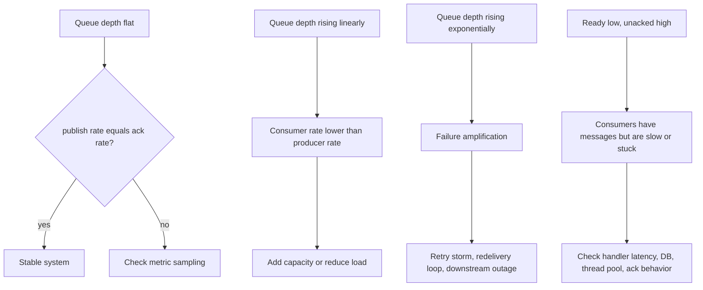
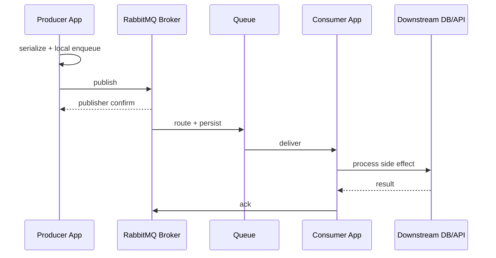
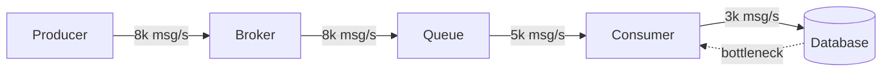

# Part 028 — Performance Model: Throughput, Latency, Queue Depth, and Consumer Lag

Performance tuning without a model is guessing.

RabbitMQ systems often fail not because the broker is weak, but because engineers optimize the wrong thing:

- they increase consumers when the database is the bottleneck,
- they increase prefetch when handlers are already saturated,
- they disable confirms to gain throughput and lose safety,
- they add queues when topology is not the bottleneck,
- they blame RabbitMQ when the service thread pool is unbounded,
- they optimize average latency while p99/p999 collapses,
- they look at queue depth without understanding arrival and service rates.

This part builds the performance mental model needed before detailed benchmarking.

Part 029 will focus on benchmark execution with PerfTest and Stream PerfTest. This part focuses on reasoning.

---

## 1. Kaufman Skill Slice

Kaufman's learning model says we should practice the smallest useful subskill and get feedback quickly.

For performance, the smallest useful subskill is:

> Given observed publish rate, consume rate, queue depth, processing latency, confirm latency, and resource usage, identify the bottleneck and choose the next safe tuning action.

The goal is not to memorize recommended values.

The goal is to reason from invariants:

- messages enter at rate `arrival_rate`,
- messages leave at rate `service_rate`,
- backlog grows when arrival exceeds service,
- latency grows when backlog grows,
- durability increases safety but usually adds latency/cost,
- batching increases throughput but usually increases latency,
- prefetch increases pipeline depth but can increase duplicate work and unfairness,
- more consumers help only if the bottleneck is consumer parallelism,
- publisher confirms are both a safety mechanism and a pressure signal.

---

## 2. The Four Performance Questions

Every RabbitMQ performance discussion should start with four questions.

### 2.1 What is the target throughput?

Examples:

```text
1,000 messages/sec sustained
10,000 messages/sec peak for 15 minutes
200 MB/sec stream ingestion
5 million messages/hour batch replay
```

Throughput without message size is incomplete.

These are very different workloads:

```text
10,000 msg/s x 512 bytes  = ~5 MB/s payload
10,000 msg/s x 50 KB      = ~500 MB/s payload
```

### 2.2 What is the target latency?

Latency must include percentile and scope.

Examples:

```text
p95 publish confirm latency < 50 ms
p99 end-to-end command completion < 2 s
p99 stream consumer lag catch-up < 5 min after 30 min outage
p999 notification delivery < 30 s
```

Average latency is not enough.

### 2.3 What is the safety level?

Examples:

```text
transient telemetry can be dropped under pressure
billing command must survive broker restart
audit event must be durable and replayable
saga command must be effectively-once at business level
```

Safety changes the design:

- transient vs persistent message,
- classic vs quorum queue,
- confirms vs fire-and-forget,
- ack mode,
- retry/DLQ,
- stream retention,
- replication factor.

### 2.4 What is the cost envelope?

Examples:

```text
3-node cluster only
single region
NVMe required
storage retention: 7 days
CPU budget: 8 cores per node
consumer service: 20 pods max
```

A performance target without cost boundary is not an engineering requirement.

---

## 3. Core Performance Vocabulary

### 3.1 Throughput

Throughput is the rate of useful work.

For RabbitMQ, measure at multiple points:

- producer application publish attempt rate,
- broker ingress rate,
- confirmed publish rate,
- routed message rate,
- deliver rate,
- ack rate,
- business-completed rate,
- DLQ rate,
- stream append rate,
- stream read rate.

The most important throughput number is often not “messages published”. It is “business messages completed safely”.

### 3.2 Latency

Latency is time spent moving through the system.

For a queue workload:

```text
end_to_end_latency = producer_enqueue_time
                    + client_publish_wait
                    + broker_accept_and_route_time
                    + queue_wait_time
                    + delivery_wait_time
                    + consumer_processing_time
                    + ack_round_trip
```

For a stream workload:

```text
stream_end_to_end_latency = producer_batch_wait
                           + append_and_confirm_time
                           + replication_time
                           + consumer_fetch_wait
                           + consumer_processing_time
                           + checkpoint_delay
```

### 3.3 Queue Depth

Queue depth is the number of messages waiting or in-flight.

In RabbitMQ queue metrics, pay attention to:

- ready messages,
- unacknowledged messages,
- total messages,
- redelivered messages,
- publish/deliver/ack rates.

Ready messages are waiting in the queue. Unacknowledged messages have been delivered to consumers but not yet acked.

A queue with low ready count but huge unacked count is not empty. The bottleneck is probably consumer processing or ack behavior.

### 3.4 Consumer Lag

Consumer lag means consumer progress is behind producer progress.

For queues, lag is often approximated by:

```text
messages_ready + messages_unacknowledged
```

For streams, lag is offset distance:

```text
producer_offset - committed_consumer_offset
```

Lag is more actionable when converted to time:

```text
lag_seconds = lag_messages / current_processing_rate_messages_per_second
```

If lag is 1,000,000 messages and consumers process 5,000 msg/s, catch-up time is approximately 200 seconds, assuming no new messages arrive.

If new messages continue arriving, use net drain rate:

```text
catch_up_seconds = backlog / (consumer_rate - producer_rate)
```

This only works if `consumer_rate > producer_rate`.

---

## 4. Little's Law for RabbitMQ

Little's Law:

```text
L = λ × W
```

Where:

- `L` = average number of items in the system,
- `λ` = arrival rate,
- `W` = average time in system.

For queues:

```text
average_queue_depth ≈ arrival_rate × average_wait_time
```

If your system receives 1,000 messages/sec and average message time in queue is 5 seconds:

```text
L = 1,000 × 5 = 5,000 messages
```

That means a queue depth of 5,000 may be normal for that latency target.

But if the latency target is 500 ms:

```text
L = 1,000 × 0.5 = 500 messages
```

The same depth now indicates overload.

Queue depth alone is meaningless without rate and latency target.

---

## 5. Queue Depth Dynamics

Queue depth changes according to a simple equation:

```text
depth_next = depth_now + published - acknowledged
```

In rate form:

```text
backlog_growth_rate = arrival_rate - service_rate
```

If producers publish 5,000 msg/s and consumers ack 4,000 msg/s:

```text
backlog grows by 1,000 msg/s
```

After 10 minutes:

```text
1,000 × 600 = 600,000 messages backlog
```

A queue depth graph tells a story.



---

## 6. End-to-End Latency Decomposition

A production latency investigation should break latency into segments.



Segment metrics:

| Segment | Symptom if slow | Typical cause |
|---|---|---|
| Producer local enqueue | app memory grows | unbounded internal queue |
| Publish call | producer blocked | broker flow control, TCP, connection saturation |
| Confirm latency | in-flight grows | replication/disk/broker overload |
| Queue wait | ready depth grows | insufficient consumer service rate |
| Delivery wait | consumers idle unexpectedly | prefetch/concurrency/channel issue |
| Processing time | unacked grows | downstream dependency, CPU, lock contention |
| Ack delay | unacked remains high | batch ack bug, stuck handler |

If you do not segment latency, you tune randomly.

---

## 7. Throughput Bottleneck Model

The effective throughput is the minimum of all stages.

```text
effective_throughput = min(
    producer_capacity,
    network_capacity,
    broker_ingress_capacity,
    routing_capacity,
    queue_storage_capacity,
    broker_delivery_capacity,
    consumer_capacity,
    downstream_capacity
)
```

A RabbitMQ system is a pipeline. The slowest stage controls output.



In this example, adding more producers is harmful. Increasing broker size may not help. The database limits end-to-end throughput.

---

## 8. Consumer Capacity Model

Consumer throughput depends on processing latency and parallelism.

Approximate formula:

```text
consumer_capacity = consumer_instances × concurrency_per_instance × messages_per_worker_per_second
```

Where:

```text
messages_per_worker_per_second = 1 / average_processing_seconds
```

Example:

- 10 pods,
- 8 worker threads each,
- average handler time = 40 ms = 0.04 sec.

```text
per_worker = 1 / 0.04 = 25 msg/s
capacity = 10 × 8 × 25 = 2,000 msg/s
```

If target is 5,000 msg/s, you need to:

- reduce handler latency,
- increase safe concurrency,
- batch downstream calls,
- partition workload,
- remove downstream bottleneck,
- or change architecture.

Adding more RabbitMQ queues does not change handler math.

---

## 9. Prefetch as Pipeline Depth

Prefetch controls how many unacknowledged deliveries RabbitMQ can send to a consumer.

Think of prefetch as:

```text
maximum in-flight work per consumer
```

Small prefetch:

- lower duplicate exposure,
- fairer dispatch,
- lower memory footprint,
- worse throughput when processing is fast and network round trips matter.

Large prefetch:

- better throughput for fast handlers,
- better batching opportunities,
- higher memory footprint,
- more duplicate work after crash,
- worse fairness across consumers,
- more stale work during shutdown.

### 9.1 Prefetch Starting Heuristic

For one consumer process:

```text
prefetch ≈ concurrency × work_buffer_factor
```

Where:

```text
work_buffer_factor = 1 to 4
```

Examples:

```text
8 worker threads, CPU-bound handler      => prefetch 8-16
8 worker threads, I/O-bound handler      => prefetch 16-32
batch consumer with DB batch size 100    => prefetch 100-300
slow long-running task                   => prefetch 1-4
```

Do not set unlimited prefetch for production consumers unless you can prove memory, duplicate, and fairness consequences are acceptable.

---

## 10. Publisher Confirms as Performance Signal

Publisher confirms are commonly described as a reliability feature. They are also a performance signal.

When confirm latency rises, the broker is taking longer to accept responsibility for messages.

Possible causes:

- disk pressure,
- quorum replication delay,
- queue leader overload,
- network congestion,
- too many in-flight messages,
- broker memory pressure,
- downstream queue internal pressure.

A safe producer should bound in-flight publishes.

```java
public final class ConfirmWindow {
    private final Semaphore permits;

    public ConfirmWindow(int maxInFlight) {
        this.permits = new Semaphore(maxInFlight);
    }

    public void beforePublish() throws InterruptedException {
        permits.acquire();
    }

    public void onConfirm() {
        permits.release();
    }

    public void onNack() {
        permits.release();
    }
}
```

This turns confirms into backpressure:

```text
confirm latency rises -> permits return slower -> publish rate slows -> broker protected
```

Without a confirm window, the producer can create unbounded memory pressure inside the application.

---

## 11. Durability and Replication Trade-Offs

Durability affects performance.

Important dimensions:

| Dimension | Safer choice | Performance implication |
|---|---|---|
| Message persistence | persistent message | disk/write path involved |
| Queue durability | durable queue | survives broker restart |
| Replication | quorum queue / stream replica | replication latency and storage cost |
| Confirms | enabled | publisher waits for broker responsibility |
| Ack | manual ack | consumer controls deletion/progress |
| DLQ | enabled | more topology and storage |
| Stream retention | longer | more disk required |

This does not mean “safety is slow”. It means safety consumes resources. Capacity planning must include those resources.

For high-value messages, do not optimize by removing safety. Optimize by batching, partitioning, hardware, topology, and consumer efficiency.

---

## 12. Message Size Model

Message size affects:

- serialization CPU,
- network bandwidth,
- broker memory,
- disk write volume,
- replication cost,
- cache behavior,
- consumer allocation,
- GC pressure,
- batch efficiency.

Payload math matters.

```text
payload_bandwidth = message_rate × average_message_size
```

Example:

```text
20,000 msg/s × 2 KB = 40 MB/s payload
```

But real bandwidth includes protocol framing, headers, replication, TLS, and acknowledgements.

A message with large headers and small payload can still be expensive.

Guidelines:

- keep message payload focused,
- avoid embedding huge documents,
- put large binary objects in object storage and send references,
- compress only when payload size justifies CPU cost,
- avoid excessive headers,
- benchmark realistic payloads.

---

## 13. Queue Type Performance Implications

### 13.1 Classic Queue

Useful for simple queue workloads where replication semantics are not required in the same way as quorum queues.

Consider:

- lower overhead in some workloads,
- less suitable for strict replicated data safety,
- behavior depends on RabbitMQ version and configuration.

### 13.2 Quorum Queue

Useful for replicated queue safety.

Trade-offs:

- Raft-based replication,
- publisher confirms after quorum acceptance,
- different operational model,
- better safety for critical queues,
- capacity must include replication and disk.

### 13.3 Stream

Useful for append-only retained log workloads.

Trade-offs:

- excellent for replay/fan-out/large retained history,
- offset-based consumption,
- retention management required,
- not a drop-in replacement for task queues,
- batching and compression are central to throughput.

### 13.4 Super Stream

Useful when one stream partition is not enough.

Trade-offs:

- partition key design becomes critical,
- hot partition can dominate performance,
- ordering is per partition,
- consumer progress is per partition,
- partition count evolution requires planning.

---

## 14. Broker Resource Model

RabbitMQ performance is constrained by:

- CPU,
- memory,
- disk I/O,
- network I/O,
- Erlang process scheduling,
- queue leader placement,
- connection/channel count,
- TLS overhead,
- plugin overhead,
- management/metrics overhead,
- storage retention.

### 14.1 CPU Bottleneck

Symptoms:

- broker CPU near saturation,
- publish/deliver rates flatten,
- confirm latency rises,
- management UI slow,
- context switching high.

Possible actions:

- reduce message rate,
- reduce routing complexity,
- reduce connection churn,
- partition workload,
- scale consumers/producers correctly,
- distribute queue leaders,
- optimize serialization/compression choices.

### 14.2 Memory Bottleneck

Symptoms:

- memory alarm,
- publishing blocked,
- large ready/unacked count,
- high connection/channel overhead,
- large messages,
- consumer prefetch too high.

Possible actions:

- lower prefetch,
- reduce message size,
- increase consumer throughput,
- limit queue length,
- add backpressure,
- avoid unbounded producer buffers.

### 14.3 Disk Bottleneck

Symptoms:

- disk alarm,
- confirm latency increases,
- queue write/read throughput flatlines,
- stream append slows,
- compaction/retention pressure.

Possible actions:

- improve disk I/O,
- separate workloads,
- reduce retention,
- batch publishes,
- partition streams,
- reduce message size,
- verify fsync/write latency.

### 14.4 Network Bottleneck

Symptoms:

- high network throughput,
- increased publish/delivery latency,
- cross-node traffic high,
- replication lag,
- large payloads.

Possible actions:

- co-locate producers/consumers carefully,
- reduce payload size,
- compress where appropriate,
- avoid unnecessary fanout,
- partition by locality,
- scale network capacity.

---

## 15. Java Client Resource Model

The Java application is often the bottleneck.

### 15.1 Producer-Side Bottlenecks

Possible causes:

- JSON serialization CPU,
- synchronous confirm per message,
- unbounded executor queue,
- too many channels,
- too few connections for high throughput workload,
- TLS overhead,
- blocked connection handling missing,
- no bounded in-flight confirm window.

Bad pattern:

```java
for (Message message : messages) {
    channel.basicPublish(exchange, key, props, message.bytes());
    channel.waitForConfirmsOrDie();
}
```

This is safe but often slow because every message waits independently.

Better pattern:

```java
channel.confirmSelect();

for (Message message : batch) {
    channel.basicPublish(exchange, key, props, message.bytes());
}

channel.waitForConfirmsOrDie(Duration.ofSeconds(5).toMillis());
```

For high-throughput systems, asynchronous confirms with bounded in-flight tracking are usually better.

### 15.2 Consumer-Side Bottlenecks

Possible causes:

- handler doing blocking I/O,
- database transaction too slow,
- lock contention,
- slow JSON parsing,
- synchronous external API calls,
- too much per-message allocation,
- per-message DB commit instead of batching,
- prefetch too low or too high,
- ack batching bug,
- thread pool saturation.

Consumer performance must be measured at the business handler boundary:

```text
message received -> business side effect committed -> ack sent
```

Not merely at `handleDelivery()` entry.

---

## 16. Capacity Planning Worksheet

Use this worksheet before tuning.

### 16.1 Input Requirements

```text
Message type: order.created.event.v1
Payload p50/p95 size: 2 KB / 8 KB
Sustained publish rate: 2,000 msg/s
Peak publish rate: 8,000 msg/s for 10 min
Durability: persistent + quorum queue
Confirm target: p95 < 100 ms
Consumer processing p95: 40 ms
Consumer DB writes: batch size 100
End-to-end latency target: p99 < 5 s
Retention/DLQ: 7 days DLQ
Replay requirement: no, queue workload
```

### 16.2 Consumer Capacity

```text
handler_p95 = 40 ms
worker_rate = 1 / 0.040 = 25 msg/s
workers_required_for_peak = 8,000 / 25 = 320 workers
```

If each pod has 16 safe workers:

```text
pods_required = 320 / 16 = 20 pods
```

Add headroom:

```text
20 × 1.5 = 30 pods
```

But this is valid only if DB can handle the load.

### 16.3 Backlog During Peak

If consumer capacity is 6,000 msg/s and peak is 8,000 msg/s:

```text
backlog_growth = 2,000 msg/s
peak_duration = 10 min = 600 sec
backlog = 1,200,000 messages
```

After peak, sustained producer rate returns to 2,000 msg/s. If consumer remains 6,000 msg/s:

```text
net_drain = 6,000 - 2,000 = 4,000 msg/s
catch_up = 1,200,000 / 4,000 = 300 sec = 5 min
```

This may be acceptable if latency SLA allows it.

### 16.4 Storage Estimate

Approximate payload only:

```text
1,200,000 × 8 KB p95 = 9.6 GB payload
```

Real storage is higher because of metadata, replication, queue/stream internals, and filesystem overhead.

For quorum replication factor 3, raw replicated bytes are roughly multiplied by 3 before additional overhead.

This is not a substitute for benchmarking, but it catches impossible plans early.

---

## 17. Performance Metrics Map

| Metric | Layer | Why it matters |
|---|---|---|
| publish rate | producer/broker | ingress demand |
| confirm latency | producer/broker | safety wait and broker pressure |
| returned message count | routing | unroutable publish detection |
| deliver rate | broker/consumer | broker egress |
| ack rate | consumer/broker | completed processing rate |
| ready messages | queue | waiting backlog |
| unacked messages | queue/consumer | in-flight work |
| redelivery rate | reliability | duplicate/retry storm signal |
| DLQ rate | reliability | poison/failure signal |
| consumer processing time | app | handler bottleneck |
| DB latency | downstream | external bottleneck |
| connection blocked | broker/client | flow control signal |
| memory alarm | broker | publishing blocked risk |
| disk alarm | broker | storage risk |
| stream offset lag | stream | replay/fan-out lag |
| outbox relay lag | app | publish pipeline lag |

A mature dashboard shows relationships, not isolated numbers.

---

## 18. Alert Design

Good alerts are actionable.

Poor alert:

```text
Queue depth > 10,000
```

Better alert:

```text
Queue depth implies > 5 minutes catch-up time at current net drain rate
```

Better RabbitMQ alerts:

- ready messages growing for 10 minutes and ack rate < publish rate,
- unacked messages > prefetch × active consumers × threshold,
- confirm latency p95 above SLA for 5 minutes,
- redelivery rate above baseline,
- DLQ rate non-zero for critical queue,
- memory alarm active,
- disk alarm active,
- consumer count lower than expected,
- stream lag catch-up time above threshold,
- outbox relay lag above threshold.

Alert on violated invariants, not arbitrary counters.

---

## 19. Tuning Order

Tune in this order.

### Step 1 — Confirm the Bottleneck

Do not change config yet.

Collect:

- publish rate,
- confirm latency,
- ready/unacked,
- deliver/ack rate,
- consumer processing latency,
- downstream latency,
- broker CPU/memory/disk/network,
- redelivery/DLQ.

### Step 2 — Remove Correctness Bugs

Fix:

- unbounded retries,
- duplicate storm,
- missing ack,
- consumer crash loop,
- poison message loop,
- blocked outbox relay,
- topology misrouting.

Performance tuning on an incorrect system hides the real problem.

### Step 3 — Fix Consumer Bottlenecks

If ack rate is too low:

- optimize handler,
- batch DB writes,
- increase safe concurrency,
- tune prefetch,
- isolate slow message types,
- split hot queue by partition key.

### Step 4 — Fix Producer Pressure

If confirm latency/in-flight grows:

- bound in-flight confirms,
- batch confirms,
- reduce message size,
- reduce fanout explosion,
- partition workload,
- inspect broker disk/network.

### Step 5 — Fix Broker Resource Limits

If broker resources saturate:

- rebalance queue leaders,
- scale node resources,
- adjust retention,
- isolate workloads,
- use streams/super streams for log workloads,
- review replication factor and storage.

### Step 6 — Re-benchmark

Every tuning change needs before/after metrics.

---

## 20. Performance Failure Patterns

### 20.1 Retry Storm

Symptoms:

- redelivery spikes,
- ready/unacked oscillates,
- downstream remains overloaded,
- DLQ eventually spikes.

Cause:

- consumers retry immediately under dependency outage.

Fix:

- delayed retry,
- retry budget,
- circuit breaker,
- parking lot,
- backpressure.

### 20.2 Confirm Window Exhaustion

Symptoms:

- producer in-flight at max,
- confirm latency rising,
- publish throughput falling,
- broker disk/network high.

Cause:

- broker cannot accept responsibility as fast as producer publishes.

Fix:

- reduce rate,
- batch safely,
- scale storage/network,
- partition workload,
- inspect quorum replication.

### 20.3 Unacked Mountain

Symptoms:

- ready count low,
- unacked count high,
- consumers appear alive,
- ack rate low.

Cause:

- handler stuck,
- prefetch too high,
- thread pool saturation,
- downstream timeout too long,
- manual ack missing.

Fix:

- lower prefetch,
- timeout dependencies,
- bound executor,
- inspect thread dumps,
- add handler latency metrics.

### 20.4 Fanout Explosion

Symptoms:

- one event creates many queue copies,
- broker egress high,
- storage grows unexpectedly,
- slow subscriber accumulates backlog.

Cause:

- uncontrolled subscriber topology.

Fix:

- govern subscriptions,
- use topic filtering,
- use stream fan-out for replay-heavy subscribers,
- isolate slow subscribers.

### 20.5 Hot Partition

Symptoms:

- one queue/stream partition overloaded,
- cluster has idle capacity elsewhere,
- key distribution skewed.

Cause:

- bad partition key,
- celebrity tenant/entity,
- one region/customer dominates.

Fix:

- use better key,
- split hot tenant,
- add routing subkey,
- isolate hot workload.

---

## 21. Java Instrumentation Example

A useful consumer timer must include processing and ack boundary.

```java
public final class InstrumentedConsumer implements DeliverCallback {
    private final Timer processingTimer;
    private final Counter ackCounter;
    private final Counter nackCounter;
    private final BusinessHandler handler;
    private final Channel channel;

    @Override
    public void handle(String consumerTag, Delivery delivery) throws IOException {
        long tag = delivery.getEnvelope().getDeliveryTag();
        Timer.Sample sample = Timer.start();

        try {
            handler.process(delivery);
            channel.basicAck(tag, false);
            ackCounter.increment();
        } catch (TransientException ex) {
            channel.basicNack(tag, false, true);
            nackCounter.increment();
        } catch (Exception ex) {
            channel.basicNack(tag, false, false);
            nackCounter.increment();
        } finally {
            sample.stop(processingTimer);
        }
    }
}
```

Add tags carefully. Avoid high-cardinality tags like `messageId` or `customerId`.

Good metric tags:

- queue,
- message type,
- handler,
- result,
- retry class.

Bad metric tags:

- message id,
- order id,
- user id,
- correlation id,
- raw error message.

---

## 22. Performance Design Checklist

Before production launch, answer:

### 22.1 Workload

- What is sustained publish rate?
- What is peak publish rate?
- What is average and p95 message size?
- What is required p95/p99 latency?
- What is acceptable backlog during peak?
- What is required catch-up time?

### 22.2 Safety

- Are messages persistent?
- Are queues durable?
- Are publisher confirms enabled?
- Are consumers using manual ack?
- Is idempotency implemented?
- Is retry bounded?
- Is DLQ monitored?

### 22.3 Capacity

- What is producer max throughput?
- What is broker max safe throughput?
- What is consumer max throughput?
- What is downstream max throughput?
- Which one is bottleneck?
- What is headroom?

### 22.4 Operations

- What metrics prove the system is stable?
- What alert detects growing catch-up time?
- What happens under broker flow control?
- What happens under disk alarm?
- What happens when consumers are down for 30 minutes?
- What is the replay/repair process?

---

## 23. Practice Drill

You are given this workload:

```text
Event: case.evidence.index.requested.v1
Payload p95: 12 KB
Peak producer rate: 3,000 msg/s for 20 minutes
Sustained producer rate: 600 msg/s
Consumer p95 processing time: 80 ms
Consumer concurrency per pod: 12
Maximum pods: 30
Required catch-up after peak: < 10 minutes
Required end-to-end p99 during normal load: < 3 seconds
Safety: persistent messages, quorum queue, publisher confirms, manual ack
```

Answer:

1. What is max consumer capacity?
2. Will backlog grow during peak?
3. How large will backlog become?
4. Can the system catch up within 10 minutes?
5. What metrics would confirm your answer?
6. What would you tune first?

Calculation:

```text
per_worker = 1 / 0.080 = 12.5 msg/s
per_pod = 12 × 12.5 = 150 msg/s
max_capacity = 30 × 150 = 4,500 msg/s
```

Peak rate is 3,000 msg/s, so max consumer capacity is enough if downstream dependencies can sustain it.

At sustained load, capacity headroom is high:

```text
4,500 - 600 = 3,900 msg/s spare
```

If only 15 pods are running during peak:

```text
capacity = 15 × 150 = 2,250 msg/s
backlog_growth = 3,000 - 2,250 = 750 msg/s
peak_duration = 20 × 60 = 1,200 sec
backlog = 750 × 1,200 = 900,000 messages
```

After peak with 15 pods:

```text
net_drain = 2,250 - 600 = 1,650 msg/s
catch_up = 900,000 / 1,650 = 545 sec ≈ 9.1 min
```

This barely fits. With safety margin, scale above 15 pods or reduce processing time.

---

## 24. Summary

RabbitMQ performance is not one number.

It is a balance between:

- throughput,
- latency,
- durability,
- replication,
- cost,
- backlog tolerance,
- catch-up time,
- consumer correctness,
- downstream capacity.

Queue depth means little without arrival rate, service rate, and latency target.

Prefetch is not magic. It is in-flight work budget.

Publisher confirms are not only safety. They are backpressure signal.

More consumers help only if the consumer tier is the bottleneck and downstream systems can absorb the load.

Durability and replication are not “slow settings”. They are safety contracts that must be capacity-planned.

The engineer-level performance question is always:

> Which stage is the bottleneck, what invariant is being violated, and what is the safest tuning action that increases useful completed work without hiding failure?

That is the model we will use in the next part when we move from reasoning to benchmark execution.

---

## References

- RabbitMQ Documentation — Consumer Acknowledgements and Publisher Confirms: https://www.rabbitmq.com/docs/confirms
- RabbitMQ Documentation — Flow Control: https://www.rabbitmq.com/docs/flow-control
- RabbitMQ Documentation — Queues: https://www.rabbitmq.com/docs/queues
- RabbitMQ Documentation — Quorum Queues: https://www.rabbitmq.com/docs/quorum-queues
- RabbitMQ Documentation — Streams: https://www.rabbitmq.com/docs/streams
- RabbitMQ Java Tools — PerfTest: https://www.rabbitmq.com/client-libraries/java-tools
- RabbitMQ PerfTest Documentation: https://perftest.rabbitmq.com/
