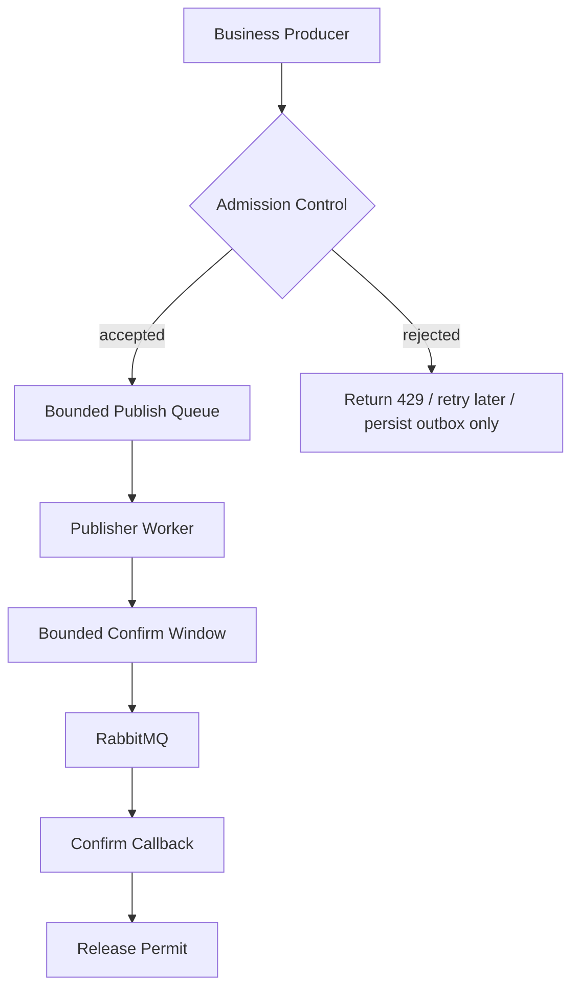

# Part 030 — JVM and Client-Side Performance: Executors, Allocation, GC, Serialization

RabbitMQ performance is not only broker performance.

A Java service can make a healthy broker look slow by wasting CPU, allocating too much, blocking dispatch threads, overusing channels, acknowledging at the wrong time, creating unbounded executor queues, serializing inefficiently, logging too much, or treating publisher confirms as a synchronous per-message bottleneck.

This part focuses on the Java side of RabbitMQ performance.

The goal is not to micro-optimize prematurely. The goal is to build a client architecture that is correct first, measurable second, and optimizable third.

---

## 1. Kaufman Deconstruction

To master JVM/client-side performance for RabbitMQ, decompose the skill into twelve capabilities:

1. **Hot path modelling** — know every operation between business event and broker publish, or broker delivery and business commit.
2. **Client ownership model** — understand connection, channel, consumer, callback, and executor boundaries.
3. **Concurrency design** — separate I/O, dispatch, processing, acknowledgement, and shutdown concerns.
4. **Backpressure design** — bound every queue: publisher buffer, executor queue, confirm map, batch buffer, retry buffer.
5. **Allocation control** — avoid avoidable object churn in hot paths.
6. **Serialization efficiency** — choose payload format and conversion strategy intentionally.
7. **Confirm optimization** — use publisher confirms safely without turning every publish into a round-trip.
8. **Consumer optimization** — tune prefetch, worker count, handler latency, and ack strategy together.
9. **GC literacy** — interpret allocation rate, pause time, and tail latency.
10. **Profiling workflow** — use evidence from metrics, JFR, async-profiler, and heap analysis.
11. **Failure-aware tuning** — ensure performance tuning does not break redelivery, idempotency, or shutdown safety.
12. **Regression control** — protect the hot path with benchmarks and allocation budgets.

The standard:

> A RabbitMQ Java client is performant when the bottleneck is explicit, bounded, observable, and still correct under failure.

---

## 2. The Java Messaging Hot Path

A publish path often looks like this:


A consume path often looks like this:


Every box has cost.

Performance engineering starts by measuring which box dominates.

---

## 3. Correctness Comes Before Speed

Never optimize by removing safety semantics without naming the contract change.

Unsafe “optimization” examples:

| Change | Why It Is Dangerous |
|---|---|
| disable publisher confirms | producer can lose messages silently after connection/broker failure |
| auto-ack consumers | broker can drop messages before processing succeeds |
| ack before DB commit | crash loses work |
| unbounded executor queue | memory grows until JVM dies |
| unlimited in-flight confirms | publisher memory grows during broker slowdown |
| huge prefetch | crash creates large duplicate storm and unfair dispatch |
| skip idempotency | redelivery creates duplicate side effects |
| debug log every message | logging becomes bottleneck during incident |

Performance work must preserve the selected delivery guarantee.

---

## 4. Connection and Channel Performance Model

The RabbitMQ Java client exposes `Connection` and `Channel`.

Operational model:

- a connection is a TCP connection to the broker;
- a channel is a lightweight virtual session multiplexed over a connection;
- channels are cheaper than connections;
- channels should have clear ownership;
- avoid sharing a channel concurrently across unrelated threads;
- use long-lived connections and channels rather than creating them per message;
- close resources deliberately on shutdown.

Bad pattern:

```java
public void publish(byte[] body) throws Exception {
    Connection connection = factory.newConnection();
    Channel channel = connection.createChannel();
    channel.basicPublish(exchange, routingKey, props, body);
    channel.close();
    connection.close();
}
```

This pays connection/channel setup cost for every message and destroys throughput.

Better pattern:

```java
public final class PublisherLifecycle implements AutoCloseable {
    private final Connection connection;
    private final Channel channel;

    public PublisherLifecycle(ConnectionFactory factory) throws Exception {
        this.connection = factory.newConnection("orders-publisher");
        this.channel = connection.createChannel();
        this.channel.confirmSelect();
    }

    public void publish(String exchange, String routingKey, AMQP.BasicProperties props, byte[] body) throws Exception {
        channel.basicPublish(exchange, routingKey, true, props, body);
    }

    @Override
    public void close() throws Exception {
        try {
            channel.close();
        } finally {
            connection.close();
        }
    }
}
```

In real systems, add confirm handling, returned message handling, backpressure, health, and recovery strategy.

---

## 5. Channel Ownership Patterns

### 5.1 Single Publisher Thread per Channel

```text
one publisher worker thread -> one channel
```

Benefits:

- simple ownership;
- no publish interleaving surprises;
- easier confirm tracking;
- less locking in application code.

Cost:

- may need multiple workers/channels for high throughput.

### 5.2 Publisher Pool

```text
N publisher workers -> N channels -> one shared connection or small connection set
```

Benefits:

- scalable producer throughput;
- bounded concurrency;
- clear in-flight budget per channel.

Risks:

- routing order may change across channels;
- confirm tracking must be per channel;
- shutdown must drain all channels.

### 5.3 Shared Channel Across Many Threads

Avoid this unless the client documentation and your synchronization model make it safe for your exact use case.

Risks:

- contention;
- difficult confirm correlation;
- interleaving;
- accidental use after close;
- obscure failure behavior.

Design rule:

> A channel should have a small, explicit owner set. The safest default is one logical publisher/consumer component owns one channel.

---

## 6. Publisher Confirm Performance

Publisher confirms create a safety boundary.

Naive slow pattern:

```java
channel.basicPublish(exchange, routingKey, props, body);
channel.waitForConfirmsOrDie(5_000);
```

This can turn each message into a publish-confirm round-trip.

Better pattern: publish multiple messages, track confirms asynchronously, and bound in-flight messages.

```java
public final class ConfirmWindow {
    private final Semaphore permits;
    private final ConcurrentNavigableMap<Long, PendingMessage> pending = new ConcurrentSkipListMap<>();

    public ConfirmWindow(int maxInFlight) {
        this.permits = new Semaphore(maxInFlight);
    }

    public void beforePublish(Channel channel, PendingMessage msg) throws Exception {
        permits.acquire();
        long seqNo = channel.getNextPublishSeqNo();
        pending.put(seqNo, msg);
    }

    public void handleAck(long seqNo, boolean multiple) {
        if (multiple) {
            pending.headMap(seqNo, true).clear();
            // release the exact number in production code
        } else {
            pending.remove(seqNo);
        }
        permits.release();
    }

    public void handleNack(long seqNo, boolean multiple) {
        // mark affected messages for retry or outbox republish
        if (multiple) {
            pending.headMap(seqNo, true).clear();
        } else {
            pending.remove(seqNo);
        }
        permits.release();
    }
}
```

Production code must release permits accurately for `multiple=true`; the simplified example highlights the design, not a final library.

The performance levers:

| Lever | Effect | Risk |
|---|---|---|
| max in-flight confirms | increases throughput | memory growth and duplicate ambiguity if too high |
| producer workers | increases parallelism | ordering and resource contention |
| message size | affects socket/disk/GC | large payload cost |
| batch/outbox relay size | reduces DB/broker overhead | latency and duplicate amplification |
| confirm timeout | detects stuck publish | false positives under failover if too aggressive |

---

## 7. Producer Backpressure Design

A fast producer must still stop.



Bound these resources:

- incoming publish requests;
- local publish queue;
- per-channel in-flight confirms;
- outbox query batch;
- serialized payload buffer;
- retry queue;
- executor queue.

Unbounded producer design hides broker pressure until the JVM fails.

---

## 8. Consumer Dispatch Thread Rule

Do not run expensive business logic on the RabbitMQ client dispatch path unless you intentionally accept that bottleneck.

Bad pattern:

```java
DeliverCallback callback = (consumerTag, delivery) -> {
    // expensive JSON parsing, DB transaction, HTTP call, logging, etc.
    process(delivery);
    channel.basicAck(delivery.getEnvelope().getDeliveryTag(), false);
};
```

Better pattern:

```java
ExecutorService workers = new ThreadPoolExecutor(
        8,
        8,
        0L,
        TimeUnit.MILLISECONDS,
        new ArrayBlockingQueue<>(1_000),
        new ThreadPoolExecutor.CallerRunsPolicy()
);

DeliverCallback callback = (consumerTag, delivery) -> {
    boolean accepted = trySubmit(workers, () -> handleDelivery(channel, delivery));
    if (!accepted) {
        channel.basicNack(delivery.getEnvelope().getDeliveryTag(), false, true);
    }
};
```

However, ack/nack from worker threads must respect channel ownership and client thread-safety rules. A common production solution is:

- one consumer channel;
- delivery callback hands work to bounded workers;
- ack commands are serialized back through an ack executor owning the channel;
- prefetch is aligned with worker capacity.

---

## 9. Consumer Executor Sizing

For CPU-bound handlers:

```text
worker_count ≈ available_cores allocated to service
```

For I/O-bound handlers:

```text
worker_count ≈ target_concurrency based on downstream capacity and latency
```

Use this capacity estimate:

```text
throughput ≈ workers / average_processing_time
```

Example:

```text
workers = 32
average processing time = 40 ms
capacity ≈ 32 / 0.040 = 800 msg/s
```

If target is 3,000 msg/s, you need one or more of:

- faster handler;
- more workers;
- more service replicas;
- batching;
- downstream scaling;
- lower per-message transaction cost;
- different architecture.

RabbitMQ tuning cannot overcome a slow handler.

---

## 10. Prefetch and Worker Count Alignment

Prefetch should be related to processing concurrency.

Reasonable starting point:

```text
prefetch ≈ worker_count × 1 to 4
```

Examples:

| Worker Count | Starting Prefetch | Notes |
|---:|---:|---|
| 4 | 8–16 | low concurrency service |
| 16 | 32–64 | common business handler |
| 64 | 128–256 | high concurrency I/O handler |
| 128 | 256–512 | only if memory and duplicate storm risk are acceptable |

Too low:

- workers idle;
- broker round-trip overhead visible;
- lower throughput.

Too high:

- large unacked set;
- memory pressure;
- unfair dispatch;
- inflated tail latency;
- large duplicate storm on crash;
- slow poison detection.

---

## 11. Ack Serialization Pattern

When workers process concurrently, ack order can become tricky.

Simple safe option:

- each worker submits an ack command;
- one ack executor owns the channel;
- ack individually with `multiple=false`.

```java
public final class AckExecutor implements AutoCloseable {
    private final ExecutorService single = Executors.newSingleThreadExecutor();
    private final Channel channel;

    public AckExecutor(Channel channel) {
        this.channel = channel;
    }

    public void ack(long deliveryTag) {
        single.execute(() -> {
            try {
                channel.basicAck(deliveryTag, false);
            } catch (IOException e) {
                // record failure; connection recovery/redelivery will handle ambiguous state
            }
        });
    }

    public void nack(long deliveryTag, boolean requeue) {
        single.execute(() -> {
            try {
                channel.basicNack(deliveryTag, false, requeue);
            } catch (IOException e) {
                // record failure
            }
        });
    }

    @Override
    public void close() {
        single.shutdown();
    }
}
```

This is not the highest-throughput ack strategy, but it is easy to reason about.

Ack batching with `multiple=true` is faster but requires ordered completion tracking. Do not use it casually when processing is parallel and completion order can differ from delivery order.

---

## 12. Ordered Completion Tracker

If you need ack batching, track contiguous completed delivery tags.

```text
delivered: 1 2 3 4 5 6 7
completed: 1 2 . 4 5 . 7
safe multiple ack up to: 2
```

Delivery tag 4 and 5 completed, but cannot be acknowledged with `multiple=true` until 3 completes. Otherwise, message 3 may be acknowledged before safe processing.

A correct tracker maintains:

- highest contiguous completed tag;
- gap set;
- failure set;
- channel generation/recovery boundary;
- shutdown flush behavior.

If this feels complex, use individual acks first.

---

## 13. Virtual Threads

Virtual threads can help when your consumer handler blocks on I/O and the downstream system can handle the concurrency.

They do not remove the need for:

- prefetch bounds;
- downstream rate limits;
- connection/channel ownership;
- ack correctness;
- idempotency;
- backpressure;
- memory control;
- timeout policy.

Good use case:

```text
consumer delivery -> bounded virtual-thread executor -> blocking HTTP/DB call with timeout -> ack after commit
```

Bad use case:

```text
prefetch = 100000
virtual thread per message
no downstream limit
no bounded executor
```

Virtual threads make blocking cheaper. They do not make downstream systems infinite.

---

## 14. Executor Queue Policy

A bounded executor needs a rejection policy.

| Policy | Behavior | Use Case |
|---|---|---|
| Abort | reject immediately | fail-fast service, explicit nack/requeue |
| CallerRuns | slows delivery callback | simple local backpressure, but be careful with client dispatch |
| Discard | drops task | usually unsafe for messaging |
| Custom nack/requeue | requeue when saturated | useful but can create requeue storm |
| Custom park/DLQ | park overload-specific messages | rare, requires policy |

For RabbitMQ consumers, rejection must map to message semantics.

If local executor is full, options:

1. do not consume more by reducing prefetch or stopping consumer;
2. nack/requeue carefully;
3. nack to DLQ if message cannot be handled safely;
4. block dispatch briefly with timeout;
5. scale consumers if downstream capacity exists.

---

## 15. Serialization Cost

Serialization is often a bigger cost than RabbitMQ client code.

Dimensions:

| Format | Strength | Risk |
|---|---|---|
| JSON | debuggable, flexible | larger payload, parsing allocation |
| Avro | schema evolution, compact binary | registry/tooling required |
| Protobuf | compact, fast, strong contracts | schema discipline required |
| Java serialization | avoid for external message contracts | unsafe/fragile/versioning issues |

Performance considerations:

- payload size;
- encoding/decoding CPU;
- allocation rate;
- schema validation cost;
- unknown field handling;
- compression interaction;
- debugging/operability;
- compatibility testing.

Do not pick a format only because it benchmarks fastest in isolation. Pick it based on contract lifecycle and system constraints.

---

## 16. JSON Hot Path Guidelines

If using JSON:

- reuse `ObjectMapper`;
- avoid creating a new mapper per message;
- use byte-array serialization directly where possible;
- avoid unnecessary intermediate `String` conversion;
- consider afterburner/blackbird modules only after measurement;
- avoid reflection-heavy dynamic maps in hot paths when schema is stable;
- validate schema at boundaries, not repeatedly inside every internal function;
- avoid pretty printing;
- sample payload logging, never log full payload per message.

Bad:

```java
String json = new ObjectMapper().writeValueAsString(event);
byte[] body = json.getBytes(StandardCharsets.UTF_8);
```

Better:

```java
private static final ObjectMapper MAPPER = new ObjectMapper();

byte[] body = MAPPER.writeValueAsBytes(event);
```

---

## 17. Payload Size Discipline

Large messages hurt:

- producer allocation;
- socket write time;
- broker memory;
- disk write;
- replication traffic;
- consumer allocation;
- deserialization time;
- GC pauses;
- DLQ storage;
- replay speed.

Use message payloads to carry the state needed by the consumer, not arbitrary object graphs.

For large binary/document content, prefer:

```text
message = metadata + reference + checksum + authorization context
payload stored in object storage/document store
```

But do not blindly replace every payload with a reference. References create consistency and lifecycle problems.

Use references when:

- payload is large;
- payload is immutable;
- storage has retention aligned with message processing;
- consumer can tolerate fetch latency;
- authorization and audit are clear.

---

## 18. Allocation Hot Spots

Common allocation sources:

- JSON serialization/deserialization;
- envelope builders;
- header maps;
- string concatenation for routing keys;
- logging arguments;
- tracing baggage;
- metrics labels with high cardinality;
- exception creation in normal control flow;
- copying byte arrays;
- per-message `Connection`/`Channel` creation;
- per-message thread creation;
- large batch lists;
- retry wrapper objects.

Measure allocation with:

- Java Flight Recorder;
- async-profiler allocation mode;
- heap histograms;
- GC logs;
- allocation-aware microbenchmarks.

Optimization principle:

> Reduce allocation in the hot path only after correctness and observability are in place.

---

## 19. Object Reuse: Be Careful

Object reuse can reduce allocation but introduce bugs.

Safe-ish reuse:

- shared immutable `ObjectMapper`;
- precomputed routing key strings;
- immutable `BasicProperties` templates;
- reusable buffers scoped to one thread;
- precompiled schema/validator;
- fixed metric label objects.

Dangerous reuse:

- mutable message envelope reused across publishes;
- shared byte buffer across async confirms;
- mutable header map reused across threads;
- thread-local buffers with unbounded growth;
- object pools for tiny short-lived objects without proof.

Modern JVMs allocate short-lived objects efficiently. Do not build a fragile object pool to save nanoseconds unless profiling proves it matters.

---

## 20. GC and Tail Latency

GC does not only reduce throughput. It creates tail latency.

Watch:

- allocation rate MB/s;
- young GC frequency;
- pause p95/p99;
- old-gen occupancy;
- humongous allocations;
- promotion rate;
- safepoint pauses;
- direct buffer usage;
- heap after GC trend.

If p99 message latency spikes align with GC pauses, RabbitMQ is not the root cause.

Actions:

- reduce payload allocation;
- avoid intermediate strings;
- right-size heap;
- tune batch sizes;
- reduce logging allocation;
- sample tracing;
- avoid giant messages;
- profile before changing GC algorithm.

---

## 21. Heap Sizing for Messaging Services

Too small heap:

- frequent GC;
- high CPU;
- latency spikes.

Too large heap:

- longer worst-case pauses depending on collector/config;
- hides leaks longer;
- slower container rescheduling under memory pressure.

Messaging service heap must account for:

```text
heap ≈ base app + in-flight messages + executor queues + confirm map + batch buffers + deserialized objects + observability overhead + safety margin
```

Example:

```text
prefetch = 500
average deserialized message graph = 20 KB
in-flight consumer memory ≈ 10 MB

confirm window = 50,000
average pending publish metadata = 500 B
confirm memory ≈ 25 MB

batch buffers = 20 batches × 1,000 messages × 2 KB
batch body memory ≈ 40 MB
```

This is simplified, but it forces explicit thinking.

---

## 22. Direct Buffers and Network I/O

Messaging clients may use heap and non-heap memory indirectly through sockets, TLS, compression, and libraries.

Observe:

- RSS, not only Java heap;
- direct buffer usage if available;
- thread stacks;
- TLS buffer overhead;
- container memory limit;
- native memory tracking for difficult cases.

A JVM can be killed by container memory limit even when heap looks healthy.

---

## 23. Logging Performance

Logging is part of the hot path.

Bad:

```java
log.info("Consumed message body={} headers={}", new String(body, UTF_8), headers);
```

Problems:

- converts every payload to string;
- logs PII risk;
- allocates heavily;
- slows consumer;
- increases disk/collector pressure;
- hides real incident signals in noise.

Better:

```java
log.info("Consumed message type={} messageId={} correlationId={} redelivered={}",
        type, messageId, correlationId, redelivered);
```

Rules:

- log metadata, not full payload;
- sample noisy success logs;
- log failures with enough context;
- avoid high-cardinality metric labels;
- never debug-log every message in production hot path.

---

## 24. Metrics Overhead

Metrics are necessary, but they can hurt performance if misused.

Good metric labels:

- exchange;
- queue;
- message type;
- result;
- error class;
- service name;
- consumer group;
- stream/partition.

Bad metric labels:

- message id;
- user id;
- order id;
- correlation id;
- raw routing key with unbounded tenant/entity segments;
- exception message;
- payload field values.

High-cardinality metrics can break the monitoring system and slow the service.

---

## 25. Tracing Overhead

Distributed tracing is useful for messaging, but trace every message only if volume allows it.

Strategies:

- propagate trace context in headers;
- sample traces;
- force trace for error paths;
- force trace for selected tenants/workflows;
- record message metadata as span attributes with controlled cardinality;
- avoid payload span attributes;
- separate producer publish span from consumer processing span;
- record queue delay if possible.

Tracing should explain incidents, not create them.

---

## 26. RabbitMQ Stream Java Client Performance

Streams have a different client performance profile:

- producers can benefit from batching;
- confirms can be asynchronous;
- deduplication uses producer identity and publishing id;
- consumers read by offset;
- offset tracking can be server-side or external;
- compression can improve throughput when network/disk bound;
- super streams scale by partition;
- hot partitions still bottleneck.

Stream producer tuning variables:

| Variable | Effect |
|---|---|
| batch/sub-entry size | throughput vs latency |
| compression | CPU vs network/disk |
| max in-flight | throughput vs memory |
| producer count | parallelism |
| super stream partition count | horizontal scaling |
| routing key cardinality | partition balance |

Stream consumer tuning variables:

| Variable | Effect |
|---|---|
| offset commit interval | replay duplicate window |
| processing concurrency | throughput |
| partition assignment | balance |
| batch read size | throughput/latency |
| decompression cost | CPU |
| state store writes | bottleneck |

---

## 27. Stream Offset Commit Performance

Offset commits are correctness and performance trade-offs.

Commit every message:

- smallest replay duplicate window;
- highest commit overhead.

Commit every N messages:

- lower overhead;
- larger duplicate window after crash.

Commit every T seconds:

- predictable overhead;
- duplicate window depends on rate.

Commit after state-store transaction:

- strongest processing consistency;
- depends on DB latency.

Design rule:

> Commit offsets only after the side effect or state update represented by that offset is durable.

---

## 28. CPU Profiling Workflow

When CPU is high:

1. Capture a short profile under steady load.
2. Identify top CPU consumers.
3. Separate application CPU from library CPU.
4. Check serialization/deserialization.
5. Check compression.
6. Check logging/tracing.
7. Check TLS/encryption.
8. Check lock contention.
9. Change one thing.
10. Re-run the same benchmark.

Useful tools:

- Java Flight Recorder;
- async-profiler;
- JDK Mission Control;
- `jcmd`;
- Micrometer/JVM metrics;
- broker metrics for correlation.

Do not tune based on CPU percentage alone. Profile the call stacks.

---

## 29. Allocation Profiling Workflow

When GC or allocation is high:

1. Capture allocation profile under realistic load.
2. Identify allocation-heavy classes.
3. Classify allocations as payload, envelope, headers, logging, metrics, tracing, framework, or business logic.
4. Remove obvious waste.
5. Re-measure.
6. Only then consider deeper changes.

Common wins:

- reuse `ObjectMapper`;
- write JSON directly to bytes;
- remove per-message `String` conversion;
- avoid full payload logs;
- reduce header map churn;
- reduce high-cardinality metrics;
- reduce exception-as-control-flow;
- avoid huge batch buffers;
- reduce message size.

---

## 30. Lock Contention

High-throughput clients can suffer from lock contention.

Sources:

- shared channel used by many threads;
- synchronized publisher wrapper;
- global metrics registry contention;
- shared `Random` or ID generator;
- shared serializer with unsafe configuration;
- single executor queue;
- confirm map under too many producers;
- logging appender locks;
- database connection pool contention.

Symptoms:

- CPU not fully used;
- threads blocked/waiting;
- throughput plateaus with more threads;
- p99 latency worsens as concurrency rises.

Fixes:

- shard publishers by channel;
- reduce shared mutable state;
- use per-worker buffers where safe;
- use asynchronous logging carefully;
- bound and shard queues;
- profile locks before redesign.

---

## 31. Thread Dump Interpretation

During a performance incident, collect thread dumps.

Look for:

- many blocked threads on same monitor;
- executor pool saturated;
- RabbitMQ dispatch thread blocked in business code;
- HTTP/DB calls stuck without timeout;
- logging appender blocked;
- GC threads active during latency spike;
- channel close/recovery loops;
- virtual threads parked on downstream I/O.

Thread dumps show *where time is waiting*.

Metrics show *how much*.

Profiles show *why CPU is burning*.

Use all three.

---

## 32. Timeouts

Performance without timeout policy is fake.

Every blocking dependency in a consumer must have:

- connect timeout;
- read/request timeout;
- total deadline if possible;
- retry budget;
- circuit breaker or rate limiter when needed;
- classification into retryable/non-retryable.

Without timeouts:

- worker threads hang;
- prefetch fills;
- queue depth grows;
- redelivery gets delayed;
- shutdown hangs;
- p99 latency becomes unbounded.

RabbitMQ tuning cannot fix missing downstream timeouts.

---

## 33. Database Pool Alignment

Many consumers fail because worker count exceeds database capacity.

Example:

```text
consumer workers = 128
database pool = 20
```

108 workers can end up waiting for DB connections.

Symptoms:

- high executor occupancy;
- low CPU;
- high queue depth;
- DB pool wait time high;
- message p99 latency high;
- no broker bottleneck.

Align:

```text
consumer concurrency <= downstream capacity × safety factor
```

If handlers use DB transactions, tune:

- DB pool size;
- transaction duration;
- query latency;
- indexes;
- lock contention;
- batch writes;
- idempotency table contention.

---

## 34. Idempotency Store Performance

Idempotency checks are on the hot path.

Design considerations:

- unique index on dedup key;
- narrow row width;
- retention/cleanup strategy;
- partitioning for high volume;
- insert-first vs select-then-insert;
- transaction isolation;
- conflict handling;
- hot key risk;
- write amplification.

Bad pattern:

```text
select by message_id -> if missing insert -> process
```

This can race under concurrency.

Better pattern:

```text
insert dedup key with unique constraint -> if conflict, treat as duplicate
```

The fastest consumer that duplicates side effects is not correct.

---

## 35. Outbox Relay Performance

Outbox relay hot path:


Tuning variables:

- query batch size;
- DB lock strategy;
- publisher count;
- confirm in-flight window;
- mark-published batch size;
- retry delay;
- ordering requirement;
- partition/shard key;
- payload serialization.

Common bottlenecks:

- DB query scans;
- lock contention between relay instances;
- too-small confirm window;
- per-row DB update after confirm;
- large payload serialization;
- publisher channel contention.

Outbox throughput must exceed peak write rate, or backlog grows forever.

---

## 36. Health Checks and Performance

Health checks can cause performance damage if they perform heavy broker operations.

Good health signal:

- connection exists;
- channel can be created if needed;
- publisher confirms not stuck;
- consumer not cancelled;
- local executor not saturated;
- confirm backlog below threshold;
- queue depth/lag within SLO if used for readiness;
- downstream dependencies healthy if consumer needs them.

Bad health check:

- declare/delete queue every second;
- publish test message per pod per second to production exchange;
- call management API heavily from every instance;
- fail liveness on temporary broker flow control.

Separate liveness from readiness.

---

## 37. Graceful Shutdown Performance

Shutdown is a performance scenario because it controls duplicate volume and recovery time.

Producer shutdown:

1. stop accepting new work;
2. flush local publish queue;
3. wait for confirms until deadline;
4. leave unconfirmed outbox rows unpublished for retry;
5. close channel/connection.

Consumer shutdown:

1. cancel consumer or stop listener container;
2. stop accepting new deliveries;
3. allow in-flight workers to finish until deadline;
4. ack completed work;
5. nack/requeue unstarted or unsafe work;
6. close channel/connection.

A service that is fast only when killed unsafely is not production-grade.

---

## 38. Client-Side Performance Metrics

Expose these metrics:

### Producer

- publish attempts/sec;
- publish accepted/sec;
- publish failure/sec;
- returned message/sec;
- confirm ack/sec;
- confirm nack/sec;
- confirm latency p50/p95/p99;
- in-flight confirms;
- publish queue depth;
- publish queue age;
- outbox backlog;
- outbox oldest age.

### Consumer

- delivery/sec;
- ack/sec;
- nack/sec;
- reject/sec;
- redelivery/sec;
- processing latency p50/p95/p99;
- end-to-end message age p50/p95/p99;
- executor active count;
- executor queue depth;
- handler errors by class;
- idempotency duplicate count;
- DLQ count;
- oldest unacked age.

### JVM

- heap used;
- allocation rate;
- GC pause;
- thread count;
- CPU;
- blocked threads;
- direct memory if relevant;
- classloader/metaspace if relevant.

---

## 39. Optimization Order

Use this order:

1. Verify correctness semantics.
2. Measure actual bottleneck.
3. Remove obvious waste.
4. Tune concurrency and prefetch.
5. Tune confirm window and batching.
6. Tune serialization/payload size.
7. Tune executor and downstream pools.
8. Tune GC/heap.
9. Tune broker topology/capacity.
10. Re-run benchmark.
11. Document the trade-off.

Do not start with GC flags.

Do not start with broker cluster scaling.

Do not start with replacing RabbitMQ.

---

## 40. Example: Diagnosing Slow Publisher

Symptoms:

- publish throughput stuck at 500 msg/s;
- broker CPU low;
- confirm latency low;
- client CPU low;
- thread dump shows publisher waiting on `waitForConfirms`.

Diagnosis:

- publisher waits for confirm per message.

Fix:

- use async confirms;
- allow bounded in-flight window;
- batch outbox relay reads;
- measure confirm latency and memory.

Expected result:

- throughput increases until broker, network, or serialization becomes bottleneck.

---

## 41. Example: Diagnosing Slow Consumer

Symptoms:

- queue depth grows;
- broker CPU low;
- consumers have high executor queue depth;
- DB connection pool wait high;
- processing latency p99 high.

Diagnosis:

- downstream DB pool is bottleneck, not RabbitMQ.

Wrong fix:

- increase prefetch from 100 to 5,000.

Better fix:

- reduce/align worker count with DB pool;
- optimize DB queries;
- batch writes;
- split hot workflow;
- apply backpressure;
- scale DB or consumers only if DB can handle it.

---

## 42. Example: Diagnosing GC Tail Latency

Symptoms:

- p50 consumer latency 20 ms;
- p99 consumer latency 3 seconds;
- queue depth sawtooth;
- GC logs show 2-second pauses;
- allocation profile dominated by JSON payload logs.

Diagnosis:

- logging/serialization allocation drives GC tail latency.

Fix:

- remove full payload success logs;
- log metadata only;
- write JSON directly to bytes;
- reduce allocation in envelope builder;
- re-run benchmark.

---

## 43. Example: Diagnosing Confirm Latency Spike

Symptoms:

- publish rate stable then drops;
- confirm latency rises from 20 ms to 2 seconds;
- broker disk latency rises;
- quorum queue leaders concentrated on one node.

Diagnosis:

- storage/leader placement bottleneck.

Fix:

- rebalance leaders if appropriate;
- improve storage class;
- reduce message size;
- review replication/capacity;
- shard workload if needed;
- monitor confirm latency as alert.

---

## 44. Performance Review Checklist

Use this for Java RabbitMQ service review:

- [ ] Connections are long-lived.
- [ ] Channels have clear ownership.
- [ ] No connection/channel per message.
- [ ] Publisher confirms are enabled where required.
- [ ] Confirm window is bounded.
- [ ] Local publish queue is bounded.
- [ ] Returned messages are handled.
- [ ] Consumer uses manual ack where correctness requires it.
- [ ] Ack happens after durable side effect.
- [ ] Prefetch aligns with worker capacity.
- [ ] Executor queues are bounded.
- [ ] Downstream timeouts exist.
- [ ] DB pool aligns with worker count.
- [ ] Idempotency store is indexed and race-safe.
- [ ] Payload size is controlled.
- [ ] Serializer is reused.
- [ ] No payload logging in hot success path.
- [ ] Metrics avoid high cardinality.
- [ ] Tracing is sampled appropriately.
- [ ] GC/allocation metrics are observed.
- [ ] Shutdown drains safely.
- [ ] Benchmarks exist for publish and consume hot paths.

---

## 45. Practice Drill

Build a Java performance harness for the capstone service.

### Drill A — Publisher Hot Path

Implement:

- envelope builder;
- JSON serialization;
- routing key selection;
- publisher confirms;
- bounded in-flight window;
- returned message handling;
- metrics.

Benchmark:

- 1 KB, 2 KB, 8 KB payloads;
- confirm window 100, 1,000, 10,000;
- 1, 4, 8 publisher workers.

Deliver:

- throughput;
- confirm latency;
- allocation rate;
- CPU profile;
- bottleneck conclusion.

### Drill B — Consumer Hot Path

Implement:

- manual ack;
- bounded worker executor;
- configurable handler delay;
- idempotency table simulation;
- ack executor;
- metrics.

Benchmark:

- prefetch 10, 50, 100, 500;
- worker count 4, 16, 64;
- handler delay 0 ms, 10 ms, 50 ms;
- poison rate 0%, 1%.

Deliver:

- throughput;
- p99 processing latency;
- unacked messages;
- redelivery behavior;
- recommended prefetch.

### Drill C — Allocation Profile

Run consumer under 10k msg/s synthetic load.

Capture:

- JFR profile;
- allocation flamegraph;
- GC logs;
- heap histogram.

Make one optimization and prove improvement.

### Drill D — Virtual Thread Experiment

Compare:

- fixed thread pool;
- bounded virtual-thread executor;
- same downstream concurrency limit;
- same prefetch;
- same timeout policy.

Deliver:

- throughput;
- p99 latency;
- memory;
- thread/virtual-thread behavior;
- conclusion about applicability.

---

## 46. Self-Correction Rubric

You understand JVM/client-side RabbitMQ performance when you can answer:

1. Who owns each connection and channel?
2. Where is the publisher confirm window bounded?
3. What happens when confirms slow down?
4. Does any code create connection/channel per message?
5. Does consumer ack after the side effect is durable?
6. Is prefetch aligned with worker capacity?
7. What is the maximum unacked duplicate storm after crash?
8. Is the executor queue bounded?
9. What happens when the executor is full?
10. What is the dominant serialization cost?
11. What is the allocation rate per message?
12. Do p99 latency spikes correlate with GC?
13. Are metrics labels bounded?
14. Is payload logging avoided?
15. Are downstream timeouts enforced?
16. Is DB pool capacity aligned with consumer concurrency?
17. Can shutdown drain safely?
18. What profile proves the current bottleneck?
19. What benchmark prevents regression?
20. What correctness trade-off was made, if any?

If these answers are unclear, do not tune blindly.

---

## 47. Key Takeaways

- Java client performance depends on lifecycle, channel ownership, confirms, ack timing, serialization, executor design, and GC.
- Publisher confirms should be asynchronous and bounded, not removed casually.
- Consumer performance is usually limited by handler/downstream capacity, not RabbitMQ dispatch alone.
- Prefetch is a concurrency budget and duplicate-risk multiplier.
- Bounded queues are mandatory: publish queue, executor queue, confirm window, batch buffer.
- Serialization, logging, tracing, and metrics often dominate hot-path cost.
- Virtual threads help blocking workloads only when concurrency is still bounded by downstream capacity.
- Optimize with profiles and benchmark evidence, not folklore.

---

## 48. References

- RabbitMQ Java Client API Guide: https://www.rabbitmq.com/client-libraries/java-api-guide
- RabbitMQ Publisher Confirms and Consumer Acknowledgements: https://www.rabbitmq.com/docs/confirms
- RabbitMQ Consumers documentation: https://www.rabbitmq.com/docs/consumers
- RabbitMQ Java Client API: https://rabbitmq.github.io/rabbitmq-java-client/api/current/
- RabbitMQ Stream Java Client documentation: https://rabbitmq.github.io/rabbitmq-stream-java-client/stable/htmlsingle/
- RabbitMQ Streams documentation: https://www.rabbitmq.com/docs/streams
- Java Flight Recorder documentation: https://docs.oracle.com/javacomponents/jmc-5-5/jfr-runtime-guide/about.htm
