# Part 031 — RabbitMQ Deployment Model: Nodes, Clusters, Quorum Queues, and Streams

This part is about the operational shape of RabbitMQ.

At this level, the main question is no longer:

> "How do I publish and consume a message?"

The question becomes:

> "What physical and logical deployment model makes my messaging guarantees true under real failure?"

A RabbitMQ application can have perfect Java code and still lose availability, overload downstream systems, or make recovery impossible if the deployment model is wrong.

This part builds the mental model for running RabbitMQ as production infrastructure.

We will focus on:

- nodes
- clusters
- leader/follower placement
- quorum queues
- streams
- classic queues
- replication and durability
- capacity boundaries
- operational invariants
- Java application consequences
- failure runbooks

We will not repeat generic container, Kubernetes, Linux, or networking basics already covered elsewhere in this project.

---

## 1. Kaufman Framing: Deconstruct the Deployment Skill

Following Kaufman's method, we first deconstruct the skill into subskills that can be practiced independently.

For RabbitMQ deployment, the skill is not "install RabbitMQ".

The actual skill is:

> Given a business workload, choose and operate a RabbitMQ topology whose failure behavior is explicit, measurable, and recoverable.

That decomposes into seven subskills.

| Subskill | What You Must Be Able to Do |
|---|---|
| Queue type selection | Choose classic queue, quorum queue, stream, or super stream for the workload |
| Replication reasoning | Explain what data is replicated, when publish is confirmed, and what happens when a node dies |
| Leader placement | Understand which node owns writes and how leader distribution affects load |
| Capacity modelling | Estimate CPU, memory, disk, network, queue depth, lag, and replay retention |
| Failure modelling | Predict behavior during restart, network loss, disk pressure, and replica loss |
| Operational governance | Use policies, limits, permissions, monitoring, and runbooks consistently |
| Java alignment | Configure producers/consumers to match broker semantics rather than fight them |

The goal of this part is to give you the map and the invariants.

You should be able to look at a RabbitMQ cluster and say:

- this queue should be quorum, not classic
- this workload needs stream replay, not a normal queue
- this producer confirm mode is too weak for the queue type
- this prefetch will amplify memory pressure during a consumer outage
- this retention setting will delete audit data before replay finishes
- this cluster can survive one node failure, but not this maintenance sequence
- this topology is impossible to operate safely because ownership is unclear

---

## 2. Deployment Model Is Part of the Contract

A common mistake is to treat deployment as infrastructure detail and application messaging as code detail.

That split is false.

In RabbitMQ, deployment choices change application semantics.

For example:

- a durable classic queue on one node is not the same as a quorum queue replicated across nodes
- a stream with retention is not the same as a queue where consume removes messages
- a queue with one consumer behaves differently from the same queue with competing consumers
- a producer using confirms behaves differently from one that fire-and-forgets
- a consumer with manual ack behaves differently from one using auto ack
- a quorum queue with a delivery limit behaves differently from an infinite redelivery loop
- a stream consumer with server-side offset tracking behaves differently from one storing progress in an external database

So deployment is not merely about where RabbitMQ runs.

Deployment determines the truth of statements like:

- "Once accepted by the broker, this message survives a node crash."
- "This workload can be replayed for seven days."
- "This queue can keep accepting commands when one broker node is down."
- "This consumer group can scale horizontally without breaking entity ordering."
- "This system can be upgraded without losing messages."

A senior engineer should treat these statements as contracts.

---

## 3. The Core RabbitMQ Physical Model

A RabbitMQ deployment consists of one or more broker nodes.

Each node has:

- Erlang runtime
- RabbitMQ application process
- local storage
- memory/disk alarms
- plugins
- listeners
- management endpoints
- queue/stream replicas
- connection and channel state

A cluster is a group of nodes that share metadata and cooperate to host queues, exchanges, bindings, policies, users, permissions, and other runtime structures.

A simplified view:

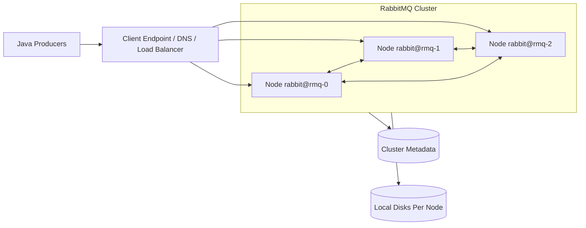

The critical detail is that queues and streams are not abstract clouds floating above the cluster.

They have physical placement.

A quorum queue has replicas. One replica is leader. Others are followers.

A stream has replicas. One replica is leader. Others are followers.

Most writes go through the leader.

Therefore, leader placement and replica placement directly affect throughput, latency, and failure behavior.

---

## 4. Logical Model vs Physical Model

Applications think in logical names.

Examples:

- exchange: `cpq.commands`
- queue: `pricing.quote.calculate.q`
- stream: `order-events.stream`
- super stream: `order-events.super`
- routing key: `quote.calculate.v1`

Operators must think in physical placement.

Examples:

- which node is queue leader?
- how many replicas exist?
- how much disk does each replica consume?
- which node serves reads?
- where does the client connection land?
- what happens if `rmq-1` is drained?
- can the remaining nodes form quorum?

These two views must be connected.

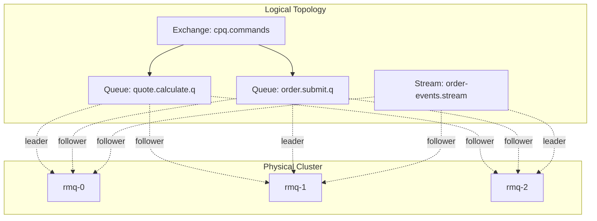

The design failure usually happens when teams stop at the logical view.

They create many queues and assume RabbitMQ will "handle it".

A production engineer asks:

- where are leaders distributed?
- how much write amplification does replication create?
- what is the disk growth rate?
- what is the failover recovery time?
- how does client reconnection behave?
- what alerts prove the invariant still holds?

---

## 5. Queue and Stream Type Decision Matrix

RabbitMQ now gives you multiple data structures. Choosing the wrong one is one of the most expensive mistakes.

| Workload Need | Recommended Data Structure | Why |
|---|---|---|
| Reliable task dispatch | Quorum queue | Replicated, data-safety oriented, consumer ack semantics |
| Short-lived transient task | Classic queue may be acceptable | Lower overhead if loss is acceptable or workload is non-critical |
| Replayable domain event feed | Stream | Append-only, non-destructive reads, retention, offset-based consumption |
| High-throughput partitioned event log | Super stream | Partitioned streams for horizontal scale |
| Pub/sub notification without replay | Topic/fanout exchange + subscriber queues | Subscriber isolation, simple delivery model |
| Long-lived audit trail | Stream, possibly external archive too | Retention/replay semantics are explicit |
| Strict per-entity processing | Quorum queue per shard or super stream partitioned by entity key | Limits concurrency to ordering boundary |
| RPC reply messages | Direct Reply-To or short-lived reply queue | Avoids unnecessary durable queue state |
| Delayed retries | Retry queues with TTL/DLX or delayed exchange plugin | Explicit retry stages |

A practical rule:

- use **quorum queues** for important commands/tasks
- use **streams** for replayable event history
- use **super streams** when a single stream becomes a throughput or partitioning bottleneck
- use **classic queues** deliberately, not by accident

Do not choose queue types because they are familiar.

Choose them because their failure behavior matches the business contract.

---

## 6. Classic Queues: Still Useful, But Not the Default for Critical Data

Classic queues are the historical queue type.

They are often still useful for:

- low criticality messages
- temporary queues
- reply queues
- non-durable workflow edges
- local development
- simple fanout subscribers where loss is acceptable
- workloads where maximum throughput matters more than replication safety

But for critical durable messages, classic queues require careful reasoning.

A durable classic queue on a single node can persist messages to disk, but that does not automatically give multi-node data safety.

For highly available durable queues, modern RabbitMQ guidance favors quorum queues instead of the old classic mirrored queue model.

Operational risks with classic queues:

- single-node placement can become an availability bottleneck
- leader/node failure behavior differs from quorum queues
- accidental use for critical commands can create false confidence
- queue length and memory pressure can grow quickly under consumer outage
- topology may drift because teams create queues without policies

Classic queues are not "bad".

They are simply not the right default when the business contract says "accepted messages must survive node failure".

---

## 7. Quorum Queues: The Default for Critical Work Queues

A quorum queue is a replicated queue based on a consensus model.

It is designed for data safety and predictable failure semantics.

The queue has multiple replicas. One replica is leader. The others are followers.

For writes, the leader coordinates replication. Publisher confirms should only be treated as meaningful when used correctly by the application.

A simplified model:

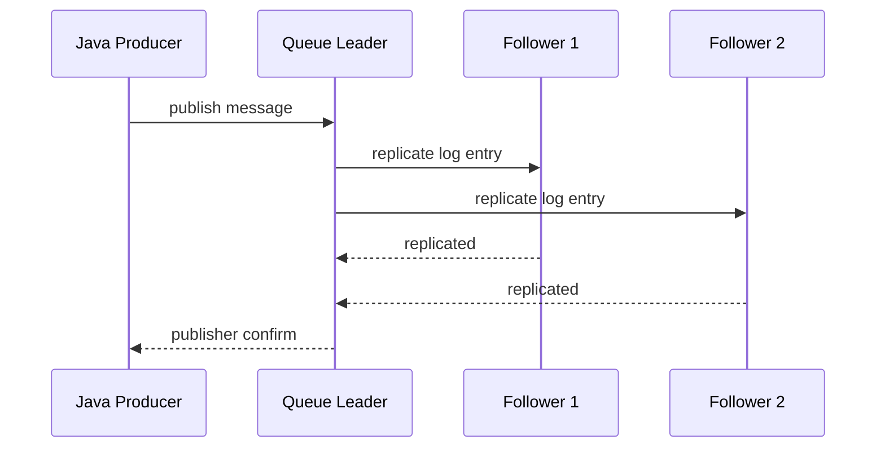

In practice, this means there is write amplification.

One logical message may become multiple replica writes.

That is the price of safety.

### 7.1 When to Use Quorum Queues

Use quorum queues for:

- commands that must not be lost
- task dispatch with manual ack
- payment/order/quote/regulatory workflows
- retry queues where durability matters
- DLQs where diagnostic data must survive failure
- workloads where availability under one-node failure is more important than raw throughput

### 7.2 When Not to Use Quorum Queues

Avoid quorum queues for:

- huge replayable event logs
- analytics fanout where consumers need independent replay
- ultra-short transient reply queues
- workloads that tolerate loss and require extreme throughput
- cases where stream retention/replay is the actual requirement

### 7.3 Quorum Queue Design Invariants

For critical queues:

1. queue must be durable
2. messages must be persistent
3. publisher confirms must be enabled
4. consumer manual acknowledgements must be used
5. handlers must be idempotent
6. DLX/retry behavior must be explicit
7. queue length and delivery limit must be governed
8. leader placement must be monitored
9. cluster must maintain majority availability

If any item is missing, the phrase "reliable queue" becomes ambiguous.

---

## 8. Quorum Queue Delivery Limit and Poison Message Control

Quorum queues support delivery limits.

This matters because infinite redelivery is a production hazard.

Without a delivery limit, a poison message can keep cycling forever:

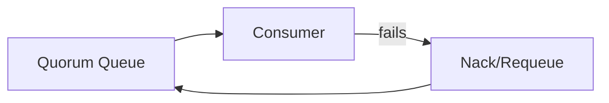

The result:

- CPU waste
- log noise
- alert fatigue
- head-of-line blocking
- delayed valid work
- duplicate side effects if handler is not safe

A safer model:

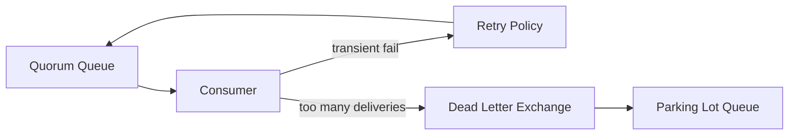

A strong production invariant:

> Every durable command queue must have a bounded retry/dead-letter story.

Do not let poison messages define your runtime behavior.

---

## 9. Streams: Deployment Model for Replayable Logs

RabbitMQ Streams are not just "bigger queues".

They are a different data structure.

A stream models an append-only log.

Consumers track offsets instead of removing messages.

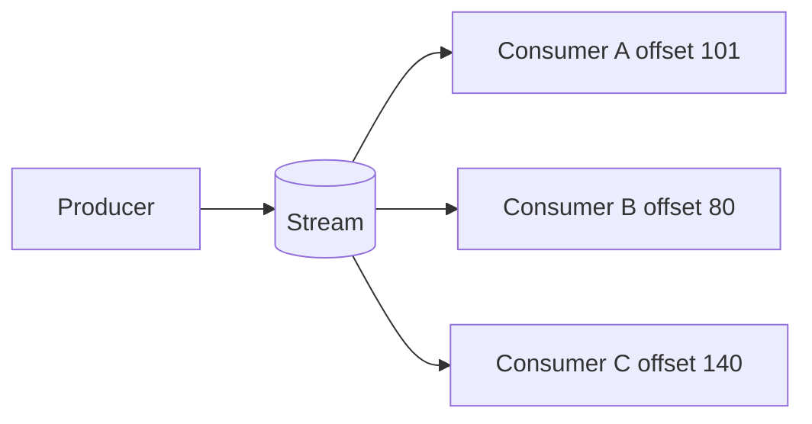

A queue answers:

> "Who should process this message now?"

A stream answers:

> "What happened, and from which offset should this consumer read?"

### 9.1 Use Streams For

- replayable domain event history
- audit logs
- high fanout consumers
- analytics feeds
- event-carried state transfer
- time-windowed processing
- rebuilding projections
- regulatory investigation and forensic replay
- high-throughput immutable ingest

### 9.2 Avoid Streams For

- simple one-off task dispatch
- command handling where each message should be processed by exactly one worker group
- workflows requiring per-message destructive consumption
- unbounded retention without storage planning
- cases where downstream cannot tolerate replay duplicates

### 9.3 Stream Deployment Implications

Streams are always persistent and replicated.

That gives durability but also creates operational responsibilities:

- retention must be explicit
- disk sizing must include replicas
- consumer lag must be monitored
- offset storage must be reliable
- replay rate must be capacity-planned
- partitions/super streams must be chosen before throughput bottlenecks become urgent

A stream deployment without retention planning is just delayed disk exhaustion.

---

## 10. Super Streams: Partitioned Stream Deployment

A super stream is a logical stream composed of partition streams.

Use it when one stream cannot meet throughput, storage, or parallelism requirements.

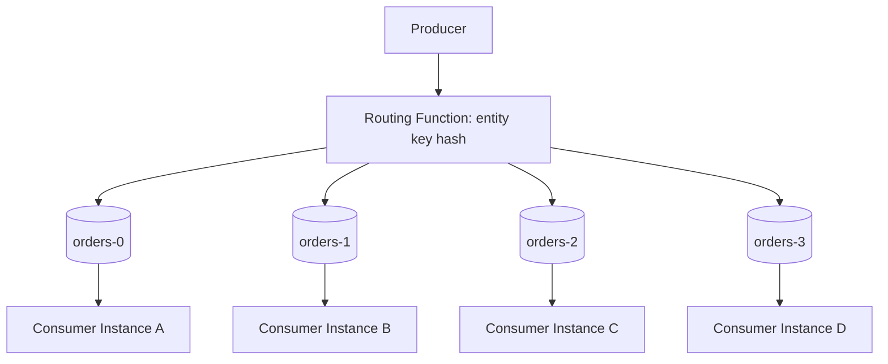

The important design decision is the partition key.

Good partition keys:

- order id
- account id
- tenant id plus entity id
- case id
- customer id
- aggregate root id

Bad partition keys:

- timestamp only
- random UUID when ordering matters
- status field with low cardinality
- tenant id alone for large tenants
- routing key that changes over entity lifetime

A super stream gives scale, but it does not remove the need for ordering design.

Ordering remains local to the partition.

---

## 11. Cluster Size and Failure Tolerance

A three-node RabbitMQ cluster is the common minimum for quorum-style availability.

The reason is majority.

For a quorum of three replicas:

- 3 online: healthy
- 2 online: can make progress
- 1 online: cannot maintain quorum

For five replicas:

- 5 online: healthy
- 4 online: healthy
- 3 online: can make progress
- 2 online: cannot maintain quorum

This means "more replicas" is not free.

It improves fault tolerance but increases:

- storage usage
- replication traffic
- write latency risk
- recovery cost
- operational complexity

For most business workloads, start with three nodes and three replicas for critical quorum queues, then scale based on measured requirements.

Do not blindly set every queue to five replicas.

### 11.1 Majority Table

| Replica Count | Majority Required | Failures Tolerated |
|---:|---:|---:|
| 1 | 1 | 0 |
| 3 | 2 | 1 |
| 5 | 3 | 2 |
| 7 | 4 | 3 |

Replication is a safety mechanism, not a capacity shortcut.

---

## 12. Leader Placement and Hot Nodes

Even with three equal nodes, workload may be uneven.

If too many queue leaders live on one node, that node becomes hot.

Symptoms:

- one node has higher CPU
- one node has higher disk writes
- one node has higher network egress
- one node has higher connection/channel load
- publisher confirm latency increases for queues led by that node
- consumer latency differs across queues

Example bad placement:

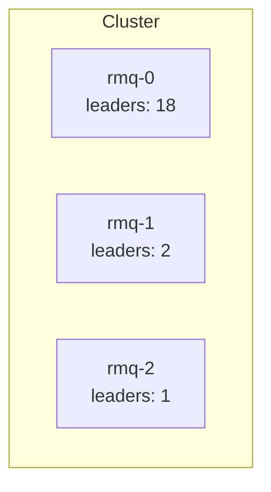

Better placement:

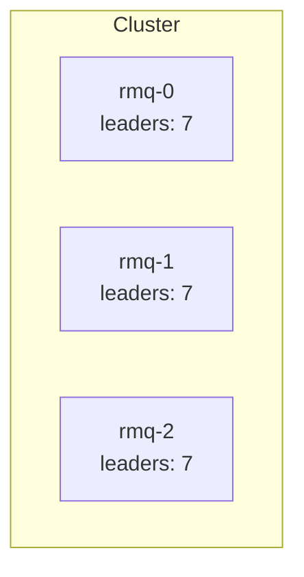

Leader distribution matters because leaders coordinate writes.

A Java producer does not usually know or care which node is leader, but latency will expose the truth.

---

## 13. Client Connection Strategy

Applications usually connect through:

- Kubernetes service
- DNS round-robin
- TCP load balancer
- service mesh TCP route
- direct broker node list

A good connection strategy has four properties:

1. clients can connect when one node is down
2. clients eventually distribute across nodes
3. reconnection does not create a thundering herd
4. topology declaration is idempotent

A weak strategy:

```java
factory.setHost("rmq-0.rabbitmq.local");
```

A stronger strategy uses multiple addresses:

```java
Address[] addresses = new Address[] {
    new Address("rmq-0.rabbitmq.svc", 5672),
    new Address("rmq-1.rabbitmq.svc", 5672),
    new Address("rmq-2.rabbitmq.svc", 5672)
};

Connection connection = factory.newConnection(addresses, "pricing-service");
```

For Spring AMQP, a stronger pattern is to configure addresses rather than a single host.

```yaml
spring:
  rabbitmq:
    addresses: rmq-0.rabbitmq.svc:5672,rmq-1.rabbitmq.svc:5672,rmq-2.rabbitmq.svc:5672
    username: pricing_app
    password: ${RABBITMQ_PASSWORD}
    publisher-confirm-type: correlated
    publisher-returns: true
```

The application should also use bounded reconnection/backoff behavior.

When a node fails, thousands of Java clients reconnecting instantly can create a second incident.

---

## 14. Durability Is a Chain, Not a Flag

Many teams believe this:

> durable queue = safe messages

That is incomplete.

Durability is a chain.

For AMQP queue workloads, safety requires:

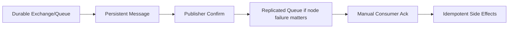

If the chain breaks, the guarantee weakens.

Examples:

| Missing Link | Failure Mode |
|---|---|
| non-durable queue | queue can disappear after restart |
| transient message | message can be lost on broker restart |
| no publisher confirm | producer cannot know if broker accepted responsibility |
| no replication | node loss can remove queue availability/data |
| auto ack | message can be lost after delivery before processing |
| non-idempotent consumer | redelivery creates duplicate side effects |

The deployment model must be paired with application protocol.

A quorum queue without publisher confirms is a half-built reliability story.

---

## 15. Persistence and Disk Model

RabbitMQ reliability eventually hits disk.

For durable queues and streams, disk is not just storage. It is part of the messaging contract.

You must model:

- message ingress rate
- average message size
- replication factor
- retention duration
- backlog tolerance
- DLQ retention
- stream replay window
- compaction/archive strategy if any
- disk IOPS
- disk throughput
- fsync behavior

A rough sizing formula for stream storage:

```text
logical_data_per_day = messages_per_second * avg_message_bytes * 86400
replicated_data_per_day = logical_data_per_day * replica_count
required_disk = replicated_data_per_day * retention_days * safety_factor
```

Example:

```text
messages_per_second = 5,000
avg_message_bytes   = 2,000
retention_days      = 7
replica_count       = 3
safety_factor       = 1.5

logical/day   = 5,000 * 2,000 * 86,400
              = 864 GB/day

replicated/day = 864 GB * 3
               = 2.592 TB/day

required = 2.592 TB * 7 * 1.5
         = 27.216 TB
```

That is why stream retention must be designed, not guessed.

For quorum queues, storage depends heavily on backlog and delivery behavior.

A command queue should normally drain. If it grows for days, the system has an operational problem, not a retention strategy.

---

## 16. Memory Model

RabbitMQ uses memory for many runtime structures:

- connections
- channels
- unacknowledged deliveries
- queue index/runtime state
- message metadata
- buffers
- plugins
- management data

High memory usage often comes from application behavior:

- excessive prefetch
- too many channels
- too many connections
- slow consumers
- giant messages
- unbounded publish rate
- many idle queues
- management API abuse
- large numbers of unacknowledged messages

Consumer prefetch is especially important.

If you have:

```text
100 consumers
prefetch = 500
average message size = 100 KB
```

The theoretical unacked payload exposure is:

```text
100 * 500 * 100 KB = 5 GB
```

That excludes metadata and JVM memory.

A senior deployment review always checks prefetch against memory budget.

---

## 17. Network Model

Replication and fanout multiply network usage.

For quorum queues:

- producer sends to broker
- leader replicates to followers
- consumers receive deliveries
- acknowledgements flow back
- confirms flow to producers

For streams:

- producer sends append entries
- leader replicates to followers
- consumers read chunks
- multiple consumers may read same retained data

For fanout:

- one logical event can become many queue copies

Network model example:

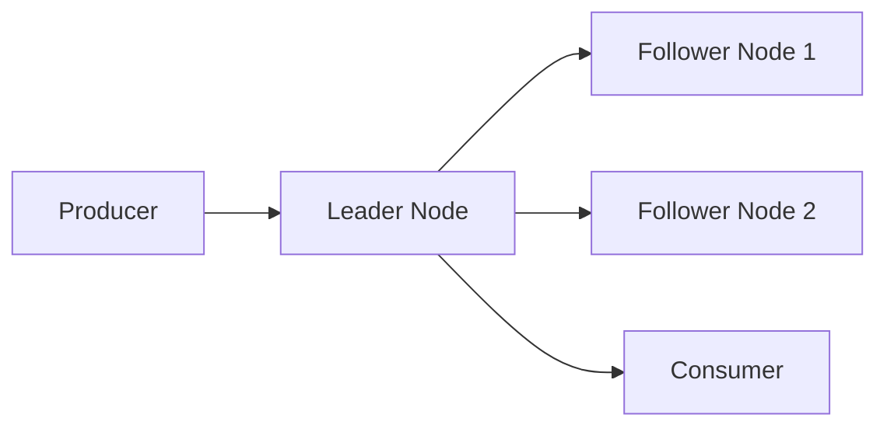

The production question is:

> Is the network sized for physical traffic, not just logical message rate?

For replicated workloads, logical ingress is not equal to network traffic.

---

## 18. CPU Model

RabbitMQ CPU is affected by:

- routing complexity
- TLS
- message serialization/deserialization at client side
- persistence path
- replication
- management plugin polling
- plugin overhead
- connection churn
- queue count
- stream chunk handling
- compression

The broker does not run your Java handler logic, but your application behavior can burn broker CPU.

Bad patterns:

- excessive reconnect loops
- declaring topology repeatedly on hot path
- publishing tiny messages at very high rate without batching
- using headers exchange for high-volume routing when topic/direct would do
- overusing per-message priority
- management API scraping too frequently

CPU tuning starts with topology and client behavior, not VM flags.

---

## 19. Message Size Policy

RabbitMQ can carry large messages, but large messages change the system shape.

Large messages increase:

- memory exposure
- disk writes
- replication cost
- network transfer time
- GC pressure in Java clients
- tail latency
- retry/DLQ storage
- management difficulty

A common production policy:

| Message Size | Policy |
|---:|---|
| < 64 KB | Normal path |
| 64 KB – 1 MB | Review serialization and batching |
| 1 MB – 10 MB | Strong review; consider object storage pointer |
| > 10 MB | Usually do not send through RabbitMQ directly |

For large payloads, prefer:

- store blob in object storage
- send metadata pointer
- include checksum
- include authorization context
- define expiration/cleanup policy

Do not turn RabbitMQ into a binary file transport unless you have proven the operational budget.

---

## 20. Workload Isolation

A production RabbitMQ cluster should not be one undifferentiated bucket.

Isolate by:

- virtual host
- user/permission
- queue type
- criticality
- tenant
- domain
- environment
- latency sensitivity
- replay/audit requirements

Example vhost strategy:

| Vhost | Purpose |
|---|---|
| `/cpq-prod` | CPQ production command/event workloads |
| `/oms-prod` | Order management production workloads |
| `/analytics-prod` | Stream consumers and analytics feeds |
| `/platform-prod` | Shared operational events |
| `/sandbox` | Non-critical test workloads |

Isolation prevents one team from accidentally binding a massive fanout queue to another team's critical exchange.

But do not overdo it.

Too many vhosts can make governance harder.

Use vhosts for administrative isolation, not as a substitute for good topology design.

---

## 21. Policies as Operational Control

RabbitMQ policies let operators control queue behavior by name pattern.

Use policies for:

- dead-letter exchanges
- queue type defaults
- TTL
- max length
- overflow behavior
- stream retention
- delivery limit
- leader locator behavior

Example policy idea:

```bash
rabbitmqctl set_policy critical-quorum '^critical\.' \
  '{"queue-type":"quorum","delivery-limit":20}' \
  --apply-to queues
```

Example stream retention policy idea:

```bash
rabbitmqctl set_policy order-streams '^orders\.' \
  '{"max-age":"7D","max-length-bytes":107374182400}' \
  --apply-to streams
```

Hardcoding queue arguments in application code is often less flexible than policy.

A good division:

| Concern | Prefer Owner |
|---|---|
| exchange/queue names | application/platform contract |
| business routing keys | application/domain team |
| DLX name | platform policy plus application awareness |
| retention | platform + domain SLA |
| delivery limit | platform + application failure model |
| permissions | platform/security |
| message schema | application/domain governance |

---

## 22. Deployment Profiles

### 22.1 Local Development

Goal:

- fast feedback
- simple topology
- low durability expectations

Profile:

- single node
- management plugin enabled
- test vhost
- no assumption of HA
- sample classic/quorum/stream resources

Do not infer production behavior from local single-node tests.

### 22.2 Integration Environment

Goal:

- validate topology and contracts
- test retry/DLQ
- test publisher confirms
- test consumer idempotency

Profile:

- one or three nodes depending on budget
- production-like queue types
- realistic policies
- reduced retention
- contract tests

### 22.3 Staging / Pre-Production

Goal:

- verify deployment, upgrade, failover, and performance

Profile:

- same node count pattern as production
- production queue types
- realistic storage class
- performance test data
- failover drills
- observability enabled

### 22.4 Production

Goal:

- reliable business operation
- explicit SLOs
- recoverable failure modes

Profile:

- multi-node cluster
- quorum queues for critical commands
- streams/super streams for replayable feeds
- TLS
- least privilege users
- policy-based governance
- monitored storage/memory/lag
- documented runbooks
- tested upgrades

---

## 23. Reference Deployment Architecture

A production-grade RabbitMQ architecture for Java microservices can look like this:

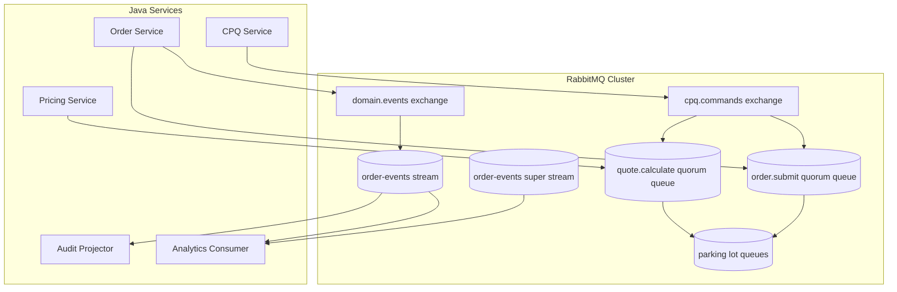

Design interpretation:

- commands go through quorum queues
- event notifications go through exchange bindings
- replayable event history goes to stream
- high-throughput partitioned feeds use super stream
- poison messages are parked
- audit consumers use replayable stream, not transient queues

This is not a universal blueprint.

It is a reference shape.

---

## 24. Java Application Implications

Your Java code must match the deployment model.

### 24.1 For Quorum Queues

Use:

- durable queue declaration or topology managed by platform
- persistent messages
- publisher confirms
- manual ack
- idempotent consumers
- bounded prefetch
- retry/DLQ policy
- connection recovery
- metrics

Producer pattern:

```java
channel.confirmSelect();

AMQP.BasicProperties props = new AMQP.BasicProperties.Builder()
    .messageId(commandId)
    .correlationId(correlationId)
    .deliveryMode(2) // persistent
    .contentType("application/json")
    .type("quote.calculate.command.v1")
    .timestamp(new Date())
    .build();

channel.basicPublish(
    "cpq.commands",
    "quote.calculate.v1",
    true,
    props,
    payload
);

boolean confirmed = channel.waitForConfirms(5_000);
if (!confirmed) {
    throw new PublishNotConfirmedException(commandId);
}
```

Consumer pattern:

```java
channel.basicQos(50);

DeliverCallback callback = (consumerTag, delivery) -> {
    long tag = delivery.getEnvelope().getDeliveryTag();
    try {
        handler.handle(delivery);
        channel.basicAck(tag, false);
    } catch (RetryableBusinessException ex) {
        channel.basicNack(tag, false, false); // route through DLX/retry topology
    } catch (FatalBusinessException ex) {
        channel.basicReject(tag, false); // dead-letter or discard by policy
    }
};

channel.basicConsume("quote.calculate.q", false, callback, tag -> {});
```

### 24.2 For Streams

Use:

- stable producer names if dedup is enabled
- explicit offset strategy
- named consumers if using server-side offset tracking
- retention-aware replay
- idempotent projectors
- batch/checkpoint discipline
- lag metrics

Stream consumer checkpoint pattern:

```java
Consumer consumer = environment.consumerBuilder()
    .stream("order-events.stream")
    .name("audit-projector")
    .offset(OffsetSpecification.next())
    .messageHandler((context, message) -> {
        auditProjector.apply(message);
        if (shouldCheckpoint()) {
            context.storeOffset();
        }
    })
    .build();
```

Do not mix queue and stream semantics accidentally.

A queue ack means "this delivery is done".

A stream offset means "this consumer's progress has advanced".

---

## 25. Failure Matrix

| Failure | Quorum Queue Behavior | Stream Behavior | Application Responsibility |
|---|---|---|---|
| producer loses connection before confirm | publish outcome ambiguous | publish outcome ambiguous | retry with idempotency/dedup key |
| broker node leader crashes | leader election if quorum remains | leader election if replicas remain | reconnect, tolerate latency spike |
| consumer crashes before ack | message redelivered | offset not advanced if not stored | idempotent handler |
| consumer crashes after DB commit before ack | message redelivered | offset may replay | dedup/inbox table |
| disk alarm | publishing may be blocked | append may slow/block | backpressure and alert |
| memory alarm | publisher flow control | appends/reads affected | reduce ingress, fix consumers |
| follower down | reduced redundancy | reduced redundancy | alert; restore replica before maintenance |
| majority lost | queue unavailable | stream unavailable | fail closed; do not pretend success |
| retention expires before replay | not applicable to normal queue | replay gap | alert on lag vs retention |

The key pattern:

> Broker replication protects data availability. It does not remove the need for application idempotency.

---

## 26. Monitoring Model

At minimum, monitor these dimensions.

### 26.1 Cluster Health

- node up/down
- cluster partition status
- memory alarm
- disk alarm
- file descriptors
- socket descriptors
- Erlang process count
- node uptime/restart count

### 26.2 Queue Health

- ready messages
- unacknowledged messages
- publish rate
- deliver rate
- ack rate
- redelivery rate
- consumer count
- consumer utilisation
- queue leader
- replica health
- delivery limit/dead-letter activity

### 26.3 Stream Health

- ingress rate
- egress rate
- disk usage
- retention pressure
- consumer offset
- consumer lag
- partition lag
- replica status
- leader distribution

### 26.4 Java Client Health

- connection count
- channel count
- reconnect count
- confirm latency
- returned messages
- publish failures
- consumer processing latency
- ack latency
- handler failure rate
- idempotency duplicate count
- retry/DLQ count

### 26.5 Business Health

- quote command age
- order submission age
- failed workflow count
- duplicate command count
- stuck saga count
- audit projection lag
- replay completion time

Do not alert only on broker metrics.

Messaging incidents are often application incidents expressed through the broker.

---

## 27. Alert Design

A bad alert:

> Queue has more than 10,000 messages.

A better alert:

> `quote.calculate.q` oldest message age exceeds 2 minutes for 5 minutes and consumer count is below expected baseline.

Reason:

Queue depth alone has no universal meaning.

A queue with 10,000 tiny messages and 5,000 msg/sec drain rate may be healthy.

A queue with 50 messages and oldest message age of 2 hours may be broken.

Use alerts based on:

- oldest message age
- consumer lag vs SLA
- publish/consume rate divergence
- redelivery rate
- DLQ ingress rate
- confirm latency
- disk free time remaining
- stream lag relative to retention
- missing consumers
- blocked connections

---

## 28. Runbook: Queue Growth

Symptoms:

- ready message count increasing
- oldest message age increasing
- consume rate below publish rate
- business SLA violations

First questions:

1. Are consumers connected?
2. Are consumers acking?
3. Did downstream dependency slow down?
4. Did publish rate spike?
5. Did message size increase?
6. Did redelivery spike?
7. Is prefetch too low or too high?
8. Is one poison message blocking ordering-sensitive processing?
9. Are broker alarms active?
10. Did leader placement change?

Actions:

- inspect consumer errors
- check downstream service latency
- verify DLQ/retry activity
- scale consumers only if downstream can handle it
- reduce producer ingress if necessary
- park poison messages if safe
- avoid purging unless business explicitly accepts loss

Never start with "purge the queue".

That is data deletion, not operations.

---

## 29. Runbook: Disk Alarm

Symptoms:

- broker blocks publishers
- publish latency spikes
- confirms delayed
- stream append slows
- management shows disk alarm

Questions:

1. Which node is low on disk?
2. Which queues/streams own disk?
3. Is stream retention too high?
4. Is consumer lag preventing retention from being acceptable?
5. Did DLQ/parking lot grow?
6. Did message size change?
7. Is compaction/archive missing?

Actions:

- stop unnecessary publishers if safe
- restore consumers if lagging
- reduce retention only with business approval
- move/archive diagnostic data if policy allows
- add storage if this is expected growth
- investigate producer rate/message size change
- do not delete stream segments blindly

Disk alarms are business incidents when messages are business records.

---

## 30. Runbook: Node Failure

For a three-node cluster:

1. confirm which node failed
2. identify affected leaders
3. check quorum queue availability
4. check stream leader elections
5. monitor publish confirm latency
6. monitor client reconnect storms
7. avoid taking another node down
8. restore failed node
9. wait for replicas to catch up
10. verify no queues/streams have reduced redundancy

The dangerous state is not always the failure itself.

It is maintenance while redundancy is already degraded.

Rule:

> Never perform planned maintenance that reduces quorum below the safety threshold.

---

## 31. Upgrade and Maintenance Principles

Production RabbitMQ upgrades need preparation.

Before upgrade:

- read version-specific release notes
- test in staging
- verify plugin compatibility
- verify client compatibility
- verify queue type behavior
- check deprecated features
- check feature flags if applicable
- ensure all queues/streams healthy
- ensure no disk/memory alarms
- snapshot configuration definitions
- document rollback/forward plan

During upgrade:

- one node at a time
- wait for node health
- verify quorum and stream replicas
- monitor confirms and lag
- watch reconnect spikes
- pause non-critical heavy replay if needed

After upgrade:

- verify cluster health
- verify topology
- verify policies
- verify consumer counts
- verify DLQ/retry flows
- run smoke publish/consume tests
- check dashboards for regressions

The operational invariant:

> Upgrade should be a controlled failure drill, not a surprise chaos event.

---

## 32. Capacity Planning Worksheet

Use this worksheet before production approval.

```text
Workload name:
Business criticality:
Queue/stream type:
Message type:
Average message size:
P95 message size:
Peak publish rate:
Peak consume rate:
Required retention:
Allowed backlog duration:
Allowed data loss:
Allowed duplicate behavior:
Ordering requirement:
Replay requirement:
Consumer groups:
Expected redelivery rate:
DLQ retention:
Replica count:
Node count:
Storage per node:
Network budget:
Confirm latency SLO:
Oldest message age SLO:
Consumer lag SLO:
Maintenance tolerance:
Disaster recovery strategy:
```

If you cannot fill this out, you are not ready to choose a deployment model.

---

## 33. ADR Template: Queue Type Decision

Use this for every important queue/stream.

```md
# ADR: Message Data Structure for <workload>

## Context

<What business workflow is this supporting?>

## Decision

We will use <quorum queue | stream | super stream | classic queue>.

## Rationale

- delivery guarantee required:
- replay requirement:
- ordering requirement:
- throughput requirement:
- retention requirement:
- failure tolerance:

## Consequences

- producer requirements:
- consumer requirements:
- monitoring requirements:
- operational runbooks:
- known trade-offs:

## Rejected Options

- <option 1> because ...
- <option 2> because ...
```

This prevents accidental infrastructure decisions.

---

## 34. Production Readiness Checklist

A RabbitMQ deployment is not production-ready because the pod is running.

It is production-ready when these are true:

### Cluster

- [ ] node count matches failure tolerance
- [ ] memory alarms configured and monitored
- [ ] disk alarms configured and monitored
- [ ] TLS strategy defined
- [ ] management access restricted
- [ ] definitions backed up
- [ ] policies documented
- [ ] upgrade path tested

### Queues

- [ ] critical queues are quorum queues
- [ ] transient queues are intentionally transient
- [ ] DLX/retry/parking lot configured
- [ ] delivery limit understood
- [ ] queue length/age alerts configured
- [ ] leader distribution monitored

### Streams

- [ ] retention defined by business requirement
- [ ] disk sizing includes replica factor
- [ ] consumer lag monitored
- [ ] replay procedures tested
- [ ] offset tracking strategy documented
- [ ] partition key reviewed for super streams

### Java Applications

- [ ] publisher confirms enabled for critical messages
- [ ] returned messages handled
- [ ] manual ack used for critical consumers
- [ ] idempotency implemented
- [ ] prefetch aligned with worker capacity
- [ ] connection recovery tested
- [ ] metrics emitted
- [ ] graceful shutdown tested

### Operations

- [ ] queue growth runbook
- [ ] DLQ spike runbook
- [ ] disk alarm runbook
- [ ] node failure runbook
- [ ] replay runbook
- [ ] upgrade runbook
- [ ] ownership map available

---

## 35. Practice Drill

Build a local or staging three-node RabbitMQ cluster and create these workloads:

1. `critical.command.q` as quorum queue
2. `notification.event.q` as classic or quorum queue depending on criticality
3. `orders.stream` as stream with retention
4. `orders.super` as super stream with four partitions
5. `critical.command.parking.q` as parking lot queue

Then perform:

- publish with confirms
- consume with manual ack
- kill a consumer before ack
- kill a broker node
- observe redelivery
- observe leader election/recovery
- fill queue faster than consumers drain
- trigger DLQ route
- replay stream from earlier offset
- measure consumer lag

Write down what happened.

The important outcome is not that the system survives everything.

The important outcome is that you can predict what it will do.

---

## 36. Key Takeaways

- Deployment model is part of messaging semantics.
- Quorum queues are the right default for critical durable task/command workloads.
- Streams are for replayable append-only history, not simple task dispatch.
- Super streams scale streams through partitioning, but force partition-key discipline.
- Durability is a chain: durable topology, persistent messages, publisher confirms, replication, manual ack, idempotency.
- Replication improves safety but increases write amplification and operational cost.
- Disk, memory, network, and leader placement must be capacity-planned.
- Java producers and consumers must be configured to match broker guarantees.
- A production RabbitMQ deployment is defined by invariants, metrics, and runbooks, not by successful installation.

In the next part, we will deploy this model on Kubernetes using the RabbitMQ Cluster Operator, Messaging Topology Operator, storage policies, security controls, and upgrade-safe operational patterns.
