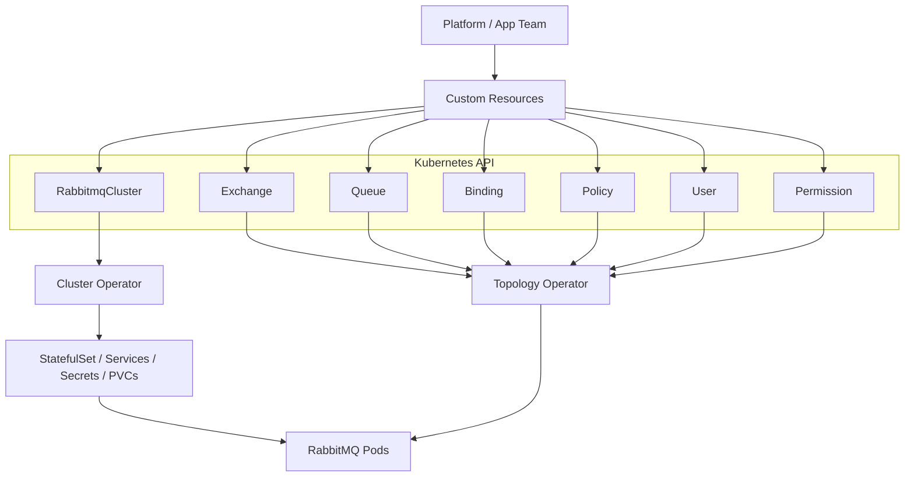
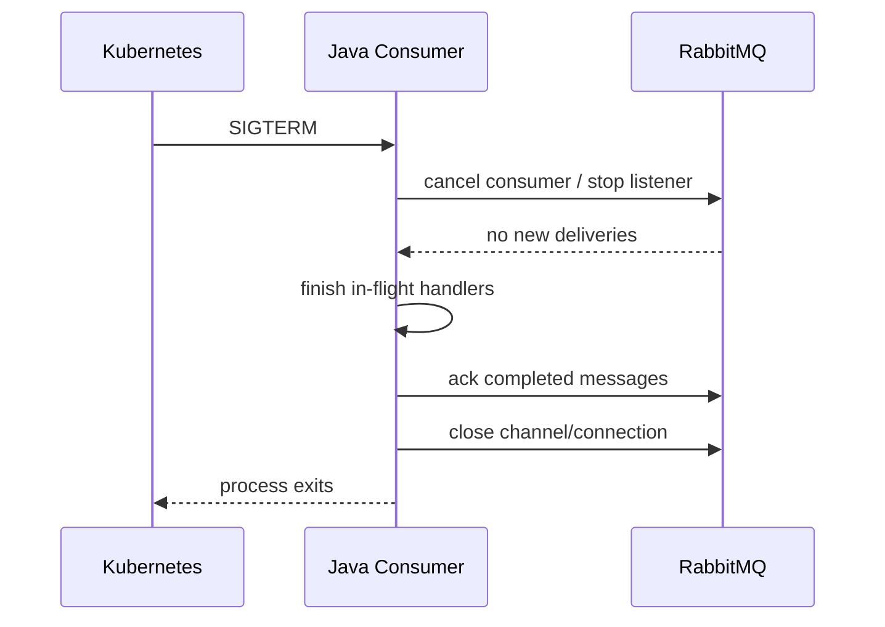

# Part 032 — Kubernetes Deployment: RabbitMQ Cluster Operator, Topology, Storage, and Upgrades

This part translates the deployment model from Part 031 into Kubernetes operations.

The goal is not to teach Kubernetes basics.

The goal is to answer:

> How do we run RabbitMQ on Kubernetes without turning a stateful messaging system into a fragile pile of YAML?

RabbitMQ on Kubernetes is not just a Deployment with three replicas.

It is a stateful broker with:

- persistent identity
- persistent storage
- cluster membership
- quorum/stream replicas
- broker configuration
- plugin lifecycle
- TLS/secrets
- topology governance
- client connection behavior
- upgrade sequencing
- operational runbooks

The RabbitMQ Cluster Kubernetes Operator exists because this is operationally non-trivial.

---

## 1. Kaufman Framing: Reduce the Kubernetes Skill to Practice Units

Using Kaufman's approach, we deconstruct RabbitMQ-on-Kubernetes into practice units.

| Practice Unit | What You Must Master |
|---|---|
| Cluster CRD | Define a `RabbitmqCluster` with replicas, resources, persistence, configuration, plugins, and service exposure |
| Stateful placement | Ensure pods land on different nodes/zones and keep stable identity/storage |
| Storage design | Choose storage class, size, performance, backup, retention, and expansion strategy |
| Topology as code | Manage exchanges, queues, bindings, policies, users, permissions declaratively |
| Security | Use TLS, secrets, vhosts, least privilege, network policy, and management access controls |
| Upgrade safety | Perform node-by-node upgrades while preserving quorum and stream health |
| Observability | Monitor broker, queue, stream, operator, and Java client metrics |
| Runbooks | Recover from pod loss, PVC pressure, failed upgrade, topology drift, and client storms |

The practical target:

> You should be able to review a RabbitMQ Kubernetes manifest and identify whether it is safe for production, risky but acceptable, or structurally wrong.

---

## 2. Operator Mental Model

An operator is a control loop.

You declare desired state. The operator reconciles actual state toward that desired state.

For RabbitMQ, there are two important operator layers:

1. **RabbitMQ Cluster Operator** — manages RabbitMQ broker clusters.
2. **RabbitMQ Messaging Topology Operator** — manages messaging topology inside a RabbitMQ cluster.

Simplified model:



The key distinction:

- Cluster Operator manages the broker runtime.
- Topology Operator manages exchanges, queues, bindings, policies, users, and permissions.

Do not mix these concerns casually.

---

## 3. Why RabbitMQ Should Be StatefulSet-Like

RabbitMQ nodes need stable identity.

A cluster member is not an anonymous stateless pod.

It has:

- node name
- persistent data directory
- cluster membership identity
- queue/stream replicas
- local disk state

Kubernetes Deployment semantics are wrong for this.

RabbitMQ needs StatefulSet-style behavior:

- stable pod names
- stable persistent volumes
- predictable network identity
- ordered lifecycle when necessary

The Cluster Operator abstracts much of this, but the underlying truth remains.

Do not treat RabbitMQ pods like disposable HTTP servers.

---

## 4. Minimal RabbitmqCluster Resource

A simple cluster resource may look like this:

```yaml
apiVersion: rabbitmq.com/v1beta1
kind: RabbitmqCluster
metadata:
  name: rmq-prod
  namespace: messaging
spec:
  replicas: 3
  persistence:
    storageClassName: fast-ssd
    storage: 500Gi
  resources:
    requests:
      cpu: "2"
      memory: 8Gi
    limits:
      cpu: "4"
      memory: 8Gi
  rabbitmq:
    additionalConfig: |
      vm_memory_high_watermark.relative = 0.6
      disk_free_limit.relative = 2.0
      collect_statistics_interval = 10000
```

This is not a full production manifest.

It shows the main axes:

- replica count
- persistent storage
- CPU/memory requests and limits
- RabbitMQ configuration

The most important lesson:

> A RabbitMQ Kubernetes manifest is a reliability document, not just a scheduling document.

---

## 5. Namespace and Ownership Model

Use a clear namespace strategy.

Example:

```text
messaging-system      operators and shared controllers
messaging-prod        production RabbitMQ clusters
messaging-staging     staging RabbitMQ clusters
app-cpq-prod          CPQ applications
app-oms-prod          OMS applications
```

A platform team may own:

- Cluster Operator installation
- RabbitMQ cluster resources
- storage class policy
- network policy
- TLS issuer/certificates
- monitoring stack
- backup strategy
- platform-level policies

Application teams may own:

- exchanges
- queues
- bindings
- routing keys
- schemas
- service-specific users
- retry/DLQ declarations
- consumer deployments
- SLOs

But this ownership must be explicit.

The most dangerous setup is when every application can create arbitrary broker resources with admin permissions.

---

## 6. Production Resource Sizing

RabbitMQ pods need stable and honest resource allocation.

### 6.1 Memory

Avoid memory overcommit for critical RabbitMQ clusters.

If RabbitMQ thinks it has more memory than Kubernetes will actually allow, Kubernetes may kill the pod before RabbitMQ can apply backpressure correctly.

A common pattern:

```yaml
resources:
  requests:
    cpu: "2"
    memory: 8Gi
  limits:
    cpu: "4"
    memory: 8Gi
```

Memory request equals memory limit.

This gives the pod a Guaranteed QoS class when CPU request also equals limit, or at least reduces eviction risk when memory is fixed.

For many stateful systems, predictable memory is better than optimistic sharing.

### 6.2 CPU

CPU limits are more nuanced.

Too low a CPU limit can throttle RabbitMQ and increase tail latency.

Start with:

- realistic CPU requests
- limits only if your platform requires them
- benchmark under publish/consume/replication load
- watch throttling metrics

### 6.3 Disk

Storage must be sized for:

- queue backlog
- stream retention
- replicas
- DLQ/parking lot
- upgrade/recovery overhead
- safety margin

For streams, disk sizing should be formula-driven.

For quorum queues, disk sizing should consider worst-case consumer outage and backlog duration.

---

## 7. Storage Class Requirements

RabbitMQ storage should not be an afterthought.

Evaluate the storage class for:

- IOPS
- throughput
- fsync latency
- volume expansion
- snapshot capability
- zone binding mode
- recovery time
- behavior during node failure
- performance variance

Example storage class considerations:

| Requirement | Why It Matters |
|---|---|
| SSD-backed storage | Reduces persistent message and stream append latency |
| `WaitForFirstConsumer` | Helps volume bind in the same zone as scheduled pod |
| Expansion enabled | Allows controlled growth before disk alarm incident |
| Snapshot support | Helps backup/restore strategy |
| Low latency | Publisher confirms and stream append depend on storage path |

Example storage class sketch:

```yaml
apiVersion: storage.k8s.io/v1
kind: StorageClass
metadata:
  name: fast-ssd
provisioner: kubernetes.io/no-provisioner # provider-specific in real clusters
volumeBindingMode: WaitForFirstConsumer
allowVolumeExpansion: true
```

The provisioner will be cloud/provider specific.

The important concept is not the exact provisioner string.

It is the storage behavior.

---

## 8. Pod Placement and Failure Domains

A three-node RabbitMQ cluster deployed onto one Kubernetes worker node is not highly available.

You need anti-affinity and topology spread.

Goal:

- RabbitMQ pods spread across worker nodes
- preferably across zones if latency/storage supports it
- no single node failure should kill majority

Conceptual manifest fragment:

```yaml
override:
  statefulSet:
    spec:
      template:
        spec:
          affinity:
            podAntiAffinity:
              requiredDuringSchedulingIgnoredDuringExecution:
                - labelSelector:
                    matchLabels:
                      app.kubernetes.io/name: rmq-prod
                  topologyKey: kubernetes.io/hostname
```

Depending on operator version and supported override schema, exact fields may vary.

The invariant does not vary:

> replicas must not all land on the same failure domain.

Use topology spread constraints where available:

```yaml
topologySpreadConstraints:
  - maxSkew: 1
    topologyKey: kubernetes.io/hostname
    whenUnsatisfiable: DoNotSchedule
    labelSelector:
      matchLabels:
        app.kubernetes.io/name: rmq-prod
```

For multi-zone clusters, be careful.

Cross-zone latency affects quorum queues and streams because replication is on the write path.

High availability across zones is good only if latency and storage behavior still satisfy publish confirm SLOs.

---

## 9. Pod Disruption Budget

A PodDisruptionBudget prevents voluntary disruptions from taking down too many RabbitMQ pods at once.

For a three-node cluster:

```yaml
apiVersion: policy/v1
kind: PodDisruptionBudget
metadata:
  name: rmq-prod-pdb
  namespace: messaging
spec:
  minAvailable: 2
  selector:
    matchLabels:
      app.kubernetes.io/name: rmq-prod
```

This protects against:

- node drain
- cluster autoscaler actions
- maintenance operations

It does not protect against involuntary failures like node crash.

Still, it is essential.

The invariant:

> Planned maintenance should not voluntarily remove quorum.

---

## 10. Services and Client Connectivity

The Cluster Operator usually creates services for client access and management.

Clients need stable endpoints.

Common patterns:

| Endpoint | Purpose |
|---|---|
| AMQP service | Java AMQP clients |
| Stream service | Java Stream clients |
| Management service | admin UI/API; restrict access |
| Headless service | pod identity/internal discovery |

For Java applications inside the cluster, prefer the internal service DNS name.

Example Spring Boot config:

```yaml
spring:
  rabbitmq:
    addresses: rmq-prod.messaging.svc.cluster.local:5672
    username: pricing_app
    password: ${RABBITMQ_PASSWORD}
    virtual-host: /cpq-prod
    publisher-confirm-type: correlated
    publisher-returns: true
```

For stream clients, configure the stream endpoint/port according to cluster service exposure.

Avoid exposing the management UI publicly.

Management access should usually be:

- internal only
- VPN/private network only
- protected by auth
- audited
- restricted by RBAC/network policy

---

## 11. TLS and Certificates

Production RabbitMQ should use TLS for client connections where required by platform/security policy.

TLS design includes:

- server certificate
- CA trust distribution
- optional mutual TLS
- certificate rotation
- Java truststore configuration
- operator secret references
- management endpoint TLS

Conceptual cluster TLS reference:

```yaml
apiVersion: rabbitmq.com/v1beta1
kind: RabbitmqCluster
metadata:
  name: rmq-prod
  namespace: messaging
spec:
  tls:
    secretName: rmq-prod-server-tls
    caSecretName: rmq-prod-ca
```

Exact field support depends on operator version, so verify against your installed CRD.

Java client TLS concept:

```java
ConnectionFactory factory = new ConnectionFactory();
factory.setHost("rmq-prod.messaging.svc.cluster.local");
factory.setPort(5671);
factory.useSslProtocol();
```

For serious production use, explicitly manage trust material instead of relying on default JVM trust behavior.

---

## 12. Secrets and Credentials

Do not put RabbitMQ passwords in application YAML.

Use Kubernetes Secrets or an external secrets operator.

Example:

```yaml
apiVersion: v1
kind: Secret
metadata:
  name: pricing-rabbitmq-credentials
  namespace: app-cpq-prod
type: Opaque
stringData:
  username: pricing_app
  password: change-me-via-secret-manager
```

Application deployment:

```yaml
env:
  - name: RABBITMQ_USERNAME
    valueFrom:
      secretKeyRef:
        name: pricing-rabbitmq-credentials
        key: username
  - name: RABBITMQ_PASSWORD
    valueFrom:
      secretKeyRef:
        name: pricing-rabbitmq-credentials
        key: password
```

Credential policy:

- one user per service or bounded service group
- least privilege per vhost
- no shared admin user in applications
- rotate credentials
- remove unused users
- monitor failed authentication

---

## 13. RabbitMQ Configuration

RabbitMQ cluster config can be supplied through the `RabbitmqCluster` spec.

Example conceptual config:

```yaml
spec:
  rabbitmq:
    additionalConfig: |
      vm_memory_high_watermark.relative = 0.6
      disk_free_limit.relative = 2.0
      collect_statistics_interval = 10000
      consumer_timeout = 1800000
```

Be careful with config copied from blogs.

Every config value should answer:

- what failure mode does this control?
- what metric proves it is working?
- what side effect does it create?
- who owns changing it?

Examples:

| Config Area | Risk If Wrong |
|---|---|
| memory watermark | broker killed before backpressure or too conservative capacity |
| disk free limit | disk exhaustion or premature blocking |
| statistics interval | noisy metrics or insufficient visibility |
| consumer timeout | long-running consumers killed unexpectedly or stale deliveries never detected |
| frame max / heartbeat | connectivity issues, large payload pressure, slow failure detection |

Configuration is operational code.

Review it like application code.

---

## 14. Plugin Strategy

Common RabbitMQ plugins:

- management plugin
- Prometheus plugin
- stream plugin
- shovel/federation if needed
- delayed message exchange plugin if chosen

Production principle:

> Enable the plugins you need. Understand their operational footprint. Avoid plugin sprawl.

Example plugin config concept:

```yaml
spec:
  rabbitmq:
    additionalPlugins:
      - rabbitmq_management
      - rabbitmq_prometheus
      - rabbitmq_stream
```

The exact operator field may vary by version.

For delayed retries, decide deliberately:

- TTL + DLX retry ring uses built-in queue semantics
- delayed message exchange plugin can be simpler at application level
- plugin use adds lifecycle/compatibility responsibility

Do not introduce plugins just because they make a demo easier.

---

## 15. Topology as Code

For production, exchanges, queues, bindings, policies, users, and permissions should not be hand-created in the UI.

Manual topology changes create:

- drift
- hidden dependencies
- impossible rollback
- audit gaps
- environment mismatch

Use declarative topology management.

Options:

- Messaging Topology Operator
- RabbitMQ definitions import
- Terraform/provider-based management
- controlled application declaration on startup

For Kubernetes-native environments, the Messaging Topology Operator is usually the cleanest model.

---

## 16. Topology Operator: Exchange

Example exchange resource:

```yaml
apiVersion: rabbitmq.com/v1beta1
kind: Exchange
metadata:
  name: cpq-commands-exchange
  namespace: messaging
spec:
  name: cpq.commands
  type: topic
  durable: true
  rabbitmqClusterReference:
    name: rmq-prod
```

This declares a durable topic exchange.

Review questions:

- is the exchange name domain-owned?
- is the exchange type correct?
- is it durable?
- is it shared across teams?
- what bindings are allowed?
- who can publish?
- who can bind?

---

## 17. Topology Operator: Queue

Example quorum queue:

```yaml
apiVersion: rabbitmq.com/v1beta1
kind: Queue
metadata:
  name: quote-calculate-queue
  namespace: messaging
spec:
  name: quote.calculate.q
  durable: true
  type: quorum
  rabbitmqClusterReference:
    name: rmq-prod
```

Depending on operator version, queue type may also be expressed through arguments or policy.

Review questions:

- should this queue be quorum, stream, or classic?
- who owns the consumer?
- what is the retry/DLQ path?
- what is the oldest-message-age SLO?
- what is the maximum allowed backlog?
- is ordering required?
- is the queue name stable?

---

## 18. Topology Operator: Binding

Example binding:

```yaml
apiVersion: rabbitmq.com/v1beta1
kind: Binding
metadata:
  name: quote-calculate-binding
  namespace: messaging
spec:
  source: cpq.commands
  destination: quote.calculate.q
  destinationType: queue
  routingKey: quote.calculate.v1
  rabbitmqClusterReference:
    name: rmq-prod
```

Binding is routing policy.

Review questions:

- is routing key versioned?
- could this binding accidentally capture too much traffic?
- is wildcard use safe?
- is there an alternate exchange for unroutable messages?
- are tenant/region/SLA dimensions deliberate?

Bad binding:

```text
source: domain.events
destination: everything.q
routingKey: #
```

That may be acceptable for an audit stream/queue, but dangerous for ordinary consumers.

---

## 19. Topology Operator: Policy

Policies are often better than hardcoded application queue arguments.

Example DLX policy concept:

```yaml
apiVersion: rabbitmq.com/v1beta1
kind: Policy
metadata:
  name: critical-dlx-policy
  namespace: messaging
spec:
  name: critical-dlx-policy
  pattern: "^critical\\."
  applyTo: queues
  definition:
    dead-letter-exchange: critical.dlx
    delivery-limit: 20
  priority: 10
  rabbitmqClusterReference:
    name: rmq-prod
```

Review questions:

- does the policy pattern match only intended queues?
- what happens if queue is renamed?
- does priority conflict with other policies?
- who approves policy changes?
- are changes tested in staging?

Policy mistakes are high-blast-radius mistakes.

---

## 20. Topology Operator: Users and Permissions

Example user:

```yaml
apiVersion: rabbitmq.com/v1beta1
kind: User
metadata:
  name: pricing-user
  namespace: messaging
spec:
  tags: []
  rabbitmqClusterReference:
    name: rmq-prod
```

Example permission:

```yaml
apiVersion: rabbitmq.com/v1beta1
kind: Permission
metadata:
  name: pricing-permission
  namespace: messaging
spec:
  vhost: /cpq-prod
  user: pricing_app
  permissions:
    configure: "^pricing\\.|^quote\\.calculate\\.q$"
    write: "^cpq\\.commands$|^domain\\.events$"
    read: "^quote\\.calculate\\.q$"
  rabbitmqClusterReference:
    name: rmq-prod
```

The exact relationship between user resource and generated secret depends on the operator setup.

The security invariant:

> Applications should not have broker administrator permissions.

A compromised service should not be able to delete exchanges, bind to all events, or purge queues outside its ownership.

---

## 21. Vhost Strategy on Kubernetes

Vhosts remain useful in Kubernetes.

They provide RabbitMQ-level isolation that Kubernetes namespaces do not provide.

Example:

| Vhost | Kubernetes Namespace | Purpose |
|---|---|---|
| `/cpq-prod` | `app-cpq-prod` | CPQ command/event workload |
| `/oms-prod` | `app-oms-prod` | Order management workload |
| `/audit-prod` | `app-audit-prod` | Audit/replay consumers |
| `/platform-prod` | `platform-prod` | platform events |

A vhost is not a security boundary by itself unless permissions are configured correctly.

Use it with least privilege users.

---

## 22. NetworkPolicy

If your Kubernetes cluster enforces NetworkPolicy, restrict broker access.

Conceptual example:

```yaml
apiVersion: networking.k8s.io/v1
kind: NetworkPolicy
metadata:
  name: allow-rabbitmq-from-apps
  namespace: messaging
spec:
  podSelector:
    matchLabels:
      app.kubernetes.io/name: rmq-prod
  policyTypes:
    - Ingress
  ingress:
    - from:
        - namespaceSelector:
            matchLabels:
              messaging-access: "true"
      ports:
        - protocol: TCP
          port: 5672
        - protocol: TCP
          port: 5671
```

Management UI should have stricter access.

Do not let every pod in the cluster connect to RabbitMQ.

---

## 23. Java Application Deployment Alignment

A RabbitMQ cluster can be correct while Java applications are wrong.

Application deployment should include:

- readiness probe that verifies downstream dependencies only when necessary
- graceful shutdown period long enough to finish/ack in-flight messages
- bounded consumer concurrency
- prefetch aligned to worker pool
- connection retry with jitter
- metrics endpoint
- secret-based credentials
- TLS trust material if needed

Example Spring Boot deployment fragment:

```yaml
apiVersion: apps/v1
kind: Deployment
metadata:
  name: pricing-service
  namespace: app-cpq-prod
spec:
  replicas: 4
  template:
    spec:
      terminationGracePeriodSeconds: 60
      containers:
        - name: pricing-service
          image: registry.example.com/pricing-service:1.0.0
          env:
            - name: SPRING_RABBITMQ_ADDRESSES
              value: rmq-prod.messaging.svc.cluster.local:5672
            - name: SPRING_RABBITMQ_USERNAME
              valueFrom:
                secretKeyRef:
                  name: pricing-rabbitmq-credentials
                  key: username
            - name: SPRING_RABBITMQ_PASSWORD
              valueFrom:
                secretKeyRef:
                  name: pricing-rabbitmq-credentials
                  key: password
            - name: SPRING_RABBITMQ_VIRTUAL_HOST
              value: /cpq-prod
```

Consumer shutdown matters.

If Kubernetes kills a pod while it is processing messages, unacked messages will be redelivered.

That is fine only if handlers are idempotent and shutdown is graceful.

---

## 24. Readiness, Liveness, and Startup Probes

For RabbitMQ pods, rely on operator-provided health behavior where possible.

For Java consumers, probes need careful design.

Bad readiness probe:

> Return ready if HTTP server starts.

Better readiness probe:

> Return ready only after the service can accept work and has initialized RabbitMQ connection/listener state, unless the design intentionally allows delayed consumer start.

Bad liveness probe:

> Kill the process whenever RabbitMQ is temporarily unavailable.

That can create restart storms.

A better model:

- readiness reflects ability to receive new traffic/work
- liveness reflects whether process is irrecoverably stuck
- RabbitMQ connectivity failures usually affect readiness, not liveness
- consumer containers should handle broker reconnect without immediate restart

For message consumers, HTTP readiness is only a proxy.

Expose internal health:

- connection open
- listener active
- channel open
- recent successful ack
- failure rate below threshold
- executor not saturated

---

## 25. Graceful Shutdown for Consumers

Kubernetes sends SIGTERM, waits `terminationGracePeriodSeconds`, then kills.

A consumer should:

1. stop accepting new deliveries
2. finish in-flight messages where possible
3. ack successful work
4. nack/requeue or let broker redeliver unfinished work
5. close channel/connection
6. exit before grace period expires

Spring listener containers can help, but you still need to tune shutdown timeout.

Conceptual lifecycle:



If handlers may take 45 seconds, a 10-second grace period is wrong.

---

## 26. Autoscaling Consumers

Autoscaling RabbitMQ consumers is tempting.

Do it carefully.

Useful scale signals:

- oldest message age
- queue depth adjusted by drain rate
- consumer lag
- processing latency
- CPU saturation
- downstream capacity

Dangerous scale signals:

- raw queue depth only
- RabbitMQ publish rate only
- CPU only

Scaling consumers can make incidents worse if downstream is already failing.

Example:

```text
Database latency increases -> consumers slow down -> queue grows -> HPA adds consumers -> database gets more load -> latency worsens
```

Autoscaling needs a circuit breaker or downstream-aware cap.

A strong pattern:

- scale based on message age/lag
- cap max consumers by downstream capacity
- use prefetch to bound in-flight work
- use backpressure to slow producers
- alert if scale-out does not improve drain rate

---

## 27. Broker Scaling

Scaling RabbitMQ broker pods is not the same as scaling stateless apps.

Questions before scaling brokers:

- are queues/streams replicated to new nodes?
- are leaders rebalanced?
- is storage available in the correct zones?
- will clients distribute to new nodes?
- does topology benefit from more nodes?
- is the bottleneck actually broker CPU/disk/network?
- are consumers/producers the real bottleneck?

Adding nodes does not automatically increase throughput for a single hot queue leader.

For single hot queues, consider:

- partition workload by queue
- use super streams
- increase consumers only if ordering allows
- reduce message size
- batch where safe
- fix downstream bottleneck

Scale brokers when the physical cluster is the bottleneck, not when application topology is flawed.

---

## 28. Upgrades with the Cluster Operator

Operator-managed upgrades are still production changes.

Before upgrade:

- check RabbitMQ release notes
- check operator release notes
- check plugin compatibility
- check topology operator compatibility
- backup definitions
- verify all replicas healthy
- verify no disk/memory alarms
- verify PDB allows safe rolling update
- run staging upgrade
- prepare rollback/forward plan

During upgrade:

- upgrade one component at a time where possible
- monitor pod restarts
- monitor quorum queue availability
- monitor stream replicas
- monitor publisher confirm latency
- monitor consumer lag
- monitor Java reconnects

After upgrade:

- verify cluster health
- verify policies and topology
- verify management/Prometheus endpoints
- run smoke publish/consume
- run stream append/read
- inspect application error rates

Upgrade checklist:

```text
[ ] staging upgrade completed
[ ] definitions exported
[ ] all queues healthy
[ ] all streams healthy
[ ] storage has headroom
[ ] PDB in place
[ ] no node maintenance in progress
[ ] dashboards watched
[ ] rollback/forward plan approved
```

Do not run broker upgrade during a DLQ storm or disk pressure incident unless the upgrade is the known fix.

---

## 29. Backup and Restore

RabbitMQ backup is often misunderstood.

There are at least three different things:

1. definitions/topology backup
2. message data backup
3. business-level recovery/replay

Definitions include:

- users
- vhosts
- permissions
- policies
- exchanges
- queues
- bindings

Message data lives in broker storage and is usually not handled like ordinary database backup.

For many systems, the better recovery strategy is:

- use quorum queues for in-flight critical commands
- use streams/external event log for replayable events
- use transactional outbox in source databases
- use idempotent consumers
- use definitions-as-code
- test disaster recovery path explicitly

Do not assume PVC snapshots give a clean cluster-level restore unless the procedure is documented and tested.

A practical backup model:

| Asset | Backup Strategy |
|---|---|
| topology definitions | GitOps/CRDs + definitions export |
| credentials | secret manager backup/rotation policy |
| critical in-flight queue messages | replicated quorum queues + operational recovery |
| replayable history | streams with retention + optional archive |
| source-of-truth business facts | application databases/outbox |
| dashboards/runbooks | Git repository |

RabbitMQ is often part of recovery, not the only recovery mechanism.

---

## 30. Disaster Recovery Thinking

High availability and disaster recovery are different.

High availability:

> A node fails, but the cluster continues.

Disaster recovery:

> A region/cluster/storage system is lost, and service must be restored elsewhere.

Questions:

- what is the RPO?
- what is the RTO?
- are messages source-of-truth or derived?
- can messages be replayed from an outbox/database?
- are streams replicated/archived elsewhere?
- can topology be recreated from Git?
- can credentials be restored?
- how do producers discover the new endpoint?
- how do consumers avoid duplicate side effects after failover?

Avoid vague DR statements like "Kubernetes will restart it".

Kubernetes restart is not disaster recovery.

---

## 31. Observability Stack

A Kubernetes RabbitMQ deployment needs observability across layers.

### 31.1 Operator Metrics and Events

Watch:

- operator reconciliation errors
- CRD status conditions
- failed resource creation
- secret/certificate issues
- StatefulSet rollout status
- PVC provisioning failures

### 31.2 Broker Metrics

Watch:

- node health
- memory alarm
- disk alarm
- file descriptors
- connections/channels
- queue depth
- unacked messages
- redeliveries
- consumer count
- quorum queue health
- stream disk/lag
- publisher confirm latency if available from clients

### 31.3 Kubernetes Metrics

Watch:

- pod restarts
- CPU throttling
- memory usage vs limit
- PVC usage
- node pressure
- network errors
- scheduling failures
- PDB violations

### 31.4 Java Client Metrics

Watch:

- connection state
- reconnect count
- publish rate
- confirm latency
- returned messages
- consumer latency
- ack/nack counts
- handler failures
- DLQ publish count
- dedup hits

The best incident dashboards combine broker and application metrics.

A RabbitMQ dashboard without consumer handler latency is incomplete.

---

## 32. GitOps Workflow

For production governance, store RabbitMQ resources in Git.

Repository structure example:

```text
rabbitmq-platform/
  clusters/
    prod/
      rabbitmqcluster.yaml
      pdb.yaml
      networkpolicy.yaml
    staging/
      rabbitmqcluster.yaml
  topology/
    cpq-prod/
      exchanges.yaml
      queues.yaml
      bindings.yaml
      policies.yaml
      permissions.yaml
    oms-prod/
      exchanges.yaml
      queues.yaml
      bindings.yaml
      policies.yaml
  runbooks/
    queue-growth.md
    disk-alarm.md
    node-failure.md
    upgrade.md
```

Pull request review should check:

- queue type
- durability
- DLQ path
- policy pattern blast radius
- permissions
- routing key match
- retention
- owner
- metrics/alerts
- rollback plan

RabbitMQ topology changes deserve architecture review when they affect shared exchanges or critical queues.

---

## 33. Common Anti-Patterns

### 33.1 Running RabbitMQ as a Stateless Deployment

Wrong mental model:

> RabbitMQ is just another container.

Consequence:

- unstable identity
- storage loss
- cluster membership issues
- unpredictable failover

### 33.2 No Persistent Volumes

Wrong mental model:

> Kubernetes restarts pods, so it is reliable.

Consequence:

- durable broker state is lost with pod storage

### 33.3 All Pods on One Node

Wrong mental model:

> replicas=3 means HA.

Consequence:

- one node failure kills the cluster

### 33.4 Application Admin Credentials

Wrong mental model:

> easier if services can configure anything.

Consequence:

- compromised service can mutate/delete topology
- accidental queue purge
- audit gap

### 33.5 Manual UI Changes

Wrong mental model:

> just fix it quickly in management UI.

Consequence:

- configuration drift
- unrepeatable environments
- broken disaster recovery

### 33.6 Queue Depth Autoscaling Without Downstream Awareness

Wrong mental model:

> more queue = add more consumers.

Consequence:

- overloads database/API
- turns backlog into cascading failure

### 33.7 Ignoring Stream Retention

Wrong mental model:

> streams keep events.

Consequence:

- disk alarm
- replay gap
- audit data disappears before consumer catches up

---

## 34. Runbook: Pod Stuck Pending

Symptoms:

- RabbitMQ pod cannot schedule
- cluster has fewer nodes than expected
- PVC may be unbound

Check:

1. node capacity
2. anti-affinity constraints
3. topology spread constraints
4. PVC binding state
5. storage class availability
6. zone constraints
7. taints/tolerations
8. resource requests too high

Actions:

- do not relax anti-affinity blindly in production
- add node capacity if needed
- fix storage class/zone mismatch
- verify whether quorum is still maintained
- postpone maintenance until replicas healthy

---

## 35. Runbook: PVC Near Full

Symptoms:

- PVC usage high
- broker disk alarm risk
- stream retention pressure
- DLQ growth

Check:

1. which node/PVC is full?
2. which queues/streams consume disk?
3. is this backlog or retention?
4. are consumers lagging?
5. did message size increase?
6. did DLQ/parking lot grow?
7. can volume expand online?

Actions:

- restore consumers if lagging
- expand PVC if supported and justified
- reduce retention only with owner approval
- archive/export diagnostic data if needed
- prevent new heavy replay during incident
- update capacity model after incident

Never delete broker files manually unless following official recovery guidance and accepting consequences.

---

## 36. Runbook: Topology Drift

Symptoms:

- queue exists in broker but not Git
- binding missing in one environment
- app-created queue has wrong arguments
- policy changed manually

Check:

1. Git desired state
2. operator status
3. broker actual state
4. application startup declaration behavior
5. manual UI audit if available
6. recent deployments

Actions:

- decide desired owner
- reconcile through Git/CRD
- remove unauthorized app admin permissions
- disable application auto-declaration if platform owns topology
- add drift detection

Topology drift is a governance failure.

Treat it seriously.

---

## 37. Runbook: Failed Upgrade

Symptoms:

- pod restart loop
- operator reconciliation error
- cluster partially upgraded
- clients reconnecting repeatedly
- quorum/stream health degraded

Check:

1. which component changed?
2. operator logs
3. RabbitMQ pod logs
4. CRD status conditions
5. plugin compatibility
6. resource pressure
7. PVC attach/mount status
8. cluster health

Actions:

- stop further rollout if possible
- maintain quorum
- avoid draining another node
- restore previous known-good manifest if safe
- follow version-specific rollback/forward guidance
- communicate application impact
- keep producers from retry-storming if broker unavailable

Never debug a failed stateful upgrade by randomly deleting PVCs.

---

## 38. End-to-End Production Example

This is a simplified example that combines the concepts.

```yaml
apiVersion: rabbitmq.com/v1beta1
kind: RabbitmqCluster
metadata:
  name: rmq-prod
  namespace: messaging
spec:
  replicas: 3
  persistence:
    storageClassName: fast-ssd
    storage: 1Ti
  resources:
    requests:
      cpu: "4"
      memory: 16Gi
    limits:
      memory: 16Gi
  rabbitmq:
    additionalConfig: |
      vm_memory_high_watermark.relative = 0.6
      disk_free_limit.relative = 2.0
      collect_statistics_interval = 10000
    additionalPlugins:
      - rabbitmq_management
      - rabbitmq_prometheus
      - rabbitmq_stream
---
apiVersion: policy/v1
kind: PodDisruptionBudget
metadata:
  name: rmq-prod-pdb
  namespace: messaging
spec:
  minAvailable: 2
  selector:
    matchLabels:
      app.kubernetes.io/name: rmq-prod
---
apiVersion: rabbitmq.com/v1beta1
kind: Exchange
metadata:
  name: cpq-commands-exchange
  namespace: messaging
spec:
  name: cpq.commands
  type: topic
  durable: true
  rabbitmqClusterReference:
    name: rmq-prod
---
apiVersion: rabbitmq.com/v1beta1
kind: Queue
metadata:
  name: quote-calculate-queue
  namespace: messaging
spec:
  name: quote.calculate.q
  durable: true
  type: quorum
  rabbitmqClusterReference:
    name: rmq-prod
---
apiVersion: rabbitmq.com/v1beta1
kind: Binding
metadata:
  name: quote-calculate-binding
  namespace: messaging
spec:
  source: cpq.commands
  destination: quote.calculate.q
  destinationType: queue
  routingKey: quote.calculate.v1
  rabbitmqClusterReference:
    name: rmq-prod
```

This example is intentionally not copy-paste final for every platform.

You must verify exact CRD fields against your operator version.

But the production shape is visible:

- cluster declared as stateful RabbitMQ resource
- persistent storage
- resource allocation
- PDB
- topology declared as code
- quorum queue for critical command

---

## 39. Design Review Checklist

Before approving RabbitMQ-on-Kubernetes, ask:

### Cluster

- [ ] Is RabbitMQ managed by the Cluster Operator?
- [ ] Are replicas spread across failure domains?
- [ ] Is storage class suitable for persistent broker workloads?
- [ ] Are PVC sizes capacity-planned?
- [ ] Is PDB configured?
- [ ] Are memory limits safe and predictable?
- [ ] Are plugins deliberate?

### Topology

- [ ] Is topology declared as code?
- [ ] Are critical queues quorum queues?
- [ ] Are stream retention policies explicit?
- [ ] Are DLX/retry/parking lot paths declared?
- [ ] Are policy regexes safe?
- [ ] Are routing keys reviewed?

### Security

- [ ] Is management access restricted?
- [ ] Are application credentials least privilege?
- [ ] Are secrets externalized?
- [ ] Is TLS configured where required?
- [ ] Are network policies in place?

### Java Applications

- [ ] Are publisher confirms enabled?
- [ ] Are manual acknowledgements used for critical work?
- [ ] Is prefetch bounded?
- [ ] Is graceful shutdown configured?
- [ ] Are consumers idempotent?
- [ ] Are retry storms bounded?

### Operations

- [ ] Are dashboards ready?
- [ ] Are alerts based on age/lag, not just depth?
- [ ] Are runbooks written?
- [ ] Has failover been tested?
- [ ] Has upgrade been tested?
- [ ] Has restore/rebuild been tested?

---

## 40. Practice Drill

In a non-production Kubernetes cluster:

1. install the RabbitMQ Cluster Operator
2. deploy a three-replica `RabbitmqCluster`
3. enable management, Prometheus, and stream plugin
4. create a quorum queue using topology resources
5. create an exchange and binding
6. deploy a Java producer using publisher confirms
7. deploy a Java consumer with manual ack
8. add a PDB
9. drain one Kubernetes node
10. observe quorum behavior and client reconnection
11. create a stream and publish events
12. restart a stream consumer and resume from offset
13. fill a queue faster than consumers drain
14. observe alerts and dashboards
15. perform a small rolling configuration change

The deliverable is not the YAML.

The deliverable is a written explanation of what happened and why.

---

## 41. Key Takeaways

- RabbitMQ on Kubernetes should be managed as stateful infrastructure, not as a stateless Deployment.
- The Cluster Operator manages broker lifecycle; the Topology Operator manages broker resources.
- Persistent storage, pod placement, PDBs, and resource limits directly affect messaging safety.
- Topology should be declarative and reviewable.
- Application users should be least privilege, not broker admins.
- Java consumer shutdown and publisher confirm behavior must align with Kubernetes lifecycle.
- Autoscaling consumers must respect downstream capacity.
- Broker scaling does not automatically fix hot queue or bad partition design.
- Upgrade, backup, restore, and disaster recovery must be tested before production.

In the next part, we will build the observability and runbook layer: broker metrics, Java metrics, tracing, logs, alert design, dashboards, and operational response patterns.
