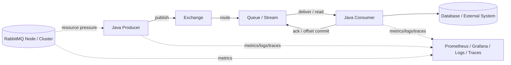
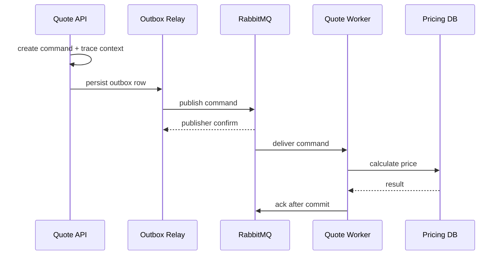
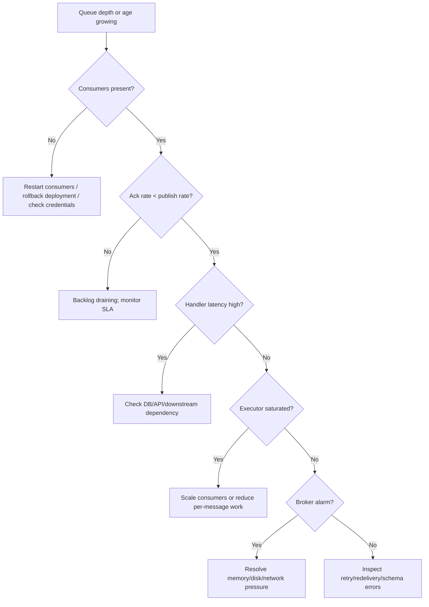

# Part 033 — Observability and Operations: Metrics, Logs, Traces, Alerts, Runbooks

At this point in the series, we already know how to design RabbitMQ producers, consumers, queues, exchanges, retries, streams, super streams, batching, and deployment topology. The remaining production question is different:

> When the system is wrong, slow, overloaded, unsafe, or silently degrading, how do we know fast enough to protect users and data?

Observability is not a dashboard collection. It is the engineering discipline of making a distributed messaging system explain itself under failure.

For RabbitMQ, observability must cover four layers:

1. **Application layer** — Java producers, consumers, workers, thread pools, retries, outbox relays, idempotency stores.
2. **Protocol layer** — connection churn, channels, publisher confirms, consumer acknowledgements, prefetch, redelivery, unroutable messages.
3. **Broker layer** — node health, memory, disk, file descriptors, Erlang process pressure, alarms, queue leaders, stream replicas.
4. **Business layer** — order stuck, quote not generated, invoice delayed, regulatory case not escalated, SLA breach.

A senior engineer does not stop at `messages_ready` and `messages_unacknowledged`. Those are useful, but they are symptoms. Production observability asks:

- Which business flow is stuck?
- Which queue or stream partition is accumulating lag?
- Which consumer group is slow?
- Which producer is publishing faster than the system can safely absorb?
- Which retry policy is hiding a poison message?
- Which queue leader or stream replica is unhealthy?
- Which release introduced confirm latency, redelivery, or DLQ growth?
- Which incident response should be executed now?

This part builds that operating model.

---

## 1. Kaufman Framing: Learn Enough to Self-Correct in Production

Josh Kaufman's learning model emphasizes rapid feedback: break the skill down, learn enough to notice mistakes, remove friction, and practice deliberately. In RabbitMQ operations, the equivalent is:

| Kaufman Principle | RabbitMQ Observability Translation |
|---|---|
| Deconstruct the skill | Separate producer, broker, queue, stream, consumer, storage, network, and business symptoms. |
| Learn enough to self-correct | Know which metrics disprove your hypothesis. |
| Remove practice barriers | Make dashboards, logs, traces, and runbooks available before incidents. |
| Practice deliberately | Run failure drills: consumer crash, broker restart, disk alarm, DLQ spike, duplicate storm. |

The core skill is not memorizing metric names. The core skill is **causal diagnosis**.

You should be able to answer:

> Is this a producer overload, broker resource issue, topology issue, consumer bottleneck, downstream dependency failure, schema failure, retry storm, or stream retention risk?

---

## 2. Observability Mental Model

A RabbitMQ system is a chain of custody for messages.



Each edge has a different observability question.

| Edge | Question | Signal |
|---|---|---|
| Producer → Exchange | Are publishes accepted safely? | confirm latency, nack count, returned messages, publish error rate |
| Exchange → Queue | Are messages routed as expected? | unroutable returns, alternate exchange volume, binding drift |
| Queue → Consumer | Can consumers keep up? | ready, unacked, redelivery, delivery rate, consumer count, prefetch |
| Consumer → DB | Is downstream blocking processing? | handler latency, DB latency, retry count, transaction errors |
| Consumer → Queue | Are acks safe and timely? | ack latency, unacked age, redelivery rate, duplicate count |
| Broker → Producer | Is broker applying pressure? | flow control, blocked connection, memory alarm, disk alarm |

The most useful dashboards follow the message lifecycle, not the organizational chart.

---

## 3. Golden Signals for Messaging Systems

For HTTP services, golden signals are often latency, traffic, errors, and saturation. For RabbitMQ systems, use a messaging-specific version:

| Signal | Meaning | Examples |
|---|---|---|
| Ingress | How fast messages enter the system | publish rate, confirmed publish rate, returned message rate |
| Backlog | How much work is waiting | queue depth, stream lag, oldest message age |
| Processing | How fast work is completed | delivery rate, ack rate, handler success rate |
| Failure | How much work fails or repeats | nack rate, redelivery rate, DLQ rate, retry attempt count |
| Safety | Whether data can be trusted | confirm latency, ack-after-commit, offset commit lag, dedup hit rate |
| Saturation | Whether resources are near limits | memory watermark, disk free, file descriptors, connection/channel count |
| Freshness | Whether users/business are waiting too long | end-to-end age, SLA age, stream retention headroom |

For production, **oldest message age** is often more meaningful than queue length. A queue with 100,000 tiny low-priority messages might be fine. A queue with 12 messages older than a regulatory SLA might be an incident.

---

## 4. Metric Taxonomy

### 4.1 Broker Node Metrics

Node metrics describe whether RabbitMQ can keep operating safely.

Track:

- Node up/down.
- Cluster membership.
- Memory used.
- Memory high watermark state.
- Disk free.
- Disk free alarm state.
- File descriptor usage.
- Socket descriptor usage.
- Erlang process usage.
- Connection count.
- Channel count.
- Queue count.
- Stream count.
- Network partitions.
- Inter-node communication health.
- GC/runtime pressure if exposed.

What they tell you:

| Metric | Risk |
|---|---|
| Memory near watermark | Broker may block publishers. |
| Disk free below threshold | Broker may block publishers or become unsafe. |
| Connection churn | Bad client lifecycle, unstable network, load balancer issue. |
| Channel growth | Channel leak or per-message channel anti-pattern. |
| File descriptor pressure | Too many connections/sockets/queues or OS limit too low. |
| Queue leader concentration | Hot node, uneven workload, leader placement issue. |

### 4.2 Queue Metrics

Queue metrics describe backlog and consumer progress.

Track per critical queue:

- `messages_ready`.
- `messages_unacknowledged`.
- publish rate.
- deliver/get rate.
- ack rate.
- redeliver rate.
- consumer count.
- consumer capacity / utilisation when available.
- oldest message age.
- queue length limit state.
- DLX/dead-letter volume.
- quorum queue leader and replica health.
- delivery limit events for quorum queues.

Interpretation:

| Pattern | Likely Meaning |
|---|---|
| Ready grows, unacked low | Not enough consumers, consumers stopped, routing spike, or prefetch too low. |
| Unacked grows, ready low | Consumers received work but are stuck or slow. |
| Ready and unacked both grow | Arrival rate exceeds total processing capacity. |
| Redelivery rate grows | Consumer crash, nack loop, poison message, timeout, or duplicate storm. |
| Consumer count drops | Deployment, connection issue, container crash, credential issue. |
| Ack rate below publish rate | Backlog will grow unless publish rate falls. |

### 4.3 Stream Metrics

Stream systems are not consumed destructively. Queue depth alone is the wrong mental model.

Track:

- Append rate.
- Consumer read rate.
- Consumer group lag.
- Offset commit rate.
- Oldest retained segment timestamp.
- Retention headroom.
- Segment/chunk storage usage.
- Stream leader and replica health.
- Super stream partition distribution.
- Hot partition publish/read rate.
- Consumer restart count.
- Replay read rate.

Critical question:

> Will a consumer lose the ability to replay before it catches up?

For streams, **lag + retention headroom** matters more than backlog size.

### 4.4 Producer Metrics

A Java producer must expose:

- publish attempts.
- publish success.
- publish failures.
- publisher confirms received.
- publisher nacks.
- confirm latency histogram.
- in-flight confirms.
- returned messages.
- publish retries.
- outbox relay lag.
- local producer buffer size.
- blocked connection duration.
- topology declaration failures.
- serialization errors.

Producer health is bad when:

- confirm latency rises.
- in-flight confirms saturate.
- returned messages appear unexpectedly.
- outbox lag grows.
- blocked connection callback fires.
- publish retry rate grows.

### 4.5 Consumer Metrics

A Java consumer must expose:

- deliveries received.
- handler success count.
- handler failure count.
- ack count.
- nack/reject count.
- redelivery count.
- handler latency histogram.
- ack latency.
- consumer active/inactive gauge.
- executor queue depth.
- executor active threads.
- downstream DB/API latency.
- idempotency dedup hits.
- poison message count.
- DLQ publish count.
- graceful shutdown drain time.

Consumer health is bad when:

- handler p95/p99 latency increases.
- unacked messages age.
- executor queue grows.
- redelivery rises.
- ack rate falls behind delivery rate.
- dedup hits spike after a release.

---

## 5. Minimal Metric Naming Model for Java Services

Use stable names. Avoid metric labels with unbounded cardinality such as `messageId`, `userId`, `orderId`, or raw routing key containing tenant-specific high-cardinality values.

Good labels:

- `service`
- `environment`
- `exchange`
- `queue`
- `stream`
- `consumer_group`
- `message_type`
- `result`
- `exception_class`
- `retryable`
- `operation`

Dangerous labels:

- `message_id`
- `correlation_id`
- `tenant_id` when tenant count is large
- full exception message
- dynamic routing key with identifiers
- payload field values

Example Micrometer-style metric set:

```java
public final class RabbitConsumerMetrics {
    private final Counter deliveries;
    private final Counter successes;
    private final Counter failures;
    private final Counter acks;
    private final Counter nacks;
    private final Counter redeliveries;
    private final Timer handlerTimer;
    private final AtomicInteger executorQueueDepth;

    public RabbitConsumerMetrics(MeterRegistry registry, String queue, String messageType) {
        Tags tags = Tags.of(
            "queue", queue,
            "message_type", messageType
        );

        this.deliveries = Counter.builder("rabbit.consumer.deliveries")
            .tags(tags)
            .register(registry);

        this.successes = Counter.builder("rabbit.consumer.handler.completed")
            .tags(tags.and("result", "success"))
            .register(registry);

        this.failures = Counter.builder("rabbit.consumer.handler.completed")
            .tags(tags.and("result", "failure"))
            .register(registry);

        this.acks = Counter.builder("rabbit.consumer.acks")
            .tags(tags)
            .register(registry);

        this.nacks = Counter.builder("rabbit.consumer.nacks")
            .tags(tags)
            .register(registry);

        this.redeliveries = Counter.builder("rabbit.consumer.redeliveries")
            .tags(tags)
            .register(registry);

        this.handlerTimer = Timer.builder("rabbit.consumer.handler.duration")
            .publishPercentileHistogram()
            .tags(tags)
            .register(registry);

        this.executorQueueDepth = registry.gauge(
            "rabbit.consumer.executor.queue.depth",
            tags,
            new AtomicInteger(0)
        );
    }
}
```

The metric names are intentionally domain-specific. Broker metrics tell you broker state. Application metrics tell you why the broker state is changing.

---

## 6. Logs: Event-Level Forensics Without Payload Leakage

Logs are not metrics. Metrics are aggregate signals. Logs are forensic records.

A production RabbitMQ Java service should log message lifecycle transitions at key boundaries:

- message received
- idempotency decision
- business validation failure
- downstream call failure
- retry classification
- DLQ/parking-lot decision
- ack/nack/reject decision
- publish confirmed/nacked/returned
- stream offset committed
- graceful shutdown start/end

Do not log full payloads by default. Payloads often contain PII, secrets, commercial data, or regulatory-sensitive content.

Use structured logs:

```json
{
  "event": "rabbit_message_processed",
  "service": "quote-worker",
  "queue": "quote.command.generate.v1.qq",
  "messageType": "quote.generate.requested.v1",
  "messageId": "01JZ...",
  "correlationId": "case-88301",
  "causationId": "cmd-9912",
  "deliveryTag": 88112,
  "redelivered": false,
  "attempt": 1,
  "durationMs": 184,
  "result": "success"
}
```

A useful log line should answer:

- What message type?
- Which correlation chain?
- Which queue/stream?
- Which attempt?
- Which decision?
- Which safe identifier can be used to reconstruct the incident?

A dangerous log line leaks:

- full payload
- credentials
- PII
- tokens
- internal certificate material
- unbounded headers
- raw exception stack with secrets in URLs

---

## 7. Tracing: Causality Across Producer, Broker, Consumer, and Side Effects

RabbitMQ is asynchronous. Without trace propagation, causality disappears.

Trace propagation needs two concepts:

1. **Technical trace context** — W3C `traceparent`, `tracestate`, OpenTelemetry baggage if used.
2. **Business correlation context** — `correlationId`, `causationId`, `messageId`, workflow id, aggregate id.

Do not confuse them.

| Field | Purpose |
|---|---|
| `traceparent` | Distributed tracing propagation. |
| `messageId` | Unique message identity. |
| `correlationId` | End-to-end business/request correlation. |
| `causationId` | What caused this message. |
| `aggregateId` | Business entity ordering/partitioning key. |
| `workflowId` | Long-running orchestration correlation. |

### 7.1 Trace Shape



Each span should preserve the same trace context or link to the consumed message span. For asynchronous boundaries, span links are often more accurate than parent-child semantics because the consumer may run long after the producer span ended.

---

## 8. Dashboards: What to Build First

### 8.1 Executive Flow Dashboard

Purpose: answer, “Are customer/business flows healthy?”

Panels:

- End-to-end business latency per flow.
- Number of messages older than SLA.
- DLQ count by flow.
- Retry rate by flow.
- Outbox lag by producer service.
- Consumer lag by critical queue/stream.
- Error budget burn.

This dashboard is for engineering leads, incident commanders, and product stakeholders.

### 8.2 Broker Health Dashboard

Purpose: answer, “Can RabbitMQ operate safely?”

Panels:

- Node up/down.
- Memory used vs watermark.
- Disk free vs threshold.
- File descriptors.
- Connection count and churn.
- Channel count.
- Queue count.
- Stream count.
- Network partitions.
- Cluster alarms.
- Queue leader distribution.

### 8.3 Queue Health Dashboard

Purpose: answer, “Which queues are building risk?”

Panels:

- Ready messages per queue.
- Unacked messages per queue.
- Oldest message age.
- Publish/deliver/ack rates.
- Redelivery rate.
- Consumer count.
- DLQ rate.
- Queue length limit events.
- Quorum queue replica status.

### 8.4 Stream Health Dashboard

Purpose: answer, “Can consumers catch up before retention removes data?”

Panels:

- Append rate.
- Read rate.
- Consumer lag.
- Offset commit delay.
- Retention headroom.
- Partition skew.
- Hot partitions.
- Stream replica health.
- Replay jobs running.

### 8.5 Java Service Dashboard

Purpose: answer, “Is the application causing or absorbing the problem?”

Panels:

- Publish attempts/success/failure.
- Confirm latency.
- In-flight confirms.
- Returned messages.
- Handler duration p50/p95/p99.
- Handler failures.
- Ack/nack/reject rate.
- Executor queue depth.
- Thread pool saturation.
- JVM heap, GC pause, allocation rate.
- DB/API dependency latency.

---

## 9. Alert Design: Symptoms First, Causes Second

Alert fatigue comes from alerting on every metric. A good alert is actionable and tied to user/data risk.

### 9.1 Page-Worthy Alerts

Page someone when:

- critical flow message age breaches SLA;
- critical DLQ grows above threshold;
- broker disk alarm blocks publishing;
- broker memory alarm persists;
- critical consumer count becomes zero;
- quorum queue loses safe replication margin;
- stream consumer lag approaches retention risk;
- outbox relay lag exceeds durability/SLA threshold;
- publisher confirm latency crosses safety threshold;
- duplicate/redelivery storm threatens downstream correctness.

### 9.2 Ticket-Worthy Alerts

Create a ticket when:

- connection churn is higher than baseline;
- channel count trends upward;
- queue depth grows but age is still safe;
- non-critical DLQ has low-volume errors;
- retry rate increased after release;
- partition skew grows but is below incident threshold;
- dashboard has missing metrics.

### 9.3 Bad Alerts

Avoid alerts like:

- any queue depth greater than 0;
- any redelivery greater than 0;
- any connection closed;
- any consumer restart;
- CPU greater than 70% for 1 minute;
- heap usage greater than 80% without GC/latency impact.

Messaging systems are bursty. Alert on **sustained risk**, not normal dynamics.

---

## 10. Alert Rule Examples

Use these as conceptual rules, not copy-paste defaults.

### 10.1 Critical Consumer Down

```yaml
alert: RabbitCriticalConsumerMissing
expr: rabbitmq_queue_consumers{queue=~"quote\\.command\\..*"} == 0
for: 2m
labels:
  severity: page
annotations:
  summary: "Critical RabbitMQ queue has no consumers"
  runbook: "rabbitmq-runbook-consumer-missing"
```

### 10.2 Queue SLA Age Breach

```yaml
alert: RabbitQueueOldestMessageAgeSlaBreach
expr: rabbit_queue_oldest_message_age_seconds{critical="true"} > 300
for: 5m
labels:
  severity: page
annotations:
  summary: "Oldest message age exceeds SLA"
  runbook: "rabbitmq-runbook-queue-age"
```

### 10.3 DLQ Spike

```yaml
alert: RabbitDlqSpike
expr: increase(rabbitmq_queue_messages_published_total{queue=~".*\\.dlq"}[10m]) > 100
for: 5m
labels:
  severity: page
annotations:
  summary: "DLQ volume spiked"
  runbook: "rabbitmq-runbook-dlq-spike"
```

### 10.4 Stream Retention Risk

```yaml
alert: RabbitStreamConsumerRetentionRisk
expr: stream_retention_headroom_seconds{critical="true"} < 3600
for: 10m
labels:
  severity: page
annotations:
  summary: "Stream consumer is close to falling behind retention"
  runbook: "rabbitmq-runbook-stream-retention-risk"
```

---

## 11. Runbook: Queue Growth

### Symptom

- `messages_ready` grows.
- Oldest message age grows.
- Ack rate is lower than publish rate.

### Immediate Triage

1. Identify affected queue and business flow.
2. Check consumer count.
3. Compare publish rate vs ack rate.
4. Check handler p95/p99 latency.
5. Check downstream dependency latency.
6. Check broker memory/disk alarms.
7. Check recent deployments.
8. Check DLQ/retry rate.

### Decision Tree



### Safe Actions

- Scale consumers horizontally if handler is CPU-bound and queue ordering does not prohibit it.
- Increase prefetch only if consumers have idle capacity.
- Reduce producer rate if backlog threatens SLA or broker safety.
- Shed non-critical workload.
- Move poison messages to parking lot.
- Roll back recent release if handler failures started after deployment.

### Unsafe Actions

- Blindly increasing prefetch.
- Blindly increasing worker threads when DB is saturated.
- Purging queues without business approval.
- Replaying DLQ without idempotency.
- Restarting all broker nodes at once.

---

## 12. Runbook: DLQ Spike

### Symptom

- DLQ publish rate increases.
- Retry queue depth grows.
- Parking lot receives messages.

### Immediate Triage

1. Group DLQ messages by `messageType`, exception class, producer, schema version.
2. Determine if failures are deterministic or transient.
3. Check if all failures are from a new deployment.
4. Check schema/contract change.
5. Check downstream dependency outage.
6. Check retry attempt count distribution.
7. Estimate business impact.

### Classification

| Failure Type | Action |
|---|---|
| Transient DB/API timeout | Retry with backoff if budget remains. |
| Schema incompatibility | Stop replay, fix producer/consumer contract. |
| Business validation failure | Park and route to manual/business workflow. |
| Authorization failure | Fix credentials/permissions; do not blindly replay. |
| Poison message bug | Patch consumer, then replay idempotently. |
| Duplicate side effect | Stop consumer; inspect idempotency ledger. |

### Replay Rule

Never replay DLQ because “the service is fixed” unless you can answer:

- Is the handler idempotent?
- Are external side effects protected?
- Will replay preserve ordering assumptions?
- Is the message still semantically valid?
- Is the target version compatible with the message schema?
- Is the retry budget reset intentionally?

---

## 13. Runbook: Publisher Confirm Latency Spike

### Symptom

- Producer confirm p95/p99 rises.
- In-flight confirm count saturates.
- Outbox relay lag grows.
- Application publish latency increases.

### Immediate Triage

1. Check broker disk and memory alarms.
2. Check queue type: quorum/stream/classic.
3. Check replication health.
4. Check disk I/O saturation.
5. Check network latency producer → broker.
6. Check message size increase.
7. Check publish fanout increase.
8. Check broker leader node concentration.

### Likely Causes

| Cause | Evidence |
|---|---|
| Disk saturation | disk latency high, confirms slow, broker safe but slow |
| Quorum replication lag | leader/follower health degraded |
| Large payload release | message size histogram shifted |
| Fanout expansion | one publish routes to many queues |
| Broker flow control | connection blocked events |
| Network issue | connection churn, heartbeat timeouts |

### Safe Actions

- Throttle producers.
- Reduce non-critical publish volume.
- Scale broker resources only if capacity model supports it.
- Move large payloads to object storage with reference messages.
- Rebalance leaders if supported by operational process.
- Roll back topology/payload changes.

---

## 14. Runbook: Redelivery Storm

### Symptom

- Redelivery rate spikes.
- Same `messageId` appears repeatedly.
- Consumer CPU high but business progress low.
- DLQ may or may not grow.

### Root Causes

- Consumer crashes before ack.
- Handler throws deterministic exception and requeues.
- Nack/requeue loop.
- Process timeout kills worker.
- Downstream service fails and all messages retry immediately.
- Ack is never called because control flow exits early.

### Safe Containment

- Stop requeue loop by switching deterministic failures to DLQ/parking lot.
- Reduce consumer concurrency if downstream is overloaded.
- Disable or throttle affected consumer group.
- Patch retry classifier.
- Add delivery attempt limit if using quorum queues where appropriate.

### Critical Invariant

A redelivery storm is not a throughput problem. It is a **progress problem**.

Increasing consumers can make it worse.

---

## 15. Runbook: Stream Consumer Lag Near Retention

### Symptom

- Consumer offset is far behind stream tail.
- Retention headroom is shrinking.
- Replay consumer cannot catch up.

### Immediate Triage

1. Identify stream and consumer group.
2. Determine lag in messages and time.
3. Determine retention policy.
4. Estimate catch-up rate.
5. Compare catch-up rate with append rate.
6. Check partition skew.
7. Check consumer failures.
8. Check offset commit behavior.

### Formula

```text
net_catchup_rate = consumer_read_rate - append_rate
catchup_time = lag_messages / net_catchup_rate
```

If `net_catchup_rate <= 0`, the consumer will never catch up without intervention.

### Safe Actions

- Add consumers/partitions if architecture supports it.
- Temporarily increase retention if storage allows.
- Reduce append rate from non-critical producers.
- Optimize consumer batch size.
- Skip/rebuild non-critical derived projections from snapshot.
- Start a new consumer group from a newer offset only with explicit business approval.

---

## 16. Operational Maturity Levels

### Level 1 — Reactive

- Management UI checked manually.
- Logs only after incident.
- Queue depth alerts only.
- No runbooks.
- DLQ replay manual and risky.

### Level 2 — Basic Production

- Prometheus scraping broker metrics.
- Grafana dashboards for nodes and queues.
- Basic DLQ and consumer alerts.
- Application metrics for handler success/failure.
- Some runbooks exist.

### Level 3 — Reliable Production

- Business SLA dashboards.
- Producer confirm metrics.
- Consumer ack/redelivery metrics.
- Stream lag and retention headroom.
- Idempotency and duplicate metrics.
- Structured logs with correlation.
- Tested runbooks.

### Level 4 — Top-Tier Operational System

- Automated symptom-to-runbook routing.
- Chaos drills.
- Release correlation on dashboards.
- Contract drift detection.
- Topology drift detection.
- Business impact estimation.
- Safe replay tooling.
- Post-incident learning loop.

---

## 17. Safe Replay Tooling Requirements

A production RabbitMQ platform eventually needs controlled replay tooling.

Minimum features:

- Select by queue, DLQ, stream, time range, message type, schema version, correlation id.
- Preview before replay.
- Redact sensitive payload fields.
- Validate schema compatibility.
- Enforce idempotency requirement.
- Limit replay rate.
- Preserve original metadata where appropriate.
- Add replay metadata: replay id, operator, reason, timestamp.
- Write audit record.
- Stop replay when failure rate exceeds threshold.

Replay is not just an operational action. It is a data mutation workflow.

For regulated systems, replay must be reviewable and explainable.

---

## 18. Incident Postmortem Template

Use this structure after RabbitMQ incidents.

```md
# Incident: <title>

## Summary
What happened in business terms?

## Timeline
- Detection time
- First alert
- First human acknowledgement
- Mitigation start
- Mitigation complete
- Full recovery

## Affected Flows
- Message types
- Queues/streams
- Producers
- Consumers
- Business entities

## Technical Symptoms
- Queue depth
- Oldest message age
- DLQ count
- Redelivery rate
- Confirm latency
- Broker alarms
- Consumer errors

## Root Cause
What actually caused the system to stop making safe progress?

## Trigger
What changed recently?

## What Worked
Which signals/runbooks/actions helped?

## What Failed
Which signals were missing or misleading?

## Data Safety Assessment
- Message loss?
- Duplicate side effects?
- Replayed messages?
- Manual intervention?

## Preventive Actions
- Code
- Topology
- Metrics
- Alerts
- Runbooks
- Tests
- Capacity
```

The most important section is **Data Safety Assessment**. A messaging outage is not only about downtime; it is about whether work was lost, duplicated, delayed, or corrupted.

---

## 19. Practice Drill

Build a small Java RabbitMQ lab with:

- one producer using publisher confirms;
- one command queue;
- one retry queue;
- one DLQ;
- one consumer with manual ack;
- one stream with offset tracking;
- Micrometer metrics;
- structured logs;
- dashboard panels.

Then run these drills:

1. Stop consumer for 10 minutes.
2. Break DB dependency.
3. Publish invalid schema messages.
4. Force consumer crash after DB commit before ack.
5. Increase message payload size by 10x.
6. Reduce broker disk free space in a safe test environment.
7. Create a redelivery loop.
8. Let stream consumer fall behind.
9. Replay DLQ safely.
10. Roll back a bad consumer release.

For each drill, write:

- expected signal;
- observed signal;
- diagnosis path;
- safe action;
- missing instrumentation.

This is deliberate practice for production judgment.

---

## 20. Production Checklist

Before declaring a RabbitMQ system production-ready, verify:

- [ ] Every critical queue has dashboard panels.
- [ ] Every critical stream has lag and retention headroom.
- [ ] Producers expose confirm latency and returned messages.
- [ ] Consumers expose handler latency, ack/nack, redelivery, executor depth.
- [ ] DLQ and retry queues are visible.
- [ ] Oldest message age is tracked for critical flows.
- [ ] Outbox lag is tracked.
- [ ] Idempotency/dedup hit rate is tracked.
- [ ] Broker memory and disk alarms page the right team.
- [ ] Connection/channel churn is monitored.
- [ ] Logs include message id, correlation id, causation id, type, attempt.
- [ ] Payloads are not logged by default.
- [ ] Trace context is propagated.
- [ ] Replay tooling is rate-limited and audited.
- [ ] Runbooks exist and have been tested.
- [ ] Alerts distinguish symptoms from causes.
- [ ] On-call can identify business impact from dashboards.

---

## References

- RabbitMQ Documentation — Monitoring
- RabbitMQ Documentation — Monitoring with Prometheus and Grafana
- RabbitMQ Documentation — Management Plugin
- RabbitMQ Documentation — Production Deployment Guidelines
- RabbitMQ Documentation — Reliability Guide
- RabbitMQ Documentation — Connections
- RabbitMQ Documentation — Memory Use
- RabbitMQ Documentation — Streams
- RabbitMQ Java Client API Guide
- Micrometer Documentation
- OpenTelemetry Documentation
