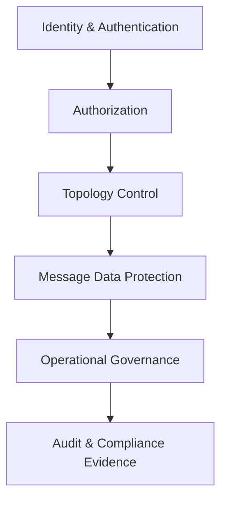
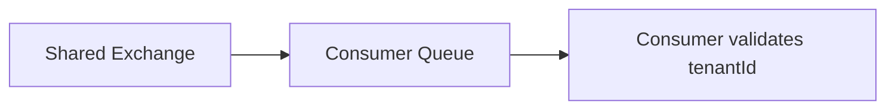

# Part 034 — Security, Multi-Tenancy, Governance, and Compliance

Security in RabbitMQ is not only “turn on TLS” or “create users”. In a real platform, RabbitMQ is a high-value control plane for business actions. Whoever can publish, route, consume, replay, purge, or bind messages can influence system behavior.

A secure RabbitMQ platform answers:

- Who can publish which commands?
- Who can subscribe to which events?
- Who can declare or mutate topology?
- Who can replay messages?
- Which messages contain regulated data?
- Which tenants are isolated from each other?
- Which credentials exist, where are they used, and when do they expire?
- Which operations are auditable?
- How do we prove no unauthorized flow was possible?

For regulatory or enforcement lifecycle systems, RabbitMQ security is part of case defensibility. The platform must prevent unauthorized processing and must make legitimate processing explainable.

---

## 1. Security Mental Model

RabbitMQ security spans five surfaces:



| Surface | Main Question |
|---|---|
| Identity | Who is connecting? |
| Authorization | What can they configure, write, and read? |
| Topology control | Who can create routes, queues, bindings, policies? |
| Data protection | What sensitive information can pass through messages? |
| Operations | Who can purge, replay, shovel, federate, or inspect messages? |
| Audit | Can we prove what happened and why? |

A strong RabbitMQ design treats topology as an access boundary, not just a routing convenience.

---

## 2. Threat Model for RabbitMQ Systems

Before configuring security, identify threats.

### 2.1 Producer Threats

- Unauthorized service publishes commands.
- Compromised service publishes valid-looking messages.
- Producer publishes to broad topic routing keys.
- Producer injects headers that influence retry, priority, or tenant behavior.
- Producer publishes payloads with PII leakage.
- Producer floods broker intentionally or accidentally.

### 2.2 Consumer Threats

- Unauthorized service consumes confidential events.
- Consumer binds itself to topic patterns it should not observe.
- Consumer acknowledges messages without processing.
- Consumer replays or duplicates side effects.
- Consumer logs sensitive payloads.
- Consumer uses stale credentials after ownership change.

### 2.3 Operator Threats

- Accidental queue purge.
- Unreviewed topology change.
- Unsafe DLQ replay.
- Management UI exposed to broad network.
- Excessive admin permissions.
- Credentials copied into ticket/chat/logs.

### 2.4 Tenant Threats

- Tenant A messages routed to Tenant B queue.
- Tenant identity stored only in payload but not enforced in routing or permissions.
- Shared DLQ leaks cross-tenant payloads.
- Shared stream allows unauthorized replay.
- Unbounded tenant labels cause metric/cardinality or routing explosion.

---

## 3. Virtual Hosts as Isolation Boundaries

RabbitMQ virtual hosts provide namespace isolation for exchanges, queues, bindings, users, and permissions. Use them intentionally.

Common vhost strategies:

| Strategy | Example | When Useful | Risk |
|---|---|---|---|
| Environment vhost | `/prod`, `/staging` | Small systems | Weak domain isolation |
| Domain vhost | `/quote`, `/order`, `/billing` | Domain ownership | Cross-domain events need governance |
| Tenant vhost | `/tenant-a`, `/tenant-b` | Strong tenant isolation | Operational overhead |
| Sensitivity vhost | `/public-events`, `/restricted-case` | Data classification boundary | More topology complexity |
| Platform vhost | `/platform-control` | Internal infra flows | Must be tightly controlled |

Do not create vhosts casually. Every vhost introduces operational surface area: permissions, policies, monitoring, backup/restore, topology-as-code, and naming conventions.

### 3.1 Recommended Model for Large Internal Platforms

Use a layered strategy:

- vhost per **environment** and **security domain**;
- exchanges per **business domain**;
- queues per **consumer service**;
- routing keys encode **event type**, not raw sensitive identifiers;
- tenant isolation via vhost only when tenant risk justifies operational cost.

Example:

```text
/prod-case-restricted
/prod-order-standard
/prod-platform-control
/staging-case-restricted
```

---

## 4. Permission Model: Configure, Write, Read

RabbitMQ permissions are not a single allow/deny. They are commonly expressed as configure, write, and read permissions over resources.

Mental model:

| Permission | Allows | Production Rule |
|---|---|---|
| Configure | declare/delete/configure exchanges, queues, bindings | Rare for applications. Prefer topology operator or deployment pipeline. |
| Write | publish to exchanges | Producers need narrow write permission. |
| Read | consume from queues | Consumers need narrow read permission. |

A normal application should not have broad configure permissions in production. Topology should be deployed by infrastructure pipeline or topology operator with review.

### 4.1 Producer Permission Pattern

A command producer should write only to the command exchange it owns or is allowed to invoke.

```text
user: quote-api-prod
vhost: /prod-quote
configure: ^$
write: ^quote\.command\.x$
read: ^$
```

### 4.2 Consumer Permission Pattern

A worker should read only its queue and should not write unless it publishes events or DLQ messages explicitly.

```text
user: quote-worker-prod
vhost: /prod-quote
configure: ^$
write: ^quote\.event\.x$|^quote\.retry\.x$
read: ^quote\.command\.generate\.v1\.qq$
```

### 4.3 Topology Deployer Permission Pattern

Topology pipeline or operator can configure resources within a controlled namespace.

```text
user: rabbit-topology-deployer-prod
vhost: /prod-quote
configure: ^quote\..*
write: ^$
read: ^$
```

This separation matters. If runtime applications can freely configure topology, they can accidentally or maliciously change the routing graph.

---

## 5. Least Privilege Topology Design

Least privilege is easier when topology names are predictable.

Recommended naming:

```text
<domain>.<purpose>.<name>.<version>.<resource-type>
```

Examples:

```text
quote.command.x
quote.event.x
quote.retry.x
quote.command.generate.v1.qq
quote.command.generate.v1.retry.5m.q
quote.command.generate.v1.dlq
quote.stream.audit.v1
case.event.lifecycle.v1.stream
```

Resource-type suffix examples:

| Suffix | Meaning |
|---|---|
| `.x` | exchange |
| `.q` | classic queue |
| `.qq` | quorum queue |
| `.dlq` | dead-letter queue |
| `.retry.<delay>.q` | retry queue |
| `.stream` | stream |
| `.ss` | super stream logical name |

Names are not cosmetic. They make permission regex possible.

---

## 6. TLS and Transport Security

Transport security protects data in transit and helps prevent credential leakage over the network.

Production baseline:

- Use TLS for client-broker connections.
- Use TLS for management/API access.
- Use TLS for inter-node traffic where required by environment/security policy.
- Validate server certificates from Java clients.
- Prefer mutual TLS for high-security domains where operationally feasible.
- Rotate certificates before expiry.
- Monitor certificate expiry.
- Disable weak protocols/ciphers according to organizational policy.

### 6.1 Java Client TLS Configuration Concept

At the Java application layer, TLS configuration should be explicit and externalized.

```java
ConnectionFactory factory = new ConnectionFactory();
factory.setHost(config.host());
factory.setPort(config.tlsPort());
factory.setVirtualHost(config.vhost());
factory.setUsername(config.username());
factory.setPassword(config.password());

// Prefer a properly configured SSLContext from your platform secret store.
SSLContext sslContext = sslContextFactory.createFromTrustStore(
    config.trustStorePath(),
    config.trustStorePassword()
);

factory.useSslProtocol(sslContext);
factory.enableHostnameVerification();
```

Do not disable certificate validation to “fix” connectivity.

Bad:

```java
// Do not ship this pattern.
factory.useSslProtocol();
// Missing hostname verification and proper trust material.
```

### 6.2 TLS Failure Modes

| Failure | Symptom | Safe Action |
|---|---|---|
| Expired broker cert | clients cannot connect | rotate cert, verify trust chain |
| Missing CA in truststore | TLS handshake failure | update truststore through secret pipeline |
| Hostname mismatch | verification failure | fix certificate SAN or endpoint |
| Mixed TLS/plain config | connection refused or protocol error | verify port/service config |
| Cert rotation not coordinated | partial outage | overlap old/new trust bundles |

---

## 7. Credential Lifecycle

Credentials are operational liabilities unless lifecycle-managed.

Production rules:

- Every application gets its own RabbitMQ user.
- No shared `app` user.
- No default `guest` usage outside local development.
- Credentials are stored in secret manager, not config files.
- Credentials are rotated on schedule.
- Credentials are rotated immediately after suspected exposure.
- Credential usage is mapped to service ownership.
- Disabled services lose credentials.
- Break-glass credentials are time-bound and audited.

### 7.1 Credential Inventory

Maintain an inventory:

| User | Service | Vhost | Permissions | Owner | Rotation | Last Used | Notes |
|---|---|---|---|---|---|---|---|
| `quote-api-prod` | Quote API | `/prod-quote` | write command exchange | Quote Team | 90d | observed | no configure |
| `quote-worker-prod` | Quote Worker | `/prod-quote` | read command queue, write events | Quote Team | 90d | observed | no broad topic read |

This inventory is compliance evidence.

---

## 8. Management UI and HTTP API Security

The management UI is powerful. Treat it as privileged operational access.

Rules:

- Do not expose management UI publicly.
- Restrict by network policy/VPN/private access.
- Require strong authentication.
- Use role-based users.
- Avoid broad administrator access.
- Audit access where possible.
- Disable or restrict risky operations for non-admin roles.
- Do not use management UI as primary topology deployment mechanism.

Risky operations include:

- purge queue;
- delete queue/exchange;
- force close connection;
- modify permissions;
- inspect message payload;
- create shovel/federation;
- change policy affecting many queues.

The UI is useful for triage. It should not replace reviewed infrastructure-as-code.

---

## 9. Message Data Classification

Before sending a message, classify its data.

| Class | Example | RabbitMQ Rule |
|---|---|---|
| Public operational | health ping | OK with minimal controls |
| Internal business | quote requested | standard controls |
| Confidential | customer data | encryption/TLS/access control required |
| Restricted/regulatory | enforcement case evidence | strict vhost, audit, retention, redaction |
| Secret | tokens, passwords, private keys | do not put in messages |

Never put these in RabbitMQ payloads:

- passwords;
- access tokens;
- refresh tokens;
- private keys;
- raw credentials;
- large binary evidence files;
- full documents when a secure object reference is enough;
- data that violates retention policy.

Prefer message references:

```json
{
  "messageId": "01JZ...",
  "type": "case.evidence.ingest.requested.v1",
  "caseId": "CASE-8831",
  "evidenceRef": "evidence://restricted-store/object/abc123",
  "checksum": "sha256:...",
  "classification": "restricted",
  "requestedBy": "svc-case-api"
}
```

The message carries enough information to process safely, not every piece of sensitive data.

---

## 10. Payload Encryption Strategy

TLS protects data in transit. It does not protect payloads from:

- broker administrators;
- management UI payload inspection;
- disk compromise;
- logs if payloads are logged;
- DLQ/replay tooling;
- backups/snapshots.

If messages contain restricted data, consider application-level encryption.

Patterns:

| Pattern | Description | Trade-Off |
|---|---|---|
| Reference message | Store sensitive data elsewhere; send pointer | Best default for large/restricted data |
| Field-level encryption | Encrypt sensitive fields only | More schema complexity |
| Whole-payload encryption | Broker sees opaque bytes | Harder routing/debugging/schema validation |
| Envelope encryption | Per-message data key encrypted by KMS | Strong but operationally heavier |

Do not encrypt routing keys. Routing keys must remain broker-visible. Design routing keys so they do not contain sensitive identifiers.

Bad:

```text
case.event.tenant-123456.ssn-991-44-1111.created
```

Better:

```text
case.event.lifecycle.created.v1
```

Tenant/security enforcement belongs in permissions, vhost design, and validated envelope metadata, not in sensitive routing key values.

---

## 11. Multi-Tenancy Models

RabbitMQ multi-tenancy is a design choice with operational consequences.

### 11.1 Shared Vhost, Tenant in Payload



Pros:

- simple topology;
- low operational overhead;
- easy broadcast across tenants.

Cons:

- weak isolation;
- relies heavily on application validation;
- DLQ can mix tenants;
- difficult tenant-specific replay;
- risk of accidental leakage.

Use only for low-sensitivity internal flows or when tenant count is huge and data is not restricted.

### 11.2 Shared Vhost, Tenant-Aware Routing

```text
routing key: quote.command.generate.tenant-group-a.v1
```

Pros:

- better routing control;
- can isolate consumer groups;
- supports tenant group throttling.

Cons:

- routing key cardinality risk;
- permission regex complexity;
- tenant leakage if topic wildcard too broad.

Use for tenant groups, not necessarily per tenant.

### 11.3 Vhost Per Tenant

Pros:

- strong namespace isolation;
- clear permissions;
- easier tenant-specific audit and purge.

Cons:

- high operational overhead;
- many connections/resources;
- harder fleet-wide topology changes;
- more monitoring cardinality.

Use for high-value or regulated tenants where isolation outweighs overhead.

### 11.4 Cluster Per Tenant/Security Domain

Pros:

- strongest operational blast-radius isolation;
- independent upgrades/capacity/security policy.

Cons:

- highest cost;
- duplicated operations;
- cross-cluster integration complexity.

Use when regulatory, contractual, or resilience requirements justify it.

---

## 12. Topology Governance

Topology is code. Treat it like code.

Governed resources:

- vhosts;
- users;
- permissions;
- exchanges;
- queues;
- streams;
- bindings;
- policies;
- operator CRDs;
- retry/DLQ topology;
- shovel/federation definitions;
- management tags/roles.

### 12.1 Required Review for Topology Changes

Review questions:

- Who owns this exchange/queue/stream?
- Which service may publish?
- Which service may consume?
- Does this expose restricted data?
- What is the DLQ/retry behavior?
- What is the retention policy?
- What is the expected throughput?
- What is the expected message size?
- What is the SLA?
- How will it be monitored?
- What happens if a consumer is down for 24 hours?
- What happens if this producer publishes invalid messages?
- How is replay authorized?

### 12.2 Topology as Code Example

Conceptual YAML:

```yaml
apiVersion: rabbitmq.com/v1beta1
kind: Queue
metadata:
  name: quote-command-generate-v1
spec:
  name: quote.command.generate.v1.qq
  vhost: /prod-quote
  type: quorum
  durable: true
  rabbitmqClusterReference:
    name: prod-rabbitmq
```

Conceptual binding:

```yaml
apiVersion: rabbitmq.com/v1beta1
kind: Binding
metadata:
  name: quote-generate-binding
spec:
  vhost: /prod-quote
  source: quote.command.x
  destination: quote.command.generate.v1.qq
  destinationType: queue
  routingKey: quote.command.generate.v1
  rabbitmqClusterReference:
    name: prod-rabbitmq
```

The exact CRD fields depend on operator version, but the principle is stable: topology should be declarative, reviewed, and reconciled.

---

## 13. Contract Governance

Security and compliance also depend on message contracts.

Every message type should have:

- owner;
- description;
- version;
- schema;
- data classification;
- retention rule;
- allowed producers;
- allowed consumers;
- compatibility policy;
- replay policy;
- PII fields;
- audit requirements.

Example registry entry:

```yaml
messageType: case.lifecycle.escalated.v1
owner: case-platform-team
classification: restricted
schema: schemas/case.lifecycle.escalated.v1.json
allowedProducers:
  - case-escalation-service
allowedConsumers:
  - notification-service
  - audit-projection-service
retention:
  queue: 7d
  stream: 180d
replay:
  allowed: true
  approval: security-and-domain-owner
piiFields:
  - subjectName
  - officerId
compatibility: backward-compatible-only
```

A routing key is not a contract. It is an address. The contract is the schema plus semantics plus ownership plus operational policy.

---

## 14. Compliance and Regulatory Defensibility

For regulated workflows, you must prove more than uptime.

You may need to prove:

- a command was accepted at a specific time;
- a message was not lost;
- a duplicate was safely ignored;
- a restricted event was only consumed by authorized services;
- a replay was authorized;
- a message was processed under the correct policy version;
- a retention policy was applied;
- a manual intervention was recorded;
- a topology change was reviewed before production.

### 14.1 Evidence Sources

| Evidence | Purpose |
|---|---|
| Publisher confirm logs/metrics | Prove broker accepted responsibility. |
| Outbox table | Prove intended publish and relay status. |
| Inbox/dedup table | Prove duplicate handling. |
| Consumer processing logs | Prove handler decision. |
| Audit stream | Prove workflow progression. |
| Topology Git history | Prove routing/permission change review. |
| Secret manager audit | Prove credential access/rotation. |
| Replay audit table | Prove operator action and approval. |
| DLQ/parking lot records | Prove failed-message handling. |

### 14.2 Audit Event Shape

```json
{
  "auditEventId": "01JZ...",
  "timestamp": "2026-07-02T10:15:30Z",
  "actor": "svc-quote-worker",
  "action": "MESSAGE_PROCESSED",
  "messageId": "01JZ...",
  "correlationId": "case-88301",
  "messageType": "quote.command.generate.v1",
  "queue": "quote.command.generate.v1.qq",
  "decision": "ACK_AFTER_COMMIT",
  "policyVersion": "quote-processing-policy-2026-06",
  "result": "SUCCESS"
}
```

Audit events should be append-only and protected from casual mutation.

---

## 15. Replay Governance

Replay is dangerous because it reintroduces historical intent into the current system.

Replay can cause:

- duplicate side effects;
- invalid state transitions;
- out-of-order processing;
- policy violations;
- sending notifications twice;
- rebuilding projections incorrectly;
- reprocessing data past retention/legal window.

### 15.1 Replay Approval Matrix

| Replay Type | Approval |
|---|---|
| Non-critical derived projection rebuild | owning team |
| DLQ replay after transient outage | owning team + on-call lead |
| Restricted case workflow replay | domain owner + security/compliance |
| Cross-tenant replay | platform owner + tenant owner |
| Replay involving external side effects | architecture review or explicit business approval |

### 15.2 Replay Guardrails

- Rate limit replay.
- Require dry-run preview.
- Validate schema.
- Validate idempotency support.
- Attach replay metadata.
- Audit operator and reason.
- Stop on error threshold.
- Separate replay queue/exchange when needed.
- Do not replay directly into hot production path without throttling.

---

## 16. Secure Java Client Configuration

Centralize RabbitMQ client configuration.

Required fields:

- host/service endpoint;
- TLS port;
- vhost;
- username secret reference;
- password secret reference or client certificate;
- truststore/cert reference;
- connection name;
- heartbeat;
- connection timeout;
- requested channel max if controlled;
- automatic recovery policy;
- publisher confirm policy;
- topology declaration mode.

Example connection name:

```java
factory.newConnection(
    executorService,
    List.of(addresses),
    "quote-worker-prod:v1.42.0:pod-7c9d"
);
```

Connection names help operations identify abusive, broken, or stale clients.

### 16.1 Secure Defaults

```java
public record RabbitSecurityConfig(
    String host,
    int port,
    String vhost,
    String username,
    SecretRef password,
    SecretRef trustStore,
    Duration requestedHeartbeat,
    Duration connectionTimeout,
    boolean hostnameVerification
) {
    public RabbitSecurityConfig {
        if (!hostnameVerification) {
            throw new IllegalArgumentException("Hostname verification must be enabled in production");
        }
        if (!vhost.startsWith("/prod-")) {
            throw new IllegalArgumentException("Unexpected production vhost naming");
        }
    }
}
```

Security constraints should fail fast at startup, not silently degrade.

---

## 17. Data Retention and Deletion

Retention has three layers:

1. Queue/message retention.
2. Stream retention.
3. Logs/metrics/audit retention.

Be careful: deleting a message from a queue does not delete:

- logs containing payload;
- DLQ copies;
- stream copies;
- audit events;
- backups;
- traces;
- downstream projections;
- object-store payload referenced by message.

For restricted data, document retention by data class:

| Data Class | Queue Retention | Stream Retention | Log Policy | Replay Policy |
|---|---|---|---|---|
| Internal | short queue retention | 7-30d if needed | no payload | team approval |
| Confidential | short | limited | redacted | owner approval |
| Restricted | explicit legal basis | explicit legal basis | strict redaction | compliance approval |
| Secret | not allowed | not allowed | not allowed | not applicable |

---

## 18. Operational Separation of Duties

Avoid giving one actor power over all stages.

| Role | Allowed | Not Allowed |
|---|---|---|
| App runtime service | publish/consume specific resources | broad configure, purge, user management |
| Topology pipeline | declare reviewed topology | consume payloads |
| On-call engineer | inspect metrics, safe operational actions | unrestricted replay without approval |
| Security admin | manage permissions/secrets | mutate business messages |
| Compliance reviewer | inspect audit evidence | operate broker directly |

Separation of duties prevents accidental and malicious misuse.

---

## 19. Security Review Checklist

Before production launch:

- [ ] Every service has its own RabbitMQ user.
- [ ] No shared broad application user exists.
- [ ] Runtime services do not have broad configure permission.
- [ ] Permissions are regex-scoped to known resource prefixes.
- [ ] Management UI is network-restricted.
- [ ] TLS is enabled for client connections.
- [ ] Hostname verification is enabled.
- [ ] Certificates have monitored expiry.
- [ ] Secrets are stored in approved secret manager.
- [ ] Credentials have rotation schedule.
- [ ] Topology is declarative and reviewed.
- [ ] DLQ and replay operations are governed.
- [ ] Message contracts include data classification.
- [ ] Payloads do not contain secrets.
- [ ] PII payload fields are known and redacted in logs.
- [ ] Tenant isolation model is explicit.
- [ ] Audit events exist for restricted workflows.
- [ ] Retention policy is documented.
- [ ] Broker admin access is limited and auditable.
- [ ] Shovel/federation/plugins are reviewed before enablement.

---

## 20. Architecture Decision Record Template

```md
# ADR: RabbitMQ Security and Governance for <Domain>

## Context
What business flow uses RabbitMQ?
What data classification applies?
Which teams own producer/consumer/topology?

## Decision
- Vhost strategy
- Exchange/queue/stream naming
- Permission model
- TLS/mTLS requirement
- Credential rotation
- Message encryption/reference strategy
- Retry/DLQ/replay governance
- Retention policy
- Audit requirements

## Alternatives Considered
- Shared vhost
- Tenant vhost
- Cluster per domain
- Queue vs stream
- Payload vs reference message

## Consequences
- Operational overhead
- Security isolation
- Monitoring requirements
- Replay process
- Compliance evidence

## Review Date
When should this be reviewed again?
```

Good RabbitMQ governance is not static. It must evolve as data sensitivity, tenants, throughput, and organizational boundaries change.

---

## 21. Practice Drill

Take one existing messaging flow and produce a security/governance review.

Required output:

1. Resource inventory.
2. Producer/consumer identity map.
3. Permission matrix.
4. Data classification.
5. Tenant isolation model.
6. TLS/credential model.
7. Replay policy.
8. Retention policy.
9. Audit evidence map.
10. Topology-as-code proposal.

Then run this tabletop exercise:

- A consumer service is compromised.
- It tries to bind to every topic.
- It tries to consume restricted events.
- It tries to purge its queue.
- It tries to publish fake lifecycle events.
- An operator tries to replay old DLQ messages.

For each action, answer:

- Is it technically possible?
- Which control prevents it?
- Which log/audit record proves it?
- What alert fires?
- What response is required?

If you cannot answer those questions, the security design is incomplete.

---

## 22. Final Mental Model

RabbitMQ security is not an add-on. It is the set of constraints that ensures messages can only move through legitimate paths.

A production-grade design has these invariants:

- Producers can only publish where they are allowed.
- Consumers can only read what they are allowed.
- Runtime services cannot freely mutate topology.
- Restricted data is minimized, encrypted or referenced, and redacted from logs.
- Tenants are isolated according to risk.
- Replay is governed like a production data mutation.
- Topology changes are reviewed and traceable.
- Credentials are unique, rotated, and owned.
- Audit evidence can reconstruct important business decisions.

This is what turns RabbitMQ from a convenient message broker into a defensible platform component.

---

## References

- RabbitMQ Documentation — Authentication, Authorisation, Access Control
- RabbitMQ Documentation — TLS Support
- RabbitMQ Documentation — Production Deployment Guidelines
- RabbitMQ Documentation — Virtual Hosts
- RabbitMQ Documentation — Management Plugin
- RabbitMQ Documentation — Kubernetes Messaging Topology Operator
- RabbitMQ Documentation — OAuth 2 Support
- RabbitMQ Documentation — Networking
- RabbitMQ Documentation — Shovel Plugin
- RabbitMQ Java Client API Guide
- OWASP Logging Cheat Sheet
- OpenTelemetry Documentation
