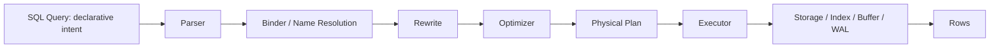
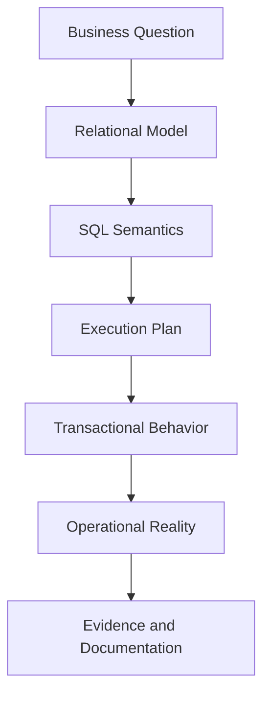
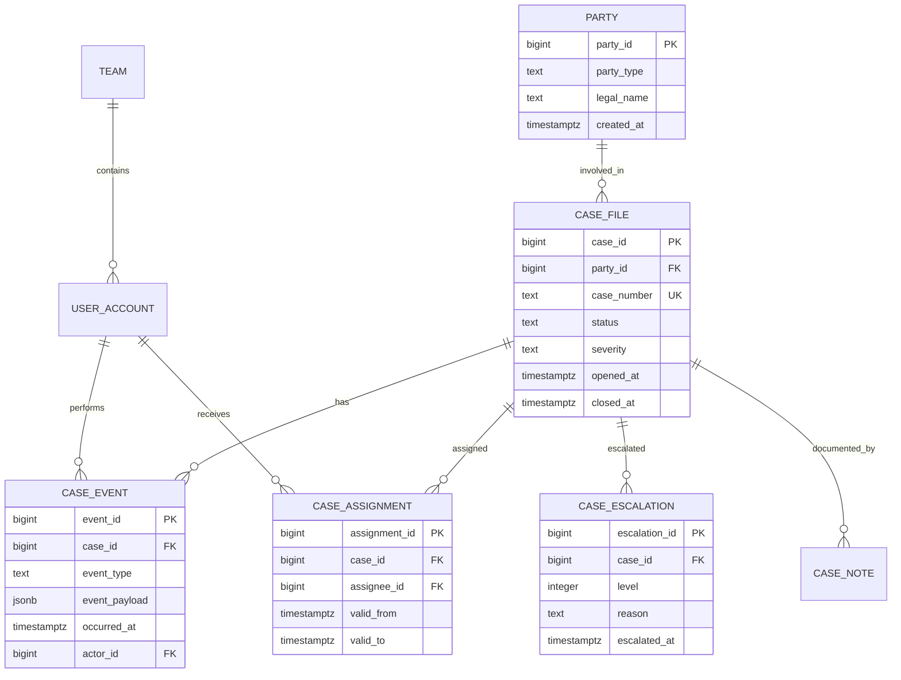
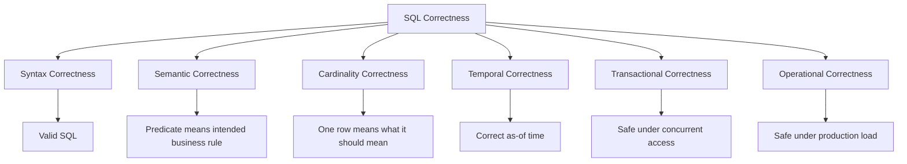

# Part 001 — Kaufman Skill Map and SQL Operating Model

## 1. Tujuan Part Ini

Part ini bukan pengenalan syntax SQL. Kita mulai dari peta skill.

SQL sering dipelajari dengan urutan yang keliru:

1. hafal `SELECT`, `JOIN`, `GROUP BY`,
2. bisa menulis query yang tampak benar,
3. lalu baru sadar di production bahwa query bisa salah secara semantic, lambat, tidak stabil saat data membesar, atau merusak invariant bisnis.

Pendekatan seri ini berbeda. Kita akan memperlakukan SQL sebagai **skill produksi**, bukan sekadar bahasa query.

Target akhirnya:

- mampu membaca kebutuhan bisnis menjadi model data relasional yang defensible;
- mampu menulis query yang benar secara semantic, bukan hanya menghasilkan row;
- mampu membaca execution plan dan memahami trade-off optimizer;
- mampu mendesain index berdasarkan workload, bukan berdasarkan tebakan;
- mampu memahami transaksi, isolation, locking, MVCC, deadlock, dan anomaly;
- mampu mengoperasikan SQL dalam sistem nyata: migration, auditability, security, observability, reporting, CDC, dan failure recovery;
- mampu menjelaskan keputusan database secara architectural, operational, dan regulatory.

Kita memakai framework dari Josh Kaufman dalam *The First 20 Hours*: deconstruct skill, learn enough to self-correct, remove practice barriers, practice deliberately, dan gunakan feedback cepat. Dalam konteks SQL, feedback-nya bukan perasaan “query jalan”, melainkan:

- hasil query benar atau tidak terhadap test data;
- constraint berhasil menjaga invariant atau tidak;
- execution plan masuk akal atau tidak;
- runtime stabil saat cardinality berubah atau tidak;
- transaksi aman terhadap race condition atau tidak;
- query tetap maintainable saat requirement berubah atau tidak.

> **Mental model utama:** SQL bukan alat mengambil data dari tabel. SQL adalah bahasa deklaratif untuk menyatakan transformasi atas relasi, sementara engine memilih cara eksekusinya.

---

## 2. Posisi SQL Dalam Skill Software Engineer

Banyak engineer menganggap database sebagai detail persistence. Itu asumsi lemah.

Dalam sistem produksi, database sering menjadi:

- pusat kebenaran transaksi;
- batas konsistensi;
- sumber audit;
- bottleneck performa;
- tempat invariant bisnis paling mahal jika salah;
- lapisan yang paling sulit diubah setelah data tumbuh;
- titik temu backend, analytics, compliance, support, dan operasi.

SQL bukan hanya digunakan untuk CRUD. SQL digunakan untuk:

| Area | Contoh Pekerjaan Nyata |
|---|---|
| OLTP | create case, update status, assign owner, process payment, lock inventory |
| OLAP | cohort, funnel, retention, SLA, regulatory report, anomaly analysis |
| Data quality | duplicate detection, orphan detection, reconciliation, completeness check |
| Operations | slow query debugging, lock investigation, bloat analysis, migration verification |
| Security | row-level access, tenant isolation, masking, audit trail |
| Architecture | outbox pattern, CDC, read model, materialized view, consistency boundary |
| Governance | schema evolution, data lineage, historical reconstruction, defensible reporting |

Top-level engineer tidak cukup hanya bertanya: “query-nya apa?”

Pertanyaan yang lebih kuat:

- Apa relasi yang sedang dimodelkan?
- Apa invariant yang harus tidak boleh rusak?
- Query ini menghitung fakta atau menghitung artifact dari join yang salah?
- Bagaimana cardinality berubah ketika data naik 100x?
- Apakah index ini membantu read path tapi merusak write path?
- Apakah transaksi ini aman terhadap concurrent writer?
- Apakah laporan ini bisa direkonstruksi 3 tahun lagi?
- Apakah migration ini aman saat dua versi aplikasi berjalan bersamaan?

---

## 3. Kaufman Framework Untuk SQL

Kaufman tidak mengajarkan “belajar sedikit lalu berhenti”. Ia mengajarkan cara melewati fase awal yang paling lambat dengan latihan terarah. Untuk SQL, kita adaptasikan menjadi lima langkah.

### 3.1 Deconstruct the Skill

“Belajar SQL” terlalu luas. Skill ini harus dipecah.

```mermaid
graph TD
    A[SQL in Action] --> B[Relational Thinking]
    A --> C[Query Semantics]
    A --> D[Data Modelling]
    A --> E[Optimizer Literacy]
    A --> F[Transactional Correctness]
    A --> G[Operational Database Engineering]
    A --> H[Security and Governance]
    A --> I[Analytics and Data Quality]

    B --> B1[Relation, tuple, attribute, domain]
    B --> B2[Predicate logic]
    B --> B3[Set vs bag]
    B --> B4[NULL and unknown]

    C --> C1[Filtering]
    C --> C2[Joins]
    C --> C3[Aggregation]
    C --> C4[Window functions]
    C --> C5[Set operations]

    D --> D1[Keys and constraints]
    D --> D2[Normalization]
    D --> D3[Temporal model]
    D --> D4[Lifecycle modelling]

    E --> E1[Index design]
    E --> E2[Cardinality estimation]
    E --> E3[Execution plans]
    E --> E4[Plan regression]

    F --> F1[ACID]
    F --> F2[Isolation anomalies]
    F --> F3[MVCC and locks]
    F --> F4[Deadlock and retry]

    G --> G1[Migration]
    G --> G2[Observability]
    G --> G3[Backup and recovery]
    G --> G4[Partitioning]
```



Skill SQL produksi adalah gabungan dari banyak sub-skill. Tidak semua harus dipelajari dengan kedalaman sama di awal. Kita perlu memilih sub-skill yang memberi leverage terbesar.

### 3.2 Learn Enough to Self-Correct

Tujuan awal bukan menghafal semua clause, semua vendor dialect, atau semua tipe index.

Tujuan awal adalah bisa melakukan self-correction:

- ketika query menghasilkan row terlalu banyak, tahu kemungkinan duplicate explosion;
- ketika `LEFT JOIN` berubah menjadi `INNER JOIN`, tahu predicate ditempatkan di lokasi yang salah;
- ketika `COUNT(*)` berbeda dari `COUNT(column)`, tahu hubungan dengan NULL;
- ketika index tidak dipakai, tahu memeriksa sargability, statistics, selectivity, dan cost;
- ketika transaksi kadang gagal, tahu membedakan deadlock, serialization failure, timeout, dan lost update;
- ketika laporan berubah setelah backfill, tahu membedakan fact correction, late-arriving data, dan query non-deterministic.

Self-correction adalah titik penting. Tanpa itu, engineer hanya mencoba-coba query sampai “kelihatannya benar”.

### 3.3 Remove Barriers to Practice

SQL sulit dipelajari jika semua latihan bergantung pada production database, data sensitif, atau environment berat.

Untuk seri ini, friction harus ditekan:

- gunakan database lokal;
- siapkan dataset kecil tapi kaya edge case;
- buat query test case;
- biasakan membaca plan sejak awal;
- gunakan seed data yang sengaja mengandung NULL, duplicate, missing relationship, skew, dan historical state;
- dokumentasikan assumption setiap query.

Minimal environment:

```bash
# PostgreSQL via Docker

docker run --name sql-in-action-postgres \
  -e POSTGRES_PASSWORD=postgres \
  -e POSTGRES_DB=sql_in_action \
  -p 5432:5432 \
  -d postgres:latest
```

Kita akan cenderung memakai PostgreSQL sebagai reference engine karena dokumentasinya terbuka, fitur SQL-nya kaya, dan behavior-nya bagus untuk mempelajari planner, MVCC, isolation, CTE, window function, partial index, expression index, JSON, dan extension. Namun seri ini bukan “PostgreSQL only”. Kita akan tetap membahas portabilitas dan perbedaan vendor.

### 3.4 Practice Deliberately

Latihan SQL yang lemah biasanya berbentuk:

> “Buat query untuk menampilkan daftar customer.”

Latihan SQL yang kuat berbentuk:

> “Buat query untuk menghitung jumlah case aktif per escalation level, dengan syarat status historis tidak boleh double count, case yang sedang reassigned harus tetap dihitung ke owner lama sampai commit, dan hasil harus stabil saat ada case tanpa assignment.”

Latihan kuat memiliki:

- expected result;
- edge case;
- invariant;
- performance expectation;
- concurrency assumption;
- explain plan;
- failure mode.

Kita akan memakai pola latihan seperti ini:

```sql
-- 1. State the business question.
-- 2. State the expected grain.
-- 3. State the invariant.
-- 4. Write the query.
-- 5. Validate row count.
-- 6. Validate duplicates.
-- 7. Validate NULL behavior.
-- 8. Read execution plan.
-- 9. Test with skewed data.
-- 10. Document limitation.
```

### 3.5 Build Fast Feedback Loops

Feedback loop SQL terdiri dari beberapa level.

| Feedback | Pertanyaan | Tool / Teknik |
|---|---|---|
| Syntax feedback | Apakah query valid? | parser error, SQL client |
| Semantic feedback | Apakah hasil benar? | expected rows, test fixture |
| Data-shape feedback | Apakah grain benar? | row count, duplicate check, cardinality check |
| Performance feedback | Apakah plan masuk akal? | `EXPLAIN`, `EXPLAIN ANALYZE` |
| Operational feedback | Apakah aman di production? | slow log, lock wait, wait event, monitoring |
| Evolution feedback | Apakah aman saat schema berubah? | migration test, backward compatibility test |

Kesalahan umum adalah berhenti di feedback syntax.

Engineer kuat minimal mengecek semantic, data shape, dan plan.

---

## 4. Apa Itu “SQL in Action”?

Dalam seri ini, “SQL in Action” berarti SQL yang dipakai untuk menyelesaikan masalah sistem nyata.

Bukan:

```sql
SELECT * FROM users;
```

Tetapi:

```sql
SELECT
    c.owner_id,
    COUNT(*) FILTER (WHERE c.status = 'OPEN') AS open_cases,
    COUNT(*) FILTER (WHERE c.status = 'ESCALATED') AS escalated_cases,
    percentile_cont(0.95) WITHIN GROUP (
        ORDER BY EXTRACT(EPOCH FROM now() - c.created_at)
    ) AS p95_age_seconds
FROM cases c
WHERE c.deleted_at IS NULL
GROUP BY c.owner_id;
```

Lalu kita bertanya:

- Apakah `status` menyimpan current state atau derived dari event history?
- Apakah `deleted_at IS NULL` benar untuk audit/reporting?
- Apakah `now()` membuat hasil non-repeatable dalam report?
- Apakah `owner_id` boleh NULL?
- Apakah case reassignment perlu historical owner?
- Apakah percentile ini portable antar database?
- Apakah index mendukung filter dan grouping ini?
- Apakah query ini aman untuk dashboard tiap 5 detik?

SQL in Action adalah kemampuan melihat query sebagai bagian dari sistem.

---

## 5. SQL Sebagai Bahasa Deklaratif

Dalam bahasa imperative, kita menjelaskan langkah:

```java
for (Order order : orders) {
    if (order.status().equals("PAID")) {
        total = total.add(order.amount());
    }
}
```

Dalam SQL, kita menjelaskan hasil yang diinginkan:

```sql
SELECT SUM(amount)
FROM orders
WHERE status = 'PAID';
```

SQL engine menentukan cara eksekusinya:

- full table scan;
- index scan;
- bitmap scan;
- parallel scan;
- aggregation strategy;
- predicate pushdown;
- join order;
- sort or hash operation;
- memory vs disk spill.

Ini sangat penting. SQL adalah kontrak intent, bukan instruksi step-by-step.



Konsekuensinya:

1. dua query yang tampak berbeda bisa dieksekusi dengan plan yang sama;
2. dua query yang tampak mirip bisa punya plan yang sangat berbeda;
3. urutan clause yang kita tulis bukan selalu urutan fisik eksekusi;
4. engine boleh mengubah join order jika semantic tetap sama;
5. optimizer hanya sebaik informasi statistik dan model biaya yang dimilikinya;
6. SQL correctness harus dinilai dari semantic, bukan dari intuisi procedural.

---

## 6. Operating Model SQL Untuk Engineer

Kita butuh model kerja standar saat menghadapi masalah SQL.

### 6.1 Six-Layer SQL Operating Model



Setiap layer memiliki pertanyaan inti.

### Layer 1 — Business Question

Pertanyaan utama:

- Fakta apa yang ingin diketahui atau dimutasi?
- Grain hasilnya apa?
- Satu row mewakili apa?
- Apakah ini current state, historical state, atau derived state?
- Apakah definisi bisnisnya stabil?

Contoh buruk:

> “Ambil semua customer yang aktif.”

Contoh lebih kuat:

> “Ambil satu row per customer yang memiliki subscription dengan `status = ACTIVE` pada tanggal laporan, belum melewati `valid_to`, tidak sedang dalam grace period expired, dan bukan test account.”

### Layer 2 — Relational Model

Pertanyaan utama:

- Entitas apa yang disimpan?
- Relationship-nya apa?
- Key-nya apa?
- Apakah dependency sudah benar?
- Constraint apa yang menjaga invariant?
- Apakah tabel menyimpan fact atau cache?

### Layer 3 — SQL Semantics

Pertanyaan utama:

- Apakah predicate benar terhadap NULL?
- Apakah join mengubah cardinality?
- Apakah aggregation sesuai grain?
- Apakah sorting deterministik?
- Apakah subquery correlated atau independent?
- Apakah result stabil jika data duplicate?

### Layer 4 — Execution Plan

Pertanyaan utama:

- Access path apa yang dipakai?
- Estimasi row vs actual row seberapa jauh?
- Join strategy apa yang dipilih?
- Apakah ada sort besar?
- Apakah ada hash spill?
- Apakah index membantu atau hanya menambah write cost?

### Layer 5 — Transactional Behavior

Pertanyaan utama:

- Transaction boundary-nya di mana?
- Isolation level apa yang berjalan?
- Apakah ada lost update?
- Apakah read harus repeatable?
- Apakah write order bisa deadlock?
- Apakah retry aman?

### Layer 6 — Operational Reality

Pertanyaan utama:

- Apakah query ini aman saat data 100x?
- Apakah query ini mengganggu writer?
- Apakah bisa dipantau?
- Apakah migration-nya backward compatible?
- Apakah data bisa direcover?
- Apakah hasil bisa diaudit?

### Layer 7 — Evidence and Documentation

Tambahan penting untuk engineer senior:

- Simpan assumption.
- Simpan sample input/output.
- Simpan explain plan penting.
- Simpan alasan index.
- Simpan alasan isolation.
- Simpan limitation query.
- Simpan rollback strategy migration.

Engineering yang defensible bukan hanya “benar”, tetapi bisa dibuktikan benar dalam konteks tertentu.

---

## 7. Skill Target: Dari Beginner Ke Production-Level

Kita definisikan level skill agar progres bisa dinilai.

### 7.1 Level 0 — Syntax User

Ciri:

- bisa `SELECT`, `WHERE`, `JOIN`, `GROUP BY`;
- sering memakai `SELECT *`;
- belum paham NULL dan duplicate;
- belum membaca execution plan;
- menganggap query benar jika tidak error.

Risiko:

- data salah tanpa sadar;
- query lambat saat data tumbuh;
- salah join;
- aggregation double count;
- race condition pada update.

### 7.2 Level 1 — Query Writer

Ciri:

- paham logical query processing;
- bisa join beberapa tabel;
- bisa aggregation dan window dasar;
- mulai paham index sederhana;
- bisa debug query lambat sederhana.

Risiko tersisa:

- belum kuat di cardinality estimation;
- belum kuat di transaksi;
- belum kuat di modelling;
- belum kuat di migration dan operability.

### 7.3 Level 2 — Data Correctness Engineer

Ciri:

- selalu bertanya grain;
- bisa mendeteksi duplicate explosion;
- memahami NULL dan three-valued logic;
- memakai constraint untuk invariant;
- membuat query validation;
- bisa menulis reconciliation SQL.

### 7.4 Level 3 — Performance-Aware Engineer

Ciri:

- membaca execution plan;
- memahami index access path;
- memahami selectivity dan cardinality;
- bisa membedakan estimated vs actual row;
- bisa menghindari non-sargable predicate;
- mengerti cost read vs write.

### 7.5 Level 4 — Transactional Systems Engineer

Ciri:

- memahami ACID dan isolation anomaly;
- bisa mendesain update aman;
- bisa membaca lock wait dan deadlock;
- bisa membuat retry policy;
- memahami MVCC dan snapshot;
- tahu kapan perlu serializable, optimistic locking, pessimistic lock, atau application-level invariant.

### 7.6 Level 5 — Database Architect

Ciri:

- bisa mendesain schema untuk lifecycle kompleks;
- bisa memutuskan normalized vs denormalized;
- bisa mendesain audit dan temporal model;
- bisa membuat migration zero-downtime;
- bisa menentukan consistency boundary;
- bisa menghubungkan SQL dengan eventing, CDC, outbox, cache, analytics, security, dan governance.

Target seri ini adalah membawa kita minimal ke Level 4 dengan jalur menuju Level 5.

---

## 8. Core Invariants Dalam SQL Work

SQL production harus selalu dijaga oleh invariant. Invariant adalah kondisi yang harus selalu benar.

Contoh invariant:

- setiap invoice punya tepat satu customer;
- invoice yang sudah paid tidak boleh kembali menjadi draft tanpa reversal record;
- satu case hanya boleh punya satu active assignment;
- escalation level harus monoton naik kecuali ada explicit reset event;
- effective period tidak boleh overlap untuk policy yang sama;
- account balance tidak boleh negatif kecuali account type mengizinkan overdraft;
- audit event tidak boleh diubah setelah ditulis;
- soft-deleted row tidak boleh muncul di user-facing active view;
- report bulanan harus bisa direkonstruksi berdasarkan as-of date.

Invariant bisa dijaga di beberapa tempat:

| Lokasi | Contoh | Kelebihan | Risiko |
|---|---|---|---|
| Application code | service validation | fleksibel | bisa bypass oleh job/script/service lain |
| Database constraint | FK, UNIQUE, CHECK | kuat dan dekat data | tidak semua invariant mudah diekspresikan |
| Transaction logic | lock, serializable, conditional update | menjaga race condition | kompleks dan perlu retry |
| Trigger/procedure | audit, derived data | otomatis | tersembunyi, sulit dites jika berlebihan |
| Batch validation | reconciliation query | bagus untuk deteksi drift | reactive, bukan preventive |

Engineer kuat tidak fanatik satu lokasi. Ia menempatkan invariant sesuai konsekuensi failure.

---

## 9. SQL Learning Dataset: Case Management Domain

Agar seri tidak abstrak, kita akan sering memakai domain **case management / enforcement lifecycle**. Domain ini kaya masalah SQL nyata:

- entity lifecycle;
- assignment;
- escalation;
- audit trail;
- temporal state;
- SLA;
- actor/role;
- state transition;
- regulatory report;
- evidence attachment;
- immutable events;
- operational dashboard.

### 9.1 Domain Mini



Kita sengaja memilih domain yang menuntut relational discipline. Domain seperti ini tidak bisa diselesaikan hanya dengan CRUD sederhana.

### 9.2 Pertanyaan Yang Akan Kita Jawab Sepanjang Seri

Contoh:

- Berapa case aktif per severity dan owner?
- Case mana yang melanggar SLA berdasarkan status saat ini?
- Siapa owner case pada tanggal tertentu?
- Apakah ada case dengan dua active assignment?
- Apakah escalation level pernah turun tanpa reset event?
- Bagaimana menghitung median time-to-resolution?
- Bagaimana membuat laporan bulanan yang tidak berubah walaupun data diperbaiki bulan depan?
- Bagaimana mendesain index untuk dashboard case aktif?
- Bagaimana mencegah dua worker mengambil case yang sama?
- Bagaimana migrasi `status` dari column sederhana menjadi state history tanpa downtime?

---

## 10. The SQL Correctness Stack

Query benar tidak cukup hanya return data. Kita perlu lapisan correctness.



### 10.1 Syntax Correctness

Query valid menurut parser.

Ini level terendah.

```sql
SELECT case_id, status
FROM case_file
WHERE status = 'OPEN';
```

### 10.2 Semantic Correctness

Query menjawab pertanyaan yang dimaksud.

```sql
-- Apakah OPEN cukup?
-- Bagaimana dengan REOPENED?
-- Bagaimana dengan status NULL akibat migration?
-- Bagaimana dengan soft-deleted case?
```

### 10.3 Cardinality Correctness

Setiap row hasil punya grain yang benar.

```sql
-- Jika satu case punya banyak assignment history,
-- join langsung bisa menggandakan case.
SELECT c.case_id, a.assignee_id
FROM case_file c
JOIN case_assignment a ON a.case_id = c.case_id
WHERE c.status = 'OPEN';
```

Jika requirement-nya satu row per active case, query di atas belum aman tanpa filter current assignment.

### 10.4 Temporal Correctness

Query harus jelas waktu kebenarannya.

```sql
-- Current truth?
WHERE valid_to IS NULL

-- As-of truth?
WHERE valid_from <= :as_of
  AND (valid_to > :as_of OR valid_to IS NULL)
```

### 10.5 Transactional Correctness

Mutasi harus aman saat ada concurrency.

```sql
-- Risky read-modify-write if concurrent workers run this.
SELECT status FROM case_file WHERE case_id = 42;
UPDATE case_file SET status = 'IN_PROGRESS' WHERE case_id = 42;
```

Lebih baik memakai conditional update atau locking pattern yang eksplisit.

### 10.6 Operational Correctness

Query harus aman untuk production.

```sql
-- Query ini bisa benar tapi berbahaya jika table besar.
SELECT *
FROM case_event
WHERE event_payload::text LIKE '%fraud%';
```

Masalahnya:

- full scan besar;
- cast membuat index sulit dipakai;
- pattern contains mahal;
- bisa mengganggu workload OLTP;
- hasil tidak punya semantic kuat jika JSON berubah.

---

## 11. Query Development Protocol

Gunakan protocol ini setiap kali membuat query penting.

### 11.1 Protocol

```text
1. Define business question.
2. Define grain.
3. Identify source tables.
4. Identify mandatory relationships.
5. Identify optional relationships.
6. Write minimal query.
7. Add predicates intentionally.
8. Validate row count.
9. Validate duplicates.
10. Validate NULL behavior.
11. Validate edge cases.
12. Read execution plan.
13. Add or adjust index only if workload justifies it.
14. Document assumptions.
```

### 11.2 Example: Active Case Count

Business question:

> Hitung jumlah case aktif per severity untuk dashboard operasional.

Weak query:

```sql
SELECT severity, COUNT(*)
FROM case_file
GROUP BY severity;
```

Masalah:

- closed case ikut terhitung;
- deleted case ikut terhitung;
- severity NULL membentuk bucket sendiri;
- tidak jelas current time;
- tidak jelas apakah reopened dihitung aktif.

Better query:

```sql
SELECT
    COALESCE(severity, 'UNCLASSIFIED') AS severity_bucket,
    COUNT(*) AS active_case_count
FROM case_file
WHERE status IN ('OPEN', 'IN_REVIEW', 'ESCALATED', 'REOPENED')
  AND closed_at IS NULL
GROUP BY COALESCE(severity, 'UNCLASSIFIED')
ORDER BY active_case_count DESC, severity_bucket ASC;
```

Tapi masih ada pertanyaan:

- Apakah `status` dan `closed_at` bisa inconsistent?
- Apakah active status seharusnya derived dari event terakhir?
- Apakah `REOPENED` selalu `closed_at IS NULL`?
- Apakah status valid dijaga constraint?

SQL kuat selalu memunculkan pertanyaan model.

---

## 12. SQL as Evidence

Dalam sistem regulasi, finansial, audit, atau case management, query adalah evidence.

Query yang baik harus bisa menjawab:

- input data apa yang dipakai;
- definisi business rule apa yang diterapkan;
- join apa yang mandatory vs optional;
- row apa yang dikecualikan;
- bagaimana waktu laporan ditentukan;
- apakah hasil deterministic;
- apakah data historis bisa direkonstruksi;
- apakah query pernah berubah;
- siapa yang menjalankan;
- hasilnya diverifikasi dengan apa.

Contoh dokumentasi query:

```sql
/*
Purpose:
  Monthly active enforcement case report.

Grain:
  One row per case_id that was active at :report_as_of.

Active definition:
  A case is active if it has been opened on or before :report_as_of
  and has no close event on or before :report_as_of.

Exclusions:
  Test cases, duplicate cases marked as merged, and cases sealed by court order.

Known limitations:
  Late-arriving events after report freeze are excluded unless report is regenerated.
*/
SELECT ...
```

Ini bukan formalitas. Ini mengurangi risiko interpretasi salah.

---

## 13. Anti-Patterns Yang Akan Kita Hancurkan

Seri ini akan berulang kali melawan anti-pattern berikut.

### 13.1 “Query Jalan Berarti Benar”

Salah. Query bisa valid tapi semantic-nya salah.

### 13.2 “JOIN Itu Cuma Menghubungkan Tabel”

Join mengubah cardinality. Join bisa menggandakan fakta, menghilangkan row, atau membuat NULL-extension yang mempengaruhi aggregation.

### 13.3 “Index Membuat Query Cepat”

Index bisa mempercepat read path tertentu, tetapi memperlambat write, memperbesar storage, menambah maintenance, dan belum tentu dipakai optimizer.

### 13.4 “NULL Sama Dengan Kosong”

NULL berarti unknown / missing / not applicable tergantung model. Kesalahan NULL sering menghasilkan bug silent.

### 13.5 “ORM Membuat SQL Tidak Penting”

ORM tetap menghasilkan SQL. Ketika data membesar, abstraction leak. Engineer harus bisa membaca SQL yang dihasilkan ORM.

### 13.6 “Transaction Default Sudah Aman”

Default isolation tidak selalu melindungi semua invariant. Banyak anomaly muncul hanya di concurrency.

### 13.7 “Report Bisa Dari Current Table Saja”

Report historis butuh temporal model. Current table sering tidak cukup untuk reconstruct past truth.

### 13.8 “Migration Tinggal ALTER TABLE”

DDL bisa lock, rewrite table, merusak backward compatibility, atau membuat dua versi aplikasi tidak kompatibel.

---

## 14. Practice System: 20 Jam Pertama

Walaupun seri ini panjang, Kaufman menekankan komitmen awal yang konkret. Berikut rancangan 20 jam pertama untuk SQL in Action.

| Jam | Fokus | Output Praktik |
|---:|---|---|
| 1 | Setup database lokal dan schema mini | DB berjalan, tabel case domain dibuat |
| 2 | Relational model | tulis grain dan key tiap tabel |
| 3 | Basic SELECT semantics | 10 query filter dengan expected result |
| 4 | NULL and predicates | test `NULL`, `IS NULL`, `IS DISTINCT FROM` |
| 5 | Join correctness | inner vs left join dengan row count check |
| 6 | Duplicate explosion | query yang sengaja salah lalu diperbaiki |
| 7 | Aggregation correctness | count, sum, group by, denominator check |
| 8 | Window functions | latest row per group, ranking, running total |
| 9 | Set operations | reconciliation query dengan EXCEPT/INTERSECT |
| 10 | Constraints | PK, FK, UNIQUE, CHECK untuk invariant |
| 11 | Index basics | index sederhana dan plan comparison |
| 12 | Composite index | predicate order dan index prefix |
| 13 | EXPLAIN | baca scan, join, sort, aggregate |
| 14 | Statistics and skew | dataset skew dan misestimate sederhana |
| 15 | Transaction basics | commit, rollback, savepoint |
| 16 | Isolation anomaly | lost update / write skew simulation |
| 17 | Locking | row lock, lock wait, timeout |
| 18 | Migration | expand-contract mini migration |
| 19 | Data quality assertions | duplicate/orphan/reconciliation checks |
| 20 | Capstone mini | active case dashboard + plan + validation |

Hasil 20 jam bukan “menguasai SQL sepenuhnya”. Hasil yang realistis adalah:

- bisa menulis query yang benar untuk masalah menengah;
- bisa menemukan bug semantic umum;
- bisa membaca plan dasar;
- bisa memahami mengapa transaksi bisa gagal;
- punya peta untuk naik ke skill advanced.

---

## 15. Minimum Working Knowledge Sebelum Deep Dive

Sebelum masuk part berikutnya, pastikan istilah ini punya definisi awal.

| Istilah | Definisi Kerja |
|---|---|
| Relation | himpunan tuple dengan attribute bernama; dalam SQL praktis direpresentasikan sebagai table/result set, tetapi SQL umumnya memakai bag semantics |
| Tuple | satu record/row konseptual dalam relation |
| Attribute | column bernama dengan domain nilai |
| Domain | himpunan nilai valid untuk attribute |
| Predicate | ekspresi yang dapat bernilai true/false/unknown untuk menentukan membership row |
| Key | attribute atau kombinasi attribute yang mengidentifikasi tuple |
| Constraint | aturan yang dipaksa oleh database untuk menjaga invariant |
| Cardinality | jumlah row atau estimasi jumlah row pada operasi tertentu |
| Selectivity | proporsi row yang lolos predicate |
| Sargability | kemampuan predicate dipakai sebagai search argument oleh index/access path |
| Transaction | unit kerja yang commit atau rollback sebagai satu kesatuan |
| Isolation | aturan visibility antar transaksi concurrent |
| Plan | strategi fisik engine untuk mengeksekusi query |
| Statistics | metadata distribusi data yang dipakai optimizer |

---

## 16. SQL Problem Framing Template

Gunakan template ini saat menghadapi task SQL.

```md
## SQL Task Framing

### Business Question
Apa pertanyaan atau mutasi bisnis yang diminta?

### Grain
Satu row hasil mewakili apa?

### Source of Truth
Tabel/relasi mana yang menjadi sumber kebenaran?

### Required Relationships
Join mana yang mandatory?

### Optional Relationships
Join mana yang optional?

### Time Semantics
Current, as-of, valid-time, transaction-time, atau report freeze?

### NULL Semantics
NULL berarti unknown, not applicable, not collected, atau invalid?

### Cardinality Risk
Di mana row bisa duplicate atau hilang?

### Transaction Risk
Apakah ada concurrent read/write yang mempengaruhi hasil?

### Performance Risk
Predicate, join, sort, atau aggregation mana yang berisiko mahal?

### Evidence
Bagaimana query divalidasi?
```

---

## 17. Example: Weak vs Strong SQL Thinking

### 17.1 Task

> Tampilkan case yang belum ditangani.

### 17.2 Weak Interpretation

```sql
SELECT *
FROM case_file
WHERE status = 'OPEN';
```

### 17.3 Strong Interpretation

Pertanyaan balik yang harus muncul:

- “Belum ditangani” berarti belum punya assignment, belum punya first action, atau belum ada status transition?
- Apakah case reopened dihitung belum ditangani?
- Apakah case assigned tapi assignee inactive termasuk belum ditangani?
- Apakah case yang sedang dalam queue otomatis dianggap belum ditangani?
- Apakah ada SLA clock?
- Apakah query untuk dashboard current atau historical report?

Possible query untuk definisi tertentu:

```sql
SELECT
    c.case_id,
    c.case_number,
    c.severity,
    c.opened_at,
    now() - c.opened_at AS waiting_duration
FROM case_file c
WHERE c.status IN ('OPEN', 'REOPENED')
  AND NOT EXISTS (
      SELECT 1
      FROM case_assignment a
      WHERE a.case_id = c.case_id
        AND a.valid_to IS NULL
  )
ORDER BY c.opened_at ASC, c.case_id ASC;
```

Catatan:

- `NOT EXISTS` mengekspresikan anti-join: tidak ada active assignment.
- `valid_to IS NULL` menyatakan current assignment.
- `ORDER BY opened_at, case_id` membuat urutan deterministic.
- Query masih tergantung definisi status.

---

## 18. Production Checklist Untuk Query Penting

Sebelum query dipakai di production, minimal jawab checklist ini.

### 18.1 Correctness

- [ ] Apakah grain sudah jelas?
- [ ] Apakah join tidak menggandakan fakta?
- [ ] Apakah outer join tidak berubah akibat predicate di `WHERE`?
- [ ] Apakah NULL ditangani eksplisit?
- [ ] Apakah aggregation denominator benar?
- [ ] Apakah sorting deterministic?
- [ ] Apakah time semantics jelas?

### 18.2 Performance

- [ ] Apakah predicate sargable?
- [ ] Apakah index yang ada sesuai workload?
- [ ] Apakah plan membaca row terlalu banyak?
- [ ] Apakah ada sort/hash besar?
- [ ] Apakah query berpotensi spill ke disk?
- [ ] Apakah query aman jika data 10x / 100x?

### 18.3 Transaction and Operations

- [ ] Apakah query berjalan dalam transaksi panjang?
- [ ] Apakah query mengambil lock yang mengganggu writer?
- [ ] Apakah query bisa deadlock?
- [ ] Apakah retry aman?
- [ ] Apakah timeout sudah masuk akal?
- [ ] Apakah ada observability jika query lambat?

### 18.4 Evolution

- [ ] Apakah query bergantung pada enum/status yang bisa bertambah?
- [ ] Apakah query aman saat schema migration?
- [ ] Apakah query bisa diuji dengan fixture?
- [ ] Apakah assumption terdokumentasi?

---

## 19. How to Read This Series

Cara belajar yang disarankan:

1. baca part secara berurutan;
2. jalankan setiap query penting;
3. ubah data fixture untuk membuat query gagal;
4. tulis expected result sebelum menjalankan query;
5. baca execution plan meskipun query cepat;
6. catat assumption;
7. jangan lanjut jika belum bisa menjelaskan mengapa query benar.

SQL mastery tidak datang dari banyak membaca query. SQL mastery datang dari menghubungkan:

```text
business meaning
→ relational shape
→ SQL semantics
→ physical execution
→ transactional behavior
→ operational consequence
```

---

## 20. Summary

Dalam part ini, kita membangun operating model SQL:

- SQL adalah skill produksi, bukan sekadar syntax.
- Framework Kaufman dipakai untuk mempercepat fase awal dengan deconstruction, minimum useful theory, deliberate practice, friction removal, dan feedback loop.
- SQL harus dipelajari dari correctness, performance, transaction, dan operability secara bersamaan.
- Query harus selalu punya grain, invariant, time semantics, dan evidence.
- Engineer kuat tidak hanya menulis query; ia mampu membuktikan query benar dan aman dalam konteks sistem nyata.

Part berikutnya akan masuk ke fondasi paling penting: **relational model first principles**. Kita akan membongkar relation, tuple, attribute, domain, predicate, key, set vs bag, NULL, dan mengapa banyak bug SQL berasal dari mental model data yang salah.

---

## References

- Josh Kaufman, *The First 20 Hours: How to Learn Anything... Fast*, public book description: Google Books.
- WIRED UK, “How to learn a new skill in 20 hours”, summary of Kaufman's method.
- ISO/IEC 9075-1:2023, “Database languages SQL — Part 1: Framework”.
- PostgreSQL Documentation, SQL syntax, SELECT processing, table expressions, comparison predicates, and SQL conformance notes.
