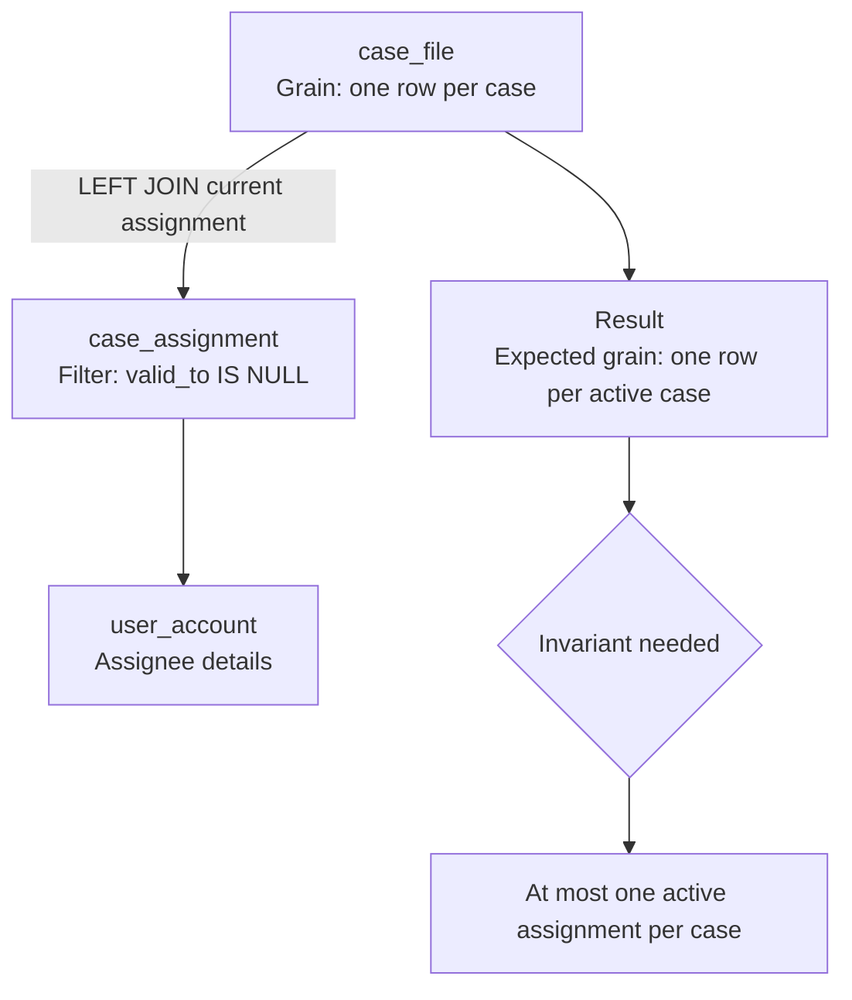

# Part 002 — Relational Model First Principles

## 1. Tujuan Part Ini

SQL lahir dari relational model. Jika relational model tidak dipahami, SQL akan terasa seperti kumpulan clause yang harus dihafal.

Part ini membangun fondasi:

- apa itu relation;
- apa itu tuple, attribute, dan domain;
- mengapa table bukan sekadar spreadsheet;
- mengapa row order tidak boleh diasumsikan;
- mengapa duplicate adalah masalah semantic;
- mengapa NULL membuat logika SQL berbeda dari boolean biasa;
- mengapa key dan constraint adalah bagian dari model, bukan dekorasi;
- bagaimana predicate menentukan membership dalam relation;
- bagaimana relational thinking membantu query correctness.

Setelah part ini, targetnya bukan sekadar tahu definisi. Targetnya adalah mampu melihat setiap tabel sebagai klaim formal tentang dunia.

> **Mental model utama:** Sebuah relation adalah kumpulan fakta yang memenuhi predicate tertentu. Query SQL adalah cara membentuk relation baru dari relation yang sudah ada.

---

## 2. Mengapa Relational Model Masih Penting

Relational model diperkenalkan oleh E. F. Codd pada 1970 untuk memisahkan cara pengguna memandang data dari cara data disimpan secara fisik. Ide ini penting karena aplikasi tidak seharusnya bergantung pada detail internal storage.

Dalam praktik modern, detail fisik tetap penting untuk performance. Namun correctness tetap dimulai dari model logical.

Tanpa relational model, engineer cenderung berpikir seperti ini:

```text
Database = tempat menyimpan object.
Table = class.
Row = object instance.
Foreign key = pointer.
Query = loop yang ditulis dalam SQL.
```

Model itu kadang membantu, tetapi sering menyesatkan.

Relational thinking lebih akurat:

```text
Database = kumpulan relasi yang menyatakan fakta.
Table = representasi relation dengan constraint.
Row = tuple/fact.
Column = attribute dengan domain.
Foreign key = referential assertion.
Query = transformasi deklaratif atas relation.
```

Perbedaan ini mempengaruhi desain schema, query, indexing, dan transaksi.

---

## 3. Relation, Tuple, Attribute, Domain

### 3.1 Relation

Secara konsep, relation adalah kumpulan tuple dengan attribute bernama. Relation memiliki heading dan body.

- **Heading**: nama attribute dan domain-nya.
- **Body**: kumpulan tuple yang memenuhi heading dan predicate relation.

Contoh relation konseptual:

```text
CaseFile(case_id, case_number, status, severity, opened_at, closed_at)
```

Predicate-nya:

```text
Ada sebuah case enforcement dengan identifier case_id,
nomor case_number, status saat ini, severity, waktu pembukaan,
dan optional waktu penutupan.
```

Setiap row dalam table `case_file` seharusnya adalah fakta yang membuat predicate itu benar.

### 3.2 Tuple

Tuple adalah satu fakta dalam relation.

Contoh:

```text
(101, 'CASE-2026-0001', 'OPEN', 'HIGH', '2026-07-01 09:15:00+07', NULL)
```

Tuple ini menyatakan:

> Ada case dengan id 101, nomor CASE-2026-0001, status OPEN, severity HIGH, dibuka pada waktu tertentu, dan belum punya waktu penutupan.

Jika `closed_at` bernilai NULL, kita harus tahu artinya. Apakah belum ditutup, tidak diketahui, tidak berlaku, atau belum dimigrasi? Model harus menjawab.

### 3.3 Attribute

Attribute adalah nama properti dalam relation.

Contoh attribute:

- `case_id`
- `case_number`
- `status`
- `severity`
- `opened_at`
- `closed_at`

Attribute bukan sekadar field. Attribute harus punya meaning dan domain.

### 3.4 Domain

Domain adalah himpunan nilai valid untuk attribute.

Contoh:

```text
status ∈ {'DRAFT', 'OPEN', 'IN_REVIEW', 'ESCALATED', 'CLOSED', 'REOPENED'}
severity ∈ {'LOW', 'MEDIUM', 'HIGH', 'CRITICAL'}
opened_at ∈ timestamp with time zone
```

Dalam SQL, domain bisa dijaga oleh:

- data type;
- `CHECK` constraint;
- `FOREIGN KEY` ke lookup table;
- enum type;
- application validation;
- trigger;
- generated column;
- row-level policy.

Semakin penting invariant-nya, semakin dekat ia sebaiknya dijaga ke data.

---

## 4. Table Bukan Spreadsheet

Spreadsheet sering punya implicit meaning:

- urutan row bermakna;
- cell kosong bisa berarti apa saja;
- duplicate bisa muncul tanpa konsekuensi formal;
- formula bisa tersembunyi;
- tipe data longgar;
- schema berubah bebas.

Table relasional seharusnya berbeda:

- row tidak punya urutan intrinsic;
- column punya domain;
- constraint menjaga invariant;
- key mengidentifikasi tuple;
- relationship diekspresikan secara eksplisit;
- query harus menyatakan order jika butuh urutan;
- NULL harus punya meaning yang jelas.

Kesalahan umum:

```sql
SELECT case_id, case_number
FROM case_file
LIMIT 10;
```

Tanpa `ORDER BY`, “10 row pertama” tidak punya makna bisnis yang stabil. Engine boleh mengembalikan row dalam urutan berbeda tergantung plan, index, vacuum, data layout, parallelism, atau versi engine.

Query yang lebih benar:

```sql
SELECT case_id, case_number
FROM case_file
ORDER BY opened_at DESC, case_id DESC
FETCH FIRST 10 ROWS ONLY;
```

Sekarang kita menyatakan maksud: 10 case terbaru berdasarkan `opened_at`, dengan tie-breaker `case_id`.

---

## 5. Predicate: Inti Dari Relational Thinking

Relation bisa dipahami sebagai predicate.

Contoh:

```sql
CREATE TABLE case_file (
    case_id      bigint PRIMARY KEY,
    case_number  text NOT NULL UNIQUE,
    status       text NOT NULL,
    severity     text,
    opened_at    timestamptz NOT NULL,
    closed_at    timestamptz,
    CHECK (status IN ('OPEN', 'IN_REVIEW', 'ESCALATED', 'CLOSED', 'REOPENED')),
    CHECK (closed_at IS NULL OR closed_at >= opened_at)
);
```

Predicate table ini kira-kira:

```text
case_file(case_id, case_number, status, severity, opened_at, closed_at)
benar jika ada sebuah case dengan identifier unik case_id,
nomor unik case_number, status valid, waktu buka tidak null,
dan jika ada waktu tutup maka waktu tutup tidak sebelum waktu buka.
```

Query `WHERE` juga predicate:

```sql
SELECT *
FROM case_file
WHERE status = 'OPEN'
  AND closed_at IS NULL;
```

Predicate-nya:

```text
Ambil tuple case_file yang status-nya OPEN dan belum punya closed_at.
```

Masalah muncul jika predicate SQL tidak sama dengan predicate bisnis.

Misalnya bisnis berkata:

> Active case adalah case yang belum punya close event efektif.

Maka column `status` mungkin bukan sumber kebenaran. Query harus memakai event history.

```sql
SELECT c.*
FROM case_file c
WHERE NOT EXISTS (
    SELECT 1
    FROM case_event e
    WHERE e.case_id = c.case_id
      AND e.event_type = 'CLOSED'
);
```

Ini berbeda dari `status = 'OPEN'`.

Relational thinking memaksa kita bertanya:

- relation apa yang menyatakan fakta utama?
- predicate apa yang membuat row menjadi anggota relation?
- apakah predicate query sama dengan predicate bisnis?

---

## 6. Set Semantics vs Bag Semantics

Relational model murni berbasis set: tidak ada duplicate tuple. SQL praktis memakai **bag semantics** secara default: duplicate row bisa muncul kecuali kita memakai `DISTINCT` atau constraint mencegahnya.

Contoh:

```sql
SELECT severity
FROM case_file;
```

Jika ada 100 case dengan severity `HIGH`, hasil bisa berisi `HIGH` 100 kali.

Jika ingin himpunan severity:

```sql
SELECT DISTINCT severity
FROM case_file;
```

### 6.1 Mengapa Ini Penting

Duplicate bukan sekadar tampilan. Duplicate bisa merusak metric.

Contoh schema:

```text
case_file
- case_id
- severity

case_assignment
- assignment_id
- case_id
- assignee_id
- valid_from
- valid_to
```

Query buruk:

```sql
SELECT
    c.severity,
    COUNT(*) AS case_count
FROM case_file c
JOIN case_assignment a ON a.case_id = c.case_id
WHERE c.status = 'OPEN'
GROUP BY c.severity;
```

Jika satu case punya tiga assignment history, case itu dihitung tiga kali.

Query lebih benar jika butuh active assignment:

```sql
SELECT
    c.severity,
    COUNT(*) AS case_count
FROM case_file c
JOIN case_assignment a
  ON a.case_id = c.case_id
 AND a.valid_to IS NULL
WHERE c.status = 'OPEN'
GROUP BY c.severity;
```

Tetapi query ini masih bergantung pada invariant:

> satu case hanya boleh punya satu active assignment.

Invariant itu sebaiknya dijaga dengan constraint atau validation query.

Di PostgreSQL, partial unique index bisa mengekspresikan invariant ini:

```sql
CREATE UNIQUE INDEX uq_case_assignment_one_active
ON case_assignment (case_id)
WHERE valid_to IS NULL;
```

Di engine lain, pendekatannya bisa berbeda.

---

## 7. Grain: Satu Row Berarti Apa?

Grain adalah konsep paling penting dalam SQL analytics dan reporting.

Grain menjawab:

> Satu row dalam result set mewakili apa?

Contoh:

```sql
SELECT
    c.case_id,
    c.case_number,
    a.assignee_id
FROM case_file c
JOIN case_assignment a ON a.case_id = c.case_id;
```

Grain result bukan “satu row per case”. Grain-nya adalah:

```text
satu row per pasangan case dan assignment
```

Jika assignment history ada banyak, case muncul banyak kali.

### 7.1 Grain Mismatch

Task:

> Tampilkan satu row per active case dengan current owner.

Query salah:

```sql
SELECT
    c.case_id,
    c.case_number,
    a.assignee_id
FROM case_file c
LEFT JOIN case_assignment a ON a.case_id = c.case_id
WHERE c.status = 'OPEN';
```

Masalah:

- semua assignment history ikut;
- row duplicate;
- current owner tidak jelas.

Query lebih tepat:

```sql
SELECT
    c.case_id,
    c.case_number,
    a.assignee_id AS current_assignee_id
FROM case_file c
LEFT JOIN case_assignment a
  ON a.case_id = c.case_id
 AND a.valid_to IS NULL
WHERE c.status = 'OPEN';
```

Tapi lagi-lagi perlu invariant satu active assignment.

### 7.2 Grain Checklist

Sebelum menulis query, tulis satu kalimat:

```text
Satu row hasil query ini mewakili ________.
```

Contoh:

- satu row per case;
- satu row per case per current assignee;
- satu row per case per event;
- satu row per assignee per day;
- satu row per severity bucket;
- satu row per party per active case;
- satu row per case per valid time interval.

Jika kalimat ini tidak jelas, query akan rapuh.

---

## 8. Keys: Identity, Uniqueness, and Meaning

Key adalah attribute atau kombinasi attribute yang mengidentifikasi tuple.

### 8.1 Candidate Key

Candidate key adalah satu atau lebih attribute yang secara logis unik.

Contoh:

- `case_id`
- `case_number`

Keduanya bisa unik. Salah satunya dipilih sebagai primary key, yang lain bisa menjadi alternate key via unique constraint.

### 8.2 Primary Key

Primary key adalah key utama yang dipakai database untuk mengidentifikasi row.

```sql
CREATE TABLE case_file (
    case_id bigint PRIMARY KEY,
    case_number text NOT NULL UNIQUE
);
```

Primary key harus:

- unik;
- stabil;
- non-null;
- tidak berubah tanpa alasan kuat;
- tidak membawa meaning yang mudah berubah jika dipakai sebagai surrogate key.

### 8.3 Natural Key vs Surrogate Key

Natural key berasal dari domain bisnis.

Contoh:

- `case_number`
- `tax_identifier`
- `email` pada konteks tertentu
- `policy_number`

Surrogate key dibuat sistem.

Contoh:

- `case_id bigint`
- `uuid`

Trade-off:

| Key Type | Kelebihan | Risiko |
|---|---|---|
| Natural key | bermakna, bisa mencegah duplicate bisnis | bisa berubah, format bisa berganti, composite, sensitif |
| Surrogate key | stabil, kecil, mudah jadi FK | tidak mencegah duplicate bisnis tanpa unique constraint tambahan |

Pattern kuat:

```sql
CREATE TABLE case_file (
    case_id bigint GENERATED ALWAYS AS IDENTITY PRIMARY KEY,
    case_number text NOT NULL,
    created_at timestamptz NOT NULL DEFAULT now(),
    UNIQUE (case_number)
);
```

Gunakan surrogate key untuk referential stability, tetapi tetap jaga natural uniqueness dengan constraint.

### 8.4 Foreign Key

Foreign key bukan pointer biasa. Foreign key adalah assertion bahwa nilai di child table harus merujuk parent yang valid.

```sql
CREATE TABLE case_event (
    event_id bigint GENERATED ALWAYS AS IDENTITY PRIMARY KEY,
    case_id bigint NOT NULL REFERENCES case_file(case_id),
    event_type text NOT NULL,
    occurred_at timestamptz NOT NULL
);
```

Artinya:

> Setiap event harus milik case yang ada.

Tanpa FK, database bisa memiliki orphan event.

```sql
SELECT e.*
FROM case_event e
LEFT JOIN case_file c ON c.case_id = e.case_id
WHERE c.case_id IS NULL;
```

Query di atas adalah validation reactive. FK adalah prevention.

---

## 9. Functional Dependency

Functional dependency adalah hubungan di mana satu attribute menentukan attribute lain.

Notation:

```text
case_id → case_number, status, severity, opened_at
case_number → case_id, status, severity, opened_at
```

Jika `case_id` menentukan `case_number`, maka untuk satu `case_id` tidak boleh ada dua `case_number` berbeda.

Functional dependency penting untuk:

- normalization;
- menghindari redundancy;
- menentukan key;
- memahami aggregation;
- menghindari update anomaly.

### 9.1 Dependency Violation Example

Table buruk:

```text
case_assignment_report(
  case_id,
  case_number,
  assignee_id,
  assignee_name,
  team_id,
  team_name
)
```

Dependency:

```text
case_id → case_number
assignee_id → assignee_name, team_id
t team_id → team_name
```

Jika table ini menyimpan data denormalized, perubahan `team_name` harus update banyak row. Jika tidak, data drift.

Denormalization boleh, tapi harus sadar konsekuensi:

- source of truth mana?
- kapan sync?
- bagaimana validation?
- apakah stale value diterima?
- apakah report butuh snapshot historical?

---

## 10. NULL: Unknown, Missing, Not Applicable

NULL adalah salah satu sumber bug SQL terbesar.

Dalam SQL, NULL bukan string kosong, bukan nol, dan bukan false. NULL merepresentasikan ketiadaan nilai atau unknown, tergantung desain.

### 10.1 Tiga Makna NULL Yang Sering Tercampur

| Makna | Contoh | Risiko |
|---|---|---|
| Unknown | `closed_at` belum diketahui karena data migration belum selesai | query menganggap masih aktif |
| Not applicable | `closed_at` untuk case yang tidak pernah bisa ditutup | semantic membingungkan |
| Not yet assigned | `assignee_id` belum ada | perlu workflow state eksplisit |

Jika satu column memakai NULL untuk banyak makna, query akan penuh special case.

### 10.2 NULL Dalam Comparison

```sql
SELECT 1
WHERE NULL = NULL;
```

Secara SQL, comparison dengan NULL umumnya menghasilkan unknown, bukan true.

Gunakan:

```sql
WHERE closed_at IS NULL
```

bukan:

```sql
WHERE closed_at = NULL
```

Untuk null-safe equality, beberapa engine mendukung syntax tertentu. PostgreSQL mendukung:

```sql
WHERE previous_owner_id IS NOT DISTINCT FROM current_owner_id
```

Ini memperlakukan dua NULL sebagai tidak berbeda.

---

## 11. Three-Valued Logic

SQL memakai tiga nilai logika:

- `TRUE`
- `FALSE`
- `UNKNOWN`

Predicate di `WHERE` hanya meloloskan row jika hasilnya `TRUE`. `FALSE` dan `UNKNOWN` tidak lolos.

### 11.1 Example

Data:

```text
case_id | severity
--------+----------
1       | HIGH
2       | LOW
3       | NULL
```

Query:

```sql
SELECT case_id
FROM case_file
WHERE severity <> 'HIGH';
```

Hasil:

```text
2
```

Case 3 tidak lolos karena `NULL <> 'HIGH'` adalah `UNKNOWN`, bukan `TRUE`.

Jika maksudnya “bukan HIGH termasuk yang belum diklasifikasi”:

```sql
SELECT case_id
FROM case_file
WHERE severity <> 'HIGH'
   OR severity IS NULL;
```

Atau di PostgreSQL:

```sql
SELECT case_id
FROM case_file
WHERE severity IS DISTINCT FROM 'HIGH';
```

### 11.2 NOT IN Trap

`NOT IN` dengan NULL bisa mengejutkan.

```sql
SELECT case_id
FROM case_file
WHERE owner_id NOT IN (
    SELECT user_id
    FROM blocked_user
);
```

Jika subquery mengandung NULL, hasil bisa menjadi tidak seperti yang diharapkan karena comparison menjadi UNKNOWN.

Pattern yang lebih aman:

```sql
SELECT c.case_id
FROM case_file c
WHERE NOT EXISTS (
    SELECT 1
    FROM blocked_user b
    WHERE b.user_id = c.owner_id
);
```

Ini akan dibahas lebih detail di part filtering dan subquery.

---

## 12. Constraint as Relational Contract

Constraint adalah kontrak. Tanpa constraint, table hanyalah container longgar.

### 12.1 NOT NULL

```sql
case_number text NOT NULL
```

Artinya setiap case harus punya nomor.

### 12.2 UNIQUE

```sql
UNIQUE (case_number)
```

Artinya tidak boleh ada dua case dengan nomor sama.

### 12.3 CHECK

```sql
CHECK (closed_at IS NULL OR closed_at >= opened_at)
```

Artinya waktu tutup tidak boleh sebelum waktu buka.

### 12.4 FOREIGN KEY

```sql
case_id bigint NOT NULL REFERENCES case_file(case_id)
```

Artinya child row harus punya parent valid.

### 12.5 Composite Constraint

```sql
CREATE TABLE case_status_transition (
    from_status text NOT NULL,
    to_status text NOT NULL,
    PRIMARY KEY (from_status, to_status)
);
```

Composite key menyatakan uniqueness berdasarkan kombinasi.

### 12.6 Constraint Naming

Gunakan nama constraint yang eksplisit.

```sql
ALTER TABLE case_file
ADD CONSTRAINT ck_case_file_closed_after_opened
CHECK (closed_at IS NULL OR closed_at >= opened_at);
```

Nama constraint penting untuk debugging error production.

---

## 13. Relation Design Example: Case Lifecycle

Mari desain model sederhana untuk status lifecycle.

### 13.1 Option A: Current Status Column

```sql
CREATE TABLE case_file (
    case_id bigint GENERATED ALWAYS AS IDENTITY PRIMARY KEY,
    case_number text NOT NULL UNIQUE,
    status text NOT NULL,
    opened_at timestamptz NOT NULL DEFAULT now(),
    closed_at timestamptz,
    CONSTRAINT ck_case_file_status
      CHECK (status IN ('OPEN', 'IN_REVIEW', 'ESCALATED', 'CLOSED', 'REOPENED')),
    CONSTRAINT ck_case_file_closed_after_opened
      CHECK (closed_at IS NULL OR closed_at >= opened_at)
);
```

Kelebihan:

- simple;
- cepat untuk current query;
- mudah dipakai aplikasi.

Risiko:

- history hilang;
- transition tidak terdokumentasi;
- audit lemah;
- sulit menjawab status as-of time;
- status dan timestamp bisa inconsistent.

### 13.2 Option B: Status History Table

```sql
CREATE TABLE case_status_history (
    case_status_history_id bigint GENERATED ALWAYS AS IDENTITY PRIMARY KEY,
    case_id bigint NOT NULL REFERENCES case_file(case_id),
    status text NOT NULL,
    valid_from timestamptz NOT NULL,
    valid_to timestamptz,
    changed_by bigint NOT NULL,
    reason text,
    CONSTRAINT ck_case_status_history_valid_range
      CHECK (valid_to IS NULL OR valid_to > valid_from)
);
```

Kelebihan:

- bisa reconstruct history;
- audit lebih kuat;
- mendukung as-of query;
- transition reason bisa disimpan.

Risiko:

- query lebih kompleks;
- perlu menjaga satu active status;
- perlu transaction logic untuk close previous interval dan insert new interval;
- performance perlu index yang tepat.

### 13.3 Option C: Event-Sourced Status

```sql
CREATE TABLE case_event (
    event_id bigint GENERATED ALWAYS AS IDENTITY PRIMARY KEY,
    case_id bigint NOT NULL REFERENCES case_file(case_id),
    event_type text NOT NULL,
    event_payload jsonb NOT NULL,
    occurred_at timestamptz NOT NULL,
    actor_id bigint NOT NULL
);
```

Current status dihitung dari event terakhir atau projection.

Kelebihan:

- audit sangat kuat;
- semua perubahan terekam;
- cocok untuk compliance-heavy system.

Risiko:

- query current state mahal jika tidak ada projection;
- ordering event harus jelas;
- idempotency dan deduplication penting;
- migration dan correction lebih kompleks.

Tidak ada desain yang selalu benar. Pilihan tergantung invariant, query pattern, audit requirement, dan operational cost.

---

## 14. Relational Algebra: Minimum Useful Version

Kita tidak perlu masuk teori penuh dulu, tetapi perlu memahami operator dasar.

| Operator Konseptual | SQL Praktis | Makna |
|---|---|---|
| Selection | `WHERE` | memilih tuple yang memenuhi predicate |
| Projection | `SELECT column` | memilih attribute / expression |
| Join | `JOIN` | menggabungkan relation berdasarkan predicate |
| Union | `UNION` | menggabungkan hasil sejenis |
| Difference | `EXCEPT` / anti-join | row di satu relation yang tidak ada di relation lain |
| Intersection | `INTERSECT` | row yang ada di dua relation |
| Grouping | `GROUP BY` | membentuk aggregate berdasarkan key grouping |
| Rename | alias | memberi nama relation/attribute sementara |

### 14.1 Selection

```sql
SELECT *
FROM case_file
WHERE status = 'OPEN';
```

Selection mengurangi row.

### 14.2 Projection

```sql
SELECT case_id, case_number
FROM case_file;
```

Projection memilih attribute. Dalam relational algebra murni, projection menghilangkan duplicate. Dalam SQL, duplicate tetap ada kecuali `DISTINCT`.

### 14.3 Join

```sql
SELECT c.case_id, a.assignee_id
FROM case_file c
JOIN case_assignment a ON a.case_id = c.case_id;
```

Join membentuk kombinasi tuple yang memenuhi predicate join.

### 14.4 Difference

```sql
SELECT c.case_id
FROM case_file c
WHERE NOT EXISTS (
    SELECT 1
    FROM case_assignment a
    WHERE a.case_id = c.case_id
      AND a.valid_to IS NULL
);
```

Ini mencari case tanpa active assignment.

Difference/anti-join sangat penting untuk data quality dan workflow exception.

---

## 15. Relational Thinking Dalam Query Debugging

Ketika query salah, jangan langsung utak-atik syntax. Debug relational shape.

### 15.1 Debug Protocol

```text
1. Apa grain input table?
2. Apa grain setelah setiap join?
3. Predicate mana yang mengurangi row?
4. Predicate mana yang mengubah outer join menjadi inner join?
5. Attribute mana yang boleh NULL?
6. Dependency apa yang diasumsikan?
7. Apakah key benar-benar unik?
8. Apakah aggregation dilakukan pada grain yang benar?
```

### 15.2 Example: Missing Rows After LEFT JOIN

Query:

```sql
SELECT c.case_id, a.assignee_id
FROM case_file c
LEFT JOIN case_assignment a ON a.case_id = c.case_id
WHERE a.valid_to IS NULL;
```

Sekilas ingin mengambil case dengan active assignment. Tapi query ini juga meloloskan case tanpa assignment karena untuk unmatched row, `a.valid_to` adalah NULL.

Jika maksudnya case dengan active assignment:

```sql
SELECT c.case_id, a.assignee_id
FROM case_file c
JOIN case_assignment a
  ON a.case_id = c.case_id
 AND a.valid_to IS NULL;
```

Jika maksudnya semua case dan current assignment jika ada:

```sql
SELECT c.case_id, a.assignee_id
FROM case_file c
LEFT JOIN case_assignment a
  ON a.case_id = c.case_id
 AND a.valid_to IS NULL;
```

Predicate location mengubah semantic.

---

## 16. Modelling Facts vs States vs Events

Banyak desain SQL gagal karena mencampur fact, state, dan event.

### 16.1 Fact

Fact adalah sesuatu yang benar dalam domain.

```text
Case CASE-2026-0001 dibuka pada 2026-07-01 09:15.
```

Table:

```sql
case_file(case_id, case_number, opened_at)
```

### 16.2 State

State adalah kondisi current atau interval.

```text
Case saat ini berstatus ESCALATED.
```

Table:

```sql
case_file(status)
```

atau:

```sql
case_status_history(case_id, status, valid_from, valid_to)
```

### 16.3 Event

Event adalah kejadian yang mengubah atau menjelaskan state.

```text
User A mengeskalasi case ke level 2 pada waktu T dengan alasan R.
```

Table:

```sql
case_event(event_type, event_payload, occurred_at, actor_id)
```

### 16.4 Derived State

Derived state adalah state yang dihitung dari fact/event lain.

```text
Current status = status dari event terakhir yang valid.
```

Bisa disimpan sebagai projection/cache, tetapi harus jelas sumber kebenarannya.

---

## 17. Common Relational Modelling Mistakes

### 17.1 Missing Unique Constraint

```sql
CREATE TABLE user_account (
    user_id bigint PRIMARY KEY,
    email text NOT NULL
);
```

Jika email harus unik, schema ini tidak cukup.

```sql
ALTER TABLE user_account
ADD CONSTRAINT uq_user_account_email UNIQUE (email);
```

### 17.2 Nullable Foreign Key Tanpa Meaning

```sql
assignee_id bigint NULL REFERENCES user_account(user_id)
```

NULL berarti apa?

- belum ditugaskan?
- assignment optional?
- user dihapus?
- data migration belum selesai?

Jika meaning-nya “unassigned”, mungkin lebih baik model assignment terpisah.

### 17.3 Status Text Bebas

```sql
status text NOT NULL
```

Tanpa constraint, `OPEN`, `Open`, `open`, `opne`, dan `IN_PROGRESS_OLD` semua bisa masuk.

### 17.4 Date Range Tanpa Constraint

```sql
valid_from timestamptz NOT NULL,
valid_to timestamptz
```

Tambahkan:

```sql
CHECK (valid_to IS NULL OR valid_to > valid_from)
```

Dan pikirkan overlap prevention.

### 17.5 Multi-Meaning Column

```sql
closed_reason text
```

Apakah NULL berarti belum closed, closed tanpa reason, reason belum diisi, atau tidak berlaku?

### 17.6 Comma-Separated Values

```text
assigned_team_ids = '1,2,3'
```

Ini menghancurkan relational queryability. Gunakan junction table.

```sql
CREATE TABLE case_team_assignment (
    case_id bigint NOT NULL REFERENCES case_file(case_id),
    team_id bigint NOT NULL REFERENCES team(team_id),
    PRIMARY KEY (case_id, team_id)
);
```

---

## 18. Relational Design Heuristics

Gunakan heuristik berikut.

### 18.1 Satu Table, Satu Predicate Jelas

Jika tidak bisa menuliskan predicate table dalam satu atau dua kalimat, desain mungkin kabur.

### 18.2 Key Harus Eksplisit

Setiap table harus punya jawaban:

- apa primary key-nya?
- apa natural unique constraint-nya?
- apa foreign key-nya?
- apakah composite key lebih tepat?

### 18.3 NULL Harus Punya Makna Tunggal

Jika NULL punya lebih dari satu makna, pertimbangkan:

- table terpisah;
- status eksplisit;
- enum reason;
- default value;
- separate workflow state.

### 18.4 History Jangan Ditambahkan Terlambat Tanpa Biaya

Jika domain membutuhkan audit, jangan hanya simpan current state. Desain history sejak awal atau minimal siapkan migration path.

### 18.5 Constraint Lebih Murah Dari Data Cleanup

Mencegah invalid data lebih murah daripada membersihkan data setelah menyebar ke report, cache, dan downstream system.

### 18.6 Denormalization Harus Punya Owner

Jika ada duplicated data, tentukan:

- source of truth;
- sync mechanism;
- expected staleness;
- validation query;
- repair mechanism.

---

## 19. Mini Lab: Build a Relational Core

Latihan ini membangun schema kecil yang akan dipakai di part berikutnya.

### 19.1 Create Tables

```sql
CREATE TABLE party (
    party_id bigint GENERATED ALWAYS AS IDENTITY PRIMARY KEY,
    party_type text NOT NULL,
    legal_name text NOT NULL,
    created_at timestamptz NOT NULL DEFAULT now(),
    CONSTRAINT ck_party_type
      CHECK (party_type IN ('PERSON', 'ORGANIZATION'))
);

CREATE TABLE case_file (
    case_id bigint GENERATED ALWAYS AS IDENTITY PRIMARY KEY,
    party_id bigint NOT NULL REFERENCES party(party_id),
    case_number text NOT NULL,
    status text NOT NULL,
    severity text,
    opened_at timestamptz NOT NULL DEFAULT now(),
    closed_at timestamptz,
    CONSTRAINT uq_case_file_case_number UNIQUE (case_number),
    CONSTRAINT ck_case_file_status
      CHECK (status IN ('OPEN', 'IN_REVIEW', 'ESCALATED', 'CLOSED', 'REOPENED')),
    CONSTRAINT ck_case_file_severity
      CHECK (severity IS NULL OR severity IN ('LOW', 'MEDIUM', 'HIGH', 'CRITICAL')),
    CONSTRAINT ck_case_file_closed_after_opened
      CHECK (closed_at IS NULL OR closed_at >= opened_at)
);

CREATE TABLE user_account (
    user_id bigint GENERATED ALWAYS AS IDENTITY PRIMARY KEY,
    email text NOT NULL,
    display_name text NOT NULL,
    active boolean NOT NULL DEFAULT true,
    CONSTRAINT uq_user_account_email UNIQUE (email)
);

CREATE TABLE case_assignment (
    assignment_id bigint GENERATED ALWAYS AS IDENTITY PRIMARY KEY,
    case_id bigint NOT NULL REFERENCES case_file(case_id),
    assignee_id bigint NOT NULL REFERENCES user_account(user_id),
    valid_from timestamptz NOT NULL DEFAULT now(),
    valid_to timestamptz,
    CONSTRAINT ck_case_assignment_valid_range
      CHECK (valid_to IS NULL OR valid_to > valid_from)
);
```

PostgreSQL-specific invariant untuk satu active assignment:

```sql
CREATE UNIQUE INDEX uq_case_assignment_one_active
ON case_assignment (case_id)
WHERE valid_to IS NULL;
```

### 19.2 Seed Data

```sql
INSERT INTO party (party_type, legal_name)
VALUES
  ('PERSON', 'Ari Wijaya'),
  ('ORGANIZATION', 'PT Contoh Finansial'),
  ('PERSON', 'Dewi Lestari');

INSERT INTO user_account (email, display_name)
VALUES
  ('ana@example.test', 'Ana'),
  ('budi@example.test', 'Budi'),
  ('citra@example.test', 'Citra');

INSERT INTO case_file (party_id, case_number, status, severity, opened_at, closed_at)
VALUES
  (1, 'CASE-2026-0001', 'OPEN', 'HIGH', '2026-07-01 09:00:00+07', NULL),
  (2, 'CASE-2026-0002', 'ESCALATED', 'CRITICAL', '2026-07-01 10:00:00+07', NULL),
  (3, 'CASE-2026-0003', 'CLOSED', 'LOW', '2026-06-20 08:00:00+07', '2026-06-22 17:00:00+07'),
  (1, 'CASE-2026-0004', 'OPEN', NULL, '2026-07-01 11:00:00+07', NULL);

INSERT INTO case_assignment (case_id, assignee_id, valid_from, valid_to)
VALUES
  (1, 1, '2026-07-01 09:10:00+07', NULL),
  (2, 2, '2026-07-01 10:10:00+07', NULL),
  (3, 3, '2026-06-20 09:00:00+07', '2026-06-22 17:00:00+07');
```

### 19.3 Validate Invariants

One row per active assignment:

```sql
SELECT case_id, COUNT(*) AS active_assignment_count
FROM case_assignment
WHERE valid_to IS NULL
GROUP BY case_id
HAVING COUNT(*) > 1;
```

Orphan check should return zero rows if FK exists:

```sql
SELECT a.*
FROM case_assignment a
LEFT JOIN case_file c ON c.case_id = a.case_id
WHERE c.case_id IS NULL;
```

Severity NULL check:

```sql
SELECT case_id, case_number
FROM case_file
WHERE severity IS NULL;
```

This is not necessarily invalid. It is a prompt to define meaning.

---

## 20. Mini Lab: Grain and Duplicate Detection

### 20.1 One Row Per Case

```sql
SELECT
    c.case_id,
    c.case_number,
    c.status,
    c.severity
FROM case_file c
ORDER BY c.case_id;
```

Expected grain:

```text
one row per case
```

### 20.2 One Row Per Case Assignment

```sql
SELECT
    c.case_id,
    c.case_number,
    a.assignment_id,
    a.assignee_id
FROM case_file c
JOIN case_assignment a ON a.case_id = c.case_id
ORDER BY c.case_id, a.assignment_id;
```

Expected grain:

```text
one row per case assignment
```

### 20.3 Duplicate Detection Pattern

Check whether join preserves one row per case:

```sql
WITH joined AS (
    SELECT
        c.case_id,
        a.assignment_id
    FROM case_file c
    LEFT JOIN case_assignment a ON a.case_id = c.case_id
)
SELECT
    case_id,
    COUNT(*) AS row_count_after_join
FROM joined
GROUP BY case_id
HAVING COUNT(*) > 1;
```

If this returns rows, the join does not preserve one-row-per-case grain.

---

## 21. Mini Lab: NULL Reasoning

### 21.1 Not High Severity

```sql
SELECT case_id, severity
FROM case_file
WHERE severity <> 'HIGH';
```

Question:

- Does this include unclassified severity?

It does not include NULL severity.

### 21.2 Not High Including Unclassified

```sql
SELECT case_id, severity
FROM case_file
WHERE severity <> 'HIGH'
   OR severity IS NULL;
```

PostgreSQL-specific shorter form:

```sql
SELECT case_id, severity
FROM case_file
WHERE severity IS DISTINCT FROM 'HIGH';
```

### 21.3 Active Case With NULL Severity Bucket

```sql
SELECT
    COALESCE(severity, 'UNCLASSIFIED') AS severity_bucket,
    COUNT(*) AS active_case_count
FROM case_file
WHERE status IN ('OPEN', 'ESCALATED', 'REOPENED', 'IN_REVIEW')
GROUP BY COALESCE(severity, 'UNCLASSIFIED')
ORDER BY active_case_count DESC, severity_bucket ASC;
```

This query encodes a business decision: NULL severity is reported as `UNCLASSIFIED`.

---

## 22. Mermaid: Relational Shape of Current Case Query



If invariant F is false, result grain breaks.

---

## 23. Production Heuristics For Relational Correctness

Use these rules constantly.

### 23.1 Never Aggregate Before Understanding Grain

Bad:

```sql
SELECT COUNT(*)
FROM case_file c
JOIN case_event e ON e.case_id = c.case_id;
```

Question:

- Are you counting cases or events?

### 23.2 Never Trust Natural Uniqueness Without Constraint

If business says `case_number` is unique, enforce it.

### 23.3 Do Not Hide Relationship Multiplicity

If a relationship is one-to-many, name it and handle it.

### 23.4 Treat NULL as a Design Decision

Every nullable column should have a documented meaning.

### 23.5 Use Anti-Joins for Missing Relationship Questions

```sql
SELECT c.case_id
FROM case_file c
WHERE NOT EXISTS (
    SELECT 1
    FROM case_assignment a
    WHERE a.case_id = c.case_id
      AND a.valid_to IS NULL
);
```

This expresses “case without active assignment”.

### 23.6 Write Validation Queries Alongside Business Queries

Business query:

```sql
SELECT ...
```

Validation query:

```sql
SELECT key, COUNT(*)
FROM ...
GROUP BY key
HAVING COUNT(*) > 1;
```

Senior SQL work includes both.

---

## 24. Exercise Set

### Exercise 1 — Define Predicates

For each table below, write the relation predicate in plain language:

```text
party(party_id, party_type, legal_name, created_at)
case_file(case_id, party_id, case_number, status, severity, opened_at, closed_at)
case_assignment(assignment_id, case_id, assignee_id, valid_from, valid_to)
```

Expected output:

- one or two sentences per table;
- mention key;
- mention nullable attributes;
- mention temporal meaning.

### Exercise 2 — Identify Grain

For each query, state the grain:

```sql
SELECT c.case_id, c.case_number
FROM case_file c;
```

```sql
SELECT c.case_id, a.assignment_id
FROM case_file c
JOIN case_assignment a ON a.case_id = c.case_id;
```

```sql
SELECT severity, COUNT(*)
FROM case_file
GROUP BY severity;
```

### Exercise 3 — NULL Bug

Given:

```text
case_id | severity
1       | HIGH
2       | LOW
3       | NULL
```

Explain result of:

```sql
SELECT case_id
FROM case_file
WHERE severity <> 'HIGH';
```

Then write query that includes NULL severity as “not high”.

### Exercise 4 — Duplicate Explosion

Write a query to count active cases per severity. Then write a validation query to prove that joining assignment history does not duplicate cases.

### Exercise 5 — Constraint Design

Add constraints for:

- valid `status`;
- valid `severity`;
- `closed_at >= opened_at`;
- unique `case_number`;
- one active assignment per case.

Identify which constraint is portable SQL and which is vendor-specific.

---

## 25. Summary

Relational model gives us the foundation for SQL correctness.

Key takeaways:

- A table should represent a relation: a set of facts satisfying a predicate.
- A row is not merely an object; it is a tuple/fact.
- A column is not merely a field; it is an attribute with a domain.
- Key and constraint are part of the model, not optional decoration.
- SQL uses bag semantics by default, so duplicate rows matter.
- Grain must be defined before joins and aggregations.
- NULL introduces three-valued logic and must be modelled intentionally.
- Query debugging should begin with relational shape, not syntax tweaking.

Part berikutnya akan membangun **database engine mental model**: parser, binder, optimizer, executor, storage, buffer pool, WAL, lock manager, MVCC, statistics, dan catalog. Tujuannya agar kita melihat SQL bukan hanya logical relation, tetapi juga physical execution di sistem nyata.

---

## References

- E. F. Codd, “A Relational Model of Data for Large Shared Data Banks”, Communications of the ACM, 1970.
- ISO/IEC 9075-1:2023, “Database languages SQL — Part 1: Framework”.
- PostgreSQL Documentation, SQL syntax, table expressions, SELECT processing, comparison predicates, boolean type, and SQL conformance notes.
