# Part 003 — Database Engine Mental Model

## 1. Tujuan Part Ini

Di part sebelumnya, kita membangun fondasi relational model. Sekarang kita turun satu lapis: bagaimana SQL benar-benar diproses oleh database engine.

Ini penting karena banyak engineer menulis SQL seolah-olah database adalah black box:

```sql
SELECT *
FROM cases
WHERE status = 'OPEN';
```

Query seperti ini tampak sederhana. Tetapi engine harus menjawab banyak pertanyaan sebelum menghasilkan row:

- apakah syntax valid?
- `cases` itu table, view, CTE, temporary table, atau synonym?
- kolom `status` bertipe apa?
- apakah literal `'OPEN'` perlu cast?
- apakah user punya permission?
- apakah ada index yang bisa dipakai?
- apakah lebih murah scan table penuh atau index lookup?
- apakah data yang dibaca harus versi terbaru atau versi snapshot transaksi?
- apakah row terkunci?
- apakah hasil perlu sort, hash, materialize, atau spill ke disk?
- bagaimana memastikan perubahan durable jika query adalah write?

Part ini membentuk mental model bahwa SQL bukan “langsung membaca table”. SQL melewati pipeline engine.

Target setelah part ini:

- mampu menjelaskan perjalanan query dari client sampai result;
- mampu membedakan logical query, optimized plan, dan physical execution;
- mampu memahami peran parser, binder/analyzer, rewriter, optimizer, executor, dan storage engine;
- mampu membaca gejala production dengan model engine: slow query, lock wait, stale statistics, memory spill, plan regression, dan IO bottleneck;
- mampu melihat SQL sebagai interaksi antara query semantics, optimizer decision, dan storage reality.

> Prinsip Kaufman untuk part ini: kita tidak membaca source code database engine. Kita belajar model minimum yang cukup untuk memperbaiki query, membaca plan, dan mendiagnosis failure.

---

## 2. The Core Mental Model

SQL adalah bahasa deklaratif.

Artinya, query menyatakan **hasil apa** yang diinginkan, bukan **langkah persis** untuk mendapatkannya.

```sql
SELECT case_id, status
FROM cases
WHERE priority = 'HIGH'
ORDER BY opened_at DESC
FETCH FIRST 10 ROWS ONLY;
```

Query ini tidak mengatakan:

- scan index mana;
- join pakai nested loop, hash join, atau merge join;
- sort di memory atau disk;
- read dari heap, clustered index, columnstore, atau buffer cache;
- baca row versi apa saat ada transaksi concurrent.

Database engine yang menentukan itu.

Mental model paling berguna:

> SQL text → semantic query tree → rewritten query → optimized plan → physical operators → storage access → result.

Diagram sederhananya:

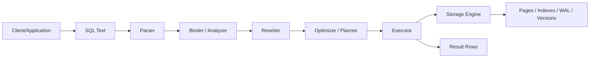

Setiap stage punya failure mode sendiri.

| Stage | Tugas | Contoh Failure |
|---|---|---|
| Parser | Memvalidasi struktur syntax | missing comma, keyword salah, grammar invalid |
| Binder / Analyzer | Resolve table, column, type, function, permission | ambiguous column, column not found, implicit cast buruk |
| Rewriter | Expand view/rule, transform query | view terlalu kompleks, predicate tidak terdorong turun |
| Optimizer / Planner | Pilih execution plan berdasarkan biaya | salah estimasi cardinality, join order buruk |
| Executor | Menjalankan operator fisik | spill sort/hash, nested loop terlalu mahal |
| Storage Engine | Baca/tulis page, index, log, row version | IO bottleneck, bloat, lock wait, deadlock |

SQL mastery datang dari mengetahui **di stage mana masalah terjadi**.

---

## 3. Parser: Dari Text ke Struktur

Parser memeriksa apakah SQL text mengikuti grammar engine.

Contoh invalid:

```sql
SELECT case_id status
FROM cases
WHERE = 'OPEN';
```

Parser tidak sedang memahami bisnis. Parser hanya memeriksa struktur bahasa.

Dalam PostgreSQL, dokumentasi internalnya menjelaskan bahwa parser membuat parse tree menggunakan aturan syntax tetap, dan belum melakukan lookup ke system catalog. Semantic interpretation dilakukan setelah parse tree terbentuk.

Mental model:

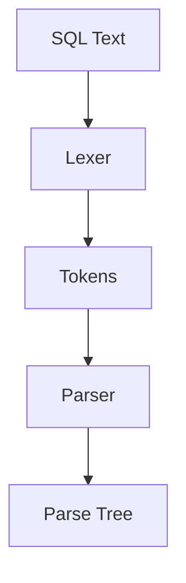

Contoh:

```sql
SELECT c.case_id
FROM cases c
WHERE c.status = 'OPEN';
```

Parser mengenali struktur seperti:

- ada statement `SELECT`;
- ada target list `c.case_id`;
- ada range variable `cases c`;
- ada predicate `c.status = 'OPEN'`.

Tetapi parser belum tentu tahu apakah:

- `cases` benar-benar ada;
- `status` adalah kolom valid;
- `'OPEN'` kompatibel dengan tipe `status`;
- user boleh membaca table tersebut.

Itu tugas binder/analyzer.

### 3.1 Apa yang Bisa Dipelajari dari Error Parser

Parser error biasanya berarti masalah bentuk query, bukan masalah data.

Contoh:

```sql
SELECT case_id,
FROM cases;
```

Ini bukan masalah index, bukan masalah permission, bukan masalah transaction. Ini grammar.

Production lesson:

> Jangan debugging optimizer sebelum syntax dan semantic resolution bersih.

Dalam aplikasi, parser error sering muncul karena:

- dynamic SQL dibangun dengan string concatenation;
- optional filter menyisakan `AND` atau comma menggantung;
- query generator menghasilkan dialect yang tidak sesuai engine;
- reserved word dipakai sebagai column name tanpa quoting.

Contoh buruk:

```sql
SELECT id, order
FROM audit_log;
```

Jika `order` adalah reserved word di engine tertentu, query bisa gagal. Solusi paling sehat bukan sekadar quote setiap nama, tetapi hindari naming yang bertabrakan dengan grammar SQL.

---

## 4. Binder / Analyzer: Dari Syntax ke Meaning

Binder, analyzer, atau semantic analyzer mengubah parse tree menjadi struktur yang bermakna secara database.

Ia menjawab:

- `cases` menunjuk object apa?
- `c.case_id` menunjuk column apa?
- tipe data kolom apa?
- operator `=` versi mana yang dipakai?
- literal perlu cast ke tipe apa?
- function overload mana yang cocok?
- apakah aggregate legal?
- apakah user punya privilege?

Contoh:

```sql
SELECT case_id
FROM cases
WHERE opened_at >= '2026-01-01';
```

Literal `'2026-01-01'` awalnya hanyalah string. Analyzer harus menentukan apakah ia menjadi `date`, `timestamp`, `timestamptz`, atau tipe lain berdasarkan konteks.

### 4.1 Ambiguous Column

```sql
SELECT case_id, status
FROM cases c
JOIN case_events e ON e.case_id = c.case_id;
```

Jika `status` ada di kedua table, analyzer tidak bisa memilih sendiri. Query perlu eksplisit:

```sql
SELECT c.case_id, c.status AS case_status
FROM cases c
JOIN case_events e ON e.case_id = c.case_id;
```

Rule praktis:

> Pada query production yang memakai join, qualify kolom dengan alias table. Ini bukan gaya; ini correctness boundary.

### 4.2 Type Resolution dan Implicit Cast

Masalah umum:

```sql
SELECT *
FROM cases
WHERE case_id = '123';
```

Jika `case_id` adalah integer, engine mungkin melakukan cast literal ke integer. Itu biasanya aman.

Tetapi kasus sebaliknya bisa buruk:

```sql
SELECT *
FROM cases
WHERE CAST(case_id AS text) = '123';
```

Di sini fungsi diterapkan pada column. Banyak engine tidak bisa memakai index normal pada `case_id` karena bentuk predicate tidak lagi cocok dengan index key.

Mental model:

- cast literal ke tipe kolom biasanya lebih sargable;
- cast kolom ke tipe lain sering membuat index normal tidak terpakai;
- implicit cast antar tipe berbeda bisa menyebabkan hasil salah atau lambat;
- timezone cast bisa menjadi bug audit.

### 4.3 Name Resolution dan Shadowing

SQL punya banyak namespace:

- table name;
- schema name;
- CTE name;
- alias name;
- column alias;
- function name;
- parameter name;
- temporary table name.

Contoh shadowing:

```sql
WITH cases AS (
    SELECT * FROM archived_cases
)
SELECT *
FROM cases;
```

`cases` dalam query ini menunjuk CTE, bukan table fisik bernama `cases`.

Ini berguna, tetapi bisa membingungkan saat query besar. Untuk handbook engineering, CTE sebaiknya diberi nama yang menjelaskan bentuk datanya:

```sql
WITH archived_open_cases AS (
    SELECT *
    FROM archived_cases
    WHERE status = 'OPEN'
)
SELECT *
FROM archived_open_cases;
```

---

## 5. Catalog: Memory Database Tentang Dirinya Sendiri

Database engine punya metadata internal yang sering disebut catalog, data dictionary, atau system tables.

Catalog menyimpan informasi seperti:

- table;
- column;
- type;
- constraint;
- index;
- view;
- function;
- privilege;
- statistics;
- dependency;
- collation;
- partition;
- trigger.

Query biasa bergantung pada catalog.

```sql
SELECT case_id, status
FROM cases;
```

Untuk menjalankan query ini, engine perlu tahu:

- object id table `cases`;
- daftar column;
- physical storage location;
- privilege user;
- statistics table;
- index yang tersedia;
- dependency terhadap view atau rule.

Mental model:

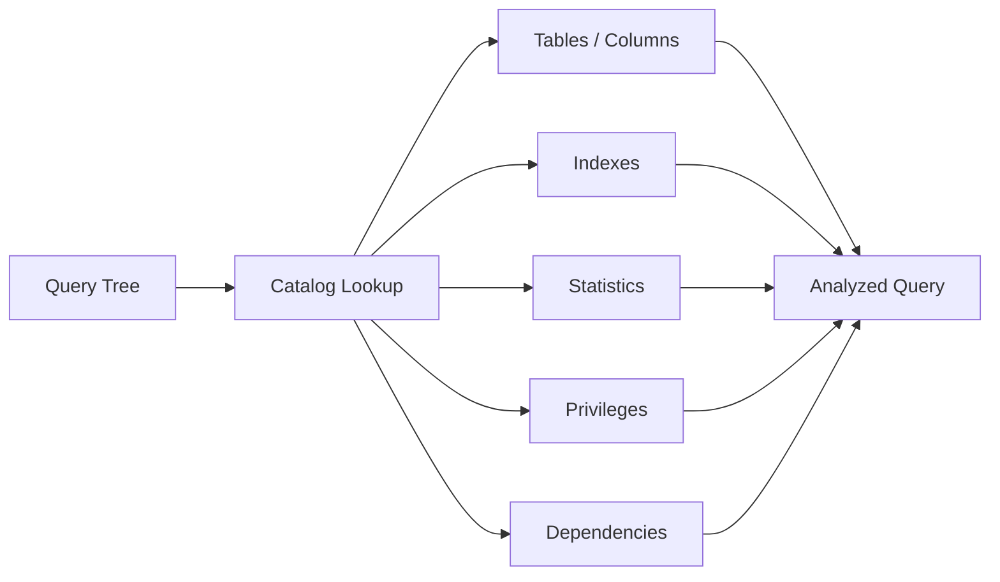

### 5.1 Catalog adalah Sumber Kebenaran untuk Metadata

Aplikasi sering menyimpan asumsi schema di code:

```java
record CaseDto(Long id, String status, Instant openedAt) {}
```

Tetapi database catalog adalah tempat engine mengetahui realitas schema. Jika code dan catalog berbeda, bug muncul:

- column rename belum disesuaikan;
- tipe berubah dari integer ke bigint;
- nullable berubah;
- constraint baru menolak data lama;
- index hilang setelah migration;
- view dependency rusak.

Production practice:

> Treat schema as versioned API. Catalog adalah runtime contract, migration adalah deployment protocol.

---

## 6. Rewriter: Query Bisa Berubah Sebelum Dioptimasi

Setelah semantic analysis, beberapa engine melakukan query rewrite.

Contoh transformasi:

- expand view menjadi query underlying;
- simplify predicate;
- inline CTE pada engine/version tertentu;
- push predicate ke subquery jika legal;
- transform `IN` menjadi semi join;
- remove unused columns;
- apply rules;
- rewrite security policy.

Contoh view:

```sql
CREATE VIEW open_cases AS
SELECT case_id, owner_id, priority, opened_at
FROM cases
WHERE status = 'OPEN';
```

Query:

```sql
SELECT case_id
FROM open_cases
WHERE priority = 'HIGH';
```

Secara konseptual bisa di-rewrite menjadi:

```sql
SELECT case_id
FROM cases
WHERE status = 'OPEN'
  AND priority = 'HIGH';
```

Ini penting karena view bukan selalu materialized object. Banyak view hanyalah stored query expression.

### 6.1 Rewrite Tidak Boleh Mengubah Semantics

Rewrite yang benar harus mempertahankan hasil query.

Misalnya:

```sql
WHERE status = 'OPEN'
  AND priority = 'HIGH'
```

Secara boolean, engine dapat menukar urutan predicate. Tetapi pada SQL dengan function volatile, NULL semantics, outer join, dan security policy, tidak semua transformasi bebas dilakukan.

Contoh outer join yang tidak boleh sembarangan didorong predicate-nya:

```sql
SELECT c.case_id, r.review_id
FROM cases c
LEFT JOIN case_reviews r ON r.case_id = c.case_id
WHERE r.result = 'APPROVED';
```

Predicate `r.result = 'APPROVED'` di `WHERE` menghapus row yang tidak punya review, sehingga `LEFT JOIN` efektif menjadi inner join untuk kondisi itu.

Jika maksudnya tetap tampilkan semua cases dan hanya ambil approved review jika ada, predicate harus masuk ke `ON`:

```sql
SELECT c.case_id, r.review_id
FROM cases c
LEFT JOIN case_reviews r
  ON r.case_id = c.case_id
 AND r.result = 'APPROVED';
```

Ini akan dibahas lebih dalam di part join. Untuk sekarang, cukup ingat:

> Rewrite engine tunduk pada semantics. Engineer juga harus tunduk pada semantics.

---

## 7. Optimizer / Planner: Mesin Pembuat Trade-off

Optimizer memilih plan yang dianggap murah untuk menjalankan query.

Ia mempertimbangkan:

- table size;
- index availability;
- predicate selectivity;
- join order;
- join algorithm;
- sort cost;
- aggregation strategy;
- memory limit;
- parallelism;
- partition pruning;
- statistics;
- estimated row count;
- estimated row width;
- data distribution.

SQL Server documentation menyebut output Query Optimizer sebagai query execution plan. MySQL documentation juga menjelaskan bahwa `EXPLAIN` menampilkan informasi dari optimizer tentang execution plan. PostgreSQL memakai planner/optimizer untuk memilih plan sebelum executor menjalankannya.

Mental model:

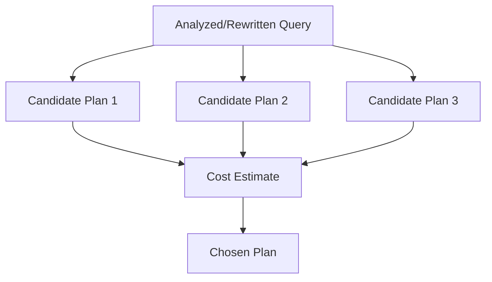

### 7.1 Query yang Sama, Plan Bisa Berbeda

Query:

```sql
SELECT *
FROM cases
WHERE owner_id = 42;
```

Jika `cases` berisi 1.000 row, sequential scan bisa murah.

Jika `cases` berisi 100 juta row dan `owner_id = 42` hanya 100 row, index scan mungkin jauh lebih murah.

Jika `owner_id = 42` punya 40 juta row karena user tersebut adalah system owner, index scan bisa buruk karena banyak random access.

Jadi, jawaban “harus pakai index” tidak cukup. Pertanyaan yang benar:

- berapa banyak row yang cocok?
- seberapa lebar row?
- apakah data sudah di cache?
- apakah query butuh semua column?
- apakah index covering?
- apakah order by cocok dengan index?
- apakah predicate selective?
- apakah stats akurat?

### 7.2 Optimizer Bukan Oracle

Optimizer bekerja dengan estimasi.

Ia tidak tahu masa depan. Ia tidak membaca semua data untuk setiap query karena itu justru mahal. Ia mengandalkan statistics, metadata, dan cost model.

Failure umum:

| Failure | Penyebab | Dampak |
|---|---|---|
| Cardinality misestimate | stats stale, skew, correlation | join order buruk |
| Wrong access path | selectivity salah | scan terlalu besar |
| Bad join algorithm | row estimate salah | nested loop meledak |
| Sort/hash spill | memory underestimate | disk temp tinggi |
| Parameter-sensitive plan | satu plan dipakai untuk nilai parameter berbeda | cepat untuk sebagian input, lambat untuk input lain |
| Predicate not sargable | fungsi/cast di column | index tidak terpakai |

Kita akan membahas ini detail di part 016 dan 017.

### 7.3 Cost Bukan Waktu Absolut

Cost di execution plan biasanya bukan milliseconds. Cost adalah unit internal engine untuk membandingkan alternatif.

Contoh salah paham:

> “Plan ini cost-nya 100, berarti jalan 100 ms.”

Tidak. Cost adalah model relatif yang bergantung engine.

Gunakan cost untuk memahami preferensi optimizer, lalu validasi dengan:

- actual execution time;
- actual rows;
- buffers/logical reads;
- physical reads;
- wait events;
- memory spill;
- lock waits;
- temp file usage.

---

## 8. Executor: Operator Fisik yang Menghasilkan Row

Executor menjalankan plan.

Plan terdiri dari operator fisik seperti:

- sequential/table scan;
- index scan/seek;
- bitmap scan;
- nested loop join;
- hash join;
- merge join;
- sort;
- hash aggregate;
- stream/group aggregate;
- materialize;
- limit/top;
- filter;
- projection;
- spool;
- gather/parallel operator.

Contoh conceptual plan:

```text
Limit
  Sort by opened_at DESC
    Filter priority = 'HIGH'
      Table Scan cases
```

Atau jika ada index cocok:

```text
Limit
  Index Scan cases_priority_opened_at_idx
    Index Cond priority = 'HIGH'
```

### 8.1 Pull-Based Execution

Banyak database engine secara konseptual memakai iterator model: operator atas meminta row dari operator bawah.

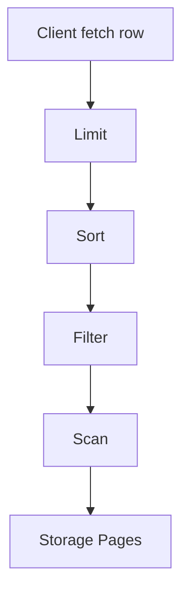

Operator `Limit` meminta row dari `Sort`. `Sort` mungkin harus membaca semua row sebelum bisa mengeluarkan row pertama. `Filter` meminta row dari `Scan`. `Scan` membaca page dari storage/buffer.

Ini menjelaskan kenapa beberapa query tidak streaming:

```sql
SELECT *
FROM cases
ORDER BY opened_at DESC;
```

Tanpa index yang sesuai, engine mungkin harus membaca semua row lalu sort sebelum mengirim row pertama.

### 8.2 Blocking vs Non-Blocking Operator

Operator non-blocking dapat mengeluarkan row saat menerima row:

- filter;
- projection;
- nested loop dalam beberapa kondisi;
- index scan;
- limit jika input sudah ordered.

Operator blocking harus mengumpulkan banyak/semua input lebih dulu:

- sort;
- hash aggregate;
- hash join build side;
- distinct;
- window function tertentu;
- materialize;
- set operation tertentu.

Production implication:

> Query yang terlihat kecil karena `LIMIT 10` bisa tetap mahal jika engine harus sort atau aggregate jutaan row sebelum limit.

Contoh:

```sql
SELECT case_id, opened_at
FROM cases
WHERE status = 'OPEN'
ORDER BY opened_at DESC
FETCH FIRST 10 ROWS ONLY;
```

Dengan index `(status, opened_at DESC)`, engine bisa berhenti setelah 10 row. Tanpa index, engine mungkin scan semua open cases lalu sort.

---

## 9. Storage Engine: Di Bawah SQL Ada Page, Log, dan Version

SQL bekerja pada logical table. Storage engine bekerja pada physical structures.

Struktur umum:

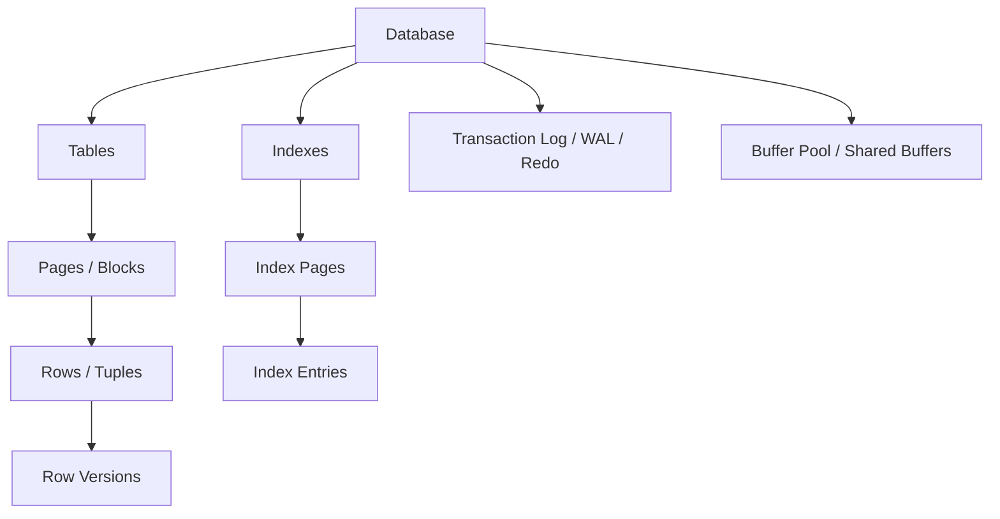

Nama berbeda antar engine, tetapi konsep besarnya mirip:

- data disimpan dalam page/block;
- index juga disimpan dalam page;
- buffer pool/cache menyimpan page yang sering dipakai di memory;
- write biasanya dicatat ke log untuk durability;
- transaksi concurrent membutuhkan lock, latch, atau row version;
- checkpoint memindahkan perubahan durable ke data file;
- vacuum/purge/cleanup menghapus row version lama pada engine MVCC tertentu.

### 9.1 Page-Oriented Thinking

Database tidak membaca “satu row” dari disk secara magis. Ia membaca page/block.

Jika page size 8 KB dan satu row 500 byte, satu page bisa memuat beberapa row. Jika query membaca satu row dengan index, engine mungkin tetap membaca page yang berisi row itu.

Implication:

- row width memengaruhi IO;
- `SELECT *` bisa mahal karena membaca column yang tidak diperlukan;
- wide table mengurangi jumlah row per page;
- index-only scan bisa menghindari heap/table lookup jika data cukup tersedia di index;
- clustering/order fisik memengaruhi locality.

### 9.2 Buffer Pool

Buffer pool adalah memory area tempat database menyimpan page yang sering diakses.

Query bisa lambat bukan karena CPU, tetapi karena page belum ada di memory dan harus dibaca dari disk.

Gejala:

- query pertama lambat, query kedua cepat;
- logical reads tinggi tetapi physical reads rendah;
- working set lebih besar daripada memory;
- sequential scan mengusir page penting dari cache;
- index lookup random menyebabkan banyak page miss.

Mental model:

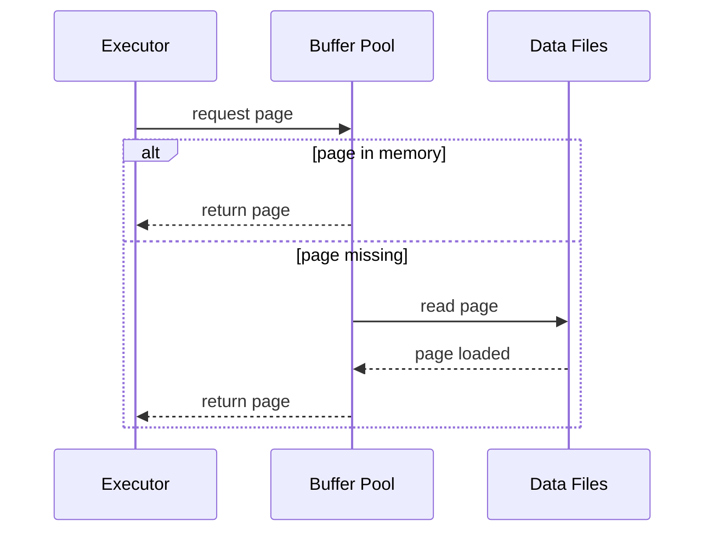

### 9.3 WAL / Redo Log

Durability membutuhkan log.

Secara umum, database menulis perubahan ke log sebelum/bersamaan dengan membuat perubahan dianggap durable. Istilahnya berbeda:

- PostgreSQL: Write-Ahead Log atau WAL;
- MySQL/InnoDB: redo log dan undo log;
- SQL Server: transaction log;
- Oracle: redo log dan undo segment.

Core idea:

> Jangan hanya berpikir “update row”. Pikirkan juga log record, lock/version, index maintenance, dan checkpoint.

Contoh:

```sql
UPDATE cases
SET status = 'CLOSED', closed_at = CURRENT_TIMESTAMP
WHERE case_id = 1001;
```

Write ini dapat menyebabkan:

- row version baru;
- index update jika kolom indexed berubah;
- WAL/redo log record;
- lock row;
- trigger execution;
- foreign key check;
- check constraint validation;
- replication log emission;
- possible page split jika index berubah;
- bloat atau dead tuple pada engine MVCC tertentu.

Satu `UPDATE` bukan satu operasi sederhana.

---

## 10. MVCC, Lock Manager, dan Visibility

Pada sistem multi-user, dua transaksi bisa membaca dan menulis data bersamaan.

Database harus menjawab:

- apakah transaksi A boleh melihat perubahan transaksi B?
- apakah update A dan update B konflik?
- apakah reader harus menunggu writer?
- apakah writer harus menunggu reader?
- row version mana yang visible?
- kapan deadlock dideteksi?

Ada dua keluarga besar mekanisme:

1. locking-based concurrency;
2. MVCC-based concurrency.

Banyak engine modern memakai kombinasi keduanya.

### 10.1 MVCC Mental Model

MVCC berarti Multi-Version Concurrency Control.

Daripada hanya punya satu versi row, engine dapat menyimpan beberapa versi row sehingga transaksi yang berbeda bisa melihat snapshot berbeda.

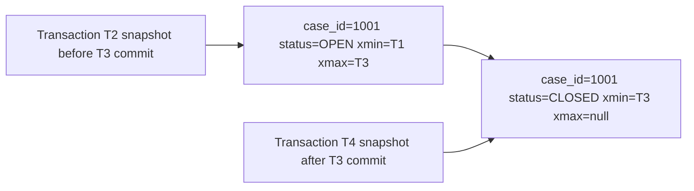

Jika transaksi T2 mulai sebelum T3 commit, ia mungkin melihat status `OPEN`. Transaksi T4 yang mulai setelah T3 commit melihat status `CLOSED`.

Ini menjelaskan kenapa “data terbaru” bukan konsep tunggal di database. Yang penting adalah **visibility menurut isolation level dan snapshot**.

### 10.2 Lock Manager

Lock manager mengatur konflik.

Lock bisa terjadi pada:

- row;
- page;
- table;
- index key/range;
- metadata/schema;
- advisory/application-defined resource.

Contoh konflik:

```sql
-- Transaction A
UPDATE cases
SET status = 'IN_REVIEW'
WHERE case_id = 1001;

-- Transaction B
UPDATE cases
SET status = 'CLOSED'
WHERE case_id = 1001;
```

B tidak boleh diam-diam menimpa A tanpa aturan. Bergantung engine dan isolation level, B akan menunggu, gagal, atau mendeteksi conflict.

Part 018–020 akan membahas ini detail. Untuk part ini, cukup pegang model:

> Query execution bukan hanya membaca data; ia membaca data yang visible dan aman menurut concurrency control.

---

## 11. Query Lifecycle: SELECT Sederhana

Ambil contoh:

```sql
SELECT c.case_id, c.status, c.opened_at
FROM cases c
WHERE c.status = 'OPEN'
  AND c.priority = 'HIGH'
ORDER BY c.opened_at DESC
FETCH FIRST 10 ROWS ONLY;
```

### 11.1 Pipeline Conceptual

```mermaid
sequenceDiagram
    participant App as Application
    participant DB as Database Server
    participant Parser as Parser
    participant Analyzer as Analyzer
    participant Opt as Optimizer
    participant Exec as Executor
    participant Store as Storage

    App->>DB: SQL text
    DB->>Parser: parse
    Parser-->>DB: parse tree
    DB->>Analyzer: resolve names/types/privileges
    Analyzer-->>DB: analyzed query
    DB->>Opt: plan alternatives
    Opt-->>DB: chosen plan
    DB->>Exec: execute plan
    Exec->>Store: read pages/indexes/versions
    Store-->>Exec: visible rows
    Exec-->>App: result rows
```

### 11.2 Apa yang Mungkin Dipilih Optimizer

Tanpa index:

```text
Limit
  Sort opened_at DESC
    Filter status='OPEN' AND priority='HIGH'
      Seq Scan cases
```

Dengan index `(status, priority, opened_at DESC)`:

```text
Limit
  Index Scan cases_status_priority_opened_idx
    Index Cond status='OPEN' AND priority='HIGH'
```

Dengan index hanya `(status)`:

```text
Limit
  Sort opened_at DESC
    Filter priority='HIGH'
      Index Scan cases_status_idx
        Index Cond status='OPEN'
```

Perbedaan plan muncul bukan karena SQL berubah, tetapi karena physical access path berbeda.

---

## 12. Query Lifecycle: UPDATE Sederhana

```sql
UPDATE cases
SET status = 'CLOSED', closed_at = CURRENT_TIMESTAMP
WHERE case_id = 1001
  AND status = 'OPEN';
```

Predicate `status = 'OPEN'` bukan kosmetik. Ia mencegah update yang tidak idempotent atau state transition invalid.

### 12.1 Execution Concerns

Engine perlu:

- menemukan row `case_id = 1001`;
- memeriksa visibility;
- mengambil lock/conflict marker;
- memastikan status masih `OPEN`;
- membuat row version baru atau update in-place sesuai engine;
- memperbarui index yang terdampak;
- menulis log;
- menjalankan trigger jika ada;
- validasi constraint;
- commit atau rollback.

Diagram:

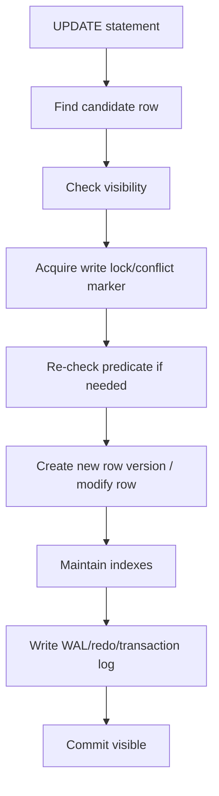

### 12.2 Safe State Transition Pattern

Untuk workflow produksi, update harus encode invariant:

```sql
UPDATE cases
SET status = 'IN_REVIEW',
    reviewer_id = :reviewer_id,
    review_started_at = CURRENT_TIMESTAMP
WHERE case_id = :case_id
  AND status = 'OPEN';
```

Lalu aplikasi harus memeriksa affected row count.

- `1 row affected`: transition berhasil;
- `0 row affected`: case tidak ada atau status sudah berubah;
- `>1 row affected`: bug desain key atau predicate.

Ini model penting untuk sistem case management, approval workflow, enforcement lifecycle, dan escalation logic.

---

## 13. Prepared Statement, Plan Cache, dan Parameter

Aplikasi jarang mengirim literal SQL sekali saja. Biasanya memakai parameter:

```sql
SELECT *
FROM cases
WHERE owner_id = ?
  AND status = ?;
```

Prepared statement memberi manfaat:

- menghindari SQL injection jika digunakan benar;
- mengurangi parsing overhead;
- memungkinkan plan reuse;
- memisahkan SQL structure dari data value.

Tetapi parameter juga punya trade-off.

### 13.1 Generic vs Custom Plan

Untuk query parameterized, engine bisa memilih:

- plan khusus berdasarkan nilai parameter;
- plan generic yang dipakai ulang untuk banyak nilai.

Misalnya:

```sql
SELECT *
FROM cases
WHERE tenant_id = :tenant_id;
```

Jika tenant A punya 10 row dan tenant B punya 50 juta row, satu plan yang sama mungkin buruk untuk salah satu tenant.

Ini akar dari masalah seperti:

- parameter sniffing;
- bind peeking;
- generic plan regression;
- skewed tenant workload.

Production implication:

> Parameterization adalah default aman untuk security, tetapi plan behavior tetap harus diamati pada data distribution nyata.

---

## 14. Connection, Session, dan Transaction Context

SQL tidak dieksekusi di ruang kosong. Ia berjalan dalam context:

- connection;
- session variables;
- transaction;
- isolation level;
- current schema/search path;
- timezone;
- role/user;
- prepared statement cache;
- temporary table;
- lock state;
- snapshot.

Dua query text yang sama dapat menghasilkan behavior berbeda jika context berbeda.

Contoh:

```sql
SELECT CURRENT_TIMESTAMP;
```

Hasil presentation-nya bisa bergantung timezone session.

Contoh lain:

```sql
SELECT *
FROM cases;
```

Jika search path berbeda, `cases` bisa resolve ke schema berbeda.

Rule produksi:

> Jangan biarkan correctness bergantung pada session default yang tidak dikontrol.

Di aplikasi, set explicit:

- timezone;
- isolation level jika penting;
- schema/search path;
- statement timeout;
- lock timeout;
- application name;
- read/write role routing.

---

## 15. Engine Internals yang Perlu Diketahui Engineer

Tidak semua detail internal perlu dikuasai sejak awal. Tetapi beberapa konsep wajib karena langsung memengaruhi desain.

### 15.1 Row Store vs Column Store

Row store menyimpan row sebagai unit utama. Cocok untuk OLTP:

- insert/update per entity;
- lookup by key;
- transaksi kecil;
- workload write-heavy.

Column store menyimpan column sebagai unit utama. Cocok untuk analytics:

- scan banyak row tetapi sedikit column;
- aggregation besar;
- compression tinggi;
- OLAP workload.

SQL bisa sama, storage behavior berbeda.

```sql
SELECT region, COUNT(*)
FROM enforcement_actions
GROUP BY region;
```

Di row store, engine mungkin membaca banyak row lengkap. Di column store, engine bisa membaca hanya column `region` dan metadata terkait.

### 15.2 Heap, Clustered Table, dan Index-Organized Storage

Engine berbeda menyimpan table berbeda:

- PostgreSQL memakai heap table dan index menunjuk tuple/location;
- InnoDB menyimpan data row di clustered primary key structure;
- SQL Server table bisa heap atau clustered index;
- Oracle punya heap-organized table dan index-organized table;
- SQLite memakai B-tree untuk table/index.

Ini memengaruhi:

- cost primary key lookup;
- secondary index lookup;
- table bloat;
- clustering locality;
- page split;
- range scan;
- update cost.

Jangan menganggap “index di semua database sama”. Konsepnya mirip, tetapi physical consequence bisa berbeda.

### 15.3 Statistics

Statistics adalah bahan bakar optimizer.

Biasanya mencakup:

- jumlah row;
- jumlah distinct value;
- null fraction;
- histogram;
- most common values;
- correlation;
- column width;
- partition statistics.

Jika statistics salah, optimizer bisa memilih plan buruk walaupun SQL benar.

Contoh:

```sql
SELECT *
FROM cases
WHERE status = 'ESCALATED';
```

Jika optimizer mengira `ESCALATED` ada 50% row padahal hanya 0.01%, ia mungkin memilih scan table padahal index jauh lebih baik.

Atau sebaliknya.

---

## 16. Production Failure Model

SQL production issue biasanya bukan “SQL lambat” secara umum. Pecah menjadi kategori.

### 16.1 Semantic Failure

Query menghasilkan row yang salah.

Contoh:

```sql
SELECT COUNT(*)
FROM cases c
JOIN case_events e ON e.case_id = c.case_id
WHERE c.status = 'OPEN';
```

Jika satu case punya banyak events, count ini menghitung event rows, bukan cases.

Gejala:

- angka dashboard terlalu besar;
- duplicate row;
- missing row karena inner join;
- NULL tidak diperlakukan benar;
- `WHERE` mengubah outer join menjadi inner behavior.

### 16.2 Plan Failure

Query semantic benar tetapi plan buruk.

Gejala:

- full scan padahal expected index seek;
- join order buruk;
- nested loop besar;
- sort/hash spill;
- plan berubah setelah analyze/stat update;
- query cepat untuk sebagian parameter, lambat untuk parameter lain.

### 16.3 Concurrency Failure

Query benar dan plan bagus, tetapi gagal dalam multi-user execution.

Gejala:

- lock timeout;
- deadlock;
- lost update;
- duplicate processing;
- queue worker saling menunggu;
- inconsistent workflow transition;
- write skew.

### 16.4 Operational Failure

Database resource atau lifecycle bermasalah.

Gejala:

- connection pool exhaustion;
- replication lag;
- disk full karena temp files/WAL;
- vacuum/purge tertinggal;
- index bloat;
- migration lock terlalu lama;
- backup mengganggu IO;
- long transaction menahan cleanup.

### 16.5 Governance Failure

Data benar secara teknis tetapi tidak defensible.

Gejala:

- tidak bisa menjawab “siapa mengubah apa kapan?”;
- soft delete tanpa history;
- audit trail tidak immutable;
- role privilege terlalu luas;
- report tidak reproducible;
- timezone tidak konsisten;
- PII tersebar tanpa access control.

---

## 17. Database Engine sebagai State Machine

Untuk engineer yang bekerja dengan workflow, regulatory case, atau enforcement lifecycle, database engine bisa dilihat sebagai state machine besar:

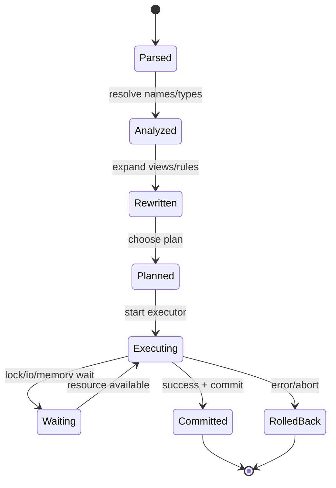

Setiap query bisa berpindah ke state waiting karena:

- menunggu lock;
- menunggu IO;
- menunggu worker parallel;
- menunggu memory grant;
- menunggu log flush;
- menunggu network client membaca result.

Dalam production incident, tanyakan:

1. Query sedang di stage apa?
2. Resource apa yang ditunggu?
3. Apakah masalah correctness, performance, concurrency, atau operability?
4. Apakah plan yang dipakai sesuai distribusi data saat ini?
5. Apakah transaksi terlalu panjang?
6. Apakah aplikasi membuka terlalu banyak connection?

---

## 18. Practical Diagnostic Ladder

Gunakan ladder ini saat melihat query bermasalah.

### Step 1 — Verify Semantics

Pastikan query memang menjawab pertanyaan yang benar.

- Apakah join menyebabkan duplicate?
- Apakah NULL semantics benar?
- Apakah filter diletakkan di `ON` atau `WHERE` dengan benar?
- Apakah aggregation level benar?
- Apakah timezone benar?
- Apakah row-level security memengaruhi result?

### Step 2 — Inspect Plan

Lihat plan.

- scan type apa?
- join algorithm apa?
- estimated rows vs actual rows?
- sort/hash spill?
- index dipakai atau tidak?
- predicate menjadi index condition atau residual filter?

### Step 3 — Inspect Data Distribution

- berapa row table?
- berapa distinct value?
- apakah ada skew?
- apakah tenant tertentu jauh lebih besar?
- apakah stats fresh?
- apakah correlation antar kolom tinggi?

### Step 4 — Inspect Concurrency

- ada lock wait?
- deadlock?
- long transaction?
- isolation level apa?
- query menunggu row, table, schema, atau log flush?

### Step 5 — Inspect Resource

- CPU bound?
- IO bound?
- memory spill?
- temp file besar?
- network result terlalu besar?
- connection pool habis?

### Step 6 — Fix dengan Boundary Jelas

Possible fixes:

- rewrite query;
- tambah/ubah index;
- update statistics;
- ubah transaction boundary;
- batch write;
- partition data;
- materialize read model;
- ubah schema;
- ubah application flow;
- tambahkan timeout/retry;
- pecah query analytics dari OLTP.

---

## 19. Mini Case Study: Escalation Dashboard Lambat

Kebutuhan:

> Tampilkan 20 case open prioritas tinggi yang sudah melewati SLA, urut dari yang paling lama overdue.

Query awal:

```sql
SELECT *
FROM cases
WHERE status = 'OPEN'
  AND priority = 'HIGH'
  AND due_at < CURRENT_TIMESTAMP
ORDER BY due_at ASC
FETCH FIRST 20 ROWS ONLY;
```

Masalah:

- table `cases` 80 juta row;
- hanya 200 ribu open high priority;
- hanya 5 ribu overdue;
- query kadang scan besar dan sort;
- dashboard dipanggil setiap 10 detik.

### 19.1 Engine View

Parser/analyzer: query valid.

Rewriter: tidak banyak berubah.

Optimizer harus memilih access path.

Jika index hanya di `status`, plan mungkin:

```text
Limit
  Sort due_at ASC
    Filter priority='HIGH' AND due_at < now()
      Index Scan cases_status_idx
```

Ini bisa membaca terlalu banyak row.

Index yang lebih sesuai:

```sql
CREATE INDEX cases_open_high_due_idx
ON cases (status, priority, due_at, case_id);
```

Atau pada engine yang mendukung partial/filtered index:

```sql
CREATE INDEX cases_open_high_due_idx
ON cases (due_at, case_id)
WHERE status = 'OPEN'
  AND priority = 'HIGH';
```

Konsepnya:

- predicate equality `status`, `priority` mempersempit search;
- `due_at` mendukung range dan order;
- `case_id` membantu stable tie-breaker atau covering partial;
- `FETCH FIRST 20` bisa berhenti awal jika index order cocok.

Query lebih stable:

```sql
SELECT case_id, owner_id, status, priority, due_at
FROM cases
WHERE status = 'OPEN'
  AND priority = 'HIGH'
  AND due_at < CURRENT_TIMESTAMP
ORDER BY due_at ASC, case_id ASC
FETCH FIRST 20 ROWS ONLY;
```

Perhatikan kita tidak memakai `SELECT *`. Dashboard perlu kolom tertentu saja.

### 19.2 Correctness Detail

`CURRENT_TIMESTAMP` harus dimaknai dalam timezone yang konsisten. Untuk SLA enforcement, simpan waktu sebagai instant/timestamptz atau aturan yang jelas. Jangan campur local timestamp tanpa timezone dari banyak region.

### 19.3 Operational Detail

Jika dashboard dipanggil tiap 10 detik oleh banyak user:

- query harus punya timeout;
- result bisa dicache sebentar jika business acceptable;
- index maintenance cost pada write harus dihitung;
- data overdue bisa dimaterialize jika workload besar;
- query analytics jangan mengganggu OLTP transition.

---

## 20. Anti-Patterns pada Level Engine Mental Model

### 20.1 Menganggap SQL Order Sama dengan Execution Order

```sql
SELECT ...
FROM ...
WHERE ...
```

Penulisan dimulai dari `SELECT`, tetapi logical processing biasanya mulai dari `FROM`. Physical execution bisa berbeda lagi.

### 20.2 Menganggap Index Selalu Mempercepat

Index mempercepat beberapa read, tetapi memperlambat write dan memakai storage. Index buruk bisa tidak dipakai atau membuat optimizer memilih plan buruk.

### 20.3 Menganggap EXPLAIN adalah Kebenaran Final

Estimated plan adalah prediksi. Actual plan dengan runtime metrics lebih dekat ke realitas.

### 20.4 Mengabaikan Row Width

Query dengan 100 row tetapi row sangat lebar bisa lebih mahal daripada query 10.000 row dengan column sempit.

### 20.5 Membiarkan Transaksi Terlalu Panjang

Long transaction bisa menahan lock, menghambat cleanup MVCC, memperbesar replication lag, dan membuat contention.

### 20.6 Menggunakan Database sebagai Message Queue Tanpa Desain Concurrency

Table queue butuh:

- state transition atomic;
- row locking strategy;
- retry/dead letter;
- idempotency;
- worker fairness;
- visibility timeout;
- monitoring lag.

Tanpa itu, database queue sering menghasilkan duplicate processing atau deadlock.

---

## 21. Practice: 20-Hour Feedback Loop untuk Engine Literacy

Latihan berikut tidak butuh dataset besar sejak awal. Tujuannya membangun feedback loop.

### Drill 1 — Query Pipeline Explanation

Ambil 5 query dari aplikasi nyata. Untuk setiap query, tulis:

- table/view apa yang disentuh;
- kolom apa yang difilter;
- join apa;
- index apa yang mungkin membantu;
- operator blocking apa yang mungkin muncul;
- failure mode apa yang paling mungkin.

### Drill 2 — EXPLAIN Before/After Index

Buat table `cases` dengan data dummy. Jalankan query filter + order + limit. Bandingkan plan sebelum dan sesudah index.

Observasi:

- scan type berubah atau tidak;
- sort hilang atau tidak;
- estimated rows masuk akal atau tidak;
- query berhenti awal atau tetap membaca banyak row.

### Drill 3 — Parameter Skew

Buat data tenant skew:

- tenant kecil: 100 row;
- tenant besar: 1 juta row.

Jalankan query parameterized:

```sql
SELECT *
FROM cases
WHERE tenant_id = :tenant_id
  AND status = 'OPEN';
```

Bandingkan plan dan latency untuk tenant kecil vs besar.

### Drill 4 — Blocking Operator

Bandingkan:

```sql
SELECT *
FROM cases
FETCH FIRST 10 ROWS ONLY;
```

Dengan:

```sql
SELECT *
FROM cases
ORDER BY opened_at DESC
FETCH FIRST 10 ROWS ONLY;
```

Lalu tambahkan index pada `opened_at`. Amati kapan `LIMIT` benar-benar murah.

### Drill 5 — Transaction Visibility

Jalankan dua session:

Session A:

```sql
BEGIN;
UPDATE cases SET status = 'CLOSED' WHERE case_id = 1;
-- jangan commit dulu
```

Session B:

```sql
SELECT status FROM cases WHERE case_id = 1;
UPDATE cases SET status = 'IN_REVIEW' WHERE case_id = 1;
```

Amati behavior pada isolation level berbeda sesuai engine.

---

## 22. Checklist Engineer-Level

Sebelum menyalahkan database, cek:

- [ ] Apakah query menjawab pertanyaan bisnis yang benar?
- [ ] Apakah join cardinality benar?
- [ ] Apakah predicate NULL-safe?
- [ ] Apakah plan memakai access path yang masuk akal?
- [ ] Apakah estimated rows dekat dengan actual rows?
- [ ] Apakah ada sort/hash spill?
- [ ] Apakah query membaca column yang tidak diperlukan?
- [ ] Apakah index mendukung filter, join, dan order?
- [ ] Apakah data distribution skewed?
- [ ] Apakah transaksi terlalu panjang?
- [ ] Apakah ada lock wait atau deadlock?
- [ ] Apakah stats fresh?
- [ ] Apakah query berjalan di replica yang lag?
- [ ] Apakah timezone/session context eksplisit?
- [ ] Apakah migration terbaru mengubah plan?

---

## 23. Summary

Database engine bukan black box yang langsung menjalankan SQL text.

Model yang harus diingat:

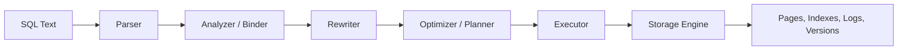

Inti part ini:

- parser memvalidasi syntax;
- analyzer memberi makna dengan catalog, type, function, dan permission;
- rewriter bisa mengubah query tanpa mengubah semantics;
- optimizer memilih plan berdasarkan estimasi biaya;
- executor menjalankan physical operators;
- storage engine bekerja dengan page, index, log, buffer, lock, dan version;
- query correctness, performance, concurrency, dan operability adalah dimensi berbeda;
- engineer yang kuat tahu stage mana yang sedang bermasalah.

Di part berikutnya, kita akan masuk ke syntax SQL sebagai expression of intent: `SELECT`, `FROM`, `WHERE`, `GROUP BY`, `HAVING`, `ORDER BY`, dan logical processing order. Ini fondasi agar query yang ditulis benar secara semantic sebelum bicara optimisasi.

---

## References

- PostgreSQL Documentation — Overview of PostgreSQL Internals / Path of a Query: https://www.postgresql.org/docs/8.1/overview.html
- PostgreSQL Documentation — The Parser Stage: https://www.postgresql.org/docs/current/parser-stage.html
- PostgreSQL Documentation — The PostgreSQL Rule System: https://www.postgresql.org/docs/current/rule-system.html
- PostgreSQL Documentation — SELECT: https://www.postgresql.org/docs/current/sql-select.html
- MySQL Reference Manual — Understanding the Query Execution Plan: https://dev.mysql.com/doc/refman/en/execution-plan-information.html
- MySQL Reference Manual — The Optimizer Cost Model: https://dev.mysql.com/doc/refman/8.3/en/cost-model.html
- Microsoft Learn — SQL Server Query Processing Architecture Guide: https://learn.microsoft.com/en-us/sql/relational-databases/query-processing-architecture-guide
- Microsoft Learn — Execution Plan Overview: https://learn.microsoft.com/en-us/sql/relational-databases/performance/execution-plans
