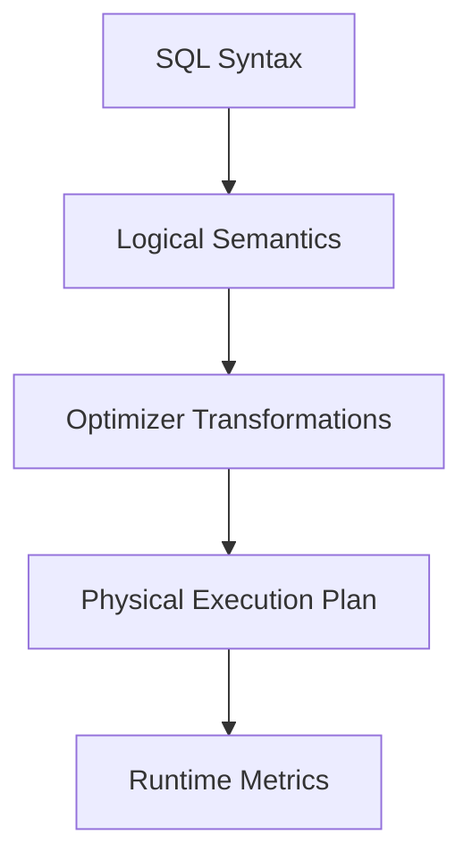
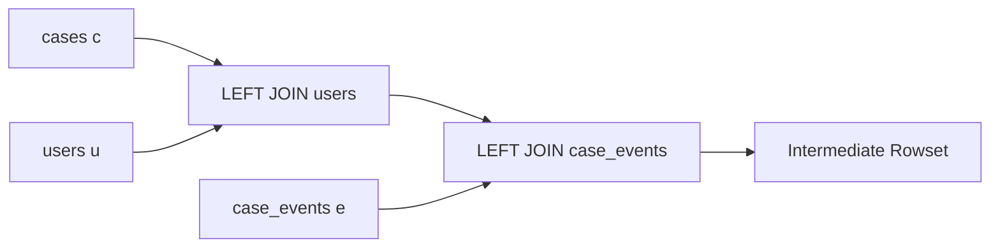
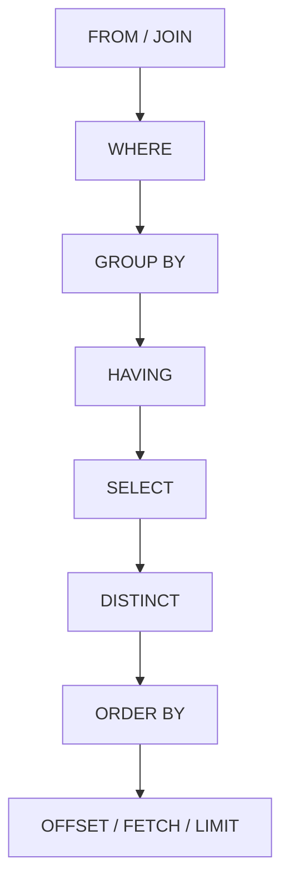

# Part 004 — SQL Syntax as Execution Intent

## 1. Tujuan Part Ini

Part ini membahas syntax SQL bukan sebagai hafalan grammar, tetapi sebagai cara menyatakan intent.

SQL terlihat seperti urutan teks:

```sql
SELECT ...
FROM ...
WHERE ...
GROUP BY ...
HAVING ...
ORDER BY ...
FETCH FIRST ...
```

Tetapi cara engine memahami query tidak sama dengan urutan teks yang kita baca dari atas ke bawah.

Kesalahan umum engineer:

- mengira `SELECT` diproses lebih dulu karena ditulis paling atas;
- memakai alias `SELECT` di `WHERE` lalu bingung kenapa error;
- menaruh filter outer join di `WHERE` dan tidak sadar mengubah hasil;
- memakai `LIMIT` tanpa `ORDER BY` dan mengira hasil stabil;
- memakai `COUNT(*)` setelah join dan mengira menghitung entity utama;
- menggunakan `DISTINCT` sebagai plester duplicate tanpa memahami penyebab cardinality explosion.

Target setelah part ini:

- memahami logical processing order query SQL;
- bisa membedakan syntax order, logical order, dan physical execution order;
- bisa menulis query yang jelas intent-nya;
- memahami scope alias, expression, dan clause;
- mampu mendeteksi bug semantic sebelum membaca execution plan;
- punya pola query production yang aman, eksplisit, dan reviewable.

> Prinsip Kaufman untuk part ini: pelajari bagian kecil syntax yang memberi leverage paling besar. Jangan hafal semua grammar SQL dulu. Kuasai processing model yang membuat query benar.

---

## 2. Syntax Order vs Logical Processing Order vs Physical Execution

Ada tiga urutan berbeda.

### 2.1 Syntax Order

Ini urutan penulisan SQL:

```sql
SELECT
FROM
WHERE
GROUP BY
HAVING
ORDER BY
OFFSET / FETCH / LIMIT
```

### 2.2 Logical Processing Order

Secara konseptual, query dipahami kira-kira seperti:

```text
FROM / JOIN
WHERE
GROUP BY
HAVING
SELECT
DISTINCT
ORDER BY
OFFSET / FETCH / LIMIT
```

Dengan `WITH`/CTE dan set operations, gambar lengkapnya lebih kompleks. Tetapi model ini cukup untuk mayoritas bug sehari-hari.

### 2.3 Physical Execution Order

Physical execution order adalah plan yang dipilih optimizer.

Engine dapat:

- membaca index sebelum table;
- push predicate ke scan;
- reorder inner join;
- eliminate join;
- compute expression lebih lambat jika aman;
- memakai parallel operator;
- apply limit early jika order cocok dengan index;
- materialize subquery;
- transform `IN` menjadi semi join.

Jadi:

| Order | Dipakai Untuk | Stabil? |
|---|---|---|
| Syntax order | Menulis dan membaca query | Ya, sesuai grammar |
| Logical order | Memahami semantics | Ya secara konseptual |
| Physical order | Memahami performance | Tidak, bergantung optimizer dan data |

Rule utama:

> Debug correctness dengan logical order. Debug performance dengan physical plan.

Diagram:



---

## 3. Running Example: Case Management Schema

Kita gunakan contoh kecil yang konsisten sepanjang part ini.

```sql
CREATE TABLE cases (
    case_id      BIGINT PRIMARY KEY,
    tenant_id    BIGINT NOT NULL,
    status       VARCHAR(30) NOT NULL,
    priority     VARCHAR(20) NOT NULL,
    owner_id     BIGINT,
    opened_at    TIMESTAMP NOT NULL,
    due_at       TIMESTAMP,
    closed_at    TIMESTAMP
);

CREATE TABLE case_events (
    event_id     BIGINT PRIMARY KEY,
    case_id      BIGINT NOT NULL,
    event_type   VARCHAR(50) NOT NULL,
    actor_id     BIGINT NOT NULL,
    occurred_at  TIMESTAMP NOT NULL,
    FOREIGN KEY (case_id) REFERENCES cases(case_id)
);

CREATE TABLE users (
    user_id      BIGINT PRIMARY KEY,
    display_name VARCHAR(200) NOT NULL,
    team_id      BIGINT NOT NULL
);
```

Kebutuhan:

> Tampilkan 10 case open prioritas tinggi milik tenant tertentu, beserta owner name, jumlah event, dan waktu event terakhir, urut berdasarkan due date paling dekat.

Query awal:

```sql
SELECT
    c.case_id,
    c.status,
    c.priority,
    u.display_name AS owner_name,
    COUNT(e.event_id) AS event_count,
    MAX(e.occurred_at) AS last_event_at
FROM cases c
LEFT JOIN users u ON u.user_id = c.owner_id
LEFT JOIN case_events e ON e.case_id = c.case_id
WHERE c.tenant_id = :tenant_id
  AND c.status = 'OPEN'
  AND c.priority = 'HIGH'
GROUP BY
    c.case_id,
    c.status,
    c.priority,
    u.display_name,
    c.due_at
HAVING COUNT(e.event_id) >= 1
ORDER BY c.due_at ASC, c.case_id ASC
FETCH FIRST 10 ROWS ONLY;
```

Kita akan bedah query ini berdasarkan logical processing.

---

## 4. FROM: Membentuk Input Table Expression

Walaupun `SELECT` ditulis pertama, `FROM` adalah tempat logical input dibentuk.

```sql
FROM cases c
LEFT JOIN users u ON u.user_id = c.owner_id
LEFT JOIN case_events e ON e.case_id = c.case_id
```

`FROM` menentukan row source:

- base table;
- view;
- CTE;
- subquery;
- function/table function;
- join result.

Mental model:



### 4.1 FROM Bukan Hanya Lokasi Table

`FROM` menentukan grain awal query.

Jika `cases` memiliki 1 row per case dan `case_events` memiliki banyak row per case, join ini mengubah grain:

```sql
FROM cases c
LEFT JOIN case_events e ON e.case_id = c.case_id
```

Sebelum join:

```text
1 row = 1 case
```

Setelah join:

```text
1 row = 1 case-event pair, atau 1 case dengan NULL event jika tidak ada event
```

Ini alasan `COUNT(*)` setelah join bisa salah jika niatnya menghitung cases.

### 4.2 Join Condition adalah Bagian dari Relationship Semantics

```sql
LEFT JOIN users u ON u.user_id = c.owner_id
```

Ini menyatakan: owner optional, tetapi case tetap tampil walaupun owner tidak ditemukan.

Jika memakai inner join:

```sql
JOIN users u ON u.user_id = c.owner_id
```

Maka case tanpa owner valid akan hilang.

Rule:

> Pilih join type berdasarkan business semantics, bukan berdasarkan “yang hasilnya kelihatan benar di sample data”.

---

## 5. WHERE: Filter Row Sebelum Grouping

`WHERE` memfilter row dari table expression yang sudah dibentuk oleh `FROM`.

```sql
WHERE c.tenant_id = :tenant_id
  AND c.status = 'OPEN'
  AND c.priority = 'HIGH'
```

Filter ini terjadi sebelum grouping dan aggregate.

### 5.1 WHERE Tidak Bisa Memakai Aggregate

Invalid:

```sql
SELECT c.case_id, COUNT(e.event_id)
FROM cases c
LEFT JOIN case_events e ON e.case_id = c.case_id
WHERE COUNT(e.event_id) > 0
GROUP BY c.case_id;
```

Kenapa salah?

Karena `WHERE` dievaluasi sebelum `GROUP BY` dan sebelum `COUNT` ada secara logical.

Gunakan `HAVING`:

```sql
SELECT c.case_id, COUNT(e.event_id) AS event_count
FROM cases c
LEFT JOIN case_events e ON e.case_id = c.case_id
GROUP BY c.case_id
HAVING COUNT(e.event_id) > 0;
```

### 5.2 WHERE dan NULL

Predicate di `WHERE` hanya mempertahankan row yang hasilnya `TRUE`.

Row dengan predicate `FALSE` atau `UNKNOWN` dibuang.

Contoh:

```sql
SELECT *
FROM cases
WHERE closed_at <> TIMESTAMP '2026-01-01 00:00:00';
```

Jika `closed_at` `NULL`, hasil `closed_at <> ...` adalah `UNKNOWN`, bukan `TRUE`. Row itu tidak masuk.

Jika niatnya “closed_at bukan tanggal itu, termasuk yang belum closed”, tulis eksplisit:

```sql
SELECT *
FROM cases
WHERE closed_at IS NULL
   OR closed_at <> TIMESTAMP '2026-01-01 00:00:00';
```

Atau gunakan operator null-safe jika engine mendukung, misalnya `IS DISTINCT FROM` di PostgreSQL dan beberapa engine lain:

```sql
SELECT *
FROM cases
WHERE closed_at IS DISTINCT FROM TIMESTAMP '2026-01-01 00:00:00';
```

### 5.3 WHERE pada Outer Join Bisa Mengubah Semantics

Contoh kebutuhan:

> Tampilkan semua case, dan jika ada event ESCALATED, tampilkan event tersebut.

Query keliru:

```sql
SELECT c.case_id, e.event_id
FROM cases c
LEFT JOIN case_events e ON e.case_id = c.case_id
WHERE e.event_type = 'ESCALATED';
```

Karena `WHERE e.event_type = 'ESCALATED'` membuang row dengan `e.event_type` `NULL`, case tanpa escalated event hilang.

Query benar:

```sql
SELECT c.case_id, e.event_id
FROM cases c
LEFT JOIN case_events e
  ON e.case_id = c.case_id
 AND e.event_type = 'ESCALATED';
```

Rule:

> Filter yang menentukan matching row dari sisi optional outer join biasanya diletakkan di `ON`, bukan `WHERE`.

---

## 6. GROUP BY: Mengubah Grain Menjadi Group

`GROUP BY` mengubah rowset menjadi group.

```sql
GROUP BY
    c.case_id,
    c.status,
    c.priority,
    u.display_name,
    c.due_at
```

Sebelum grouping:

```text
1 row = case-event pair
```

Setelah grouping:

```text
1 row = 1 group berdasarkan case_id, status, priority, owner name, due_at
```

Aggregate seperti `COUNT` dan `MAX` dihitung per group.

```sql
COUNT(e.event_id) AS event_count,
MAX(e.occurred_at) AS last_event_at
```

### 6.1 Grouping Harus Sesuai Grain yang Diinginkan

Jika output harus 1 row per case, `GROUP BY` harus stabil pada case-level.

Lebih baik:

```sql
GROUP BY
    c.case_id,
    c.status,
    c.priority,
    c.due_at,
    u.display_name
```

Tetapi hati-hati: jika `display_name` tidak unique atau berubah, grouping bisa terlihat benar tetapi punya dependency yang kurang eksplisit.

Secara data modelling, `c.owner_id` lebih stabil daripada `u.display_name`.

Pada engine yang mendukung functional dependency inference, primary key bisa memengaruhi requirement grouping. Tetapi untuk portability dan reviewability, tulis group key eksplisit sesuai intent.

### 6.2 COUNT Variants

Perbedaan penting:

```sql
COUNT(*)
COUNT(e.event_id)
COUNT(DISTINCT c.case_id)
```

| Expression | Menghitung | Catatan |
|---|---|---|
| `COUNT(*)` | jumlah row dalam group | termasuk row hasil null-extension dari outer join |
| `COUNT(e.event_id)` | jumlah event non-null | cocok untuk menghitung event pada left join |
| `COUNT(DISTINCT c.case_id)` | jumlah case unik | mahal pada data besar; sering menutupi join explosion |

Contoh:

```sql
SELECT c.case_id, COUNT(*) AS row_count
FROM cases c
LEFT JOIN case_events e ON e.case_id = c.case_id
GROUP BY c.case_id;
```

Case tanpa event menghasilkan `COUNT(*) = 1`, bukan 0.

Untuk jumlah event:

```sql
SELECT c.case_id, COUNT(e.event_id) AS event_count
FROM cases c
LEFT JOIN case_events e ON e.case_id = c.case_id
GROUP BY c.case_id;
```

Case tanpa event menghasilkan `event_count = 0`.

---

## 7. HAVING: Filter Group Setelah Aggregate

`HAVING` memfilter group.

```sql
HAVING COUNT(e.event_id) >= 1
```

Ini berarti: setelah row dikelompokkan per case, hanya pertahankan case yang punya minimal 1 event.

### 7.1 WHERE vs HAVING

| Clause | Level | Boleh Aggregate? | Contoh |
|---|---|---|---|
| `WHERE` | row sebelum grouping | tidak | `status = 'OPEN'` |
| `HAVING` | group setelah grouping | ya | `COUNT(*) > 10` |

Contoh baik:

```sql
SELECT c.owner_id, COUNT(*) AS open_case_count
FROM cases c
WHERE c.status = 'OPEN'
GROUP BY c.owner_id
HAVING COUNT(*) >= 100;
```

Makna:

1. ambil row case open;
2. group per owner;
3. pertahankan owner dengan minimal 100 open case.

### 7.2 Jangan Memakai HAVING untuk Filter Row Biasa

Kurang baik:

```sql
SELECT owner_id, COUNT(*)
FROM cases
GROUP BY owner_id, status
HAVING status = 'OPEN';
```

Lebih baik:

```sql
SELECT owner_id, COUNT(*)
FROM cases
WHERE status = 'OPEN'
GROUP BY owner_id;
```

Kenapa?

- semantic lebih jelas;
- mengurangi row sebelum grouping;
- memberi optimizer peluang lebih baik memakai index/predicate pushdown;
- menghindari group yang tidak perlu.

Rule:

> Filter row seawal mungkin secara logical jika tidak mengubah hasil. Filter aggregate di `HAVING`.

---

## 8. SELECT: Projection dan Expression

`SELECT` menentukan output expression.

```sql
SELECT
    c.case_id,
    c.status,
    c.priority,
    u.display_name AS owner_name,
    COUNT(e.event_id) AS event_count,
    MAX(e.occurred_at) AS last_event_at
```

Setelah `FROM`, `WHERE`, `GROUP BY`, dan `HAVING`, barulah output expression dibentuk secara logical.

### 8.1 SELECT Alias Scope

Alias di `SELECT` biasanya bisa dipakai di `ORDER BY`, tetapi tidak di `WHERE` karena `WHERE` diproses lebih dulu secara logical.

Invalid atau tidak portable:

```sql
SELECT due_at < CURRENT_TIMESTAMP AS is_overdue
FROM cases
WHERE is_overdue = TRUE;
```

Benar:

```sql
SELECT due_at < CURRENT_TIMESTAMP AS is_overdue
FROM cases
WHERE due_at < CURRENT_TIMESTAMP;
```

Atau gunakan subquery/CTE jika expression panjang:

```sql
WITH case_flags AS (
    SELECT
        case_id,
        due_at < CURRENT_TIMESTAMP AS is_overdue
    FROM cases
)
SELECT *
FROM case_flags
WHERE is_overdue = TRUE;
```

### 8.2 SELECT * adalah Contract Smell

`SELECT *` berguna untuk eksplorasi, tetapi berbahaya untuk production boundary.

Masalah:

- output berubah saat schema berubah;
- membaca column tidak perlu;
- mengganggu covering index/index-only plan;
- payload network lebih besar;
- bisa bocorkan column sensitif baru;
- DTO mapping bisa rusak;
- query review sulit.

Gunakan explicit projection:

```sql
SELECT case_id, status, priority, due_at
FROM cases
WHERE status = 'OPEN';
```

Rule:

> Dalam code production, `SELECT *` harus diperlakukan sebagai exception, bukan default.

### 8.3 Expression Naming

Alias harus menyatakan business meaning.

Kurang baik:

```sql
SELECT COUNT(*) AS count1
FROM cases;
```

Lebih baik:

```sql
SELECT COUNT(*) AS total_case_count
FROM cases;
```

Untuk analytics:

```sql
SELECT
    owner_id,
    COUNT(*) AS open_case_count,
    MIN(opened_at) AS oldest_open_case_at
FROM cases
WHERE status = 'OPEN'
GROUP BY owner_id;
```

Nama output adalah bagian dari API data. Buat jelas.

---

## 9. DISTINCT: Deduplication, Bukan Fix Semantics

`DISTINCT` menghapus duplicate row pada output.

```sql
SELECT DISTINCT c.case_id
FROM cases c
JOIN case_events e ON e.case_id = c.case_id;
```

Ini menghasilkan case unik yang punya event.

Tetapi sering digunakan sebagai plester:

```sql
SELECT DISTINCT c.*
FROM cases c
JOIN case_events e ON e.case_id = c.case_id;
```

Jika duplicate muncul karena join cardinality tidak dipahami, `DISTINCT` hanya menyembunyikan gejala.

### 9.1 Kapan DISTINCT Tepat

Tepat:

- ingin set unik secara eksplisit;
- deduplicate dimension value;
- mencari entity yang memenuhi existence condition;
- setelah union/aggregation tertentu;
- report memang membutuhkan unique combination.

Contoh lebih baik untuk existence:

```sql
SELECT c.case_id
FROM cases c
WHERE EXISTS (
    SELECT 1
    FROM case_events e
    WHERE e.case_id = c.case_id
);
```

Daripada join lalu distinct:

```sql
SELECT DISTINCT c.case_id
FROM cases c
JOIN case_events e ON e.case_id = c.case_id;
```

`EXISTS` menyatakan intent: existence, bukan row multiplication.

### 9.2 DISTINCT dan ORDER BY

`DISTINCT` terjadi sebelum final ordering secara logical. Jika ordering memakai expression yang tidak jelas hubungannya dengan distinct output, beberapa engine menolak atau memberi behavior dialect-specific.

Contoh problem:

```sql
SELECT DISTINCT status
FROM cases
ORDER BY opened_at DESC;
```

Pertanyaan semantic: jika banyak case dengan status sama punya `opened_at` berbeda, `opened_at` mana yang dipakai untuk mengurutkan status?

Lebih jelas:

```sql
SELECT status, MAX(opened_at) AS latest_opened_at
FROM cases
GROUP BY status
ORDER BY latest_opened_at DESC;
```

---

## 10. ORDER BY: Satu-Satunya Cara Menjamin Urutan Result

Tanpa `ORDER BY`, urutan result tidak boleh dianggap stabil.

Salah:

```sql
SELECT case_id, status
FROM cases
WHERE status = 'OPEN'
FETCH FIRST 10 ROWS ONLY;
```

Ini mengambil 10 row, tetapi “10 yang mana” tidak didefinisikan.

Benar:

```sql
SELECT case_id, status, opened_at
FROM cases
WHERE status = 'OPEN'
ORDER BY opened_at DESC, case_id ASC
FETCH FIRST 10 ROWS ONLY;
```

Tie-breaker `case_id` penting agar pagination dan repeatability lebih stabil.

### 10.1 ORDER BY dan NULL Ordering

NULL ordering berbeda antar engine jika tidak ditentukan.

Lebih eksplisit jika engine mendukung:

```sql
ORDER BY due_at ASC NULLS LAST, case_id ASC
```

Jika engine tidak mendukung `NULLS LAST`, gunakan expression portable sesuai kebutuhan:

```sql
ORDER BY
    CASE WHEN due_at IS NULL THEN 1 ELSE 0 END,
    due_at ASC,
    case_id ASC;
```

### 10.2 ORDER BY Bisa Mahal

Sorting adalah blocking operator jika tidak didukung index/order fisik.

Query:

```sql
SELECT case_id, due_at
FROM cases
WHERE status = 'OPEN'
ORDER BY due_at ASC
FETCH FIRST 20 ROWS ONLY;
```

Index candidate:

```sql
CREATE INDEX cases_status_due_case_idx
ON cases (status, due_at, case_id);
```

Tujuannya bukan “menambah index agar cepat” secara umum, tetapi mencocokkan access path dengan:

- equality filter: `status`;
- ordering: `due_at`, `case_id`;
- early stop: `FETCH FIRST 20`.

---

## 11. OFFSET, FETCH, dan LIMIT: Membatasi Result Bukan Membatasi Kerja

`FETCH FIRST`, `LIMIT`, atau `TOP` membatasi jumlah row output. Tetapi tidak selalu membatasi jumlah row yang harus diproses.

```sql
SELECT case_id, due_at
FROM cases
WHERE status = 'OPEN'
ORDER BY due_at ASC
FETCH FIRST 10 ROWS ONLY;
```

Jika ada index cocok, engine bisa membaca 10 row pertama.

Tanpa index cocok, engine mungkin harus:

1. scan semua open cases;
2. sort semuanya;
3. ambil 10 row.

### 11.1 OFFSET Pagination Problem

```sql
SELECT case_id, due_at
FROM cases
WHERE status = 'OPEN'
ORDER BY due_at ASC, case_id ASC
OFFSET 100000 ROWS
FETCH NEXT 50 ROWS ONLY;
```

Untuk page dalam, engine tetap harus melewati banyak row.

Masalah:

- makin lambat saat offset besar;
- hasil bisa bergeser jika data berubah;
- perlu stable order;
- buruk untuk infinite scroll besar.

Alternatif: keyset pagination.

```sql
SELECT case_id, due_at
FROM cases
WHERE status = 'OPEN'
  AND (
      due_at > :last_due_at
      OR (due_at = :last_due_at AND case_id > :last_case_id)
  )
ORDER BY due_at ASC, case_id ASC
FETCH FIRST 50 ROWS ONLY;
```

Ini lebih sesuai dengan index:

```sql
CREATE INDEX cases_status_due_case_idx
ON cases (status, due_at, case_id);
```

### 11.2 LIMIT Tanpa ORDER BY adalah Nondeterministic Contract

Jika API mengembalikan:

```sql
SELECT *
FROM cases
LIMIT 20;
```

Maka client tidak punya jaminan row mana yang diterima. Plan berubah, index berubah, vacuum/maintenance, atau engine upgrade bisa mengubah urutan.

Rule:

> Semua query paginated atau top-N production harus punya `ORDER BY` deterministik.

---

## 12. WITH / CTE: Naming Intermediate Intent

CTE membantu memberi nama intermediate result.

```sql
WITH overdue_cases AS (
    SELECT case_id, owner_id, due_at
    FROM cases
    WHERE status = 'OPEN'
      AND due_at < CURRENT_TIMESTAMP
)
SELECT *
FROM overdue_cases
ORDER BY due_at ASC;
```

CTE berguna untuk:

- memecah query kompleks;
- memberi nama business concept;
- menghindari duplicate expression;
- menyusun pipeline transformasi;
- recursive query;
- test intermediate result.

### 12.1 CTE Bukan Selalu Temporary Table

Perilaku CTE berbeda antar engine dan versi.

Pada beberapa engine/versi, CTE bisa di-inline oleh optimizer. Pada yang lain, CTE bisa menjadi optimization fence atau materialized. Karena itu, jangan menganggap CTE selalu mempercepat atau selalu memperlambat.

Gunakan CTE terutama untuk clarity, lalu cek plan untuk performance.

### 12.2 CTE Naming Pattern

Buruk:

```sql
WITH t1 AS (...), t2 AS (...), t3 AS (...)
SELECT * FROM t3;
```

Lebih baik:

```sql
WITH open_high_priority_cases AS (...),
     overdue_open_cases AS (...),
     owner_case_load AS (...)
SELECT *
FROM owner_case_load;
```

Nama CTE harus menjawab: row di sini merepresentasikan apa?

---

## 13. Subquery: Localized Intent

Subquery bisa muncul di banyak tempat.

### 13.1 Scalar Subquery

```sql
SELECT
    c.case_id,
    (
        SELECT MAX(e.occurred_at)
        FROM case_events e
        WHERE e.case_id = c.case_id
    ) AS last_event_at
FROM cases c;
```

Ini mudah dibaca, tetapi bisa mahal jika dieksekusi per row tanpa optimisasi. Banyak optimizer bisa decorrelate, tetapi tidak selalu.

### 13.2 EXISTS untuk Existence

```sql
SELECT c.case_id
FROM cases c
WHERE EXISTS (
    SELECT 1
    FROM case_events e
    WHERE e.case_id = c.case_id
      AND e.event_type = 'ESCALATED'
);
```

Intent jelas: pilih case yang memiliki escalated event.

### 13.3 IN vs EXISTS

```sql
SELECT c.case_id
FROM cases c
WHERE c.case_id IN (
    SELECT e.case_id
    FROM case_events e
    WHERE e.event_type = 'ESCALATED'
);
```

Untuk banyak kasus, optimizer dapat membuat plan mirip. Tetapi `NULL` dan correlation bisa membuat semantics berbeda pada bentuk tertentu, terutama `NOT IN`.

Hati-hati:

```sql
SELECT c.case_id
FROM cases c
WHERE c.case_id NOT IN (
    SELECT e.case_id
    FROM case_events e
);
```

Jika subquery mengandung `NULL`, `NOT IN` bisa menghasilkan hasil mengejutkan. Untuk anti-existence, biasanya lebih aman:

```sql
SELECT c.case_id
FROM cases c
WHERE NOT EXISTS (
    SELECT 1
    FROM case_events e
    WHERE e.case_id = c.case_id
);
```

---

## 14. CASE Expression: Business Rules dalam Query

`CASE` menyatakan conditional expression.

```sql
SELECT
    case_id,
    CASE
        WHEN closed_at IS NOT NULL THEN 'CLOSED'
        WHEN due_at < CURRENT_TIMESTAMP THEN 'OVERDUE'
        ELSE 'ACTIVE'
    END AS operational_state
FROM cases;
```

### 14.1 CASE Order Matters

`CASE` dievaluasi secara logical dari atas ke bawah untuk menentukan branch pertama yang cocok.

Jika urutan salah:

```sql
CASE
    WHEN due_at < CURRENT_TIMESTAMP THEN 'OVERDUE'
    WHEN closed_at IS NOT NULL THEN 'CLOSED'
    ELSE 'ACTIVE'
END
```

Closed case dengan due date masa lalu bisa salah dilabeli `OVERDUE`.

Rule:

> Dalam `CASE`, taruh kondisi yang lebih spesifik atau lebih final-state lebih dulu jika business rule membutuhkan precedence.

### 14.2 Jangan Menyembunyikan State Machine di CASE Besar

Jika query punya `CASE` 50 baris untuk menentukan status, mungkin status model di schema lemah.

Lebih baik pertimbangkan:

- explicit lifecycle state;
- derived status view;
- rule table;
- materialized read model;
- state transition log;
- validation constraint.

`CASE` cocok untuk presentation/derivation ringan, bukan menggantikan workflow model yang defensible.

---

## 15. Expression Evaluation dan Function Volatility

Expression di SQL bisa berupa:

- literal;
- column reference;
- arithmetic;
- comparison;
- function call;
- aggregate;
- window function;
- subquery;
- cast;
- case expression.

Contoh:

```sql
SELECT
    case_id,
    COALESCE(closed_at, CURRENT_TIMESTAMP) - opened_at AS age_interval
FROM cases;
```

### 15.1 Function di Column Bisa Membunuh Index

Kurang baik:

```sql
SELECT *
FROM cases
WHERE DATE(opened_at) = DATE '2026-07-01';
```

Jika index ada di `opened_at`, function `DATE(opened_at)` bisa membuat index normal tidak cocok.

Lebih baik gunakan range:

```sql
SELECT *
FROM cases
WHERE opened_at >= TIMESTAMP '2026-07-01 00:00:00'
  AND opened_at <  TIMESTAMP '2026-07-02 00:00:00';
```

Selain lebih sargable, range ini juga lebih jelas untuk timestamp.

### 15.2 Volatile Function dan Reproducibility

Function seperti current time, random, atau sequence generator punya behavior runtime.

Untuk audit/report, jangan biarkan “waktu sekarang” tersebar di banyak expression tanpa kontrol.

Lebih baik bind parameter dari aplikasi atau CTE tunggal:

```sql
WITH params AS (
    SELECT CURRENT_TIMESTAMP AS as_of_time
)
SELECT c.case_id
FROM cases c
CROSS JOIN params p
WHERE c.due_at < p.as_of_time;
```

Atau aplikasi mengirim `:as_of_time` agar report reproducible.

---

## 16. Complete Walkthrough Berdasarkan Logical Order

Query:

```sql
SELECT
    c.case_id,
    c.status,
    c.priority,
    u.display_name AS owner_name,
    COUNT(e.event_id) AS event_count,
    MAX(e.occurred_at) AS last_event_at
FROM cases c
LEFT JOIN users u ON u.user_id = c.owner_id
LEFT JOIN case_events e ON e.case_id = c.case_id
WHERE c.tenant_id = :tenant_id
  AND c.status = 'OPEN'
  AND c.priority = 'HIGH'
GROUP BY
    c.case_id,
    c.status,
    c.priority,
    u.display_name,
    c.due_at
HAVING COUNT(e.event_id) >= 1
ORDER BY c.due_at ASC, c.case_id ASC
FETCH FIRST 10 ROWS ONLY;
```

Logical interpretation:

1. `FROM cases c` membentuk source case.
2. `LEFT JOIN users u` menambahkan owner jika ada.
3. `LEFT JOIN case_events e` menambahkan event, dapat menggandakan row case.
4. `WHERE` mempertahankan hanya case dari tenant, status open, priority high.
5. `GROUP BY` mengembalikan grain ke case-level plus owner/due grouping.
6. `COUNT` dan `MAX` dihitung per group.
7. `HAVING` membuang case tanpa event.
8. `SELECT` membentuk output column.
9. `ORDER BY` mengurutkan group hasil.
10. `FETCH FIRST 10` mengambil 10 row pertama dari urutan final.

### 16.1 Semantic Review

Pertanyaan review:

- Apakah case tanpa owner harus tetap tampil? `LEFT JOIN users` berarti ya.
- Apakah case tanpa event harus tampil? `HAVING COUNT(e.event_id) >= 1` berarti tidak.
- Jika case tanpa event tidak perlu tampil, apakah `LEFT JOIN case_events` masih perlu? Bisa jadi `JOIN` cukup.
- Apakah `GROUP BY u.display_name` aman jika nama user berubah? Untuk current display mungkin ya; untuk historical report mungkin tidak.
- Apakah `ORDER BY due_at` dengan `NULL` jelas? Belum.
- Apakah `FETCH FIRST 10` deterministic? Ada tie-breaker `case_id`, bagus.
- Apakah projection minimal? Ya, tidak `SELECT *`.

### 16.2 Query Rewritten untuk Intent Lebih Jelas

Jika requirement “hanya case yang punya event”, gunakan pre-aggregation agar grain jelas:

```sql
WITH case_event_summary AS (
    SELECT
        e.case_id,
        COUNT(*) AS event_count,
        MAX(e.occurred_at) AS last_event_at
    FROM case_events e
    GROUP BY e.case_id
)
SELECT
    c.case_id,
    c.status,
    c.priority,
    u.display_name AS owner_name,
    s.event_count,
    s.last_event_at
FROM cases c
JOIN case_event_summary s ON s.case_id = c.case_id
LEFT JOIN users u ON u.user_id = c.owner_id
WHERE c.tenant_id = :tenant_id
  AND c.status = 'OPEN'
  AND c.priority = 'HIGH'
ORDER BY c.due_at ASC NULLS LAST, c.case_id ASC
FETCH FIRST 10 ROWS ONLY;
```

Trade-off:

- lebih jelas grain-nya;
- bisa lebih mahal jika aggregate semua events lebih dulu;
- optimizer mungkin bisa push/join reorder tergantung engine;
- untuk workload besar, summary materialized atau aggregate terbatas bisa lebih baik.

Alternatif dengan correlated aggregate:

```sql
SELECT
    c.case_id,
    c.status,
    c.priority,
    u.display_name AS owner_name,
    (
        SELECT COUNT(*)
        FROM case_events e
        WHERE e.case_id = c.case_id
    ) AS event_count,
    (
        SELECT MAX(e.occurred_at)
        FROM case_events e
        WHERE e.case_id = c.case_id
    ) AS last_event_at
FROM cases c
LEFT JOIN users u ON u.user_id = c.owner_id
WHERE c.tenant_id = :tenant_id
  AND c.status = 'OPEN'
  AND c.priority = 'HIGH'
  AND EXISTS (
      SELECT 1
      FROM case_events e
      WHERE e.case_id = c.case_id
  )
ORDER BY c.due_at ASC NULLS LAST, c.case_id ASC
FETCH FIRST 10 ROWS ONLY;
```

Ini jelas, tetapi cek plan karena scalar subquery bisa mahal jika tidak di-decorrelate.

---

## 17. Clause-by-Clause Production Rules

### 17.1 SELECT

Do:

```sql
SELECT case_id, status, due_at
```

Avoid:

```sql
SELECT *
```

Kecuali untuk eksplorasi/ad-hoc.

### 17.2 FROM

Do:

```sql
FROM cases c
JOIN case_events e ON e.case_id = c.case_id
```

Avoid join tanpa condition:

```sql
FROM cases c, case_events e
```

Kecuali memang cross join eksplisit.

### 17.3 WHERE

Do:

```sql
WHERE opened_at >= :start_at
  AND opened_at < :end_at
```

Avoid:

```sql
WHERE DATE(opened_at) = :date
```

Jika index normal perlu dipakai.

### 17.4 GROUP BY

Do: group sesuai grain.

```sql
GROUP BY owner_id
```

Avoid: group kolom random untuk memuaskan error.

```sql
GROUP BY owner_id, status, priority, opened_at, due_at
```

Jika output sebenarnya owner-level.

### 17.5 HAVING

Do:

```sql
HAVING COUNT(*) >= 10
```

Avoid:

```sql
HAVING status = 'OPEN'
```

Jika bisa difilter di `WHERE`.

### 17.6 ORDER BY

Do:

```sql
ORDER BY due_at ASC, case_id ASC
```

Avoid:

```sql
ORDER BY due_at ASC
```

Jika `due_at` tidak unique dan pagination perlu stabil.

### 17.7 LIMIT/FETCH

Do:

```sql
ORDER BY due_at ASC, case_id ASC
FETCH FIRST 50 ROWS ONLY
```

Avoid:

```sql
FETCH FIRST 50 ROWS ONLY
```

Tanpa order.

---

## 18. Common Semantic Bugs

### Bug 1 — Counting Rows After Join

```sql
SELECT COUNT(*)
FROM cases c
JOIN case_events e ON e.case_id = c.case_id;
```

Ini menghitung event join rows, bukan cases.

Fix:

```sql
SELECT COUNT(*)
FROM cases c
WHERE EXISTS (
    SELECT 1
    FROM case_events e
    WHERE e.case_id = c.case_id
);
```

### Bug 2 — LEFT JOIN Filter in WHERE

```sql
SELECT c.case_id, e.event_id
FROM cases c
LEFT JOIN case_events e ON e.case_id = c.case_id
WHERE e.event_type = 'ESCALATED';
```

Fix jika tetap ingin semua cases:

```sql
SELECT c.case_id, e.event_id
FROM cases c
LEFT JOIN case_events e
  ON e.case_id = c.case_id
 AND e.event_type = 'ESCALATED';
```

### Bug 3 — NOT IN dengan NULL

```sql
SELECT c.case_id
FROM cases c
WHERE c.owner_id NOT IN (
    SELECT user_id
    FROM suspended_users
);
```

Jika subquery mengandung NULL, hasil bisa mengejutkan.

Fix:

```sql
SELECT c.case_id
FROM cases c
WHERE NOT EXISTS (
    SELECT 1
    FROM suspended_users s
    WHERE s.user_id = c.owner_id
);
```

### Bug 4 — LIMIT Tanpa ORDER

```sql
SELECT case_id
FROM cases
FETCH FIRST 10 ROWS ONLY;
```

Fix:

```sql
SELECT case_id
FROM cases
ORDER BY opened_at DESC, case_id ASC
FETCH FIRST 10 ROWS ONLY;
```

### Bug 5 — Time Filtering dengan Function di Column

```sql
WHERE DATE(opened_at) = DATE '2026-07-01'
```

Fix:

```sql
WHERE opened_at >= TIMESTAMP '2026-07-01 00:00:00'
  AND opened_at <  TIMESTAMP '2026-07-02 00:00:00'
```

### Bug 6 — DISTINCT untuk Menutupi Join Explosion

```sql
SELECT DISTINCT c.case_id, c.status
FROM cases c
JOIN case_events e ON e.case_id = c.case_id;
```

Jika intent existence:

```sql
SELECT c.case_id, c.status
FROM cases c
WHERE EXISTS (
    SELECT 1
    FROM case_events e
    WHERE e.case_id = c.case_id
);
```

---

## 19. Query Review Checklist

Gunakan checklist ini saat code review SQL.

### 19.1 Intent

- [ ] Query menjawab pertanyaan bisnis yang jelas?
- [ ] Grain output jelas? Satu row merepresentasikan apa?
- [ ] Nama alias output jelas?
- [ ] `SELECT *` dihindari?

### 19.2 FROM / JOIN

- [ ] Join type sesuai relationship optional/mandatory?
- [ ] Join condition lengkap?
- [ ] Tidak ada accidental cross join?
- [ ] Many-to-many join disadari?
- [ ] Outer join filter diletakkan benar?

### 19.3 WHERE

- [ ] Predicate NULL-safe?
- [ ] Filter row biasa tidak diletakkan di `HAVING`?
- [ ] Tidak ada function/cast tidak perlu pada indexed column?
- [ ] Time range memakai half-open interval jika cocok?
- [ ] Tenant/security filter eksplisit?

### 19.4 GROUP / HAVING

- [ ] Group key sesuai grain?
- [ ] `COUNT(*)` vs `COUNT(column)` benar?
- [ ] `HAVING` hanya untuk aggregate/group filter?
- [ ] Tidak memakai `DISTINCT` untuk menutupi modelling bug?

### 19.5 ORDER / LIMIT

- [ ] Semua paginated/top-N query punya `ORDER BY`?
- [ ] Order deterministic dengan tie-breaker?
- [ ] NULL ordering eksplisit jika penting?
- [ ] Offset besar dihindari jika workload tinggi?

### 19.6 Portability

- [ ] Syntax vendor-specific disengaja?
- [ ] Pagination syntax sesuai engine?
- [ ] Timestamp/timezone behavior jelas?
- [ ] Identifier quoting tidak bergantung pada case sensitivity aneh?

---

## 20. Practice: Deliberate SQL Semantics Drills

### Drill 1 — Predict Logical Result

Untuk setiap query, tulis grain output sebelum menjalankan.

```sql
SELECT c.status, COUNT(*)
FROM cases c
JOIN case_events e ON e.case_id = c.case_id
GROUP BY c.status;
```

Pertanyaan:

- Apakah ini menghitung cases atau events?
- Apa yang terjadi jika satu case punya 10 events?
- Bagaimana query jika ingin jumlah case unik per status?

### Drill 2 — Move Predicate ON vs WHERE

Bandingkan:

```sql
SELECT c.case_id, e.event_id
FROM cases c
LEFT JOIN case_events e
  ON e.case_id = c.case_id
 AND e.event_type = 'ESCALATED';
```

Dengan:

```sql
SELECT c.case_id, e.event_id
FROM cases c
LEFT JOIN case_events e
  ON e.case_id = c.case_id
WHERE e.event_type = 'ESCALATED';
```

Jelaskan perbedaan row yang muncul.

### Drill 3 — Replace DISTINCT with EXISTS

Mulai dari:

```sql
SELECT DISTINCT c.case_id
FROM cases c
JOIN case_events e ON e.case_id = c.case_id
WHERE e.event_type = 'ESCALATED';
```

Rewrite menjadi `EXISTS`. Jelaskan kenapa intent lebih jelas.

### Drill 4 — Stable Pagination

Ambil query:

```sql
SELECT case_id, due_at
FROM cases
WHERE status = 'OPEN'
ORDER BY due_at
OFFSET 100 ROWS FETCH NEXT 50 ROWS ONLY;
```

Tambahkan:

- tie-breaker;
- NULL ordering;
- keyset alternative;
- index candidate.

### Drill 5 — Function Predicate Rewrite

Rewrite:

```sql
SELECT *
FROM cases
WHERE DATE(opened_at) = DATE '2026-07-01';
```

Menjadi range predicate. Jelaskan kenapa lebih baik secara semantics dan access path.

---

## 21. Summary

Syntax SQL adalah cara menyatakan intent, tetapi correctness datang dari logical processing order.

Model utama:



Inti part ini:

- `FROM` membentuk row source dan menentukan grain awal;
- `WHERE` memfilter row sebelum grouping;
- `GROUP BY` mengubah row menjadi group;
- `HAVING` memfilter group setelah aggregate;
- `SELECT` membentuk output expression;
- `DISTINCT` deduplicate output, bukan memperbaiki join semantics;
- `ORDER BY` satu-satunya contract urutan result;
- `LIMIT/FETCH` membatasi output, bukan selalu membatasi kerja engine;
- alias scope mengikuti logical processing, bukan urutan visual;
- query production harus eksplisit, deterministic, dan reviewable.

Di part berikutnya, kita akan masuk ke schema design: table, key, constraint, dan invariant. Di sana SQL mulai menjadi alat modelling, bukan hanya alat querying.

---

## References

- PostgreSQL Documentation — SELECT: https://www.postgresql.org/docs/current/sql-select.html
- PostgreSQL Documentation — Queries / GROUP BY semantics: https://www.postgresql.org/docs/7.1/queries.html
- PostgreSQL Documentation — Parser Stage and semantic analysis: https://www.postgresql.org/docs/current/parser-stage.html
- MySQL Reference Manual — EXPLAIN and optimizer plan information: https://dev.mysql.com/doc/refman/8.0/en/explain.html
- SQL Server Documentation — Query Processing Architecture Guide: https://learn.microsoft.com/en-us/sql/relational-databases/query-processing-architecture-guide
- SQL Server Documentation — Execution Plan Overview: https://learn.microsoft.com/en-us/sql/relational-databases/performance/execution-plans
