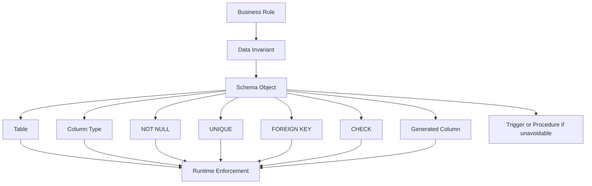
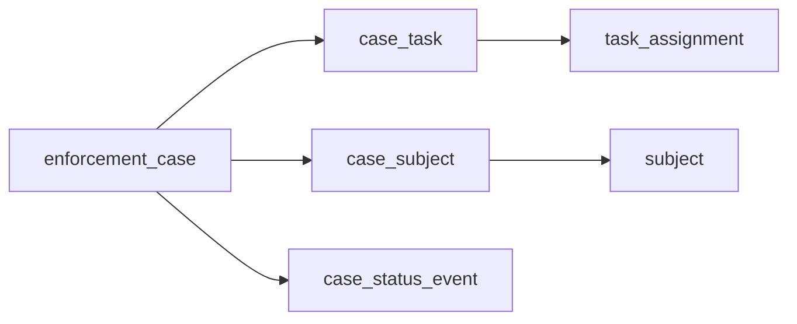
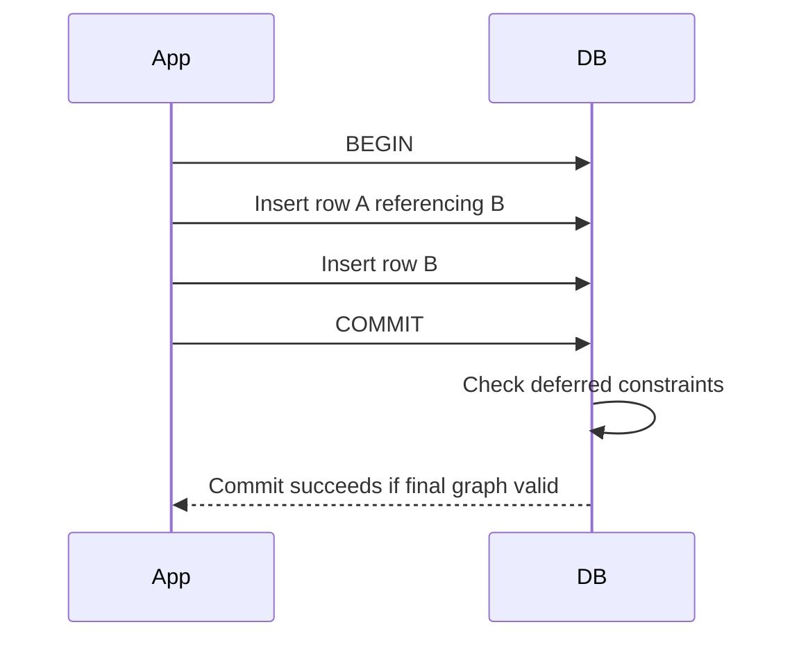
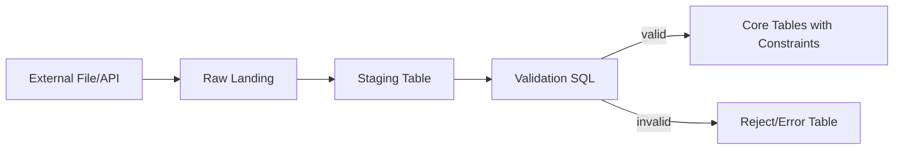
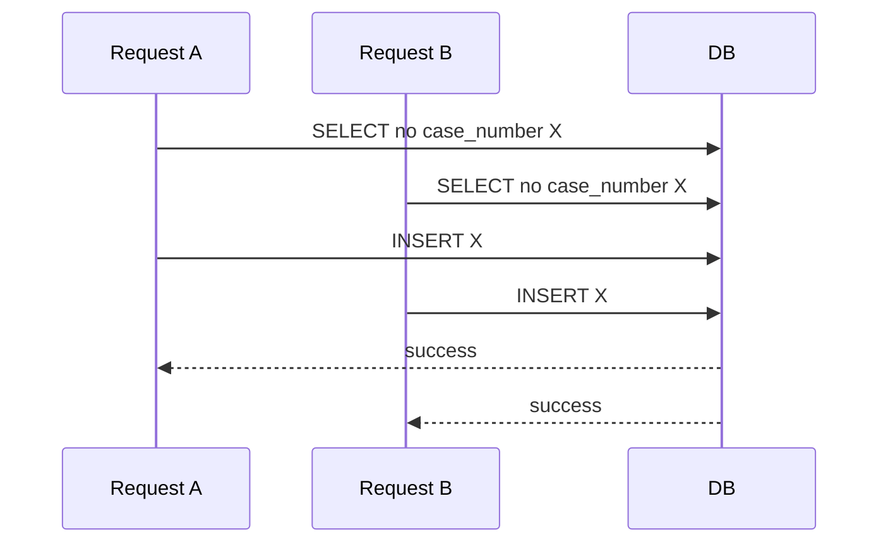
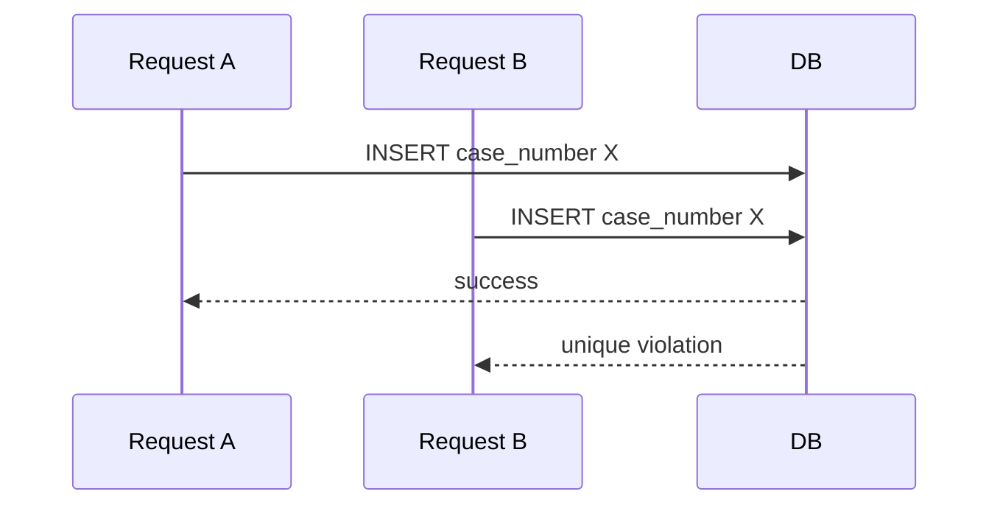

# Part 005 — Schema Design: Tables, Keys, and Constraints

> Target part ini: kita tidak sekadar bisa menulis `CREATE TABLE`. Kita ingin mampu membaca schema sebagai **kumpulan invariant bisnis dan teknis** yang harus tetap benar meskipun aplikasi berubah, service di-redeploy, job retry, consumer lambat, migration gagal separuh, atau manusia melakukan operasi manual.

SQL engineer yang kuat tidak melihat table sebagai “tempat menyimpan data”. Table adalah **boundary kebenaran**. Constraint adalah **compiler rule untuk data**. Key adalah **identitas dan relasi**. DDL adalah **kontrak jangka panjang**.

---

## 1. Skill yang Harus Dikuasai di Part Ini

Berdasarkan pendekatan Kaufman, kita pecah skill besar “mendesain schema SQL” menjadi sub-skill kecil yang bisa dilatih cepat:

1. Membedakan entity, relationship, event, snapshot, aggregate, dan lookup table.
2. Menentukan candidate key, primary key, alternate key, dan foreign key.
3. Memilih natural key, surrogate key, atau composite key secara sadar.
4. Menulis constraint yang menjaga invariant, bukan hanya “validasi kosmetik”.
5. Mendesain referential action: restrict, cascade, set null, set default.
6. Menentukan nullability sebagai bagian dari lifecycle, bukan default malas.
7. Menggunakan default, identity, generated column, dan check constraint dengan benar.
8. Membaca schema untuk menemukan bug tersembunyi sebelum query ditulis.
9. Menilai risiko DDL terhadap migration, locking, compatibility, dan rollback.
10. Membuat review checklist untuk schema production.

Output praktis setelah part ini: ketika diberi requirement seperti “case bisa dieskalasi, di-reassign, di-close, lalu diaudit”, kamu bisa merancang table dan constraint yang memaksa data tetap defensible.

---

## 2. Mental Model: Schema adalah Program yang Selalu Berjalan

Aplikasi hanya berjalan ketika request masuk. Constraint database berjalan setiap kali data berubah, dari jalur mana pun:

- REST API
- background job
- ETL
- admin console
- SQL console
- migration script
- CDC replay
- batch repair
- test fixture
- integration import

Karena itu schema adalah “program” yang paling dekat dengan data.



Prinsip utamanya:

> Semakin penting invariant untuk integritas sistem, semakin dekat invariant itu harus hidup dengan data.

Validasi di UI itu bagus untuk UX. Validasi di API itu bagus untuk error message. Constraint di database itu bagus untuk **kebenaran akhir**.

---

## 3. Table: Bukan Spreadsheet, tapi Predicate yang Diberi Nama

Dari perspektif relational model, table merepresentasikan predicate. Setiap row adalah fakta yang membuat predicate itu benar.

Contoh:

```sql
CREATE TABLE enforcement_case (
    case_id          bigint GENERATED ALWAYS AS IDENTITY PRIMARY KEY,
    case_number      text NOT NULL UNIQUE,
    subject_id       bigint NOT NULL,
    status           text NOT NULL,
    opened_at        timestamptz NOT NULL,
    closed_at        timestamptz,
    created_at       timestamptz NOT NULL DEFAULT now()
);
```

Predicate-nya kira-kira:

> Ada sebuah enforcement case dengan identifier `case_id`, nomor bisnis `case_number`, subjek `subject_id`, status saat ini `status`, waktu dibuka `opened_at`, mungkin waktu ditutup `closed_at`, dan waktu record dibuat `created_at`.

Kalau predicate table tidak jelas, schema akan membusuk.

### 3.1 Gejala Table yang Predicate-nya Kabur

| Gejala | Contoh | Dampak |
|---|---|---|
| Nama table terlalu generik | `data`, `info`, `mapping`, `transaction` | Query sulit dibaca; ownership kabur. |
| Kolom campur lifecycle dan event | `case.status`, `case.escalated_by`, `case.approved_by`, `case.rejected_reason`, `case.reopened_count` tanpa event table | Audit sulit; state transition tidak defensible. |
| Banyak nullable unrelated columns | `approved_at`, `rejected_at`, `cancelled_at`, `expired_at`, `manual_override_at` dalam satu row | Row memiliki banyak bentuk implisit. |
| Table menjadi “junk drawer” | `reference_value(type, code, value1, value2, value3)` | Constraint spesifik tidak bisa ditegakkan. |
| Tidak jelas apakah row adalah current state atau history | `case_assignment` tanpa validity period atau active flag yang unik | Duplicate active assignment. |

### 3.2 Tipe Table dalam Sistem Produksi

| Jenis Table | Fungsi | Contoh | Kunci Desain |
|---|---|---|---|
| Entity table | Menyimpan identitas objek bisnis jangka panjang | `party`, `account`, `enforcement_case` | Stable key, lifecycle minimal. |
| Relationship table | Menyatakan relasi antar entity | `case_subject`, `case_officer_assignment` | Composite uniqueness, validity. |
| Event table | Merekam kejadian immutable | `case_status_event`, `case_note_event` | Append-only, ordered, audited. |
| State table | Menyimpan current snapshot | `case_current_state` | Derived atau source of truth harus jelas. |
| Lookup table | Domain nilai yang dikelola | `case_status_type`, `violation_category` | Code stable, display label boleh berubah. |
| Queue/work table | Mengatur pekerjaan concurrent | `outbox_message`, `case_task` | Locking, retry, visibility. |
| Ledger table | Merekam fakta finansial/kuantitatif immutable | `fine_ledger_entry` | No update/delete, balancing invariant. |
| Audit table | Merekam siapa mengubah apa | `case_audit_log` | Completeness, correlation id. |

Kesalahan umum: membuat semua table sebagai entity table. Padahal sistem kompleks sering butuh event table dan relationship table untuk menjaga traceability.

---

## 4. Anatomy `CREATE TABLE`

Template mental:

```sql
CREATE TABLE schema_name.table_name (
    -- identity / primary key
    id              bigint GENERATED ALWAYS AS IDENTITY,

    -- business identifiers
    business_code   text NOT NULL,

    -- foreign keys
    parent_id       bigint NOT NULL,

    -- facts
    amount          numeric(18, 2) NOT NULL,
    occurred_at     timestamptz NOT NULL,

    -- lifecycle metadata
    created_at      timestamptz NOT NULL DEFAULT now(),
    created_by      text NOT NULL,

    -- constraints
    CONSTRAINT pk_table_name PRIMARY KEY (id),
    CONSTRAINT uq_table_name_business_code UNIQUE (business_code),
    CONSTRAINT fk_table_name_parent FOREIGN KEY (parent_id)
        REFERENCES parent_table(parent_id),
    CONSTRAINT ck_table_name_amount_non_negative CHECK (amount >= 0)
);
```

Kenapa constraint diberi nama eksplisit?

1. Error message lebih bisa dibaca.
2. Migration lebih deterministik.
3. Monitoring constraint violation lebih jelas.
4. Tool schema diff tidak membuat nama random berbeda antar environment.
5. Incident response lebih cepat: nama constraint langsung memberi konteks invariant.

### 4.1 Naming Convention yang Praktis

| Constraint | Pola Nama | Contoh |
|---|---|---|
| Primary key | `pk_<table>` | `pk_enforcement_case` |
| Unique | `uq_<table>_<columns>` | `uq_enforcement_case_case_number` |
| Foreign key | `fk_<child>_<parent>` atau `fk_<child>_<columns>` | `fk_case_subject_subject` |
| Check | `ck_<table>_<rule>` | `ck_case_closed_after_opened` |
| Index | `ix_<table>_<columns>` | `ix_case_status_opened_at` |
| Partial/filtered index | `ix_<table>_<condition>` | `ix_case_active_subject` |

Jangan mengejar nama terlalu pendek. Nama constraint adalah dokumentasi runtime.

---

## 5. Column Nullability: `NULL` adalah State, Bukan Placeholder

`NULL` berarti nilai tidak ada, tidak diketahui, tidak berlaku, atau belum terjadi. Keempat makna itu berbeda.

| Makna | Contoh | Desain yang Lebih Baik |
|---|---|---|
| Belum diketahui | `date_of_birth NULL` | Boleh nullable jika fakta memang belum tersedia. |
| Tidak berlaku | `closed_at NULL` untuk case open | Nullable masuk akal, tapi harus ada check dengan status. |
| Belum terjadi | `approved_at NULL` | Sering lebih baik event table `case_approval_event`. |
| Disembunyikan | `email NULL` karena privacy masking | Jangan campur masking dengan absence; gunakan access layer. |
| Data rusak | `subject_id NULL` karena import gagal | Jangan nullable; gunakan staging table. |

Prinsip:

> Default untuk kolom penting adalah `NOT NULL`. Buka nullability hanya jika ada state bisnis yang eksplisit.

### 5.1 Nullability dan Lifecycle

Contoh rule:

- Case yang masih open tidak punya `closed_at`.
- Case yang closed wajib punya `closed_at`.
- `closed_at` tidak boleh lebih awal dari `opened_at`.

```sql
CREATE TABLE enforcement_case (
    case_id     bigint GENERATED ALWAYS AS IDENTITY,
    status      text NOT NULL,
    opened_at   timestamptz NOT NULL,
    closed_at   timestamptz,

    CONSTRAINT pk_enforcement_case PRIMARY KEY (case_id),
    CONSTRAINT ck_case_status_known
        CHECK (status IN ('OPEN', 'ESCALATED', 'CLOSED', 'CANCELLED')),
    CONSTRAINT ck_case_closed_at_consistent
        CHECK (
            (status IN ('OPEN', 'ESCALATED') AND closed_at IS NULL)
            OR
            (status IN ('CLOSED', 'CANCELLED') AND closed_at IS NOT NULL AND closed_at >= opened_at)
        )
);
```

Ini bukan sekadar validasi. Ini membuat database menolak state yang tidak mungkin.

### 5.2 Anti-Pattern: Nullable Foreign Key yang Menyembunyikan Polymorphism

```sql
CREATE TABLE document_attachment (
    attachment_id bigint PRIMARY KEY,
    case_id       bigint,
    task_id       bigint,
    note_id       bigint
);
```

Masalah:

- Row bisa punya semua null.
- Row bisa punya lebih dari satu parent.
- FK tidak menjelaskan jenis parent secara eksplisit.
- Query menjadi penuh kondisi ambigu.

Minimal harus ada check:

```sql
CONSTRAINT ck_attachment_exactly_one_parent CHECK (
    ((case_id IS NOT NULL)::int +
     (task_id IS NOT NULL)::int +
     (note_id IS NOT NULL)::int) = 1
)
```

Namun di banyak sistem, lebih bersih membuat table relasi terpisah:

```sql
case_attachment(case_id, attachment_id)
task_attachment(task_id, attachment_id)
note_attachment(note_id, attachment_id)
```

Trade-off-nya: table lebih banyak, tetapi invariant lebih jelas.

---

## 6. Keys: Identitas, Bukan Sekadar Auto-Increment

Key menjawab: “bagaimana row ini dibedakan dari row lain?”

Jenis key:

| Key | Arti | Contoh |
|---|---|---|
| Superkey | Satu atau lebih kolom yang unik | `(case_id, case_number)` |
| Candidate key | Superkey minimal | `case_id`, `case_number` |
| Primary key | Candidate key yang dipilih sebagai identitas utama | `case_id` |
| Alternate key | Candidate key lain yang tetap enforced | `case_number` |
| Foreign key | Referensi ke key table lain | `case.subject_id -> subject.subject_id` |
| Composite key | Key dengan beberapa kolom | `(case_id, subject_id)` |
| Natural key | Key berasal dari domain bisnis | `case_number` |
| Surrogate key | Key buatan sistem | `case_id` |

### 6.1 Primary Key Harus Stabil

Primary key yang baik:

1. Unik.
2. Tidak berubah.
3. Kecil untuk index dan FK.
4. Tidak mengandung makna yang sering berubah.
5. Bisa digunakan sebagai referensi jangka panjang.

Buruk:

```sql
PRIMARY KEY (email)
```

Email bisa berubah, bisa case-insensitive, bisa direuse tergantung domain, dan bisa punya aturan normalisasi rumit.

Lebih aman:

```sql
CREATE TABLE app_user (
    user_id    bigint GENERATED ALWAYS AS IDENTITY PRIMARY KEY,
    email      text NOT NULL,
    CONSTRAINT uq_app_user_email UNIQUE (email)
);
```

`email` tetap candidate key secara bisnis, tetapi bukan anchor relasi internal.

### 6.2 Natural Key vs Surrogate Key

Tidak ada jawaban universal.

| Pilihan | Kelebihan | Risiko |
|---|---|---|
| Natural key | Meaningful, mencegah duplicate domain object, mudah rekonsiliasi | Bisa berubah, panjang, aturan equality rumit, vendor external bisa salah. |
| Surrogate key | Stabil, kecil, FK efisien, tidak tergantung format bisnis | Duplicate bisnis bisa masuk jika alternate key tidak enforced. |
| Composite key | Natural untuk relationship dan weak entity | FK panjang, join verbose, update sulit jika komponen berubah. |

Rule praktis:

> Gunakan surrogate key untuk identitas internal jangka panjang, tetapi enforce natural/business key dengan `UNIQUE` jika domain memang menuntut uniqueness.

Contoh:

```sql
CREATE TABLE enforcement_case (
    case_id     bigint GENERATED ALWAYS AS IDENTITY,
    case_number text NOT NULL,

    CONSTRAINT pk_enforcement_case PRIMARY KEY (case_id),
    CONSTRAINT uq_enforcement_case_case_number UNIQUE (case_number)
);
```

Tanpa unique pada `case_number`, surrogate key hanya menutupi duplicate data.

### 6.3 Composite Key untuk Relationship Table

Relationship table sering lebih tepat memakai composite key.

```sql
CREATE TABLE case_subject (
    case_id    bigint NOT NULL,
    subject_id bigint NOT NULL,
    role_code  text NOT NULL,

    CONSTRAINT pk_case_subject PRIMARY KEY (case_id, subject_id, role_code),
    CONSTRAINT fk_case_subject_case FOREIGN KEY (case_id)
        REFERENCES enforcement_case(case_id),
    CONSTRAINT fk_case_subject_subject FOREIGN KEY (subject_id)
        REFERENCES subject(subject_id),
    CONSTRAINT ck_case_subject_role CHECK (role_code IN ('PRIMARY', 'RELATED', 'WITNESS'))
);
```

Jika satu case hanya boleh punya satu primary subject:

```sql
CREATE UNIQUE INDEX uq_case_subject_one_primary
ON case_subject(case_id)
WHERE role_code = 'PRIMARY';
```

Partial/filtered unique index seperti ini sangat kuat untuk invariant bersyarat. Dukungan syntax berbeda antar vendor, jadi perlu disesuaikan.

---

## 7. Foreign Key: Referential Integrity sebagai Graph Contract

Foreign key memastikan child row tidak menunjuk parent yang tidak ada.

```sql
CREATE TABLE case_task (
    task_id     bigint GENERATED ALWAYS AS IDENTITY,
    case_id     bigint NOT NULL,
    task_type   text NOT NULL,
    status      text NOT NULL,

    CONSTRAINT pk_case_task PRIMARY KEY (task_id),
    CONSTRAINT fk_case_task_case FOREIGN KEY (case_id)
        REFERENCES enforcement_case(case_id)
);
```

Mental model:



Foreign key bukan “fitur optional”. Ia menjawab pertanyaan operasional:

- Apakah orphan row bisa terjadi?
- Kalau parent dihapus, child harus diapakan?
- Kalau parent key berubah, child ikut berubah?
- Apakah graph data bisa dipertanggungjawabkan saat audit?

### 7.1 Referential Action

| Action | Meaning | Kapan Cocok | Risiko |
|---|---|---|---|
| `RESTRICT` / `NO ACTION` | Tolak delete/update parent jika masih direferensikan | Default aman untuk data bisnis penting | Perlu proses cleanup eksplisit. |
| `CASCADE` | Child ikut delete/update | Table dependent murni, test data, weak entity | Bisa menghapus graph besar tanpa sadar. |
| `SET NULL` | FK child menjadi null | Relationship optional setelah parent hilang | Butuh nullable FK dan semantic jelas. |
| `SET DEFAULT` | FK child menjadi default | Ada parent default seperti `UNKNOWN` | Sering menyembunyikan data quality issue. |

Untuk enforcement/case management, default aman biasanya `RESTRICT`. Data regulatoris jarang boleh hilang cascade.

```sql
CONSTRAINT fk_case_task_case FOREIGN KEY (case_id)
    REFERENCES enforcement_case(case_id)
    ON DELETE RESTRICT
```

### 7.2 Cascade Delete: Pisau Tajam

Cascade delete cocok untuk:

- row detail yang tidak bermakna tanpa parent,
- temporary/test data,
- session-scoped data,
- pure association table.

Cascade delete berbahaya untuk:

- audit log,
- financial ledger,
- enforcement case,
- document evidence,
- workflow history,
- externally referenced records.

Contoh buruk:

```sql
CREATE TABLE case_evidence (
    evidence_id bigint PRIMARY KEY,
    case_id     bigint NOT NULL REFERENCES enforcement_case(case_id) ON DELETE CASCADE
);
```

Jika case dihapus accidental, evidence ikut hilang. Untuk domain regulatoris, lebih baik soft lifecycle eksplisit:

```sql
ALTER TABLE enforcement_case
ADD COLUMN deleted_at timestamptz;
```

Atau gunakan status seperti `VOIDED`, dengan event audit.

---

## 8. Unique Constraint: Mencegah Duplicate Reality

Unique constraint bukan hanya untuk login email. Ia menjaga bahwa fakta bisnis tidak muncul dua kali.

Contoh duplicate yang sering merusak sistem:

- Dua case dengan nomor external sama.
- Dua active assignment untuk officer yang sama di case yang sama.
- Dua current address untuk party yang sama.
- Dua invoice dengan nomor vendor sama.
- Dua outbox message untuk aggregate/version yang sama.

```sql
CREATE TABLE case_assignment (
    assignment_id bigint GENERATED ALWAYS AS IDENTITY,
    case_id       bigint NOT NULL,
    officer_id    bigint NOT NULL,
    assigned_at   timestamptz NOT NULL,
    unassigned_at timestamptz,

    CONSTRAINT pk_case_assignment PRIMARY KEY (assignment_id),
    CONSTRAINT fk_assignment_case FOREIGN KEY (case_id)
        REFERENCES enforcement_case(case_id),
    CONSTRAINT fk_assignment_officer FOREIGN KEY (officer_id)
        REFERENCES officer(officer_id),
    CONSTRAINT ck_assignment_period CHECK (
        unassigned_at IS NULL OR unassigned_at > assigned_at
    )
);
```

Invariant: satu case hanya boleh punya satu active assignment per officer.

```sql
CREATE UNIQUE INDEX uq_assignment_active_officer_per_case
ON case_assignment(case_id, officer_id)
WHERE unassigned_at IS NULL;
```

Invariant: satu case hanya boleh punya satu active primary officer.

```sql
ALTER TABLE case_assignment
ADD COLUMN role_code text NOT NULL DEFAULT 'OWNER';

CREATE UNIQUE INDEX uq_assignment_one_active_owner_per_case
ON case_assignment(case_id)
WHERE unassigned_at IS NULL AND role_code = 'OWNER';
```

Tanpa unique invariant, aplikasi harus “berharap” tidak ada race condition. Di sistem concurrent, hope is not a strategy.

---

## 9. `CHECK` Constraint: Domain Rule yang Lokal ke Row

`CHECK` constraint cocok untuk rule yang bisa dievaluasi dari row itu sendiri.

Contoh:

```sql
CREATE TABLE fine_assessment (
    assessment_id bigint GENERATED ALWAYS AS IDENTITY,
    case_id       bigint NOT NULL,
    amount        numeric(18,2) NOT NULL,
    currency_code char(3) NOT NULL,
    assessed_at   timestamptz NOT NULL,

    CONSTRAINT pk_fine_assessment PRIMARY KEY (assessment_id),
    CONSTRAINT ck_fine_amount_positive CHECK (amount > 0),
    CONSTRAINT ck_fine_currency_upper CHECK (currency_code = upper(currency_code))
);
```

`CHECK` cocok untuk:

- amount positif,
- tanggal akhir setelah tanggal awal,
- enum kecil jika tidak pakai lookup table,
- format sederhana,
- kombinasi status dan timestamp dalam row yang sama,
- batas numerik teknis.

`CHECK` kurang cocok untuk:

- rule yang perlu query ke row lain,
- aggregate invariant seperti total debit = total credit,
- “maksimal 3 active tasks per case”,
- “officer tidak boleh menangani case yang dia submit sendiri” jika datanya di table lain.

Rule lintas row biasanya butuh unique index, exclusion constraint, trigger, materialized validation, atau transaction-level logic.

### 9.1 Enum via `CHECK` vs Lookup Table

```sql
status text NOT NULL CHECK (status IN ('OPEN', 'ESCALATED', 'CLOSED'))
```

Bagus jika:

- daftar sangat kecil,
- jarang berubah,
- tidak butuh metadata,
- tidak perlu localization,
- tidak perlu lifecycle value.

Lookup table lebih baik jika:

- butuh label, description, sort order,
- value bisa inactive,
- butuh mapping external,
- butuh permission per status,
- butuh workflow transition matrix.

```sql
CREATE TABLE case_status_type (
    status_code text PRIMARY KEY,
    label       text NOT NULL,
    is_terminal boolean NOT NULL,
    sort_order  integer NOT NULL,
    is_active   boolean NOT NULL DEFAULT true
);

CREATE TABLE enforcement_case (
    case_id     bigint GENERATED ALWAYS AS IDENTITY PRIMARY KEY,
    status_code text NOT NULL REFERENCES case_status_type(status_code)
);
```

Untuk sistem regulatory/workflow, lookup table biasanya menang karena status bukan sekadar string. Status punya meaning, transition, terminality, SLA, dan permission.

---

## 10. Defaults: Convenience atau Hidden Business Decision?

Default terlihat sederhana:

```sql
created_at timestamptz NOT NULL DEFAULT now()
```

Namun default adalah keputusan bisnis/teknis.

| Default | Aman? | Catatan |
|---|---|---|
| `created_at DEFAULT now()` | Biasanya aman | Untuk waktu insert database. |
| `status DEFAULT 'OPEN'` | Bisa aman | Pastikan semua jalur create memang mulai dari OPEN. |
| `amount DEFAULT 0` | Sering berbahaya | Nol bisa berarti fakta valid, bukan missing. |
| `created_by DEFAULT current_user` | Tergantung | DB user sering service account, bukan actor bisnis. |
| `is_active DEFAULT true` | Hati-hati | Bisa menyembunyikan lifecycle yang belum eksplisit. |
| `priority DEFAULT 'NORMAL'` | Bisa aman | Jika benar-benar default domain. |

Prinsip:

> Default boleh digunakan untuk fakta yang benar ketika caller tidak memberi nilai, bukan untuk menutupi input yang hilang.

### 10.1 Default untuk Audit Field

```sql
created_at timestamptz NOT NULL DEFAULT now(),
updated_at timestamptz NOT NULL DEFAULT now()
```

`updated_at DEFAULT now()` hanya benar saat insert. Saat update, database tidak otomatis mengubahnya kecuali ada trigger/procedure atau aplikasi mengisi.

Jangan mengira default adalah lifecycle automation.

---

## 11. Identity, Sequence, Auto-Increment, dan UUID

Identity column menghasilkan nilai key otomatis.

PostgreSQL standard-style:

```sql
case_id bigint GENERATED ALWAYS AS IDENTITY PRIMARY KEY
```

SQL Server:

```sql
case_id bigint IDENTITY(1,1) PRIMARY KEY
```

MySQL:

```sql
case_id bigint AUTO_INCREMENT PRIMARY KEY
```

### 11.1 Identity Bukan Jaminan Urutan Bisnis

Auto-generated ID biasanya:

- unik,
- increasing per sequence,
- bisa memiliki gap,
- tidak selalu merepresentasikan urutan commit,
- tidak aman sebagai timestamp,
- bisa berbeda setelah restore/replication/failover tergantung engine.

Jangan pakai `case_id` untuk mengatakan “case A terjadi sebelum case B” kecuali requirement-nya memang hanya “ID lebih kecil”. Untuk urutan bisnis, simpan timestamp/event sequence eksplisit.

```sql
opened_at timestamptz NOT NULL
```

Jika butuh ordering per aggregate:

```sql
CREATE TABLE case_event (
    case_id       bigint NOT NULL,
    event_seq     integer NOT NULL,
    event_type    text NOT NULL,
    occurred_at   timestamptz NOT NULL,

    CONSTRAINT pk_case_event PRIMARY KEY (case_id, event_seq),
    CONSTRAINT uq_case_event_case_occurred UNIQUE (case_id, occurred_at, event_seq)
);
```

### 11.2 UUID sebagai Primary Key

UUID berguna untuk:

- distributed ID generation,
- public identifier yang tidak mudah ditebak,
- offline creation,
- merging data dari banyak node,
- avoiding central sequence dependency.

Risiko:

- index lebih besar daripada bigint,
- random UUID dapat mengurangi locality B-tree,
- debugging manual lebih sulit,
- manusia sulit membaca dan menyebutkan.

Strategi umum:

```sql
CREATE TABLE enforcement_case (
    case_id          bigint GENERATED ALWAYS AS IDENTITY PRIMARY KEY,
    public_case_id   uuid NOT NULL UNIQUE,
    case_number      text NOT NULL UNIQUE
);
```

Internal FK memakai `bigint`, external API memakai `public_case_id`. Ini sering menjadi kompromi yang baik.

---

## 12. Generated Columns: Derived Fact yang Dipersist atau Dihitung

Generated column adalah kolom yang nilainya dihitung dari expression.

Contoh:

```sql
CREATE TABLE person_name (
    person_id   bigint GENERATED ALWAYS AS IDENTITY PRIMARY KEY,
    first_name  text NOT NULL,
    last_name   text NOT NULL,
    full_name   text GENERATED ALWAYS AS (first_name || ' ' || last_name) STORED
);
```

Generated column cocok untuk:

- normalisasi expression yang sering dipakai,
- index atas expression,
- canonical value,
- derived field sederhana,
- mengurangi mismatch antara app dan DB.

Tidak cocok untuk:

- logic bisnis kompleks,
- logic yang membutuhkan table lain,
- logic yang sering berubah,
- logic yang butuh external service,
- derived state yang memiliki lifecycle sendiri.

### 12.1 Generated Column untuk Canonical Key

Misalnya email case-insensitive:

```sql
CREATE TABLE app_user (
    user_id          bigint GENERATED ALWAYS AS IDENTITY PRIMARY KEY,
    email            text NOT NULL,
    email_canonical  text GENERATED ALWAYS AS (lower(email)) STORED,
    CONSTRAINT uq_app_user_email_canonical UNIQUE (email_canonical)
);
```

Ini mencegah duplicate:

- `Alice@Example.com`
- `alice@example.com`

Namun hati-hati: aturan canonical email bisa lebih kompleks dari `lower()` tergantung domain.

---

## 13. Constraint Timing: Immediate, Deferred, Validated, Not Valid

Beberapa database mendukung constraint yang bisa deferred sampai commit. Ini penting saat ada circular reference atau batch update.

Contoh konseptual:

```sql
ALTER TABLE case_review
ADD CONSTRAINT fk_review_case
FOREIGN KEY (case_id)
REFERENCES enforcement_case(case_id)
DEFERRABLE INITIALLY DEFERRED;
```

Mental model:



Deferred constraint tidak berarti constraint dimatikan. Artinya waktu pengecekan dipindah ke akhir transaction.

### 13.1 Validating Existing Data

Saat menambah constraint ke table besar yang sudah ada, kamu perlu memikirkan:

- apakah existing data valid,
- apakah DDL akan lock table,
- apakah validation bisa online,
- apakah aplikasi versi lama masih menulis data invalid,
- apakah rollout butuh expand-contract.

Pola aman:

1. Tambahkan kolom nullable jika perlu.
2. Deploy aplikasi yang mulai mengisi kolom.
3. Backfill data lama.
4. Tambahkan constraint dalam mode non-blocking jika engine mendukung.
5. Validate constraint.
6. Ubah menjadi `NOT NULL` atau constraint final.
7. Bersihkan compatibility code.

Kita akan mendalami migration di Part 028.

---

## 14. Schema untuk Case Management: Contoh Produksi

Kita rancang versi awal sistem enforcement case dengan constraint defensible.

### 14.1 Requirement

- Case memiliki nomor bisnis unik.
- Case punya subject utama.
- Case memiliki status dari lookup.
- Status terminal adalah `CLOSED` atau `CANCELLED`.
- Waktu close wajib ada jika terminal.
- Case bisa punya officer assignment.
- Hanya satu active owner per case.
- Semua status change harus terekam sebagai event.

### 14.2 DDL

```sql
CREATE TABLE case_status_type (
    status_code text PRIMARY KEY,
    label text NOT NULL,
    is_terminal boolean NOT NULL,
    sort_order integer NOT NULL,
    is_active boolean NOT NULL DEFAULT true,
    CONSTRAINT uq_case_status_sort_order UNIQUE (sort_order),
    CONSTRAINT ck_case_status_code_upper CHECK (status_code = upper(status_code))
);

INSERT INTO case_status_type(status_code, label, is_terminal, sort_order)
VALUES
    ('OPEN', 'Open', false, 10),
    ('ESCALATED', 'Escalated', false, 20),
    ('CLOSED', 'Closed', true, 90),
    ('CANCELLED', 'Cancelled', true, 99);

CREATE TABLE subject (
    subject_id bigint GENERATED ALWAYS AS IDENTITY,
    subject_ref text NOT NULL,
    display_name text NOT NULL,
    created_at timestamptz NOT NULL DEFAULT now(),

    CONSTRAINT pk_subject PRIMARY KEY (subject_id),
    CONSTRAINT uq_subject_ref UNIQUE (subject_ref)
);

CREATE TABLE enforcement_case (
    case_id bigint GENERATED ALWAYS AS IDENTITY,
    case_number text NOT NULL,
    primary_subject_id bigint NOT NULL,
    status_code text NOT NULL,
    opened_at timestamptz NOT NULL,
    closed_at timestamptz,
    created_at timestamptz NOT NULL DEFAULT now(),
    created_by text NOT NULL,

    CONSTRAINT pk_enforcement_case PRIMARY KEY (case_id),
    CONSTRAINT uq_enforcement_case_number UNIQUE (case_number),
    CONSTRAINT fk_case_primary_subject FOREIGN KEY (primary_subject_id)
        REFERENCES subject(subject_id),
    CONSTRAINT fk_case_status FOREIGN KEY (status_code)
        REFERENCES case_status_type(status_code),
    CONSTRAINT ck_case_closed_after_opened CHECK (
        closed_at IS NULL OR closed_at >= opened_at
    )
);
```

Perhatikan: `closed_at` belum bisa di-check terhadap `is_terminal` karena `is_terminal` ada di table lookup. `CHECK` tidak bisa portably query table lain. Opsi:

1. Duplikasi terminality sebagai generated/local rule berbasis `status_code`.
2. Gunakan trigger.
3. Enforce di application service dan audit dengan assertion query.
4. Gunakan transition/event model sehingga terminality berasal dari event.

Untuk versi awal, kita bisa pakai check lokal:

```sql
ALTER TABLE enforcement_case
ADD CONSTRAINT ck_case_terminal_closed_at CHECK (
    (status_code IN ('OPEN', 'ESCALATED') AND closed_at IS NULL)
    OR
    (status_code IN ('CLOSED', 'CANCELLED') AND closed_at IS NOT NULL)
);
```

Trade-off: daftar status terminal terduplikasi. Jika status sering berubah, gunakan model yang lebih eksplisit.

### 14.3 Assignment

```sql
CREATE TABLE officer (
    officer_id bigint GENERATED ALWAYS AS IDENTITY,
    officer_ref text NOT NULL,
    display_name text NOT NULL,
    is_active boolean NOT NULL DEFAULT true,

    CONSTRAINT pk_officer PRIMARY KEY (officer_id),
    CONSTRAINT uq_officer_ref UNIQUE (officer_ref)
);

CREATE TABLE case_assignment (
    assignment_id bigint GENERATED ALWAYS AS IDENTITY,
    case_id bigint NOT NULL,
    officer_id bigint NOT NULL,
    role_code text NOT NULL,
    assigned_at timestamptz NOT NULL,
    unassigned_at timestamptz,
    assigned_by text NOT NULL,

    CONSTRAINT pk_case_assignment PRIMARY KEY (assignment_id),
    CONSTRAINT fk_assignment_case FOREIGN KEY (case_id)
        REFERENCES enforcement_case(case_id),
    CONSTRAINT fk_assignment_officer FOREIGN KEY (officer_id)
        REFERENCES officer(officer_id),
    CONSTRAINT ck_assignment_role CHECK (role_code IN ('OWNER', 'REVIEWER', 'OBSERVER')),
    CONSTRAINT ck_assignment_period CHECK (
        unassigned_at IS NULL OR unassigned_at > assigned_at
    )
);

CREATE UNIQUE INDEX uq_case_assignment_one_active_owner
ON case_assignment(case_id)
WHERE role_code = 'OWNER' AND unassigned_at IS NULL;

CREATE UNIQUE INDEX uq_case_assignment_active_role_officer
ON case_assignment(case_id, role_code, officer_id)
WHERE unassigned_at IS NULL;
```

Di sini constraint menangkap dua invariant:

1. Satu case hanya punya satu active owner.
2. Officer yang sama tidak bisa punya duplicate active role pada case yang sama.

### 14.4 Status Event

```sql
CREATE TABLE case_status_event (
    case_id bigint NOT NULL,
    event_seq integer NOT NULL,
    from_status_code text,
    to_status_code text NOT NULL,
    changed_at timestamptz NOT NULL,
    changed_by text NOT NULL,
    reason text,

    CONSTRAINT pk_case_status_event PRIMARY KEY (case_id, event_seq),
    CONSTRAINT fk_status_event_case FOREIGN KEY (case_id)
        REFERENCES enforcement_case(case_id),
    CONSTRAINT fk_status_event_from_status FOREIGN KEY (from_status_code)
        REFERENCES case_status_type(status_code),
    CONSTRAINT fk_status_event_to_status FOREIGN KEY (to_status_code)
        REFERENCES case_status_type(status_code),
    CONSTRAINT ck_status_event_seq_positive CHECK (event_seq > 0),
    CONSTRAINT ck_status_event_transition_changes CHECK (
        from_status_code IS NULL OR from_status_code <> to_status_code
    )
);
```

Ini belum mencegah transition illegal seperti `CLOSED -> OPEN`. Untuk itu kita bisa tambah transition table.

```sql
CREATE TABLE case_status_transition_type (
    from_status_code text NOT NULL,
    to_status_code text NOT NULL,
    requires_reason boolean NOT NULL DEFAULT false,

    CONSTRAINT pk_status_transition PRIMARY KEY (from_status_code, to_status_code),
    CONSTRAINT fk_transition_from FOREIGN KEY (from_status_code)
        REFERENCES case_status_type(status_code),
    CONSTRAINT fk_transition_to FOREIGN KEY (to_status_code)
        REFERENCES case_status_type(status_code),
    CONSTRAINT ck_transition_not_self CHECK (from_status_code <> to_status_code)
);
```

Namun untuk event pertama, `from_status_code` bisa null. Foreign key composite terhadap transition table butuh desain khusus atau trigger. Kita simpan pembahasan workflow lebih dalam untuk Part 022.

---

## 15. Table Boundary: Staging vs Core

Jangan paksakan data kotor masuk ke core table.



Core table harus ketat. Staging table boleh longgar.

### 15.1 Staging Table

```sql
CREATE TABLE stg_case_import (
    import_id bigint GENERATED ALWAYS AS IDENTITY PRIMARY KEY,
    batch_id text NOT NULL,
    row_number integer NOT NULL,
    case_number text,
    subject_ref text,
    opened_at_text text,
    raw_payload text NOT NULL,
    loaded_at timestamptz NOT NULL DEFAULT now(),
    validation_error text
);
```

Staging menyimpan raw data dan error. Core table menegakkan invariant.

Anti-pattern:

> Membuat core table nullable semua karena import data sering kotor.

Itu memindahkan masalah dari edge ke pusat sistem.

---

## 16. Constraint vs Application Validation

| Rule | UI | API/App | Database |
|---|---:|---:|---:|
| Required field untuk form | Ya | Ya | Ya jika invariant data |
| Email format | Ya | Ya | Mungkin, jika sederhana |
| Unique case number | Tidak cukup | Ya untuk pesan baik | Wajib |
| FK subject exists | Tidak cukup | Ya | Wajib |
| Role permission | Ya | Ya | Kadang via RLS/trigger |
| Cross-row aggregate limit | Tidak cukup | Ya | Bisa via lock/trigger/assertion |
| Referential integrity | Tidak | Bisa | Wajib |
| Audit completeness | Tidak | Ya | Ya sebisa mungkin |

Database tidak mengganti application validation. Database memberikan final safety net.

---

## 17. Anti-Patterns Schema yang Mahal di Produksi

### 17.1 “Everything is VARCHAR”

```sql
CREATE TABLE payment (
    amount text,
    paid_at text,
    is_success text
);
```

Dampak:

- Sorting numerik salah.
- Date parsing tersebar.
- Query tidak sargable.
- Invalid value masuk.
- Index selectivity buruk.
- Constraint sulit.

### 17.2 Tidak Ada Foreign Key karena “Performance”

Argumen ini sering salah framing. Foreign key memang punya write cost, tetapi orphan data juga punya cost:

- reconciliation mahal,
- report salah,
- delete/update tidak aman,
- incident sulit,
- migration berisiko,
- audit defensibility rendah.

Kalau FK benar-benar tidak bisa dipakai karena scale/distributed boundary, buat pengganti eksplisit:

- ownership boundary jelas,
- asynchronous referential check,
- reconciliation job,
- alert,
- repair playbook,
- idempotent delete semantics.

Jangan hanya menghapus FK tanpa replacement mechanism.

### 17.3 Status sebagai Free Text

```sql
status text NOT NULL
```

Tanpa check/lookup, kamu akan dapat:

- `open`, `OPEN`, `Open`,
- `CLOSED`, `CLOSE`, `DONE`,
- trailing spaces,
- deprecated value,
- typo.

Minimum:

```sql
CHECK (status = upper(status))
```

Lebih baik:

```sql
FOREIGN KEY (status_code) REFERENCES case_status_type(status_code)
```

### 17.4 Boolean Explosion

```sql
is_open boolean,
is_closed boolean,
is_cancelled boolean,
is_escalated boolean
```

Ini menciptakan kombinasi invalid:

- open dan closed sama-sama true,
- semua false,
- escalated dan cancelled bersamaan.

Gunakan satu status:

```sql
status_code text NOT NULL REFERENCES case_status_type(status_code)
```

Atau jika flags memang orthogonal, beri constraint yang menjelaskan hubungan antar flag.

### 17.5 Soft Delete Tanpa Unique Strategy

```sql
CREATE TABLE app_user (
    user_id bigint PRIMARY KEY,
    email text NOT NULL UNIQUE,
    deleted_at timestamptz
);
```

Jika user dihapus soft, email tidak bisa dipakai lagi. Mungkin benar, mungkin tidak. Jika hanya active user yang harus unique:

```sql
CREATE UNIQUE INDEX uq_app_user_active_email
ON app_user(lower(email))
WHERE deleted_at IS NULL;
```

Namun ini vendor-specific. Di engine lain, strategi bisa berbeda.

---

## 18. Constraint dan Concurrency

Constraint dievaluasi dalam konteks transaksi. Unique constraint sering menjadi alat concurrency control paling sederhana.

Misal dua request membuat case dengan `case_number` sama.

Tanpa unique:



Dengan unique:



Application-level “check then insert” tidak cukup. Constraint membuat race condition menjadi deterministic conflict.

---

## 19. Review Checklist Schema Production

Gunakan checklist ini sebelum merge migration.

### 19.1 Table Intent

- [ ] Nama table merepresentasikan predicate yang jelas.
- [ ] Table type jelas: entity, relationship, event, lookup, queue, ledger, audit, staging.
- [ ] Source of truth jelas: current state, history, atau derived.
- [ ] Tidak ada table “miscellaneous”.

### 19.2 Keys

- [ ] Primary key stabil dan tidak berubah.
- [ ] Business key penting diberi `UNIQUE`.
- [ ] Relationship table punya composite uniqueness yang sesuai.
- [ ] Tidak ada surrogate key yang menutupi duplicate domain.

### 19.3 Nullability

- [ ] Semua kolom required diberi `NOT NULL`.
- [ ] Setiap nullable column punya alasan lifecycle/domain.
- [ ] Nullable FK tidak menyembunyikan polymorphism yang buruk.
- [ ] `NULL` tidak digunakan untuk “unknown”, “not applicable”, dan “invalid” secara campur aduk tanpa dokumentasi.

### 19.4 Referential Integrity

- [ ] FK ada untuk relasi intra-database yang kuat.
- [ ] Referential action dipilih secara sadar.
- [ ] Tidak ada cascade delete pada data audit/regulatory tanpa alasan kuat.
- [ ] Index pendukung FK dipertimbangkan untuk query dan delete/update parent.

### 19.5 Constraints

- [ ] Check constraint menjaga range/status/timestamp lokal.
- [ ] Unique partial/filtered index dipakai untuk invariant bersyarat bila engine mendukung.
- [ ] Constraint diberi nama eksplisit.
- [ ] Error constraint bisa dipetakan ke error application yang jelas.

### 19.6 Migration Safety

- [ ] DDL impact ke lock/table rewrite dipahami.
- [ ] Existing data sudah divalidasi/backfill.
- [ ] Aplikasi lama dan baru compatible selama rollout.
- [ ] Rollback strategy tersedia.
- [ ] Constraint validation tidak mematikan traffic kritis.

---

## 20. Deliberate Practice 2 Jam

Latihan ini dirancang untuk mempercepat skill acquisition.

### Drill 1 — Predicate Naming

Ambil 10 table dari sistem nyata. Untuk tiap table, tulis kalimat:

> Row di table ini berarti ...

Jika tidak bisa menjelaskan dalam satu kalimat, table itu mungkin kabur.

### Drill 2 — Constraint Discovery

Untuk requirement berikut, tulis constraint apa yang dibutuhkan:

1. Satu customer tidak boleh punya dua active subscription untuk product yang sama.
2. Ticket closed wajib punya `closed_at` dan `closed_by`.
3. Invoice number unik per vendor dan fiscal year.
4. Assignment active tidak boleh overlap untuk officer dan shift yang sama.
5. Case terminal tidak boleh menerima task baru.

Tentukan mana yang bisa dilakukan dengan:

- `NOT NULL`,
- `UNIQUE`,
- composite key,
- partial index,
- `CHECK`,
- FK,
- trigger/application transaction.

### Drill 3 — Schema Refactoring

Refactor table buruk ini:

```sql
CREATE TABLE case_data (
    id bigint PRIMARY KEY,
    case_no text,
    status text,
    subject_name text,
    assigned_user text,
    approved_user text,
    approved_date text,
    rejected_user text,
    rejected_date text,
    is_open boolean,
    is_closed boolean,
    notes text
);
```

Target:

- pisahkan subject,
- buat status lookup,
- buat assignment table,
- buat status event,
- buat notes event,
- enforce uniqueness dan nullability.

### Drill 4 — Race Condition by Constraint

Simulasikan dua transaksi yang memasukkan duplicate business key. Amati perbedaan dengan dan tanpa unique constraint.

### Drill 5 — Delete Policy Review

Untuk setiap FK di schema kamu, jawab:

- Apa yang terjadi jika parent dihapus?
- Apakah child boleh orphan?
- Apakah cascade aman?
- Apakah data ini punya nilai audit/legal?
- Apakah soft delete lebih tepat?

---

## 21. Decision Matrix Ringkas

| Problem | Tool Utama | Catatan |
|---|---|---|
| Row wajib punya nilai | `NOT NULL` | Jangan validasi hanya di app. |
| Nilai harus unik | `UNIQUE` | Composite jika uniqueness scoped. |
| Relasi parent-child | `FOREIGN KEY` | Pilih action sadar. |
| Nilai harus dalam range | `CHECK` | Cocok untuk rule lokal row. |
| Nilai dari daftar kecil | `CHECK` atau lookup FK | Lookup jika butuh metadata/evolusi. |
| Derived sederhana | Generated column | Baik untuk canonical/indexed expression. |
| Active row hanya satu | Partial/filtered unique index | Vendor-specific support. |
| Cross-row complex rule | Trigger/app transaction/assertion | Butuh locking/isolation. |
| Data kotor dari luar | Staging table | Jangan longgarkan core schema. |
| Public ID tidak predictable | UUID public key | Bisa tetap pakai bigint internal. |

---

## 22. Kesimpulan Part 005

Schema design adalah engineering terhadap invariant.

Yang perlu kamu bawa ke part berikutnya:

1. Table merepresentasikan predicate, bukan spreadsheet.
2. Constraint adalah data-level safety net.
3. Primary key harus stabil; business key tetap perlu unique jika domain menuntut.
4. Foreign key menjaga graph data tetap valid.
5. Nullability adalah state modelling decision.
6. Default adalah business/technical decision, bukan obat input kosong.
7. Generated column berguna untuk derived value sederhana dan canonicalization.
8. Constraint membantu concurrency karena mengubah race menjadi conflict yang jelas.
9. Schema production harus direview dengan migration, lock, rollout, dan rollback dalam pikiran.

Di Part 006, kita masuk ke **data types, domains, and precision failure**. Ini penting karena banyak bug SQL production tidak berasal dari query rumit, tetapi dari tipe data yang salah sejak hari pertama.

---

## References

- PostgreSQL Documentation — `CREATE TABLE`, constraints, generated columns, identity columns: https://www.postgresql.org/docs/current/sql-createtable.html
- PostgreSQL Documentation — Identity Columns: https://www.postgresql.org/docs/current/ddl-identity-columns.html
- MySQL 8.4 Reference Manual — `CREATE TABLE` and foreign key constraints: https://dev.mysql.com/doc/refman/8.4/en/create-table.html
- MySQL 8.4 Reference Manual — Foreign Key Constraints: https://dev.mysql.com/doc/refman/8.4/en/create-table-foreign-keys.html
- SQL Server Documentation — `CREATE TABLE`, `IDENTITY`, constraints: https://learn.microsoft.com/en-us/sql/t-sql/statements/create-table-transact-sql
