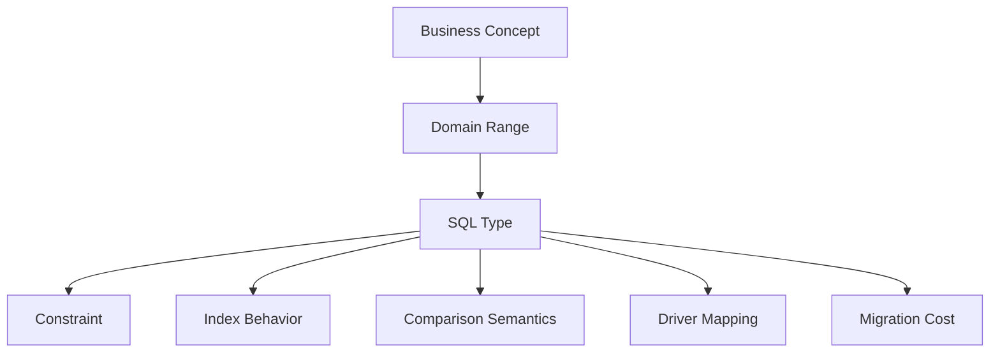

# Part 006 — Data Types, Domains, and Precision Failure

> Target part ini: kamu mampu memilih tipe data sebagai **kontrak domain**, bukan sekadar memilih tipe yang “cukup jalan”. Banyak sistem gagal bukan karena query terlalu kompleks, tetapi karena uang disimpan sebagai floating point, waktu disimpan tanpa time zone policy, status disimpan sebagai free text, ID external disimpan terlalu pendek, dan `NULL` dipakai untuk semua makna.

Tipe data adalah salah satu keputusan schema paling mahal untuk diperbaiki setelah produksi. Mengubah `text` menjadi `numeric`, `timestamp` menjadi `timestamptz`, atau `int` menjadi `bigint` pada table besar bisa menjadi migration berisiko.

---

## 1. Skill yang Harus Dikuasai di Part Ini

Sub-skill yang kita decompose:

1. Memilih tipe numerik exact vs approximate.
2. Menentukan precision dan scale untuk uang, rasio, skor, dan kuantitas.
3. Memahami integer overflow dan ID exhaustion.
4. Membedakan `date`, `time`, `timestamp`, `timestamp with time zone`, dan interval.
5. Menyimpan waktu sebagai instant, local date, scheduled local time, atau validity range.
6. Memilih `text`, `varchar`, `char`, collation, dan canonicalization strategy.
7. Memahami boolean modelling dan kapan boolean adalah smell.
8. Memilih UUID/surrogate/public identifier secara sadar.
9. Menggunakan enum/domain/lookup untuk controlled vocabulary.
10. Mengetahui bahaya implicit cast dan type coercion terhadap correctness dan performance.

Output praktis: ketika diberi requirement, kamu bisa menjawab bukan hanya “kolomnya apa”, tetapi “tipe datanya apa, kenapa, constraint-nya apa, precision-nya berapa, dan failure apa yang dicegah”.

---

## 2. Mental Model: Type adalah Boundary Validity

Column type menjawab pertanyaan:

- Nilai apa yang boleh masuk?
- Operasi apa yang legal?
- Bagaimana nilai dibandingkan?
- Bagaimana nilai diurutkan?
- Berapa precision yang dijaga?
- Berapa storage dan index cost?
- Bagaimana nilai dikirim ke driver/application?
- Bagaimana nilai berubah saat cast?



Contoh: `amount` bukan sekadar angka.

Pertanyaan domain:

- Apakah ini uang?
- Mata uang apa?
- Apakah perlu pecahan?
- Maksimum nominal?
- Apakah boleh negatif?
- Apakah nilai hasil perhitungan atau input legal?
- Apakah rounding harus banker's rounding, half-up, atau floor?
- Apakah rate berbeda dari amount?

Jawaban type mungkin:

```sql
amount numeric(18, 2) NOT NULL CHECK (amount >= 0)
currency_code char(3) NOT NULL
```

Namun untuk crypto, scientific measurement, tax basis point, atau risk score, jawabannya bisa berbeda.

---

## 3. Exact Numeric vs Approximate Numeric

SQL umumnya memiliki dua keluarga angka:

| Keluarga | Contoh | Karakter | Cocok Untuk |
|---|---|---|---|
| Exact numeric | `smallint`, `integer`, `bigint`, `numeric(p,s)`, `decimal(p,s)` | Nilai presisi pasti | uang, count, quantity, ID, rule legal. |
| Approximate numeric | `real`, `double precision`, `float` | Representasi floating point, tidak semua desimal eksak | scientific measurement, approximate analytics, ML features. |

Prinsip keras:

> Jangan simpan uang, denda, pajak, limit legal, atau entitlement sebagai floating point.

### 3.1 Floating Point Failure

Secara konseptual:

```sql
-- Jangan jadikan ini model uang
CREATE TABLE fine_bad (
    amount double precision NOT NULL
);
```

Banyak nilai desimal tidak bisa direpresentasikan persis dalam binary floating point. Hasil operasi bisa terlihat seperti:

```text
0.1 + 0.2 = 0.30000000000000004
```

Untuk uang:

```sql
CREATE TABLE fine_assessment (
    assessment_id bigint GENERATED ALWAYS AS IDENTITY PRIMARY KEY,
    amount numeric(18, 2) NOT NULL,
    currency_code char(3) NOT NULL,
    CONSTRAINT ck_fine_amount_non_negative CHECK (amount >= 0)
);
```

### 3.2 `numeric(p, s)` / `decimal(p, s)`

`p` adalah precision total digit. `s` adalah scale digit di kanan decimal point.

```sql
numeric(18, 2)
```

Artinya total 18 digit, 2 di belakang koma. Maksimum kira-kira 16 digit sebelum koma.

| Domain | Kandidat Type | Catatan |
|---|---|---|
| Uang retail | `numeric(18,2)` | Umum, tapi cek maximum domain. |
| Denda besar institusional | `numeric(20,2)` atau lebih | Jangan tebak; gunakan max legal/business. |
| Exchange rate | `numeric(18,8)` | Rate butuh scale lebih besar dari amount. |
| Tax percentage | `numeric(9,6)` | Simpan 0.125000 untuk 12.5% atau basis point integer. |
| Basis point | `integer` | 10000 bps = 100%. Mudah exact. |
| Quantity inventory | `numeric(18,3)` | Tergantung unit. |
| Scientific measurement | `double precision` atau numeric | Tergantung kebutuhan presisi dan operasi. |

### 3.3 Money Type Vendor-Specific

Beberapa engine punya `money`. Jangan otomatis pakai.

Risiko umum:

- format output bergantung locale,
- precision/scale fixed vendor-specific,
- operasi currency multi-mata-uang tidak terselesaikan oleh type,
- portability rendah.

Lebih eksplisit:

```sql
amount numeric(18, 2) NOT NULL,
currency_code char(3) NOT NULL
```

Jika butuh multi-currency accounting serius, desainnya tidak cukup dengan dua kolom. Kamu butuh currency table, minor unit, rounding policy, exchange rate validity, dan ledger invariant.

---

## 4. Integer: Count, Identifier, dan Overflow

Integer terlihat sederhana, tetapi sering menjadi sumber failure jangka panjang.

| Type Umum | Kapasitas Konseptual | Use Case |
|---|---|---|
| `smallint` | kecil | code numerik kecil, jarang untuk ID. |
| `integer` / `int` | sekitar miliaran | count/ID kecil-menengah, tapi bisa habis. |
| `bigint` | sangat besar | default aman untuk primary key produksi. |

### 4.1 Gunakan `bigint` untuk Primary Key Produksi

```sql
id bigint GENERATED ALWAYS AS IDENTITY PRIMARY KEY
```

Kenapa tidak `int`?

- Table audit/event/outbox bisa tumbuh cepat.
- Test data, retry, failed jobs, import ulang, dan retention panjang menghabiskan sequence.
- Mengubah PK/FK `int` ke `bigint` di banyak table sangat mahal.

Storage ekstra biasanya layak dibanding migration risk.

### 4.2 Count dan Aggregate Overflow

`COUNT(*)` sering mengembalikan integer besar tergantung engine. Aplikasi harus mapping ke tipe yang aman, misalnya `long`/`bigint`, bukan `int` kecil.

Bug umum di application layer:

```java
int total = jdbcTemplate.queryForObject("select count(*) from event_log", Integer.class);
```

Untuk table event besar, ini bisa overflow atau error. Gunakan mapping yang sesuai.

---

## 5. Boolean: Baik untuk Flag Orthogonal, Buruk untuk State Machine

Boolean cocok jika fakta benar-benar dua nilai dan orthogonal.

Bagus:

```sql
is_active boolean NOT NULL DEFAULT true
requires_manual_review boolean NOT NULL DEFAULT false
```

Buruk:

```sql
is_open boolean NOT NULL,
is_closed boolean NOT NULL,
is_cancelled boolean NOT NULL,
is_escalated boolean NOT NULL
```

Ini bukan empat boolean. Ini satu state machine.

Lebih baik:

```sql
status_code text NOT NULL REFERENCES case_status_type(status_code)
```

### 5.1 Boolean yang Akan Bertambah Nilai

Pertanyaan review:

> Apakah requirement ini mungkin berkembang dari yes/no menjadi lebih dari dua state?

Contoh:

```sql
is_verified boolean
```

Mungkin nanti menjadi:

- `UNVERIFIED`,
- `PENDING_REVIEW`,
- `VERIFIED`,
- `REJECTED`,
- `EXPIRED`.

Jika domain mengarah ke lifecycle, jangan mulai dari boolean. Mulai dari status.

---

## 6. Text, `varchar`, `char`, dan Collation

Text bukan hanya “string”. String memiliki:

- encoding,
- collation,
- case sensitivity,
- accent sensitivity,
- length semantics,
- normalization,
- whitespace policy,
- comparison behavior.

### 6.1 `text` vs `varchar(n)`

Di banyak engine, `varchar(n)` membatasi panjang, sedangkan `text` tidak membatasi secara semantik kecuali limit engine. Pilihan harus berdasarkan domain.

| Domain | Type | Catatan |
|---|---|---|
| Case note | `text` | Panjang fleksibel. Bisa tambah max length di app. |
| ISO currency code | `char(3)` atau `varchar(3)` + check | Fixed semantic length. |
| Country code | `char(2)` | ISO alpha-2 jika dipakai. |
| Email | `text`/`varchar` + canonical strategy | Jangan asal `varchar(255)` tanpa unique canonical. |
| External reference | `varchar(n)` jika spec memberi max | Ikuti contract external. |
| Status code | `text` + FK/check | Jangan free text. |

`varchar(255)` sering menjadi cargo cult. Gunakan limit jika ada alasan:

- protokol external,
- UX/business rule,
- index limit,
- security/control,
- data quality.

### 6.2 `char(n)` Trap

`char(n)` bisa padding spaces tergantung engine. Untuk code fixed-length, ia bisa cocok, tapi hati-hati comparison dan trailing space.

Alternatif:

```sql
currency_code text NOT NULL CHECK (currency_code ~ '^[A-Z]{3}$')
```

Regex syntax tidak portable, jadi bisa juga:

```sql
currency_code char(3) NOT NULL CHECK (currency_code = upper(currency_code))
```

### 6.3 Collation dan Case-Insensitive Equality

Jika email unik case-insensitive, ini salah:

```sql
email text NOT NULL UNIQUE
```

Karena `Alice@example.com` dan `alice@example.com` bisa dianggap berbeda tergantung collation/type.

Strategi:

1. Simpan original input untuk display.
2. Simpan canonical value untuk equality.
3. Unique-kan canonical value.

```sql
CREATE TABLE app_user (
    user_id bigint GENERATED ALWAYS AS IDENTITY PRIMARY KEY,
    email text NOT NULL,
    email_canonical text GENERATED ALWAYS AS (lower(trim(email))) STORED,
    CONSTRAINT uq_user_email_canonical UNIQUE (email_canonical)
);
```

Namun canonicalization domain-specific. Untuk email, provider tertentu punya aturan tambahan. Jangan membuat asumsi global jika requirement legal/identity sensitif.

### 6.4 Unicode Normalization

Dua string bisa terlihat sama tetapi memiliki representasi Unicode berbeda.

Contoh konseptual:

- `é` sebagai satu code point,
- `e` + combining accent.

Jika sistem butuh identity matching lintas input manusia, canonicalization harus dipikirkan di layer yang benar. SQL collation bisa membantu tetapi tidak otomatis menyelesaikan semua problem normalization.

---

## 7. Date and Time: Instant vs Local Meaning

Temporal modelling adalah salah satu sumber bug paling mahal.

Pertanyaan pertama:

> Nilai waktu ini merepresentasikan instant global, tanggal lokal, jadwal lokal, atau periode validitas?

| Domain | Type Konseptual | Contoh |
|---|---|---|
| Event terjadi pada waktu global | timestamp with time zone / instant | `case_opened_at`, `payment_received_at` |
| Tanggal lahir | date | `date_of_birth` |
| Deadline berdasarkan zona lokal organisasi | local date/time + timezone policy | `submission_due_at_local`, `timezone` |
| Jam operasional harian | local time | `office_opens_at` |
| Masa berlaku | start/end timestamp/date | `valid_from`, `valid_to` |
| Durasi | interval atau numeric unit | `sla_duration_minutes` |

### 7.1 `timestamp` vs `timestamp with time zone`

Nama dan perilaku berbeda antar engine, tetapi mental model penting:

- Untuk event yang terjadi di dunia nyata, simpan sebagai instant.
- Untuk tanggal kalender tanpa jam, pakai `date`.
- Untuk jadwal lokal masa depan, simpan local time plus timezone rule jika DST relevan.

Contoh event audit:

```sql
created_at timestamptz NOT NULL DEFAULT now()
```

Contoh tanggal lahir:

```sql
date_of_birth date
```

Jangan simpan tanggal lahir sebagai timestamp jam 00:00 UTC. Itu bisa bergeser tanggal saat ditampilkan di zona lain.

### 7.2 Deadline dan Time Zone

Requirement:

> Submission deadline adalah 17:00 waktu kantor Jakarta pada tanggal due date.

Desain yang bisa dipertanggungjawabkan:

```sql
due_date date NOT NULL,
due_time time NOT NULL,
due_timezone text NOT NULL DEFAULT 'Asia/Jakarta'
```

Atau materialize instant:

```sql
due_at timestamptz NOT NULL,
due_timezone text NOT NULL
```

Simpan timezone asal jika perlu menjelaskan kenapa instant tersebut dihitung demikian.

### 7.3 Validity Range

Banyak bug berasal dari modelling period dengan `is_active` saja.

Buruk:

```sql
is_current boolean NOT NULL
```

Lebih defensible:

```sql
valid_from timestamptz NOT NULL,
valid_to timestamptz,
CONSTRAINT ck_valid_period CHECK (valid_to IS NULL OR valid_to > valid_from)
```

Query current:

```sql
WHERE valid_from <= now()
  AND (valid_to IS NULL OR valid_to > now())
```

Untuk mencegah overlap, kamu mungkin butuh exclusion constraint, trigger, atau transaction logic tergantung engine.

### 7.4 Inclusive vs Exclusive End

Gunakan `[start, end)` sebagai default mental model:

- start inclusive,
- end exclusive.

Contoh:

```sql
valid_from <= target_time
AND (valid_to IS NULL OR target_time < valid_to)
```

Ini mencegah overlap di boundary:

- Period A: 2026-01-01 sampai 2026-02-01
- Period B: 2026-02-01 sampai 2026-03-01

Tidak ada gap dan tidak ada overlap.

---

## 8. Time Precision: Microsecond, Millisecond, dan Ordering Illusion

Timestamp precision berbeda antar engine dan konfigurasi. Jangan berasumsi timestamp unik.

Buruk:

```sql
ORDER BY created_at
```

Jika beberapa row punya timestamp sama, urutan tidak deterministik.

Lebih baik:

```sql
ORDER BY created_at, event_id
```

Untuk event per aggregate:

```sql
PRIMARY KEY (case_id, event_seq)
```

`event_seq` memberi urutan deterministik di dalam case, sementara `occurred_at` memberi waktu kejadian.

---

## 9. UUID dan Identifier Type

UUID adalah identifier 128-bit yang umum untuk distributed systems. Ia berguna, tetapi bukan selalu jawaban terbaik.

### 9.1 Kapan UUID Cocok

- ID dibuat di client/offline.
- Banyak writer distributed.
- Public URL tidak boleh predictable.
- Data dari beberapa node perlu digabung.
- Tidak ingin expose sequential internal ID.

### 9.2 Kapan UUID Menyulitkan

- Table write-heavy dengan random insert ke B-tree.
- Index storage besar.
- Debugging human workflow.
- Join key banyak dan sering.

Strategi hybrid:

```sql
CREATE TABLE case_document (
    document_id bigint GENERATED ALWAYS AS IDENTITY PRIMARY KEY,
    public_document_id uuid NOT NULL UNIQUE,
    case_id bigint NOT NULL REFERENCES enforcement_case(case_id),
    created_at timestamptz NOT NULL DEFAULT now()
);
```

Internal relational graph tetap efisien. External reference tetap opaque.

---

## 10. Enum, Domain, Lookup Table

Controlled vocabulary bisa dimodelkan dengan beberapa cara.

### 10.1 `CHECK IN (...)`

```sql
status text NOT NULL CHECK (status IN ('OPEN', 'CLOSED'))
```

Cocok untuk value kecil dan jarang berubah.

### 10.2 Native Enum

Beberapa engine mendukung enum. Kelebihan:

- storage efisien,
- type-level restriction,
- query readable.

Risiko:

- migration enum value bisa sulit,
- portability rendah,
- metadata terbatas,
- workflow transition tidak tersimpan.

### 10.3 Domain Type

Beberapa engine mendukung domain/custom type dengan constraint.

Konsep:

```sql
CREATE DOMAIN positive_amount AS numeric(18,2)
CHECK (VALUE > 0);
```

Lalu:

```sql
amount positive_amount NOT NULL
```

Domain berguna untuk reuse invariant. Namun portability dan tooling harus dicek.

### 10.4 Lookup Table

```sql
CREATE TABLE case_status_type (
    status_code text PRIMARY KEY,
    label text NOT NULL,
    is_terminal boolean NOT NULL,
    is_active boolean NOT NULL DEFAULT true
);
```

Kelebihan:

- metadata kaya,
- bisa di-manage data migration,
- bisa ada transition table,
- bisa inactive tanpa menghapus history,
- cocok untuk reporting.

Untuk sistem workflow/regulatory, lookup table biasanya paling fleksibel.

---

## 11. JSON and Semi-Structured Values: Simpan dengan Sadar

JSON akan dibahas lebih dalam di Part 024. Di sini prinsip type-nya:

Gunakan JSON untuk:

- raw external payload,
- metadata fleksibel yang tidak menjadi predicate utama,
- feature flag/config tertentu,
- audit snapshot,
- temporary compatibility.

Jangan gunakan JSON untuk:

- primary relationship,
- status lifecycle,
- amount penting,
- FK tersembunyi,
- field yang sering difilter/join/aggregate,
- data yang harus punya constraint kuat.

Buruk:

```sql
CREATE TABLE enforcement_case (
    case_id bigint PRIMARY KEY,
    payload jsonb NOT NULL
);
```

Jika semua fakta penting ada di JSON, database tidak bisa membantu banyak dengan type, FK, check, dan referential integrity.

Hybrid lebih baik:

```sql
CREATE TABLE enforcement_case (
    case_id bigint GENERATED ALWAYS AS IDENTITY PRIMARY KEY,
    case_number text NOT NULL UNIQUE,
    status_code text NOT NULL REFERENCES case_status_type(status_code),
    opened_at timestamptz NOT NULL,
    external_payload jsonb
);
```

Core facts relational, raw payload tetap tersedia.

---

## 12. Binary Data: Database atau Object Storage?

SQL engine bisa menyimpan binary data, tetapi keputusan harus sadar.

| Pilihan | Cocok Untuk | Risiko |
|---|---|---|
| Binary/BLOB di DB | small files, transactional attachment, strict consistency | database bloat, backup besar, IO pressure. |
| Object storage + metadata DB | large documents, media, evidence files | consistency between DB and object store, lifecycle cleanup. |

Untuk evidence/document management:

```sql
CREATE TABLE document_object (
    document_id bigint GENERATED ALWAYS AS IDENTITY PRIMARY KEY,
    storage_key text NOT NULL UNIQUE,
    content_sha256 text NOT NULL,
    content_type text NOT NULL,
    size_bytes bigint NOT NULL CHECK (size_bytes >= 0),
    created_at timestamptz NOT NULL DEFAULT now()
);
```

Simpan hash untuk integrity. Simpan metadata untuk audit dan retrieval. File besar bisa berada di object storage.

---

## 13. Implicit Cast dan Type Coercion

Implicit cast bisa merusak correctness dan performance.

Contoh buruk:

```sql
SELECT *
FROM enforcement_case
WHERE case_id = '123';
```

Mungkin engine cast string ke integer. Mungkin sebaliknya. Jika kolom di-cast, index bisa tidak terpakai.

Lebih buruk:

```sql
WHERE created_at::date = DATE '2026-07-01'
```

Ini menerapkan fungsi ke kolom dan bisa membuat predicate tidak sargable.

Lebih baik:

```sql
WHERE created_at >= TIMESTAMP '2026-07-01 00:00:00'
  AND created_at <  TIMESTAMP '2026-07-02 00:00:00'
```

Untuk `timestamptz`, gunakan boundary yang sesuai timezone policy.

### 13.1 Type Mismatch pada FK

Child FK dan parent key harus compatible. Jangan lakukan:

```sql
parent.id bigint
child.parent_id text
```

Meski bisa join dengan cast, itu buruk:

- FK tidak bisa enforced dengan benar,
- index usage buruk,
- query lebih mahal,
- invalid value bisa masuk.

---

## 14. Type Mapping ke Application

SQL type tidak berhenti di database. Ia masuk ke driver, ORM, JSON API, dan frontend.

| SQL Concept | Application Risk |
|---|---|
| `numeric(18,2)` | Jangan mapping ke floating point jika uang. Gunakan decimal type. |
| `bigint` | JavaScript `number` tidak aman untuk semua 64-bit integer. Gunakan string/BigInt strategy. |
| `timestamptz` | Pastikan timezone serialization jelas. |
| `date` | Jangan parse sebagai instant UTC jika maknanya tanggal lokal. |
| `uuid` | Gunakan string/UUID native type. |
| `json` | Validasi schema di boundary. |
| nullable column | Mapping ke optional/null explicit, bukan default diam-diam. |

Java contoh:

- `numeric` → `BigDecimal`, bukan `double`.
- `bigint` → `Long`.
- `date` → `LocalDate`.
- instant timestamp → `Instant` atau `OffsetDateTime` sesuai policy.
- local timestamp → `LocalDateTime` jika memang tidak merepresentasikan instant global.

Node.js contoh:

- `bigint` dari DB sering lebih aman diperlakukan sebagai string jika melewati JSON.
- Decimal library diperlukan untuk uang.
- Date object JavaScript selalu membawa problem timezone serialization; gunakan policy eksplisit.

---

## 15. Precision Failure Casebook

### 15.1 Case: Denda Finansial Salah karena Floating Point

Schema buruk:

```sql
CREATE TABLE penalty (
    penalty_id bigint PRIMARY KEY,
    base_amount double precision NOT NULL,
    rate double precision NOT NULL,
    calculated_amount double precision NOT NULL
);
```

Failure:

- rounding tidak konsisten,
- report total berbeda antar service,
- audit tidak bisa menjelaskan angka final,
- dispute sulit.

Schema lebih baik:

```sql
CREATE TABLE penalty (
    penalty_id bigint GENERATED ALWAYS AS IDENTITY PRIMARY KEY,
    base_amount numeric(18,2) NOT NULL CHECK (base_amount >= 0),
    rate_bps integer NOT NULL CHECK (rate_bps >= 0),
    calculated_amount numeric(18,2) NOT NULL CHECK (calculated_amount >= 0),
    rounding_policy_code text NOT NULL,
    currency_code char(3) NOT NULL
);
```

Kenapa `rate_bps` integer? Karena 1250 bps = 12.50%, exact dan mudah diaudit.

### 15.2 Case: SLA Salah karena Timestamp Tanpa Time Zone Policy

Schema buruk:

```sql
opened_at timestamp NOT NULL,
due_at timestamp NOT NULL
```

Masalah:

- Apakah ini UTC?
- Apakah local office time?
- Bagaimana DST?
- Bagaimana interpretasi client di timezone lain?

Schema lebih defensible:

```sql
opened_at timestamptz NOT NULL,
due_at timestamptz NOT NULL,
due_timezone text NOT NULL,
sla_policy_code text NOT NULL
```

Jika deadline berbasis tanggal lokal:

```sql
due_date date NOT NULL,
due_time time NOT NULL,
due_timezone text NOT NULL
```

Lalu aplikasi/service policy menghitung instant final dengan library timezone yang benar.

### 15.3 Case: Duplicate User karena Case Sensitivity

Schema buruk:

```sql
email text NOT NULL UNIQUE
```

Data:

```text
Alice@Example.com
alice@example.com
```

Jika domain equality case-insensitive, ini duplicate.

Schema lebih baik:

```sql
email text NOT NULL,
email_canonical text GENERATED ALWAYS AS (lower(trim(email))) STORED,
UNIQUE (email_canonical)
```

### 15.4 Case: Status Drift karena Free Text

Schema buruk:

```sql
status text NOT NULL
```

Data:

```text
OPEN
open
Open
IN_PROGRESS
INPROGRESS
CLOSED
DONE
```

Schema lebih baik:

```sql
status_code text NOT NULL REFERENCES case_status_type(status_code)
```

### 15.5 Case: External Reference Terpotong

Schema buruk:

```sql
external_ref varchar(20) NOT NULL
```

Padahal external provider kemudian mengirim 36 karakter. Aplikasi truncate atau gagal insert.

Rule:

- Ikuti spec external jika ada.
- Jika tidak ada spec stabil, jangan membatasi terlalu agresif.
- Tambahkan constraint format jika format benar-benar dijamin.

---

## 16. Domain-Driven Type Selection

Gunakan pertanyaan ini sebelum memilih type.

### 16.1 Untuk Angka

1. Apakah angka ini exact atau approximate?
2. Apakah angka ini uang/legal/entitlement?
3. Berapa nilai minimum dan maksimum?
4. Apakah perlu pecahan?
5. Berapa scale legal?
6. Siapa menentukan rounding?
7. Apakah hasil aggregate bisa melebihi row value?
8. Apakah aplikasi punya type yang menjaga precision?

### 16.2 Untuk Waktu

1. Apakah ini instant global atau local date/time?
2. Apakah timezone asal perlu disimpan?
3. Apakah future schedule terkena DST/timezone rule?
4. Apakah precision penting?
5. Apakah ordering harus deterministic?
6. Apakah period memakai inclusive/exclusive boundary?
7. Apakah historical reconstruction butuh valid time dan transaction time?

### 16.3 Untuk Text

1. Apakah equality case-sensitive?
2. Apakah accent-sensitive?
3. Apakah perlu Unicode normalization?
4. Apakah ada max length dari domain/spec?
5. Apakah string akan sering di-filter/sort?
6. Apakah perlu canonical column?
7. Apakah value sebenarnya controlled vocabulary?

### 16.4 Untuk Identifier

1. Apakah ID internal atau public?
2. Apakah harus globally unique?
3. Apakah boleh predictable?
4. Apakah dibuat oleh DB, app, atau external system?
5. Apakah perlu human-readable number?
6. Apakah ID punya lifecycle/format bisnis?
7. Apakah key dipakai banyak FK dan index?

---

## 17. Data Type Decision Table

| Domain | Recommended Starting Point | Add Constraints | Notes |
|---|---|---|---|
| Primary key OLTP | `bigint identity` | `PRIMARY KEY` | Default aman untuk table besar. |
| Public opaque ID | `uuid` | `UNIQUE NOT NULL` | Bisa hybrid dengan bigint internal. |
| Money amount | `numeric(p,2)` | `CHECK amount >= 0` jika non-negative | Jangan float. |
| Exchange rate | `numeric(p, s)` scale tinggi | positive check | Jangan gunakan scale amount. |
| Percentage | `numeric` atau integer bps | range check | BPS sering audit-friendly. |
| Count | `bigint` untuk aggregate besar | non-negative check | App mapping harus long. |
| Event timestamp | `timestamptz` / instant type | `NOT NULL` | Simpan timezone policy jika relevan. |
| Calendar date | `date` | range check jika perlu | Jangan timestamp midnight. |
| Status workflow | lookup FK | FK, active flag | Hindari boolean explosion. |
| Free-form note | `text` | optional length policy | Audit sensitive. |
| Short code | `text`/`varchar`/`char` | uppercase/format check | Collation-aware. |
| Email | text + canonical | unique canonical | Domain-specific normalization. |
| File metadata | text + bigint + hash | size/hash constraints | Object storage untuk content besar. |
| Raw external payload | JSON/text | ingestion validation | Jangan jadi core model. |

---

## 18. Production Review: Type Smell Checklist

- [ ] Ada uang/rate/quantity memakai floating point.
- [ ] Ada ID produksi memakai `int` padahal growth tidak jelas.
- [ ] Ada timestamp tanpa timezone policy.
- [ ] Ada tanggal kalender disimpan sebagai timestamp.
- [ ] Ada status/code sebagai free text tanpa FK/check.
- [ ] Ada boolean yang sebenarnya state machine.
- [ ] Ada `varchar(255)` tanpa alasan.
- [ ] Ada `char(n)` tanpa memahami padding/comparison.
- [ ] Ada email/username unique tanpa canonicalization.
- [ ] Ada `amount DEFAULT 0` yang menutupi missing value.
- [ ] Ada JSON menyimpan FK/status/amount penting.
- [ ] Ada FK parent-child dengan tipe berbeda.
- [ ] Ada query yang cast kolom di predicate utama.
- [ ] Ada `ORDER BY timestamp` tanpa tie-breaker.
- [ ] Ada application mapping decimal ke float/double.
- [ ] Ada `bigint` dikirim ke JavaScript number tanpa policy.

---

## 19. Deliberate Practice 2 Jam

### Drill 1 — Type Review Existing Schema

Ambil 20 kolom dari schema nyata. Untuk tiap kolom, isi:

| Column | Current Type | Domain Meaning | Failure Mode | Better Type/Constraint |
|---|---|---|---|---|

Cari minimal:

- 3 text yang seharusnya controlled vocabulary,
- 2 nullable yang seharusnya not null,
- 2 timestamp yang policy-nya tidak jelas,
- 1 numeric yang precision-nya tidak dijelaskan,
- 1 boolean yang sebenarnya status.

### Drill 2 — Money Modelling

Rancang table `fine_assessment` dengan:

- base amount,
- multiplier/rate,
- final amount,
- currency,
- rounding policy,
- assessed timestamp,
- assessor.

Tuliskan alasan untuk setiap type.

### Drill 3 — Temporal Modelling

Rancang SLA table untuk case:

- case opened instant,
- due date berbasis calendar working day,
- timezone policy,
- paused periods,
- completed instant.

Tentukan mana `date`, mana `time`, mana `timestamptz`, mana interval/numeric.

### Drill 4 — Canonical Text

Buat schema user dengan:

- original username,
- canonical username,
- unique canonical,
- display name,
- status.

Uji input:

- `Alice`,
- ` alice `,
- `ALICE`,
- `Álice`.

Putuskan requirement equality kamu.

### Drill 5 — Type Coercion Plan Check

Buat query dengan predicate:

```sql
WHERE created_at::date = DATE '2026-07-01'
```

Bandingkan dengan range predicate:

```sql
WHERE created_at >= TIMESTAMPTZ '2026-07-01 00:00:00+07'
  AND created_at <  TIMESTAMPTZ '2026-07-02 00:00:00+07'
```

Lihat execution plan dan index usage. Ini akan disambungkan ke Part 015–017.

---

## 20. Mini Case: Regulatory Case SLA Schema

Requirement:

- Case dibuka pada instant tertentu.
- SLA 10 business days dari tanggal dibuka di timezone regulator.
- Case bisa dipause.
- Deadline harus bisa direkonstruksi saat audit.
- Completion harus dibandingkan terhadap deadline.

Schema awal:

```sql
CREATE TABLE sla_policy (
    sla_policy_code text PRIMARY KEY,
    business_days integer NOT NULL CHECK (business_days > 0),
    timezone_name text NOT NULL,
    description text NOT NULL,
    is_active boolean NOT NULL DEFAULT true
);

CREATE TABLE case_sla (
    case_id bigint PRIMARY KEY REFERENCES enforcement_case(case_id),
    sla_policy_code text NOT NULL REFERENCES sla_policy(sla_policy_code),
    opened_at timestamptz NOT NULL,
    due_at timestamptz NOT NULL,
    completed_at timestamptz,
    computed_at timestamptz NOT NULL DEFAULT now(),
    computation_version text NOT NULL,

    CONSTRAINT ck_case_sla_completion_after_open CHECK (
        completed_at IS NULL OR completed_at >= opened_at
    ),
    CONSTRAINT ck_case_sla_due_after_open CHECK (due_at > opened_at)
);

CREATE TABLE case_sla_pause (
    pause_id bigint GENERATED ALWAYS AS IDENTITY PRIMARY KEY,
    case_id bigint NOT NULL REFERENCES case_sla(case_id),
    paused_from timestamptz NOT NULL,
    paused_until timestamptz,
    reason_code text NOT NULL,

    CONSTRAINT ck_sla_pause_period CHECK (
        paused_until IS NULL OR paused_until > paused_from
    )
);
```

Kenapa `due_at` disimpan, bukan dihitung setiap kali?

- Audit butuh tahu deadline yang berlaku saat itu.
- Calendar/holiday policy bisa berubah.
- Bug fix computation tidak boleh diam-diam mengubah historical decision tanpa migration eksplisit.
- `computation_version` membantu menjelaskan asal hasil.

Ini contoh bahwa type dan schema bukan hanya storage; mereka adalah defensibility.

---

## 21. Kesimpulan Part 006

Data type adalah kontrak domain yang dieksekusi oleh database, driver, dan aplikasi.

Yang harus tertanam:

1. Gunakan exact numeric untuk uang, denda, pajak, entitlement, dan rule legal.
2. Gunakan `bigint` sebagai default aman untuk primary key produksi.
3. Boolean hanya cocok untuk flag benar-benar binary; lifecycle butuh status.
4. Text butuh policy equality, collation, canonicalization, dan length.
5. Waktu harus dimodelkan sebagai instant, local date, local time, atau period secara sadar.
6. Timestamp bukan unique ordering; tambahkan tie-breaker.
7. UUID berguna untuk public/distributed identity, tetapi punya storage/index trade-off.
8. Controlled vocabulary lebih baik dengan check, enum, domain, atau lookup sesuai evolusi domain.
9. JSON berguna untuk fleksibilitas, tetapi jangan menyembunyikan core facts yang perlu constraint.
10. Implicit cast bisa menghancurkan correctness dan performance.
11. Type mapping application sama pentingnya dengan type di database.

Di Part 007, kita masuk ke **INSERT, UPDATE, DELETE, and MERGE semantics**: bagaimana data berubah, bagaimana upsert bekerja, bagaimana idempotency dan lost update dicegah, serta kenapa mutation SQL adalah concurrency problem, bukan hanya syntax problem.

---

## References

- PostgreSQL Documentation — Data Types: https://www.postgresql.org/docs/current/datatype.html
- PostgreSQL Documentation — Date/Time Types: https://www.postgresql.org/docs/current/datatype-datetime.html
- PostgreSQL Documentation — Numeric Types: https://www.postgresql.org/docs/current/datatype-numeric.html
- MySQL 8.4 Reference Manual — Data Types: https://dev.mysql.com/doc/refman/8.4/en/data-types.html
- MySQL 8.4 Reference Manual — Date and Time Types: https://dev.mysql.com/doc/refman/8.4/en/date-and-time-types.html
- SQL Server Documentation — Data Types: https://learn.microsoft.com/en-us/sql/t-sql/data-types/data-types-transact-sql
- SQL Server Documentation — `decimal` and `numeric`: https://learn.microsoft.com/en-us/sql/t-sql/data-types/decimal-and-numeric-transact-sql
