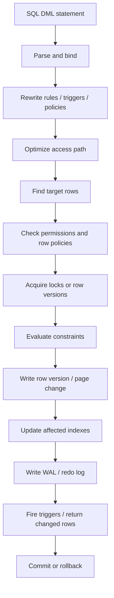
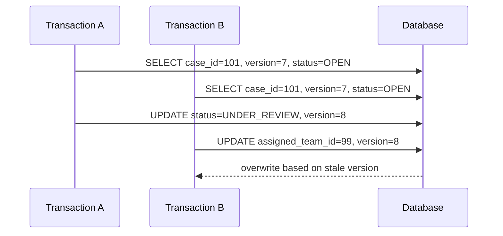
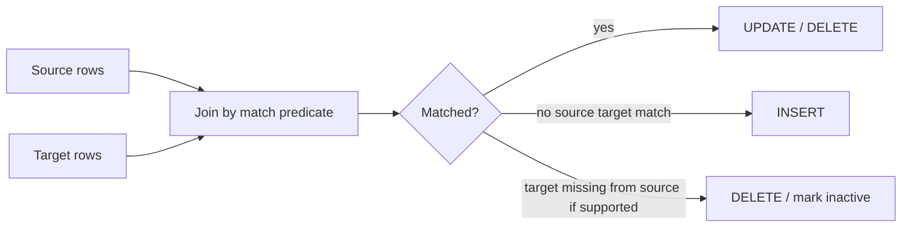
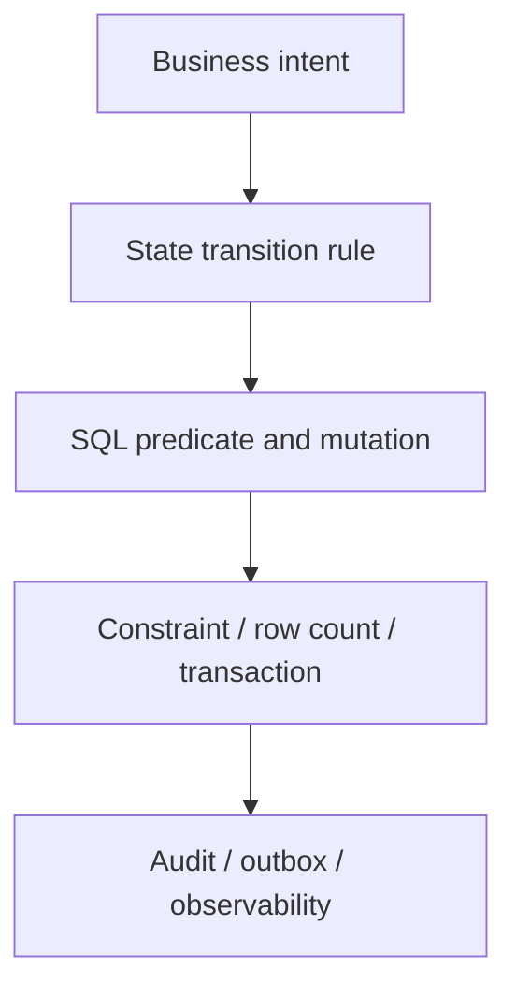

# Part 007 — INSERT, UPDATE, DELETE, and MERGE Semantics

## 1. Tujuan Part Ini

Part sebelumnya membangun fondasi schema dan data type. Sekarang kita masuk ke sisi yang lebih berisiko: **mutasi data**.

Banyak engineer menganggap `INSERT`, `UPDATE`, dan `DELETE` sebagai operasi sederhana. Di production, statement DML adalah tempat banyak incident serius lahir:

- duplicate data karena retry tidak idempotent;
- lost update karena dua transaksi menulis baris yang sama;
- `UPDATE` tanpa predicate cukup ketat;
- soft delete yang merusak uniqueness;
- upsert yang tampak atomic tetapi salah invariant;
- `MERGE` yang menghasilkan efek ganda karena source tidak unik;
- audit trail yang tidak merekam old value;
- mutation query yang lambat karena harus menyentuh terlalu banyak index;
- event/outbox yang tidak konsisten dengan perubahan state.

Dalam part ini kita memperlakukan DML sebagai **state transition mechanism**. Bukan sekadar “ubah row”. Setiap statement harus menjawab:

1. **Apa invariant yang sedang dijaga?**
2. **Apa row target yang boleh berubah?**
3. **Apa precondition perubahan?**
4. **Apakah operasi aman jika di-retry?**
5. **Bagaimana efeknya terhadap index, lock, trigger, dan audit?**
6. **Bagaimana kita tahu berapa row yang benar-benar berubah?**

> Mental model utama: DML adalah operasi perubahan state. Query yang benar bukan hanya syntactically valid, tetapi menjaga transition rule, concurrency rule, dan observability rule.

---

## 2. Kaufman Skill Slice

Untuk menguasai mutasi SQL dengan efektif, jangan mulai dari semua variasi syntax vendor. Pecah skill menjadi unit kecil:

| Sub-skill | Yang Harus Dikuasai | Feedback Cepat |
|---|---|---|
| Insert correctness | row baru valid terhadap constraint | insert sukses/gagal sesuai invariant |
| Update targeting | hanya row yang dimaksud berubah | row count, `RETURNING`, before/after diff |
| Delete safety | data tidak hilang tanpa jejak | FK action, soft delete, archive, audit |
| Upsert | insert-or-update tanpa duplicate | unique constraint dan retry test |
| Optimistic update | update dengan precondition | affected rows = 1 atau 0 |
| Bulk mutation | banyak row berubah tanpa incident | batch size, locks, plan, log growth |
| Merge/sync | sinkronisasi source-target | source uniqueness dan deterministic result |
| Idempotency | retry tidak menggandakan efek | repeated execution menghasilkan state sama |

Latihan 20 jam untuk part ini harus diarahkan ke failure case, bukan happy path. Buat data kecil yang memunculkan race, duplicate, missing predicate, dan stale state.

---

## 3. DML Dalam Lifecycle Engine

Statement DML melewati pipeline yang sama seperti query baca, tetapi dengan konsekuensi tambahan.



Implikasinya:

- `WHERE` pada `UPDATE`/`DELETE` bukan filter display; itu **target selector**.
- Index bukan hanya mempercepat baca; index juga menambah biaya setiap insert/update/delete.
- Constraint bukan dokumentasi; constraint adalah enforcement layer.
- Trigger dan generated column bisa menambah side effect.
- WAL/redo log membuat mutasi besar mahal walaupun query terlihat sederhana.
- Row count adalah sinyal correctness yang wajib dicek oleh aplikasi.

---

## 4. Dataset Latihan

Kita gunakan domain yang realistis: lifecycle enforcement case.

```sql
CREATE TABLE enforcement_case (
    case_id          BIGINT GENERATED ALWAYS AS IDENTITY PRIMARY KEY,
    case_number      VARCHAR(40) NOT NULL UNIQUE,
    subject_id       BIGINT NOT NULL,
    status           VARCHAR(30) NOT NULL,
    severity         VARCHAR(20) NOT NULL,
    assigned_team_id BIGINT,
    version          BIGINT NOT NULL DEFAULT 0,
    opened_at        TIMESTAMP NOT NULL DEFAULT CURRENT_TIMESTAMP,
    closed_at        TIMESTAMP NULL,
    deleted_at       TIMESTAMP NULL,
    CHECK (status IN ('DRAFT', 'OPEN', 'UNDER_REVIEW', 'ESCALATED', 'CLOSED', 'CANCELLED')),
    CHECK (severity IN ('LOW', 'MEDIUM', 'HIGH', 'CRITICAL')),
    CHECK (
        (status IN ('CLOSED', 'CANCELLED') AND closed_at IS NOT NULL)
        OR
        (status NOT IN ('CLOSED', 'CANCELLED') AND closed_at IS NULL)
    )
);

CREATE TABLE case_event (
    event_id     BIGINT GENERATED ALWAYS AS IDENTITY PRIMARY KEY,
    case_id      BIGINT NOT NULL REFERENCES enforcement_case(case_id),
    event_type   VARCHAR(40) NOT NULL,
    event_time   TIMESTAMP NOT NULL DEFAULT CURRENT_TIMESTAMP,
    actor_id     BIGINT NOT NULL,
    payload_json TEXT NULL
);

CREATE TABLE idempotency_key (
    request_key VARCHAR(100) PRIMARY KEY,
    created_at  TIMESTAMP NOT NULL DEFAULT CURRENT_TIMESTAMP,
    result_ref  VARCHAR(100) NULL
);
```

Kita sengaja menyimpan `status`, `version`, dan audit event karena DML production biasanya tidak berdiri sendiri. Perubahan state harus bisa diaudit dan aman terhadap retry.

---

## 5. INSERT: Membuat Fakta Baru

`INSERT` berarti memasukkan fakta baru ke database. Pertanyaan kritisnya: fakta baru itu **benar-benar baru** atau hanya request yang terulang?

### 5.1 Insert Minimal

```sql
INSERT INTO enforcement_case (
    case_number,
    subject_id,
    status,
    severity,
    assigned_team_id
)
VALUES (
    'CASE-2026-0001',
    9001,
    'OPEN',
    'HIGH',
    12
);
```

Ini terlihat sederhana, tetapi engine akan:

- membuat row baru;
- mengecek `NOT NULL`;
- mengecek `UNIQUE(case_number)`;
- mengecek `CHECK(status...)`;
- mengecek identity generation;
- menulis perubahan ke storage dan log;
- memperbarui index primary key dan unique key.

### 5.2 Jangan Mengandalkan Aplikasi untuk Invariant Unik

Anti-pattern:

```sql
SELECT COUNT(*)
FROM enforcement_case
WHERE case_number = 'CASE-2026-0001';

-- if zero, then insert
INSERT INTO enforcement_case (...);
```

Ini race-prone. Dua request bisa melihat count = 0 lalu sama-sama insert. Yang benar: buat unique constraint, lalu biarkan database menolak duplicate.

```sql
ALTER TABLE enforcement_case
ADD CONSTRAINT uq_enforcement_case_number UNIQUE (case_number);
```

Aplikasi boleh melakukan pre-check untuk UX, tetapi enforcement harus tetap di database.

### 5.3 Insert With Explicit Column List

Selalu tulis daftar kolom.

Buruk:

```sql
INSERT INTO enforcement_case
VALUES (DEFAULT, 'CASE-2026-0002', 9002, 'OPEN', 'LOW', NULL, 0, CURRENT_TIMESTAMP, NULL, NULL);
```

Lebih aman:

```sql
INSERT INTO enforcement_case (
    case_number,
    subject_id,
    status,
    severity
)
VALUES (
    'CASE-2026-0002',
    9002,
    'OPEN',
    'LOW'
);
```

Kenapa:

- schema evolution lebih aman;
- generated/default column tetap bekerja;
- review query lebih jelas;
- risiko salah urutan nilai turun drastis.

### 5.4 Insert Returning / Output

Dalam banyak sistem, setelah insert kita perlu identifier, computed value, timestamp, atau state final. Hindari pola insert lalu select ulang jika database mendukung return dari row yang berubah.

PostgreSQL style:

```sql
INSERT INTO enforcement_case (
    case_number,
    subject_id,
    status,
    severity
)
VALUES (
    'CASE-2026-0003',
    9003,
    'OPEN',
    'MEDIUM'
)
RETURNING case_id, case_number, status, opened_at, version;
```

SQL Server style memakai `OUTPUT`:

```sql
INSERT INTO enforcement_case (
    case_number,
    subject_id,
    status,
    severity
)
OUTPUT inserted.case_id, inserted.case_number, inserted.status, inserted.opened_at
VALUES (
    'CASE-2026-0003',
    9003,
    'OPEN',
    'MEDIUM'
);
```

Manfaat:

- mengurangi round-trip;
- menghindari select yang salah target;
- menangkap value final setelah default/generated/trigger;
- memudahkan audit dan event emission.

---

## 6. INSERT Banyak Row

### 6.1 Multi-row Insert

```sql
INSERT INTO case_event (case_id, event_type, actor_id, payload_json)
VALUES
    (101, 'CASE_OPENED', 501, '{"source":"portal"}'),
    (101, 'CASE_ASSIGNED', 502, '{"teamId":12}'),
    (101, 'RISK_CLASSIFIED', 503, '{"severity":"HIGH"}');
```

Ini lebih efisien daripada banyak single-row insert karena mengurangi round-trip dan memberi optimizer/executor kesempatan batch.

### 6.2 Insert From Select

```sql
INSERT INTO case_event (case_id, event_type, actor_id, payload_json)
SELECT
    c.case_id,
    'AUTO_ESCALATION_CANDIDATE',
    0,
    '{"reason":"critical-open-case"}'
FROM enforcement_case c
WHERE c.status = 'OPEN'
  AND c.severity = 'CRITICAL'
  AND c.deleted_at IS NULL;
```

Gunakan untuk transformasi set-based. Tetapi hati-hati:

- source query bisa menghasilkan duplicate;
- insert bisa mengunci banyak row target/index;
- transaction log bisa membesar;
- trigger bisa membuat side effect besar;
- row count harus dicatat.

### 6.3 Bulk Insert Harus Punya Guardrail

Untuk mutasi besar, jangan hanya berpikir “query jalan”. Pikirkan:

| Risiko | Guardrail |
|---|---|
| Menyentuh terlalu banyak row | dry-run `SELECT COUNT(*)` dengan predicate sama |
| Lock panjang | batch by primary key/range |
| Log growth besar | commit per batch jika invariant mengizinkan |
| Replication lag | throttle batch |
| Trigger overload | ukur side effect |
| Index maintenance mahal | pahami index yang terdampak |
| Rollback lama | batch kecil dan checkpoint operasional |

Template batch by key:

```sql
-- Ambil batch kandidat secara deterministik.
SELECT case_id
FROM enforcement_case
WHERE status = 'OPEN'
  AND severity = 'CRITICAL'
  AND deleted_at IS NULL
ORDER BY case_id
FETCH FIRST 500 ROWS ONLY;
```

Lalu update/delete berdasarkan key list. Jangan batch dengan offset pada data yang sedang berubah.

---

## 7. UPDATE: Transisi State, Bukan Assignment Biasa

`UPDATE` mengubah fakta yang sudah ada. Dalam sistem bisnis, update harus dianggap sebagai state transition.

### 7.1 Update Targeted

```sql
UPDATE enforcement_case
SET
    assigned_team_id = 42,
    version = version + 1
WHERE case_id = 101
  AND status = 'OPEN'
  AND deleted_at IS NULL;
```

Predicate bukan hanya `case_id`. Ada precondition:

- case harus masih `OPEN`;
- case belum soft-deleted;
- row yang berubah harus tepat satu.

Aplikasi harus mengecek affected rows:

```text
affected_rows = 1  -> success
affected_rows = 0  -> not found / stale state / invalid transition
affected_rows > 1  -> bug serius untuk update by identity
```

### 7.2 Update Dengan RETURNING / OUTPUT

```sql
UPDATE enforcement_case
SET
    status = 'UNDER_REVIEW',
    version = version + 1
WHERE case_id = 101
  AND status = 'OPEN'
  AND deleted_at IS NULL
RETURNING case_id, status, version;
```

Manfaatnya bukan hanya ergonomi. Ini membuat aplikasi bisa mendapatkan state final yang benar tanpa query tambahan.

### 7.3 Update Harus Memisahkan Target dan Value

Anti-pattern:

```sql
UPDATE enforcement_case
SET status = 'ESCALATED'
WHERE severity = 'CRITICAL';
```

Kenapa buruk:

- tidak memfilter status saat ini;
- bisa mengubah closed case;
- bisa mengubah soft-deleted row;
- tidak ada batas batch;
- tidak ada audit intent.

Lebih aman:

```sql
UPDATE enforcement_case
SET
    status = 'ESCALATED',
    version = version + 1
WHERE status = 'OPEN'
  AND severity = 'CRITICAL'
  AND deleted_at IS NULL
  AND opened_at < CURRENT_TIMESTAMP - INTERVAL '2' DAY;
```

Tetap perlu dry-run:

```sql
SELECT COUNT(*) AS candidate_count
FROM enforcement_case
WHERE status = 'OPEN'
  AND severity = 'CRITICAL'
  AND deleted_at IS NULL
  AND opened_at < CURRENT_TIMESTAMP - INTERVAL '2' DAY;
```

---

## 8. Lost Update dan Optimistic Concurrency

Lost update terjadi ketika dua actor membaca state lama, lalu salah satu overwrite perubahan lain.



### 8.1 Optimistic Update Pattern

Tambahkan `version` sebagai precondition.

```sql
UPDATE enforcement_case
SET
    assigned_team_id = 99,
    version = version + 1
WHERE case_id = 101
  AND version = 7
  AND deleted_at IS NULL;
```

Makna row count:

| Affected rows | Arti |
|---:|---|
| 1 | Update berhasil; caller punya version terbaru saat menulis |
| 0 | Row tidak ada, soft-deleted, atau version sudah berubah |
| >1 | Predicate rusak; invariant key tidak benar |

Aplikasi tidak boleh menganggap `0 rows updated` sebagai success diam-diam. Itu adalah sinyal conflict.

### 8.2 Update dengan State Precondition Lebih Kuat

Untuk workflow, version saja sering belum cukup. Masukkan allowed transition.

```sql
UPDATE enforcement_case
SET
    status = 'ESCALATED',
    version = version + 1
WHERE case_id = 101
  AND version = 7
  AND status IN ('OPEN', 'UNDER_REVIEW')
  AND severity IN ('HIGH', 'CRITICAL')
  AND deleted_at IS NULL;
```

Ini membuat SQL menjadi enforcement rule, bukan hanya persistence statement.

---

## 9. Idempotency: Retry Tanpa Efek Ganda

Distributed system akan melakukan retry. Timeout tidak berarti statement gagal; bisa saja statement berhasil tetapi response hilang.

### 9.1 Non-idempotent Insert

```sql
INSERT INTO case_event (case_id, event_type, actor_id)
VALUES (101, 'NOTIFICATION_SENT', 501);
```

Jika request di-retry, event bisa dobel.

### 9.2 Idempotency Key

Gunakan key unik dari sisi caller atau business operation.

```sql
CREATE TABLE outbound_notification (
    notification_id BIGINT GENERATED ALWAYS AS IDENTITY PRIMARY KEY,
    idempotency_key VARCHAR(120) NOT NULL UNIQUE,
    case_id BIGINT NOT NULL REFERENCES enforcement_case(case_id),
    channel VARCHAR(20) NOT NULL,
    status VARCHAR(20) NOT NULL,
    created_at TIMESTAMP NOT NULL DEFAULT CURRENT_TIMESTAMP
);
```

PostgreSQL style:

```sql
INSERT INTO outbound_notification (
    idempotency_key,
    case_id,
    channel,
    status
)
VALUES (
    'notify-case-101-escalated-email',
    101,
    'EMAIL',
    'PENDING'
)
ON CONFLICT (idempotency_key) DO NOTHING
RETURNING notification_id, status;
```

Jika `RETURNING` kosong karena conflict, caller bisa select by key:

```sql
SELECT notification_id, status
FROM outbound_notification
WHERE idempotency_key = 'notify-case-101-escalated-email';
```

### 9.3 Idempotency Bukan Hanya Unique Constraint

Unique constraint mencegah duplicate row. Tetapi semantic idempotency menuntut hasil retry konsisten.

Pertanyaan review:

- Apakah key merepresentasikan operasi bisnis, bukan sekadar request random?
- Apakah retry dengan payload berbeda ditolak atau diabaikan?
- Apakah result bisa diambil ulang?
- Apakah side effect eksternal dipicu satu kali?
- Apakah transaction boundary mencakup state change dan outbox insert?

---

## 10. UPSERT: Insert-or-Update Dengan Invariant Jelas

Upsert berguna tetapi sering disalahgunakan. Upsert bukan “jika error duplicate, update apa saja”. Upsert harus punya conflict target yang merepresentasikan invariant unik.

### 10.1 PostgreSQL `ON CONFLICT`

```sql
INSERT INTO enforcement_case (
    case_number,
    subject_id,
    status,
    severity
)
VALUES (
    'CASE-2026-0004',
    9004,
    'OPEN',
    'LOW'
)
ON CONFLICT (case_number)
DO UPDATE SET
    severity = EXCLUDED.severity,
    version = enforcement_case.version + 1
WHERE enforcement_case.status = 'DRAFT'
RETURNING case_id, case_number, status, severity, version;
```

Perhatikan detail penting:

- `case_number` adalah conflict target eksplisit;
- `EXCLUDED` merepresentasikan row yang ingin diinsert;
- `WHERE` pada `DO UPDATE` adalah precondition update;
- kita tidak mengubah `subject_id` sembarangan;
- update hanya diizinkan jika existing row masih `DRAFT`.

### 10.2 MySQL `ON DUPLICATE KEY UPDATE`

```sql
INSERT INTO enforcement_case (
    case_number,
    subject_id,
    status,
    severity
)
VALUES (
    'CASE-2026-0004',
    9004,
    'OPEN',
    'LOW'
)
ON DUPLICATE KEY UPDATE
    severity = VALUES(severity),
    version = version + 1;
```

Catatan desain:

- MySQL memilih duplicate berdasarkan primary key atau unique index yang terkena;
- jika ada banyak unique constraint, pastikan invariant conflict tidak ambigu;
- affected rows semantics berbeda antar vendor dan konfigurasi driver;
- jangan membuat upsert yang bisa mengubah identity bisnis tanpa sengaja.

### 10.3 Upsert Anti-pattern

```sql
INSERT INTO customer_profile (email, name, phone, risk_level)
VALUES ('a@example.com', 'Alice', '123', 'LOW')
ON CONFLICT (email)
DO UPDATE SET
    name = EXCLUDED.name,
    phone = EXCLUDED.phone,
    risk_level = EXCLUDED.risk_level;
```

Kenapa berisiko:

- request lama bisa menimpa data baru;
- field sensitif berubah tanpa audit;
- tidak ada version/precondition;
- conflict by email mungkin tidak stabil jika email bisa berubah;
- update partial dari source tidak authoritative.

Lebih defensible:

```sql
INSERT INTO customer_profile (email, name, phone, risk_level, source_version)
VALUES ('a@example.com', 'Alice', '123', 'LOW', 17)
ON CONFLICT (email)
DO UPDATE SET
    name = EXCLUDED.name,
    phone = EXCLUDED.phone,
    source_version = EXCLUDED.source_version
WHERE customer_profile.source_version < EXCLUDED.source_version;
```

---

## 11. DELETE: Menghapus Fakta atau Mengakhiri Visibilitas?

`DELETE` secara fisik menghapus row. Tetapi dalam sistem audit, compliance, enforcement, finance, dan case management, pertanyaan utamanya adalah: apakah data boleh hilang?

### 11.1 Hard Delete

```sql
DELETE FROM case_event
WHERE event_id = 5001;
```

Hard delete cocok untuk:

- temporary staging;
- cache table;
- derived table yang bisa dibangun ulang;
- data salah yang secara legal/operasional harus dihapus;
- test data.

Tidak cocok untuk:

- audit event;
- financial transaction;
- enforcement decision;
- state history;
- consent/legal record.

### 11.2 Delete Dengan Predicate Aman

```sql
DELETE FROM case_event
WHERE case_id = 101
  AND event_type = 'DRAFT_NOTE_ADDED'
  AND event_time >= CURRENT_TIMESTAMP - INTERVAL '1' DAY;
```

Selalu dry-run:

```sql
SELECT COUNT(*)
FROM case_event
WHERE case_id = 101
  AND event_type = 'DRAFT_NOTE_ADDED'
  AND event_time >= CURRENT_TIMESTAMP - INTERVAL '1' DAY;
```

### 11.3 Soft Delete

```sql
UPDATE enforcement_case
SET
    deleted_at = CURRENT_TIMESTAMP,
    version = version + 1
WHERE case_id = 101
  AND deleted_at IS NULL;
```

Soft delete bukan gratis. Ia menambah kompleksitas:

- semua query aktif harus filter `deleted_at IS NULL`;
- unique constraint bisa perlu partial/filtered unique index;
- FK masih menunjuk row yang “deleted”;
- restore semantics harus didefinisikan;
- analytics harus tahu apakah menghitung deleted row atau tidak.

### 11.4 Soft Delete dan Unique Constraint

Masalah umum: email/case_number harus unik untuk row aktif, tetapi row deleted boleh menyimpan nilai lama.

PostgreSQL partial unique index:

```sql
CREATE UNIQUE INDEX uq_active_case_number
ON enforcement_case (case_number)
WHERE deleted_at IS NULL;
```

Tanpa strategi seperti ini, soft delete bisa memblokir pembuatan record baru dengan key yang sama, atau sebaliknya membuka duplicate aktif jika constraint dilemahkan sembarangan.

---

## 12. Foreign Key Actions Saat DELETE/UPDATE

FK action menentukan efek mutasi parent terhadap child.

| Action | Arti | Risiko |
|---|---|---|
| `RESTRICT` / `NO ACTION` | cegah delete/update parent jika child ada | perlu cleanup eksplisit |
| `CASCADE` | child ikut berubah/hilang | blast radius besar jika salah target |
| `SET NULL` | FK child menjadi NULL | child bisa kehilangan konteks |
| `SET DEFAULT` | FK child menjadi default | default harus valid secara bisnis |

Untuk domain audit, `CASCADE DELETE` harus sangat hati-hati. Satu delete parent bisa menghapus banyak event historis.

Checklist:

- Apakah child data adalah bagian dari aggregate yang boleh hilang bersama parent?
- Apakah child adalah audit/history yang harus tetap ada?
- Apakah aplikasi punya UI/operasi untuk memahami cascade count?
- Apakah delete path diuji di staging dengan data volume realistis?

---

## 13. MERGE: Sinkronisasi Source dan Target

`MERGE` menyatukan insert, update, dan delete berdasarkan join antara source dan target. Cocok untuk sinkronisasi set-based, tetapi berbahaya jika source tidak deterministik.

### 13.1 Bentuk Konseptual

```sql
MERGE INTO target_table AS t
USING source_table AS s
ON t.business_key = s.business_key
WHEN MATCHED THEN
    UPDATE SET value = s.value
WHEN NOT MATCHED THEN
    INSERT (business_key, value)
    VALUES (s.business_key, s.value);
```

Mental model:



### 13.2 Source Harus Unik Per Target

Anti-pattern:

```sql
MERGE INTO enforcement_case AS t
USING staging_case AS s
ON t.case_number = s.case_number
WHEN MATCHED THEN
    UPDATE SET severity = s.severity;
```

Jika `staging_case` punya dua row untuk `case_number` yang sama, hasil bisa error, non-deterministic, atau vendor-specific. Jangan mengandalkan engine untuk “memilih salah satu”.

Perbaiki source:

```sql
WITH ranked_source AS (
    SELECT
        s.*,
        ROW_NUMBER() OVER (
            PARTITION BY s.case_number
            ORDER BY s.source_updated_at DESC, s.ingestion_id DESC
        ) AS rn
    FROM staging_case s
)
SELECT *
FROM ranked_source
WHERE rn = 1;
```

Baru gunakan source yang sudah deduplicated.

### 13.3 MERGE Untuk Sync Harus Memisahkan Intent

Tidak semua perubahan cocok disatukan dalam satu `MERGE` besar. Kadang lebih aman membuat tiga tahap:

1. validate source;
2. insert missing;
3. update changed;
4. mark inactive rows;
5. reconcile counts.

Keuntungan staged approach:

- row count per action jelas;
- lebih mudah rollback sebagian;
- audit event lebih eksplisit;
- lebih mudah debugging;
- deadlock bisa dikurangi dengan order operasi konsisten.

---

## 14. Write Amplification

Satu DML tidak selalu berarti satu write.

```sql
UPDATE enforcement_case
SET severity = 'CRITICAL'
WHERE case_id = 101;
```

Perubahan ini bisa menyebabkan:

- update heap/table page;
- update index jika `severity` terindeks;
- write WAL/redo;
- trigger execution;
- materialized/derived maintenance jika ada mekanisme terkait;
- replication streaming;
- cache invalidation di application layer;
- CDC event.

### 14.1 Kolom Terindeks Lebih Mahal Di-update

Jika ada index:

```sql
CREATE INDEX idx_case_status_severity
ON enforcement_case (status, severity);
```

Maka update `status` atau `severity` bukan hanya mengubah row; index entry juga berubah. Untuk table dengan banyak index, write path bisa menjadi bottleneck.

### 14.2 Jangan Index Semua Kolom yang Sering Diupdate

Trade-off:

| Desain | Read | Write | Cocok Untuk |
|---|---|---|---|
| Banyak index | cepat untuk banyak query | mahal untuk insert/update/delete | read-heavy, low mutation |
| Sedikit index | beberapa query lebih lambat | write lebih murah | write-heavy, queue, event table |
| Partial/filtered index | cepat untuk subset aktif | lebih murah dari full index | active workflow, soft delete |
| Covering index | read sangat cepat | storage/write lebih mahal | high-value query stabil |

---

## 15. Row Count Sebagai Contract

DML production harus memperlakukan affected row count sebagai bagian dari contract.

| Operation | Expected row count | Jika 0 | Jika > expected |
|---|---:|---|---|
| update by primary key | 1 | not found/stale/invalid state | impossible; bug predicate/data |
| delete one draft | 1 | already deleted/not found | bug |
| bulk close expired cases | known range | no candidate | bisa valid, tapi catat | predicate terlalu luas |
| idempotent insert `DO NOTHING` | 0 atau 1 | duplicate existing | valid jika retry |
| optimistic update | 1 | conflict | bug jika diabaikan |

Aplikasi yang tidak memeriksa row count sering menyembunyikan corruption.

---

## 16. Combining State Change and Audit Event

State change dan audit event harus berada dalam transaction boundary yang sama.

```sql
BEGIN;

UPDATE enforcement_case
SET
    status = 'ESCALATED',
    version = version + 1
WHERE case_id = 101
  AND status IN ('OPEN', 'UNDER_REVIEW')
  AND severity IN ('HIGH', 'CRITICAL')
  AND deleted_at IS NULL;

-- aplikasi wajib cek affected rows = 1 sebelum lanjut

INSERT INTO case_event (case_id, event_type, actor_id, payload_json)
VALUES (
    101,
    'CASE_ESCALATED',
    501,
    '{"reason":"high-risk-policy"}'
);

COMMIT;
```

Masalah: SQL murni di atas tidak menunjukkan conditional insert berdasarkan affected rows. Dalam aplikasi, lakukan:

1. execute update;
2. if affected rows != 1, rollback;
3. insert event;
4. commit.

Di PostgreSQL, bisa juga memakai CTE DML:

```sql
WITH updated_case AS (
    UPDATE enforcement_case
    SET
        status = 'ESCALATED',
        version = version + 1
    WHERE case_id = 101
      AND status IN ('OPEN', 'UNDER_REVIEW')
      AND severity IN ('HIGH', 'CRITICAL')
      AND deleted_at IS NULL
    RETURNING case_id
)
INSERT INTO case_event (case_id, event_type, actor_id, payload_json)
SELECT
    case_id,
    'CASE_ESCALATED',
    501,
    '{"reason":"high-risk-policy"}'
FROM updated_case;
```

Jika tidak ada row ter-update, event tidak dibuat.

---

## 17. Outbox Pattern Untuk Side Effect Eksternal

Jangan kirim email/message langsung di tengah transaction database tanpa strategi. Jika database commit gagal tetapi message sudah terkirim, sistem inconsistent. Jika database commit sukses tetapi message send gagal, event hilang.

Gunakan outbox:

```sql
CREATE TABLE outbox_event (
    outbox_id BIGINT GENERATED ALWAYS AS IDENTITY PRIMARY KEY,
    aggregate_type VARCHAR(50) NOT NULL,
    aggregate_id BIGINT NOT NULL,
    event_type VARCHAR(80) NOT NULL,
    payload_json TEXT NOT NULL,
    status VARCHAR(20) NOT NULL DEFAULT 'PENDING',
    created_at TIMESTAMP NOT NULL DEFAULT CURRENT_TIMESTAMP,
    processed_at TIMESTAMP NULL,
    UNIQUE (aggregate_type, aggregate_id, event_type, created_at)
);
```

Dalam satu transaksi:

```sql
BEGIN;

UPDATE enforcement_case
SET status = 'ESCALATED', version = version + 1
WHERE case_id = 101
  AND status = 'OPEN';

INSERT INTO outbox_event (
    aggregate_type,
    aggregate_id,
    event_type,
    payload_json
)
VALUES (
    'enforcement_case',
    101,
    'CaseEscalated',
    '{"caseId":101}'
);

COMMIT;
```

Worker terpisah membaca outbox dan mengirim side effect. Ini membuat database state dan intent publikasi event konsisten.

---

## 18. Safe DML Review Checklist

Sebelum menjalankan DML production, jawab checklist ini:

### 18.1 Targeting

- Apakah predicate memilih row yang benar?
- Apakah ada dry-run `SELECT` dengan predicate sama?
- Apakah query memakai key/range deterministik?
- Apakah soft-deleted row dikecualikan jika perlu?
- Apakah tenant boundary ada di predicate?

### 18.2 Correctness

- Apakah transition state valid?
- Apakah row count expected didefinisikan?
- Apakah constraint mendukung invariant?
- Apakah old value perlu disimpan?
- Apakah audit/event ikut dalam transaksi?

### 18.3 Concurrency

- Apakah lost update dicegah?
- Apakah version/precondition dipakai?
- Apakah retry aman?
- Apakah lock order konsisten?
- Apakah batch bisa deadlock?

### 18.4 Operations

- Apakah ada index yang membuat write mahal?
- Apakah transaction log/replica lag akan membesar?
- Apakah batch size dibatasi?
- Apakah rollback plan ada?
- Apakah metrics/logging mencatat affected rows?

---

## 19. Common Failure Patterns

| Failure | Contoh | Pencegahan |
|---|---|---|
| Missing `WHERE` | update semua row | transaction, review, safe mode, dry-run |
| Predicate terlalu luas | close semua case critical termasuk yang sudah cancelled | state precondition |
| Lost update | stale UI overwrite data baru | optimistic version |
| Duplicate retry | insert event dobel | idempotency key |
| Ambiguous upsert | multiple unique keys | conflict target jelas |
| Silent no-op | affected rows 0 dianggap sukses | row count contract |
| Cascade surprise | delete parent menghapus child audit | FK action review |
| Soft delete leak | query lupa `deleted_at IS NULL` | view/partial index/query convention |
| Bulk lock incident | update jutaan row satu transaksi | batching, throttle, plan review |
| Non-deterministic merge | source duplicate | source validation/dedup |

---

## 20. Drill: Ubah Requirement Menjadi DML Aman

Requirement:

> Jika case `OPEN` dengan severity `CRITICAL` belum ditangani selama 48 jam, escalate ke `ESCALATED`, assign ke team 99, tulis audit event, dan pastikan retry job tidak membuat event dobel.

### 20.1 Tambah Idempotency di Event

```sql
ALTER TABLE case_event
ADD COLUMN idempotency_key VARCHAR(160);

CREATE UNIQUE INDEX uq_case_event_idempotency
ON case_event (idempotency_key)
WHERE idempotency_key IS NOT NULL;
```

### 20.2 Pilih Kandidat

```sql
SELECT case_id
FROM enforcement_case
WHERE status = 'OPEN'
  AND severity = 'CRITICAL'
  AND deleted_at IS NULL
  AND opened_at < CURRENT_TIMESTAMP - INTERVAL '48' HOUR
ORDER BY case_id
FETCH FIRST 100 ROWS ONLY;
```

### 20.3 Mutasi Satu Case Secara Aman

```sql
WITH updated_case AS (
    UPDATE enforcement_case
    SET
        status = 'ESCALATED',
        assigned_team_id = 99,
        version = version + 1
    WHERE case_id = 101
      AND status = 'OPEN'
      AND severity = 'CRITICAL'
      AND deleted_at IS NULL
    RETURNING case_id
)
INSERT INTO case_event (
    case_id,
    event_type,
    actor_id,
    payload_json,
    idempotency_key
)
SELECT
    case_id,
    'CASE_AUTO_ESCALATED',
    0,
    '{"teamId":99,"reason":"critical-open-48h"}',
    'auto-escalate-case-101-critical-open-48h'
FROM updated_case
ON CONFLICT (idempotency_key) DO NOTHING;
```

Catatan:

- event hanya dibuat jika update berhasil;
- retry tidak menggandakan event;
- state precondition mencegah closed/cancelled case berubah;
- batch bisa diproses deterministik by `case_id`.

---

## 21. Ringkasan Mental Model

DML yang matang memiliki empat lapisan:



Jangan menulis DML dari syntax. Mulai dari intent:

- row mana yang boleh berubah;
- dari state apa ke state apa;
- apa precondition-nya;
- apa efek samping yang wajib konsisten;
- bagaimana retry/concurrency diperlakukan;
- bagaimana kita membuktikan hasilnya benar.

Jika SELECT adalah cara membaca kebenaran, maka DML adalah cara mengubah kebenaran. Di sistem produksi, kemampuan menulis DML defensible adalah salah satu pembeda engineer biasa dan engineer yang dipercaya memegang data penting.

---

## 22. Latihan Mandiri

Gunakan schema di part ini dan kerjakan:

1. Buat query untuk close case hanya jika status saat ini `UNDER_REVIEW` dan version cocok.
2. Buat event audit hanya jika close berhasil.
3. Buat idempotency key untuk operasi close case.
4. Buat upsert untuk table `subject_risk_snapshot` yang hanya update jika `source_version` lebih baru.
5. Buat query soft delete case draft, tetapi tolak jika sudah punya event selain `CASE_CREATED`.
6. Buat dry-run query untuk bulk escalation.
7. Jelaskan index apa yang dibutuhkan untuk job bulk escalation.
8. Jelaskan mengapa `MERGE` dari staging source yang duplicate berbahaya.
9. Ubah hard delete menjadi archive table design.
10. Tulis checklist production untuk menjalankan update 10 juta row.

---

## 23. Referensi Teknis

- PostgreSQL Documentation — `INSERT`, `ON CONFLICT`, and concurrency notes.
- PostgreSQL Documentation — Returning data from modified rows.
- MySQL Reference Manual — `INSERT ... ON DUPLICATE KEY UPDATE`.
- Microsoft SQL Server Documentation — `MERGE` Transact-SQL.
- PostgreSQL Documentation — `UPDATE`, `DELETE`, and data-modifying statements.
