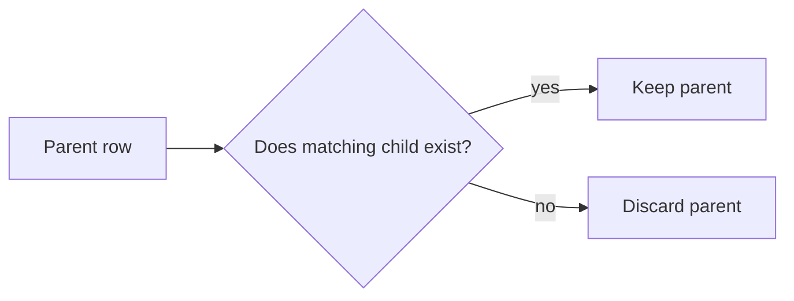
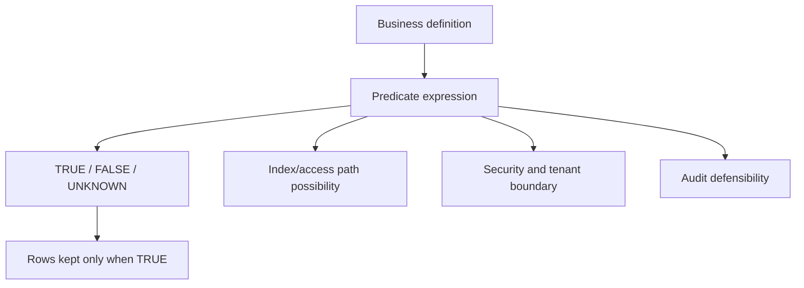

# Part 008 — Filtering, Predicates, and NULL Traps

## 1. Tujuan Part Ini

Filtering adalah tempat query paling sering terlihat benar tetapi sebenarnya salah.

Engineer sering membaca `WHERE` sebagai “ambil row yang cocok”. Itu benar, tetapi tidak lengkap. `WHERE` adalah **predicate evaluation boundary**: hanya row yang predicate-nya bernilai `TRUE` yang lolos. Row dengan predicate `FALSE` dan `UNKNOWN` sama-sama tidak lolos.

Konsekuensi ini membuat banyak bug produksi:

- `column <> 'X'` tidak mengambil row yang `NULL`;
- `NOT IN` bisa mengembalikan nol row karena satu `NULL` di subquery;
- `LEFT JOIN` berubah menjadi `INNER JOIN` karena filter di `WHERE`;
- `BETWEEN` salah untuk timestamp boundary;
- fungsi di kolom membuat index tidak terpakai;
- implicit cast menyebabkan full scan;
- collation/case sensitivity membuat hasil berbeda antar environment;
- predicate `OR` terlalu luas dan membocorkan tenant data;
- filter temporal memakai timezone yang salah.

Part ini membangun mental model predicate yang bisa dipakai untuk query OLTP, analytics, debugging, dan audit.

> Mental model utama: predicate bukan string kondisi. Predicate adalah fungsi logis atas row yang menghasilkan `TRUE`, `FALSE`, atau `UNKNOWN`. SQL hanya mempertahankan row dengan hasil `TRUE` pada `WHERE`.

---

## 2. Kaufman Skill Slice

Untuk cepat menguasai filtering, pecah skill menjadi sub-skill berikut:

| Sub-skill | Fokus | Feedback Cepat |
|---|---|---|
| Boolean predicate | `AND`, `OR`, `NOT`, precedence | truth table dan test data kecil |
| NULL logic | `UNKNOWN`, `IS NULL`, `IS DISTINCT FROM` | row yang hilang/masuk secara sengaja |
| Comparison | `=`, `<>`, `<`, `>`, `BETWEEN` | boundary cases |
| Membership | `IN`, `EXISTS`, `NOT IN`, `NOT EXISTS` | subquery dengan NULL dan duplicate |
| Pattern | `LIKE`, escaping, regex | case/collation behavior |
| Sargability | predicate bisa pakai index | execution plan |
| Type safety | implicit cast dan date/time | plan + correctness |
| Predicate design | tenant, status, soft delete, temporal | invariant review |

Latihan terbaik untuk part ini adalah membuat table kecil berisi nilai normal, boundary, dan `NULL`, lalu prediksi row mana yang lolos sebelum menjalankan query.

---

## 3. Dataset Latihan

```sql
CREATE TABLE enforcement_case_filter_lab (
    case_id          BIGINT PRIMARY KEY,
    tenant_id        BIGINT NOT NULL,
    case_number      VARCHAR(40) NOT NULL,
    status           VARCHAR(30) NOT NULL,
    severity         VARCHAR(20) NULL,
    assigned_user_id BIGINT NULL,
    opened_at        TIMESTAMP NOT NULL,
    closed_at        TIMESTAMP NULL,
    deleted_at       TIMESTAMP NULL,
    risk_score       DECIMAL(8, 2) NULL,
    source_system    VARCHAR(30) NULL
);

INSERT INTO enforcement_case_filter_lab (
    case_id, tenant_id, case_number, status, severity,
    assigned_user_id, opened_at, closed_at, deleted_at,
    risk_score, source_system
)
VALUES
    (1, 10, 'CASE-001', 'OPEN',         'HIGH',     100, TIMESTAMP '2026-01-01 09:00:00', NULL, NULL, 88.50, 'PORTAL'),
    (2, 10, 'CASE-002', 'OPEN',         NULL,       NULL, TIMESTAMP '2026-01-02 09:00:00', NULL, NULL, NULL,  'BATCH'),
    (3, 10, 'CASE-003', 'CLOSED',       'LOW',      101, TIMESTAMP '2026-01-03 09:00:00', TIMESTAMP '2026-01-05 17:00:00', NULL, 12.00, NULL),
    (4, 20, 'CASE-004', 'ESCALATED',    'CRITICAL', 102, TIMESTAMP '2026-01-04 09:00:00', NULL, NULL, 95.00, 'PORTAL'),
    (5, 20, 'CASE-005', 'CANCELLED',    'MEDIUM',   NULL, TIMESTAMP '2026-01-05 09:00:00', TIMESTAMP '2026-01-06 12:00:00', NULL, 50.00, 'API'),
    (6, 20, 'CASE-006', 'OPEN',         'LOW',      103, TIMESTAMP '2026-01-06 09:00:00', NULL, TIMESTAMP '2026-01-07 00:00:00', 20.00, 'PORTAL');
```

Table ini sengaja punya:

- tenant berbeda;
- status lifecycle;
- `NULL` pada severity, assigned user, closed time, risk score, source system;
- soft-deleted row;
- timestamp boundary.

---

## 4. WHERE Mengambil `TRUE`, Bukan “Bukan False”

SQL memakai three-valued logic: `TRUE`, `FALSE`, dan `UNKNOWN`.

```sql
SELECT case_id, severity
FROM enforcement_case_filter_lab
WHERE severity <> 'LOW';
```

Banyak engineer mengira query ini mengambil semua row yang severity-nya bukan LOW, termasuk `NULL`. Tidak. Untuk row dengan `severity = NULL`, ekspresi `NULL <> 'LOW'` menghasilkan `UNKNOWN`, bukan `TRUE`. Row itu tidak lolos.

Jika intent-nya “severity bukan LOW atau belum diketahui”:

```sql
SELECT case_id, severity
FROM enforcement_case_filter_lab
WHERE severity <> 'LOW'
   OR severity IS NULL;
```

Atau pada engine yang mendukung:

```sql
SELECT case_id, severity
FROM enforcement_case_filter_lab
WHERE severity IS DISTINCT FROM 'LOW';
```

### 4.1 Truth Table Praktis

| Predicate | Value | Hasil |
|---|---|---|
| `severity = 'HIGH'` | `'HIGH'` | `TRUE` |
| `severity = 'HIGH'` | `'LOW'` | `FALSE` |
| `severity = 'HIGH'` | `NULL` | `UNKNOWN` |
| `severity <> 'LOW'` | `'HIGH'` | `TRUE` |
| `severity <> 'LOW'` | `'LOW'` | `FALSE` |
| `severity <> 'LOW'` | `NULL` | `UNKNOWN` |
| `severity IS NULL` | `NULL` | `TRUE` |
| `severity IS NOT NULL` | `NULL` | `FALSE` |

Rule: pada `WHERE`, hanya `TRUE` yang lolos.

---

## 5. `NULL` Bukan Nilai Kosong Biasa

`NULL` berarti absence/unknown/not applicable, tergantung desain. Masalah muncul ketika satu kolom memakai `NULL` untuk beberapa makna sekaligus.

Contoh:

```text
assigned_user_id = NULL
```

Bisa berarti:

- belum diassign;
- assignment dihapus;
- assignment tidak berlaku untuk jenis case ini;
- data belum dimigrasi;
- user lama sudah dihapus.

Jika makna bisnis berbeda, jangan sembunyikan semua dalam satu `NULL`. Gunakan state eksplisit atau kolom pendukung.

```sql
assignment_status VARCHAR(20) NOT NULL
CHECK (assignment_status IN ('UNASSIGNED', 'ASSIGNED', 'NOT_APPLICABLE'))
```

Lalu constraint:

```sql
CHECK (
    (assignment_status = 'ASSIGNED' AND assigned_user_id IS NOT NULL)
    OR
    (assignment_status <> 'ASSIGNED' AND assigned_user_id IS NULL)
)
```

### 5.1 Jangan Membandingkan Dengan `= NULL`

Salah:

```sql
SELECT *
FROM enforcement_case_filter_lab
WHERE assigned_user_id = NULL;
```

Benar:

```sql
SELECT *
FROM enforcement_case_filter_lab
WHERE assigned_user_id IS NULL;
```

Dan:

```sql
SELECT *
FROM enforcement_case_filter_lab
WHERE assigned_user_id IS NOT NULL;
```

---

## 6. `IS DISTINCT FROM` Untuk Perbandingan Null-Safe

`IS DISTINCT FROM` memperlakukan `NULL` sebagai comparable value untuk tujuan perbandingan.

```sql
SELECT case_id, severity
FROM enforcement_case_filter_lab
WHERE severity IS DISTINCT FROM 'LOW';
```

Makna:

- `'HIGH'` distinct dari `'LOW'` -> true;
- `'LOW'` distinct dari `'LOW'` -> false;
- `NULL` distinct dari `'LOW'` -> true;
- `NULL` not distinct dari `NULL` -> true untuk `IS NOT DISTINCT FROM`.

Gunakan untuk:

- audit diff;
- comparing old vs new value;
- detecting changed nullable columns;
- synchronization logic;
- slowly changing dimension detection.

Contoh diff nullable:

```sql
SELECT s.case_id
FROM staging_case s
JOIN enforcement_case_filter_lab t
  ON t.case_id = s.case_id
WHERE s.severity IS DISTINCT FROM t.severity
   OR s.risk_score IS DISTINCT FROM t.risk_score
   OR s.source_system IS DISTINCT FROM t.source_system;
```

Tanpa null-safe comparison, perubahan dari `NULL` ke value atau value ke `NULL` sering tidak terdeteksi.

---

## 7. Operator Precedence: `AND` Lebih Ketat Dari `OR`

Bug besar sering muncul dari predicate tanpa parentheses.

```sql
SELECT *
FROM enforcement_case_filter_lab
WHERE tenant_id = 10
  AND status = 'OPEN'
   OR severity = 'CRITICAL';
```

SQL membaca ini seperti:

```sql
WHERE (tenant_id = 10 AND status = 'OPEN')
   OR severity = 'CRITICAL'
```

Artinya case tenant lain dengan severity `CRITICAL` ikut lolos. Ini bisa menjadi data leak.

Yang dimaksud mungkin:

```sql
SELECT *
FROM enforcement_case_filter_lab
WHERE tenant_id = 10
  AND (
      status = 'OPEN'
      OR severity = 'CRITICAL'
  );
```

Rule production:

- selalu pakai parentheses saat mencampur `AND` dan `OR`;
- tenant/security predicate harus berada di level paling luar dan tidak boleh kalah oleh `OR`;
- review query dengan membaca truth condition, bukan sekadar indentation.

---

## 8. `IN` dan `NOT IN`

### 8.1 `IN` Sebagai Membership Test

```sql
SELECT case_id, status
FROM enforcement_case_filter_lab
WHERE status IN ('OPEN', 'ESCALATED');
```

Ini setara secara intent dengan:

```sql
WHERE status = 'OPEN'
   OR status = 'ESCALATED'
```

Tetapi lebih jelas untuk membership.

### 8.2 `IN` Dengan `NULL`

```sql
SELECT case_id, severity
FROM enforcement_case_filter_lab
WHERE severity IN ('HIGH', NULL);
```

Ini tidak berarti “HIGH atau NULL”. Untuk `NULL`, gunakan eksplisit:

```sql
WHERE severity = 'HIGH'
   OR severity IS NULL;
```

### 8.3 `NOT IN` Trap

Misalkan table exclusion:

```sql
CREATE TABLE excluded_assignee (
    user_id BIGINT NULL
);

INSERT INTO excluded_assignee (user_id)
VALUES (101), (NULL);
```

Query:

```sql
SELECT case_id, assigned_user_id
FROM enforcement_case_filter_lab
WHERE assigned_user_id NOT IN (
    SELECT user_id FROM excluded_assignee
);
```

Karena subquery mengandung `NULL`, hasil bisa menjadi tidak sesuai ekspektasi. `NOT IN` dengan `NULL` sering menjadi sumber bug.

Lebih aman gunakan `NOT EXISTS`:

```sql
SELECT c.case_id, c.assigned_user_id
FROM enforcement_case_filter_lab c
WHERE c.assigned_user_id IS NOT NULL
  AND NOT EXISTS (
      SELECT 1
      FROM excluded_assignee e
      WHERE e.user_id = c.assigned_user_id
  );
```

### 8.4 Kapan `IN`, Kapan `EXISTS`

| Intent | Preferensi | Catatan |
|---|---|---|
| Membership literal kecil | `IN (...)` | jelas dan ringkas |
| Membership dari subquery nullable | `EXISTS` | lebih aman terhadap NULL |
| Anti-join | `NOT EXISTS` | hindari `NOT IN` jika subquery bisa NULL |
| Correlated existence | `EXISTS` | tidak butuh kolom dari child |
| Need child value | `JOIN` | hati-hati duplicate explosion |

---

## 9. `EXISTS`: Tanya Ada, Bukan Ambil

```sql
SELECT c.case_id
FROM enforcement_case_filter_lab c
WHERE EXISTS (
    SELECT 1
    FROM case_event e
    WHERE e.case_id = c.case_id
      AND e.event_type = 'CASE_ESCALATED'
);
```

`EXISTS` cocok ketika yang dibutuhkan hanya keberadaan row terkait.

Anti-pattern:

```sql
SELECT DISTINCT c.case_id
FROM enforcement_case_filter_lab c
JOIN case_event e
  ON e.case_id = c.case_id
WHERE e.event_type = 'CASE_ESCALATED';
```

Ini bisa benar, tetapi sering lebih mahal dan membutuhkan `DISTINCT` karena join menggandakan row parent.

Mental model:



Gunakan `JOIN` jika butuh data child. Gunakan `EXISTS` jika hanya butuh yes/no.

---

## 10. `BETWEEN`: Inclusive Boundary

`BETWEEN` bersifat inclusive pada kedua sisi.

```sql
WHERE risk_score BETWEEN 50 AND 90
```

Setara dengan:

```sql
WHERE risk_score >= 50
  AND risk_score <= 90
```

### 10.1 Timestamp Trap

Anti-pattern:

```sql
SELECT *
FROM enforcement_case_filter_lab
WHERE opened_at BETWEEN TIMESTAMP '2026-01-01 00:00:00'
                    AND TIMESTAMP '2026-01-31 00:00:00';
```

Ini hanya mengambil row sampai tepat awal 31 Januari, bukan seluruh hari 31 Januari.

Lebih baik gunakan half-open interval:

```sql
SELECT *
FROM enforcement_case_filter_lab
WHERE opened_at >= TIMESTAMP '2026-01-01 00:00:00'
  AND opened_at <  TIMESTAMP '2026-02-01 00:00:00';
```

Rule temporal production:

- gunakan `[start, end)` untuk rentang waktu;
- simpan timestamp dengan timezone policy jelas;
- jangan pakai `DATE(opened_at) = ...` pada kolom besar jika ingin index-friendly;
- hitung boundary di aplikasi atau CTE, bukan fungsi pada kolom.

---

## 11. Pattern Matching: `LIKE`, Escaping, dan Case Sensitivity

```sql
SELECT case_id, case_number
FROM enforcement_case_filter_lab
WHERE case_number LIKE 'CASE-00%';
```

`%` berarti sequence karakter apa pun. `_` berarti satu karakter.

### 11.1 Escape Wildcard

Jika ingin mencari literal `%` atau `_`, gunakan escape sesuai dialect.

```sql
WHERE case_number LIKE 'CASE\_%' ESCAPE '\'
```

### 11.2 Prefix Search vs Contains Search

Index B-tree biasanya lebih mudah membantu prefix search:

```sql
WHERE case_number LIKE 'CASE-2026-%'
```

Contains search lebih sulit:

```sql
WHERE case_number LIKE '%2026%'
```

Untuk contains search besar, pertimbangkan full-text index, trigram index, search engine, atau desain tokenized search. Jangan memaksa B-tree untuk semua bentuk pencarian.

### 11.3 Case Sensitivity dan Collation

Hasil `LIKE`, sorting, dan equality pada text bisa dipengaruhi collation dan engine. Query yang benar di laptop bisa beda di production jika collation berbeda.

Checklist:

- Apakah search harus case-sensitive?
- Apakah accent-sensitive?
- Apakah locale-specific?
- Apakah normalized text disimpan?
- Apakah index mendukung comparison yang dipakai?

---

## 12. Sargability: Predicate Yang Bisa Menjangkau Index

Sargable berarti predicate bisa digunakan engine untuk mencari melalui access path seperti index, bukan menghitung fungsi untuk setiap row.

### 12.1 Non-sargable Karena Fungsi Pada Kolom

Buruk:

```sql
SELECT *
FROM enforcement_case_filter_lab
WHERE DATE(opened_at) = DATE '2026-01-01';
```

Engine harus menerapkan `DATE()` ke banyak row sebelum membandingkan.

Lebih baik:

```sql
SELECT *
FROM enforcement_case_filter_lab
WHERE opened_at >= TIMESTAMP '2026-01-01 00:00:00'
  AND opened_at <  TIMESTAMP '2026-01-02 00:00:00';
```

### 12.2 Non-sargable Karena Arithmetic Pada Kolom

Buruk:

```sql
WHERE risk_score + 10 >= 90
```

Lebih baik:

```sql
WHERE risk_score >= 80
```

### 12.3 Non-sargable Karena Case Conversion

Buruk untuk table besar jika tidak ada expression/function index:

```sql
WHERE LOWER(case_number) = LOWER('case-001')
```

Alternatif:

- simpan normalized column;
- gunakan generated column;
- gunakan functional/expression index jika engine mendukung;
- gunakan collation/case-insensitive type yang sesuai.

```sql
CREATE INDEX idx_case_number_lower
ON enforcement_case_filter_lab (LOWER(case_number));
```

Jika memakai expression index, predicate harus cocok dengan expression.

---

## 13. Implicit Cast Trap

Implicit cast bisa merusak correctness dan performance.

Misal kolom `case_number` bertipe text, tetapi parameter dikirim sebagai numeric atau kolom numeric dibandingkan dengan string. Engine bisa memilih cast pada kolom atau parameter tergantung dialect.

Buruk:

```sql
WHERE case_id = '101'
```

Lebih baik:

```sql
WHERE case_id = 101
```

Lebih penting di aplikasi:

- bind parameter dengan tipe yang benar;
- jangan kirim semua parameter sebagai string;
- pastikan ORM tidak melakukan cast yang merusak index;
- periksa execution plan untuk query penting.

### 13.1 Date/Time Cast Trap

Buruk:

```sql
WHERE opened_at::date = DATE '2026-01-01'
```

Atau vendor equivalent:

```sql
WHERE CAST(opened_at AS DATE) = DATE '2026-01-01'
```

Lebih baik half-open range:

```sql
WHERE opened_at >= TIMESTAMP '2026-01-01 00:00:00'
  AND opened_at <  TIMESTAMP '2026-01-02 00:00:00'
```

---

## 14. Predicate Untuk Tenant Isolation

Dalam multi-tenant system, tenant predicate bukan optional optimization. Itu security boundary.

Buruk:

```sql
SELECT *
FROM enforcement_case_filter_lab
WHERE status = 'OPEN'
   OR severity = 'CRITICAL'
  AND tenant_id = 10;
```

Karena precedence, ini bisa membaca:

```sql
WHERE status = 'OPEN'
   OR (severity = 'CRITICAL' AND tenant_id = 10)
```

Row `OPEN` dari tenant lain bisa lolos.

Lebih aman:

```sql
SELECT *
FROM enforcement_case_filter_lab
WHERE tenant_id = 10
  AND deleted_at IS NULL
  AND (
      status = 'OPEN'
      OR severity = 'CRITICAL'
  );
```

Pattern produksi:

```sql
WHERE tenant_id = :tenant_id
  AND deleted_at IS NULL
  AND <business predicate>
```

Jika engine mendukung row-level security, gunakan sebagai defense-in-depth. Tetapi tetap tulis query dengan tenant predicate eksplisit agar plan dan intent jelas.

---

## 15. Predicate Untuk Soft Delete

Soft delete membuat hampir semua query aktif membutuhkan filter:

```sql
WHERE deleted_at IS NULL
```

Masalahnya bukan syntax; masalahnya consistency. Satu query yang lupa filter bisa membocorkan data yang seharusnya tidak aktif.

Strategi:

### 15.1 View Untuk Active Rows

```sql
CREATE VIEW active_enforcement_case AS
SELECT *
FROM enforcement_case_filter_lab
WHERE deleted_at IS NULL;
```

Aplikasi query view untuk use case normal.

### 15.2 Partial Index Untuk Active Rows

```sql
CREATE INDEX idx_active_case_tenant_status
ON enforcement_case_filter_lab (tenant_id, status, opened_at)
WHERE deleted_at IS NULL;
```

Ini mendukung workload aktif tanpa mengindex row deleted.

### 15.3 Explicit Query Convention

Untuk query kritis, tetap prefer predicate eksplisit agar review terlihat:

```sql
WHERE tenant_id = :tenant_id
  AND deleted_at IS NULL
  AND status = 'OPEN'
```

---

## 16. Predicate Untuk State Machine

Filtering status lifecycle harus sesuai transition semantics.

Buruk:

```sql
WHERE status <> 'CLOSED'
```

Ini mengambil `DRAFT`, `OPEN`, `UNDER_REVIEW`, `ESCALATED`, `CANCELLED`, dan mungkin status baru di masa depan. Jika intent adalah active work, tulis eksplisit:

```sql
WHERE status IN ('OPEN', 'UNDER_REVIEW', 'ESCALATED')
```

Kenapa lebih baik:

- future status tidak otomatis masuk;
- logic review lebih mudah;
- query mendokumentasikan business definition;
- cocok dengan partial index active workflow.

Rule: untuk enum/status bisnis, avoid negative predicates kecuali intent-nya benar-benar exclusion.

---

## 17. Predicate Negatif dan Index

Predicate negatif seperti `<>`, `NOT LIKE`, `NOT IN` sering kurang selektif dan lebih sulit dioptimalkan.

```sql
WHERE status <> 'CLOSED'
```

Jika 95% row bukan closed, index mungkin tidak membantu banyak. Lebih baik gunakan positive subset:

```sql
WHERE status IN ('OPEN', 'UNDER_REVIEW', 'ESCALATED')
```

Positive predicate juga lebih aman terhadap status baru.

---

## 18. Predicate Dengan `OR`

`OR` bisa membuat query sulit dioptimalkan, terutama jika menggabungkan kolom berbeda.

```sql
WHERE assigned_user_id = 100
   OR severity = 'CRITICAL'
```

Engine mungkin memilih full scan jika kombinasi index tidak efektif. Alternatifnya, pecah menjadi `UNION` jika semantics mengizinkan:

```sql
SELECT *
FROM enforcement_case_filter_lab
WHERE assigned_user_id = 100

UNION

SELECT *
FROM enforcement_case_filter_lab
WHERE severity = 'CRITICAL';
```

`UNION` menghapus duplicate. Jika duplicate pasti tidak ada atau boleh ada, `UNION ALL` lebih murah, tetapi correctness harus jelas.

Pecah `OR` berguna ketika:

- masing-masing branch bisa memakai index berbeda;
- predicate kompleks;
- branch punya selectivity berbeda;
- perlu observability count per branch.

---

## 19. Filtering Setelah Outer Join

Ini preview menuju part Join, tetapi penting untuk predicate.

```sql
SELECT c.case_id, e.event_type
FROM enforcement_case_filter_lab c
LEFT JOIN case_event e
  ON e.case_id = c.case_id
WHERE e.event_type = 'CASE_ESCALATED';
```

Walaupun memakai `LEFT JOIN`, filter `WHERE e.event_type = ...` membuang row yang tidak punya event, sehingga hasilnya seperti inner join untuk predicate itu.

Jika intent-nya “semua case, dan event escalated jika ada”:

```sql
SELECT c.case_id, e.event_type
FROM enforcement_case_filter_lab c
LEFT JOIN case_event e
  ON e.case_id = c.case_id
 AND e.event_type = 'CASE_ESCALATED';
```

Rule:

- filter pada preserved table biasanya di `WHERE`;
- filter pada optional table sering harus di `ON` jika ingin mempertahankan row parent;
- jika ingin mencari parent tanpa child, gunakan `WHERE child.key IS NULL` dengan hati-hati.

---

## 20. Audit Query: Predicate Harus Defensible

Untuk regulatory/reporting query, predicate harus bisa dijelaskan.

Buruk:

```sql
WHERE status <> 'CLOSED'
```

Defensible:

```sql
WHERE tenant_id = :tenant_id
  AND deleted_at IS NULL
  AND status IN ('OPEN', 'UNDER_REVIEW', 'ESCALATED')
  AND opened_at >= :period_start
  AND opened_at <  :period_end
```

Kenapa defensible:

- tenant scope jelas;
- deleted row policy jelas;
- active status didefinisikan positif;
- temporal boundary half-open;
- parameter bisa diaudit;
- perubahan status baru tidak diam-diam masuk.

Tambahkan komentar bila query menjadi laporan resmi:

```sql
-- Active enforcement case definition for monthly operational report:
-- active = OPEN, UNDER_REVIEW, or ESCALATED;
-- excludes soft-deleted cases;
-- period uses opened_at in [period_start, period_end).
SELECT ...
```

---

## 21. Predicate Review Checklist

### 21.1 Correctness

- Apakah semua `NULL` behavior disengaja?
- Apakah negative predicate aman terhadap value baru?
- Apakah temporal range memakai half-open interval?
- Apakah `OR` diberi parentheses?
- Apakah `NOT IN` bisa menerima `NULL` dari subquery?
- Apakah `LEFT JOIN` tetap outer setelah filter?

### 21.2 Security

- Apakah tenant predicate wajib ada?
- Apakah `OR` bisa melemahkan tenant predicate?
- Apakah soft-deleted row bocor?
- Apakah row-level permission difilter?
- Apakah query report punya boundary eksplisit?

### 21.3 Performance

- Apakah predicate sargable?
- Apakah ada fungsi pada kolom indexed?
- Apakah parameter type benar?
- Apakah leading wildcard membuat index tidak berguna?
- Apakah `OR` perlu dipecah?
- Apakah selectivity sesuai index?

### 21.4 Maintainability

- Apakah status list eksplisit?
- Apakah intent query bisa dibaca dari predicate?
- Apakah magic value diberi nama/komentar?
- Apakah predicate umum perlu view atau reusable abstraction?
- Apakah query aman saat schema/status bertambah?

---

## 22. Common Predicate Bugs

| Bug | Query | Masalah | Perbaikan |
|---|---|---|---|
| NULL missing | `col <> 'X'` | `NULL` tidak lolos | `col <> 'X' OR col IS NULL` / `IS DISTINCT FROM` |
| NULL equality | `col = NULL` | selalu unknown | `col IS NULL` |
| `NOT IN` null trap | `id NOT IN (subquery)` | satu NULL bisa merusak hasil | `NOT EXISTS` |
| Date boundary | `BETWEEN start AND end` | end inclusive | `[start, end)` |
| Tenant leak | `tenant_id=1 AND a OR b` | precedence salah | `tenant_id=1 AND (a OR b)` |
| Soft delete leak | lupa `deleted_at IS NULL` | row inactive muncul | view/convention/RLS |
| Non-sargable date | `DATE(created_at)=...` | index sulit dipakai | range timestamp |
| Leading wildcard | `LIKE '%abc'` | scan besar | search index/design ulang |
| Status negative | `status <> 'CLOSED'` | status baru ikut | positive `IN` |
| Outer join collapse | filter child di `WHERE` | jadi inner join | filter child di `ON` |

---

## 23. Drill: Prediksi Sebelum Eksekusi

Dengan dataset awal, prediksi row yang lolos:

### 23.1 Severity Not Low

```sql
SELECT case_id
FROM enforcement_case_filter_lab
WHERE severity <> 'LOW';
```

Pertanyaan:

- Apakah row dengan `severity NULL` masuk?
- Apakah `CRITICAL` tenant 20 masuk?
- Apakah deleted row masuk?

### 23.2 Active Tenant 10

```sql
SELECT case_id
FROM enforcement_case_filter_lab
WHERE tenant_id = 10
  AND deleted_at IS NULL
  AND status IN ('OPEN', 'UNDER_REVIEW', 'ESCALATED');
```

Pertanyaan:

- Apakah closed case masuk?
- Apakah row tenant 20 masuk?
- Apakah status baru di masa depan otomatis masuk?

### 23.3 Bad OR

```sql
SELECT case_id
FROM enforcement_case_filter_lab
WHERE tenant_id = 10
  AND status = 'OPEN'
   OR severity = 'CRITICAL';
```

Tuliskan ulang dengan parentheses sesuai cara SQL membacanya.

### 23.4 NOT IN Trap

```sql
SELECT case_id
FROM enforcement_case_filter_lab
WHERE assigned_user_id NOT IN (100, 101, NULL);
```

Prediksi hasilnya. Lalu tulis versi `NOT EXISTS` atau predicate eksplisit yang sesuai intent.

---

## 24. Production Pattern Library

### 24.1 Active Case By Tenant

```sql
WHERE tenant_id = :tenant_id
  AND deleted_at IS NULL
  AND status IN ('OPEN', 'UNDER_REVIEW', 'ESCALATED')
```

### 24.2 One Day Range

```sql
WHERE opened_at >= :day_start
  AND opened_at <  :next_day_start
```

### 24.3 Nullable Change Detection

```sql
WHERE old_value IS DISTINCT FROM new_value
```

### 24.4 Anti-existence

```sql
WHERE NOT EXISTS (
    SELECT 1
    FROM child_table ch
    WHERE ch.parent_id = p.parent_id
)
```

### 24.5 Optional Search Parameter

Anti-pattern:

```sql
WHERE (:status IS NULL OR status = :status)
```

Ini fleksibel tetapi bisa membuat plan buruk untuk query besar. Alternatif production:

- generate SQL dinamis dengan predicate hanya saat parameter ada;
- gunakan prepared statement berbeda per search shape;
- batasi optional filters untuk endpoint high-traffic;
- ukur plan per kombinasi utama.

---

## 25. Ringkasan Mental Model

Predicate adalah filter semantic, security boundary, dan performance hint sekaligus.



Engineer yang kuat tidak hanya bertanya “WHERE-nya apa?” Ia bertanya:

- Apakah `NULL` behavior benar?
- Apakah predicate positif atau negatif?
- Apakah temporal boundary aman?
- Apakah tenant boundary tidak bisa dilemahkan oleh `OR`?
- Apakah predicate bisa memakai index?
- Apakah query tetap benar jika status/value baru ditambahkan?
- Apakah hasil bisa dijelaskan ke auditor, SRE, atau engineer lain?

Filtering adalah skill kecil yang efeknya besar. Banyak query production tidak gagal karena syntax, tetapi karena predicate tidak mewakili realitas bisnis yang dimaksud.

---

## 26. Latihan Mandiri

1. Tulis query untuk semua case aktif tenant 20 yang belum diassign.
2. Tulis query untuk case yang severity bukan `LOW`, termasuk severity unknown.
3. Tulis query untuk case yang tidak memiliki event `CASE_ESCALATED` memakai `NOT EXISTS`.
4. Ubah query `DATE(opened_at) = DATE '2026-01-01'` menjadi sargable.
5. Buat predicate untuk monthly report Januari 2026 dengan half-open interval.
6. Tulis contoh query yang tenant predicate-nya bocor karena `OR`, lalu perbaiki.
7. Jelaskan mengapa `status <> 'CLOSED'` berbahaya untuk workflow.
8. Buat expression index untuk case-insensitive lookup dan tulis predicate yang cocok.
9. Buat active-row partial index untuk soft delete.
10. Buat truth table untuk `NOT (severity = 'LOW')` saat severity `NULL`.

---

## 27. Referensi Teknis

- PostgreSQL Documentation — Comparison functions and operators, including `IS DISTINCT FROM`.
- PostgreSQL Documentation — Pattern matching and `LIKE` behavior.
- PostgreSQL Documentation — `SELECT` processing and `WHERE` filtering.
- MySQL Reference Manual — Comparison operators and expression evaluation.
- Microsoft SQL Server Documentation — Predicates, search conditions, and data type conversion.
