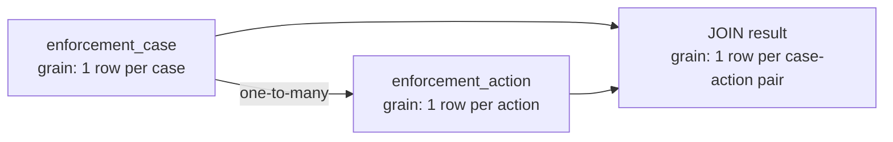
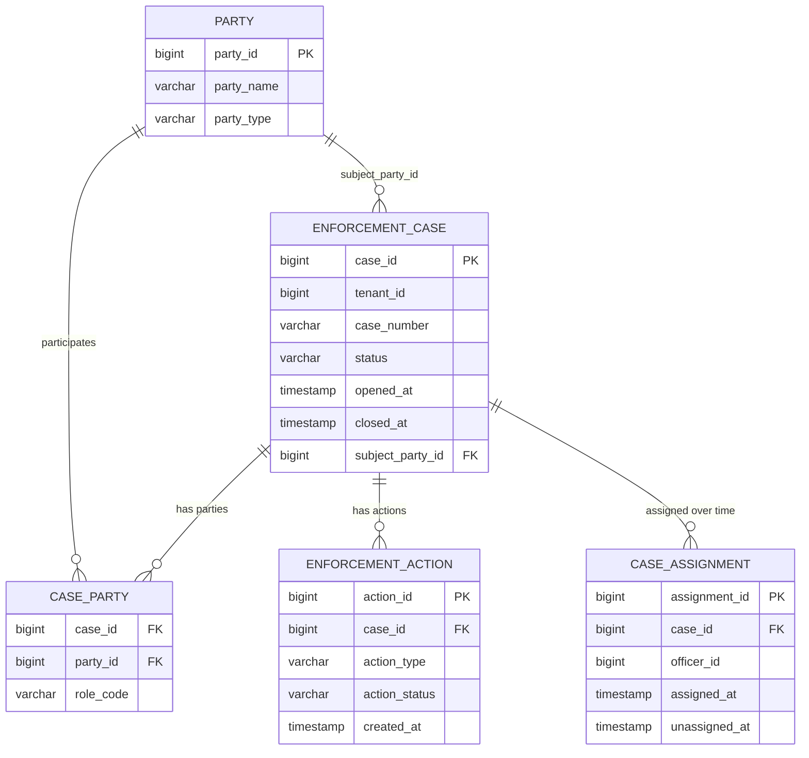
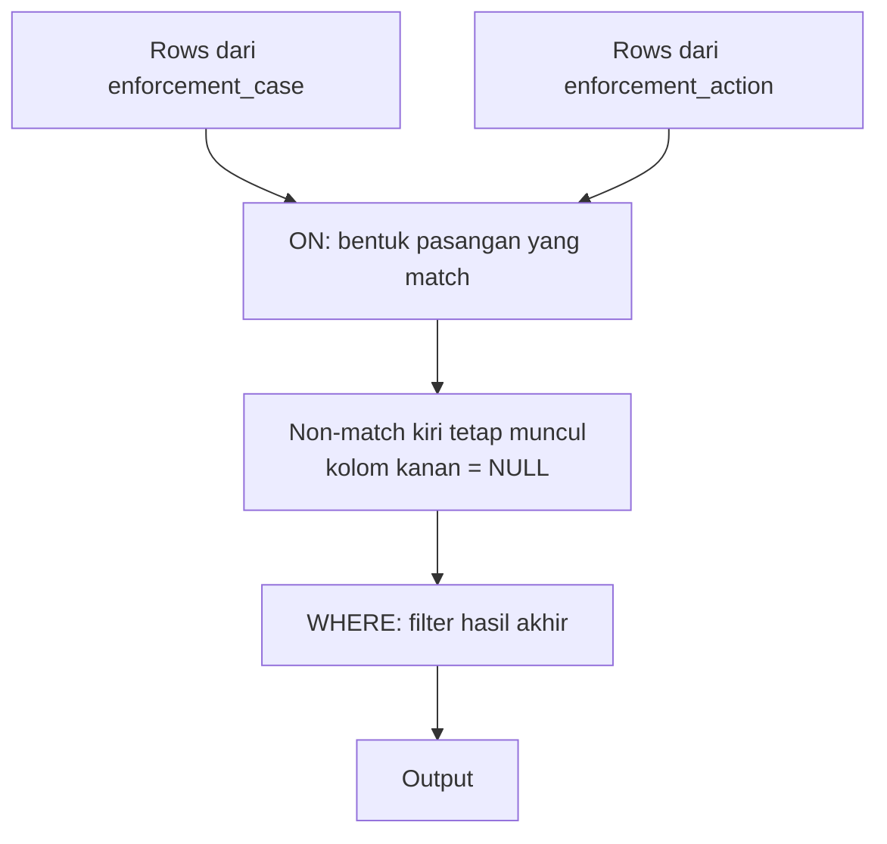
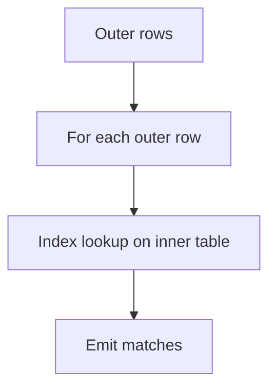
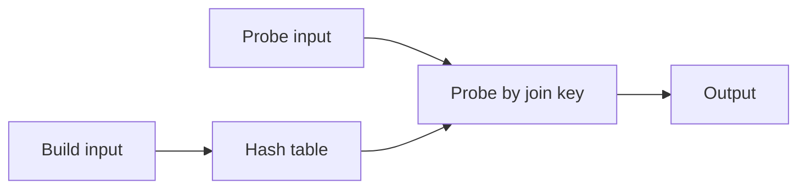

# Part 009 — Joins as Data Relationship Execution

Join adalah titik ketika SQL mulai menjadi alat engineering yang serius.

Query satu tabel biasanya hanya menjawab pertanyaan lokal: “baris mana yang cocok?”. Query join menjawab pertanyaan lintas fakta: “bagaimana beberapa fakta, status, actor, event, dan referensi domain saling berhubungan?”. Di sistem produksi, banyak bug paling mahal bukan berasal dari syntax join yang salah, tetapi dari join yang secara syntactically valid namun secara bisnis salah: duplicate explosion, missing row, outer join yang berubah menjadi inner join, join pada grain yang tidak cocok, atau join tanpa tenant boundary.

Materi ini tidak menjadikan join sebagai kumpulan diagram Venn. Diagram Venn kadang membantu untuk intuisi awal, tetapi terlalu dangkal untuk produksi. Mental model yang lebih berguna adalah:

> Join adalah operasi pembentukan pasangan baris berdasarkan relationship predicate, lalu hasilnya harus dievaluasi terhadap grain, cardinality, dan invariant bisnis.

Dalam gaya Kaufman, tujuan part ini bukan menghafal seluruh variasi join, tetapi menguasai sub-skill yang memberikan feedback cepat:

1. Membaca relationship antar tabel.
2. Menentukan grain input dan grain output.
3. Memilih join type yang sesuai dengan pertanyaan.
4. Menguji cardinality sebelum percaya hasil.
5. Menemukan bug fan-out, missing row, dan NULL-extension.

---

## 1. Target Skill

Setelah menyelesaikan part ini, kita harus bisa:

- menjelaskan join sebagai operasi relasional, bukan sekadar syntax;
- membedakan `INNER JOIN`, `LEFT JOIN`, `RIGHT JOIN`, `FULL JOIN`, `CROSS JOIN`, self join, semi join, dan anti join;
- menentukan kapan predicate harus berada di `ON` dan kapan di `WHERE`;
- mendeteksi duplicate explosion dari one-to-many dan many-to-many relationship;
- menulis query untuk menemukan unmatched rows;
- menghindari `DISTINCT` sebagai plester atas join yang salah;
- mendesain join defensif untuk sistem multi-tenant, audit, dan workflow;
- membaca hasil join dari sisi correctness sebelum performance.

---

## 2. Mental Model: Join Mengubah Grain

Sebelum menulis join, selalu jawab pertanyaan ini:

> Satu baris hasil merepresentasikan apa?

Ini disebut **grain**.

Contoh:

- satu baris per `case`;
- satu baris per `case + party`;
- satu baris per `case + action`;
- satu baris per `case + party + action`;
- satu baris per `case + day`;
- satu baris per `case + transition`.

Join sering gagal karena developer mengira output masih satu baris per entity utama, padahal join ke tabel child telah mengubah grain.

Misalnya:

```sql
SELECT c.case_id, c.case_number, a.action_type
FROM enforcement_case c
JOIN enforcement_action a ON a.case_id = c.case_id;
```

Jika satu case memiliki 5 action, maka satu case muncul 5 kali. Itu bukan bug SQL. Itu konsekuensi relationship one-to-many.

Bug muncul ketika query ini kemudian dipakai untuk menghitung jumlah case:

```sql
SELECT COUNT(*) AS total_cases
FROM enforcement_case c
JOIN enforcement_action a ON a.case_id = c.case_id;
```

Hasilnya bukan jumlah case. Hasilnya jumlah pasangan `case + action`.

### Diagram Grain



Rule praktis:

> Jika join menyentuh tabel child, jangan lagi menganggap `COUNT(*)` menghitung parent.

---

## 3. Working Schema

Kita pakai schema kecil yang mirip case management dan regulatory workflow.

```sql
CREATE TABLE party (
    party_id        BIGINT PRIMARY KEY,
    party_name      VARCHAR(200) NOT NULL,
    party_type      VARCHAR(30)  NOT NULL
);

CREATE TABLE enforcement_case (
    case_id         BIGINT PRIMARY KEY,
    tenant_id       BIGINT NOT NULL,
    case_number     VARCHAR(50) NOT NULL,
    status          VARCHAR(30) NOT NULL,
    opened_at       TIMESTAMP NOT NULL,
    closed_at       TIMESTAMP NULL,
    subject_party_id BIGINT NOT NULL,
    CONSTRAINT fk_case_subject_party
        FOREIGN KEY (subject_party_id) REFERENCES party(party_id),
    CONSTRAINT uq_case_tenant_number
        UNIQUE (tenant_id, case_number)
);

CREATE TABLE case_party (
    case_id     BIGINT NOT NULL,
    party_id    BIGINT NOT NULL,
    role_code   VARCHAR(30) NOT NULL,
    PRIMARY KEY (case_id, party_id, role_code),
    FOREIGN KEY (case_id) REFERENCES enforcement_case(case_id),
    FOREIGN KEY (party_id) REFERENCES party(party_id)
);

CREATE TABLE enforcement_action (
    action_id       BIGINT PRIMARY KEY,
    case_id         BIGINT NOT NULL,
    action_type     VARCHAR(50) NOT NULL,
    action_status   VARCHAR(30) NOT NULL,
    created_at      TIMESTAMP NOT NULL,
    completed_at    TIMESTAMP NULL,
    FOREIGN KEY (case_id) REFERENCES enforcement_case(case_id)
);

CREATE TABLE case_assignment (
    assignment_id   BIGINT PRIMARY KEY,
    case_id         BIGINT NOT NULL,
    officer_id      BIGINT NOT NULL,
    assigned_at     TIMESTAMP NOT NULL,
    unassigned_at   TIMESTAMP NULL,
    FOREIGN KEY (case_id) REFERENCES enforcement_case(case_id)
);
```

Relationship-nya:



---

## 4. Logical Model: Join Bukan Sekadar “Gabungkan Tabel”

Secara mental, join dapat dibaca sebagai:

1. Ambil baris dari sisi kiri.
2. Ambil kandidat baris dari sisi kanan.
3. Evaluasi predicate join.
4. Bentuk output pair untuk baris yang match.
5. Untuk outer join, tambahkan baris non-match dengan sisi yang kosong diisi `NULL`.

Untuk `INNER JOIN`, model sederhananya mirip:

```sql
SELECT ...
FROM left_table l
JOIN right_table r ON r.key = l.key;
```

Secara konseptual:

```sql
SELECT ...
FROM left_table l, right_table r
WHERE r.key = l.key;
```

Tetapi jangan menjadikan comma join sebagai style produksi. Explicit join lebih aman karena memisahkan relationship predicate dari filter predicate.

### Relationship Predicate vs Filter Predicate

Relationship predicate menjawab:

> Baris kiri berpasangan dengan baris kanan yang mana?

Filter predicate menjawab:

> Dari pasangan yang sudah terbentuk, mana yang masih relevan?

Contoh:

```sql
SELECT c.case_id, a.action_id
FROM enforcement_case c
JOIN enforcement_action a
    ON a.case_id = c.case_id
WHERE c.status = 'OPEN';
```

- `a.case_id = c.case_id` adalah relationship predicate.
- `c.status = 'OPEN'` adalah filter predicate.

Untuk `INNER JOIN`, memindahkan sebagian predicate dari `ON` ke `WHERE` sering menghasilkan output yang sama. Untuk `OUTER JOIN`, itu bisa mengubah makna query secara drastis.

---

## 5. INNER JOIN: Hanya Relationship yang Match

`INNER JOIN` mengembalikan hanya pasangan baris yang memenuhi predicate join.

Contoh: semua case yang punya minimal satu action.

```sql
SELECT
    c.case_id,
    c.case_number,
    a.action_id,
    a.action_type
FROM enforcement_case c
JOIN enforcement_action a
    ON a.case_id = c.case_id;
```

Output grain:

> satu baris per `case + action` yang match.

Bukan satu baris per case.

### Kapan INNER JOIN Tepat?

Gunakan `INNER JOIN` ketika keberadaan data kanan adalah bagian dari definisi hasil.

Contoh:

- “case yang punya action”; 
- “party yang pernah menjadi subject case”;
- “assignment yang terhubung ke case valid”;
- “case-party role yang party-nya masih ada”.

Jika pertanyaan bisnisnya adalah “semua case, termasuk yang belum punya action”, maka `INNER JOIN` salah.

### Inner Join Menghilangkan Parent yang Tidak Punya Child

```sql
SELECT COUNT(DISTINCT c.case_id) AS cases_with_action
FROM enforcement_case c
JOIN enforcement_action a
    ON a.case_id = c.case_id;
```

Ini menghitung case yang memiliki action. Bukan semua case.

Lebih eksplisit:

```sql
SELECT COUNT(*) AS cases_with_action
FROM enforcement_case c
WHERE EXISTS (
    SELECT 1
    FROM enforcement_action a
    WHERE a.case_id = c.case_id
);
```

Untuk pertanyaan “punya minimal satu child”, `EXISTS` sering lebih jelas daripada join + `DISTINCT`.

---

## 6. LEFT JOIN: Pertahankan Semua Baris Kiri

`LEFT JOIN` mengembalikan semua baris dari tabel kiri. Jika tidak ada match di kanan, kolom kanan menjadi `NULL`.

Contoh: semua case dan action-nya jika ada.

```sql
SELECT
    c.case_id,
    c.case_number,
    a.action_id,
    a.action_type
FROM enforcement_case c
LEFT JOIN enforcement_action a
    ON a.case_id = c.case_id;
```

Jika case tidak punya action, tetap muncul:

| case_id | case_number | action_id | action_type |
|---:|---|---:|---|
| 101 | CASE-001 | 9001 | WARNING_LETTER |
| 102 | CASE-002 | null | null |

### LEFT JOIN Bukan “Aman dari Missing Row” Jika WHERE Salah

Bug klasik:

```sql
SELECT
    c.case_id,
    c.case_number,
    a.action_id
FROM enforcement_case c
LEFT JOIN enforcement_action a
    ON a.case_id = c.case_id
WHERE a.action_status = 'OPEN';
```

Predicate `a.action_status = 'OPEN'` di `WHERE` akan menyingkirkan baris hasil `LEFT JOIN` yang sisi kanannya `NULL`. Efeknya query berubah menjadi mirip inner join terhadap action berstatus open.

Jika maksudnya “semua case, dan hanya action open jika ada”, tulis:

```sql
SELECT
    c.case_id,
    c.case_number,
    a.action_id
FROM enforcement_case c
LEFT JOIN enforcement_action a
    ON a.case_id = c.case_id
   AND a.action_status = 'OPEN';
```

Perbedaannya penting:

- Predicate di `ON` membatasi pasangan kanan yang boleh match.
- Predicate di `WHERE` membatasi hasil akhir.

### Diagram ON vs WHERE untuk LEFT JOIN



Rule:

> Untuk outer join, predicate atas tabel kanan biasanya berada di `ON` jika kita ingin mempertahankan baris kiri yang tidak punya match.

---

## 7. RIGHT JOIN dan FULL JOIN

`RIGHT JOIN` mempertahankan semua baris kanan. Secara praktis, kebanyakan query lebih mudah dibaca dengan menukar posisi tabel dan memakai `LEFT JOIN`.

Daripada:

```sql
SELECT ...
FROM enforcement_action a
RIGHT JOIN enforcement_case c
    ON c.case_id = a.case_id;
```

Lebih jelas:

```sql
SELECT ...
FROM enforcement_case c
LEFT JOIN enforcement_action a
    ON a.case_id = c.case_id;
```

`FULL JOIN` mempertahankan semua baris dari kedua sisi:

- match menjadi satu row gabungan;
- non-match kiri tetap muncul;
- non-match kanan tetap muncul.

Contoh penggunaan nyata: reconciliation.

```sql
SELECT
    COALESCE(src.case_number, dst.case_number) AS case_number,
    src.case_id AS source_case_id,
    dst.case_id AS target_case_id,
    CASE
        WHEN src.case_id IS NULL THEN 'ONLY_IN_TARGET'
        WHEN dst.case_id IS NULL THEN 'ONLY_IN_SOURCE'
        ELSE 'MATCHED'
    END AS reconciliation_status
FROM source_case src
FULL JOIN target_case dst
    ON dst.tenant_id = src.tenant_id
   AND dst.case_number = src.case_number;
```

`FULL JOIN` berguna untuk:

- data migration reconciliation;
- comparing source vs target;
- matching operational data dengan report extract;
- audit completeness check.

Namun tidak semua engine mendukung `FULL JOIN` secara native, sehingga untuk portabilitas kadang perlu kombinasi `LEFT JOIN` + `UNION ALL`.

---

## 8. CROSS JOIN: Kombinasi Semua Pasangan

`CROSS JOIN` menghasilkan cartesian product.

```sql
SELECT
    d.report_date,
    s.status
FROM report_date d
CROSS JOIN case_status s;
```

Jika `report_date` berisi 365 baris dan `case_status` berisi 8 baris, output 2.920 baris.

`CROSS JOIN` bukan selalu bug. Ia berguna untuk membentuk grid lengkap.

Contoh: dashboard butuh semua kombinasi tanggal dan status, termasuk status yang jumlahnya nol.

```sql
WITH daily_status_grid AS (
    SELECT d.report_date, s.status
    FROM report_date d
    CROSS JOIN case_status s
), actual_count AS (
    SELECT
        CAST(opened_at AS DATE) AS report_date,
        status,
        COUNT(*) AS case_count
    FROM enforcement_case
    GROUP BY CAST(opened_at AS DATE), status
)
SELECT
    g.report_date,
    g.status,
    COALESCE(a.case_count, 0) AS case_count
FROM daily_status_grid g
LEFT JOIN actual_count a
    ON a.report_date = g.report_date
   AND a.status = g.status;
```

Rule:

> `CROSS JOIN` harus terlihat disengaja. Jika output membesar tanpa alasan, itu hampir selalu bug.

---

## 9. Self Join: Relationship di Tabel yang Sama

Self join berarti tabel yang sama dipakai lebih dari sekali dengan alias berbeda.

Contoh: case yang merupakan hasil eskalasi dari case lain.

```sql
CREATE TABLE case_link (
    parent_case_id BIGINT NOT NULL,
    child_case_id  BIGINT NOT NULL,
    link_type      VARCHAR(30) NOT NULL,
    PRIMARY KEY (parent_case_id, child_case_id, link_type),
    FOREIGN KEY (parent_case_id) REFERENCES enforcement_case(case_id),
    FOREIGN KEY (child_case_id) REFERENCES enforcement_case(case_id)
);
```

Query:

```sql
SELECT
    parent.case_number AS parent_case_number,
    child.case_number  AS child_case_number,
    l.link_type
FROM case_link l
JOIN enforcement_case parent
    ON parent.case_id = l.parent_case_id
JOIN enforcement_case child
    ON child.case_id = l.child_case_id
WHERE l.link_type = 'ESCALATED_TO';
```

Self join sering muncul untuk:

- hierarchy;
- parent-child case;
- replacement record;
- superseded version;
- duplicate candidate;
- previous/next row jika belum memakai window function.

Self join harus memakai alias yang bermakna. Alias seperti `c1` dan `c2` cepat membingungkan pada query panjang. Alias `parent` dan `child` lebih baik.

---

## 10. Semi Join: “Ada Match” Tanpa Mengubah Grain

SQL tidak selalu punya keyword `SEMI JOIN`, tetapi konsepnya umum:

> Kembalikan baris kiri jika ada minimal satu match di kanan, tanpa menggandakan baris kiri.

Gunakan `EXISTS`.

Contoh: case yang memiliki action open.

```sql
SELECT
    c.case_id,
    c.case_number
FROM enforcement_case c
WHERE EXISTS (
    SELECT 1
    FROM enforcement_action a
    WHERE a.case_id = c.case_id
      AND a.action_status = 'OPEN'
);
```

Output grain tetap satu baris per case.

Bandingkan dengan join:

```sql
SELECT DISTINCT
    c.case_id,
    c.case_number
FROM enforcement_case c
JOIN enforcement_action a
    ON a.case_id = c.case_id
WHERE a.action_status = 'OPEN';
```

Query kedua membutuhkan `DISTINCT` karena join menggandakan case sebanyak action open. Query pertama menyatakan niat lebih jelas: existence check.

Rule:

> Jika kita tidak membutuhkan kolom dari tabel kanan dan hanya ingin tahu apakah match ada, gunakan `EXISTS`.

---

## 11. Anti Join: “Tidak Ada Match”

Anti join mengembalikan baris kiri yang tidak punya match di kanan.

Gunakan `NOT EXISTS`.

Contoh: case yang belum punya action apa pun.

```sql
SELECT
    c.case_id,
    c.case_number
FROM enforcement_case c
WHERE NOT EXISTS (
    SELECT 1
    FROM enforcement_action a
    WHERE a.case_id = c.case_id
);
```

Alternatif umum:

```sql
SELECT
    c.case_id,
    c.case_number
FROM enforcement_case c
LEFT JOIN enforcement_action a
    ON a.case_id = c.case_id
WHERE a.action_id IS NULL;
```

Keduanya bisa benar. Namun `NOT EXISTS` biasanya lebih langsung dan lebih aman ketika join predicate kompleks.

### Hindari `NOT IN` Jika Ada NULL

Bug klasik:

```sql
SELECT c.case_id
FROM enforcement_case c
WHERE c.case_id NOT IN (
    SELECT a.case_id
    FROM enforcement_action a
);
```

Jika subquery menghasilkan `NULL`, perilaku `NOT IN` bisa membuat hasil menjadi kosong atau tidak sesuai intuisi karena three-valued logic.

Lebih aman:

```sql
SELECT c.case_id
FROM enforcement_case c
WHERE NOT EXISTS (
    SELECT 1
    FROM enforcement_action a
    WHERE a.case_id = c.case_id
);
```

Rule:

> Untuk anti relationship, `NOT EXISTS` adalah default yang paling defensif.

---

## 12. One-to-One, One-to-Many, Many-to-Many

Setiap join punya cardinality shape.

### One-to-One

Satu baris kiri match maksimal satu baris kanan.

Contoh:

```sql
SELECT c.case_id, p.party_name
FROM enforcement_case c
JOIN party p
    ON p.party_id = c.subject_party_id;
```

Jika FK `subject_party_id` valid dan `party_id` primary key, output grain tetap satu baris per case.

### One-to-Many

Satu baris kiri bisa match banyak baris kanan.

```sql
SELECT c.case_id, a.action_id
FROM enforcement_case c
JOIN enforcement_action a
    ON a.case_id = c.case_id;
```

Output grain berubah menjadi satu baris per `case + action`.

### Many-to-Many

Many-to-many biasanya dimodelkan dengan bridge table.

```sql
SELECT
    c.case_number,
    p.party_name,
    cp.role_code
FROM enforcement_case c
JOIN case_party cp
    ON cp.case_id = c.case_id
JOIN party p
    ON p.party_id = cp.party_id;
```

Output grain:

> satu baris per `case + party + role`.

Jika satu party punya beberapa role pada case yang sama, output bisa lebih banyak dari yang diharapkan.

### Fan-Out Factor

Untuk menganalisis efek join:

```sql
SELECT
    COUNT(*) AS joined_rows,
    COUNT(DISTINCT c.case_id) AS distinct_cases,
    COUNT(*) * 1.0 / NULLIF(COUNT(DISTINCT c.case_id), 0) AS fanout_factor
FROM enforcement_case c
JOIN enforcement_action a
    ON a.case_id = c.case_id;
```

Jika `fanout_factor = 1`, rata-rata satu action per case.
Jika `fanout_factor = 5.8`, setiap case muncul rata-rata 5,8 kali.

Untuk query produksi, fan-out factor harus disengaja.

---

## 13. Duplicate Explosion: Penyebab dan Diagnosis

Duplicate explosion terjadi ketika join menghasilkan baris lebih banyak daripada grain yang dimaksud.

Penyebab umum:

1. Join ke tabel child tanpa agregasi.
2. Join antar dua tabel child dari parent yang sama.
3. Join pada natural/business key yang tidak unik.
4. Join tanpa predicate lengkap.
5. Join lintas tenant tanpa `tenant_id`.
6. Join terhadap history table tanpa memilih versi aktif.
7. Many-to-many bridge yang role-nya lebih dari satu.

### Join Dua Child: Multiplication Trap

Contoh salah:

```sql
SELECT
    c.case_id,
    COUNT(a.action_id) AS action_count,
    COUNT(asg.assignment_id) AS assignment_count
FROM enforcement_case c
LEFT JOIN enforcement_action a
    ON a.case_id = c.case_id
LEFT JOIN case_assignment asg
    ON asg.case_id = c.case_id
GROUP BY c.case_id;
```

Jika case punya 3 action dan 2 assignment, hasil join menghasilkan 6 row. `COUNT(a.action_id)` menjadi 6, bukan 3. `COUNT(asg.assignment_id)` juga 6, bukan 2.

Solusi: agregasi masing-masing child sebelum join.

```sql
WITH action_counts AS (
    SELECT case_id, COUNT(*) AS action_count
    FROM enforcement_action
    GROUP BY case_id
), assignment_counts AS (
    SELECT case_id, COUNT(*) AS assignment_count
    FROM case_assignment
    GROUP BY case_id
)
SELECT
    c.case_id,
    COALESCE(ac.action_count, 0) AS action_count,
    COALESCE(sc.assignment_count, 0) AS assignment_count
FROM enforcement_case c
LEFT JOIN action_counts ac
    ON ac.case_id = c.case_id
LEFT JOIN assignment_counts sc
    ON sc.case_id = c.case_id;
```

Rule:

> Jika menggabungkan beberapa child collection dari parent yang sama, agregasi dulu per parent sebelum join.

---

## 14. Joining on Business Key vs Surrogate Key

Join pada primary key / foreign key biasanya paling aman.

```sql
JOIN party p ON p.party_id = c.subject_party_id
```

Join pada business key bisa benar jika business key benar-benar unique dan stable.

```sql
JOIN target_case t
  ON t.tenant_id = s.tenant_id
 AND t.case_number = s.case_number
```

Namun business key sering punya masalah:

- format berubah;
- case sensitivity;
- whitespace;
- leading zero;
- re-use kode;
- uniqueness hanya berlaku dalam tenant;
- validitas temporal;
- data lama tidak bersih.

Contoh buruk:

```sql
JOIN party p
  ON LOWER(TRIM(p.party_name)) = LOWER(TRIM(c.reported_party_name))
```

Ini bukan relational join yang kuat. Ini matching heuristik. Sebut apa adanya: entity resolution.

Untuk sistem enforcement atau regulatory, joining by name dapat berbahaya karena bisa menggabungkan orang/perusahaan yang berbeda.

Rule:

> Join pada nama adalah sinyal bahwa sistem kehilangan identifier yang defensible.

---

## 15. Tenant Boundary dalam Join

Pada sistem multi-tenant, join predicate harus menjaga tenant boundary.

Jika `case_number` unik hanya per tenant, query ini salah:

```sql
SELECT c.case_id, r.risk_score
FROM enforcement_case c
JOIN case_risk_snapshot r
    ON r.case_number = c.case_number;
```

Harus:

```sql
SELECT c.case_id, r.risk_score
FROM enforcement_case c
JOIN case_risk_snapshot r
    ON r.tenant_id = c.tenant_id
   AND r.case_number = c.case_number;
```

Lebih baik lagi jika tersedia surrogate key:

```sql
JOIN case_risk_snapshot r
  ON r.case_id = c.case_id
```

Dalam review query produksi, cari predicate yang “terlihat benar” tetapi kehilangan tenant key.

Checklist:

- Apakah semua natural key join menyertakan `tenant_id`?
- Apakah FK mengandung tenant boundary jika schema multi-tenant by shared database?
- Apakah query report lintas tenant memang disengaja?
- Apakah row-level security ikut melindungi join path?

---

## 16. Outer Join dan Null-Extension

Outer join menghasilkan `NULL` buatan untuk sisi yang tidak match. Ini disebut null-extension.

```sql
SELECT
    c.case_id,
    a.action_id,
    a.action_status
FROM enforcement_case c
LEFT JOIN enforcement_action a
    ON a.case_id = c.case_id;
```

Jika tidak ada action, `a.action_id` dan `a.action_status` menjadi `NULL`.

Masalahnya: `NULL` itu tidak selalu berarti data asli di kanan memang `NULL`. Bisa berarti tidak ada baris kanan.

Jangan menafsirkan semua `NULL` hasil outer join sebagai value domain.

Lebih eksplisit:

```sql
SELECT
    c.case_id,
    CASE
        WHEN a.action_id IS NULL THEN 'NO_ACTION_ROW'
        WHEN a.action_status IS NULL THEN 'ACTION_STATUS_MISSING'
        ELSE 'ACTION_AVAILABLE'
    END AS action_presence
FROM enforcement_case c
LEFT JOIN enforcement_action a
    ON a.case_id = c.case_id;
```

Rule:

> Pada outer join, gunakan primary key sisi kanan untuk membedakan “tidak ada row” dari “row ada tapi value null”.

---

## 17. Current Row Join pada History Table

History table sering menyebabkan duplicate explosion karena satu entity punya banyak versi.

```sql
CREATE TABLE case_status_history (
    case_id      BIGINT NOT NULL,
    status       VARCHAR(30) NOT NULL,
    valid_from   TIMESTAMP NOT NULL,
    valid_to     TIMESTAMP NULL,
    PRIMARY KEY (case_id, valid_from)
);
```

Bug:

```sql
SELECT c.case_id, h.status
FROM enforcement_case c
JOIN case_status_history h
    ON h.case_id = c.case_id;
```

Output satu row per historical status, bukan satu row per case.

Jika maksudnya status saat ini:

```sql
SELECT c.case_id, h.status
FROM enforcement_case c
JOIN case_status_history h
    ON h.case_id = c.case_id
   AND h.valid_to IS NULL;
```

Jika maksudnya status pada waktu tertentu:

```sql
SELECT c.case_id, h.status
FROM enforcement_case c
JOIN case_status_history h
    ON h.case_id = c.case_id
   AND h.valid_from <= TIMESTAMP '2026-06-01 00:00:00'
   AND (h.valid_to > TIMESTAMP '2026-06-01 00:00:00' OR h.valid_to IS NULL);
```

Untuk temporal data, join predicate harus menyertakan temporal predicate.

Rule:

> Join ke history table tanpa predicate versi adalah almost certainly wrong.

---

## 18. Latest Row per Parent

Sering kita butuh latest child row.

Contoh: action terakhir per case.

Pendekatan dengan window function:

```sql
WITH ranked_action AS (
    SELECT
        a.*,
        ROW_NUMBER() OVER (
            PARTITION BY a.case_id
            ORDER BY a.created_at DESC, a.action_id DESC
        ) AS rn
    FROM enforcement_action a
)
SELECT
    c.case_id,
    c.case_number,
    ra.action_id,
    ra.action_type,
    ra.created_at
FROM enforcement_case c
LEFT JOIN ranked_action ra
    ON ra.case_id = c.case_id
   AND ra.rn = 1;
```

Kenapa `ORDER BY a.created_at DESC, a.action_id DESC`?

Karena timestamp bisa tie. Query produksi butuh deterministic tie-breaker.

Anti-pattern:

```sql
SELECT c.case_id, MAX(a.created_at) AS latest_action_at, a.action_type
FROM enforcement_case c
JOIN enforcement_action a ON a.case_id = c.case_id
GROUP BY c.case_id, a.action_type;
```

Ini tidak memilih row terakhir. Ini mengelompokkan berdasarkan action type dan menghasilkan hasil yang salah.

---

## 19. Join untuk Finding Missing Data

Join sangat berguna untuk audit completeness.

### Case Tanpa Subject Party Valid

Jika constraint FK tidak aktif atau data historis kotor:

```sql
SELECT
    c.case_id,
    c.subject_party_id
FROM enforcement_case c
LEFT JOIN party p
    ON p.party_id = c.subject_party_id
WHERE p.party_id IS NULL;
```

### Case Open Tanpa Assignment Aktif

```sql
SELECT
    c.case_id,
    c.case_number
FROM enforcement_case c
WHERE c.status = 'OPEN'
  AND NOT EXISTS (
      SELECT 1
      FROM case_assignment asg
      WHERE asg.case_id = c.case_id
        AND asg.unassigned_at IS NULL
  );
```

### Action Completed Tanpa Completed Timestamp

```sql
SELECT
    a.action_id,
    a.case_id,
    a.action_status,
    a.completed_at
FROM enforcement_action a
WHERE a.action_status = 'COMPLETED'
  AND a.completed_at IS NULL;
```

Ini bukan join, tetapi sering menjadi pasangan audit setelah join menemukan anomaly.

---

## 20. Join dan Security Boundary

Join dapat membocorkan data jika predicate access control hanya diterapkan pada tabel utama.

Contoh buruk:

```sql
SELECT
    c.case_id,
    c.case_number,
    n.note_text
FROM enforcement_case c
JOIN case_note n
    ON n.case_id = c.case_id
WHERE c.tenant_id = :tenant_id;
```

Jika `case_note` tidak secara konsisten hanya berisi note untuk case tenant yang sama, FK mungkin cukup. Tetapi pada sistem kompleks, terutama dengan denormalized table atau replicated table, lebih aman membawa tenant boundary di child table juga.

```sql
SELECT
    c.case_id,
    c.case_number,
    n.note_text
FROM enforcement_case c
JOIN case_note n
    ON n.tenant_id = c.tenant_id
   AND n.case_id = c.case_id
WHERE c.tenant_id = :tenant_id;
```

Di sistem regulated, access predicate harus dianggap invariant, bukan afterthought.

---

## 21. Physical Join Algorithms: Cukup untuk Mental Model

Detail execution plan akan dibahas di part optimizer. Namun kita perlu mental model dasar.

Database engine tidak benar-benar mengeksekusi join sebagai cartesian product penuh lalu filter, kecuali query buruk dan optimizer tidak punya pilihan. Engine memilih physical join algorithm.

### Nested Loop Join

Mental model:

- untuk setiap row kiri;
- cari matching row kanan;
- sangat bagus jika sisi kiri kecil dan lookup kanan indexed.



### Hash Join

Mental model:

- build hash table dari salah satu input;
- scan input lain dan probe hash table;
- bagus untuk equi-join besar.



### Merge Join

Mental model:

- kedua input terurut berdasarkan join key;
- berjalan maju seperti merge sorted lists;
- bagus jika data sudah terurut atau index order mendukung.

Performance join dipengaruhi oleh:

- ukuran input;
- selectivity predicate;
- index availability;
- cardinality estimate;
- memory;
- sort cost;
- data skew;
- predicate sargability;
- join order.

Namun correctness tetap prioritas pertama. Query salah yang cepat tetap salah.

---

## 22. Join Order dalam SQL vs Join Order Fisik

Dalam SQL, kita menulis join dengan urutan tertentu:

```sql
FROM enforcement_case c
JOIN enforcement_action a ON a.case_id = c.case_id
JOIN party p ON p.party_id = c.subject_party_id
```

Optimizer sering bebas mengubah urutan join untuk mendapatkan plan yang lebih murah, selama semantics tetap sama.

Namun outer join, lateral dependency, volatile function, dan beberapa konstruksi query bisa membatasi reorder.

Untuk developer, implikasinya:

- jangan mengandalkan urutan tulis sebagai urutan eksekusi;
- tulis predicate lengkap dan jelas;
- gunakan `EXPLAIN` untuk tahu plan nyata;
- pastikan statistik dan index membantu optimizer.

---

## 23. NATURAL JOIN: Hindari di Produksi

`NATURAL JOIN` otomatis join berdasarkan kolom yang namanya sama.

```sql
SELECT *
FROM enforcement_case
NATURAL JOIN enforcement_action;
```

Ini berbahaya karena:

- kolom baru dengan nama sama bisa mengubah query;
- relationship predicate menjadi implisit;
- reviewer sulit melihat join key;
- schema evolution bisa mematahkan semantics diam-diam.

Gunakan explicit join:

```sql
SELECT ...
FROM enforcement_case c
JOIN enforcement_action a
    ON a.case_id = c.case_id;
```

Rule:

> Production SQL should make relationship predicates explicit.

---

## 24. `USING` vs `ON`

Beberapa engine mendukung `USING`:

```sql
SELECT ...
FROM enforcement_case
JOIN enforcement_action USING (case_id);
```

Ini ringkas jika nama kolom sama dan semantics jelas. Namun `ON` lebih fleksibel dan lebih eksplisit, terutama untuk join multi-column:

```sql
JOIN case_risk_snapshot r
  ON r.tenant_id = c.tenant_id
 AND r.case_id = c.case_id
```

Dalam handbook produksi, default yang lebih readable adalah `ON`, terutama ketika:

- join key lebih dari satu;
- ada tenant boundary;
- ada temporal predicate;
- ada filter pada sisi kanan outer join;
- query dipakai untuk audit atau regulatory reporting.

---

## 25. Join Query Review Checklist

Sebelum approve query join, jawab:

1. Apa grain output?
2. Apakah join type sesuai pertanyaan bisnis?
3. Apakah relationship predicate lengkap?
4. Apakah `tenant_id` atau scope boundary disertakan?
5. Apakah join ke history table punya temporal predicate?
6. Apakah join ke child table mengubah parent count?
7. Apakah ada lebih dari satu child collection yang bisa saling mengalikan?
8. Apakah outer join difilter di `WHERE` secara tidak sengaja?
9. Apakah `DISTINCT` dipakai untuk menutup fan-out yang tidak dipahami?
10. Apakah join key indexed atau setidaknya feasible untuk volume produksi?
11. Apakah `NULL` dari outer join ditafsirkan dengan benar?
12. Apakah query bisa diuji dengan count reconciliation?

---

## 26. Debugging Join Step by Step

Misalkan report “open case by officer” tiba-tiba membesar dua kali lipat.

Query awal:

```sql
SELECT
    asg.officer_id,
    COUNT(*) AS open_case_count
FROM enforcement_case c
JOIN case_assignment asg
    ON asg.case_id = c.case_id
WHERE c.status = 'OPEN'
GROUP BY asg.officer_id;
```

Pertanyaan debugging:

### Step 1 — Apakah grain assignment aktif?

```sql
SELECT
    c.case_id,
    COUNT(*) AS assignment_rows
FROM enforcement_case c
JOIN case_assignment asg
    ON asg.case_id = c.case_id
WHERE c.status = 'OPEN'
GROUP BY c.case_id
HAVING COUNT(*) > 1;
```

Jika hasil ada, berarti satu case punya banyak assignment row.

### Step 2 — Apakah query butuh assignment aktif saja?

```sql
SELECT
    asg.officer_id,
    COUNT(*) AS open_case_count
FROM enforcement_case c
JOIN case_assignment asg
    ON asg.case_id = c.case_id
   AND asg.unassigned_at IS NULL
WHERE c.status = 'OPEN'
GROUP BY asg.officer_id;
```

### Step 3 — Apakah satu case boleh punya lebih dari satu assignment aktif?

```sql
SELECT
    asg.case_id,
    COUNT(*) AS active_assignment_count
FROM case_assignment asg
WHERE asg.unassigned_at IS NULL
GROUP BY asg.case_id
HAVING COUNT(*) > 1;
```

Jika bisnis melarang lebih dari satu assignment aktif, masalahnya bukan query saja. Masalahnya constraint/invariant.

PostgreSQL contoh bisa memakai partial unique index:

```sql
CREATE UNIQUE INDEX uq_one_active_assignment_per_case
ON case_assignment(case_id)
WHERE unassigned_at IS NULL;
```

Pada engine tanpa partial index, invariant bisa ditegakkan dengan desain berbeda, generated column, trigger, atau transaction logic yang sangat hati-hati.

---

## 27. Pattern: Join Setelah Mengurangi Dataset

Untuk tabel besar, jangan join semua hal jika hanya butuh subset kecil.

Contoh:

```sql
WITH open_cases AS (
    SELECT case_id, case_number, subject_party_id
    FROM enforcement_case
    WHERE status = 'OPEN'
)
SELECT
    c.case_id,
    c.case_number,
    p.party_name
FROM open_cases c
JOIN party p
    ON p.party_id = c.subject_party_id;
```

Secara logical, ini memperjelas niat. Secara fisik, optimizer bisa inline atau reorder tergantung engine dan versi. Jangan pakai CTE sebagai jaminan materialization kecuali engine mendukung dan kita memang mengontrolnya. Namun sebagai readability pattern, ini sering membantu.

---

## 28. Pattern: Join ke Aggregated Child

Untuk output satu row per parent, agregasi child dulu.

```sql
WITH action_summary AS (
    SELECT
        case_id,
        COUNT(*) AS action_count,
        MAX(created_at) AS latest_action_at
    FROM enforcement_action
    GROUP BY case_id
)
SELECT
    c.case_id,
    c.case_number,
    COALESCE(s.action_count, 0) AS action_count,
    s.latest_action_at
FROM enforcement_case c
LEFT JOIN action_summary s
    ON s.case_id = c.case_id;
```

Ini lebih aman daripada join child raw lalu mencoba memperbaiki dengan `COUNT(DISTINCT ...)`.

---

## 29. Pattern: Optional Dimension

Jika dimension optional, gunakan `LEFT JOIN`.

```sql
SELECT
    c.case_id,
    c.case_number,
    p.party_name AS subject_party_name,
    r.risk_band
FROM enforcement_case c
JOIN party p
    ON p.party_id = c.subject_party_id
LEFT JOIN case_risk_snapshot r
    ON r.case_id = c.case_id
   AND r.snapshot_date = CURRENT_DATE;
```

Di sini:

- `party` wajib karena case harus punya subject party;
- `risk_snapshot` optional karena snapshot hari ini mungkin belum ada.

Join type mencerminkan domain model.

---

## 30. Pattern: Reconciliation dengan FULL JOIN

Data migration sering butuh membandingkan source dan target.

```sql
SELECT
    COALESCE(s.case_number, t.case_number) AS case_number,
    CASE
        WHEN s.case_number IS NULL THEN 'EXTRA_IN_TARGET'
        WHEN t.case_number IS NULL THEN 'MISSING_IN_TARGET'
        WHEN s.status <> t.status THEN 'STATUS_MISMATCH'
        ELSE 'MATCH'
    END AS diff_type,
    s.status AS source_status,
    t.status AS target_status
FROM staging_case s
FULL JOIN enforcement_case t
    ON t.tenant_id = s.tenant_id
   AND t.case_number = s.case_number
WHERE s.case_number IS NULL
   OR t.case_number IS NULL
   OR s.status <> t.status;
```

Ini adalah SQL sebagai audit tool. Sangat berguna untuk migration, backfill, dan release verification.

---

## 31. Anti-Patterns

### Anti-Pattern 1 — `DISTINCT` Tanpa Memahami Fan-Out

```sql
SELECT DISTINCT c.case_id, c.case_number
FROM enforcement_case c
JOIN enforcement_action a ON a.case_id = c.case_id;
```

Kadang benar, tetapi sering menutupi masalah. Tanyakan:

- Mengapa join menggandakan baris?
- Apakah kita hanya butuh existence? Gunakan `EXISTS`.
- Apakah kita butuh summary? Agregasi child dulu.
- Apakah relationship seharusnya one-to-one tetapi data melanggar invariant?

### Anti-Pattern 2 — Join dengan Function di Key

```sql
JOIN party p
  ON LOWER(p.party_name) = LOWER(c.reported_party_name)
```

Masalah:

- correctness lemah;
- index biasa sulit dipakai;
- collision tinggi;
- audit defensibility rendah.

### Anti-Pattern 3 — Missing Predicate

```sql
JOIN case_assignment asg
  ON asg.case_id = c.case_id
```

Jika hanya butuh assignment aktif, predicate kurang:

```sql
AND asg.unassigned_at IS NULL
```

### Anti-Pattern 4 — Filtering Right Table di WHERE pada LEFT JOIN

```sql
LEFT JOIN enforcement_action a ON a.case_id = c.case_id
WHERE a.action_status = 'OPEN'
```

Ini menghilangkan case tanpa action open. Bisa benar jika itulah maksudnya, tetapi sering tidak disengaja.

### Anti-Pattern 5 — Join Fact to Fact Tanpa Grain Bridge

```sql
JOIN payment p ON p.case_id = c.case_id
JOIN enforcement_action a ON a.case_id = c.case_id
```

Jika payment dan action sama-sama child collection, hasil bisa menjadi perkalian. Sering perlu agregasi masing-masing dulu.

---

## 32. Mini Lab

Gunakan pertanyaan berikut untuk deliberate practice.

### Lab 1 — Case Tanpa Action

Tulis query untuk semua open case yang belum punya action.

Jawaban:

```sql
SELECT
    c.case_id,
    c.case_number
FROM enforcement_case c
WHERE c.status = 'OPEN'
  AND NOT EXISTS (
      SELECT 1
      FROM enforcement_action a
      WHERE a.case_id = c.case_id
  );
```

### Lab 2 — Case dengan Minimal Satu Action Completed

```sql
SELECT
    c.case_id,
    c.case_number
FROM enforcement_case c
WHERE EXISTS (
    SELECT 1
    FROM enforcement_action a
    WHERE a.case_id = c.case_id
      AND a.action_status = 'COMPLETED'
);
```

### Lab 3 — Semua Case dan Action Open Jika Ada

```sql
SELECT
    c.case_id,
    c.case_number,
    a.action_id,
    a.action_type
FROM enforcement_case c
LEFT JOIN enforcement_action a
    ON a.case_id = c.case_id
   AND a.action_status = 'OPEN';
```

### Lab 4 — Hitung Action dan Assignment per Case Tanpa Multiplication

```sql
WITH action_summary AS (
    SELECT case_id, COUNT(*) AS action_count
    FROM enforcement_action
    GROUP BY case_id
), assignment_summary AS (
    SELECT case_id, COUNT(*) AS assignment_count
    FROM case_assignment
    GROUP BY case_id
)
SELECT
    c.case_id,
    COALESCE(a.action_count, 0) AS action_count,
    COALESCE(s.assignment_count, 0) AS assignment_count
FROM enforcement_case c
LEFT JOIN action_summary a
    ON a.case_id = c.case_id
LEFT JOIN assignment_summary s
    ON s.case_id = c.case_id;
```

### Lab 5 — Audit Fan-Out

```sql
SELECT
    COUNT(*) AS joined_rows,
    COUNT(DISTINCT c.case_id) AS distinct_cases,
    COUNT(*) * 1.0 / NULLIF(COUNT(DISTINCT c.case_id), 0) AS fanout_factor
FROM enforcement_case c
JOIN enforcement_action a
    ON a.case_id = c.case_id;
```

---

## 33. Production Heuristics

Gunakan heuristik berikut saat menulis SQL join:

1. Mulai dari pertanyaan bisnis, bukan dari tabel.
2. Tulis grain output sebagai komentar sebelum query kompleks.
3. Gunakan `EXISTS` untuk existence check.
4. Gunakan `NOT EXISTS` untuk absence check.
5. Gunakan `LEFT JOIN` untuk optional data yang tidak boleh menghilangkan parent.
6. Letakkan predicate sisi kanan di `ON` jika ingin mempertahankan parent pada outer join.
7. Agregasi child dulu jika output harus tetap satu row per parent.
8. Jangan gunakan `DISTINCT` sebelum memahami fan-out.
9. Jangan join pada nama kecuali sedang melakukan entity resolution eksplisit.
10. Selalu audit row count setelah join besar.

---

## 34. Common Interview vs Production Difference

Di interview, join sering ditanyakan sebagai:

> Bedanya inner join dan left join apa?

Di produksi, pertanyaannya lebih tajam:

- Apa grain output query ini?
- Apakah `COUNT(*)` menghitung entity yang benar?
- Apakah outer join ini masih outer setelah `WHERE` diterapkan?
- Apakah join ke history table memilih versi yang benar?
- Apakah query aman untuk multi-tenant?
- Apakah join ini menyebabkan multiplication antara dua child collections?
- Apakah missing row adalah bug data, bug join, atau domain reality?

Top engineer tidak hanya bisa menulis join. Mereka bisa menjelaskan konsekuensinya.

---

## 35. Ringkasan

Join adalah mekanisme untuk mengeksekusi relationship antar data. Namun join juga mengubah grain, cardinality, dan interpretasi row.

Hal yang harus dibawa dari part ini:

- `INNER JOIN` hanya mempertahankan match.
- `LEFT JOIN` mempertahankan semua row kiri, tetapi bisa rusak jika filter kanan diletakkan di `WHERE`.
- `EXISTS` adalah semi join yang menjaga grain kiri.
- `NOT EXISTS` adalah anti join yang aman untuk absence check.
- One-to-many join menggandakan parent.
- Multiple child joins bisa menghasilkan multiplication.
- `DISTINCT` bukan solusi sebelum fan-out dipahami.
- Join ke history table butuh temporal/version predicate.
- Multi-tenant join harus membawa tenant boundary.
- Query join yang baik selalu punya grain yang jelas.

Pada part berikutnya, kita akan masuk ke aggregation. Jika join adalah cara membentuk relationship row, aggregation adalah cara mengubah banyak row menjadi measurement. Di situlah banyak metric bug, denominator bug, dan reporting bug produksi terjadi.
