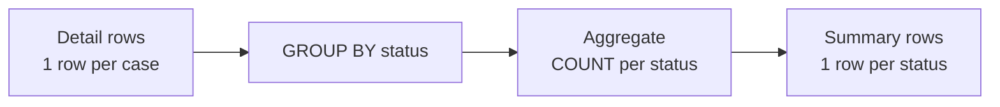
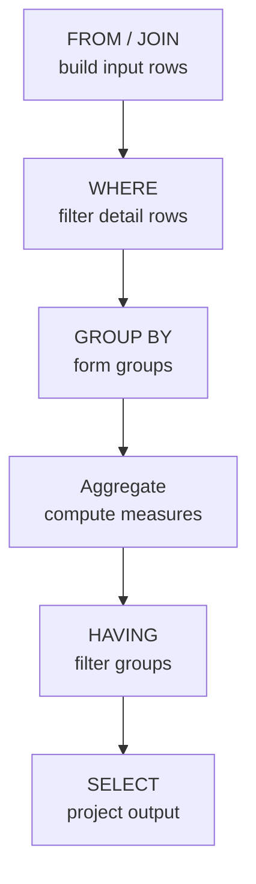
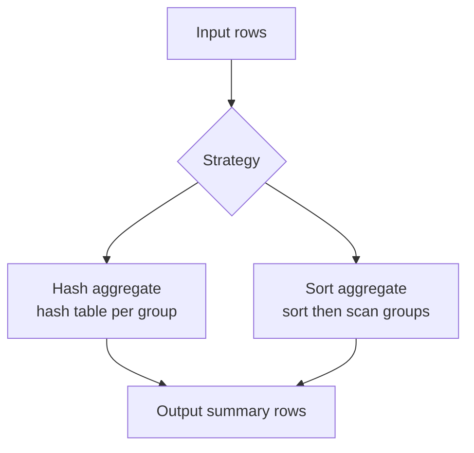

# Part 010 — Aggregation, Grouping, and Measure Correctness

Aggregation adalah titik ketika SQL berubah dari “ambil data” menjadi “buat klaim tentang realitas”.

Query seperti ini terlihat sederhana:

```sql
SELECT status, COUNT(*)
FROM enforcement_case
GROUP BY status;
```

Tetapi di sistem produksi, aggregation sering menjadi sumber keputusan: dashboard compliance, laporan SLA, risk score, audit trend, cohort, operational backlog, fraud detection, billing, dan executive metrics. Jika join salah, aggregation memperbesar kesalahan. Jika denominator salah, keputusan salah. Jika grain salah, metrik salah tetapi tetap terlihat rapi.

Mental model utama:

> Aggregation mengubah grain dari banyak row detail menjadi row summary. Kebenaran aggregation bergantung pada grain input, grouping key, dan definisi measure.

Dalam gaya Kaufman, kita akan memecah skill aggregation menjadi sub-skill yang cepat diuji:

1. Menentukan grain sebelum dan sesudah aggregation.
2. Memahami perilaku `COUNT`, `SUM`, `AVG`, `MIN`, `MAX` terhadap `NULL`.
3. Memisahkan row filtering (`WHERE`) dari group filtering (`HAVING`).
4. Menghindari metric bug akibat join fan-out.
5. Menggunakan conditional aggregation untuk metrik multi-status.
6. Menggunakan `ROLLUP`, `CUBE`, dan `GROUPING SETS` secara benar.
7. Menulis assertion query untuk memvalidasi hasil.

---

## 1. Target Skill

Setelah part ini, kita harus bisa:

- menjelaskan aggregation sebagai grain transformation;
- memilih `COUNT(*)`, `COUNT(column)`, dan `COUNT(DISTINCT column)` dengan benar;
- menulis `GROUP BY` yang sesuai dengan pertanyaan bisnis;
- membedakan filter sebelum aggregation dan setelah aggregation;
- menghindari duplicate-driven metric inflation;
- menghitung ratio, weighted average, dan denominator dengan benar;
- menulis conditional aggregation portabel;
- menggunakan grouping sets untuk summary multi-level;
- membuat query validasi untuk report dan dashboard.

---

## 2. Mental Model: Aggregation Mengubah Grain

Sebelum aggregation:

> satu row merepresentasikan fakta detail.

Setelah aggregation:

> satu row merepresentasikan kelompok fakta detail.

Contoh:

```sql
SELECT status, COUNT(*) AS case_count
FROM enforcement_case
GROUP BY status;
```

Input grain:

> satu row per case.

Output grain:

> satu row per status.

Diagram:



Jika kita menambahkan `opened_month`:

```sql
SELECT
    DATE_TRUNC('month', opened_at) AS opened_month,
    status,
    COUNT(*) AS case_count
FROM enforcement_case
GROUP BY DATE_TRUNC('month', opened_at), status;
```

Output grain berubah:

> satu row per `opened_month + status`.

Rule:

> Setiap kolom di `GROUP BY` menjadi bagian dari grain output.

---

## 3. Working Schema

Kita lanjutkan schema enforcement.

```sql
CREATE TABLE enforcement_case (
    case_id          BIGINT PRIMARY KEY,
    tenant_id        BIGINT NOT NULL,
    case_number      VARCHAR(50) NOT NULL,
    status           VARCHAR(30) NOT NULL,
    severity         VARCHAR(20) NOT NULL,
    opened_at        TIMESTAMP NOT NULL,
    closed_at        TIMESTAMP NULL,
    subject_party_id BIGINT NOT NULL
);

CREATE TABLE enforcement_action (
    action_id       BIGINT PRIMARY KEY,
    case_id         BIGINT NOT NULL,
    action_type     VARCHAR(50) NOT NULL,
    action_status   VARCHAR(30) NOT NULL,
    penalty_amount  DECIMAL(18,2) NULL,
    created_at      TIMESTAMP NOT NULL,
    completed_at    TIMESTAMP NULL
);

CREATE TABLE case_assignment (
    assignment_id   BIGINT PRIMARY KEY,
    case_id         BIGINT NOT NULL,
    officer_id      BIGINT NOT NULL,
    assigned_at     TIMESTAMP NOT NULL,
    unassigned_at   TIMESTAMP NULL
);
```

---

## 4. `COUNT(*)`, `COUNT(column)`, dan `COUNT(DISTINCT column)`

Ketiganya sering tertukar.

### `COUNT(*)`

Menghitung jumlah row input.

```sql
SELECT COUNT(*) AS total_cases
FROM enforcement_case;
```

Jika input row ada, dihitung, tidak peduli kolom berisi `NULL` atau tidak.

### `COUNT(column)`

Menghitung jumlah row di mana `column` tidak `NULL`.

```sql
SELECT COUNT(closed_at) AS closed_timestamp_count
FROM enforcement_case;
```

Ini bukan selalu jumlah closed case. Ini jumlah case yang memiliki `closed_at`. Jika data tidak konsisten, hasil bisa berbeda dari:

```sql
SELECT COUNT(*) AS closed_case_count
FROM enforcement_case
WHERE status = 'CLOSED';
```

### `COUNT(DISTINCT column)`

Menghitung jumlah nilai unik non-null.

```sql
SELECT COUNT(DISTINCT subject_party_id) AS distinct_subject_parties
FROM enforcement_case;
```

Gunakan untuk menghitung entity unik setelah join atau pada data detail. Namun jangan menjadikan `COUNT(DISTINCT ...)` sebagai default karena:

- bisa mahal;
- bisa menyembunyikan fan-out bug;
- perlu definisi jelas tentang uniqueness;
- multi-column distinct syntax berbeda antar engine.

### Example: Count Setelah Join

```sql
SELECT
    COUNT(*) AS joined_rows,
    COUNT(DISTINCT c.case_id) AS distinct_cases
FROM enforcement_case c
JOIN enforcement_action a
    ON a.case_id = c.case_id;
```

- `joined_rows` = jumlah pasangan case-action.
- `distinct_cases` = jumlah case yang punya action.

Keduanya benar untuk pertanyaan berbeda.

---

## 5. Aggregate dan NULL

Aggregate function punya perilaku penting terhadap `NULL`.

Secara umum:

- `COUNT(*)` menghitung semua row.
- `COUNT(column)` mengabaikan `NULL`.
- `SUM(column)` mengabaikan `NULL`.
- `AVG(column)` mengabaikan `NULL`.
- `MIN(column)` dan `MAX(column)` mengabaikan `NULL`.

Contoh:

| penalty_amount |
|---:|
| 100.00 |
| null |
| 300.00 |

```sql
SELECT
    COUNT(*) AS row_count,
    COUNT(penalty_amount) AS penalty_count,
    SUM(penalty_amount) AS total_penalty,
    AVG(penalty_amount) AS avg_penalty
FROM enforcement_action;
```

Hasil konsep:

| row_count | penalty_count | total_penalty | avg_penalty |
|---:|---:|---:|---:|
| 3 | 2 | 400.00 | 200.00 |

`AVG` membagi 400 dengan 2, bukan 3.

Jika definisi bisnisnya “missing penalty dianggap nol”, tulis eksplisit:

```sql
SELECT AVG(COALESCE(penalty_amount, 0)) AS avg_penalty_treat_missing_as_zero
FROM enforcement_action;
```

Namun hati-hati: `NULL` bisa berarti:

- belum ditentukan;
- tidak berlaku;
- data hilang;
- action belum selesai;
- sistem lama tidak mengisi;
- nilai dirahasiakan.

Mengubah `NULL` menjadi nol adalah keputusan domain, bukan styling SQL.

---

## 6. `WHERE` vs `HAVING`

`WHERE` memfilter row sebelum grouping.

`HAVING` memfilter group setelah aggregation.

Contoh: jumlah open case per severity.

```sql
SELECT
    severity,
    COUNT(*) AS open_case_count
FROM enforcement_case
WHERE status = 'OPEN'
GROUP BY severity;
```

`WHERE status = 'OPEN'` memilih input row.

Contoh: severity yang memiliki lebih dari 100 open case.

```sql
SELECT
    severity,
    COUNT(*) AS open_case_count
FROM enforcement_case
WHERE status = 'OPEN'
GROUP BY severity
HAVING COUNT(*) > 100;
```

`HAVING COUNT(*) > 100` memilih group hasil aggregation.

Diagram:



Rule:

> Pakai `WHERE` untuk mengurangi input detail. Pakai `HAVING` untuk kondisi yang bergantung pada aggregate.

Anti-pattern:

```sql
SELECT severity, COUNT(*)
FROM enforcement_case
GROUP BY severity
HAVING status = 'OPEN';
```

Ini salah di banyak engine karena `status` bukan grouping key atau aggregate. Beberapa engine longgar terhadap ekspresi non-standard, tetapi query seperti ini tidak defensible.

---

## 7. Grouping Key Harus Sesuai Pertanyaan

Pertanyaan:

> Berapa jumlah open case per officer?

Query naive:

```sql
SELECT
    asg.officer_id,
    COUNT(*) AS open_case_count
FROM enforcement_case c
JOIN case_assignment asg
    ON asg.case_id = c.case_id
WHERE c.status = 'OPEN'
GROUP BY asg.officer_id;
```

Masalah: apakah assignment historis atau aktif?

Query lebih benar:

```sql
SELECT
    asg.officer_id,
    COUNT(*) AS open_case_count
FROM enforcement_case c
JOIN case_assignment asg
    ON asg.case_id = c.case_id
   AND asg.unassigned_at IS NULL
WHERE c.status = 'OPEN'
GROUP BY asg.officer_id;
```

Namun masih ada pertanyaan: apakah satu case boleh punya banyak active officer? Jika ya, `COUNT(*)` menghitung assignment, bukan case unik.

Mungkin perlu:

```sql
SELECT
    asg.officer_id,
    COUNT(DISTINCT c.case_id) AS open_case_count
FROM enforcement_case c
JOIN case_assignment asg
    ON asg.case_id = c.case_id
   AND asg.unassigned_at IS NULL
WHERE c.status = 'OPEN'
GROUP BY asg.officer_id;
```

Atau jika domain melarang lebih dari satu active assignment per case, tegakkan constraint dan cukup `COUNT(*)`.

Metric correctness sering bergantung pada domain invariant, bukan query saja.

---

## 8. Join Before Aggregate: Metric Inflation

Query ini sering salah:

```sql
SELECT
    c.severity,
    COUNT(*) AS case_count,
    SUM(a.penalty_amount) AS total_penalty
FROM enforcement_case c
LEFT JOIN enforcement_action a
    ON a.case_id = c.case_id
GROUP BY c.severity;
```

`COUNT(*)` menghitung row hasil join, bukan case.

Jika satu case punya 3 action, case itu dihitung 3 kali.

Solusi tergantung pertanyaan.

### Pertanyaan A: Jumlah Case dan Total Penalty Action per Severity

```sql
WITH action_penalty AS (
    SELECT
        case_id,
        SUM(penalty_amount) AS total_case_penalty
    FROM enforcement_action
    GROUP BY case_id
)
SELECT
    c.severity,
    COUNT(*) AS case_count,
    SUM(COALESCE(ap.total_case_penalty, 0)) AS total_penalty
FROM enforcement_case c
LEFT JOIN action_penalty ap
    ON ap.case_id = c.case_id
GROUP BY c.severity;
```

Input ke aggregation utama tetap satu row per case.

### Pertanyaan B: Jumlah Action dan Total Penalty per Severity Case

```sql
SELECT
    c.severity,
    COUNT(a.action_id) AS action_count,
    SUM(a.penalty_amount) AS total_penalty
FROM enforcement_case c
JOIN enforcement_action a
    ON a.case_id = c.case_id
GROUP BY c.severity;
```

Di sini output memang berdasarkan action yang dikelompokkan oleh severity case.

Rule:

> Tidak ada query aggregate yang benar sebelum grain measure didefinisikan.

---

## 9. `COUNT` pada OUTER JOIN

Outer join punya trap aggregation.

```sql
SELECT
    c.status,
    COUNT(*) AS row_count,
    COUNT(a.action_id) AS action_count
FROM enforcement_case c
LEFT JOIN enforcement_action a
    ON a.case_id = c.case_id
GROUP BY c.status;
```

- `COUNT(*)` menghitung semua row hasil join, termasuk case tanpa action.
- `COUNT(a.action_id)` menghitung hanya action yang match.

Jika ada case tanpa action, `COUNT(*)` bukan jumlah action.

Untuk jumlah case per status:

```sql
SELECT status, COUNT(*) AS case_count
FROM enforcement_case
GROUP BY status;
```

Untuk jumlah action per status case:

```sql
SELECT
    c.status,
    COUNT(a.action_id) AS action_count
FROM enforcement_case c
LEFT JOIN enforcement_action a
    ON a.case_id = c.case_id
GROUP BY c.status;
```

Untuk keduanya secara aman:

```sql
WITH action_summary AS (
    SELECT case_id, COUNT(*) AS action_count
    FROM enforcement_action
    GROUP BY case_id
)
SELECT
    c.status,
    COUNT(*) AS case_count,
    SUM(COALESCE(a.action_count, 0)) AS action_count
FROM enforcement_case c
LEFT JOIN action_summary a
    ON a.case_id = c.case_id
GROUP BY c.status;
```

---

## 10. Conditional Aggregation

Conditional aggregation menghitung beberapa metrik dalam satu scan/logical query.

Portabel:

```sql
SELECT
    severity,
    SUM(CASE WHEN status = 'OPEN' THEN 1 ELSE 0 END) AS open_count,
    SUM(CASE WHEN status = 'CLOSED' THEN 1 ELSE 0 END) AS closed_count,
    SUM(CASE WHEN status = 'ESCALATED' THEN 1 ELSE 0 END) AS escalated_count,
    COUNT(*) AS total_count
FROM enforcement_case
GROUP BY severity;
```

Beberapa engine mendukung syntax `FILTER`:

```sql
SELECT
    severity,
    COUNT(*) FILTER (WHERE status = 'OPEN') AS open_count,
    COUNT(*) FILTER (WHERE status = 'CLOSED') AS closed_count,
    COUNT(*) AS total_count
FROM enforcement_case
GROUP BY severity;
```

`FILTER` lebih ekspresif, tetapi tidak tersedia di semua engine.

Conditional aggregation berguna untuk:

- dashboard status distribution;
- SLA breach count;
- count by severity bucket;
- numerator/denominator dalam satu query;
- data quality checks;
- pivot sederhana.

---

## 11. Ratio dan Denominator Correctness

Metric ratio selalu punya dua bagian:

- numerator;
- denominator.

Bug biasanya muncul pada denominator.

Contoh: closure rate.

```sql
SELECT
    COUNT(*) FILTER (WHERE status = 'CLOSED') * 1.0
    / NULLIF(COUNT(*), 0) AS closure_rate
FROM enforcement_case;
```

Versi portabel:

```sql
SELECT
    SUM(CASE WHEN status = 'CLOSED' THEN 1 ELSE 0 END) * 1.0
    / NULLIF(COUNT(*), 0) AS closure_rate
FROM enforcement_case;
```

`NULLIF(COUNT(*), 0)` mencegah division by zero.

### Denominator Harus Sesuai Populasi

Pertanyaan:

> Berapa persen high severity case yang breached SLA?

Query benar harus membatasi denominator ke high severity case.

```sql
SELECT
    SUM(CASE WHEN sla_breached = TRUE THEN 1 ELSE 0 END) * 1.0
    / NULLIF(COUNT(*), 0) AS high_severity_breach_rate
FROM enforcement_case
WHERE severity = 'HIGH';
```

Jika `WHERE severity = 'HIGH'` lupa, denominator berubah menjadi semua case.

### Ratio Setelah Join

Jika numerator dan denominator dihitung setelah join ke child, denominator bisa membesar.

Salah:

```sql
SELECT
    SUM(CASE WHEN a.action_status = 'OVERDUE' THEN 1 ELSE 0 END) * 1.0
    / COUNT(*) AS overdue_action_rate
FROM enforcement_case c
JOIN enforcement_action a
    ON a.case_id = c.case_id;
```

Ini benar jika metriknya rate action overdue. Salah jika metriknya rate case yang punya overdue action.

Untuk case-level rate:

```sql
SELECT
    SUM(CASE WHEN has_overdue_action = 1 THEN 1 ELSE 0 END) * 1.0
    / NULLIF(COUNT(*), 0) AS case_overdue_rate
FROM (
    SELECT
        c.case_id,
        CASE
            WHEN EXISTS (
                SELECT 1
                FROM enforcement_action a
                WHERE a.case_id = c.case_id
                  AND a.action_status = 'OVERDUE'
            ) THEN 1 ELSE 0
        END AS has_overdue_action
    FROM enforcement_case c
) x;
```

---

## 12. Average vs Weighted Average

`AVG()` sering disalahgunakan.

Contoh: rata-rata closure time per severity.

```sql
SELECT
    severity,
    AVG(closed_at - opened_at) AS avg_closure_duration
FROM enforcement_case
WHERE closed_at IS NOT NULL
GROUP BY severity;
```

Ini rata-rata per case. Benar jika setiap case bobotnya sama.

Namun jika kita sudah punya aggregate per officer:

| officer_id | closed_case_count | avg_duration_hours |
|---:|---:|---:|
| 1 | 100 | 10 |
| 2 | 2 | 100 |

Rata-rata sederhana dari dua average:

```text
(10 + 100) / 2 = 55
```

Salah jika ingin rata-rata per case. Weighted average:

```text
(100*10 + 2*100) / (100+2) = 11.76
```

SQL:

```sql
SELECT
    SUM(closed_case_count * avg_duration_hours) * 1.0
    / NULLIF(SUM(closed_case_count), 0) AS weighted_avg_duration_hours
FROM officer_closure_summary;
```

Rule:

> Jangan mengambil `AVG()` dari nilai yang sudah merupakan average kecuali memang ingin average antar group, bukan average antar entity.

---

## 13. Distinct Aggregation

`COUNT(DISTINCT ...)` berguna, tetapi harus dipakai dengan kesadaran.

Contoh: jumlah party unik yang terkait dengan case open.

```sql
SELECT COUNT(DISTINCT cp.party_id) AS distinct_party_count
FROM enforcement_case c
JOIN case_party cp
    ON cp.case_id = c.case_id
WHERE c.status = 'OPEN';
```

Pertanyaan penting:

- Distinct berdasarkan apa?
- Apakah party unik global atau per tenant?
- Apakah role berbeda dihitung sekali atau berkali-kali?
- Apakah subject party dan related party digabung?

Jika uniqueness adalah `(tenant_id, party_id)`, query harus mencerminkan itu.

Beberapa engine mendukung multi-column distinct langsung, beberapa butuh workaround.

Portabel dengan subquery:

```sql
SELECT COUNT(*) AS distinct_tenant_party_count
FROM (
    SELECT DISTINCT c.tenant_id, cp.party_id
    FROM enforcement_case c
    JOIN case_party cp
        ON cp.case_id = c.case_id
    WHERE c.status = 'OPEN'
) x;
```

---

## 14. Aggregation dengan Time Bucket

Time bucket sering dipakai untuk trend.

PostgreSQL style:

```sql
SELECT
    DATE_TRUNC('month', opened_at) AS opened_month,
    COUNT(*) AS case_count
FROM enforcement_case
GROUP BY DATE_TRUNC('month', opened_at)
ORDER BY opened_month;
```

Portabilitas date bucketing berbeda antar engine:

- PostgreSQL: `DATE_TRUNC`;
- SQL Server: kombinasi `DATEFROMPARTS`, `DATETRUNC` pada versi baru, atau expression lain;
- MySQL: `DATE_FORMAT`, `EXTRACT`, generated date;
- Oracle: `TRUNC(date, 'MM')`;
- SQLite: `strftime`.

Untuk sistem serius, definisikan calendar dimension jika butuh:

- fiscal calendar;
- business day;
- holiday;
- timezone-specific reporting;
- week definition yang konsisten;
- zero-filled date series.

### Zero-Filled Trend

Jika bulan tanpa case harus tetap muncul, gunakan calendar table atau generated series.

```sql
SELECT
    m.month_start,
    COALESCE(c.case_count, 0) AS case_count
FROM calendar_month m
LEFT JOIN (
    SELECT
        DATE_TRUNC('month', opened_at) AS month_start,
        COUNT(*) AS case_count
    FROM enforcement_case
    GROUP BY DATE_TRUNC('month', opened_at)
) c
    ON c.month_start = m.month_start
WHERE m.month_start >= DATE '2026-01-01'
  AND m.month_start <  DATE '2027-01-01'
ORDER BY m.month_start;
```

---

## 15. Grouping by Derived Expression

Jika group berdasarkan expression, pastikan expression stabil dan sesuai domain.

```sql
SELECT
    CASE
        WHEN penalty_amount IS NULL THEN 'NO_PENALTY'
        WHEN penalty_amount < 1000 THEN 'LOW'
        WHEN penalty_amount < 10000 THEN 'MEDIUM'
        ELSE 'HIGH'
    END AS penalty_band,
    COUNT(*) AS action_count
FROM enforcement_action
GROUP BY
    CASE
        WHEN penalty_amount IS NULL THEN 'NO_PENALTY'
        WHEN penalty_amount < 1000 THEN 'LOW'
        WHEN penalty_amount < 10000 THEN 'MEDIUM'
        ELSE 'HIGH'
    END;
```

Duplikasi expression buruk untuk maintenance. Alternatif:

```sql
WITH action_with_band AS (
    SELECT
        action_id,
        CASE
            WHEN penalty_amount IS NULL THEN 'NO_PENALTY'
            WHEN penalty_amount < 1000 THEN 'LOW'
            WHEN penalty_amount < 10000 THEN 'MEDIUM'
            ELSE 'HIGH'
        END AS penalty_band
    FROM enforcement_action
)
SELECT
    penalty_band,
    COUNT(*) AS action_count
FROM action_with_band
GROUP BY penalty_band;
```

Jika band dipakai di banyak tempat, jadikan reference table atau generated column agar definisinya tidak terduplikasi di banyak query.

---

## 16. `MIN` dan `MAX` Tidak Mengambil Row

Query ini sering salah:

```sql
SELECT
    case_id,
    MAX(created_at) AS latest_action_at,
    action_type
FROM enforcement_action
GROUP BY case_id, action_type;
```

Itu bukan “action type dari action terakhir”. Itu latest timestamp per `case_id + action_type`.

Jika butuh row terakhir per case, gunakan window function:

```sql
WITH ranked_action AS (
    SELECT
        a.*,
        ROW_NUMBER() OVER (
            PARTITION BY case_id
            ORDER BY created_at DESC, action_id DESC
        ) AS rn
    FROM enforcement_action a
)
SELECT
    case_id,
    action_id,
    action_type,
    created_at
FROM ranked_action
WHERE rn = 1;
```

Atau join ke max timestamp dengan tie handling eksplisit, tetapi window function biasanya lebih jelas.

Rule:

> `MAX(timestamp)` memilih nilai timestamp, bukan row yang memiliki timestamp itu.

---

## 17. `GROUP BY` dan Functional Dependency

Secara standar, kolom non-aggregate di `SELECT` harus termasuk dalam `GROUP BY`, kecuali engine mendukung inference tertentu berdasarkan functional dependency.

Contoh:

```sql
SELECT
    c.case_id,
    c.case_number,
    COUNT(a.action_id) AS action_count
FROM enforcement_case c
LEFT JOIN enforcement_action a
    ON a.case_id = c.case_id
GROUP BY c.case_id, c.case_number;
```

Jika `case_id` primary key, `case_number` functionally dependent pada `case_id`. Beberapa engine bisa mengizinkan grouping hanya by `case_id`. Namun untuk portability dan readability, memasukkan kolom yang dipilih sering lebih jelas.

Hindari behavior non-standard yang memilih arbitrary value dari kolom non-grouped.

Query seperti ini harus dicurigai:

```sql
SELECT
    status,
    case_number,
    COUNT(*)
FROM enforcement_case
GROUP BY status;
```

`case_number` mana yang harus muncul untuk setiap status? Tidak ada definisi yang benar kecuali engine memakai extension non-standard.

---

## 18. `ROLLUP`, `CUBE`, dan `GROUPING SETS`

Untuk summary multi-level, jangan selalu menulis banyak query `UNION ALL`. SQL punya grouping extensions.

### ROLLUP

`ROLLUP` menghasilkan subtotal hierarkis.

```sql
SELECT
    severity,
    status,
    COUNT(*) AS case_count
FROM enforcement_case
GROUP BY ROLLUP (severity, status)
ORDER BY severity, status;
```

Konsep output:

- per `severity + status`;
- subtotal per `severity`;
- grand total.

### CUBE

`CUBE` menghasilkan kombinasi subtotal untuk semua dimensi.

```sql
SELECT
    severity,
    status,
    COUNT(*) AS case_count
FROM enforcement_case
GROUP BY CUBE (severity, status);
```

Konsep output:

- per `severity + status`;
- per `severity`;
- per `status`;
- grand total.

### GROUPING SETS

`GROUPING SETS` memberi kontrol eksplisit.

```sql
SELECT
    severity,
    status,
    COUNT(*) AS case_count
FROM enforcement_case
GROUP BY GROUPING SETS (
    (severity, status),
    (severity),
    (status),
    ()
);
```

### Menandai Row Subtotal

Jika `severity` atau `status` bisa `NULL`, subtotal row bisa ambigu. Gunakan fungsi `GROUPING` jika engine mendukung.

```sql
SELECT
    severity,
    status,
    GROUPING(severity) AS severity_is_aggregated,
    GROUPING(status) AS status_is_aggregated,
    COUNT(*) AS case_count
FROM enforcement_case
GROUP BY CUBE (severity, status);
```

Rule:

> Untuk report multi-level, gunakan grouping metadata agar subtotal tidak tertukar dengan `NULL` asli.

---

## 19. Aggregation dan HAVING untuk Data Quality

`HAVING` sangat berguna untuk mencari pelanggaran invariant.

### Duplicate Case Number per Tenant

```sql
SELECT
    tenant_id,
    case_number,
    COUNT(*) AS duplicate_count
FROM enforcement_case
GROUP BY tenant_id, case_number
HAVING COUNT(*) > 1;
```

### Lebih dari Satu Assignment Aktif per Case

```sql
SELECT
    case_id,
    COUNT(*) AS active_assignment_count
FROM case_assignment
WHERE unassigned_at IS NULL
GROUP BY case_id
HAVING COUNT(*) > 1;
```

### Action Completed Tanpa Completed Timestamp

```sql
SELECT
    action_status,
    COUNT(*) AS invalid_count
FROM enforcement_action
WHERE action_status = 'COMPLETED'
  AND completed_at IS NULL
GROUP BY action_status;
```

Aggregation bukan hanya untuk dashboard. Ia adalah assertion language untuk data quality.

---

## 20. Conditional Aggregation untuk Assertion

Contoh: validasi lifecycle action.

```sql
SELECT
    COUNT(*) AS total_actions,
    SUM(CASE
        WHEN action_status = 'COMPLETED' AND completed_at IS NULL THEN 1
        ELSE 0
    END) AS completed_without_timestamp,
    SUM(CASE
        WHEN action_status <> 'COMPLETED' AND completed_at IS NOT NULL THEN 1
        ELSE 0
    END) AS non_completed_with_timestamp
FROM enforcement_action;
```

Query ini menghasilkan ringkasan invariant. Cocok untuk:

- migration validation;
- pre-release check;
- nightly data quality job;
- CI check pada fixture database;
- incident investigation.

---

## 21. Aggregation untuk Workflow State Machine

Misalkan case memiliki state:

- `DRAFT`
- `OPEN`
- `UNDER_REVIEW`
- `ESCALATED`
- `CLOSED`
- `CANCELLED`

Distribusi status:

```sql
SELECT
    status,
    COUNT(*) AS case_count
FROM enforcement_case
GROUP BY status
ORDER BY case_count DESC;
```

Namun workflow metric yang lebih berguna sering berbentuk transition atau age bucket.

### Open Case Age Bucket

```sql
SELECT
    CASE
        WHEN opened_at >= CURRENT_DATE - INTERVAL '7 days' THEN '0-7 days'
        WHEN opened_at >= CURRENT_DATE - INTERVAL '30 days' THEN '8-30 days'
        WHEN opened_at >= CURRENT_DATE - INTERVAL '90 days' THEN '31-90 days'
        ELSE '90+ days'
    END AS age_bucket,
    COUNT(*) AS open_case_count
FROM enforcement_case
WHERE status = 'OPEN'
GROUP BY
    CASE
        WHEN opened_at >= CURRENT_DATE - INTERVAL '7 days' THEN '0-7 days'
        WHEN opened_at >= CURRENT_DATE - INTERVAL '30 days' THEN '8-30 days'
        WHEN opened_at >= CURRENT_DATE - INTERVAL '90 days' THEN '31-90 days'
        ELSE '90+ days'
    END;
```

Untuk produksi, definisi bucket sebaiknya tidak disalin manual di banyak query. Jadikan view, dimension table, atau semantic layer.

---

## 22. Aggregation dan Audit Defensibility

Untuk regulatory reporting, hasil aggregate harus bisa dijelaskan:

- data source apa;
- filter apa;
- per tanggal berapa;
- timezone apa;
- status yang dihitung apa;
- apakah soft-deleted data ikut;
- apakah historical correction dihitung ulang;
- apakah denominator case atau action;
- apakah distinct berdasarkan person, party, atau role;
- apakah output bisa direkonsiliasi ke detail row.

Query summary harus punya drill-down query.

Contoh summary:

```sql
SELECT
    severity,
    COUNT(*) AS open_case_count
FROM enforcement_case
WHERE status = 'OPEN'
GROUP BY severity;
```

Drill-down:

```sql
SELECT
    case_id,
    case_number,
    severity,
    opened_at
FROM enforcement_case
WHERE status = 'OPEN'
  AND severity = :severity
ORDER BY opened_at;
```

Rule:

> Setiap angka agregat penting harus bisa dijelaskan sampai ke row pembentuknya.

---

## 23. Aggregation Performance Mental Model

Detail optimizer akan dibahas nanti, tetapi kita butuh model dasar.

Database biasanya menjalankan aggregation dengan salah satu strategi:

### Hash Aggregate

- Buat hash table berdasarkan grouping key.
- Update aggregate state per row.
- Cepat jika group muat di memory.
- Bisa spill jika group terlalu banyak atau memory kurang.

### Sort Aggregate

- Sort input berdasarkan grouping key.
- Proses group berurutan.
- Bagus jika input sudah terurut atau index mendukung.

Diagram:



Performance dipengaruhi oleh:

- jumlah input row;
- jumlah group;
- lebar grouping key;
- lebar aggregate state;
- filter sebelum aggregation;
- join fan-out sebelum aggregation;
- index/order availability;
- memory work area;
- parallel aggregation support.

Rule:

> Agregasi setelah join fan-out mahal dan sering salah. Kurangi grain sedini mungkin jika semantics mengizinkan.

---

## 24. Pre-Aggregation Pattern

Jika child table besar dan output parent-level, pre-aggregate.

```sql
WITH action_by_case AS (
    SELECT
        case_id,
        COUNT(*) AS action_count,
        SUM(penalty_amount) AS penalty_total
    FROM enforcement_action
    GROUP BY case_id
)
SELECT
    c.severity,
    COUNT(*) AS case_count,
    SUM(COALESCE(a.action_count, 0)) AS action_count,
    SUM(COALESCE(a.penalty_total, 0)) AS penalty_total
FROM enforcement_case c
LEFT JOIN action_by_case a
    ON a.case_id = c.case_id
GROUP BY c.severity;
```

Ini punya dua manfaat:

- correctness: satu row per case sebelum aggregate by severity;
- performance: child table dikurangi sebelum join besar.

Tetapi pre-aggregation harus sesuai semantics. Jika grouping butuh detail action type, jangan agregasi terlalu awal menghilangkan informasi yang diperlukan.

---

## 25. Aggregation dan Materialized Summary

Untuk dashboard mahal, kadang summary disimpan.

```sql
CREATE TABLE daily_case_summary (
    summary_date DATE NOT NULL,
    tenant_id    BIGINT NOT NULL,
    status       VARCHAR(30) NOT NULL,
    severity     VARCHAR(20) NOT NULL,
    case_count   BIGINT NOT NULL,
    PRIMARY KEY (summary_date, tenant_id, status, severity)
);
```

Trade-off:

| Pilihan | Kelebihan | Risiko |
|---|---|---|
| Query live | Selalu fresh | Mahal pada data besar |
| Materialized view | Lebih cepat | Refresh, stale data |
| Summary table | Kontrol penuh | Pipeline correctness, backfill |
| Cache | Latency rendah | Invalidation sulit |

Untuk sistem regulated, summary harus bisa direkonsiliasi ke detail. Jangan menyimpan angka tanpa lineage.

---

## 26. Metric Contract

Metric produksi perlu contract.

Contoh: `open_case_count`.

```text
Name: open_case_count
Definition: number of cases whose current status is OPEN.
Grain: tenant + report_date + severity
Source table: enforcement_case
Filter: status = 'OPEN', deleted_at IS NULL
Timezone: Asia/Jakarta for report_date extraction
Exclusions: test tenants, migrated cases marked as invalid
Owner: Compliance Platform Team
Refresh: hourly
Drill-down key: case_id
```

Tanpa contract, dua tim bisa membuat angka berbeda dengan nama sama.

Query hanyalah implementasi. Metric definition adalah API.

---

## 27. Common Metric Bugs

### Bug 1 — Counting Rows Instead of Entities

```sql
COUNT(*)
```

setelah join one-to-many sering menghitung child rows, bukan parent entity.

### Bug 2 — Wrong Denominator

Numerator difilter, denominator tidak.

```sql
SUM(CASE WHEN status = 'CLOSED' THEN 1 ELSE 0 END) / COUNT(*)
```

Benar hanya jika denominator memang semua status.

### Bug 3 — Average of Averages

Mengambil `AVG(avg_value)` tanpa bobot.

### Bug 4 — Missing Timezone

Grouping by date pada timestamp UTC padahal report bisnis memakai timezone lokal.

### Bug 5 — Ignoring Late Arriving Data

Daily summary dihitung sebelum semua event masuk.

### Bug 6 — `NULL` Treated as Zero Without Domain Decision

`COALESCE(value, 0)` bisa benar atau fatal tergantung makna `NULL`.

### Bug 7 — Grouping by Label Instead of Stable Code

`GROUP BY status_label` rusak saat label berubah. Gunakan status code, join label hanya untuk display.

### Bug 8 — Soft Deleted Rows Included

Lupa `deleted_at IS NULL` atau validity predicate.

### Bug 9 — Current Status vs Historical Status

Report per bulan memakai current status, bukan status saat bulan itu.

### Bug 10 — Distinct Key Salah

`COUNT(DISTINCT party_name)` bukan party count yang defensible.

---

## 28. Review Checklist untuk Query Aggregate

Sebelum approve query aggregate:

1. Apa grain input?
2. Apa grain output?
3. Apa entity yang dihitung?
4. Apakah query join sebelum aggregate mengubah grain?
5. Apakah `COUNT(*)` menghitung hal yang benar?
6. Apakah `NULL` ditangani sesuai domain?
7. Apakah denominator sesuai populasi?
8. Apakah time bucket memakai timezone/reporting calendar yang benar?
9. Apakah soft delete/history/validity dipertimbangkan?
10. Apakah metric punya drill-down query?
11. Apakah subtotal row bisa dibedakan dari `NULL` asli?
12. Apakah hasil bisa direkonsiliasi dengan query detail?
13. Apakah aggregation perlu pre-aggregation untuk correctness/performance?
14. Apakah ada distinct yang menutupi fan-out bug?
15. Apakah query portable atau sengaja memakai fitur vendor tertentu?

---

## 29. Mini Lab

### Lab 1 — Count Case per Status

```sql
SELECT
    status,
    COUNT(*) AS case_count
FROM enforcement_case
GROUP BY status
ORDER BY case_count DESC;
```

### Lab 2 — Count Open Case per Severity

```sql
SELECT
    severity,
    COUNT(*) AS open_case_count
FROM enforcement_case
WHERE status = 'OPEN'
GROUP BY severity;
```

### Lab 3 — Severity yang Memiliki Lebih dari 100 Open Case

```sql
SELECT
    severity,
    COUNT(*) AS open_case_count
FROM enforcement_case
WHERE status = 'OPEN'
GROUP BY severity
HAVING COUNT(*) > 100;
```

### Lab 4 — Count Case dan Action per Severity Tanpa Inflation

```sql
WITH action_summary AS (
    SELECT case_id, COUNT(*) AS action_count
    FROM enforcement_action
    GROUP BY case_id
)
SELECT
    c.severity,
    COUNT(*) AS case_count,
    SUM(COALESCE(a.action_count, 0)) AS action_count
FROM enforcement_case c
LEFT JOIN action_summary a
    ON a.case_id = c.case_id
GROUP BY c.severity;
```

### Lab 5 — Case-Level Rate yang Punya Overdue Action

```sql
WITH case_flags AS (
    SELECT
        c.case_id,
        CASE
            WHEN EXISTS (
                SELECT 1
                FROM enforcement_action a
                WHERE a.case_id = c.case_id
                  AND a.action_status = 'OVERDUE'
            ) THEN 1 ELSE 0
        END AS has_overdue_action
    FROM enforcement_case c
)
SELECT
    SUM(has_overdue_action) * 1.0
    / NULLIF(COUNT(*), 0) AS overdue_case_rate
FROM case_flags;
```

### Lab 6 — Duplicate Business Key Detection

```sql
SELECT
    tenant_id,
    case_number,
    COUNT(*) AS duplicate_count
FROM enforcement_case
GROUP BY tenant_id, case_number
HAVING COUNT(*) > 1;
```

### Lab 7 — Rollup Severity dan Status

```sql
SELECT
    severity,
    status,
    COUNT(*) AS case_count
FROM enforcement_case
GROUP BY ROLLUP (severity, status)
ORDER BY severity, status;
```

---

## 30. Capstone Drill: Backlog Dashboard

Kita ingin membuat backlog dashboard:

- satu row per severity;
- jumlah open case;
- jumlah case yang punya overdue action;
- total open action;
- rata-rata umur open case dalam hari;
- breach rate case-level.

Query:

```sql
WITH case_base AS (
    SELECT
        c.case_id,
        c.severity,
        c.opened_at,
        CASE
            WHEN EXISTS (
                SELECT 1
                FROM enforcement_action a
                WHERE a.case_id = c.case_id
                  AND a.action_status = 'OVERDUE'
            ) THEN 1 ELSE 0
        END AS has_overdue_action
    FROM enforcement_case c
    WHERE c.status = 'OPEN'
), action_summary AS (
    SELECT
        a.case_id,
        COUNT(*) AS open_action_count
    FROM enforcement_action a
    WHERE a.action_status = 'OPEN'
    GROUP BY a.case_id
)
SELECT
    cb.severity,
    COUNT(*) AS open_case_count,
    SUM(cb.has_overdue_action) AS overdue_case_count,
    SUM(COALESCE(a.open_action_count, 0)) AS open_action_count,
    AVG(CURRENT_DATE - CAST(cb.opened_at AS DATE)) AS avg_open_age_days,
    SUM(cb.has_overdue_action) * 1.0 / NULLIF(COUNT(*), 0) AS overdue_case_rate
FROM case_base cb
LEFT JOIN action_summary a
    ON a.case_id = cb.case_id
GROUP BY cb.severity
ORDER BY cb.severity;
```

Why this shape works:

- `case_base` membuat satu row per open case.
- `EXISTS` menjaga overdue flag tetap case-level.
- `action_summary` mengurangi action menjadi satu row per case.
- Final aggregation by severity tidak terkena child fan-out.
- Denominator breach rate adalah jumlah open case per severity.

---

## 31. Production Heuristics

1. Tulis grain input dan output sebelum query aggregate kompleks.
2. Jangan percaya `COUNT(*)` setelah join sampai grain jelas.
3. Agregasi child collection sebelum join jika output parent-level.
4. Gunakan `EXISTS` untuk flag case-level.
5. Gunakan `NULLIF` pada denominator.
6. Jangan ubah `NULL` menjadi nol tanpa definisi domain.
7. Jangan rata-ratakan average tanpa bobot.
8. Pisahkan current-state metric dan historical-state metric.
9. Selalu sediakan drill-down query untuk angka penting.
10. Jadikan metric definition sebagai contract, bukan query ad hoc.

---

## 32. Ringkasan

Aggregation adalah operasi yang mengubah fakta detail menjadi measurement. Di sistem produksi, measurement adalah basis keputusan, sehingga query aggregate harus defensible.

Hal penting dari part ini:

- `GROUP BY` menentukan grain output.
- `COUNT(*)`, `COUNT(column)`, dan `COUNT(DISTINCT column)` menjawab pertanyaan berbeda.
- Aggregate umumnya mengabaikan `NULL`, kecuali `COUNT(*)`.
- `WHERE` memfilter detail row; `HAVING` memfilter group.
- Join sebelum aggregate bisa menyebabkan metric inflation.
- Pre-aggregation menjaga correctness saat menggabungkan parent dan child.
- Ratio harus punya denominator yang benar.
- Weighted average berbeda dari average of averages.
- `ROLLUP`, `CUBE`, dan `GROUPING SETS` membantu summary multi-level.
- Aggregation adalah alat data quality dan audit, bukan hanya dashboard.

Part berikutnya akan membahas subqueries, CTEs, dan query composition. Setelah join dan aggregation dikuasai, composition menentukan apakah query tetap bisa dibaca, diuji, dan dioptimalkan ketika kompleksitas meningkat.
