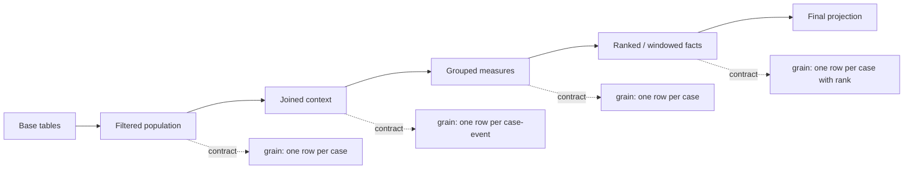

# Part 011 — Subqueries, CTEs, and Query Composition

## 1. Why This Part Exists

At this point, we already know how to read a single SQL query clause-by-clause:

- `FROM` builds the working relation.
- `WHERE` filters rows.
- `GROUP BY` changes grain.
- `HAVING` filters groups.
- `SELECT` projects expressions.
- `ORDER BY` and pagination shape the final result.

But production SQL rarely stays in one flat query. Real queries often need multiple conceptual steps:

- find eligible accounts,
- deduplicate the latest event per case,
- aggregate actions per workflow,
- compare current state against historical state,
- calculate metrics only after the base population is fixed,
- update rows based on another derived set,
- traverse a hierarchy,
- isolate a complex business rule so it can be reviewed.

This is where **subqueries**, **derived tables**, **CTEs**, and **lateral joins** become essential.

The goal is not to make SQL look clever. The goal is to make SQL **composable**: each layer should have a clear grain, clear predicate contract, clear output contract, and clear reason to exist.

A top-tier engineer does not ask only:

> Can I write this query?

They ask:

> Can another engineer inspect the intermediate relations, prove the grain, reason about duplicates, understand performance behavior, and safely change this query later?

That is the purpose of this part.

---

## 2. Kaufman Framing: The Sub-Skills

Using Kaufman's rapid skill acquisition model, we decompose query composition into small skills that can be practiced independently.

### 2.1 Target Performance Level

After this part, you should be able to:

1. Choose between subquery, derived table, CTE, temp table, view, and lateral join.
2. Explain the grain of every intermediate relation.
3. Avoid correlated subquery performance traps.
4. Use `EXISTS` and `NOT EXISTS` correctly.
5. Use recursive CTEs for hierarchy and graph-like traversal.
6. Understand when CTEs may be inlined, materialized, or re-evaluated depending on engine.
7. Refactor a complex SQL statement into reviewable stages.
8. Detect composition anti-patterns before they become production incidents.

### 2.2 Practice Loop

Every query composition exercise should follow this loop:

1. Write the base population query.
2. Assert the grain using `COUNT(*)`, `COUNT(DISTINCT key)`, and sample rows.
3. Add one transformation layer.
4. Re-check grain.
5. Add only the next transformation.
6. Read the execution plan.
7. Test edge cases: no rows, duplicate rows, `NULL`, multiple matches, stale state, missing relationship.

SQL composition is not about writing more nested code. It is about **preserving reasoning boundaries**.

---

## 3. The Core Mental Model: A Query Is a Pipeline of Relations

A SQL query can be treated as a pipeline where each step returns a relation. The final output is just the last relation.



Composition becomes safe when every layer has a contract:

| Contract | Question |
|---|---|
| Population | Which entities are included? |
| Grain | What does one row represent? |
| Key | Which column or column set uniquely identifies a row? |
| Predicate | What must be true for every row? |
| Multiplicity | Can one input row produce multiple output rows? |
| Nullability | Which columns may be unknown or absent? |
| Freshness | Is this current state, event state, or historical state? |
| Ownership | Is this business truth, reporting logic, or temporary helper logic? |

When a query becomes hard to understand, the issue is usually not syntax. It is almost always a missing contract.

---

## 4. Subquery Taxonomy

A **subquery** is a query nested inside another query. But the word is too broad. We need sharper categories.

| Type | Returns | Common Location | Typical Use |
|---|---:|---|---|
| Scalar subquery | One row, one column | `SELECT`, `WHERE` | Lookup one value, compare to aggregate |
| Row subquery | One row, multiple columns | `WHERE` | Multi-column comparison |
| Table subquery | Multiple rows and columns | `FROM`, `IN`, `EXISTS` | Derived relation |
| Correlated subquery | Depends on outer row | `WHERE`, `SELECT` | Per-row existence, latest child, validation |
| Derived table | Named table expression in `FROM` | `FROM (...) alias` | Inline stage |
| CTE | Named auxiliary query in `WITH` | Before main statement | Multi-stage readable pipeline |
| Recursive CTE | CTE referencing itself | `WITH RECURSIVE` / recursive CTE syntax | Hierarchy, graph traversal |
| Lateral subquery | Subquery in `FROM` that can reference previous `FROM` items | `LATERAL`, `APPLY` | Top-N-per-parent, parameterized relation |

The key is not memorizing names. The key is knowing the **cardinality contract**.

---

## 5. Scalar Subqueries

A scalar subquery returns exactly one column and is used where a scalar expression is allowed.

Example: compare each order with the global average order amount.

```sql
SELECT
    o.order_id,
    o.customer_id,
    o.total_amount,
    (
        SELECT AVG(total_amount)
        FROM orders
    ) AS global_avg_amount
FROM orders o;
```

This is semantically valid because the inner query returns one row and one column.

### 5.1 Scalar Subquery Failure Mode

A scalar subquery becomes invalid when it returns more than one row.

Bad example:

```sql
SELECT
    c.customer_id,
    (
        SELECT o.order_id
        FROM orders o
        WHERE o.customer_id = c.customer_id
    ) AS some_order_id
FROM customers c;
```

This fails if a customer has multiple orders. The problem is not syntax. The problem is missing cardinality control.

Possible fixes:

```sql
SELECT
    c.customer_id,
    (
        SELECT MAX(o.order_id)
        FROM orders o
        WHERE o.customer_id = c.customer_id
    ) AS max_order_id
FROM customers c;
```

Or, if the desired order is latest by timestamp:

```sql
SELECT
    c.customer_id,
    (
        SELECT o.order_id
        FROM orders o
        WHERE o.customer_id = c.customer_id
        ORDER BY o.created_at DESC, o.order_id DESC
        FETCH FIRST 1 ROW ONLY
    ) AS latest_order_id
FROM customers c;
```

But be careful: this still expresses a per-row lookup. Depending on engine and index availability, it may be efficient or terrible.

### 5.2 Scalar Subquery Checklist

Before using a scalar subquery, ask:

1. Can it return more than one row?
2. If multiple rows exist, which one should win?
3. Is the ordering deterministic?
4. Does the query need an index for the correlated predicate?
5. Would a join plus window function be clearer?

---

## 6. Subqueries in `WHERE`: `IN`, `EXISTS`, and Comparison Predicates

Subqueries often appear inside `WHERE`.

### 6.1 `IN`

```sql
SELECT c.customer_id, c.name
FROM customers c
WHERE c.customer_id IN (
    SELECT o.customer_id
    FROM orders o
    WHERE o.status = 'PAID'
);
```

This asks:

> Is this customer id a member of the set of paid-order customer ids?

This is often semantically equivalent to a semi join.

### 6.2 `EXISTS`

```sql
SELECT c.customer_id, c.name
FROM customers c
WHERE EXISTS (
    SELECT 1
    FROM orders o
    WHERE o.customer_id = c.customer_id
      AND o.status = 'PAID'
);
```

This asks:

> Does at least one matching row exist?

For relationship existence, `EXISTS` usually communicates intent better than `IN`.

### 6.3 `NOT EXISTS`

```sql
SELECT c.customer_id, c.name
FROM customers c
WHERE NOT EXISTS (
    SELECT 1
    FROM orders o
    WHERE o.customer_id = c.customer_id
      AND o.status = 'PAID'
);
```

This asks:

> Is there no paid order for this customer?

`NOT EXISTS` is usually safer than `NOT IN` when `NULL` can appear in the subquery result.

### 6.4 `NOT IN` Trap

Bad pattern:

```sql
SELECT c.customer_id, c.name
FROM customers c
WHERE c.customer_id NOT IN (
    SELECT o.customer_id
    FROM orders o
    WHERE o.status = 'PAID'
);
```

If the subquery returns a `NULL` customer id, the result may become unintuitive because SQL uses three-valued logic. A comparison against an unknown value can produce `UNKNOWN`, and `WHERE` only keeps rows where the predicate is `TRUE`.

Prefer:

```sql
SELECT c.customer_id, c.name
FROM customers c
WHERE NOT EXISTS (
    SELECT 1
    FROM orders o
    WHERE o.customer_id = c.customer_id
      AND o.status = 'PAID'
);
```

This expresses anti-existence directly.

---

## 7. Correlated Subqueries

A correlated subquery references columns from the outer query.

```sql
SELECT c.customer_id, c.name
FROM customers c
WHERE EXISTS (
    SELECT 1
    FROM orders o
    WHERE o.customer_id = c.customer_id
      AND o.created_at >= CURRENT_DATE - INTERVAL '30 days'
);
```

The inner query depends on `c.customer_id`.

### 7.1 How to Think About Correlation

Conceptually, a correlated subquery is evaluated with knowledge of the outer row:

```text
for each customer:
    check if orders exist for this customer
```

But do not assume the engine literally executes it as a nested loop. Optimizers can transform many correlated subqueries into joins, semi joins, anti joins, or other plan shapes.

The safe mental model is:

- correlated subquery expresses dependency,
- optimizer chooses physical execution,
- indexes and cardinality estimates determine whether it is fast.

### 7.2 Good Correlated Subquery Use Case

Existence checks are natural:

```sql
SELECT a.account_id
FROM accounts a
WHERE EXISTS (
    SELECT 1
    FROM enforcement_cases ec
    WHERE ec.account_id = a.account_id
      AND ec.status IN ('OPEN', 'UNDER_REVIEW')
);
```

This expresses a clean question:

> Which accounts currently have an open or under-review enforcement case?

### 7.3 Risky Correlated Subquery Use Case

Fetching a value per row can be risky:

```sql
SELECT
    a.account_id,
    (
        SELECT MAX(ec.created_at)
        FROM enforcement_cases ec
        WHERE ec.account_id = a.account_id
    ) AS last_case_created_at
FROM accounts a;
```

This may be acceptable with an index on `(account_id, created_at)`. But for large datasets, a pre-aggregation can be clearer:

```sql
WITH last_case AS (
    SELECT
        account_id,
        MAX(created_at) AS last_case_created_at
    FROM enforcement_cases
    GROUP BY account_id
)
SELECT
    a.account_id,
    lc.last_case_created_at
FROM accounts a
LEFT JOIN last_case lc
    ON lc.account_id = a.account_id;
```

This makes the grain explicit:

- `last_case`: one row per account.
- final query: one row per account.

---

## 8. Derived Tables

A derived table is a subquery in the `FROM` clause.

```sql
SELECT
    paid.customer_id,
    paid.total_paid_amount
FROM (
    SELECT
        customer_id,
        SUM(total_amount) AS total_paid_amount
    FROM orders
    WHERE status = 'PAID'
    GROUP BY customer_id
) paid
WHERE paid.total_paid_amount >= 1000;
```

Derived tables are useful when you need to name an intermediate relation but do not need to reuse it.

### 8.1 Derived Table Contract

Always annotate the mental contract:

```sql
SELECT
    paid.customer_id,
    paid.total_paid_amount
FROM (
    -- grain: one row per customer_id
    -- population: customers with at least one paid order
    SELECT
        customer_id,
        SUM(total_amount) AS total_paid_amount
    FROM orders
    WHERE status = 'PAID'
    GROUP BY customer_id
) paid
WHERE paid.total_paid_amount >= 1000;
```

This small comment often prevents future errors.

### 8.2 Derived Table vs CTE

Use a derived table when:

- the transformation is local,
- it is used once,
- it is short enough to read inline,
- naming it outside the query does not improve clarity.

Use a CTE when:

- the query has multiple named stages,
- the same stage is referenced multiple times,
- you want to document grain and business intent,
- recursion is needed,
- you need a mutation statement driven by an intermediate relation,
- debugging intermediate output is useful.

---

## 9. Common Table Expressions

A Common Table Expression, or CTE, defines a named auxiliary statement for use by a larger statement.

```sql
WITH paid_orders AS (
    SELECT
        order_id,
        customer_id,
        total_amount,
        created_at
    FROM orders
    WHERE status = 'PAID'
)
SELECT
    customer_id,
    SUM(total_amount) AS total_paid_amount
FROM paid_orders
GROUP BY customer_id;
```

Think of a CTE as a named relation available to the main statement.

### 9.1 CTEs Are Not Automatically Better

CTEs improve readability, but they are not automatically faster.

The physical behavior depends on the database engine and version:

- Some engines may inline a CTE into the outer query.
- Some may materialize it.
- Some may re-execute a non-materialized expression when referenced multiple times.
- Some provide explicit hints such as `MATERIALIZED` or `NOT MATERIALIZED`.

Therefore, do not use CTEs as performance magic. Use them as **semantic boundaries**, then verify with `EXPLAIN`.

### 9.2 Good CTE Naming

Bad names:

```sql
WITH data AS (...), data2 AS (...), final AS (...)
```

Good names:

```sql
WITH eligible_cases AS (...),
     latest_case_event AS (...),
     overdue_cases AS (...)
```

A CTE name should communicate:

- population,
- grain,
- business meaning,
- whether it is current state, event state, or aggregate state.

### 9.3 CTE Contract Comment Pattern

```sql
WITH eligible_cases AS (
    -- grain: one row per case_id
    -- population: open cases assigned to active enforcement teams
    -- invariant: deleted_at is null
    SELECT
        ec.case_id,
        ec.account_id,
        ec.assigned_team_id,
        ec.created_at
    FROM enforcement_cases ec
    JOIN teams t
        ON t.team_id = ec.assigned_team_id
    WHERE ec.status = 'OPEN'
      AND ec.deleted_at IS NULL
      AND t.is_active = TRUE
)
SELECT *
FROM eligible_cases;
```

This is not noise. This is engineering documentation at the query boundary.

---

## 10. Multi-Stage Query Composition

Consider a requirement:

> List open enforcement cases that have not received an officer action in the last 7 days, include the latest event, assigned team, and number of escalations.

A flat query can become unreadable quickly. A composed query is safer.

```sql
WITH open_cases AS (
    -- grain: one row per case_id
    SELECT
        ec.case_id,
        ec.account_id,
        ec.assigned_team_id,
        ec.opened_at
    FROM enforcement_cases ec
    WHERE ec.status = 'OPEN'
      AND ec.deleted_at IS NULL
),
latest_event AS (
    -- grain: one row per case_id
    SELECT case_id, event_type, event_at
    FROM (
        SELECT
            ce.case_id,
            ce.event_type,
            ce.event_at,
            ROW_NUMBER() OVER (
                PARTITION BY ce.case_id
                ORDER BY ce.event_at DESC, ce.case_event_id DESC
            ) AS rn
        FROM case_events ce
        JOIN open_cases oc
            ON oc.case_id = ce.case_id
    ) ranked
    WHERE rn = 1
),
recent_officer_action AS (
    -- grain: one row per case_id
    SELECT DISTINCT ce.case_id
    FROM case_events ce
    WHERE ce.event_type = 'OFFICER_ACTION'
      AND ce.event_at >= CURRENT_TIMESTAMP - INTERVAL '7 days'
),
escalation_count AS (
    -- grain: one row per case_id
    SELECT
        ce.case_id,
        COUNT(*) AS escalation_count
    FROM case_events ce
    WHERE ce.event_type = 'ESCALATED'
    GROUP BY ce.case_id
)
SELECT
    oc.case_id,
    oc.account_id,
    t.team_name,
    le.event_type AS latest_event_type,
    le.event_at AS latest_event_at,
    COALESCE(ec.escalation_count, 0) AS escalation_count
FROM open_cases oc
JOIN teams t
    ON t.team_id = oc.assigned_team_id
LEFT JOIN latest_event le
    ON le.case_id = oc.case_id
LEFT JOIN escalation_count ec
    ON ec.case_id = oc.case_id
WHERE NOT EXISTS (
    SELECT 1
    FROM recent_officer_action roa
    WHERE roa.case_id = oc.case_id
)
ORDER BY oc.opened_at ASC;
```

The structure is reviewable:

1. `open_cases` fixes the base population.
2. `latest_event` computes one row per case.
3. `recent_officer_action` creates an existence set.
4. `escalation_count` creates one aggregate row per case.
5. Final query joins only relations with known grain.

This is the difference between SQL that works once and SQL that survives production change.

---

## 11. Grain Discipline in CTE Pipelines

The most common CTE bug is not syntax. It is grain drift.

### 11.1 Grain Drift Example

```sql
WITH open_cases AS (
    SELECT case_id, account_id
    FROM enforcement_cases
    WHERE status = 'OPEN'
),
case_events_joined AS (
    SELECT
        oc.case_id,
        oc.account_id,
        ce.event_type,
        ce.event_at
    FROM open_cases oc
    JOIN case_events ce
        ON ce.case_id = oc.case_id
)
SELECT
    account_id,
    COUNT(*) AS open_case_count
FROM case_events_joined
GROUP BY account_id;
```

This is wrong if you intend to count cases. `case_events_joined` has grain one row per case event, not one row per case. `COUNT(*)` counts events.

Fix:

```sql
WITH open_cases AS (
    -- grain: one row per case_id
    SELECT case_id, account_id
    FROM enforcement_cases
    WHERE status = 'OPEN'
)
SELECT
    account_id,
    COUNT(*) AS open_case_count
FROM open_cases
GROUP BY account_id;
```

Or, if you must join events:

```sql
WITH open_cases AS (
    SELECT case_id, account_id
    FROM enforcement_cases
    WHERE status = 'OPEN'
),
case_event_flags AS (
    -- grain: one row per case_id
    SELECT
        oc.case_id,
        oc.account_id,
        MAX(CASE WHEN ce.event_type = 'ESCALATED' THEN 1 ELSE 0 END) AS has_escalation
    FROM open_cases oc
    LEFT JOIN case_events ce
        ON ce.case_id = oc.case_id
    GROUP BY oc.case_id, oc.account_id
)
SELECT
    account_id,
    COUNT(*) AS open_case_count,
    SUM(has_escalation) AS open_cases_with_escalation
FROM case_event_flags
GROUP BY account_id;
```

The fix is not merely using `DISTINCT`. The fix is restoring the intended grain.

---

## 12. Reusable Query Contract Template

For production-grade SQL, add a short contract above each major CTE.

```sql
WITH cte_name AS (
    -- purpose: <why this relation exists>
    -- grain: <one row per ...>
    -- population: <which entities are included>
    -- key: <unique key if known>
    -- nullability: <important nullable outputs>
    -- risk: <duplication/null/time/permission risk>
    SELECT ...
)
```

Example:

```sql
WITH latest_case_status AS (
    -- purpose: derive current status from immutable event stream
    -- grain: one row per case_id
    -- population: cases with at least one status event
    -- key: case_id
    -- nullability: status is not null, status_at is not null
    -- risk: requires deterministic tie-breaker for same timestamp
    SELECT case_id, status, status_at
    FROM (
        SELECT
            ce.case_id,
            ce.status,
            ce.event_at AS status_at,
            ROW_NUMBER() OVER (
                PARTITION BY ce.case_id
                ORDER BY ce.event_at DESC, ce.case_event_id DESC
            ) AS rn
        FROM case_events ce
        WHERE ce.event_type = 'STATUS_CHANGED'
    ) ranked
    WHERE rn = 1
)
SELECT *
FROM latest_case_status;
```

This template forces you to think like an engineer, not just like a query writer.

---

## 13. CTE Materialization and Inlining

A dangerous misconception:

> A CTE is always a temporary table.

That is not portable.

Different systems treat CTEs differently. Even the same engine may change behavior across versions or depending on hints.

### 13.1 Practical Rules

| Rule | Why It Matters |
|---|---|
| Read the execution plan | You cannot infer physical behavior from CTE syntax alone. |
| Do not assume CTE result reuse | Some engines inline or re-evaluate. |
| Do not assume CTE is an optimization fence | Some engines optimize through it. |
| Do not assume CTE is free | Materialization can require memory, temp files, or extra scans. |
| Use temp tables when you need physical persistence | A temp table can be indexed, sampled, and inspected. |
| Use CTEs for semantic staging first | Then tune with plan evidence. |

### 13.2 When Materialization Helps

Materialization may help when:

- the intermediate result is expensive and reused multiple times,
- the intermediate result is much smaller than the base table,
- you want to prevent repeated volatile computation,
- you need a stable intermediate snapshot within the statement,
- the optimizer would otherwise choose a poor plan.

### 13.3 When Materialization Hurts

Materialization may hurt when:

- predicates from the outer query cannot be pushed down,
- the CTE produces many rows but only a few are needed later,
- the materialized relation spills to disk,
- statistics are unavailable or weak for the temporary result,
- the engine loses join reordering opportunities.

### 13.4 CTE vs Temporary Table

| Need | Prefer |
|---|---|
| Simple readability | CTE |
| One statement only | CTE |
| Recursive traversal | Recursive CTE |
| Inspect intermediate result manually | Temporary table |
| Add index to intermediate result | Temporary table |
| Reuse across multiple statements | Temporary table |
| Stabilize a heavy stage in ETL | Temporary table or materialized table |
| Preserve transaction-local helper data | Temporary table |

A CTE is a statement-level abstraction. A temporary table is a physical object with lifecycle, storage, and possibly indexes.

---

## 14. LATERAL and APPLY

A lateral subquery is a table expression in `FROM` that can reference columns from earlier `FROM` items.

In PostgreSQL-style syntax:

```sql
SELECT
    c.customer_id,
    latest.order_id,
    latest.created_at
FROM customers c
LEFT JOIN LATERAL (
    SELECT
        o.order_id,
        o.created_at
    FROM orders o
    WHERE o.customer_id = c.customer_id
    ORDER BY o.created_at DESC, o.order_id DESC
    FETCH FIRST 1 ROW ONLY
) latest ON TRUE;
```

In SQL Server-style syntax, the comparable construct is `APPLY`:

```sql
SELECT
    c.customer_id,
    latest.order_id,
    latest.created_at
FROM customers c
OUTER APPLY (
    SELECT TOP (1)
        o.order_id,
        o.created_at
    FROM orders o
    WHERE o.customer_id = c.customer_id
    ORDER BY o.created_at DESC, o.order_id DESC
) latest;
```

### 14.1 Why LATERAL/APPLY Exists

A normal derived table cannot usually reference columns from sibling tables in `FROM`. Lateral makes the dependency explicit.

Use it for:

- top-N rows per parent,
- parameterized lookups,
- exploding JSON or arrays per row,
- applying table-valued functions per input row,
- per-parent calculations that are clearer as a relation than as scalar subqueries.

### 14.2 LATERAL vs Window Function

Top-one-per-parent can be written with either lateral lookup or window function.

Window approach:

```sql
WITH ranked_orders AS (
    SELECT
        o.*,
        ROW_NUMBER() OVER (
            PARTITION BY o.customer_id
            ORDER BY o.created_at DESC, o.order_id DESC
        ) AS rn
    FROM orders o
)
SELECT
    c.customer_id,
    ro.order_id,
    ro.created_at
FROM customers c
LEFT JOIN ranked_orders ro
    ON ro.customer_id = c.customer_id
   AND ro.rn = 1;
```

Lateral approach:

```sql
SELECT
    c.customer_id,
    latest.order_id,
    latest.created_at
FROM customers c
LEFT JOIN LATERAL (
    SELECT o.order_id, o.created_at
    FROM orders o
    WHERE o.customer_id = c.customer_id
    ORDER BY o.created_at DESC, o.order_id DESC
    FETCH FIRST 1 ROW ONLY
) latest ON TRUE;
```

Trade-off:

| Approach | Good When | Risk |
|---|---|---|
| Window ranking | You need rankings for many rows at once | May sort large child table |
| Lateral lookup | Parent set is small and child index supports lookup | Can become many repeated lookups |

A good index for lateral latest-order lookup would often be:

```sql
CREATE INDEX idx_orders_customer_created
ON orders (customer_id, created_at DESC, order_id DESC);
```

But always confirm with execution plan and realistic cardinality.

---

## 15. Recursive CTEs

Recursive CTEs allow a query to refer to its own result.

They are commonly used for:

- organization hierarchies,
- category trees,
- bill of materials,
- workflow escalation chains,
- graph traversal with constraints,
- ancestor/descendant lookup.

### 15.1 Basic Shape

A recursive CTE usually has two parts:

1. Anchor member: starting rows.
2. Recursive member: rows reached from previous rows.

```sql
WITH RECURSIVE case_escalation_chain AS (
    -- anchor: starting case
    SELECT
        ec.case_id,
        ec.parent_case_id,
        0 AS depth,
        CAST(ec.case_id AS TEXT) AS path
    FROM enforcement_cases ec
    WHERE ec.case_id = 1001

    UNION ALL

    -- recursive member: children
    SELECT
        child.case_id,
        child.parent_case_id,
        parent.depth + 1 AS depth,
        parent.path || '>' || CAST(child.case_id AS TEXT) AS path
    FROM enforcement_cases child
    JOIN case_escalation_chain parent
        ON child.parent_case_id = parent.case_id
    WHERE parent.depth < 20
)
SELECT *
FROM case_escalation_chain
ORDER BY depth, case_id;
```

### 15.2 Recursive CTE Safety

Recursive queries need explicit safety thinking:

| Risk | Mitigation |
|---|---|
| Infinite loop | Track path or use cycle detection where supported |
| Excessive depth | Add max depth guard |
| Duplicate traversal | Use `UNION` instead of `UNION ALL` when deduplication is required, with cost awareness |
| Exploding graph | Constrain edges early |
| Wrong direction | Name anchor and recursive direction clearly |
| Hidden cycles | Add data quality query to detect cycles |

### 15.3 Cycle Guard Pattern

```sql
WITH RECURSIVE hierarchy AS (
    SELECT
        node_id,
        parent_node_id,
        0 AS depth,
        ARRAY[node_id] AS visited
    FROM nodes
    WHERE node_id = :root_id

    UNION ALL

    SELECT
        child.node_id,
        child.parent_node_id,
        h.depth + 1,
        h.visited || child.node_id
    FROM nodes child
    JOIN hierarchy h
        ON child.parent_node_id = h.node_id
    WHERE h.depth < 50
      AND NOT child.node_id = ANY(h.visited)
)
SELECT *
FROM hierarchy;
```

Syntax varies by engine, but the principle is portable: carry traversal state and prevent revisiting nodes.

---

## 16. CTEs with Data-Modifying Statements

Some engines allow `WITH` to be attached to `INSERT`, `UPDATE`, `DELETE`, or `MERGE` statements. This is powerful because you can make the mutation target explicit.

Example: mark stale open cases as requiring review.

```sql
WITH stale_cases AS (
    -- grain: one row per case_id
    SELECT ec.case_id
    FROM enforcement_cases ec
    WHERE ec.status = 'OPEN'
      AND ec.last_action_at < CURRENT_TIMESTAMP - INTERVAL '14 days'
      AND NOT EXISTS (
          SELECT 1
          FROM case_events ce
          WHERE ce.case_id = ec.case_id
            AND ce.event_type = 'SUPERVISOR_REVIEW_REQUESTED'
            AND ce.event_at >= ec.last_action_at
      )
)
UPDATE enforcement_cases ec
SET status = 'REVIEW_REQUIRED',
    updated_at = CURRENT_TIMESTAMP
FROM stale_cases sc
WHERE sc.case_id = ec.case_id;
```

Safety checklist:

1. First run only the CTE and count rows.
2. Validate sample target rows.
3. Ensure the update predicate joins by key.
4. Make the operation idempotent when possible.
5. Wrap in transaction if the environment allows manual verification.
6. Return affected rows where supported.

Safer PostgreSQL-style pattern:

```sql
WITH stale_cases AS (
    SELECT ec.case_id
    FROM enforcement_cases ec
    WHERE ec.status = 'OPEN'
      AND ec.last_action_at < CURRENT_TIMESTAMP - INTERVAL '14 days'
),
updated AS (
    UPDATE enforcement_cases ec
    SET status = 'REVIEW_REQUIRED',
        updated_at = CURRENT_TIMESTAMP
    FROM stale_cases sc
    WHERE sc.case_id = ec.case_id
    RETURNING ec.case_id, ec.status, ec.updated_at
)
SELECT *
FROM updated;
```

This turns mutation into observable output.

---

## 17. Query Composition Patterns

### 17.1 Base Population First

Always isolate the base population before adding metrics.

```sql
WITH base_cases AS (
    SELECT case_id, account_id, opened_at
    FROM enforcement_cases
    WHERE opened_at >= DATE '2026-01-01'
      AND opened_at <  DATE '2026-02-01'
      AND deleted_at IS NULL
)
SELECT *
FROM base_cases;
```

Why it matters:

- prevents metric predicates from accidentally changing population,
- makes the query auditable,
- allows count validation before joining.

### 17.2 Pre-Aggregate Before Joining

Bad:

```sql
SELECT
    a.account_id,
    COUNT(ec.case_id) AS case_count,
    COUNT(ce.case_event_id) AS event_count
FROM accounts a
LEFT JOIN enforcement_cases ec
    ON ec.account_id = a.account_id
LEFT JOIN case_events ce
    ON ce.case_id = ec.case_id
GROUP BY a.account_id;
```

`COUNT(ec.case_id)` may be inflated by events.

Better:

```sql
WITH case_counts AS (
    SELECT account_id, COUNT(*) AS case_count
    FROM enforcement_cases
    GROUP BY account_id
),
event_counts AS (
    SELECT ec.account_id, COUNT(*) AS event_count
    FROM enforcement_cases ec
    JOIN case_events ce
        ON ce.case_id = ec.case_id
    GROUP BY ec.account_id
)
SELECT
    a.account_id,
    COALESCE(cc.case_count, 0) AS case_count,
    COALESCE(ec.event_count, 0) AS event_count
FROM accounts a
LEFT JOIN case_counts cc
    ON cc.account_id = a.account_id
LEFT JOIN event_counts ec
    ON ec.account_id = a.account_id;
```

Each CTE has one row per account before the final join.

### 17.3 Filter After Windowing

Many engines do not allow filtering directly on a window function alias in `WHERE`, because window functions are evaluated after `WHERE`.

Use a subquery or CTE:

```sql
WITH ranked_cases AS (
    SELECT
        ec.*,
        ROW_NUMBER() OVER (
            PARTITION BY ec.account_id
            ORDER BY ec.opened_at DESC, ec.case_id DESC
        ) AS rn
    FROM enforcement_cases ec
)
SELECT *
FROM ranked_cases
WHERE rn = 1;
```

### 17.4 Name Business Stages, Not SQL Mechanics

Avoid:

```sql
WITH joined AS (...), grouped AS (...), filtered AS (...)
```

Prefer:

```sql
WITH active_accounts AS (...),
     monthly_case_volume AS (...),
     accounts_above_review_threshold AS (...)
```

SQL mechanics are obvious from the code. Business intent is not.

### 17.5 Separate Eligibility from Measurement

Bad:

```sql
SELECT
    team_id,
    COUNT(*) AS overdue_count
FROM enforcement_cases
WHERE status = 'OPEN'
  AND last_action_at < CURRENT_TIMESTAMP - INTERVAL '7 days'
GROUP BY team_id;
```

This is fine for a quick query, but unclear for a regulated workflow. Better:

```sql
WITH eligible_open_cases AS (
    SELECT case_id, team_id, last_action_at
    FROM enforcement_cases
    WHERE status = 'OPEN'
      AND deleted_at IS NULL
),
overdue_cases AS (
    SELECT case_id, team_id
    FROM eligible_open_cases
    WHERE last_action_at < CURRENT_TIMESTAMP - INTERVAL '7 days'
)
SELECT
    team_id,
    COUNT(*) AS overdue_count
FROM overdue_cases
GROUP BY team_id;
```

Now reviewers can inspect eligibility and overdue logic separately.

---

## 18. Decision Matrix: Which Composition Tool Should I Use?

| Situation | Preferred Tool | Reason |
|---|---|---|
| Single reusable scalar value | Scalar subquery or CTE | Simple expression-level dependency |
| Existence check | `EXISTS` / `NOT EXISTS` | Direct semi/anti existence semantics |
| One local transformation | Derived table | Keeps scope local |
| Multi-stage business query | CTE pipeline | Names each relation contract |
| Need top-N child rows per parent | LATERAL/APPLY or window function | Depends on parent size and index |
| Need recursive hierarchy | Recursive CTE | Declarative recursion |
| Need to inspect/intermediate index | Temporary table | Physical object with optional indexes |
| Need reusable abstraction across queries | View | Shared query definition |
| Need reusable persisted derived result | Materialized view/table | Physical refreshable result |
| Need procedural branching | Stored procedure/application code | SQL query composition may be wrong abstraction |

---

## 19. Performance Reasoning

Query composition can help humans but confuse optimizers if abused.

### 19.1 What the Optimizer May Do

Depending on engine, version, and query shape, the optimizer may:

- inline subqueries,
- flatten derived tables,
- transform `EXISTS` into semi joins,
- transform `NOT EXISTS` into anti joins,
- push predicates down,
- reorder joins,
- materialize intermediate results,
- reuse spools or temporary structures,
- fail to estimate cardinality correctly.

Therefore, syntax is not the physical plan.

### 19.2 Composition Performance Checklist

For every complex query:

```sql
EXPLAIN
WITH ...
SELECT ...;
```

Then inspect:

1. Does the base population use the expected index?
2. Are intermediate CTEs materialized or inlined?
3. Is row count estimate close to actual row count?
4. Are joins using expected keys?
5. Is a small relation accidentally becoming large?
6. Are sorts spilling?
7. Is a correlated lookup executed many times?
8. Is there a repeated scan of a large table?
9. Are predicates pushed down?
10. Is `DISTINCT` hiding a grain bug?

### 19.3 Red Flags

| Red Flag | Likely Problem |
|---|---|
| Many `DISTINCT` clauses | Duplicate explosion being hidden |
| `data1`, `data2`, `final_data` CTE names | Missing semantic model |
| Nested subquery more than 3 levels deep | Debuggability risk |
| Scalar subquery in large result projection | Per-row lookup risk |
| `NOT IN` over nullable column | Three-valued logic bug |
| Recursive CTE without depth/cycle guard | Runaway query risk |
| CTE referenced many times without plan check | Re-execution/materialization uncertainty |
| Filter on aggregate mixed with eligibility logic | Population drift risk |

---

## 20. Case Study: Regulatory Case Backlog

Requirement:

> For each active enforcement team, report how many open cases are overdue, how many have escalations, and the latest status event timestamp. Exclude test accounts and closed cases. A case is overdue if no officer action happened within the SLA duration configured for its severity.

### 20.1 Domain Tables

```sql
-- enforcement_cases(case_id, account_id, team_id, status, severity, opened_at, deleted_at)
-- case_events(case_event_id, case_id, event_type, event_at, actor_id)
-- teams(team_id, team_name, is_active)
-- accounts(account_id, is_test_account)
-- severity_sla(severity, sla_hours)
```

### 20.2 Composed Query

```sql
WITH active_teams AS (
    -- grain: one row per team_id
    SELECT team_id, team_name
    FROM teams
    WHERE is_active = TRUE
),
eligible_cases AS (
    -- grain: one row per case_id
    -- population: open non-deleted cases for non-test accounts owned by active teams
    SELECT
        ec.case_id,
        ec.account_id,
        ec.team_id,
        ec.severity,
        ec.opened_at
    FROM enforcement_cases ec
    JOIN active_teams t
        ON t.team_id = ec.team_id
    JOIN accounts a
        ON a.account_id = ec.account_id
    WHERE ec.status = 'OPEN'
      AND ec.deleted_at IS NULL
      AND a.is_test_account = FALSE
),
last_officer_action AS (
    -- grain: one row per case_id
    SELECT
        ce.case_id,
        MAX(ce.event_at) AS last_officer_action_at
    FROM case_events ce
    JOIN eligible_cases ec
        ON ec.case_id = ce.case_id
    WHERE ce.event_type = 'OFFICER_ACTION'
    GROUP BY ce.case_id
),
latest_status_event AS (
    -- grain: one row per case_id
    SELECT case_id, latest_status_at
    FROM (
        SELECT
            ce.case_id,
            ce.event_at AS latest_status_at,
            ROW_NUMBER() OVER (
                PARTITION BY ce.case_id
                ORDER BY ce.event_at DESC, ce.case_event_id DESC
            ) AS rn
        FROM case_events ce
        JOIN eligible_cases ec
            ON ec.case_id = ce.case_id
        WHERE ce.event_type = 'STATUS_CHANGED'
    ) ranked
    WHERE rn = 1
),
escalation_flags AS (
    -- grain: one row per case_id
    SELECT
        ce.case_id,
        1 AS has_escalation
    FROM case_events ce
    JOIN eligible_cases ec
        ON ec.case_id = ce.case_id
    WHERE ce.event_type = 'ESCALATED'
    GROUP BY ce.case_id
),
case_sla_status AS (
    -- grain: one row per case_id
    SELECT
        ec.case_id,
        ec.team_id,
        CASE
            WHEN COALESCE(loa.last_officer_action_at, ec.opened_at)
                 < CURRENT_TIMESTAMP - (ss.sla_hours * INTERVAL '1 hour')
            THEN 1 ELSE 0
        END AS is_overdue,
        COALESCE(ef.has_escalation, 0) AS has_escalation,
        lse.latest_status_at
    FROM eligible_cases ec
    JOIN severity_sla ss
        ON ss.severity = ec.severity
    LEFT JOIN last_officer_action loa
        ON loa.case_id = ec.case_id
    LEFT JOIN escalation_flags ef
        ON ef.case_id = ec.case_id
    LEFT JOIN latest_status_event lse
        ON lse.case_id = ec.case_id
)
SELECT
    t.team_id,
    t.team_name,
    COUNT(css.case_id) AS open_case_count,
    SUM(css.is_overdue) AS overdue_case_count,
    SUM(css.has_escalation) AS cases_with_escalation,
    MAX(css.latest_status_at) AS latest_status_event_at
FROM active_teams t
LEFT JOIN case_sla_status css
    ON css.team_id = t.team_id
GROUP BY t.team_id, t.team_name
ORDER BY overdue_case_count DESC, open_case_count DESC, t.team_name;
```

### 20.3 Why This Query Is Reviewable

| CTE | Grain | Purpose |
|---|---|---|
| `active_teams` | one row per team | fixed reporting dimension |
| `eligible_cases` | one row per case | base population |
| `last_officer_action` | one row per case | SLA reference point |
| `latest_status_event` | one row per case | latest status timestamp |
| `escalation_flags` | one row per case | escalation existence flag |
| `case_sla_status` | one row per case | case-level measures |
| final query | one row per team | report output |

This is exactly how you want to structure SQL in a complex case management platform: each layer is auditable.

---

## 21. Debugging Strategy for Composed SQL

When a composed query is wrong, do not stare at the final output. Inspect each stage.

### 21.1 Stage Count Checks

```sql
WITH eligible_cases AS (...)
SELECT
    COUNT(*) AS row_count,
    COUNT(DISTINCT case_id) AS distinct_case_count
FROM eligible_cases;
```

If row count and distinct key count differ, the grain is not one row per case.

### 21.2 Anti-Join Validation

For exclusion logic:

```sql
WITH excluded_cases AS (...),
     final_cases AS (...)
SELECT ec.case_id
FROM excluded_cases ec
JOIN final_cases fc
    ON fc.case_id = ec.case_id;
```

This should return zero rows.

### 21.3 Duplicate Diagnosis

```sql
WITH suspect AS (...)
SELECT
    case_id,
    COUNT(*) AS row_count
FROM suspect
GROUP BY case_id
HAVING COUNT(*) > 1
ORDER BY row_count DESC;
```

Never fix this with `DISTINCT` until you know why duplicates exist.

### 21.4 Null Boundary Check

```sql
WITH case_sla_status AS (...)
SELECT *
FROM case_sla_status
WHERE latest_status_at IS NULL;
```

Ask:

- Is this expected?
- Does a missing status event mean invalid data?
- Should the final report include or exclude it?
- Should the schema enforce it?

---

## 22. Anti-Patterns

### 22.1 CTE Soup

```sql
WITH a AS (...), b AS (...), c AS (...), d AS (...), e AS (...)
SELECT ...
```

A long list of CTEs is not automatically readable. It is readable only if each CTE has a meaningful contract.

### 22.2 Nested Mystery Query

```sql
SELECT *
FROM (
    SELECT *
    FROM (
        SELECT *
        FROM (...)
    ) x
) y;
```

This is hard to debug because intermediate boundaries have no names.

### 22.3 `DISTINCT` as Duct Tape

```sql
SELECT DISTINCT c.customer_id, c.name
FROM customers c
JOIN orders o ON o.customer_id = c.customer_id
JOIN order_items oi ON oi.order_id = o.order_id;
```

Maybe this is fine if you only need customers with order items. But often it hides fan-out. Prefer `EXISTS`:

```sql
SELECT c.customer_id, c.name
FROM customers c
WHERE EXISTS (
    SELECT 1
    FROM orders o
    JOIN order_items oi
        ON oi.order_id = o.order_id
    WHERE o.customer_id = c.customer_id
);
```

### 22.4 Recursive Query Without Guard

Bad:

```sql
WITH RECURSIVE tree AS (
    SELECT node_id, parent_node_id
    FROM nodes
    WHERE node_id = :root_id
    UNION ALL
    SELECT n.node_id, n.parent_node_id
    FROM nodes n
    JOIN tree t ON n.parent_node_id = t.node_id
)
SELECT * FROM tree;
```

If there is a cycle, this can run until engine limits or resource exhaustion.

Add depth and cycle protection.

### 22.5 Business Logic Hidden in Expression

Bad:

```sql
CASE WHEN a + b - c > 7 AND x <> 'Y' OR z IS NULL THEN 1 ELSE 0 END
```

Better:

```sql
WITH eligible_cases AS (...),
     cases_missing_required_review AS (...),
     overdue_cases AS (...)
SELECT ...
```

Business rules deserve names.

---

## 23. Engineering Heuristics

### 23.1 Composition Should Reduce Surprise

A good composed query has these properties:

- each CTE name reads like a domain concept,
- each stage can be run independently,
- each stage has an obvious grain,
- final aggregation happens after row-level facts are stabilized,
- `EXISTS` is used for existence,
- joins are used for attributes or measures,
- window functions are isolated before filtering,
- mutation targets are selected before update/delete.

### 23.2 One Transformation Per Stage

Avoid stages that filter, join, aggregate, rank, and mutate meaning all at once.

Better stages:

1. `eligible_cases`
2. `case_events_with_rank`
3. `latest_case_event`
4. `case_metrics`
5. `team_metrics`

This makes review and testing easier.

### 23.3 CTEs Are Code; Treat Them Like Code

Use the same discipline you would use in application code:

| Code Practice | SQL Equivalent |
|---|---|
| Function name | CTE name |
| Function contract | CTE grain comment |
| Unit test | Assertion query |
| Debug breakpoint | Run intermediate CTE |
| Avoid global side effects | Avoid accidental population drift |
| Avoid hidden mutation | Use explicit DML target CTE |
| Performance profiling | `EXPLAIN` / actual plan |

---

## 24. 20-Hour Practice Plan for Query Composition

### Hour 1–2: Subquery Basics

Practice:

- scalar subquery,
- `IN`,
- `EXISTS`,
- `NOT EXISTS`,
- correlated subquery.

Drill:

```sql
-- Find customers with no paid orders.
-- Find customers whose total paid amount is above global average.
-- Find cases with at least one escalation.
-- Find accounts with no open cases.
```

### Hour 3–5: Derived Tables and Grain

Practice:

- pre-aggregation,
- derived table filtering,
- avoiding fan-out.

Drill:

```sql
-- Count open cases per account without event fan-out.
-- Count events per account without inflating case count.
-- Build one row per case with has_escalation flag.
```

### Hour 6–9: CTE Pipelines

Practice:

- base population,
- named business stages,
- final aggregation,
- intermediate count checks.

Drill:

```sql
-- Build a backlog report using at least four CTEs.
-- Add comments specifying grain and population.
-- Validate each CTE with COUNT and COUNT(DISTINCT key).
```

### Hour 10–12: LATERAL/APPLY and Top-N Per Parent

Practice:

- latest child per parent,
- top 3 events per case,
- index-aware lookup.

Drill:

```sql
-- For each case, return latest event.
-- For each account, return latest open case.
-- Compare window function vs lateral lookup plan.
```

### Hour 13–16: Recursive CTEs

Practice:

- hierarchy traversal,
- max depth,
- cycle prevention,
- ancestor/descendant queries.

Drill:

```sql
-- Traverse team hierarchy.
-- Traverse case escalation chain.
-- Detect cycles in parent-child data.
```

### Hour 17–20: Production Refactoring

Take a complex existing query and refactor it:

1. Identify base population.
2. Identify grain changes.
3. Extract CTEs.
4. Add contract comments.
5. Compare row counts before and after.
6. Compare execution plans.
7. Write data quality assertions.

The goal is not just a passing query. The goal is a query another senior engineer can safely maintain.

---

## 25. Exercises

### Exercise 1: Customers With No Paid Orders

Write two versions:

1. using `LEFT JOIN ... IS NULL`,
2. using `NOT EXISTS`.

Then test behavior when `orders.customer_id` contains `NULL`.

### Exercise 2: Latest Case Event

Given:

```sql
enforcement_cases(case_id, account_id, status)
case_events(case_event_id, case_id, event_type, event_at)
```

Return one row per case with the latest event.

Requirements:

- deterministic tie-breaker,
- include cases with no events,
- no duplicate case rows.

### Exercise 3: Escalation Chain

Given:

```sql
case_escalations(escalation_id, parent_escalation_id, case_id, created_at)
```

Write a recursive CTE that starts from one escalation and returns its descendants.

Add:

- depth,
- path,
- max depth guard,
- cycle guard.

### Exercise 4: Backlog Report Refactor

Start with a flat query that joins cases, events, teams, and accounts. Refactor into:

1. `active_teams`,
2. `eligible_cases`,
3. `latest_case_event`,
4. `case_flags`,
5. `team_backlog`.

For each CTE, write grain and population comment.

---

## 26. Review Checklist

Before merging a complex composed SQL query, verify:

- [ ] Every CTE has a clear purpose.
- [ ] Every CTE has known grain.
- [ ] No CTE name is generic like `data`, `tmp`, or `final2`.
- [ ] Base population is isolated early.
- [ ] Aggregation happens at the intended grain.
- [ ] Existence logic uses `EXISTS` or `NOT EXISTS` when appropriate.
- [ ] `NOT IN` is not used against nullable subquery output.
- [ ] Window function filtering is done in an outer query/CTE.
- [ ] Recursive CTEs have depth and cycle safety.
- [ ] DML targets are previewable before mutation.
- [ ] `DISTINCT` is not hiding a join bug.
- [ ] Execution plan has been checked for large production datasets.

---

## 27. Key Takeaways

1. SQL composition is about preserving reasoning boundaries.
2. Subqueries are not one feature; they have different cardinality contracts.
3. `EXISTS` communicates relationship existence better than accidental joins.
4. CTEs should name business stages, not merely syntax stages.
5. The grain of every intermediate relation must be known.
6. CTEs are not automatically materialized and not automatically faster.
7. LATERAL/APPLY is useful for parameterized per-row relations.
8. Recursive CTEs are powerful but require safety guards.
9. `DISTINCT` should not be used as duct tape for fan-out.
10. A production query should be inspectable stage by stage.

---

## 28. References

- PostgreSQL Documentation — `WITH` Queries / Common Table Expressions.
- PostgreSQL Documentation — `SELECT`, including `WITH`, `MATERIALIZED`, and `NOT MATERIALIZED` behavior.
- PostgreSQL Documentation — Table expressions and `LATERAL` subqueries.
- Microsoft SQL Server Documentation — Common Table Expressions.
- Microsoft SQL Server Documentation — Recursive Common Table Expressions.
- Microsoft SQL Server Documentation — `APPLY` operator and table expressions.
