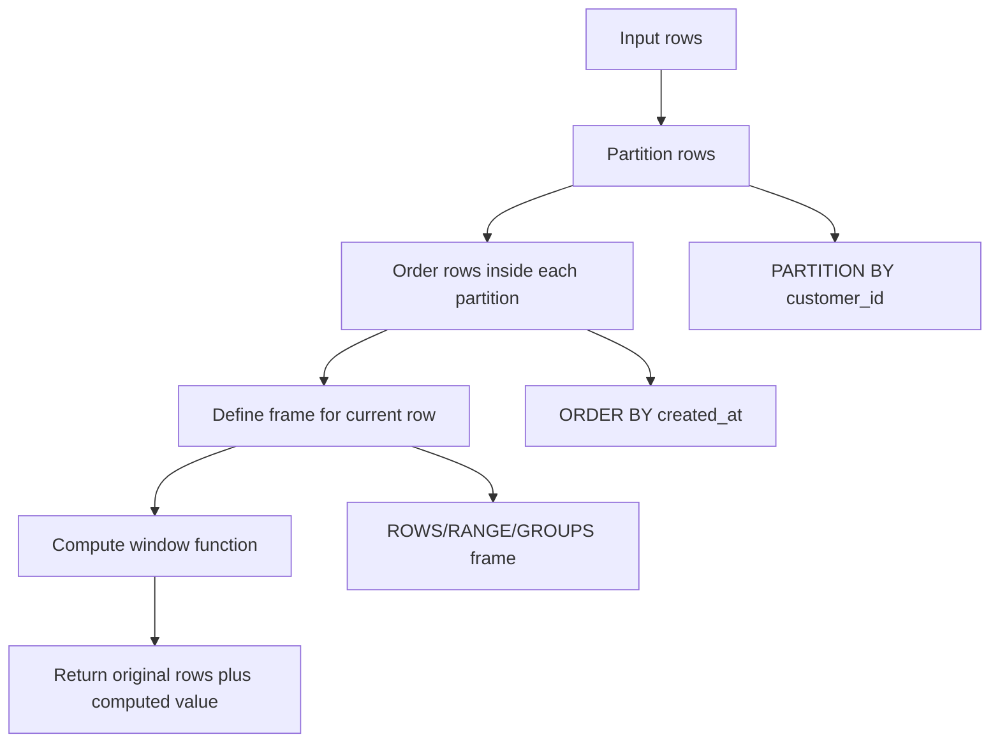
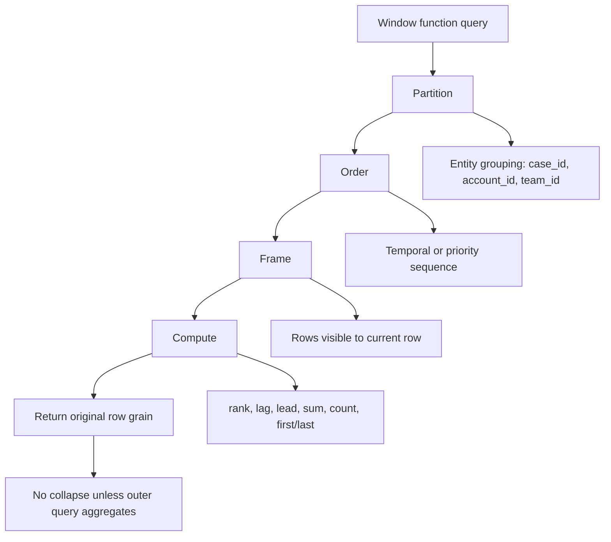

# Part 012 — Window Functions for Production Analytics

## 1. Why This Part Exists

Window functions are one of the biggest jumps in SQL fluency.

Before window functions, many problems require awkward self-joins, correlated subqueries, procedural loops, temporary tables, or application-side processing. With window functions, you can express timeline-aware and group-aware calculations while keeping row-level detail.

A normal aggregate changes grain:

```sql
SELECT customer_id, COUNT(*) AS order_count
FROM orders
GROUP BY customer_id;
```

This returns one row per customer.

A window function does not collapse rows:

```sql
SELECT
    order_id,
    customer_id,
    created_at,
    COUNT(*) OVER (PARTITION BY customer_id) AS order_count_for_customer
FROM orders;
```

This still returns one row per order, but each row knows something about its customer partition.

That distinction is everything.

Window functions let you solve production questions like:

- What is the latest event per case?
- What was the previous status before this transition?
- How long did each lifecycle state last?
- Which rows are duplicates and which one should survive?
- What is the running balance after every transaction?
- Which user actions belong to the same session?
- Which cases crossed SLA threshold after escalation?
- What was the top-ranked item per account on each day?
- How did backlog change over time?

This part turns window functions from syntax into a mental model.

---

## 2. Kaufman Framing: The Sub-Skills

Window functions look intimidating because the syntax has multiple dimensions:

```sql
function(...) OVER (
    PARTITION BY ...
    ORDER BY ...
    ROWS BETWEEN ... AND ...
)
```

We decompose the skill into smaller units:

1. Understand row preservation.
2. Understand partitioning.
3. Understand ordering.
4. Understand frame clauses.
5. Use ranking functions.
6. Use offset functions: `LAG`, `LEAD`.
7. Use aggregate window functions.
8. Use value functions: `FIRST_VALUE`, `LAST_VALUE`, `NTH_VALUE`.
9. Use windows for deduplication.
10. Use windows for lifecycle and temporal analysis.
11. Debug wrong frames and unstable ordering.
12. Read plan cost: sort, memory, spill, partition size.

The fastest route to usefulness is not memorizing every function. It is mastering these five patterns:

1. latest row per entity,
2. previous/next row comparison,
3. running total,
4. deduplication,
5. gaps-and-islands/sessionization.

---

## 3. The Core Mental Model

A window function answers:

> For this row, what can I compute from a related set of rows without collapsing this row?



Three concepts control the result:

| Concept | Meaning | Example |
|---|---|---|
| Partition | Which rows belong together | all events for one case |
| Order | How rows are sequenced inside partition | by event timestamp |
| Frame | Which ordered rows are visible to the function for current row | from first row to current row |

Not all window functions care about all three:

- `ROW_NUMBER()` cares about order.
- `COUNT(*) OVER (PARTITION BY ...)` does not need order.
- running totals need order and frame.
- `LAG()` needs order, but not frame in the same way aggregate windows do.
- `LAST_VALUE()` is frame-sensitive and often surprises people.

---

## 4. Logical Query Processing Position

Window functions are evaluated after `FROM`, `WHERE`, `GROUP BY`, and `HAVING`, but before final `ORDER BY` output sorting.

This means you cannot normally write:

```sql
SELECT
    case_id,
    ROW_NUMBER() OVER (PARTITION BY account_id ORDER BY opened_at DESC) AS rn
FROM enforcement_cases
WHERE rn = 1;
```

`WHERE` runs before `rn` exists.

Use a CTE or derived table:

```sql
WITH ranked_cases AS (
    SELECT
        case_id,
        account_id,
        opened_at,
        ROW_NUMBER() OVER (
            PARTITION BY account_id
            ORDER BY opened_at DESC, case_id DESC
        ) AS rn
    FROM enforcement_cases
)
SELECT *
FROM ranked_cases
WHERE rn = 1;
```

This is the most common beginner mistake with window functions.

---

## 5. Anatomy of `OVER`

General form:

```sql
<window_function>() OVER (
    PARTITION BY <partition expressions>
    ORDER BY <order expressions>
    <frame clause>
)
```

Example:

```sql
SELECT
    case_id,
    event_at,
    event_type,
    COUNT(*) OVER (
        PARTITION BY case_id
        ORDER BY event_at
        ROWS BETWEEN UNBOUNDED PRECEDING AND CURRENT ROW
    ) AS event_sequence_number
FROM case_events;
```

This means:

- group rows by `case_id`,
- order each case's events by `event_at`,
- for each row, consider rows from the first event to the current event,
- count those rows.

But note: if multiple events have the same `event_at`, ordering is not deterministic unless you add a tie-breaker.

Better:

```sql
ORDER BY event_at, case_event_id
```

A production window query must almost always include deterministic ordering.

---

## 6. `PARTITION BY`: The Window Group

`PARTITION BY` defines independent groups.

```sql
SELECT
    case_event_id,
    case_id,
    event_type,
    COUNT(*) OVER (PARTITION BY case_id) AS total_events_for_case
FROM case_events;
```

This returns one row per event, with a case-level count repeated across each event row.

### 6.1 No `PARTITION BY`

If omitted, the entire result set is one partition:

```sql
SELECT
    order_id,
    total_amount,
    SUM(total_amount) OVER () AS global_total_amount
FROM orders;
```

This repeats the global total on every row.

### 6.2 Partitioning by the Wrong Grain

Bad:

```sql
ROW_NUMBER() OVER (
    PARTITION BY account_id
    ORDER BY event_at DESC
)
```

If the requirement is latest event per case, partitioning by account is wrong. It returns the latest event per account, not per case.

The partition key is a grain decision.

---

## 7. `ORDER BY`: The Sequence Inside the Partition

`ORDER BY` inside `OVER` is not the same as final result ordering.

```sql
SELECT
    case_id,
    event_at,
    event_type,
    ROW_NUMBER() OVER (
        PARTITION BY case_id
        ORDER BY event_at
    ) AS event_position
FROM case_events
ORDER BY case_id, event_at;
```

The window `ORDER BY` defines calculation order. The final `ORDER BY` defines output display order.

### 7.1 Deterministic Ordering

Bad:

```sql
ROW_NUMBER() OVER (
    PARTITION BY case_id
    ORDER BY event_at DESC
)
```

If two events have the same timestamp, the winner may be unstable.

Better:

```sql
ROW_NUMBER() OVER (
    PARTITION BY case_id
    ORDER BY event_at DESC, case_event_id DESC
)
```

Every production ranking query needs a deterministic tie-breaker.

### 7.2 Business Ordering vs Technical Ordering

Business ordering:

```sql
ORDER BY priority DESC, due_at ASC
```

Technical tie-breaker:

```sql
ORDER BY priority DESC, due_at ASC, case_id ASC
```

The tie-breaker may not affect business meaning, but it affects repeatability.

---

## 8. Frame Clauses

The frame determines which rows are visible to certain window functions for the current row.

Common frame:

```sql
ROWS BETWEEN UNBOUNDED PRECEDING AND CURRENT ROW
```

Meaning:

> From the first row in the ordered partition through the current physical row.

Useful for running totals:

```sql
SELECT
    account_id,
    transaction_id,
    transaction_at,
    amount,
    SUM(amount) OVER (
        PARTITION BY account_id
        ORDER BY transaction_at, transaction_id
        ROWS BETWEEN UNBOUNDED PRECEDING AND CURRENT ROW
    ) AS running_balance
FROM account_transactions;
```

### 8.1 `ROWS` vs `RANGE` vs `GROUPS`

| Frame Type | Mental Model | Risk |
|---|---|---|
| `ROWS` | Physical row offsets | Deterministic if order is deterministic |
| `RANGE` | Value-based peer group around order value | Peers with same order value can produce surprising results |
| `GROUPS` | Peer-group offsets | Useful when peer groups are intentional |

For production running totals, prefer explicit `ROWS` unless you specifically need peer-aware behavior.

### 8.2 The `LAST_VALUE` Trap

Many engineers expect this:

```sql
LAST_VALUE(status) OVER (
    PARTITION BY case_id
    ORDER BY event_at
) AS latest_status
```

But depending on the default frame, `LAST_VALUE` may return the last value in the frame ending at the current row, not the last value in the entire partition.

Safer:

```sql
LAST_VALUE(status) OVER (
    PARTITION BY case_id
    ORDER BY event_at, case_event_id
    ROWS BETWEEN UNBOUNDED PRECEDING AND UNBOUNDED FOLLOWING
) AS latest_status
```

Or use ranking and filter:

```sql
WITH ranked AS (
    SELECT
        ce.*,
        ROW_NUMBER() OVER (
            PARTITION BY case_id
            ORDER BY event_at DESC, case_event_id DESC
        ) AS rn
    FROM case_events ce
    WHERE event_type = 'STATUS_CHANGED'
)
SELECT *
FROM ranked
WHERE rn = 1;
```

Ranking is often easier to reason about for latest-row selection.

---

## 9. Ranking Functions

Ranking functions assign position inside a partition.

| Function | Behavior |
|---|---|
| `ROW_NUMBER()` | Unique sequence number; ties still get different numbers |
| `RANK()` | Same rank for ties; gaps after ties |
| `DENSE_RANK()` | Same rank for ties; no gaps |
| `NTILE(n)` | Divides rows into n buckets |
| `PERCENT_RANK()` | Relative rank, often used in analytics |
| `CUME_DIST()` | Cumulative distribution |

### 9.1 `ROW_NUMBER()` for Latest Row

```sql
WITH ranked_events AS (
    SELECT
        ce.*,
        ROW_NUMBER() OVER (
            PARTITION BY ce.case_id
            ORDER BY ce.event_at DESC, ce.case_event_id DESC
        ) AS rn
    FROM case_events ce
)
SELECT *
FROM ranked_events
WHERE rn = 1;
```

This returns one row per case if the tie-breaker is unique.

### 9.2 `RANK()` for Tied Winners

If tied first place should include all rows:

```sql
WITH ranked_cases AS (
    SELECT
        ec.*,
        RANK() OVER (
            PARTITION BY team_id
            ORDER BY priority_score DESC
        ) AS priority_rank
    FROM enforcement_cases ec
    WHERE status = 'OPEN'
)
SELECT *
FROM ranked_cases
WHERE priority_rank = 1;
```

This may return multiple cases per team when scores tie.

### 9.3 `DENSE_RANK()` for Tiering

```sql
SELECT
    case_id,
    team_id,
    severity,
    DENSE_RANK() OVER (
        PARTITION BY team_id
        ORDER BY severity_score DESC
    ) AS severity_tier
FROM case_priority_view;
```

Use `DENSE_RANK()` when rank gaps are not meaningful.

---

## 10. Offset Functions: `LAG` and `LEAD`

`LAG` reads a previous row. `LEAD` reads a next row.

```sql
SELECT
    case_id,
    event_at,
    status,
    LAG(status) OVER (
        PARTITION BY case_id
        ORDER BY event_at, case_event_id
    ) AS previous_status,
    LEAD(status) OVER (
        PARTITION BY case_id
        ORDER BY event_at, case_event_id
    ) AS next_status
FROM case_status_events;
```

### 10.1 Status Transition Analysis

```sql
WITH transitions AS (
    SELECT
        case_id,
        event_at,
        status AS new_status,
        LAG(status) OVER (
            PARTITION BY case_id
            ORDER BY event_at, case_event_id
        ) AS previous_status
    FROM case_status_events
)
SELECT *
FROM transitions
WHERE previous_status IS DISTINCT FROM new_status;
```

This finds actual status changes.

### 10.2 Time in State

```sql
WITH status_timeline AS (
    SELECT
        case_id,
        status,
        event_at AS status_started_at,
        LEAD(event_at) OVER (
            PARTITION BY case_id
            ORDER BY event_at, case_event_id
        ) AS next_status_at
    FROM case_status_events
)
SELECT
    case_id,
    status,
    status_started_at,
    next_status_at,
    COALESCE(next_status_at, CURRENT_TIMESTAMP) - status_started_at AS duration_in_status
FROM status_timeline;
```

This is fundamental for lifecycle modelling, SLA analysis, and regulatory defensibility.

### 10.3 Detecting Invalid Transitions

```sql
WITH transitions AS (
    SELECT
        case_id,
        status AS new_status,
        LAG(status) OVER (
            PARTITION BY case_id
            ORDER BY event_at, case_event_id
        ) AS old_status,
        event_at
    FROM case_status_events
)
SELECT *
FROM transitions
WHERE old_status = 'CLOSED'
  AND new_status NOT IN ('REOPENED');
```

This uses SQL as a state-machine audit tool.

---

## 11. Aggregate Window Functions

Aggregate functions can be used as window functions.

### 11.1 Running Count

```sql
SELECT
    case_id,
    case_event_id,
    event_at,
    COUNT(*) OVER (
        PARTITION BY case_id
        ORDER BY event_at, case_event_id
        ROWS BETWEEN UNBOUNDED PRECEDING AND CURRENT ROW
    ) AS event_number
FROM case_events;
```

### 11.2 Running Total

```sql
SELECT
    account_id,
    transaction_id,
    transaction_at,
    amount,
    SUM(amount) OVER (
        PARTITION BY account_id
        ORDER BY transaction_at, transaction_id
        ROWS BETWEEN UNBOUNDED PRECEDING AND CURRENT ROW
    ) AS running_balance
FROM ledger_entries;
```

### 11.3 Moving Average

```sql
SELECT
    service_name,
    metric_at,
    latency_ms,
    AVG(latency_ms) OVER (
        PARTITION BY service_name
        ORDER BY metric_at
        ROWS BETWEEN 6 PRECEDING AND CURRENT ROW
    ) AS moving_avg_7_points
FROM service_latency_samples;
```

This is point-count based, not time-duration based. If samples are irregular, it is not a 7-minute average unless each row is exactly one minute apart.

### 11.4 Percent of Total

```sql
SELECT
    team_id,
    case_id,
    case_count,
    case_count * 1.0 / SUM(case_count) OVER (PARTITION BY team_id) AS pct_of_team_cases
FROM team_case_breakdown;
```

Remember to avoid integer division where the engine truncates integer results.

---

## 12. Value Functions

Value functions include `FIRST_VALUE`, `LAST_VALUE`, and `NTH_VALUE`.

### 12.1 First Value

```sql
SELECT
    case_id,
    event_at,
    status,
    FIRST_VALUE(status) OVER (
        PARTITION BY case_id
        ORDER BY event_at, case_event_id
        ROWS BETWEEN UNBOUNDED PRECEDING AND UNBOUNDED FOLLOWING
    ) AS initial_status
FROM case_status_events;
```

### 12.2 Last Value with Explicit Frame

```sql
SELECT
    case_id,
    event_at,
    status,
    LAST_VALUE(status) OVER (
        PARTITION BY case_id
        ORDER BY event_at, case_event_id
        ROWS BETWEEN UNBOUNDED PRECEDING AND UNBOUNDED FOLLOWING
    ) AS latest_status
FROM case_status_events;
```

Use explicit frames when using `LAST_VALUE`. Avoid relying on defaults.

---

## 13. Pattern 1: Latest Row Per Entity

Requirement:

> Return the latest status event for each case.

```sql
WITH ranked_status AS (
    SELECT
        ce.case_id,
        ce.status,
        ce.event_at,
        ce.case_event_id,
        ROW_NUMBER() OVER (
            PARTITION BY ce.case_id
            ORDER BY ce.event_at DESC, ce.case_event_id DESC
        ) AS rn
    FROM case_events ce
    WHERE ce.event_type = 'STATUS_CHANGED'
)
SELECT
    case_id,
    status,
    event_at AS status_at
FROM ranked_status
WHERE rn = 1;
```

Production checklist:

- Partition by the entity key.
- Order by business timestamp descending.
- Add technical tie-breaker descending.
- Filter in an outer query.
- Validate one row per entity.

Validation:

```sql
WITH latest AS (...)
SELECT case_id, COUNT(*)
FROM latest
GROUP BY case_id
HAVING COUNT(*) > 1;
```

This should return zero rows.

---

## 14. Pattern 2: Deduplication

Requirement:

> Keep the newest record for each external reference, mark older duplicates.

```sql
WITH ranked AS (
    SELECT
        i.*,
        ROW_NUMBER() OVER (
            PARTITION BY external_reference
            ORDER BY received_at DESC, ingestion_id DESC
        ) AS duplicate_rank
    FROM inbound_messages i
)
SELECT *
FROM ranked
WHERE duplicate_rank = 1;
```

To inspect duplicates:

```sql
WITH ranked AS (
    SELECT
        i.*,
        ROW_NUMBER() OVER (
            PARTITION BY external_reference
            ORDER BY received_at DESC, ingestion_id DESC
        ) AS duplicate_rank,
        COUNT(*) OVER (
            PARTITION BY external_reference
        ) AS duplicate_count
    FROM inbound_messages i
)
SELECT *
FROM ranked
WHERE duplicate_count > 1
ORDER BY external_reference, duplicate_rank;
```

### 14.1 Safe Delete Pattern

Do not immediately delete duplicates. First select them.

```sql
WITH ranked AS (
    SELECT
        message_id,
        external_reference,
        ROW_NUMBER() OVER (
            PARTITION BY external_reference
            ORDER BY received_at DESC, message_id DESC
        ) AS rn
    FROM inbound_messages
)
SELECT *
FROM ranked
WHERE rn > 1;
```

Then use a transaction and key-based delete.

```sql
WITH ranked AS (
    SELECT
        message_id,
        ROW_NUMBER() OVER (
            PARTITION BY external_reference
            ORDER BY received_at DESC, message_id DESC
        ) AS rn
    FROM inbound_messages
),
to_delete AS (
    SELECT message_id
    FROM ranked
    WHERE rn > 1
)
DELETE FROM inbound_messages im
USING to_delete d
WHERE d.message_id = im.message_id;
```

Syntax varies across engines, but the safety model is portable: rank first, inspect second, mutate by primary key third.

---

## 15. Pattern 3: Running Balances and Event Sourcing

A ledger-like table should often be immutable:

```sql
ledger_entries(
    ledger_entry_id,
    account_id,
    entry_at,
    amount,
    entry_type
)
```

Running balance:

```sql
SELECT
    account_id,
    ledger_entry_id,
    entry_at,
    amount,
    SUM(amount) OVER (
        PARTITION BY account_id
        ORDER BY entry_at, ledger_entry_id
        ROWS BETWEEN UNBOUNDED PRECEDING AND CURRENT ROW
    ) AS balance_after_entry
FROM ledger_entries
ORDER BY account_id, entry_at, ledger_entry_id;
```

### 15.1 Why Tie-Breaker Matters

If two entries share the same `entry_at`, ordering only by timestamp is unstable. The running balance can appear to change order between executions.

Use a stable technical sequence:

```sql
ORDER BY entry_at, ledger_entry_id
```

### 15.2 Auditability Benefit

Window functions allow you to reconstruct state without mutating historical rows. This is valuable for:

- financial ledgers,
- regulatory enforcement history,
- case lifecycle reconstruction,
- entitlement changes,
- inventory movement,
- workflow state transitions.

---

## 16. Pattern 4: Gaps and Islands

Gaps-and-islands problems identify consecutive ranges.

Example requirement:

> Find consecutive days where a case was in `ESCALATED` status.

Given daily snapshots:

```sql
case_daily_status(case_id, snapshot_date, status)
```

Use row-number normalization:

```sql
WITH escalated_days AS (
    SELECT
        case_id,
        snapshot_date,
        ROW_NUMBER() OVER (
            PARTITION BY case_id
            ORDER BY snapshot_date
        ) AS rn
    FROM case_daily_status
    WHERE status = 'ESCALATED'
),
islands AS (
    SELECT
        case_id,
        snapshot_date,
        snapshot_date - (rn * INTERVAL '1 day') AS island_key
    FROM escalated_days
)
SELECT
    case_id,
    MIN(snapshot_date) AS escalated_from,
    MAX(snapshot_date) AS escalated_to,
    COUNT(*) AS day_count
FROM islands
GROUP BY case_id, island_key
ORDER BY case_id, escalated_from;
```

The idea:

- consecutive dates differ by 1 day,
- row numbers also increase by 1,
- subtracting row number from date creates the same island key for consecutive ranges.

Syntax for date arithmetic differs by engine, but the pattern is stable.

---

## 17. Pattern 5: Sessionization

Requirement:

> Group user actions into sessions where a new session starts after 30 minutes of inactivity.

```sql
WITH ordered_events AS (
    SELECT
        user_id,
        event_id,
        event_at,
        LAG(event_at) OVER (
            PARTITION BY user_id
            ORDER BY event_at, event_id
        ) AS previous_event_at
    FROM user_events
),
session_flags AS (
    SELECT
        *,
        CASE
            WHEN previous_event_at IS NULL THEN 1
            WHEN event_at > previous_event_at + INTERVAL '30 minutes' THEN 1
            ELSE 0
        END AS is_new_session
    FROM ordered_events
),
sessionized AS (
    SELECT
        *,
        SUM(is_new_session) OVER (
            PARTITION BY user_id
            ORDER BY event_at, event_id
            ROWS BETWEEN UNBOUNDED PRECEDING AND CURRENT ROW
        ) AS session_number
    FROM session_flags
)
SELECT
    user_id,
    session_number,
    MIN(event_at) AS session_started_at,
    MAX(event_at) AS session_ended_at,
    COUNT(*) AS event_count
FROM sessionized
GROUP BY user_id, session_number
ORDER BY user_id, session_started_at;
```

This pattern combines:

1. `LAG` to compare with previous row,
2. flag for new group,
3. running `SUM` to assign group id,
4. aggregation to summarize sessions.

This is one of the most useful advanced SQL patterns.

---

## 18. Pattern 6: SLA Breach Detection

Requirement:

> Detect each case status period that exceeded SLA.

```sql
WITH status_timeline AS (
    SELECT
        ce.case_id,
        ce.status,
        ce.event_at AS status_started_at,
        LEAD(ce.event_at) OVER (
            PARTITION BY ce.case_id
            ORDER BY ce.event_at, ce.case_event_id
        ) AS status_ended_at
    FROM case_events ce
    WHERE ce.event_type = 'STATUS_CHANGED'
),
status_durations AS (
    SELECT
        st.case_id,
        st.status,
        st.status_started_at,
        COALESCE(st.status_ended_at, CURRENT_TIMESTAMP) AS status_ended_at,
        COALESCE(st.status_ended_at, CURRENT_TIMESTAMP) - st.status_started_at AS duration_in_status
    FROM status_timeline st
)
SELECT *
FROM status_durations
WHERE status = 'WAITING_FOR_REVIEW'
  AND duration_in_status > INTERVAL '48 hours';
```

This avoids storing a mutable duration column. Duration is derived from event history.

Production considerations:

- Define whether current open status uses `CURRENT_TIMESTAMP` or report cutoff time.
- Use a fixed reporting timestamp for repeatable reports.
- Decide whether business calendars affect SLA.
- Decide whether paused statuses stop the clock.

A more auditable version uses a report parameter:

```sql
WITH params AS (
    SELECT TIMESTAMP '2026-07-01 00:00:00' AS report_as_of
),
status_timeline AS (...)
SELECT ...
```

Avoid using `CURRENT_TIMESTAMP` in compliance reports when repeatability matters.

---

## 19. Pattern 7: Percentiles and Distribution

Many systems support percentile functions as ordered-set aggregates or analytic functions, but syntax varies.

A portable approximation strategy often uses ranking:

```sql
WITH ranked AS (
    SELECT
        service_name,
        latency_ms,
        CUME_DIST() OVER (
            PARTITION BY service_name
            ORDER BY latency_ms
        ) AS cume_dist
    FROM request_logs
    WHERE requested_at >= CURRENT_TIMESTAMP - INTERVAL '1 hour'
)
SELECT
    service_name,
    MIN(latency_ms) AS approx_p95_latency_ms
FROM ranked
WHERE cume_dist >= 0.95
GROUP BY service_name;
```

Caveats:

- Exact percentile syntax varies by engine.
- Approximate percentile functions may be engine-specific.
- Percentiles are sensitive to population filters.
- Latency percentiles should usually be computed from raw observations, not averaged percentiles.

---

## 20. Pattern 8: Top-N Per Group

Requirement:

> Return the top 3 highest-priority open cases per team.

```sql
WITH ranked_cases AS (
    SELECT
        ec.case_id,
        ec.team_id,
        ec.priority_score,
        ec.opened_at,
        ROW_NUMBER() OVER (
            PARTITION BY ec.team_id
            ORDER BY ec.priority_score DESC, ec.opened_at ASC, ec.case_id ASC
        ) AS rn
    FROM enforcement_cases ec
    WHERE ec.status = 'OPEN'
)
SELECT *
FROM ranked_cases
WHERE rn <= 3
ORDER BY team_id, rn;
```

Use `RANK()` instead of `ROW_NUMBER()` if all tied cases should be included.

```sql
WITH ranked_cases AS (
    SELECT
        ec.*,
        RANK() OVER (
            PARTITION BY ec.team_id
            ORDER BY ec.priority_score DESC
        ) AS priority_rank
    FROM enforcement_cases ec
    WHERE ec.status = 'OPEN'
)
SELECT *
FROM ranked_cases
WHERE priority_rank <= 3;
```

This may return more than 3 rows per team when ties exist.

---

## 21. Pattern 9: Change Detection

Requirement:

> Detect when a monitored account changes risk tier.

```sql
WITH tier_timeline AS (
    SELECT
        account_id,
        snapshot_at,
        risk_tier,
        LAG(risk_tier) OVER (
            PARTITION BY account_id
            ORDER BY snapshot_at
        ) AS previous_risk_tier
    FROM account_risk_snapshots
)
SELECT *
FROM tier_timeline
WHERE previous_risk_tier IS DISTINCT FROM risk_tier;
```

This includes first observations because previous tier is `NULL`. If you want only changes after first observation:

```sql
WHERE previous_risk_tier IS NOT NULL
  AND previous_risk_tier IS DISTINCT FROM risk_tier
```

Change detection is a core pattern in audit, monitoring, case escalation, and data quality checks.

---

## 22. Pattern 10: Reconstructing Current State from Events

If you store immutable status events, current state can be reconstructed:

```sql
WITH ranked_status AS (
    SELECT
        ce.case_id,
        ce.status,
        ce.event_at,
        ROW_NUMBER() OVER (
            PARTITION BY ce.case_id
            ORDER BY ce.event_at DESC, ce.case_event_id DESC
        ) AS rn
    FROM case_events ce
    WHERE ce.event_type = 'STATUS_CHANGED'
)
SELECT
    case_id,
    status AS current_status,
    event_at AS current_status_at
FROM ranked_status
WHERE rn = 1;
```

This is useful when:

- source of truth is event history,
- current-state table may be stale,
- audit reconstruction is required,
- you need to validate projection correctness.

Validation query:

```sql
WITH event_current AS (...)
SELECT
    ec.case_id,
    ec.status AS stored_status,
    ev.current_status AS event_status
FROM enforcement_cases ec
JOIN event_current ev
    ON ev.case_id = ec.case_id
WHERE ec.status IS DISTINCT FROM ev.current_status;
```

This detects drift between current-state projection and immutable history.

---

## 23. Window Functions vs Aggregation

Use aggregation when you want fewer rows.

```sql
SELECT team_id, COUNT(*) AS open_case_count
FROM enforcement_cases
WHERE status = 'OPEN'
GROUP BY team_id;
```

Use window functions when you want row-level detail plus group-level context.

```sql
SELECT
    case_id,
    team_id,
    opened_at,
    COUNT(*) OVER (PARTITION BY team_id) AS open_case_count_for_team
FROM enforcement_cases
WHERE status = 'OPEN';
```

### 23.1 Decision Matrix

| Need | Use |
|---|---|
| One row per group | `GROUP BY` |
| Row detail plus group metric | Window function |
| Latest row per entity | Window rank + filter |
| Running total | Aggregate window with frame |
| Compare with previous row | `LAG` |
| Compare with next row | `LEAD` |
| Deduplicate | `ROW_NUMBER` |
| Find consecutive ranges | `ROW_NUMBER`, `LAG`, running `SUM` |
| Summarize final sessions/ranges | Window first, aggregate later |

---

## 24. Window Functions and Joins

Window functions are sensitive to input row multiplicity. If a join duplicates rows before the window is computed, the window result may be wrong.

Bad:

```sql
SELECT
    ec.case_id,
    ce.case_event_id,
    COUNT(*) OVER (PARTITION BY ec.team_id) AS team_open_case_count
FROM enforcement_cases ec
JOIN case_events ce
    ON ce.case_id = ec.case_id
WHERE ec.status = 'OPEN';
```

The count is over joined case-event rows, not cases.

Better:

```sql
WITH open_cases AS (
    SELECT case_id, team_id
    FROM enforcement_cases
    WHERE status = 'OPEN'
),
open_cases_with_team_count AS (
    SELECT
        case_id,
        team_id,
        COUNT(*) OVER (PARTITION BY team_id) AS team_open_case_count
    FROM open_cases
)
SELECT *
FROM open_cases_with_team_count;
```

Compute windows at the correct grain.

---

## 25. Window Functions and `DISTINCT`

Be careful combining `DISTINCT` and window functions.

```sql
SELECT DISTINCT
    customer_id,
    COUNT(*) OVER (PARTITION BY customer_id) AS order_count
FROM orders;
```

This may appear to return one row per customer, but the window was computed before final distinct projection. It may be valid in simple cases, but it often hides unclear intent.

Prefer explicit aggregation:

```sql
SELECT customer_id, COUNT(*) AS order_count
FROM orders
GROUP BY customer_id;
```

Or use windows only when row-level detail is required.

---

## 26. Performance Model

Window functions often require sorting by partition/order keys.

Physical cost drivers:

| Driver | Why It Matters |
|---|---|
| Number of rows | More rows to sort/process |
| Partition size | Large partitions consume memory |
| Sort key width | Wide keys increase sort cost |
| Existing index order | May reduce sorting need |
| Frame type | Some frames are harder to evaluate |
| Multiple windows | Different orderings may require multiple sorts |
| Spill behavior | Large sorts may spill to disk |
| Predicate placement | Filtering early reduces window input |

### 26.1 Index Support

For latest event per case:

```sql
ROW_NUMBER() OVER (
    PARTITION BY case_id
    ORDER BY event_at DESC, case_event_id DESC
)
```

A useful index may be:

```sql
CREATE INDEX idx_case_events_case_time
ON case_events (case_id, event_at DESC, case_event_id DESC);
```

This can help the engine read rows in a useful order, depending on plan and engine.

### 26.2 Multiple Window Definitions

This may require different sorts:

```sql
SELECT
    case_id,
    event_at,
    ROW_NUMBER() OVER (PARTITION BY case_id ORDER BY event_at) AS rn_by_case,
    ROW_NUMBER() OVER (PARTITION BY actor_id ORDER BY event_at) AS rn_by_actor
FROM case_events;
```

Because partitions differ, the engine may need multiple ordering strategies.

### 26.3 Reduce Input Before Windowing

Bad:

```sql
WITH ranked AS (
    SELECT
        ce.*,
        ROW_NUMBER() OVER (
            PARTITION BY case_id
            ORDER BY event_at DESC
        ) AS rn
    FROM case_events ce
)
SELECT *
FROM ranked
WHERE event_type = 'STATUS_CHANGED'
  AND rn = 1;
```

This ranks all events, then filters status changes. Wrong if latest event is not a status change.

Better:

```sql
WITH ranked AS (
    SELECT
        ce.*,
        ROW_NUMBER() OVER (
            PARTITION BY case_id
            ORDER BY event_at DESC, case_event_id DESC
        ) AS rn
    FROM case_events ce
    WHERE event_type = 'STATUS_CHANGED'
)
SELECT *
FROM ranked
WHERE rn = 1;
```

Filter to the intended population before windowing.

---

## 27. Common Window Function Bugs

### 27.1 Missing Tie-Breaker

Symptom:

- latest row changes unpredictably,
- pagination unstable,
- dedup winner changes,
- tests are flaky.

Fix:

```sql
ORDER BY business_timestamp DESC, primary_key DESC
```

### 27.2 Wrong Partition Key

Symptom:

- one row per account instead of one row per case,
- top case per team instead of top case per officer,
- duplicate survivors in dedup.

Fix: state the grain before writing `PARTITION BY`.

### 27.3 Filtering Too Late

Symptom:

- latest status event query returns no row for cases where latest event is not status.

Fix: filter input rows before ranking when the rank is over a subset.

### 27.4 Default Frame Surprise

Symptom:

- `LAST_VALUE` returns current row's value, not partition's final value.

Fix: specify frame explicitly.

### 27.5 Window Over Fan-Out Join

Symptom:

- counts are inflated,
- rankings duplicate,
- event-level rows contaminate case-level calculation.

Fix: window at the correct grain before joining to fan-out table.

### 27.6 Averaging Percentages

Symptom:

- team-level average looks mathematically plausible but is wrong.

Fix: compute numerator and denominator separately, then divide at the desired grain.

---

## 28. Case Study: Enforcement Lifecycle Audit

Requirement:

> For each enforcement case, reconstruct status transitions, calculate time spent in each status, identify invalid transitions, and flag SLA breaches for `UNDER_REVIEW` lasting more than 72 hours.

### 28.1 Query

```sql
WITH status_events AS (
    -- grain: one row per status change event
    SELECT
        ce.case_id,
        ce.case_event_id,
        ce.event_at,
        ce.status
    FROM case_events ce
    WHERE ce.event_type = 'STATUS_CHANGED'
),
ordered_status AS (
    -- grain: one row per status change event
    SELECT
        se.*,
        LAG(se.status) OVER (
            PARTITION BY se.case_id
            ORDER BY se.event_at, se.case_event_id
        ) AS previous_status,
        LEAD(se.event_at) OVER (
            PARTITION BY se.case_id
            ORDER BY se.event_at, se.case_event_id
        ) AS next_status_at
    FROM status_events se
),
status_periods AS (
    -- grain: one row per status period
    SELECT
        case_id,
        case_event_id,
        previous_status,
        status,
        event_at AS status_started_at,
        COALESCE(next_status_at, CURRENT_TIMESTAMP) AS status_ended_at,
        COALESCE(next_status_at, CURRENT_TIMESTAMP) - event_at AS duration_in_status
    FROM ordered_status
),
transition_validation AS (
    -- grain: one row per status period
    SELECT
        *,
        CASE
            WHEN previous_status IS NULL THEN 0
            WHEN previous_status = 'CLOSED' AND status <> 'REOPENED' THEN 1
            WHEN previous_status = 'DRAFT' AND status = 'CLOSED' THEN 1
            ELSE 0
        END AS is_invalid_transition,
        CASE
            WHEN status = 'UNDER_REVIEW'
             AND duration_in_status > INTERVAL '72 hours'
            THEN 1 ELSE 0
        END AS breached_review_sla
    FROM status_periods
)
SELECT *
FROM transition_validation
ORDER BY case_id, status_started_at;
```

### 28.2 Why Window Functions Fit

This problem is sequence-based. Each row needs to know previous and next rows in the same case timeline.

Without window functions, you would need:

- self-joins with inequality conditions,
- correlated subqueries,
- procedural loops,
- application-side timeline reconstruction.

Window functions express the timeline directly.

### 28.3 Audit Improvement: Fixed Report Time

For repeatable audit reports, avoid `CURRENT_TIMESTAMP` directly.

```sql
WITH params AS (
    SELECT TIMESTAMP '2026-07-01 00:00:00' AS report_as_of
),
status_events AS (...),
ordered_status AS (...),
status_periods AS (
    SELECT
        os.case_id,
        os.status,
        os.event_at AS status_started_at,
        COALESCE(os.next_status_at, p.report_as_of) AS status_ended_at
    FROM ordered_status os
    CROSS JOIN params p
)
SELECT *
FROM status_periods;
```

Now the result can be reproduced later.

---

## 29. MDX-Friendly Mermaid Summary



---

## 30. 20-Hour Practice Plan for Window Functions

### Hour 1–2: Row Preservation

Practice:

```sql
COUNT(*) OVER ()
COUNT(*) OVER (PARTITION BY customer_id)
```

Goal: feel the difference between aggregate and window aggregate.

### Hour 3–5: Ranking

Practice:

```sql
ROW_NUMBER()
RANK()
DENSE_RANK()
```

Drills:

- latest order per customer,
- top 3 cases per team,
- tied top score per category.

### Hour 6–8: Previous/Next Rows

Practice:

```sql
LAG()
LEAD()
```

Drills:

- status transition table,
- time between events,
- change detection,
- invalid transition detection.

### Hour 9–11: Running Aggregates

Practice:

```sql
SUM(...) OVER (... ROWS BETWEEN UNBOUNDED PRECEDING AND CURRENT ROW)
```

Drills:

- running balance,
- cumulative case count,
- running escalation count.

### Hour 12–14: Frames

Practice:

- `ROWS BETWEEN 6 PRECEDING AND CURRENT ROW`,
- `UNBOUNDED PRECEDING`,
- `UNBOUNDED FOLLOWING`,
- `LAST_VALUE` with explicit frame.

Goal: eliminate default-frame surprises.

### Hour 15–17: Gaps, Islands, and Sessions

Practice:

- consecutive-day grouping,
- inactivity-based sessions,
- repeated state spans.

### Hour 18–20: Production Case Study

Build one audit query that:

1. derives status timeline,
2. calculates previous status,
3. calculates next timestamp,
4. calculates duration,
5. flags invalid transitions,
6. flags SLA breaches,
7. validates one row per status period,
8. explains performance plan.

---

## 31. Exercises

### Exercise 1: Latest Event Per Case

Return one row per case with latest event. Include deterministic tie-breaker.

Expected columns:

- `case_id`,
- `latest_event_type`,
- `latest_event_at`,
- `latest_event_id`.

### Exercise 2: Case Status Durations

Given status events, calculate duration in each status. Use a fixed report timestamp instead of `CURRENT_TIMESTAMP`.

### Exercise 3: Deduplicate Inbound Messages

Given duplicate messages by `external_reference`, keep the latest by `received_at`, tie-break by `message_id`.

Return:

- survivor rows,
- duplicate rows,
- duplicate count per reference.

### Exercise 4: Sessionize User Events

A new session starts after 30 minutes of inactivity. Return session start, session end, and event count.

### Exercise 5: Detect Invalid Workflow Transitions

Given allowed transitions table:

```sql
allowed_status_transitions(from_status, to_status)
```

Use `LAG` to find actual transitions and anti-join to allowed transitions.

---

## 32. Review Checklist

Before merging a window-function query:

- [ ] Is the input grain correct before the window function runs?
- [ ] Is `PARTITION BY` aligned with business entity grain?
- [ ] Is `ORDER BY` deterministic?
- [ ] Is there a technical tie-breaker?
- [ ] Is the frame explicit for running totals and value functions?
- [ ] Is `LAST_VALUE` using the intended frame?
- [ ] Is filtering done before or after ranking intentionally?
- [ ] Are joins avoided before windows when they create fan-out?
- [ ] Are percentiles and ratios computed from correct population?
- [ ] Has execution plan been checked for large sorts or spills?
- [ ] Is report time fixed when audit reproducibility matters?

---

## 33. Key Takeaways

1. Window functions compute across related rows without collapsing row grain.
2. `PARTITION BY` is a grain decision.
3. Window `ORDER BY` controls calculation order, not final display order.
4. Deterministic tie-breakers are mandatory for production ranking.
5. Frames matter, especially for running totals and `LAST_VALUE`.
6. Use CTEs or derived tables to filter by window results.
7. Compute windows at the correct grain before fan-out joins.
8. `LAG` and `LEAD` are essential for lifecycle and audit modelling.
9. Sessionization and gaps-and-islands are built from simple window primitives.
10. Window functions are powerful, but they are often sort-heavy; inspect plans.

---

## 34. References

- PostgreSQL Documentation — Window Functions Tutorial.
- PostgreSQL Documentation — Window Function Calls.
- PostgreSQL Documentation — Aggregate Functions used as window functions.
- Microsoft SQL Server Documentation — `OVER` clause.
- Microsoft SQL Server Documentation — Ranking functions.
- Microsoft SQL Server Documentation — `LAG` and `LEAD`.
- Oracle Database Documentation — Analytic Functions.
