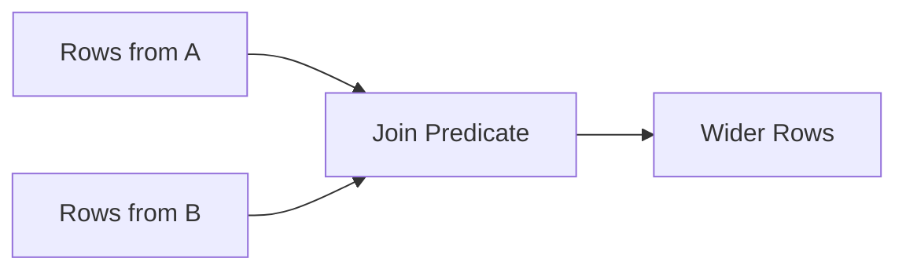
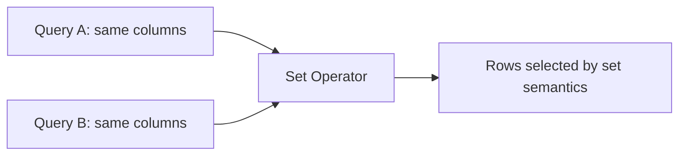
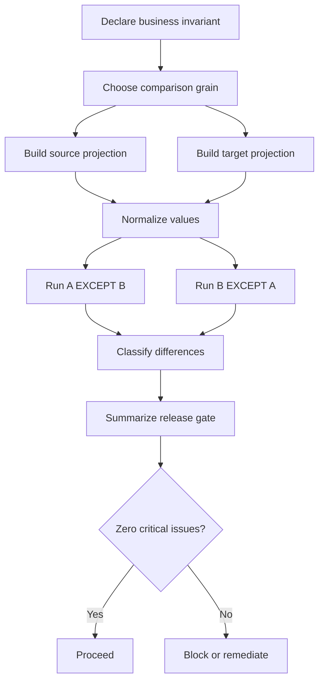

# Part 013 — Set Operations and Relational Differencing

## 1. Why This Part Exists

Most engineers learn SQL through `SELECT`, `JOIN`, and `GROUP BY`. That is enough to retrieve rows, but not enough to compare truths.

Production systems constantly need comparison:

- Which records exist in source A but not source B?
- Which cases were exported but not acknowledged by the downstream system?
- Which permissions are granted in the application but missing in the database role table?
- Which migrated rows changed meaning after normalization?
- Which customers appear in the invoice table but not in the account table?
- Which audit events exist in the old event store but not in the new event store?
- Which rows are present in both feeds and should be considered reconciled?
- Which rows are duplicated after a merge?
- Which rows changed between yesterday's snapshot and today's snapshot?

Set operations are the SQL tools for these questions.

They are not just syntax sugar. They are a different way of thinking:

- `JOIN` asks: how do rows relate?
- `GROUP BY` asks: what is the measure at this grain?
- `WINDOW` asks: what does a row know about its neighborhood?
- `UNION` asks: what is the combined result set?
- `INTERSECT` asks: what is common truth?
- `EXCEPT` asks: what is missing or extra?

In production, `EXCEPT` and `INTERSECT` are especially powerful because they let you express reconciliation, drift detection, migration validation, and audit comparison directly in SQL.

This part is about using set operations as a correctness instrument.

---

## 2. Kaufman Framing: The Sub-Skills

The fastest way to become effective with set operations is not to memorize operators. It is to decompose the skill into five repeatable moves.

| Sub-skill | What to master | Why it matters |
|---|---|---|
| Shape alignment | Make both query branches return compatible columns | Set operators compare result rows, not table identities |
| Duplicate semantics | Choose `DISTINCT` behavior vs `ALL` behavior deliberately | Reconciliation changes meaning when duplicates matter |
| Difference direction | Know which side is baseline and which side is candidate | `A EXCEPT B` and `B EXCEPT A` answer different questions |
| Grain control | Compare rows at the correct business grain | Wrong grain creates false positives or hides drift |
| Diagnostic narrowing | Turn a large diff into explainable categories | Production debugging needs actionable differences |

The 20-hour practice target for this part is simple:

> Given two representations of supposedly equivalent data, you can prove whether they are equivalent, identify which rows differ, explain why they differ, and design a query that can run safely in production.

---

## 3. The Mental Model

A set operation works on two or more result sets that have the same shape.

```sql
query_a
UNION | INTERSECT | EXCEPT
query_b;
```

The database does not care that `query_a` came from `orders` and `query_b` came from `invoices`. It cares that their outputs are comparable.

Example:

```sql
SELECT customer_id, order_id, total_amount
FROM orders
WHERE order_status = 'PAID'

EXCEPT

SELECT customer_id, source_order_id, amount
FROM invoice_lines
WHERE invoice_status = 'ISSUED';
```

This asks:

> Which paid order facts are not represented as issued invoice facts?

That is a very different mental model from a join.

A join creates a wider row.



A set operation compares rows of the same shape.



The important invariant:

> A set operator compares projected facts, not source tables.

That means you must design the projection carefully.

---

## 4. Set Compatibility

Two branches of a set operation must be union-compatible:

1. Same number of columns.
2. Corresponding columns must have compatible types.
3. The output column names usually come from the first query branch.
4. Ordering belongs to the combined result unless each branch is deliberately nested.

Valid:

```sql
SELECT customer_id, email
FROM current_customers

UNION

SELECT customer_id, email
FROM archived_customers;
```

Invalid because shape differs:

```sql
SELECT customer_id, email
FROM current_customers

UNION

SELECT customer_id, email, created_at
FROM archived_customers;
```

Potentially dangerous because column meaning differs even if type matches:

```sql
SELECT customer_id, email
FROM current_customers

UNION

SELECT account_id, phone_number
FROM support_contacts;
```

SQL may accept this if the types are compatible. The database checks type compatibility, not semantic compatibility.

Production rule:

> Never rely on column position alone when composing set operations. Make the branch projections visually symmetrical.

Good:

```sql
SELECT
    customer_id       AS entity_id,
    email             AS contact_value,
    'current'         AS source
FROM current_customers

UNION ALL

SELECT
    customer_id       AS entity_id,
    email             AS contact_value,
    'archived'        AS source
FROM archived_customers;
```

The aliases make intent auditable.

---

## 5. `UNION`: Combining Result Sets

`UNION` returns rows appearing in either branch, with duplicates removed by default.

```sql
SELECT email FROM customers
UNION
SELECT email FROM newsletter_subscribers;
```

This returns a distinct list of emails across both sources.

### 5.1 `UNION` vs `UNION ALL`

`UNION` removes duplicates.

`UNION ALL` preserves duplicates.

```sql
SELECT email FROM customers
UNION ALL
SELECT email FROM newsletter_subscribers;
```

This may return the same email multiple times.

For production systems, the default choice should often be `UNION ALL`, not `UNION`.

Why?

Because duplicate elimination has both semantic and performance costs.

| Operator | Duplicate behavior | Typical physical cost | Use when |
|---|---|---|---|
| `UNION` | Removes duplicates | Sort/hash deduplication | You want a mathematical distinct set |
| `UNION ALL` | Preserves duplicates | Concatenation-style append | You want all events/facts, or you will aggregate later |

Example where `UNION` is correct:

```sql
SELECT user_id
FROM active_sessions

UNION

SELECT user_id
FROM api_tokens
WHERE revoked_at IS NULL;
```

Question:

> Which users currently have at least one active access path?

Duplicates do not matter.

Example where `UNION` is wrong:

```sql
SELECT customer_id, amount
FROM card_payments

UNION

SELECT customer_id, amount
FROM bank_transfers;
```

If a customer made a card payment of `100.00` and a bank transfer of `100.00`, `UNION` may collapse them into one row if the projected columns match. That loses money.

Correct:

```sql
SELECT 'card' AS payment_rail, payment_id, customer_id, amount
FROM card_payments

UNION ALL

SELECT 'bank' AS payment_rail, transfer_id AS payment_id, customer_id, amount
FROM bank_transfers;
```

Production rule:

> Use `UNION ALL` unless duplicate elimination is part of the business requirement.

---

## 6. `INTERSECT`: Common Truth

`INTERSECT` returns rows that appear in both result sets.

```sql
SELECT customer_id
FROM customers
WHERE status = 'ACTIVE'

INTERSECT

SELECT customer_id
FROM subscriptions
WHERE status = 'ACTIVE';
```

This returns customers who are active in both the customer table and the subscription table.

`INTERSECT` is a powerful reconciliation tool because it expresses agreement.

Example: find cases that were both escalated and externally reported.

```sql
SELECT case_id
FROM case_events
WHERE event_type = 'ESCALATED'

INTERSECT

SELECT case_id
FROM external_reports
WHERE report_status = 'SUBMITTED';
```

This result can be used as a verified overlap population.

### 6.1 `INTERSECT` vs `JOIN`

This join:

```sql
SELECT a.customer_id
FROM active_customers a
JOIN active_subscriptions s
  ON s.customer_id = a.customer_id;
```

may return duplicates if either side has multiple rows per customer.

This set operation:

```sql
SELECT customer_id FROM active_customers
INTERSECT
SELECT customer_id FROM active_subscriptions;
```

returns distinct matching customer IDs by default.

The difference is grain.

If you want entity overlap, `INTERSECT` is often clearer.

If you want relationship details from both sides, `JOIN` is needed.

---

## 7. `EXCEPT`: Difference and Missingness

`EXCEPT` returns rows from the first branch that are not present in the second branch.

```sql
SELECT order_id
FROM paid_orders

EXCEPT

SELECT order_id
FROM issued_invoices;
```

This asks:

> Which paid orders do not have issued invoices?

Direction matters.

```sql
SELECT order_id FROM paid_orders
EXCEPT
SELECT order_id FROM issued_invoices;
```

means missing invoices.

```sql
SELECT order_id FROM issued_invoices
EXCEPT
SELECT order_id FROM paid_orders;
```

means invoices without paid orders.

These are different defects.

Production diff should usually be symmetric:

```sql
WITH paid AS (
    SELECT order_id
    FROM paid_orders
),
invoiced AS (
    SELECT order_id
    FROM issued_invoices
),
missing_invoice AS (
    SELECT order_id FROM paid
    EXCEPT
    SELECT order_id FROM invoiced
),
orphan_invoice AS (
    SELECT order_id FROM invoiced
    EXCEPT
    SELECT order_id FROM paid
)
SELECT 'missing_invoice' AS issue_type, order_id
FROM missing_invoice

UNION ALL

SELECT 'orphan_invoice' AS issue_type, order_id
FROM orphan_invoice;
```

This converts comparison into actionable categories.

---

## 8. `ALL` Variants and Duplicate-Aware Differencing

Many SQL engines support `UNION ALL`. Some support `INTERSECT ALL` and `EXCEPT ALL` as well.

The `ALL` variants preserve multiplicity semantics.

Why does this matter?

Imagine two feeds:

Source A:

| sku | quantity |
|---|---:|
| A-1 | 10 |
| A-1 | 10 |
| B-2 | 5 |

Source B:

| sku | quantity |
|---|---:|
| A-1 | 10 |
| B-2 | 5 |

A distinct `EXCEPT` may say there is no difference because the row `(A-1, 10)` exists in both.

But operationally, Source A has two facts and Source B has one.

For duplicate-sensitive reconciliation, compare with counts:

```sql
WITH a_counts AS (
    SELECT sku, quantity, COUNT(*) AS cnt_a
    FROM source_a
    GROUP BY sku, quantity
),
b_counts AS (
    SELECT sku, quantity, COUNT(*) AS cnt_b
    FROM source_b
    GROUP BY sku, quantity
)
SELECT
    COALESCE(a.sku, b.sku) AS sku,
    COALESCE(a.quantity, b.quantity) AS quantity,
    COALESCE(a.cnt_a, 0) AS cnt_a,
    COALESCE(b.cnt_b, 0) AS cnt_b,
    COALESCE(a.cnt_a, 0) - COALESCE(b.cnt_b, 0) AS count_delta
FROM a_counts a
FULL OUTER JOIN b_counts b
  ON b.sku = a.sku
 AND b.quantity = a.quantity
WHERE COALESCE(a.cnt_a, 0) <> COALESCE(b.cnt_b, 0);
```

This is often better than relying on `EXCEPT ALL`, because the output explains the mismatch.

Production rule:

> If duplicate count matters, compare grouped counts, not just distinct row existence.

---

## 9. The Grain Contract

Set operations compare rows. A row represents a fact at a grain.

Before writing a set operation, declare the grain:

```text
One row means: one approved case state per case_id and approved_at timestamp.
```

Then make both branches match that grain.

Bad:

```sql
SELECT case_id, status
FROM case_current_state

EXCEPT

SELECT case_id, event_type
FROM case_events;
```

This compares current state to event type. The shape is compatible, but the facts are not.

Better:

```sql
WITH expected_current_state AS (
    SELECT
        case_id,
        status,
        effective_at
    FROM case_current_state
),
derived_current_state AS (
    SELECT
        case_id,
        new_status AS status,
        event_at AS effective_at
    FROM (
        SELECT
            case_id,
            new_status,
            event_at,
            ROW_NUMBER() OVER (
                PARTITION BY case_id
                ORDER BY event_at DESC, event_id DESC
            ) AS rn
        FROM case_status_events
    ) x
    WHERE rn = 1
)
SELECT 'stored_not_derived' AS issue_type, *
FROM expected_current_state
EXCEPT
SELECT 'stored_not_derived' AS issue_type, *
FROM derived_current_state;
```

Even here, be careful: adding `issue_type` inside each branch changes the compared row. For symmetric diagnostics, you usually compute difference first, then label it.

Better pattern:

```sql
WITH expected_current_state AS (...),
derived_current_state AS (...),
stored_not_derived AS (
    SELECT * FROM expected_current_state
    EXCEPT
    SELECT * FROM derived_current_state
),
derived_not_stored AS (
    SELECT * FROM derived_current_state
    EXCEPT
    SELECT * FROM expected_current_state
)
SELECT 'stored_not_derived' AS issue_type, *
FROM stored_not_derived

UNION ALL

SELECT 'derived_not_stored' AS issue_type, *
FROM derived_not_stored;
```

Production rule:

> A set operation without a declared grain is a latent bug.

---

## 10. Difference Types in Real Systems

Not all differences are the same. A strong reconciliation query separates categories.

| Difference type | Meaning | Typical query |
|---|---|---|
| Missing row | Exists in expected source but not actual source | `expected EXCEPT actual` |
| Extra row | Exists in actual source but not expected source | `actual EXCEPT expected` |
| Changed attribute | Same key, different attributes | Join by key then compare columns |
| Duplicate row | Same grain appears more than once | `GROUP BY grain HAVING COUNT(*) > 1` |
| Invalid row | Row exists but violates invariant | Predicate assertion |
| Late row | Row appears after expected cutoff | Temporal predicate |
| Orphan row | Child exists without valid parent | Anti join or FK validation |
| Stale row | Stored state differs from derived latest state | Snapshot vs event-derived diff |

Set operations are best for row-level presence/absence at a projected grain.

For attribute changes, use a key-based comparison.

Example:

```sql
WITH old_snapshot AS (
    SELECT customer_id, email, status, risk_tier
    FROM customer_snapshot_2026_06_30
),
new_snapshot AS (
    SELECT customer_id, email, status, risk_tier
    FROM customer_snapshot_2026_07_01
)
SELECT
    COALESCE(o.customer_id, n.customer_id) AS customer_id,
    CASE
        WHEN o.customer_id IS NULL THEN 'inserted'
        WHEN n.customer_id IS NULL THEN 'deleted'
        WHEN o.email     IS DISTINCT FROM n.email
          OR o.status    IS DISTINCT FROM n.status
          OR o.risk_tier IS DISTINCT FROM n.risk_tier
        THEN 'changed'
        ELSE 'same'
    END AS diff_type,
    o.email AS old_email,
    n.email AS new_email,
    o.status AS old_status,
    n.status AS new_status,
    o.risk_tier AS old_risk_tier,
    n.risk_tier AS new_risk_tier
FROM old_snapshot o
FULL OUTER JOIN new_snapshot n
  ON n.customer_id = o.customer_id
WHERE o.customer_id IS NULL
   OR n.customer_id IS NULL
   OR o.email     IS DISTINCT FROM n.email
   OR o.status    IS DISTINCT FROM n.status
   OR o.risk_tier IS DISTINCT FROM n.risk_tier;
```

This is not a set operation, but it is part of the same differencing toolbox.

Production rule:

> Use set operations for whole-row equality. Use key-based joins for attribute-level explanation.

---

## 11. Reconciliation Pattern: Source vs Target

A common migration validation pattern:

```sql
WITH source_projection AS (
    SELECT
        legacy_customer_id::text AS customer_ref,
        lower(trim(email))       AS normalized_email,
        status_code              AS status,
        created_at::date         AS created_date
    FROM legacy_customer
    WHERE deleted_flag = 'N'
),
target_projection AS (
    SELECT
        external_ref             AS customer_ref,
        lower(trim(email))       AS normalized_email,
        status                   AS status,
        created_at::date         AS created_date
    FROM customer
    WHERE deleted_at IS NULL
),
missing_in_target AS (
    SELECT * FROM source_projection
    EXCEPT
    SELECT * FROM target_projection
),
extra_in_target AS (
    SELECT * FROM target_projection
    EXCEPT
    SELECT * FROM source_projection
)
SELECT 'missing_in_target' AS issue_type, *
FROM missing_in_target

UNION ALL

SELECT 'extra_in_target' AS issue_type, *
FROM extra_in_target;
```

This query has several strong properties:

1. It normalizes both sides before comparison.
2. It compares stable business facts, not accidental columns.
3. It returns categorized differences.
4. It avoids application-side diff code.
5. It can be rerun repeatedly during migration.

But it also has a risk:

> If the projection excludes a meaningful attribute, the diff cannot detect that attribute drift.

So the projection must be reviewed like a contract.

---

## 12. Reconciliation Pattern: Expected vs Actual Events

Suppose every approved enforcement case must have an `APPROVAL_RECORDED` audit event.

```sql
WITH expected_events AS (
    SELECT
        case_id,
        'APPROVAL_RECORDED' AS event_type,
        approved_by AS actor_id,
        approved_at::date AS event_date
    FROM enforcement_case
    WHERE status = 'APPROVED'
),
actual_events AS (
    SELECT
        case_id,
        event_type,
        actor_id,
        event_at::date AS event_date
    FROM case_audit_event
    WHERE event_type = 'APPROVAL_RECORDED'
),
missing_audit AS (
    SELECT * FROM expected_events
    EXCEPT
    SELECT * FROM actual_events
)
SELECT *
FROM missing_audit
ORDER BY event_date, case_id;
```

This is powerful because it converts a regulatory invariant into SQL:

> For every approved case, there must be a corresponding audit event.

If this query returns rows, the system has defensibility gaps.

---

## 13. Reconciliation Pattern: Permissions Drift

Application-level permissions and database-level grants often drift.

```sql
WITH expected_grants AS (
    SELECT
        role_name,
        object_name,
        privilege_name
    FROM app_permission_matrix
    WHERE active = TRUE
),
actual_grants AS (
    SELECT
        grantee AS role_name,
        table_name AS object_name,
        privilege_type AS privilege_name
    FROM information_schema.role_table_grants
    WHERE table_schema = 'public'
),
missing_grants AS (
    SELECT * FROM expected_grants
    EXCEPT
    SELECT * FROM actual_grants
),
unexpected_grants AS (
    SELECT * FROM actual_grants
    EXCEPT
    SELECT * FROM expected_grants
)
SELECT 'missing_grant' AS issue_type, *
FROM missing_grants

UNION ALL

SELECT 'unexpected_grant' AS issue_type, *
FROM unexpected_grants;
```

This query is not merely operational. It is a security control.

---

## 14. Reconciliation Pattern: CDC Validation

Change Data Capture pipelines must preserve event identity and ordering.

Example check:

```sql
WITH source_changes AS (
    SELECT
        aggregate_id,
        sequence_number,
        operation,
        payload_hash
    FROM source_change_log
    WHERE committed_at >= TIMESTAMP '2026-07-01 00:00:00'
      AND committed_at <  TIMESTAMP '2026-07-02 00:00:00'
),
sink_changes AS (
    SELECT
        aggregate_id,
        sequence_number,
        operation,
        payload_hash
    FROM warehouse_change_log
    WHERE committed_date = DATE '2026-07-01'
),
missing_in_sink AS (
    SELECT * FROM source_changes
    EXCEPT
    SELECT * FROM sink_changes
),
extra_in_sink AS (
    SELECT * FROM sink_changes
    EXCEPT
    SELECT * FROM source_changes
)
SELECT 'missing_in_sink' AS issue_type, * FROM missing_in_sink
UNION ALL
SELECT 'extra_in_sink' AS issue_type, * FROM extra_in_sink;
```

Note the use of `payload_hash`.

For wide payloads, comparing every column can be heavy and noisy. A hash can be useful, but only if:

1. The hash input is canonicalized.
2. The hash algorithm is stable across systems.
3. Collision risk is acceptable for the assurance level.
4. The original payload remains available for investigation.

Production rule:

> Hashes help locate drift quickly; they should not erase forensic detail.

---

## 15. `EXCEPT` vs Anti Join

Two common ways to find rows in A missing from B:

```sql
SELECT id
FROM a
EXCEPT
SELECT id
FROM b;
```

and:

```sql
SELECT a.id
FROM a
WHERE NOT EXISTS (
    SELECT 1
    FROM b
    WHERE b.id = a.id
);
```

They are similar but not identical in practical behavior.

| Concern | `EXCEPT` | `NOT EXISTS` anti join |
|---|---|---|
| Natural output | Whole projected row difference | Rows from left side |
| Duplicate handling | Distinct by default | Preserves left duplicates unless grouped |
| Attribute comparison | Easy for full projected row | More verbose |
| Correlated predicate | Less flexible | Very flexible |
| Diagnostic columns | Needs projection design | Can include left-side detail easily |
| Optimizer behavior | Engine-dependent | Engine-dependent |

Use `EXCEPT` when the branches represent comparable facts.

Use `NOT EXISTS` when the question is relationship-based or when you need precise correlation logic.

Example where anti join is clearer:

```sql
SELECT c.case_id, c.status, c.assigned_officer_id
FROM enforcement_case c
WHERE c.status = 'OPEN'
  AND NOT EXISTS (
      SELECT 1
      FROM case_assignment a
      WHERE a.case_id = c.case_id
        AND a.revoked_at IS NULL
  );
```

Question:

> Which open cases have no active assignment?

This is relationship absence, not necessarily whole-row difference.

---

## 16. NULL Semantics in Set Operations

SQL's `NULL` behavior is one of the main traps in differencing.

For comparison predicates:

```sql
NULL = NULL
```

is unknown, not true.

But in many set operation duplicate-elimination contexts, rows with corresponding nulls are treated as not distinct for the purpose of duplicate handling.

That means this can produce no difference:

```sql
SELECT NULL AS value
EXCEPT
SELECT NULL AS value;
```

In many engines, the result is empty.

This is often useful for reconciliation. It means two missing optional values compare as equivalent.

But if you need to distinguish missing from intentionally blank, normalize explicitly.

```sql
SELECT
    customer_id,
    COALESCE(phone_number, '<NULL>') AS phone_number_marker
FROM source_a

EXCEPT

SELECT
    customer_id,
    COALESCE(phone_number, '<NULL>') AS phone_number_marker
FROM source_b;
```

Be careful: sentinel values can collide with real values. Prefer typed markers when possible:

```sql
SELECT
    customer_id,
    phone_number IS NULL AS phone_number_is_null,
    phone_number
FROM source_a

EXCEPT

SELECT
    customer_id,
    phone_number IS NULL AS phone_number_is_null,
    phone_number
FROM source_b;
```

---

## 17. Ordering and Parentheses

Set operations combine result sets. `ORDER BY` usually applies to the final combined result.

```sql
SELECT id, created_at FROM a
UNION ALL
SELECT id, created_at FROM b
ORDER BY created_at DESC;
```

This sorts the combined rows.

If you need to limit each branch before combining, use subqueries or CTEs.

```sql
WITH latest_a AS (
    SELECT id, created_at
    FROM a
    ORDER BY created_at DESC
    FETCH FIRST 100 ROWS ONLY
),
latest_b AS (
    SELECT id, created_at
    FROM b
    ORDER BY created_at DESC
    FETCH FIRST 100 ROWS ONLY
)
SELECT * FROM latest_a
UNION ALL
SELECT * FROM latest_b
ORDER BY created_at DESC;
```

Production rule:

> Do not assume branch ordering survives a set operation. Order the final result explicitly.

---

## 18. Precedence: `INTERSECT` Binds Tighter in Some Engines

Set operator precedence can surprise people.

For readability and portability, use parentheses when mixing set operators.

Ambiguous-looking:

```sql
SELECT id FROM a
UNION
SELECT id FROM b
INTERSECT
SELECT id FROM c;
```

Better:

```sql
(
    SELECT id FROM a
    UNION
    SELECT id FROM b
)
INTERSECT
SELECT id FROM c;
```

or:

```sql
SELECT id FROM a
UNION
(
    SELECT id FROM b
    INTERSECT
    SELECT id FROM c
);
```

Production rule:

> When mixing set operators, parentheses are part of the specification, not decoration.

---

## 19. Full Outer Join Diff vs Set Diff

A symmetric set diff tells you rows differ.

A full outer join diff tells you how they differ by key.

Set diff:

```sql
WITH a_norm AS (...),
b_norm AS (...)
SELECT 'a_minus_b' AS side, * FROM (
    SELECT * FROM a_norm
    EXCEPT
    SELECT * FROM b_norm
) d
UNION ALL
SELECT 'b_minus_a' AS side, * FROM (
    SELECT * FROM b_norm
    EXCEPT
    SELECT * FROM a_norm
) d;
```

Full outer join diff:

```sql
SELECT
    COALESCE(a.id, b.id) AS id,
    CASE
        WHEN a.id IS NULL THEN 'only_in_b'
        WHEN b.id IS NULL THEN 'only_in_a'
        WHEN a.status IS DISTINCT FROM b.status THEN 'status_changed'
        WHEN a.amount IS DISTINCT FROM b.amount THEN 'amount_changed'
        ELSE 'same'
    END AS diff_type,
    a.status AS a_status,
    b.status AS b_status,
    a.amount AS a_amount,
    b.amount AS b_amount
FROM a_norm a
FULL OUTER JOIN b_norm b
  ON b.id = a.id
WHERE a.id IS NULL
   OR b.id IS NULL
   OR a.status IS DISTINCT FROM b.status
   OR a.amount IS DISTINCT FROM b.amount;
```

Use both in a mature migration:

1. Set diff for fast equivalence proof.
2. Key diff for human diagnosis.
3. Aggregate summary for release gating.

---

## 20. Release Gate Pattern

During migration, you often need a binary answer:

> Can we proceed?

Use SQL to produce a release gate summary.

```sql
WITH diff AS (
    -- symmetric diff query here
    SELECT 'missing_in_target' AS issue_type, customer_ref FROM missing_in_target
    UNION ALL
    SELECT 'extra_in_target' AS issue_type, customer_ref FROM extra_in_target
),
summary AS (
    SELECT
        issue_type,
        COUNT(*) AS issue_count
    FROM diff
    GROUP BY issue_type
)
SELECT
    issue_type,
    issue_count,
    CASE
        WHEN issue_count = 0 THEN 'PASS'
        ELSE 'FAIL'
    END AS gate_status
FROM summary
ORDER BY issue_type;
```

A stronger gate returns one row even when no issues exist:

```sql
WITH diff AS (...),
summary AS (
    SELECT COUNT(*) AS total_issues
    FROM diff
)
SELECT
    total_issues,
    CASE
        WHEN total_issues = 0 THEN 'PASS'
        ELSE 'FAIL'
    END AS release_gate
FROM summary;
```

This is easy to plug into CI, deployment pipelines, or runbooks.

---

## 21. Data Quality Assertions with Set Operations

Set operations can encode invariants.

### 21.1 Every Active User Must Have a Profile

```sql
SELECT user_id
FROM users
WHERE status = 'ACTIVE'

EXCEPT

SELECT user_id
FROM user_profiles;
```

Expected result: empty.

### 21.2 Every Workflow Transition Must Be Allowed

```sql
WITH observed_transitions AS (
    SELECT DISTINCT
        previous_status,
        next_status
    FROM case_status_transition
),
allowed_transitions AS (
    SELECT
        from_status,
        to_status
    FROM workflow_transition_rule
    WHERE active = TRUE
)
SELECT *
FROM observed_transitions
EXCEPT
SELECT *
FROM allowed_transitions;
```

Expected result: empty.

### 21.3 Every External Event Type Must Be Mapped Internally

```sql
SELECT external_event_type
FROM external_event_feed
WHERE received_at >= CURRENT_DATE - INTERVAL '7 days'

EXCEPT

SELECT external_event_type
FROM event_type_mapping
WHERE active = TRUE;
```

Expected result: empty.

### 21.4 No Privilege Outside Approved Matrix

```sql
SELECT role_name, privilege_name, object_name
FROM actual_privilege_snapshot

EXCEPT

SELECT role_name, privilege_name, object_name
FROM approved_privilege_matrix;
```

Expected result: empty.

Production rule:

> A query that should return zero rows is a powerful test. Name it, version it, and run it repeatedly.

---

## 22. Performance Model

Set operations can be expensive because they often need to compare result sets.

Common physical strategies include:

- Append/concatenate branches for `UNION ALL`.
- Sort and unique for duplicate elimination.
- Hash aggregate or hash set for distinct comparison.
- Hash/semi/anti join style execution for `INTERSECT` or `EXCEPT`.
- Spill to disk when memory is insufficient.

This means performance depends on:

1. Branch result size.
2. Width of projected rows.
3. Whether duplicates must be removed.
4. Sort/hash memory availability.
5. Indexes supporting branch filters.
6. Data distribution and skew.
7. Whether result can be compared at key grain instead of full row width.

Bad:

```sql
SELECT * FROM huge_source_a
EXCEPT
SELECT * FROM huge_source_b;
```

Better:

```sql
WITH a AS (
    SELECT id, status, amount, updated_at::date AS updated_date
    FROM huge_source_a
    WHERE updated_at >= DATE '2026-07-01'
),
b AS (
    SELECT id, status, amount, updated_at::date AS updated_date
    FROM huge_source_b
    WHERE updated_at >= DATE '2026-07-01'
)
SELECT * FROM a
EXCEPT
SELECT * FROM b;
```

Better still when validating equivalence at scale:

```sql
WITH a_hash AS (
    SELECT
        id,
        md5(concat_ws('|', status, amount, updated_at::date)) AS row_hash
    FROM huge_source_a
    WHERE updated_at >= DATE '2026-07-01'
),
b_hash AS (
    SELECT
        id,
        md5(concat_ws('|', status, amount, updated_at::date)) AS row_hash
    FROM huge_source_b
    WHERE updated_at >= DATE '2026-07-01'
)
SELECT * FROM a_hash
EXCEPT
SELECT * FROM b_hash;
```

Then drill into mismatched IDs.

Do not hash prematurely. Hashing is a performance optimization, not a correctness substitute.

---

## 23. Wide Row Diff Strategy

For large tables with many columns:

1. Compare row counts by partition.
2. Compare key sets.
3. Compare grouped checksums/hashes by partition.
4. Drill into mismatched partitions.
5. Produce row-level diff only for suspicious slices.

Example:

```sql
WITH source_by_day AS (
    SELECT
        created_at::date AS created_date,
        COUNT(*) AS row_count,
        COUNT(DISTINCT customer_id) AS customer_count
    FROM source_table
    GROUP BY created_at::date
),
target_by_day AS (
    SELECT
        created_at::date AS created_date,
        COUNT(*) AS row_count,
        COUNT(DISTINCT customer_id) AS customer_count
    FROM target_table
    GROUP BY created_at::date
)
SELECT *
FROM source_by_day
EXCEPT
SELECT *
FROM target_by_day;
```

If this is clean, proceed to key-level comparison. If not, isolate the day.

Production rule:

> Large reconciliation should narrow the search space before producing row-level detail.

---

## 24. Anti-Patterns

### 24.1 Using `UNION` to Hide Bad Joins

Bad:

```sql
SELECT customer_id FROM query_a
UNION
SELECT customer_id FROM query_b;
```

when the real issue is duplicate explosion upstream.

`UNION` may hide the symptom.

Fix the grain.

### 24.2 Comparing Accidental Columns

Bad:

```sql
SELECT * FROM source
EXCEPT
SELECT * FROM target;
```

`SELECT *` makes the comparison depend on physical column order and accidental columns.

### 24.3 Forgetting Direction

Bad:

```sql
SELECT id FROM a
EXCEPT
SELECT id FROM b;
```

with no label explaining whether A is expected or actual.

### 24.4 Mixing Types Implicitly

Bad:

```sql
SELECT account_id FROM a
EXCEPT
SELECT account_id FROM b;
```

where one `account_id` is integer and the other is text with leading zeros.

Normalize explicitly.

### 24.5 Comparing at the Wrong Time Boundary

Bad:

```sql
SELECT id FROM source_today
EXCEPT
SELECT id FROM target_today;
```

without ensuring both snapshots are from the same logical cutoff.

### 24.6 Treating Empty Diff as Absolute Truth

An empty diff only proves equality of the chosen projection at the chosen time under the chosen filters.

It does not prove total system equivalence.

---

## 25. Regulatory Case Management Example

Suppose we have a regulatory case management platform.

Important invariant:

> Every enforcement action submitted to the external regulator must be traceable to an approved internal case decision.

Tables:

```sql
CREATE TABLE case_decision (
    decision_id BIGINT PRIMARY KEY,
    case_id BIGINT NOT NULL,
    decision_status TEXT NOT NULL,
    approved_by BIGINT,
    approved_at TIMESTAMP,
    decision_ref TEXT NOT NULL UNIQUE
);

CREATE TABLE regulator_submission (
    submission_id BIGINT PRIMARY KEY,
    case_id BIGINT NOT NULL,
    decision_ref TEXT NOT NULL,
    submitted_at TIMESTAMP NOT NULL,
    submission_status TEXT NOT NULL
);
```

Diff query:

```sql
WITH approved_decisions AS (
    SELECT
        case_id,
        decision_ref
    FROM case_decision
    WHERE decision_status = 'APPROVED'
),
submitted_decisions AS (
    SELECT
        case_id,
        decision_ref
    FROM regulator_submission
    WHERE submission_status IN ('SUBMITTED', 'ACCEPTED')
),
submitted_without_approval AS (
    SELECT * FROM submitted_decisions
    EXCEPT
    SELECT * FROM approved_decisions
),
approved_not_submitted AS (
    SELECT * FROM approved_decisions
    EXCEPT
    SELECT * FROM submitted_decisions
)
SELECT 'submitted_without_approval' AS issue_type, *
FROM submitted_without_approval

UNION ALL

SELECT 'approved_not_submitted' AS issue_type, *
FROM approved_not_submitted
ORDER BY issue_type, case_id, decision_ref;
```

This query detects two different risk classes:

1. **Submitted without approval**: potential unauthorized regulatory action.
2. **Approved not submitted**: potential operational failure or SLA breach.

A top-tier engineer does not merely return a diff. They classify the consequence.

---

## 26. Mermaid: Reconciliation Flow



---

## 27. Practice Drills

### Drill 1: Basic Difference

Create two small tables:

```sql
CREATE TABLE expected_accounts (
    account_id INTEGER,
    status TEXT
);

CREATE TABLE actual_accounts (
    account_id INTEGER,
    status TEXT
);
```

Insert rows where:

- one row exists in both,
- one row exists only in expected,
- one row exists only in actual,
- one row has same key but different status.

Write:

1. `expected EXCEPT actual`.
2. `actual EXCEPT expected`.
3. Full outer join diff by `account_id`.

Explain why the three outputs differ.

### Drill 2: Duplicate-Aware Diff

Create two payment feeds where one side has duplicate rows. Show why distinct `EXCEPT` misses the issue. Then fix it with grouped counts.

### Drill 3: Migration Projection

Take a legacy customer table and a new customer table. Normalize:

- email case,
- whitespace,
- status mapping,
- date truncation.

Write a symmetric diff.

### Drill 4: Workflow Transition Assertion

Given observed transitions and allowed transitions, find illegal transitions using `EXCEPT`.

### Drill 5: Release Gate

Wrap a diff query so it returns:

- total issue count,
- critical issue count,
- gate status.

---

## 28. Production Checklist

Before using set operations in production, ask:

- What exact business fact does each projected row represent?
- Are both branches at the same grain?
- Are column names, order, and data types intentionally aligned?
- Is duplicate elimination desired or dangerous?
- Does direction matter and is it labeled?
- Are NULLs acceptable as equivalent missing values?
- Are values normalized consistently on both sides?
- Are time boundaries aligned?
- Is the query comparing too many columns?
- Can the diff be categorized into issue types?
- Can the query run safely on production-sized data?
- Are supporting branch filters indexed?
- Does the output help remediation, or merely prove mismatch?

---

## 29. Key Takeaways

- Set operations compare result-set facts, not source tables.
- `UNION` removes duplicates by default; `UNION ALL` preserves them.
- `INTERSECT` expresses common truth.
- `EXCEPT` expresses missingness and drift, but direction matters.
- Duplicate-aware reconciliation often requires grouped count comparison.
- Set diff is ideal for whole-row equality; full outer join diff is better for attribute-level explanation.
- A reconciliation query must declare grain, normalize values, classify differences, and provide a release gate.
- Empty diff means equality only within the projection, filters, and time boundary used.

---

## 30. References

- PostgreSQL Documentation — Combining Queries: `UNION`, `INTERSECT`, `EXCEPT`: https://www.postgresql.org/docs/current/queries-union.html
- PostgreSQL Documentation — `SELECT` and set operator behavior: https://www.postgresql.org/docs/current/sql-select.html
- PostgreSQL Documentation — Comparison predicates and `IS DISTINCT FROM`: https://www.postgresql.org/docs/current/functions-comparison.html
- Microsoft SQL Server Documentation — Set Operators: https://learn.microsoft.com/en-us/sql/t-sql/language-elements/set-operators-union-transact-sql
- Oracle Database SQL Language Reference — Set Operators: https://docs.oracle.com/en/database/oracle/oracle-database/23/sqlrf/The-UNION-ALL-INTERSECT-MINUS-Operators.html
