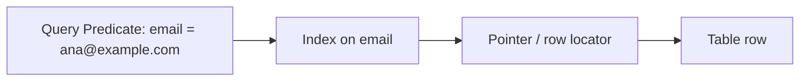
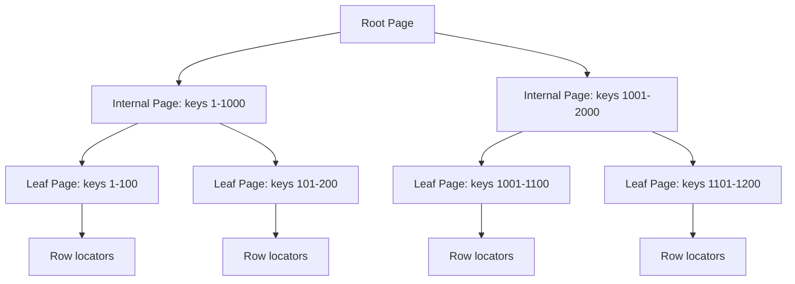
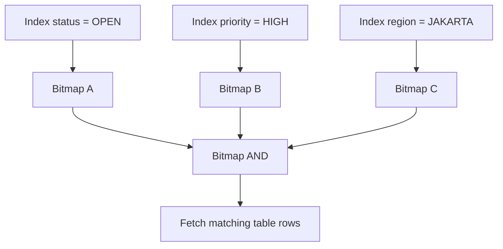
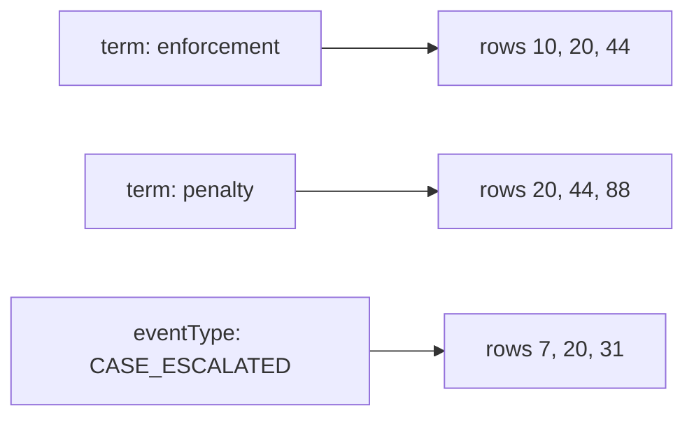
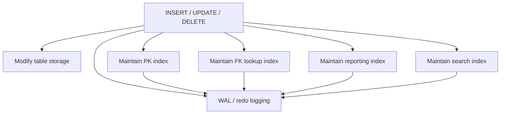

# Part 014 — Indexes from First Principles

## 1. Why This Part Exists

Indexes are one of the most misunderstood database features.

Most engineers know the slogan:

> Indexes make reads faster and writes slower.

That is true, but incomplete.

A top-tier engineer thinks more precisely:

> An index is a physical access path that trades storage and write maintenance cost for faster navigation, ordering, filtering, joining, grouping, and sometimes row retrieval.

The difference matters.

Bad index thinking:

- “This column is in the `WHERE`, so add an index.”
- “The query is slow, add more indexes.”
- “Composite index order does not matter.”
- “Primary key index is enough.”
- “Indexing every foreign key solves performance.”
- “If an index exists, the database will use it.”
- “Index-only scan means no table cost ever.”
- “Low-cardinality columns should never be indexed.”

Production index thinking:

- What access pattern is the query asking for?
- How many rows does the predicate eliminate?
- Does the index order match filtering, joining, and ordering needs?
- Does the query need table rows or only indexed columns?
- How much write amplification does this index introduce?
- Does the index help a critical query enough to justify its lifecycle cost?
- Will the optimizer estimate this index as useful?
- Does the workload need point lookup, range scan, ordering, containment, full-text search, or block pruning?

This part builds the first-principles mental model.

Part 015 will then go deeper into sargability, access paths, and practical index design.

---

## 2. Kaufman Framing: The Sub-Skills

Index mastery is too large to learn as one concept. Decompose it.

| Sub-skill | What to master | Feedback loop |
|---|---|---|
| Access path thinking | Predict whether the engine scans, seeks, ranges, sorts, or joins | `EXPLAIN` / execution plan |
| Data structure intuition | Know what B-tree, hash, bitmap, BRIN, and inverted indexes are good for | Query shape vs index type |
| Selectivity estimation | Estimate how many rows a predicate keeps | Row counts, statistics, actual rows |
| Composite order | Design multi-column indexes by equality, range, ordering, and coverage | Plan and latency comparison |
| Write-cost awareness | Understand insert/update/delete overhead | Write latency, lock time, bloat, storage |
| Lifecycle management | Add, validate, monitor, and remove indexes safely | Production metrics and regression checks |

The fast-learning target:

> Given a slow query and a table shape, you can propose an index, explain why it should help, identify its write cost, verify it with an execution plan, and decide whether it belongs in production.

---

## 3. The Core Mental Model

Without an index, the database may need to scan many rows.

```sql
SELECT *
FROM customers
WHERE email = 'ana@example.com';
```

If `customers` has no useful index on `email`, the engine may inspect the table row by row.

With an index on `email`, the engine can navigate to matching entries.

```sql
CREATE INDEX idx_customers_email
ON customers (email);
```

Conceptually:



But this diagram hides important costs:

1. The index must be stored.
2. The index must be maintained on writes.
3. The table row may still need to be fetched.
4. The optimizer may ignore the index if it estimates a scan is cheaper.
5. Multiple indexes may compete.
6. Poor indexes can make plans worse.

An index is not magic. It is an additional physical structure.

---

## 4. What an Index Can Help With

Indexes can support several execution needs.

| Need | Example | How an index helps |
|---|---|---|
| Point lookup | `WHERE id = ?` | Navigate directly to matching key |
| Range lookup | `WHERE created_at >= ? AND created_at < ?` | Scan ordered key range |
| Join lookup | `ON child.parent_id = parent.id` | Find matching rows quickly |
| Ordering | `ORDER BY created_at DESC` | Avoid or reduce sort |
| Grouping | `GROUP BY tenant_id` | Sometimes process rows in grouped order |
| Uniqueness | `UNIQUE(email)` | Enforce invariant physically |
| Covering | Query reads only indexed columns | Avoid table lookup in some engines/plans |
| Filtering subset | Partial/filtered index | Index only hot/relevant rows |
| Containment/search | JSON, array, full-text | Specialized index type |
| Block pruning | Large append-only table by time | Skip irrelevant storage ranges |

Index design starts from the query's access pattern, not from the table's column list.

---

## 5. The Table Scan Baseline

A table scan is not automatically bad.

For small tables, a scan may be cheaper than using an index.

For queries returning a large portion of the table, a scan may be cheaper than many random lookups.

Example:

```sql
SELECT *
FROM invoice
WHERE status IN ('PAID', 'VOIDED', 'CANCELLED', 'DRAFT');
```

If this predicate returns 90% of the table, an index on `status` may not help.

The database would still need to fetch almost every row.

Strong mental model:

> An index is useful when it substantially reduces work or provides useful order/coverage. It is not useful merely because a column appears in a predicate.

---

## 6. B-tree Indexes

B-tree indexes are the default workhorse in most relational databases.

They keep keys ordered and allow efficient navigation.

Typical strengths:

- Equality lookup.
- Range lookup.
- Prefix lookup on composite indexes.
- Ordered scans.
- `MIN` / `MAX` style access.
- Some `ORDER BY` optimizations.
- Unique constraints.

Conceptual shape:



Real implementations differ, but the useful abstraction is:

1. Start at root.
2. Navigate through internal pages.
3. Reach leaf pages.
4. Scan leaf entries in key order.
5. Fetch rows if needed.

### 6.1 Equality Lookup

```sql
SELECT *
FROM users
WHERE user_id = 123;
```

A B-tree index on `(user_id)` is ideal.

### 6.2 Range Lookup

```sql
SELECT *
FROM orders
WHERE created_at >= TIMESTAMP '2026-07-01 00:00:00'
  AND created_at <  TIMESTAMP '2026-07-02 00:00:00';
```

A B-tree index on `(created_at)` supports a range scan.

### 6.3 Ordered Access

```sql
SELECT order_id, created_at
FROM orders
WHERE customer_id = 42
ORDER BY created_at DESC
FETCH FIRST 20 ROWS ONLY;
```

A composite B-tree index on `(customer_id, created_at DESC)` can support both filtering and ordering.

---

## 7. Hash Indexes

Hash indexes are optimized for equality lookup.

Conceptually:


Strengths:

- Equality predicates.
- Fast point lookups in engines where hash indexes are mature and appropriate.

Weaknesses:

- No ordering.
- No range scans.
- Usually cannot help `ORDER BY`.
- Usually cannot help prefix/range predicates like `<`, `>`, `BETWEEN`.

Example hash-friendly predicate:

```sql
WHERE session_token = '...'
```

Example not hash-friendly:

```sql
WHERE created_at >= CURRENT_DATE - INTERVAL '7 days'
```

Production rule:

> Hash-like access is for equality. B-tree remains the general default unless the engine and workload justify otherwise.

---

## 8. Bitmap Indexes and Bitmap Execution

Bitmap has two related meanings:

1. A physical bitmap index in some engines.
2. A bitmap execution strategy where multiple indexes are combined into a bitmap of candidate rows.

A bitmap representation marks which row locations match a predicate.

Example query:

```sql
SELECT *
FROM cases
WHERE status = 'OPEN'
  AND priority = 'HIGH'
  AND region = 'JAKARTA';
```

The engine may use indexes separately and combine row candidates.



Bitmap strategies are useful when multiple moderately selective predicates combine into a very selective result.

But they are not a substitute for good composite indexes when the workload has a stable critical access path.

---

## 9. BRIN, Zonemap, and Block-Pruning Indexes

For very large tables, especially append-only time-series or audit tables, a full B-tree may be large and expensive.

BRIN-style indexes and zonemaps store summary metadata per block or storage range.

Example concept:

| Block range | min created_at | max created_at |
|---|---|---|
| pages 1–128 | 2026-01-01 | 2026-01-02 |
| pages 129–256 | 2026-01-03 | 2026-01-04 |
| pages 257–384 | 2026-07-01 | 2026-07-02 |

Query:

```sql
SELECT *
FROM audit_event
WHERE created_at >= TIMESTAMP '2026-07-01 00:00:00'
  AND created_at <  TIMESTAMP '2026-07-02 00:00:00';
```

The engine can skip block ranges whose min/max cannot match.

Strengths:

- Very small index size.
- Good for naturally ordered large tables.
- Useful for append-only logs, telemetry, audit events, time-series data.

Weaknesses:

- Poor for random data distribution.
- Not precise like B-tree.
- Still reads candidate blocks and filters rows.

Production rule:

> Block-pruning indexes are powerful when physical locality matches predicate locality.

---

## 10. Inverted Indexes: GIN, Full-Text, JSON, Arrays

B-tree indexes work well for scalar ordered keys. But many queries ask containment questions.

Examples:

```sql
WHERE tags @> ARRAY['fraud']
```

```sql
WHERE document @@ to_tsquery('enforcement & penalty')
```

```sql
WHERE payload @> '{"eventType": "CASE_ESCALATED"}'
```

These often need inverted-index-like structures.

An inverted index maps terms or elements to rows.



Strengths:

- Full-text search.
- Array containment.
- JSON containment.
- Many-to-one token lookup.

Weaknesses:

- Higher write maintenance cost.
- More complex operator support.
- Larger storage footprint.
- More engine-specific behavior.

Production rule:

> Use specialized indexes only when the query uses operators the index type is designed to support.

---

## 11. Spatial and Generalized Indexes

Spatial queries are not well served by normal scalar B-trees.

Example:

```sql
WHERE ST_Intersects(region_geometry, incident_location)
```

Generalized index structures such as GiST/SP-GiST/R-tree-like mechanisms can support geometric, hierarchical, and nearest-neighbor access patterns depending on engine.

The key idea:

> Some data cannot be efficiently ordered as a single scalar line. The index must understand the search geometry.

This matters for:

- GIS systems.
- Routing.
- region-based compliance.
- spatial incident detection.
- nearest facility lookup.

Do not force these workloads into naive B-tree designs.

---

## 12. Clustered vs Nonclustered Indexes

Different engines use different storage models.

A simplified distinction:

| Concept | Meaning |
|---|---|
| Heap table | Table rows stored without primary index order |
| Clustered storage | Table rows physically/logically organized by a clustering key |
| Nonclustered/secondary index | Separate structure pointing to table row or clustering key |

In some engines, the primary key determines the physical organization of table rows. In others, the table is a heap unless explicitly clustered or organized.

Why it matters:

1. Secondary indexes may store row locators or primary key values.
2. Wide primary keys can bloat secondary indexes in clustered-storage engines.
3. Insert patterns can cause page splits or hot spots.
4. Range scans benefit when physical locality matches index order.
5. Random UUID primary keys can hurt locality in some storage models.

Production rule:

> Primary key choice is not only logical identity. It can shape storage, index size, write path, and cache behavior.

---

## 13. Covering Indexes and Index-Only Reads

An index can sometimes satisfy a query without fetching the base table row.

Example:

```sql
SELECT customer_id, created_at, status
FROM orders
WHERE tenant_id = 10
  AND status = 'OPEN'
ORDER BY created_at DESC
FETCH FIRST 50 ROWS ONLY;
```

Index:

```sql
CREATE INDEX idx_orders_tenant_status_created_customer
ON orders (tenant_id, status, created_at DESC, customer_id);
```

The query only needs columns in the index.

This can enable an index-only or covering plan depending on engine and visibility/storage rules.

Benefits:

- Fewer table lookups.
- Lower random I/O.
- Better cache locality.
- Sometimes lower latency variance.

Costs:

- Wider index.
- More storage.
- More write maintenance.
- More memory pressure.
- More bloat risk.

Production rule:

> Cover only critical queries. Do not turn every index into a copy of the table.

---

## 14. Composite Indexes

A composite index contains multiple columns.

```sql
CREATE INDEX idx_orders_customer_created
ON orders (customer_id, created_at DESC);
```

Column order matters.

The index is ordered first by `customer_id`, then by `created_at` within each customer.

Useful query:

```sql
SELECT *
FROM orders
WHERE customer_id = 42
ORDER BY created_at DESC
FETCH FIRST 20 ROWS ONLY;
```

Less useful query:

```sql
SELECT *
FROM orders
WHERE created_at >= CURRENT_DATE - INTERVAL '1 day';
```

The leading column `customer_id` is missing. The index may not be a good access path for this query.

Mental model:

```text
(customer_id, created_at)

customer_id = 1:
    created_at desc...
customer_id = 2:
    created_at desc...
customer_id = 3:
    created_at desc...
```

A composite index is not “an index on both columns independently.”

It is an ordered path by a specific key sequence.

---

## 15. Equality, Range, and Order

A common design heuristic for B-tree composite indexes:

1. Equality predicates first.
2. Then range predicate.
3. Then ordering/grouping if compatible.
4. Then covering columns if justified.

Example:

```sql
SELECT order_id, created_at, total_amount
FROM orders
WHERE tenant_id = 7
  AND customer_id = 42
  AND created_at >= TIMESTAMP '2026-07-01 00:00:00'
  AND created_at <  TIMESTAMP '2026-08-01 00:00:00'
ORDER BY created_at DESC;
```

Candidate index:

```sql
CREATE INDEX idx_orders_tenant_customer_created
ON orders (tenant_id, customer_id, created_at DESC);
```

Why this makes sense:

- `tenant_id` equality narrows tenant.
- `customer_id` equality narrows customer.
- `created_at` range scans relevant time slice.
- Descending order may align with `ORDER BY`.

But do not turn heuristics into dogma.

If `tenant_id` has very low selectivity but is mandatory for every query, it may still belong first for locality and tenant isolation. If `customer_id` is more selective and queries always include it, different order may be better. The right answer depends on workload.

---

## 16. Selectivity

Selectivity means how much a predicate reduces the candidate row set.

High selectivity:

```sql
WHERE email = 'ana@example.com'
```

Maybe 1 row out of 100 million.

Low selectivity:

```sql
WHERE status = 'ACTIVE'
```

Maybe 80 million rows out of 100 million.

Indexes tend to help more when selectivity is high.

But low-selectivity columns can still be useful when:

1. Combined with other columns in a composite index.
2. Used in a partial/filtered index.
3. Used for ordering with a limit.
4. Used in bitmap combination.
5. The filtered value is rare, even if the column overall has few values.

Example:

```sql
CREATE INDEX idx_case_open_high_priority
ON enforcement_case (priority, created_at)
WHERE status = 'OPEN';
```

If only 2% of cases are open, the partial index can be highly selective even though `status` itself has few values.

Production rule:

> Selectivity belongs to predicate values and workload distribution, not just the number of distinct values in a column.

---

## 17. Cardinality, Distribution, and Skew

Cardinality is the number of distinct values.

Distribution describes how rows are spread across those values.

Two columns can have the same cardinality but very different usefulness.

Example:

`status` values:

| status | rows |
|---|---:|
| ACTIVE | 99,000,000 |
| SUSPENDED | 900,000 |
| DELETED | 100,000 |

Query:

```sql
WHERE status = 'DELETED'
```

could be selective.

Query:

```sql
WHERE status = 'ACTIVE'
```

is not.

A naive statement like “low-cardinality columns should not be indexed” is wrong.

Better statement:

> Index usefulness depends on the selectivity of the actual predicate under the actual distribution and workload.

---

## 18. Write Cost and Index Maintenance

Every index has a write cost.

On `INSERT`, the database must add entries to each relevant index.

On `DELETE`, it must remove or mark index entries.

On `UPDATE`, if indexed columns change, it must update index entries. Even if indexed columns do not change, some engines may still pay visibility/versioning costs.

Conceptual write path:



Costs include:

- Additional CPU.
- Additional I/O.
- Additional WAL/redo volume.
- More page splits.
- More lock/latch contention.
- More vacuum/cleanup work in MVCC engines.
- More backup and replication volume.
- More storage and cache footprint.

Production rule:

> An index is part of the write path. Treat it as production code.

---

## 19. Index Size and Cache Pressure

Indexes consume memory indirectly because hot index pages compete for buffer/cache space.

A large unused index hurts even if no query uses it:

1. Writes maintain it.
2. Replication ships its changes.
3. Backup includes it.
4. Maintenance jobs process it.
5. Statistics track it.
6. Cache may be polluted by it.
7. Planner search space may grow.

Index review must include removal.

Useful questions:

- Is this index used by critical queries?
- Is it redundant with a wider or narrower index?
- Does it enforce a constraint?
- Does it support a rare operational query that still matters?
- Is it only used by ad hoc analytics that should move elsewhere?

---

## 20. Unique Indexes as Invariants

Indexes are not only for performance. Unique indexes enforce business rules.

```sql
CREATE UNIQUE INDEX ux_users_email
ON users (lower(email));
```

This enforces case-normalized email uniqueness in engines that support expression indexes.

Another example:

```sql
CREATE UNIQUE INDEX ux_active_assignment_per_case
ON case_assignment (case_id)
WHERE revoked_at IS NULL;
```

This enforces:

> A case can have at most one active assignment.

This is not merely optimization. It is integrity.

Production rule:

> If a business invariant can be represented as a unique constraint/index, prefer the database to enforce it.

---

## 21. Partial / Filtered Indexes

A partial or filtered index indexes only rows matching a predicate.

Example:

```sql
CREATE INDEX idx_cases_open_due_at
ON enforcement_case (due_at)
WHERE status = 'OPEN';
```

Useful query:

```sql
SELECT case_id, due_at
FROM enforcement_case
WHERE status = 'OPEN'
  AND due_at < CURRENT_TIMESTAMP
ORDER BY due_at;
```

Why it works:

- Most historical cases may be closed.
- The operational dashboard only cares about open cases.
- The index is smaller and more focused.

Benefits:

- Less storage than full index.
- Less write overhead for rows outside predicate.
- Better selectivity for hot queries.

Risks:

- Query predicate must imply the index predicate.
- Application query variations may miss the index.
- Predicate changes require index lifecycle review.

Production rule:

> Partial indexes are excellent for hot subsets with stable predicates.

---

## 22. Expression / Function Indexes

Sometimes the query applies a function:

```sql
SELECT *
FROM users
WHERE lower(email) = lower('ANA@EXAMPLE.COM');
```

A normal index on `email` may not help because the predicate uses `lower(email)`.

Expression index:

```sql
CREATE INDEX idx_users_lower_email
ON users (lower(email));
```

Now the index matches the expression.

Use cases:

- Case-insensitive email lookup.
- Date truncation for reporting.
- Normalized phone number.
- JSON attribute extraction.
- Computed business key.

Risk:

- The query expression must match the indexed expression sufficiently for the optimizer.
- Function volatility/determinism rules vary by engine.
- Expression indexes can hide modelling problems if overused.

Production rule:

> If the application queries a normalized form, consider storing or indexing the normalized form deliberately.

---

## 23. Foreign Key Indexes

A foreign key constraint does not always automatically create an index on the child column. Engine behavior differs.

Consider:

```sql
CREATE TABLE orders (
    order_id BIGINT PRIMARY KEY
);

CREATE TABLE order_line (
    order_line_id BIGINT PRIMARY KEY,
    order_id BIGINT NOT NULL REFERENCES orders(order_id)
);
```

Common query:

```sql
SELECT *
FROM order_line
WHERE order_id = ?;
```

Index:

```sql
CREATE INDEX idx_order_line_order_id
ON order_line (order_id);
```

Why child-side FK indexes matter:

1. Faster parent-to-child lookup.
2. Faster joins.
3. Faster cascade or restrict checks.
4. Lower lock duration during parent delete/update checks in many engines.

But do not blindly index every FK in every shape. Composite workload matters.

Example:

```sql
CREATE INDEX idx_order_line_order_sku
ON order_line (order_id, sku);
```

may cover both FK lookup and frequent per-order SKU query.

---

## 24. Indexes and Sorting

Indexes can help avoid sorts when the index order matches the query order.

Query:

```sql
SELECT case_id, due_at
FROM enforcement_case
WHERE status = 'OPEN'
ORDER BY due_at ASC
FETCH FIRST 100 ROWS ONLY;
```

Index:

```sql
CREATE INDEX idx_case_status_due_at
ON enforcement_case (status, due_at ASC);
```

The engine can navigate to `status = 'OPEN'` and read rows in `due_at` order.

This is much better than:

1. Find all open cases.
2. Sort all open cases.
3. Return first 100.

Especially if the table has millions of open cases.

Production rule:

> For top-N queries, the best index often filters and orders at the same time.

---

## 25. Indexes and Pagination

Offset pagination can become expensive:

```sql
SELECT *
FROM orders
ORDER BY created_at DESC
OFFSET 100000 ROWS
FETCH NEXT 50 ROWS ONLY;
```

The engine still has to walk past many rows.

Keyset pagination uses indexed position:

```sql
SELECT *
FROM orders
WHERE created_at < TIMESTAMP '2026-07-01 10:00:00'
ORDER BY created_at DESC
FETCH FIRST 50 ROWS ONLY;
```

Better with a tie-breaker:

```sql
SELECT *
FROM orders
WHERE (created_at, order_id) < (TIMESTAMP '2026-07-01 10:00:00', 900000)
ORDER BY created_at DESC, order_id DESC
FETCH FIRST 50 ROWS ONLY;
```

Index:

```sql
CREATE INDEX idx_orders_created_id_desc
ON orders (created_at DESC, order_id DESC);
```

Production rule:

> Pagination performance is an index design problem, not only an API parameter problem.

---

## 26. Redundant Indexes

Consider these indexes:

```sql
CREATE INDEX idx_orders_customer
ON orders (customer_id);

CREATE INDEX idx_orders_customer_created
ON orders (customer_id, created_at);
```

In many B-tree engines, the second index may serve queries filtering only by `customer_id` because `customer_id` is the leading column.

So the first index might be redundant.

But not always.

The narrower index may still be useful because:

- It is smaller.
- It has better cache density.
- It can be used for FK checks.
- It has lower maintenance cost.
- It may support a different plan more efficiently.

Do not remove indexes only by prefix rules. Verify workload and plans.

Production rule:

> Redundancy is workload-relative. Similar indexes are suspects, not automatic deletions.

---

## 27. Invisible, Hypothetical, and Concurrent Index Workflows

Different engines provide different operational workflows:

- Create index concurrently/online to reduce blocking.
- Mark index invisible to test optimizer behavior without dropping it.
- Use hypothetical indexes for plan exploration.
- Build indexes in background.
- Validate constraints after backfill.

The production principle is engine-independent:

> Index changes are schema changes with operational risk.

Safe workflow:

1. Identify query and workload.
2. Capture baseline plan and metrics.
3. Propose index with expected access path.
4. Estimate storage and write cost.
5. Create with online/concurrent option if available.
6. Refresh statistics if needed.
7. Verify plan and latency.
8. Monitor write impact.
9. Remove redundant indexes deliberately.

---

## 28. Index Selection Is Workload Design

An index is not designed for a table. It is designed for a workload.

Same table, different workloads:

### Workload A: Customer Order History

```sql
WHERE customer_id = ?
ORDER BY created_at DESC
FETCH FIRST 20 ROWS ONLY
```

Index:

```sql
(customer_id, created_at DESC)
```

### Workload B: Daily Operations Dashboard

```sql
WHERE tenant_id = ?
  AND status = 'OPEN'
  AND due_at < now()
ORDER BY due_at
```

Index:

```sql
(tenant_id, status, due_at)
```

or partial:

```sql
(tenant_id, due_at) WHERE status = 'OPEN'
```

### Workload C: Reconciliation by External Reference

```sql
WHERE external_ref = ?
```

Index:

```sql
(external_ref)
```

### Workload D: Audit Event Search

```sql
WHERE case_id = ?
ORDER BY event_at
```

Index:

```sql
(case_id, event_at)
```

Same schema. Different access paths.

---

## 29. Case Study: Enforcement Case Dashboard

Table:

```sql
CREATE TABLE enforcement_case (
    case_id BIGINT PRIMARY KEY,
    tenant_id BIGINT NOT NULL,
    status TEXT NOT NULL,
    priority TEXT NOT NULL,
    assigned_officer_id BIGINT,
    opened_at TIMESTAMP NOT NULL,
    due_at TIMESTAMP,
    closed_at TIMESTAMP,
    deleted_at TIMESTAMP
);
```

Dashboard query:

```sql
SELECT
    case_id,
    priority,
    assigned_officer_id,
    due_at
FROM enforcement_case
WHERE tenant_id = 100
  AND status = 'OPEN'
  AND deleted_at IS NULL
ORDER BY due_at ASC NULLS LAST
FETCH FIRST 50 ROWS ONLY;
```

Candidate index:

```sql
CREATE INDEX idx_case_dashboard_open_due
ON enforcement_case (tenant_id, due_at)
WHERE status = 'OPEN'
  AND deleted_at IS NULL;
```

Why not simply `(tenant_id, status, deleted_at, due_at)`?

That may also work. But if almost all dashboard queries only want open non-deleted cases, a partial index is smaller and focused.

Trade-off:

- Partial index is efficient for this exact hot path.
- Full composite index may support more query variants.
- Partial index requires predicate consistency.
- Full index costs more storage and write maintenance.

Top-tier design requires naming the trade-off, not pretending there is one universal index.

---

## 30. Case Study: State Transition Audit

Table:

```sql
CREATE TABLE case_status_event (
    event_id BIGINT PRIMARY KEY,
    case_id BIGINT NOT NULL,
    previous_status TEXT,
    next_status TEXT NOT NULL,
    event_at TIMESTAMP NOT NULL,
    actor_id BIGINT NOT NULL,
    reason_code TEXT
);
```

Query 1: timeline for one case.

```sql
SELECT *
FROM case_status_event
WHERE case_id = ?
ORDER BY event_at, event_id;
```

Index:

```sql
CREATE INDEX idx_case_status_event_case_time
ON case_status_event (case_id, event_at, event_id);
```

Query 2: daily transition analytics.

```sql
SELECT next_status, COUNT(*)
FROM case_status_event
WHERE event_at >= TIMESTAMP '2026-07-01 00:00:00'
  AND event_at <  TIMESTAMP '2026-07-02 00:00:00'
GROUP BY next_status;
```

Possible index:

```sql
CREATE INDEX idx_case_status_event_event_at_status
ON case_status_event (event_at, next_status);
```

If the table is huge and append-only, a BRIN-style index on `event_at` may be better than a large B-tree, depending on engine and query patterns.

Same table. Different access paths.

---

## 31. What the Optimizer Needs

The optimizer chooses a plan using statistics and cost estimates.

An index may exist and still not be used because:

- Predicate is not selective enough.
- Query returns too many rows.
- Statistics are stale.
- Function/cast prevents matching.
- Composite index leading column is missing.
- Sort order does not match.
- Table lookup cost is too high.
- Parallel scan is cheaper.
- Parameter value distribution is skewed.
- The index is wider or more expensive than another path.

So index design must be verified.

A proper review includes:

```sql
EXPLAIN ...
```

and, where safe:

```sql
EXPLAIN ANALYZE ...
```

Look for:

- Estimated rows vs actual rows.
- Scan type.
- Index condition vs residual filter.
- Sort nodes.
- Heap/table fetches.
- Buffers/read I/O.
- Timing.
- Loops.

Part 016 and Part 017 will go deeper into plans, statistics, and cost model failure.

---

## 32. Index Design Decision Record

For important indexes, write a short decision record.

Template:

```md
## Index Decision: idx_case_dashboard_open_due

### Query supported
Open case dashboard by tenant ordered by due date.

### Query shape
- equality: tenant_id
- fixed filter: status = 'OPEN', deleted_at IS NULL
- order: due_at ASC
- limit: 50

### Index
CREATE INDEX idx_case_dashboard_open_due
ON enforcement_case (tenant_id, due_at)
WHERE status = 'OPEN' AND deleted_at IS NULL;

### Expected benefit
Avoid scanning/sorting all tenant cases. Read first matching open cases in due_at order.

### Cost
Additional write cost when cases enter/leave open non-deleted subset or due_at changes.

### Risk
Queries must include predicates compatible with partial index.

### Verification
Compare plan and latency before/after on representative tenant sizes.
```

This is how you turn performance tuning into maintainable engineering.

---

## 33. Anti-Patterns

### 33.1 Index Every Column

This maximizes write cost and storage without understanding workload.

### 33.2 Add Indexes Without Reading the Plan

You may add an index the optimizer does not use.

### 33.3 Ignore Composite Order

`(a, b)` is not the same as `(b, a)`.

### 33.4 Use Low-Selectivity Slogans

“Never index booleans” is too simplistic. A partial index on a rare boolean state can be excellent.

### 33.5 Cover Everything

A covering index that includes too many columns becomes a shadow table.

### 33.6 Keep Dead Indexes Forever

Unused indexes are operational debt.

### 33.7 Create Production Indexes During Peak Write Load

Index builds can be expensive and blocking depending on engine and options.

### 33.8 Use Indexes to Compensate for Bad Queries

Fix predicate logic, grain, and join correctness first.

---

## 34. Practice Drills

### Drill 1: Predict the Access Path

Given:

```sql
CREATE TABLE orders (
    order_id BIGINT PRIMARY KEY,
    customer_id BIGINT NOT NULL,
    status TEXT NOT NULL,
    created_at TIMESTAMP NOT NULL,
    total_amount NUMERIC(12, 2) NOT NULL
);
```

Predict which index helps each query:

```sql
-- A
SELECT * FROM orders WHERE order_id = ?;

-- B
SELECT * FROM orders WHERE customer_id = ? ORDER BY created_at DESC LIMIT 20;

-- C
SELECT COUNT(*) FROM orders WHERE status = 'CANCELLED';

-- D
SELECT * FROM orders WHERE created_at >= ? AND created_at < ?;
```

Then test with execution plans.

### Drill 2: Composite Order

Create both indexes:

```sql
CREATE INDEX idx_orders_customer_created
ON orders (customer_id, created_at);

CREATE INDEX idx_orders_created_customer
ON orders (created_at, customer_id);
```

Run queries with:

- `WHERE customer_id = ?`
- `WHERE created_at BETWEEN ? AND ?`
- `WHERE customer_id = ? AND created_at BETWEEN ? AND ?`

Compare plans.

### Drill 3: Partial Index

Create a case table with 1 million closed cases and 10,000 open cases. Compare dashboard query performance with:

- no index,
- full index,
- partial index on open cases.

### Drill 4: Covering Trade-Off

Design a narrow index and a covering index for the same query. Measure:

- read latency,
- index size,
- insert/update overhead.

### Drill 5: Redundant Index Review

Given five indexes on the same table, identify which are truly redundant and which are workload-specific.

---

## 35. Production Checklist

Before adding an index, ask:

- What exact query or invariant does it support?
- Is the workload OLTP, analytics, dashboard, reconciliation, or operational search?
- Is the predicate selective enough or order/coverage valuable enough?
- Does the column order match equality, range, and ordering needs?
- Will the query use the leading column?
- Does the index need to be unique?
- Would a partial/filtered index be better?
- Would an expression index be more honest than transforming at query time?
- Is a specialized index type needed?
- How much write cost will this add?
- How large will the index be?
- Does it overlap with existing indexes?
- Can it be created safely online/concurrently?
- How will we verify that the optimizer uses it?
- How will we monitor regressions?
- What is the removal plan if it is not useful?

---

## 36. Key Takeaways

- An index is a physical access path, not a generic speed button.
- B-tree indexes are the general-purpose default for equality, range, and ordering.
- Hash indexes are equality-oriented and do not support ordering or range access.
- Bitmap strategies help combine multiple predicates in some workloads.
- BRIN/zonemap-style indexes are excellent when physical locality matches query predicates.
- Inverted and generalized indexes support specialized containment, text, JSON, array, and spatial workloads.
- Composite index order matters because the index is ordered by a key sequence.
- Covering indexes can avoid table lookups but increase storage and write maintenance.
- Partial indexes are powerful for hot subsets with stable predicates.
- Unique indexes enforce invariants, not only performance.
- Every index has lifecycle cost: writes, storage, cache, maintenance, replication, and operational risk.

---

## 37. References

- PostgreSQL Documentation — Index Types: https://www.postgresql.org/docs/current/indexes-types.html
- PostgreSQL Documentation — Indexes: https://www.postgresql.org/docs/current/indexes.html
- PostgreSQL Documentation — Partial Indexes: https://www.postgresql.org/docs/current/indexes-partial.html
- PostgreSQL Documentation — Index-Only Scans and Covering Indexes: https://www.postgresql.org/docs/current/indexes-index-only-scans.html
- MySQL 8.4 Reference Manual — Optimization and Indexes: https://dev.mysql.com/doc/refman/8.4/en/optimization-indexes.html
- MySQL 8.4 Reference Manual — How MySQL Uses Indexes: https://dev.mysql.com/doc/refman/8.4/en/mysql-indexes.html
- Microsoft SQL Server Documentation — Index Architecture and Design Guide: https://learn.microsoft.com/en-us/sql/relational-databases/sql-server-index-design-guide
