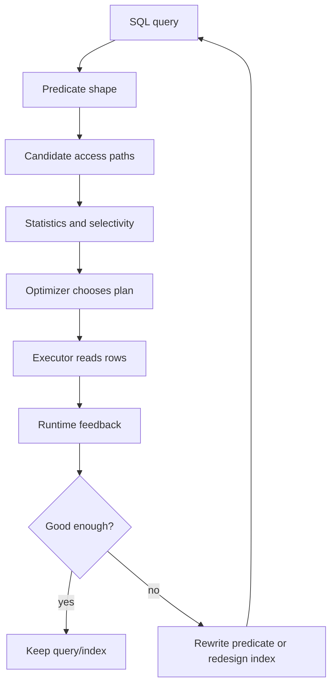
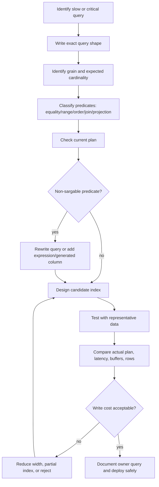

# Part 015 — Sargability, Access Paths, and Index Design

## 1. Why This Part Exists

Part 014 explained indexes from first principles.

This part is about turning that knowledge into engineering decisions.

Most production index problems are not caused by engineers who do not know `CREATE INDEX`. They are caused by engineers who cannot connect these four things:

1. the shape of the query predicate,
2. the physical order of the index,
3. the access path the optimizer can choose,
4. the workload cost of keeping that index alive.

The keyword is **sargability**.

A predicate is sargable when the database can use it as a search argument against an access path. In practical terms:

> A sargable predicate lets the engine navigate to the relevant part of an index instead of evaluating the predicate row by row after reading too much data.

That definition is intentionally operational, not academic.

Bad performance thinking:

```sql
-- "There is an index on created_at, so this should be fast."
select *
from payment
where date(created_at) = date '2026-07-01';
```

Better performance thinking:

```sql
-- "The predicate preserves the indexed column as a range search argument."
select *
from payment
where created_at >= timestamp '2026-07-01 00:00:00'
  and created_at <  timestamp '2026-07-02 00:00:00';
```

The difference is not syntax style. It is whether the optimizer can map the predicate to an access path.

Production SQL performance starts here.

---

## 2. Kaufman Framing: The Sub-Skills

Do not learn index design as a bag of rules. Decompose it.

| Sub-skill | What you must be able to do | Feedback loop |
|---|---|---|
| Predicate classification | Identify equality, range, prefix, suffix, residual, join, and ordering predicates | Rewrite query and compare plan |
| Access path prediction | Predict scan, seek/range scan, bitmap scan, index-only scan, sort elimination | `EXPLAIN`, `EXPLAIN ANALYZE`, actual plan |
| Composite index design | Choose column order by equality, range, order, grouping, coverage, and write cost | Compare plans and write overhead |
| Sargability repair | Rewrite non-sargable predicates without changing meaning | Same result set, better access path |
| Coverage design | Decide when to add included/projected columns | Reduced heap/table lookup, measured storage cost |
| Partial/expression index design | Encode common predicates or computed search keys safely | Plan uses intended index, invariant remains clear |
| Lifecycle reasoning | Add, monitor, remove, and document indexes | Slow query metrics, write latency, bloat/storage |

The fast-learning target:

> Given a query and a table shape, you can explain why the current access path is bad, rewrite the predicate if needed, design a minimal index, predict the plan change, and verify it safely.

---

## 3. The Core Mental Model

SQL is declarative. You state what rows you want.

The optimizer decides how to get them.

Index design is the act of giving the optimizer useful physical paths.



The optimizer does not think:

> There is an index, so I must use it.

It thinks more like:

> Given the query, table size, statistics, row width, available indexes, join order, memory, and estimated cost, which plan is cheapest enough to execute?

That means an index may be ignored for good reasons:

- predicate is not selective,
- predicate does not match index order,
- query needs too many table lookups,
- statistics estimate a scan is cheaper,
- type conversion prevents index navigation,
- function wrapping hides the indexed value,
- sorting/grouping needs a different order,
- index is too wide or not covering enough,
- parameter values make the generic plan unsuitable,
- the query returns so much data that sequential read is cheaper.

A top-tier engineer does not fight the optimizer blindly. They make the intended path cheaper and more obvious.

---

## 4. Sargability in One Sentence

A predicate is sargable when it can be transformed into a navigable condition over an index key.

Usually good:

```sql
where customer_id = ?
where created_at >= ? and created_at < ?
where status in ('OPEN', 'PENDING')
where email = lower(?)
where name >= 'abc' and name < 'abd'
where deleted_at is null
```

Often bad:

```sql
where lower(email) = lower(?)          -- unless expression/function index exists
where date(created_at) = ?             -- function on indexed column
where cast(order_id as text) = ?       -- conversion on indexed column
where amount + fee > ?                 -- expression not indexed
where name like '%smith'               -- leading wildcard cannot use normal B-tree seek
where coalesce(status, 'UNKNOWN') = ?  -- function wrapper around column
where customer_id::text = ?            -- type mismatch pattern
```

The practical rule:

> Keep the indexed column visible and unmodified on one side of the comparison whenever possible.

Instead of transforming the column, transform the parameter or define an index that matches the expression.

---

## 5. Access Paths: What the Engine Can Actually Do

Different engines name plan operators differently, but the physical ideas are similar.

### 5.1 Full Table / Sequential Scan

The engine reads many or all table pages and checks the predicate.

This is not automatically bad.

A sequential scan can be correct when:

- the table is small,
- most rows qualify,
- the query must read many columns anyway,
- the predicate is not selective,
- random table lookup through an index would be more expensive,
- the query is analytical and scans are expected,
- no useful order or index predicate exists.

Wrong conclusion:

> Sequential scan means missing index.

Better conclusion:

> Sequential scan means the optimizer estimated scanning as cheaper than available alternatives. Verify row count, selectivity, table size, and predicate shape.

### 5.2 Index Seek / Index Range Scan

The engine navigates directly to a point or range in the index.

Typical examples:

```sql
where id = ?
where customer_id = ?
where created_at >= ? and created_at < ?
where tenant_id = ? and status = ? and created_at >= ?
```

This is what most engineers imagine when they say “use the index”.

But an index seek is only useful when it avoids enough work.

### 5.3 Index Scan

The engine scans an index structure instead of the table.

This may happen when:

- the index is narrower than the table,
- index order satisfies `ORDER BY`,
- the query can be answered from indexed columns,
- the predicate cannot jump to a tight range but scanning the index is still cheaper.

An index scan is not the same as an index seek. It may still read many index entries.

### 5.4 Index-Only / Covering Access

The engine answers the query from index entries without fetching full table rows, or with much fewer table accesses depending on visibility and engine internals.

Example:

```sql
create index idx_payment_customer_created_include
on payment (customer_id, created_at desc)
include (amount, status);

select created_at, amount, status
from payment
where customer_id = ?
order by created_at desc
fetch first 20 rows only;
```

This index supports:

- filtering by `customer_id`,
- ordered retrieval by `created_at desc`,
- projection of `amount` and `status`,
- potentially avoiding table lookup for the selected columns.

Coverage is powerful but dangerous. Wide covering indexes increase storage, cache pressure, write cost, and maintenance overhead.

### 5.5 Bitmap Access

Some engines can combine index information into a bitmap of row locations, then visit table pages.

This is useful when multiple moderately selective predicates exist.

Example shape:

```sql
where status = 'OPEN'
  and region = 'APAC'
  and priority >= 3
```

Instead of one perfect composite index, the engine may combine multiple indexes. This is workload- and engine-dependent. Do not design around bitmap behavior blindly. Verify with the plan.

### 5.6 Sort-Eliminating Access

An index can be useful even when filtering is not very selective, because it provides order.

```sql
select id, created_at, status
from enforcement_case
where tenant_id = ?
order by created_at desc, id desc
fetch first 50 rows only;
```

Useful index shape:

```sql
create index idx_case_tenant_created_id
on enforcement_case (tenant_id, created_at desc, id desc);
```

The engine can navigate to the tenant range and return rows in the requested order.

Without that order, it may need to read many rows and sort them.

---

## 6. Predicate Shapes and Their Index Implications

### 6.1 Equality Predicate

```sql
where tenant_id = ?
where case_id = ?
where status = 'OPEN'
```

Equality predicates are the easiest to index.

They define a point or subset of the key space.

Composite index implication:

```sql
create index idx_task_tenant_status_created
on task (tenant_id, status, created_at desc);
```

Query:

```sql
select *
from task
where tenant_id = ?
  and status = 'OPEN'
order by created_at desc;
```

The equality predicates narrow the range before the ordered column is used.

### 6.2 Range Predicate

```sql
where created_at >= ? and created_at < ?
where amount between ? and ?
where sequence_no > ?
```

A range predicate defines an interval.

Composite index implication:

- equality columns usually come before range columns,
- columns after a range may be less useful for further navigation,
- columns after a range may still help coverage or ordering in engine-specific ways.

Example:

```sql
create index idx_event_tenant_type_created
on event_log (tenant_id, event_type, created_at);
```

Good query:

```sql
select *
from event_log
where tenant_id = ?
  and event_type = 'CASE_ESCALATED'
  and created_at >= ?
  and created_at < ?;
```

Less aligned query:

```sql
select *
from event_log
where created_at >= ?
  and created_at < ?
  and tenant_id = ?;
```

The SQL text order does not matter. The index key order does.

### 6.3 Prefix Search

```sql
where name like 'abc%'
```

With compatible collation/operator behavior, a normal B-tree can often help prefix search because the prefix maps to a range.

Conceptually:

```sql
where name >= 'abc'
  and name <  'abd'
```

But details depend on collation, operator class, and engine behavior.

### 6.4 Suffix or Contains Search

```sql
where name like '%abc'
where description like '%urgent%'
```

A normal B-tree is usually not useful for leading-wildcard search because there is no known starting point in the ordered key.

Better options:

- full-text index,
- trigram index,
- inverted index,
- search engine,
- generated normalized tokens,
- separate searchable projection table.

Do not pretend a normal B-tree will make substring search cheap at scale.

### 6.5 `IN` Predicate

```sql
where status in ('OPEN', 'PENDING', 'ESCALATED')
```

`IN` can behave like multiple equality probes or a range-like access depending on engine and values.

It is often sargable if the column is visible and the value list is reasonable.

Watch out for:

- very large `IN` lists,
- unstable plans from variable list size,
- duplicated values,
- mixed types,
- `NOT IN` with `NULL`,
- application-generated lists that should be temporary tables.

### 6.6 `OR` Predicate

```sql
where assignee_id = ?
   or reviewer_id = ?
```

This can be hard to optimize because each branch may want a different index.

Potential repair:

```sql
select id, 'ASSIGNEE' as match_type
from task
where assignee_id = ?

union all

select id, 'REVIEWER' as match_type
from task
where reviewer_id = ?
  and reviewer_id is distinct from assignee_id;
```

Now each branch can use a different index.

This is not always better. It is a tool when the plan shows the `OR` predicate causing broad scans.

### 6.7 Negative Predicate

```sql
where status <> 'CLOSED'
where deleted_at is not null
where not exists (...)
```

Negative predicates are often less selective and harder to navigate.

Better modelling may be needed.

For lifecycle tables, do not ask:

```sql
where status <> 'CLOSED'
```

Prefer explicit active states:

```sql
where status in ('OPEN', 'IN_REVIEW', 'ESCALATED')
```

This is clearer semantically and usually easier to index.

### 6.8 NULL Predicate

```sql
where deleted_at is null
where assigned_to is null
```

`IS NULL` can be indexable in many engines.

But think about selectivity. If 99.5% of rows have `deleted_at is null`, a plain index on `deleted_at` may not help much.

A partial/filtered index is often better for soft-delete workloads:

```sql
create index idx_case_active_tenant_status_created
on enforcement_case (tenant_id, status, created_at desc)
where deleted_at is null;
```

That index models the hot access path: active cases.

---

## 7. Composite Index Design: The Practical Rule Set

A composite index is not a bundle of independent single-column indexes.

It is an ordered structure.

For a B-tree index:

```sql
create index idx_example
on t (a, b, c);
```

The index is ordered by:

1. `a`,
2. then `b` within each `a`,
3. then `c` within each `(a, b)`.

This means the leftmost part matters.

### 7.1 The Equality → Range → Order → Coverage Heuristic

A useful first-pass heuristic:

1. Put stable equality predicates first.
2. Put the main range predicate next.
3. Align remaining key order with `ORDER BY` if important.
4. Add included/projected columns only when coverage is worth the cost.

Example query:

```sql
select id, created_at, priority, status
from task
where tenant_id = ?
  and queue_name = ?
  and status = 'READY'
  and available_at <= now()
order by priority desc, available_at asc, id asc
fetch first 100 rows only;
```

Potential index:

```sql
create index idx_task_dequeue
on task (
  tenant_id,
  queue_name,
  status,
  priority desc,
  available_at asc,
  id asc
);
```

But this is not automatically perfect.

There is a range-like predicate on `available_at <= now()` and an order requirement on `priority desc, available_at asc, id asc`. The best index depends on how selective `status = 'READY'` is, how many ready rows are available, whether priority dominates retrieval, and how the engine can use mixed ordering.

A rival index may be:

```sql
create index idx_task_dequeue_available
on task (
  tenant_id,
  queue_name,
  status,
  available_at asc,
  priority desc,
  id asc
);
```

Which is better?

You do not guess. You test with representative data and actual plans.

The heuristic gives you candidates. The workload chooses the winner.

### 7.2 Do Not Overfit to One Query Text

Suppose the product has these queries:

```sql
-- list open cases by recent activity
where tenant_id = ? and status = 'OPEN'
order by last_activity_at desc

-- list assigned cases by recent activity
where tenant_id = ? and assignee_id = ?
order by last_activity_at desc

-- find case by external reference
where tenant_id = ? and external_ref = ?
```

You may need three indexes, but maybe not:

```sql
create index idx_case_tenant_status_activity
on enforcement_case (tenant_id, status, last_activity_at desc);

create index idx_case_tenant_assignee_activity
on enforcement_case (tenant_id, assignee_id, last_activity_at desc);

create unique index uq_case_tenant_external_ref
on enforcement_case (tenant_id, external_ref);
```

The third index is not only performance. It is an invariant: no duplicate external reference inside a tenant.

Index design must classify indexes by purpose:

| Index purpose | Primary reason |
|---|---|
| Constraint index | Enforce uniqueness or primary key |
| Lookup index | Locate specific row/entity |
| List index | Support filtered ordered page |
| Join index | Support relationship traversal |
| Aggregation index | Reduce grouped scan/sort cost |
| Coverage index | Avoid table lookup for hot projection |
| Partial index | Shrink index to hot subset |
| Expression index | Make computed predicate navigable |
| Operational index | Support background jobs, cleanup, queues |

If every index is described only as “for performance,” you are missing design intent.

---

## 8. Sargability Repair Patterns

### 8.1 Date Function on Timestamp

Bad:

```sql
select *
from payment
where date(created_at) = date '2026-07-01';
```

Better:

```sql
select *
from payment
where created_at >= timestamp '2026-07-01 00:00:00'
  and created_at <  timestamp '2026-07-02 00:00:00';
```

Why?

The second form maps to a timestamp range.

### 8.2 Case-Insensitive Email Lookup

Bad if only `email` index exists:

```sql
where lower(email) = lower(?)
```

Option A: Normalize on write.

```sql
email_normalized text not null unique
```

Query:

```sql
where email_normalized = lower(?)
```

Option B: Expression/function index.

```sql
create unique index uq_user_lower_email
on app_user (lower(email));
```

Query:

```sql
where lower(email) = lower(?)
```

Option A is often clearer when email lookup is core business behavior. Option B can be useful when retrofitting an existing schema.

### 8.3 Optional Search Parameter

Common application pattern:

```sql
where (:status is null or status = :status)
```

This can produce generic plans that are poor for selective values.

Better alternatives:

- generate different SQL for different filters,
- use dynamic query construction with bound parameters,
- split common hot paths into separate prepared statements,
- test with realistic parameter distributions.

A query that means “maybe filter, maybe scan” is hard for the optimizer to optimize perfectly.

### 8.4 Implicit Type Conversion

Bad:

```sql
where order_id = '12345'
```

If `order_id` is numeric, the engine may cast one side. Depending on engine and direction, this can prevent useful index access or cause conversion failure.

Better:

```sql
where order_id = 12345
```

At the application boundary:

- bind parameters with correct database type,
- avoid sending every value as string,
- inspect plan predicates for implicit conversion,
- treat type mismatch as a correctness smell, not only performance smell.

### 8.5 `COALESCE` Wrapper

Bad:

```sql
where coalesce(closed_at, timestamp '9999-12-31') > now()
```

Better modelling:

```sql
where closed_at is null
```

or explicit lifecycle state:

```sql
where status in ('OPEN', 'IN_REVIEW', 'ESCALATED')
```

If the expression is truly the domain concept, use a generated column or expression index. But do not hide an unclear business rule behind `COALESCE` and call it optimization.

### 8.6 Arithmetic on Column

Bad:

```sql
where amount_cents / 100 >= 500
```

Better:

```sql
where amount_cents >= 50000
```

Transform the constant, not the column.

### 8.7 Time Zone Boundary

Bad:

```sql
where date(created_at at time zone 'Asia/Jakarta') = date '2026-07-01'
```

Better:

Compute the UTC instant boundary in the application or a stable CTE, then compare raw stored timestamp:

```sql
where created_at >= :start_utc
  and created_at <  :end_utc
```

This avoids per-row transformation and makes the boundary explicit.

---

## 9. Partial / Filtered Indexes

A partial index indexes only rows matching a predicate.

This is powerful when the workload repeatedly queries a small hot subset.

Example: active cases.

```sql
create index idx_case_active_tenant_status_updated
on enforcement_case (tenant_id, status, updated_at desc)
where deleted_at is null;
```

Query must imply the predicate:

```sql
select id, status, updated_at
from enforcement_case
where tenant_id = ?
  and status = 'OPEN'
  and deleted_at is null
order by updated_at desc;
```

If the query omits `deleted_at is null`, the optimizer cannot safely use the partial index for full correctness because the index does not contain deleted rows.

Use partial indexes for:

- active rows in soft-delete tables,
- unprocessed outbox rows,
- open workflow items,
- rare error rows,
- pending approval rows,
- unpaid invoices,
- non-null optional attributes,
- enforcement cases still inside statutory window.

Do not use partial indexes when:

- the predicate changes constantly,
- most rows match anyway,
- the application cannot reliably include the predicate,
- many overlapping partial indexes create maintenance confusion,
- engineers do not understand which rows are absent from the index.

Partial index design is domain modelling in physical form.

---

## 10. Expression Indexes and Generated Columns

Expression indexes make computed predicates navigable.

Example:

```sql
create index idx_customer_lower_email
on customer (lower(email));
```

Query:

```sql
where lower(email) = lower(?)
```

Generated-column alternative:

```sql
alter table customer
add email_normalized text generated always as (lower(email)) stored;

create unique index uq_customer_email_normalized
on customer (email_normalized);
```

Choose generated columns when:

- the expression is a domain concept,
- application code needs to inspect it,
- uniqueness must be explained to humans,
- multiple queries reuse the same expression,
- migration and debugging clarity matter.

Choose expression indexes when:

- the expression is purely physical optimization,
- you want minimal schema surface change,
- the engine supports it well,
- the expression is deterministic and stable.

Avoid expression indexes for business logic that people must reason about during incidents.

---

## 11. Indexing Joins

A join has two sides:

```sql
select c.id, c.status, a.name
from enforcement_case c
join account a on a.id = c.account_id
where c.tenant_id = ?
  and c.status = 'OPEN';
```

Potential indexes:

```sql
-- parent lookup usually covered by primary key
-- account(id)

-- child filtering and join output
create index idx_case_tenant_status_account
on enforcement_case (tenant_id, status, account_id);
```

Foreign keys are logical constraints. Depending on engine, they may not automatically create an index on the child side. Even when they do not, child-side indexes are often needed for:

- parent delete/update checks,
- child lookup by parent,
- join performance,
- cascade operations,
- referential cleanup jobs.

But do not index every FK blindly.

Ask:

- Is the relationship traversed from parent to child?
- Is parent deletion/update common?
- Is cascade or restrict check expensive?
- Is the child table large?
- Does another composite index already start with the FK?
- Is the FK part of a hot list query?

Example:

```sql
create index idx_comment_case_created
on case_comment (case_id, created_at desc);
```

This supports:

```sql
select *
from case_comment
where case_id = ?
order by created_at desc
fetch first 50 rows only;
```

The index is not just “because FK”. It supports a conversation timeline access pattern.

---

## 12. Indexing Ordered Pagination

Offset pagination becomes expensive at high offsets:

```sql
select id, created_at
from event_log
where tenant_id = ?
order by created_at desc, id desc
offset 100000 fetch next 50 rows only;
```

The engine still has to walk or sort past many rows.

Keyset pagination is usually better:

```sql
select id, created_at
from event_log
where tenant_id = ?
  and (
    created_at < :last_created_at
    or (created_at = :last_created_at and id < :last_id)
  )
order by created_at desc, id desc
fetch first 50 rows only;
```

Index:

```sql
create index idx_event_tenant_created_id
on event_log (tenant_id, created_at desc, id desc);
```

The invariant:

> Pagination order must be stable and unique.

That is why `id` is included after `created_at`. Without a tie-breaker, rows with the same timestamp can move between pages or appear twice.

---

## 13. Multi-Tenant Index Design

For tenant-scoped applications, almost every operational query has a tenant boundary.

Common index shape:

```sql
create index idx_case_tenant_status_updated
on enforcement_case (tenant_id, status, updated_at desc);
```

Why tenant first?

- Prevents cross-tenant scanning.
- Aligns with authorization boundary.
- Improves cache locality for tenant-specific workloads.
- Makes accidental missing tenant predicate easier to detect in plan review.

But tenant-first is not universal.

Global admin queries may need different indexes:

```sql
where status = 'ESCALATED'
order by risk_score desc
```

Potential global index:

```sql
create index idx_case_status_risk_global
on enforcement_case (status, risk_score desc)
where deleted_at is null;
```

Do not use one index design for both tenant-scoped OLTP and global operational analytics without measuring.

Multi-tenant systems often need two classes of access path:

| Access class | Typical first key |
|---|---|
| Tenant OLTP | `tenant_id` |
| Global operation | `status`, `created_at`, `risk_score`, or partition key |
| Background cleanup | `processed_at`, `expires_at`, `deleted_at` |
| Compliance audit | `entity_id`, `event_time`, `actor_id` |
| Security investigation | `actor_id`, `ip_address`, `event_time` |

Security and access control predicates should influence index design. Otherwise the secure query becomes correct but slow, and teams start bypassing it.

---

## 14. Queue and Worker Table Indexes

Queue-like tables are common in production systems:

- outbox table,
- inbox table,
- job table,
- retry table,
- notification table,
- workflow escalation table.

Example:

```sql
select id, payload
from outbox_message
where processed_at is null
  and available_at <= now()
order by available_at asc, id asc
fetch first 100 rows only;
```

Index:

```sql
create index idx_outbox_unprocessed_available
on outbox_message (available_at asc, id asc)
where processed_at is null;
```

Why partial?

Processed messages are historical. Workers mostly need unprocessed rows.

Common mistake:

```sql
create index idx_outbox_processed_at
on outbox_message (processed_at);
```

If almost all new work has `processed_at is null`, and old processed rows dominate table size, this may be less useful than the partial ordered index.

Queue table design must also consider:

- lock contention,
- batch size,
- retry schedule,
- poison messages,
- visibility timeout,
- idempotency,
- worker fairness,
- partitioning/archival.

An index only solves access. It does not solve queue semantics.

---

## 15. Regulatory / Case Management Example

Suppose a regulatory enforcement platform has cases with lifecycle states.

```sql
create table enforcement_case (
  id                bigint primary key,
  tenant_id         bigint not null,
  external_ref      text not null,
  regulated_entity_id bigint not null,
  status            text not null,
  risk_score        numeric(10, 4) not null,
  assigned_to       bigint,
  statutory_due_at  timestamp not null,
  last_activity_at  timestamp not null,
  closed_at         timestamp,
  deleted_at        timestamp
);
```

Hot query 1: case detail lookup by external ref.

```sql
select *
from enforcement_case
where tenant_id = ?
  and external_ref = ?
  and deleted_at is null;
```

Index:

```sql
create unique index uq_case_active_external_ref
on enforcement_case (tenant_id, external_ref)
where deleted_at is null;
```

This is both performance and invariant.

Hot query 2: investigator worklist.

```sql
select id, external_ref, status, statutory_due_at, risk_score
from enforcement_case
where tenant_id = ?
  and assigned_to = ?
  and status in ('OPEN', 'IN_REVIEW', 'ESCALATED')
  and deleted_at is null
order by statutory_due_at asc, risk_score desc, id asc
fetch first 50 rows only;
```

Candidate index:

```sql
create index idx_case_investigator_worklist
on enforcement_case (
  tenant_id,
  assigned_to,
  status,
  statutory_due_at asc,
  risk_score desc,
  id asc
)
where deleted_at is null;
```

But inspect selectivity:

- If each investigator owns few cases, `assigned_to` is highly selective.
- If status distribution is skewed, status may not reduce much.
- If due date order is critical, `statutory_due_at` must align with sort.
- If the list always excludes closed cases, partial index is appropriate.

Hot query 3: escalation daemon.

```sql
select id
from enforcement_case
where tenant_id = ?
  and status in ('OPEN', 'IN_REVIEW')
  and statutory_due_at < now()
  and deleted_at is null
order by statutory_due_at asc
fetch first 500 rows only;
```

Candidate index:

```sql
create index idx_case_escalation_due
on enforcement_case (tenant_id, status, statutory_due_at asc, id asc)
where deleted_at is null;
```

Different access pattern, different index.

Do not force investigator worklist and escalation daemon to share one bloated index unless measurement proves it is good enough.

---

## 16. Reading Plans for Sargability Issues

Part 016 will go deep into execution plans. Here we need only a performance-design checklist.

When checking a plan, look for:

- scan type,
- index condition / seek predicate,
- residual filter,
- estimated rows vs actual rows,
- rows removed by filter,
- sort node,
- heap/table lookup,
- loop count,
- memory spill,
- partition pruning,
- filter pushed down or not,
- implicit cast or function call in predicate.

A key distinction:

| Predicate type | Meaning |
|---|---|
| Seek/index condition | Used to navigate index |
| Residual/filter predicate | Evaluated after rows are fetched |

Example:

```sql
where tenant_id = ?
  and lower(email) = lower(?)
```

If index is only `(tenant_id, email)`, the engine might use `tenant_id` to narrow the range but still evaluate `lower(email)` as residual filter. That may be acceptable for small tenant data and terrible for large tenant data.

Sargability debugging is about moving expensive residual predicates into navigable predicates where possible.

---

## 17. Index Hints: Last Resort, Not Design Strategy

Some engines support index hints or optimizer hints.

They can be useful for:

- emergency mitigation,
- known optimizer bug,
- vendor-specific edge case,
- stable packaged query with highly controlled data distribution,
- temporary regression workaround.

They are risky because:

- data distribution changes,
- index names change,
- engine versions change,
- better plans become unavailable,
- hints hide root-cause estimation problems,
- hints can turn a temporary fix into permanent technical debt.

Preferred order:

1. Fix query semantics.
2. Fix predicate sargability.
3. Add or adjust index.
4. Update statistics / inspect cardinality.
5. Consider query decomposition.
6. Consider engine-specific hint only with documentation and monitoring.

A hint without a rollback plan is a trap.

---

## 18. The Minimal Index Principle

Every index has cost:

- storage,
- write amplification,
- buffer/cache pressure,
- vacuum/purge/maintenance cost,
- backup/restore size,
- replication lag risk,
- DDL migration time,
- planner search complexity,
- operational confusion.

The goal is not “more indexes”.

The goal is:

> The smallest set of indexes that protects invariants and makes critical access patterns predictably fast under production data distribution.

Index review questions:

| Question | Why it matters |
|---|---|
| Which query or invariant owns this index? | Prevents orphan indexes |
| Is it for lookup, list, join, order, coverage, or constraint? | Clarifies design intent |
| What is the expected selectivity? | Determines whether it helps |
| What writes does it slow down? | Exposes hidden cost |
| Is there an overlapping index? | Prevents duplication |
| Does it support security predicates? | Prevents secure-but-slow queries |
| Does the query include the partial predicate? | Ensures partial index usability |
| Will it still help after growth? | Avoids dev-data illusion |
| How will we remove it if wrong? | Forces lifecycle thinking |

---

## 19. Common Index Anti-Patterns

### 19.1 One Index Per Column

```sql
create index idx_case_tenant on enforcement_case (tenant_id);
create index idx_case_status on enforcement_case (status);
create index idx_case_created on enforcement_case (created_at);
```

This may not support:

```sql
where tenant_id = ? and status = ?
order by created_at desc
```

A composite index may be needed:

```sql
create index idx_case_tenant_status_created
on enforcement_case (tenant_id, status, created_at desc);
```

### 19.2 Wide Universal Index

```sql
create index idx_everything
on enforcement_case (
  tenant_id, status, assigned_to, regulated_entity_id,
  statutory_due_at, risk_score, last_activity_at, external_ref
);
```

This looks helpful but often is not.

Problems:

- key order only benefits some query shapes,
- writes become expensive,
- index is large,
- cache hit ratio suffers,
- many columns after range predicates may not help navigation,
- future engineers do not know which query owns it.

### 19.3 Indexing Low-Cardinality Flags Blindly

```sql
create index idx_case_deleted on enforcement_case (deleted_at);
```

If almost all rows are active or almost all rows are deleted, selectivity may be poor.

Better:

```sql
create index idx_case_active_worklist
on enforcement_case (tenant_id, status, last_activity_at desc)
where deleted_at is null;
```

### 19.4 Duct-Tape `DISTINCT`

```sql
select distinct c.*
from case c
join case_event e on e.case_id = c.id
where e.event_type = 'ESCALATED';
```

Maybe the real issue is relationship cardinality.

Alternative:

```sql
select c.*
from case c
where exists (
  select 1
  from case_event e
  where e.case_id = c.id
    and e.event_type = 'ESCALATED'
);
```

Index:

```sql
create index idx_case_event_type_case
on case_event (event_type, case_id);
```

The fix is not “index more”. It is to express the intended semi-join.

### 19.5 Function Everywhere

```sql
where trim(lower(email)) = trim(lower(?))
```

This is usually a data quality and write-normalization problem.

Normalize once at the boundary. Do not pay cleanup cost on every read.

---

## 20. Index Design Workflow

Use this workflow before adding indexes to production.



Do not skip “representative data”.

An index that looks perfect on 10,000 rows may be useless on 500 million rows with tenant skew.

---

## 21. Practice Lab

Use this schema:

```sql
create table case_event (
  id             bigint primary key,
  tenant_id      bigint not null,
  case_id        bigint not null,
  event_type     text not null,
  actor_id       bigint not null,
  occurred_at    timestamp not null,
  payload        jsonb,
  deleted_at     timestamp
);
```

### Exercise 1 — Latest Events per Case

Query:

```sql
select id, case_id, event_type, occurred_at
from case_event
where tenant_id = ?
  and case_id = ?
  and deleted_at is null
order by occurred_at desc, id desc
fetch first 20 rows only;
```

Design an index.

Expected candidate:

```sql
create index idx_case_event_tenant_case_occurred
on case_event (tenant_id, case_id, occurred_at desc, id desc)
where deleted_at is null;
```

Reason:

- tenant boundary first,
- case lookup second,
- order matches timeline,
- partial predicate matches active rows,
- `id` stabilizes tie order.

### Exercise 2 — Actor Audit Search

Query:

```sql
select id, case_id, event_type, occurred_at
from case_event
where tenant_id = ?
  and actor_id = ?
  and occurred_at >= ?
  and occurred_at < ?
order by occurred_at desc;
```

Candidate:

```sql
create index idx_case_event_actor_time
on case_event (tenant_id, actor_id, occurred_at desc);
```

Reason:

- tenant and actor are equality predicates,
- time is range/order predicate,
- query reads actor history.

### Exercise 3 — Non-Sargable Day Filter

Bad query:

```sql
select count(*)
from case_event
where tenant_id = ?
  and date(occurred_at) = date '2026-07-01';
```

Rewrite:

```sql
select count(*)
from case_event
where tenant_id = ?
  and occurred_at >= timestamp '2026-07-01 00:00:00'
  and occurred_at <  timestamp '2026-07-02 00:00:00';
```

Candidate:

```sql
create index idx_case_event_tenant_occurred
on case_event (tenant_id, occurred_at);
```

### Exercise 4 — Event Type Reconciliation

Query:

```sql
select case_id
from case_event
where tenant_id = ?
  and event_type = 'CASE_ESCALATED'
  and occurred_at >= ?
  and occurred_at < ?;
```

Candidate:

```sql
create index idx_case_event_type_time_case
on case_event (tenant_id, event_type, occurred_at, case_id);
```

Reason:

- tenant and event type define the subset,
- time range bounds the audit window,
- `case_id` supports projection/coverage or downstream join.

---

## 22. Production Checklist

Before merging an index migration, answer:

- What exact query or invariant owns the index?
- Is the predicate sargable?
- Is the index key order aligned with equality, range, ordering, and grouping?
- Does the query require stable pagination?
- Is this a lookup, list, join, coverage, partial, expression, or constraint index?
- Is there an overlapping existing index?
- Have you tested against production-like cardinality and skew?
- Does the execution plan use the intended access path?
- Are actual rows close enough to estimated rows?
- What write path gets slower?
- Is the index too wide?
- Is a partial index more appropriate?
- Is a generated column clearer than an expression index?
- Does this index support tenant/security predicates?
- Is the deployment safe for table size?
- Is rollback/removal documented?

---

## 23. What You Should Now Be Able To Do

You should now be able to:

- explain sargability without memorized slogans,
- identify non-sargable predicates,
- rewrite date, string, arithmetic, null, and optional-filter predicates,
- classify access paths,
- design composite indexes for query shape,
- choose between normal, partial, covering, and expression indexes,
- reason about tenant-scoped and global indexes,
- design queue/outbox indexes,
- avoid common index anti-patterns,
- justify index cost in production terms.

The next part turns this into a diagnostic skill: reading query plans.

---

## 24. References

- PostgreSQL Documentation — Indexes: https://www.postgresql.org/docs/current/indexes.html
- PostgreSQL Documentation — Partial Indexes: https://www.postgresql.org/docs/current/indexes-partial.html
- PostgreSQL Documentation — Index-Only Scans and Covering Indexes: https://www.postgresql.org/docs/current/indexes-index-only-scans.html
- PostgreSQL Documentation — `CREATE INDEX`: https://www.postgresql.org/docs/current/sql-createindex.html
- MySQL 8.4 Reference Manual — Optimization: https://docs.oracle.com/cd/E17952_01/mysql-8.4-en/optimization.html
- MySQL Reference Manual — EXPLAIN Output Format: https://dev.mysql.com/doc/en/explain-output.html
- SQL Server Documentation — Execution Plan Overview: https://learn.microsoft.com/en-us/sql/relational-databases/performance/execution-plans
- SQL Server Documentation — Query Processing Architecture Guide: https://learn.microsoft.com/en-us/sql/relational-databases/query-processing-architecture-guide
