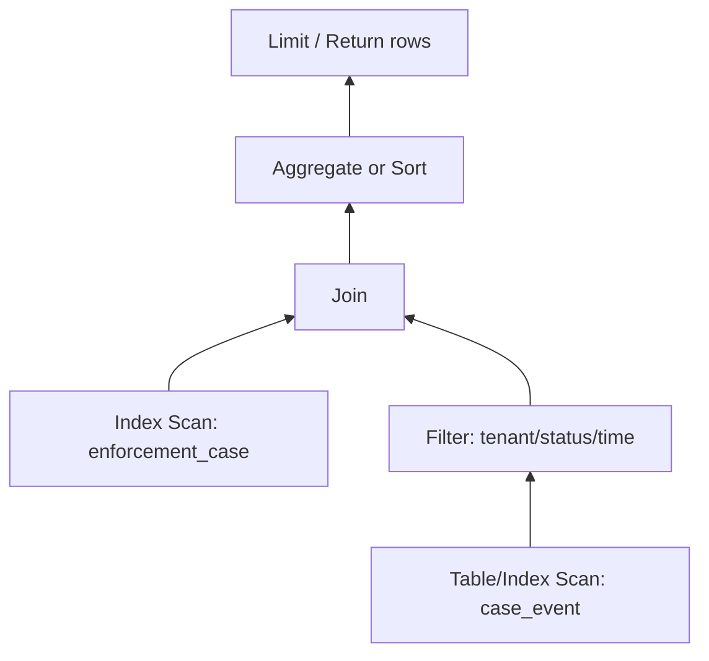
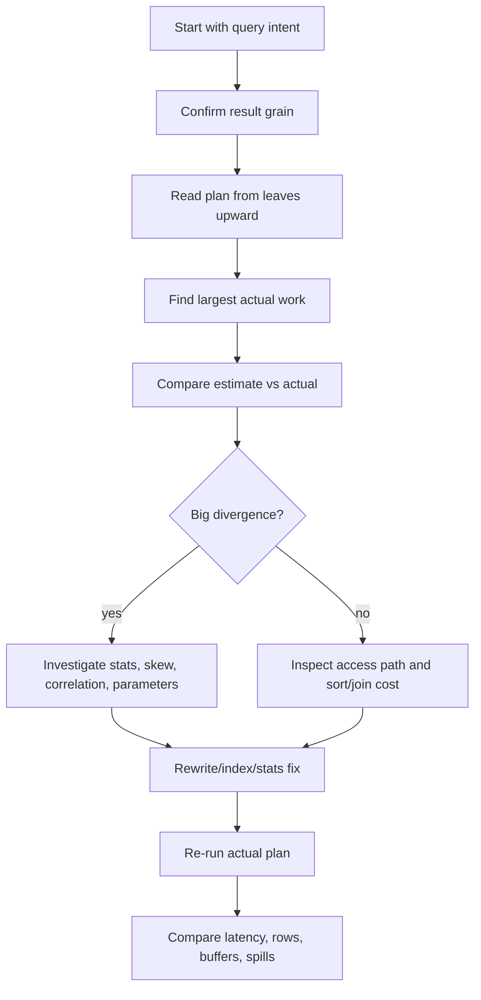

# Part 016 — Query Plans, EXPLAIN, and Optimizer Literacy

## 1. Why This Part Exists

A slow query is not a mystery. It is a physical execution problem.

The mistake most engineers make is debugging SQL from the text alone:

```sql
select ...
from ...
where ...
join ...
order by ...
```

But the database does not execute your SQL in the visual order you wrote it.

It parses the statement, resolves names and types, rewrites parts of the query, estimates alternative strategies, selects a plan, and executes physical operators.

The plan is where your query becomes work.

A top-tier engineer can read a query plan and answer:

- Where is the database spending time?
- Which table access is too broad?
- Which join multiplied rows unexpectedly?
- Which predicate was not pushed down?
- Which estimate is wrong?
- Which sort/hash spilled or consumed memory?
- Which index is being used only partially?
- Which query rewrite would reduce work before it happens?
- Which performance problem is actually a correctness or modelling problem?

This part teaches query plan literacy.

---

## 2. The Core Mental Model

A query plan is a tree of physical operators.

Each operator consumes rows from child operators and produces rows for its parent.



Read the plan as data flow, usually from leaves upward.

The top node returns the final result. The lower nodes do the raw work.

The important idea:

> A query plan is not just a performance report. It is the optimizer's explanation of how it intends to satisfy relational semantics with physical operations.

---

## 3. EXPLAIN vs Actual Execution

Most engines provide two levels of plan inspection.

### 3.1 Estimated Plan

An estimated plan shows what the optimizer expects to happen.

It is based on:

- SQL text,
- schema,
- indexes,
- constraints,
- statistics,
- parameters or parameter assumptions,
- cost model,
- available transformations.

It does not prove what happened at runtime.

### 3.2 Actual Plan

An actual plan executes the query and reports runtime behavior.

Depending on engine, this may include:

- actual rows,
- actual loops,
- actual timing,
- buffer reads/hits,
- memory usage,
- spills,
- rows removed by filter,
- planning time,
- execution time.

In PostgreSQL, `EXPLAIN` shows the plan and `EXPLAIN ANALYZE` executes the statement and reports actual runtime details. In SQL Server, actual execution plans show runtime execution details for the operators. MySQL `EXPLAIN` shows optimizer plan information, and newer MySQL versions also support runtime-oriented analysis features.

Use estimated plans to reason before execution. Use actual plans to debug reality.

Be careful:

```sql
explain analyze
update account
set balance = balance - 100
where id = 1;
```

Actual analysis executes the statement. Use transactions, rollback, staging, or read-only replicas appropriately.

---

## 4. Anatomy of a Plan Node

A plan node usually tells you several things.

| Concept | Meaning |
|---|---|
| Operator type | Scan, seek, join, sort, aggregate, materialize, limit, etc. |
| Estimated rows | Optimizer's expected output cardinality |
| Actual rows | Runtime output cardinality |
| Startup cost | Cost before first row can be produced |
| Total cost | Cost to produce all rows |
| Loops | Number of times the node executed |
| Predicate | Condition applied at that node |
| Index condition / seek predicate | Condition used to navigate index |
| Residual filter | Condition evaluated after fetching candidate rows |
| Row width | Estimated average row size |
| Buffers / reads | Page/cache behavior, engine-dependent |
| Memory / spill | Whether sort/hash exceeded memory, engine-dependent |

Do not memorize one engine's formatting only. Learn the operator concepts.

---

## 5. The Most Important Plan Skill: Estimate vs Actual

Cost-based optimizers depend heavily on cardinality estimates.

Cardinality means “how many rows”.

If the optimizer expects 10 rows and gets 10 million, the chosen plan can be catastrophically wrong.

Example failure:

```text
Nested Loop
  estimated rows: 10
  actual rows:    4,800,000
```

The nested loop may have been reasonable for 10 rows. It is disastrous for millions.

Plan diagnosis often starts with this question:

> Where does estimated row count first diverge sharply from actual row count?

That node is often near the root cause.

Common causes:

- stale statistics,
- skewed data,
- correlated predicates,
- missing multi-column statistics,
- non-sargable predicates,
- functions hiding distribution,
- parameter-sensitive plans,
- insufficient constraints,
- table variables or temporary objects without good stats,
- JSON/semi-structured predicates the optimizer cannot estimate well.

Part 017 goes deep into statistics and cardinality failure. This part teaches you how to spot the symptom.

---

## 6. Scan Operators

### 6.1 Sequential / Table Scan

The engine reads the table broadly.

Possible interpretation:

- no useful index,
- predicate not selective,
- table small,
- many rows needed,
- index lookup would cause too much random I/O,
- statistics estimate scan is cheaper,
- query is analytical by nature.

Do not panic just because you see a scan.

Ask:

- How many rows are in the table?
- How many rows qualify?
- Is the predicate sargable?
- Is this query expected to read most rows?
- Is the scan parallel?
- Is it reading from cache or disk?
- Is it under a nested loop and repeated many times?

A scan once may be fine. A scan repeated 100,000 times under a loop is usually not.

### 6.2 Index Seek / Range Scan

The engine navigates to a key or range.

Good sign when:

- predicate is selective,
- index condition matches the query,
- row count is close to expectation,
- table lookups are limited,
- ordering is satisfied.

But an index seek can still be bad.

Example:

```text
Index Seek on idx_order_customer
actual rows per loop: 1,000
loops: 50,000
```

That is 50 million rows. The operator name sounds good. The work is not.

### 6.3 Index Scan

The engine scans the index.

This can be useful when:

- index is narrower than table,
- index order avoids sort,
- query is covering,
- full ordered traversal is needed.

But it may also mean the predicate could not seek into the index.

Look for residual filters.

### 6.4 Index-Only / Covering Plan

The engine returns data from the index without fetching full table rows, or with fewer table lookups depending on engine visibility rules.

Good for hot list and lookup queries with narrow projections.

Bad when engineers over-cover every query and create massive indexes.

Questions:

- Is the query projection intentionally narrow?
- Are included columns stable or frequently updated?
- Is this worth write amplification?
- Does the engine still need heap/table visibility checks?
- Does the plan show many table lookups anyway?

### 6.5 Bitmap Scan

Bitmap plans often appear when multiple predicates are selective enough to combine or when many row locations are collected before table access.

They can be excellent for medium-selectivity predicates.

But if the bitmap becomes huge, it may degrade into broad table access.

Check actual rows and buffers.

---

## 7. Join Operators

Joins are where many SQL performance failures become explosive.

### 7.1 Nested Loop Join

Mental model:

```text
for each row from outer input:
    find matching rows from inner input
```

Good when:

- outer input is small,
- inner lookup is indexed,
- each lookup returns few rows,
- low startup latency matters,
- top-N query can stop early.

Bad when:

- outer input is large,
- inner side lacks useful index,
- estimates undercount outer rows,
- residual predicates filter late,
- loop count is huge.

Diagnostic:

```text
Nested Loop
  outer actual rows: 250,000
  inner loops: 250,000
```

Ask whether the inner operation is cheap enough to repeat 250,000 times.

### 7.2 Hash Join

Mental model:

1. Build hash table from one input.
2. Probe it with rows from the other input.

Good when:

- joining large unsorted inputs,
- equality join exists,
- memory is sufficient,
- no useful ordering/index exists for merge/nested loop.

Bad when:

- build side is much larger than estimated,
- hash table spills to disk,
- join condition is not equality,
- memory grant is too small,
- row width is unnecessarily large.

Diagnostic:

- build side cardinality,
- memory usage,
- spill/batch count,
- actual vs estimated rows.

### 7.3 Merge Join

Mental model:

1. Inputs are sorted by join key.
2. Engine walks both ordered streams.

Good when:

- both inputs are already sorted by index,
- result order is useful,
- large equality/range-compatible joins exist,
- sorting cost is acceptable.

Bad when:

- engine must sort huge inputs first,
- join key order does not match indexes,
- row estimates are wrong.

Merge join is often excellent in reporting or reconciliation queries when indexes support order.

---

## 8. Aggregation Operators

Aggregation changes grain.

Plan operators reveal how.

### 8.1 Hash Aggregate

The engine builds hash groups.

Good when:

- input is not sorted,
- group count fits memory,
- grouping keys are hashable,
- output order does not matter.

Bad when:

- group count is underestimated,
- memory spills,
- row width is large,
- grouping expression is expensive.

### 8.2 Sort / Group Aggregate

The engine sorts by group keys, then streams groups.

Good when:

- input is already ordered,
- index order supports grouping,
- output order matches grouping,
- memory is sufficient.

Bad when:

- massive sort spills,
- sorting happens after unnecessary wide projection,
- grouping after join explosion.

### 8.3 Aggregation After Join Explosion

Bad pattern:

```sql
select c.status, count(*)
from enforcement_case c
join case_event e on e.case_id = c.id
group by c.status;
```

If each case has many events, count is inflated.

Maybe intended:

```sql
select c.status, count(*)
from enforcement_case c
where exists (
  select 1
  from case_event e
  where e.case_id = c.id
)
group by c.status;
```

The plan may show huge join rows before aggregation. That is not only performance issue. It may be metric correctness issue.

---

## 9. Sort, Limit, and Top-N

`ORDER BY` can dominate query cost.

Example:

```sql
select id, created_at
from event_log
where tenant_id = ?
order by created_at desc
fetch first 50 rows only;
```

With index:

```sql
create index idx_event_tenant_created
on event_log (tenant_id, created_at desc);
```

The engine may retrieve rows already ordered and stop early.

Without index, it may:

1. scan many tenant rows,
2. sort them,
3. return 50.

Plan clues:

- explicit sort node,
- sort method,
- memory usage,
- disk spill,
- top-N sort,
- rows entering sort,
- whether index order satisfies order.

A `LIMIT 50` does not guarantee the engine reads only 50 rows. It can only stop early if the access path produces rows in useful order and filters are aligned.

---

## 10. Filter Pushdown and Residual Predicates

A predicate can be applied early or late.

Early filtering reduces work.

Late filtering wastes work.

Example:

```sql
select *
from event_log
where tenant_id = ?
  and date(occurred_at) = date '2026-07-01';
```

If the plan uses only `tenant_id` as index condition and applies `date(occurred_at)` as residual filter, it may read all tenant rows and discard most.

Rewrite:

```sql
select *
from event_log
where tenant_id = ?
  and occurred_at >= timestamp '2026-07-01 00:00:00'
  and occurred_at <  timestamp '2026-07-02 00:00:00';
```

Now both tenant and time range can become access predicates.

Plan literacy means distinguishing:

- access predicate,
- join predicate,
- filter predicate,
- pushed-down predicate,
- residual predicate.

Operator names alone are not enough.

---

## 11. Plan Reading Methodology

Use a repeatable method.



Step by step:

1. State the intended result grain.
2. Identify the driving table or starting subset.
3. Read leaf scans first.
4. Check which predicates are access conditions vs filters.
5. Compare estimated and actual rows at every major node.
6. Find the first large divergence.
7. Inspect join order and join strategy.
8. Inspect sorts and aggregates.
9. Inspect loops.
10. Inspect buffers, reads, spills, and memory if available.
11. Rewrite or index based on root cause.
12. Re-test with representative parameters.

Do not jump straight to adding indexes.

---

## 12. Example: Slow Worklist Query

Schema:

```sql
create table enforcement_case (
  id               bigint primary key,
  tenant_id        bigint not null,
  status           text not null,
  assigned_to      bigint,
  statutory_due_at timestamp not null,
  risk_score       numeric(10,4) not null,
  deleted_at       timestamp
);
```

Query:

```sql
select id, status, statutory_due_at, risk_score
from enforcement_case
where tenant_id = :tenant_id
  and assigned_to = :user_id
  and status in ('OPEN', 'IN_REVIEW', 'ESCALATED')
  and deleted_at is null
order by statutory_due_at asc, risk_score desc, id asc
fetch first 50 rows only;
```

Bad plan shape:

```text
Seq Scan on enforcement_case
  Filter: tenant_id = ? and assigned_to = ? and status in (...) and deleted_at is null
Sort
  Sort Key: statutory_due_at, risk_score desc, id
Limit
```

Interpretation:

- The engine scans too many cases.
- Filtering happens after reading table rows.
- Sorting happens after filtering.
- `LIMIT 50` does not help until after sort.

Candidate index:

```sql
create index idx_case_worklist
on enforcement_case (
  tenant_id,
  assigned_to,
  status,
  statutory_due_at asc,
  risk_score desc,
  id asc
)
where deleted_at is null;
```

Expected improved shape:

```text
Index Scan using idx_case_worklist
  Index condition: tenant_id = ? and assigned_to = ? and status = any (...)
  Order: statutory_due_at asc, risk_score desc, id asc
Limit
```

But check actual plan.

If `status in (...)` breaks ordering or creates multiple ranges, engine behavior may differ. It may still sort. A different index or query decomposition may be better.

Plan literacy prevents magical thinking.

---

## 13. Example: Join Explosion

Query:

```sql
select c.id, c.status, e.event_type
from enforcement_case c
join case_event e on e.case_id = c.id
where c.tenant_id = ?
  and c.status = 'OPEN'
  and e.occurred_at >= ?;
```

Potential bad plan:

```text
Hash Join
  Seq Scan enforcement_case
    Filter: tenant_id = ? and status = 'OPEN'
  Seq Scan case_event
    Filter: occurred_at >= ?
```

Maybe acceptable if both filters are broad and query is analytical.

For OLTP, better indexes may be:

```sql
create index idx_case_tenant_status_id
on enforcement_case (tenant_id, status, id);

create index idx_event_case_occurred
on case_event (case_id, occurred_at);
```

But if `occurred_at >= ?` is highly selective, a different event index may be better:

```sql
create index idx_event_occurred_case
on case_event (occurred_at, case_id);
```

The best driving table depends on selectivity:

| Selective condition | Likely better starting point |
|---|---|
| Few open cases in tenant | `enforcement_case` first |
| Few recent events globally | `case_event` first |
| Both broad | hash/merge strategy or pre-aggregation |
| Need latest events only | ordered index and limit-aware design |

Never design join indexes without asking which side should drive the join.

---

## 14. Example: Aggregation Over Too Many Rows

Query:

```sql
select tenant_id, status, count(*)
from enforcement_case
where deleted_at is null
group by tenant_id, status;
```

Plan may scan active cases and aggregate.

If this runs occasionally for admin reporting, that may be fine.

If it runs every second for dashboards, the query design is wrong.

Options:

- partial index on active rows,
- materialized summary table,
- incremental counter table,
- event-driven projection,
- cache with invalidation,
- dashboard-specific read model.

Plan literacy tells you when indexing is insufficient because the query's workload class is wrong.

---

## 15. Cost Is Not Time

Plan cost is optimizer-internal. It is not milliseconds.

Cost helps compare alternatives inside the optimizer's model. It depends on engine-specific assumptions about CPU, I/O, memory, row width, statistics, and operator behavior.

Do not say:

> Cost 500 means 500 ms.

Say:

> The optimizer estimates this plan as cheaper than alternatives under its cost model. We need actual runtime metrics to confirm.

Actual timing also has noise:

- cache warmness,
- concurrent workload,
- locks,
- CPU scheduling,
- I/O queueing,
- network transfer,
- result materialization,
- client fetch size,
- parameter values.

Use multiple measurements. Compare plans under representative conditions.

---

## 16. The Optimizer's Inputs

A cost-based optimizer typically uses:

- query text,
- normalized/re-written query tree,
- table definitions,
- indexes,
- constraints,
- statistics,
- estimated row counts,
- estimated row widths,
- available join algorithms,
- available memory assumptions,
- engine settings,
- parameter values or parameter placeholders,
- partition metadata,
- parallelism options.

If these inputs are wrong or incomplete, the plan may be bad.

Examples:

| Missing/wrong input | Possible symptom |
|---|---|
| Missing index | Broad scan, expensive sort |
| Stale stats | Estimate/actual divergence |
| Missing FK/unique constraint | Optimizer cannot infer cardinality |
| Wrapped column | Predicate not pushed into index |
| Skewed tenant | Plan good for average tenant, bad for large tenant |
| Parameter-sensitive workload | One cached/generic plan bad for some values |
| Wide projection | Sort/hash memory pressure |
| Missing partial predicate | Partial index ignored |

This is why query tuning is not only query rewriting. It is metadata engineering.

---

## 17. Parameter-Sensitive Plans

A query may be fast for one parameter and slow for another.

Example:

```sql
where tenant_id = :tenant_id
  and status = 'OPEN'
```

Tenant A has 100 open cases. Tenant B has 50 million open cases.

The same SQL shape may need different plans.

Possible symptoms:

- plan works after restart but degrades later,
- first executed parameter influences cached plan,
- generic prepared plan ignores selective values,
- dev/test tenant looks fine,
- one large tenant dominates incident reports.

Possible mitigations:

- representative statistics,
- extended/multi-column statistics,
- query specialization,
- partitioning or tenant isolation,
- plan cache strategy,
- targeted hints as last resort,
- different access path for large tenants,
- separate operational workflow for whale tenants.

Do not treat parameter sensitivity as random database behavior. It is a mismatch between one plan and multiple data distributions.

---

## 18. Plan Instability

A query can change plans after:

- statistics refresh,
- index creation/drop,
- engine upgrade,
- data growth,
- distribution shift,
- parameter value change,
- configuration change,
- partition rollover,
- vacuum/analyze/purge behavior,
- constraint addition/removal,
- query text change,
- prepared statement behavior change.

Plan instability is not always bad. Sometimes the optimizer adapts.

It becomes a problem when critical queries cross latency or resource boundaries unpredictably.

Mitigation strategy:

- capture baseline plans for critical queries,
- monitor latency distribution, not only averages,
- track row estimates vs actual where possible,
- test migrations with representative data,
- evaluate engine upgrades with workload replay,
- avoid brittle hints unless documented,
- keep query shapes stable for hot paths,
- use regression tests for known critical plans.

---

## 19. Engine-Specific Plan Notes

### 19.1 PostgreSQL

Useful tools:

```sql
explain select ...;
explain analyze select ...;
explain (analyze, buffers) select ...;
explain (analyze, buffers, verbose) select ...;
```

Important ideas:

- `cost=..` is estimated cost,
- `rows=..` is estimated rows,
- `actual time=.. rows=.. loops=..` appears with `ANALYZE`,
- `BUFFERS` can show cache/page behavior,
- `Rows Removed by Filter` highlights residual filtering,
- `Index Cond` differs from `Filter`,
- `Heap Fetches` matters for index-only scans,
- planning time and execution time are separate.

### 19.2 MySQL

Useful tools:

```sql
explain select ...;
explain format=json select ...;
explain analyze select ...;
```

Important ideas:

- table access type matters,
- possible keys vs chosen key matters,
- key length can reveal partial index usage,
- rows estimate matters,
- filtered percentage matters,
- `Extra` can show filesort, temporary table, index condition, covering access, etc.

### 19.3 SQL Server

Useful tools:

- estimated execution plan,
- actual execution plan,
- `SET STATISTICS IO ON`,
- `SET STATISTICS TIME ON`,
- Query Store,
- DMVs for plan cache and runtime stats.

Important ideas:

- seek predicate vs residual predicate matters,
- estimated vs actual rows matters,
- key lookup can dominate,
- memory grant and spills matter,
- parameter sniffing can matter,
- missing index suggestions are suggestions, not design decisions.

Vendor-specific operators differ. The diagnostic discipline is similar.

---

## 20. Common Plan Reading Mistakes

### 20.1 Looking Only at the Top Node

The top node may show high total time because it includes child work.

Read the whole tree.

### 20.2 Assuming Index Seek Means Fast

A seek repeated millions of times can be slower than a scan.

Check loops and rows.

### 20.3 Assuming Sequential Scan Means Bad

A scan can be optimal for broad reads.

Check selectivity and table size.

### 20.4 Ignoring Row Width

Wide rows make sorts, hashes, network transfer, and memory grants worse.

Project only needed columns.

Bad:

```sql
select *
from event_log
where tenant_id = ?
order by occurred_at desc
fetch first 50 rows only;
```

Better:

```sql
select id, occurred_at, event_type
from event_log
where tenant_id = ?
order by occurred_at desc
fetch first 50 rows only;
```

### 20.5 Ignoring Sorts

Many “filter” problems are actually sort problems.

If the query filters 1 million rows and sorts them to return 50, index order may matter more than predicate selectivity.

### 20.6 Trusting Missing Index Suggestions Blindly

Engines may suggest indexes based on one query fragment, not full workload cost.

Always evaluate:

- overlap with existing indexes,
- composite order,
- write cost,
- coverage need,
- filtered index possibility,
- invariant value,
- workload frequency.

### 20.7 Testing on Tiny Data

The optimizer may choose different plans on tiny tables.

A query can look fine in development and fail in production because:

- table size differs,
- tenant skew differs,
- statistics differ,
- cache behavior differs,
- concurrency differs,
- parameter values differ.

---

## 21. Query Rewrite Patterns From Plan Symptoms

| Plan symptom | Possible root cause | Possible fix |
|---|---|---|
| Broad scan with function filter | Non-sargable predicate | Rewrite range or add expression/generated index |
| Sort before limit | Missing ordered access path | Composite index matching filter + order |
| Nested loop with huge loops | Underestimated outer rows or missing inner index | Fix stats/index or force better join shape via rewrite |
| Hash join spill | Build side larger/wider than expected | Reduce projection, update stats, increase memory, pre-filter |
| Join rows explode | Wrong relationship grain | Semi-join, pre-aggregate, dedupe, fix join predicate |
| Index used but many rows filtered | Residual predicate too broad | Move predicate into index condition or redesign index |
| Key lookup dominates | Non-covering index for frequent lookup | Cover selected columns or change projection |
| Plan varies by parameter | Parameter-sensitive distribution | Query specialization, stats, partitioning, plan strategy |
| Partial index ignored | Query does not imply predicate | Add predicate or use non-partial index |
| Bitmap/scan unexpected | Composite index missing or predicates medium selective | Compare composite vs bitmap strategy |

---

## 22. Operational Debugging Workflow

During an incident, do not freestyle.

Use this workflow:

1. Capture the exact SQL shape.
2. Capture parameter values or representative parameter class.
3. Capture actual plan if safe.
4. Capture row counts and table sizes.
5. Check whether this is new query, new data, new plan, or new concurrency.
6. Identify the dominant operator.
7. Identify the first estimate/actual divergence.
8. Check access predicates vs residual filters.
9. Check join order and join strategy.
10. Check sort/hash memory and spill.
11. Check locks/waits separately if query appears blocked.
12. Apply the smallest safe mitigation.
13. Document root cause and permanent fix.

Possible mitigations:

- add missing predicate,
- rewrite non-sargable expression,
- create index concurrently/online where supported,
- update statistics,
- temporarily disable expensive feature path,
- reduce result set/page size,
- split query,
- use read replica,
- queue/retry workload,
- last-resort hint or plan forcing.

Do not create three indexes during an incident unless you know which operator each index fixes.

---

## 23. Plan Literacy for Reviews

During code review, ask:

- What is the intended result grain?
- Is `select *` necessary?
- Are tenant/security predicates included?
- Are predicates sargable?
- Does `ORDER BY` have an index path?
- Is pagination stable?
- Is join cardinality controlled?
- Is aggregation performed after unnecessary join expansion?
- Does the query rely on `DISTINCT` to hide duplicates?
- What is expected row count now and at 10x growth?
- Which index supports this query?
- Has the plan been checked on representative data?

This is how SQL performance becomes an engineering discipline, not a DBA afterthought.

---

## 24. Practice Lab

Use this query:

```sql
select c.id, c.external_ref, c.status, c.statutory_due_at,
       count(e.id) as event_count
from enforcement_case c
left join case_event e
  on e.case_id = c.id
 and e.tenant_id = c.tenant_id
where c.tenant_id = :tenant_id
  and c.assigned_to = :user_id
  and c.status in ('OPEN', 'IN_REVIEW', 'ESCALATED')
  and c.deleted_at is null
  and c.statutory_due_at < :cutoff
  and date(c.last_activity_at) = date :activity_day
group by c.id, c.external_ref, c.status, c.statutory_due_at
order by c.statutory_due_at asc, c.id asc
fetch first 50 rows only;
```

### Task 1 — Identify Non-Sargable Predicate

Problem:

```sql
and date(c.last_activity_at) = date :activity_day
```

Rewrite:

```sql
and c.last_activity_at >= :activity_day_start
and c.last_activity_at <  :activity_day_end
```

### Task 2 — Identify Grain Risk

The query joins events before limiting cases. If cases have many events, the join can multiply rows before aggregation.

Alternative:

```sql
with selected_cases as (
  select c.id, c.tenant_id, c.external_ref, c.status, c.statutory_due_at
  from enforcement_case c
  where c.tenant_id = :tenant_id
    and c.assigned_to = :user_id
    and c.status in ('OPEN', 'IN_REVIEW', 'ESCALATED')
    and c.deleted_at is null
    and c.statutory_due_at < :cutoff
    and c.last_activity_at >= :activity_day_start
    and c.last_activity_at <  :activity_day_end
  order by c.statutory_due_at asc, c.id asc
  fetch first 50 rows only
)
select sc.id, sc.external_ref, sc.status, sc.statutory_due_at,
       count(e.id) as event_count
from selected_cases sc
left join case_event e
  on e.case_id = sc.id
 and e.tenant_id = sc.tenant_id
group by sc.id, sc.external_ref, sc.status, sc.statutory_due_at
order by sc.statutory_due_at asc, sc.id asc;
```

Now the query limits cases before counting events.

### Task 3 — Candidate Indexes

For selected cases:

```sql
create index idx_case_review_worklist
on enforcement_case (
  tenant_id,
  assigned_to,
  status,
  statutory_due_at asc,
  id asc
)
where deleted_at is null;
```

But because `last_activity_at` is also filtered as a range, test whether this alternative is better:

```sql
create index idx_case_review_activity
on enforcement_case (
  tenant_id,
  assigned_to,
  status,
  last_activity_at,
  statutory_due_at asc,
  id asc
)
where deleted_at is null;
```

For event count:

```sql
create index idx_event_tenant_case
on case_event (tenant_id, case_id);
```

### Task 4 — Plan Questions

After running actual plan, answer:

- Did the case query use a partial index?
- Was `last_activity_at` an index condition or residual filter?
- Did a sort remain before limit?
- How many cases were read before returning 50?
- How many event rows were read per selected case?
- Was the join executed before or after limiting cases?
- Were estimates close to actuals?
- Did any node spill?
- Did a key lookup dominate?

---

## 25. What You Should Now Be Able To Do

You should now be able to:

- read query plans as physical operator trees,
- distinguish estimated from actual behavior,
- compare estimated and actual cardinality,
- identify scan, seek, bitmap, covering, sort, join, and aggregate operators,
- diagnose nested loop, hash join, and merge join trade-offs,
- understand why cost is not time,
- spot residual predicate and non-sargability symptoms,
- identify join explosion and aggregation grain problems,
- detect parameter-sensitive plan risk,
- use a repeatable workflow for performance debugging.

The next part goes deeper into the root cause behind many bad plans: cardinality, statistics, and cost model failures.

---

## 26. References

- PostgreSQL Documentation — Using `EXPLAIN`: https://www.postgresql.org/docs/current/using-explain.html
- PostgreSQL Documentation — `EXPLAIN`: https://www.postgresql.org/docs/current/sql-explain.html
- PostgreSQL Documentation — Index-Only Scans and Covering Indexes: https://www.postgresql.org/docs/current/indexes-index-only-scans.html
- MySQL Reference Manual — `EXPLAIN` Statement: https://dev.mysql.com/doc/refman/8.0/en/explain.html
- MySQL Reference Manual — EXPLAIN Output Format: https://dev.mysql.com/doc/en/explain-output.html
- MySQL 8.4 Reference Manual — Optimization: https://docs.oracle.com/cd/E17952_01/mysql-8.4-en/optimization.html
- SQL Server Documentation — Execution Plan Overview: https://learn.microsoft.com/en-us/sql/relational-databases/performance/execution-plans
- SQL Server Documentation — Query Processing Architecture Guide: https://learn.microsoft.com/en-us/sql/relational-databases/query-processing-architecture-guide
- SQL Server Documentation — Display an Actual Execution Plan: https://learn.microsoft.com/en-us/sql/relational-databases/performance/display-an-actual-execution-plan
- SQL Server Documentation — Showplan Logical and Physical Operators Reference: https://learn.microsoft.com/en-us/sql/relational-databases/showplan-logical-and-physical-operators-reference
