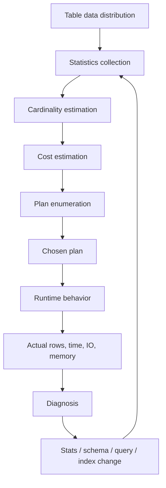
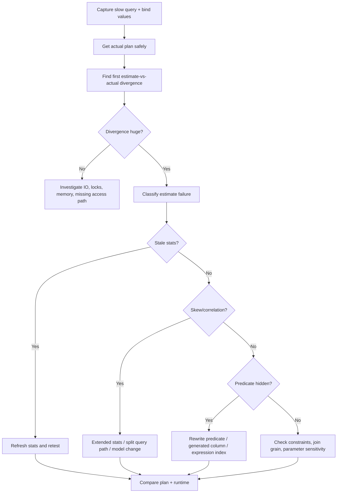

# Part 017 — Cardinality, Statistics, and Cost Model Failures

## 1. Why This Part Exists

Part 016 taught us to read execution plans.

This part explains why the optimizer chooses a plan that looks obviously wrong after the query has already run.

The answer is usually not "the optimizer is stupid".

The answer is usually:

> The optimizer optimized for a data distribution that it believed existed.

The database does not know your business domain unless you encode it. It does not automatically know that:

- `country = 'ID'` strongly influences available `province_code` values.
- `status = 'OPEN'` is rare in an archive table but common in a hot workflow table.
- one tenant has 40% of the data while most tenants have only thousands of rows.
- `assigned_officer_id` is heavily skewed because one system user owns bulk migrated cases.
- `deleted_at is null` selects 99.8% of rows in one table but only 18% in another.
- date ranges overlap in a way that a simple histogram cannot model.
- a parameter value used for one execution is not representative of the next execution.

The optimizer has statistics. Statistics are compressed summaries. Compressed summaries lose information. When the lost information matters, the optimizer can misestimate row counts, choose the wrong join order, pick the wrong join algorithm, request the wrong memory, miss an index opportunity, or reuse a bad cached plan.

A top-tier engineer must be able to diagnose this chain:

```text
business data shape
  -> stored statistics
  -> cardinality estimates
  -> cost estimates
  -> chosen plan
  -> runtime behavior
  -> production symptom
```

This is the difference between randomly adding indexes and doing database engineering.

---

## 2. Kaufman Framing: The Sub-Skill We Are Training

In Kaufman's rapid skill acquisition model, we deconstruct the larger skill into small trainable parts. For this part, the sub-skill is:

> Given a slow or unstable query, identify whether the root cause is wrong cardinality estimation, stale statistics, data skew, correlation, parameter sensitivity, or a genuine lack of access path.

We are not trying to become database engine authors in one sitting.

We are training enough optimizer literacy to make correct production decisions:

- when to update statistics;
- when to create extended or multi-column statistics;
- when to rewrite predicates;
- when to add an index;
- when to split query paths;
- when to materialize an intermediate result;
- when to remove abstraction that hides selectivity;
- when to escalate to database-specific plan tooling.

The immediate feedback loop is `EXPLAIN`, `EXPLAIN ANALYZE`, actual runtime metrics, and estimate-vs-actual comparison.

---

## 3. The Core Mental Model

A cost-based optimizer needs two big inputs:

1. **Cardinality estimates**: how many rows each operator is expected to process or return.
2. **Cost model**: how expensive alternative plans are expected to be.

Cardinality is upstream of cost.

If cardinality is badly wrong, the cost comparison is built on bad inputs.



Important principle:

> The optimizer does not choose the globally best real plan. It chooses the lowest-cost plan according to its model and available information.

That statement is not criticism. It is how cost-based optimization works.

---

## 4. Vocabulary You Must Internalize

### 4.1 Cardinality

Cardinality means row count.

Examples:

```text
Table cardinality:     enforcement_case has 50,000,000 rows
Filter cardinality:    status = 'OPEN' returns 430,000 rows
Join cardinality:      case join event returns 800,000,000 rows
Group cardinality:     group by tenant_id returns 830 tenants
```

In plans, you usually compare:

```text
estimated rows vs actual rows
```

If a node estimates 10 rows and returns 3,000,000 rows, the optimizer likely chose downstream operators under false assumptions.

### 4.2 Selectivity

Selectivity is the fraction of rows that pass a predicate.

```text
selectivity = returned_rows / table_rows
```

If a table has 100,000,000 rows and a predicate returns 1,000 rows, selectivity is 0.001%.

High selectivity usually means the predicate is narrow and an index may help.

Low selectivity means the predicate returns a large fraction of the table. A full scan may be cheaper than bouncing through an index.

Be careful with terminology: some engineers say "highly selective" to mean "returns few rows". That is common informal usage. In this series, we use:

```text
narrow predicate = returns few rows
broad predicate  = returns many rows
```

That avoids ambiguity.

### 4.3 Distinct Values

Distinct value count matters for equality predicates.

If `status` has 5 possible values, `status = 'OPEN'` might naively be estimated as one fifth of the table. But if real distribution is skewed, that estimate is wrong.

```text
OPEN       0.7%
CLOSED    88.0%
REJECTED   4.1%
ESCALATED  0.2%
DRAFT      7.0%
```

A uniform estimate would be bad.

### 4.4 Histogram

A histogram approximates value distribution. It helps the optimizer estimate range predicates such as:

```sql
where created_at >= timestamp '2026-01-01'
  and created_at <  timestamp '2026-02-01'
```

Histograms are useful but imperfect. They compress reality into buckets. If important values are hidden inside a bucket, estimates can still be wrong.

### 4.5 Most Common Values

Many engines track frequent values separately.

This matters when data is skewed:

```text
tenant_id = 1001 -> 40,000,000 rows
tenant_id = 2033 ->     20,000 rows
tenant_id = 9007 ->        500 rows
```

A plan that is good for tenant `9007` may be terrible for tenant `1001`.

### 4.6 Null Fraction

`NULL` distribution matters because predicates involving `NULL` are not normal equality comparisons.

```sql
where closed_at is null
```

If 99.8% of active workflow rows have `closed_at is null`, this predicate is broad. If 0.3% of historical rows have `closed_at is null`, it is narrow.

Same predicate. Different table shape. Different plan.

### 4.7 Correlation

Correlation means one column gives information about another column.

Examples:

```text
country_code -> province_code
case_type    -> allowed status set
status       -> closed_at nullability
created_at   -> partition or physical locality
```

The optimizer may assume predicates are independent unless statistics or constraints tell it otherwise.

That can cause severe underestimation.

Example:

```sql
where status = 'CLOSED'
  and closed_at is not null
```

Those predicates are correlated. If the optimizer treats them as independent, it may multiply selectivities incorrectly.

### 4.8 Density

Density describes how values are distributed over distinct values. In SQL Server discussions, density is often used with statistics to reason about equality estimates.

Low density usually means many distinct values. High density usually means fewer distinct values or repeated values.

The practical question is:

> How many rows should equality on this value return?

---

## 5. Statistics Are Not Data

Statistics are summaries.

They are cheaper to store and process than full data, but they are lossy.

The optimizer often knows approximations such as:

- approximate row count;
- number of pages;
- null fraction;
- distinct count;
- most common values;
- histogram buckets;
- correlation with physical order;
- sometimes multi-column dependency or distinctness information.

It usually does not know arbitrary business rules unless they are visible through:

- constraints;
- indexes;
- statistics;
- query predicates;
- column definitions;
- partition metadata;
- generated columns;
- foreign keys;
- uniqueness guarantees.

Bad mental model:

> "The database has all the data, so it should know the best plan."

Better mental model:

> "The optimizer chooses a plan using metadata and statistical summaries under time constraints. My schema and query shape determine how much truth the optimizer can see."

---

## 6. Where Cardinality Errors Come From

### 6.1 Stale Statistics

Data changes over time. Statistics must be refreshed.

A table can change in ways that matter:

- bulk import;
- archive job;
- status transition spike;
- tenant onboarding;
- backfill;
- migration;
- data retention purge;
- seasonal traffic;
- incident-generated events;
- failed job causing duplicate rows;
- one-off regulatory campaign.

Example:

```sql
-- PostgreSQL style
analyze enforcement_case;

-- SQL Server style
update statistics dbo.enforcement_case;

-- MySQL style
analyze table enforcement_case;
```

Do not blindly run statistics refresh as a magic ritual. Ask:

- Did data distribution change?
- Did row count change substantially?
- Did skew change?
- Did newly inserted values live outside histogram ranges?
- Did a partition become hot?
- Did the query plan change after refresh?

### 6.2 Independence Assumption

A common estimation simplification is to combine predicate selectivities as if predicates are independent.

Example:

```sql
where country_code = 'ID'
  and province_code = 'DKI'
```

If each predicate is estimated independently:

```text
P(country = ID) * P(province = DKI)
```

But `province_code = 'DKI'` is only meaningful inside Indonesia in this domain. The predicates are not independent.

In a case management platform:

```sql
where status = 'CLOSED'
  and closed_at is not null
```

`status` and `closed_at` are highly correlated.

If the optimizer underestimates the result, it may choose a nested loop plan that looks cheap for 100 rows but explodes for millions.

### 6.3 Data Skew

Data skew means values are unevenly distributed.

Example:

```text
assigned_officer_id
-------------------
system_migration_user: 35,000,000 rows
officer_123:              12,000 rows
officer_456:               8,700 rows
officer_789:                 310 rows
```

A generic plan for:

```sql
where assigned_officer_id = :officer_id
```

may be good for most officers but disastrous for the migration user.

The production smell is:

```text
same query text, same indexes, radically different runtime depending on parameter value
```

### 6.4 Non-Sargable Expressions

If you wrap indexed columns in functions, the optimizer may not be able to use normal statistics or indexes effectively.

```sql
where lower(email) = lower(:email)
```

Better options:

```sql
-- Option 1: normalize on write
where email_normalized = lower(:email)

-- Option 2: expression/function index where supported
create index idx_user_email_lower on app_user (lower(email));
```

The same issue appears with dates:

```sql
-- Bad for normal index on created_at
where date(created_at) = date '2026-07-01'

-- Better
where created_at >= timestamp '2026-07-01 00:00:00'
  and created_at <  timestamp '2026-07-02 00:00:00'
```

### 6.5 Implicit Casts

Implicit casts can hide from engineers but matter to the optimizer.

```sql
where case_id = '12345'
```

If `case_id` is numeric, the engine may cast the literal or the column depending on dialect and type precedence. If the column is cast, index usage can break.

Correct habit:

```sql
where case_id = cast(:case_id as bigint)
```

Even better: bind parameters using the correct application type.

### 6.6 Missing Constraints

Constraints help both correctness and optimization.

If you know a column is unique but do not declare it, the optimizer may estimate joins less accurately.

If you know a relationship is mandatory but leave the foreign key absent, the optimizer may miss relationship information.

Example:

```sql
create table enforcement_case (
    case_id bigint primary key,
    tenant_id bigint not null,
    case_number text not null,
    unique (tenant_id, case_number)
);

create table case_event (
    event_id bigint primary key,
    case_id bigint not null references enforcement_case(case_id),
    event_type text not null,
    occurred_at timestamp not null
);
```

The database can reason better with declared truth than with tribal knowledge.

### 6.7 Range and Overlap Predicates

Temporal overlap is hard to estimate.

```sql
where valid_from < :window_end
  and valid_to   > :window_start
```

This is common in audit, entitlement, assignment, subscription, policy validity, and regulatory lifecycle data.

The two columns are correlated because `valid_to` is constrained by `valid_from`. Single-column histograms often cannot fully model this.

Design options:

- range types where supported;
- exclusion constraints where supported;
- generated duration buckets;
- partitioning by time;
- separate active table for open-ended rows;
- precomputed current-state table;
- query-specific indexes.

### 6.8 OR Predicates

`OR` can mix different selectivity paths.

```sql
where assigned_officer_id = :user_id
   or escalation_owner_id = :user_id
```

A single plan may not be ideal for both predicates.

Sometimes this is clearer and more optimizable:

```sql
select case_id
from enforcement_case
where assigned_officer_id = :user_id

union

select case_id
from enforcement_case
where escalation_owner_id = :user_id;
```

This gives each branch its own access path.

### 6.9 Optional Filters

A common application query pattern:

```sql
where (:status is null or status = :status)
  and (:tenant_id is null or tenant_id = :tenant_id)
  and (:from_date is null or created_at >= :from_date)
```

This is convenient for code but often bad for estimation.

It creates one query text that represents many selectivity profiles:

- all tenants vs one tenant;
- all statuses vs rare status;
- all time vs narrow time range;
- broad search vs exact lookup.

Better strategy for hot paths:

- generate SQL with only active predicates;
- use separate prepared statements for common shapes;
- split search vs dashboard vs exact lookup queries;
- avoid one mega-query for every screen.

### 6.10 Parameter-Sensitive Plans

Plan caching saves planning time. It can also reuse a plan optimized for the wrong parameter distribution.

Example:

```sql
where tenant_id = :tenant_id
  and status = 'OPEN'
```

Tenant `1` may have 40 million rows. Tenant `2008` may have 3,000 rows. A plan that is optimal for one can be terrible for the other.

This problem appears under different names across engines:

- parameter sniffing;
- bind peeking;
- generic vs custom plans;
- adaptive plan behavior;
- parameter-sensitive plan optimization.

The engine-specific details differ, but the engineering question is stable:

> Is this query shape stable across parameter values?

If not, treat it as multiple workload classes, not one query.

---

## 7. How to Diagnose Cardinality Failure

### 7.1 Start with Estimate vs Actual

In PostgreSQL:

```sql
explain (analyze, buffers)
select c.case_id, c.status, max(e.occurred_at) as last_event_at
from enforcement_case c
join case_event e on e.case_id = c.case_id
where c.tenant_id = 42
  and c.status = 'OPEN'
group by c.case_id, c.status
order by last_event_at desc
limit 50;
```

Look for nodes where estimated rows differ drastically from actual rows.

Example smell:

```text
Nested Loop  (cost=... rows=20 ...)
             (actual ... rows=1800000 ...)
```

The first large estimate error is more important than the final slow node. Downstream slowness is often a consequence.

### 7.2 Compare Plan Shapes Across Parameter Values

Run the same query with:

- small tenant;
- large tenant;
- rare status;
- common status;
- narrow date range;
- broad date range;
- active-only predicate;
- archive-heavy predicate.

Create a small table:

| Case | Parameter | Expected Shape | Actual Shape | Estimate Error |
|---|---|---|---|---|
| Small tenant open cases | tenant 2008 | index seek + nested loop | ? | ? |
| Large tenant open cases | tenant 1 | range scan + hash aggregate | ? | ? |
| Closed archive | status CLOSED | partition scan | ? | ? |
| Escalated rare | status ESCALATED | partial index | ? | ? |

This converts vague performance debugging into controlled experiment.

### 7.3 Locate the First Bad Estimate

Do not only inspect the root node.

Work bottom-up:

```text
1. scan nodes
2. filter nodes
3. join nodes
4. aggregate/sort nodes
5. final limit/output nodes
```

Ask at each node:

```text
estimated rows / actual rows = ?
```

If estimate is 100 and actual is 10,000,000, the ratio is 100,000x.

That is not a small variance. That is a different reality.

### 7.4 Distinguish Cardinality Problem from Access Path Problem

Not every slow query is a cardinality problem.

| Symptom | Likely Root Cause |
|---|---|
| estimates close, runtime high | missing index, broad scan, heavy sort, IO, lock wait, memory spill |
| estimates wildly wrong | stats, skew, correlation, parameter sensitivity, stale stats |
| estimates close but wrong join algorithm still chosen | cost model, memory settings, engine-specific optimizer limitation |
| estimates right on scans but wrong after join | join cardinality, missing uniqueness/FK, many-to-many explosion |
| estimates right but actual rows huge | query is genuinely broad; fix requirement or data model |

The goal is not to force index usage. The goal is to understand whether the optimizer is seeing the same problem you are.

---

## 8. Cardinality Error Patterns and Fixes

### 8.1 Pattern: Nested Loop Explosion

Plan smell:

```text
Nested Loop
  -> estimated outer rows: 100
  -> actual outer rows: 1,500,000
  -> inner index lookup repeated 1,500,000 times
```

Typical cause:

- underestimated filter result;
- stale stats;
- correlated predicates;
- generic plan optimized for small parameter;
- missing multi-column stats;
- missing composite index.

Possible fixes:

- update statistics;
- add extended statistics for correlated columns;
- add index matching actual filter shape;
- split large tenant path;
- materialize filtered outer rows;
- rewrite optional filter query;
- add `tenant_id` to index prefix if every query is tenant-scoped.

Example:

```sql
-- Query pattern
where tenant_id = :tenant_id
  and status = 'OPEN'
  and deleted_at is null

-- Better statistics/indexing strategy
create index idx_case_tenant_status_open
on enforcement_case (tenant_id, status, created_at desc)
where deleted_at is null;
```

The index is not a universal fix. It works if the predicate shape is stable and important.

### 8.2 Pattern: Hash Join Spills

Plan smell:

```text
Hash Join
  -> estimated build rows: 50,000
  -> actual build rows: 30,000,000
  -> spill to disk
```

Typical cause:

- underestimated build side;
- stale stats;
- memory grant too small;
- broad predicate hidden behind CTE/view;
- missing filter pushdown;
- many-to-many join explosion.

Possible fixes:

- fix cardinality estimation;
- reduce rows before join;
- pre-aggregate before joining;
- materialize a selective intermediate;
- update statistics;
- add constraints/uniqueness;
- revisit memory settings only after query shape is sane.

### 8.3 Pattern: Sort Bigger Than Expected

Plan smell:

```text
Sort
  -> estimated rows: 10,000
  -> actual rows: 18,000,000
```

Typical causes:

- underestimated filter/join;
- missing index matching `where + order by`;
- pagination after broad join;
- sorting before reducing grain;
- dashboard query asking for too much.

Better query pattern:

```sql
-- First identify candidates in correct order
with candidate_cases as (
    select case_id
    from enforcement_case
    where tenant_id = :tenant_id
      and status = 'OPEN'
    order by priority desc, created_at asc
    fetch first 100 rows only
)
select c.*, a.assignee_name
from candidate_cases cc
join enforcement_case c on c.case_id = cc.case_id
left join assignment a on a.case_id = c.case_id;
```

Reduce first. Decorate later.

### 8.4 Pattern: Correct Index Ignored

An index may be ignored because:

- predicate is broad;
- stats say the predicate is broad;
- function/cast prevents use;
- index column order does not match query;
- `ORDER BY` needs a different ordering;
- select list requires many table lookups;
- index is partial and predicate implication is not visible;
- parameterization hides a partial index condition;
- another plan is genuinely cheaper.

Bad reaction:

```text
Force the index.
```

Better sequence:

```text
1. Verify predicate shape.
2. Verify estimated rows.
3. Verify actual rows.
4. Verify index definition.
5. Verify statistics freshness.
6. Verify parameter values.
7. Verify whether the index would actually reduce work.
```

Hints and forced plans are last-resort operational controls, not first-line design tools.

### 8.5 Pattern: `LIMIT` Misleads the Engineer

Query:

```sql
select *
from case_event
where tenant_id = :tenant_id
order by occurred_at desc
limit 50;
```

This is fast only if the database can find the top 50 cheaply.

Good index:

```sql
create index idx_event_tenant_occurred_desc
on case_event (tenant_id, occurred_at desc);
```

Without that access path, the engine may scan and sort a huge number of rows before returning 50.

`LIMIT` reduces output cardinality. It does not automatically reduce work cardinality.

---

## 9. Extended Statistics and Multi-Column Reality

Some engines support richer statistics for multi-column relationships.

PostgreSQL supports extended statistics objects for cases such as functional dependencies, multi-column distinct counts, and most common value combinations.

Example:

```sql
create statistics st_case_status_closed_at
on status, closed_at
from enforcement_case;

analyze enforcement_case;
```

This can help when predicates are correlated:

```sql
where status = 'CLOSED'
  and closed_at is not null
```

Another example:

```sql
create statistics st_case_tenant_status
on tenant_id, status
from enforcement_case;

analyze enforcement_case;
```

This can help where status distribution varies by tenant.

But extended statistics are not magic.

They help the optimizer estimate better. They do not create physical access paths. If the query still needs to read 40 million rows, better estimates will not make that free.

Mental model:

```text
statistics improve choice
indexes improve access
constraints improve truth
query shape improves visibility
model changes improve reality
```

---

## 10. Constraints as Optimizer Knowledge

A constraint is not only a validation rule. It is declared truth.

Useful truths:

```sql
alter table case_assignment
add constraint uq_one_active_assignment
unique (case_id)
where revoked_at is null;
```

Partial unique indexes are not portable across all engines, but the principle matters:

> If the domain guarantees one active assignment, encode it where the database can enforce or see it.

Other examples:

```sql
alter table case_event
add constraint fk_event_case
foreign key (case_id) references enforcement_case(case_id);

alter table enforcement_case
add constraint ck_case_closed_at
check (
    (status = 'CLOSED' and closed_at is not null)
    or
    (status <> 'CLOSED')
);
```

Be careful with `CHECK` constraints involving `NULL`; SQL three-valued logic means a `CHECK` passes when the condition is not false. Write constraints deliberately.

Constraints reduce ambiguity for humans and sometimes for optimizers. Even when an optimizer does not fully exploit a constraint, the correctness benefit is still primary.

---

## 11. Parameter Sensitivity in Real Applications

Consider a SaaS regulatory platform:

```sql
select c.case_id, c.case_number, c.priority, c.created_at
from enforcement_case c
where c.tenant_id = :tenant_id
  and c.status = :status
  and c.deleted_at is null
order by c.priority desc, c.created_at asc
fetch first 50 rows only;
```

Parameter profiles:

| Profile | tenant_id | status | Expected Rows | Good Plan |
|---|---:|---|---:|---|
| Small tenant open queue | 9007 | OPEN | 120 | index range scan |
| Large tenant open queue | 1001 | OPEN | 3,500,000 | composite queue index, maybe partitioning |
| Large tenant closed archive | 1001 | CLOSED | 45,000,000 | archive/search-specific path |
| Rare escalation | 1001 | ESCALATED | 900 | partial/filtered index |

One query text hides four workloads.

Options:

1. **Separate query shapes** for different screens or workload classes.
2. **Composite indexes** aligned with the common hot path.
3. **Partial/filtered indexes** for rare operational states.
4. **Partitioning** if large tenant/time range creates physical locality needs.
5. **Plan cache controls** where the engine provides safe mechanisms.
6. **Application routing** to different read models for dashboard vs archive search.

The architectural move is to stop pretending one query shape represents one workload.

---

## 12. Case Study: Escalation Dashboard Gone Slow

### 12.1 Initial Query

```sql
select c.case_id,
       c.case_number,
       c.status,
       c.priority,
       max(e.occurred_at) as last_event_at
from enforcement_case c
join case_event e on e.case_id = c.case_id
where c.tenant_id = :tenant_id
  and c.status in ('OPEN', 'ESCALATED')
  and c.deleted_at is null
group by c.case_id, c.case_number, c.status, c.priority
order by c.priority desc, last_event_at asc
fetch first 50 rows only;
```

Symptom:

```text
Usually 200 ms.
Sometimes 45 seconds for one tenant.
```

### 12.2 First Bad Diagnosis

The team adds an index:

```sql
create index idx_event_case_occurred
on case_event (case_id, occurred_at desc);
```

It helps some cases but not the worst tenant.

Why?

The query still joins too many case rows before applying the true dashboard priority.

### 12.3 Plan Investigation

The plan shows:

```text
Filter on enforcement_case estimated 500 rows.
Actual rows 1,800,000.
Nested loop into case_event repeated 1,800,000 times.
```

Root cause:

- tenant is huge;
- `status in ('OPEN', 'ESCALATED')` is not rare for that tenant;
- stats averaged across tenants;
- query computes `max(event)` for too many rows;
- `LIMIT 50` does not help because ordering depends on aggregate.

### 12.4 Better Design

Create a maintained current-state column or table:

```sql
alter table enforcement_case
add column last_event_at timestamp;

create index idx_case_queue_dashboard
on enforcement_case (
    tenant_id,
    status,
    priority desc,
    last_event_at asc
)
where deleted_at is null;
```

Then query:

```sql
select c.case_id,
       c.case_number,
       c.status,
       c.priority,
       c.last_event_at
from enforcement_case c
where c.tenant_id = :tenant_id
  and c.status in ('OPEN', 'ESCALATED')
  and c.deleted_at is null
order by c.priority desc, c.last_event_at asc
fetch first 50 rows only;
```

This is not only an index fix. It is a grain fix.

The original query asked the database to derive current dashboard state from event history on every request. The improved design stores the current operational projection while preserving event history for audit.

This is the kind of trade-off production SQL requires.

---

## 13. Statistics vs Indexes vs Query Rewrite

Use this decision table.

| Problem | First Response | Why |
|---|---|---|
| Estimate wrong because data changed | Refresh statistics | Optimizer's model is stale |
| Estimate wrong because columns correlated | Extended/multi-column stats if supported | Single-column stats lose relationship |
| Estimate right but work broad | Better index or data model | Optimizer knows it is broad but lacks cheap path |
| Query hides predicate behind function | Rewrite predicate or expression index | Make access path visible |
| One query has many optional filters | Generate specific SQL shapes | Avoid one generic estimation problem |
| One parameter value dominates runtime | Split workload class | Generic plan cannot serve all values |
| Join multiplies rows unexpectedly | Fix grain or pre-aggregate | Performance symptom is correctness/model issue |
| Sort/aggregate spills | Reduce rows earlier or fix estimate | Memory problem often starts upstream |
| Plan unstable after deploy | Compare stats, parameter values, schema, engine version | Plan choice is environment-sensitive |

---

## 14. Vendor-Specific Notes Without Vendor Lock-In

### 14.1 PostgreSQL

PostgreSQL exposes planner statistics through catalogs and supports `ANALYZE`, extended statistics, `EXPLAIN`, and `EXPLAIN ANALYZE`. It has custom vs generic plan behavior for prepared statements, and supports partial indexes, expression indexes, BRIN indexes, and rich plan inspection.

Useful production habits:

```sql
explain (analyze, buffers, verbose)
select ...;

analyze table_name;

create statistics ... on ... from ...;
```

Check:

- estimated vs actual rows;
- loops count;
- buffer hits/reads;
- sort method and spills;
- hash batches;
- whether partial index predicate is recognized;
- whether CTE materialization changes estimates.

### 14.2 SQL Server

SQL Server has a mature cardinality estimator, statistics objects, execution plans, memory grants, parameter sniffing behavior, plan cache, Query Store, and multiple plan-related diagnostic tools.

Useful production habits:

- inspect estimated and actual execution plans;
- inspect statistics objects;
- watch memory grant warnings;
- use Query Store for plan regression;
- understand parameter sniffing before adding hints;
- treat hints as operational controls with ownership.

### 14.3 MySQL/InnoDB

MySQL uses optimizer statistics, histograms, `EXPLAIN`, `EXPLAIN ANALYZE` in modern versions, and InnoDB persistent statistics. Behavior differs by version and engine.

Useful production habits:

```sql
explain format=tree
select ...;

analyze table table_name;
```

Check:

- selected index;
- estimated rows;
- filter percentage;
- join order;
- temporary table usage;
- filesort;
- index condition pushdown;
- histogram availability where relevant.

### 14.4 Oracle

Oracle has extensive optimizer statistics, histograms, bind peeking/adaptive cursor sharing behavior, SQL Plan Management, and rich diagnostic tooling.

The general principles still apply:

```text
data distribution -> stats -> estimate -> cost -> plan -> runtime
```

Do not memorize only one vendor's syntax. Learn the invariant.

---

## 15. Anti-Patterns

### 15.1 Adding Indexes Without Looking at Estimates

Bad:

```text
Query slow. Add index.
```

Better:

```text
Query slow. Compare estimated vs actual rows. Identify first bad estimate. Determine whether stats, query shape, index, or model is wrong.
```

### 15.2 Treating `EXPLAIN` Without Runtime as Truth

An estimated plan is a prediction. It is useful, but it is not the same as runtime evidence.

When safe, use actual execution tooling on realistic data.

Do not run heavy `EXPLAIN ANALYZE` on production without understanding side effects, runtime, locks, and load.

### 15.3 Ignoring Data Shape in Test Environments

A query that is fast on 100,000 uniform test rows may fail on 500 million skewed production rows.

Test data must model:

- row count scale;
- tenant skew;
- status distribution;
- time distribution;
- null distribution;
- hot entities;
- many-to-many relationship size;
- archive vs active split.

### 15.4 Hiding Selectivity Behind Views

Views can improve abstraction, but layers of views can hide grain and predicate behavior.

If the plan becomes opaque, inspect expanded SQL or simplify into named stages.

### 15.5 Making Every Filter Optional

One mega-search query creates unstable plan behavior.

Prefer explicit query shapes for high-traffic paths.

### 15.6 Believing `LIMIT 50` Means the Query Is Small

The result is small. The work may be huge.

### 15.7 Confusing Better Estimate with Faster Query

Better estimates help the optimizer choose better plans. They do not reduce the amount of data that must logically be processed if the query requirement is broad.

Sometimes the correct answer is a new read model, partitioning strategy, or product requirement change.

---

## 16. Practical Debugging Workflow

Use this workflow when a production query is slow or unstable.



The goal is to move from symptom to controlled change.

---

## 17. SQL Lab: Build Your Own Cardinality Failure

Create a skewed table:

```sql
create table case_work_item (
    work_item_id bigint generated always as identity primary key,
    tenant_id bigint not null,
    status text not null,
    priority int not null,
    created_at timestamp not null,
    closed_at timestamp null
);
```

Insert skewed data conceptually:

```sql
-- Pseudocode shape, adapt to your engine.
-- Tenant 1: huge
-- Tenants 2-1000: small
-- status distribution differs per tenant
```

Then test:

```sql
explain analyze
select *
from case_work_item
where tenant_id = 1
  and status = 'OPEN'
order by priority desc, created_at asc
fetch first 50 rows only;

explain analyze
select *
from case_work_item
where tenant_id = 999
  and status = 'OPEN'
order by priority desc, created_at asc
fetch first 50 rows only;
```

Add index:

```sql
create index idx_work_item_queue
on case_work_item (tenant_id, status, priority desc, created_at asc);
```

Refresh stats and compare.

Then introduce correlation:

```sql
-- CLOSED rows always have closed_at.
-- OPEN rows always have closed_at null.
```

Test:

```sql
explain analyze
select count(*)
from case_work_item
where status = 'CLOSED'
  and closed_at is not null;
```

If your engine supports extended statistics, add them and compare estimates.

The learning objective is not just speed. It is estimate literacy.

---

## 18. Production Checklist

Before approving a performance fix, answer these questions:

### Query Shape

- What is the intended grain of the result?
- Which predicates are narrow and which are broad?
- Are predicates sargable?
- Are optional filters generating a mega-query?
- Does `LIMIT` actually reduce work or only output?
- Are we sorting or aggregating before reducing rows?

### Statistics

- Are statistics fresh enough for the changed data distribution?
- Are histograms sufficient?
- Are columns correlated?
- Is there skew by tenant, status, owner, date, or lifecycle state?
- Would extended/multi-column stats help?

### Plan

- Where is the first estimate-vs-actual divergence?
- Is the chosen join algorithm appropriate for actual rows?
- Are memory grants/spills caused by wrong estimates?
- Does the plan differ by parameter value?
- Is plan cache reuse helping or hurting?

### Schema and Constraints

- Are uniqueness and foreign keys declared?
- Are important business invariants visible to the database?
- Does the index match filter + order + join pattern?
- Is the index too broad, too narrow, or misordered?
- Would a generated column make hidden selectivity visible?

### Architecture

- Is the query deriving current state from raw history on every request?
- Should there be a current-state projection?
- Should hot and archive data be physically separated?
- Is this actually an OLTP query, analytic query, or search query?
- Is one query pretending to serve multiple workload classes?

---

## 19. Exercises

### Exercise 1 — Estimate Ratio Table

Pick one slow query. Capture its plan. Build a table:

| Plan Node | Estimated Rows | Actual Rows | Ratio | Suspected Cause |
|---|---:|---:|---:|---|
| Scan `enforcement_case` | | | | |
| Join `case_event` | | | | |
| Aggregate | | | | |
| Sort | | | | |

Find the first bad estimate.

### Exercise 2 — Skew Profile

For a multi-tenant table, write queries that show distribution:

```sql
select tenant_id, count(*)
from enforcement_case
group by tenant_id
order by count(*) desc
fetch first 20 rows only;

select tenant_id, status, count(*)
from enforcement_case
group by tenant_id, status
order by tenant_id, count(*) desc;
```

Then ask: are your indexes and query plans designed for average tenant or worst tenant?

### Exercise 3 — Optional Filter Rewrite

Take a query with optional filters. Rewrite it into separate query shapes.

Compare plans for:

- exact case number lookup;
- tenant dashboard queue;
- archive date search;
- officer assignment search.

### Exercise 4 — Correlation Test

Find two correlated columns. Compare estimates for individual predicates and combined predicates.

Example:

```sql
where status = 'CLOSED'

where closed_at is not null

where status = 'CLOSED'
  and closed_at is not null
```

Determine whether the optimizer understands the relationship.

### Exercise 5 — `LIMIT` Work Test

Find a query with `LIMIT` or `FETCH FIRST`. Determine whether the plan can stop early using an ordered index or whether it must scan/sort first.

---

## 20. Key Takeaways

- Cardinality estimates drive cost estimates.
- Cost estimates drive plan choice.
- Statistics are lossy summaries, not full business knowledge.
- Stale stats, skew, correlation, optional filters, and parameter sensitivity are common causes of bad plans.
- A slow query should be debugged by comparing estimated rows to actual rows.
- The first major estimate error is usually more important than the final slow node.
- Better statistics help the optimizer choose. Indexes help access. Constraints encode truth. Query rewrites reveal intent. Data model changes reduce unnecessary work.
- A query can be syntactically correct, semantically correct, and still operationally wrong for its data distribution.

A top-tier SQL engineer does not fight the optimizer blindly. They improve the information, shape, and physical options available to it.

---

## 21. Reference Notes

This part is aligned with the official PostgreSQL documentation on planner statistics and `ANALYZE`, PostgreSQL row estimation examples, SQL Server documentation on cardinality estimation and statistics, and MySQL documentation on optimizer/statistics-related behavior. Vendor syntax differs, but the invariant is stable: the optimizer estimates cardinality, calculates cost, chooses a plan, and can fail when its statistical model does not match production data shape.
