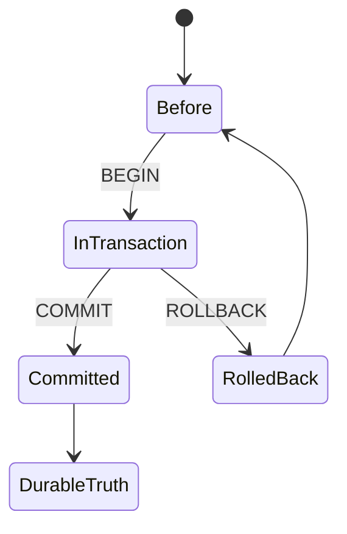
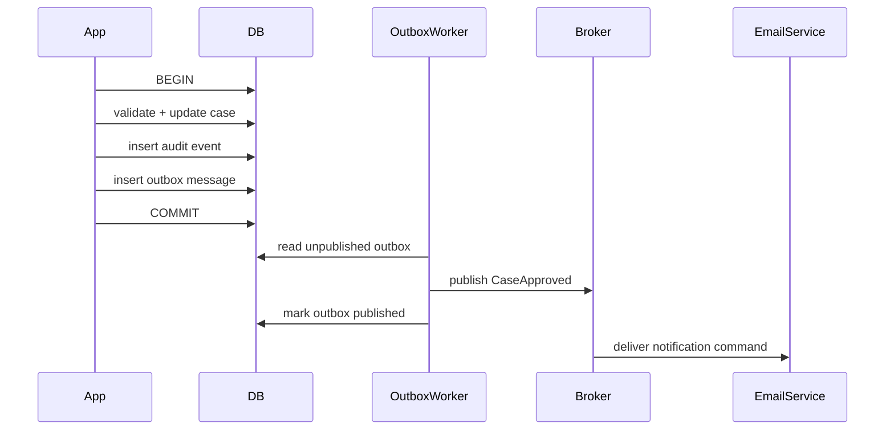
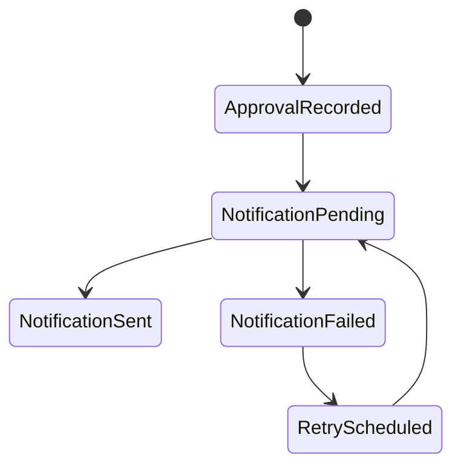

# Part 018 — Transactions, ACID, and Unit-of-Work Design

## 1. Why This Part Exists

SQL is not only a query language. In production systems, SQL is often where business state becomes durable truth.

A transaction is the boundary around that truth change.

Weak engineers treat transactions as syntax:

```sql
begin;
-- some statements
commit;
```

Strong engineers treat transactions as a unit of correctness:

```text
When this transaction commits, which invariant becomes true?
If it rolls back, what must remain unchanged?
If it is retried, what must not duplicate?
If it races with another transaction, what anomaly is possible?
If the process crashes after commit but before publishing an event, what breaks?
```

This part teaches transaction design as an engineering skill.

We are not yet deep-diving isolation anomalies; that comes in Part 019. Here we focus on transaction boundaries, ACID, unit-of-work design, savepoints, retry safety, idempotency, and application/database integration.

---

## 2. Kaufman Framing: The Sub-Skill We Are Training

In Kaufman's model, we want fast usable competence, not vague theory.

The sub-skill here is:

> Given a business operation, define the smallest safe transaction boundary that preserves invariants, supports retry, avoids unnecessary contention, and produces durable state transitions.

You should be able to look at a workflow operation like "approve case", "assign inspector", "close enforcement case", "reverse payment", or "publish decision" and answer:

- Which rows are read to validate the operation?
- Which rows are written?
- Which invariant must hold at commit?
- Which audit/event records must be created in the same transaction?
- Which external side effects must not happen inside the transaction?
- Which failures are safe to retry?
- Which operations need idempotency keys?
- Which transaction boundary is too large?
- Which transaction boundary is too small?

This is where SQL becomes system design.

---

## 3. The Core Mental Model

A transaction is a **state transition boundary**.



Inside the transaction, the database may see intermediate states.

Outside the transaction, other sessions should see either:

```text
before the transaction
```

or:

```text
after the transaction commits
```

They should not observe a half-applied business operation.

That is the foundation.

---

## 4. ACID Without Hand-Waving

ACID is often memorized and rarely understood operationally.

Let's translate it into engineering language.

### 4.1 Atomicity

Atomicity means the transaction's changes commit as a unit or roll back as a unit.

Example operation:

```text
Approve an enforcement case.
```

Required changes:

1. update `enforcement_case.status`;
2. insert `case_event` audit row;
3. insert `case_assignment_history` row;
4. insert `outbox_message` for downstream notification.

Atomicity means we do not allow:

```text
status changed but audit missing
status changed but outbox missing
outbox published but case not approved
```

Transaction:

```sql
begin;

update enforcement_case
set status = 'APPROVED',
    approved_at = current_timestamp,
    approved_by = :user_id,
    version = version + 1
where case_id = :case_id
  and status = 'UNDER_REVIEW'
  and version = :expected_version;

insert into case_event (
    case_id,
    event_type,
    actor_id,
    occurred_at,
    payload_json
)
values (
    :case_id,
    'CASE_APPROVED',
    :user_id,
    current_timestamp,
    :payload_json
);

insert into outbox_message (
    aggregate_type,
    aggregate_id,
    message_type,
    payload_json,
    created_at
)
values (
    'enforcement_case',
    :case_id,
    'CaseApproved',
    :event_payload_json,
    current_timestamp
);

commit;
```

If any required statement fails, the operation should not partially commit.

### 4.2 Consistency

Consistency means the transaction moves the database from one valid state to another valid state.

This is often misunderstood. The database engine enforces constraints you declared. Your application and transaction design must enforce business rules not expressible as simple constraints.

Examples of invariants:

```text
A CLOSED case must have closed_at.
Only one active assignment may exist per case.
A decision cannot be published before approval.
A case cannot transition from REJECTED to APPROVED without reopening.
A ledger account cannot go below zero.
A tenant cannot read or mutate another tenant's data.
```

Some invariants belong in constraints:

```sql
alter table enforcement_case
add constraint ck_closed_case_has_closed_at
check (
    (status = 'CLOSED' and closed_at is not null)
    or
    (status <> 'CLOSED')
);
```

Some belong in transaction logic:

```sql
update enforcement_case
set status = 'CLOSED',
    closed_at = current_timestamp,
    version = version + 1
where case_id = :case_id
  and tenant_id = :tenant_id
  and status in ('APPROVED', 'RESOLVED')
  and version = :expected_version;
```

Some require isolation or locking decisions, which we examine deeply in Part 019 and Part 020.

### 4.3 Isolation

Isolation means concurrent transactions should not interfere in ways that violate the expected correctness model.

Isolation is not one behavior. It is configured through isolation levels and engine-specific concurrency mechanisms.

For now, internalize this:

> Atomicity protects a transaction from partial failure. Isolation protects transactions from unsafe interleavings.

Example unsafe interleaving:

```text
T1 reads case status UNDER_REVIEW
T2 reads case status UNDER_REVIEW
T1 approves case
T2 rejects case
Both commit
Final state depends on last writer
Audit trail says both decisions happened
```

A transaction boundary alone does not solve every race. You also need correct predicates, version checks, locks, constraints, or stronger isolation.

### 4.4 Durability

Durability means once commit succeeds, the committed changes survive crashes according to the database's durability guarantees and configuration.

In practical systems, durability depends on:

- write-ahead log / redo log;
- fsync or equivalent persistence settings;
- replication mode;
- storage behavior;
- commit acknowledgment policy;
- backup and recovery design;
- cloud provider storage guarantees;
- database configuration.

Do not reduce durability to "the row is saved". Durability is an end-to-end operational property.

---

## 5. Autocommit: The Invisible Transaction

Most SQL clients operate in autocommit mode by default.

That means each statement is its own transaction unless you explicitly start one.

```sql
update enforcement_case set status = 'APPROVED' where case_id = 10;
-- auto-committed immediately

insert into case_event (...);
-- separate transaction
```

This is dangerous if the two statements represent one business operation.

If the second statement fails, the first has already committed.

Correct pattern:

```sql
begin;

update enforcement_case
set status = 'APPROVED'
where case_id = :case_id
  and status = 'UNDER_REVIEW';

insert into case_event (...);

commit;
```

Application frameworks often hide this behind annotations or unit-of-work abstractions:

```java
@Transactional
public void approveCase(ApproveCaseCommand command) {
    // updates + audit + outbox in one DB transaction
}
```

The abstraction is fine only if you understand the boundary it creates.

---

## 6. Choosing the Transaction Boundary

A transaction should be large enough to protect invariants and small enough to avoid unnecessary contention.

### 6.1 Too Small

Bad:

```text
Transaction 1: update case status
Transaction 2: insert audit event
Transaction 3: insert outbox message
```

Failure mode:

- status changes without audit;
- audit exists for state that did not commit;
- downstream system receives notification for nonexistent change;
- retry duplicates audit;
- reconciliation requires manual repair.

### 6.2 Too Large

Bad:

```text
Begin transaction
Update case
Insert audit
Call external HTTP API
Wait for PDF generation
Send email
Update notification table
Commit
```

Failure mode:

- locks held during network calls;
- long transaction prevents vacuum/cleanup in MVCC systems;
- deadlock risk increases;
- user request timeout leaves uncertain side effects;
- external API call cannot be rolled back;
- retry may duplicate external effects.

### 6.3 Better Boundary

```text
Begin transaction
Validate transition
Update core rows
Insert audit row
Insert outbox message
Commit

After commit:
Outbox worker publishes message
Notification service sends email
Document service generates PDF
```

Diagram:



The database transaction protects durable state. External side effects are coordinated after commit through reliable messaging patterns.

---

## 7. Unit of Work Design

A unit of work is the set of changes that must succeed or fail together.

For SQL systems, a good unit of work has:

- one clear business command;
- explicit input identity;
- tenant boundary;
- precondition checks;
- state transition;
- audit/event write;
- idempotency strategy if command can be retried;
- no unbounded query;
- no external calls while holding locks;
- deterministic failure handling.

### 7.1 Example: Assign Case

Business command:

```text
Assign case 123 to officer 77.
```

Invariants:

```text
Case must exist in tenant.
Case must be assignable.
Only one active assignment per case.
Assignment must be audited.
Repeated command with same idempotency key must not duplicate assignment.
```

Schema sketch:

```sql
create table case_assignment (
    assignment_id bigint generated always as identity primary key,
    tenant_id bigint not null,
    case_id bigint not null,
    officer_id bigint not null,
    assigned_at timestamp not null,
    revoked_at timestamp null
);

-- PostgreSQL-style partial unique index.
-- Other engines may need different implementation.
create unique index uq_case_one_active_assignment
on case_assignment (tenant_id, case_id)
where revoked_at is null;

create table idempotency_key (
    tenant_id bigint not null,
    command_key text not null,
    command_type text not null,
    result_json text null,
    created_at timestamp not null,
    primary key (tenant_id, command_key)
);
```

Transaction:

```sql
begin;

insert into idempotency_key (
    tenant_id,
    command_key,
    command_type,
    created_at
)
values (
    :tenant_id,
    :command_key,
    'ASSIGN_CASE',
    current_timestamp
);

update case_assignment
set revoked_at = current_timestamp
where tenant_id = :tenant_id
  and case_id = :case_id
  and revoked_at is null;

insert into case_assignment (
    tenant_id,
    case_id,
    officer_id,
    assigned_at
)
values (
    :tenant_id,
    :case_id,
    :officer_id,
    current_timestamp
);

insert into case_event (
    tenant_id,
    case_id,
    event_type,
    actor_id,
    occurred_at,
    payload_json
)
values (
    :tenant_id,
    :case_id,
    'CASE_ASSIGNED',
    :actor_id,
    current_timestamp,
    :payload_json
);

commit;
```

If inserting the idempotency key fails because it already exists, the application reads the stored result or treats the command as already processed.

Exact implementation differs by engine and product requirement, but the invariant is stable.

---

## 8. Read-Validate-Write Is Not Automatically Safe

A common unsafe pattern:

```sql
select status
from enforcement_case
where case_id = :case_id;

-- application checks status == 'UNDER_REVIEW'

update enforcement_case
set status = 'APPROVED'
where case_id = :case_id;
```

Race:

```text
T1 reads UNDER_REVIEW
T2 reads UNDER_REVIEW
T1 updates APPROVED
T2 updates REJECTED or APPROVED again
```

Safer pattern:

```sql
update enforcement_case
set status = 'APPROVED',
    approved_at = current_timestamp,
    version = version + 1
where case_id = :case_id
  and tenant_id = :tenant_id
  and status = 'UNDER_REVIEW'
  and version = :expected_version;
```

Then check affected row count.

```text
1 row updated -> transition succeeded
0 rows updated -> precondition failed or concurrent change occurred
```

This is a powerful production pattern:

> Put the precondition in the write statement.

It turns a race-prone read-validate-write sequence into an atomic conditional state transition.

---

## 9. Optimistic Concurrency with Version Columns

A version column makes lost updates visible.

```sql
alter table enforcement_case
add column version bigint not null default 0;
```

Read:

```sql
select case_id, status, version
from enforcement_case
where case_id = :case_id
  and tenant_id = :tenant_id;
```

Update:

```sql
update enforcement_case
set status = 'APPROVED',
    version = version + 1
where case_id = :case_id
  and tenant_id = :tenant_id
  and version = :expected_version;
```

If zero rows are updated, someone changed the row since you read it.

Do not silently retry a business decision without revalidating. A retry may be safe for technical conflicts, but not for changed business meaning.

Good application response:

```text
The case was changed by another user. Reload and review the latest state.
```

For background jobs, the response may be:

```text
Re-read current state and decide if the command is still applicable.
```

---

## 10. Savepoints

A savepoint is a mark inside a transaction. You can roll back to it without rolling back the entire transaction.

```sql
begin;

insert into import_batch (batch_id, started_at)
values (:batch_id, current_timestamp);

savepoint before_row_1;

insert into staging_case (...);
-- if row fails:
rollback to savepoint before_row_1;

insert into import_error (...);

commit;
```

Savepoints are useful for:

- batch import with per-row error capture;
- optional sub-operation inside larger unit;
- compensating a failed detail row while preserving parent operation;
- test fixtures;
- complex migration scripts.

Be careful:

- savepoints do not make external side effects rollbackable;
- too many savepoints can add overhead;
- they can hide poor validation design;
- they do not replace idempotency.

Use savepoints when partial internal rollback is truly part of the unit-of-work design.

---

## 11. Idempotency

Idempotency means repeating the same operation has the same intended effect as doing it once.

This matters because distributed systems retry.

Retries happen after:

- network timeout;
- database connection drop;
- deadlock victim error;
- serialization failure;
- application crash;
- worker restart;
- message redelivery;
- client double-submit;
- load balancer retry;
- mobile app retry.

Without idempotency, retry turns reliability into duplication.

### 11.1 Idempotency Key Pattern

Client or service sends:

```text
command_key = 8f4f8f4c-... unique per intended command
```

Database table:

```sql
create table command_idempotency (
    tenant_id bigint not null,
    command_key text not null,
    command_type text not null,
    status text not null,
    response_json text null,
    created_at timestamp not null,
    completed_at timestamp null,
    primary key (tenant_id, command_key)
);
```

Process:

```text
1. Insert idempotency key inside transaction.
2. If insert succeeds, execute command.
3. Store result.
4. Commit.
5. If insert conflicts, return existing result or current command status.
```

### 11.2 Natural Idempotency

Some operations have natural unique constraints.

Example:

```sql
create unique index uq_case_event_command
on case_event (tenant_id, command_key);
```

Then repeated event insert with same command key fails or is ignored safely.

### 11.3 Non-Idempotent Smell

Dangerous operation:

```sql
update account
set balance = balance - :amount
where account_id = :account_id;
```

If retried after ambiguous timeout, it can debit twice.

Safer ledger style:

```sql
insert into ledger_entry (
    account_id,
    command_key,
    amount,
    entry_type,
    created_at
)
values (
    :account_id,
    :command_key,
    -:amount,
    'DEBIT',
    current_timestamp
);
```

With:

```sql
create unique index uq_ledger_command
on ledger_entry (account_id, command_key);
```

Then balance is derived or updated exactly once per command.

---

## 12. Retry Safety

Not every transaction failure should be retried the same way.

| Failure | Retry? | Notes |
|---|---|---|
| Deadlock victim | Usually yes | Re-run whole transaction with backoff |
| Serialization failure | Usually yes | Re-run whole transaction because schedule was unsafe |
| Lock timeout | Maybe | Could be contention or bad query shape |
| Connection lost before commit acknowledgment | Ambiguous | Must use idempotency or check durable state |
| Constraint violation | Usually no | Business/data error unless caused by idempotency conflict |
| Syntax/type error | No | Bug |
| Insufficient privilege | No | Configuration/security issue |
| External service timeout inside transaction | Design smell | Do not hold DB transaction across external call |

Retry rule:

> Retry the entire transaction, not the failed statement in isolation, unless you deliberately used savepoints.

Why?

The transaction's earlier reads may no longer be valid. A partial retry can preserve stale assumptions.

---

## 13. Ambiguous Commit

One of the most important failure cases:

```text
Application sends COMMIT.
Network connection drops before response arrives.
```

Did the commit happen?

Maybe yes. Maybe no.

If your operation is not idempotent, retry can duplicate. If you assume failure, you can incorrectly compensate. If you assume success, you can lose work.

Correct design:

- every externally retried command has an idempotency key;
- transaction writes a durable command record;
- after reconnect, application checks durable state;
- outbox events have unique identifiers;
- consumers are idempotent too.

Example check:

```sql
select status, response_json
from command_idempotency
where tenant_id = :tenant_id
  and command_key = :command_key;
```

If committed, return prior result. If not found, retry safely.

---

## 14. External Side Effects and the Transaction Boundary

A database transaction cannot roll back an email, HTTP request, Kafka publish, SMS, payment gateway call, or generated PDF sent to a user.

Bad:

```text
BEGIN
update case status
send email
COMMIT
```

Failure cases:

- email sent, transaction rolls back;
- transaction commits, email fails;
- timeout causes retry and duplicate email;
- locks held during email call;
- deadlock after external side effect.

Better:

```text
BEGIN
update case status
insert audit event
insert outbox message
COMMIT

Outbox worker sends email/publishes event after commit
```

Outbox table sketch:

```sql
create table outbox_message (
    outbox_id bigint generated always as identity primary key,
    aggregate_type text not null,
    aggregate_id bigint not null,
    message_type text not null,
    message_key text not null,
    payload_json text not null,
    created_at timestamp not null,
    published_at timestamp null,
    publish_attempts int not null default 0,
    unique (message_key)
);
```

Polling worker:

```sql
select outbox_id, message_type, payload_json
from outbox_message
where published_at is null
order by outbox_id
fetch first 100 rows only;
```

In high-concurrency systems, worker coordination requires locking patterns such as `SKIP LOCKED` where supported. We discuss contention in Part 020.

---

## 15. Transaction Boundaries in Service Architecture

### 15.1 Single Database Transaction

Best when:

- all required state is in one database;
- operation must be strongly consistent;
- latency must be low;
- contention is manageable;
- invariants can be enforced locally.

Example:

```text
Approve case + audit + outbox
```

### 15.2 Cross-Service Operation

If an operation spans multiple services, one local SQL transaction cannot make the whole distributed workflow atomic.

Bad assumption:

```text
Service A transaction + Service B transaction = one business transaction
```

Not true unless you use a distributed transaction protocol, and many modern architectures avoid that due to operational complexity.

Common alternative:

- local transaction per service;
- outbox/inbox;
- idempotent messages;
- saga/process manager;
- compensating action;
- explicit state machine.

Example:



The business process becomes a durable workflow, not a single giant transaction.

### 15.3 Do Not Hide Distributed State Behind SQL Syntax

A local transaction gives local atomicity. It does not guarantee remote side effects.

Design explicitly.

---

## 16. Transaction Length and Contention

Long transactions are dangerous.

They can:

- hold locks longer;
- increase deadlock probability;
- delay cleanup of old row versions in MVCC systems;
- create replication lag;
- hold snapshots open;
- block DDL;
- increase memory/temp usage;
- make operational incidents harder to resolve.

Common causes:

- user interaction inside transaction;
- external API call inside transaction;
- large batch update in one transaction;
- unbounded select before update;
- missing index on update predicate;
- report query accidentally wrapped in write transaction;
- open transaction leaked by application connection pool.

Guideline:

> Keep OLTP transactions short, bounded, and purposeful.

For batch work, consider chunking:

```sql
-- Pseudocode pattern
while true:
  begin;
  update next 1000 rows matching condition;
  insert audit/checkpoint;
  commit;
  stop when no rows changed;
```

Chunking trades atomicity scope for operational safety. Use only when the business operation allows partial progress and resume.

---

## 17. Transactional DDL

DDL behavior varies across engines.

Some engines support transactional DDL for many operations. Some implicitly commit around certain DDL statements. Some DDL takes strong locks. Some modern engines support online or concurrent forms for specific operations.

Engineering rule:

> Never assume DDL behaves like ordinary DML across vendors.

For migrations:

- know whether DDL can roll back;
- know lock level;
- know table rewrite behavior;
- know replication impact;
- know deployment timeout;
- test on production-like size;
- prefer expand-contract migration for zero-downtime changes.

Migration strategy gets a full part later.

---

## 18. Error Handling Inside Transactions

Different engines and drivers behave differently after a statement error inside a transaction.

Some transactions become unusable until rollback. Some allow continuing after certain errors. Savepoints can localize failures.

Application rule:

```text
On unexpected SQL error inside transaction, roll back the transaction and decide whether to retry the whole unit.
```

Do not continue after an unknown partial failure unless you understand engine behavior and intentionally used savepoints.

Pseudo-code:

```java
try {
    tx.begin();
    repository.applyTransition(command);
    repository.insertAudit(command);
    repository.insertOutbox(command);
    tx.commit();
} catch (SerializationFailure | DeadlockVictim e) {
    tx.rollbackQuietly();
    retryWholeCommandWithBackoff(command);
} catch (DuplicateIdempotencyKey e) {
    tx.rollbackQuietly();
    return repository.findExistingCommandResult(command.key());
} catch (Exception e) {
    tx.rollbackQuietly();
    throw e;
}
```

This is intentionally boring. Transaction error handling should be boring.

---

## 19. Case Study: Closing an Enforcement Case

### 19.1 Business Operation

Command:

```text
Close case after final decision is published.
```

Rules:

- case must belong to tenant;
- current status must be `DECISION_PUBLISHED`;
- no unresolved mandatory actions may remain;
- closing creates audit event;
- closing creates outbox message;
- repeated command must not duplicate audit/outbox;
- external notifications happen after commit.

### 19.2 Tables

```sql
create table enforcement_case (
    tenant_id bigint not null,
    case_id bigint not null,
    status text not null,
    version bigint not null,
    closed_at timestamp null,
    closed_by bigint null,
    primary key (tenant_id, case_id)
);

create table mandatory_action (
    tenant_id bigint not null,
    action_id bigint not null,
    case_id bigint not null,
    status text not null,
    primary key (tenant_id, action_id)
);

create table case_event (
    tenant_id bigint not null,
    event_id bigint generated always as identity primary key,
    case_id bigint not null,
    event_type text not null,
    command_key text not null,
    occurred_at timestamp not null,
    payload_json text not null,
    unique (tenant_id, command_key, event_type)
);
```

### 19.3 Transaction

```sql
begin;

insert into command_idempotency (
    tenant_id,
    command_key,
    command_type,
    status,
    created_at
)
values (
    :tenant_id,
    :command_key,
    'CLOSE_CASE',
    'STARTED',
    current_timestamp
);

-- Guard against unresolved mandatory actions.
-- Exact locking/isolation strategy is discussed in later parts.
select count(*) as unresolved_count
from mandatory_action
where tenant_id = :tenant_id
  and case_id = :case_id
  and status <> 'RESOLVED';

-- Application must require unresolved_count = 0 before proceeding.

update enforcement_case
set status = 'CLOSED',
    closed_at = current_timestamp,
    closed_by = :actor_id,
    version = version + 1
where tenant_id = :tenant_id
  and case_id = :case_id
  and status = 'DECISION_PUBLISHED'
  and version = :expected_version;

-- Application checks affected row count = 1.

insert into case_event (
    tenant_id,
    case_id,
    event_type,
    command_key,
    occurred_at,
    payload_json
)
values (
    :tenant_id,
    :case_id,
    'CASE_CLOSED',
    :command_key,
    current_timestamp,
    :payload_json
);

insert into outbox_message (
    aggregate_type,
    aggregate_id,
    message_type,
    message_key,
    payload_json,
    created_at
)
values (
    'enforcement_case',
    :case_id,
    'CaseClosed',
    :command_key,
    :message_payload_json,
    current_timestamp
);

update command_idempotency
set status = 'COMPLETED',
    response_json = :response_json,
    completed_at = current_timestamp
where tenant_id = :tenant_id
  and command_key = :command_key;

commit;
```

### 19.4 Critical Review

This transaction is close, but not perfect yet.

Potential issue:

```sql
select count(*) from mandatory_action where status <> 'RESOLVED'
```

Between the count and the update, another transaction might insert a new mandatory action unless the schema, isolation level, locking, or workflow rules prevent it.

That is why Part 019 and Part 020 matter.

Part 018 gives the unit-of-work boundary. Later parts harden it under concurrency.

---

## 20. Common Anti-Patterns

### 20.1 Transaction per Repository Method

Bad:

```text
caseRepository.updateStatus()       -> transaction
caseEventRepository.insertEvent()   -> transaction
outboxRepository.insertMessage()    -> transaction
```

The business operation is split accidentally.

Transaction boundary should usually sit at the command/application-service layer, not individual repository method layer.

### 20.2 External Call Inside Transaction

Bad:

```text
BEGIN
update database
call remote service
COMMIT
```

Replace with outbox or post-commit workflow.

### 20.3 Catch Error and Continue

Bad:

```text
Statement failed. Log it. Continue and commit the rest.
```

Unless deliberately designed with savepoints, this creates partial truth.

### 20.4 Retrying Non-Idempotent Commands

Bad:

```text
Timeout after commit attempt. Retry debit command.
```

Use idempotency keys and durable command records.

### 20.5 Read-Validate-Write Without Guarded Update

Bad:

```text
read status
if allowed, update by id
```

Better:

```text
update by id and expected status/version
check affected row count
```

### 20.6 Long Transaction for Batch Job

Bad:

```text
BEGIN
update 200 million rows
COMMIT six hours later
```

Unless the operation truly requires all-or-nothing at that scale, chunk and checkpoint.

### 20.7 Treating ORM Annotation as Design

Bad:

```java
@Transactional
```

and no one can explain what invariant it protects.

Good:

```text
This transaction atomically changes case status, writes audit, and records outbox event. External notification is post-commit.
```

---

## 21. Transaction Design Checklist

Before implementing a business command, answer:

### Boundary

- What is the exact business command?
- What rows does it mutate?
- What rows does it read to validate preconditions?
- What must commit atomically?
- What must happen after commit?
- What must not happen inside the transaction?

### Invariants

- Which invariant is enforced by constraints?
- Which invariant is enforced by guarded update predicates?
- Which invariant depends on isolation/locking?
- Which invariant must be audited?
- Which invariant is tenant-scoped?

### Failure

- What happens if statement 1 succeeds and statement 2 fails?
- What happens if commit response is lost?
- What happens if the process crashes after commit but before notification?
- Is retry safe?
- Is the command idempotent?
- Are external consumers idempotent?

### Concurrency

- Can two users run this command at the same time?
- Can a background job mutate the same rows?
- Is a version column needed?
- Is a unique constraint needed?
- Is a stronger isolation level or lock needed?
- What is the expected contention point?

### Operability

- How long should this transaction run?
- Which indexes support its read/write predicates?
- Could it block hot paths?
- Does it create large WAL/redo volume?
- Can it be safely retried by workers?
- Can support staff reconcile partial-looking external symptoms?

---

## 22. Exercises

### Exercise 1 — Transaction Boundary Identification

Pick a command from your system:

```text
approve case
assign officer
close case
submit report
publish decision
reverse transaction
```

Write:

```text
Atomic writes:
Validation reads:
Constraints involved:
Audit rows:
Outbox rows:
External effects:
Retry behavior:
```

If you cannot answer, the transaction boundary is not yet designed.

### Exercise 2 — Rewrite Read-Validate-Write

Find code that does:

```text
select row
if condition
update row
```

Rewrite the update to include the precondition:

```sql
update ...
set ...
where id = :id
  and status = :expected_status
  and version = :expected_version;
```

Then define behavior for affected row count `0`.

### Exercise 3 — Add Idempotency

Take one retryable command. Add:

- idempotency key;
- unique constraint;
- command table;
- duplicate handling;
- ambiguous commit recovery.

### Exercise 4 — Remove External Side Effect from Transaction

Find one operation that sends email, publishes message, calls API, or writes file inside the DB transaction.

Redesign it with:

- core transaction;
- outbox row;
- worker;
- idempotent consumer.

### Exercise 5 — Long Transaction Review

Find a batch process. Measure:

- rows per transaction;
- transaction duration;
- lock waits;
- redo/WAL volume;
- rollback behavior;
- retry behavior.

Decide whether chunking is safer.

---

## 23. Key Takeaways

- A transaction is a state transition boundary, not just `BEGIN`/`COMMIT` syntax.
- Atomicity prevents partial database changes.
- Consistency requires declared constraints plus correctly designed transaction logic.
- Isolation protects transactions from unsafe interleavings, but details depend on isolation level and engine behavior.
- Durability is an operational property involving logs, storage, replication, and configuration.
- Autocommit means every statement may already be its own transaction.
- Transaction boundaries should be defined around business commands.
- External side effects do not belong inside database transactions.
- Use guarded updates and affected-row counts to enforce preconditions atomically.
- Use idempotency keys for retryable commands and ambiguous commit recovery.
- Retry whole transactions, not isolated statements, unless savepoints are intentionally used.
- Long transactions are correctness and operability risks.

A top-tier engineer can describe not only what SQL statements run, but what business invariant becomes durable at commit.

---

## 24. Reference Notes

This part is aligned with official database documentation on transaction isolation, savepoints, and ACID behavior, including PostgreSQL transaction/isolation documentation and MySQL InnoDB ACID/transaction model documentation. The architecture guidance also follows widely used production patterns such as local database transactions, optimistic concurrency, idempotency keys, and transactional outbox design. Engine-specific syntax and guarantees vary, so the invariant to preserve is the unit of work: all durable state required for one business transition commits together, while external effects are coordinated after commit.
