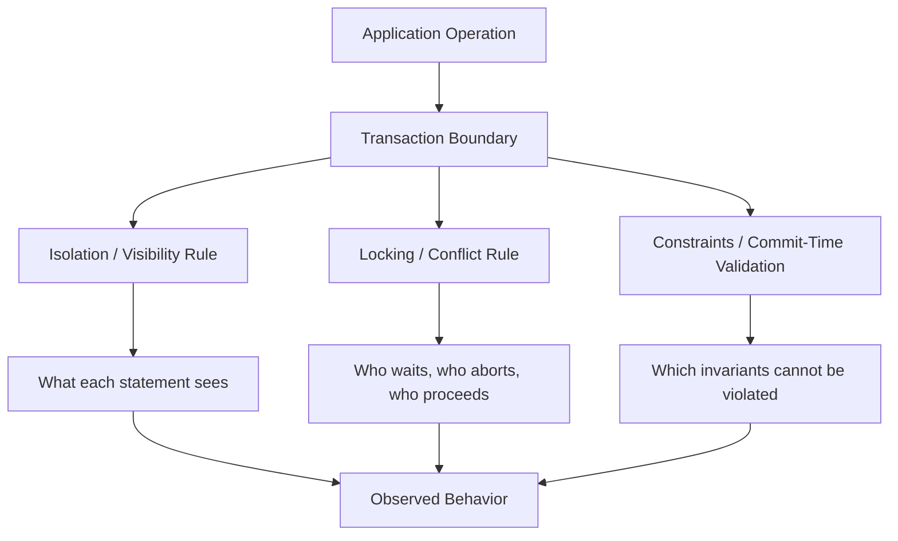
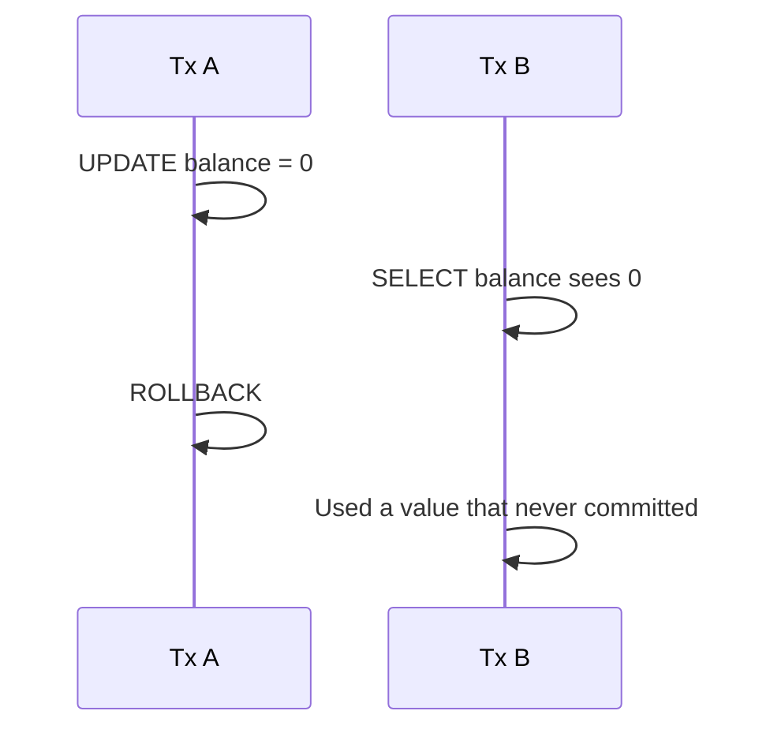
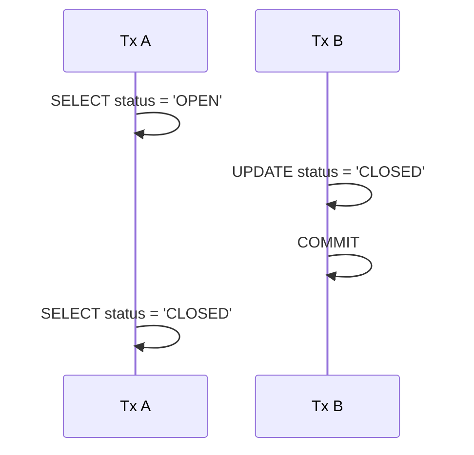
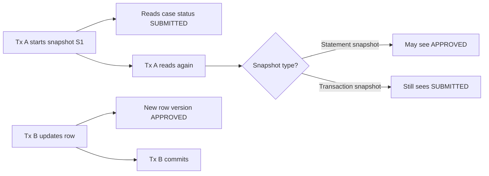
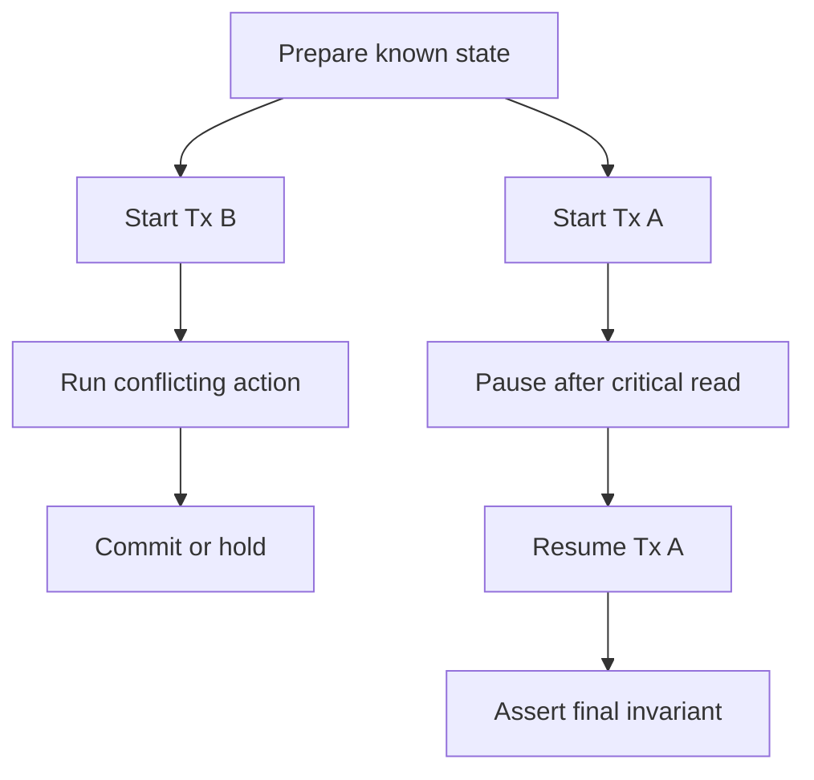

# Part 019 — Isolation Levels, MVCC, Locking, and Anomalies

## 1. Why This Part Exists

Part 018 taught transaction boundaries. This part teaches what happens when transaction boundaries overlap.

Most production SQL bugs are not caused by syntax errors. They are caused by incorrect assumptions about concurrent execution:

```text
"I checked the row, so it must still be valid."
"I counted active assignments, so assigning one more is safe."
"Repeatable Read means fully serial."
"MVCC means no locks."
"Serializable means no failures."
"The database will prevent every race condition for me."
```

Those assumptions are dangerous.

Isolation is not a vague "safety level". It is a contract about what each transaction can see and which conflicts the database detects. The contract differs across engines. The same SQL statement may be correct under one isolation model and broken under another.

The goal of this part is to make you fluent enough to reason about concurrency bugs before they appear in production.

---

## 2. Kaufman Framing: The Sub-Skill We Are Training

In Kaufman's learning model, we deconstruct a complex skill into usable sub-skills and practice against tight feedback.

The sub-skill here is:

> Given two or more concurrent transactions, predict whether a correctness anomaly can happen under a specific isolation level, then choose the smallest safe fix.

You are training to answer:

- What does transaction A read?
- What does transaction B write?
- Can A see B's uncommitted data?
- Can A see B's committed data inside the same transaction?
- Can both transactions make decisions from stale-but-valid snapshots?
- Is the invariant row-local or predicate-wide?
- Does the database detect the conflict, block, abort, or allow it?
- Should the fix be a stronger isolation level, a lock, a constraint, a version column, a unique index, or a different data model?

Do not memorize isolation level names. Learn the anomaly shapes.

---

## 3. The Core Mental Model

A concurrent SQL system has three layers of correctness:



A transaction is not isolated because it is wrapped in `BEGIN`/`COMMIT`. It is isolated because the database applies a visibility and conflict-control algorithm.

Two broad implementation families matter:

| Model | Simplified idea | Strength | Typical risk |
|---|---|---|---|
| Lock-based isolation | Readers/writers acquire locks that block conflicting access | Direct conflict prevention | Blocking, deadlocks, lock escalation |
| MVCC | Readers see a consistent version/snapshot while writers create new row versions | High read/write concurrency | Snapshot-based anomalies if conflicts are not detected |

In real engines, this is not either/or. MVCC engines still use locks for writes, schema changes, foreign keys, uniqueness checks, and explicit locking. Lock-based engines often support row versioning modes.

Production rule:

> MVCC reduces blocking. It does not eliminate concurrency control.

---

## 4. Vocabulary You Must Own

### 4.1 Visibility

Visibility answers:

> Which row versions can this statement or transaction see?

Example:

```sql
begin;
select status from case_file where id = 42;
-- another transaction updates case_file 42 and commits
select status from case_file where id = 42;
commit;
```

Whether the second `SELECT` sees the old or new status depends on the isolation model.

### 4.2 Conflict

Conflict answers:

> Which concurrent writes/read-write dependencies are unsafe and must block, fail, or be ordered?

Example:

```sql
-- Tx A
update account set balance = balance - 100 where id = 1;

-- Tx B concurrently
update account set balance = balance - 100 where id = 1;
```

A correct engine must not allow both updates to blindly overwrite each other as if the other did not happen.

### 4.3 Snapshot

A snapshot is the transaction's view of committed data at a point in time.

Depending on the engine and isolation level, the snapshot may be:

- per statement,
- per transaction,
- refreshed after blocking,
- or combined with additional conflict checks.

### 4.4 Predicate

A predicate is a condition such as:

```sql
where status = 'OPEN' and assigned_user_id = 100
```

Predicate correctness is harder than row correctness. A transaction may read "no row exists" and another transaction may insert a matching row later.

### 4.5 Serialization

Serial execution means transactions behave as if they ran one at a time in some order.

Serializable isolation does not usually mean the engine literally runs one transaction at a time. It means the result must be equivalent to some serial order, or one transaction must fail and be retried.

---

## 5. The Classic Anomalies

### 5.1 Dirty Read

A dirty read happens when a transaction reads data written by another transaction that has not committed.



Dirty reads are almost never acceptable for business systems.

### 5.2 Dirty Write

A dirty write happens when two transactions write the same uncommitted data item. Serious transactional databases prevent this.

```text
Tx A writes row 42 but does not commit.
Tx B overwrites row 42 before A commits or rolls back.
```

Dirty writes destroy recoverability.

### 5.3 Non-Repeatable Read

A non-repeatable read happens when a transaction reads the same row twice and sees different committed values.



This may be acceptable for dashboard queries. It is dangerous for multi-step validation logic.

### 5.4 Phantom Read

A phantom happens when a transaction repeats a predicate query and sees a different set of rows.

```sql
-- First read
select count(*)
from assignment
where inspector_id = 7
  and status = 'ACTIVE';

-- Another transaction inserts a matching row and commits

-- Second read sees a larger count
```

Phantoms matter when the invariant depends on a set of rows, not one row.

### 5.5 Lost Update

A lost update happens when two transactions read the same value, compute a new value independently, and the later write overwrites the earlier write.

Bad application pattern:

```sql
-- Tx A reads 10, app computes 11
select counter from workflow_counter where name = 'case_number';
update workflow_counter set counter = 11 where name = 'case_number';

-- Tx B also reads 10, app computes 11
select counter from workflow_counter where name = 'case_number';
update workflow_counter set counter = 11 where name = 'case_number';
```

Correct SQL pattern:

```sql
update workflow_counter
set counter = counter + 1
where name = 'case_number'
returning counter;
```

This makes the operation a single row-level write conflict.

### 5.6 Write Skew

Write skew is the anomaly many engineers miss.

It happens when two transactions read overlapping data, update different rows, and together violate a predicate-wide invariant.

Example invariant:

> At least one on-call reviewer must remain active per region.

Initial state:

| reviewer_id | region | active |
|---:|---|---|
| 1 | EAST | true |
| 2 | EAST | true |

Concurrent transactions:

```sql
-- Tx A: reviewer 1 goes offline
begin;
select count(*)
from reviewer
where region = 'EAST' and active = true;
-- sees 2
update reviewer set active = false where reviewer_id = 1;
commit;

-- Tx B: reviewer 2 goes offline
begin;
select count(*)
from reviewer
where region = 'EAST' and active = true;
-- also sees 2
update reviewer set active = false where reviewer_id = 2;
commit;
```

Both transactions updated different rows, so row-level write conflicts may not detect the problem. Final state violates the invariant.

This is why "I used Repeatable Read" is not automatically enough.

### 5.7 Read-Only Transaction Anomaly

A read-only transaction can observe a state that is not equivalent to any serial ordering if the isolation model permits certain dependency cycles.

This is less common in typical CRUD code but important for audit reports, financial reconciliation, and regulatory snapshots.

---

## 6. SQL Isolation Levels as Contracts

The SQL standard describes isolation levels through phenomena they must prevent. Engines implement them differently.

| Isolation level | Dirty read | Non-repeatable read | Phantom | Serialization anomaly | Typical use |
|---|---:|---:|---:|---:|---|
| Read Uncommitted | May allow | May allow | May allow | May allow | Rarely acceptable |
| Read Committed | Prevents | May allow | May allow | May allow | Common OLTP default |
| Repeatable Read | Prevents | Prevents | Engine-dependent | May allow in snapshot systems | Multi-step row-consistent operation |
| Serializable | Prevents | Prevents | Prevents | Prevents by blocking/aborting | Strong invariant preservation |

But do not stop at the table. Vendor behavior matters.

### 6.1 PostgreSQL Snapshot Behavior

PostgreSQL implements MVCC. Its documentation describes concurrency control as enabling efficient concurrent access while maintaining integrity. PostgreSQL's `READ UNCOMMITTED` behaves like `READ COMMITTED`, because dirty reads are not possible in its MVCC implementation.

Important PostgreSQL mental model:

| PostgreSQL isolation | Simplified behavior |
|---|---|
| Read Committed | Each statement sees a snapshot as of the start of that statement. |
| Repeatable Read | A transaction sees a snapshot as of the start of the first query in the transaction. |
| Serializable | Like stronger snapshot isolation with dependency tracking; unsafe serializable patterns are aborted. |

Under PostgreSQL `SERIALIZABLE`, code must handle serialization failures and retry the transaction.

### 6.2 MySQL InnoDB Snapshot and Locking Behavior

InnoDB supports the four classic isolation levels and defaults to `REPEATABLE READ`.

Important InnoDB mental model:

- Consistent reads use snapshots.
- Locking reads use locks.
- Under `REPEATABLE READ`, InnoDB uses next-key locks for locking searches and index scans in many cases to prevent phantoms.
- Under `READ COMMITTED`, gap locking is reduced except for specific cases such as foreign-key and duplicate-key checking.

This means the shape of your predicate and index can affect locking behavior.

### 6.3 SQL Server Locking and Row Versioning

SQL Server supports locking-based isolation and row-versioning-based options such as Read Committed Snapshot Isolation and Snapshot Isolation.

Important SQL Server mental model:

- Classic `READ COMMITTED` commonly uses shared locks for reads and exclusive locks for writes.
- Row versioning modes allow readers to access versioned rows rather than blocking on writers.
- `SERIALIZABLE` uses key-range locks to prevent inserts into ranges read by a transaction.

SQL Server concurrency design often includes choices around `READ_COMMITTED_SNAPSHOT`, `SNAPSHOT`, lock hints, indexing, and transaction length.

---

## 7. Reading Isolation Levels by Failure Shape

Instead of asking "What isolation level should I use?", ask:

> Which failure shape can violate my invariant?

### 7.1 Row Value Must Not Change While I Decide

Example:

```text
Approve case only if current status is SUBMITTED.
```

Possible fixes:

1. Make the state transition guarded:

```sql
update case_file
set status = 'APPROVED', approved_at = current_timestamp
where id = :case_id
  and status = 'SUBMITTED';
```

Then check affected row count.

2. Use optimistic version:

```sql
update case_file
set status = 'APPROVED', version = version + 1
where id = :case_id
  and version = :expected_version;
```

3. Use `SELECT ... FOR UPDATE` if you must inspect and later mutate the same row.

You usually do not need `SERIALIZABLE` for a single-row guarded transition.

### 7.2 Set Size Must Not Exceed a Limit

Example:

```text
An inspector can have at most 10 active cases.
```

Naive logic:

```sql
select count(*)
from case_assignment
where inspector_id = :inspector_id
  and status = 'ACTIVE';

insert into case_assignment (...);
```

Two transactions can both see `9` and both insert, producing `11`.

Possible fixes:

| Fix | When it fits |
|---|---|
| Counter row with guarded update | Limit is entity-specific and high-throughput |
| Serializable transaction with retry | Predicate invariant is complex |
| Materialized slot model | Limit is small and naturally enumerable |
| Unique/partial unique index | Invariant can be encoded as uniqueness |
| Pessimistic lock on parent row | Simple parent-scoped invariant |

Parent lock pattern:

```sql
begin;

select id
from inspector_capacity
where inspector_id = :inspector_id
for update;

select count(*)
from case_assignment
where inspector_id = :inspector_id
  and status = 'ACTIVE';

insert into case_assignment (...);

commit;
```

This serializes decisions per inspector without serializing the entire table.

### 7.3 "No Row Exists" Must Stay True

Example:

```text
Only one active escalation may exist per case.
```

Best fix is usually a unique constraint or partial unique index:

```sql
create unique index uq_one_active_escalation_per_case
on case_escalation(case_id)
where status = 'ACTIVE';
```

Do not rely only on:

```sql
select count(*) = 0 ...
insert ...
```

A constraint is a commit-time invariant. It works even if two application nodes race.

### 7.4 Audit Snapshot Must Be Internally Consistent

Example:

```text
Generate a regulatory report that must reflect one coherent point in time.
```

Use transaction-level snapshot semantics, engine-specific export snapshot, or database-native backup/snapshot facilities.

Do not issue unrelated statements in autocommit mode and assume they represent the same truth.

---

## 8. Deep Dive: MVCC

MVCC means Multi-Version Concurrency Control.

Instead of overwriting a row in place for every reader, the database maintains versions. Readers choose visible versions according to their snapshot.



MVCC helps because readers do not necessarily block writers, and writers do not necessarily block readers.

But MVCC creates a design question:

> Is it safe for my transaction to make decisions using a snapshot that may be stale by commit time?

Sometimes yes:

- read-only dashboard,
- historical report,
- pagination list,
- approximate analytics,
- user-visible search results.

Sometimes no:

- capacity allocation,
- uniqueness decision not backed by constraint,
- eligibility decision involving multiple rows,
- financial settlement,
- workflow transition requiring current state.

---

## 9. Deep Dive: Locks

Locks are how databases prevent incompatible operations from corrupting state.

Common lock concepts:

| Lock concept | Meaning |
|---|---|
| Shared/read lock | Allows concurrent reads, blocks conflicting writes in lock-based models |
| Exclusive/write lock | Allows one writer, blocks conflicting writers/readers depending on isolation |
| Row lock | Protects a row version or row slot |
| Table lock | Protects table-level operations or broad access |
| Gap/range lock | Protects absence/range between index keys |
| Predicate lock | Protects a logical predicate, often used for serializable conflict tracking |
| Advisory lock | Application-defined lock managed by DB but not tied directly to a row |

Locking is not a smell. Uncontrolled locking is a smell.

### 9.1 Explicit Row Locking

Many engines support a form of:

```sql
select *
from case_file
where id = :case_id
for update;
```

This says:

> I intend to modify this row, so concurrent transactions should not make incompatible changes before I finish.

Use this when the operation must read, perform application-level validation, then write.

But avoid locking rows while doing slow external work:

```text
Bad:
begin
  lock case row
  call remote risk service
  wait for user confirmation
  update case
commit
```

A transaction should not wait on humans or unreliable networks.

### 9.2 Range Locking

Range locks protect predicates like:

```sql
where inspector_id = 7 and status = 'ACTIVE'
```

They matter when another transaction could insert a new matching row.

But range locking only works well when the predicate maps to an index. Without the right index, the engine may lock too much, scan too much, or fail to protect the intended range efficiently depending on the engine.

Index design is concurrency design.

---

## 10. Isolation Level Walkthroughs

### 10.1 Read Uncommitted

Read Uncommitted allows reading uncommitted changes in engines that implement dirty reads.

Use it for business data almost never.

Acceptable cases are rare and usually limited to approximate diagnostics where wrong answers are tolerable. Even then, use engine-native observability views or replicas instead of weakening data correctness.

### 10.2 Read Committed

Read Committed is common for OLTP.

Mental model:

> Each statement sees data committed before that statement begins, but the transaction as a whole may see different committed states across statements.

Good for:

- short guarded updates,
- simple CRUD,
- insert with constraints,
- idempotency key creation,
- many request/response workflows.

Risky for:

- multi-statement read-then-decide logic,
- repeated count checks,
- set-based eligibility decisions,
- report consistency.

Safer pattern under Read Committed:

```sql
update case_file
set status = 'IN_REVIEW'
where id = :case_id
  and status = 'SUBMITTED';
```

Unsafe pattern:

```sql
select status from case_file where id = :case_id;
-- application decides
update case_file set status = 'IN_REVIEW' where id = :case_id;
```

The gap between read and write is where the race enters.

### 10.3 Repeatable Read / Snapshot Isolation

Transaction-level snapshot isolation gives a stable view of rows as of transaction start.

Good for:

- consistent read-only operations,
- multi-step calculations over a stable snapshot,
- avoiding non-repeatable reads.

Risky for:

- predicate invariants,
- write skew,
- stale decisions,
- long-running write transactions.

Important distinction:

> Stable reads do not automatically mean serializable writes.

### 10.4 Serializable

Serializable isolation aims to make concurrent transactions behave like some serial order.

Implementation options vary:

- strict two-phase locking,
- key-range locks,
- predicate locks,
- serializable snapshot isolation,
- optimistic conflict detection.

Application implication:

> Serializable transactions may fail and must be retried.

A serialization failure is not a database outage. It is the database refusing to allow a dangerous interleaving.

Robust pattern:

```pseudo
for attempt in 1..max_attempts:
    begin transaction isolation level serializable
    try:
        perform invariant-sensitive operation
        commit
        return success
    catch serialization_failure:
        rollback
        jittered_backoff(attempt)
continue with explicit failure
```

Never hide infinite retries inside infrastructure.

---

## 11. Two-Session Anomaly Labs

The fastest way to learn isolation is to run two sessions manually.

### 11.1 Lab Setup

```sql
create table reviewer (
    reviewer_id bigint primary key,
    region text not null,
    active boolean not null
);

insert into reviewer(reviewer_id, region, active)
values
    (1, 'EAST', true),
    (2, 'EAST', true);
```

### 11.2 Write Skew Lab

Session A:

```sql
begin;
set transaction isolation level repeatable read;

select count(*)
from reviewer
where region = 'EAST'
  and active = true;

update reviewer
set active = false
where reviewer_id = 1;
```

Session B:

```sql
begin;
set transaction isolation level repeatable read;

select count(*)
from reviewer
where region = 'EAST'
  and active = true;

update reviewer
set active = false
where reviewer_id = 2;
commit;
```

Back to Session A:

```sql
commit;
```

Depending on engine and isolation implementation, both may commit under snapshot-like repeatable read, producing no active reviewer.

Repeat under `SERIALIZABLE` in an engine that detects this dependency cycle. One transaction should fail or block/abort.

### 11.3 Lost Update Lab

```sql
create table counter_test (
    name text primary key,
    value integer not null
);

insert into counter_test(name, value) values ('case_number', 10);
```

Unsafe application-style pattern:

```sql
-- both sessions
begin;
select value from counter_test where name = 'case_number';
-- application computes value + 1
update counter_test set value = 11 where name = 'case_number';
commit;
```

Safe SQL pattern:

```sql
update counter_test
set value = value + 1
where name = 'case_number'
returning value;
```

### 11.4 Phantom Capacity Lab

```sql
create table assignment (
    assignment_id bigint generated always as identity primary key,
    inspector_id bigint not null,
    case_id bigint not null,
    status text not null
);

insert into assignment(inspector_id, case_id, status)
select 7, g, 'ACTIVE'
from generate_series(1, 9) as g;
```

Unsafe:

```sql
begin;

select count(*)
from assignment
where inspector_id = 7
  and status = 'ACTIVE';

insert into assignment(inspector_id, case_id, status)
values (7, 100, 'ACTIVE');

commit;
```

Run concurrently with a different `case_id`. Both can pass the count check.

Safer parent-lock pattern:

```sql
create table inspector_capacity (
    inspector_id bigint primary key,
    active_limit integer not null,
    active_count integer not null default 0,
    check (active_count >= 0),
    check (active_count <= active_limit)
);
```

```sql
begin;

update inspector_capacity
set active_count = active_count + 1
where inspector_id = 7
  and active_count < active_limit;

-- require row_count = 1

insert into assignment(inspector_id, case_id, status)
values (7, 100, 'ACTIVE');

commit;
```

This turns a predicate-wide count into a guarded single-row transition.

---

## 12. Case Management Example: Approval Race

Imagine a regulatory case lifecycle:

```text
SUBMITTED -> IN_REVIEW -> APPROVED -> PUBLISHED
```

Business rule:

> A case can be approved only once, by a user with active approval authority, while the case is currently `IN_REVIEW`.

Naive implementation:

```sql
select status from case_file where id = :case_id;
select active from user_authority where user_id = :user_id;

update case_file
set status = 'APPROVED'
where id = :case_id;

insert into case_audit (...);
```

Problems:

- case status could change between read and update,
- authority could be revoked between read and update,
- audit insert might not happen if application crashes after update,
- concurrent approval attempts can race,
- external notification might fire before commit.

Better shape:

```sql
begin;

update case_file c
set status = 'APPROVED',
    approved_by = :user_id,
    approved_at = current_timestamp,
    version = version + 1
where c.id = :case_id
  and c.status = 'IN_REVIEW'
  and exists (
      select 1
      from user_authority ua
      where ua.user_id = :user_id
        and ua.authority_type = 'CASE_APPROVAL'
        and ua.active = true
  );

-- require affected row count = 1

insert into case_audit(case_id, actor_id, action, occurred_at)
values (:case_id, :user_id, 'APPROVED', current_timestamp);

insert into outbox_event(aggregate_type, aggregate_id, event_type, payload, created_at)
values ('CASE', :case_id, 'CASE_APPROVED', :payload, current_timestamp);

commit;
```

This does not solve every authorization race. For example, if authority revocation must strictly prevent approvals after revocation begins, authority revocation and approval may need a common lock, version, or serializable boundary.

The design question is not "Which isolation level is best?" It is:

> Which rows/predicates represent the invariant, and how are concurrent changes ordered?

---

## 13. Choosing the Smallest Safe Mechanism

| Invariant shape | Prefer first | Consider when needed |
|---|---|---|
| Single row state transition | Guarded `UPDATE` | `SELECT FOR UPDATE`, version column |
| One active row per entity | Unique/partial unique index | Serializable retry |
| Capacity count per entity | Counter row with check | Parent row lock, serializable |
| Complex predicate invariant | Serializable transaction | Redesign data model |
| External idempotency | Unique idempotency key | Outbox/inbox pattern |
| Ordered workflow transition | Transition table + guarded insert/update | Event sourcing style append-only model |
| Audit consistency | Same transaction as state change | Immutable ledger/history table |
| Long read-only report | Snapshot transaction | Replica snapshot, exported snapshot, ETL |

Use constraints whenever the invariant can be expressed declaratively. Use transaction isolation and locks when the invariant involves a sequence of decisions not representable as a simple constraint.

---

## 14. Anti-Patterns

### 14.1 Relying on Pre-Check Without Constraint

```sql
select 1 from user_account where email = :email;
insert into user_account(email) values (:email);
```

This is broken under concurrency unless a unique constraint exists.

Correct:

```sql
alter table user_account
add constraint uq_user_email unique (email);
```

Then handle duplicate-key errors intentionally.

### 14.2 Long Transactions for User Workflows

Bad:

```text
begin transaction
  show approval page to user
  wait 10 minutes
  submit decision
commit
```

Correct:

```text
Read snapshot for display.
On submit, run a short transaction with guarded transition and conflict detection.
```

### 14.3 Assuming Repeatable Read Prevents Write Skew

Repeatable row reads do not automatically protect "at least one" or "at most N" invariants across multiple rows.

### 14.4 Hiding Serialization Failures

Bad:

```text
catch Exception
return 500
```

Better:

```text
catch serialization/deadlock/transient concurrency failure
rollback
retry transaction with jitter, bounded attempts, and idempotency
```

### 14.5 Using `NOLOCK` or Dirty Reads for User-Facing Truth

Dirty reads may return data that never commits, duplicate rows, missed rows, or internally inconsistent results depending on engine behavior. They are not a safe performance feature for correctness-sensitive data.

### 14.6 Thinking Locks Fix Bad Predicates

If your predicate cannot use an index, the engine may scan and lock far more than intended. Bad indexing can become a concurrency bug.

---

## 15. Testing Isolation Anomalies

Unit tests rarely catch concurrency bugs because they run serially.

Use explicit two-session or multi-thread tests.

### 15.1 Test Shape



### 15.2 Assertions Should Check Invariants

Do not merely assert both transactions completed. Assert that the business invariant survived:

```sql
select region
from reviewer
group by region
having count(*) filter (where active) = 0;
```

This query should return zero rows.

### 15.3 Test Under the Actual Engine

H2, SQLite, embedded databases, and mocks may not reproduce production isolation behavior.

For concurrency-sensitive code, run tests against the actual engine and configuration.

---

## 16. Java Engineering Notes

Because the reader is a software engineer, here are implementation-level warnings.

### 16.1 Transaction Annotation Is Not Enough

In Spring/Jakarta environments, `@Transactional` gives a boundary, but correctness depends on:

- propagation behavior,
- isolation setting,
- flush timing,
- ORM first-level cache,
- query shape,
- database constraints,
- retry handling,
- exception translation.

A method may be transactional and still have a race.

### 16.2 ORM Reads Can Hide Staleness

An ORM persistence context may return cached entity state inside a transaction. That is not the same as re-reading current database state.

For concurrency-sensitive operations, prefer explicit guarded SQL or explicit locking.

### 16.3 Retries Must Wrap the Whole Transaction

Do not retry only the failed statement after a serialization failure. The snapshot and decisions are invalid.

Retry the entire unit of work.

### 16.4 Idempotency Must Survive Retry

If the transaction creates side effects or events, use idempotency keys and outbox patterns so retries do not duplicate business effects.

---

## 17. Production Checklist

Before choosing an isolation strategy, answer:

- What is the invariant?
- Is the invariant single-row, multi-row, predicate-wide, temporal, or cross-table?
- Can the invariant be encoded as a constraint or unique index?
- Does the operation read then write based on the read?
- Can another transaction insert a row that changes the meaning of the read?
- Is stale snapshot data acceptable?
- Does the transaction include external I/O?
- Are serialization/deadlock failures retried safely?
- Does the retry have idempotency protection?
- Are predicates indexed well enough to avoid broad locks/scans?
- Is the chosen isolation level actually supported the same way in production and tests?
- Are monitoring signals available for lock waits, deadlocks, and serialization failures?

---

## 18. Practice Drills

### Drill 1 — Classify the Invariant

For each rule, classify as single-row, uniqueness, capacity, predicate-wide, temporal, or external-idempotency:

1. A case cannot move from `DRAFT` directly to `APPROVED`.
2. Only one active owner per case.
3. A reviewer can have at most 20 active cases.
4. At least one compliance officer must remain active per region.
5. A payment reference must be processed exactly once.
6. A report must reflect all facts as of midnight.

Then choose the likely mechanism: guarded update, unique constraint, counter row, serializable retry, snapshot transaction, or idempotency key.

### Drill 2 — Find the Write Skew

Given:

```sql
create table account_hold (
    account_id bigint,
    hold_type text,
    active boolean not null,
    primary key (account_id, hold_type)
);
```

Rule:

```text
An account must have at least one active hold while under investigation.
```

Two workers deactivate different hold types concurrently after each sees two active holds.

Explain why a row-level conflict may not happen and propose two safe designs.

### Drill 3 — Build an Anomaly Harness

Create two database sessions and prove whether your production engine allows the capacity anomaly under your default isolation level.

Record:

- engine,
- version,
- isolation level,
- table schema,
- indexes,
- final invariant result,
- error/blocking behavior.

### Drill 4 — Retry Classification

Classify these errors:

- duplicate key on idempotency key,
- serialization failure,
- deadlock victim,
- lock timeout,
- check constraint violation,
- foreign key violation.

Which are safe to retry? Which are business failures? Which require user feedback?

---

## 19. Summary

Isolation is the contract between overlapping transactions.

The top-level lesson:

> Do not choose isolation levels by name. Choose concurrency control by invariant shape.

You now have the core mental model:

- Read Committed is often fine for guarded single-row transitions.
- Transaction-level snapshots make reads stable but can still permit stale decisions.
- Repeatable Read is not automatically Serializable.
- Write skew is the key anomaly for predicate-wide invariants.
- Constraints beat application pre-checks.
- Serializable protects more invariants but requires retry handling.
- MVCC reduces read/write blocking but does not remove locks or conflict design.
- Index design affects locking, not just speed.

Part 020 turns this into operational engineering: lock waits, deadlocks, hot rows, `SKIP LOCKED`, advisory locks, queues, contention, and retry loops.

---

## 20. References

- PostgreSQL Documentation — Chapter 13, Concurrency Control: https://www.postgresql.org/docs/current/mvcc.html
- PostgreSQL Documentation — Transaction Isolation: https://www.postgresql.org/docs/current/transaction-iso.html
- PostgreSQL Documentation — Explicit Locking: https://www.postgresql.org/docs/current/explicit-locking.html
- MySQL 8.4 Reference Manual — InnoDB Transaction Isolation Levels: https://dev.mysql.com/doc/refman/8.4/en/innodb-transaction-isolation-levels.html
- MySQL 8.4 Reference Manual — InnoDB Locking Reads: https://dev.mysql.com/doc/refman/8.4/en/innodb-locking-reads.html
- SQL Server Documentation — Transaction Locking and Row Versioning Guide: https://learn.microsoft.com/en-us/sql/relational-databases/sql-server-transaction-locking-and-row-versioning-guide
- Ports, Dan R. K., and Kevin Grittner — Serializable Snapshot Isolation in PostgreSQL: https://arxiv.org/abs/1208.4179
