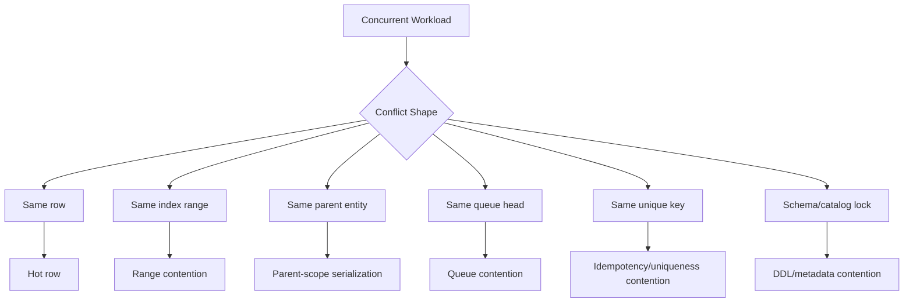
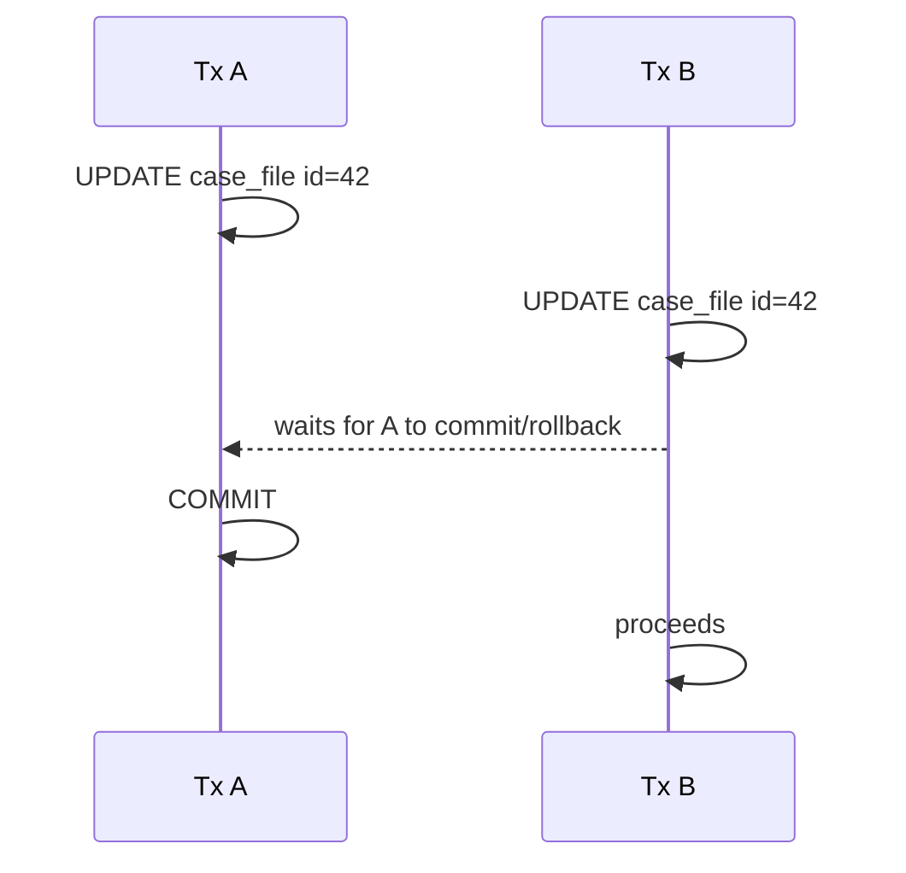
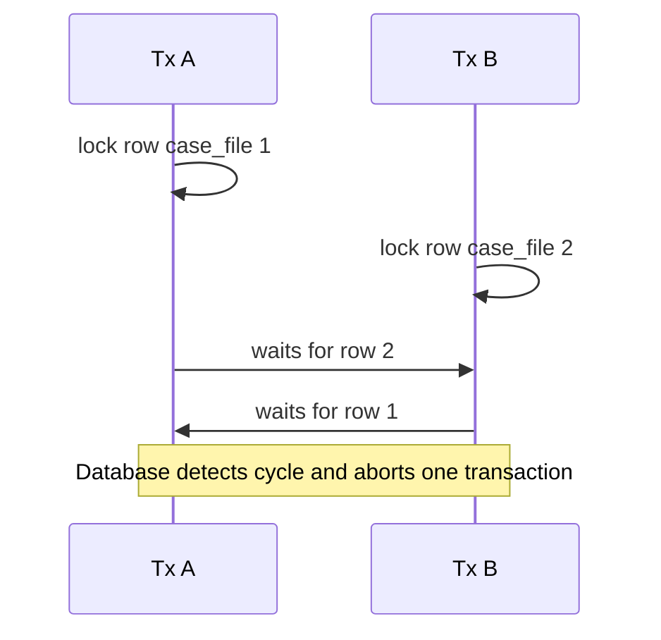

# Part 020 — Concurrency Control, Deadlocks, and Contention

## 1. Why This Part Exists

Part 019 explained isolation and anomalies. This part explains what happens when correct transactions meet production traffic.

A query can be logically correct and still destroy throughput.

A transaction can preserve invariants and still cause lock storms.

A queue can work under five workers and collapse under five hundred.

Concurrency control is where correctness, performance, and operability collide.

The production engineer must distinguish:

```text
Is the system slow because the query is expensive?
Is it slow because sessions are blocked?
Is it deadlocking because locks are taken in inconsistent order?
Is it overloaded because all writers hit the same row?
Is retry logic making the hotspot worse?
Is the index missing, causing broad lock footprints?
Is the application holding transactions open too long?
```

This is the part where SQL becomes distributed-systems engineering inside one database.

---

## 2. Kaufman Framing: The Sub-Skill We Are Training

The sub-skill is:

> Given a concurrent workload, identify the contention shape and redesign the SQL/transaction pattern so it preserves correctness with acceptable throughput.

You are training to:

- read blocking as a wait graph,
- understand deadlock shape,
- reduce lock footprint,
- choose optimistic or pessimistic concurrency intentionally,
- design safe queue consumers,
- avoid hot rows where possible,
- make retries bounded and idempotent,
- convert high-contention predicates into narrow state transitions,
- detect whether the bottleneck is CPU, I/O, lock, latch, or application transaction length.

The goal is not "no locks". The goal is controlled conflict.

---

## 3. Core Mental Model: Contention Has Shape

Contention is not random. It usually has a shape.



To fix contention, first name the shape.

| Symptom | Likely shape |
|---|---|
| Many sessions waiting on one update | Hot row |
| Deadlocks involving same tables in reverse order | Inconsistent lock ordering |
| Queue workers block each other | Head-of-line queue contention |
| Inserts block around same key range | Unique/range/gap contention |
| Simple reads blocked by writes | Locking read isolation or no row versioning |
| DDL hangs during traffic | Metadata/schema lock conflict |
| CPU low, latency high | Blocking/wait problem |
| DB retries spike after scale-out | Conflict amplification |

---

## 4. Blocking, Deadlock, Starvation, Livelock

These are different failure modes.

### 4.1 Blocking

Blocking happens when one session waits for another to release an incompatible lock.



Blocking is not automatically bad. It is how the database preserves order. It becomes bad when wait duration or queue depth exceeds operational tolerance.

### 4.2 Deadlock

Deadlock happens when transactions wait on each other in a cycle.



Deadlock is not solved by waiting longer. One transaction must be aborted.

### 4.3 Starvation

Starvation happens when a transaction repeatedly fails to acquire resources because other work keeps jumping ahead.

Example:

- a long report repeatedly killed by timeouts,
- a low-priority worker never gets a queue item,
- a maintenance job never obtains a schema lock.

### 4.4 Livelock

Livelock happens when transactions keep reacting to each other but none makes progress.

Example:

- all clients retry immediately after deadlock,
- retries collide again,
- throughput collapses despite active work.

Retry without backoff can turn transient conflict into sustained outage.

---

## 5. Lock Footprint

Lock footprint is the set of database resources your transaction protects while it runs.

It is affected by:

- isolation level,
- query predicates,
- indexes,
- join order,
- statement order,
- number of rows touched,
- transaction duration,
- foreign key checks,
- uniqueness checks,
- triggers,
- cascading actions,
- DDL operations.

Production rule:

> A transaction should lock the minimum resources for the minimum time needed to preserve the invariant.

### 5.1 Bad Lock Footprint Example

```sql
begin;

select *
from case_file
where lower(reference_no) = lower(:reference_no)
for update;

update case_file
set status = 'IN_REVIEW'
where lower(reference_no) = lower(:reference_no);

commit;
```

If no expression index supports `lower(reference_no)`, this may scan far more rows than expected.

Better:

```sql
create index ix_case_file_reference_no_lower
on case_file ((lower(reference_no)));
```

Or normalize the value:

```sql
alter table case_file add column reference_no_normalized text not null;
create unique index uq_case_file_reference_no_normalized
on case_file(reference_no_normalized);
```

### 5.2 Bad Transaction Duration Example

```text
begin
  lock rows
  call external service
  generate PDF
  upload object storage
  update DB
commit
```

Better:

```text
Transaction 1:
  reserve/transition state
  insert outbox event
commit

Async worker:
  call external service
  generate PDF
  upload object storage

Transaction 2:
  attach result or mark failure
commit
```

External I/O should almost never happen while holding database locks.

---

## 6. Deadlock Anatomy

Deadlocks require four conditions:

1. Mutual exclusion: resources cannot be shared in the requested mode.
2. Hold and wait: a transaction holds one lock while waiting for another.
3. No preemption: locks are not forcibly taken away except by abort.
4. Circular wait: Tx A waits for Tx B while Tx B waits for Tx A.

You usually cannot remove mutual exclusion or no preemption. You fix deadlocks by reducing hold-and-wait or eliminating circular wait.

### 6.1 Classic Reverse-Order Deadlock

Bad pattern:

```sql
-- Tx A
begin;
update account set balance = balance - 100 where id = 1;
update account set balance = balance + 100 where id = 2;
commit;
```

```sql
-- Tx B
begin;
update account set balance = balance - 50 where id = 2;
update account set balance = balance + 50 where id = 1;
commit;
```

Fix: deterministic lock order.

```sql
-- Always lock account ids in ascending order first
select id
from account
where id in (:from_account_id, :to_account_id)
order by id
for update;
```

Then perform updates.

### 6.2 Join-Driven Deadlock

Even if application code appears ordered, the optimizer may access tables in a different order.

Example:

```sql
update case_file c
set status = 'ESCALATED'
from case_assignment a
where a.case_id = c.id
  and a.assigned_user_id = :user_id
  and c.priority = 'HIGH';
```

Another transaction updates assignment first, then case. The engine plan may create unexpected lock acquisition order.

Mitigations:

- split into explicit lock acquisition step,
- use stable key order,
- reduce rows involved,
- ensure supporting indexes,
- avoid broad `UPDATE ... FROM` without understanding plan,
- keep transaction short,
- retry deadlock victims.

### 6.3 Foreign Key Deadlocks

Foreign keys introduce hidden reads/locks for referential checks.

Example:

- Tx A updates parent row and child row.
- Tx B inserts child row referencing same parent.
- FK checks and parent locks interact.

Mitigations:

- index foreign key columns,
- use consistent parent-before-child lock order,
- avoid unnecessary parent updates,
- separate high-volume child inserts from parent lifecycle mutations where possible.

Indexing child FK columns is both performance and concurrency hygiene.

---

## 7. Deadlock Handling Pattern

Deadlocks can still happen in a well-designed system. The correct response is bounded retry of the entire transaction.

```pseudo
function runWithConcurrencyRetry(operation):
    for attempt in 1..maxAttempts:
        begin transaction
        try:
            result = operation()
            commit
            return result
        catch deadlock_or_serialization_failure as e:
            rollback
            sleep(jitteredBackoff(attempt))
            continue
        catch business_constraint_failure as e:
            rollback
            return domainFailure(e)
        catch exception as e:
            rollback
            throw e
    throw TooMuchContention
```

Important details:

- retry the entire transaction,
- use jittered backoff,
- cap attempts,
- preserve idempotency,
- track retry metrics,
- do not retry non-transient business failures blindly.

### 7.1 Error Classification

| Error type | Retry? | Meaning |
|---|---:|---|
| Deadlock victim | Yes, bounded | Database broke a wait cycle |
| Serialization failure | Yes, bounded | Database rejected unsafe interleaving |
| Lock timeout | Maybe | Could indicate overload or bad lock footprint |
| Unique violation on idempotency key | No; fetch existing result | Request already processed or in progress |
| Unique violation on business key | No | Domain conflict |
| Check constraint violation | No | Invalid state transition/data |
| FK violation | Usually no | Missing/invalid parent or ordering bug |
| Connection lost before commit result known | Requires idempotency/reconciliation | Ambiguous outcome |

---

## 8. Hot Rows

A hot row is a row many transactions need to update.

Common examples:

- global counters,
- account balances,
- inventory quantity,
- tenant aggregate state,
- workflow sequence number,
- queue metadata row,
- singleton configuration row,
- parent row updated on every child insert.

### 8.1 Hot Counter

Bad if high throughput:

```sql
update tenant_stats
set case_count = case_count + 1
where tenant_id = :tenant_id;
```

This serializes all case creation for the tenant on one row.

Potential designs:

| Design | Trade-off |
|---|---|
| Single guarded counter row | Strong and simple, but serializes writes |
| Sharded counter rows | Higher throughput, eventual aggregation needed |
| Append-only event table | High write throughput, query aggregation cost |
| Periodic rollup | Stale but scalable for dashboards |
| Database sequence | Good for unique numbers, not always gapless |
| Reservation/slot table | Strong limit control for bounded resources |

Do not require gapless numbers unless legally required. Gapless counters create serialization pressure.

### 8.2 Parent Row Touch Amplification

Bad pattern:

```sql
insert into case_note(...);

update case_file
set note_count = note_count + 1,
    updated_at = current_timestamp
where id = :case_id;
```

Every note insert now contends on the case row.

Alternatives:

- compute note count on read with proper index,
- maintain count asynchronously,
- split volatile aggregate into separate row,
- update parent only for meaningful lifecycle changes,
- batch rollups.

### 8.3 Balance Rows

Financial/accounting rows are naturally contentious. Do not "optimize away" correctness.

Prefer ledger design:

```sql
create table account_ledger_entry (
    entry_id bigint generated always as identity primary key,
    account_id bigint not null,
    amount numeric(19,4) not null,
    idempotency_key text not null unique,
    created_at timestamp not null default current_timestamp
);
```

Then derive balance or maintain a guarded balance projection carefully.

Ledger append reduces overwrite contention and improves auditability, but it shifts complexity to balance calculation and settlement rules.

---

## 9. Work Queues in SQL

SQL can implement reliable queues for moderate throughput and strong transactional integration.

It can also become a bottleneck if designed poorly.

### 9.1 Queue Table

```sql
create table work_item (
    id bigint generated always as identity primary key,
    type text not null,
    status text not null,
    available_at timestamp not null default current_timestamp,
    locked_by text,
    locked_until timestamp,
    attempt_count integer not null default 0,
    payload jsonb not null,
    created_at timestamp not null default current_timestamp,
    updated_at timestamp not null default current_timestamp
);

create index ix_work_item_claim
on work_item(status, available_at, id)
where status = 'READY';
```

### 9.2 Naive Queue Consumer

```sql
begin;

select id
from work_item
where status = 'READY'
order by created_at
limit 1
for update;

update work_item
set status = 'RUNNING'
where id = :id;

commit;
```

Multiple workers may block on the same first row.

### 9.3 Skip-Locked Queue Claim

Many engines support a version of `SKIP LOCKED`.

```sql
begin;

with next_item as (
    select id
    from work_item
    where status = 'READY'
      and available_at <= current_timestamp
    order by id
    for update skip locked
    limit 1
)
update work_item wi
set status = 'RUNNING',
    locked_by = :worker_id,
    locked_until = current_timestamp + interval '5 minutes',
    attempt_count = attempt_count + 1,
    updated_at = current_timestamp
from next_item
where wi.id = next_item.id
returning wi.*;

commit;
```

Mental model:

> Locked rows are skipped so workers can claim different items instead of waiting behind one another.

Trade-offs:

- improves throughput,
- can reduce head-of-line blocking,
- may process out of strict order,
- requires lease/timeout recovery,
- must handle worker crash,
- should be monitored for stuck `RUNNING` items.

### 9.4 Lease Recovery

```sql
update work_item
set status = 'READY',
    locked_by = null,
    locked_until = null,
    updated_at = current_timestamp
where status = 'RUNNING'
  and locked_until < current_timestamp
  and attempt_count < :max_attempts;
```

Dead-letter after max attempts:

```sql
update work_item
set status = 'FAILED',
    updated_at = current_timestamp
where status = 'RUNNING'
  and locked_until < current_timestamp
  and attempt_count >= :max_attempts;
```

### 9.5 Queue Fairness

`SKIP LOCKED` favors throughput over perfect fairness.

For strict fairness, you may need:

- partitioned queues,
- priority buckets,
- per-tenant quotas,
- aging logic,
- separate delay queues,
- external broker for very high throughput.

SQL queue is excellent when work must be claimed atomically with relational state. It is not automatically the best general-purpose message broker.

---

## 10. Optimistic vs Pessimistic Concurrency

### 10.1 Optimistic Concurrency

Assume conflicts are rare. Detect conflict at write time.

```sql
update case_file
set status = :new_status,
    version = version + 1
where id = :case_id
  and version = :expected_version;
```

If affected row count is zero, someone changed the row first.

Good when:

- conflicts are rare,
- user edits can be merged or rejected,
- operation is short,
- domain can surface conflict to user.

Bad when:

- conflicts are frequent,
- retry cost is high,
- many workers race on the same entity,
- losing work is expensive.

### 10.2 Pessimistic Concurrency

Assume conflicts are likely. Acquire lock before doing the work.

```sql
select *
from case_file
where id = :case_id
for update;
```

Good when:

- conflict is expected,
- operation must inspect current state then mutate,
- duplicate work is expensive,
- deterministic ordering matters.

Bad when:

- transactions are long,
- external I/O is inside the transaction,
- lock footprint is broad,
- users hold locks by keeping screens open.

### 10.3 Hybrid Pattern

Use optimistic for user edits, pessimistic for worker claims, unique constraints for idempotency, and serializable for complex invariant transactions.

There is no single concurrency style for the whole system.

---

## 11. Advisory Locks

Advisory locks are application-defined locks managed by the database.

They can be useful when the resource is not naturally represented by one row.

Example use cases:

- one migration job per tenant,
- one reconciliation process per account,
- one report generation per period,
- one integration sync per external system.

Conceptual pattern:

```sql
-- pseudo-SQL; exact function differs by engine
select acquire_advisory_lock(hash(:tenant_id, :job_type));

-- run protected work

select release_advisory_lock(hash(:tenant_id, :job_type));
```

Warnings:

- advisory locks do not enforce data integrity by themselves,
- lock key design must avoid accidental collision,
- transaction-scoped locks are safer than session-scoped locks,
- they can hide missing relational constraints,
- observability is essential.

Prefer row locks when a natural row exists. Use advisory locks for cross-row or external-resource coordination when carefully justified.

---

## 12. Tenant-Aware Contention

Multi-tenant systems create unique contention patterns.

A global queue can let one noisy tenant starve others.

A global counter can serialize all tenants.

A global maintenance job can lock tables used by every tenant.

### 12.1 Tenant-Partitioned Queue Claim

```sql
with next_item as (
    select id
    from work_item
    where tenant_id = :tenant_id
      and status = 'READY'
      and available_at <= current_timestamp
    order by priority desc, id
    for update skip locked
    limit 1
)
update work_item wi
set status = 'RUNNING',
    locked_by = :worker_id,
    locked_until = current_timestamp + interval '5 minutes'
from next_item
where wi.id = next_item.id
returning wi.*;
```

Supporting index:

```sql
create index ix_work_item_tenant_claim
on work_item(tenant_id, status, available_at, priority desc, id)
where status = 'READY';
```

### 12.2 Per-Tenant Capacity Row

```sql
update tenant_capacity
set running_jobs = running_jobs + 1
where tenant_id = :tenant_id
  and running_jobs < max_running_jobs;
```

This serializes only per tenant, not globally.

---

## 13. Escalation and Workflow Contention

Regulatory/case-management systems often have workflow state machines.

Common contention points:

- many users update the same case,
- automated escalation job races with manual action,
- SLA breach detector races with resolution,
- assignment rebalance races with user claim,
- publication job races with rollback/correction,
- audit trail insert races with event publication.

### 13.1 Safe State Transition Pattern

```sql
update case_file
set status = 'ESCALATED',
    escalated_at = current_timestamp,
    version = version + 1
where id = :case_id
  and status in ('IN_REVIEW', 'AWAITING_RESPONSE')
  and due_at < current_timestamp;
```

This is concurrency-friendly because it is one guarded statement.

### 13.2 Manual Action vs Scheduled Escalation

Manual resolution:

```sql
update case_file
set status = 'RESOLVED',
    resolved_at = current_timestamp,
    version = version + 1
where id = :case_id
  and status <> 'RESOLVED';
```

Escalation job:

```sql
update case_file
set status = 'ESCALATED',
    escalated_at = current_timestamp,
    version = version + 1
where id = :case_id
  and status in ('IN_REVIEW', 'AWAITING_RESPONSE')
  and due_at < current_timestamp;
```

Only one state transition should win. The loser sees zero affected rows and treats it as benign conflict, not system error.

---

## 14. Indexing for Concurrency

Indexes reduce not only read cost but also lock footprint.

### 14.1 Claim Query Index

For:

```sql
where status = 'READY'
  and available_at <= current_timestamp
order by id
limit 1
```

Use:

```sql
create index ix_work_item_ready_claim
on work_item(status, available_at, id)
where status = 'READY';
```

### 14.2 Foreign Key Index

For child table:

```sql
create table case_assignment (
    assignment_id bigint primary key,
    case_id bigint not null references case_file(id),
    assigned_user_id bigint not null
);
```

Add:

```sql
create index ix_case_assignment_case_id
on case_assignment(case_id);
```

This helps parent deletes/updates and FK checks avoid broad scans.

### 14.3 Transition Query Index

For scheduled escalation:

```sql
where status in ('IN_REVIEW', 'AWAITING_RESPONSE')
  and due_at < current_timestamp
```

Use an index shaped for the job:

```sql
create index ix_case_file_escalation_scan
on case_file(status, due_at, id);
```

If only a small subset is eligible, consider partial/filtered indexes where supported.

---

## 15. Observability for Locking and Contention

You cannot tune what you cannot see.

Track:

- lock wait duration,
- lock wait count,
- deadlock count,
- serialization failure count,
- lock timeout count,
- transaction duration percentiles,
- rows scanned vs rows changed,
- retry attempts per operation,
- queue claim latency,
- queue age of oldest ready item,
- stuck running jobs,
- database wait events,
- hot statements by total wait time.

### 15.1 Minimum Application Metrics

```text
sql.transaction.duration{operation}
sql.transaction.retry.count{operation, reason}
sql.deadlock.count{operation}
sql.serialization_failure.count{operation}
sql.lock_timeout.count{operation}
queue.claim.latency{queue,type,tenant}
queue.item.age.oldest{queue,type,tenant}
```

### 15.2 Log Correlation

Every transaction-sensitive operation should carry:

- request id,
- tenant id,
- aggregate id,
- operation name,
- idempotency key,
- attempt number,
- database error class,
- duration,
- affected row count.

Without this, concurrency bugs become ghost stories.

---

## 16. Operational Triage Playbook

### 16.1 Symptom: Latency Spike, CPU Low

Hypothesis: blocking/waits.

Actions:

1. Inspect active sessions.
2. Identify blockers and blocked sessions.
3. Find longest transaction age.
4. Identify SQL text and operation.
5. Check whether external I/O occurs inside transaction.
6. Check missing index for locked predicate.
7. Kill only with domain awareness.
8. Create follow-up fix, not just emergency termination.

### 16.2 Symptom: Deadlocks Spike After Deployment

Hypothesis: new lock ordering or query plan.

Actions:

1. Compare changed SQL statements.
2. Inspect deadlock graph/log.
3. Identify tables/resources in cycle.
4. Determine acquisition order.
5. Add deterministic lock order or split operation.
6. Add/rebuild supporting index if scan caused broad lock footprint.
7. Ensure bounded retry.

### 16.3 Symptom: Queue Throughput Flatlines with More Workers

Hypothesis: queue contention or hot resource downstream.

Actions:

1. Check if workers block on same queue head.
2. Use `SKIP LOCKED` or atomic claim update.
3. Partition by tenant/type if fairness needed.
4. Measure downstream transaction contention.
5. Reduce batch size if large transactions hold locks too long.
6. Add lease recovery and dead-letter handling.

### 16.4 Symptom: Retry Storm

Hypothesis: immediate retry amplifies conflict.

Actions:

1. Add jittered backoff.
2. Cap attempts.
3. Reduce concurrency for hot operation.
4. Add per-key queueing or partitioning.
5. Change data model to reduce shared writes.
6. Expose graceful failure when contention persists.

---

## 17. Design Patterns

### 17.1 Guarded Update

Use for state transitions.

```sql
update case_file
set status = :to_status,
    version = version + 1
where id = :case_id
  and status = :expected_status;
```

Benefits:

- one statement,
- row-level conflict,
- no stale read gap,
- easy affected-row handling.

### 17.2 Claim-and-Work

Use for workers.

```sql
update work_item
set status = 'RUNNING',
    locked_by = :worker_id,
    locked_until = current_timestamp + interval '5 minutes'
where id = (
    select id
    from work_item
    where status = 'READY'
    order by id
    for update skip locked
    limit 1
)
returning *;
```

Exact syntax varies by engine.

### 17.3 Parent-Scoped Serialization

Use when multiple child rows must obey a parent invariant.

```sql
select id
from case_file
where id = :case_id
for update;

-- now inspect/update children for this case
```

This serializes only operations for the same parent.

### 17.4 Deterministic Multi-Row Locking

Use when modifying multiple entities.

```sql
select id
from account
where id in (:a, :b)
order by id
for update;
```

Then update.

### 17.5 Unique Constraint as Lock-Free Coordination

```sql
insert into idempotency_record(key, status, created_at)
values (:key, 'PROCESSING', current_timestamp);
```

If duplicate key occurs, another request already owns the operation.

This is often simpler than an application mutex.

### 17.6 Outbox for External Effects

```sql
begin;

update case_file ...;

insert into outbox_event(...);

commit;
```

The transaction does not call external systems. A separate dispatcher sends events after commit.

This avoids holding locks while doing network I/O and prevents state/event split-brain.

---

## 18. Anti-Patterns

### 18.1 More Workers as Universal Fix

Adding workers increases concurrency. If the bottleneck is a hot row or queue head, more workers make it worse.

### 18.2 Immediate Retry

Immediate retry after deadlock or serialization failure can recreate the same conflict.

Use jittered backoff and cap attempts.

### 18.3 User Think Time Inside Transaction

Never hold a database transaction open while a user reads a page, reviews a form, or confirms an action.

Use version checks on submit.

### 18.4 Global Singleton Rows

A row like this becomes a throughput ceiling:

```sql
update system_state
set last_case_number = last_case_number + 1;
```

Use sequences, sharded counters, tenant-scoped counters, or tolerate gaps.

### 18.5 Broad `FOR UPDATE`

```sql
select * from case_file where status = 'OPEN' for update;
```

This can lock a huge working set. Lock exact rows, batches, or queue items.

### 18.6 Missing Index on Locking Predicate

A locking read without a supporting index can become table-scale contention.

### 18.7 Retrying Non-Idempotent External Effects

If retry sends two emails, charges twice, or publishes duplicate commands, your retry design is broken.

---

## 19. Practice Drills

### Drill 1 — Draw the Wait Graph

Given:

```text
Tx A locks case 10, then assignment 50.
Tx B locks assignment 50, then case 10.
```

Draw the wait graph and explain the deadlock.

Then rewrite both transactions to use deterministic lock order.

### Drill 2 — Fix the Queue

Given this consumer:

```sql
select id
from work_item
where status = 'READY'
order by created_at
limit 1;

update work_item
set status = 'RUNNING'
where id = :id;
```

List the races and rewrite using atomic claim semantics.

### Drill 3 — Identify the Hot Row

A tenant has high write latency. The top statement is:

```sql
update tenant_summary
set open_case_count = open_case_count + 1
where tenant_id = ?;
```

Propose three alternative designs and their trade-offs.

### Drill 4 — Retry Budget

Design retry rules for:

- deadlock victim,
- serialization failure,
- lock timeout,
- unique idempotency violation,
- connection loss after commit attempt.

Include max attempts, backoff, and idempotency behavior.

### Drill 5 — Workflow Race

Manual resolution and automatic escalation race on the same case.

Write two guarded updates so only one transition wins and the loser handles zero affected rows safely.

---

## 20. Summary

Concurrency control is not just an engine feature. It is an application/database contract.

Key ideas:

- Blocking is waiting; deadlock is a cycle.
- Contention has shape: hot row, hot range, queue head, parent scope, unique key, schema lock.
- Lock footprint depends on predicates, indexes, isolation, and transaction duration.
- Deterministic lock ordering prevents many deadlocks.
- Bounded retry is required for deadlocks and serialization failures.
- Retry must be idempotent and must wrap the whole transaction.
- `SKIP LOCKED` can make SQL queues scalable enough for many operational workflows, but it trades strict fairness for throughput.
- Hot rows are design problems, not just database problems.
- Indexes are concurrency tools, not only performance tools.
- External I/O inside transactions is a common source of lock amplification.

The next part moves from transaction correctness into modelling: normalization, denormalization, dependency theory, data shape, and how schema design controls system evolution.

---

## 21. References

- PostgreSQL Documentation — Chapter 13, Concurrency Control: https://www.postgresql.org/docs/current/mvcc.html
- PostgreSQL Documentation — Explicit Locking: https://www.postgresql.org/docs/current/explicit-locking.html
- PostgreSQL Documentation — `SELECT` Locking Clauses: https://www.postgresql.org/docs/current/sql-select.html
- MySQL 8.4 Reference Manual — InnoDB Locking and Transaction Model: https://dev.mysql.com/doc/refman/8.4/en/innodb-locking-transaction-model.html
- MySQL 8.4 Reference Manual — InnoDB Deadlock Detection: https://dev.mysql.com/doc/refman/8.4/en/innodb-deadlock-detection.html
- MySQL 8.4 Reference Manual — InnoDB Locking Reads: https://dev.mysql.com/doc/refman/8.4/en/innodb-locking-reads.html
- SQL Server Documentation — Transaction Locking and Row Versioning Guide: https://learn.microsoft.com/en-us/sql/relational-databases/sql-server-transaction-locking-and-row-versioning-guide
- SQL Server Documentation — Deadlocks Guide: https://learn.microsoft.com/en-us/sql/relational-databases/sql-server-deadlocks-guide
