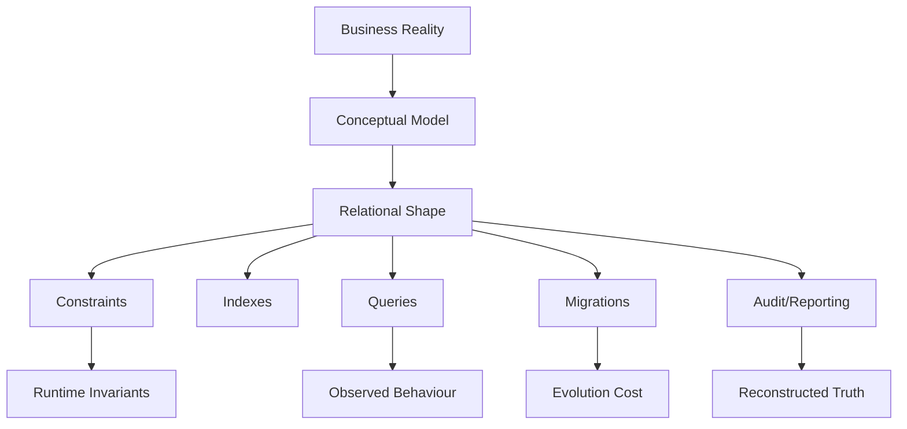
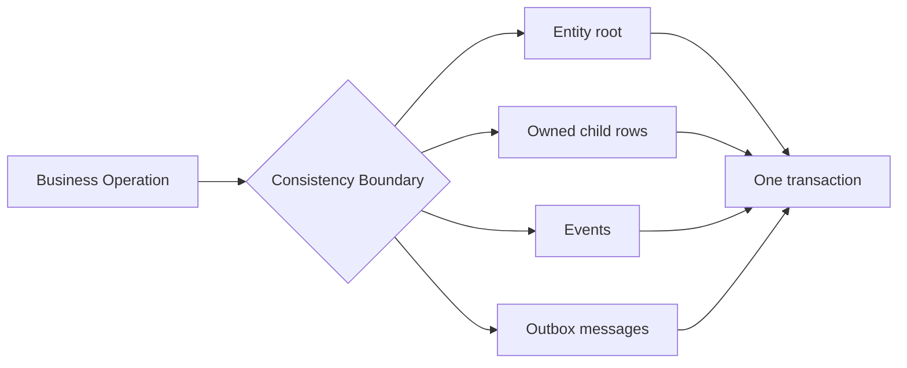
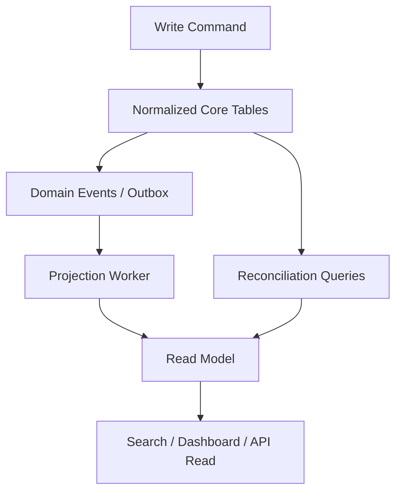
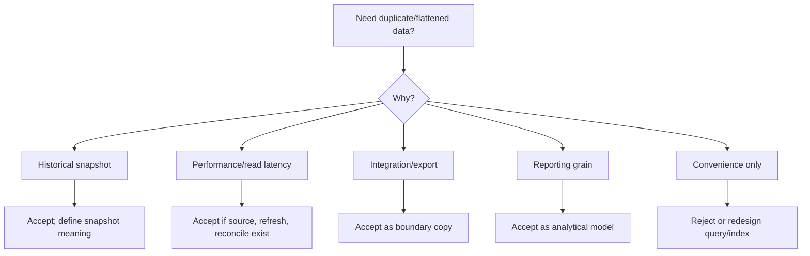
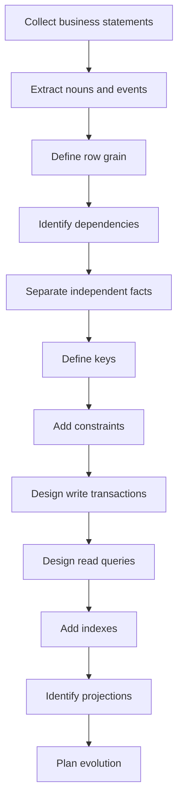

# Part 021 — Normalization, Denormalization, and Data Shape

## 1. Why This Part Exists

Previous parts focused on query correctness, optimizer behaviour, indexes, transactions, and concurrency.

This part shifts the centre of gravity:

> The easiest query to optimize is the query against a data model that represents reality cleanly.

A weak schema creates recurring production failures:

- duplicated facts drift apart,
- status columns contradict timestamp columns,
- foreign keys cannot express real ownership,
- reporting queries require fragile de-duplication,
- joins multiply rows because the grain is unclear,
- migration requires risky rewrites,
- cache invalidation becomes guesswork,
- permissions leak across tenants,
- audit reconstruction is impossible,
- business workflows become hidden inside string columns.

Normalization and denormalization are not academic ceremonies. They are tools for controlling change.

A top-tier engineer does not ask:

```text
Should this schema be normalized?
```

They ask:

```text
Which facts are independent?
Which facts change together?
Which dependencies must the database enforce?
Which duplicated facts are derived and refreshable?
Which shape minimizes long-term ambiguity under real workload?
```

That is the goal of this part.

---

## 2. Kaufman Framing: The Sub-Skill We Are Training

The sub-skill is:

> Given a business domain, derive a relational data shape that preserves invariants, supports query workload, and evolves safely.

You are training to:

- identify entity grain,
- identify fact ownership,
- detect functional dependencies,
- remove update anomalies,
- decide when duplication is controlled vs dangerous,
- model read-heavy projections without corrupting source-of-truth tables,
- design aggregate boundaries that match transaction boundaries,
- evaluate schema evolution cost before committing to a shape,
- review schema using invariants rather than taste.

Kaufman's method says: deconstruct the skill and train the smallest useful units.

For modelling, the useful drills are:

1. State the grain of every table.
2. State every functional dependency.
3. Identify duplicated facts.
4. Classify each duplicate as accidental, derived, cached, historical, or integration-owned.
5. Define which table owns each invariant.
6. Prove that every write path preserves those invariants.
7. Run representative queries and check whether result grain stays stable.

---

## 3. Mental Model: Data Shape Is a Contract

A table is not just storage. It is a contract between:

- the domain,
- the application,
- the database engine,
- the optimizer,
- future migrations,
- operational support,
- analytics consumers,
- auditors.



A bad shape makes every downstream component compensate.

A good shape gives the database enough structure to help you.

---

## 4. The Most Important Word: Grain

The grain of a table is the precise meaning of one row.

Bad table description:

```text
orders table stores order data.
```

Good table description:

```text
One row in orders represents one customer purchase intent created at a point in time.
```

Even better:

```text
One row in orders represents the current canonical header of a purchase intent.
Line-level facts, payment attempts, shipment attempts, and status transitions are stored separately.
```

Grain answers:

- What does one row mean?
- Can two rows represent the same real-world thing?
- Which attributes belong to exactly this thing?
- Which facts are current state?
- Which facts are events?
- Which facts are derived?
- Which facts are snapshots?
- Which facts belong to another grain?

### 4.1 Grain Example: Broken Order Table

```sql
CREATE TABLE order_report_export (
  order_id             bigint,
  customer_id          bigint,
  customer_email       text,
  customer_tier        text,
  product_id           bigint,
  product_name         text,
  unit_price           numeric(12,2),
  quantity             integer,
  payment_id           bigint,
  payment_status       text,
  shipment_id          bigint,
  shipment_status      text,
  order_status         text,
  order_created_at     timestamptz
);
```

This table has mixed grain:

| Column group | Grain |
|---|---|
| `order_id`, `order_status` | Order header |
| `customer_email`, `customer_tier` | Customer snapshot/current customer |
| `product_id`, `product_name`, `unit_price`, `quantity` | Order line or product snapshot |
| `payment_id`, `payment_status` | Payment attempt |
| `shipment_id`, `shipment_status` | Shipment attempt |

The table is not necessarily useless as an export or read model, but it is dangerous as the source of truth.

### 4.2 Corrective Shape

```sql
CREATE TABLE customers (
  customer_id      bigint GENERATED ALWAYS AS IDENTITY PRIMARY KEY,
  email            text NOT NULL UNIQUE,
  current_tier     text NOT NULL,
  created_at       timestamptz NOT NULL DEFAULT now()
);

CREATE TABLE orders (
  order_id         bigint GENERATED ALWAYS AS IDENTITY PRIMARY KEY,
  customer_id      bigint NOT NULL REFERENCES customers(customer_id),
  order_status     text NOT NULL,
  created_at       timestamptz NOT NULL DEFAULT now(),
  updated_at       timestamptz NOT NULL DEFAULT now(),
  CHECK (order_status IN ('draft', 'submitted', 'paid', 'cancelled', 'fulfilled'))
);

CREATE TABLE order_lines (
  order_line_id    bigint GENERATED ALWAYS AS IDENTITY PRIMARY KEY,
  order_id         bigint NOT NULL REFERENCES orders(order_id),
  product_id       bigint NOT NULL,
  product_name     text NOT NULL,
  unit_price       numeric(12,2) NOT NULL CHECK (unit_price >= 0),
  quantity         integer NOT NULL CHECK (quantity > 0),
  UNIQUE (order_id, product_id)
);

CREATE TABLE payment_attempts (
  payment_attempt_id bigint GENERATED ALWAYS AS IDENTITY PRIMARY KEY,
  order_id           bigint NOT NULL REFERENCES orders(order_id),
  provider_ref       text NOT NULL,
  status             text NOT NULL,
  amount             numeric(12,2) NOT NULL CHECK (amount >= 0),
  created_at         timestamptz NOT NULL DEFAULT now(),
  UNIQUE (provider_ref)
);
```

Now each table has a row meaning.

This is not "more tables for purity". It is separating facts that change independently.

---

## 5. Functional Dependency: The Core of Normalization

A functional dependency means:

```text
If two rows have the same value for A, they must have the same value for B.
```

Notation:

```text
A -> B
```

Examples:

```text
customer_id -> customer_email
product_id  -> product_name
country_code -> country_name
order_line_id -> order_id, product_id, quantity
```

Functional dependencies expose which facts belong together.

### 5.1 Dependency Smell

Suppose a table has:

```text
customer_id, customer_email, customer_name, order_id, order_total
```

If:

```text
customer_id -> customer_email, customer_name
order_id -> customer_id, order_total
```

then customer attributes do not depend directly on the row's full business meaning if the row is order-grain.

That creates update anomalies:

- customer email must be updated in many order rows,
- old rows may disagree with new rows,
- deleting the last order deletes customer knowledge,
- inserting a customer without an order is impossible.

### 5.2 Functional Dependency Drill

For every table, write:

```text
Table: <name>
Grain: one row represents <meaning>
Candidate keys: <keys>
Dependencies:
  key -> all non-key attributes
  other_attribute -> another_attribute? yes/no
Duplicated facts:
  <fact> duplicated from <source>
Decision:
  source of truth / snapshot / cache / export / derived projection
```

This drill catches more design bugs than diagramming tools.

---

## 6. Normal Forms Without Ritual

Normal forms are not the goal. Controlled dependencies are the goal.

But the language matters because it gives a precise vocabulary.

### 6.1 First Normal Form: One Value Per Attribute Per Row

Practical interpretation:

- no comma-separated lists,
- no repeating numbered columns,
- no mixed-value blobs as source of truth,
- no table pretending to be an array.

Bad:

```sql
CREATE TABLE users_bad (
  user_id bigint PRIMARY KEY,
  email text NOT NULL,
  roles text NOT NULL -- 'admin,approver,auditor'
);
```

Better:

```sql
CREATE TABLE users (
  user_id bigint PRIMARY KEY,
  email text NOT NULL UNIQUE
);

CREATE TABLE roles (
  role_code text PRIMARY KEY
);

CREATE TABLE user_roles (
  user_id bigint NOT NULL REFERENCES users(user_id),
  role_code text NOT NULL REFERENCES roles(role_code),
  assigned_at timestamptz NOT NULL DEFAULT now(),
  PRIMARY KEY (user_id, role_code)
);
```

The second design can answer:

```sql
SELECT u.user_id, u.email
FROM users u
JOIN user_roles ur ON ur.user_id = u.user_id
WHERE ur.role_code = 'approver';
```

The first design requires string parsing and cannot enforce role validity.

### 6.2 Second Normal Form: Whole-Key Dependency

This matters when the key is composite.

Bad:

```sql
CREATE TABLE enrollment_bad (
  student_id bigint,
  course_id bigint,
  student_name text NOT NULL,
  course_title text NOT NULL,
  enrolled_at timestamptz NOT NULL,
  PRIMARY KEY (student_id, course_id)
);
```

Dependencies:

```text
student_id -> student_name
course_id  -> course_title
student_id, course_id -> enrolled_at
```

`student_name` does not depend on the whole key. `course_title` does not depend on the whole key.

Better:

```sql
CREATE TABLE students (
  student_id bigint PRIMARY KEY,
  student_name text NOT NULL
);

CREATE TABLE courses (
  course_id bigint PRIMARY KEY,
  course_title text NOT NULL
);

CREATE TABLE enrollments (
  student_id bigint NOT NULL REFERENCES students(student_id),
  course_id bigint NOT NULL REFERENCES courses(course_id),
  enrolled_at timestamptz NOT NULL,
  PRIMARY KEY (student_id, course_id)
);
```

### 6.3 Third Normal Form: No Transitive Dependency

Bad:

```sql
CREATE TABLE employee_bad (
  employee_id bigint PRIMARY KEY,
  department_id bigint NOT NULL,
  department_name text NOT NULL,
  department_budget numeric(14,2) NOT NULL
);
```

Dependencies:

```text
employee_id -> department_id
department_id -> department_name, department_budget
```

Therefore:

```text
employee_id -> department_name, department_budget
```

but only through `department_id`.

Better:

```sql
CREATE TABLE departments (
  department_id bigint PRIMARY KEY,
  department_name text NOT NULL UNIQUE,
  department_budget numeric(14,2) NOT NULL CHECK (department_budget >= 0)
);

CREATE TABLE employees (
  employee_id bigint PRIMARY KEY,
  department_id bigint NOT NULL REFERENCES departments(department_id)
);
```

### 6.4 Boyce-Codd Normal Form: Every Determinant Is a Candidate Key

BCNF catches cases where 3NF can still allow anomalies.

Example:

```text
advisor_id, student_id, subject
```

Rules:

```text
student_id, subject -> advisor_id
advisor_id -> subject
```

If each advisor advises only one subject, then `advisor_id` determines `subject`, but `advisor_id` is not necessarily a key for the whole table.

A better shape may separate advisor subject assignment from student advisor assignment.

### 6.5 Fourth Normal Form: Independent Multi-Valued Facts

Bad:

```sql
CREATE TABLE employee_skill_language_bad (
  employee_id bigint,
  skill text,
  language text,
  PRIMARY KEY (employee_id, skill, language)
);
```

If skills and languages are independent, this table creates a Cartesian product.

Better:

```sql
CREATE TABLE employee_skills (
  employee_id bigint NOT NULL,
  skill text NOT NULL,
  PRIMARY KEY (employee_id, skill)
);

CREATE TABLE employee_languages (
  employee_id bigint NOT NULL,
  language text NOT NULL,
  PRIMARY KEY (employee_id, language)
);
```

### 6.6 Fifth Normal Form: Join Dependencies

Fifth normal form is rare in everyday OLTP design, but the mental model is useful:

> Do not store a combined fact if the combination is fully reconstructable from independent smaller facts and the combined table introduces false constraints or false combinations.

In production, you will see this around:

- product compatibility,
- role-permission-scope triples,
- territory-product-agent assignment,
- policy-condition-action matrices.

The practical lesson: be careful with many-to-many-to-many tables. They may represent real ternary facts, or they may be accidental products of independent binary facts.

---

## 7. Normalization Is About Write Correctness

Normalization primarily optimizes correctness of writes.

It reduces:

- update anomalies,
- insert anomalies,
- delete anomalies,
- contradiction between copies,
- ambiguous ownership,
- unnecessary locking scope,
- migration risk.

### 7.1 Update Anomaly

Bad:

```sql
UPDATE order_export
SET customer_email = 'new@example.com'
WHERE customer_id = 42;
```

If one row is missed, the system now has two emails for one customer.

Normalized:

```sql
UPDATE customers
SET email = 'new@example.com'
WHERE customer_id = 42;
```

There is one canonical fact.

### 7.2 Insert Anomaly

Bad: cannot store a new product until it appears in an order row.

Normalized: store product independently.

### 7.3 Delete Anomaly

Bad: deleting the last order deletes customer details.

Normalized: deleting an order does not delete the customer unless explicitly cascaded by business rule.

---

## 8. Denormalization Is Not the Opposite of Good Design

Denormalization is intentional duplication.

The question is not:

```text
Is duplication bad?
```

The question is:

```text
Is this duplication controlled?
```

Controlled duplication has:

- a named source of truth,
- a refresh/update mechanism,
- staleness expectations,
- reconciliation query,
- ownership,
- failure recovery path,
- tests that detect drift.

### 8.1 Types of Duplication

| Type | Example | Usually acceptable? | Risk |
|---|---|---:|---|
| Snapshot | product name copied to order line | Yes | Historical misunderstanding |
| Cache | account balance summary | Yes, with reconciliation | Drift |
| Read model | denormalized case search table | Yes | Staleness/search mismatch |
| Export | flattened reporting table | Yes | Treated as source of truth |
| Accidental duplicate | customer email on every order | Usually no | Update anomaly |
| Integration copy | external system reference data | Sometimes | Ownership confusion |

### 8.2 Snapshot Duplication

Order line product name is often a legitimate snapshot.

```sql
CREATE TABLE order_lines (
  order_line_id bigint PRIMARY KEY,
  order_id bigint NOT NULL REFERENCES orders(order_id),
  product_id bigint NOT NULL,
  product_name_at_order_time text NOT NULL,
  unit_price_at_order_time numeric(12,2) NOT NULL,
  quantity integer NOT NULL CHECK (quantity > 0)
);
```

This is not a failure of normalization if the business needs historical truth:

```text
What did the customer buy, as represented at purchase time?
```

The source of truth for current product metadata remains `products`.

The order line owns the purchase-time snapshot.

### 8.3 Cached Summary

Account balance can be derived from ledger entries, but production systems often store a current balance for speed.

```sql
CREATE TABLE account_ledger_entries (
  ledger_entry_id bigint GENERATED ALWAYS AS IDENTITY PRIMARY KEY,
  account_id bigint NOT NULL,
  amount numeric(14,2) NOT NULL,
  created_at timestamptz NOT NULL DEFAULT now()
);

CREATE TABLE account_balances (
  account_id bigint PRIMARY KEY,
  balance numeric(14,2) NOT NULL,
  updated_at timestamptz NOT NULL
);
```

The summary is safe only if you define:

```sql
SELECT account_id, SUM(amount) AS expected_balance
FROM account_ledger_entries
GROUP BY account_id;
```

and reconcile it against `account_balances`.

### 8.4 Read Model

A case management application may need a search screen with filters across many tables.

A normalized core may look like:

```text
cases
case_subjects
case_assignments
case_status_transitions
case_risk_scores
case_deadlines
```

A search read model may flatten:

```sql
CREATE TABLE case_search_documents (
  case_id bigint PRIMARY KEY,
  case_number text NOT NULL,
  current_status text NOT NULL,
  assigned_team_id bigint,
  primary_subject_name text,
  risk_score integer,
  next_deadline_at timestamptz,
  searchable_text text,
  refreshed_at timestamptz NOT NULL
);
```

This is acceptable if it is clearly not the source of truth.

---

## 9. Source of Truth vs Projection

Every table should be classified.

| Table type | Owns truth? | Mutable? | Typical constraints |
|---|---:|---:|---|
| Entity table | Yes | Yes | PK, unique natural key, FK |
| Association table | Yes | Yes | Composite unique/PK, FK |
| Event table | Yes | Append-only | FK, event type, sequence/idempotency |
| Ledger table | Yes | Append-only | non-negative/typed amounts, balance assertions |
| Snapshot table | Partially | Usually no/rare | FK, effective timestamp |
| Read model | No | Rebuilt/refreshed | PK to source entity, refresh metadata |
| Cache table | No | Yes | TTL/version, reconciliation |
| Export table | No | Rebuilt | batch id, source range |
| Staging table | No | Temporary | load batch, validation status |

This classification prevents one of the worst design failures:

> A projection silently becomes canonical because it is convenient to query.

---

## 10. Data Shape and Transaction Boundaries

A transaction should update one consistency boundary.

A schema should make that boundary visible.



Example: submit a case.

A correct transaction may update:

- `cases.current_status`,
- insert `case_status_transitions`,
- insert `case_assignments`,
- insert `case_deadlines`,
- insert `outbox_messages`.

Those rows are in one consistency boundary.

But the transaction should not also update:

- search index outside the database,
- notification delivery status,
- downstream analytics aggregate,
- external workflow system.

Those should be async projections/integrations.

---

## 11. Aggregate Boundaries in Relational Design

An aggregate boundary is the set of data that must be consistent together for one business operation.

This term often comes from domain-driven design, but the SQL translation is practical:

```text
Which rows must be read and written together under one transaction to enforce an invariant?
```

### 11.1 Case Example

Invariant:

```text
A case may have at most one active primary owner assignment.
```

Schema:

```sql
CREATE TABLE case_assignments (
  case_assignment_id bigint GENERATED ALWAYS AS IDENTITY PRIMARY KEY,
  case_id bigint NOT NULL,
  assignee_user_id bigint NOT NULL,
  assignment_type text NOT NULL,
  active_from timestamptz NOT NULL,
  active_to timestamptz,
  CHECK (assignment_type IN ('primary_owner', 'reviewer', 'observer')),
  CHECK (active_to IS NULL OR active_to > active_from)
);
```

In PostgreSQL, a partial unique index can enforce one active primary owner:

```sql
CREATE UNIQUE INDEX ux_case_one_active_primary_owner
ON case_assignments (case_id)
WHERE assignment_type = 'primary_owner'
  AND active_to IS NULL;
```

Now the database protects the aggregate invariant.

The transaction to reassign a case must close the previous assignment and open the new assignment.

```sql
BEGIN;

UPDATE case_assignments
SET active_to = now()
WHERE case_id = :case_id
  AND assignment_type = 'primary_owner'
  AND active_to IS NULL;

INSERT INTO case_assignments (
  case_id,
  assignee_user_id,
  assignment_type,
  active_from
)
VALUES (
  :case_id,
  :new_owner_id,
  'primary_owner',
  now()
);

COMMIT;
```

The schema reveals the invariant. The transaction preserves it.

---

## 12. Read Model vs Write Model

A common senior design move is separating:

- write model: normalized, invariant-preserving,
- read model: denormalized, query-friendly.



### 12.1 Write Model

```sql
CREATE TABLE cases (
  case_id bigint PRIMARY KEY,
  case_number text NOT NULL UNIQUE,
  current_status text NOT NULL,
  created_at timestamptz NOT NULL,
  updated_at timestamptz NOT NULL
);

CREATE TABLE case_status_transitions (
  transition_id bigint GENERATED ALWAYS AS IDENTITY PRIMARY KEY,
  case_id bigint NOT NULL REFERENCES cases(case_id),
  from_status text,
  to_status text NOT NULL,
  changed_by_user_id bigint NOT NULL,
  changed_at timestamptz NOT NULL,
  reason_code text,
  comment text
);
```

### 12.2 Read Model

```sql
CREATE TABLE case_dashboard_rows (
  case_id bigint PRIMARY KEY,
  case_number text NOT NULL,
  current_status text NOT NULL,
  last_transition_at timestamptz,
  assigned_owner_name text,
  risk_band text,
  days_open integer,
  breached_sla boolean NOT NULL,
  refreshed_at timestamptz NOT NULL
);
```

Do not enforce core business truth in the read model. Enforce it in the write model.

---

## 13. Denormalization Decision Framework

Use this framework before duplicating data.



Ask:

1. What is the source table?
2. Is the duplicate current, historical, or derived?
3. How is it updated?
4. Can updates fail partially?
5. What is acceptable staleness?
6. How do we detect drift?
7. Who owns correction?
8. Can it be rebuilt from canonical data?
9. What index/query benefit does it provide?
10. What migration burden does it add?

If you cannot answer these, the duplication is accidental.

---

## 14. The Shape of Common Production Domains

### 14.1 Entity + Attributes

Use when the attributes are stable and belong to the entity.

```sql
CREATE TABLE organizations (
  organization_id bigint PRIMARY KEY,
  legal_name text NOT NULL,
  registration_number text UNIQUE,
  status text NOT NULL
);
```

### 14.2 Entity + Type-Specific Extension

Use when subtypes have different attributes.

```sql
CREATE TABLE parties (
  party_id bigint PRIMARY KEY,
  party_type text NOT NULL CHECK (party_type IN ('person', 'organization'))
);

CREATE TABLE person_details (
  party_id bigint PRIMARY KEY REFERENCES parties(party_id),
  given_name text NOT NULL,
  family_name text NOT NULL,
  date_of_birth date
);

CREATE TABLE organization_details (
  party_id bigint PRIMARY KEY REFERENCES parties(party_id),
  legal_name text NOT NULL,
  registration_number text
);
```

This avoids wide tables full of nullable columns.

### 14.3 Entity + Flexible Attributes

Use carefully.

```sql
CREATE TABLE case_attributes (
  case_id bigint NOT NULL,
  attribute_code text NOT NULL,
  attribute_value text NOT NULL,
  PRIMARY KEY (case_id, attribute_code)
);
```

This is flexible but weak:

- hard to type-check,
- hard to index,
- hard to validate cross-field rules,
- hard to discover schema,
- easy to misuse as a dumping ground.

Use for truly configurable attributes, not core business facts.

### 14.4 Entity + Events

Use when history matters.

```sql
CREATE TABLE case_events (
  case_event_id bigint GENERATED ALWAYS AS IDENTITY PRIMARY KEY,
  case_id bigint NOT NULL,
  event_type text NOT NULL,
  occurred_at timestamptz NOT NULL,
  actor_user_id bigint,
  payload jsonb NOT NULL
);
```

Events can support audit and integration, but they do not automatically replace current-state tables.

Often the best shape is both:

```text
current state table + immutable transition/event table
```

### 14.5 Ledger

Use for financial or balance-like facts.

```sql
CREATE TABLE balance_ledger (
  ledger_id bigint GENERATED ALWAYS AS IDENTITY PRIMARY KEY,
  account_id bigint NOT NULL,
  movement_type text NOT NULL,
  amount numeric(14,2) NOT NULL,
  created_at timestamptz NOT NULL DEFAULT now()
);
```

Avoid mutable balance-only systems where there is no reconstructable movement history.

---

## 15. Schema Smells

### 15.1 Repeating Columns

```sql
phone_1, phone_2, phone_3
```

Usually means a child table is missing.

### 15.2 Comma-Separated IDs

```sql
assigned_user_ids text -- '12,18,91'
```

Breaks referential integrity, queryability, and indexing.

### 15.3 Status Without Transition History

```sql
status text NOT NULL
```

Current status is useful, but if the domain needs audit, add transition history.

### 15.4 Boolean Explosion

```sql
is_submitted boolean,
is_approved boolean,
is_rejected boolean,
is_closed boolean
```

These can contradict each other.

Prefer state plus transition history where appropriate.

### 15.5 Nullable Column Swamp

A table with many nullable subtype-specific columns often means multiple entity types were collapsed into one table.

### 15.6 Generic Object Table

```sql
CREATE TABLE objects (
  object_id bigint PRIMARY KEY,
  object_type text,
  field_1 text,
  field_2 text,
  field_3 text
);
```

This punts modelling responsibility to application code and destroys database guarantees.

### 15.7 Overloaded Timestamp

```sql
updated_at
```

What changed?

- business state?
- technical metadata?
- read model refresh?
- external sync?

Use explicit timestamps for important lifecycle events.

---

## 16. Relationship Modelling

### 16.1 One-to-Many

```sql
CREATE TABLE case_notes (
  case_note_id bigint PRIMARY KEY,
  case_id bigint NOT NULL REFERENCES cases(case_id),
  body text NOT NULL,
  created_at timestamptz NOT NULL
);
```

### 16.2 Many-to-Many

```sql
CREATE TABLE case_tags (
  case_id bigint NOT NULL REFERENCES cases(case_id),
  tag_code text NOT NULL REFERENCES tags(tag_code),
  assigned_at timestamptz NOT NULL,
  PRIMARY KEY (case_id, tag_code)
);
```

### 16.3 Relationship With Attributes

When the relationship itself has attributes, it deserves a table.

```sql
CREATE TABLE case_team_assignments (
  case_team_assignment_id bigint PRIMARY KEY,
  case_id bigint NOT NULL REFERENCES cases(case_id),
  team_id bigint NOT NULL REFERENCES teams(team_id),
  assignment_reason text NOT NULL,
  assigned_at timestamptz NOT NULL,
  released_at timestamptz
);
```

### 16.4 Hierarchy

Options:

- adjacency list,
- closure table,
- materialized path,
- nested set.

Adjacency list:

```sql
CREATE TABLE organization_units (
  org_unit_id bigint PRIMARY KEY,
  parent_org_unit_id bigint REFERENCES organization_units(org_unit_id),
  name text NOT NULL
);
```

Closure table:

```sql
CREATE TABLE org_unit_closure (
  ancestor_id bigint NOT NULL REFERENCES organization_units(org_unit_id),
  descendant_id bigint NOT NULL REFERENCES organization_units(org_unit_id),
  depth integer NOT NULL CHECK (depth >= 0),
  PRIMARY KEY (ancestor_id, descendant_id)
);
```

Use closure table when ancestor/descendant queries are frequent and hierarchy updates are less frequent.

---

## 17. Data Shape and Query Grain

Bad query correctness often begins with schema grain ambiguity.

Example:

```sql
SELECT c.customer_id, COUNT(*) AS order_count
FROM customers c
JOIN orders o ON o.customer_id = c.customer_id
JOIN order_lines ol ON ol.order_id = o.order_id
GROUP BY c.customer_id;
```

This counts lines, not orders.

Correct:

```sql
SELECT c.customer_id, COUNT(DISTINCT o.order_id) AS order_count
FROM customers c
JOIN orders o ON o.customer_id = c.customer_id
JOIN order_lines ol ON ol.order_id = o.order_id
GROUP BY c.customer_id;
```

Better if lines are not needed:

```sql
SELECT c.customer_id, COUNT(*) AS order_count
FROM customers c
JOIN orders o ON o.customer_id = c.customer_id
GROUP BY c.customer_id;
```

The normalized model is not the problem. The grain mismatch is the problem.

---

## 18. Data Shape and Index Design

Schema shape affects index shape.

A narrow association table can have precise indexes:

```sql
CREATE TABLE case_watchers (
  case_id bigint NOT NULL,
  user_id bigint NOT NULL,
  created_at timestamptz NOT NULL,
  PRIMARY KEY (case_id, user_id)
);

CREATE INDEX ix_case_watchers_user_case
ON case_watchers (user_id, case_id);
```

A JSON blob or comma-separated list cannot match access paths cleanly.

If the application frequently asks:

```text
Which cases is user X watching?
```

then `case_watchers(user_id, case_id)` is the data shape the optimizer needs.

---

## 19. Data Shape and Concurrency

Bad shape increases contention.

### 19.1 Hot Summary Row

```sql
UPDATE counters
SET total_cases = total_cases + 1
WHERE tenant_id = :tenant_id;
```

Every case creation for a tenant hits one row.

Alternatives:

- derive count on read,
- use partitioned counter buckets,
- update asynchronously,
- use append-only events and aggregate later,
- tolerate approximate count.

### 19.2 Wide Aggregate Row

If many independent operations update the same entity row, it becomes a contention point.

Bad:

```sql
UPDATE cases
SET last_viewed_at = now()
WHERE case_id = :case_id;
```

This conflicts with status updates, assignment updates, SLA updates, and metadata changes.

Better:

```sql
CREATE TABLE case_view_events (
  case_id bigint NOT NULL,
  user_id bigint NOT NULL,
  viewed_at timestamptz NOT NULL,
  PRIMARY KEY (case_id, user_id)
);
```

Not every fact belongs on the central row.

---

## 20. Data Shape and Migration Cost

A design is not complete until you know how it changes.

Ask:

- Can we add a new status without rewriting old data?
- Can we split a table without downtime?
- Can we backfill derived columns safely?
- Can we enforce a new constraint after old rows are cleaned?
- Can old and new application versions run simultaneously?
- Can the schema represent unknown future subtype attributes?
- Can we archive old rows without breaking FK constraints?

### 20.1 Over-Normalization Migration Cost

Too many tiny tables can increase migration burden and join complexity.

Symptoms:

- every feature requires multi-table insert choreography,
- constraints are hard to evolve,
- query workload is dominated by avoidable joins,
- developers bypass model using ad hoc caches,
- aggregates are split below useful business boundaries.

### 20.2 Under-Normalization Migration Cost

Too few tables can make changes worse.

Symptoms:

- adding one subtype adds many nullable columns,
- backfills rewrite giant tables,
- constraints cannot be expressed,
- indexes become huge and unfocused,
- duplication creates drift,
- JSON fields become undocumented schema.

Good modelling balances both.

---

## 21. Normalization vs Performance: The Real Trade-Off

A common myth:

```text
Normalization is slow; denormalization is fast.
```

A better model:

```text
Normalization optimizes write correctness and semantic clarity.
Denormalization optimizes specific read paths at the cost of synchronization.
```

Normalized schemas can be fast when:

- joins use indexed keys,
- cardinality is predictable,
- query grain is correct,
- indexes match access paths,
- read workload is not repeatedly reconstructing expensive projections.

Denormalized schemas can be slow when:

- duplicated columns are wide,
- refresh creates write amplification,
- indexes multiply,
- queries still scan large flattened tables,
- data drift forces expensive reconciliation,
- stale projections cause support/debugging cost.

---

## 22. Practical Modelling Workflow

Use this sequence before creating tables.



### 22.1 Business Statements

Example:

```text
A case is created by an intake officer.
A case can have multiple subjects.
A case has exactly one current status.
Every status change must be auditable.
A case can be assigned to one primary owner and many reviewers.
A case may have deadlines.
Some deadlines are calculated from policy rules.
Users need to search open cases by owner, risk band, deadline, and subject.
```

### 22.2 Extract Candidate Tables

| Statement | Candidate shape |
|---|---|
| case is created | `cases` |
| multiple subjects | `case_subjects` |
| current status | `cases.current_status` |
| auditable status change | `case_status_transitions` |
| one primary owner | `case_assignments` with constraint/index |
| many reviewers | `case_assignments` with assignment type |
| deadlines | `case_deadlines` |
| calculated from policy | `policy_rules`, `case_deadline_calculations` |
| search open cases | `case_search_documents` projection |

### 22.3 Define Invariants

```text
cases.case_number is globally unique.
case_subjects cannot contain duplicate subject per case.
case_status_transitions must form a valid transition chain.
case_assignments can have only one active primary owner per case.
case_deadlines must have due_at > created_at.
case_search_documents is derived and rebuildable.
```

Now the schema can be reviewed.

---

## 23. Example: Modelling Case Subjects

Bad:

```sql
CREATE TABLE cases_bad (
  case_id bigint PRIMARY KEY,
  subject_names text NOT NULL
);
```

Better:

```sql
CREATE TABLE subjects (
  subject_id bigint GENERATED ALWAYS AS IDENTITY PRIMARY KEY,
  subject_type text NOT NULL CHECK (subject_type IN ('person', 'organization'))
);

CREATE TABLE case_subjects (
  case_id bigint NOT NULL REFERENCES cases(case_id),
  subject_id bigint NOT NULL REFERENCES subjects(subject_id),
  subject_role text NOT NULL CHECK (subject_role IN ('primary', 'related', 'witness')),
  added_at timestamptz NOT NULL DEFAULT now(),
  PRIMARY KEY (case_id, subject_id, subject_role)
);
```

This supports:

```sql
SELECT cs.case_id
FROM case_subjects cs
WHERE cs.subject_id = :subject_id;
```

It also supports subject reuse across cases.

---

## 24. Example: Modelling Tags and Labels

Tags are often many-to-many.

```sql
CREATE TABLE tags (
  tag_code text PRIMARY KEY,
  display_name text NOT NULL,
  active boolean NOT NULL DEFAULT true
);

CREATE TABLE case_tags (
  case_id bigint NOT NULL REFERENCES cases(case_id),
  tag_code text NOT NULL REFERENCES tags(tag_code),
  assigned_by_user_id bigint NOT NULL,
  assigned_at timestamptz NOT NULL DEFAULT now(),
  PRIMARY KEY (case_id, tag_code)
);
```

If tags are tenant-specific:

```sql
CREATE TABLE tenant_tags (
  tenant_id bigint NOT NULL,
  tag_code text NOT NULL,
  display_name text NOT NULL,
  active boolean NOT NULL DEFAULT true,
  PRIMARY KEY (tenant_id, tag_code)
);

CREATE TABLE case_tags (
  tenant_id bigint NOT NULL,
  case_id bigint NOT NULL,
  tag_code text NOT NULL,
  assigned_at timestamptz NOT NULL DEFAULT now(),
  PRIMARY KEY (tenant_id, case_id, tag_code),
  FOREIGN KEY (tenant_id, tag_code)
    REFERENCES tenant_tags(tenant_id, tag_code)
);
```

Tenant boundary becomes part of the key.

---

## 25. Example: Current State + History

Current state only:

```sql
CREATE TABLE cases (
  case_id bigint PRIMARY KEY,
  current_status text NOT NULL,
  updated_at timestamptz NOT NULL
);
```

This is insufficient if you need to answer:

- Who changed the status?
- When did it move to review?
- How long did it spend in investigation?
- Was it ever escalated?
- What reason was given?

Add transition history:

```sql
CREATE TABLE case_status_transitions (
  transition_id bigint GENERATED ALWAYS AS IDENTITY PRIMARY KEY,
  case_id bigint NOT NULL REFERENCES cases(case_id),
  from_status text,
  to_status text NOT NULL,
  changed_by_user_id bigint NOT NULL,
  changed_at timestamptz NOT NULL DEFAULT now(),
  reason_code text,
  comment text
);
```

Now you can query lifecycle.

```sql
SELECT case_id,
       MIN(changed_at) FILTER (WHERE to_status = 'submitted') AS submitted_at,
       MIN(changed_at) FILTER (WHERE to_status = 'closed') AS closed_at
FROM case_status_transitions
GROUP BY case_id;
```

---

## 26. Data Shape Review Checklist

For each table:

- What is the row grain?
- What is the primary key?
- Are there candidate keys?
- Are all non-key attributes dependent on the key?
- Are any attributes dependent on non-key attributes?
- Are repeated values accidental duplicates or legitimate snapshots?
- Which constraints enforce business invariants?
- Which invariants cannot be enforced declaratively?
- Which write transaction preserves those invariants?
- Which read queries are expected?
- Which indexes match those reads?
- Is the table source of truth, projection, cache, export, or staging?
- Can the table be rebuilt?
- Can it be archived?
- Can it evolve without downtime?
- Does it leak tenant or permission boundaries?
- Does it support audit/reconstruction needs?

---

## 27. Drills

### Drill 1: Find Grain Violations

Given:

```sql
CREATE TABLE invoice_flat (
  invoice_id bigint,
  invoice_number text,
  customer_id bigint,
  customer_name text,
  line_number integer,
  product_id bigint,
  product_name text,
  quantity integer,
  unit_price numeric(12,2),
  payment_id bigint,
  payment_status text
);
```

Write:

1. The grain problems.
2. A normalized source-of-truth model.
3. Which columns should be snapshots.
4. Which table would support a dashboard read model.

### Drill 2: Classify Duplicates

For each duplicate, classify it:

| Duplicate | Classification |
|---|---|
| `customer_email` copied to invoice | snapshot? accidental? |
| `current_balance` stored beside ledger entries | cache/summary |
| `product_name_at_purchase` in order line | snapshot |
| `status_name` copied from lookup table | accidental or projection |
| `assigned_owner_name` in dashboard table | projection |

### Drill 3: Dependency Map

For a `case_assignments` table, write all dependencies and candidate keys.

Then decide whether the schema can enforce:

```text
Only one active primary owner per case.
```

### Drill 4: Query Grain Test

Write a query that counts cases by primary subject.

Then add a second subject per case and prove whether the query still counts correctly.

---

## 28. Production Heuristics

1. Start normalized for source-of-truth OLTP data.
2. Denormalize only for a named workload or historical snapshot.
3. Never denormalize without a reconciliation query.
4. Put tenant boundary into keys/indexes when multi-tenancy is core.
5. Avoid storing independent multi-valued facts in the same row.
6. Use association tables for many-to-many relationships.
7. Use event/history tables when reconstruction matters.
8. Use current-state columns for fast current queries, but pair them with history if audit matters.
9. Avoid JSON for core facts that require joins, constraints, or frequent filters.
10. Review every table using grain, dependency, invariant, access path, and evolution cost.

---

## 29. Summary

Normalization is not about making schemas look academic. It is about keeping facts in the place where they can be changed safely.

Denormalization is not automatically bad. It is dangerous only when it has no source-of-truth, refresh rule, drift detection, or ownership.

The core mental model:

```text
Normalize source-of-truth facts by dependency.
Denormalize projections by workload.
Protect invariants with constraints and transactions.
Detect drift with reconciliation queries.
Design for evolution before production traffic arrives.
```

If Part 018–020 taught how transactions protect changes, this part taught how data shape determines what a transaction can safely protect.

Part 022 will apply this directly to real business workflows: lifecycle tables, state machines, approvals, escalation, event history, and regulatory defensibility.

---

## References

- E. F. Codd, “Further Normalization of the Data Base Relational Model” — https://forum.thethirdmanifesto.com/wp-content/uploads/asgarosforum/987737/00-efc-further-normalization.pdf
- PostgreSQL Documentation, Constraints — https://www.postgresql.org/docs/current/ddl-constraints.html
- PostgreSQL Documentation, Generated Columns — https://www.postgresql.org/docs/current/ddl-generated-columns.html
- PostgreSQL Documentation, Partial Indexes — https://www.postgresql.org/docs/current/indexes-partial.html
- Martin Fowler, Patterns of Enterprise Application Architecture Catalog — https://martinfowler.com/eaaCatalog/
