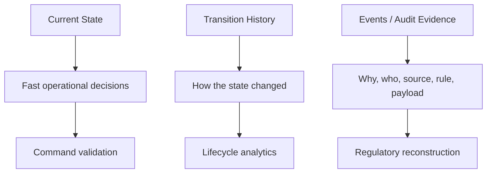
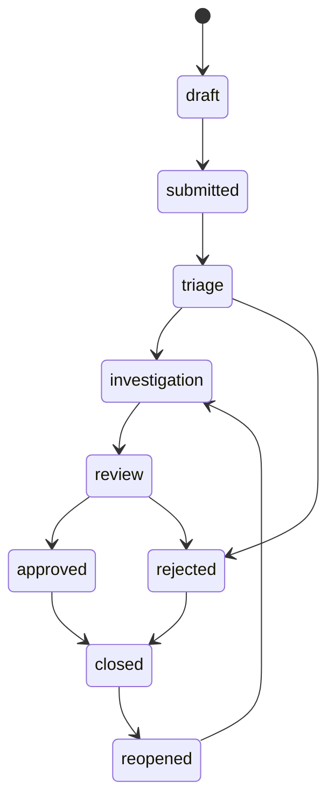
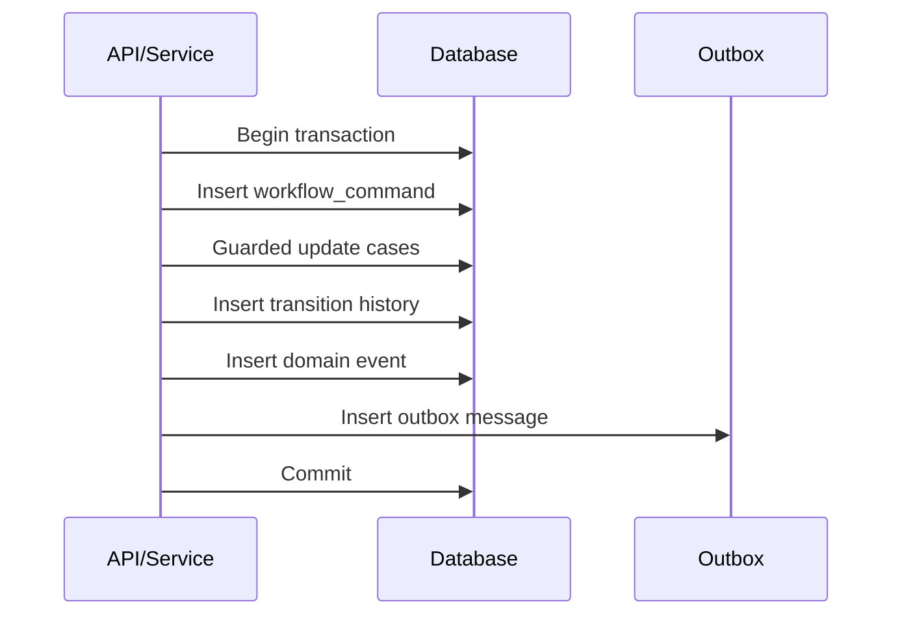

# Part 022 — Modelling Real Business Workflows in SQL

## 1. Why This Part Exists

Many SQL courses stop at orders, customers, and products.

Real enterprise systems are often about workflows:

- case intake,
- verification,
- assignment,
- review,
- escalation,
- approval,
- rejection,
- investigation,
- remediation,
- appeal,
- closure,
- reopening,
- audit,
- reporting,
- statutory deadlines.

These systems fail when workflow state is treated as a simple column:

```sql
status text NOT NULL
```

A status column is not enough to explain:

- how the entity got there,
- who moved it,
- whether the transition was valid,
- whether mandatory review happened,
- whether escalation was required,
- whether SLA was breached,
- what rule version was used,
- what the system believed at the time,
- what should happen next.

A workflow data model must support both operation and reconstruction.

This part teaches how to model workflow truth in SQL.

---

## 2. Kaufman Framing: The Sub-Skill We Are Training

The sub-skill is:

> Given a real business lifecycle, design SQL tables that represent current state, valid transitions, historical events, assignments, approvals, deadlines, and audit evidence without losing operational performance.

You are training to:

- separate current state from historical transitions,
- encode state machines explicitly,
- decide which rules belong in constraints vs application/service logic,
- store approvals as facts, not booleans,
- model assignment and ownership over time,
- model escalation as event plus active condition,
- design deadline/SLA tables,
- support audit reconstruction,
- avoid contradictory lifecycle columns,
- support operational dashboards without corrupting source-of-truth tables.

The Kaufman-style drills are:

1. Draw the lifecycle.
2. List valid transitions.
3. Identify actors and authorizations.
4. Identify current-state queries.
5. Identify reconstruction/audit queries.
6. Identify deadlines and escalation rules.
7. Decide source-of-truth vs projection.
8. Write SQL invariants and assertions.

---

## 3. Mental Model: Workflow Has Three Truth Layers

A robust workflow model usually has at least three layers:



| Layer | Example | Purpose |
|---|---|---|
| Current state | `cases.current_status` | Fast reads and command guards |
| Transition history | `case_status_transitions` | Lifecycle reconstruction |
| Audit/evidence event | `case_events`, `audit_log` | Explain who/why/source/context |

A system can store all three separately, or combine some carefully. But the distinction must be clear.

---

## 4. Core Case Management Schema

We will use a case management domain throughout this part.

```sql
CREATE TABLE cases (
  case_id bigint GENERATED ALWAYS AS IDENTITY PRIMARY KEY,
  case_number text NOT NULL UNIQUE,
  case_type text NOT NULL,
  current_status text NOT NULL,
  priority text NOT NULL,
  created_by_user_id bigint NOT NULL,
  created_at timestamptz NOT NULL DEFAULT now(),
  updated_at timestamptz NOT NULL DEFAULT now(),
  closed_at timestamptz,
  CHECK (priority IN ('low', 'normal', 'high', 'critical')),
  CHECK (closed_at IS NULL OR closed_at >= created_at)
);
```

This table is the current operational header.

It should not try to store everything.

---

## 5. State Machine as Data

A workflow lifecycle is a state machine.



### 5.1 State Catalog

```sql
CREATE TABLE workflow_states (
  workflow_code text NOT NULL,
  state_code text NOT NULL,
  state_name text NOT NULL,
  terminal boolean NOT NULL DEFAULT false,
  active boolean NOT NULL DEFAULT true,
  PRIMARY KEY (workflow_code, state_code)
);
```

### 5.2 Transition Catalog

```sql
CREATE TABLE workflow_transitions (
  workflow_code text NOT NULL,
  from_state text NOT NULL,
  to_state text NOT NULL,
  transition_code text NOT NULL,
  requires_reason boolean NOT NULL DEFAULT false,
  requires_approval boolean NOT NULL DEFAULT false,
  active boolean NOT NULL DEFAULT true,
  PRIMARY KEY (workflow_code, from_state, to_state),
  UNIQUE (workflow_code, transition_code),
  FOREIGN KEY (workflow_code, from_state)
    REFERENCES workflow_states(workflow_code, state_code),
  FOREIGN KEY (workflow_code, to_state)
    REFERENCES workflow_states(workflow_code, state_code)
);
```

Now valid transitions are data, not scattered `if` statements.

### 5.3 Transition History

```sql
CREATE TABLE case_status_transitions (
  transition_id bigint GENERATED ALWAYS AS IDENTITY PRIMARY KEY,
  case_id bigint NOT NULL REFERENCES cases(case_id),
  workflow_code text NOT NULL,
  from_status text,
  to_status text NOT NULL,
  transition_code text NOT NULL,
  changed_by_user_id bigint NOT NULL,
  changed_at timestamptz NOT NULL DEFAULT now(),
  reason_code text,
  comment text,
  request_id text,
  FOREIGN KEY (workflow_code, to_status)
    REFERENCES workflow_states(workflow_code, state_code),
  FOREIGN KEY (workflow_code, transition_code)
    REFERENCES workflow_transitions(workflow_code, transition_code)
);
```

The transition table tells the story.

The `cases.current_status` column tells the current operational fact.

---

## 6. Guarded State Transition

A state transition must be atomic.

Bad:

```sql
SELECT current_status
FROM cases
WHERE case_id = :case_id;

-- application checks status

UPDATE cases
SET current_status = :to_status
WHERE case_id = :case_id;

INSERT INTO case_status_transitions (...);
```

Between select and update, another transaction may change the case.

Better:

```sql
BEGIN;

UPDATE cases
SET current_status = :to_status,
    updated_at = now(),
    closed_at = CASE WHEN :to_status = 'closed' THEN now() ELSE closed_at END
WHERE case_id = :case_id
  AND current_status = :from_status;

-- verify exactly one row updated in application or procedure

INSERT INTO case_status_transitions (
  case_id,
  workflow_code,
  from_status,
  to_status,
  transition_code,
  changed_by_user_id,
  changed_at,
  reason_code,
  comment,
  request_id
)
VALUES (
  :case_id,
  :workflow_code,
  :from_status,
  :to_status,
  :transition_code,
  :actor_user_id,
  now(),
  :reason_code,
  :comment,
  :request_id
);

COMMIT;
```

This pattern protects against lost workflow updates.

### 6.1 Validate Transition Existence

You can validate the transition using `EXISTS`:

```sql
UPDATE cases c
SET current_status = :to_status,
    updated_at = now()
WHERE c.case_id = :case_id
  AND c.current_status = :from_status
  AND EXISTS (
    SELECT 1
    FROM workflow_transitions wt
    WHERE wt.workflow_code = :workflow_code
      AND wt.from_state = :from_status
      AND wt.to_state = :to_status
      AND wt.active = true
  );
```

The database can reject invalid transitions before the history insert.

---

## 7. Idempotent Workflow Commands

Workflow systems often receive retries:

- user double-clicks,
- HTTP timeout,
- message redelivery,
- worker crash after commit,
- external integration retries.

Use command/request idempotency.

```sql
CREATE TABLE workflow_commands (
  command_id text PRIMARY KEY,
  case_id bigint NOT NULL REFERENCES cases(case_id),
  command_type text NOT NULL,
  requested_by_user_id bigint NOT NULL,
  requested_at timestamptz NOT NULL DEFAULT now(),
  completed_at timestamptz,
  result_status text NOT NULL CHECK (result_status IN ('started', 'completed', 'failed'))
);
```

Transition history can reference it:

```sql
ALTER TABLE case_status_transitions
ADD CONSTRAINT ux_case_transition_request UNIQUE (request_id);
```

When the same `request_id` appears again, the system can return the previous result instead of applying the transition twice.

---

## 8. Current State vs Event-Sourced State

There are two common patterns.

### 8.1 Current State + History

```text
cases.current_status is canonical current state.
case_status_transitions records how it changed.
```

Pros:

- fast current reads,
- simpler command validation,
- easier indexing,
- familiar operational model.

Cons:

- must keep current state and transition history consistent,
- requires careful transaction boundaries,
- reconstruction may disagree if bugs occurred.

### 8.2 Event-Sourced State

```text
case_events are canonical.
current state is derived.
```

Pros:

- strong history-first model,
- can rebuild projections,
- captures event intent.

Cons:

- harder ad hoc querying,
- harder invariant checks across event streams,
- projection lag,
- operational complexity,
- schema evolution of events.

### 8.3 Practical Recommendation

For many enterprise SQL systems:

```text
Use current-state tables for operational correctness.
Use append-only history/event tables for audit and reconstruction.
Use projections for read-heavy dashboards.
```

This gives a balanced model.

---

## 9. Audit Trail: What Must Be Captured

An audit trail should answer:

- Who did it?
- What changed?
- From what value to what value?
- When did it happen?
- Through what channel?
- Under what authorization?
- Which request/command caused it?
- Which rule/version was applied?
- Was it automated or manual?
- What evidence supported the decision?

A minimal audit table:

```sql
CREATE TABLE audit_log (
  audit_id bigint GENERATED ALWAYS AS IDENTITY PRIMARY KEY,
  entity_type text NOT NULL,
  entity_id text NOT NULL,
  action_code text NOT NULL,
  actor_user_id bigint,
  actor_type text NOT NULL CHECK (actor_type IN ('user', 'system', 'integration')),
  occurred_at timestamptz NOT NULL DEFAULT now(),
  request_id text,
  source_ip inet,
  user_agent text,
  before_data jsonb,
  after_data jsonb,
  metadata jsonb NOT NULL DEFAULT '{}'
);
```

This is generic and flexible, but it should not replace domain-specific transition tables.

Use both when needed:

- domain table for queryable lifecycle truth,
- audit table for broad forensic trail.

---

## 10. Domain Events vs Audit Log

They are not the same.

| Aspect | Domain event | Audit log |
|---|---|---|
| Meaning | Business-significant fact | Record of change/action |
| Consumer | Domain/integration/projection | Compliance/support/security |
| Structure | Typed and meaningful | Often generic |
| Example | `CaseEscalated` | `UPDATE cases set current_status` |
| Rebuild projections? | Usually yes | Usually not ideal |
| Legal/forensic value | Sometimes | Usually yes |

Example domain event:

```sql
CREATE TABLE case_events (
  case_event_id bigint GENERATED ALWAYS AS IDENTITY PRIMARY KEY,
  case_id bigint NOT NULL REFERENCES cases(case_id),
  event_type text NOT NULL,
  occurred_at timestamptz NOT NULL DEFAULT now(),
  actor_user_id bigint,
  payload jsonb NOT NULL,
  request_id text,
  UNIQUE (request_id)
);
```

Example payload:

```json
{
  "fromStatus": "triage",
  "toStatus": "investigation",
  "reasonCode": "risk_threshold_exceeded",
  "ruleVersion": "risk-rules-2026-06-01"
}
```

This payload should not hide facts that require frequent relational filtering. If `toStatus`, `reasonCode`, or `ruleVersion` are core query dimensions, store them as columns too.

---

## 11. Approval Modelling

Avoid approval booleans on the case row.

Bad:

```sql
ALTER TABLE cases
ADD COLUMN approved boolean NOT NULL DEFAULT false,
ADD COLUMN approved_by_user_id bigint,
ADD COLUMN approved_at timestamptz;
```

This supports only one approval and cannot model rejection, multi-step approval, delegated approval, quorum, or re-approval.

Better:

```sql
CREATE TABLE approval_requests (
  approval_request_id bigint GENERATED ALWAYS AS IDENTITY PRIMARY KEY,
  case_id bigint NOT NULL REFERENCES cases(case_id),
  approval_type text NOT NULL,
  requested_by_user_id bigint NOT NULL,
  requested_at timestamptz NOT NULL DEFAULT now(),
  status text NOT NULL CHECK (status IN ('pending', 'approved', 'rejected', 'cancelled')),
  decided_at timestamptz
);

CREATE TABLE approval_decisions (
  approval_decision_id bigint GENERATED ALWAYS AS IDENTITY PRIMARY KEY,
  approval_request_id bigint NOT NULL REFERENCES approval_requests(approval_request_id),
  approver_user_id bigint NOT NULL,
  decision text NOT NULL CHECK (decision IN ('approved', 'rejected')),
  decided_at timestamptz NOT NULL DEFAULT now(),
  reason_code text,
  comment text,
  UNIQUE (approval_request_id, approver_user_id)
);
```

### 11.1 Approval Invariant

Possible invariant:

```text
A pending approval request can have at most one decision per approver.
```

Already enforced by:

```sql
UNIQUE (approval_request_id, approver_user_id)
```

Another invariant:

```text
A case cannot move from review to approved unless its approval request is approved.
```

This may require transactional command logic:

```sql
UPDATE cases c
SET current_status = 'approved',
    updated_at = now()
WHERE c.case_id = :case_id
  AND c.current_status = 'review'
  AND EXISTS (
    SELECT 1
    FROM approval_requests ar
    WHERE ar.case_id = c.case_id
      AND ar.approval_type = 'final_review'
      AND ar.status = 'approved'
  );
```

---

## 12. Assignment and Ownership Over Time

Assignment is not just `assigned_to_user_id`.

You may need:

- current owner,
- previous owner,
- assignment reason,
- assignment source,
- assignment duration,
- team assignment,
- reviewer assignment,
- temporary delegation,
- workload balancing,
- auditability.

Model assignment as temporal fact:

```sql
CREATE TABLE case_assignments (
  case_assignment_id bigint GENERATED ALWAYS AS IDENTITY PRIMARY KEY,
  case_id bigint NOT NULL REFERENCES cases(case_id),
  assignee_type text NOT NULL CHECK (assignee_type IN ('user', 'team')),
  assignee_id bigint NOT NULL,
  assignment_role text NOT NULL CHECK (assignment_role IN ('primary_owner', 'reviewer', 'observer')),
  assigned_by_user_id bigint NOT NULL,
  assigned_at timestamptz NOT NULL DEFAULT now(),
  released_at timestamptz,
  reason_code text,
  CHECK (released_at IS NULL OR released_at > assigned_at)
);
```

### 12.1 One Active Primary Owner

PostgreSQL-style partial unique index:

```sql
CREATE UNIQUE INDEX ux_case_one_active_primary_owner
ON case_assignments (case_id)
WHERE assignment_role = 'primary_owner'
  AND released_at IS NULL;
```

If your database does not support partial unique indexes, alternatives include:

- generated active flag with unique constraint,
- separate `case_current_assignments` table,
- trigger-enforced invariant,
- application command with serializable isolation,
- filtered index in engines that support it.

### 12.2 Current Assignment Query

```sql
SELECT ca.case_id, ca.assignee_type, ca.assignee_id
FROM case_assignments ca
WHERE ca.assignment_role = 'primary_owner'
  AND ca.released_at IS NULL;
```

### 12.3 Assignment History Query

```sql
SELECT case_id,
       assignee_type,
       assignee_id,
       assigned_at,
       released_at,
       released_at - assigned_at AS assignment_duration
FROM case_assignments
WHERE case_id = :case_id
ORDER BY assigned_at;
```

---

## 13. Escalation Modelling

Escalation is often mis-modelled as a boolean.

Bad:

```sql
is_escalated boolean NOT NULL DEFAULT false
```

This cannot answer:

- why escalated?
- who escalated?
- when?
- from which level to which level?
- was it automatic?
- was it resolved?
- did it happen multiple times?

Better:

```sql
CREATE TABLE case_escalations (
  escalation_id bigint GENERATED ALWAYS AS IDENTITY PRIMARY KEY,
  case_id bigint NOT NULL REFERENCES cases(case_id),
  escalation_level text NOT NULL,
  escalated_at timestamptz NOT NULL DEFAULT now(),
  escalated_by_user_id bigint,
  escalation_source text NOT NULL CHECK (escalation_source IN ('manual', 'sla', 'risk_rule', 'system')),
  reason_code text NOT NULL,
  resolved_at timestamptz,
  resolved_by_user_id bigint,
  resolution_comment text,
  CHECK (resolved_at IS NULL OR resolved_at >= escalated_at)
);
```

### 13.1 One Active Escalation Per Level

```sql
CREATE UNIQUE INDEX ux_case_active_escalation_level
ON case_escalations (case_id, escalation_level)
WHERE resolved_at IS NULL;
```

### 13.2 Active Escalation Query

```sql
SELECT case_id, escalation_level, escalated_at, reason_code
FROM case_escalations
WHERE resolved_at IS NULL;
```

---

## 14. Deadline and SLA Modelling

Deadlines are facts.

They should not be hidden inside application timers.

```sql
CREATE TABLE case_deadlines (
  deadline_id bigint GENERATED ALWAYS AS IDENTITY PRIMARY KEY,
  case_id bigint NOT NULL REFERENCES cases(case_id),
  deadline_type text NOT NULL,
  due_at timestamptz NOT NULL,
  source_rule_code text,
  source_rule_version text,
  created_at timestamptz NOT NULL DEFAULT now(),
  satisfied_at timestamptz,
  cancelled_at timestamptz,
  CHECK (satisfied_at IS NULL OR satisfied_at >= created_at),
  CHECK (cancelled_at IS NULL OR cancelled_at >= created_at),
  CHECK (NOT (satisfied_at IS NOT NULL AND cancelled_at IS NOT NULL))
);
```

### 14.1 Open Deadline Query

```sql
SELECT d.case_id, d.deadline_type, d.due_at
FROM case_deadlines d
WHERE d.satisfied_at IS NULL
  AND d.cancelled_at IS NULL
ORDER BY d.due_at;
```

### 14.2 Breach Query

```sql
SELECT d.case_id,
       d.deadline_type,
       d.due_at,
       now() - d.due_at AS overdue_by
FROM case_deadlines d
WHERE d.satisfied_at IS NULL
  AND d.cancelled_at IS NULL
  AND d.due_at < now();
```

### 14.3 Deadline Rule Versioning

Store the rule version that created the deadline.

Why?

Because future policy changes should not rewrite history.

```text
This deadline was calculated under rule version SLA-2026-04.
```

That is defensible.

---

## 15. Tasks and Work Items

Workflow systems often need human work queues.

A task is not the same as case status.

```sql
CREATE TABLE work_items (
  work_item_id bigint GENERATED ALWAYS AS IDENTITY PRIMARY KEY,
  case_id bigint NOT NULL REFERENCES cases(case_id),
  work_type text NOT NULL,
  status text NOT NULL CHECK (status IN ('open', 'claimed', 'completed', 'cancelled')),
  priority text NOT NULL CHECK (priority IN ('low', 'normal', 'high', 'critical')),
  available_at timestamptz NOT NULL DEFAULT now(),
  claimed_by_user_id bigint,
  claimed_at timestamptz,
  completed_at timestamptz,
  created_at timestamptz NOT NULL DEFAULT now(),
  CHECK (completed_at IS NULL OR completed_at >= created_at)
);
```

### 15.1 Claim Work Safely

```sql
UPDATE work_items
SET status = 'claimed',
    claimed_by_user_id = :user_id,
    claimed_at = now()
WHERE work_item_id = (
  SELECT work_item_id
  FROM work_items
  WHERE status = 'open'
    AND available_at <= now()
  ORDER BY priority DESC, available_at, work_item_id
  FOR UPDATE SKIP LOCKED
  LIMIT 1
)
RETURNING work_item_id, case_id, work_type;
```

This combines queue semantics with row locking.

The exact syntax varies by engine, but the pattern is:

```text
Find one eligible row.
Lock it.
Mark it claimed.
Return it.
```

---

## 16. Workflow and Authorization

Workflow transitions usually depend on actor role.

Bad:

```text
Application checks role somewhere before update.
```

Better model:

```sql
CREATE TABLE workflow_transition_permissions (
  workflow_code text NOT NULL,
  transition_code text NOT NULL,
  role_code text NOT NULL,
  PRIMARY KEY (workflow_code, transition_code, role_code),
  FOREIGN KEY (workflow_code, transition_code)
    REFERENCES workflow_transitions(workflow_code, transition_code)
);
```

Then command logic can verify:

```sql
SELECT 1
FROM workflow_transition_permissions wtp
JOIN user_roles ur ON ur.role_code = wtp.role_code
WHERE wtp.workflow_code = :workflow_code
  AND wtp.transition_code = :transition_code
  AND ur.user_id = :actor_user_id;
```

This does not mean all authorization must live in SQL. It means the data model can represent permissions explicitly enough to audit and test them.

---

## 17. Workflow Rule Modelling

Rules change.

Hardcoding every rule into schema constraints makes change hard.

But hiding every rule in application code makes audit hard.

A balanced approach:

```sql
CREATE TABLE workflow_rules (
  rule_id bigint GENERATED ALWAYS AS IDENTITY PRIMARY KEY,
  workflow_code text NOT NULL,
  rule_code text NOT NULL,
  rule_version text NOT NULL,
  active_from timestamptz NOT NULL,
  active_to timestamptz,
  rule_description text NOT NULL,
  rule_config jsonb NOT NULL,
  UNIQUE (workflow_code, rule_code, rule_version),
  CHECK (active_to IS NULL OR active_to > active_from)
);
```

When a rule affects a decision, copy the rule version into the decision/event/deadline.

```sql
ALTER TABLE case_deadlines
ADD COLUMN calculation_rule_id bigint REFERENCES workflow_rules(rule_id);
```

This supports reconstruction:

```text
At the time, the system applied rule X version Y.
```

---

## 18. Lifecycle Analytics

A good workflow schema supports analytics without guessing.

### 18.1 Time in Each Status

```sql
WITH ordered AS (
  SELECT case_id,
         to_status AS status,
         changed_at AS entered_at,
         LEAD(changed_at) OVER (
           PARTITION BY case_id
           ORDER BY changed_at, transition_id
         ) AS exited_at
  FROM case_status_transitions
)
SELECT status,
       AVG(COALESCE(exited_at, now()) - entered_at) AS avg_time_in_status
FROM ordered
GROUP BY status;
```

### 18.2 Cases Stuck in Status

```sql
SELECT c.case_id,
       c.case_number,
       c.current_status,
       MAX(t.changed_at) AS entered_status_at,
       now() - MAX(t.changed_at) AS time_in_status
FROM cases c
JOIN case_status_transitions t
  ON t.case_id = c.case_id
 AND t.to_status = c.current_status
WHERE c.current_status NOT IN ('closed', 'rejected')
GROUP BY c.case_id, c.case_number, c.current_status
HAVING now() - MAX(t.changed_at) > interval '7 days';
```

### 18.3 Reopened Cases

```sql
SELECT case_id, COUNT(*) AS reopen_count
FROM case_status_transitions
WHERE to_status = 'reopened'
GROUP BY case_id
HAVING COUNT(*) > 0;
```

The schema makes these queries natural.

---

## 19. Reconstructing Past Truth

A defensible system must answer:

```text
What did we know at time T?
```

For workflow, this includes:

- case current status at time T,
- active assignment at time T,
- open deadlines at time T,
- active escalation at time T,
- approval state at time T,
- rule version used at time T.

### 19.1 Status at Time T

```sql
SELECT t.case_id, t.to_status AS status_at_t
FROM case_status_transitions t
WHERE t.case_id = :case_id
  AND t.changed_at <= :as_of
ORDER BY t.changed_at DESC, t.transition_id DESC
LIMIT 1;
```

### 19.2 Owner at Time T

```sql
SELECT ca.case_id, ca.assignee_id
FROM case_assignments ca
WHERE ca.case_id = :case_id
  AND ca.assignment_role = 'primary_owner'
  AND ca.assigned_at <= :as_of
  AND (ca.released_at IS NULL OR ca.released_at > :as_of)
ORDER BY ca.assigned_at DESC
LIMIT 1;
```

### 19.3 Open Deadlines at Time T

```sql
SELECT deadline_id, deadline_type, due_at
FROM case_deadlines
WHERE case_id = :case_id
  AND created_at <= :as_of
  AND (satisfied_at IS NULL OR satisfied_at > :as_of)
  AND (cancelled_at IS NULL OR cancelled_at > :as_of);
```

If your schema cannot answer these questions, it may be operationally useful but not defensible.

---

## 20. Avoiding Contradictory Lifecycle Columns

Bad:

```sql
CREATE TABLE cases_bad (
  case_id bigint PRIMARY KEY,
  status text NOT NULL,
  is_submitted boolean NOT NULL,
  is_in_review boolean NOT NULL,
  is_approved boolean NOT NULL,
  is_rejected boolean NOT NULL,
  is_closed boolean NOT NULL,
  submitted_at timestamptz,
  approved_at timestamptz,
  rejected_at timestamptz,
  closed_at timestamptz
);
```

This allows impossible combinations:

```text
status = 'approved'
is_rejected = true
closed_at is null
rejected_at is not null
```

Better:

- one current status,
- transition history,
- derived milestone timestamps when needed,
- constraints for terminal states.

```sql
CREATE TABLE case_milestones (
  case_id bigint NOT NULL REFERENCES cases(case_id),
  milestone_code text NOT NULL,
  achieved_at timestamptz NOT NULL,
  transition_id bigint REFERENCES case_status_transitions(transition_id),
  PRIMARY KEY (case_id, milestone_code)
);
```

Milestones can be derived or stored if they are frequently needed.

---

## 21. Workflow Projection for Dashboard

Source-of-truth workflow tables are normalized.

Dashboards need fast filtering.

Create a projection:

```sql
CREATE TABLE case_work_queue_view (
  case_id bigint PRIMARY KEY,
  case_number text NOT NULL,
  current_status text NOT NULL,
  priority text NOT NULL,
  primary_owner_user_id bigint,
  primary_owner_name text,
  active_escalation_level text,
  next_deadline_at timestamptz,
  breached_deadline_count integer NOT NULL DEFAULT 0,
  open_work_item_count integer NOT NULL DEFAULT 0,
  last_transition_at timestamptz,
  refreshed_at timestamptz NOT NULL
);
```

This is a read model.

Rules:

- never update it as the source of truth,
- always store `refreshed_at`,
- make it rebuildable,
- reconcile it against source tables,
- design indexes for dashboard filters.

Example index:

```sql
CREATE INDEX ix_case_work_queue_status_owner_deadline
ON case_work_queue_view (current_status, primary_owner_user_id, next_deadline_at);
```

---

## 22. Reconciliation Queries

Every projection needs reconciliation.

### 22.1 Current Status Drift

```sql
WITH last_transition AS (
  SELECT DISTINCT ON (case_id)
         case_id,
         to_status,
         changed_at
  FROM case_status_transitions
  ORDER BY case_id, changed_at DESC, transition_id DESC
)
SELECT c.case_id,
       c.current_status,
       lt.to_status AS expected_status
FROM cases c
JOIN last_transition lt ON lt.case_id = c.case_id
WHERE c.current_status <> lt.to_status;
```

For engines without `DISTINCT ON`, use `ROW_NUMBER()`.

### 22.2 Dashboard Owner Drift

```sql
WITH current_owner AS (
  SELECT case_id, assignee_id AS expected_owner_user_id
  FROM case_assignments
  WHERE assignment_role = 'primary_owner'
    AND released_at IS NULL
)
SELECT q.case_id,
       q.primary_owner_user_id,
       co.expected_owner_user_id
FROM case_work_queue_view q
LEFT JOIN current_owner co ON co.case_id = q.case_id
WHERE q.primary_owner_user_id IS DISTINCT FROM co.expected_owner_user_id;
```

### 22.3 Deadline Count Drift

```sql
WITH expected AS (
  SELECT case_id, COUNT(*) AS breached_count
  FROM case_deadlines
  WHERE satisfied_at IS NULL
    AND cancelled_at IS NULL
    AND due_at < now()
  GROUP BY case_id
)
SELECT q.case_id,
       q.breached_deadline_count,
       COALESCE(e.breached_count, 0) AS expected_count
FROM case_work_queue_view q
LEFT JOIN expected e ON e.case_id = q.case_id
WHERE q.breached_deadline_count <> COALESCE(e.breached_count, 0);
```

---

## 23. Workflow Command Pattern

A command changes workflow state.

Treat it as a unit-of-work.



Schema:

```sql
CREATE TABLE outbox_messages (
  outbox_message_id bigint GENERATED ALWAYS AS IDENTITY PRIMARY KEY,
  aggregate_type text NOT NULL,
  aggregate_id text NOT NULL,
  event_type text NOT NULL,
  payload jsonb NOT NULL,
  created_at timestamptz NOT NULL DEFAULT now(),
  published_at timestamptz,
  request_id text,
  UNIQUE (request_id, event_type)
);
```

This prevents the classic failure:

```text
Database commit succeeded, but message publish failed.
```

With outbox, message publication becomes retryable after commit.

---

## 24. Trigger vs Application Logic

Should workflow invariants be enforced by triggers?

Use a decision table.

| Rule type | Good fit for constraint? | Good fit for trigger? | Good fit for service logic? |
|---|---:|---:|---:|
| Simple row invariant | Yes | Rarely | Maybe |
| Cross-row uniqueness | Index/constraint | Sometimes | Maybe |
| Transition allowed by state catalog | Maybe | Maybe | Yes |
| Authorization by actor role | Rarely | Rarely | Yes |
| External system check | No | No | Yes |
| Audit row insertion | Maybe | Yes | Yes |
| Derived projection refresh | Maybe | Maybe | Async worker often better |
| Deadline calculation | Rarely | Sometimes | Yes |

Triggers can protect invariants from all write paths, but they also hide behaviour.

Use triggers when:

- many clients write to the same tables,
- invariant must be impossible to bypass,
- trigger logic is simple and deterministic,
- operational team can debug it.

Avoid triggers when:

- logic depends on external systems,
- logic is complex workflow orchestration,
- error handling needs domain-specific response,
- performance impact is unpredictable,
- developers cannot see side effects.

---

## 25. Workflow Index Design

Workflows usually need these access paths.

### 25.1 Current Work Queue

```sql
CREATE INDEX ix_cases_status_priority_updated
ON cases (current_status, priority, updated_at);
```

### 25.2 Case Timeline

```sql
CREATE INDEX ix_case_transitions_case_time
ON case_status_transitions (case_id, changed_at, transition_id);
```

### 25.3 User Assignments

```sql
CREATE INDEX ix_case_assignments_active_assignee
ON case_assignments (assignee_type, assignee_id, assignment_role, case_id)
WHERE released_at IS NULL;
```

### 25.4 Deadline Queue

```sql
CREATE INDEX ix_case_deadlines_open_due
ON case_deadlines (due_at, case_id)
WHERE satisfied_at IS NULL
  AND cancelled_at IS NULL;
```

### 25.5 Outbox Publisher

```sql
CREATE INDEX ix_outbox_unpublished
ON outbox_messages (created_at, outbox_message_id)
WHERE published_at IS NULL;
```

Index design follows workflow queries, not table names.

---

## 26. Workflow Failure Modes

### 26.1 Status Updated Without History

Cause:

- manual SQL update,
- migration script,
- application bug,
- missing transaction.

Detection:

```sql
SELECT c.case_id
FROM cases c
LEFT JOIN case_status_transitions t
  ON t.case_id = c.case_id
 AND t.to_status = c.current_status
WHERE t.transition_id IS NULL;
```

### 26.2 History Exists Without Current State

Cause:

- insert transition committed but current update failed,
- replay bug,
- partial restore.

Detection: compare current state with last transition.

### 26.3 Double Active Owner

Cause:

- missing partial unique index,
- race condition,
- soft-release bug.

Detection:

```sql
SELECT case_id, COUNT(*)
FROM case_assignments
WHERE assignment_role = 'primary_owner'
  AND released_at IS NULL
GROUP BY case_id
HAVING COUNT(*) > 1;
```

### 26.4 Deadline Breach Not Escalated

```sql
SELECT d.case_id, d.deadline_id
FROM case_deadlines d
LEFT JOIN case_escalations e
  ON e.case_id = d.case_id
 AND e.escalation_source = 'sla'
 AND e.resolved_at IS NULL
WHERE d.satisfied_at IS NULL
  AND d.cancelled_at IS NULL
  AND d.due_at < now()
  AND e.escalation_id IS NULL;
```

### 26.5 Projection Drift

Use reconciliation queries from section 22.

---

## 27. Defensible Workflow Design

A defensible workflow system can explain itself.

For every consequential decision, capture:

- entity id,
- actor,
- authority/role,
- input facts,
- rule version,
- decision,
- timestamp,
- prior state,
- resulting state,
- reason/comment,
- request id,
- external references.

Example decision table:

```sql
CREATE TABLE case_decisions (
  decision_id bigint GENERATED ALWAYS AS IDENTITY PRIMARY KEY,
  case_id bigint NOT NULL REFERENCES cases(case_id),
  decision_type text NOT NULL,
  decision_outcome text NOT NULL,
  decided_by_user_id bigint,
  decided_at timestamptz NOT NULL DEFAULT now(),
  authority_role_code text,
  rule_code text,
  rule_version text,
  evidence_summary text,
  reason_code text,
  comment text,
  request_id text UNIQUE
);
```

This table is different from transition history.

A decision may cause a transition, but not every transition is a decision.

---

## 28. End-to-End Example: Escalate a Case

Business rule:

```text
If a high-priority case remains in triage for more than 48 hours, escalate it to level_1 and create a review work item.
```

### 28.1 Find Eligible Cases

```sql
WITH triage_entry AS (
  SELECT case_id, MAX(changed_at) AS entered_triage_at
  FROM case_status_transitions
  WHERE to_status = 'triage'
  GROUP BY case_id
)
SELECT c.case_id
FROM cases c
JOIN triage_entry te ON te.case_id = c.case_id
LEFT JOIN case_escalations e
  ON e.case_id = c.case_id
 AND e.escalation_level = 'level_1'
 AND e.resolved_at IS NULL
WHERE c.current_status = 'triage'
  AND c.priority IN ('high', 'critical')
  AND te.entered_triage_at < now() - interval '48 hours'
  AND e.escalation_id IS NULL;
```

### 28.2 Apply Escalation Transaction

```sql
BEGIN;

INSERT INTO case_escalations (
  case_id,
  escalation_level,
  escalation_source,
  reason_code,
  escalated_at
)
VALUES (
  :case_id,
  'level_1',
  'sla',
  'triage_over_48h',
  now()
);

INSERT INTO work_items (
  case_id,
  work_type,
  status,
  priority,
  available_at
)
VALUES (
  :case_id,
  'escalation_review',
  'open',
  'high',
  now()
);

INSERT INTO case_events (
  case_id,
  event_type,
  occurred_at,
  payload
)
VALUES (
  :case_id,
  'CaseEscalated',
  now(),
  jsonb_build_object(
    'level', 'level_1',
    'source', 'sla',
    'reasonCode', 'triage_over_48h'
  )
);

INSERT INTO outbox_messages (
  aggregate_type,
  aggregate_id,
  event_type,
  payload
)
VALUES (
  'case',
  CAST(:case_id AS text),
  'CaseEscalated',
  jsonb_build_object('caseId', :case_id, 'level', 'level_1')
);

COMMIT;
```

### 28.3 Required Invariant

The unique index on active escalation prevents duplicate escalation if two workers race.

```sql
CREATE UNIQUE INDEX ux_case_active_escalation_level
ON case_escalations (case_id, escalation_level)
WHERE resolved_at IS NULL;
```

The database becomes the final concurrency guard.

---

## 29. Production Checklist

For each workflow entity:

- Is current state stored explicitly?
- Is transition history stored append-only?
- Are valid transitions represented?
- Are invalid transitions rejected atomically?
- Is there idempotency for commands?
- Can the system reconstruct status at time T?
- Can it reconstruct assignment at time T?
- Can it explain approvals and decisions?
- Are deadlines stored as facts?
- Are escalations modelled as lifecycle records, not booleans?
- Are work queues claim-safe under concurrency?
- Are read models clearly separated from source-of-truth tables?
- Are projections rebuildable?
- Are reconciliation queries defined?
- Are rule versions captured for consequential decisions?
- Are indexes aligned with operational queues and timelines?
- Can manual data fixes be audited?

---

## 30. Drills

### Drill 1: Design a Complaint Workflow

States:

```text
received -> validated -> assigned -> investigation -> resolution_proposed -> approved -> closed
received -> rejected -> closed
closed -> reopened -> investigation
```

Create:

1. state table,
2. transition table,
3. complaint table,
4. transition history table,
5. approval request table,
6. assignment table,
7. deadline table.

### Drill 2: Write a Safe Transition

Write a transaction that moves a complaint from `investigation` to `resolution_proposed` only if:

- current status is `investigation`,
- actor is assigned primary owner,
- no open critical deadline is breached,
- request id has not been processed.

### Drill 3: Detect Drift

Write reconciliation queries for:

- current status vs last transition,
- active owner count,
- open deadline count in dashboard projection,
- approval request status vs decisions.

### Drill 4: Reconstruct Past Truth

For a case id and timestamp, return:

- status at time T,
- primary owner at time T,
- active escalations at time T,
- open deadlines at time T,
- last decision before time T.

---

## 31. Summary

Workflow data modelling is where SQL becomes enterprise systems engineering.

A robust model separates:

```text
current state
transition history
domain events
audit evidence
assignments
deadlines
approvals
escalations
work items
read projections
```

The central rule:

```text
Operational state must be fast to read.
Historical truth must be reconstructable.
Consequential decisions must be explainable.
Concurrency must be guarded by the database.
```

A status column is useful, but it is not a workflow model.

A defensible workflow model can answer both:

```text
What should the system do next?
```

and:

```text
Why did the system do what it did then?
```

Part 023 continues this direction with temporal SQL, history, auditability, valid time, transaction time, bitemporal modelling, and reconstructing past truth at a deeper level.

---

## References

- PostgreSQL Documentation, Constraints — https://www.postgresql.org/docs/current/ddl-constraints.html
- PostgreSQL Documentation, Partial Indexes — https://www.postgresql.org/docs/current/indexes-partial.html
- PostgreSQL Documentation, Explicit Locking — https://www.postgresql.org/docs/current/explicit-locking.html
- PostgreSQL Documentation, `SELECT` and locking clauses — https://www.postgresql.org/docs/current/sql-select.html
- Martin Fowler, Domain Event — https://martinfowler.com/eaaDev/DomainEvent.html
- Martin Fowler, Transaction Script — https://martinfowler.com/eaaCatalog/transactionScript.html
